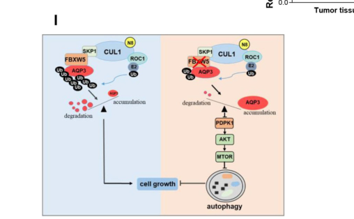

## Question

# Gene Research for Functional Annotation

## ⚠️ CRITICAL: Gene/Protein Identification Context

**BEFORE YOU BEGIN RESEARCH:** You MUST verify you are researching the CORRECT gene/protein. Gene symbols can be ambiguous, especially for less well-characterized genes from non-model organisms.

### Target Gene/Protein Identity (from UniProt):
- **UniProt Accession:** Q969U6
- **Protein Description:** RecName: Full=F-box/WD repeat-containing protein 5; AltName: Full=F-box and WD-40 domain-containing protein 5;
- **Gene Information:** Name=FBXW5; Synonyms=FBW5; ORFNames=PP3971;
- **Organism (full):** Homo sapiens (Human).
- **Protein Family:** Belongs to the FBXW5 family. .
- **Key Domains:** F-box-like_dom_sf. (IPR036047); F-box_dom. (IPR001810); FBXW5. (IPR042508); WD40/YVTN_repeat-like_dom_sf. (IPR015943); WD40_repeat_dom_sf. (IPR036322)

### MANDATORY VERIFICATION STEPS:

1. **Check if the gene symbol "FBXW5" matches the protein description above**
2. **Verify the organism is correct:** Homo sapiens (Human).
3. **Check if protein family/domains align with what you find in literature**
4. **If you find literature for a DIFFERENT gene with the same or similar symbol, STOP**

### If Gene Symbol is Ambiguous or You Cannot Find Relevant Literature:

**DO NOT PROCEED WITH RESEARCH ON A DIFFERENT GENE.** Instead:
- State clearly: "The gene symbol 'FBXW5' is ambiguous or literature is limited for this specific protein"
- Explain what you found (e.g., "Found extensive literature on a different gene with the same symbol in a different organism")
- Describe the protein based ONLY on the UniProt information provided above
- Suggest that the protein function can be inferred from domain/family information

### Research Target:

Please provide a comprehensive research report on the gene **FBXW5** (gene ID: FBXW5, UniProt: Q969U6) in human.

The research report should be a detailed narrative explaining the function, biological processes, and localization of the gene product. Citations should be given for all claims.

You should prioritize authoritative reviews and primary scientific literature when conducting research. You can supplement
this with annotations you find in gene/protein databases, but these can be outdated or inaccurate.

We are specifically interested in the primary function of the gene - for enzymes, what reaction is catalyzed, and what is the substrate specificity? For transporters, what is the substrate? For structural proteins or adapters, what is the broader structural role? For signaling molecules, what is the role in the pathway.

We are interested in where in or outside the cell the gene product carries out its function.

We are also interested in the signaling or biochemical pathways in which the gene functions. We are less interested in broad pleiotropic effects, except where these elucidate the precise role.

Include evidence where possible. We are interested in both experimental evidence as well as inference from structure, evolution, or bioinformatic analysis. Precise studies should be prioritized over high-throughput, where available.

## Output

Question: You are an expert researcher providing comprehensive, well-cited information.

Provide detailed information focusing on:
1. Key concepts and definitions with current understanding
2. Recent developments and latest research (prioritize 2023-2024 sources)
3. Current applications and real-world implementations
4. Expert opinions and analysis from authoritative sources
5. Relevant statistics and data from recent studies

Format as a comprehensive research report with proper citations. Include URLs and publication dates where available.
Always prioritize recent, authoritative sources and provide specific citations for all major claims.

# Gene Research for Functional Annotation

## ⚠️ CRITICAL: Gene/Protein Identification Context

**BEFORE YOU BEGIN RESEARCH:** You MUST verify you are researching the CORRECT gene/protein. Gene symbols can be ambiguous, especially for less well-characterized genes from non-model organisms.

### Target Gene/Protein Identity (from UniProt):
- **UniProt Accession:** Q969U6
- **Protein Description:** RecName: Full=F-box/WD repeat-containing protein 5; AltName: Full=F-box and WD-40 domain-containing protein 5;
- **Gene Information:** Name=FBXW5; Synonyms=FBW5; ORFNames=PP3971;
- **Organism (full):** Homo sapiens (Human).
- **Protein Family:** Belongs to the FBXW5 family. .
- **Key Domains:** F-box-like_dom_sf. (IPR036047); F-box_dom. (IPR001810); FBXW5. (IPR042508); WD40/YVTN_repeat-like_dom_sf. (IPR015943); WD40_repeat_dom_sf. (IPR036322)

### MANDATORY VERIFICATION STEPS:

1. **Check if the gene symbol "FBXW5" matches the protein description above**
2. **Verify the organism is correct:** Homo sapiens (Human).
3. **Check if protein family/domains align with what you find in literature**
4. **If you find literature for a DIFFERENT gene with the same or similar symbol, STOP**

### If Gene Symbol is Ambiguous or You Cannot Find Relevant Literature:

**DO NOT PROCEED WITH RESEARCH ON A DIFFERENT GENE.** Instead:
- State clearly: "The gene symbol 'FBXW5' is ambiguous or literature is limited for this specific protein"
- Explain what you found (e.g., "Found extensive literature on a different gene with the same symbol in a different organism")
- Describe the protein based ONLY on the UniProt information provided above
- Suggest that the protein function can be inferred from domain/family information

### Research Target:

Please provide a comprehensive research report on the gene **FBXW5** (gene ID: FBXW5, UniProt: Q969U6) in human.

The research report should be a detailed narrative explaining the function, biological processes, and localization of the gene product. Citations should be given for all claims.

You should prioritize authoritative reviews and primary scientific literature when conducting research. You can supplement
this with annotations you find in gene/protein databases, but these can be outdated or inaccurate.

We are specifically interested in the primary function of the gene - for enzymes, what reaction is catalyzed, and what is the substrate specificity? For transporters, what is the substrate? For structural proteins or adapters, what is the broader structural role? For signaling molecules, what is the role in the pathway.

We are interested in where in or outside the cell the gene product carries out its function.

We are also interested in the signaling or biochemical pathways in which the gene functions. We are less interested in broad pleiotropic effects, except where these elucidate the precise role.

Include evidence where possible. We are interested in both experimental evidence as well as inference from structure, evolution, or bioinformatic analysis. Precise studies should be prioritized over high-throughput, where available.

# Research Report: Human FBXW5 (UniProt Q969U6) — Functional Annotation, Mechanisms, and Translational Context

## 1. Gene/protein identity verification (mandatory)

**Target confirmed:** The retrieved primary literature consistently describes **human FBXW5** as “F-box/WD repeat-containing protein 5” (FBXW5; also FBW5), a **566-aa** protein containing an **N-terminal F-box motif** and **seven WD40 repeats** that mediate substrate binding. This domain architecture and family assignment match the UniProt-provided target identity (Q969U6). (kim2013crl4afbxw5–mediateddegradationof pages 3-4, yao2022thee3ubiquitin pages 2-4, jian2007cellcycleand pages 91-97)

**Complex usage consistent with domains:** Evidence supports FBXW5 acting as a substrate receptor in **two distinct Cullin-RING ligase (CRL) contexts**: (i) **SCF-type ligases** (CUL1–SKP1–RBX1–FBXW5) via its F-box (canonical for F-box proteins), and (ii) **CRL4A-type ligases** (CUL4A–DDB1–FBXW5) via WD40/DWD motifs that bind DDB1. (schweiggert2021scffbxw5targetskinesin‐13 pages 1-2, kim2013crl4afbxw5–mediateddegradationof pages 3-4, jian2007cellcycleand pages 91-97)

## 2. Key concepts and current understanding

### 2.1 What FBXW5 is (definitions)

**F-box proteins** are substrate-recognition adaptors for multi-subunit CRL E3 ubiquitin ligases; they recruit specific substrates to the core E3 machinery, enabling ubiquitin transfer from E2 enzymes onto the substrate. FBXW family members are defined by **WD40 repeats**, which typically serve as protein–protein interaction modules for substrate docking. (huang2024pancanceranalysisof pages 2-4, schweiggert2021scffbxw5targetskinesin‐13 pages 1-2)

**Primary biochemical function (functional annotation):** FBXW5 is best described as a **substrate receptor/adaptor** that confers substrate specificity to CRL E3 ligases; its “substrate specificity” is therefore the set of proteins it recruits for ubiquitination (with the downstream consequence depending on ubiquitin linkage and context). This is experimentally supported by multiple substrate-validation studies across distinct pathways (autophagy/mTOR, Hippo, MAPK stress signaling, cytoskeleton/ciliogenesis). (liang2024scffbxw5mediated pages 4-6, bai2019f‐boxwdrepeat‐containingprotein pages 1-5, yao2022thee3ubiquitin pages 2-4, kim2013crl4afbxw5–mediateddegradationof pages 3-4)

### 2.2 Two operational modes: SCF vs CRL4A

**SCF^FBXW5^ mode (CUL1-based):** In SCF complexes, FBXW5 binds **SKP1** via the F-box and forms an E3 ligase with **CUL1** and **RBX1**; activity depends on cullin neddylation in reconstituted systems. This mode is supported by studies demonstrating SCF^FBXW5^-dependent ubiquitination and turnover of specific substrates (e.g., AQP3; kinesin-13 proteins such as MCAK/KIF2C). (liang2024scffbxw5mediated pages 4-6, schweiggert2021scffbxw5targetskinesin‐13 pages 3-4)

**CRL4A–DDB1–FBXW5 mode (CUL4A-based):** FBXW5 can function as a **DDB1-associated WD40 substrate receptor** for CUL4A–DDB1 complexes (CRL4A), recruiting substrates such as the tumor suppressor DLC1 for polyubiquitination and proteasomal degradation. Importantly, deletion of the F-box can abolish SKP1 binding yet retain the ability to bridge substrates to DDB1–CUL4A, demonstrating **SCF-independent CRL4 assembly**. (kim2013crl4afbxw5–mediateddegradationof pages 3-4, jian2007cellcycleand pages 91-97)

## 3. Molecular functions, mechanisms, and pathways (evidence-based)

## 3.1 Domain architecture and substrate recognition

FBXW5 contains an N-terminal F-box motif and **seven WD40 repeats**, and the WD40 region is repeatedly implicated as the **substrate-binding module** in different contexts. For example, WD40 deletion disrupts substrate binding (e.g., DLC1; LATS1), while F-box deletion can preserve substrate binding (consistent with the F-box mediating E3 assembly rather than substrate recognition). (kim2013crl4afbxw5–mediateddegradationof pages 3-4, yao2022thee3ubiquitin pages 2-4)

## 3.2 Validated substrates and mechanistic consequences

### A. AQP3 → autophagy and PDPK1–AKT–mTOR signaling (2024 development)

A 2024 study in *Autophagy* identifies **AQP3** as a **direct ubiquitination target** of the **SCF^FBXW5^** complex in hepatocellular carcinoma (HCC) cells. FBXW5 binds AQP3 and promotes its degradation; FBXW5 depletion increases AQP3 abundance and reduces AQP3 ubiquitination, and knockdown of core SCF components (CUL1, RBX1, SKP1) phenocopies FBXW5 loss—supporting an SCF mechanism rather than CRL4. (liang2024scffbxw5mediated pages 4-6, liang2024scffbxw5mediated pages 1-2)

AQP3 ubiquitination is mapped to **K282** as a key ubiquitin acceptor site; mutation (K282R) reduces AQP3 ubiquitination (visual assay evidence). (liang2024scffbxw5mediated media c531c250)

**Pathway logic:** In this HCC context, increased AQP3 after FBXW5 knockdown leads to **lysosomal-dependent reduction of PDPK1**, decreased **AKT phosphorylation**, and reduced downstream **mTOR activity** (decreased phosphorylation of canonical downstream readouts including p70S6K and 4EBP1), resulting in increased autophagic flux and autophagic cell death. Autophagic death phenotypes are rescued by ATG5 silencing or AQP3 knockdown, supporting causality. (liang2024scffbxw5mediated pages 4-6, liang2024scffbxw5mediated pages 1-2)

**Visual evidence:** The paper provides a working model connecting SCF^FBXW5^-mediated AQP3 degradation to PDPK1–AKT–mTOR suppression and autophagic cell death, and shows ubiquitination assay panels and K282 mapping. (liang2024scffbxw5mediated media c531c250, liang2024scffbxw5mediated media f026da3b, liang2024scffbxw5mediated media 9d0de978)

### B. ASK1 → stress MAPK signaling in NASH (Lys63-linked ubiquitination)

In hepatocytes, FBXW5 in an **SCF complex** directly interacts with and ubiquitinates **ASK1**, promoting **Lys63-linked polyubiquitination** that enhances ASK1 activation and downstream **JNK/p38 MAPK signaling** in diet-induced NASH models. Hepatocyte-specific overexpression of FBXW5 exacerbates, and hepatocyte-specific deletion ameliorates, NASH-associated inflammation and lipid accumulation, supporting an in vivo functional role. (bai2019f‐boxwdrepeat‐containingprotein pages 1-5)

**Therapeutic concept in primary literature:** The same study reports that N-terminal and C-terminal FBXW5 fragments (S1 and S3) can inhibit ASK1 activation and NASH progression, positioning the FBXW5–ASK1 axis as a potential intervention point (preclinical). (bai2019f‐boxwdrepeat‐containingprotein pages 1-5)

### C. LATS1 (Hippo pathway) → YAP activation, EMT, prognosis in gastric cancer

In gastric cancer, FBXW5 promotes ubiquitination and proteasome-dependent degradation of **LATS1**, thereby inactivating Hippo pathway signaling and increasing **YAP1 nuclear activity** with increased expression of Hippo outputs (e.g., CTGF). Mechanistic evidence includes co-immunoprecipitation of FBXW5 and LATS1, domain mapping implicating WD40 repeats in binding, cycloheximide chase assays showing altered LATS1 stability, MG132 rescue implicating the proteasome, and in vivo ubiquitination assays in GC cell lines. (yao2022thee3ubiquitin pages 2-4, yao2022thee3ubiquitin pages 4-5)

**Subcellular localization:** In gastric cancer tissues, FBXW5 is reported as **predominantly cytoplasmic** by IHC. (yao2022thee3ubiquitin pages 2-4)

### D. DLC1 tumor suppressor (CRL4A context) → RhoA signaling and NSCLC growth

In NSCLC, FBXW5 functions as a substrate receptor within **CRL4A (CUL4A–DDB1–FBXW5)** to promote polyubiquitination and proteasomal degradation of the RhoGAP tumor suppressor **DLC1**. Evidence includes: MG132-dependent accumulation and ubiquitination of DLC1; DLC1 association with DDB1/CUL4A; increased DLC1 upon CUL4A or DDB1 depletion (but not CUL4B); selective effect of FBXW5 among tested DWD proteins; and domain mapping indicating WD40-dependent binding. (kim2013crl4afbxw5–mediateddegradationof pages 2-3, kim2013crl4afbxw5–mediateddegradationof pages 3-4)

**Functional quantitative data:** FBXW5 suppression caused ~**90% reduction** in soft-agar colony formation, with ~**90% restoration** by concurrent DLC1 suppression, strongly supporting DLC1 as a functionally relevant CRL4A–FBXW5 substrate in these cells. (kim2013crl4afbxw5–mediateddegradationof pages 4-5)

### E. Kinesin-13 proteins (MCAK/KIF2C; KIF2A/B) → basal body regulation and ciliogenesis

FBXW5 functions in SCF^FBXW5^ to polyubiquitylate kinesin-13 proteins, including **MCAK/KIF2C**, promoting proteasomal degradation predominantly in **G2**. In vitro reconstitution with neddylated SCF^FBXW5^ plus E2s (notably Cdc34) supports direct enzymatic activity, and cell-based experiments connect FBXW5 loss to increased MCAK at **basal bodies** and impaired ciliogenesis in the subsequent G1/G0. (schweiggert2021scffbxw5targetskinesin‐13 pages 1-2, schweiggert2021scffbxw5targetskinesin‐13 pages 3-4)

## 4. Subcellular localization and cellular site of action

Across sources, FBXW5 is primarily described as **cytoplasmic/cytosolic**, consistent with many of its substrates and functions (e.g., cytoplasmic regulation of kinesins and basal body-associated MCAK; cytoplasmic localization in GC tissue). (schweiggert2021scffbxw5targetskinesin‐13 pages 1-2, yao2022thee3ubiquitin pages 2-4, huang2024pancanceranalysisof pages 4-5)

Functionally, FBXW5 influences proteins at **basal bodies/centrosome-related structures** indirectly by regulating basal body-localized substrate abundance (e.g., MCAK), and is associated with processes including **centrosome duplication** and **mitotic nuclear division** in family-level annotations. (schweiggert2021scffbxw5targetskinesin‐13 pages 1-2, huang2024pancanceranalysisof pages 4-5)

## 5. Recent developments (priority 2023–2024)

### 5.1 2024: FBXW5–AQP3 axis in HCC autophagic cell death

The strongest 2024 advance in the retrieved corpus is the demonstration that AQP3 is a direct SCF^FBXW5^ substrate with a mapped ubiquitin acceptor site (K282), and that FBXW5 can tune autophagic cell death through a defined PDPK1–AKT–mTOR mechanism in HCC cell models. (liang2024scffbxw5mediated pages 4-6, liang2024scffbxw5mediated media c531c250)

### 5.2 2024: Systems-level (pan-cancer) association of FBXW family including FBXW5

A 2024 *Frontiers in Immunology* pan-cancer analysis frames FBXW family members (including FBXW5) as cytoplasmic components of SCF E3 ligases and lists representative substrates and processes (centrosome duplication; protein ubiquitination). This is useful as a contemporary integrative resource, but it is primarily associative/bioinformatic rather than mechanistic; mechanistic claims should be grounded in primary studies above. (huang2024pancanceranalysisof pages 2-4, huang2024pancanceranalysisof pages 4-5)

## 6. Applications and real-world implementation (biomarkers, disease relevance, therapeutic concepts)

### 6.1 Gastric cancer: prognostic biomarker and therapy-sensitization concept

FBXW5 expression correlates with more aggressive gastric cancer features including lymph node metastasis and higher TNM stage, and associates with worse survival in two cohorts (discovery n=79; validation n=120). Reported statistics include lymph node metastasis p<0.001; TNM stage p=0.018 (training) and p=0.001 (validation); survival log-rank p=0.020 and p=0.025; and an mRNA-based survival association HR=1.42 (95% CI 1.13–1.79), log-rank p=0.0025. Functionally, FBXW5 knockdown increased sensitivity to 5-FU and cisplatin, supporting the concept that suppressing FBXW5 (or restoring LATS1/Hippo signaling) could enhance therapy response. (yao2022thee3ubiquitin pages 1-2, yao2022thee3ubiquitin pages 2-4)

### 6.2 NSCLC: CRL4A–FBXW5-driven degradation of DLC1 tumor suppressor

In NSCLC models, CRL4A–FBXW5-mediated DLC1 degradation provides a mechanistic explanation for post-transcriptional tumor suppressor loss, linking FBXW5 to RhoA signaling outputs and anchorage-independent growth. Reported tumor-level prevalence context includes DLC1 being reduced in **65%** of lung adenocarcinomas and **79%** of squamous lung tumors (as stated in the paper’s clinical framing). (kim2013crl4afbxw5–mediateddegradationof pages 4-5)

### 6.3 NASH: a preclinical therapeutic hypothesis targeting FBXW5–ASK1 ubiquitination

The ASK1 work positions FBXW5 as an endogenous activator of ASK1 via Lys63 ubiquitination and suggests inhibitory FBXW5 fragments (S1/S3) as lead concepts for blocking ASK1 activation and NASH progression. This remains preclinical (mouse/cellular) but is a concrete “implementation” direction proposed by a high-authority primary study. (bai2019f‐boxwdrepeat‐containingprotein pages 1-5)

### 6.4 Evidence from curated disease-target knowledgebases (OpenTargets)

OpenTargets lists FBXW5 associations with multiple diseases including hypertrophic cardiomyopathy, gastric cancer, and several familial arrhythmia/cardiomyopathy entities, based on underlying literature evidence counts. These associations should be treated as hypothesis-supporting/curation-level links until tied to specific causal mechanisms in primary studies. (OpenTargets Search: -FBXW5)

## 7. Statistics and quantitative data highlights (from cited studies)

- **AQP3 ubiquitination site:** AQP3 **K282** is identified as critical for ubiquitination in the SCF^FBXW5^ pathway (mutational evidence in figure panels). (liang2024scffbxw5mediated media c531c250)
- **Gastric cancer prognosis/clinical correlates:** HR **1.42** (95% CI 1.13–1.79), log-rank **p=0.0025** for high FBXW5 mRNA; lymph node metastasis **p<0.001**; TNM stage **p=0.018** and **p=0.001**; survival log-rank **p=0.020** and **p=0.025** across cohorts (n=79 and n=120). (yao2022thee3ubiquitin pages 2-4, yao2022thee3ubiquitin pages 1-2)
- **Chemotherapy sensitization (GC):** FBXW5 silencing produced **62% colony reduction** with 5-FU versus **42%** in controls (reported in excerpt). (yao2022thee3ubiquitin pages 1-2)
- **NSCLC functional rescue:** FBXW5 suppression caused ~**90% reduction** in soft-agar colonies, with ~**90% restoration** by concurrent DLC1 suppression. (kim2013crl4afbxw5–mediateddegradationof pages 4-5)
- **CRL4A–TSC2 bridging:** ~**10%** of total TSC2 reported associated with DDB1–CUL4A immunocomplexes in foundational mechanistic work. (jian2007cellcycleand pages 91-97)

## 8. Expert synthesis and interpretation (authoritative analysis grounded in evidence)

### 8.1 Unifying model of FBXW5 function

The strongest mechanistic interpretation supported by the evidence is that FBXW5 is a **context-dependent specificity factor for ubiquitin signaling** with **dual E3-ligase wiring**:

1) **SCF^FBXW5^** mainly contributes to proteostasis and signaling rewiring via **proteasomal degradation (e.g., MCAK, AQP3)** or **non-degradative activation (ASK1 via Lys63 chains)**, thereby connecting to ciliogenesis, autophagy/mTOR signaling, and stress MAPK pathways. (schweiggert2021scffbxw5targetskinesin‐13 pages 3-4, liang2024scffbxw5mediated pages 4-6, bai2019f‐boxwdrepeat‐containingprotein pages 1-5)

2) **CRL4A–FBXW5** provides an alternative route to degrade key tumor suppressors such as **DLC1** (and is linked historically to TSC2 turnover), providing a mechanistic basis for oncogenic phenotypes in specific tumors where CRL4A components are engaged. (kim2013crl4afbxw5–mediateddegradationof pages 3-4, jian2007cellcycleand pages 91-97, kim2013crl4afbxw5–mediateddegradationof pages 4-5)

### 8.2 Substrate outcomes depend on ubiquitin linkage

FBXW5 is associated with different ubiquitin chain topologies and outcomes: **Lys63-linked polyubiquitination** of ASK1 is linked to signaling activation rather than degradation, whereas **K48-linked polyubiquitylation** is reported for MCAK/KIF2C (degradative). For several other substrates (AQP3, LATS1, DLC1), the evidence supports ubiquitin–proteasome degradation but does not specify linkage type in the extracted excerpts, indicating a gap that requires consultation of full-text beyond the extracted pages or follow-up studies. (bai2019f‐boxwdrepeat‐containingprotein pages 1-5, schweiggert2021scffbxw5targetskinesin‐13 pages 1-2, liang2024scffbxw5mediated pages 4-6, yao2022thee3ubiquitin pages 2-4, kim2013crl4afbxw5–mediateddegradationof pages 3-4)

## 9. Evidence summary table (artifact)

The following table consolidates **validated substrates, E3-complex context, ubiquitin linkage where known, pathways, and quantitative data**.

| Substrate/target | E3 complex (SCF/CUL1-SKP1-RBX1 vs CRL4A/CUL4A-DDB1) | Ubiquitin linkage / modification type | Biological context/pathway | Key experimental evidence (assays) | Key quantitative/statistical findings | Primary citation with year, journal, DOI/URL |
|---|---|---|---|---|---|---|
| AQP3 | SCF^FBXW5^ (SKP1-CUL1-RBX1-FBXW5) | Degradative ubiquitination; AQP3 K282 identified as major ubiquitin acceptor site; linkage type not specified in cited excerpt | Autophagic cell death in hepatocellular carcinoma via PDPK1-AKT-MTOR suppression after AQP3 accumulation | Co-localization, co-IP in HEK293T, FBXW5 knockdown/overexpression, cycloheximide chase, ubiquitination assays, mutational mapping of AQP3 K282, rescue with ATG5 or AQP3 knockdown; figure model and ubiquitination panels identify K282 and pathway logic (liang2024scffbxw5mediated pages 4-6, liang2024scffbxw5mediated pages 1-2, liang2024scffbxw5mediated media c531c250) | FBXW5 knockdown increased AQP3, reduced p-AKT and downstream p-RPS6KB/p70S6K and p-EIF4EBP1; CUL1/RBX1/SKP1 depletion phenocopied FBXW5 loss; AQP3 knockdown reversed FBXW5-loss autophagy/cell-death phenotypes (liang2024scffbxw5mediated pages 4-6, liang2024scffbxw5mediated pages 1-2) | Liang et al., 2024, *Autophagy*, doi:10.1080/15548627.2024.2353497, https://doi.org/10.1080/15548627.2024.2353497 (liang2024scffbxw5mediated pages 4-6, liang2024scffbxw5mediated pages 1-2, liang2024scffbxw5mediated media c531c250) |
| LATS1 | FBXW5 E3 ligase activity reported; cited pages support ubiquitin-proteasome degradation but do not explicitly document SCF vs CRL4 composition in these experiments | Ubiquitination with proteasomal degradation; linkage type not specified | Hippo pathway repression in gastric cancer; increased nuclear YAP1 and CTGF/CYR61/c-Myc output | Co-IP, WD40-domain mapping, cycloheximide chase, MG132 rescue, in vivo ubiquitination assays, LATS1 knockdown epistasis, YAP1 rescue, xenograft/IHC analyses | High FBXW5 expression associated with poorer prognosis: HR 1.42 (95% CI 1.13-1.79), log-rank p=0.0025; lymph node metastasis p<0.001; TNM stage p=0.018 and p=0.001 in two cohorts; training/validation survival p=0.020 and p=0.025; ~60% of GC samples showed moderate-to-high FBXW5 expression (yao2022thee3ubiquitin pages 1-2, yao2022thee3ubiquitin pages 2-4, yao2022thee3ubiquitin pages 4-5) | Yao et al., 2022, *Cell Death Discovery*, doi:10.1038/s41420-022-00868-y, https://doi.org/10.1038/s41420-022-00868-y (yao2022thee3ubiquitin pages 5-10, yao2022thee3ubiquitin pages 1-2, yao2022thee3ubiquitin pages 2-4, yao2022thee3ubiquitin pages 4-5) |
| ASK1 | SCF^FBXW5^ (Skp1-Cul1-F-box/FBXW5) | Lys63-linked polyubiquitination activating ASK1 signaling rather than degrading ASK1 | NASH/hepatocyte stress signaling; ASK1-JNK/p38 MAPK activation, inflammation, lipid accumulation | Direct interaction/ubiquitination assays, hepatocyte-specific FBXW5 overexpression and deletion in mice, pathway readouts, inhibitory N-terminal/C-terminal FBXW5 fragments (S1/S3) | Hepatocyte-specific FBXW5 overexpression worsened diet-induced hepatic/metabolic pathology; hepatocyte-specific deletion was protective; FBXW5(S1) and FBXW5(S3) inhibited ASK1 activation/NASH progression (bai2019f‐boxwdrepeat‐containingprotein pages 1-5) | Bai et al., 2019, *Hepatology*, doi:10.1002/hep.30537, https://doi.org/10.1002/hep.30537 (bai2019f‐boxwdrepeat‐containingprotein pages 1-5) |
| DLC1 | CRL4A-FBXW5 (CUL4A-DDB1-FBXW5) | Polyubiquitination leading to proteasomal degradation; linkage type not specified | NSCLC growth, RhoA signaling, tumor-suppressor loss | MG132 accumulation, in vivo ubiquitination, co-IP with CUL4A/DDB1/FBXW5, domain mapping (WD40 required; ΔF retained binding), FBXW5 knockdown, half-life/stability assays, soft-agar rescue by simultaneous DLC1 suppression | DLC1 frequently reduced in lung tumors (65% adenocarcinoma, 79% squamous); FBXW5 suppression caused ~90% reduction in soft-agar colony formation, with ~90% restoration by concurrent DLC1 suppression; CUL4A or DDB1 depletion increased DLC1, whereas CUL4B did not (kim2013crl4afbxw5–mediateddegradationof pages 4-5, kim2013crl4afbxw5–mediateddegradationof pages 3-4, kim2013crl4afbxw5–mediateddegradationof pages 2-3) | Kim et al., 2013, *PNAS*, doi:10.1073/pnas.1306358110, https://doi.org/10.1073/pnas.1306358110 (kim2013crl4afbxw5–mediateddegradationof pages 4-5, kim2013crl4afbxw5–mediateddegradationof pages 3-4, kim2013crl4afbxw5–mediateddegradationof pages 2-3) |
| TSC2 | CRL4A/CUL4A-DDB1-FBW5 supported directly; possible minor CUL1/SCF contribution also noted | Ubiquitination with proteasome-dependent degradation; linkage type not specified | mTOR/autophagy regulation through TSC1-TSC2 complex turnover | Co-IP of TSC1/TSC2 with DDB1/CUL4A, FBW5ΔF mutant retaining DDB1-CUL4A bridging but losing SKP1 binding, overexpression/degradation assays, MG132 sensitivity | ~10% of total TSC2 associated with DDB1-CUL4A; CUL4A and FBW5/FBW5ΔF lowered TSC2 steady-state levels more strongly than CUL1; degradation was MG132-sensitive (jian2007cellcycleand pages 91-97) | Hu, 2007 dissertation text summarizing primary findings on CUL4-DDB1-FBW5-TSC2, doi:10.17615/n4gy-cg97, https://doi.org/10.17615/n4gy-cg97; foundational TSC2-FBW5 finding also referenced in later reviews/primary papers (kim2013crl4afbxw5–mediateddegradationof pages 4-5, jian2007cellcycleand pages 91-97) |
| MCAK / KIF2C | SCF^FBXW5^ (neddylated Cul1-Rbx1-Skp1-Fbxw5) | K48 polyubiquitylation | G2-phase proteasomal control, basal body MCAK abundance, ciliogenesis | ProtoArray substrate screen (>9,000 proteins), in vitro reconstitution with neddylated SCF^FBXW5^ and Cdc34, validation with purified HA-substrates, cell-based degradation studies, ciliogenesis rescue by codepletion of MCAK/KIF2A/KIF2B | 161 candidate SCF^FBXW5^ substrates identified; loss of FBXW5 increased MCAK at basal bodies and impaired ciliogenesis in subsequent G1/G0; ubiquitination reconstituted with defined enzyme concentrations in vitro (schweiggert2021scffbxw5targetskinesin‐13 pages 1-2, schweiggert2021scffbxw5targetskinesin‐13 pages 3-4) | Schweiggert et al., 2021, *The EMBO Journal*, doi:10.15252/embj.2021107735, https://doi.org/10.15252/embj.2021107735 (schweiggert2021scffbxw5targetskinesin‐13 pages 1-2, schweiggert2021scffbxw5targetskinesin‐13 pages 3-4) |
| KIF2A / KIF2B | SCF^FBXW5^ | Efficient polyubiquitylation in vitro; specific chain type not stated in cited excerpt | Ciliogenesis/basal body microtubule regulation | In vitro reconstitution and rescue experiments showing codepletion of KIF2A or KIF2B can rescue ciliogenesis defects caused by FBXW5 loss | Codepletion of KIF2A or KIF2B rescued ciliogenesis defects in FBXW5-loss background; identified alongside MCAK as closely related kinesin-13 substrates (schweiggert2021scffbxw5targetskinesin‐13 pages 1-2) | Schweiggert et al., 2021, *The EMBO Journal*, doi:10.15252/embj.2021107735, https://doi.org/10.15252/embj.2021107735 (schweiggert2021scffbxw5targetskinesin‐13 pages 1-2) |
| HsSAS-6 / SASS6 | SCF^FBXW5^ | Ubiquitination/degradation; linkage type not stated in cited excerpt | Centrosome duplication control | Referred to as a previously reported validated SCF^FBXW5^ target in later primary literature and family summaries | Functional role summarized as controlling centrosome duplication; substrate appears recurrently in FBXW5 annotations and review tables (schweiggert2021scffbxw5targetskinesin‐13 pages 1-2, huang2024pancanceranalysisof pages 4-5) | Puklowski et al., 2011, *Nature Cell Biology*, doi:10.1038/ncb2282, https://doi.org/10.1038/ncb2282; cited as prior validated substrate in Schweiggert et al. 2021 and family overview sources (schweiggert2021scffbxw5targetskinesin‐13 pages 1-2, huang2024pancanceranalysisof pages 4-5) |

*Table: This table summarizes experimentally supported human FBXW5 substrates, the E3 ligase context in which FBXW5 acts, the type of ubiquitin modification reported, and the biological pathways affected. It is useful for distinguishing well-supported SCF versus CRL4A functions and for linking each substrate to the key assays and quantitative findings in the primary literature.*

## 10. Limitations of this synthesis

- Some potentially relevant foundational papers (e.g., the centrosome-duplication study on HsSAS-6 regulation by SCF–FBXW5) were surfaced as “unobtainable” by the retrieval system and therefore are not directly evidenced here, even though later work references them. Where possible, this report relies on primary studies that were retrievable and directly readable. (schweiggert2021scffbxw5targetskinesin‐13 pages 1-2)
- For several substrates, ubiquitin linkage type and precise subcellular site of ubiquitination (e.g., specific cytosolic vs membrane subcompartments) are not available in the provided excerpts.

## Key primary sources (publication date, URL)

- **Liang et al.** “SCF^FBXW5^-mediated degradation of AQP3 suppresses autophagic cell death through the PDPK1-AKT-MTOR axis in hepatocellular carcinoma cells.” *Autophagy* (May 2024). https://doi.org/10.1080/15548627.2024.2353497 (liang2024scffbxw5mediated pages 4-6, liang2024scffbxw5mediated media c531c250)
- **Huang et al.** “Pan-cancer analysis of FBXW family with potential implications in prognosis and immune infiltration.” *Frontiers in Immunology* (Dec 2024). https://doi.org/10.3389/fimmu.2022.1084339 (huang2024pancanceranalysisof pages 2-4, huang2024pancanceranalysisof pages 4-5)
- **Yao et al.** “The E3 ubiquitin ligase, FBXW5, promotes the migration and invasion of gastric cancer through the dysregulation of the Hippo pathway.” *Cell Death Discovery* (Feb 2022). https://doi.org/10.1038/s41420-022-00868-y (yao2022thee3ubiquitin pages 2-4)
- **Schweiggert et al.** “SCF^Fbxw5^ targets kinesin-13 proteins to facilitate ciliogenesis.” *The EMBO Journal* (Aug 2021). https://doi.org/10.15252/embj.2021107735 (schweiggert2021scffbxw5targetskinesin‐13 pages 3-4)
- **Kim et al.** “CRL4A-FBXW5–mediated degradation of DLC1 … promotes non-small cell lung cancer cell growth.” *PNAS* (Sep 2013). https://doi.org/10.1073/pnas.1306358110 (kim2013crl4afbxw5–mediateddegradationof pages 3-4, kim2013crl4afbxw5–mediateddegradationof pages 4-5)
- **Bai et al.** “FBXW5 mediates the ubiquitination of ASK1 and exacerbates NASH in mice.” *Hepatology* (Mar 2019). https://doi.org/10.1002/hep.30537 (bai2019f‐boxwdrepeat‐containingprotein pages 1-5)
- **OpenTargets** disease–target associations for FBXW5 (database evidence; accessed via tool). (OpenTargets Search: -FBXW5)

References

1. (kim2013crl4afbxw5–mediateddegradationof pages 3-4): Tai Young Kim, Sarah Jackson, Yue Xiong, Timothy G. Whitsett, Janine R. Lobello, Glen J. Weiss, Nhan Le Tran, Yung-Jue Bang, and Channing J. Der. Crl4a-fbxw5–mediated degradation of dlc1 rho gtpase-activating protein tumor suppressor promotes non-small cell lung cancer cell growth. Proceedings of the National Academy of Sciences, 110:16868-16873, Sep 2013. URL: https://doi.org/10.1073/pnas.1306358110, doi:10.1073/pnas.1306358110. This article has 71 citations and is from a highest quality peer-reviewed journal.

2. (yao2022thee3ubiquitin pages 2-4): Yangyang Yao, Zhen Liu, Shanshan Huang, Chunye Huang, Yuan Cao, Li Li, Hui Guo, Fenfen Liu, Shipeng Huang, Quan Liao, Xin He, Jun Chen, Junhe Li, Xiaojun Xiang, Jianping Xiong, and Jun Deng. The e3 ubiquitin ligase, fbxw5, promotes the migration and invasion of gastric cancer through the dysregulation of the hippo pathway. Cell Death Discovery, Feb 2022. URL: https://doi.org/10.1038/s41420-022-00868-y, doi:10.1038/s41420-022-00868-y. This article has 44 citations and is from a peer-reviewed journal.

3. (jian2007cellcycleand pages 91-97): Jian Hu. Cell cycle and cell growth regulation by the cul4-ddb1-roc1 ubiquitin ligases. Text, 2007. URL: https://doi.org/10.17615/n4gy-cg97, doi:10.17615/n4gy-cg97. This article has 0 citations and is from a peer-reviewed journal.

4. (schweiggert2021scffbxw5targetskinesin‐13 pages 1-2): Jörg Schweiggert, Gregor Habeck, Sandra Hess, Felix Mikus, Roman Beloshistov, Klaus Meese, Shoji Hata, Klaus‐Peter Knobeloch, and Frauke Melchior. Scffbxw5 targets kinesin‐13 proteins to facilitate ciliogenesis. The EMBO Journal, Aug 2021. URL: https://doi.org/10.15252/embj.2021107735, doi:10.15252/embj.2021107735. This article has 20 citations.

5. (huang2024pancanceranalysisof pages 2-4): Tingting Huang, XIaoxiao OuYang, Jiwei Li, Bingbing Shi, Zhengda Shan, Zhiyuan Shi, and Zhangru Yang. Pan-cancer analysis of fbxw family with potential implications in prognosis and immune infiltration. Frontiers in Immunology, Dec 2024. URL: https://doi.org/10.3389/fimmu.2022.1084339, doi:10.3389/fimmu.2022.1084339. This article has 6 citations and is from a peer-reviewed journal.

6. (liang2024scffbxw5mediated pages 4-6): Yupei Liang, Ping Chen, Shiwen Wang, Lili Cai, Feng Zhu, Yanyu Jiang, Lihui Li, Lihua Zhu, Yongqing Heng, Wenjuan Zhang, Yongfu Pan, Wenyi Wei, and Lijun Jia. Scf fbxw5 -mediated degradation of aqp3 suppresses autophagic cell death through the pdpk1-akt-mtor axis in hepatocellular carcinoma cells. Autophagy, 20:1984-1999, May 2024. URL: https://doi.org/10.1080/15548627.2024.2353497, doi:10.1080/15548627.2024.2353497. This article has 19 citations and is from a domain leading peer-reviewed journal.

7. (bai2019f‐boxwdrepeat‐containingprotein pages 1-5): Lan Bai, Ming‐Ming Chen, Ze‐Dong Chen, Peng Zhang, Song Tian, Yan Zhang, Xue‐Yong Zhu, Ye Liu, Zhi‐Gang She, Yan‐Xiao Ji, and Hongliang Li. F‐box/wd repeat‐containing protein 5 mediates the ubiquitination of apoptosis signal‐regulating kinase 1 and exacerbates nonalcoholic steatohepatitis in mice. Hepatology, 70:1942-1957, Mar 2019. URL: https://doi.org/10.1002/hep.30537, doi:10.1002/hep.30537. This article has 46 citations and is from a highest quality peer-reviewed journal.

8. (schweiggert2021scffbxw5targetskinesin‐13 pages 3-4): Jörg Schweiggert, Gregor Habeck, Sandra Hess, Felix Mikus, Roman Beloshistov, Klaus Meese, Shoji Hata, Klaus‐Peter Knobeloch, and Frauke Melchior. Scffbxw5 targets kinesin‐13 proteins to facilitate ciliogenesis. The EMBO Journal, Aug 2021. URL: https://doi.org/10.15252/embj.2021107735, doi:10.15252/embj.2021107735. This article has 20 citations.

9. (liang2024scffbxw5mediated pages 1-2): Yupei Liang, Ping Chen, Shiwen Wang, Lili Cai, Feng Zhu, Yanyu Jiang, Lihui Li, Lihua Zhu, Yongqing Heng, Wenjuan Zhang, Yongfu Pan, Wenyi Wei, and Lijun Jia. Scf fbxw5 -mediated degradation of aqp3 suppresses autophagic cell death through the pdpk1-akt-mtor axis in hepatocellular carcinoma cells. Autophagy, 20:1984-1999, May 2024. URL: https://doi.org/10.1080/15548627.2024.2353497, doi:10.1080/15548627.2024.2353497. This article has 19 citations and is from a domain leading peer-reviewed journal.

10. (liang2024scffbxw5mediated media c531c250): Yupei Liang, Ping Chen, Shiwen Wang, Lili Cai, Feng Zhu, Yanyu Jiang, Lihui Li, Lihua Zhu, Yongqing Heng, Wenjuan Zhang, Yongfu Pan, Wenyi Wei, and Lijun Jia. Scf fbxw5 -mediated degradation of aqp3 suppresses autophagic cell death through the pdpk1-akt-mtor axis in hepatocellular carcinoma cells. Autophagy, 20:1984-1999, May 2024. URL: https://doi.org/10.1080/15548627.2024.2353497, doi:10.1080/15548627.2024.2353497. This article has 19 citations and is from a domain leading peer-reviewed journal.

11. (liang2024scffbxw5mediated media f026da3b): Yupei Liang, Ping Chen, Shiwen Wang, Lili Cai, Feng Zhu, Yanyu Jiang, Lihui Li, Lihua Zhu, Yongqing Heng, Wenjuan Zhang, Yongfu Pan, Wenyi Wei, and Lijun Jia. Scf fbxw5 -mediated degradation of aqp3 suppresses autophagic cell death through the pdpk1-akt-mtor axis in hepatocellular carcinoma cells. Autophagy, 20:1984-1999, May 2024. URL: https://doi.org/10.1080/15548627.2024.2353497, doi:10.1080/15548627.2024.2353497. This article has 19 citations and is from a domain leading peer-reviewed journal.

12. (liang2024scffbxw5mediated media 9d0de978): Yupei Liang, Ping Chen, Shiwen Wang, Lili Cai, Feng Zhu, Yanyu Jiang, Lihui Li, Lihua Zhu, Yongqing Heng, Wenjuan Zhang, Yongfu Pan, Wenyi Wei, and Lijun Jia. Scf fbxw5 -mediated degradation of aqp3 suppresses autophagic cell death through the pdpk1-akt-mtor axis in hepatocellular carcinoma cells. Autophagy, 20:1984-1999, May 2024. URL: https://doi.org/10.1080/15548627.2024.2353497, doi:10.1080/15548627.2024.2353497. This article has 19 citations and is from a domain leading peer-reviewed journal.

13. (yao2022thee3ubiquitin pages 4-5): Yangyang Yao, Zhen Liu, Shanshan Huang, Chunye Huang, Yuan Cao, Li Li, Hui Guo, Fenfen Liu, Shipeng Huang, Quan Liao, Xin He, Jun Chen, Junhe Li, Xiaojun Xiang, Jianping Xiong, and Jun Deng. The e3 ubiquitin ligase, fbxw5, promotes the migration and invasion of gastric cancer through the dysregulation of the hippo pathway. Cell Death Discovery, Feb 2022. URL: https://doi.org/10.1038/s41420-022-00868-y, doi:10.1038/s41420-022-00868-y. This article has 44 citations and is from a peer-reviewed journal.

14. (kim2013crl4afbxw5–mediateddegradationof pages 2-3): Tai Young Kim, Sarah Jackson, Yue Xiong, Timothy G. Whitsett, Janine R. Lobello, Glen J. Weiss, Nhan Le Tran, Yung-Jue Bang, and Channing J. Der. Crl4a-fbxw5–mediated degradation of dlc1 rho gtpase-activating protein tumor suppressor promotes non-small cell lung cancer cell growth. Proceedings of the National Academy of Sciences, 110:16868-16873, Sep 2013. URL: https://doi.org/10.1073/pnas.1306358110, doi:10.1073/pnas.1306358110. This article has 71 citations and is from a highest quality peer-reviewed journal.

15. (kim2013crl4afbxw5–mediateddegradationof pages 4-5): Tai Young Kim, Sarah Jackson, Yue Xiong, Timothy G. Whitsett, Janine R. Lobello, Glen J. Weiss, Nhan Le Tran, Yung-Jue Bang, and Channing J. Der. Crl4a-fbxw5–mediated degradation of dlc1 rho gtpase-activating protein tumor suppressor promotes non-small cell lung cancer cell growth. Proceedings of the National Academy of Sciences, 110:16868-16873, Sep 2013. URL: https://doi.org/10.1073/pnas.1306358110, doi:10.1073/pnas.1306358110. This article has 71 citations and is from a highest quality peer-reviewed journal.

16. (huang2024pancanceranalysisof pages 4-5): Tingting Huang, XIaoxiao OuYang, Jiwei Li, Bingbing Shi, Zhengda Shan, Zhiyuan Shi, and Zhangru Yang. Pan-cancer analysis of fbxw family with potential implications in prognosis and immune infiltration. Frontiers in Immunology, Dec 2024. URL: https://doi.org/10.3389/fimmu.2022.1084339, doi:10.3389/fimmu.2022.1084339. This article has 6 citations and is from a peer-reviewed journal.

17. (yao2022thee3ubiquitin pages 1-2): Yangyang Yao, Zhen Liu, Shanshan Huang, Chunye Huang, Yuan Cao, Li Li, Hui Guo, Fenfen Liu, Shipeng Huang, Quan Liao, Xin He, Jun Chen, Junhe Li, Xiaojun Xiang, Jianping Xiong, and Jun Deng. The e3 ubiquitin ligase, fbxw5, promotes the migration and invasion of gastric cancer through the dysregulation of the hippo pathway. Cell Death Discovery, Feb 2022. URL: https://doi.org/10.1038/s41420-022-00868-y, doi:10.1038/s41420-022-00868-y. This article has 44 citations and is from a peer-reviewed journal.

18. (OpenTargets Search: -FBXW5): Open Targets Query (-FBXW5, 5 results). Buniello, A. et al. (2025). Open Targets Platform: facilitating therapeutic hypotheses building in drug discovery. Nucleic Acids Research.

19. (yao2022thee3ubiquitin pages 5-10): Yangyang Yao, Zhen Liu, Shanshan Huang, Chunye Huang, Yuan Cao, Li Li, Hui Guo, Fenfen Liu, Shipeng Huang, Quan Liao, Xin He, Jun Chen, Junhe Li, Xiaojun Xiang, Jianping Xiong, and Jun Deng. The e3 ubiquitin ligase, fbxw5, promotes the migration and invasion of gastric cancer through the dysregulation of the hippo pathway. Cell Death Discovery, Feb 2022. URL: https://doi.org/10.1038/s41420-022-00868-y, doi:10.1038/s41420-022-00868-y. This article has 44 citations and is from a peer-reviewed journal.

## Artifacts

- [Edison artifact artifact-00](FBXW5-deep-research-falcon_artifacts/artifact-00.md)

## Citations

1. jian2007cellcycleand pages 91-97
2. huang2024pancanceranalysisof pages 2-4
3. huang2024pancanceranalysisof pages 4-5
4. https://doi.org/10.1080/15548627.2024.2353497
5. https://doi.org/10.1038/s41420-022-00868-y
6. https://doi.org/10.1002/hep.30537
7. https://doi.org/10.1073/pnas.1306358110
8. https://doi.org/10.17615/n4gy-cg97;
9. https://doi.org/10.15252/embj.2021107735
10. https://doi.org/10.1038/ncb2282;
11. https://doi.org/10.3389/fimmu.2022.1084339
12. https://doi.org/10.1073/pnas.1306358110,
13. https://doi.org/10.1038/s41420-022-00868-y,
14. https://doi.org/10.17615/n4gy-cg97,
15. https://doi.org/10.15252/embj.2021107735,
16. https://doi.org/10.3389/fimmu.2022.1084339,
17. https://doi.org/10.1080/15548627.2024.2353497,
18. https://doi.org/10.1002/hep.30537,