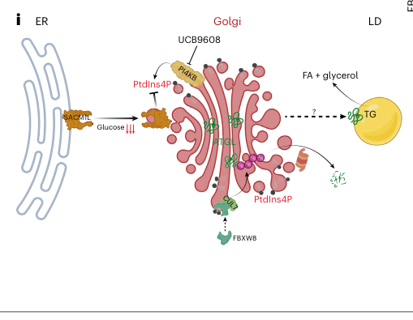

## Question

# Gene Research for Functional Annotation

## ⚠️ CRITICAL: Gene/Protein Identification Context

**BEFORE YOU BEGIN RESEARCH:** You MUST verify you are researching the CORRECT gene/protein. Gene symbols can be ambiguous, especially for less well-characterized genes from non-model organisms.

### Target Gene/Protein Identity (from UniProt):
- **UniProt Accession:** Q8N3Y1
- **Protein Description:** RecName: Full=F-box/WD repeat-containing protein 8; AltName: Full=F-box and WD-40 domain-containing protein 8; AltName: Full=F-box only protein 29;
- **Gene Information:** Name=FBXW8 {ECO:0000303|PubMed:17205132, ECO:0000312|HGNC:HGNC:13597}; Synonyms=FBW6, FBW8, FBX29, FBXO29, FBXW6;
- **Organism (full):** Homo sapiens (Human).
- **Protein Family:** Not specified in UniProt
- **Key Domains:** F-box-like_dom_sf. (IPR036047); F-box_dom. (IPR001810); Quinoprotein_ADH-like_sf. (IPR011047); WD40/YVTN_repeat-like_dom_sf. (IPR015943); WD40_rpt. (IPR001680)

### MANDATORY VERIFICATION STEPS:

1. **Check if the gene symbol "FBXW8" matches the protein description above**
2. **Verify the organism is correct:** Homo sapiens (Human).
3. **Check if protein family/domains align with what you find in literature**
4. **If you find literature for a DIFFERENT gene with the same or similar symbol, STOP**

### If Gene Symbol is Ambiguous or You Cannot Find Relevant Literature:

**DO NOT PROCEED WITH RESEARCH ON A DIFFERENT GENE.** Instead:
- State clearly: "The gene symbol 'FBXW8' is ambiguous or literature is limited for this specific protein"
- Explain what you found (e.g., "Found extensive literature on a different gene with the same symbol in a different organism")
- Describe the protein based ONLY on the UniProt information provided above
- Suggest that the protein function can be inferred from domain/family information

### Research Target:

Please provide a comprehensive research report on the gene **FBXW8** (gene ID: FBXW8, UniProt: Q8N3Y1) in human.

The research report should be a detailed narrative explaining the function, biological processes, and localization of the gene product. Citations should be given for all claims.

You should prioritize authoritative reviews and primary scientific literature when conducting research. You can supplement
this with annotations you find in gene/protein databases, but these can be outdated or inaccurate.

We are specifically interested in the primary function of the gene - for enzymes, what reaction is catalyzed, and what is the substrate specificity? For transporters, what is the substrate? For structural proteins or adapters, what is the broader structural role? For signaling molecules, what is the role in the pathway.

We are interested in where in or outside the cell the gene product carries out its function.

We are also interested in the signaling or biochemical pathways in which the gene functions. We are less interested in broad pleiotropic effects, except where these elucidate the precise role.

Include evidence where possible. We are interested in both experimental evidence as well as inference from structure, evolution, or bioinformatic analysis. Precise studies should be prioritized over high-throughput, where available.

## Output

Question: You are an expert researcher providing comprehensive, well-cited information.

Provide detailed information focusing on:
1. Key concepts and definitions with current understanding
2. Recent developments and latest research (prioritize 2023-2024 sources)
3. Current applications and real-world implementations
4. Expert opinions and analysis from authoritative sources
5. Relevant statistics and data from recent studies

Format as a comprehensive research report with proper citations. Include URLs and publication dates where available.
Always prioritize recent, authoritative sources and provide specific citations for all major claims.

# Gene Research for Functional Annotation

## ⚠️ CRITICAL: Gene/Protein Identification Context

**BEFORE YOU BEGIN RESEARCH:** You MUST verify you are researching the CORRECT gene/protein. Gene symbols can be ambiguous, especially for less well-characterized genes from non-model organisms.

### Target Gene/Protein Identity (from UniProt):
- **UniProt Accession:** Q8N3Y1
- **Protein Description:** RecName: Full=F-box/WD repeat-containing protein 8; AltName: Full=F-box and WD-40 domain-containing protein 8; AltName: Full=F-box only protein 29;
- **Gene Information:** Name=FBXW8 {ECO:0000303|PubMed:17205132, ECO:0000312|HGNC:HGNC:13597}; Synonyms=FBW6, FBW8, FBX29, FBXO29, FBXW6;
- **Organism (full):** Homo sapiens (Human).
- **Protein Family:** Not specified in UniProt
- **Key Domains:** F-box-like_dom_sf. (IPR036047); F-box_dom. (IPR001810); Quinoprotein_ADH-like_sf. (IPR011047); WD40/YVTN_repeat-like_dom_sf. (IPR015943); WD40_rpt. (IPR001680)

### MANDATORY VERIFICATION STEPS:

1. **Check if the gene symbol "FBXW8" matches the protein description above**
2. **Verify the organism is correct:** Homo sapiens (Human).
3. **Check if protein family/domains align with what you find in literature**
4. **If you find literature for a DIFFERENT gene with the same or similar symbol, STOP**

### If Gene Symbol is Ambiguous or You Cannot Find Relevant Literature:

**DO NOT PROCEED WITH RESEARCH ON A DIFFERENT GENE.** Instead:
- State clearly: "The gene symbol 'FBXW8' is ambiguous or literature is limited for this specific protein"
- Explain what you found (e.g., "Found extensive literature on a different gene with the same symbol in a different organism")
- Describe the protein based ONLY on the UniProt information provided above
- Suggest that the protein function can be inferred from domain/family information

### Research Target:

Please provide a comprehensive research report on the gene **FBXW8** (gene ID: FBXW8, UniProt: Q8N3Y1) in human.

The research report should be a detailed narrative explaining the function, biological processes, and localization of the gene product. Citations should be given for all claims.

You should prioritize authoritative reviews and primary scientific literature when conducting research. You can supplement
this with annotations you find in gene/protein databases, but these can be outdated or inaccurate.

We are specifically interested in the primary function of the gene - for enzymes, what reaction is catalyzed, and what is the substrate specificity? For transporters, what is the substrate? For structural proteins or adapters, what is the broader structural role? For signaling molecules, what is the role in the pathway.

We are interested in where in or outside the cell the gene product carries out its function.

We are also interested in the signaling or biochemical pathways in which the gene functions. We are less interested in broad pleiotropic effects, except where these elucidate the precise role.

Include evidence where possible. We are interested in both experimental evidence as well as inference from structure, evolution, or bioinformatic analysis. Precise studies should be prioritized over high-throughput, where available.

## Research report: Human **FBXW8** (UniProt **Q8N3Y1**) — functional annotation

### 0) Target verification (gene/protein identity)
The literature summarized here is specific to **human FBXW8** (aliases reported across studies include **Fbw8/FBW8**, **FBX29**, and **Fbw6**), an **F-box/WD40 repeat protein** that binds **SKP1** and associates with **CUL7–RBX1** as a substrate-recognition receptor in a CUL7-based cullin–RING E3 ligase (CRL) complex (shi2020thefunctionalanalysis pages 5-7, shi2020thefunctionalanalysis pages 3-5). A key distinguishing feature of the FBXW8 system is its **noncanonical multi-cullin architecture** linking CUL7 and CUL1 (hopf2022structureofcrl7fbxw8 pages 1-2, tsunematsu2006fbxw8isessential pages 10-11).

### 1) Key concepts and current understanding

#### 1.1 Canonical role of F-box proteins and where FBXW8 fits
F-box proteins typically serve as **substrate receptors** within SCF-type E3 ubiquitin ligases, coupling substrate binding to ubiquitin transfer and proteasomal degradation. FBXW8 is a WD40-containing F-box protein that functions as the **substrate-recognition subunit** of a **CUL7-based SCF-like E3 ligase** (often termed **CRL7\u00a0or CUL7–FBXW8**), with core components **CUL7 (scaffold)**, **RBX1/ROC1 (RING)**, **SKP1 (adaptor)** and **FBXW8 (receptor)** (sarikas2008thecullin7e3 pages 3-4, shi2020thefunctionalanalysis pages 5-7).

#### 1.2 Atypical “multi-cullin” E3 ligase mechanism (CUL7–CUL1 coupling)
A major conceptual advance is that **CRL7\u00a0FBXW8 does not behave as a stand-alone catalytic CRL**. Cryo-EM and biochemical reconstitution indicate **CUL7–RBX1 bound to SKP1–FBXW8** constrains the RBX1 RING in a way incompatible with canonical E2~NEDD8 or E2~ubiquitin engagement, and purified recombinant CRL7\u00a0FBXW8 lacks auto-neddylation and ubiquitination activity (hopf2022structureofcrl7fbxw8 pages 1-2). Instead, CRL7 appears to operate primarily as a **substrate receptor module**, linked via **SKP1–FBXW8** to a separate **neddylated CUL1–RBX1 catalytic module**, enabling ubiquitination through a **CRL–CRL partnership** (hopf2022structureofcrl7fbxw8 pages 1-2, hopf2022structureofcrl7fbxw8 pages 9-10).

This mechanism is consistent with earlier work showing FBXW8 can **bridge CUL1 and CUL7**: FBXW8 binds **CUL1 through its F-box/SKP1**, while binding **CUL7 through central/C-terminal regions independently of the canonical F-box interaction**, forming a proposed **Rbx1–Cul1–Skp1–Fbxw8–Cul7–Rbx1** assembly (tsunematsu2006fbxw8isessential pages 10-11). Reviews further emphasize that CUL7 interacts with CUL1 via the linker FBXW8, potentially increasing ubiquitination of SCF substrates (shi2020thefunctionalanalysis pages 7-9).

### 2) Molecular functions, substrates, pathways, and localization (experimental evidence)

#### 2.1 Complex membership and partners
Across studies, FBXW8 is repeatedly placed in:
- **CUL7–SKP1–FBXW8–RBX1** (CRL7/SCF-like) assemblies (sarikas2008thecullin7e3 pages 3-4, shi2020thefunctionalanalysis pages 5-7).
- **CUL1–CUL7 bridging complexes** dependent on FBXW8 (tsunematsu2006fbxw8isessential pages 10-11).
- A **multi-cullin ligase** model where **CUL1–RBX1 supplies catalytic activity** while **CUL7–FBXW8 recruits substrate** (hopf2022structureofcrl7fbxw8 pages 1-2).

#### 2.2 Substrate: Cyclin D1 (cell-cycle control; MAPK-dependent degron)
Primary evidence demonstrates that **cyclin D1** is targeted for degradation by an FBXW8-containing SCF-like ligase in a manner requiring **MAPK/ERK signaling** and **Thr286 phosphorylation**.

Key findings:
- Cyclin D1 is degraded predominantly **during S phase** and **in the cytoplasm**, where it associates with FBXW8 (okabe2006acriticalrole pages 1-2).
- FBXW8 assembles with **SKP1 and CUL1/CUL7** and supports **polyubiquitination** of cyclin D1 in vitro and in cells; **FBXW8 knockdown stabilizes cyclin D1 and reduces proliferation** (okabe2006acriticalrole pages 6-7, okabe2006acriticalrole pages 7-9).
- Recognition is **Thr286 phosphorylation-dependent**; an ERK/MAPK “D-domain” in cyclin D1 (aa 179–193) is required for efficient Thr286 phosphorylation and ubiquitination (okabe2006acriticalrole pages 9-10).
- MEK inhibition (U0126) reduces Thr286 phosphorylation and increases cyclin D1 half-life from **22.5 min to 54.6 min**, supporting ERK/MAPK control of the degron signal (okabe2006acriticalrole pages 5-6).

Subcellular localization evidence in this system indicates FBXW8 is **predominantly cytoplasmic in G1/S**, while cyclin D1 is nuclear in G1 and translocates to cytoplasm in S phase to enable degradation (okabe2006acriticalrole pages 1-2, okabe2006acriticalrole pages 6-7).

#### 2.3 Substrate: HPK1 (MAPK pathway feedback; phosphorylation-sensitive degradation)
In pancreatic cancer-relevant contexts, FBXW8 (within **CUL7/FBXW8**) promotes **proteasome-dependent degradation** of **hematopoietic progenitor kinase 1 (HPK1)**.

Key findings:
- CUL7/FBXW8 targets HPK1 to the **26S proteasome**; proteasome inhibition (MG132) stabilizes HPK1 (wang2014thecul7fboxand pages 2-3).
- HPK1 ubiquitination depends on **HPK1 kinase activity/autophosphorylation**, indicating phosphorylation-sensitive recognition (wang2014thecul7fboxand pages 2-3).
- PP4 phosphatase inhibits the HPK1–FBXW8 interaction and FBXW8-mediated ubiquitination; **Thr355** is a key PP4 dephosphorylation site controlling stability (wang2014thecul7fboxand pages 2-3).
- FBXW8 knockdown restores HPK1 and inhibits proliferation of pancreatic cancer cells, supporting a functional pathway connection between CRL7\u00a0FBXW8 and MAPK-related signaling (wang2014thecul7fboxand pages 2-3).

#### 2.4 Substrate: MRFAP1 (mitotic exit; genome stability/mitotic death)
FBXW8 also targets **MRFAP1**, a nuclear protein involved in chromatin regulation.

Key findings:
- An IP-proteomics screen identified MRFAP1 as an FBXW8 interactor; follow-up studies show that **CUL7/FBXW8** promotes MRFAP1 degradation specifically around **anaphase–telophase** (li2017fbxw8dependentdegradationof pages 1-2).
- FBXW8 overexpression increases MRFAP1 polyubiquitination and decreases stability; knockdown prolongs half-life (li2017fbxw8dependentdegradationof pages 1-2).
- FBXW8 is described as distributed throughout the cytoplasm with lower nuclear abundance, whereas MRFAP1 is mainly nuclear but shows overlap, consistent with regulated engagement during mitosis (li2017fbxw8dependentdegradationof pages 1-2).

### 3) Recent developments (prioritizing 2023–2024)

#### 3.1 2024: Golgi PtdIns4P–CUL7–FBXW8 control of ATGL and lipolysis (metabolism)
A 2024 **Nature Cell Biology** study identified a **Golgi-localized CUL7–FBXW8 E3 ligase** that regulates **adipose triglyceride lipase (ATGL)**, providing a mechanistic link between nutrient state and lipolysis.

Key findings:
- **Intracellular glucose depletion lowers Golgi PtdIns4P**, which reduces assembly/localization of a **Golgi CUL7–FBXW8 complex**; this reduces **ATGL polyubiquitylation** at the Golgi and increases ATGL-driven lipolysis (ding2024glucosecontrolslipolysis pages 1-2).
- ATGL is directly associated with FBXW8 and becomes **K48-linked polyubiquitylated**, consistent with proteasome-linked turnover; depletion of CUL7/FBXW8 increases ATGL abundance in whole-cell and Golgi fractions (ding2024glucosecontrolslipolysis pages 7-8, ding2024glucosecontrolslipolysis pages 5-6).
- FBXW8 contains a **polybasic N-terminal region** that binds negatively charged **Golgi PtdIns4P**, offering a recruitment mechanism coupling phosphoinositide status to E3 localization (ding2024glucosecontrolslipolysis pages 7-8, ding2024glucosecontrolslipolysis pages 12-13).

Figure evidence from this work includes a schematic model and immunoblot panels showing Golgi recruitment and K48-linked ubiquitination of ATGL (ding2024glucosecontrolslipolysis media fd8f6b64, ding2024glucosecontrolslipolysis media 267ae964, ding2024glucosecontrolslipolysis media f6f97bf1, ding2024glucosecontrolslipolysis media 84733fe7).

#### 3.2 2024: FBXW8 as an antiviral factor routing K48-ubiquitinated viral protein to selective autophagy
A 2024 **Frontiers in Immunology** study reported FBXW8-mediated restriction of porcine deltacoronavirus (PDCoV) via selective autophagy.

Key findings:
- PDCoV infection upregulates FBXW8 via **NF-\u03baB/p65 promoter activation** and drives **cytoplasmic relocalization** (ji2024fbxw8suppressespdcov pages 1-2, ji2024fbxw8suppressespdcov pages 2-3).
- FBXW8 binds PDCoV nucleocapsid protein (N) and mediates **K48-linked polyubiquitination** at a lysine-rich **KR motif** (ji2024fbxw8suppressespdcov pages 6-8, ji2024fbxw8suppressespdcov pages 1-2).
- Despite K48 ubiquitination, degradation proceeds largely through **NDP52-dependent selective autophagy** (inhibited by 3-MA/chloroquine but not MG132), highlighting a noncanonical fate for K48-tagged cargo in this system (ji2024fbxw8suppressespdcov pages 8-10, ji2024fbxw8suppressespdcov pages 6-8).

#### 3.3 2023–2024: Expert review perspectives on CRL7/FBXW8 relevance
Recent reviews emphasize broad biomedical relevance of CRLs/neddylation and continued interest in targeting E3 ligases in metabolic disease, with CUL7/Fbxw8 cited as a cullin family member engaging SKP1/F-box proteins and as part of the expanding CRL landscape (zambranocarrasco2024emergingrolesof pages 9-11).

### 4) Current applications and real-world implementations

#### 4.1 Metabolic disease (MASLD/MASH): pathway-level targeting with in vivo and ex vivo human-graft evidence
The strongest “real-world implementation” evidence to date is preclinical-to-translational metabolic modulation. Ding et al. report that **genetic and pharmacological manipulation** of the Golgi PtdIns4P–CUL7–FBXW8–ATGL axis ameliorates steatosis in mouse models of hepatic steatosis/MASH, and improves steatosis in an **ex vivo perfused human steatotic liver graft** (ding2024glucosecontrolslipolysis pages 1-2, ding2024glucosecontrolslipolysis pages 10-11, ding2024glucosecontrolslipolysis pages 14-16). Although the mechanistic core is cell-biological, the inclusion of mouse disease models and human graft perfusion places this pathway among the most experimentally advanced FBXW8-associated translational directions (ding2024glucosecontrolslipolysis pages 10-11).

#### 4.2 Cancer biology (mechanistic rationale; not yet a targeted therapy)
FBXW8-dependent degradation of **cyclin D1** and **HPK1** links FBXW8 to proliferative control: cyclin D1 stabilization upon FBXW8 depletion reduces proliferation (okabe2006acriticalrole pages 1-2), and FBXW8 knockdown stabilizing HPK1 inhibits pancreatic cancer cell proliferation (wang2014thecul7fboxand pages 2-3). Reviews conclude that direct therapeutic targeting of CUL7/CRL7 remains underdeveloped, with no established therapies targeting CUL7/FBXW8 specifically (shi2020thefunctionalanalysis pages 1-2).

#### 4.3 Antiviral host defense (preclinical; non-human virus context)
The PDCoV study positions FBXW8 as a **host restriction factor** that can reroute ubiquitinated viral components to selective autophagy, suggesting a conceptual avenue for host-directed antiviral strategies; however, this evidence is currently confined to a porcine deltacoronavirus model (ji2024fbxw8suppressespdcov pages 1-2, ji2024fbxw8suppressespdcov pages 6-8).

### 5) Disease/phenotype associations (human and model systems)

#### 5.1 Development and placenta
Mouse genetics show strong developmental roles for the Cul7–Fbxw8 system, with FBXW8 required for **mid-to-late placental development** and normal fetal growth. Fbxw8 knockout causes **intrauterine growth retardation** and major placental structural defects (notably spongiotrophoblast/labyrinth abnormalities), and the phenotype depends on fetal genotype (tsunematsu2006fbxw8isessential pages 4-10, tsunematsu2006fbxw8isessential pages 11-12). Complementary review discussion in cardiac-development context notes that Cul7-null phenotypes are more severe than Fbxw8-null, suggesting that FBXW8 is an important but not exclusive downstream effector for CUL7-dependent developmental functions (zambranocarrasco2024emergingrolesof pages 8-9).

#### 5.2 Disease-association statistics from Open Targets (snapshot)
Open Targets identifies modest evidence linking FBXW8 to multiple diseases/phenotype terms, including **rheumatoid arthritis** (score \u22480.288; 5 evidence items), **abnormality of the skeletal system** (score \u22480.455; 5 evidence items), and others in the retrieved snapshot (OpenTargets Search: -FBXW8). These are association metrics rather than direct mechanistic validations and should be interpreted cautiously relative to the stronger mechanistic studies above.

### 6) Limitations and open questions
1. **Direct substrate repertoire remains incomplete.** While multiple substrates are supported experimentally (cyclin D1, HPK1, MRFAP1, ATGL, viral N), reviews list additional candidates (e.g., GRASP65) that were not fully evaluated in the retrieved primary texts here (shi2020thefunctionalanalysis pages 5-7).
2. **Mechanistic diversity across contexts.** FBXW8-mediated K48 ubiquitination can lead to **proteasomal degradation** (e.g., ATGL; cyclin D1) (ding2024glucosecontrolslipolysis pages 7-8, okabe2006acriticalrole pages 6-7) or, in a viral context, to **selective autophagy** via NDP52 (ji2024fbxw8suppressespdcov pages 6-8). Determinants of routing are not resolved.
3. **Therapeutic targeting strategy is emerging.** Evidence for direct FBXW8-targeted drugs is not established in the retrieved literature; the most advanced intervention-level findings are pathway-level (Golgi PtdIns4P axis) rather than FBXW8-binding ligands (ding2024glucosecontrolslipolysis pages 10-11).

### Evidence summary table
The following table consolidates the key experimentally supported findings, including publication dates and DOI URLs.

| Category | Specific finding | Evidence type/assay | Key details | Source |
|---|---|---|---|---|
| complex | FBXW8 is the substrate-recognition F-box/WD40 subunit of a CUL7-based SCF-like E3 ligase | Review synthesis of biochemical/genetic studies | Complex includes SKP1, FBXW8, CUL7, RBX1/ROC1; WD40 region implicated in substrate binding | Sarikas 2008, *Cell Cycle* (Oct 2008). DOI: https://doi.org/10.4161/cc.7.20.6922 (sarikas2008thecullin7e3 pages 3-4) |
| complex | FBXW8 is one of the very few F-box proteins reported to partner with CUL7 | Review of primary studies | C-terminal WD40 repeats mediate substrate recognition; reported CUL7/FBXW8 substrates include cyclin D1, IRS1, HPK1, GRASP65, MRFAP1 | Shi 2020, *Oncogenesis* (Oct 2020). DOI: https://doi.org/10.1038/s41389-020-00276-w (shi2020thefunctionalanalysis pages 5-7, shi2020thefunctionalanalysis pages 3-5) |
| partner | FBXW8 bridges CUL1 and CUL7 complexes | Co-immunoprecipitation, domain mapping, knockout mouse biochemistry | F-box/Skp1-dependent binding to CUL1; central/C-terminal FBXW8 regions bind CUL7 independently of canonical F-box interaction | Tsunematsu 2006, *Molecular and Cellular Biology* (Aug 2006). DOI: https://doi.org/10.1128/mcb.00595-06 (tsunematsu2006fbxw8isessential pages 10-11) |
| complex | FBXW8 is essential for CUL1-CUL7 complex formation | Biochemistry in knockout tissues/cells | Proposed Rbx1-Cul1-Skp1-Fbxw8-Cul7-Rbx1 assembly; CUL7 stabilizes FBXW8 protein | Tsunematsu 2006, *Molecular and Cellular Biology* (Aug 2006). DOI: https://doi.org/10.1128/mcb.00595-06 (tsunematsu2006fbxw8isessential pages 10-11, tsunematsu2006fbxw8isessential pages 4-10) |
| complex | CRL7^FBXW8 is an atypical multi-cullin E3 in which CUL7 recruits substrate while neddylated CUL1-RBX1 provides catalytic activity | Cryo-EM structure and reconstituted biochemistry | CUL7 binds FBXW8 in an F-box-independent mode; CRL7^FBXW8 alone lacks auto-neddylation/ubiquitination activity; catalytic coupling occurs to CUL1-RBX1 | Hopf 2022, *Nature Structural & Molecular Biology* (Aug 2022). DOI: https://doi.org/10.1038/s41594-022-00815-6 (hopf2022structureofcrl7fbxw8 pages 1-2, hopf2022structureofcrl7fbxw8 pages 9-10) |
| substrate | Cyclin D1 is an FBXW8 substrate | Co-IP, in vitro ubiquitination, siRNA knockdown, pulse-chase, fractionation/immunofluorescence | Recognition requires ERK/MAPK-mediated Thr286 phosphorylation; cyclin D1 D-domain (aa179-193) supports phosphorylation; degradation occurs mainly in cytoplasm during S phase | Okabe 2006, *PLoS ONE* (Dec 2006). DOI: https://doi.org/10.1371/journal.pone.0000128 (okabe2006acriticalrole pages 7-9, okabe2006acriticalrole pages 6-7, okabe2006acriticalrole pages 1-2, okabe2006acriticalrole pages 5-6, okabe2006acriticalrole pages 9-10) |
| regulation | FBXW8-dependent cyclin D1 turnover is MAPK/ERK regulated | ERK2 kinase assay, MEK inhibitor, phospho-specific immunoblot, pulse-chase | U0126 reduces Thr286 phosphorylation and extends cyclin D1 half-life from 22.5 min to 54.6 min | Okabe 2006, *PLoS ONE* (Dec 2006). DOI: https://doi.org/10.1371/journal.pone.0000128 (okabe2006acriticalrole pages 5-6, okabe2006acriticalrole pages 3-5) |
| localization | FBXW8 is predominantly cytoplasmic in G1/S in the cyclin D1 system | V5-tagged expression, cell fractionation, immunofluorescence | Spatial separation explains timing: FBXW8 cytoplasmic, cyclin D1 nuclear in G1 then exported in S phase for degradation | Okabe 2006, *PLoS ONE* (Dec 2006). DOI: https://doi.org/10.1371/journal.pone.0000128 (okabe2006acriticalrole pages 7-9, okabe2006acriticalrole pages 6-7, okabe2006acriticalrole pages 1-2) |
| substrate | IRS1 is a CUL7/FBXW8 target in insulin/IGF signaling | Primary mechanistic study summarized in review | Ubiquitin-dependent degradation of IRS1; linked to mTOR/S6K-dependent serine phosphorylation and negative feedback on signaling | Xu 2008, *Molecular Cell* (May 2008), summarized by Sarikas 2008, *Cell Cycle* (Oct 2008). DOI: https://doi.org/10.1016/j.molcel.2008.03.009; https://doi.org/10.4161/cc.7.20.6922 (sarikas2008thecullin7e3 pages 3-4, hopf2022structureofcrl7fbxw8 pages 9-10) |
| substrate | HPK1 is a CUL7/FBXW8 substrate | Interaction screen, IP/IB, MG132 rescue, knockdown, proliferation assays | Degradation is proteasome-dependent and requires HPK1 kinase activity/autophosphorylation; PP4 antagonizes FBXW8 action via HPK1 Thr355 dephosphorylation | Wang 2014, *Journal of Biological Chemistry* (Feb 2014). DOI: https://doi.org/10.1074/jbc.M113.520106 (wang2014thecul7fboxand pages 2-3) |
| regulation | HPK1 stability is controlled by a phosphorylation-sensitive FBXW8 mechanism | Phosphatase and mutational analysis | Thr355 is a key PP4-controlled site through which CUL7/FBXW8 regulates HPK1 turnover | Wang 2014, *Journal of Biological Chemistry* (Feb 2014). DOI: https://doi.org/10.1074/jbc.M113.520106 (wang2014thecul7fboxand pages 2-3) |
| substrate | MRFAP1 is an FBXW8 substrate during mitotic exit | IP-proteomics, co-IP, co-localization, ubiquitination assay, half-life analysis | Cul7/FBXW8 promotes MRFAP1 degradation during anaphase-telophase; FBXW8 overexpression increases polyubiquitination and knockdown prolongs half-life | Li 2017, *Oncotarget* (Oct 2017). DOI: https://doi.org/10.18632/oncotarget.21843 (li2017fbxw8dependentdegradationof pages 1-2) |
| localization | In the MRFAP1 study, FBXW8 is mainly cytoplasmic with limited nuclear signal | Immunofluorescence co-localization | MRFAP1 is mainly nuclear; overlap supports substrate engagement near mitotic transition | Li 2017, *Oncotarget* (Oct 2017). DOI: https://doi.org/10.18632/oncotarget.21843 (li2017fbxw8dependentdegradationof pages 1-2) |
| substrate | ATGL is a newly defined FBXW8 substrate in metabolic regulation | siRNA screen, co-IP, ubiquitination assay, organelle fractionation, mouse liver genetics | Golgi-localized CUL7-FBXW8 directly interacts with ATGL and mediates K48-linked polyubiquitylation/proteasomal degradation | Ding 2024, *Nature Cell Biology* (Apr 2024). DOI: https://doi.org/10.1038/s41556-024-01386-y (ding2024glucosecontrolslipolysis pages 7-8, ding2024glucosecontrolslipolysis pages 5-6, ding2024glucosecontrolslipolysis pages 6-7, ding2024glucosecontrolslipolysis media fd8f6b64) |
| regulation | FBXW8 Golgi recruitment is controlled by Golgi PtdIns4P and intracellular glucose | Cell biology, phosphoinositide perturbation, localization assays | FBXW8 has a polybasic N-terminal region binding Golgi PtdIns4P; glucose deprivation lowers Golgi PtdIns4P, reduces FBXW8/CUL7 assembly at Golgi, stabilizes ATGL, and increases lipolysis | Ding 2024, *Nature Cell Biology* (Apr 2024). DOI: https://doi.org/10.1038/s41556-024-01386-y (ding2024glucosecontrolslipolysis pages 1-2, ding2024glucosecontrolslipolysis pages 7-8, ding2024glucosecontrolslipolysis pages 12-13, ding2024glucosecontrolslipolysis media fd8f6b64) |
| localization | FBXW8 functions at the Golgi in the ATGL pathway | Immunofluorescence, Golgi fractionation, model figure | Golgi PtdIns4P recruits FBXW8/CUL7; ATGL localizes to Golgi and is ubiquitinated there before turnover | Ding 2024, *Nature Cell Biology* (Apr 2024). DOI: https://doi.org/10.1038/s41556-024-01386-y (ding2024glucosecontrolslipolysis pages 5-6, ding2024glucosecontrolslipolysis pages 6-7, ding2024glucosecontrolslipolysis media fd8f6b64) |
| application | The Golgi PtdIns4P-CUL7-FBXW8-ATGL axis is actionable in steatosis/MASH models | Mouse genetics, pharmacology, ex vivo human liver perfusion | Genetic/pharmacologic modulation reduced hepatic triglycerides and improved steatosis; UCB9608 increased ATGL and improved steatotic phenotypes, including in an ex vivo human steatotic liver graft | Ding 2024, *Nature Cell Biology* (Apr 2024). DOI: https://doi.org/10.1038/s41556-024-01386-y (ding2024glucosecontrolslipolysis pages 1-2, ding2024glucosecontrolslipolysis pages 10-11, ding2024glucosecontrolslipolysis pages 14-16) |
| substrate | FBXW8 targets a viral protein, the PDCoV nucleocapsid (N), as an antiviral effector | Co-IP, GST pull-down, CHX chase, ubiquitination assays, inhibitor studies | FBXW8 directly binds PDCoV N via its F-box-dependent interaction and shortens N half-life | Ji 2024, *Frontiers in Immunology* (Nov 2024). DOI: https://doi.org/10.3389/fimmu.2024.1457255 (ji2024fbxw8suppressespdcov pages 8-10, ji2024fbxw8suppressespdcov pages 6-8, ji2024fbxw8suppressespdcov pages 3-6) |
| regulation | FBXW8 catalyzes K48-linked ubiquitination of PDCoV N but routes it to selective autophagy rather than proteasomes | Ubiquitin linkage mutants, autophagy receptor analysis, pharmacologic inhibitors | K48-linked chains decorate a lysine-rich KR motif in N; NDP52 recognizes ubiquitinated N; 3-MA/chloroquine block degradation whereas MG132 does not | Ji 2024, *Frontiers in Immunology* (Nov 2024). DOI: https://doi.org/10.3389/fimmu.2024.1457255 (ji2024fbxw8suppressespdcov pages 8-10, ji2024fbxw8suppressespdcov pages 6-8, ji2024fbxw8suppressespdcov pages 1-2) |
| localization | PDCoV infection induces FBXW8 cytoplasmic relocalization | Infection model, promoter analysis, cell imaging | NF-κB/p65 activates FBXW8 expression and infection drives cytoplasmic redistribution consistent with antiviral targeting of PDCoV N | Ji 2024, *Frontiers in Immunology* (Nov 2024). DOI: https://doi.org/10.3389/fimmu.2024.1457255 (ji2024fbxw8suppressespdcov pages 8-10, ji2024fbxw8suppressespdcov pages 2-3, ji2024fbxw8suppressespdcov pages 3-6) |
| phenotype | FBXW8 is essential for placental development and fetal growth in mouse models | Knockout mouse genetics, placental histology | Loss causes intrauterine growth retardation, small placentas, reduced spongiotrophoblast/labyrinth abnormalities; placental defect depends on fetal genotype | Tsunematsu 2006, *Molecular and Cellular Biology* (Aug 2006). DOI: https://doi.org/10.1128/mcb.00595-06 (tsunematsu2006fbxw8isessential pages 4-10, tsunematsu2006fbxw8isessential pages 11-12) |
| phenotype | FBXW8 contributes to developmental size control downstream of CRL7 | Review of developmental/cardiac studies | Fbxw8-null mice are small but viable to adulthood, milder than Cul7-null lethality; supports FBXW8 as one, but not all, CRL7 effector arms | Zambrano-Carrasco 2024, *Cells* (Jan 2024). DOI: https://doi.org/10.3390/cells13030235 (zambranocarrasco2024emergingrolesof pages 9-11, zambranocarrasco2024emergingrolesof pages 8-9) |
| application | FBXW8/CRL7 is of translational interest but not yet a mature direct drug target | Expert review analysis | Suggested relevance in cancer, metabolism, development, and targeted modulation of neddylation/CRLs; no FBXW8-specific therapy established | Jeong 2023, *Experimental & Molecular Medicine* (Oct 2023); Shi 2020, *Oncogenesis* (Oct 2020). DOI: https://doi.org/10.1038/s12276-023-01087-w; https://doi.org/10.1038/s41389-020-00276-w (shi2020thefunctionalanalysis pages 10-11) |

*Table: This table compiles experimentally supported functional annotation for human FBXW8/Q8N3Y1 across complex assembly, substrates, regulation, localization, phenotypes, and translational relevance. It is useful as a source-linked summary of what is firmly established versus emerging, especially for recent 2024 metabolic and antiviral findings.*

### Key figure evidence (2024 metabolism study)
- Schematic model of glucose→Golgi PtdIns4P→FBXW8/CUL7 recruitment→ATGL ubiquitination/degradation (ding2024glucosecontrolslipolysis media fd8f6b64).
- Immunoblot evidence for K48-linked ubiquitination of ATGL and Golgi localization panels (ding2024glucosecontrolslipolysis media 267ae964, ding2024glucosecontrolslipolysis media f6f97bf1).

References

1. (shi2020thefunctionalanalysis pages 5-7): Le Shi, Dongyue Du, Yunhua Peng, Jiankang Liu, and Jiangang Long. The functional analysis of cullin 7 e3 ubiquitin ligases in cancer. Oncogenesis, Oct 2020. URL: https://doi.org/10.1038/s41389-020-00276-w, doi:10.1038/s41389-020-00276-w. This article has 34 citations and is from a domain leading peer-reviewed journal.

2. (shi2020thefunctionalanalysis pages 3-5): Le Shi, Dongyue Du, Yunhua Peng, Jiankang Liu, and Jiangang Long. The functional analysis of cullin 7 e3 ubiquitin ligases in cancer. Oncogenesis, Oct 2020. URL: https://doi.org/10.1038/s41389-020-00276-w, doi:10.1038/s41389-020-00276-w. This article has 34 citations and is from a domain leading peer-reviewed journal.

3. (hopf2022structureofcrl7fbxw8 pages 1-2): Linus V. M. Hopf, Kheewoong Baek, Maren Klügel, Susanne von Gronau, Yue Xiong, and Brenda A. Schulman. Structure of crl7fbxw8 reveals coupling with cul1–rbx1/roc1 for multi-cullin-ring e3-catalyzed ubiquitin ligation. Nature Structural & Molecular Biology, 29:854-862, Aug 2022. URL: https://doi.org/10.1038/s41594-022-00815-6, doi:10.1038/s41594-022-00815-6. This article has 31 citations and is from a highest quality peer-reviewed journal.

4. (tsunematsu2006fbxw8isessential pages 10-11): Ryosuke Tsunematsu, Masaaki Nishiyama, Shuhei Kotoshiba, Toru Saiga, Takumi Kamura, and Keiichi I. Nakayama. Fbxw8 is essential for cul1-cul7 complex formation and for placental development. Molecular and Cellular Biology, 26:6157-6169, Aug 2006. URL: https://doi.org/10.1128/mcb.00595-06, doi:10.1128/mcb.00595-06. This article has 82 citations and is from a domain leading peer-reviewed journal.

5. (sarikas2008thecullin7e3 pages 3-4): Antonio Sarikas, Xinsong Xu, Loren J. Field, and Zhen-Qiang Pan. The cullin7 e3 ubiquitin ligase: a novel player in growth control. Cell Cycle, 7:3154-3161, Oct 2008. URL: https://doi.org/10.4161/cc.7.20.6922, doi:10.4161/cc.7.20.6922. This article has 83 citations and is from a peer-reviewed journal.

6. (hopf2022structureofcrl7fbxw8 pages 9-10): Linus V. M. Hopf, Kheewoong Baek, Maren Klügel, Susanne von Gronau, Yue Xiong, and Brenda A. Schulman. Structure of crl7fbxw8 reveals coupling with cul1–rbx1/roc1 for multi-cullin-ring e3-catalyzed ubiquitin ligation. Nature Structural & Molecular Biology, 29:854-862, Aug 2022. URL: https://doi.org/10.1038/s41594-022-00815-6, doi:10.1038/s41594-022-00815-6. This article has 31 citations and is from a highest quality peer-reviewed journal.

7. (shi2020thefunctionalanalysis pages 7-9): Le Shi, Dongyue Du, Yunhua Peng, Jiankang Liu, and Jiangang Long. The functional analysis of cullin 7 e3 ubiquitin ligases in cancer. Oncogenesis, Oct 2020. URL: https://doi.org/10.1038/s41389-020-00276-w, doi:10.1038/s41389-020-00276-w. This article has 34 citations and is from a domain leading peer-reviewed journal.

8. (okabe2006acriticalrole pages 1-2): Hiroshi Okabe, Sang-Hyun Lee, Janyaporn Phuchareon, Donna G. Albertson, Frank McCormick, and Osamu Tetsu. A critical role for fbxw8 and mapk in cyclin d1 degradation and cancer cell proliferation. PLoS ONE, 1:e128, Dec 2006. URL: https://doi.org/10.1371/journal.pone.0000128, doi:10.1371/journal.pone.0000128. This article has 252 citations and is from a peer-reviewed journal.

9. (okabe2006acriticalrole pages 6-7): Hiroshi Okabe, Sang-Hyun Lee, Janyaporn Phuchareon, Donna G. Albertson, Frank McCormick, and Osamu Tetsu. A critical role for fbxw8 and mapk in cyclin d1 degradation and cancer cell proliferation. PLoS ONE, 1:e128, Dec 2006. URL: https://doi.org/10.1371/journal.pone.0000128, doi:10.1371/journal.pone.0000128. This article has 252 citations and is from a peer-reviewed journal.

10. (okabe2006acriticalrole pages 7-9): Hiroshi Okabe, Sang-Hyun Lee, Janyaporn Phuchareon, Donna G. Albertson, Frank McCormick, and Osamu Tetsu. A critical role for fbxw8 and mapk in cyclin d1 degradation and cancer cell proliferation. PLoS ONE, 1:e128, Dec 2006. URL: https://doi.org/10.1371/journal.pone.0000128, doi:10.1371/journal.pone.0000128. This article has 252 citations and is from a peer-reviewed journal.

11. (okabe2006acriticalrole pages 9-10): Hiroshi Okabe, Sang-Hyun Lee, Janyaporn Phuchareon, Donna G. Albertson, Frank McCormick, and Osamu Tetsu. A critical role for fbxw8 and mapk in cyclin d1 degradation and cancer cell proliferation. PLoS ONE, 1:e128, Dec 2006. URL: https://doi.org/10.1371/journal.pone.0000128, doi:10.1371/journal.pone.0000128. This article has 252 citations and is from a peer-reviewed journal.

12. (okabe2006acriticalrole pages 5-6): Hiroshi Okabe, Sang-Hyun Lee, Janyaporn Phuchareon, Donna G. Albertson, Frank McCormick, and Osamu Tetsu. A critical role for fbxw8 and mapk in cyclin d1 degradation and cancer cell proliferation. PLoS ONE, 1:e128, Dec 2006. URL: https://doi.org/10.1371/journal.pone.0000128, doi:10.1371/journal.pone.0000128. This article has 252 citations and is from a peer-reviewed journal.

13. (wang2014thecul7fboxand pages 2-3): Hua Wang, Yue Chen, Ping Lin, Lei Li, Guisheng Zhou, Guangchao Liu, Craig Logsdon, Jianping Jin, James L. Abbruzzese, Tse-Hua Tan, and Huamin Wang. The cul7/f-box and wd repeat domain containing 8 (cul7/fbxw8) ubiquitin ligase promotes degradation of hematopoietic progenitor kinase 1. Journal of Biological Chemistry, 289:4009-4017, Feb 2014. URL: https://doi.org/10.1074/jbc.m113.520106, doi:10.1074/jbc.m113.520106. This article has 118 citations and is from a domain leading peer-reviewed journal.

14. (li2017fbxw8dependentdegradationof pages 1-2): Duan-Zhuo Li, Shun-Fang Liu, Lan Zhu, Yu-Xing Wang, Yi-Xiang Chen, Jie Liu, Gang Hu, Xin Yu, Jian Li, Jin Zhang, Zhi-Xiang Wu, Han Lu, Wei Liu, and Bin Liu. Fbxw8-dependent degradation of mrfap1 in anaphase controls mitotic cell death. Oncotarget, 8:97178-97186, Oct 2017. URL: https://doi.org/10.18632/oncotarget.21843, doi:10.18632/oncotarget.21843. This article has 14 citations.

15. (ding2024glucosecontrolslipolysis pages 1-2): Lianggong Ding, Florian Huwyler, Fen Long, Wu Yang, Jonas Binz, Kendra Wernlé, Matthias Pfister, Manuel Klug, Miroslav Balaz, Barbara Ukropcova, Jozef Ukropec, Chunyan Wu, Tongtong Wang, Min Gao, Pierre-Alain Clavien, Philipp Dutkowski, Mark W. Tibbitt, and Christian Wolfrum. Glucose controls lipolysis through golgi ptdins4p-mediated regulation of atgl. Nature Cell Biology, 26:552-566, Apr 2024. URL: https://doi.org/10.1038/s41556-024-01386-y, doi:10.1038/s41556-024-01386-y. This article has 35 citations and is from a highest quality peer-reviewed journal.

16. (ding2024glucosecontrolslipolysis pages 7-8): Lianggong Ding, Florian Huwyler, Fen Long, Wu Yang, Jonas Binz, Kendra Wernlé, Matthias Pfister, Manuel Klug, Miroslav Balaz, Barbara Ukropcova, Jozef Ukropec, Chunyan Wu, Tongtong Wang, Min Gao, Pierre-Alain Clavien, Philipp Dutkowski, Mark W. Tibbitt, and Christian Wolfrum. Glucose controls lipolysis through golgi ptdins4p-mediated regulation of atgl. Nature Cell Biology, 26:552-566, Apr 2024. URL: https://doi.org/10.1038/s41556-024-01386-y, doi:10.1038/s41556-024-01386-y. This article has 35 citations and is from a highest quality peer-reviewed journal.

17. (ding2024glucosecontrolslipolysis pages 5-6): Lianggong Ding, Florian Huwyler, Fen Long, Wu Yang, Jonas Binz, Kendra Wernlé, Matthias Pfister, Manuel Klug, Miroslav Balaz, Barbara Ukropcova, Jozef Ukropec, Chunyan Wu, Tongtong Wang, Min Gao, Pierre-Alain Clavien, Philipp Dutkowski, Mark W. Tibbitt, and Christian Wolfrum. Glucose controls lipolysis through golgi ptdins4p-mediated regulation of atgl. Nature Cell Biology, 26:552-566, Apr 2024. URL: https://doi.org/10.1038/s41556-024-01386-y, doi:10.1038/s41556-024-01386-y. This article has 35 citations and is from a highest quality peer-reviewed journal.

18. (ding2024glucosecontrolslipolysis pages 12-13): Lianggong Ding, Florian Huwyler, Fen Long, Wu Yang, Jonas Binz, Kendra Wernlé, Matthias Pfister, Manuel Klug, Miroslav Balaz, Barbara Ukropcova, Jozef Ukropec, Chunyan Wu, Tongtong Wang, Min Gao, Pierre-Alain Clavien, Philipp Dutkowski, Mark W. Tibbitt, and Christian Wolfrum. Glucose controls lipolysis through golgi ptdins4p-mediated regulation of atgl. Nature Cell Biology, 26:552-566, Apr 2024. URL: https://doi.org/10.1038/s41556-024-01386-y, doi:10.1038/s41556-024-01386-y. This article has 35 citations and is from a highest quality peer-reviewed journal.

19. (ding2024glucosecontrolslipolysis media fd8f6b64): Lianggong Ding, Florian Huwyler, Fen Long, Wu Yang, Jonas Binz, Kendra Wernlé, Matthias Pfister, Manuel Klug, Miroslav Balaz, Barbara Ukropcova, Jozef Ukropec, Chunyan Wu, Tongtong Wang, Min Gao, Pierre-Alain Clavien, Philipp Dutkowski, Mark W. Tibbitt, and Christian Wolfrum. Glucose controls lipolysis through golgi ptdins4p-mediated regulation of atgl. Nature Cell Biology, 26:552-566, Apr 2024. URL: https://doi.org/10.1038/s41556-024-01386-y, doi:10.1038/s41556-024-01386-y. This article has 35 citations and is from a highest quality peer-reviewed journal.

20. (ding2024glucosecontrolslipolysis media 267ae964): Lianggong Ding, Florian Huwyler, Fen Long, Wu Yang, Jonas Binz, Kendra Wernlé, Matthias Pfister, Manuel Klug, Miroslav Balaz, Barbara Ukropcova, Jozef Ukropec, Chunyan Wu, Tongtong Wang, Min Gao, Pierre-Alain Clavien, Philipp Dutkowski, Mark W. Tibbitt, and Christian Wolfrum. Glucose controls lipolysis through golgi ptdins4p-mediated regulation of atgl. Nature Cell Biology, 26:552-566, Apr 2024. URL: https://doi.org/10.1038/s41556-024-01386-y, doi:10.1038/s41556-024-01386-y. This article has 35 citations and is from a highest quality peer-reviewed journal.

21. (ding2024glucosecontrolslipolysis media f6f97bf1): Lianggong Ding, Florian Huwyler, Fen Long, Wu Yang, Jonas Binz, Kendra Wernlé, Matthias Pfister, Manuel Klug, Miroslav Balaz, Barbara Ukropcova, Jozef Ukropec, Chunyan Wu, Tongtong Wang, Min Gao, Pierre-Alain Clavien, Philipp Dutkowski, Mark W. Tibbitt, and Christian Wolfrum. Glucose controls lipolysis through golgi ptdins4p-mediated regulation of atgl. Nature Cell Biology, 26:552-566, Apr 2024. URL: https://doi.org/10.1038/s41556-024-01386-y, doi:10.1038/s41556-024-01386-y. This article has 35 citations and is from a highest quality peer-reviewed journal.

22. (ding2024glucosecontrolslipolysis media 84733fe7): Lianggong Ding, Florian Huwyler, Fen Long, Wu Yang, Jonas Binz, Kendra Wernlé, Matthias Pfister, Manuel Klug, Miroslav Balaz, Barbara Ukropcova, Jozef Ukropec, Chunyan Wu, Tongtong Wang, Min Gao, Pierre-Alain Clavien, Philipp Dutkowski, Mark W. Tibbitt, and Christian Wolfrum. Glucose controls lipolysis through golgi ptdins4p-mediated regulation of atgl. Nature Cell Biology, 26:552-566, Apr 2024. URL: https://doi.org/10.1038/s41556-024-01386-y, doi:10.1038/s41556-024-01386-y. This article has 35 citations and is from a highest quality peer-reviewed journal.

23. (ji2024fbxw8suppressespdcov pages 1-2): Likai Ji, Liying Zhou, Ying Wang, Shixing Yang, Yuwei Liu, Xiaochun Wang, Quan Shen, Chenglin Zhou, Juan Xu, and Wen Zhang. Fbxw8 suppresses pdcov proliferation via the npd52-dependent autophagic degradation of a viral nucleocapsid protein. Frontiers in Immunology, Nov 2024. URL: https://doi.org/10.3389/fimmu.2024.1457255, doi:10.3389/fimmu.2024.1457255. This article has 6 citations and is from a peer-reviewed journal.

24. (ji2024fbxw8suppressespdcov pages 2-3): Likai Ji, Liying Zhou, Ying Wang, Shixing Yang, Yuwei Liu, Xiaochun Wang, Quan Shen, Chenglin Zhou, Juan Xu, and Wen Zhang. Fbxw8 suppresses pdcov proliferation via the npd52-dependent autophagic degradation of a viral nucleocapsid protein. Frontiers in Immunology, Nov 2024. URL: https://doi.org/10.3389/fimmu.2024.1457255, doi:10.3389/fimmu.2024.1457255. This article has 6 citations and is from a peer-reviewed journal.

25. (ji2024fbxw8suppressespdcov pages 6-8): Likai Ji, Liying Zhou, Ying Wang, Shixing Yang, Yuwei Liu, Xiaochun Wang, Quan Shen, Chenglin Zhou, Juan Xu, and Wen Zhang. Fbxw8 suppresses pdcov proliferation via the npd52-dependent autophagic degradation of a viral nucleocapsid protein. Frontiers in Immunology, Nov 2024. URL: https://doi.org/10.3389/fimmu.2024.1457255, doi:10.3389/fimmu.2024.1457255. This article has 6 citations and is from a peer-reviewed journal.

26. (ji2024fbxw8suppressespdcov pages 8-10): Likai Ji, Liying Zhou, Ying Wang, Shixing Yang, Yuwei Liu, Xiaochun Wang, Quan Shen, Chenglin Zhou, Juan Xu, and Wen Zhang. Fbxw8 suppresses pdcov proliferation via the npd52-dependent autophagic degradation of a viral nucleocapsid protein. Frontiers in Immunology, Nov 2024. URL: https://doi.org/10.3389/fimmu.2024.1457255, doi:10.3389/fimmu.2024.1457255. This article has 6 citations and is from a peer-reviewed journal.

27. (zambranocarrasco2024emergingrolesof pages 9-11): Josue Zambrano-Carrasco, Jianqiu Zou, Wenjuan Wang, Xinghui Sun, Jie Li, and Huabo Su. Emerging roles of cullin-ring ubiquitin ligases in cardiac development. Cells, 13:235, Jan 2024. URL: https://doi.org/10.3390/cells13030235, doi:10.3390/cells13030235. This article has 9 citations.

28. (ding2024glucosecontrolslipolysis pages 10-11): Lianggong Ding, Florian Huwyler, Fen Long, Wu Yang, Jonas Binz, Kendra Wernlé, Matthias Pfister, Manuel Klug, Miroslav Balaz, Barbara Ukropcova, Jozef Ukropec, Chunyan Wu, Tongtong Wang, Min Gao, Pierre-Alain Clavien, Philipp Dutkowski, Mark W. Tibbitt, and Christian Wolfrum. Glucose controls lipolysis through golgi ptdins4p-mediated regulation of atgl. Nature Cell Biology, 26:552-566, Apr 2024. URL: https://doi.org/10.1038/s41556-024-01386-y, doi:10.1038/s41556-024-01386-y. This article has 35 citations and is from a highest quality peer-reviewed journal.

29. (ding2024glucosecontrolslipolysis pages 14-16): Lianggong Ding, Florian Huwyler, Fen Long, Wu Yang, Jonas Binz, Kendra Wernlé, Matthias Pfister, Manuel Klug, Miroslav Balaz, Barbara Ukropcova, Jozef Ukropec, Chunyan Wu, Tongtong Wang, Min Gao, Pierre-Alain Clavien, Philipp Dutkowski, Mark W. Tibbitt, and Christian Wolfrum. Glucose controls lipolysis through golgi ptdins4p-mediated regulation of atgl. Nature Cell Biology, 26:552-566, Apr 2024. URL: https://doi.org/10.1038/s41556-024-01386-y, doi:10.1038/s41556-024-01386-y. This article has 35 citations and is from a highest quality peer-reviewed journal.

30. (shi2020thefunctionalanalysis pages 1-2): Le Shi, Dongyue Du, Yunhua Peng, Jiankang Liu, and Jiangang Long. The functional analysis of cullin 7 e3 ubiquitin ligases in cancer. Oncogenesis, Oct 2020. URL: https://doi.org/10.1038/s41389-020-00276-w, doi:10.1038/s41389-020-00276-w. This article has 34 citations and is from a domain leading peer-reviewed journal.

31. (tsunematsu2006fbxw8isessential pages 4-10): Ryosuke Tsunematsu, Masaaki Nishiyama, Shuhei Kotoshiba, Toru Saiga, Takumi Kamura, and Keiichi I. Nakayama. Fbxw8 is essential for cul1-cul7 complex formation and for placental development. Molecular and Cellular Biology, 26:6157-6169, Aug 2006. URL: https://doi.org/10.1128/mcb.00595-06, doi:10.1128/mcb.00595-06. This article has 82 citations and is from a domain leading peer-reviewed journal.

32. (tsunematsu2006fbxw8isessential pages 11-12): Ryosuke Tsunematsu, Masaaki Nishiyama, Shuhei Kotoshiba, Toru Saiga, Takumi Kamura, and Keiichi I. Nakayama. Fbxw8 is essential for cul1-cul7 complex formation and for placental development. Molecular and Cellular Biology, 26:6157-6169, Aug 2006. URL: https://doi.org/10.1128/mcb.00595-06, doi:10.1128/mcb.00595-06. This article has 82 citations and is from a domain leading peer-reviewed journal.

33. (zambranocarrasco2024emergingrolesof pages 8-9): Josue Zambrano-Carrasco, Jianqiu Zou, Wenjuan Wang, Xinghui Sun, Jie Li, and Huabo Su. Emerging roles of cullin-ring ubiquitin ligases in cardiac development. Cells, 13:235, Jan 2024. URL: https://doi.org/10.3390/cells13030235, doi:10.3390/cells13030235. This article has 9 citations.

34. (OpenTargets Search: -FBXW8): Open Targets Query (-FBXW8, 5 results). Buniello, A. et al. (2025). Open Targets Platform: facilitating therapeutic hypotheses building in drug discovery. Nucleic Acids Research.

35. (okabe2006acriticalrole pages 3-5): Hiroshi Okabe, Sang-Hyun Lee, Janyaporn Phuchareon, Donna G. Albertson, Frank McCormick, and Osamu Tetsu. A critical role for fbxw8 and mapk in cyclin d1 degradation and cancer cell proliferation. PLoS ONE, 1:e128, Dec 2006. URL: https://doi.org/10.1371/journal.pone.0000128, doi:10.1371/journal.pone.0000128. This article has 252 citations and is from a peer-reviewed journal.

36. (ding2024glucosecontrolslipolysis pages 6-7): Lianggong Ding, Florian Huwyler, Fen Long, Wu Yang, Jonas Binz, Kendra Wernlé, Matthias Pfister, Manuel Klug, Miroslav Balaz, Barbara Ukropcova, Jozef Ukropec, Chunyan Wu, Tongtong Wang, Min Gao, Pierre-Alain Clavien, Philipp Dutkowski, Mark W. Tibbitt, and Christian Wolfrum. Glucose controls lipolysis through golgi ptdins4p-mediated regulation of atgl. Nature Cell Biology, 26:552-566, Apr 2024. URL: https://doi.org/10.1038/s41556-024-01386-y, doi:10.1038/s41556-024-01386-y. This article has 35 citations and is from a highest quality peer-reviewed journal.

37. (ji2024fbxw8suppressespdcov pages 3-6): Likai Ji, Liying Zhou, Ying Wang, Shixing Yang, Yuwei Liu, Xiaochun Wang, Quan Shen, Chenglin Zhou, Juan Xu, and Wen Zhang. Fbxw8 suppresses pdcov proliferation via the npd52-dependent autophagic degradation of a viral nucleocapsid protein. Frontiers in Immunology, Nov 2024. URL: https://doi.org/10.3389/fimmu.2024.1457255, doi:10.3389/fimmu.2024.1457255. This article has 6 citations and is from a peer-reviewed journal.

38. (shi2020thefunctionalanalysis pages 10-11): Le Shi, Dongyue Du, Yunhua Peng, Jiankang Liu, and Jiangang Long. The functional analysis of cullin 7 e3 ubiquitin ligases in cancer. Oncogenesis, Oct 2020. URL: https://doi.org/10.1038/s41389-020-00276-w, doi:10.1038/s41389-020-00276-w. This article has 34 citations and is from a domain leading peer-reviewed journal.

## Artifacts

- [Edison artifact artifact-00](FBXW8-deep-research-falcon_artifacts/artifact-00.md)

## Citations

1. shi2020thefunctionalanalysis pages 7-9
2. okabe2006acriticalrole pages 1-2
3. okabe2006acriticalrole pages 9-10
4. okabe2006acriticalrole pages 5-6
5. ding2024glucosecontrolslipolysis pages 1-2
6. zambranocarrasco2024emergingrolesof pages 9-11
7. ding2024glucosecontrolslipolysis pages 10-11
8. shi2020thefunctionalanalysis pages 1-2
9. zambranocarrasco2024emergingrolesof pages 8-9
10. shi2020thefunctionalanalysis pages 5-7
11. shi2020thefunctionalanalysis pages 10-11
12. shi2020thefunctionalanalysis pages 3-5
13. okabe2006acriticalrole pages 6-7
14. okabe2006acriticalrole pages 7-9
15. ding2024glucosecontrolslipolysis pages 7-8
16. ding2024glucosecontrolslipolysis pages 5-6
17. ding2024glucosecontrolslipolysis pages 12-13
18. ding2024glucosecontrolslipolysis pages 14-16
19. okabe2006acriticalrole pages 3-5
20. ding2024glucosecontrolslipolysis pages 6-7
21. https://doi.org/10.4161/cc.7.20.6922
22. https://doi.org/10.1038/s41389-020-00276-w
23. https://doi.org/10.1128/mcb.00595-06
24. https://doi.org/10.1038/s41594-022-00815-6
25. https://doi.org/10.1371/journal.pone.0000128
26. https://doi.org/10.1016/j.molcel.2008.03.009;
27. https://doi.org/10.1074/jbc.M113.520106
28. https://doi.org/10.18632/oncotarget.21843
29. https://doi.org/10.1038/s41556-024-01386-y
30. https://doi.org/10.3389/fimmu.2024.1457255
31. https://doi.org/10.3390/cells13030235
32. https://doi.org/10.1038/s12276-023-01087-w;
33. https://doi.org/10.1038/s41389-020-00276-w,
34. https://doi.org/10.1038/s41594-022-00815-6,
35. https://doi.org/10.1128/mcb.00595-06,
36. https://doi.org/10.4161/cc.7.20.6922,
37. https://doi.org/10.1371/journal.pone.0000128,
38. https://doi.org/10.1074/jbc.m113.520106,
39. https://doi.org/10.18632/oncotarget.21843,
40. https://doi.org/10.1038/s41556-024-01386-y,
41. https://doi.org/10.3389/fimmu.2024.1457255,
42. https://doi.org/10.3390/cells13030235,