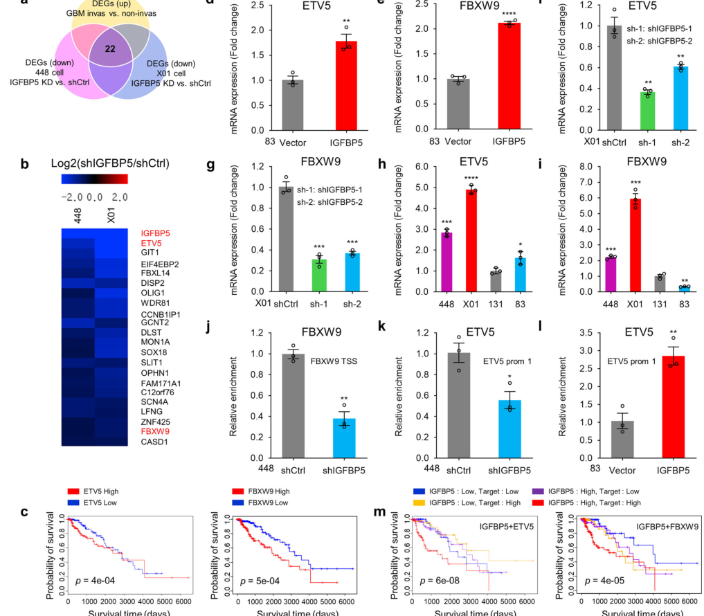

## Question

# Gene Research for Functional Annotation

## ⚠️ CRITICAL: Gene/Protein Identification Context

**BEFORE YOU BEGIN RESEARCH:** You MUST verify you are researching the CORRECT gene/protein. Gene symbols can be ambiguous, especially for less well-characterized genes from non-model organisms.

### Target Gene/Protein Identity (from UniProt):
- **UniProt Accession:** Q5XUX1
- **Protein Description:** RecName: Full=F-box/WD repeat-containing protein 9; AltName: Full=F-box and WD-40 domain-containing protein 9;
- **Gene Information:** Name=FBXW9; Synonyms=FBW9;
- **Organism (full):** Homo sapiens (Human).
- **Protein Family:** Not specified in UniProt
- **Key Domains:** F-box-like_dom_sf. (IPR036047); F-box_dom. (IPR001810); WD40/YVTN_repeat-like_dom_sf. (IPR015943); WD40_PAC1. (IPR020472); WD40_repeat_CS. (IPR019775)

### MANDATORY VERIFICATION STEPS:

1. **Check if the gene symbol "FBXW9" matches the protein description above**
2. **Verify the organism is correct:** Homo sapiens (Human).
3. **Check if protein family/domains align with what you find in literature**
4. **If you find literature for a DIFFERENT gene with the same or similar symbol, STOP**

### If Gene Symbol is Ambiguous or You Cannot Find Relevant Literature:

**DO NOT PROCEED WITH RESEARCH ON A DIFFERENT GENE.** Instead:
- State clearly: "The gene symbol 'FBXW9' is ambiguous or literature is limited for this specific protein"
- Explain what you found (e.g., "Found extensive literature on a different gene with the same symbol in a different organism")
- Describe the protein based ONLY on the UniProt information provided above
- Suggest that the protein function can be inferred from domain/family information

### Research Target:

Please provide a comprehensive research report on the gene **FBXW9** (gene ID: FBXW9, UniProt: Q5XUX1) in human.

The research report should be a detailed narrative explaining the function, biological processes, and localization of the gene product. Citations should be given for all claims.

You should prioritize authoritative reviews and primary scientific literature when conducting research. You can supplement
this with annotations you find in gene/protein databases, but these can be outdated or inaccurate.

We are specifically interested in the primary function of the gene - for enzymes, what reaction is catalyzed, and what is the substrate specificity? For transporters, what is the substrate? For structural proteins or adapters, what is the broader structural role? For signaling molecules, what is the role in the pathway.

We are interested in where in or outside the cell the gene product carries out its function.

We are also interested in the signaling or biochemical pathways in which the gene functions. We are less interested in broad pleiotropic effects, except where these elucidate the precise role.

Include evidence where possible. We are interested in both experimental evidence as well as inference from structure, evolution, or bioinformatic analysis. Precise studies should be prioritized over high-throughput, where available.

## Output

Question: You are an expert researcher providing comprehensive, well-cited information.

Provide detailed information focusing on:
1. Key concepts and definitions with current understanding
2. Recent developments and latest research (prioritize 2023-2024 sources)
3. Current applications and real-world implementations
4. Expert opinions and analysis from authoritative sources
5. Relevant statistics and data from recent studies

Format as a comprehensive research report with proper citations. Include URLs and publication dates where available.
Always prioritize recent, authoritative sources and provide specific citations for all major claims.

# Gene Research for Functional Annotation

## ⚠️ CRITICAL: Gene/Protein Identification Context

**BEFORE YOU BEGIN RESEARCH:** You MUST verify you are researching the CORRECT gene/protein. Gene symbols can be ambiguous, especially for less well-characterized genes from non-model organisms.

### Target Gene/Protein Identity (from UniProt):
- **UniProt Accession:** Q5XUX1
- **Protein Description:** RecName: Full=F-box/WD repeat-containing protein 9; AltName: Full=F-box and WD-40 domain-containing protein 9;
- **Gene Information:** Name=FBXW9; Synonyms=FBW9;
- **Organism (full):** Homo sapiens (Human).
- **Protein Family:** Not specified in UniProt
- **Key Domains:** F-box-like_dom_sf. (IPR036047); F-box_dom. (IPR001810); WD40/YVTN_repeat-like_dom_sf. (IPR015943); WD40_PAC1. (IPR020472); WD40_repeat_CS. (IPR019775)

### MANDATORY VERIFICATION STEPS:

1. **Check if the gene symbol "FBXW9" matches the protein description above**
2. **Verify the organism is correct:** Homo sapiens (Human).
3. **Check if protein family/domains align with what you find in literature**
4. **If you find literature for a DIFFERENT gene with the same or similar symbol, STOP**

### If Gene Symbol is Ambiguous or You Cannot Find Relevant Literature:

**DO NOT PROCEED WITH RESEARCH ON A DIFFERENT GENE.** Instead:
- State clearly: "The gene symbol 'FBXW9' is ambiguous or literature is limited for this specific protein"
- Explain what you found (e.g., "Found extensive literature on a different gene with the same symbol in a different organism")
- Describe the protein based ONLY on the UniProt information provided above
- Suggest that the protein function can be inferred from domain/family information

### Research Target:

Please provide a comprehensive research report on the gene **FBXW9** (gene ID: FBXW9, UniProt: Q5XUX1) in human.

The research report should be a detailed narrative explaining the function, biological processes, and localization of the gene product. Citations should be given for all claims.

You should prioritize authoritative reviews and primary scientific literature when conducting research. You can supplement
this with annotations you find in gene/protein databases, but these can be outdated or inaccurate.

We are specifically interested in the primary function of the gene - for enzymes, what reaction is catalyzed, and what is the substrate specificity? For transporters, what is the substrate? For structural proteins or adapters, what is the broader structural role? For signaling molecules, what is the role in the pathway.

We are interested in where in or outside the cell the gene product carries out its function.

We are also interested in the signaling or biochemical pathways in which the gene functions. We are less interested in broad pleiotropic effects, except where these elucidate the precise role.

Include evidence where possible. We are interested in both experimental evidence as well as inference from structure, evolution, or bioinformatic analysis. Precise studies should be prioritized over high-throughput, where available.

# Research Report: Human **FBXW9** (UniProt **Q5XUX1**) — Functional Annotation and Current Evidence (2023–2024 prioritized)

## Executive summary
FBXW9 (F-box/WD repeat-containing protein 9; gene **FBXW9**, synonym **FBW9**) is a human F-box/WD40 repeat protein that functions as a substrate-recognition component for cullin-RING E3 ubiquitin ligases (CRLs), most directly supported for **SCF/CRL1** by physical interaction with **SKP1** and proteomic association with **CUL1**. (lievens2009arraymappithighthroughput pages 6-8, lee2011thesteadystaterepertoire pages 6-7, lievens2009arraymappithighthroughput pages 5-6). Recent studies (2023–2024) implicate FBXW9 in (i) **breast cancer cell-cycle/proliferation phenotypes** (loss-of-function) and (ii) **glioblastoma stem-like cell invasion** downstream of an **IGFBP5–ROR1/HER2–CREB** axis, where FBXW9 is a CREB-bound transcriptional target and correlates with worse survival. (yu2023acomprehensiveanalysis pages 8-11, lin2023igfbp5isan pages 7-9, lin2023igfbp5isan pages 6-7, lin2023igfbp5isan media 2620dd74). A 2024 study additionally identifies FBXW9 as a **direct p53 transcriptional target** with anti-proliferative effects upon ectopic expression in p53-deficient settings. (shin2024apipelineto pages 1-3). Despite these functional links, **direct biochemical substrates ubiquitinated by human FBXW9 remain largely unvalidated** in the retrieved literature; several proposed substrates (e.g., TP53) are currently supported primarily by prediction and indirect transcriptional readouts. (yu2023acomprehensiveanalysis pages 5-8, yu2023acomprehensiveanalysis pages 8-11).

---

## 1) Key concepts and definitions (current understanding)

### 1.1 F-box proteins, FBXW subfamily, and SCF/CRL architecture
F-box proteins are adaptor/substrate-recognition proteins for **SCF (SKP1–CUL1–F-box) E3 ubiquitin ligases**, where the F-box domain mediates binding to SKP1 and additional domains (e.g., WD40 repeats) mediate substrate binding. In the FBXW subfamily, proteins contain an **F-box domain and multiple WD40 domains**. (yu2023acomprehensiveanalysis pages 1-2, yu2023acomprehensiveanalysis pages 2-5, jeong2023targetinge3ubiquitin pages 3-4).

The 2023 breast cancer-focused analysis explicitly states: “All members of FBXWs contain an F-box domain and multiple WD40 domains.” (yu2023acomprehensiveanalysis pages 1-2). The broader CRL framework is summarized in a 2023 review: CRL1/SCF consists of **CUL1, SKP1, an F-box protein, and RBX1**, with CUL1 as scaffold and RBX1 recruiting E2 enzymes to facilitate ubiquitin transfer. (jeong2023targetinge3ubiquitin pages 3-4).

### 1.2 What “functional annotation” means here
For FBXW9—a non-enzymatic adaptor—primary function is defined by: 
1) **complex membership** (which CRL it binds), 
2) **substrate recognition** (which proteins it recruits for ubiquitination), and 
3) **pathway placement** (signaling or transcriptional circuits that control or are controlled by FBXW9).

---

## 2) Target identity verification (to avoid symbol ambiguity)

The research corpus consistently refers to **human FBXW9** as “F-box and WD repeat domain containing 9” and situates it in the FBXW family of F-box/WD-repeat proteins. (huang2024pancanceranalysisof pages 2-4, yu2023acomprehensiveanalysis pages 1-2). Experimental assay design in a qPCR study used FBXW9 transcript accession **NM_032301**, consistent with the human gene. (dwivedi2020relativequantificationof pages 4-5). These sources align with the UniProt-provided identity (Q5XUX1: F-box/WD repeat-containing protein 9, human) and domain expectations (F-box + WD40 repeats). (yu2023acomprehensiveanalysis pages 1-2, yu2023acomprehensiveanalysis pages 2-5).

---

## 3) Molecular function, complexes, and localization

## 3.1 Complex membership: evidence for SCF/CRL1 association
**SKP1 interaction (direct experimental evidence).** FBXW9 was identified as a SKP1-interacting prey in a high-throughput **array MAPPIT** interactome screen and validated by **co-immunoprecipitation** in **HEK293T** cells (E-tagged SKP1 bait; Flag-tagged prey including FBXW9). (lievens2009arraymappithighthroughput pages 6-8, lievens2009arraymappithighthroughput pages 5-6).

**CUL1 association (proteomics evidence).** In affinity purification–mass spectrometry of tandem-tagged **CUL1** complexes in HEK293-derived cells, FBXW9 was among the F-box proteins that co-purified with CUL1 (reported with substantial spectral counts), supporting its presence in the cellular repertoire of SCF assemblies. (lee2011thesteadystaterepertoire pages 6-7).

Together, these data support annotation of FBXW9 as a substrate receptor/adaptor in **SCF/CRL1** E3 ligase complexes. (lievens2009arraymappithighthroughput pages 6-8, lee2011thesteadystaterepertoire pages 6-7).

## 3.2 Potential role in CRL7/CUL7: conflicting secondary-source statements
A 2023 review states: “**unlike SCF, Fbxw9 is the only known substrate receptor for CRL7**.” (jeong2023targetinge3ubiquitin pages 3-4). However, CUL7/CRL7-focused reviews from 2018 and 2020 emphasize **FBXW8** (and sometimes FBXW11) as the F-box proteins shown to bind CUL7, listing multiple CRL7 substrates (e.g., cyclin D1, IRS1, GRASP65) in association with FBXW8—not FBXW9. (shi2020thefunctionalanalysis pages 1-2, jang2018chromatinboundcullinringligases pages 5-6).

**Interpretation:** The strongest *direct* evidence assembled here supports FBXW9’s SCF/CRL1 role (SKP1 + CUL1 association). The CRL7 claim appears **review-level** and is not corroborated by the retrieved CUL7-specialist reviews; therefore, CRL7 assignment should be treated as **uncertain** pending primary data pinpointing a CUL7–FBXW9 complex in human cells. (jeong2023targetinge3ubiquitin pages 3-4, shi2020thefunctionalanalysis pages 1-2, jang2018chromatinboundcullinringligases pages 5-6).

## 3.3 Subcellular localization
A 2024 pan-cancer FBXW-family analysis compiling UniProt/GeneCards annotations reports FBXW9 localization as **“Cytosol”** and notes most FBXW members localize to cytoplasm/cytosol. (huang2024pancanceranalysisof pages 4-5). This supports a working localization annotation but is **database-derived**, not microscopy-based evidence specific to FBXW9. (huang2024pancanceranalysisof pages 4-5).

---

## 4) Pathways and biological roles: what is known (and what is inferred)

## 4.1 p53 regulatory axis (2024): FBXW9 as a direct p53 target gene
A 2024 study building a pipeline for p53 effector identification reports that **p53 directly binds and transactivates Fbxw9**:
- **ChIP-seq/ChIP-qPCR** evidence of p53 occupancy at the promoter region
- **Promoter luciferase reporter** activation by p53
- Reduced target expression upon **p53 knockdown**
- **Nutlin-3** p53 activation induced targets in p53-WT but not p53-null human cells
- Tumors with wild-type p53 had higher target mRNA than p53-mutant tumors in TCGA analyses
- Overexpression of the targets (including Fbxw9) suppressed proliferation of p53-deficient MEFs
(shin2024apipelineto pages 1-3).

**Functional implication:** This positions FBXW9 downstream of p53 transcriptional programs; the study supports an anti-proliferative role when FBXW9 is ectopically expressed in p53-deficient settings, but does not define ubiquitination substrates. (shin2024apipelineto pages 1-3).

## 4.2 Glioblastoma invasion pathway (2023): IGFBP5–ROR1/HER2–CREB → FBXW9
A 2023 *Nature Communications* study reports FBXW9 as part of a CREB-driven transcriptional module downstream of **IGFBP5** signaling through **ROR1/HER2**:
- FBXW9 is higher in invasive vs non-invasive glioma stem-like cells; IGFBP5 perturbation modulates FBXW9 expression. (lin2023igfbp5isan pages 6-7).
- **ChIP-qPCR** indicates CREB enrichment at the FBXW9 locus and reduced CREB binding at the FBXW9 TSS upon IGFBP5 knockdown (reported **P = 0.002** for reduced binding). (lin2023igfbp5isan pages 7-9).
- **siRNA against FBXW9** reduced invasion in GSC lines (X01, 448), supporting a causal contribution to invasion. (lin2023igfbp5isan pages 6-7).
- Survival associations: high FBXW9 correlated with worse patient survival in TCGA glioma/LGG analyses (text-reported **P = 0.0005** for FBXW9; and **P = 0.00004** for combined IGFBP5+FBXW9 stratification). (lin2023igfbp5isan pages 7-9).
- The paper includes Kaplan–Meier panels for FBXW9 and IGFBP5+FBXW9 survival stratification (figure evidence). (lin2023igfbp5isan media 2620dd74).

**Interpretation:** FBXW9 is experimentally supported as a downstream effector in an invasion-promoting transcriptional axis, but the molecular ubiquitination targets responsible for the invasion phenotype are not identified in the retrieved excerpts. (lin2023igfbp5isan pages 6-7).

## 4.3 Breast cancer phenotypes (2023): proliferation/cell cycle and inferred TP53–p21 connection
A 2023 integrative analysis in breast cancer reports:
- FBXW9 is frequently upregulated across cancer types and highlighted as a potential prognostic/immunologic biomarker. (yu2023acomprehensiveanalysis pages 1-2, yu2023acomprehensiveanalysis pages 2-5).
- In breast cancer cell lines (SUM159, MDA-MB-231), **siRNA knockdown of FBXW9** reduced proliferation and colony formation and induced **G0/G1 arrest** (fewer S-phase cells). (yu2023acomprehensiveanalysis pages 8-11).
- **Substrate prediction** (UbiBrowser) suggested TP53 as a hub among candidate substrates; experimentally, FBXW9 knockdown increased **p21** expression (a canonical TP53 target), and altered cyclins (CCNA2/CCNB1), consistent with activation of a cell-cycle arrest program. (yu2023acomprehensiveanalysis pages 5-8, yu2023acomprehensiveanalysis pages 8-11).
- FBXW9 repression of **NECTIN2** was reported as an experimental regulatory relationship in breast cancer cells. (yu2023acomprehensiveanalysis pages 11-13).

**Interpretation and limitation:** While cell phenotypes and downstream transcriptional changes are experimentally shown, **TP53 as an FBXW9 ubiquitination substrate remains predicted** (not shown by direct ubiquitination/degradation assays in the retrieved text). (yu2023acomprehensiveanalysis pages 5-8).

---

## 5) Recent developments and “latest research” (prioritizing 2023–2024)

Key 2023–2024 advances for FBXW9 recovered here:
1) **IGFBP5–ROR1/HER2–CREB axis in glioblastoma** identifying FBXW9 as a CREB target and invasion mediator with survival associations (2023, high-impact primary study). (lin2023igfbp5isan pages 7-9, lin2023igfbp5isan pages 6-7, lin2023igfbp5isan media 2620dd74).
2) **Breast cancer functional assays** showing FBXW9 knockdown suppresses proliferation and affects cell cycle (2023). (yu2023acomprehensiveanalysis pages 8-11).
3) **p53 effector pipeline** demonstrating direct transcriptional regulation of FBXW9 by p53, positioning FBXW9 within canonical tumor suppressor signaling (2024). (shin2024apipelineto pages 1-3).
4) **CRL architecture reviews** explicitly discussing CRL composition and offering the (currently disputed) CRL7 receptor claim for FBXW9 (2023 review). (jeong2023targetinge3ubiquitin pages 3-4).

---

## 6) Current applications and real-world implementations

### 6.1 Biomarker research (cancer prognosis, immune context)
Multiple analyses position FBXW9 as a candidate biomarker in cancer (especially breast cancer), using TCGA/CPTAC and immune infiltration correlations; a 2024 family-level study similarly links FBXW members (including FBXW9) to prognosis and immune infiltration patterns. (yu2023acomprehensiveanalysis pages 2-5, yu2023acomprehensiveanalysis pages 11-13, huang2024pancanceranalysisof pages 2-4).

In glioma, FBXW9 expression stratifies survival and worsens prognosis in combination with IGFBP5 (shown in survival plots). (lin2023igfbp5isan pages 7-9, lin2023igfbp5isan media 2620dd74).

### 6.2 Assay design / clinical molecular diagnostics support role (reference gene)
A practical non-mechanistic application: a 2020 study identifying stable reference genes for BCL2 qPCR quantification across hematologic malignancy samples selected **FBXW9** among the most stable genes and provides primer sequences targeting **NM_032301**. (dwivedi2020relativequantificationof pages 4-5, dwivedi2020relativequantificationof pages 5-7).

---

## 7) Relevant statistics and quantitative findings (recent studies)

- **Glioma survival association:** FBXW9 high vs low expression associated with poorer survival in TCGA low-grade glioma analyses (**P = 0.0005**), and combined high IGFBP5+FBXW9 associated with worst survival (**P = 0.00004**). (lin2023igfbp5isan pages 7-9).
- **CREB binding regulation:** Reduced CREB binding at the FBXW9 TSS upon IGFBP5 knockdown in ChIP-qPCR (**P = 0.002**). (lin2023igfbp5isan pages 7-9).
- **Therapeutic perturbation upstream of FBXW9 axis:** CRISPR editing of IGFBP5 reduced invasion in GSCs (e.g., **P = 0.0004** in one invasion assay comparison) and improved survival in mouse models (log-rank **P = 0.001** for sgScramble vs sgIGFBP5; **P = 0.0006** PBS vs sgIGFBP5). (lin2023igfbp5isan pages 9-11).

(These quantify the pathway/clinical associations in which FBXW9 participates, even when FBXW9 itself is not the direct therapeutic target in that study.) (lin2023igfbp5isan pages 9-11).

---

## 8) Expert synthesis and consensus view (authoritative sources)

- **Consensus on molecular role:** Across primary studies and reviews, FBXW9 is consistently categorized as an F-box/WD40 protein expected to function as a substrate recognition component in SCF-like CRLs, mediated by its F-box (complex assembly) and WD40 (substrate binding) architecture. (yu2023acomprehensiveanalysis pages 1-2, jeong2023targetinge3ubiquitin pages 3-4).
- **Consensus on knowledge gaps:** Even in cancer-focused analyses, authors note that FBXW9 substrates and mechanisms are not well established compared with canonical FBXW members (e.g., FBXW7), and substrate lists are often predictive. (yu2023acomprehensiveanalysis pages 8-11, yu2023acomprehensiveanalysis pages 5-8).
- **CRL7 ambiguity:** A 2023 review asserts a unique CRL7 substrate receptor role for FBXW9, but CUL7/CRL7-focused reviews emphasize FBXW8 (and FBXW11) as CUL7-binding F-box proteins. This discrepancy indicates that CRL7 assignment for FBXW9 is not settled in the retrieved evidence and should be treated cautiously. (jeong2023targetinge3ubiquitin pages 3-4, shi2020thefunctionalanalysis pages 1-2, jang2018chromatinboundcullinringligases pages 5-6).

---

## 9) Evidence map: what is experimentally supported vs inferred

| Claim/topic | Evidence type | Key details/quantitative stats | Primary source | URL/DOI | Notes/limitations |
|---|---|---|---|---|---|
| FBXW9 identity as a human F-box/WD40 protein | Domain/family annotation supported by cancer-family analyses | FBXW9 is included among the 10 human FBXW proteins; FBXW family members contain an F-box domain plus multiple WD40 domains; FBXW9 length reported as 458 aa and localization as cytosol in UniProt/GeneCards-based family annotation (yu2023acomprehensiveanalysis pages 1-2, yu2023acomprehensiveanalysis pages 2-5, huang2024pancanceranalysisof pages 4-5) | Yu 2023, *Int J Mol Sci*; Huang 2024, *Front Immunol* | https://doi.org/10.3390/ijms24065262; https://doi.org/10.3389/fimmu.2022.1084339 | Strong for family/domain assignment; not a direct biochemical assay on Q5XUX1 alone |
| FBXW9 binds SKP1 | Experimental protein–protein interaction | Identified in array MAPPIT screen as a novel SKP1 interactor and validated by co-immunoprecipitation in HEK293T cells using E-tagged SKP1 bait and Flag-tagged FBXW9 prey (lievens2009arraymappithighthroughput pages 6-8, lievens2009arraymappithighthroughput pages 5-6) | Lievens 2009, *J Proteome Res* | https://doi.org/10.1021/pr8005167 | Direct interaction evidence supports SCF-type adaptor behavior; does not by itself prove substrate specificity or ubiquitination activity |
| FBXW9 associates with CUL1-containing SCF assemblies | AP-MS proteomics | Tandem-tagged CUL1 affinity purification in HEK293-derived cells recovered FBXW9 among 42 CUL1-associated F-box proteins; FBXW9 reported with ~61 spectral counts (lee2011thesteadystaterepertoire pages 6-7) | Lee 2011, *Mol Cell Proteomics* | https://doi.org/10.1074/mcp.m110.006460 | Co-purification is strong proteomic evidence for SCF association, but not an orthogonal FBXW9-specific co-IP |
| FBXW9 as a putative substrate receptor in CRL7 | Review-level mechanistic claim | Review states: “However, unlike SCF, Fbxw9 is the only known substrate receptor for CRL7,” in context of cullin-RING ligase architecture (jeong2023targetinge3ubiquitin pages 3-4) | Jeong 2023, *Exp Mol Med* | https://doi.org/10.1038/s12276-023-01087-w | Useful expert summary, but secondary-source claim; underlying primary evidence was not recovered here. Note potential inconsistency within the review’s broader Cul7/Crl7 discussion (jeong2023targetinge3ubiquitin pages 2-3) |
| Subcellular localization | Database/family annotation | Family-level analyses cite FBXW9 localization as “cytosol”; most FBXW members localize to cytoplasm/cytosol (huang2024pancanceranalysisof pages 2-4, huang2024pancanceranalysisof pages 4-5) | Huang 2024, *Front Immunol* | https://doi.org/10.3389/fimmu.2022.1084339 | Localization appears database-derived rather than from microscopy/fractionation experiments specific to FBXW9 |
| FBXW9 is a direct p53 target gene | Experimental transcriptional regulation | ChIP-seq/ChIP-qPCR showed p53 occupancy near Fbxw9 promoter; p53 increased luciferase reporter activity; p53 knockdown reduced expression; Nutlin-3 induced Fbxw9 in p53-WT but not p53-null human cells; tumors with WT p53 had higher FBXW9 mRNA than p53-mutant tumors (shin2024apipelineto pages 1-3) | Shin 2024, *Genes & Diseases* | https://doi.org/10.1016/j.gendis.2023.03.009 | Strong evidence that FBXW9 is p53-responsive; does not identify FBXW9 protein substrates |
| FBXW9 may regulate TP53/p21 axis in breast cancer | Mixed: prediction + perturbation experiment | UbiBrowser predicted 36 substrates with TP53 as hub; siRNA knockdown of FBXW9 in SUM159 and MDA-MB-231 cells increased p21 mRNA/protein and reduced CCNA2/CCNB1, consistent with G0/G1 arrest (yu2023acomprehensiveanalysis pages 5-8, yu2023acomprehensiveanalysis pages 8-11) | Yu 2023, *Int J Mol Sci* | https://doi.org/10.3390/ijms24065262 | TP53 as substrate remains predicted, not biochemically validated by ubiquitination/degradation assay |
| FBXW9 promotes breast cancer cell proliferation/cell-cycle progression | Experimental cell biology | siRNA-mediated FBXW9 silencing in SUM159 and MDA-MB-231 reduced proliferation and colony formation and induced G0/G1 arrest with fewer S-phase cells (yu2023acomprehensiveanalysis pages 8-11) | Yu 2023, *Int J Mol Sci* | https://doi.org/10.3390/ijms24065262 | Functional evidence in vitro; mechanism upstream/downstream of TP53 remains inferential |
| FBXW9 correlates with MYC activity, stemness, and immune features in breast cancer | Bioinformatic correlation + limited perturbation | FBXW9 positively correlated with MYC signaling and cancer stemness; knockdown repressed NECTIN2 and altered immune-related genes including CD274/PDCD1LG2; high FBXW9 associated with poorer outcome and poor prognosis under anti-PD1 treatment in analyzed cohorts (yu2023acomprehensiveanalysis pages 5-8, yu2023acomprehensiveanalysis pages 11-13) | Yu 2023, *Int J Mol Sci* | https://doi.org/10.3390/ijms24065262 | Mostly correlative/transcriptomic; no direct mechanistic link to immune evasion established |
| FBXW9 is downstream of IGFBP5–ROR1/HER2–CREB signaling in glioblastoma stem-like cells | Experimental pathway mapping | FBXW9 expression higher in invasive vs non-invasive GSCs; IGFBP5 overexpression increased, and IGFBP5 knockdown decreased, FBXW9; CREB ChIP-qPCR showed enrichment at FBXW9 locus and reduced binding after shIGFBP5; CREB overexpression rescued invasion suppressed by IGFBP5/HER2/ROR1 knockdown (lin2023igfbp5isan pages 11-12, lin2023igfbp5isan pages 7-9, lin2023igfbp5isan pages 6-7) | Lin 2023, *Nat Commun* | https://doi.org/10.1038/s41467-023-37306-1 | Strong pathway-position evidence, but does not show FBXW9 biochemical substrates |
| FBXW9 contributes to glioblastoma invasion | Experimental knockdown + clinical correlation | siRNA against FBXW9 significantly decreased invasion capacity in X01 and 448 GSC lines; high FBXW9 associated with worse glioma/LGG survival, including FBXW9 alone (P = 0.0005) and combined IGFBP5+FBXW9 signature (P = 0.00004) (lin2023igfbp5isan pages 7-9, lin2023igfbp5isan pages 6-7, lin2023igfbp5isan media 2620dd74) | Lin 2023, *Nat Commun* | https://doi.org/10.1038/s41467-023-37306-1 | Invasion role is experimentally supported, but reported invasion quantification for direct FBXW9 knockdown is largely in supplementary figures |
| Upregulation and prognosis across cancers | Bioinformatic pan-cancer analysis | FBXW9 upregulated in many tumor types; family-level analyses implicate FBXW9 as detrimental in selected cancers and associated with immune infiltration/stromal features (huang2024pancanceranalysisof pages 2-4, yu2023acomprehensiveanalysis pages 2-5, yu2023acomprehensiveanalysis pages 11-13) | Yu 2023, *Int J Mol Sci*; Huang 2024, *Front Immunol* | https://doi.org/10.3390/ijms24065262; https://doi.org/10.3389/fimmu.2022.1084339 | Important for hypothesis generation and biomarker studies, but not direct function |
| Disease-target associations in Open Targets | Database association | Open Targets lists low-score associations for FBXW9 with oral mucosa leukoplakia, familial isolated congenital asplenia, X-linked retinal dysplasia, central areolar choroidal dystrophy, and familial exudative vitreoretinopathy (OpenTargets Search: -FBXW9) | Open Targets Platform | https://platform.opentargets.org/target/ENSG00000132004 | Evidence sizes were small and literature fields were empty in retrieved context; should not be overinterpreted |
| What is *not* yet established for human FBXW9 | Negative/uncertain evidence summary | No directly validated endogenous ubiquitination substrate for human FBXW9 was recovered; no direct catalytic assay, no substrate degron definition, and no definitive microscopy-based localization were found in retrieved literature (yu2023acomprehensiveanalysis pages 8-11, yu2023acomprehensiveanalysis pages 5-8) | Synthesis from available sources | N/A | The literature supports FBXW9 as an F-box substrate-recognition protein with cancer-related functions, but its precise biochemical substrate repertoire remains largely unresolved |
| FBXW9 as a stable-expression reference gene in hematologic malignancy qPCR | Experimental application, not mechanism | In a qPCR normalization study across 78 samples, PTCD2, PPP1R3B, and FBXW9 were among the most stable low-variance genes selected as candidate reference genes; FBXW9 primer set targeted NM_032301 (dwivedi2020relativequantificationof pages 4-5, dwivedi2020relativequantificationof pages 5-7) | Dwivedi 2020, *PLoS One* | https://doi.org/10.1371/journal.pone.0236338 | Useful real-world implementation for assay design; does not illuminate FBXW9 molecular function |
| Expert consensus framing | Review/expert analysis | Reviews describe FBXW proteins as substrate-recognition subunits of SCF E3 ligases that use F-box domains to assemble into SCF complexes and WD40 repeats to bind substrates; FBXW9 is repeatedly highlighted as poorly characterized compared with FBXW1/FBXW7 (yu2023acomprehensiveanalysis pages 1-2, yu2023acomprehensiveanalysis pages 8-11, jeong2023targetinge3ubiquitin pages 3-4) | Yu 2023, *Int J Mol Sci*; Jeong 2023, *Exp Mol Med* | https://doi.org/10.3390/ijms24065262; https://doi.org/10.1038/s12276-023-01087-w | Good high-level context; for FBXW9 specifically, many claims remain extrapolated from family behavior rather than direct primary evidence |

*Table: This table separates experimentally supported findings from predictions and database associations for human FBXW9 (Q5XUX1). It is useful for quickly distinguishing what is known with direct evidence versus what remains inferred or weakly supported.*

---

## 10) Conclusions and prioritized next steps for functional annotation

1) **Highest-confidence functional annotation:** FBXW9 is an F-box/WD40 **substrate-recognition adaptor** that binds **SKP1** and associates with **CUL1**-based SCF assemblies; it is likely cytosolic/cytoplasmic. (lievens2009arraymappithighthroughput pages 6-8, lee2011thesteadystaterepertoire pages 6-7, huang2024pancanceranalysisof pages 4-5).
2) **Most compelling 2023–2024 biology:** FBXW9 is transcriptionally positioned downstream of **CREB** in glioblastoma invasion programs and downstream of **p53** as a direct transcriptional target; in breast cancer cells, FBXW9 supports proliferation/cell-cycle progression. (lin2023igfbp5isan pages 7-9, shin2024apipelineto pages 1-3, yu2023acomprehensiveanalysis pages 8-11).
3) **Main knowledge gap:** Definitive **endogenous protein substrates** of FBXW9 (ubiquitination targets, degrons, linkage types, and whether degradation vs non-proteolytic ubiquitination) are not established in the retrieved primary evidence; TP53-centered models remain partly predictive. (yu2023acomprehensiveanalysis pages 5-8, yu2023acomprehensiveanalysis pages 8-11).

---

## Key source list (URLs and publication dates)
- Lievens et al. “Array MAPPIT: high-throughput interactome analysis in mammalian cells.” *Journal of Proteome Research*. **2009-01**. https://doi.org/10.1021/pr8005167 (lievens2009arraymappithighthroughput pages 6-8)
- Lee et al. “The Steady-State Repertoire of Human SCF Ubiquitin Ligase Complexes…” *Molecular & Cellular Proteomics*. **2011-05**. https://doi.org/10.1074/mcp.m110.006460 (lee2011thesteadystaterepertoire pages 6-7)
- Yu et al. “A Comprehensive Analysis Revealing FBXW9 as a Potential Prognostic and Immunological Biomarker in Breast Cancer.” *International Journal of Molecular Sciences*. **2023-03**. https://doi.org/10.3390/ijms24065262 (yu2023acomprehensiveanalysis pages 1-2)
- Lin et al. “IGFBP5 is an ROR1 ligand promoting glioblastoma invasion via ROR1/HER2-CREB signaling axis.” *Nature Communications*. **2023-03**. https://doi.org/10.1038/s41467-023-37306-1 (lin2023igfbp5isan pages 7-9)
- Jeong et al. “Targeting E3 ubiquitin ligases and their adaptors as a therapeutic strategy for metabolic diseases.” *Experimental & Molecular Medicine*. **2023-10**. https://doi.org/10.1038/s12276-023-01087-w (jeong2023targetinge3ubiquitin pages 3-4)
- Shin et al. “A pipeline to characterize p53 effectors…” *Genes & Diseases*. **2024-03**. https://doi.org/10.1016/j.gendis.2023.03.009 (shin2024apipelineto pages 1-3)
- Huang et al. “Pan-cancer analysis of FBXW family…” *Frontiers in Immunology*. **2024-12**. https://doi.org/10.3389/fimmu.2022.1084339 (huang2024pancanceranalysisof pages 4-5)

---

### Notes on scope and limitations
This report is constrained to the retrieved evidence in the tool context. Several claims in secondary reviews (e.g., CRL7 receptor assignment) could not be traced here to a specific underlying primary demonstration for FBXW9; therefore, they are explicitly presented as **review-level** claims with noted conflicts. (jeong2023targetinge3ubiquitin pages 3-4, shi2020thefunctionalanalysis pages 1-2).

References

1. (lievens2009arraymappithighthroughput pages 6-8): Sam Lievens, Nele Vanderroost, José Van der Heyden, Viola Gesellchen, Marc Vidal, and Jan Tavernier. Array mappit: high-throughput interactome analysis in mammalian cells. Journal of proteome research, 8 2:877-86, Jan 2009. URL: https://doi.org/10.1021/pr8005167, doi:10.1021/pr8005167. This article has 76 citations and is from a peer-reviewed journal.

2. (lee2011thesteadystaterepertoire pages 6-7): J. Eugene Lee, Michael J. Sweredoski, Robert L.J. Graham, Natalie J. Kolawa, Geoffrey T. Smith, Sonja Hess, and Raymond J. Deshaies. The steady-state repertoire of human scf ubiquitin ligase complexes does not require ongoing nedd8 conjugation. Molecular &amp; Cellular Proteomics, 10:M110.006460, May 2011. URL: https://doi.org/10.1074/mcp.m110.006460, doi:10.1074/mcp.m110.006460. This article has 81 citations and is from a domain leading peer-reviewed journal.

3. (lievens2009arraymappithighthroughput pages 5-6): Sam Lievens, Nele Vanderroost, José Van der Heyden, Viola Gesellchen, Marc Vidal, and Jan Tavernier. Array mappit: high-throughput interactome analysis in mammalian cells. Journal of proteome research, 8 2:877-86, Jan 2009. URL: https://doi.org/10.1021/pr8005167, doi:10.1021/pr8005167. This article has 76 citations and is from a peer-reviewed journal.

4. (yu2023acomprehensiveanalysis pages 8-11): Shiyi Yu, Zhengyan Liang, Zhehao Fan, Binjie Cao, Ning Wang, Rui Wu, and Haibo Sun. A comprehensive analysis revealing fbxw9 as a potential prognostic and immunological biomarker in breast cancer. International Journal of Molecular Sciences, 24:5262, Mar 2023. URL: https://doi.org/10.3390/ijms24065262, doi:10.3390/ijms24065262. This article has 8 citations.

5. (lin2023igfbp5isan pages 7-9): Weiwei Lin, Rui Niu, Seong-Min Park, Yan Zou, Sung Soo Kim, Xue Xia, Songge Xing, Qingshan Yang, Xinhong Sun, Zheng Yuan, Shuchang Zhou, Dongya Zhang, Hyung Joon Kwon, Saewhan Park, Chan Il Kim, Harim Koo, Yang Liu, Haigang Wu, Meng Zheng, Heon Yoo, Bingyang Shi, Jong Bae Park, and Jinlong Yin. Igfbp5 is an ror1 ligand promoting glioblastoma invasion via ror1/her2-creb signaling axis. Nature Communications, Mar 2023. URL: https://doi.org/10.1038/s41467-023-37306-1, doi:10.1038/s41467-023-37306-1. This article has 59 citations and is from a highest quality peer-reviewed journal.

6. (lin2023igfbp5isan pages 6-7): Weiwei Lin, Rui Niu, Seong-Min Park, Yan Zou, Sung Soo Kim, Xue Xia, Songge Xing, Qingshan Yang, Xinhong Sun, Zheng Yuan, Shuchang Zhou, Dongya Zhang, Hyung Joon Kwon, Saewhan Park, Chan Il Kim, Harim Koo, Yang Liu, Haigang Wu, Meng Zheng, Heon Yoo, Bingyang Shi, Jong Bae Park, and Jinlong Yin. Igfbp5 is an ror1 ligand promoting glioblastoma invasion via ror1/her2-creb signaling axis. Nature Communications, Mar 2023. URL: https://doi.org/10.1038/s41467-023-37306-1, doi:10.1038/s41467-023-37306-1. This article has 59 citations and is from a highest quality peer-reviewed journal.

7. (lin2023igfbp5isan media 2620dd74): Weiwei Lin, Rui Niu, Seong-Min Park, Yan Zou, Sung Soo Kim, Xue Xia, Songge Xing, Qingshan Yang, Xinhong Sun, Zheng Yuan, Shuchang Zhou, Dongya Zhang, Hyung Joon Kwon, Saewhan Park, Chan Il Kim, Harim Koo, Yang Liu, Haigang Wu, Meng Zheng, Heon Yoo, Bingyang Shi, Jong Bae Park, and Jinlong Yin. Igfbp5 is an ror1 ligand promoting glioblastoma invasion via ror1/her2-creb signaling axis. Nature Communications, Mar 2023. URL: https://doi.org/10.1038/s41467-023-37306-1, doi:10.1038/s41467-023-37306-1. This article has 59 citations and is from a highest quality peer-reviewed journal.

8. (shin2024apipelineto pages 1-3): June-Ha Shin, Hwa-Ryeon Kim, and Jae-Seok Roe. A pipeline to characterize p53 effectors by integrative cistrome and transcriptome analysis in a genetically-defined organoid model. Mar 2024. URL: https://doi.org/10.1016/j.gendis.2023.03.009, doi:10.1016/j.gendis.2023.03.009. This article has 0 citations.

9. (yu2023acomprehensiveanalysis pages 5-8): Shiyi Yu, Zhengyan Liang, Zhehao Fan, Binjie Cao, Ning Wang, Rui Wu, and Haibo Sun. A comprehensive analysis revealing fbxw9 as a potential prognostic and immunological biomarker in breast cancer. International Journal of Molecular Sciences, 24:5262, Mar 2023. URL: https://doi.org/10.3390/ijms24065262, doi:10.3390/ijms24065262. This article has 8 citations.

10. (yu2023acomprehensiveanalysis pages 1-2): Shiyi Yu, Zhengyan Liang, Zhehao Fan, Binjie Cao, Ning Wang, Rui Wu, and Haibo Sun. A comprehensive analysis revealing fbxw9 as a potential prognostic and immunological biomarker in breast cancer. International Journal of Molecular Sciences, 24:5262, Mar 2023. URL: https://doi.org/10.3390/ijms24065262, doi:10.3390/ijms24065262. This article has 8 citations.

11. (yu2023acomprehensiveanalysis pages 2-5): Shiyi Yu, Zhengyan Liang, Zhehao Fan, Binjie Cao, Ning Wang, Rui Wu, and Haibo Sun. A comprehensive analysis revealing fbxw9 as a potential prognostic and immunological biomarker in breast cancer. International Journal of Molecular Sciences, 24:5262, Mar 2023. URL: https://doi.org/10.3390/ijms24065262, doi:10.3390/ijms24065262. This article has 8 citations.

12. (jeong2023targetinge3ubiquitin pages 3-4): Yelin Jeong, Ah-Reum Oh, Young Hoon Jung, HyunJoon Gi, Young Un Kim, and KyeongJin Kim. Targeting e3 ubiquitin ligases and their adaptors as a therapeutic strategy for metabolic diseases. Experimental &amp; Molecular Medicine, 55:2097-2104, Oct 2023. URL: https://doi.org/10.1038/s12276-023-01087-w, doi:10.1038/s12276-023-01087-w. This article has 62 citations and is from a peer-reviewed journal.

13. (huang2024pancanceranalysisof pages 2-4): Tingting Huang, XIaoxiao OuYang, Jiwei Li, Bingbing Shi, Zhengda Shan, Zhiyuan Shi, and Zhangru Yang. Pan-cancer analysis of fbxw family with potential implications in prognosis and immune infiltration. Frontiers in Immunology, Dec 2024. URL: https://doi.org/10.3389/fimmu.2022.1084339, doi:10.3389/fimmu.2022.1084339. This article has 6 citations and is from a peer-reviewed journal.

14. (dwivedi2020relativequantificationof pages 4-5): Nehanjali Dwivedi, Sreejeta Mondal, Smitha P. K., Sowmya T., Kartik Sachdeva, Christopher Bathula, Vishnupriyan K., Nataraj K. S., Sharat Damodar, Sujan K. Dhar, and Manjula Das. Relative quantification of bcl2 mrna for diagnostic usage needs stable uncontrolled genes as reference. PLoS ONE, 15:e0236338, Aug 2020. URL: https://doi.org/10.1371/journal.pone.0236338, doi:10.1371/journal.pone.0236338. This article has 5 citations and is from a peer-reviewed journal.

15. (shi2020thefunctionalanalysis pages 1-2): Le Shi, Dongyue Du, Yunhua Peng, Jiankang Liu, and Jiangang Long. The functional analysis of cullin 7 e3 ubiquitin ligases in cancer. Oncogenesis, Oct 2020. URL: https://doi.org/10.1038/s41389-020-00276-w, doi:10.1038/s41389-020-00276-w. This article has 34 citations and is from a domain leading peer-reviewed journal.

16. (jang2018chromatinboundcullinringligases pages 5-6): Sang-Min Jang, Christophe E. Redon, and Mirit I. Aladjem. Chromatin-bound cullin-ring ligases: regulatory roles in dna replication and potential targeting for cancer therapy. Frontiers in Molecular Biosciences, Mar 2018. URL: https://doi.org/10.3389/fmolb.2018.00019, doi:10.3389/fmolb.2018.00019. This article has 59 citations.

17. (huang2024pancanceranalysisof pages 4-5): Tingting Huang, XIaoxiao OuYang, Jiwei Li, Bingbing Shi, Zhengda Shan, Zhiyuan Shi, and Zhangru Yang. Pan-cancer analysis of fbxw family with potential implications in prognosis and immune infiltration. Frontiers in Immunology, Dec 2024. URL: https://doi.org/10.3389/fimmu.2022.1084339, doi:10.3389/fimmu.2022.1084339. This article has 6 citations and is from a peer-reviewed journal.

18. (yu2023acomprehensiveanalysis pages 11-13): Shiyi Yu, Zhengyan Liang, Zhehao Fan, Binjie Cao, Ning Wang, Rui Wu, and Haibo Sun. A comprehensive analysis revealing fbxw9 as a potential prognostic and immunological biomarker in breast cancer. International Journal of Molecular Sciences, 24:5262, Mar 2023. URL: https://doi.org/10.3390/ijms24065262, doi:10.3390/ijms24065262. This article has 8 citations.

19. (dwivedi2020relativequantificationof pages 5-7): Nehanjali Dwivedi, Sreejeta Mondal, Smitha P. K., Sowmya T., Kartik Sachdeva, Christopher Bathula, Vishnupriyan K., Nataraj K. S., Sharat Damodar, Sujan K. Dhar, and Manjula Das. Relative quantification of bcl2 mrna for diagnostic usage needs stable uncontrolled genes as reference. PLoS ONE, 15:e0236338, Aug 2020. URL: https://doi.org/10.1371/journal.pone.0236338, doi:10.1371/journal.pone.0236338. This article has 5 citations and is from a peer-reviewed journal.

20. (lin2023igfbp5isan pages 9-11): Weiwei Lin, Rui Niu, Seong-Min Park, Yan Zou, Sung Soo Kim, Xue Xia, Songge Xing, Qingshan Yang, Xinhong Sun, Zheng Yuan, Shuchang Zhou, Dongya Zhang, Hyung Joon Kwon, Saewhan Park, Chan Il Kim, Harim Koo, Yang Liu, Haigang Wu, Meng Zheng, Heon Yoo, Bingyang Shi, Jong Bae Park, and Jinlong Yin. Igfbp5 is an ror1 ligand promoting glioblastoma invasion via ror1/her2-creb signaling axis. Nature Communications, Mar 2023. URL: https://doi.org/10.1038/s41467-023-37306-1, doi:10.1038/s41467-023-37306-1. This article has 59 citations and is from a highest quality peer-reviewed journal.

21. (jeong2023targetinge3ubiquitin pages 2-3): Yelin Jeong, Ah-Reum Oh, Young Hoon Jung, HyunJoon Gi, Young Un Kim, and KyeongJin Kim. Targeting e3 ubiquitin ligases and their adaptors as a therapeutic strategy for metabolic diseases. Experimental &amp; Molecular Medicine, 55:2097-2104, Oct 2023. URL: https://doi.org/10.1038/s12276-023-01087-w, doi:10.1038/s12276-023-01087-w. This article has 62 citations and is from a peer-reviewed journal.

22. (lin2023igfbp5isan pages 11-12): Weiwei Lin, Rui Niu, Seong-Min Park, Yan Zou, Sung Soo Kim, Xue Xia, Songge Xing, Qingshan Yang, Xinhong Sun, Zheng Yuan, Shuchang Zhou, Dongya Zhang, Hyung Joon Kwon, Saewhan Park, Chan Il Kim, Harim Koo, Yang Liu, Haigang Wu, Meng Zheng, Heon Yoo, Bingyang Shi, Jong Bae Park, and Jinlong Yin. Igfbp5 is an ror1 ligand promoting glioblastoma invasion via ror1/her2-creb signaling axis. Nature Communications, Mar 2023. URL: https://doi.org/10.1038/s41467-023-37306-1, doi:10.1038/s41467-023-37306-1. This article has 59 citations and is from a highest quality peer-reviewed journal.

23. (OpenTargets Search: -FBXW9): Open Targets Query (-FBXW9, 5 results). Buniello, A. et al. (2025). Open Targets Platform: facilitating therapeutic hypotheses building in drug discovery. Nucleic Acids Research.

## Artifacts

- [Edison artifact artifact-00](FBXW9-deep-research-falcon_artifacts/artifact-00.md)

## Citations

1. shin2024apipelineto pages 1-3
2. yu2023acomprehensiveanalysis pages 1-2
3. dwivedi2020relativequantificationof pages 4-5
4. lee2011thesteadystaterepertoire pages 6-7
5. huang2024pancanceranalysisof pages 4-5
6. yu2023acomprehensiveanalysis pages 8-11
7. yu2023acomprehensiveanalysis pages 11-13
8. yu2023acomprehensiveanalysis pages 5-8
9. lievens2009arraymappithighthroughput pages 6-8
10. lievens2009arraymappithighthroughput pages 5-6
11. yu2023acomprehensiveanalysis pages 2-5
12. huang2024pancanceranalysisof pages 2-4
13. shi2020thefunctionalanalysis pages 1-2
14. jang2018chromatinboundcullinringligases pages 5-6
15. dwivedi2020relativequantificationof pages 5-7
16. https://doi.org/10.3390/ijms24065262;
17. https://doi.org/10.3389/fimmu.2022.1084339
18. https://doi.org/10.1021/pr8005167
19. https://doi.org/10.1074/mcp.m110.006460
20. https://doi.org/10.1038/s12276-023-01087-w
21. https://doi.org/10.1016/j.gendis.2023.03.009
22. https://doi.org/10.3390/ijms24065262
23. https://doi.org/10.1038/s41467-023-37306-1
24. https://platform.opentargets.org/target/ENSG00000132004
25. https://doi.org/10.1371/journal.pone.0236338
26. https://doi.org/10.1021/pr8005167,
27. https://doi.org/10.1074/mcp.m110.006460,
28. https://doi.org/10.3390/ijms24065262,
29. https://doi.org/10.1038/s41467-023-37306-1,
30. https://doi.org/10.1016/j.gendis.2023.03.009,
31. https://doi.org/10.1038/s12276-023-01087-w,
32. https://doi.org/10.3389/fimmu.2022.1084339,
33. https://doi.org/10.1371/journal.pone.0236338,
34. https://doi.org/10.1038/s41389-020-00276-w,
35. https://doi.org/10.3389/fmolb.2018.00019,