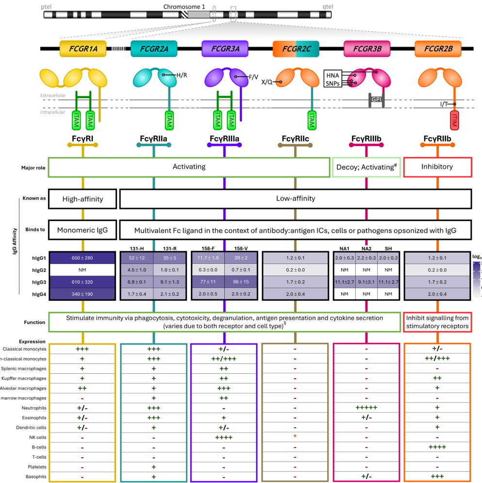

## Question

# Gene Research for Functional Annotation

## ⚠️ CRITICAL: Gene/Protein Identification Context

**BEFORE YOU BEGIN RESEARCH:** You MUST verify you are researching the CORRECT gene/protein. Gene symbols can be ambiguous, especially for less well-characterized genes from non-model organisms.

### Target Gene/Protein Identity (from UniProt):
- **UniProt Accession:** P30273
- **Protein Description:** RecName: Full=High affinity immunoglobulin epsilon receptor subunit gamma; AltName: Full=Fc receptor gamma-chain; Short=FcRgamma; AltName: Full=Fc-epsilon RI-gamma; AltName: Full=IgE Fc receptor subunit gamma; Short=FceRI gamma; Flags: Precursor;
- **Gene Information:** Name=FCER1G;
- **Organism (full):** Homo sapiens (Human).
- **Protein Family:** Belongs to the CD3Z/FCER1G family. .
- **Key Domains:** CD3_zeta/IgE_Fc_rcpt_gamma. (IPR021663); FCER1G. (IPR042340); Phos_immunorcpt_sig_ITAM. (IPR003110); ITAM (PF02189); TCR_zetazeta (PF11628)

### MANDATORY VERIFICATION STEPS:

1. **Check if the gene symbol "FCER1G" matches the protein description above**
2. **Verify the organism is correct:** Homo sapiens (Human).
3. **Check if protein family/domains align with what you find in literature**
4. **If you find literature for a DIFFERENT gene with the same or similar symbol, STOP**

### If Gene Symbol is Ambiguous or You Cannot Find Relevant Literature:

**DO NOT PROCEED WITH RESEARCH ON A DIFFERENT GENE.** Instead:
- State clearly: "The gene symbol 'FCER1G' is ambiguous or literature is limited for this specific protein"
- Explain what you found (e.g., "Found extensive literature on a different gene with the same symbol in a different organism")
- Describe the protein based ONLY on the UniProt information provided above
- Suggest that the protein function can be inferred from domain/family information

### Research Target:

Please provide a comprehensive research report on the gene **FCER1G** (gene ID: FCER1G, UniProt: P30273) in human.

The research report should be a detailed narrative explaining the function, biological processes, and localization of the gene product. Citations should be given for all claims.

You should prioritize authoritative reviews and primary scientific literature when conducting research. You can supplement
this with annotations you find in gene/protein databases, but these can be outdated or inaccurate.

We are specifically interested in the primary function of the gene - for enzymes, what reaction is catalyzed, and what is the substrate specificity? For transporters, what is the substrate? For structural proteins or adapters, what is the broader structural role? For signaling molecules, what is the role in the pathway.

We are interested in where in or outside the cell the gene product carries out its function.

We are also interested in the signaling or biochemical pathways in which the gene functions. We are less interested in broad pleiotropic effects, except where these elucidate the precise role.

Include evidence where possible. We are interested in both experimental evidence as well as inference from structure, evolution, or bioinformatic analysis. Precise studies should be prioritized over high-throughput, where available.

## Output

Question: You are an expert researcher providing comprehensive, well-cited information.

Provide detailed information focusing on:
1. Key concepts and definitions with current understanding
2. Recent developments and latest research (prioritize 2023-2024 sources)
3. Current applications and real-world implementations
4. Expert opinions and analysis from authoritative sources
5. Relevant statistics and data from recent studies

Format as a comprehensive research report with proper citations. Include URLs and publication dates where available.
Always prioritize recent, authoritative sources and provide specific citations for all major claims.

# Gene Research for Functional Annotation

## ⚠️ CRITICAL: Gene/Protein Identification Context

**BEFORE YOU BEGIN RESEARCH:** You MUST verify you are researching the CORRECT gene/protein. Gene symbols can be ambiguous, especially for less well-characterized genes from non-model organisms.

### Target Gene/Protein Identity (from UniProt):
- **UniProt Accession:** P30273
- **Protein Description:** RecName: Full=High affinity immunoglobulin epsilon receptor subunit gamma; AltName: Full=Fc receptor gamma-chain; Short=FcRgamma; AltName: Full=Fc-epsilon RI-gamma; AltName: Full=IgE Fc receptor subunit gamma; Short=FceRI gamma; Flags: Precursor;
- **Gene Information:** Name=FCER1G;
- **Organism (full):** Homo sapiens (Human).
- **Protein Family:** Belongs to the CD3Z/FCER1G family. .
- **Key Domains:** CD3_zeta/IgE_Fc_rcpt_gamma. (IPR021663); FCER1G. (IPR042340); Phos_immunorcpt_sig_ITAM. (IPR003110); ITAM (PF02189); TCR_zetazeta (PF11628)

### MANDATORY VERIFICATION STEPS:

1. **Check if the gene symbol "FCER1G" matches the protein description above**
2. **Verify the organism is correct:** Homo sapiens (Human).
3. **Check if protein family/domains align with what you find in literature**
4. **If you find literature for a DIFFERENT gene with the same or similar symbol, STOP**

### If Gene Symbol is Ambiguous or You Cannot Find Relevant Literature:

**DO NOT PROCEED WITH RESEARCH ON A DIFFERENT GENE.** Instead:
- State clearly: "The gene symbol 'FCER1G' is ambiguous or literature is limited for this specific protein"
- Explain what you found (e.g., "Found extensive literature on a different gene with the same symbol in a different organism")
- Describe the protein based ONLY on the UniProt information provided above
- Suggest that the protein function can be inferred from domain/family information

### Research Target:

Please provide a comprehensive research report on the gene **FCER1G** (gene ID: FCER1G, UniProt: P30273) in human.

The research report should be a detailed narrative explaining the function, biological processes, and localization of the gene product. Citations should be given for all claims.

You should prioritize authoritative reviews and primary scientific literature when conducting research. You can supplement
this with annotations you find in gene/protein databases, but these can be outdated or inaccurate.

We are specifically interested in the primary function of the gene - for enzymes, what reaction is catalyzed, and what is the substrate specificity? For transporters, what is the substrate? For structural proteins or adapters, what is the broader structural role? For signaling molecules, what is the role in the pathway.

We are interested in where in or outside the cell the gene product carries out its function.

We are also interested in the signaling or biochemical pathways in which the gene functions. We are less interested in broad pleiotropic effects, except where these elucidate the precise role.

Include evidence where possible. We are interested in both experimental evidence as well as inference from structure, evolution, or bioinformatic analysis. Precise studies should be prioritized over high-throughput, where available.

# Human FCER1G (UniProt P30273): functional annotation

## Identity and principal molecular function

**Identity verified.** Human **FCER1G** encodes the high-affinity IgE-receptor γ subunit, also called **Fc receptor γ chain (FcRγ)**. It is **not** the IgE-binding α chain (*FCER1A*), the related CD3ζ chain (*CD247*), or the cytokine-receptor “common γ chain” (*IL2RG*). Its CD3ζ-related architecture and immunoreceptor tyrosine-based activation motif (**ITAM**) agree with the supplied P30273 domain annotation. The distinction from *IL2RG* is specifically addressed by Brandsma and colleagues in *Immunity* (August 2016; https://doi.org/10.1016/j.immuni.2016.07.006). (brandsma2016clarifyingtheconfusion pages 1-2)

**Primary function:** FcRγ is a **membrane-spanning receptor-assembly and signaling adaptor**, not an enzyme, transporter, or antibody-binding protein. It generally forms a disulfide-linked homodimer; each chain has a very short extracellular segment, a membrane-spanning region, and a **cytoplasmic ITAM**. Its partner receptor recognizes the extracellular ligand. FcRγ helps assemble or display certain receptors and converts their clustering into an intracellular phosphotyrosine signal that recruits SYK. A γ homodimer provides two ITAMs. Its physiological site of action is therefore principally the **plasma membrane of receptor-expressing immune cells**, with signaling occurring at the **cytosolic face** of that membrane—not as a freely secreted IgE-binding protein. (brandsma2016clarifyingtheconfusion pages 1-2, bournazos2020theroleand pages 4-6, zhang2026fcer1ga pages 2-3)

The following table separates ligand recognition from FCER1G-dependent signaling and identifies important exceptions.

| Receptor partner(s) | Extracellular recognition vs. FcRγ role | Principal location/cells | Main outcome | Key sources |
|---|---|---|---|---|
| **FcεRI** | FcεRIα binds **IgE**; FcRγ does **not** bind ligand but forms a disulfide-linked γ₂ signaling dimer in **αβγ₂** or **αγ₂** complexes. Its cytoplasmic ITAMs recruit SYK after phosphorylation. | Plasma membrane of mast cells and basophils | Allergen-driven degranulation, calcium signaling, lipid-mediator synthesis, and cytokine release | (zhang2026fcer1ga pages 2-3) |
| **FcγRI/CD64 and FcγRIIIa/CD16a** | Their receptor α chains recognize **IgG/immune complexes**; associated FcRγ supplies ITAM signaling. In human NK cells, CD16a can alternatively associate with **CD3ζ/CD247**, explaining retained or enhanced ADCC in some FcRγ-negative adaptive NK cells. | CD64: monocytes, macrophages, and other myeloid cells; CD16a: NK cells and myeloid subsets | Antibody-dependent phagocytosis, cytotoxicity, oxidative responses, and cytokine production | (aguilar2024itam‐basedreceptorsin pages 9-11, frampton2024fcgammareceptors pages 2-5, frampton2024fcgammareceptors media b1a72e34) |
| **FcαRI/CD89** | CD89 binds **IgA**; FcRγ supplies the cytoplasmic ITAM signal rather than binding IgA directly. | Myeloid-cell plasma membrane, especially monocytes, macrophages, neutrophils, and eosinophils | IgA-dependent phagocytosis, respiratory burst, degranulation, and inflammatory signaling | (zhang2026fcer1ga pages 2-3) |
| **Dectin-2 and Mincle** | Their extracellular lectin domains recognize **fungal glycans**; FcRγ provides the ITAM that couples receptor clustering to **SYK–CARD9/BCL10/MALT1–NF-κB** signaling. Mincle–FcRγ association is supported by its transmembrane arginine. | Macrophages, dendritic cells, neutrophils, and other myeloid cells | Antifungal cytokine and chemokine production, ROS, phagocytic responses, and Th17-promoting immunity | (goyal2018theinteractionof pages 1-2, zou2024mincleasa pages 2-3) |
| **GPVI** | GPVI recognizes **collagen**; associated FcRγ supplies ITAM–SYK signaling and does not itself bind collagen. Evidence cited here is review-level rather than a platelet-focused primary experiment. | Platelet plasma membrane | Collagen-induced platelet activation, calcium mobilization, adhesion, and aggregation | (brandsma2016clarifyingtheconfusion pages 1-2) |
| **Important exceptions** | **FcγRIIa** carries its own cytoplasmic ITAM; **FcγRIIIb/CD16b** is GPI-anchored and lacks a cytoplasmic signaling domain; **Dectin-1** contains its own hemITAM and can recruit SYK without FcRγ. | Myeloid cells and neutrophils, depending on receptor | Prevents erroneous attribution of all FcγR or C-type lectin signaling to FCER1G | (goyal2018theinteractionof pages 1-2, frampton2024fcgammareceptors pages 2-5, frampton2024fcgammareceptors media b1a72e34) |

*Table: Human FcRγ receptor partnerships, cellular locations, and signaling outcomes, with key exceptions that signal independently of FCER1G. Sources include 2024 reviews by Frampton et al. (September 2024, https://doi.org/10.1111/imr.13401) and Zou et al. (April 2024, https://doi.org/10.3892/mmr.2024.13227).*

*Figure evidence:* Figure 1 of Frampton and colleagues’ September 2024 review distinguishes human FcγRI and FcγRIIIa, which use associated FcRγ, from FcγRIIa/IIc, which carry their own ITAMs, and GPI-anchored FcγRIIIb (*Immunological Reviews*; https://doi.org/10.1111/imr.13401). This is a receptor-specific map, **not** evidence that every Fc receptor requires FCER1G. (frampton2024fcgammareceptors pages 2-5, frampton2024fcgammareceptors media b1a72e34)

## Where FCER1G acts and how it signals

**IgE receptor and immediate hypersensitivity.** At the surface of mast cells and basophils, FcεRI comprises an IgE-binding α chain, a γ-chain dimer, and, in the αβγ₂ form, a β chain; human αγ₂ complexes also occur. Multivalent allergen cross-links receptor-bound IgE. Src-family phosphorylation of the γ ITAMs creates binding sites for SYK’s tandem SH2 domains. The **γ ITAM is the principal initiating SYK-docking element**, whereas the β chain chiefly modulates or amplifies receptor expression and signaling. SYK-dependent LAT/SLP-76 signaling activates PLCγ, which cleaves PIP₂ into IP₃ and DAG; calcium mobilization and PKC activation support granule exocytosis. Additional MAPK and transcriptional pathways contribute to newly synthesized lipid mediators and cytokines. Thus, **FCER1G supplies signal coupling, not IgE affinity or kinase catalytic activity**. These distinctions are reviewed by Gilfillan and Rivera (*Immunological Reviews*, March 2009; https://doi.org/10.1111/j.1600-065x.2008.00742.x) and Li and colleagues (*Clinical Reviews in Allergy & Immunology*, October 2022; https://doi.org/10.1007/s12016-022-08955-9). (li2022newmechanisticadvances pages 4-5, gilfillan2009thetyrosinekinase pages 1-2, gilfillan2009thetyrosinekinase pages 9-10, gilfillan2009thetyrosinekinase pages 24-26)

**IgG and IgA effector pathways.** On myeloid cells, FcγRI/CD64 and FcγRIIIa/CD16a use FcRγ to link recognition of IgG-coated targets or immune complexes to SYK-dependent responses, including antibody-dependent cellular phagocytosis, inflammatory signaling, and, according to cell type, cytotoxicity. FcαRI/CD89 similarly couples IgA recognition to FcRγ signaling. These are **receptor-partner-dependent functions**: FcγRIIa has its own ITAM and should not automatically be assigned to FCER1G. The receptor architecture and differences in IgG-receptor ligand affinity are discussed by Edgar and Bournazos (*Immunological Reviews*, September 2024; https://doi.org/10.1111/imr.13393) and Frampton and colleagues (September 2024; https://doi.org/10.1111/imr.13401). (bournazos2020theroleand pages 4-6, frampton2024fcgammareceptors pages 2-5, edgar2024fc‐fcγrinteractionsduring pages 2-4)

**Other receptor complexes.** FcRγ also supplies signaling to certain non-antibody receptors, including fungal-recognition lectins **Dectin-2 and Mincle** and platelet collagen receptor **GPVI**. For the lectins, receptor-bound fungal structures can engage FcRγ–SYK signaling and downstream CARD9-associated inflammatory pathways. Importantly, **Dectin-1 has its own hemITAM**: a 2017 dendritic-cell perturbation study found that loss of FcRγ *increased*, rather than abolished, Dectin-1 responses. Dectin-1 should therefore not be described as obligatorily signaling through an FCER1G-containing complex. Evidence for the lectin distinction includes Pan and colleagues (*Frontiers in Immunology*, October 2017; https://doi.org/10.3389/fimmu.2017.01424), a 2024 Mincle review (https://doi.org/10.3892/mmr.2024.13227), and a 2024 CARD9 review (https://doi.org/10.3390/ijms25052598). GPVI association is well described in the receptor-adaptor literature, although the evidence examined here is review-level rather than a platelet-specific FCER1G perturbation experiment. (goyal2018theinteractionof pages 1-2, pan2017fcεriγchainnegatively pages 1-2, lee2024roleofcard9 pages 2-4, zou2024mincleasa pages 2-3, brandsma2016clarifyingtheconfusion pages 1-2)

## Experimental strength and a human-specific qualification

A particularly informative **loss-of-function experiment** crossed human CD64-transgenic mice with FcRγ-deficient mice. Without γ, human CD64 surface staining fell approximately **95% on circulating neutrophils** and **80% on monocytes and peritoneal macrophages**. Residual CD64 could still bind opsonized erythrocytes, but receptor-dependent phagocytosis was lost. In a CD64-directed erythrocyte assay, γ-sufficient macrophages had a phagocytic index of **338 ± 45**, compared with **no detectable phagocytosis** in γ-deficient cells. The experiment separates the ligand-binding α chain from γ-dependent efficient surface display and effector function; its principal limitation is that **human CD64 was studied in a mouse cellular background**. Van Vugt and colleagues, *Blood*, May 1996: https://doi.org/10.1182/blood.v87.9.3593.bloodjournal8793593. (vugt1996fcrgammachainis pages 1-1, vugt1996fcrgammachainis pages 6-7, vugt1996fcrgammachainis pages 5-6)

FCER1G dependence is **not universal in human NK cells**. Human CD16a can associate with **CD3ζ/CD247** as an alternative ITAM adaptor. Human cytomegalovirus-associated adaptive NK-cell populations frequently have reduced FcRγ and SYK yet can be especially effective against antibody-coated targets. The 2024 synthesis by Aguilar, Fong, and Lanier emphasizes that mouse CD16 adaptor requirements differ from those in humans; consequently, a mouse *Fcer1g* knockout should not be interpreted as proving that all human CD16-mediated cytotoxicity requires FCER1G (*Immunological Reviews*, February 2024; https://doi.org/10.1111/imr.13313). (aguilar2024itam‐basedreceptorsin pages 9-11, aguilar2024itam‐basedreceptorsin pages 4-6)

## Recent research and real-world relevance

**Direct interrogation of the FCER1G–SYK interface (2024).** Bashore and colleagues tested binding of a **doubly phosphorylated FCER1G ITAM peptide** to SYK tandem SH2 domains, screened **138,214 compounds**, and identified covalent disruptors. One compound had a **TR-FRET IC₅₀ of 0.27 ± 0.02 μM** in the biochemical interaction assay. This is a measurement of **assay-level interaction inhibition, not potency against FCER1G inside patients**. The authors reported poor selectivity/reactivity that limited the compounds as probes; their proposed Alzheimer’s-disease application remains a **target-development hypothesis**, not demonstrated disease modification. *PLOS ONE*, February 15, 2024: https://doi.org/10.1371/journal.pone.0293548. (bashore2024characterizationofcovalent pages 4-6, bashore2024characterizationofcovalent pages 1-2, bashore2024characterizationofcovalent pages 8-10)

**Existing treatments affect the pathway indirectly.** Omalizumab binds **free IgE**, reducing its availability to load FcεRI; it does **not** bind the intracellular FCER1G γ chain. A 2024 review documents its use for IgE-mediated food-allergy risk reduction, alongside earlier allergic-disease indications (*Frontiers in Allergy*, May 2024; https://doi.org/10.3389/falgy.2024.1409342). FcγR engagement is also an important design variable for therapeutic-antibody Fc regions, but clinical effects of an antibody cannot be attributed uniquely to FCER1G without testing its receptor and adaptor dependence. (ghouri2024omalizumabforthe pages 2-3, ghouri2024omalizumabforthe pages 1-2, edgar2024fc‐fcγrinteractionsduring pages 14-15, edgar2024fc‐fcγrinteractionsduring pages 2-4)

Fostamatinib instead inhibits **downstream SYK**, a signaling enzyme used by multiple receptors. A January 2023 systematic review of immune-thrombocytopenia trials reported stable platelet responses in **18/101 (17.8%)** fostamatinib-treated patients versus **1/49 (2.0%)** placebo-treated patients in the relevant trial arms. These are **clinical data for SYK inhibition**, not a trial of FCER1G blockade or proof that every responding pathway contains FcRγ; the reviewed patients were heavily pretreated. *Journal of Xenobiotics*, January 2023: https://doi.org/10.3390/jox13010005. (ali2023safetyandefficacy pages 2-5, ali2023safetyandefficacy pages 6-7, ali2023safetyandefficacy pages 1-2)

**Functional-annotation conclusion.** The strongest annotation for human P30273 is **plasma-membrane, receptor-associated ITAM signaling adaptor**: it supports assembly or surface abundance of particular activating receptors and, after receptor clustering, connects extracellular antibody or other ligand recognition to intracellular SYK-dependent effector pathways. Receptor identity, cell type, and alternative adaptors—not FCER1G expression alone—determine whether a given phagocytic, allergic, antifungal, platelet, or cytotoxic response actually depends on this protein. (brandsma2016clarifyingtheconfusion pages 1-2, vugt1996fcrgammachainis pages 1-1, aguilar2024itam‐basedreceptorsin pages 9-11, frampton2024fcgammareceptors pages 2-5)

References

1. (brandsma2016clarifyingtheconfusion pages 1-2): Arianne M. Brandsma, P. Mark Hogarth, Falk Nimmerjahn, and Jeanette H.W. Leusen. Clarifying the confusion between cytokine and fc receptor "common gamma chain". Immunity, 45 2:225-6, Aug 2016. URL: https://doi.org/10.1016/j.immuni.2016.07.006, doi:10.1016/j.immuni.2016.07.006. This article has 66 citations and is from a highest quality peer-reviewed journal.

2. (bournazos2020theroleand pages 4-6): Stylianos Bournazos, Taia T. Wang, and Jeffrey V. Ravetch. The role and function of fcγ receptors on myeloid cells. Microbiology Spectrum, Dec 2020. URL: https://doi.org/10.1128/microbiolspec.mchd-0045-2016, doi:10.1128/microbiolspec.mchd-0045-2016. This article has 129 citations and is from a domain leading peer-reviewed journal.

3. (zhang2026fcer1ga pages 2-3): Yu-yu Zhang, Jing-Lan Wang, Wen-Ting He, and Tao Liu. <i>fcer1g</i> : a multifunctional regulator in the immune microenvironment (review). Experimental and Therapeutic Medicine, 31:1-13, Mar 2026. URL: https://doi.org/10.3892/etm.2026.13141, doi:10.3892/etm.2026.13141. This article has 2 citations and is from a peer-reviewed journal.

4. (aguilar2024itam‐basedreceptorsin pages 9-11): Oscar A. Aguilar, Lam‐Kiu Fong, and Lewis L. Lanier. Itam‐based receptors in natural killer cells. Immunological Reviews, 323:40-53, Feb 2024. URL: https://doi.org/10.1111/imr.13313, doi:10.1111/imr.13313. This article has 25 citations and is from a domain leading peer-reviewed journal.

5. (frampton2024fcgammareceptors pages 2-5): Sarah Frampton, Rosanna Smith, Lili Ferson, Jane Gibson, Edward J. Hollox, Mark S. Cragg, and Jonathan C. Strefford. Fc gamma receptors: their evolution, genomic architecture, genetic variation, and impact on human disease. Immunological Reviews, 328:65-97, Sep 2024. URL: https://doi.org/10.1111/imr.13401, doi:10.1111/imr.13401. This article has 45 citations and is from a domain leading peer-reviewed journal.

6. (frampton2024fcgammareceptors media b1a72e34): Sarah Frampton, Rosanna Smith, Lili Ferson, Jane Gibson, Edward J. Hollox, Mark S. Cragg, and Jonathan C. Strefford. Fc gamma receptors: their evolution, genomic architecture, genetic variation, and impact on human disease. Immunological Reviews, 328:65-97, Sep 2024. URL: https://doi.org/10.1111/imr.13401, doi:10.1111/imr.13401. This article has 45 citations and is from a domain leading peer-reviewed journal.

7. (goyal2018theinteractionof pages 1-2): Surabhi Goyal, Juan Camilo Castrillón-Betancur, Esther Klaile, and Hortense Slevogt. The interaction of human pathogenic fungi with c-type lectin receptors. Frontiers in Immunology, Jun 2018. URL: https://doi.org/10.3389/fimmu.2018.01261, doi:10.3389/fimmu.2018.01261. This article has 162 citations and is from a peer-reviewed journal.

8. (zou2024mincleasa pages 2-3): Yuanxia Zou, Jianchun Li, Hongwei Su, Nathupakorn Dechsupa, Jian Liu, and Li Wang. Mincle as a potential intervention target for the prevention of inflammation and fibrosis (review). Molecular Medicine Reports, Apr 2024. URL: https://doi.org/10.3892/mmr.2024.13227, doi:10.3892/mmr.2024.13227. This article has 12 citations and is from a peer-reviewed journal.

9. (li2022newmechanisticadvances pages 4-5): Yang Li, Patrick S. C. Leung, M. Eric Gershwin, and Junmin Song. New mechanistic advances in fcεri-mast cell–mediated allergic signaling. Clinical Reviews in Allergy & Immunology, 63:431-446, Oct 2022. URL: https://doi.org/10.1007/s12016-022-08955-9, doi:10.1007/s12016-022-08955-9. This article has 90 citations and is from a peer-reviewed journal.

10. (gilfillan2009thetyrosinekinase pages 1-2): Alasdair M. Gilfillan and Juan Rivera. The tyrosine kinase network regulating mast cell activation. Immunological Reviews, 228:149-169, Mar 2009. URL: https://doi.org/10.1111/j.1600-065x.2008.00742.x, doi:10.1111/j.1600-065x.2008.00742.x. This article has 523 citations and is from a domain leading peer-reviewed journal.

11. (gilfillan2009thetyrosinekinase pages 9-10): Alasdair M. Gilfillan and Juan Rivera. The tyrosine kinase network regulating mast cell activation. Immunological Reviews, 228:149-169, Mar 2009. URL: https://doi.org/10.1111/j.1600-065x.2008.00742.x, doi:10.1111/j.1600-065x.2008.00742.x. This article has 523 citations and is from a domain leading peer-reviewed journal.

12. (gilfillan2009thetyrosinekinase pages 24-26): Alasdair M. Gilfillan and Juan Rivera. The tyrosine kinase network regulating mast cell activation. Immunological Reviews, 228:149-169, Mar 2009. URL: https://doi.org/10.1111/j.1600-065x.2008.00742.x, doi:10.1111/j.1600-065x.2008.00742.x. This article has 523 citations and is from a domain leading peer-reviewed journal.

13. (edgar2024fc‐fcγrinteractionsduring pages 2-4): Julia E. Edgar and Stylianos Bournazos. Fc‐fcγr interactions during infections: from neutralizing antibodies to antibody‐dependent enhancement. Immunological Reviews, 328:221-242, Sep 2024. URL: https://doi.org/10.1111/imr.13393, doi:10.1111/imr.13393. This article has 42 citations and is from a domain leading peer-reviewed journal.

14. (pan2017fcεriγchainnegatively pages 1-2): Yi-Gen Pan, Yen-Ling Yu, Chi-Chien Lin, Lewis L. Lanier, and Ching-Liang Chu. Fcεri γ-chain negatively modulates dectin-1 responses in dendritic cells. Frontiers in Immunology, Oct 2017. URL: https://doi.org/10.3389/fimmu.2017.01424, doi:10.3389/fimmu.2017.01424. This article has 19 citations and is from a peer-reviewed journal.

15. (lee2024roleofcard9 pages 2-4): Ji Seok Lee and Chaekyun Kim. Role of card9 in cell- and organ-specific immune responses in various infections. International Journal of Molecular Sciences, 25:2598, Feb 2024. URL: https://doi.org/10.3390/ijms25052598, doi:10.3390/ijms25052598. This article has 10 citations.

16. (vugt1996fcrgammachainis pages 1-1): M. van Vugt, I. Heijnen, P. Capel, SY Park, C. Ra, T. Saito, J. Verbeek, and J. van de Winkel. Fcr gamma-chain is essential for both surface expression and function of human fc gamma ri (cd64) in vivo. Blood, 87 9:3593-9, May 1996. URL: https://doi.org/10.1182/blood.v87.9.3593.bloodjournal8793593, doi:10.1182/blood.v87.9.3593.bloodjournal8793593. This article has 190 citations and is from a highest quality peer-reviewed journal.

17. (vugt1996fcrgammachainis pages 6-7): M. van Vugt, I. Heijnen, P. Capel, SY Park, C. Ra, T. Saito, J. Verbeek, and J. van de Winkel. Fcr gamma-chain is essential for both surface expression and function of human fc gamma ri (cd64) in vivo. Blood, 87 9:3593-9, May 1996. URL: https://doi.org/10.1182/blood.v87.9.3593.bloodjournal8793593, doi:10.1182/blood.v87.9.3593.bloodjournal8793593. This article has 190 citations and is from a highest quality peer-reviewed journal.

18. (vugt1996fcrgammachainis pages 5-6): M. van Vugt, I. Heijnen, P. Capel, SY Park, C. Ra, T. Saito, J. Verbeek, and J. van de Winkel. Fcr gamma-chain is essential for both surface expression and function of human fc gamma ri (cd64) in vivo. Blood, 87 9:3593-9, May 1996. URL: https://doi.org/10.1182/blood.v87.9.3593.bloodjournal8793593, doi:10.1182/blood.v87.9.3593.bloodjournal8793593. This article has 190 citations and is from a highest quality peer-reviewed journal.

19. (aguilar2024itam‐basedreceptorsin pages 4-6): Oscar A. Aguilar, Lam‐Kiu Fong, and Lewis L. Lanier. Itam‐based receptors in natural killer cells. Immunological Reviews, 323:40-53, Feb 2024. URL: https://doi.org/10.1111/imr.13313, doi:10.1111/imr.13313. This article has 25 citations and is from a domain leading peer-reviewed journal.

20. (bashore2024characterizationofcovalent pages 4-6): Frances M. Bashore, Vittorio L. Katis, Yuhong Du, Arunima Sikdar, Dongxue Wang, William J. Bradshaw, Karolina A. Rygiel, Tina M. Leisner, Rod Chalk, Swati Mishra, Andrew C. Williams, Opher Gileadi, Paul E. Brennan, Jesse C. Wiley, Jake Gockley, Gregory A. Cary, Gregory W. Carter, Jessica E. Young, Kenneth H. Pearce, Haian Fu, and Alison D. Axtman. Characterization of covalent inhibitors that disrupt the interaction between the tandem sh2 domains of syk and fcer1g phospho-itam. PLOS ONE, Feb 2024. URL: https://doi.org/10.1371/journal.pone.0293548, doi:10.1371/journal.pone.0293548. This article has 10 citations and is from a peer-reviewed journal.

21. (bashore2024characterizationofcovalent pages 1-2): Frances M. Bashore, Vittorio L. Katis, Yuhong Du, Arunima Sikdar, Dongxue Wang, William J. Bradshaw, Karolina A. Rygiel, Tina M. Leisner, Rod Chalk, Swati Mishra, Andrew C. Williams, Opher Gileadi, Paul E. Brennan, Jesse C. Wiley, Jake Gockley, Gregory A. Cary, Gregory W. Carter, Jessica E. Young, Kenneth H. Pearce, Haian Fu, and Alison D. Axtman. Characterization of covalent inhibitors that disrupt the interaction between the tandem sh2 domains of syk and fcer1g phospho-itam. PLOS ONE, Feb 2024. URL: https://doi.org/10.1371/journal.pone.0293548, doi:10.1371/journal.pone.0293548. This article has 10 citations and is from a peer-reviewed journal.

22. (bashore2024characterizationofcovalent pages 8-10): Frances M. Bashore, Vittorio L. Katis, Yuhong Du, Arunima Sikdar, Dongxue Wang, William J. Bradshaw, Karolina A. Rygiel, Tina M. Leisner, Rod Chalk, Swati Mishra, Andrew C. Williams, Opher Gileadi, Paul E. Brennan, Jesse C. Wiley, Jake Gockley, Gregory A. Cary, Gregory W. Carter, Jessica E. Young, Kenneth H. Pearce, Haian Fu, and Alison D. Axtman. Characterization of covalent inhibitors that disrupt the interaction between the tandem sh2 domains of syk and fcer1g phospho-itam. PLOS ONE, Feb 2024. URL: https://doi.org/10.1371/journal.pone.0293548, doi:10.1371/journal.pone.0293548. This article has 10 citations and is from a peer-reviewed journal.

23. (ghouri2024omalizumabforthe pages 2-3): Hafsa Ghouri, Ashna Habib, Zainab Nazir, Nimerta Lohana, and Aymar Akilimali. Omalizumab for the reduction of allergic reactions to foods: a narrative review. Frontiers in Allergy, May 2024. URL: https://doi.org/10.3389/falgy.2024.1409342, doi:10.3389/falgy.2024.1409342. This article has 13 citations and is from a peer-reviewed journal.

24. (ghouri2024omalizumabforthe pages 1-2): Hafsa Ghouri, Ashna Habib, Zainab Nazir, Nimerta Lohana, and Aymar Akilimali. Omalizumab for the reduction of allergic reactions to foods: a narrative review. Frontiers in Allergy, May 2024. URL: https://doi.org/10.3389/falgy.2024.1409342, doi:10.3389/falgy.2024.1409342. This article has 13 citations and is from a peer-reviewed journal.

25. (edgar2024fc‐fcγrinteractionsduring pages 14-15): Julia E. Edgar and Stylianos Bournazos. Fc‐fcγr interactions during infections: from neutralizing antibodies to antibody‐dependent enhancement. Immunological Reviews, 328:221-242, Sep 2024. URL: https://doi.org/10.1111/imr.13393, doi:10.1111/imr.13393. This article has 42 citations and is from a domain leading peer-reviewed journal.

26. (ali2023safetyandefficacy pages 2-5): Muhammad Ashar Ali, Muhammad Yasir Anwar, Wajeeha Aiman, Gurneel Dhanesar, Zainab Omar, Mohammad Hamza, Maha Zafar, Harish Kumar Rengarajan, and Michael Maroules. Safety and efficacy of tyrosine kinase inhibitors in immune thrombocytopenic purpura: a systematic review of clinical trials. Journal of Xenobiotics, 13:29-41, Jan 2023. URL: https://doi.org/10.3390/jox13010005, doi:10.3390/jox13010005. This article has 18 citations.

27. (ali2023safetyandefficacy pages 6-7): Muhammad Ashar Ali, Muhammad Yasir Anwar, Wajeeha Aiman, Gurneel Dhanesar, Zainab Omar, Mohammad Hamza, Maha Zafar, Harish Kumar Rengarajan, and Michael Maroules. Safety and efficacy of tyrosine kinase inhibitors in immune thrombocytopenic purpura: a systematic review of clinical trials. Journal of Xenobiotics, 13:29-41, Jan 2023. URL: https://doi.org/10.3390/jox13010005, doi:10.3390/jox13010005. This article has 18 citations.

28. (ali2023safetyandefficacy pages 1-2): Muhammad Ashar Ali, Muhammad Yasir Anwar, Wajeeha Aiman, Gurneel Dhanesar, Zainab Omar, Mohammad Hamza, Maha Zafar, Harish Kumar Rengarajan, and Michael Maroules. Safety and efficacy of tyrosine kinase inhibitors in immune thrombocytopenic purpura: a systematic review of clinical trials. Journal of Xenobiotics, 13:29-41, Jan 2023. URL: https://doi.org/10.3390/jox13010005, doi:10.3390/jox13010005. This article has 18 citations.

## Artifacts

- [Edison artifact artifact-00](FCER1G-deep-research-falcon_artifacts/artifact-00.md)

## Citations

1. brandsma2016clarifyingtheconfusion pages 1-2
2. bournazos2020theroleand pages 4-6
3. frampton2024fcgammareceptors pages 2-5
4. goyal2018theinteractionof pages 1-2
5. zou2024mincleasa pages 2-3
6. li2022newmechanisticadvances pages 4-5
7. gilfillan2009thetyrosinekinase pages 1-2
8. gilfillan2009thetyrosinekinase pages 9-10
9. gilfillan2009thetyrosinekinase pages 24-26
10. vugt1996fcrgammachainis pages 1-1
11. vugt1996fcrgammachainis pages 6-7
12. vugt1996fcrgammachainis pages 5-6
13. bashore2024characterizationofcovalent pages 4-6
14. bashore2024characterizationofcovalent pages 1-2
15. bashore2024characterizationofcovalent pages 8-10
16. ghouri2024omalizumabforthe pages 2-3
17. ghouri2024omalizumabforthe pages 1-2
18. ali2023safetyandefficacy pages 2-5
19. ali2023safetyandefficacy pages 6-7
20. ali2023safetyandefficacy pages 1-2
21. https://doi.org/10.1016/j.immuni.2016.07.006
22. https://doi.org/10.1111/imr.13401
23. https://doi.org/10.3892/mmr.2024.13227
24. https://doi.org/10.1111/j.1600-065x.2008.00742.x
25. https://doi.org/10.1007/s12016-022-08955-9
26. https://doi.org/10.1111/imr.13393
27. https://doi.org/10.3389/fimmu.2017.01424
28. https://doi.org/10.3390/ijms25052598
29. https://doi.org/10.1182/blood.v87.9.3593.bloodjournal8793593.
30. https://doi.org/10.1111/imr.13313
31. https://doi.org/10.1371/journal.pone.0293548.
32. https://doi.org/10.3389/falgy.2024.1409342
33. https://doi.org/10.3390/jox13010005.
34. https://doi.org/10.1016/j.immuni.2016.07.006,
35. https://doi.org/10.1128/microbiolspec.mchd-0045-2016,
36. https://doi.org/10.3892/etm.2026.13141,
37. https://doi.org/10.1111/imr.13313,
38. https://doi.org/10.1111/imr.13401,
39. https://doi.org/10.3389/fimmu.2018.01261,
40. https://doi.org/10.3892/mmr.2024.13227,
41. https://doi.org/10.1007/s12016-022-08955-9,
42. https://doi.org/10.1111/j.1600-065x.2008.00742.x,
43. https://doi.org/10.1111/imr.13393,
44. https://doi.org/10.3389/fimmu.2017.01424,
45. https://doi.org/10.3390/ijms25052598,
46. https://doi.org/10.1182/blood.v87.9.3593.bloodjournal8793593,
47. https://doi.org/10.1371/journal.pone.0293548,
48. https://doi.org/10.3389/falgy.2024.1409342,
49. https://doi.org/10.3390/jox13010005,