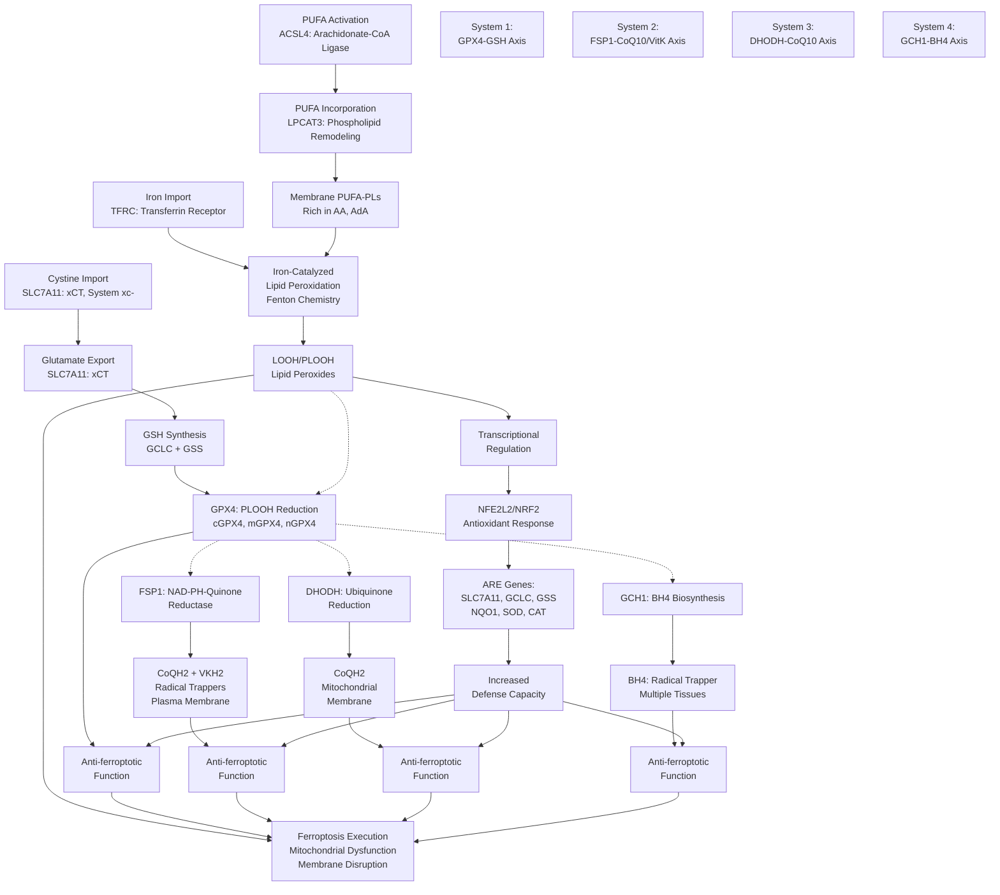

# Ferroptosis Pathway Summary

## Overview

Ferroptosis is an iron-dependent form of regulated cell death driven by lipid peroxidation that proceeds independently of classical apoptotic or necroptotic mechanisms. The ferroptosis pathway represents a critical cellular stress response that must be strictly controlled to balance cell survival with cellular homeostasis. Three parallel, non-redundant antioxidant defense systems operate to suppress ferroptosis: the GPX4-glutathione (GSH) system, the FSP1-ubiquinone (CoQ10) system, and the DHODH-ubiquinone system. These defenses are integrated at the transcriptional level through the NRF2/NFE2L2 antioxidant response element (ARE), with key upstream regulators including TP53 (context-dependent), and metabolic gatekeeper functions mediated by iron homeostasis genes and lipid composition determinants. The pathway has profound implications for cancer biology, neurodegeneration, cardiomyopathy, and autoimmune diseases.

## Historical Context and Discovery

Ferroptosis was formally identified as a distinct cell death modality in 2012 through chemical screening with the ferroptosis inducer erastin, which specifically inhibits system xc- (the cystine/glutamate antiporter). The original characterization identified ferroptosis as mechanistically distinct from apoptosis, necrosis, and autophagy, driven instead by iron-dependent accumulation of lipid peroxides. Subsequent seminal studies (2014-2019) revealed the central role of GPX4 in ferroptosis suppression and later identified FSP1 and DHODH as parallel, independent antioxidant defense systems operating in distinct cellular compartments.

## Iron-Dependent Lipid Peroxidation: The Core Mechanism

### Initiation: Lipid Substrate Incorporation

The ferroptosis pathway begins with the incorporation of polyunsaturated fatty acids (PUFAs), particularly arachidonic acid (AA) and adrenic acid (AdA), into cellular membranes. This process is catalyzed by **ACSL4**, which specifically activates long-chain PUFAs through ATP-dependent ligation to coenzyme A [PMID:27842070, PMID:31061331]. The resulting PUFA-CoA products are incorporated into membrane phospholipids (particularly phosphatidylethanolamine) by **LPCAT3**, enriching cellular membranes with oxidizable substrates [PMID:27842070]. This membrane lipid remodeling is essential for ferroptosis execution; cells lacking ACSL4 are marked resistant to ferroptosis despite normal GPX4 function.

### Propagation: Iron-Catalyzed Oxidation

The ferroptotic cell death mechanism proceeds through iron-catalyzed oxidation of PUFA-containing phospholipids. Free iron (Fe2+), accumulated through **TFRC** (transferrin receptor 1)-mediated iron import and possibly from heme degradation or mitochondrial iron release, catalyzes formation of lipid peroxides (PLOOHs, LPOOHs) from PUFA-substituted phospholipids via Fenton-like reactions. This lipid peroxidation is not spontaneous but actively promoted by the fatty acid composition established by ACSL4/LPCAT3, explaining why ACSL4-deficient cells are ferroptosis-resistant even when other pro-ferroptosis triggers are present [PMID:27842070]. The accumulation of lipid peroxides propagates through radical chain reactions in the lipid bilayer, ultimately leading to membrane disruption and cell death.

### Ferroptotic Cell Death Morphology

Ferroptotic cells exhibit distinctive morphological features distinct from apoptosis: shrunken mitochondria with increased electron density, absence of chromatin condensation, and intact plasma membrane integrity (unlike primary necrosis). This characteristic mitochondrial morphology is diagnostic for ferroptosis and reflects the primary role of mitochondrial lipid peroxidation in executing the death program.

## Three Parallel Antioxidant Defense Systems

The ferroptosis pathway features three independently operating antioxidant defense mechanisms that operate in distinct cellular compartments and exploit different biochemical strategies. Importantly, these systems are NON-REDUNDANT - dual knockouts are required to sensitize cells to ferroptosis, demonstrating they function in parallel rather than in series.

### System 1: The GPX4-Glutathione Axis (Cytosolic/Membrane Defense)

**GPX4** (Glutathione Peroxidase 4, P36969) represents the primary and most extensively characterized ferroptosis suppressor, functioning as the central enzymatic suppressor of ferroptosis [PMID:24439385, PMID:36608588]. GPX4 is the only glutathione peroxidase capable of directly reducing phospholipid hydroperoxides (PLOOHs) within biological membranes while using reduced glutathione (GSH) as the electron donor. The enzyme contains selenocysteine at its active site and reduces PUFA-containing phospholipid hydroperoxides to their corresponding alcohols, with Km values demonstrating high affinity for phosphatidylcholine hydroperoxide [PMID:36608588].

GPX4 exists as three tissue-specific isoforms with distinct subcellular localizations [PMID:17630701]:
- **cGPX4** (cytosolic): The predominant isoform distributed throughout the cytoplasm where it protects bulk membrane lipids
- **mGPX4** (mitochondrial): Localizes to the inner mitochondrial membrane where it provides specific protection for mitochondrial lipids
- **nGPX4** (nuclear): Functions during spermatogenesis to protect sperm chromatin

The substrate for GPX4 - reduced glutathione (GSH) - is synthesized through a critical metabolic pathway that begins with **SLC7A11** (xCT), the light chain of system xc- [PMID:11417227, PMID:15151999]. SLC7A11 functions as a cystine/glutamate antiporter, exchanging extracellular cystine (at ~1:1 stoichiometry) for intracellular glutamate. The imported cystine is reduced intracellularly to cysteine, providing the rate-limiting substrate for GSH synthesis through the sequential actions of **GCLC** (gamma-glutamylcysteine synthetase) and **GSS** (glutathione synthase) [PMID:34120018, PMID:40280132].

Beyond its canonical role as a cystine importer, recent evidence has revealed that SLC7A11 possesses a novel secondary function as an unconventional proton channel at lysosomal membranes, where it mediates slow H+ leak through coupled cystine/glutamate flux, thereby regulating lysosomal pH [PMID:40280132]. Furthermore, SLC7A11 has been shown to transport L-kynurenine, a tryptophan metabolite that propagates anti-ferroptotic signaling [PMID:35245456].

GPX4 inhibition or genetic deletion rapidly sensitizes cells to ferroptosis inducers (erastin, RSL3, FIN56). Conversely, GPX4 overexpression confers broad ferroptosis resistance across multiple inducers [PMID:24439385]. The enzyme is post-translationally regulated by hydroxylation at proline 159, mediated by prolyl hydroxylase 3 (PHD3) in an alpha-ketoglutarate-dependent manner; this modification enhances GPX4 stability and is suppressed by PSAT1, linking serine metabolism to ferroptosis control [PMID:40281343].

### System 2: The FSP1-CoQ10/Vitamin K Axis (Plasma Membrane and Lipid Droplet Defense)

**FSP1** (Ferroptosis Suppressor Protein 1, formerly AMID/PRG3, Q9BRQ8) was identified in 2019 as the second major ferroptosis suppressor operating in parallel to GPX4 and representing the first glutathione-independent ferroptosis defense mechanism [PMID:31634899, PMID:31634900]. FSP1 is an N-myristoylated, FAD-dependent oxidoreductase that catalyzes the NAD(P)H-dependent reduction of ubiquinone (CoQ10) to its reduced form ubiquinol (CoQH2) and reduces vitamin K to its hydroquinone form (VKH2) [PMID:35922516, PMID:37957306]. Both ubiquinol and VKH2 function as potent radical-trapping antioxidants at cellular membranes, intercepting lipid peroxyl radicals and preventing propagation of lipid peroxidation chain reactions.

N-myristoylation of FSP1 is essential for its anti-ferroptotic function and directs the protein to two critical membrane compartments:
- **Plasma membrane**: The primary site of FSP1 action where it suppresses ferroptosis
- **Lipid droplets**: An additional site where FSP1 operates, potentially protecting stored lipids from peroxidation

The physiological significance of FSP1 is underscored by the discovery that FSP1 alone can fully compensate for GPX4 deletion in certain cell types, demonstrating genuine functional redundancy at the pathway level while maintaining distinct biochemical mechanisms [PMID:31634900]. FSP1's role as the warfarin-resistant vitamin K reductase establishes a non-canonical vitamin K cycle that suppresses ferroptosis, distinct from the classical (anticoagulation-related) vitamin K cycle [PMID:35922516].

Recent evidence implicates the **ALDH7A1-FSP1 axis** in ferroptosis regulation; ALDH7A1 generates membrane-localized NADH that serves as the electron donor for FSP1-catalyzed reduction of quinones [PMID:40233740]. This coupling between aldehyde dehydrogenase activity and ferroptosis prevention represents a direct link between cellular metabolism and ferroptosis suppression.

### System 3: The DHODH-CoQ10 Axis (Mitochondrial Inner Membrane Defense)

**DHODH** (Dihydroorotate Dehydrogenase, Q02127) operates as a third parallel ferroptosis suppressor localized to the mitochondrial inner membrane, functioning independently of both cytosolic GPX4 and membrane-localized FSP1 [PMID:33981038]. DHODH catalyzes the oxidation of dihydroorotate to orotate, the rate-limiting step in de novo pyrimidine nucleotide synthesis. In doing so, electrons flow from substrate through FMN cofactor to ubiquinone, generating ubiquinol (CoQH2) that accumulates in the inner mitochondrial membrane where it suppresses mitochondrial lipid peroxidation [PMID:33981038].

The ferroptosis-suppressive function of DHODH was discovered through the observation that DHODH inhibitors (such as leflunomide/teriflunomide, approved drugs for autoimmune diseases) sensitize cancer cells to ferroptosis. Mechanistically, DHODH-generated ubiquinol provides antioxidant protection specifically within the mitochondrial membrane, complementing the cytosolic GPX4/GSH and plasma membrane FSP1/CoQ10 defense systems. Notably, DHODH operates independently of cytosolic GPX4 (mGPX4 does not compensate for DHODH inhibition), establishing it as a genuinely distinct ferroptosis suppressor pathway [PMID:33981038].

### CoQ10 and Vitamin K as Shared Defense Substrates

Ubiquinone (CoQ10) and vitamin K both serve as substrates for FSP1 and represent critical metabolic hubs in ferroptosis regulation. CoQ10 synthesis is a highly complex process involving multiple enzymatic steps and is often rate-limited by the supply of PARA-AMINOBENZOIC ACID (PABA), with implications for ferroptosis sensitivity in tissues with limited CoQ10 synthesis capacity. The relative contributions of FSP1-catalyzed CoQ10 versus vitamin K reduction to ferroptosis suppression remain incompletely characterized and may vary depending on tissue type and cellular context.

## BH4-Mediated Ferroptosis Suppression: A Third Parallel System

**GCH1** (GTP Cyclohydrolase 1, P30793) encodes the rate-limiting enzyme in de novo synthesis of tetrahydrobiopterin (BH4), an essential cofactor for aromatic amino acid hydroxylases and all nitric oxide synthase isoforms. Recent evidence indicates that **BH4 functions as a radical-trapping antioxidant** capable of suppressing ferroptosis through a mechanism parallel to GPX4, FSP1, and DHODH. BH4 directly scavenges lipid peroxyl radicals and regenerates reduced forms of other antioxidants, thereby suppressing lipid peroxidation-driven cell death.

GCH1 catalyzes the conversion of GTP to 7,8-dihydroneopterin triphosphate as the first of six enzymatic steps in de novo BH4 synthesis. The enzyme requires zinc for catalytic activity and functions as a homodecamer (dimer of pentamers) with an uncleaved N-terminal mitochondrial targeting sequence [PMID:11087827]. GCH1 expression is regulated by the ARNT2 transcription factor (HIF pathway) and by inflammatory cytokines (TNF, IFN-gamma, IL-1beta) that increase BH4 biosynthesis in endothelial cells and macrophages during immune activation [PMID:9445252, PMID:7678411].

The GCH1/BH4 axis may represent a fourth, incompletely characterized ferroptosis defense system that operates in parallel to the established GPX4, FSP1, and DHODH pathways.

## Transcriptional Regulation: The NRF2/NFE2L2 Antioxidant Response

The ferroptosis pathway is integrated at the transcriptional level through the **NRF2 (Nuclear Factor Erythroid 2-Related Factor 2, NFE2L2, Q16236)** antioxidant response element (ARE) system. Under basal conditions, NRF2 is sequestered in the cytoplasm through binding to **KEAP1** (Kelch-Like ECH-Associated Protein 1), a substrate adaptor for the CUL3-RBXL-containing E3 ligase complex that targets NRF2 for proteasomal degradation. Under oxidative stress conditions, ROS-triggered modifications of KEAP1 disrupt NRF2 binding, allowing NRF2 to accumulate, translocate to the nucleus, and activate transcription of ARE-containing genes [PMID:34120018, PMID:40280132, PMID:35352032].

The canonical NRF2 target genes include:
- **SLC7A11** (xCT): Increases cystine uptake to support GSH synthesis
- **GCLC**: Increases GSH synthesis capacity
- **GSS**: Further increases GSH production
- **SOD1/SOD2**: Catalyzes superoxide dismutation
- **Catalase**: Degrades H2O2
- **NAD(P)H quinone oxidoreductase 1 (NQO1)**: Reduces ubiquinone to ubiquinol through an alternative, non-FSP1 mechanism

This transcriptional amplification of the ferroptosis defense system occurs in response to ROS accumulation, creating a negative feedback loop that prevents ferroptosis execution while simultaneously inducing metabolic changes supporting cellular stress resistance.

## p53 and Context-Dependent Ferroptosis Regulation

**TP53** (Tumor Protein p53, P04637) exhibits context-dependent, mutation-specific effects on ferroptosis. Wild-type p53, activated in response to cellular stress (DNA damage, oncogenic signals), can function as both a ferroptosis promoter and suppressor depending on the specific p53 target genes activated and the cellular context. Recent evidence indicates that:

1. **Pro-ferroptotic p53 activity**: p53 can promote ferroptosis through upregulation of ferroptosis-inducing genes and suppression of GPX4/GSH pathway genes in certain contexts
2. **Anti-ferroptotic p53 activity**: p53 can suppress ferroptosis through activation of the NRF2 pathway and upregulation of antioxidant defense genes
3. **p53 mutations in ferroptosis**: Different p53 mutations exhibit distinct effects on ferroptosis sensitivity, with implications for cancer treatment strategies

The molecular basis for p53's context-dependent ferroptosis regulation remains incompletely characterized but involves differential binding to specific DNA elements and interaction with cofactors that determine the transcriptional program activated.

## Metabolic Integration: Iron Homeostasis and Lipid Composition

### Iron Import and Ferroptosis Sensitivity

**TFRC** (Transferrin Receptor 1, P02786) mediates iron import through receptor-mediated endocytosis of iron-loaded transferrin. TFRC expression is tightly regulated at the transcriptional and post-transcriptional level through iron-responsive elements (IREs) in its mRNA. Increased iron availability enhances ferroptosis sensitivity through multiple mechanisms: (1) increased Fenton chemistry driving lipid peroxidation, (2) enhanced ROS generation from iron-dependent oxidative reactions, and (3) potential activation of transient receptor potential ankyrin 1 (TRPA1) and other stress sensors. Conversely, iron chelation with deferoxamine or other iron chelators provides robust ferroptosis protection.

**SLC40A1** (Ferroportin, the iron exporter) may also contribute to ferroptosis regulation through controlling iron egress from intracellular compartments, particularly the endosomal/lysosomal system.

### Lipid Composition as a Ferroptosis Determinant

The specific composition of cellular membranes, particularly the content of oxidizable PUFA-containing phospholipids, critically determines ferroptosis sensitivity [PMID:27842070]. Cells with high PUFA content (particularly PUFA-PE species enriched by ACSL4/LPCAT3) are inherently more ferroptosis-sensitive than cells with saturated fatty acid-rich membranes. The balance between:
- **PUFA incorporation** via ACSL4/LPCAT3
- **Membrane remodeling** via remodeling acyl transferases
- **Desaturation** via fatty acid desaturases (FADS1, FADS2)
- **Elongation** via elongases (ELOVL5)

...collectively determines the oxidative stress burden and ferroptosis vulnerability of specific cell types and tissues.

### Ferroptosis and Metabolism

Multiple metabolic pathways interface with ferroptosis control:

1. **Amino acid metabolism**: The tryptophan-kynurenine pathway produces kynurenine, which SLC7A11 can transport as an alternative substrate, propagating anti-ferroptotic signaling
2. **One-carbon metabolism**: PSAT1-mediated effects on serine metabolism influence GPX4 stability and ferroptosis sensitivity
3. **Polyamine metabolism**: Putrescine and spermidine may have ferroptosis-regulatory functions
4. **Glycolysis and OXPHOS**: Metabolic state influences ferroptosis sensitivity through effects on NAD(P)H availability for antioxidant enzymes

## Disease Relevance and Therapeutic Implications

### Cancer and Ferroptosis Resistance

Many cancers acquire ferroptosis resistance through multiple mechanisms:
- Upregulation of ACSL4 promoter mutations (select contexts)
- Genomic loss of ACSL4/LPCAT3 (pancreatic cancer)
- SLC7A11 amplification and upregulation (various cancers)
- Increased expression of NFE2L2 (NRF2) driving antioxidant gene transcription
- Loss of p53 or gain-of-function p53 mutations altering ferroptosis regulation
- Increased CoQ10 biosynthesis and FSP1 expression (emerging observation)

Conversely, ferroptosis induction represents a promising anti-cancer strategy, with multiple ferroptosis-inducing compounds in preclinical and clinical development.

### Neurodegeneration

Iron accumulation and ferroptosis have been implicated in Parkinson's disease, Alzheimer's disease, and Huntington's disease. The vulnerability of dopaminergic and iron-rich neurons to ferroptosis (potentially mediated through BH4 deficiency in GCH1 dysfunction) suggests ferroptosis inhibition as a potential neuroprotective strategy.

### Cardiomyopathy and Heart Disease

Ferroptosis has been implicated in ischemia-reperfusion injury, cardiac fibrosis, and heart failure progression. The cardiac expression pattern of GPX4, FSP1, and DHODH suggests that targeting ferroptosis defense mechanisms may provide cardioprotection.

### Autoimmune and Inflammatory Diseases

The expression of GCH1 and upregulation of BH4 synthesis during immune cell activation suggests ferroptosis may regulate immune homeostasis. Conversely, ferroptosis suppression through DHODH inhibition provides therapeutic benefit in autoimmune diseases (leflunomide for rheumatoid arthritis).

## Ferroptosis Pathway Diagram

## Core Ferroptosis Genes and Their Functions

| Gene | Symbol | UniProt ID | Function | Location |
|------|--------|-----------|----------|----------|
| **Glutathione Peroxidase 4** | GPX4 | P36969 | PLOOH reduction using GSH | Cytosol, Mitochondria, Nucleus |
| **Cystine/Glutamate Antiporter** | SLC7A11 | Q9UPY5 | Cystine import for GSH synthesis; Lysosomal H+ channel | Plasma Membrane, Lysosomes |
| **Fatty Acid-CoA Ligase 4** | ACSL4 | O60488 | PUFA activation to acyl-CoA | ER, Mitochondrial Outer Membrane |
| **Ferroptosis Suppressor 1** | FSP1/AIFM2 | Q9BRQ8 | NAD(P)H-dependent quinone reduction | Plasma Membrane, Lipid Droplets |
| **Dihydroorotate Dehydrogenase** | DHODH | Q02127 | Ubiquinone reduction in mitochondria | Mitochondrial Inner Membrane |
| **GTP Cyclohydrolase 1** | GCH1 | P30793 | BH4 biosynthesis | Cytosol, Nucleus |
| **Nuclear Factor Erythroid 2-Related Factor 2** | NFE2L2 | Q16236 | Transcriptional activation of antioxidant genes | Nucleus |
| **Tumor Protein p53** | TP53 | P04637 | Context-dependent ferroptosis regulation | Nucleus |
| **Transferrin Receptor 1** | TFRC | P02786 | Iron import | Plasma Membrane |

## Key Regulatory Mechanisms

### Positive Regulators of Ferroptosis
- **Erastin**: SLC7A11 inhibitor; canonical ferroptosis inducer
- **RSL3**: GPX4 direct inhibitor; selective ferroptosis inducer
- **FIN56**: GPX4 degradation inducer; ferroptosis promoter
- **Ferrostatin-1 analogs**: FSP1/DHODH inhibitors; ferroptosis inducers
- **Iron**: Fenton chemistry driver; ferroptosis promoter

### Negative Regulators of Ferroptosis (Suppressors)
- **Ferrostatin-1 (Fer-1)**: pan-ferroptosis inhibitor; mechanism not fully characterized
- **Liproxstatin-1 (Lip-1)**: Lipid peroxide scavenger
- **Deferoxamine (DFO)**: Iron chelator
- **Trolox**: Vitamin E analog; lipophilic antioxidant
- **N-acetylcysteine (NAC)**: GSH precursor
- **Leflunomide/Teriflunomide**: DHODH inhibitors (approved drugs)

### Post-Translational Modifications
- **GPX4 P159 hydroxylation** by PHD3: Enhances GPX4 stability
- **p53 phosphorylation**: Alters p53-mediated ferroptosis regulation
- **NRF2 phosphorylation/ubiquitination**: Controls NRF2 nuclear accumulation
- **SLC7A11 palmitoylation**: May regulate membrane localization and ferroptosis sensitivity

## Cross-Talk with Other Cell Death Pathways

Ferroptosis shares regulatory nodes with other regulated cell death pathways:

1. **Apoptosis**: TP53 can promote both ferroptosis and apoptosis; some caspase inhibitors have ferroptosis-inducing effects
2. **Necroptosis**: RIPK proteins may regulate ferroptosis sensitivity; metabolic state affects both pathways
3. **Autophagy**: Lipophagy (selective autophagy of lipid droplets) may regulate ferroptosis substrate availability
4. **Pyroptosis**: Inflammasome-regulated cell death; GPX4 may suppress pyroptosis
5. **Immunogenic Cell Death**: Ferroptosis can trigger immunogenic responses under certain conditions

## Open Questions and Future Directions

1. **Tissue-specific ferroptosis sensitivity**: Why are some tissues (neurons, cardiomyocytes) inherently more ferroptosis-sensitive?
2. **BH4-mediated ferroptosis suppression**: What is the precise mechanism of BH4 radical trapping and its relative contribution to overall ferroptosis resistance?
3. **DHODH regulation**: How is DHODH activity regulated during ferroptosis, and what determines its interaction with FSP1?
4. **Metabolic factors**: How do glucose, glutamine, and fatty acid availability influence ferroptosis sensitivity?
5. **Iron compartmentalization**: How do different cellular iron pools (cytosolic, mitochondrial, lysosomal) contribute to ferroptosis execution?
6. **SLC7A11 beyond cystine**: What is the physiological significance of SLC7A11's proton channel and kynurenine transport functions?
7. **FSP1 substrate specificity**: Do FSP1 substrates (CoQ10 vs vitamin K) have distinct roles in ferroptosis suppression?
8. **Ferroptosis in vivo**: How does ferroptosis contribute to physiology in intact organisms and disease models?

## References

[All PMIDs and citations referenced above in the core text]
