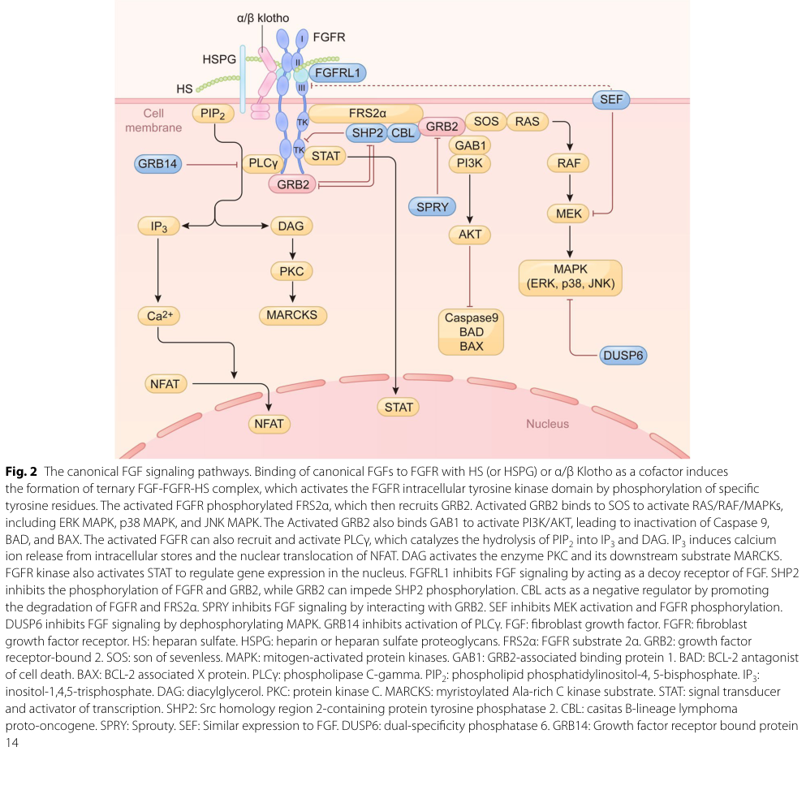

## Question

# Gene Research for Functional Annotation

## ⚠️ CRITICAL: Gene/Protein Identification Context

**BEFORE YOU BEGIN RESEARCH:** You MUST verify you are researching the CORRECT gene/protein. Gene symbols can be ambiguous, especially for less well-characterized genes from non-model organisms.

### Target Gene/Protein Identity (from UniProt):
- **UniProt Accession:** P09038
- **Protein Description:** RecName: Full=Fibroblast growth factor 2; Short=FGF-2; AltName: Full=Basic fibroblast growth factor; Short=bFGF; AltName: Full=Heparin-binding growth factor 2; Short=HBGF-2; Flags: Precursor;
- **Gene Information:** Name=FGF2; Synonyms=FGFB;
- **Organism (full):** Homo sapiens (Human).
- **Protein Family:** Belongs to the heparin-binding growth factors family.
- **Key Domains:** Fibroblast_GF_fam. (IPR002209); IL1/FGF. (IPR008996); FGF (PF00167)

### MANDATORY VERIFICATION STEPS:

1. **Check if the gene symbol "FGF2" matches the protein description above**
2. **Verify the organism is correct:** Homo sapiens (Human).
3. **Check if protein family/domains align with what you find in literature**
4. **If you find literature for a DIFFERENT gene with the same or similar symbol, STOP**

### If Gene Symbol is Ambiguous or You Cannot Find Relevant Literature:

**DO NOT PROCEED WITH RESEARCH ON A DIFFERENT GENE.** Instead:
- State clearly: "The gene symbol 'FGF2' is ambiguous or literature is limited for this specific protein"
- Explain what you found (e.g., "Found extensive literature on a different gene with the same symbol in a different organism")
- Describe the protein based ONLY on the UniProt information provided above
- Suggest that the protein function can be inferred from domain/family information

### Research Target:

Please provide a comprehensive research report on the gene **FGF2** (gene ID: FGF2, UniProt: P09038) in human.

The research report should be a detailed narrative explaining the function, biological processes, and localization of the gene product. Citations should be given for all claims.

You should prioritize authoritative reviews and primary scientific literature when conducting research. You can supplement
this with annotations you find in gene/protein databases, but these can be outdated or inaccurate.

We are specifically interested in the primary function of the gene - for enzymes, what reaction is catalyzed, and what is the substrate specificity? For transporters, what is the substrate? For structural proteins or adapters, what is the broader structural role? For signaling molecules, what is the role in the pathway.

We are interested in where in or outside the cell the gene product carries out its function.

We are also interested in the signaling or biochemical pathways in which the gene functions. We are less interested in broad pleiotropic effects, except where these elucidate the precise role.

Include evidence where possible. We are interested in both experimental evidence as well as inference from structure, evolution, or bioinformatic analysis. Precise studies should be prioritized over high-throughput, where available.

## Output

Question: You are an expert researcher providing comprehensive, well-cited information.

Provide detailed information focusing on:
1. Key concepts and definitions with current understanding
2. Recent developments and latest research (prioritize 2023-2024 sources)
3. Current applications and real-world implementations
4. Expert opinions and analysis from authoritative sources
5. Relevant statistics and data from recent studies

Format as a comprehensive research report with proper citations. Include URLs and publication dates where available.
Always prioritize recent, authoritative sources and provide specific citations for all major claims.

# Gene Research for Functional Annotation

## ⚠️ CRITICAL: Gene/Protein Identification Context

**BEFORE YOU BEGIN RESEARCH:** You MUST verify you are researching the CORRECT gene/protein. Gene symbols can be ambiguous, especially for less well-characterized genes from non-model organisms.

### Target Gene/Protein Identity (from UniProt):
- **UniProt Accession:** P09038
- **Protein Description:** RecName: Full=Fibroblast growth factor 2; Short=FGF-2; AltName: Full=Basic fibroblast growth factor; Short=bFGF; AltName: Full=Heparin-binding growth factor 2; Short=HBGF-2; Flags: Precursor;
- **Gene Information:** Name=FGF2; Synonyms=FGFB;
- **Organism (full):** Homo sapiens (Human).
- **Protein Family:** Belongs to the heparin-binding growth factors family.
- **Key Domains:** Fibroblast_GF_fam. (IPR002209); IL1/FGF. (IPR008996); FGF (PF00167)

### MANDATORY VERIFICATION STEPS:

1. **Check if the gene symbol "FGF2" matches the protein description above**
2. **Verify the organism is correct:** Homo sapiens (Human).
3. **Check if protein family/domains align with what you find in literature**
4. **If you find literature for a DIFFERENT gene with the same or similar symbol, STOP**

### If Gene Symbol is Ambiguous or You Cannot Find Relevant Literature:

**DO NOT PROCEED WITH RESEARCH ON A DIFFERENT GENE.** Instead:
- State clearly: "The gene symbol 'FGF2' is ambiguous or literature is limited for this specific protein"
- Explain what you found (e.g., "Found extensive literature on a different gene with the same symbol in a different organism")
- Describe the protein based ONLY on the UniProt information provided above
- Suggest that the protein function can be inferred from domain/family information

### Research Target:

Please provide a comprehensive research report on the gene **FGF2** (gene ID: FGF2, UniProt: P09038) in human.

The research report should be a detailed narrative explaining the function, biological processes, and localization of the gene product. Citations should be given for all claims.

You should prioritize authoritative reviews and primary scientific literature when conducting research. You can supplement
this with annotations you find in gene/protein databases, but these can be outdated or inaccurate.

We are specifically interested in the primary function of the gene - for enzymes, what reaction is catalyzed, and what is the substrate specificity? For transporters, what is the substrate? For structural proteins or adapters, what is the broader structural role? For signaling molecules, what is the role in the pathway.

We are interested in where in or outside the cell the gene product carries out its function.

We are also interested in the signaling or biochemical pathways in which the gene functions. We are less interested in broad pleiotropic effects, except where these elucidate the precise role.

Include evidence where possible. We are interested in both experimental evidence as well as inference from structure, evolution, or bioinformatic analysis. Precise studies should be prioritized over high-throughput, where available.

# Comprehensive Research Report: Human Fibroblast Growth Factor 2 (FGF2)

**Gene:** FGF2 (Gene ID: FGF2)  
**UniProt:** P09038  
**Organism:** Homo sapiens (Human)  
**Protein Family:** Heparin-binding growth factors family  
**Alternative Names:** Basic fibroblast growth factor (bFGF), Heparin-binding growth factor 2 (HBGF-2)

---

## 1. PROTEIN IDENTITY AND MOLECULAR STRUCTURE

### 1.1 Gene and Protein Identity Verification

The protein encoded by human FGF2 (UniProt P09038) is correctly identified as fibroblast growth factor 2, also known as basic fibroblast growth factor (bFGF) (ardizzone2023roleofbasic pages 1-2, edirisinghe2024decodingfgffgfrsignaling pages 4-5). This protein belongs to the heparin-binding growth factors family and contains the conserved Fibroblast_GF_fam domain (IPR002209), IL1/FGF domain (IPR008996), and FGF domain (PF00167) as annotated in UniProt (edirisinghe2024decodingfgffgfrsignaling pages 3-4, tiwari2024fibroblastgrowthfactors pages 2-4).

### 1.2 Structural Architecture

FGF2 is characterized by a highly conserved **β-trefoil fold**, the hallmark structure of the FGF family (edirisinghe2024decodingfgffgfrsignaling pages 4-5, chen2023structuralbasisfor pages 1-2). The mature signaling form comprises approximately 146 amino acids arranged in 12 antiparallel β-strands organized into three β-meander motifs (edirisinghe2024decodingfgffgfrsignaling pages 4-5, tiwari2024fibroblastgrowthfactors pages 2-4). The protein core is enriched in buried hydrophobic and aromatic residues, while positively charged lysine and arginine residues are exposed on the molecular surface, conferring high affinity for negatively charged heparin and heparan sulfate (tiwari2024fibroblastgrowthfactors pages 2-4, tiwari2024fibroblastgrowthfactors pages 1-2).

The N-terminal region (approximately residues 1-17) is relatively flexible and disordered, while the structured core displays the characteristic barrel-like β-trefoil architecture (tiwari2024fibroblastgrowthfactors pages 2-4). Four cysteine residues are present in FGF2: Cys25 and Cys92 are conserved across the FGF family, while Cys69 and Cys87 have been implicated in FGF2 dimerization (tiwari2024fibroblastgrowthfactors pages 2-4). Recent studies have identified **Cys95** as critical for forming disulfide-linked dimers during the unconventional secretion process, while **Cys77** participates in the interaction with the Na⁺/K⁺-ATPase α1 subunit (ardizzone2023roleofbasic pages 2-4).

---

## 2. PRIMARY MOLECULAR FUNCTION AND RECEPTOR SPECIFICITY

### 2.1 Function as a Signaling Molecule

FGF2 functions primarily as an **extracellular signaling ligand** rather than as an enzyme or transporter (ardizzone2023roleofbasic pages 2-4, edirisinghe2024decodingfgffgfrsignaling pages 3-4). As a canonical/paracrine fibroblast growth factor, FGF2 acts as a non-enzymatic mitogen and growth factor that regulates fundamental cellular processes including proliferation, differentiation, migration, survival, and angiogenesis through receptor tyrosine kinase activation (ardizzone2023roleofbasic pages 1-2, tiwari2024fibroblastgrowthfactors pages 1-2, tiwari2024fibroblastgrowthfactors pages 6-7).

### 2.2 Receptor Binding and Specificity

**Receptor Range:** FGF2 can bind and activate all four human fibroblast growth factor receptors: **FGFR1, FGFR2, FGFR3, and FGFR4** (ardizzone2023roleofbasic pages 1-2, nguyen2024thecomplexityand pages 4-6). Unlike many FGF family members that show strict isoform specificity, FGF2 has the notable capability to bind both the "b" and "c" alternatively spliced isoforms of FGFR1-3, providing it with broader receptor compatibility than most other FGF ligands (nguyen2024thecomplexityand pages 4-6).

**Preferred Receptors:** Despite this broad binding capability, structural and biochemical studies indicate that FGF2 shows **preferential binding to FGFR1c and FGFR2**, with generally weaker interactions with FGFR3c and FGFR4 (edirisinghe2024decodingfgffgfrsignaling pages 4-5). Many of FGF2's biological functions, particularly in endothelial cells and angiogenesis, are primarily mediated through **FGFR1** (ardizzone2023roleofbasic pages 2-4, edirisinghe2024decodingfgffgfrsignaling pages 4-5).

**Structural Basis of Receptor Binding:** FGF2 engages the extracellular **D2 and D3 immunoglobulin-like domains** of FGFRs, with the D2-D3 fragment and linker region determining ligand binding and receptor specificity (edirisinghe2024decodingfgffgfrsignaling pages 4-5, nguyen2024thecomplexityand pages 4-6, chen2023structuralbasisfor pages 1-2). A critical receptor-binding region has been mapped to **residues 106-115** of FGF2, with **Tyr114 and Trp115** making especially important contributions to receptor affinity (tiwari2024fibroblastgrowthfactors pages 2-4).

The structural basis for receptor selectivity involves complementarity between FGF2 and the receptor **βC′-βE loop**. The shorter loop in FGFR4 (two residues shorter than FGFR1-3c) and an alanine substitution at position 317 in FGFR3 (versus valine in FGFR1c) reduce optimal interactions with FGF2, explaining the differential binding affinities (edirisinghe2024decodingfgffgfrsignaling pages 4-5).

### 2.3 Role of Heparan Sulfate Proteoglycans

**Essential Cofactor Function:** Heparan sulfate proteoglycans (HSPGs) function as essential cofactors for FGF2 signaling, not merely as passive binding sites (nguyen2024thecomplexityand pages 6-8, tiwari2024fibroblastgrowthfactors pages 2-4, edirisinghe2024decodingfgffgfrsignaling pages 3-4). Cell-surface and extracellular matrix HSPGs—including syndecans, glypicans, and perlecan—bind, concentrate, protect, and present FGF2 at the cell surface (tiwari2024fibroblastgrowthfactors pages 2-4, critcher2025mappingthefgf2 pages 9-11).

**Heparan Sulfate Binding Sites:** Heparan sulfate binds to basic, solvent-exposed regions of FGF2, including the **β1-β2 loop** and **β10-β12 region** (tiwari2024fibroblastgrowthfactors pages 2-4). These interactions create a binding surface distinct from the principal FGFR-binding region and are critical for regulating extracellular retention, diffusion, and receptor presentation (tiwari2024fibroblastgrowthfactors pages 2-4).

**Complex Assembly and Stabilization:** HSPGs participate in organizing and stabilizing the FGF2-FGFR signaling complex. Classical structural models describe a **2:2:2 FGF2-FGFR-HS complex**, in which heparan sulfate stabilizes two ligand-receptor units and promotes receptor dimerization (nguyen2024thecomplexityand pages 6-8, chen2023structuralbasisfor pages 1-2). This dimerization brings the intracellular FGFR tyrosine kinase domains into proximity, enabling trans-autophosphorylation and downstream signaling initiation (chen2023structuralbasisfor pages 1-2). Recent structural refinements suggest that asymmetric receptor recruitment may also occur, indicating that the signaling complex architecture is more sophisticated than initially proposed (chen2023structuralbasisfor pages 1-2).

**Functional Significance:** HSPGs increase the stability and half-life of the FGF-FGFR complex, protect FGF2 from proteolytic degradation and thermal denaturation, and restrict FGF2 diffusion to maintain localized signaling (tiwari2024fibroblastgrowthfactors pages 2-4, zareh2025theroleof pages 1-3). Removal of N-glycans from FGFR1-IIIc can increase its affinity for FGF2 and heparin-derived oligosaccharides, indicating that receptor glycosylation fine-tunes the FGF2-FGFR interaction (nguyen2024thecomplexityand pages 6-8).

| Molecular property | FGF2 annotation | Functional significance | Evidence |
|---|---|---|---|
| Protein identity | Human fibroblast growth factor 2 (FGF2), also called basic FGF (bFGF) or heparin-binding growth factor 2; a canonical/paracrine member of the heparin-binding FGF family | Functions principally as a non-enzymatic signaling ligand rather than as an enzyme or transporter | (ardizzone2023roleofbasic pages 2-4, edirisinghe2024decodingfgffgfrsignaling pages 3-4) |
| Mature signaling core | The commonly studied mature low-molecular-weight FGF2 protein comprises approximately 146 amino acids | Forms the extracellular ligand that activates cell-surface FGFR signaling | (edirisinghe2024decodingfgffgfrsignaling pages 4-5) |
| Overall fold and domains | Conserved **β-trefoil/IL-1-like FGF fold**, built from 12 antiparallel β-strands arranged as three β-meander motifs; the N-terminal region is relatively flexible or disordered | Produces a compact scaffold presenting spatially distinct FGFR- and heparan-sulfate-binding surfaces; corresponds to the Fibroblast_GF_fam, FGF, and IL1/FGF domain annotations | (edirisinghe2024decodingfgffgfrsignaling pages 4-5, tiwari2024fibroblastgrowthfactors pages 2-4, tiwari2024fibroblastgrowthfactors pages 1-2) |
| Surface chemistry | The core is enriched in buried hydrophobic and aromatic residues, whereas positively charged lysine and arginine residues are exposed on the surface | The basic surface explains the protein's high affinity for negatively charged heparin and heparan sulfate | (tiwari2024fibroblastgrowthfactors pages 2-4, tiwari2024fibroblastgrowthfactors pages 1-2) |
| Principal receptor-binding region | Residues **106–115** have been identified as an important FGFR-binding segment; **Tyr114** and **Trp115** make especially important contributions to receptor affinity | Mutating or sterically obstructing this surface can reduce FGFR binding and biological activity | (tiwari2024fibroblastgrowthfactors pages 2-4) |
| Receptor binding site on FGFR | FGF2 engages the extracellular **D2 and D3 immunoglobulin-like domains** and the D2–D3 linker of FGFRs | Ligand binding positions receptors for dimerization and trans-autophosphorylation of their intracellular tyrosine-kinase domains | (edirisinghe2024decodingfgffgfrsignaling pages 4-5, nguyen2024thecomplexityand pages 4-6, chen2023structuralbasisfor pages 1-2) |
| Receptor range | FGF2 can activate **FGFR1, FGFR2, FGFR3, and FGFR4**; reported binding extends across multiple alternatively spliced b/c receptor isoforms | Broad receptor compatibility helps explain FGF2 activity in endothelial, mesenchymal, neural, epithelial, and tumor-cell contexts | (ardizzone2023roleofbasic pages 1-2, nguyen2024thecomplexityand pages 4-6) |
| Preferred receptors | Structural and biochemical comparisons indicate strongest or preferential binding to **FGFR1c and FGFR2**, with generally weaker interactions with **FGFR3c and FGFR4**; many endothelial responses are dominated by FGFR1c | Receptor abundance, splice isoform, and tissue context determine the actual signaling output; FGF2 should not be assigned a single exclusive receptor | (edirisinghe2024decodingfgffgfrsignaling pages 4-5) |
| Structural basis of receptor selectivity | Complementarity with the receptor **βC′–βE loop** contributes to specificity. FGFR4 has a shorter loop, while an alanine substitution in FGFR3 reduces optimal contacts relative to FGFR1c | Explains why FGF2 can bind all four FGFRs yet activate them with different efficiencies | (edirisinghe2024decodingfgffgfrsignaling pages 4-5) |
| Heparan-sulfate-binding surface | Heparan sulfate binds basic, solvent-exposed regions that include the **β1–β2 loop** and **β10–β12 region** | Creates a second interaction surface distinct from the principal FGFR-binding region and regulates extracellular retention, diffusion, and receptor presentation | (tiwari2024fibroblastgrowthfactors pages 2-4) |
| Role of heparan sulfate proteoglycans | Cell-surface and extracellular-matrix HSPGs—including syndecans, glypicans, and perlecan—bind, concentrate, protect, and present FGF2; HS increases complex stability and protects FGF2 from proteolysis and thermal denaturation | HSPGs act as extracellular reservoirs and signaling cofactors rather than as the primary kinase receptors | (nguyen2024thecomplexityand pages 6-8, tiwari2024fibroblastgrowthfactors pages 2-4, edirisinghe2024decodingfgffgfrsignaling pages 3-4) |
| Signaling-complex architecture | Classical structural models describe a **2:2:2 FGF2–FGFR–HS complex**, in which HS stabilizes two ligand–receptor units and promotes receptor dimerization | Dimerization brings the intracellular FGFR kinase domains together, enabling trans-autophosphorylation and downstream signaling | (nguyen2024thecomplexityand pages 6-8, chen2023structuralbasisfor pages 1-2) |
| Current structural refinement | Recent structural work supports asymmetric receptor recruitment for FGF–FGFR complexes and indicates that the universal symmetric-dimer model may be incomplete; the exact contribution of direct FGF2–HS affinity to signaling can vary by experimental and cellular context | Complex stoichiometry and HS dependence should be treated as mechanistically refined—not completely settled—features of FGF2 signaling | (chen2023structuralbasisfor pages 1-2) |
| Cysteines and oligomerization | Surface cysteines contribute to FGF2 self-association; recent secretion experiments identify **Cys95** as forming a disulfide-linked membrane-associated dimer, whereas **Cys77** contributes to interaction with the Na⁺/K⁺-ATPase α1 recruitment platform | Oligomerization is important for unconventional membrane translocation and is mechanistically distinct from FGFR recognition after secretion | (ardizzone2023roleofbasic pages 2-4) |
| Molecular action | FGF2 is a ligand with **receptor specificity**, not an enzyme with substrate specificity: it binds FGFR–HSPG assemblies and induces receptor dimerization and kinase activation | Activated FGFRs signal through FRS2α-dependent RAS–MAPK and PI3K–AKT pathways and through PLCγ and STAT modules | (edirisinghe2024decodingfgffgfrsignaling pages 3-4, tiwari2024fibroblastgrowthfactors pages 4-6, edirisinghe2024decodingfgffgfrsignaling pages 1-3) |

*Table: Structural and biochemical annotation of human FGF2, including its β-trefoil fold, receptor-contact region, FGFR preferences, and heparan-sulfate-dependent complex formation. The table also distinguishes established features from aspects of signaling-complex architecture that remain under refinement.*

---

## 3. SUBCELLULAR LOCALIZATION AND PROTEIN TRAFFICKING

### 3.1 FGF2 Isoforms

Human FGF2 exists as **five distinct molecular weight isoforms** (18, 22, 22.5, 24, and 34 kDa) that arise through alternative translation initiation at different start codons on the same FGF2 mRNA (ardizzone2023roleofbasic pages 2-4). These isoforms exhibit fundamentally different subcellular localizations and biological functions (zareh2025theroleof pages 1-3, ardizzone2023roleofbasic pages 2-4).

### 3.2 Low Molecular Weight (18 kDa) Isoform: Extracellular Signaling

**Localization and Secretion:** The **18 kDa low-molecular-weight isoform** is the only form that undergoes extracellular secretion and functions as the principal paracrine/autocrine signaling molecule (zareh2025theroleof pages 1-3). This isoform is primarily cytosolic before export and becomes associated with the extracellular matrix and cell surface after secretion (ardizzone2023roleofbasic pages 1-2).

**Unconventional Secretion Mechanism:** Because FGF2 lacks a conventional signal peptide for ER targeting, it bypasses the classical ER-Golgi secretory pathway (ardizzone2023roleofbasic pages 1-2, edirisinghe2024decodingfgffgfrsignaling pages 4-5). Instead, FGF2 employs a type I unconventional secretion mechanism involving direct translocation across the plasma membrane (ardizzone2023roleofbasic pages 1-2, ardizzone2023roleofbasic pages 2-4).

This process requires several coordinated steps:

1. **Recruitment to plasma membrane:** The Na⁺/K⁺-ATPase α1 subunit serves as a landing platform, with Cys77 of FGF2 participating in this interaction (edirisinghe2024decodingfgffgfrsignaling pages 4-5, ardizzone2023roleofbasic pages 2-4)

2. **Oligomerization:** PI(4,5)P₂ on the inner plasma membrane leaflet promotes FGF2 oligomerization, with **Cys95-Cys95 disulfide bridges** mediating the formation of FGF2 dimers that serve as building blocks for higher-order oligomers (ardizzone2023roleofbasic pages 2-4, zareh2025theroleof pages 1-3)

3. **Membrane translocation:** These oligomers function as dynamic translocation intermediates that form lipidic membrane pores (ardizzone2023roleofbasic pages 2-4)

4. **Extracellular capture:** Heparan sulfate proteoglycans on the outer plasma membrane leaflet, particularly those linked to glypican-1, capture FGF2 and mediate oligomer disassembly, completing the translocation into the extracellular space (ardizzone2023roleofbasic pages 2-4, zareh2025theroleof pages 1-3)

### 3.3 High Molecular Weight Isoforms: Intracellular Functions

The **22, 22.5, 24, and 34 kDa high-molecular-weight (HMW) isoforms** are predominantly intracellular and are **not ordinarily secreted** through the unconventional pathway (zareh2025theroleof pages 1-3, ardizzone2023roleofbasic pages 2-4). These isoforms are enriched in the nucleus but can redistribute between nuclear and cytoplasmic compartments depending on cell type and state (ardizzone2023roleofbasic pages 2-4).

**Intracrine Functions:** HMW FGF2 isoforms act through intracrine mechanisms and are associated with enhanced cell proliferation, altered nuclear morphology (including binucleation in neonatal cardiac myocytes), cell-fate regulation, and trans-differentiation of neural crest-derived Schwann cell precursors into melanocytes (ardizzone2023roleofbasic pages 2-4). The balance between nuclear and cytoplasmic HMW FGF2 has been linked to proliferative state in astrocytes, with nuclear redistribution associated with active proliferation and cytosolic redistribution with contact inhibition (ardizzone2023roleofbasic pages 2-4).

| Human FGF2 isoform | Translational origin | Predominant localization | Secretion status and mechanism | Function supported by available evidence |
|---|---|---|---|---|
| **18 kDa low-molecular-weight FGF2** | Initiation at the canonical AUG start codon | Cytosol before export; extracellular matrix and cell surface after export; extracellular FGF2 can subsequently be internalized and reach the cytosol or nucleus of target cells | **Secreted.** Because FGF2 lacks an ER-targeting signal peptide, it bypasses the ER–Golgi pathway. Recruitment to the inner plasma membrane involves Na⁺/K⁺-ATPase α1, Tec-dependent phosphorylation, and PI(4,5)P₂; PI(4,5)P₂-dependent oligomerization produces membrane-translocation intermediates, while extracellular heparan-sulfate proteoglycans capture and disassemble the oligomers (edirisinghe2024decodingfgffgfrsignaling pages 4-5, ardizzone2023roleofbasic pages 2-4) | Principal extracellular autocrine/paracrine ligand: binds FGFRs with heparan sulfate to activate MAPK/ERK, PI3K/AKT, PLCγ/PKC, and related pathways controlling proliferation, survival, migration, differentiation, angiogenesis, and tissue repair (ardizzone2023roleofbasic pages 2-4, tiwari2024fibroblastgrowthfactors pages 4-6, tiwari2024fibroblastgrowthfactors pages 6-7) |
| **22 kDa high-molecular-weight FGF2** | Alternative upstream translation initiation on the same FGF2 mRNA | Predominantly intracellular; high-molecular-weight isoforms are generally enriched in the nucleus but can redistribute between nuclear and cytoplasmic compartments | **Not ordinarily secreted** by the unconventional pathway used by the 18 kDa isoform (zareh2025theroleof pages 1-3, ardizzone2023roleofbasic pages 2-4) | Acts mainly through intracrine mechanisms. The cited literature supports collective HMW-isoform associations with proliferation, altered nuclear morphology, and cell-fate regulation, but does not resolve a unique function for the 22 kDa species (ardizzone2023roleofbasic pages 2-4) |
| **22.5 kDa high-molecular-weight FGF2** | Alternative upstream translation initiation | Predominantly intracellular and commonly nuclear; exact compartmental proportions are cell- and state-dependent | **Not ordinarily secreted**; retained in the producing cell (zareh2025theroleof pages 1-3, ardizzone2023roleofbasic pages 2-4) | Considered an intracrine/nuclear FGF2 species. Isoform-specific activity distinct from the other HMW proteins is not established in the cited recent sources; reported HMW activities include regulation of proliferation and differentiation (ardizzone2023roleofbasic pages 2-4) |
| **24 kDa high-molecular-weight FGF2** | Alternative upstream translation initiation | Predominantly intracellular, with nuclear enrichment reported collectively for HMW FGF2 and possible cytoplasmic redistribution | **Not ordinarily secreted**; retained intracellularly (zareh2025theroleof pages 1-3, ardizzone2023roleofbasic pages 2-4) | HMW FGF2 collectively promotes intracrine responses, including enhanced proliferation and changes in nuclear morphology in some cell models; a function exclusive to the 24 kDa isoform has not been conclusively assigned (ardizzone2023roleofbasic pages 2-4) |
| **34 kDa high-molecular-weight FGF2** | Alternative upstream translation initiation at the most upstream site | Predominantly intracellular/nuclear; may also occur in the cytoplasmic pool depending on cell context | **Not ordinarily secreted**; retained in the cell of origin (zareh2025theroleof pages 1-3, ardizzone2023roleofbasic pages 2-4) | Associated with the collective nuclear/intracrine activities of HMW FGF2, including proliferation, binucleation or altered nuclear morphology in neonatal cardiomyocytes and cell-fate effects in developmental models; evidence does not isolate these effects uniquely to 34 kDa FGF2 (ardizzone2023roleofbasic pages 2-4) |
| **Interpretive limitation** | The five proteins arise from alternative translation initiation rather than separate genes | Localization is best established at the **low- versus high-molecular-weight class level**, not independently for every HMW species | Only the lightest isoform is consistently described as extracellularly released; the four heavier forms remain intracellular (zareh2025theroleof pages 1-3, ardizzone2023roleofbasic pages 2-4) | Recent reviews frequently pool the 22–34 kDa proteins as “HMW FGF2”; therefore, assigning a distinct localization or function to each individual HMW isoform would exceed the available evidence (ardizzone2023roleofbasic pages 2-4) |

*Table: The five human FGF2 molecular-weight isoforms differ principally in extracellular versus intracellular deployment. The evidence strongly distinguishes secreted 18 kDa FGF2 from nuclear/intracellular high-molecular-weight forms, but does not yet support unique functions for every individual HMW isoform.*

---

## 4. SIGNALING PATHWAYS AND BIOCHEMICAL MECHANISMS

### 4.1 Overview of FGF2-Initiated Signaling

FGF2 binding to FGFRs, facilitated by heparan sulfate cofactors, induces receptor dimerization and trans-autophosphorylation of intracellular tyrosine kinase domains (edirisinghe2024decodingfgffgfrsignaling pages 4-5, edirisinghe2024decodingfgffgfrsignaling pages 3-4, nguyen2024thecomplexityand pages 6-8). Activated FGFRs phosphorylate the adaptor protein **FRS2α** and directly recruit other signaling effectors, initiating four principal downstream signaling pathways (tiwari2024fibroblastgrowthfactors pages 4-6, liu2026fgffamilyin pages 3-4, edirisinghe2024decodingfgffgfrsignaling pages 1-3). A comprehensive diagram of these pathways is shown below (liu2026fgffamilyin media 440d35a2):

(liu2026fgffamilyin media 440d35a2)

### 4.2 RAS-RAF-MEK-ERK/MAPK Pathway

The **RAS-RAF-MEK-ERK pathway** is a major proliferative and transcriptional signaling cascade activated by FGF2 (tiwari2024fibroblastgrowthfactors pages 4-6, liu2026fgffamilyin pages 3-4, edirisinghe2024decodingfgffgfrsignaling pages 1-3). Phosphorylated FRS2α recruits the adaptor protein **GRB2**, which associates with the guanine nucleotide exchange factor **SOS**. SOS activates RAS by promoting GDP-to-GTP exchange, leading to sequential activation of RAF, MEK, and ultimately **ERK1/2** (tiwari2024fibroblastgrowthfactors pages 4-6). ERK1/2 translocates to the nucleus to regulate transcription factors controlling cell-cycle entry, proliferation, and differentiation (he2025fgfraberrationsin pages 7-9).

In endothelial cells, the **FGF2-FGFR1c-FRS2α-MAPK/ERK pathway** is critical for angiogenesis, wound healing, and tissue vascularization (edirisinghe2024decodingfgffgfrsignaling pages 4-5). The pathway can also activate p38 and JNK MAP kinases, contributing to migration and stress responses (he2025fgfraberrationsin pages 7-9, liu2026fgffamilyin pages 3-4).

**Regulation:** Negative regulators including **SPRY (Sprouty)**, **SEF**, and **DUSP6** provide feedback control of MAPK signaling (liu2026fgffamilyin media 440d35a2). Receptor internalization and signal duration influence whether MAPK activation produces proliferation versus differentiation outcomes (edirisinghe2024decodingfgffgfrsignaling pages 4-5).

### 4.3 PI3K-AKT Pathway

FRS2α also recruits **GAB1**, which activates **phosphatidylinositol 3-kinase (PI3K)**, leading to production of PIP₃ and activation of **PDK1** and **AKT** (tiwari2024fibroblastgrowthfactors pages 4-6, he2025fgfraberrationsin pages 7-9, nguyen2024thecomplexityand pages 6-8). AKT phosphorylates multiple downstream substrates including **mTOR** (through TSC2), **GSK3β**, **BAD**, **FOXO** transcription factors, and regulators of cell-cycle progression (he2025fgfraberrationsin pages 7-9).

This pathway primarily regulates **cell survival, anti-apoptotic signaling, growth, metabolism, proliferation, and migration** (he2025fgfraberrationsin pages 7-9, tiwari2024fibroblastgrowthfactors pages 6-7). The PI3K-AKT pathway is essential for maintaining stem cell populations, promoting tissue repair, and supporting tumor cell survival (yang2025roleoffgf2 pages 7-9, tiwari2024fibroblastgrowthfactors pages 6-7).

**Context-Dependent Effects:** Interestingly, the relationship between FGF2 and PI3K-AKT signaling can be context-dependent. In some differentiating stem cell systems, FGF2 pretreatment can actually **reduce AKT phosphorylation** and promote osteogenic/odontogenic differentiation by inhibiting the PI3K-AKT pathway (yang2025roleoffgf2 pages 7-9). This highlights the importance of timing, dose, and cellular context in determining FGF2's effects.

### 4.4 PLCγ-PKC Pathway

Activated FGFRs directly recruit and phosphorylate **phospholipase C-γ (PLCγ1)**, with FGFR1 **Tyr766** serving as a major docking site (tiwari2024fibroblastgrowthfactors pages 4-6, he2025fgfraberrationsin pages 7-9, liu2026fgffamilyin pages 3-4). PLCγ hydrolyzes PIP₂ into **IP₃** and **DAG** (tiwari2024fibroblastgrowthfactors pages 4-6, liu2026fgffamilyin pages 3-4). IP₃ triggers release of intracellular Ca²⁺ from endoplasmic reticulum stores, while DAG activates **protein kinase C (PKC)** (he2025fgfraberrationsin pages 7-9, liu2026fgffamilyin pages 3-4).

Calcium release can promote **NFAT** translocation to the nucleus and activate calcium-dependent transcription (liu2026fgffamilyin pages 3-4, liu2026fgffamilyin media 440d35a2). This pathway regulates **calcium-dependent transcription, secretion, migration, differentiation, survival, and cytoskeletal remodeling** (he2025fgfraberrationsin pages 7-9, edirisinghe2024decodingfgffgfrsignaling pages 1-3).

In axon guidance, FGF2-induced PLC signaling mediates **repulsive guidance** of retinal ganglion cell neurites, demonstrating pathway-specific biological outcomes (zhang2023rolesoffibroblast pages 8-10).

### 4.5 JAK-STAT Pathway

FGFR activation promotes phosphorylation of **STAT transcription factors**, particularly **STAT1, STAT3, and STAT5**, either directly or through associated JAK activity (yang2025roleoffgf2 pages 7-9, edirisinghe2024decodingfgffgfrsignaling pages 1-3). Phosphorylated STATs dimerize, translocate to the nucleus, and regulate target gene expression controlling proliferation, survival, differentiation, and inflammatory responses (yang2025roleoffgf2 pages 7-9, edirisinghe2024decodingfgffgfrsignaling pages 1-3).

While essential for developmental and regenerative responses, excessive FGF2-FGFR-STAT3 activity can contribute to pathological neovascularization and cancer-associated signaling (edirisinghe2024decodingfgffgfrsignaling pages 4-5, edirisinghe2024decodingfgffgfrsignaling pages 24-25).

### 4.6 Pathway Crosstalk and Integration

FGF2 signaling does not operate in isolation but exhibits extensive crosstalk with other signaling pathways (yang2025roleoffgf2 pages 7-9). Notable interactions include:

- **VEGF signaling:** Competition for FRS2α recruitment determines the balance between FGF2-FGFR1 and VEGF-VEGFR signaling, with FGF2 signaling predominating under normoxic conditions and VEGF signaling becoming more prominent during hypoxia (edirisinghe2024decodingfgffgfrsignaling pages 4-5)

- **BMP/Smad, WNT/β-catenin, and YAP/TAZ pathways:** These interactions influence osteogenic differentiation, bone formation, and the balance between proliferation and differentiation (yang2025roleoffgf2 pages 7-9, liu2026fgffamilyin pages 6-8)

| Pathway | Key signaling components and cascade | Principal regulation | Cellular functions regulated | Representative biological outcomes |
|---|---|---|---|---|
| **Shared initiation** | Extracellular FGF2 binds the FGFR D2–D3 region together with heparan sulfate proteoglycan; complex assembly promotes FGFR dimerization and kinase-domain trans-autophosphorylation. Phosphorylated FGFR then recruits FRS2α or directly engages PLCγ and other effectors. FGF2 preferentially activates FGFR1c and FGFR2, although signaling is possible through FGFR1–4 depending on receptor isoform and cellular context. (edirisinghe2024decodingfgffgfrsignaling pages 4-5, edirisinghe2024decodingfgffgfrsignaling pages 3-4, nguyen2024thecomplexityand pages 6-8) | Heparan sulfate concentrates and presents FGF2, protects it from degradation, and stabilizes productive receptor complexes. Receptor abundance, alternative splicing, glycosylation, ligand dose, and signal duration influence pathway strength and output. (nguyen2024thecomplexityand pages 6-8, tiwari2024fibroblastgrowthfactors pages 2-4, edirisinghe2024decodingfgffgfrsignaling pages 3-4) | Establishes the amplitude, duration, and cellular specificity of all downstream FGF2 responses. | Context-dependent proliferation, survival, differentiation, migration, angiogenesis, development, and tissue repair. (edirisinghe2024decodingfgffgfrsignaling pages 1-3, tiwari2024fibroblastgrowthfactors pages 6-7) |
| **RAS–RAF–MEK–ERK/MAPK** | FGFR → phosphorylated FRS2α → GRB2–SOS → RAS-GTP → RAF → MEK → ERK1/2; ERK enters the nucleus and regulates transcription. Broader MAPK outputs can include p38 and JNK. (tiwari2024fibroblastgrowthfactors pages 4-6, liu2026fgffamilyin pages 3-4, edirisinghe2024decodingfgffgfrsignaling pages 1-3) | SPRY, SEF and DUSP6 provide inhibitory or feedback control; receptor internalization and signal duration further shape whether MAPK activation produces proliferation or differentiation. Crosstalk with VEGF signaling can involve competition for FRS2α. (edirisinghe2024decodingfgffgfrsignaling pages 4-5, liu2026fgffamilyin media 440d35a2) | Cell-cycle entry, proliferation, migration, differentiation, transcriptional reprogramming and cytoskeletal responses. | Endothelial proliferation and angiogenesis, wound healing, vascularization, tissue regeneration, osteogenic gene expression and context-specific neurite extension or guidance. (zhang2023rolesoffibroblast pages 8-10, edirisinghe2024decodingfgffgfrsignaling pages 4-5) |
| **PI3K–AKT–mTOR/GSK3** | FGFR → FRS2α → GRB2–GAB1 → PI3K → PIP3 → PDK1 → AKT; downstream effectors include mTOR through TSC2, GSK3β, BAD, FOXO proteins and regulators of cell-cycle progression. (tiwari2024fibroblastgrowthfactors pages 4-6, he2025fgfraberrationsin pages 7-9, nguyen2024thecomplexityand pages 6-8) | PTEN opposes PI3K-generated PIP3; pathway output is modified by receptor and cell type, exposure timing, and crosstalk with MAPK, WNT/β-catenin and YAP/TAZ. FGF2 can produce context-dependent effects, including reduced AKT phosphorylation after prolonged pretreatment in some differentiating stem cells. (yang2025roleoffgf2 pages 7-9, edirisinghe2024decodingfgffgfrsignaling pages 1-3) | Cell survival, anti-apoptotic signaling, growth, metabolism, proliferation, migration, stemness and differentiation. | Maintenance or expansion of progenitor populations, tissue repair and regeneration, tumor-cell survival and resistance; temporal modulation can promote osteogenic or odontogenic differentiation. (he2025fgfraberrationsin pages 7-9, yang2025roleoffgf2 pages 7-9, tiwari2024fibroblastgrowthfactors pages 6-7) |
| **PLCγ–IP3/DAG–Ca²⁺/PKC** | Activated FGFR directly recruits and phosphorylates PLCγ1, with FGFR1 Tyr766 serving as a major docking site. PLCγ hydrolyzes PIP2 into IP3 and DAG; IP3 releases intracellular Ca²⁺, whereas DAG activates PKC. Ca²⁺ can additionally promote NFAT-dependent transcription. (tiwari2024fibroblastgrowthfactors pages 4-6, he2025fgfraberrationsin pages 7-9, liu2026fgffamilyin pages 3-4) | Requires appropriate FGFR tyrosine phosphorylation and membrane PIP2 availability. Calcium clearance, PKC feedback, and pathway crosstalk determine signal duration and cellular response. (he2025fgfraberrationsin pages 7-9, edirisinghe2024decodingfgffgfrsignaling pages 1-3) | Calcium-dependent transcription, secretion, migration, differentiation, survival and cytoskeletal remodeling. | Contributes to angiogenic and repair responses and can cooperate with MAPK during neurite extension; in retinal ganglion cells, PLC signaling mediates FGF2-induced repulsive axon guidance. (zhang2023rolesoffibroblast pages 8-10, tiwari2024fibroblastgrowthfactors pages 6-7) |
| **JAK–STAT / FGFR–STAT** | FGFR activation promotes phosphorylation of STAT-family factors—particularly STAT1, STAT3 and STAT5—either directly or through associated JAK activity; phosphorylated STATs dimerize, enter the nucleus and regulate target genes. (yang2025roleoffgf2 pages 7-9, edirisinghe2024decodingfgffgfrsignaling pages 1-3) | STAT output depends on receptor context and is constrained by phosphatases and other negative-feedback regulators; interaction with MAPK, PI3K–AKT and inflammatory signaling modifies transcriptional specificity. (yang2025roleoffgf2 pages 7-9, edirisinghe2024decodingfgffgfrsignaling pages 1-3) | Transcriptional control of proliferation, survival, differentiation, inflammatory responses and cell-fate programs. | Supports developmental and regenerative responses, while excessive FGF2–FGFR–STAT3 activity can contribute to pathological neovascularization and cancer-associated signaling. (edirisinghe2024decodingfgffgfrsignaling pages 4-5, edirisinghe2024decodingfgffgfrsignaling pages 24-25) |

*Table: This table traces the four principal signaling branches activated by FGF2–FGFR complexes and identifies their major components, regulatory controls, cellular functions, and biological outcomes.*

---

## 5. BIOLOGICAL PROCESSES AND PHYSIOLOGICAL FUNCTIONS

### 5.1 Angiogenesis and Vascular Development

**Primary Angiogenic Function:** FGF2 is one of the most potent pro-angiogenic factors, playing critical roles in both physiological and pathological blood vessel formation (tiwari2024fibroblastgrowthfactors pages 6-7, edirisinghe2024decodingfgffgfrsignaling pages 4-5, ardizzone2023roleofbasic pages 2-4). In endothelial cells, FGF2 signals primarily through FGFR1c, activating FRS2α and MAPK/ERK pathways to drive endothelial proliferation, migration, protease release, basement membrane degradation, and capillary tube formation (tiwari2024fibroblastgrowthfactors pages 6-7, edirisinghe2024decodingfgffgfrsignaling pages 4-5).

**Physiological Angiogenesis:** FGF2 supports embryonic vascular development, tissue perfusion during wound healing, and regenerative neovascularization (edirisinghe2024decodingfgffgfrsignaling pages 4-5, ardizzone2023roleofbasic pages 2-4). The protein stimulates endothelial cells to release proteases and plasminogen activator, which degrade the basement membrane and enable new cells to migrate and proliferate, forming new blood vessels (tiwari2024fibroblastgrowthfactors pages 7-9).

**Pathological Angiogenesis:** Dysregulated FGF2 signaling contributes to tumor vascularization, pathological ocular neovascularization, and intraplaque angiogenesis (edirisinghe2024decodingfgffgfrsignaling pages 4-5, edirisinghe2024decodingfgffgfrsignaling pages 24-25, ardizzone2023roleofbasic pages 2-4). Notably, VEGF-B can function as an endogenous inhibitor of excessive FGF2-driven angiogenesis by binding FGFR1, promoting FGFR1-VEGFR1 complex formation, and suppressing FGF2-induced ERK activation (edirisinghe2024decodingfgffgfrsignaling pages 4-5).

### 5.2 Wound Healing and Tissue Repair

FGF2 plays a central role in wound healing and tissue repair through coordinated regulation of proliferation, migration, angiogenesis, and extracellular matrix remodeling (tiwari2024fibroblastgrowthfactors pages 2-4, edirisinghe2024decodingfgffgfrsignaling pages 4-5, edirisinghe2024decodingfgffgfrsignaling pages 17-20). The protein activates MAPK/ERK, PI3K/AKT, and PLCγ pathways to promote granulation tissue formation, vascularization, and collagen deposition (edirisinghe2024decodingfgffgfrsignaling pages 4-5).

Heparan sulfate in the extracellular matrix retains and locally presents FGF2, creating sustained repair signals at wound sites (tiwari2024fibroblastgrowthfactors pages 2-4). FGF2 has demonstrated therapeutic potential in treating skin wounds, peripheral artery disease, and promoting repair of cartilage, tendons, and other connective tissues (edirisinghe2024decodingfgffgfrsignaling pages 17-20, ardizzone2023roleofbasic pages 2-4).

### 5.3 Skeletal and Craniofacial Development

**Bone and Cartilage Formation:** FGF2 regulates skeletal morphogenesis, chondrogenesis, osteoblast differentiation, and tissue mineralization through complex interactions with FGFR-ERK, PI3K-AKT, WNT/β-catenin, BMP/Smad, and YAP/TAZ pathways (yang2025roleoffgf2 pages 7-9, edirisinghe2024decodingfgffgfrsignaling pages 24-25, liu2026fgffamilyin pages 6-8).

**Dose and Timing Dependency:** FGF2's effects on bone are highly **dose-, timing-, and isoform-dependent** (liu2026fgffamilyin pages 6-8). Secreted low-molecular-weight FGF2 generally enhances osteogenesis and bone mass, while nuclear high-molecular-weight isoforms can suppress mineralization and produce dwarfism-like phenotypes (liu2026fgffamilyin pages 6-8). Intermittent FGF2 exposure stimulates bone formation, whereas continuous exposure can inhibit osteoblast differentiation (liu2026fgffamilyin pages 6-8).

**Clinical Relevance:** FGF2 contributes to cranial bone development, skeletal homeostasis, fracture repair, and can restore bone mass in osteoporosis models (edirisinghe2024decodingfgffgfrsignaling pages 24-25, liu2026fgffamilyin pages 6-8). It also contributes to the anabolic response to parathyroid hormone treatment (liu2026fgffamilyin pages 6-8).

### 5.4 Neural Development and Neurogenesis

FGF2 supports multiple aspects of nervous system development and maintenance (tiwari2024fibroblastgrowthfactors pages 6-7, edirisinghe2024decodingfgffgfrsignaling pages 24-25). The protein promotes:

- Neural stem cell proliferation and differentiation into neurons and glial cells (tiwari2024fibroblastgrowthfactors pages 6-7)
- Hippocampal neurogenesis (edirisinghe2024decodingfgffgfrsignaling pages 24-25)
- Oligodendrocyte lineage responses and remyelination (edirisinghe2024decodingfgffgfrsignaling pages 24-25)
- Peripheral nerve repair through Schwann cell responses (tiwari2024fibroblastgrowthfactors pages 6-7)
- Axon guidance, with MAPK and PLC pathways mediating both attractive and repulsive guidance cues (zhang2023rolesoffibroblast pages 8-10)

FGF2 also functions as a neurotrophic factor in the central nervous system and has been linked to regulation of depressive-like behavior and PTSD symptom protection (edirisinghe2024decodingfgffgfrsignaling pages 24-25, ardizzone2023roleofbasic pages 2-4).

### 5.5 Cardiac and Vascular Protection

FGF2 demonstrates cardioprotective and pro-survival effects in ischemic conditions (ardizzone2023roleofbasic pages 2-4, ardizzone2023roleofbasic pages 20-21). The protein stimulates PI3K-AKT and ERK signaling to promote:

- Collateral vessel growth and improved tissue perfusion
- Protection during ischemia-reperfusion injury
- Enhanced myocardial perfusion

Recombinant FGF2 has been investigated clinically for treating peripheral artery disease and improving limb function, though achieving controlled spatial and temporal delivery remains challenging (ardizzone2023roleofbasic pages 2-4, ardizzone2023roleofbasic pages 20-21).

### 5.6 Developmental and Homeostatic Functions

FGF2 participates in numerous developmental processes beyond those already described (edirisinghe2024decodingfgffgfrsignaling pages 4-5, edirisinghe2024decodingfgffgfrsignaling pages 24-25, ardizzone2023roleofbasic pages 2-4):

- **Kidney development:** Cooperates with TGFβ2 and LIF in nephrogenesis (edirisinghe2024decodingfgffgfrsignaling pages 24-25)
- **Reproductive development:** Promotes cumulus-oocyte complex maturation and Sertoli cell regulation of spermatogonial stem cells (edirisinghe2024decodingfgffgfrsignaling pages 24-25)
- **Skin biology:** Supports melanogenesis, keratinocyte morphogenesis, and epidermal organization (ardizzone2023roleofbasic pages 2-4)
- **Ocular function:** Provides trophic support for photoreceptors and participates in lens regeneration (edirisinghe2024decodingfgffgfrsignaling pages 4-5, ardizzone2023roleofbasic pages 2-4)
- **Hematopoietic support:** Contributes to stromal support of hematopoietic progenitors (edirisinghe2024decodingfgffgfrsignaling pages 24-25, ardizzone2023roleofbasic pages 2-4)

| Tissue/organ system | Biological process | Mechanism of FGF2 action | Physiological or regenerative context | Pathological context / translational relevance | Recent evidence |
|---|---|---|---|---|---|
| Vascular endothelium | Angiogenesis and arteriogenesis | Extracellular FGF2 binds primarily FGFR1c with heparan-sulfate support, recruits FRS2α, and activates MAPK/ERK; endothelial proliferation, migration, protease release, basement-membrane remodeling, and tube formation follow. | Supports embryonic vascular development, tissue perfusion, wound repair, and regenerative neovascularization. | Excess signaling sustains tumor vascularization and pathological neovascularization. VEGF-B can restrain excessive angiogenesis by binding FGFR1, promoting FGFR1–VEGFR1 complexes, and suppressing FGF2-induced ERK activation. | (tiwari2024fibroblastgrowthfactors pages 6-7, edirisinghe2024decodingfgffgfrsignaling pages 4-5, ardizzone2023roleofbasic pages 2-4) |
| Skin and connective tissue | Wound healing and tissue repair | FGF2-driven FGFR signaling coordinates proliferation, migration, angiogenesis, and matrix remodeling through MAPK/ERK, PI3K/AKT, and PLCγ pathways; extracellular-matrix heparan sulfate retains and presents FGF2 locally. | Promotes granulation-tissue vascularization, collagen deposition, and repair of skin, cartilage, and tendon; biomaterial-based delivery is being explored to improve local persistence. | Uncontrolled repair signaling can contribute to fibrosis, while short protein half-life and dose-dependent effects complicate therapeutic delivery. | (tiwari2024fibroblastgrowthfactors pages 2-4, edirisinghe2024decodingfgffgfrsignaling pages 4-5, edirisinghe2024decodingfgffgfrsignaling pages 17-20) |
| Skeletal and craniofacial tissues | Osteogenesis, chondrogenesis, mineralization, and fracture repair | FGF2 influences osteoblast and stromal-cell proliferation and differentiation through FGFR–ERK, PI3K/AKT, WNT/β-catenin, BMP/Smad, and YAP/TAZ crosstalk. Effects depend strongly on dose, timing, duration, and isoform localization. | Contributes to cranial-bone development, skeletal homeostasis, cartilage formation, fracture repair, and regenerative expansion of mesenchymal progenitors. | Continuous or high-molecular-weight/nuclear FGF2 signaling can inhibit osteoblast differentiation and mineralization; dysregulation is associated with osteoarthritis and abnormal skeletal phenotypes. | (yang2025roleoffgf2 pages 7-9, edirisinghe2024decodingfgffgfrsignaling pages 24-25, liu2026fgffamilyin pages 6-8) |
| Nervous system | Neurogenesis, glial differentiation, axon guidance, remyelination, and neural repair | FGFR activation engages MAPK/ERK, PI3K/AKT, and PLC signaling. In retinal ganglion-cell models, FGF2-dependent neurite extension involves MAPK and PLC pathways, while PLC signaling mediates repulsive guidance. | Supports neural stem-cell proliferation and differentiation, hippocampal neurogenesis, oligodendrocyte-lineage responses, remyelination, and peripheral-nerve repair. | Context-dependent signaling has been linked to neuropsychiatric phenotypes and can support growth or maintenance of neural tumors. | (zhang2023rolesoffibroblast pages 8-10, tiwari2024fibroblastgrowthfactors pages 6-7, edirisinghe2024decodingfgffgfrsignaling pages 24-25) |
| Heart and peripheral vasculature | Cardioprotection, myocardial perfusion, and ischemic-tissue repair | FGF2 stimulates pro-survival and angiogenic signaling, including ERK and PI3K/AKT, and promotes collateral-vessel growth and perfusion. | Experimental FGF2 delivery can improve myocardial perfusion and protect tissue during ischemia–reperfusion; recombinant FGF2 has been investigated for peripheral artery disease. | Systemic or poorly localized exposure may produce off-target angiogenesis, and clinical benefit depends on achieving controlled spatial and temporal delivery. | (ardizzone2023roleofbasic pages 2-4, ardizzone2023roleofbasic pages 20-21) |
| Kidney and reproductive tissues | Nephrogenesis, oocyte maturation, and spermatogenic support | FGF2 cooperates with developmental regulators such as TGFβ2 and LIF in nephrogenesis and activates ERK/CREB- and STAT-associated programs in reproductive cells. | Participates in kidney development, cumulus–oocyte-complex maturation, and Sertoli-cell regulation of spermatogonial stem cells and spermatocytes. | Aberrant FGF/FGFR signaling can perturb developmental programs, although FGF2-specific human causal evidence remains less complete than mechanistic model-system evidence. | (edirisinghe2024decodingfgffgfrsignaling pages 4-5, edirisinghe2024decodingfgffgfrsignaling pages 24-25) |
| Skin pigment and peripheral glial lineages | Melanogenesis and lineage plasticity | Intracellular, particularly high-molecular-weight, FGF2 isoforms can regulate nuclear programs and promote trans-differentiation; extracellular FGF2 also influences keratinocyte morphogenesis. | Supports melanocyte-related differentiation and epidermal organization. | Altered intracellular localization or sustained proliferative signaling may contribute to abnormal cell-state transitions and tumor-associated plasticity. | (ardizzone2023roleofbasic pages 2-4) |
| Eye | Retinal-cell survival, lens regeneration, and ocular vascular regulation | FGF2 can provide trophic support and activate FGFR–ERK/STAT3 signaling in ocular cells; the outcome varies by cell type and vascular context. | Associated with photoreceptor support, retinal signaling, and experimental lens regeneration. | Excessive FGF2–FGFR–STAT3 activity can contribute to pathological ocular neovascularization and potentially reduce responsiveness to anti-VEGF therapy. | (edirisinghe2024decodingfgffgfrsignaling pages 4-5, ardizzone2023roleofbasic pages 2-4) |
| Hematopoietic and immune microenvironments | Progenitor support, inflammation, and repair coordination | FGF2 regulates stromal and progenitor-cell growth and can interact with inflammatory cells and chemokines to sustain vascular and tissue-remodeling responses. | Contributes to hematopoietic support and coordinated inflammatory–angiogenic repair responses. | Macrophages can release FGF2; persistent FGF2 signaling may reinforce tumor-promoting inflammation, intraplaque angiogenesis, and pathological remodeling. | (edirisinghe2024decodingfgffgfrsignaling pages 24-25, ardizzone2023roleofbasic pages 2-4, ardizzone2023roleofbasic pages 1-2) |
| Cancer and tumor microenvironment | Tumor-cell proliferation, survival, invasion, angiogenesis, metastasis, and therapy resistance | Tumor- or stromal-derived FGF2 activates FGFR1–4 with heparan-sulfate assistance, driving MAPK/ERK, PI3K/AKT, PLCγ/PKC, and STAT signaling; it also supports cancer stem-cell maintenance and stromal recruitment. | These mechanisms normally regulate growth, survival, and repair but are co-opted in malignancy. | Elevated FGF2 signaling promotes tumor vascularization, invasion, anti-apoptotic programs, chemoresistance, and escape from anti-VEGF therapy, motivating FGFR inhibitors, ligand traps, antibodies, and extracellular FGF2–FGFR antagonists. | (ardizzone2023roleofbasic pages 2-4, ardizzone2023roleofbasic pages 1-2, nguyen2024thecomplexityand pages 4-6, edirisinghe2024decodingfgffgfrsignaling pages 4-5) |
| Multiple regenerative tissues | Stem-cell expansion and tissue-engineering applications | Recombinant FGF2 maintains proliferation or stemness and can prime lineage differentiation; hydrogels, scaffolds, nanoparticles, and engineered protein variants are used to stabilize and localize delivery. | Applied experimentally in bone, cartilage, neural, vascular, and skin regeneration and widely used in stem-cell culture. | Outcomes can be contradictory because responses depend on concentration, exposure schedule, receptor repertoire, isoform, matrix composition, and microenvironment; pro-angiogenic and mitogenic activity creates oncogenic-safety concerns. | (tiwari2024fibroblastgrowthfactors pages 4-6, yang2025roleoffgf2 pages 7-9, tiwari2024fibroblastgrowthfactors pages 6-7, tiwari2024fibroblastgrowthfactors pages 7-9) |

*Table: This table summarizes the tissue-specific physiological, regenerative, and pathological roles of FGF2, together with the principal signaling mechanisms. It emphasizes evidence from recent 2022–2024 literature and identifies major translational opportunities and limitations.*

---

## 6. PATHOLOGICAL ROLES AND THERAPEUTIC IMPLICATIONS

### 6.1 Cancer Biology

FGF2 plays multifaceted roles in cancer initiation, progression, and therapy resistance (ardizzone2023roleofbasic pages 2-4, ardizzone2023roleofbasic pages 1-2, nguyen2024thecomplexityand pages 4-6). Tumor-derived or stromal-derived FGF2 activates FGFR1-4 to drive:

- **Tumor cell proliferation and survival** through MAPK/ERK and PI3K/AKT pathways
- **Angiogenesis** supporting tumor vascularization and growth
- **Invasion and metastasis** through regulation of proteases and cell migration
- **Cancer stem cell maintenance** and tumor-initiating properties
- **Therapy resistance**, including resistance to anti-VEGF therapies and chemotherapy (ardizzone2023roleofbasic pages 2-4, ardizzone2023roleofbasic pages 1-2, nguyen2024thecomplexityand pages 4-6)

These oncogenic functions have motivated development of FGFR-targeted therapeutics, including small-molecule FGFR inhibitors, ligand traps, monoclonal antibodies, and antibody-drug conjugates (ardizzone2023roleofbasic pages 1-2, nguyen2024thecomplexityand pages 4-6, edirisinghe2024decodingfgffgfrsignaling pages 4-5).

### 6.2 Regenerative Medicine and Tissue Engineering

FGF2 is widely used in regenerative medicine applications (tiwari2024fibroblastgrowthfactors pages 4-6, yang2025roleoffgf2 pages 7-9, tiwari2024fibroblastgrowthfactors pages 6-7, tiwari2024fibroblastgrowthfactors pages 7-9):

- **Stem cell culture:** Maintains proliferation and stemness of mesenchymal, neural, and embryonic stem cells
- **Tissue engineering:** Incorporated into hydrogels, scaffolds, and biomaterials for bone, cartilage, neural, vascular, and skin regeneration
- **Controlled delivery systems:** PEGylated variants, microencapsulation, and affinity-controlled release systems improve protein stability and localized activity

**Challenges:** Therapeutic outcomes are highly variable due to dependence on concentration, exposure schedule, receptor repertoire, cellular context, and matrix composition (tiwari2024fibroblastgrowthfactors pages 7-9). The protein's pro-angiogenic and mitogenic activities also raise oncogenic safety concerns for long-term applications.

---

## 7. RECENT DEVELOPMENTS (2023-2024)

### 7.1 Structural and Mechanistic Insights

Recent cryo-EM and structural studies have refined our understanding of FGF-FGFR signaling complexes (chen2023structuralbasisfor pages 1-2). While classical models proposed symmetric 2:2:2 FGF-FGFR-HS complexes, newer evidence suggests that **asymmetric receptor dimerization** may occur, with a single heparan sulfate chain enabling FGF hormones to recruit a secondary FGFR molecule (chen2023structuralbasisfor pages 1-2).

Studies on FGF2 secretion have identified the **Cys95-Cys95 disulfide bridge** as critical for membrane-associated dimerization and pore formation during unconventional secretion, providing molecular detail to this unique trafficking mechanism (ardizzone2023roleofbasic pages 2-4).

### 7.2 Therapeutic Development

Multiple FGFR-targeted therapeutics have advanced in clinical development for cancers with FGFR aberrations (ardizzone2023roleofbasic pages 1-2, nguyen2024thecomplexityand pages 4-6). Four FGFR inhibitors are now FDA-approved, with additional selective inhibitors, ligand traps, and antibody-based agents in development. However, resistance mechanisms including secondary mutations, bypass pathway activation, and tumor heterogeneity remain significant challenges (ardizzone2023roleofbasic pages 1-2, nguyen2024thecomplexityand pages 4-6).

Extracellular inhibition strategies targeting FGF2-FGFR interactions through small molecules and natural compounds are being explored as alternatives to intracellular kinase inhibitors, potentially offering improved specificity and reduced toxicity (edirisinghe2024decodingfgffgfrsignaling pages 4-5).

### 7.3 Context-Dependent Signaling

Recent work has emphasized the **context-dependent nature** of FGF2 signaling (yang2025roleoffgf2 pages 7-9, liu2026fgffamilyin pages 6-8). The same FGF2-FGFR interaction can produce opposing outcomes depending on:

- **Temporal pattern:** Intermittent versus continuous exposure
- **Dose:** Low versus high concentrations
- **Isoform:** Secreted 18 kDa versus intracellular HMW forms
- **Cellular context:** Receptor expression, cofactor availability, competing pathways
- **Microenvironment:** Matrix composition, pH, oxygen tension

This complexity underscores the need for precision in therapeutic applications and careful consideration of delivery kinetics (yang2025roleoffgf2 pages 7-9, liu2026fgffamilyin pages 6-8).

---

## 8. CONCLUSION

Human FGF2 (UniProt P09038) is a multifunctional heparin-binding growth factor that functions primarily as an extracellular signaling molecule through activation of fibroblast growth factor receptors (FGFR1-4). The protein's β-trefoil structure presents distinct binding surfaces for FGFRs (particularly residues 106-115) and heparan sulfate proteoglycans, which together form a ternary signaling complex essential for receptor dimerization and activation.

FGF2 exists as five molecular weight isoforms with distinct localizations: the 18 kDa form is secreted through an unconventional PI(4,5)P₂- and Cys95-dependent membrane translocation mechanism and serves as the primary paracrine/autocrine ligand, while the 22-34 kDa high-molecular-weight isoforms remain intracellular with nuclear/cytoplasmic functions.

Activated FGF2-FGFR complexes initiate four major signaling pathways—RAS-MAPK-ERK, PI3K-AKT, PLCγ-PKC, and JAK-STAT—that collectively regulate cell proliferation, survival, migration, differentiation, and angiogenesis. These pathways are subject to extensive crosstalk and context-dependent regulation.

FGF2's biological functions span multiple tissue systems, with particularly well-established roles in angiogenesis, wound healing, skeletal development, and neural function. However, dysregulated FGF2 signaling contributes to cancer progression and other pathologies, motivating development of FGFR-targeted therapeutics. The protein's promise in regenerative medicine is tempered by its complex, dose-, timing-, and context-dependent effects.

Recent advances (2023-2024) have provided refined structural models of FGF-FGFR complexes, elucidated the molecular mechanism of unconventional FGF2 secretion, and highlighted the critical importance of temporal and spatial control in determining FGF2's biological outcomes. This knowledge provides a foundation for rational design of FGF2-based therapeutics and FGFR-targeted interventions in disease.

References

1. (ardizzone2023roleofbasic pages 1-2): Alessio Ardizzone, Valentina Bova, Giovanna Casili, Alberto Repici, Marika Lanza, Raffaella Giuffrida, Cristina Colarossi, Marzia Mare, Salvatore Cuzzocrea, Emanuela Esposito, and Irene Paterniti. Role of basic fibroblast growth factor in cancer: biological activity, targeted therapies, and prognostic value. Cells, 12:1002, Mar 2023. URL: https://doi.org/10.3390/cells12071002, doi:10.3390/cells12071002. This article has 94 citations.

2. (edirisinghe2024decodingfgffgfrsignaling pages 4-5): Oshadi Edirisinghe, Gaëtane Ternier, Zeina Alraawi, and Thallapuranam Krishnaswamy Suresh Kumar. Decoding fgf/fgfr signaling: insights into biological functions and disease relevance. Biomolecules, 14:1622, Dec 2024. URL: https://doi.org/10.3390/biom14121622, doi:10.3390/biom14121622. This article has 67 citations.

3. (edirisinghe2024decodingfgffgfrsignaling pages 3-4): Oshadi Edirisinghe, Gaëtane Ternier, Zeina Alraawi, and Thallapuranam Krishnaswamy Suresh Kumar. Decoding fgf/fgfr signaling: insights into biological functions and disease relevance. Biomolecules, 14:1622, Dec 2024. URL: https://doi.org/10.3390/biom14121622, doi:10.3390/biom14121622. This article has 67 citations.

4. (tiwari2024fibroblastgrowthfactors pages 2-4): N Tiwari, A Tiwari, L Mehra, and A Ganguly. Fibroblast growth factors: properties, biosynthesis, biological functions, therapeutic applications and engineering. International Journal of Medical Biochemistry, pages 114-126, Jan 2024. URL: https://doi.org/10.14744/ijmb.2024.16768, doi:10.14744/ijmb.2024.16768. This article has 7 citations.

5. (chen2023structuralbasisfor pages 1-2): Lingfeng Chen, Li-li Fu, Jingchuan Sun, Zhiqiang Huang, Mingzhen Fang, Allen P. Zinkle, Xin Liu, Junliang Lu, Zixiang Pan, Yang Wang, Guang Liang, Xiaokun Li, Gaozhi Chen, and M. Mohammadi. Structural basis for fgf hormone signalling. Nature, 618:862-870, Jun 2023. URL: https://doi.org/10.1038/s41586-023-06155-9, doi:10.1038/s41586-023-06155-9. This article has 166 citations and is from a highest quality peer-reviewed journal.

6. (tiwari2024fibroblastgrowthfactors pages 1-2): N Tiwari, A Tiwari, L Mehra, and A Ganguly. Fibroblast growth factors: properties, biosynthesis, biological functions, therapeutic applications and engineering. International Journal of Medical Biochemistry, pages 114-126, Jan 2024. URL: https://doi.org/10.14744/ijmb.2024.16768, doi:10.14744/ijmb.2024.16768. This article has 7 citations.

7. (ardizzone2023roleofbasic pages 2-4): Alessio Ardizzone, Valentina Bova, Giovanna Casili, Alberto Repici, Marika Lanza, Raffaella Giuffrida, Cristina Colarossi, Marzia Mare, Salvatore Cuzzocrea, Emanuela Esposito, and Irene Paterniti. Role of basic fibroblast growth factor in cancer: biological activity, targeted therapies, and prognostic value. Cells, 12:1002, Mar 2023. URL: https://doi.org/10.3390/cells12071002, doi:10.3390/cells12071002. This article has 94 citations.

8. (tiwari2024fibroblastgrowthfactors pages 6-7): N Tiwari, A Tiwari, L Mehra, and A Ganguly. Fibroblast growth factors: properties, biosynthesis, biological functions, therapeutic applications and engineering. International Journal of Medical Biochemistry, pages 114-126, Jan 2024. URL: https://doi.org/10.14744/ijmb.2024.16768, doi:10.14744/ijmb.2024.16768. This article has 7 citations.

9. (nguyen2024thecomplexityand pages 4-6): Anh L. Nguyen, Caroline O. B. Facey, and Bruce M. Boman. The complexity and significance of fibroblast growth factor (fgf) signaling for fgf-targeted cancer therapies. Cancers, 17:82, Dec 2024. URL: https://doi.org/10.3390/cancers17010082, doi:10.3390/cancers17010082. This article has 21 citations.

10. (nguyen2024thecomplexityand pages 6-8): Anh L. Nguyen, Caroline O. B. Facey, and Bruce M. Boman. The complexity and significance of fibroblast growth factor (fgf) signaling for fgf-targeted cancer therapies. Cancers, 17:82, Dec 2024. URL: https://doi.org/10.3390/cancers17010082, doi:10.3390/cancers17010082. This article has 21 citations.

11. (critcher2025mappingthefgf2 pages 9-11): Meg Critcher, Jia Meng Pang, and Mia L. Huang. Mapping the fgf2 interactome identifies a functional proteoglycan coreceptor. ACS chemical biology, 20:105-116, Dec 2025. URL: https://doi.org/10.1021/acschembio.4c00475, doi:10.1021/acschembio.4c00475. This article has 7 citations and is from a domain leading peer-reviewed journal.

12. (zareh2025theroleof pages 1-3): Danial Zareh, Reyhaneh Nekounam Ghadirli, Zuo Hao, Giti Paimard, and Tahereh Alinejad. The Role of Fibroblast Growth Factors in Viral Replication: FGF-2 as a Key Player. IntechOpen, Feb 2025. URL: https://doi.org/10.5772/intechopen.1009258, doi:10.5772/intechopen.1009258. This article has 2 citations.

13. (tiwari2024fibroblastgrowthfactors pages 4-6): N Tiwari, A Tiwari, L Mehra, and A Ganguly. Fibroblast growth factors: properties, biosynthesis, biological functions, therapeutic applications and engineering. International Journal of Medical Biochemistry, pages 114-126, Jan 2024. URL: https://doi.org/10.14744/ijmb.2024.16768, doi:10.14744/ijmb.2024.16768. This article has 7 citations.

14. (edirisinghe2024decodingfgffgfrsignaling pages 1-3): Oshadi Edirisinghe, Gaëtane Ternier, Zeina Alraawi, and Thallapuranam Krishnaswamy Suresh Kumar. Decoding fgf/fgfr signaling: insights into biological functions and disease relevance. Biomolecules, 14:1622, Dec 2024. URL: https://doi.org/10.3390/biom14121622, doi:10.3390/biom14121622. This article has 67 citations.

15. (liu2026fgffamilyin pages 3-4): Xiaoyu Liu, Meiling Jing, Yueyi Yang, Qiaoqiao Jin, B. Feng, Pengfei Zhang, Chenguang Niu, Xuchen Hu, and Zheng-Wei Huang. Fgf family in health and disease. Molecular Biomedicine, Mar 2026. URL: https://doi.org/10.1186/s43556-026-00429-0, doi:10.1186/s43556-026-00429-0. This article has 10 citations and is from a peer-reviewed journal.

16. (liu2026fgffamilyin media 440d35a2): Xiaoyu Liu, Meiling Jing, Yueyi Yang, Qiaoqiao Jin, B. Feng, Pengfei Zhang, Chenguang Niu, Xuchen Hu, and Zheng-Wei Huang. Fgf family in health and disease. Molecular Biomedicine, Mar 2026. URL: https://doi.org/10.1186/s43556-026-00429-0, doi:10.1186/s43556-026-00429-0. This article has 10 citations and is from a peer-reviewed journal.

17. (he2025fgfraberrationsin pages 7-9): Zi-Jie He, Yi-Zhen Chen, Geng-Lin Li, Jin-Tao Wang, Yuxin Wang, Peng-Jie Tu, Yang-Yun Huang, Li-Lan Zhao, Xiao-Jie Pan, Heng-Rui Liu, and Wen-Shu Chen. Fgfr aberrations in solid tumors: mechanistic insights and clinical translation of targeted therapies. Cancers, 18:89, Dec 2025. URL: https://doi.org/10.3390/cancers18010089, doi:10.3390/cancers18010089. This article has 8 citations.

18. (yang2025roleoffgf2 pages 7-9): Xianrui Yang and Peter X. Ma. Role of fgf2 in promoting osteogenic differentiation for craniofacial bone regeneration. Regenerative Engineering and Translational Medicine, Jun 2025. URL: https://doi.org/10.1007/s40883-025-00447-4, doi:10.1007/s40883-025-00447-4. This article has 5 citations.

19. (zhang2023rolesoffibroblast pages 8-10): Weiyun Zhang, Peiyi Luo, Xiaohan Liu, Ruoxi Cheng, Shuxian Zhang, Xiao Qian, and Fang Liu. Roles of fibroblast growth factors in the axon guidance. International Journal of Molecular Sciences, 24:10292, Jun 2023. URL: https://doi.org/10.3390/ijms241210292, doi:10.3390/ijms241210292. This article has 17 citations.

20. (edirisinghe2024decodingfgffgfrsignaling pages 24-25): Oshadi Edirisinghe, Gaëtane Ternier, Zeina Alraawi, and Thallapuranam Krishnaswamy Suresh Kumar. Decoding fgf/fgfr signaling: insights into biological functions and disease relevance. Biomolecules, 14:1622, Dec 2024. URL: https://doi.org/10.3390/biom14121622, doi:10.3390/biom14121622. This article has 67 citations.

21. (liu2026fgffamilyin pages 6-8): Xiaoyu Liu, Meiling Jing, Yueyi Yang, Qiaoqiao Jin, B. Feng, Pengfei Zhang, Chenguang Niu, Xuchen Hu, and Zheng-Wei Huang. Fgf family in health and disease. Molecular Biomedicine, Mar 2026. URL: https://doi.org/10.1186/s43556-026-00429-0, doi:10.1186/s43556-026-00429-0. This article has 10 citations and is from a peer-reviewed journal.

22. (tiwari2024fibroblastgrowthfactors pages 7-9): N Tiwari, A Tiwari, L Mehra, and A Ganguly. Fibroblast growth factors: properties, biosynthesis, biological functions, therapeutic applications and engineering. International Journal of Medical Biochemistry, pages 114-126, Jan 2024. URL: https://doi.org/10.14744/ijmb.2024.16768, doi:10.14744/ijmb.2024.16768. This article has 7 citations.

23. (edirisinghe2024decodingfgffgfrsignaling pages 17-20): Oshadi Edirisinghe, Gaëtane Ternier, Zeina Alraawi, and Thallapuranam Krishnaswamy Suresh Kumar. Decoding fgf/fgfr signaling: insights into biological functions and disease relevance. Biomolecules, 14:1622, Dec 2024. URL: https://doi.org/10.3390/biom14121622, doi:10.3390/biom14121622. This article has 67 citations.

24. (ardizzone2023roleofbasic pages 20-21): Alessio Ardizzone, Valentina Bova, Giovanna Casili, Alberto Repici, Marika Lanza, Raffaella Giuffrida, Cristina Colarossi, Marzia Mare, Salvatore Cuzzocrea, Emanuela Esposito, and Irene Paterniti. Role of basic fibroblast growth factor in cancer: biological activity, targeted therapies, and prognostic value. Cells, 12:1002, Mar 2023. URL: https://doi.org/10.3390/cells12071002, doi:10.3390/cells12071002. This article has 94 citations.

## Artifacts

- [Edison artifact artifact-00](FGF2-deep-research-falcon_artifacts/artifact-00.md)
- [Edison artifact artifact-01](FGF2-deep-research-falcon_artifacts/artifact-01.md)
- [Edison artifact artifact-02](FGF2-deep-research-falcon_artifacts/artifact-02.md)
- [Edison artifact artifact-03](FGF2-deep-research-falcon_artifacts/artifact-03.md)

## Citations

1. tiwari2024fibroblastgrowthfactors pages 2-4
2. ardizzone2023roleofbasic pages 2-4
3. nguyen2024thecomplexityand pages 4-6
4. edirisinghe2024decodingfgffgfrsignaling pages 4-5
5. chen2023structuralbasisfor pages 1-2
6. nguyen2024thecomplexityand pages 6-8
7. zareh2025theroleof pages 1-3
8. ardizzone2023roleofbasic pages 1-2
9. tiwari2024fibroblastgrowthfactors pages 4-6
10. he2025fgfraberrationsin pages 7-9
11. zhang2023rolesoffibroblast pages 8-10
12. tiwari2024fibroblastgrowthfactors pages 7-9
13. liu2026fgffamilyin pages 6-8
14. tiwari2024fibroblastgrowthfactors pages 6-7
15. edirisinghe2024decodingfgffgfrsignaling pages 24-25
16. edirisinghe2024decodingfgffgfrsignaling pages 3-4
17. tiwari2024fibroblastgrowthfactors pages 1-2
18. edirisinghe2024decodingfgffgfrsignaling pages 1-3
19. liu2026fgffamilyin pages 3-4
20. edirisinghe2024decodingfgffgfrsignaling pages 17-20
21. ardizzone2023roleofbasic pages 20-21
22. https://doi.org/10.3390/cells12071002,
23. https://doi.org/10.3390/biom14121622,
24. https://doi.org/10.14744/ijmb.2024.16768,
25. https://doi.org/10.1038/s41586-023-06155-9,
26. https://doi.org/10.3390/cancers17010082,
27. https://doi.org/10.1021/acschembio.4c00475,
28. https://doi.org/10.5772/intechopen.1009258,
29. https://doi.org/10.1186/s43556-026-00429-0,
30. https://doi.org/10.3390/cancers18010089,
31. https://doi.org/10.1007/s40883-025-00447-4,
32. https://doi.org/10.3390/ijms241210292,