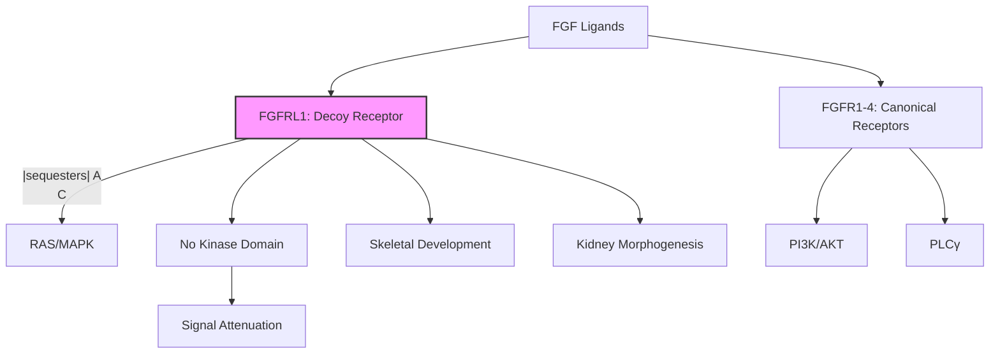

# Pathway Summary for FGFRL1

## Overview
FGFRL1 (Fibroblast Growth Factor Receptor-Like 1) is an atypical FGF receptor that lacks the intracellular tyrosine kinase domain. It functions as a decoy receptor that sequesters FGF ligands, modulating FGF signaling pathways. FGFRL1 plays critical roles in skeletal development, kidney morphogenesis, and cardiovascular development.

## Core Pathways

### FGF Signaling Modulation
FGFRL1 regulates FGF signaling through:
- Ligand sequestration (FGF2, FGF8)
- Competition with canonical FGF receptors
- Formation of non-signaling complexes
- Negative regulation of FGF pathways

### Skeletal Development
FGFRL1 controls bone and cartilage formation via:
- Chondrocyte differentiation regulation
- Osteoblast maturation
- Growth plate organization
- Skeletal patterning

## Pathway Diagram

## Clinical Significance
- **Skeletal dysplasias**: FGFRL1 mutations cause bone defects
- **Kidney malformations**: Essential for nephron development
- **Congenital diaphragmatic hernia**: Associated with deletions
