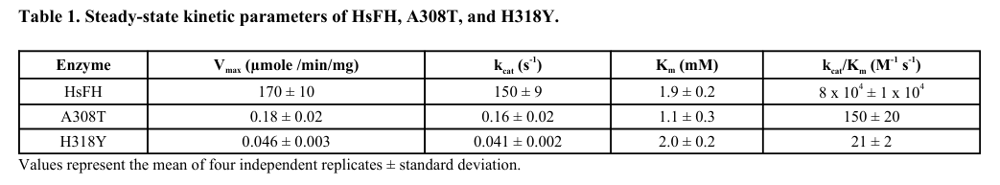

## Question

# Gene Research for Functional Annotation

## ⚠️ CRITICAL: Gene/Protein Identification Context

**BEFORE YOU BEGIN RESEARCH:** You MUST verify you are researching the CORRECT gene/protein. Gene symbols can be ambiguous, especially for less well-characterized genes from non-model organisms.

### Target Gene/Protein Identity (from UniProt):
- **UniProt Accession:** P07954
- **Protein Description:** RecName: Full=Fumarate hydratase, mitochondrial {ECO:0000303|PubMed:21445611, ECO:0000303|PubMed:27037871}; Short=Fumarase {ECO:0000303|PubMed:27037871, ECO:0000303|PubMed:3828494, ECO:0000303|Ref.2}; Short=HsFH {ECO:0000303|PubMed:24419633}; EC=4.2.1.2 {ECO:0000269|PubMed:30761759}; Flags: Precursor;
- **Gene Information:** Name=FH {ECO:0000303|PubMed:27037871, ECO:0000312|HGNC:HGNC:3700};
- **Organism (full):** Homo sapiens (Human).
- **Protein Family:** Belongs to the class-II fumarase/aspartase family. Fumarase
- **Key Domains:** Fum_hydII. (IPR005677); Fumarase/histidase_N. (IPR024083); Fumarase_C_C. (IPR018951); Fumarate_lyase_CS. (IPR020557); Fumarate_lyase_fam. (IPR000362)

### MANDATORY VERIFICATION STEPS:

1. **Check if the gene symbol "FH" matches the protein description above**
2. **Verify the organism is correct:** Homo sapiens (Human).
3. **Check if protein family/domains align with what you find in literature**
4. **If you find literature for a DIFFERENT gene with the same or similar symbol, STOP**

### If Gene Symbol is Ambiguous or You Cannot Find Relevant Literature:

**DO NOT PROCEED WITH RESEARCH ON A DIFFERENT GENE.** Instead:
- State clearly: "The gene symbol 'FH' is ambiguous or literature is limited for this specific protein"
- Explain what you found (e.g., "Found extensive literature on a different gene with the same symbol in a different organism")
- Describe the protein based ONLY on the UniProt information provided above
- Suggest that the protein function can be inferred from domain/family information

### Research Target:

Please provide a comprehensive research report on the gene **FH** (gene ID: FH, UniProt: P07954) in human.

The research report should be a detailed narrative explaining the function, biological processes, and localization of the gene product. Citations should be given for all claims.

You should prioritize authoritative reviews and primary scientific literature when conducting research. You can supplement
this with annotations you find in gene/protein databases, but these can be outdated or inaccurate.

We are specifically interested in the primary function of the gene - for enzymes, what reaction is catalyzed, and what is the substrate specificity? For transporters, what is the substrate? For structural proteins or adapters, what is the broader structural role? For signaling molecules, what is the role in the pathway.

We are interested in where in or outside the cell the gene product carries out its function.

We are also interested in the signaling or biochemical pathways in which the gene functions. We are less interested in broad pleiotropic effects, except where these elucidate the precise role.

Include evidence where possible. We are interested in both experimental evidence as well as inference from structure, evolution, or bioinformatic analysis. Precise studies should be prioritized over high-throughput, where available.

## Output

Question: You are an expert researcher providing comprehensive, well-cited information.

Provide detailed information focusing on:
1. Key concepts and definitions with current understanding
2. Recent developments and latest research (prioritize 2023-2024 sources)
3. Current applications and real-world implementations
4. Expert opinions and analysis from authoritative sources
5. Relevant statistics and data from recent studies

Format as a comprehensive research report with proper citations. Include URLs and publication dates where available.
Always prioritize recent, authoritative sources and provide specific citations for all major claims.

# Gene Research for Functional Annotation

## ⚠️ CRITICAL: Gene/Protein Identification Context

**BEFORE YOU BEGIN RESEARCH:** You MUST verify you are researching the CORRECT gene/protein. Gene symbols can be ambiguous, especially for less well-characterized genes from non-model organisms.

### Target Gene/Protein Identity (from UniProt):
- **UniProt Accession:** P07954
- **Protein Description:** RecName: Full=Fumarate hydratase, mitochondrial {ECO:0000303|PubMed:21445611, ECO:0000303|PubMed:27037871}; Short=Fumarase {ECO:0000303|PubMed:27037871, ECO:0000303|PubMed:3828494, ECO:0000303|Ref.2}; Short=HsFH {ECO:0000303|PubMed:24419633}; EC=4.2.1.2 {ECO:0000269|PubMed:30761759}; Flags: Precursor;
- **Gene Information:** Name=FH {ECO:0000303|PubMed:27037871, ECO:0000312|HGNC:HGNC:3700};
- **Organism (full):** Homo sapiens (Human).
- **Protein Family:** Belongs to the class-II fumarase/aspartase family. Fumarase
- **Key Domains:** Fum_hydII. (IPR005677); Fumarase/histidase_N. (IPR024083); Fumarase_C_C. (IPR018951); Fumarate_lyase_CS. (IPR020557); Fumarate_lyase_fam. (IPR000362)

### MANDATORY VERIFICATION STEPS:

1. **Check if the gene symbol "FH" matches the protein description above**
2. **Verify the organism is correct:** Homo sapiens (Human).
3. **Check if protein family/domains align with what you find in literature**
4. **If you find literature for a DIFFERENT gene with the same or similar symbol, STOP**

### If Gene Symbol is Ambiguous or You Cannot Find Relevant Literature:

**DO NOT PROCEED WITH RESEARCH ON A DIFFERENT GENE.** Instead:
- State clearly: "The gene symbol 'FH' is ambiguous or literature is limited for this specific protein"
- Explain what you found (e.g., "Found extensive literature on a different gene with the same symbol in a different organism")
- Describe the protein based ONLY on the UniProt information provided above
- Suggest that the protein function can be inferred from domain/family information

### Research Target:

Please provide a comprehensive research report on the gene **FH** (gene ID: FH, UniProt: P07954) in human.

The research report should be a detailed narrative explaining the function, biological processes, and localization of the gene product. Citations should be given for all claims.

You should prioritize authoritative reviews and primary scientific literature when conducting research. You can supplement
this with annotations you find in gene/protein databases, but these can be outdated or inaccurate.

We are specifically interested in the primary function of the gene - for enzymes, what reaction is catalyzed, and what is the substrate specificity? For transporters, what is the substrate? For structural proteins or adapters, what is the broader structural role? For signaling molecules, what is the role in the pathway.

We are interested in where in or outside the cell the gene product carries out its function.

We are also interested in the signaling or biochemical pathways in which the gene functions. We are less interested in broad pleiotropic effects, except where these elucidate the precise role.

Include evidence where possible. We are interested in both experimental evidence as well as inference from structure, evolution, or bioinformatic analysis. Precise studies should be prioritized over high-throughput, where available.

# Human FH (UniProt P07954): functional annotation and research report

## Identity and central conclusion

**Identity verified.** The target is *Homo sapiens* **FH**, encoding fumarate hydratase (fumarase; EC 4.2.1.2), not another gene using a similar abbreviation. A biochemical study explicitly identifies the human protein as **UniProt P07954**. Its experimentally observed tetrameric architecture and fumarase reaction agree with the supplied UniProt designation as a **class-II fumarase/aspartase-family** protein and its Fum_hydII and fumarase-associated domains. The primary molecular function is reversible, stereospecific interconversion of **fumarate and L-malate**; other cellular effects arise principally from where this reaction occurs and from fumarate accumulation when FH activity is lost. (bulku2018biochemicalcharacterizationof pages 1-3, bulku2018biochemicalcharacterizationof pages 3-5, valcarceljimenez2023fumaratehydratase(fh) pages 1-2)

## Catalysis, substrate specificity and structure

FH catalyzes **fumarate + H₂O ⇌ L-malate** (L-malate is *(S)*-malate). The forward hydration reaction is the mitochondrial tricarboxylic-acid (TCA) cycle step following succinate oxidation; the reverse, L-malate-to-fumarate reaction can supply fumarate locally in other compartments. Both directions have been assayed with recombinant human FH. Fumarate and L-malate are therefore the **experimentally supported physiological substrate/product pair**; reports that evolutionarily distinct class-I fumarases act on other unsaturated acids should not be assigned to human P07954 without direct testing. (bulku2018biochemicalcharacterizationof pages 1-3, wilde2023fhvariantpathogenicity pages 3-4, jiang2015localgenerationof pages 1-5)

In a purified-human-protein L-malate-dehydration assay, **Kₘ(L-malate) = 1.9 ± 0.2 mM**, **kcat = 150 ± 9 s⁻¹** and **kcat/Kₘ ≈ 8 × 10⁴ M⁻¹ s⁻¹**. These are assay-specific *in-vitro* parameters, not measurements of mitochondrial flux or a fumarate Kₘ. Human FH forms an approximately **215-kDa homotetramer** with four active sites, each incorporating residues from **three subunits**. Disease-associated A308T and H318Y substitutions predominantly formed dimers and reduced turnover more than 900-fold while leaving L-malate Kₘ relatively similar: direct evidence that quaternary structure supports catalysis, although a normal-looking multimer does not guarantee that every variant is active. [Bulku *et al.*, January 2018](https://doi.org/10.2174/1874091X01812010001). (bulku2018biochemicalcharacterizationof pages 3-5, bulku2018biochemicalcharacterizationof pages 7-10, bulku2018biochemicalcharacterizationof pages 10-12, bulku2018biochemicalcharacterizationof media fcd67629, wilde2023fhvariantpathogenicity pages 11-12)

## Where FH acts and in which pathways

The following compartmental distinction is essential: **FH is not exclusively mitochondrial**, despite the mitochondrial description of its precursor. Its best-established sites of action are the **mitochondrial matrix**, **cytosol** and, during a DNA-damage response, **nuclear chromatin**. Human-cell fractionation, transcript mapping and N-terminal analyses support mitochondrial and cytosolic populations produced through **alternative transcription initiation**: transcripts permit production of either an N-terminally targeted mitochondrial precursor or a cytosolic product lacking the targeting sequence. This is more precise than assuming that all human cytosolic FH comes from reverse export of one mitochondrial precursor. [Dik *et al.*, May 2016](https://doi.org/10.1111/tra.12397). (dik2016humanfumaratehydratase pages 1-2, dik2016humanfumaratehydratase pages 2-4, dik2016humanfumaratehydratase pages 4-6, dik2016humanfumaratehydratase pages 6-7)

The table distinguishes the chemical reaction from its compartment-specific physiological consequences.

| Location | Direct enzymatic role and partners/pathway | Experimental evidence and scope |
|---|---|---|
| **Mitochondrial matrix** | Class-II fumarase step of the TCA cycle: **fumarate + H₂O ⇌ L-malate**. The catalytically active human enzyme is a homotetramer. | Direct human evidence: P07954/HsFH catalyzes the reversible reaction. With purified recombinant human FH assayed in the **L-malate → fumarate** direction, *K*ₘ(L-malate) = **1.9 ± 0.2 mM** and *k*cat = **150 ± 9 s⁻¹**. These are **in-vitro recombinant-enzyme parameters, not in-vivo flux measurements**. Human cell studies place the targeted form in the mitochondrial matrix. [Bulku et al., 2018](https://doi.org/10.2174/1874091X01812010001); [Dik et al., 2016](https://doi.org/10.1111/tra.12397) (bulku2018biochemicalcharacterizationof pages 1-3, bulku2018biochemicalcharacterizationof pages 7-10, dik2016humanfumaratehydratase pages 1-2) |
| **Cytosol** | Removes fumarate generated outside mitochondria, including fumarate released by **argininosuccinate lyase (ASL)** in normal urea-cycle/arginine metabolism and by purine-nucleotide synthesis. **FH does not catalyze argininosuccinate production**; under FH-deficient, high-fumarate conditions, reversed ASL—not FH—can combine fumarate with arginine. | Mixed model and human-cell evidence: mitochondria-excluded FH corrected fumarate and urea-cycle metabolite abnormalities and suppressed renal cysts in **Fh1-deficient mice**. Complementation of the **human FH-null UOK262** renal-cancer line with cytosolic FH reduced fumarate and argininosuccinate accumulation. Isotope tracing showed that >90% of argininosuccinate in deficient cells was the labeled species consistent with reversed ASL. [Adam et al., 2013](https://doi.org/10.1016/j.celrep.2013.04.006) (adam2013arolefor pages 4-7) |
| **Nucleus, at DNA double-strand breaks** | After ionizing radiation, **DNA-PK phosphorylates FH at Thr236**; FH associates with **H2A.Z** at breaks and locally performs **L-malate → fumarate**. Local fumarate inhibits **KDM2B**, increases **H3K36me2**, promotes Ku70–DNA-PK accumulation and supports **non-homologous end joining (NHEJ)**. | Direct mechanistic evidence in **cultured human U2OS and GSC11 cells**, using fractionation, phosphosite mutants, kinase inhibition and chromatin assays. This establishes a localized DNA-repair function in human cells but does not imply that globally accumulated fumarate is genome-protective; chronic FH loss can impair other repair processes. [Jiang et al., 2015](https://doi.org/10.1038/ncb3209) (jiang2015localgenerationof pages 1-5) |

*Table: Human FH performs the same reversible fumarase chemistry in distinct compartments but serves different pathways. The table separates direct human evidence from mouse-model results and distinguishes in-vitro kinetics from physiological flux.*

In the **matrix**, hydration of fumarate supplies L-malate for downstream malate dehydrogenase and continuity of TCA-cycle carbon metabolism. In the **cytosol**, FH helps dispose of fumarate originating outside the matrix, notably from the argininosuccinate-lyase step of arginine/urea-cycle metabolism and from purine biosynthesis. Crucially, **argininosuccinate lyase—not FH—makes argininosuccinate** when excess fumarate drives its reaction backward. In Fh1-deficient mouse kidneys and human FH-null UOK262 cancer cells, mitochondrial exclusion of a re-expressed FH construct still reduced fumarate and argininosuccinate accumulation; in mice it also suppressed renal cyst formation despite persistent mitochondrial metabolic defects. In isotope experiments, **more than 90%** of argininosuccinate in deficient cells had the labeling pattern expected from arginine plus fumarate. These experiments establish a consequential *extramitochondrial* catalytic role while distinguishing mouse-organism rescue from human-cell evidence. [Adam *et al.*, May 2013](https://doi.org/10.1016/j.celrep.2013.04.006). (adam2013arolefor pages 1-2, adam2013arolefor pages 2-4, adam2013arolefor pages 4-7)

In **human cultured cells exposed to ionizing radiation**, DNA-PK phosphorylates nuclear FH at **Thr236**. FH then interacts with histone variant **H2A.Z** near DNA double-strand breaks and generates **local fumarate from malate**. Fumarate inhibits the α-ketoglutarate-dependent demethylase **KDM2B**, increasing local **H3K36 dimethylation** and Ku70–DNA-PK accumulation, thereby promoting **non-homologous end joining**. This localized, repair-supporting fumarate production is mechanistically different from sustained, cell-wide fumarate accumulation following FH loss, which can compromise other repair routes. [Jiang *et al.*, August 2015](https://doi.org/10.1038/ncb3209). (jiang2015localgenerationof pages 1-5, coffey2024metabolicalterationsin pages 8-9)

## Functional consequences of FH loss: mechanisms rather than alternative primary functions

FH functions as a **tumor suppressor in the hereditary leiomyomatosis and renal cell cancer syndrome (HLRCC)**. Heterozygous pathogenic germline variants confer predisposition; affected tumors commonly acquire loss of the remaining functional allele. The resulting impaired fumarate-to-malate conversion both interrupts TCA metabolism and allows fumarate to accumulate as an **oncometabolite**. HLRCC encompasses cutaneous and uterine leiomyomas and risk of often aggressive FH-deficient renal carcinoma, although neither every FH-deficient leiomyoma nor every FH-deficient renal tumor is hereditary. By contrast, **biallelic constitutional FH deficiency** causes a rare, severe fumarase-deficiency metabolic/neurological disorder. [Valcarcel-Jimenez and Frezza, September 2023](https://doi.org/10.1038/s41416-023-02412-w); [Peetsold *et al.*, October 2021](https://doi.org/10.1177/0883073820962931). (valcarceljimenez2023fumaratehydratase(fh) pages 1-2, cheng2024ferroptosisapromising pages 4-6, popp2020targetedsequencingof pages 1-2)

The principal experimentally grounded downstream mechanisms are **cysteine succination**—covalent formation of S-(2-succinyl)cysteine, abbreviated **2SC**—and inhibition of **α-ketoglutarate-dependent dioxygenases**. For example, modification of KEAP1 can weaken repression of the NRF2 antioxidant-response pathway; inhibition of TET DNA demethylases and JmjC histone demethylases can change DNA/histone methylation and gene expression. FH-deficient cancers can show CpG-island hypermethylation, epithelial-to-mesenchymal-transition-associated changes and diminished homologous-recombination repair, including a proposed KDM4A/KDM4B-linked defect. Fumarate-mediated inhibition of HIF prolyl hydroxylases provides a *plausible* pseudohypoxia mechanism, but HIF signaling should not be presented as the sole established cause of FH-associated renal lesions: the mechanisms are tissue- and stage-dependent, and FH loss alone produced premalignant cysts rather than frank cancers in a kidney model. [Ooi *et al.*, October 2011](https://doi.org/10.1016/j.ccr.2011.08.024); [Valcarcel-Jimenez and Frezza, September 2023](https://doi.org/10.1038/s41416-023-02412-w); [Coffey and Simon, January 2024](https://doi.org/10.1038/s41581-023-00800-2). (valcarceljimenez2023fumaratehydratase(fh) pages 3-4, coffey2024metabolicalterationsin pages 8-9, valcarceljimenez2023fumaratehydratase(fh) pages 5-6, valcarceljimenez2023fumaratehydratase(fh) pages 4-5, ooi2011anantioxidantresponse pages 1-2, valcarceljimenez2023fumaratehydratase(fh) pages 7-8, clerici2020roleofthe pages 12-14, linehan2013molecularpathwaysfumarate pages 2-3)

## Developments in 2023–2024

**Functional interpretation of human variants (2023).** Wilde *et al.* assayed fumarase activity in **74 human FH missense variants** having uncertain or conflicting clinical classifications; **more than half were enzymatically inactive**. They measured the reaction in both directions and found that multimerization alone was not a reliable substitute for direct activity measurement. In FH-deficient kidney-cancer models, fumarate accumulation impeded **de-novo purine synthesis**, creating reliance on **purine salvage**; genetic disruption of salvage enzymes or treatment with **6-mercaptopurine** reduced xenograft growth. This is compelling variant-function and **preclinical therapeutic** evidence, **not** proof that an individual variant has a particular clinical penetrance or that 6-mercaptopurine is an established FH-deficient RCC treatment. [Wilde *et al.*, May 2023](https://doi.org/10.1158/2159-8290.CD-22-0874). (wilde2023fhvariantpathogenicity pages 3-4, wilde2023fhvariantpathogenicity pages 9-11, wilde2023fhvariantpathogenicity pages 1-3, wilde2023fhvariantpathogenicity pages 11-12)

**A second, context-specific signaling consequence (2023).** Following inducible **Fh1 deletion in adult mouse kidney**, fumarate promoted mitochondrial remodeling and **SNX9-dependent mitochondrial-derived vesicles** that released mitochondrial DNA into the cytosol. This engaged **cGAS–STING–TBK1** and partially **RIG-I-dependent** innate inflammatory signaling. The study supplies a causal experimental model of the effects of *losing* FH; it does **not** establish that FH is a secreted signaling protein or that the entire sequence occurs identically in every human carrier. [Zecchini *et al.*, 2023](https://doi.org/10.17863/cam.95053). (zecchini2023fumarateinducesvesicular pages 1-2)

**Interpretive refinements (2024).** An authoritative kidney-cancer review frames fumarate-associated methylation and homologous-recombination defects as possible therapeutic vulnerabilities, while explicitly treating PARP inhibition in FH-deficient RCC as **investigational**, not an established indication. A chemical-biology perspective likewise cautions that the pharmacology of **dimethyl fumarate and other fumarate esters** cannot simply stand in for the concentration, compartmentation or protein targets of endogenous fumarate accumulated after FH loss. [Coffey and Simon, January 2024](https://doi.org/10.1038/s41581-023-00800-2); [Huang and Aye, September 2024](https://doi.org/10.1038/s42004-024-01282-4). (coffey2024metabolicalterationsin pages 8-9, huang2024towarddecodingspatiotemporal pages 1-4)

## Real-world interpretation, diagnosis and translation

Pathology can use **loss of FH protein staining**, **increased 2SC staining** as a readout of fumarate-driven succination, and **FH sequencing** to investigate a suspected FH-deficient lesion. A 2024 uterine-leiomyoma case combined absent FH staining, positive 2SC staining and identified FH alterations. These tests are complementary: protein retention or a negative stain alone should not be treated as a complete measurement of catalytic competence, and a tumor FH alteration does not by itself establish constitutional HLRCC. In a sequencing series of **13 FH-deficient uterine leiomyomas, all 13 had biallelic FH alterations**; the investigators estimated that FH-deficient tumors represented up to **1.6%** of leiomyomas and that **2.7–13.9%** of women with one might carry a germline FH variant. The latter is a study-derived estimate, **not** a universal patient-specific probability. [Wei *et al.*, December 2024](https://doi.org/10.2147/IJWH.S444069); [Popp *et al.*, June 2020](https://doi.org/10.1038/s41379-020-0596-y). (wilde2023fhvariantpathogenicity pages 11-12, popp2020targetedsequencingof pages 1-2, wei2024fumaratehydratase–deficientleiomyoma pages 1-2)

Therapeutic translation currently targets **consequences of FH loss**, rather than replacing a clinically established FH drug target. Illustrative registered studies are phase-II **talazoparib plus avelumab** in genomically selected metastatic RCC, including—but not restricted to—FH/SDH-deficient tumors ([NCT04068831](https://clinicaltrials.gov/study/NCT04068831); registry records completion and results posted in December 2024), and phase-II **bevacizumab, erlotinib plus atezolizumab** for advanced HLRCC-associated or sporadic papillary RCC ([NCT04981509](https://clinicaltrials.gov/study/NCT04981509); registry records recruiting). Registry enrollment and posting are not evidence of FH-specific clinical efficacy, and the latter trial does **not** require that all participants have FH-deficient tumors. (coffey2024metabolicalterationsin pages 8-9, NCT04068831 chunk 1, NCT04981509 chunk 1, peled2024knowledgebasedtherapeuticsfor pages 7-8)

**Annotation confidence and remaining limits.** The **fumarate/L-malate reaction, human tetrameric catalysis, mitochondrial and cytosolic localization** are supported directly by targeted human experiments; the **chromatin repair mechanism** is supported in human cultured cells. Specific causal claims about renal tumor initiation, immune signaling and treatment response require separation of human tumor evidence from genetically engineered mouse and xenograft studies. The retrieved human biochemical studies establish L-malate and fumarate as the principal pair but do **not** justify annotating unrelated substrates solely because other fumarase classes accept them. (bulku2018biochemicalcharacterizationof pages 1-3, dik2016humanfumaratehydratase pages 1-2, jiang2015localgenerationof pages 1-5, wilde2023fhvariantpathogenicity pages 3-4, zecchini2023fumarateinducesvesicular pages 1-2, valcarceljimenez2023fumaratehydratase(fh) pages 7-8)

References

1. (bulku2018biochemicalcharacterizationof pages 1-3): Artemisa Bulku, Todd M. Weaver, and Melanie B. Berkmen. Biochemical characterization of two clinically-relevant human fumarase variants defective for oligomerization. The Open Biochemistry Journal, 12:1-15, Jan 2018. URL: https://doi.org/10.2174/1874091x01812010001, doi:10.2174/1874091x01812010001. This article has 22 citations.

2. (bulku2018biochemicalcharacterizationof pages 3-5): Artemisa Bulku, Todd M. Weaver, and Melanie B. Berkmen. Biochemical characterization of two clinically-relevant human fumarase variants defective for oligomerization. The Open Biochemistry Journal, 12:1-15, Jan 2018. URL: https://doi.org/10.2174/1874091x01812010001, doi:10.2174/1874091x01812010001. This article has 22 citations.

3. (valcarceljimenez2023fumaratehydratase(fh) pages 1-2): Lorea Valcarcel-Jimenez and Christian Frezza. Fumarate hydratase (fh) and cancer: a paradigm of oncometabolism. British Journal of Cancer, 129:1546-1557, Sep 2023. URL: https://doi.org/10.1038/s41416-023-02412-w, doi:10.1038/s41416-023-02412-w. This article has 134 citations and is from a domain leading peer-reviewed journal.

4. (wilde2023fhvariantpathogenicity pages 3-4): Blake R. Wilde, Nishma Chakraborty, Nedas Matulionis, Stephanie Hernandez, Daiki Ueno, Michayla E. Gee, Edward D. Esplin, Karen Ouyang, Keith Nykamp, Brian Shuch, and Heather R. Christofk. Fh variant pathogenicity promotes purine salvage pathway dependence in kidney cancer. Cancer Discovery, 13:2072-2089, May 2023. URL: https://doi.org/10.1158/2159-8290.cd-22-0874, doi:10.1158/2159-8290.cd-22-0874. This article has 51 citations and is from a highest quality peer-reviewed journal.

5. (jiang2015localgenerationof pages 1-5): Yuhui Jiang, Xu Qian, Jianfeng Shen, Yugang Wang, Xinjian Li, Rui Liu, Yan Xia, Qianming Chen, Guang Peng, Shiaw-Yih Lin, and Zhimin Lu. Local generation of fumarate promotes dna repair through inhibition of histone h3 demethylation. Nature cell biology, 17:1158-1168, Aug 2015. URL: https://doi.org/10.1038/ncb3209, doi:10.1038/ncb3209. This article has 236 citations and is from a highest quality peer-reviewed journal.

6. (bulku2018biochemicalcharacterizationof pages 7-10): Artemisa Bulku, Todd M. Weaver, and Melanie B. Berkmen. Biochemical characterization of two clinically-relevant human fumarase variants defective for oligomerization. The Open Biochemistry Journal, 12:1-15, Jan 2018. URL: https://doi.org/10.2174/1874091x01812010001, doi:10.2174/1874091x01812010001. This article has 22 citations.

7. (bulku2018biochemicalcharacterizationof pages 10-12): Artemisa Bulku, Todd M. Weaver, and Melanie B. Berkmen. Biochemical characterization of two clinically-relevant human fumarase variants defective for oligomerization. The Open Biochemistry Journal, 12:1-15, Jan 2018. URL: https://doi.org/10.2174/1874091x01812010001, doi:10.2174/1874091x01812010001. This article has 22 citations.

8. (bulku2018biochemicalcharacterizationof media fcd67629): Artemisa Bulku, Todd M. Weaver, and Melanie B. Berkmen. Biochemical characterization of two clinically-relevant human fumarase variants defective for oligomerization. The Open Biochemistry Journal, 12:1-15, Jan 2018. URL: https://doi.org/10.2174/1874091x01812010001, doi:10.2174/1874091x01812010001. This article has 22 citations.

9. (wilde2023fhvariantpathogenicity pages 11-12): Blake R. Wilde, Nishma Chakraborty, Nedas Matulionis, Stephanie Hernandez, Daiki Ueno, Michayla E. Gee, Edward D. Esplin, Karen Ouyang, Keith Nykamp, Brian Shuch, and Heather R. Christofk. Fh variant pathogenicity promotes purine salvage pathway dependence in kidney cancer. Cancer Discovery, 13:2072-2089, May 2023. URL: https://doi.org/10.1158/2159-8290.cd-22-0874, doi:10.1158/2159-8290.cd-22-0874. This article has 51 citations and is from a highest quality peer-reviewed journal.

10. (dik2016humanfumaratehydratase pages 1-2): Ekaterina Dik, Adi Naamati, Hadar Asraf, Norbert Lehming, and Ophry Pines. Human fumarate hydratase is dual localized by an alternative transcription initiation mechanism. Traffic, 17:720-732, May 2016. URL: https://doi.org/10.1111/tra.12397, doi:10.1111/tra.12397. This article has 58 citations and is from a peer-reviewed journal.

11. (dik2016humanfumaratehydratase pages 2-4): Ekaterina Dik, Adi Naamati, Hadar Asraf, Norbert Lehming, and Ophry Pines. Human fumarate hydratase is dual localized by an alternative transcription initiation mechanism. Traffic, 17:720-732, May 2016. URL: https://doi.org/10.1111/tra.12397, doi:10.1111/tra.12397. This article has 58 citations and is from a peer-reviewed journal.

12. (dik2016humanfumaratehydratase pages 4-6): Ekaterina Dik, Adi Naamati, Hadar Asraf, Norbert Lehming, and Ophry Pines. Human fumarate hydratase is dual localized by an alternative transcription initiation mechanism. Traffic, 17:720-732, May 2016. URL: https://doi.org/10.1111/tra.12397, doi:10.1111/tra.12397. This article has 58 citations and is from a peer-reviewed journal.

13. (dik2016humanfumaratehydratase pages 6-7): Ekaterina Dik, Adi Naamati, Hadar Asraf, Norbert Lehming, and Ophry Pines. Human fumarate hydratase is dual localized by an alternative transcription initiation mechanism. Traffic, 17:720-732, May 2016. URL: https://doi.org/10.1111/tra.12397, doi:10.1111/tra.12397. This article has 58 citations and is from a peer-reviewed journal.

14. (adam2013arolefor pages 4-7): Julie Adam, Ming Yang, Christina Bauerschmidt, Mitsuhiro Kitagawa, Linda O’Flaherty, Pratheesh Maheswaran, Gizem Özkan, Natasha Sahgal, Dilair Baban, Keiko Kato, Kaori Saito, Keiko Iino, Kaori Igarashi, Michael Stratford, Christopher Pugh, Daniel A. Tennant, Christian Ludwig, Benjamin Davies, Peter J. Ratcliffe, Mona El-Bahrawy, Houman Ashrafian, Tomoyoshi Soga, and Patrick J. Pollard. A role for cytosolic fumarate hydratase in urea cycle metabolism and renal neoplasia. Cell Reports, 3:1440-1448, May 2013. URL: https://doi.org/10.1016/j.celrep.2013.04.006, doi:10.1016/j.celrep.2013.04.006. This article has 120 citations and is from a highest quality peer-reviewed journal.

15. (adam2013arolefor pages 1-2): Julie Adam, Ming Yang, Christina Bauerschmidt, Mitsuhiro Kitagawa, Linda O’Flaherty, Pratheesh Maheswaran, Gizem Özkan, Natasha Sahgal, Dilair Baban, Keiko Kato, Kaori Saito, Keiko Iino, Kaori Igarashi, Michael Stratford, Christopher Pugh, Daniel A. Tennant, Christian Ludwig, Benjamin Davies, Peter J. Ratcliffe, Mona El-Bahrawy, Houman Ashrafian, Tomoyoshi Soga, and Patrick J. Pollard. A role for cytosolic fumarate hydratase in urea cycle metabolism and renal neoplasia. Cell Reports, 3:1440-1448, May 2013. URL: https://doi.org/10.1016/j.celrep.2013.04.006, doi:10.1016/j.celrep.2013.04.006. This article has 120 citations and is from a highest quality peer-reviewed journal.

16. (adam2013arolefor pages 2-4): Julie Adam, Ming Yang, Christina Bauerschmidt, Mitsuhiro Kitagawa, Linda O’Flaherty, Pratheesh Maheswaran, Gizem Özkan, Natasha Sahgal, Dilair Baban, Keiko Kato, Kaori Saito, Keiko Iino, Kaori Igarashi, Michael Stratford, Christopher Pugh, Daniel A. Tennant, Christian Ludwig, Benjamin Davies, Peter J. Ratcliffe, Mona El-Bahrawy, Houman Ashrafian, Tomoyoshi Soga, and Patrick J. Pollard. A role for cytosolic fumarate hydratase in urea cycle metabolism and renal neoplasia. Cell Reports, 3:1440-1448, May 2013. URL: https://doi.org/10.1016/j.celrep.2013.04.006, doi:10.1016/j.celrep.2013.04.006. This article has 120 citations and is from a highest quality peer-reviewed journal.

17. (coffey2024metabolicalterationsin pages 8-9): Nathan J. Coffey and M. Celeste Simon. Metabolic alterations in hereditary and sporadic renal cell carcinoma. Nature reviews. Nephrology, 20:233-250, Jan 2024. URL: https://doi.org/10.1038/s41581-023-00800-2, doi:10.1038/s41581-023-00800-2. This article has 61 citations.

18. (cheng2024ferroptosisapromising pages 4-6): Ping Cheng, Ruohan Xia, and Xianwang Wang. Ferroptosis: a promising target for fumarate hydratase-deficient tumor therapeutics literature review. Translational Cancer Research, 13:3126-3141, Jun 2024. URL: https://doi.org/10.21037/tcr-24-21, doi:10.21037/tcr-24-21. This article has 5 citations.

19. (popp2020targetedsequencingof pages 1-2): Bernt Popp, Ramona Erber, Cornelia Kraus, Georgia Vasileiou, Juliane Hoyer, Stefanie Burghaus, Arndt Hartmann, Matthias W. Beckmann, André Reis, and Abbas Agaimy. Targeted sequencing of fh-deficient uterine leiomyomas reveals biallelic inactivating somatic fumarase variants and allows characterization of missense variants. Modern Pathology, 33:2341-2353, Jun 2020. URL: https://doi.org/10.1038/s41379-020-0596-y, doi:10.1038/s41379-020-0596-y. This article has 47 citations and is from a domain leading peer-reviewed journal.

20. (valcarceljimenez2023fumaratehydratase(fh) pages 3-4): Lorea Valcarcel-Jimenez and Christian Frezza. Fumarate hydratase (fh) and cancer: a paradigm of oncometabolism. British Journal of Cancer, 129:1546-1557, Sep 2023. URL: https://doi.org/10.1038/s41416-023-02412-w, doi:10.1038/s41416-023-02412-w. This article has 134 citations and is from a domain leading peer-reviewed journal.

21. (valcarceljimenez2023fumaratehydratase(fh) pages 5-6): Lorea Valcarcel-Jimenez and Christian Frezza. Fumarate hydratase (fh) and cancer: a paradigm of oncometabolism. British Journal of Cancer, 129:1546-1557, Sep 2023. URL: https://doi.org/10.1038/s41416-023-02412-w, doi:10.1038/s41416-023-02412-w. This article has 134 citations and is from a domain leading peer-reviewed journal.

22. (valcarceljimenez2023fumaratehydratase(fh) pages 4-5): Lorea Valcarcel-Jimenez and Christian Frezza. Fumarate hydratase (fh) and cancer: a paradigm of oncometabolism. British Journal of Cancer, 129:1546-1557, Sep 2023. URL: https://doi.org/10.1038/s41416-023-02412-w, doi:10.1038/s41416-023-02412-w. This article has 134 citations and is from a domain leading peer-reviewed journal.

23. (ooi2011anantioxidantresponse pages 1-2): Aikseng Ooi, Jing-Chii Wong, David Petillo, Douglas Roossien, Victoria Perrier-Trudova, Douglas Whitten, Bernice Wong Hui Min, Min-Han Tan, Zhongfa Zhang, Ximing J. Yang, Ming Zhou, Betty Gardie, Vincent Molinié, Stéphane Richard, Puay Hoon Tan, Bin Tean Teh, and Kyle A. Furge. An antioxidant response phenotype shared between hereditary and sporadic type 2 papillary renal cell carcinoma. Cancer cell, 20 4:511-23, Oct 2011. URL: https://doi.org/10.1016/j.ccr.2011.08.024, doi:10.1016/j.ccr.2011.08.024. This article has 467 citations and is from a highest quality peer-reviewed journal.

24. (valcarceljimenez2023fumaratehydratase(fh) pages 7-8): Lorea Valcarcel-Jimenez and Christian Frezza. Fumarate hydratase (fh) and cancer: a paradigm of oncometabolism. British Journal of Cancer, 129:1546-1557, Sep 2023. URL: https://doi.org/10.1038/s41416-023-02412-w, doi:10.1038/s41416-023-02412-w. This article has 134 citations and is from a domain leading peer-reviewed journal.

25. (clerici2020roleofthe pages 12-14): Sara Clerici and Alessandra Boletta. Role of the keap1-nrf2 axis in renal cell carcinoma. Cancers, 12:3458, Nov 2020. URL: https://doi.org/10.3390/cancers12113458, doi:10.3390/cancers12113458. This article has 39 citations.

26. (linehan2013molecularpathwaysfumarate pages 2-3): W. Marston Linehan and Tracey A. Rouault. Molecular pathways: <i>fumarate hydratase</i>-deficient kidney cancer—targeting the warburg effect in cancer. Clinical Cancer Research, 19:3345-3352, Jun 2013. URL: https://doi.org/10.1158/1078-0432.ccr-13-0304, doi:10.1158/1078-0432.ccr-13-0304. This article has 270 citations and is from a highest quality peer-reviewed journal.

27. (wilde2023fhvariantpathogenicity pages 9-11): Blake R. Wilde, Nishma Chakraborty, Nedas Matulionis, Stephanie Hernandez, Daiki Ueno, Michayla E. Gee, Edward D. Esplin, Karen Ouyang, Keith Nykamp, Brian Shuch, and Heather R. Christofk. Fh variant pathogenicity promotes purine salvage pathway dependence in kidney cancer. Cancer Discovery, 13:2072-2089, May 2023. URL: https://doi.org/10.1158/2159-8290.cd-22-0874, doi:10.1158/2159-8290.cd-22-0874. This article has 51 citations and is from a highest quality peer-reviewed journal.

28. (wilde2023fhvariantpathogenicity pages 1-3): Blake R. Wilde, Nishma Chakraborty, Nedas Matulionis, Stephanie Hernandez, Daiki Ueno, Michayla E. Gee, Edward D. Esplin, Karen Ouyang, Keith Nykamp, Brian Shuch, and Heather R. Christofk. Fh variant pathogenicity promotes purine salvage pathway dependence in kidney cancer. Cancer Discovery, 13:2072-2089, May 2023. URL: https://doi.org/10.1158/2159-8290.cd-22-0874, doi:10.1158/2159-8290.cd-22-0874. This article has 51 citations and is from a highest quality peer-reviewed journal.

29. (zecchini2023fumarateinducesvesicular pages 1-2): Vincent Zecchini, Vincent Paupe, Irene Herranz-Montoya, Joëlle Janssen, Inge MN Wortel, Jordan L Morris, Ashley Ferguson, Suvagata Roy Chowdury, Marc Segarra-Mondejar, Ana SH Costa, Gonçalo C Pereira, Laura Tronci, Timothy Young, Efterpi Nikitopoulou, Ming Yang, Dóra Bihary, Federico Caicci, Shun Nagashima, Alyson Speed, Kalliopi Bokea, Zara Baig, Shamith Samarajiwa, Maxine Tran, Thomas Mitchell, Mark Johnson, Julien Prudent, and Christian Frezza. Fumarate induces vesicular release of mtdna to drive innate immunity. Text, Mar 2023. URL: https://doi.org/10.17863/cam.95053, doi:10.17863/cam.95053. This article has 386 citations and is from a peer-reviewed journal.

30. (huang2024towarddecodingspatiotemporal pages 1-4): Kuan-Ting Huang and Yimon Aye. Toward decoding spatiotemporal signaling activities of reactive immunometabolites with precision immuno-chemical biology tools. Communications Chemistry, Sep 2024. URL: https://doi.org/10.1038/s42004-024-01282-4, doi:10.1038/s42004-024-01282-4. This article has 8 citations and is from a peer-reviewed journal.

31. (wei2024fumaratehydratase–deficientleiomyoma pages 1-2): Gang Wei, Jie Chen, Xing Gong, and Dongdong Zhang. Fumarate hydratase–deficient leiomyoma with double mutation sites in the fh gene: a rare case report and literature review. International Journal of Women's Health, 16:2137-2141, Dec 2024. URL: https://doi.org/10.2147/ijwh.s444069, doi:10.2147/ijwh.s444069. This article has 2 citations and is from a peer-reviewed journal.

32. (NCT04068831 chunk 1):  Talazoparib and Avelumab in Participants With Metastatic Renal Cell Carcinoma. Memorial Sloan Kettering Cancer Center. 2019. ClinicalTrials.gov Identifier: NCT04068831

33. (NCT04981509 chunk 1):  Testing of Bevacizumab, Erlotinib, and Atezolizumab in Combination for Advanced-Stage Kidney Cancer. National Cancer Institute (NCI). 2022. ClinicalTrials.gov Identifier: NCT04981509

34. (peled2024knowledgebasedtherapeuticsfor pages 7-8): Daniel Peled, Ruth Casey, and Eyal Gottlieb. Knowledge-based therapeutics for tricarboxylic acid (tca) cycle-deficient cancers. Cold Spring Harbor perspectives in medicine, pages a041536, Mar 2024. URL: https://doi.org/10.1101/cshperspect.a041536, doi:10.1101/cshperspect.a041536. This article has 8 citations and is from a peer-reviewed journal.

## Artifacts

- [Edison artifact artifact-00](FH-deep-research-falcon_artifacts/artifact-00.md)

## Citations

1. adam2013arolefor pages 4-7
2. jiang2015localgenerationof pages 1-5
3. zecchini2023fumarateinducesvesicular pages 1-2
4. bulku2018biochemicalcharacterizationof pages 1-3
5. bulku2018biochemicalcharacterizationof pages 3-5
6. wilde2023fhvariantpathogenicity pages 3-4
7. bulku2018biochemicalcharacterizationof pages 7-10
8. bulku2018biochemicalcharacterizationof pages 10-12
9. wilde2023fhvariantpathogenicity pages 11-12
10. dik2016humanfumaratehydratase pages 1-2
11. dik2016humanfumaratehydratase pages 2-4
12. dik2016humanfumaratehydratase pages 4-6
13. dik2016humanfumaratehydratase pages 6-7
14. adam2013arolefor pages 1-2
15. adam2013arolefor pages 2-4
16. coffey2024metabolicalterationsin pages 8-9
17. cheng2024ferroptosisapromising pages 4-6
18. popp2020targetedsequencingof pages 1-2
19. ooi2011anantioxidantresponse pages 1-2
20. clerici2020roleofthe pages 12-14
21. linehan2013molecularpathwaysfumarate pages 2-3
22. wilde2023fhvariantpathogenicity pages 9-11
23. wilde2023fhvariantpathogenicity pages 1-3
24. huang2024towarddecodingspatiotemporal pages 1-4
25. peled2024knowledgebasedtherapeuticsfor pages 7-8
26. Bulku *et al.*, January 2018
27. Dik *et al.*, May 2016
28. Bulku et al., 2018
29. Dik et al., 2016
30. Adam et al., 2013
31. Jiang et al., 2015
32. Adam *et al.*, May 2013
33. Jiang *et al.*, August 2015
34. Valcarcel-Jimenez and Frezza, September 2023
35. Peetsold *et al.*, October 2021
36. Ooi *et al.*, October 2011
37. Coffey and Simon, January 2024
38. Wilde *et al.*, May 2023
39. Zecchini *et al.*, 2023
40. Huang and Aye, September 2024
41. Wei *et al.*, December 2024
42. Popp *et al.*, June 2020
43. NCT04068831
44. NCT04981509
45. https://doi.org/10.2174/1874091X01812010001
46. https://doi.org/10.1111/tra.12397
47. https://doi.org/10.1016/j.celrep.2013.04.006
48. https://doi.org/10.1038/ncb3209
49. https://doi.org/10.1038/s41416-023-02412-w
50. https://doi.org/10.1177/0883073820962931
51. https://doi.org/10.1016/j.ccr.2011.08.024
52. https://doi.org/10.1038/s41581-023-00800-2
53. https://doi.org/10.1158/2159-8290.CD-22-0874
54. https://doi.org/10.17863/cam.95053
55. https://doi.org/10.1038/s42004-024-01282-4
56. https://doi.org/10.2147/IJWH.S444069
57. https://doi.org/10.1038/s41379-020-0596-y
58. https://clinicaltrials.gov/study/NCT04068831
59. https://clinicaltrials.gov/study/NCT04981509
60. https://doi.org/10.2174/1874091x01812010001,
61. https://doi.org/10.1038/s41416-023-02412-w,
62. https://doi.org/10.1158/2159-8290.cd-22-0874,
63. https://doi.org/10.1038/ncb3209,
64. https://doi.org/10.1111/tra.12397,
65. https://doi.org/10.1016/j.celrep.2013.04.006,
66. https://doi.org/10.1038/s41581-023-00800-2,
67. https://doi.org/10.21037/tcr-24-21,
68. https://doi.org/10.1038/s41379-020-0596-y,
69. https://doi.org/10.1016/j.ccr.2011.08.024,
70. https://doi.org/10.3390/cancers12113458,
71. https://doi.org/10.1158/1078-0432.ccr-13-0304,
72. https://doi.org/10.17863/cam.95053,
73. https://doi.org/10.1038/s42004-024-01282-4,
74. https://doi.org/10.2147/ijwh.s444069,
75. https://doi.org/10.1101/cshperspect.a041536,