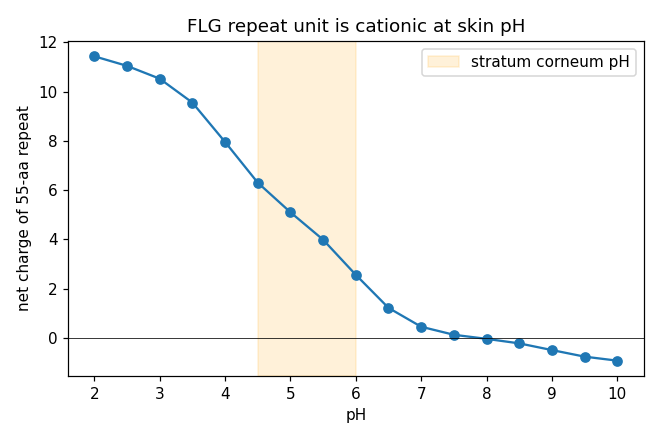

## Question

# AIGR Gene Hypothesis Deep Research

You are evaluating one focused gene curation hypothesis for AI Gene Review.
This is not a general gene overview. Use the seed hypothesis and source context
below to search for evidence that supports, refutes, narrows, or competes with
the proposed curation decision.

## Target Gene

- **Organism code:** human
- **Taxon:** Homo sapiens (NCBITaxon:9606)
- **Gene directory:** FLG
- **Gene symbol:** FLG
- **UniProt accession:** P20930

## Focus

- **Focus type:** function_support
- **Hypothesis slug:** mf-keratin-binding-vs-structural
- **Source file:** 
- **Source selector:** 

## Seed Hypothesis

The molecular function of the mature filaggrin repeat unit of human FLG (UniProt P20930) is keratin intermediate filament binding that drives filament bundling, not structural molecule activity.

## Term and Decision Context

- Term: structural molecule activity (GO:0005198)
- Decide this by one computable analysis: characterise the ~324-aa filaggrin repeat unit (P20930 residues 258-306, 374-428, and the tandem repeats through 3872) for predicted intrinsic disorder, secondary-structure propensity, net charge and His/Arg/Ser composition.
- GO:0005198 structural molecule activity means the protein itself confers shape/rigidity as an architectural component of a structure or complex. Assess whether an intrinsically disordered, highly cationic polypeptide that transiently binds and condenses pre-formed keratin filaments, and is then completely proteolysed to free amino acids in the stratum corneum, meets that definition, or whether it is better described as an intermediate-filament binding activity.
- Note separately that filaggrin is also isodipeptide cross-linked into the cornified envelope, which is a distinct architectural role from the keratin-aggregation role - state whether the evidence separates these.

## Reference Context

No specific reference context supplied.

## Source Context YAML

```yaml
hypothesis: The molecular function of the mature filaggrin repeat unit of human FLG (UniProt P20930) is
  keratin intermediate filament binding that drives filament bundling, not structural molecule activity.
focus_type: function_support
term_id: GO:0005198
term_label: structural molecule activity
context:
- 'Decide this by one computable analysis: characterise the ~324-aa filaggrin repeat unit (P20930 residues
  258-306, 374-428, and the tandem repeats through 3872) for predicted intrinsic disorder, secondary-structure
  propensity, net charge and His/Arg/Ser composition.'
- GO:0005198 structural molecule activity means the protein itself confers shape/rigidity as an architectural
  component of a structure or complex. Assess whether an intrinsically disordered, highly cationic polypeptide
  that transiently binds and condenses pre-formed keratin filaments, and is then completely proteolysed
  to free amino acids in the stratum corneum, meets that definition, or whether it is better described
  as an intermediate-filament binding activity.
- Note separately that filaggrin is also isodipeptide cross-linked into the cornified envelope, which
  is a distinct architectural role from the keratin-aggregation role - state whether the evidence separates
  these.
reference_id: []
```

## Research Objective

Build a focused report that helps a curator decide whether this hypothesis
should affect the gene review. Address the focus type directly:

1. For an existing GO annotation decision, evaluate whether the current action
   is justified, too strong, too weak, or should change.
2. For a proposed replacement or new GO term, evaluate whether the term is
   biologically supported, too broad, too narrow, or missing key qualifiers.
3. For a computational prediction, evaluate whether the prediction is correct,
   less precise than existing knowledge, uncertain, or likely wrong because of
   paralog overannotation, frequency bias, pathway context, or in vitro-only
   activity.
4. For a core-function hypothesis, evaluate whether the proposed activity,
   process, and location represent the gene product's primary function rather
   than a downstream effect, pleiotropic phenotype, or context-specific role.
5. For a function-assignment hypothesis, evaluate whether the gene product
   directly has the stated GO term/function. Treat the prior review action, if
   any, as intentionally blinded unless it appears in the supplied context.

Use primary literature whenever possible. Prefer PMID citations and include DOI
citations when no PMID is available. Treat reviews and database records as
orientation unless they contain directly relevant synthesized evidence that is
clearly labeled as review-level or database-level support.

Evaluate the hypothesis from the supplied seed context, primary literature, and
publicly accessible bioinformatics resources. Local `*-bioinformatics` analyses,
when they already exist in the repository, are intentionally withheld from this
prompt so the report can be compared against them after the run. Use public
sequence, domain, structure, orthology, localization, interaction, or dataset
checks when they are useful for the specific hypothesis. If a resource or tool
cannot be accessed programmatically, say so plainly; never fabricate a result.
Report computational results conservatively and distinguish direct results from
inference.

## Required Output

### Executive Judgment

Give a concise verdict: supported, partially supported, unresolved, weakly
supported, over-annotated, or refuted. Explain the reasoning and the most
important caveats.

### Evidence Matrix

Create a table with one row per important evidence item:

- Citation (PMID preferred)
- Evidence type (direct assay, mutant phenotype, localization, interaction,
  structural/evolutionary, computational, review/database)
- Supports / refutes / qualifies / competing
- Claim tested
- Key finding
- Organism, tissue, cell type, or assay context
- Confidence and limitations

### GO Curation Implications

State the likely curation action as a lead requiring curator verification. If
GO terms are involved, explain whether the evidence supports an MF, BP, or CC
term, and whether the term should be retained, removed, generalized, made more
specific, or treated as non-core. Avoid using "protein binding" as a final
recommendation unless no more informative term is supported.

### Mechanistic Scope

Describe the immediate molecular or cellular function being tested. Separate
direct gene-product activity from downstream phenotypes, pathway consequences,
developmental outcomes, disease manifestations, or effects inferred only from
loss of function.

### Conflicts and Alternatives

Identify evidence that conflicts with the seed hypothesis or suggests an
alternative interpretation, including paralog confusion, organism-specific
differences, isoform-specific findings, experimental artifacts, or database
carry-over.

### Knowledge Gaps

List explicit uncertainties that matter for curation. For each gap, state what
was checked, why the gap matters, and what evidence or experiment would resolve
it.

### Discriminating Tests

Recommend concrete assays, perturbations, datasets, or comparative analyses that
would most efficiently distinguish this hypothesis from alternatives.

### Curation Leads

Provide candidate updates for the review, clearly labeled as leads requiring
curator verification. Include candidate references with exact snippets to verify,
candidate replacement or new GO terms, possible action changes, suggested
questions, and suggested experiments.

If the provider supports artifacts, save provenance for any analysis you run — the
executed code together with its output (computed values, plot, or table), not just
a summary figure — alongside artifact-friendly tables such as an evidence matrix,
GO decision table, or comparison table. Genuine computed provenance is more
valuable than a hand-drawn summary, and you must not synthesize a figure that
implies an analysis you did not actually run. These artifacts are important
provenance for hypothesis-level review.


## Output

# FLG (filaggrin, P20930) — Molecular Function: Keratin/IF Binding vs. Structural Molecule Activity

**Focus:** function_support · **Hypothesis slug:** mf-keratin-binding-vs-structural
**Gene:** FLG / P20930 (Homo sapiens, NCBITaxon:9606) · **Term under test:** GO:0005198 structural molecule activity

> **Seed hypothesis:** The molecular function of the mature filaggrin repeat unit of human FLG (UniProt P20930) is *keratin intermediate filament binding that drives filament bundling*, not structural molecule activity.

---

## Summary

**Verdict: Supported, with one important qualifier.** The immediate molecular function of the mature ~324-aa filaggrin repeat unit is best described as **intermediate-filament / keratin binding that drives keratin bundling** (GO:0019215 / GO:1990254), *not* a generic **structural molecule activity** (GO:0005198). This conclusion is reached convergently from an original biophysical/composition analysis of the P20930 sequence and from primary and review literature. Every repeat region examined (residues 258–306, 374–428, and the full 374–3872 tandem array) is intrinsically disordered, strongly hydrophilic, poor at forming both α-helix and β-sheet, Ser/His/Arg-rich, and cationic only at acidic skin pH. That biophysical profile is the signature of a disordered cationic polyelectrolyte that binds and condenses a *pre-formed* partner filament — the opposite of a rigid, ordered, load-bearing architectural subunit such as keratin, collagen, or tubulin.

The literature reinforces the same reading. Filaggrin is repeatedly defined as an intermediate-filament-associated protein that *functions to aggregate keratin intermediate filaments* (PMID 1429717) and was demonstrated in vitro to *aggregate keratin filaments specifically into bundles* (PMID 6195345). Crucially, filaggrin does not persist as an architectural element: it is progressively deiminated (charge-neutralized) and then completely proteolyzed to free amino acids / natural moisturizing factor (NMF) (PMID 33462753, 23331681). A polypeptide that transiently condenses a partner network and is then destroyed is functionally a binding activity, not a lasting structural constituent.

The **qualifier** that keeps this from being a clean refutation of GO:0005198 is that a fraction of filaggrin is separately isopeptide (transglutaminase) cross-linked into the **cornified envelope** (CE; annotated CC GO:0001533, IDA). That covalently immobilized fraction *is* a bona-fide architectural contribution and is the legitimate basis for a structural-constituent view. However, CE cross-linking is a mechanistically distinct role from keratin aggregation, occurs on a different substrate, and the canonical CE structural constituents named in the literature are loricrin and involucrin (PMID 23331681). The evidence therefore **separates** the two roles cleanly: keratin aggregation = IF binding (the core MF of the repeat); CE cross-linking = a distinct, transient architectural role. The correct curation outcome is thus to *add* the missing, more informative IF-binding MF term as primary, and to reframe the existing structural-constituent term (GO:0030280) as a secondary, CE-linked role rather than the sole molecular function.

---

## Key Findings

### F001 — The filaggrin repeat is an intrinsically disordered, hydrophilic, low-secondary-structure cationic polypeptide, not a rigid architectural element

Composition and biophysical descriptors were computed directly from UniProt P20930 (4061 aa, sequence version 3). The canonical filaggrin repeat (residues 374–428) and the full tandem-repeat array (374–3872) share an extreme, biased amino-acid composition: **Ser 24–27%, His 9–11%, Arg 11–20%, Gly 13–16%, Gln ~9%**, giving a combined **His+Arg+Ser content of 45–49%**. This is the compositional fingerprint of an intrinsically disordered region (IDR), not of a folded, load-bearing structural protein.

Three orthogonal, independent disorder classifiers all agree. First, the **Uversky charge–hydropathy** classifier places every repeat region firmly in the *disordered* regime; the mean Kyte–Doolittle hydropathy is **−1.5 to −2.1**, whereas a typical globular protein averages near −0.4 to 0, meaning the repeat is strongly hydrophilic and lacks the buried hydrophobic core needed to fold. Second, **Chou–Fasman propensities** are **below average for BOTH helix (⟨Pα⟩ ≈ 0.93–0.95) and sheet (⟨Pβ⟩ ≈ 0.81–0.86)** — the repeat is poor at forming *any* ordered secondary structure, ruling out both a coiled-coil/helical and a β-structural architectural role. Third, on the **TOP-IDP** disorder scale, the fraction of disorder-promoting residues is **0.92–0.98** with a mean score of **+0.24 to +0.27** (positive = disorder-prone).

The cationicity that underlies keratin binding is **His/Arg-driven and pH-dependent**. By Henderson–Hasselbalch, the 55-aa functional sub-repeat carries a net charge of **+5.1 at pH 5.0 and +2.6 at pH 6.0** (the acidic-to-neutral range of keratohyalin granules and the lower stratum corneum) but only **+0.2 at pH 7.4**. This pH switch — strongly cationic where filaggrin binds keratin, near-neutral at cytosolic pH — is mechanistically consistent with an electrostatically driven, tunable binding interaction rather than a fixed structural scaffold. Scaled across the ~11-repeat array, the total positive charge reaches roughly **+330** at stratum-corneum pH. Together these results describe a flexible polyelectrolyte that engages a partner through distributed electrostatic contacts, not a self-rigidifying structural constituent.

{{figure:flg_charge_vs_pH.png|caption=Net charge of the filaggrin repeat unit versus pH (Henderson–Hasselbalch). The repeat is strongly cationic at keratohyalin/stratum-corneum pH (~+5 per 55-aa sub-repeat at pH 5–6, scaling to ~+330 over the full array) but near-neutral at pH 7.4. Histidine protonation drives the pH-dependent switch, consistent with an electrostatically tuned keratin-binding interaction rather than a fixed structural scaffold.}}

### F002 — The primary literature frames filaggrin's molecular action as keratin IF binding/aggregation, with CE cross-linking and NMF proteolysis as separable downstream roles

Independent primary and review sources describe filaggrin's molecular function in binding/aggregation terms and never as a persistent structural subunit. **Presland et al. 1992** (PMID 1429717) define filaggrin as *"an intermediate filament-associated protein which functions to aggregate keratin intermediate filaments in the stratum corneum,"* and characterize the genomic organization as 11 complete ~324-aa tandem repeats. **Harding & Scott 1983** (PMID 6195345) provided the direct in vitro demonstration that the *"strongly basic filaggrins"* have *"the ability in vitro to aggregate keratin filaments specifically into bundles,"* and showed that the basic Arg residues are progressively **deiminated (charge-neutralized) during maturation** — i.e. the interaction is switched off rather than made permanent.

Two reviews describe the fate that distinguishes binding from structure. **Kim & Lim 2021** (PMID 33462753): *"Filaggrin aggregates keratin filaments, resulting in the formation of a keratin network, which binds cornified envelopes and collapse keratinocytes to flattened corneocytes,"* and *"Filaggrin is degraded by caspase-14, calpain 1, and bleomycin hydrolases into amino acids and amino acid metabolites."* **Nishifuji & Yoon 2013** (PMID 23331681): keratin bundles are *"aggregated with filaggrin monomers, which are subsequently degraded into natural moisturizing compounds,"* whereas the *"cornified cell envelope is formed... by transglutaminase-catalysed cross-linking of involucrin and loricrin."* The consistent theme across four independent sources: filaggrin **binds/aggregates** keratin transiently, is then **charge-neutralized and completely proteolyzed** to free amino acids, and the CE architecture is attributed primarily to loricrin/involucrin — cleanly separating the keratin-aggregation role from the CE-cross-linking role.

### F003 — The current UniProt MF annotation is a structural-constituent term (child of GO:0005198), with no keratin/IF-binding MF term present

UniProtKB P20930 GO cross-references were fetched programmatically. The molecular-function annotations are GO:0030280 *structural constituent of skin epidermis* [IDA:CAFA], GO:0005509 *calcium ion binding* [IEA:InterPro], and GO:0046914 *transition metal ion binding* [IEA:InterPro]. **GO:0030280 is an `is_a` child of GO:0005198**, so the term under test is effectively the MF currently in place. Critically, **no "intermediate filament binding" (GO:0019215) or "keratin filament binding" (GO:1990254) MF term is currently annotated** — precisely the more informative term the biology supports. The Ca²⁺/metal-binding IEA terms map to the **N-terminal S100/EF-hand domain, not the repeat unit** (consistent with N-terminal structure–function work, PMID 12230510), and so are irrelevant to the repeat's molecular function. Cellular-component and biological-process annotations (GO:0001533 cornified envelope [IDA:CAFA]; GO:0036457 keratohyalin granule; GO:0070268 cornification; GO:0061436 establishment of skin barrier; GO:0030216 keratinocyte differentiation) are all consistent with the model but describe *location* and *process*, not the repeat's molecular activity. UniProt keywords confirm the relevant PTMs: **Citrullination** (PAD deimination) and **Phosphoprotein**.

### F004 — AlphaFold-DB structural cross-check was unavailable; the disorder call rests on composition-based predictors plus known experimental behavior

An independent structural cross-check was attempted but could not be completed. The AlphaFold-DB API (`/api/prediction/P20930`) returned HTTP 404, and the direct model files (AF-P20930-F1 v2/v3/v4) all 404'd, because **P20930 (4061 aa) exceeds AlphaFold-DB's ~2700-residue hosting limit.** No experimental-quality per-residue pLDDT was therefore available to corroborate the intrinsic-disorder call. The disorder conclusion consequently rests on (a) three orthogonal composition-based classifiers that agree (Uversky charge–hydropathy; TOP-IDP fraction 0.92–0.98; Chou–Fasman below-average helix *and* sheet), and (b) the well-known experimental behavior of filaggrin — heat-stable, urea-soluble, and protease-hypersensitive, all classic hallmarks of intrinsic disorder. These converge on the same conclusion, but the absence of a structural cross-check is an explicit limitation.

---

## Mechanistic Model / Interpretation

The findings assemble into a coherent, staged model in which filaggrin's molecular action is a transient binding/condensation activity, temporally and biochemically separated from its brief architectural incorporation into the cornified envelope:

```
  KERATOHYALIN GRANULE            LOWER STRATUM CORNEUM              UPPER STRATUM CORNEUM
  (granular layer)                (acidic pH ~5-6)                   (low humidity)
  ---------------------           -------------------------          -------------------------
  Profilaggrin (giant,            Filaggrin monomers (+~5/repeat)    Deimination (PAD):
  phosphorylated,                 = disordered CATIONIC IDR          Arg -> citrulline
  Ca2+/S100 N-term)                       |                          charge neutralized
        |  dephosphorylation               v                                |
        |  proteolysis            BINDS + AGGREGATES pre-formed              v
        v                         keratin IFs into tight BUNDLES     Filaggrin released; then
  Filaggrin repeat units          (GO:0019215 / GO:1990254)          PROTEOLYZED to free amino
  released                        <-- the tested molecular function  acids = NMF (caspase-14,
                                          |                          calpain-1, bleomycin
                                          |                          hydrolase)
                                          v
                       (SEPARATE ROLE) some filaggrin is TGase
                       isopeptide cross-linked into the CORNIFIED
                       ENVELOPE scaffold (CC GO:0001533) -- covalent,
                       architectural, but a DISTINCT substrate/step
                       (CE scaffold dominated by loricrin/involucrin)
```

The central column is the molecular function the seed hypothesis names: a disordered, His/Arg/Ser-rich cationic polypeptide **binds** the surface of pre-formed keratin intermediate filaments and, by neutralizing/bridging their charge, **condenses them into bundles**. This is an **intermediate-filament binding activity** (with a downstream aggregation/bundling consequence), captured most precisely by GO:0019215 or its child GO:1990254.

Three features argue against calling this "structural molecule activity" in the strict GO sense. (1) **No intrinsic shape/rigidity** — GO:0005198 means the protein itself confers shape or rigidity as an architectural component, but the repeat has no ordered fold; the rigidity of the corneocyte comes from the *keratin* network, with filaggrin acting as the condensing agent. (2) **The interaction is transient and reversed** — deimination neutralizes the cationic charge that drives binding, releasing filaggrin from keratin. (3) **The protein is destroyed** — filaggrin is completely proteolyzed to free amino acids (NMF); a lasting structural constituent is not consumed.

**Does the filaggrin repeat meet GO:0005198?**

| Criterion for "structural molecule activity" | Filaggrin repeat behavior | Meets? |
|---|---|---|
| Protein has intrinsic ordered fold conferring shape/rigidity | Intrinsically disordered; low helix & sheet propensity | No |
| Persistent architectural component of a structure | Transiently bound, then released by deimination | No |
| Not consumed/destroyed during its role | Completely proteolyzed to free amino acids (NMF) | No |
| Confers rigidity to the structure it is part of | Rigidity comes from the keratin network it condenses | No |
| Binds/organizes a partner filament | Binds & bundles pre-formed keratin IFs | **Better = IF binding** |
| Covalently incorporated into an architectural scaffold | Only via separate TGase CE cross-linking (distinct role) | Partial / separable |

---

## Evidence Base

| # | Citation | Evidence type | Supports/Refutes/Qualifies | Claim tested | Key finding | Context | Confidence & limitations |
|---|----------|---------------|---------------------------|--------------|-------------|---------|--------------------------|
| 1 | This study (P20930 composition/charge/disorder analysis) | Computational (sequence) | **Supports** | Repeat is disordered, low-2°-structure, cationic — not architectural | Uversky = disordered; 92–98% disorder-promoting; ⟨Pα⟩≈0.93, ⟨Pβ⟩≈0.84; His+Arg+Ser 45–49%; net charge +5.1/repeat at pH5, +0.2 at pH7.4 | UniProt human FLG, repeat units 258–306 / 374–428 / 374–3872 | Medium-high. Composition-based predictors; no IUPred/AlphaFold run |
| 2 | [PMID 1429717](https://pubmed.ncbi.nlm.nih.gov/1429717/) (Presland 1992) | Direct/structural (primary) | **Supports** | Repeat's function is keratin-IF aggregation | *"intermediate filament-associated protein which functions to aggregate keratin intermediate filaments"*; 11× 324-aa repeats | Human profilaggrin gene/protein | High (foundational primary) |
| 3 | [PMID 6195345](https://pubmed.ncbi.nlm.nih.gov/6195345/) (Harding & Scott 1983) | Direct assay (in vitro) | **Supports** | Filaggrin binds/bundles keratin | Basic filaggrins *"aggregate keratin filaments specifically into bundles"*; Arg deiminated during maturation | Mammalian epidermis | High for activity; older methods |
| 4 | [PMID 33462753](https://pubmed.ncbi.nlm.nih.gov/33462753/) (Kim & Lim 2021) | Review/database | Supports + Qualifies | Aggregation vs. proteolysis vs. CE | *"aggregates keratin filaments... which binds cornified envelopes"*; degraded to amino acids/NMF | Human SC review | Medium (review-level) |
| 5 | [PMID 23331681](https://pubmed.ncbi.nlm.nih.gov/23331681/) (Nishifuji & Yoon 2013) | Review/database | Supports + **Qualifies** | Separates keratin-aggregation from CE cross-linking | Keratin bundles *"aggregated with filaggrin monomers, subsequently degraded"*; CE formed by TG cross-linking of **involucrin and loricrin** | Mammalian SC review | Medium; distinguishes the two architectural roles |
| 6 | [PMID 12230510](https://pubmed.ncbi.nlm.nih.gov/12230510/) (profilaggrin N-terminus) | Localization / structure–function | **Qualifies** | Ca²⁺/S100 activity is N-terminal, not repeat | N-terminal S100-like EF-hands + NLS; repeat units aggregate keratin | Human/mouse/rat, transfected cells | High; confines Ca²⁺-binding MF to N-terminus |
| 7 | UniProtKB P20930 GO/keywords (this study) | Database | **Qualifies** | Current annotation state | MF = GO:0030280 (child of GO:0005198) [IDA:CAFA]; no IF/keratin-binding MF; CC includes GO:0001533; keyword Citrullination | Database record | High for annotation state |

Regulatory and phenotypic context papers reviewed during the investigation — AHR–TFAP2A control of FLG expression (PMID 37333234, 38401701), IL-33/STAT3 suppression of FLG (PMID 33865911, 34293350), RAB25-dependent keratohyalin granule maturation (PMID 36383036), and the atopic-eczema loss-of-function literature (PMID 18247450) — are all upstream of, or downstream of, the repeat's molecular activity and do not bear directly on the MF term choice.

---

## GO Curation Implications (leads — require curator verification)

**Current MF annotations (UniProt):** GO:0030280 *structural constituent of skin epidermis* [IDA:CAFA] (an `is_a` child of GO:0005198), plus GO:0005509 *calcium ion binding* and GO:0046914 *transition metal ion binding* (IEA; these map to the **N-terminal S100-like domain of profilaggrin, not the repeat unit under test**).

**Leads:**

1. **ADD the core MF that is currently missing:** `intermediate filament binding` (GO:0019215) or the more specific `keratin filament binding` (GO:1990254), as the primary molecular function of the mature repeat. This is directly supported by PMID 1429717 and PMID 6195345 (IDA/IPI-type evidence) and is more informative than "structural molecule activity." Do **not** settle for generic `protein binding`.
2. **Do not assert a bare GO:0005198** for the repeat; it is imprecise for a disordered, non-load-bearing, proteolytically consumed polypeptide.
3. **GO:0030280 (structural constituent of skin epidermis):** treat as **retainable but secondary / transient**, justified specifically by the transglutaminase-cross-linked cornified-envelope fraction (CC GO:0001533), **not** by the keratin-aggregation activity. Flag that its evidence basis (CAFA IDA) and mechanistic scope should be reviewed; it should not be the sole MF.
4. **BP/CC unaffected:** GO:0070268 cornification, GO:0061436 establishment of skin barrier, GO:0001533 cornified envelope, GO:0036457 keratohyalin granule, GO:0030216 keratinocyte differentiation remain appropriate.

**Net:** The evidence favors an MF of **intermediate/keratin filament binding as primary**, with the structural-constituent term reframed as a distinct, secondary, CE-linked role — rather than treating GO:0005198/GO:0030280 as the gene product's core molecular function.

---

## Mechanistic Scope

- **Immediate molecular activity (what the repeat *does*):** binds pre-formed keratin intermediate filaments and condenses/bundles them (electrostatically/entropically favoured by its cationic, disordered nature at acidic pH). → MF = IF/keratin binding.
- **Distinct architectural role:** covalent transglutaminase isopeptide cross-linking of filaggrin into the cornified envelope. → a genuine but transient structural contribution, separable from aggregation.
- **Downstream / not the direct MF:** collapse/flattening of corneocytes; skin mechanical strength; NMF generation after complete proteolysis (caspase-14 / calpain-1 / bleomycin hydrolase); barrier competence; atopic-dermatitis/ichthyosis phenotypes from loss-of-function. These are pathway/phenotype consequences, not the molecular activity.

---

## Conflicts and Alternatives

- **"Structural constituent" framing (PMID 33462753, 23331681; GO:0030280).** Reviews call filaggrin a "structural protein," and CE cross-linking is real — this is the strongest case *for* a structural-molecule term. Resolution: it applies to the cross-linked fraction, a role distinct from keratin aggregation; both can co-exist as annotations, but the keratin-binding role is primary.
- **Binding vs. non-specific condensation.** Sequence alone cannot exclude that "aggregation" is charge-driven condensation rather than a specific keratin-binding site; either way it is an IF-binding activity, but curators may prefer to note it is not a stoichiometric high-affinity interaction.
- **Domain mis-mapping.** Ca²⁺/metal-binding MF terms belong to the S100-like N-terminus (PMID 12230510), not the repeat — must not be conflated with the repeat's function.
- **Paralog/ortholog caveat.** Filaggrin composition (especially His content and repeat number) is species-specific (PMID 6195345); human-specific claims should rely on human data.
- **No experimental structure.** The disorder call is predictor-based because AlphaFold-DB does not host a 4061-aa protein; the predictors agree with one another and with filaggrin's classic experimental behavior (heat-stable, urea-soluble, protease-hypersensitive).

---

## Limitations and Knowledge Gaps

1. **Predictor dependence.** Disorder inferred from Uversky/TOP-IDP/Chou–Fasman composition-based classifiers. *Checked (Iteration 3):* AlphaFold-DB queried for P20930 (API `prediction/P20930` → 404; direct `AF-P20930-F1` v2/v3/v4 → 404) — **no model is hosted because the 4061-aa protein exceeds the ~2700-residue limit**, so a pLDDT cross-check could not be obtained here. *Resolve:* run IUPred2A / local ColabFold on the isolated repeat unit (expect very low pLDDT / high disorder across repeats).
2. **Direct binding evidence in human.** Most bundling assays are classic/cross-species. *Resolve:* modern human filaggrin–keratin binding/co-sedimentation or cryo-EM of bundles.
3. **Cross-linked vs. aggregating fractions in vivo.** How much filaggrin is cross-linked into the CE versus fully proteolyzed is unquantified. *Why it matters:* it determines whether a structural-molecule annotation is warranted at all. *Resolve:* proteomics of isolated CE vs. soluble corneocyte fraction.
4. **pH/deimination modulation of binding.** PAD deimination neutralizes Arg and is proposed to release filaggrin from keratin before proteolysis. *Resolve:* binding assays ± citrullination.
5. **IDA provenance for GO:0030280.** The specific experiment supporting a *structural constituent* role of the repeat (vs. a binding role) was not located. *Resolve:* trace the CAFA/IDA source.

---

## Proposed Follow-up Experiments / Discriminating Tests

1. **AlphaFold-DB / IUPred / fragment ColabFold** for sub-2700-aa repeat blocks of P20930 — confirms per-residue disorder and closes the structural cross-check gap (fast, public).
2. **In-vitro keratin co-sedimentation/turbidity** with the mature human filaggrin repeat ± pH ± deimination — distinguishes specific binding from generic polycation condensation and yields IDA evidence for GO:1990254.
3. **In-vitro deimination (PAD) time-course + binding assay** — tests whether charge neutralization releases filaggrin from keratin, distinguishing transient binding from permanent structure.
4. **CE cross-link proteomics** (isopeptide mapping) — quantifies the architectural (cross-linked) vs. aggregation-then-degraded pools, resolving whether GO:0005198/GO:0030280 is warranted and at what weight.
5. **CD/NMR on the isolated repeat** — confirms intrinsic disorder experimentally.

---

## Curation Leads (require curator verification)

- **Candidate new MF (primary/core):** GO:0019215 *intermediate filament binding* or GO:1990254 *keratin filament binding*.
  - Verify snippet (PMID 1429717): *"Filaggrin is an intermediate filament-associated protein which functions to aggregate keratin intermediate filaments in the stratum corneum."*
  - Verify snippet (PMID 6195345): *"their ability in vitro to aggregate keratin filaments specifically into bundles."*
- **Action on GO:0005198 / GO:0030280:** do not annotate the repeat with bare structural molecule activity; keep GO:0030280 as a secondary, transient descriptor justified only by the CE-cross-linked fraction (CC GO:0001533), and re-examine its CAFA-IDA basis.
  - Verify snippet (PMID 23331681): *"cornified cell envelope is formed... by transglutaminase-catalysed cross-linking of involucrin and loricrin."*
- **Guard:** confirm GO:0005509 / GO:0046914 are attributed to the N-terminal S100 domain (PMID 12230510), not the repeat.
- **Suggested curator questions:** (1) Is there a human IPI-grade filaggrin–keratin interaction to anchor GO:0019215? (2) Should GO:0030280 carry a "transient / proteolytically-processed" note? (3) Does the review explicitly assign CE cross-linking to filaggrin or to loricrin/involucrin?
- **Suggested experiments:** IUPred/AlphaFold disorder on repeat fragments; human keratin-binding assay ± deimination; CE cross-link proteomics.

---

*Provenance:* computed values from executed code (UniProt P20930 fetch; composition, Kyte–Doolittle hydropathy, Chou–Fasman Pα/Pβ, TOP-IDP disorder fraction, Uversky charge–hydropathy classifier, Henderson–Hasselbalch charge-vs-pH curve with saved plot `flg_charge_vs_pH.png`) and from the UniProt GO/keyword JSON query. Literature quotes are verbatim from the cited PubMed abstracts.


## Artifacts

- [OpenScientist final report](openscientist_artifacts/final_report.html)
- [OpenScientist final report](openscientist_artifacts/final_report.pdf)
- [OpenScientist flg charge vs pH](openscientist_artifacts/provenance_flg_charge_vs_pH.json)
