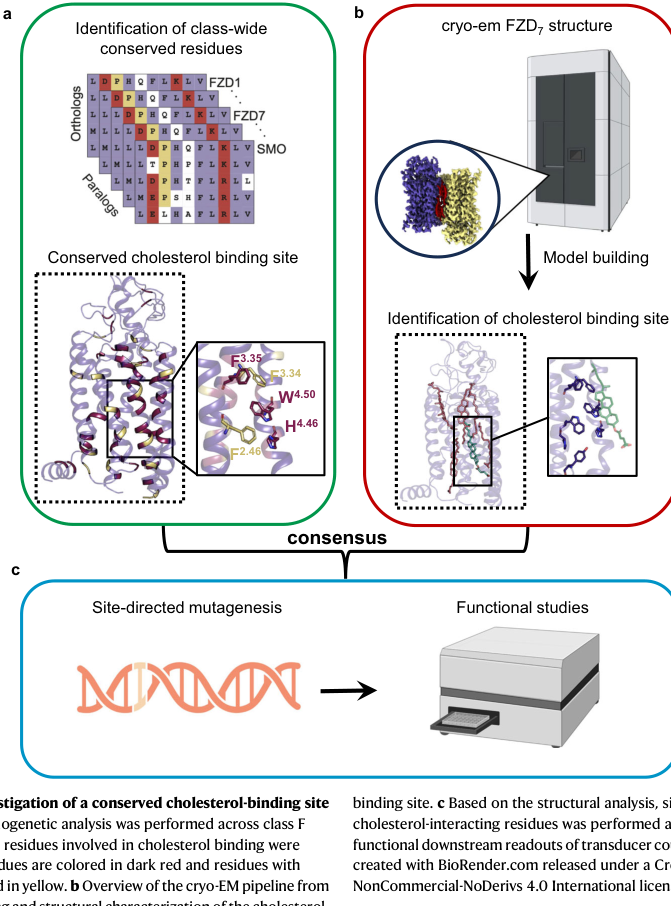

## Question

# Gene Research for Functional Annotation

## ⚠️ CRITICAL: Gene/Protein Identification Context

**BEFORE YOU BEGIN RESEARCH:** You MUST verify you are researching the CORRECT gene/protein. Gene symbols can be ambiguous, especially for less well-characterized genes from non-model organisms.

### Target Gene/Protein Identity (from UniProt):
- **UniProt Accession:** O75084
- **Protein Description:** RecName: Full=Frizzled-7; Short=Fz-7; Short=hFz7; AltName: Full=FzE3; Flags: Precursor;
- **Gene Information:** Name=FZD7;
- **Organism (full):** Homo sapiens (Human).
- **Protein Family:** Belongs to the G-protein coupled receptor Fz/Smo family.
- **Key Domains:** Frizzled-7_CRD. (IPR042742); Frizzled/SFRP. (IPR015526); Frizzled/Smoothened_7TM. (IPR000539); Frizzled_dom. (IPR020067); Frizzled_dom_sf. (IPR036790)

### MANDATORY VERIFICATION STEPS:

1. **Check if the gene symbol "FZD7" matches the protein description above**
2. **Verify the organism is correct:** Homo sapiens (Human).
3. **Check if protein family/domains align with what you find in literature**
4. **If you find literature for a DIFFERENT gene with the same or similar symbol, STOP**

### If Gene Symbol is Ambiguous or You Cannot Find Relevant Literature:

**DO NOT PROCEED WITH RESEARCH ON A DIFFERENT GENE.** Instead:
- State clearly: "The gene symbol 'FZD7' is ambiguous or literature is limited for this specific protein"
- Explain what you found (e.g., "Found extensive literature on a different gene with the same symbol in a different organism")
- Describe the protein based ONLY on the UniProt information provided above
- Suggest that the protein function can be inferred from domain/family information

### Research Target:

Please provide a comprehensive research report on the gene **FZD7** (gene ID: FZD7, UniProt: O75084) in human.

The research report should be a detailed narrative explaining the function, biological processes, and localization of the gene product. Citations should be given for all claims.

You should prioritize authoritative reviews and primary scientific literature when conducting research. You can supplement
this with annotations you find in gene/protein databases, but these can be outdated or inaccurate.

We are specifically interested in the primary function of the gene - for enzymes, what reaction is catalyzed, and what is the substrate specificity? For transporters, what is the substrate? For structural proteins or adapters, what is the broader structural role? For signaling molecules, what is the role in the pathway.

We are interested in where in or outside the cell the gene product carries out its function.

We are also interested in the signaling or biochemical pathways in which the gene functions. We are less interested in broad pleiotropic effects, except where these elucidate the precise role.

Include evidence where possible. We are interested in both experimental evidence as well as inference from structure, evolution, or bioinformatic analysis. Precise studies should be prioritized over high-throughput, where available.

## Output

Question: You are an expert researcher providing comprehensive, well-cited information.

Provide detailed information focusing on:
1. Key concepts and definitions with current understanding
2. Recent developments and latest research (prioritize 2023-2024 sources)
3. Current applications and real-world implementations
4. Expert opinions and analysis from authoritative sources
5. Relevant statistics and data from recent studies

Format as a comprehensive research report with proper citations. Include URLs and publication dates where available.
Always prioritize recent, authoritative sources and provide specific citations for all major claims.

# Gene Research for Functional Annotation

## ⚠️ CRITICAL: Gene/Protein Identification Context

**BEFORE YOU BEGIN RESEARCH:** You MUST verify you are researching the CORRECT gene/protein. Gene symbols can be ambiguous, especially for less well-characterized genes from non-model organisms.

### Target Gene/Protein Identity (from UniProt):
- **UniProt Accession:** O75084
- **Protein Description:** RecName: Full=Frizzled-7; Short=Fz-7; Short=hFz7; AltName: Full=FzE3; Flags: Precursor;
- **Gene Information:** Name=FZD7;
- **Organism (full):** Homo sapiens (Human).
- **Protein Family:** Belongs to the G-protein coupled receptor Fz/Smo family.
- **Key Domains:** Frizzled-7_CRD. (IPR042742); Frizzled/SFRP. (IPR015526); Frizzled/Smoothened_7TM. (IPR000539); Frizzled_dom. (IPR020067); Frizzled_dom_sf. (IPR036790)

### MANDATORY VERIFICATION STEPS:

1. **Check if the gene symbol "FZD7" matches the protein description above**
2. **Verify the organism is correct:** Homo sapiens (Human).
3. **Check if protein family/domains align with what you find in literature**
4. **If you find literature for a DIFFERENT gene with the same or similar symbol, STOP**

### If Gene Symbol is Ambiguous or You Cannot Find Relevant Literature:

**DO NOT PROCEED WITH RESEARCH ON A DIFFERENT GENE.** Instead:
- State clearly: "The gene symbol 'FZD7' is ambiguous or literature is limited for this specific protein"
- Explain what you found (e.g., "Found extensive literature on a different gene with the same symbol in a different organism")
- Describe the protein based ONLY on the UniProt information provided above
- Suggest that the protein function can be inferred from domain/family information

### Research Target:

Please provide a comprehensive research report on the gene **FZD7** (gene ID: FZD7, UniProt: O75084) in human.

The research report should be a detailed narrative explaining the function, biological processes, and localization of the gene product. Citations should be given for all claims.

You should prioritize authoritative reviews and primary scientific literature when conducting research. You can supplement
this with annotations you find in gene/protein databases, but these can be outdated or inaccurate.

We are specifically interested in the primary function of the gene - for enzymes, what reaction is catalyzed, and what is the substrate specificity? For transporters, what is the substrate? For structural proteins or adapters, what is the broader structural role? For signaling molecules, what is the role in the pathway.

We are interested in where in or outside the cell the gene product carries out its function.

We are also interested in the signaling or biochemical pathways in which the gene functions. We are less interested in broad pleiotropic effects, except where these elucidate the precise role.

Include evidence where possible. We are interested in both experimental evidence as well as inference from structure, evolution, or bioinformatic analysis. Precise studies should be prioritized over high-throughput, where available.

## Comprehensive research report: Human **FZD7 / Frizzled-7** (UniProt **O75084**) functional annotation

### 0) Mandatory target verification (gene/protein identity)
The literature retrieved and analyzed here consistently refers to **human Frizzled-7 (FZD7)**, a member of the **Frizzled (FZD1–10) class F GPCR family**, with an extracellular **cysteine-rich domain (CRD)** and a **7-transmembrane (7TM)** receptor core, matching the UniProt description for **O75084 (FZD7, Homo sapiens)** (bous2024structuralbasisof pages 1-2, martinezmarin2025frizzledreceptorsgatekeepers pages 2-3, hodson2025targetingcancerwith pages 2-4). The most definitive target confirmation in this evidence set is a 2024 high-resolution structural paper explicitly solving the **apo (inactive) structure of human FZD7** and experimentally interrogating its signaling machinery, demonstrating that the target protein is indeed Frizzled-7 (bous2024structuralbasisof pages 1-2).

**Limitation:** the UniProt accession string **“O75084”** itself did not appear verbatim in the retrieved full texts; however, the structural and mechanistic descriptions align with the UniProt-provided family/domain context (class F GPCR; CRD; 7TM; DVL coupling) (bous2024structuralbasisof pages 1-2, martinezmarin2025frizzledreceptorsgatekeepers pages 2-3).

### 1) Key concepts and definitions (current understanding)

#### 1.1 Frizzled receptors and FZD7
Frizzled receptors are **WNT-activated cell-surface receptors** within the **class F GPCR** group. They share: (i) an extracellular **CRD** (ligand-binding), (ii) a **7TM** domain anchoring them in the plasma membrane, and (iii) a cytoplasmic C-terminal region that recruits intracellular effectors, prominently **Dishevelled (DVL)**, often via a PDZ-binding motif (family-level feature) (martinezmarin2025frizzledreceptorsgatekeepers pages 2-3). FZD7 is a prominent, widely studied paralog, especially in disease contexts such as cancer (martinezmarin2025frizzledreceptorsgatekeepers pages 2-3, hodson2025targetingcancerwith pages 2-4).

#### 1.2 Canonical vs non-canonical WNT/FZD signaling
**Canonical WNT signaling** (often called WNT/β-catenin) depends on WNT ligands engaging **FZDs together with the co-receptor LRP5/6**, leading to recruitment of **DVL** at the plasma membrane and inhibition of the β-catenin destruction complex, enabling β-catenin accumulation and transcriptional outputs (hodson2025targetingcancerwith pages 2-4, arthofer2023classfrizzledgpcrs pages 1-3).

**Non-canonical WNT signaling** encompasses β-catenin-independent outputs. A curated pharmacology summary (GtoPdb) attributes to WNT/FZD signaling a diverse set of outputs including **planar cell polarity (PCP)-like pathways**, **heterotrimeric G-protein signaling**, intracellular **Ca2+ elevation**, and downstream pathways such as **RAC-1, JNK, Rho, and Rho kinase** (arthofer2023classfrizzledgpcrs pages 1-3). FZD7 is described as capable of mediating both canonical and non-canonical WNT signaling and is implicated in PCP-related developmental processes (hodson2025targetingcancerwith pages 2-4).

### 2) Molecular function and mechanism of action (what FZD7 “does”)

#### 2.1 Primary function: membrane WNT receptor coupling to transducers (DVL and sometimes G proteins)
FZD7’s primary molecular role is as a **plasma-membrane WNT receptor** that couples extracellular WNT ligand recognition to intracellular signaling by recruiting transducers—particularly **DVL**—and in some contexts engaging heterotrimeric **G proteins** (bous2024structuralbasisof pages 1-2, arthofer2023classfrizzledgpcrs pages 1-3). A key modern theme is that Frizzled receptors behave GPCR-like, but with **distinct rules for transducer preference and pathway selection** relative to class A GPCRs (gratz2023pathwayselectivityin pages 1-2, bous2024structuralbasisof pages 1-2).

#### 2.2 2023 advance: “micro-switch” logic for pathway selectivity in Frizzleds
A major 2023 mechanistic study used structure-guided mutagenesis and functional readouts to argue that **pathway selectivity** in Frizzleds is encoded in **conserved active-state micro-switches** and receptor conformational states (gratz2023pathwayselectivityin pages 1-2). A specific conserved polar interaction involving **R/K6.32 and W7.55** is described as a molecular switch with differential effects on **G protein vs DVL binding**, supporting the concept that distinct receptor conformations bias signaling output (gratz2023pathwayselectivityin pages 1-2).

#### 2.3 2024 advance: high-resolution structure and lipid/cholesterol allostery in FZD7
A 2024 Nature Communications paper reported an **apo (inactive) cryo-EM structure of human FZD7 at 1.9 Å resolution** and identified allosteric features relevant to function (bous2024structuralbasisof pages 1-2). Key findings include:

* **Internal water pocket**: an internal cavity with a defined “bottleneck” that undergoes transient rearrangements; proposed to contribute to receptor dynamics and activation-related conformational changes (bous2024structuralbasisof pages 6-7).
* **Conserved cholesterol-binding site**: a well-defined cholesterol site on the receptor surface (between TM2–TM4) with conserved aromatic residues (e.g., **F2.46, F3.34, F3.35, W4.50, H4.46**), hypothesized to stabilize receptor conformations (bous2024structuralbasisof pages 6-7, bous2024structuralbasisof media c68ae924).
* **Functional relevance to DVL association and signalosome formation**: the study links lipid/cholesterol interactions to **FZD7–DVL association** and initiation of downstream signaling complexes (“signalosome” formation) (bous2024structuralbasisof pages 1-2).

These results suggest that FZD7’s activity is regulated not only by ligand and co-receptors, but also by **membrane composition and sterol binding**, providing a mechanistic foothold for drug discovery (bous2024structuralbasisof pages 1-2, bous2024structuralbasisof pages 6-7).

### 3) Subcellular localization, trafficking, and interaction network

#### 3.1 Localization
FZD7 is a **7TM plasma-membrane receptor**, functioning at the cell surface where it participates in WNT receptor complexes (hodson2025targetingcancerwith pages 2-4, arthofer2023classfrizzledgpcrs pages 1-3). Structural and mechanistic studies emphasize that receptor activation and transducer coupling occur at the membrane and involve lipid/cholesterol interactions (bous2024structuralbasisof pages 1-2).

#### 3.2 Core interaction partners and co-receptors
Evidence in this corpus supports the following interaction/complex components:

* **WNT ligands**: FZD7 is described as binding WNT ligands via its extracellular CRD and recognizing WNT fatty-acyl groups; FZD7 is described as interacting strongly with canonical ligands such as **WNT3A and WNT1** (hodson2025targetingcancerwith pages 2-4, martinezmarin2025frizzledreceptorsgatekeepers pages 3-4).
* **LRP5/6**: canonical signaling proceeds via WNT–FZD–**LRP5/6** ternary complex formation at the plasma membrane (hodson2025targetingcancerwith pages 2-4, martinezmarin2025frizzledreceptorsgatekeepers pages 3-4).
* **Dishevelled (DVL)**: a central scaffold/transducer in both canonical and non-canonical pathways; the 2024 FZD7 structure paper connects cholesterol binding to DVL association and signalosome initiation (bous2024structuralbasisof pages 1-2). The 2023 pathway-selectivity study emphasizes that Frizzleds generally **prefer DVL** coupling and identifies micro-switches influencing DVL vs G protein engagement (gratz2023pathwayselectivityin pages 1-2).
* **PCP-associated co-receptors/partners**: PCP-associated complexes can include PTK7, MUSK, ROR1/2, RYK, CELSR1, VANGL2 (hodson2025targetingcancerwith pages 2-4).
* **Arrestin (class-level)**: arrestin is described as required for **FZD internalization** and for both β-catenin-dependent and -independent signaling, highlighting trafficking as a signaling-regulatory mechanism (arthofer2023classfrizzledgpcrs pages 1-3).

#### 3.3 Endocytosis and receptor abundance control (2024 primary evidence)
A 2024 Life Science Alliance paper provides direct mechanistic trafficking evidence: transmembrane E3 ligases **RNF43 and ZNRF3** induce endocytosis and lysosomal degradation of Frizzled receptors. Notably, **RNF43 preferentially down-regulates FZD1/FZD5/FZD7**, whereas ZNRF3 shows preference for FZD6 (bugter2024e3ligasesrnf43 pages 1-2). This establishes a concrete mechanism by which FZD7 surface levels are controlled and suggests context-specific vulnerabilities in cancers with RNF43/ZNRF3 alterations (bugter2024e3ligasesrnf43 pages 1-2).

### 4) Recent developments and latest research (priority 2023–2024)

#### 4.1 Structural biology enabling mechanism-driven targeting (2024)
The **1.9 Å** inactive FZD7 cryo-EM structure, the identification of an internal water pocket, and the conserved cholesterol site provide actionable structural hypotheses for **allosteric regulation** and potential binding pockets for therapeutics (bous2024structuralbasisof pages 1-2, bous2024structuralbasisof pages 6-7). The cholesterol-binding-site figure (below) is a key visual summary of this mechanistic concept (bous2024structuralbasisof media c68ae924).

#### 4.2 Receptor conformational states and transducer bias (2023)
The 2023 Nature Communications study formalizes the concept that Frizzled receptors adopt **distinct active conformations** defined by conserved micro-switches that bias DVL vs G-protein coupling, offering a conceptual framework for “biased agonism” or “biased inhibition” in class F GPCRs (gratz2023pathwayselectivityin pages 1-2).

#### 4.3 Trafficking specificity of RNF43 vs ZNRF3 (2024)
The 2024 study demonstrating that RNF43 and ZNRF3 have **differential Frizzled specificity** (RNF43→FZD7 among others) provides a mechanistic basis for how mutations in these ligases can selectively potentiate certain WNT receptor outputs in a tissue-dependent way (bugter2024e3ligasesrnf43 pages 1-2).

### 5) Current applications and real-world implementations

#### 5.1 Therapeutic targeting strategies (evidence-rich overview)
A 2024 review focusing on Frizzled receptors as cancer targets summarizes multiple intervention classes relevant to **FZD7**, including blocking antibodies, peptides, small molecules, and nucleic-acid-based approaches, while also highlighting challenges such as WNT ligand promiscuity and biochemical difficulty purifying active WNT ligands (liu2024frizzledreceptors(fzds) pages 10-11).

**Small molecules / structure-guided approaches (2024 review):**
* A TMD-targeting inhibitor **SRI37892** is described as identified for FZD7, and a small molecule is reported to inhibit breast-cancer cell proliferation with **IC50 ~2 μM** (liu2024frizzledreceptors(fzds) pages 10-11).
* CRD-directed virtual screening identified candidate binders including **Zinc05972969** with predicted binding free energy **−8.1 kcal/mol** and hydrogen bonds to **Lys61/Gln55** in the FZD7 CRD (liu2024frizzledreceptors(fzds) pages 10-11).

**Receptor-turnover-informed targeting (2024 primary + curated summaries):**
RNF43/ZNRF3-mediated endocytosis and degradation of Frizzled receptors implies that receptor abundance at the membrane is not fixed and could influence response to drugs targeting FZD7 or upstream WNT ligands (bugter2024e3ligasesrnf43 pages 1-2, arthofer2023classfrizzledgpcrs pages 1-3).

**Antibody/biologic modalities (reviewed + primary):**
A 2025 targeted review of FZD7 (outside the requested 2023–2024 window but still recent and authoritative) summarizes multiple biologic strategies including pan-FZD antibody approaches (e.g., OMP-18R5/Vantictumab includes FZD7), FZD7-specific scFv antibodies, soluble FZD7 decoys, nanoparticles, ADCs, and peptide inhibitors, providing expert synthesis and translational framing (hodson2025targetingcancerwith pages 6-8). A 2025 primary immunotherapy paper reports an antibody-derived **bifunctional NK engager** (SHH002-hu1-MICA) that targets FZD7 on TNBC cells and retargets NK cells via MICA–NKG2D, showing in vivo xenograft activity (wang2025frizzled7targetingantibodyderivedbifunctional pages 1-2).

**Clinical trials:** A broad ClinicalTrials.gov query for “FZD7/Frizzled-7” did not retrieve interventional trials directly targeting FZD7 in the available trial results during this run; one unrelated observational trial appeared in the search output, indicating that FZD7-targeting may largely remain preclinical/early translational in the currently retrieved records (NCT04142918 chunk retrieved but not FZD7-targeting) (clinical trial search output).

### 6) Expert opinions, authoritative analysis, and open questions
Curated and review sources emphasize several field-level uncertainties:

* **Ligand–receptor specificity is incompletely resolved**: receptor availability, co-receptors, and cellular context influence which WNT–FZD interactions dominate (hodson2025targetingcancerwith pages 2-4, liu2024frizzledreceptors(fzds) pages 10-11).
* **Non-canonical signaling diversity and mechanism**: β-catenin-independent outputs are described as diverse (G proteins, Ca2+, small GTPases, kinases), and their wiring differs by context (arthofer2023classfrizzledgpcrs pages 1-3).
* **Trafficking dynamics as a knowledge gap**: even while RNF43/ZNRF3 mechanisms are now experimentally clarified for receptor endocytosis specificity, broader temporal dynamics of endocytosis/recycling/degradation and their coupling to signaling remain an active area (bugter2024e3ligasesrnf43 pages 1-2, martinezmarin2025frizzledreceptorsgatekeepers pages 11-12).
* **Membrane lipids as allosteric regulators**: the identification of a conserved cholesterol-binding site and internal water pocket in FZD7 strengthens expert views that membrane composition can gate receptor activation and transducer association (bous2024structuralbasisof pages 1-2, bous2024structuralbasisof pages 6-7).

### 7) Recent quantitative statistics and data (from retrieved sources)
Key quantitative datapoints directly extractable from the retrieved 2023–2024 sources include:

* **FZD7 cryo-EM structure resolution:** **1.9 Å** (inactive apo structure) (bous2024structuralbasisof pages 1-2).
* **Cholesterol-binding site composition:** conserved aromatic residue set **F2.46/F3.34/F3.35/W4.50/H4.46**, visualized with bound cholesterol in the structural figure (bous2024structuralbasisof pages 6-7, bous2024structuralbasisof media c68ae924).
* **Small-molecule inhibition (reviewed, 2024):** reported **IC50 ~2 μM** for a small-molecule effect on breast-cancer cell proliferation (liu2024frizzledreceptors(fzds) pages 10-11).
* **CRD docking metric (reviewed, 2024):** predicted binding free energy **−8.1 kcal/mol** for Zinc05972969 (liu2024frizzledreceptors(fzds) pages 10-11).
* **Trafficking prevalence statistic (reviewed, 2025):** ~**54%** of patients in a relevant setting described as having FZD7 surface accumulation in the context of receptor-turnover gene mutations (e.g., RNF43) (hodson2025targetingcancerwith pages 6-8). (This value is review-reported; primary cohort specifics should be verified in the underlying cited paper.)

### 8) Evidence summary table (mechanisms, trafficking, therapeutics, numeric values)

| Topic | Key points | Quantitative / implementation details | Source (date; DOI URL) |
|---|---|---|---|
| Identity / verified target | Human **FZD7 / Frizzled-7**; **class F GPCR** (Frizzled family); extracellular **CRD**, linker, **7TM** core, intracellular C-tail that recruits **DVL**; plasma-membrane receptor; family often includes a **PDZ-binding motif** in the C-tail (family-level feature) (bous2024structuralbasisof pages 1-2, martinezmarin2025frizzledreceptorsgatekeepers pages 2-3, hodson2025targetingcancerwith pages 2-4) | Inactive human FZD7 structure solved; receptor studied as membrane WNT receptor coupled mainly to DVL-centered signaling (bous2024structuralbasisof pages 1-2, martinezmarin2025frizzledreceptorsgatekeepers pages 2-3) | **Aug 2024** Nature Communications; https://doi.org/10.1038/s41467-024-51664-4 (bous2024structuralbasisof pages 1-2) ; **May 2025** Front Cell Dev Biol; https://doi.org/10.3389/fcell.2025.1599355 (martinezmarin2025frizzledreceptorsgatekeepers pages 2-3) |
| Mechanism 2023: pathway selectivity | Conserved micro-switch **R/K6.32-W7.55** helps define active conformations; Frizzleds generally **prefer DVL over heterotrimeric G proteins**; conformational states determine pathway output (gratz2023pathwayselectivityin pages 1-2, arthofer2023classfrizzledgpcrs pages 1-3) | 32 alanine mutants tested in FZD5; principles extended to FZD4/FZD10 and likely informative for FZD7 (gratz2023pathwayselectivityin pages 1-2) | **Jul 2023** Nature Communications; https://doi.org/10.1038/s41467-023-40213-0 (gratz2023pathwayselectivityin pages 1-2) |
| Mechanism 2024: FZD7 structure | Apo/inactive human FZD7 cryo-EM structure identifies **internal water pocket**, **lipid interactions**, and conserved **cholesterol-binding site** important for **DVL association** and downstream signalosome formation (bous2024structuralbasisof pages 1-2, bous2024structuralbasisof pages 6-7, bous2024structuralbasisof media c68ae924) | **1.9 Å** cryo-EM resolution; cholesterol-site residues highlighted include **F2.46, F3.34/F3.35, W4.50, H4.46**; water-pocket bottleneck includes **D405, L415, Y489, K533, Y534** (bous2024structuralbasisof pages 1-2, bous2024structuralbasisof pages 6-7, bous2024structuralbasisof media c68ae924) | **Aug 2024** Nature Communications; https://doi.org/10.1038/s41467-024-51664-4 (bous2024structuralbasisof pages 1-2) |
| Mechanistic figure support | Structural figure shows conserved FZD7 cholesterol pocket and bound cholesterol in cryo-EM density (bous2024structuralbasisof media c68ae924) | Figure 6 annotates conserved site and bound cholesterol (bous2024structuralbasisof media c68ae924) | **Aug 2024** Nature Communications figure context; https://doi.org/10.1038/s41467-024-51664-4 (bous2024structuralbasisof media c68ae924) |
| Trafficking / receptor abundance | **RNF43** and **ZNRF3** ubiquitinate FZD receptors to drive endocytosis/lysosomal degradation; **RNF43 preferentially down-regulates FZD1/FZD5/FZD7**, whereas **ZNRF3 prefers FZD6** (bugter2024e3ligasesrnf43 pages 1-2) | Negative-feedback WNT target genes; receptor-specific TMD determinants explain selectivity; suggests FZD7 vulnerability in RNF43-mutant cancers (bugter2024e3ligasesrnf43 pages 1-2) | **Jul 2024** Life Science Alliance; https://doi.org/10.26508/lsa.202402575 (bugter2024e3ligasesrnf43 pages 1-2) |
| Cancer-context trafficking statistic | Review summarizes that defects in turnover genes such as **RNF43** can cause **FZD7 surface accumulation** in **~54%** of patients in relevant cancer settings (hodson2025targetingcancerwith pages 6-8) | ~54% value reported in review summary; useful as translational prevalence estimate, but primary cohort details should be checked in cited source (hodson2025targetingcancerwith pages 6-8) | **May 2025** Sci; https://doi.org/10.3390/sci7020061 (hodson2025targetingcancerwith pages 6-8) |
| Small-molecule / CRD-directed targeting | Structure-guided inhibition includes **SRI37892** (TMD-targeting FZD7 inhibitor) and CRD binders; docking identified **30 FZD7-CRD binders**, including **Zinc05972969** (liu2024frizzledreceptors(fzds) pages 10-11) | Breast-cancer growth inhibitor reported **IC50 ~2 µM**; Zinc05972969 binding free energy **-8.1 kcal/mol** with H-bonds to **Lys61/Gln55**; comparator feasibility example: carbamazepine-FZD8 **KD 17 µM**, inhibitory conc. **~8 µM** (liu2024frizzledreceptors(fzds) pages 10-11) | **Apr 2024** Acta Pharmacol Sin; https://doi.org/10.1038/s41401-024-01270-3 (liu2024frizzledreceptors(fzds) pages 10-11) |
| Biologics / decoys / ADCs / nanoparticles | Reviews list **OMP-18R5/Vantictumab** (pan-FZD incl. FZD7), **FZD7 scFv antibodies**, **soluble recombinant FZD7 / FZD-Fc decoys**, **FZD7-ADCs**, **FZD7-targeted nanoparticles**, peptide inhibitors, siRNA/miRNA approaches (hodson2025targetingcancerwith pages 6-8, martinezmarin2025frizzledreceptorsgatekeepers pages 11-12) | Implementations include doxorubicin or **β-catenin siRNA** nanoparticle delivery; OMP-18R5 reduced gastric-cancer spheroid formation; FZD7-ADC designed for tumor-selective cytotoxicity (hodson2025targetingcancerwith pages 6-8, martinezmarin2025frizzledreceptorsgatekeepers pages 11-12) | **May 2025** Sci; https://doi.org/10.3390/sci7020061 (hodson2025targetingcancerwith pages 6-8) ; **May 2025** Front Cell Dev Biol; https://doi.org/10.3389/fcell.2025.1599355 (martinezmarin2025frizzledreceptorsgatekeepers pages 11-12) |
| Immune engager | **SHH002-hu1-MICA**: FZD7-targeting bifunctional protein retargeting **NK cells** to TNBC/TNBC stem-like cells via **MICA-NKG2D** axis (wang2025frizzled7targetingantibodyderivedbifunctional pages 1-2) | Binds **rhFzd7** and **rhNKG2D** (BLI/SPR), disrupts Wnt/β-catenin signaling, increases NK degranulation/infiltration, outperforms parental antibody in xenografts (wang2025frizzled7targetingantibodyderivedbifunctional pages 1-2) | **Feb 2025** J Immunother Cancer; https://doi.org/10.1136/jitc-2024-009621 (wang2025frizzled7targetingantibodyderivedbifunctional pages 1-2) |

*Table: This table condenses verified human FZD7 identity, recent mechanistic findings, trafficking regulation, therapeutic strategies, and key quantitative values from the cited evidence. It is useful as a quick-reference scaffold for the full functional annotation report.*

### 9) Figure evidence (structural mechanism)
The conserved cholesterol-binding pocket and bound cholesterol in the FZD7 structure are shown in the retrieved figure crop (Figure 6) (bous2024structuralbasisof media c68ae924).

### 10) Conclusion
FZD7 (Frizzled-7) is a **cell-surface WNT receptor** in the **class F GPCR** family whose primary biochemical function is to convert WNT ligand engagement into intracellular signaling, largely through **DVL-centered transduction** and context-dependent engagement of other pathways (canonical β-catenin; PCP-like; GPCR-like second messenger outputs). Recent 2023–2024 work advances mechanistic understanding at two key levels: (i) **conformational micro-switches** that bias pathway selection, and (ii) **high-resolution structural and lipid/cholesterol allostery** that links membrane composition to DVL association and signalosome initiation. In parallel, **RNF43/ZNRF3-dependent endocytosis** provides a concrete trafficking mechanism controlling FZD7 surface abundance and WNT responsiveness, with direct implications for disease biology and therapeutic targeting.

### Key URLs (publication date → link)
* **2024-08** Bous et al., Nature Communications: https://doi.org/10.1038/s41467-024-51664-4 (bous2024structuralbasisof pages 1-2)
* **2023-07** Grätz et al., Nature Communications: https://doi.org/10.1038/s41467-023-40213-0 (gratz2023pathwayselectivityin pages 1-2)
* **2024-07** Bugter et al., Life Science Alliance: https://doi.org/10.26508/lsa.202402575 (bugter2024e3ligasesrnf43 pages 1-2)
* **2024-04** Liu et al., Acta Pharmacologica Sinica: https://doi.org/10.1038/s41401-024-01270-3 (liu2024frizzledreceptors(fzds) pages 10-11)
* **2023** GtoPdb class Frizzled GPCRs summary (as retrieved): includes class-level signaling and internalization notes (arthofer2023classfrizzledgpcrs pages 1-3)

References

1. (bous2024structuralbasisof pages 1-2): Julien Bous, Julia Kinsolving, Lukas Grätz, Magdalena M. Scharf, Jan Hendrik Voss, Berkay Selcuk, Ogün Adebali, and Gunnar Schulte. Structural basis of frizzled 7 activation and allosteric regulation. Nature Communications, Aug 2024. URL: https://doi.org/10.1038/s41467-024-51664-4, doi:10.1038/s41467-024-51664-4. This article has 17 citations and is from a highest quality peer-reviewed journal.

2. (martinezmarin2025frizzledreceptorsgatekeepers pages 2-3): Dalia Martinez-Marin, Grace C. Stroman, Camryn J. Fulton, and Kevin Pruitt. Frizzled receptors: gatekeepers of wnt signaling in development and disease. Frontiers in Cell and Developmental Biology, May 2025. URL: https://doi.org/10.3389/fcell.2025.1599355, doi:10.3389/fcell.2025.1599355. This article has 19 citations.

3. (hodson2025targetingcancerwith pages 2-4): Kieran Hodson, Hector M. Arredondo, William E. Humphrey, Dustin J. Flanagan, Elizabeth Vincan, Karl Willert, Helen B. Pearson, and Toby J. Phesse. Targeting cancer with paris’ arrow: an updated perspective on targeting wnt receptor frizzled 7. Sci, 7(2):61, May 2025. URL: https://doi.org/10.3390/sci7020061, doi:10.3390/sci7020061. This article has 3 citations.

4. (arthofer2023classfrizzledgpcrs pages 1-3): E Arthofer, J Dijksterhuis, L Grätz, and B Hot. Class frizzled gpcrs in gtopdb v. 2023.1. Unknown journal, 2023.

5. (gratz2023pathwayselectivityin pages 1-2): Lukas Grätz, Maria Kowalski-Jahn, Magdalena M. Scharf, Pawel Kozielewicz, Michael Jahn, Julien Bous, Nevin A. Lambert, David E. Gloriam, and Gunnar Schulte. Pathway selectivity in frizzleds is achieved by conserved micro-switches defining pathway-determining, active conformations. Nature Communications, Jul 2023. URL: https://doi.org/10.1038/s41467-023-40213-0, doi:10.1038/s41467-023-40213-0. This article has 31 citations and is from a highest quality peer-reviewed journal.

6. (bous2024structuralbasisof pages 6-7): Julien Bous, Julia Kinsolving, Lukas Grätz, Magdalena M. Scharf, Jan Hendrik Voss, Berkay Selcuk, Ogün Adebali, and Gunnar Schulte. Structural basis of frizzled 7 activation and allosteric regulation. Nature Communications, Aug 2024. URL: https://doi.org/10.1038/s41467-024-51664-4, doi:10.1038/s41467-024-51664-4. This article has 17 citations and is from a highest quality peer-reviewed journal.

7. (bous2024structuralbasisof media c68ae924): Julien Bous, Julia Kinsolving, Lukas Grätz, Magdalena M. Scharf, Jan Hendrik Voss, Berkay Selcuk, Ogün Adebali, and Gunnar Schulte. Structural basis of frizzled 7 activation and allosteric regulation. Nature Communications, Aug 2024. URL: https://doi.org/10.1038/s41467-024-51664-4, doi:10.1038/s41467-024-51664-4. This article has 17 citations and is from a highest quality peer-reviewed journal.

8. (martinezmarin2025frizzledreceptorsgatekeepers pages 3-4): Dalia Martinez-Marin, Grace C. Stroman, Camryn J. Fulton, and Kevin Pruitt. Frizzled receptors: gatekeepers of wnt signaling in development and disease. Frontiers in Cell and Developmental Biology, May 2025. URL: https://doi.org/10.3389/fcell.2025.1599355, doi:10.3389/fcell.2025.1599355. This article has 19 citations.

9. (bugter2024e3ligasesrnf43 pages 1-2): Jeroen M Bugter, Peter van Kerkhof, Ingrid Jordens, Eline Janssen, Thi Tran Ngoc Minh, Daniel Iglesias van Montfort, Cara Jamieson, and Madelon M Maurice. E3 ligases rnf43 and znrf3 display differential specificity for endocytosis of frizzled receptors. Life Science Alliance, 7:e202402575, Jul 2024. URL: https://doi.org/10.26508/lsa.202402575, doi:10.26508/lsa.202402575. This article has 16 citations and is from a peer-reviewed journal.

10. (liu2024frizzledreceptors(fzds) pages 10-11): Hui-yu Liu, Xiao-jiao Sun, Si-yu Xiu, Xiang-yu Zhang, Zhi-qi Wang, Yan-lun Gu, Chu-xiao Yi, Jun-yan Liu, Yu-song Dai, Xia Yuan, Hua-peng Liao, Zhen-ming Liu, Xiao-cong Pang, and Tian-cheng Li. Frizzled receptors (fzds) in wnt signaling: potential therapeutic targets for human cancers. Acta pharmacologica Sinica, 45:1556-1570, Apr 2024. URL: https://doi.org/10.1038/s41401-024-01270-3, doi:10.1038/s41401-024-01270-3. This article has 33 citations and is from a peer-reviewed journal.

11. (hodson2025targetingcancerwith pages 6-8): Kieran Hodson, Hector M. Arredondo, William E. Humphrey, Dustin J. Flanagan, Elizabeth Vincan, Karl Willert, Helen B. Pearson, and Toby J. Phesse. Targeting cancer with paris’ arrow: an updated perspective on targeting wnt receptor frizzled 7. Sci, 7(2):61, May 2025. URL: https://doi.org/10.3390/sci7020061, doi:10.3390/sci7020061. This article has 3 citations.

12. (wang2025frizzled7targetingantibodyderivedbifunctional pages 1-2): Chenyue Wang, Lisha Wu, Xingxing Li, Shuyang Mao, Zitong Wang, Haiyan Xie, Jing Xu, Danfang Li, Hao Yang, Tong Wang, Qingqing Huang, Lin Yang, Xiaofei Zhang, Yuxia Liu, Jin Wang, Gang Huang, and Wei Xie. Frizzled-7-targeting antibody-derived bifunctional protein retargets nk cells against triple-negative breast cancer cells via mica-nkg2d axis. Journal for Immunotherapy of Cancer, 13:e009621, Feb 2025. URL: https://doi.org/10.1136/jitc-2024-009621, doi:10.1136/jitc-2024-009621. This article has 10 citations and is from a domain leading peer-reviewed journal.

13. (martinezmarin2025frizzledreceptorsgatekeepers pages 11-12): Dalia Martinez-Marin, Grace C. Stroman, Camryn J. Fulton, and Kevin Pruitt. Frizzled receptors: gatekeepers of wnt signaling in development and disease. Frontiers in Cell and Developmental Biology, May 2025. URL: https://doi.org/10.3389/fcell.2025.1599355, doi:10.3389/fcell.2025.1599355. This article has 19 citations.

## Artifacts

- [Edison artifact artifact-00](FZD7-deep-research-falcon_artifacts/artifact-00.md)

## Citations

1. bous2024structuralbasisof pages 1-2
2. martinezmarin2025frizzledreceptorsgatekeepers pages 2-3
3. arthofer2023classfrizzledgpcrs pages 1-3
4. hodson2025targetingcancerwith pages 2-4
5. gratz2023pathwayselectivityin pages 1-2
6. bous2024structuralbasisof pages 6-7
7. hodson2025targetingcancerwith pages 6-8
8. martinezmarin2025frizzledreceptorsgatekeepers pages 11-12
9. martinezmarin2025frizzledreceptorsgatekeepers pages 3-4
10. https://doi.org/10.1038/s41467-024-51664-4
11. https://doi.org/10.3389/fcell.2025.1599355
12. https://doi.org/10.1038/s41467-023-40213-0
13. https://doi.org/10.26508/lsa.202402575
14. https://doi.org/10.3390/sci7020061
15. https://doi.org/10.1038/s41401-024-01270-3
16. https://doi.org/10.1136/jitc-2024-009621
17. https://doi.org/10.1038/s41467-024-51664-4,
18. https://doi.org/10.3389/fcell.2025.1599355,
19. https://doi.org/10.3390/sci7020061,
20. https://doi.org/10.1038/s41467-023-40213-0,
21. https://doi.org/10.26508/lsa.202402575,
22. https://doi.org/10.1038/s41401-024-01270-3,
23. https://doi.org/10.1136/jitc-2024-009621,