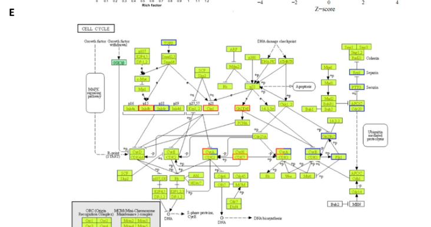

## Question

# Gene Research for Functional Annotation

## ⚠️ CRITICAL: Gene/Protein Identification Context

**BEFORE YOU BEGIN RESEARCH:** You MUST verify you are researching the CORRECT gene/protein. Gene symbols can be ambiguous, especially for less well-characterized genes from non-model organisms.

### Target Gene/Protein Identity (from UniProt):
- **UniProt Accession:** P24522
- **Protein Description:** RecName: Full=Growth arrest and DNA damage-inducible protein GADD45 alpha; AltName: Full=DNA damage-inducible transcript 1 protein; Short=DDIT-1;
- **Gene Information:** Name=GADD45A; Synonyms=DDIT1, GADD45;
- **Organism (full):** Homo sapiens (Human).
- **Protein Family:** Belongs to the GADD45 family. .
- **Key Domains:** GADD45. (IPR024824); Ribosomal_eL30-like_sf. (IPR029064); Ribosomal_eL8/eL30/eS12/Gad45. (IPR004038); Ribosomal_L7Ae (PF01248)

### MANDATORY VERIFICATION STEPS:

1. **Check if the gene symbol "GADD45A" matches the protein description above**
2. **Verify the organism is correct:** Homo sapiens (Human).
3. **Check if protein family/domains align with what you find in literature**
4. **If you find literature for a DIFFERENT gene with the same or similar symbol, STOP**

### If Gene Symbol is Ambiguous or You Cannot Find Relevant Literature:

**DO NOT PROCEED WITH RESEARCH ON A DIFFERENT GENE.** Instead:
- State clearly: "The gene symbol 'GADD45A' is ambiguous or literature is limited for this specific protein"
- Explain what you found (e.g., "Found extensive literature on a different gene with the same symbol in a different organism")
- Describe the protein based ONLY on the UniProt information provided above
- Suggest that the protein function can be inferred from domain/family information

### Research Target:

Please provide a comprehensive research report on the gene **GADD45A** (gene ID: GADD45A, UniProt: P24522) in human.

The research report should be a detailed narrative explaining the function, biological processes, and localization of the gene product. Citations should be given for all claims.

You should prioritize authoritative reviews and primary scientific literature when conducting research. You can supplement
this with annotations you find in gene/protein databases, but these can be outdated or inaccurate.

We are specifically interested in the primary function of the gene - for enzymes, what reaction is catalyzed, and what is the substrate specificity? For transporters, what is the substrate? For structural proteins or adapters, what is the broader structural role? For signaling molecules, what is the role in the pathway.

We are interested in where in or outside the cell the gene product carries out its function.

We are also interested in the signaling or biochemical pathways in which the gene functions. We are less interested in broad pleiotropic effects, except where these elucidate the precise role.

Include evidence where possible. We are interested in both experimental evidence as well as inference from structure, evolution, or bioinformatic analysis. Precise studies should be prioritized over high-throughput, where available.

## Output

Question: You are an expert researcher providing comprehensive, well-cited information.

Provide detailed information focusing on:
1. Key concepts and definitions with current understanding
2. Recent developments and latest research (prioritize 2023-2024 sources)
3. Current applications and real-world implementations
4. Expert opinions and analysis from authoritative sources
5. Relevant statistics and data from recent studies

Format as a comprehensive research report with proper citations. Include URLs and publication dates where available.
Always prioritize recent, authoritative sources and provide specific citations for all major claims.

# Gene Research for Functional Annotation

## ⚠️ CRITICAL: Gene/Protein Identification Context

**BEFORE YOU BEGIN RESEARCH:** You MUST verify you are researching the CORRECT gene/protein. Gene symbols can be ambiguous, especially for less well-characterized genes from non-model organisms.

### Target Gene/Protein Identity (from UniProt):
- **UniProt Accession:** P24522
- **Protein Description:** RecName: Full=Growth arrest and DNA damage-inducible protein GADD45 alpha; AltName: Full=DNA damage-inducible transcript 1 protein; Short=DDIT-1;
- **Gene Information:** Name=GADD45A; Synonyms=DDIT1, GADD45;
- **Organism (full):** Homo sapiens (Human).
- **Protein Family:** Belongs to the GADD45 family. .
- **Key Domains:** GADD45. (IPR024824); Ribosomal_eL30-like_sf. (IPR029064); Ribosomal_eL8/eL30/eS12/Gad45. (IPR004038); Ribosomal_L7Ae (PF01248)

### MANDATORY VERIFICATION STEPS:

1. **Check if the gene symbol "GADD45A" matches the protein description above**
2. **Verify the organism is correct:** Homo sapiens (Human).
3. **Check if protein family/domains align with what you find in literature**
4. **If you find literature for a DIFFERENT gene with the same or similar symbol, STOP**

### If Gene Symbol is Ambiguous or You Cannot Find Relevant Literature:

**DO NOT PROCEED WITH RESEARCH ON A DIFFERENT GENE.** Instead:
- State clearly: "The gene symbol 'GADD45A' is ambiguous or literature is limited for this specific protein"
- Explain what you found (e.g., "Found extensive literature on a different gene with the same symbol in a different organism")
- Describe the protein based ONLY on the UniProt information provided above
- Suggest that the protein function can be inferred from domain/family information

### Research Target:

Please provide a comprehensive research report on the gene **GADD45A** (gene ID: GADD45A, UniProt: P24522) in human.

The research report should be a detailed narrative explaining the function, biological processes, and localization of the gene product. Citations should be given for all claims.

You should prioritize authoritative reviews and primary scientific literature when conducting research. You can supplement
this with annotations you find in gene/protein databases, but these can be outdated or inaccurate.

We are specifically interested in the primary function of the gene - for enzymes, what reaction is catalyzed, and what is the substrate specificity? For transporters, what is the substrate? For structural proteins or adapters, what is the broader structural role? For signaling molecules, what is the role in the pathway.

We are interested in where in or outside the cell the gene product carries out its function.

We are also interested in the signaling or biochemical pathways in which the gene functions. We are less interested in broad pleiotropic effects, except where these elucidate the precise role.

Include evidence where possible. We are interested in both experimental evidence as well as inference from structure, evolution, or bioinformatic analysis. Precise studies should be prioritized over high-throughput, where available.

## Research report: Human **GADD45A** (UniProt **P24522**) — functional annotation and current evidence

### 0) Mandatory identity verification (disambiguation)
The target is **human GADD45A** encoding **Growth arrest and DNA damage-inducible protein GADD45 alpha** (also referenced in recent literature as a member of the **GADD45 family** and described as a small ~18–21 kDa, stress-inducible protein). The retrieved sources explicitly discuss **GADD45A/GADD45α** in the context of DNA damage response and cell-cycle checkpoint control in human cells and human cancer datasets, consistent with the UniProt identity provided. (ma2025growtharrestand pages 1-2, ma2025growtharrestand pages 12-13, lin2025associationofgadd45a pages 7-13)

### 1) Key concepts and definitions (current understanding)

#### 1.1 What is GADD45A?
GADD45A is widely characterized as a **stress-sensor protein** induced by genotoxic and physiological stresses and acting predominantly through **protein–protein interactions** (i.e., it is not an enzyme with a defined catalytic reaction). Its canonical roles include coupling stress signals to **cell-cycle arrest**, **DNA damage response (DDR)** processes, and cell-fate programs such as **apoptosis**. (ma2025growtharrestand pages 1-2, ma2025growtharrestand pages 12-13)

#### 1.2 Functional “primary role” in cells
Across recent summaries and mechanistic models, the primary functional theme for GADD45A is **checkpoint enforcement and stress adaptation**, particularly through:
- **G2/M checkpoint control** via regulation of **CDK1/CDC2–Cyclin B1** machinery and its downstream loop components (e.g., PLK1/CDC25C). (ma2025growtharrestand pages 12-13, hou2024nifuratelinducestriplenegative pages 4-8)
- Stress-activated **MAPK signaling modulation**, especially via the upstream MAPKKK **MAP3K4/MEKK4/MTK1** leading to **p38** and **JNK** pathway engagement. (huang2024map3k4kinaseaction pages 3-5)

### 2) Molecular function, interaction partners, pathways, and localization

#### 2.1 Molecular functions and key interaction partners
Recent review-level evidence lists experimentally supported interaction partners for GADD45 family proteins (including GADD45A) that help explain how GADD45A couples DNA damage/stress to checkpoint control:
- **PCNA** and **p21 (p21WAF1/CIP1)**, consistent with replication- and repair-coupled checkpoint regulation. (ma2025growtharrestand pages 12-13)
- **CDC2/CDK1–Cyclin B1** complex, consistent with **G2/M arrest** and mitotic-entry control. (ma2025growtharrestand pages 12-13)
- Functional linkage to **MAP3K4/MEKK4/MTK1**, which serves as an upstream activator of p38/JNK MAPK cascades. (huang2024map3k4kinaseaction pages 3-5)

#### 2.2 Mechanistic pathway placement
**p53→GADD45A axis (DDR transcriptional program):** GADD45A is widely presented as a downstream component of p53-associated DDR outputs that promote checkpoint arrest and repair time. (hou2024nifuratelinducestriplenegative pages 2-4)

**Stress MAPK signaling:** A 2024 mechanistic review of MAP3K4 notes that GADD45 proteins can bind the MAP3K4 N-terminus and relieve autoinhibition, enabling MAP3K4-driven phosphorylation cascades through MKKs to **p38** and **JNK**, which then regulate transcriptional programs (including p53-related transcription factors). (huang2024map3k4kinaseaction pages 3-5)

#### 2.3 Subcellular localization
Localization evidence supports a **nucleo-cytoplasmic distribution** with frequent **nuclear predominance**:
- A 2025 review summarizes GADD45 proteins as localizing to both **nucleus and cytoplasm**. (ma2025growtharrestand pages 1-2)
- In breast tumor immunohistochemistry, GADD45A staining is described as **predominantly nuclear**. (lin2025associationofgadd45a pages 7-13)

### 3) Recent developments and latest research (priority 2023–2024)

#### 3.1 2024 primary study: GADD45A-linked checkpoint and apoptosis responses in TNBC (drug repurposing context)
A 2024 study (Hou et al., *Pharmaceuticals*, published **2024-09-26**, URL https://doi.org/10.3390/ph17101269) used a drug-repurposing approach with **nifuratel (NF113)** in human triple-negative breast cancer (TNBC) models and connected the anti-tumor phenotype to **GADD45A pathway activation**. Key reported findings include:
- **Anti-proliferative potency (IC50, 72 h):** 20.0 ± 0.2 µM (MDA-MB-231), 19.55 ± 0.15 µM (MDA-MB-468), 29.58 ± 0.84 µM (HCC-1806), 23.71 ± 0.32 µM (BT-549), 30.18 ± 0.71 µM (MDA-MB-453). (hou2024nifuratelinducestriplenegative pages 2-4)
- **Transcriptomics:** 1,072 genes upregulated and 1,148 downregulated after NF113 exposure (in MDA-MB-468). (hou2024nifuratelinducestriplenegative pages 4-8)
- **Mechanism-consistent protein changes:** NF113 induced **G2/M arrest** and decreased **CDK1** and **Cyclin B1** (and other loop components including PLK1 and CDC25C), with significantly increased **GADD45A mRNA and protein** (p<0.001 noted in-figure). (hou2024nifuratelinducestriplenegative pages 4-8)
- **MAPK stress signaling readouts:** increased phosphorylation of **JNK** and **p38** (p-JNK, p-p38) with apoptosis markers (cleaved PARP and cleaved caspase-3), consistent with GADD45A-associated stress-apoptosis signaling. (hou2024nifuratelinducestriplenegative pages 4-8)

These data represent a concrete 2024 mechanistic implementation of GADD45A as a checkpoint/stress-response effector and as a drug-response pathway node in cancer. (hou2024nifuratelinducestriplenegative pages 4-8, hou2024nifuratelinducestriplenegative pages 2-4)

#### 3.2 2024 mechanistic review: GADD45 proteins activating MAP3K4/MEKK4/MTK1
A 2024 review (Huang et al., *Discover Oncology*, April 2024; URL https://doi.org/10.1007/s12672-024-00961-x) describes a mechanism in which **GADD45 proteins** bind the **N-terminal region of MAP3K4/MEKK4/MTK1**, preventing an autoinhibitory domain from blocking the kinase domain, thereby enabling downstream engagement of **p38** and **JNK** signaling. This is an important mechanistic framing for how GADD45A-family proteins can connect stress cues to MAPK outputs. (huang2024map3k4kinaseaction pages 3-5)

### 4) Current applications and real-world implementations

#### 4.1 Preclinical therapeutic exploitation (drug repurposing)
Nifuratel is a long-approved antimicrobial agent (approved historically for non-oncology indications) and is being explored as a repurposed anti-cancer agent in TNBC. In the 2024 TNBC study, its anticancer effect is mechanistically interpreted through activation of a **GADD45A → CyclinB/CDK1 checkpoint axis** and **GADD45A-associated stress MAPK signaling**. (hou2024nifuratelinducestriplenegative pages 4-8, hou2024nifuratelinducestriplenegative pages 2-4)

Figure-level pathway and protein evidence supporting this implementation is provided directly in the paper’s pathway schematic and western blots (Figure 4E and Figure 5). (hou2024nifuratelinducestriplenegative media af830480, hou2024nifuratelinducestriplenegative media 9ce9c75c)

#### 4.2 Biomarker/prognostic use in breast cancer (research-to-clinic direction)
A 2025 preprint analyzed breast cancer cohorts and reports that GADD45A expression (especially in HR(+)HER2(-) disease) is associated with more favorable outcomes and shows subtype-linked expression patterns. While this is 2025 (not 2023–2024), it provides quantitative implementation details relevant to current biomarker development:
- In a 100-tumor IHC set, GADD45A positivity was **59.7%** in stage II and **66.6%** in stage III; by subtype: **69.6% HR(+)**, **54.6% HER2(+)**, **54.8% TNBC**. (lin2025associationofgadd45a pages 7-13)
- Strong GADD45A staining increased across ER groups (10% → 25% → 43.8%). (lin2025associationofgadd45a pages 7-13)
- A small CDK4/6-treated metastatic HR(+)HER2(-) cohort (n=16) had median **PFS 348 days** and found **no significant association** between GADD45A and PFS; an external palbociclib dataset (n=64) also showed no association. (lin2025associationofgadd45a pages 7-13)
- Gene set enrichment linked GADD45A to estrogen-related signaling (HALLMARK_ESTROGEN_RESPONSE_LATE, **NES=1.23**). (lin2025associationofgadd45a pages 7-13)

### 5) Expert opinions and analysis (authoritative interpretations)

1. **Mechanism-by-interaction, not catalysis:** Recent reviews emphasize that GADD45 proteins lack intrinsic enzymatic activity and instead function as stress sensors/scaffolds/adaptors via multiple interaction partners (PCNA, p21, CDK1/cyclinB1, MAP3K4/MEKK4). This has practical implications: perturbations in GADD45A are expected to have context-dependent effects depending on which interactors and upstream stresses are dominant. (ma2025growtharrestand pages 1-2, ma2025growtharrestand pages 12-13)

2. **MAP3K4 coupling provides a plausible “wiring diagram”:** The 2024 MAP3K4 review provides a mechanistic logic for how GADD45 proteins can convert stress signals into p38/JNK activation by relieving MAP3K4 autoinhibition. This supports a unifying view of GADD45A as a “stress-to-kinase cascade” adaptor. (huang2024map3k4kinaseaction pages 3-5)

3. **Translational caution:** Biomarker results are subtype-specific and not necessarily predictive for therapy response; e.g., the breast cancer preprint reports favorable outcome association in HR(+)HER2(-) but not in other subtypes, and no association with CDK4/6 response in small cohorts. (lin2025associationofgadd45a pages 7-13)

### 6) Relevant statistics and data (recent studies)
Key quantitative data points extracted from recent evidence include:
- **Nifuratel (NF113) IC50 (72h, TNBC cell lines):** 19.55–30.18 µM range depending on line, with values and SEM reported. (hou2024nifuratelinducestriplenegative pages 2-4)
- **Differential expression counts after NF113 treatment:** 1,072 upregulated and 1,148 downregulated genes. (hou2024nifuratelinducestriplenegative pages 4-8)
- **Breast tumor IHC positivity (100 tumors):** stage II 59.7%, stage III 66.6%; subtype positivity HR(+) 69.6%, HER2(+) 54.6%, TNBC 54.8%. (lin2025associationofgadd45a pages 7-13)
- **Exploratory treatment cohort statistic:** CDK4/6-treated metastatic HR(+)HER2(-) cohort median PFS 348 days (n=16), without significant association to GADD45A. (lin2025associationofgadd45a pages 7-13)

### 7) Summary table (evidence-backed)
| Category (definition/role) | Molecular function/mechanism | Key interaction partners | Pathways | Subcellular localization | Representative recent evidence (2024–2025) with publication info |
|---|---|---|---|---|---|
| Identity / canonical definition | Human **GADD45A** encodes growth arrest and DNA damage-inducible protein GADD45α, a small stress-inducible, p53-regulated GADD45-family protein that functions mainly through **protein–protein interactions** rather than intrinsic enzymatic catalysis | p53-regulatory axis; family-level partners include PCNA, p21, CDK1/cyclin B1, MAP3K4/MEKK4/MTK1 | p53-mediated DNA damage response (DDR); stress signaling | Nucleus and cytoplasm; often described as nuclear-predominant | Reviews in 2024–2025 describe GADD45 proteins as ~18–21 kDa, stress-responsive, and interaction-driven; nuclear/cytoplasmic localization repeatedly noted (ma2025growtharrestand pages 1-2, ma2025growtharrestand pages 12-13, hou2024nifuratelinducestriplenegative pages 2-4) |
| Primary functional role | Stress sensor coupling DNA damage and other cellular stress to **growth arrest, DNA repair support, apoptosis, senescence, and genomic stability maintenance** | p53, p21, PCNA | p53-DDR; checkpoint control | Nuclear predominance in many settings | Hou et al. 2024 summarize GADD45A as central to DNA repair, cell-cycle arrest, and apoptosis in cancer models; Lin et al. 2025 reports predominantly nuclear IHC staining in breast tumors (Pharmaceuticals, published 2024-09-26, doi:10.3390/ph17101269; bioRxiv, 2025-06-02, doi:10.1101/2025.06.02.657315) (hou2024nifuratelinducestriplenegative pages 1-2, lin2025associationofgadd45a pages 7-13) |
| Cell-cycle checkpoint effector | GADD45A disrupts/antagonizes the **CDK1(CDC2)-Cyclin B1** machinery and associated **PLK1/CDC25C** loop, promoting **G2/M arrest** after stress | CDK1/CDC2, Cyclin B1, PLK1, CDC25C, p21 | G2/M checkpoint; cell-cycle arrest programs | Primarily nuclear for checkpoint control, but not exclusively restricted | In TNBC cells, nifuratel (NF113) caused G2/M arrest with concentration-dependent decreases in **CDK1, CyclinB1, p-CDK1, PLK1, CDC25C** and significant GADD45A upregulation; reported IC50 values across 5 TNBC lines were **20.0 ± 0.2, 19.55 ± 0.15, 29.58 ± 0.84, 23.71 ± 0.32, 30.18 ± 0.71 µM** (MDA-MB-231, MDA-MB-468, HCC-1806, BT-549, MDA-MB-453) (Hou et al., Pharmaceuticals, 2024-09-26) (hou2024nifuratelinducestriplenegative pages 4-8, hou2024nifuratelinducestriplenegative pages 2-4) |
| MAPK stress-signaling adaptor | GADD45-family proteins activate **MAP3K4/MEKK4/MTK1** by binding its N-terminal regulatory region and relieving autoinhibition, enabling downstream **p38/JNK** signaling | MAP3K4/MEKK4/MTK1; downstream MKK3/6, MKK4/7, p38, JNK | Stress-responsive MAPK cascades | Not resolved specifically for GADD45A in the 2024 review excerpt; MAP3K4 also co-localizes with Golgi-associated structures | 2024 MAP3K4 review states GADD45 proteins are MAP3K4-activating agents that bind the N-terminus and unblock the kinase domain; downstream JNK/p38 signaling is thereby engaged (Huang et al., Discover Oncology, 2024-04, doi:10.1007/s12672-024-00961-x) (huang2024map3k4kinaseaction pages 3-5) |
| Apoptosis regulator | GADD45A can promote apoptosis through **p38/JNK-linked stress signaling**, often in the context of DNA damage or oxidative stress | MEKK4/MTK1, p38, JNK, p53 | p38 MAPK; JNK; p53-linked apoptotic signaling | Nucleus/cytoplasm | Hou et al. 2024 observed concentration-dependent increases in **p-JNK** and **p-p38** alongside cleaved PARP and cleaved caspase-3 after NF113 treatment, consistent with GADD45A-linked apoptosis in TNBC cells (Pharmaceuticals, 2024-09-26) (hou2024nifuratelinducestriplenegative pages 4-8, hou2024nifuratelinducestriplenegative pages 2-4) |
| DNA repair / replication-coupled stress response | GADD45A is linked to DNA repair support and checkpoint enforcement; family-level evidence indicates interaction with **PCNA** and **p21**, consistent with replication- and repair-coupled growth control rather than direct catalysis | PCNA, p21WAF1/CIP1 | DDR; replication stress response | Nuclear, with some cytoplasmic presence reported at family level | Recent reviews cite classical evidence that GADD45-family proteins interact with **PCNA** and **p21**, and position GADD45A within DDR/checkpoint networks rather than as an enzyme (Ma et al., Frontiers in Immunology, 2025-02; Khamidullina et al., IJMS, 2024-01) (ma2025growtharrestand pages 12-13) |
| Upstream regulation | GADD45A is a transcriptional target downstream of **p53** and can also be linked to **AKT/FOXO3a** signaling under pharmacologic stress | p53, AKT, FOXO3a | p53 transcriptional program; AKT/FOXO3a stress signaling | Not specifically resolved in the recent primary study excerpt | Hou et al. 2024 reported decreased **p-AKT** with unchanged total AKT and inferred activation of a **FOXO3a→GADD45A** axis, coupled to cell-cycle arrest and apoptosis (Pharmaceuticals, 2024-09-26) (hou2024nifuratelinducestriplenegative pages 4-8, hou2024nifuratelinducestriplenegative pages 2-4) |
| Experimental therapeutic relevance | GADD45A is being used as a mechanistic readout/putative target in drug-repurposing and anticancer studies; higher GADD45A activity/expression is generally associated with anti-proliferative response in the cited TNBC model | Drug-response context: NF113; downstream CDK1/CyclinB1, JNK/p38 | Anti-tumor stress-response implementation | Nuclear signaling protein with downstream cytoplasmic kinase consequences | NF113 inhibited TNBC growth **in vitro and in vivo**, reduced colony formation, and suppressed patient-derived breast cancer organoid growth while increasing GADD45A and stress signaling; this is a real-world preclinical implementation of GADD45A-guided mechanism analysis (Hou et al., 2024) (hou2024nifuratelinducestriplenegative pages 1-2, hou2024nifuratelinducestriplenegative pages 2-4) |
| Biomarker / prognosis signal | In breast cancer, especially **HR(+)HER2(-)** disease, higher GADD45A expression appears associated with more favorable outcomes, suggesting biomarker potential; no clear predictive value for CDK4/6 response in the small available cohort | ER-associated biology; no direct biochemical partner claim here | Hormone-response context; estrogen-response signature enrichment | Predominantly nuclear by IHC | Lin et al. 2025: in 100 breast tumors, GADD45A positivity was **59.7%** in stage II and **66.6%** in stage III cases; by subtype positivity was **69.6% HR(+)**, **54.6% HER2(+)**, **54.8% TNBC**; strong staining increased across ER groups (**10% → 25% → 43.8%**); CDK4/6-treated metastatic HR(+)HER2(-) cohort **n=16**, median **PFS 348 days**, with no significant GADD45A-PFS association; external palbociclib dataset **n=64** also negative; GSEA: **HALLMARK_ESTROGEN_RESPONSE_LATE NES = 1.23** (bioRxiv, 2025-06-02) (lin2025associationofgadd45a pages 7-13, lin2025associationofgadd45a pages 1-7) |
| Localization summary | Best-supported current annotation is **nucleo-cytoplasmic localization with nuclear predominance**, fitting roles in transcriptional stress response, checkpoint control, and DNA repair coupling | — | — | Nucleus > cytoplasm in many reports | Family-focused 2025 review states nucleus and cytoplasm; breast tumor IHC in 2025 found predominantly nuclear staining; older mechanistic literature cited by recent reviews also describes GADD45 proteins as nuclear/cell-cycle regulated (ma2025growtharrestand pages 1-2, rostami2025gadd45asuppressioncontributes pages 19-19, lin2025associationofgadd45a pages 7-13) |

*Table: This table summarizes the verified functional annotation of human GADD45A (UniProt P24522), including mechanism, partners, pathways, localization, and recent 2024–2025 evidence. It highlights where evidence is strongest and preserves quantitative findings useful for downstream interpretation.*

### 8) Evidence highlights from figures/tables
The 2024 TNBC study provides a pathway schematic linking GADD45A upregulation to inhibition of the CyclinB–CDK loop and cell-cycle arrest, and western blot evidence for the downstream protein changes and MAPK phosphorylation changes. These are visual, mechanistically focused evidence elements that support the written claims above. (hou2024nifuratelinducestriplenegative media af830480, hou2024nifuratelinducestriplenegative media 9ce9c75c)

### 9) Limitations of this synthesis (evidence availability)
- The most direct biochemical interaction data for GADD45A (e.g., binding affinities, structural resolution of complexes with PCNA/CDK1/MAP3K4) were not present in the retrieved 2023–2024 full texts used here; recent sources largely cite classical mechanistic studies rather than reporting new binding constants. (ma2025growtharrestand pages 12-13, huang2024map3k4kinaseaction pages 3-5)
- Some biomarker statistics available here come from a 2025 preprint (not 2023–2024) but were included because they provide concrete quantitative implementation details; they should be interpreted as preliminary until peer-reviewed. (lin2025associationofgadd45a pages 7-13)

References

1. (ma2025growtharrestand pages 1-2): Yanmei Ma, Md Munnaf Hossen, Jennifer Jin Huang, Zhihua Yin, Jing Du, Zhizhong Ye, Miaoyu Zeng, and Zhong Huang. Growth arrest and dna damage-inducible 45: a new player on inflammatory diseases. Frontiers in Immunology, Feb 2025. URL: https://doi.org/10.3389/fimmu.2025.1513069, doi:10.3389/fimmu.2025.1513069. This article has 12 citations and is from a peer-reviewed journal.

2. (ma2025growtharrestand pages 12-13): Yanmei Ma, Md Munnaf Hossen, Jennifer Jin Huang, Zhihua Yin, Jing Du, Zhizhong Ye, Miaoyu Zeng, and Zhong Huang. Growth arrest and dna damage-inducible 45: a new player on inflammatory diseases. Frontiers in Immunology, Feb 2025. URL: https://doi.org/10.3389/fimmu.2025.1513069, doi:10.3389/fimmu.2025.1513069. This article has 12 citations and is from a peer-reviewed journal.

3. (lin2025associationofgadd45a pages 7-13): Chih-Yi Lin, Chun-Yu Liu, Ta-Chung Chao, Chi-Cheng Huang, Yi-Fang Tsai, Ling-Ming Tseng, and Jiun-I Lai. Association of gadd45a and favorable outcome in hormone positive breast cancer. bioRxiv, Jun 2025. URL: https://doi.org/10.1101/2025.06.02.657315, doi:10.1101/2025.06.02.657315. This article has 0 citations.

4. (hou2024nifuratelinducestriplenegative pages 4-8): Yuhang Hou, Hongyun Hao, Yan Yuan, Jing Zhang, Zhengrui Liu, Yimin Nie, Shichang Zhang, Shengtao Yuan, and Mei Yang. Nifuratel induces triple-negative breast cancer cell g2/m phase block and apoptosis by regulating gadd45a. Pharmaceuticals, 17:1269, Sep 2024. URL: https://doi.org/10.3390/ph17101269, doi:10.3390/ph17101269. This article has 8 citations.

5. (huang2024map3k4kinaseaction pages 3-5): Yuxin Huang, Guanwen Wang, Ningning Zhang, and Xiaohua Zeng. Map3k4 kinase action and dual role in cancer. Discover. Oncology, Apr 2024. URL: https://doi.org/10.1007/s12672-024-00961-x, doi:10.1007/s12672-024-00961-x. This article has 14 citations.

6. (hou2024nifuratelinducestriplenegative pages 2-4): Yuhang Hou, Hongyun Hao, Yan Yuan, Jing Zhang, Zhengrui Liu, Yimin Nie, Shichang Zhang, Shengtao Yuan, and Mei Yang. Nifuratel induces triple-negative breast cancer cell g2/m phase block and apoptosis by regulating gadd45a. Pharmaceuticals, 17:1269, Sep 2024. URL: https://doi.org/10.3390/ph17101269, doi:10.3390/ph17101269. This article has 8 citations.

7. (hou2024nifuratelinducestriplenegative media af830480): Yuhang Hou, Hongyun Hao, Yan Yuan, Jing Zhang, Zhengrui Liu, Yimin Nie, Shichang Zhang, Shengtao Yuan, and Mei Yang. Nifuratel induces triple-negative breast cancer cell g2/m phase block and apoptosis by regulating gadd45a. Pharmaceuticals, 17:1269, Sep 2024. URL: https://doi.org/10.3390/ph17101269, doi:10.3390/ph17101269. This article has 8 citations.

8. (hou2024nifuratelinducestriplenegative media 9ce9c75c): Yuhang Hou, Hongyun Hao, Yan Yuan, Jing Zhang, Zhengrui Liu, Yimin Nie, Shichang Zhang, Shengtao Yuan, and Mei Yang. Nifuratel induces triple-negative breast cancer cell g2/m phase block and apoptosis by regulating gadd45a. Pharmaceuticals, 17:1269, Sep 2024. URL: https://doi.org/10.3390/ph17101269, doi:10.3390/ph17101269. This article has 8 citations.

9. (hou2024nifuratelinducestriplenegative pages 1-2): Yuhang Hou, Hongyun Hao, Yan Yuan, Jing Zhang, Zhengrui Liu, Yimin Nie, Shichang Zhang, Shengtao Yuan, and Mei Yang. Nifuratel induces triple-negative breast cancer cell g2/m phase block and apoptosis by regulating gadd45a. Pharmaceuticals, 17:1269, Sep 2024. URL: https://doi.org/10.3390/ph17101269, doi:10.3390/ph17101269. This article has 8 citations.

10. (lin2025associationofgadd45a pages 1-7): Chih-Yi Lin, Chun-Yu Liu, Ta-Chung Chao, Chi-Cheng Huang, Yi-Fang Tsai, Ling-Ming Tseng, and Jiun-I Lai. Association of gadd45a and favorable outcome in hormone positive breast cancer. bioRxiv, Jun 2025. URL: https://doi.org/10.1101/2025.06.02.657315, doi:10.1101/2025.06.02.657315. This article has 0 citations.

11. (rostami2025gadd45asuppressioncontributes pages 19-19): Adel Rostami, Xavier Palomer, Javier Pizarro-Delgado, Lucía Peña, Mònica Zamora, Marta Montori-Grau, Emma Barroso, Brenda Valenzuela-Alcaraz, Fàtima Crispi, Jesús M. Salvador, Raquel García, María A. Hurlé, Francisco Nistal, and Manuel Vázquez-Carrera. Gadd45a suppression contributes to cardiac remodeling by promoting inflammation, fibrosis and hypertrophy. Cellular and Molecular Life Sciences: CMLS, Apr 2025. URL: https://doi.org/10.1007/s00018-025-05704-x, doi:10.1007/s00018-025-05704-x. This article has 7 citations.

## Artifacts

- [Edison artifact artifact-00](GADD45A-deep-research-falcon_artifacts/artifact-00.md)

## Citations

1. ma2025growtharrestand pages 12-13
2. hou2024nifuratelinducestriplenegative pages 2-4
3. ma2025growtharrestand pages 1-2
4. hou2024nifuratelinducestriplenegative pages 4-8
5. hou2024nifuratelinducestriplenegative pages 1-2
6. https://doi.org/10.3390/ph17101269
7. https://doi.org/10.1007/s12672-024-00961-x
8. https://doi.org/10.3389/fimmu.2025.1513069,
9. https://doi.org/10.1101/2025.06.02.657315,
10. https://doi.org/10.3390/ph17101269,
11. https://doi.org/10.1007/s12672-024-00961-x,
12. https://doi.org/10.1007/s00018-025-05704-x,