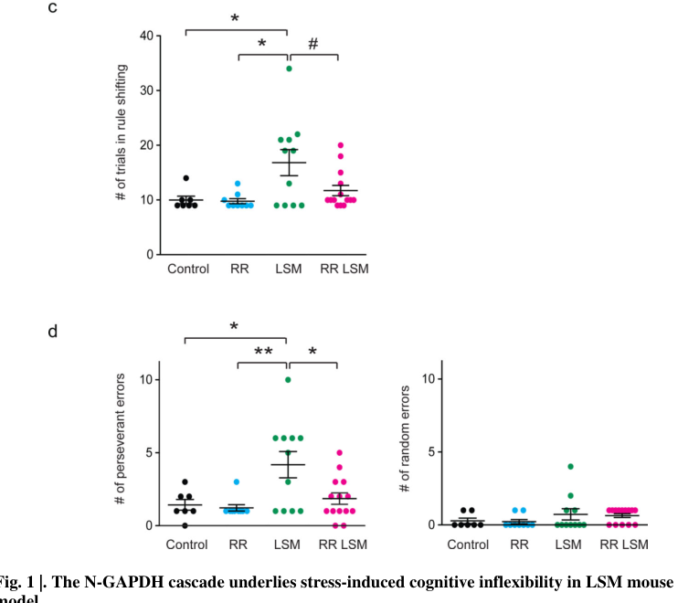

## Question

# Gene Research for Functional Annotation

## ⚠️ CRITICAL: Gene/Protein Identification Context

**BEFORE YOU BEGIN RESEARCH:** You MUST verify you are researching the CORRECT gene/protein. Gene symbols can be ambiguous, especially for less well-characterized genes from non-model organisms.

### Target Gene/Protein Identity (from UniProt):
- **UniProt Accession:** P04406
- **Protein Description:** RecName: Full=Glyceraldehyde-3-phosphate dehydrogenase {ECO:0000303|PubMed:6096136}; Short=GAPDH {ECO:0000303|PubMed:2987855}; EC=1.2.1.12 {ECO:0000269|PubMed:3170585}; AltName: Full=Peptidyl-cysteine S-nitrosylase GAPDH {ECO:0000305}; EC=2.6.99.- {ECO:0000250|UniProtKB:P04797};
- **Gene Information:** Name=GAPDH {ECO:0000303|PubMed:2987855, ECO:0000312|HGNC:HGNC:4141}; Synonyms=GAPD {ECO:0000303|PubMed:6096136}; ORFNames=CDABP0047, OK/SW-cl.12;
- **Organism (full):** Homo sapiens (Human).
- **Protein Family:** Belongs to the glyceraldehyde-3-phosphate dehydrogenase
- **Key Domains:** GlycerAld/Erythrose_P_DH. (IPR020831); GlycerAld_3-P_DH_AS. (IPR020830); GlycerAld_3-P_DH_cat. (IPR020829); GlycerAld_3-P_DH_NAD(P)-bd. (IPR020828); Glyceraldehyde-3-P_DH_1. (IPR006424)

### MANDATORY VERIFICATION STEPS:

1. **Check if the gene symbol "GAPDH" matches the protein description above**
2. **Verify the organism is correct:** Homo sapiens (Human).
3. **Check if protein family/domains align with what you find in literature**
4. **If you find literature for a DIFFERENT gene with the same or similar symbol, STOP**

### If Gene Symbol is Ambiguous or You Cannot Find Relevant Literature:

**DO NOT PROCEED WITH RESEARCH ON A DIFFERENT GENE.** Instead:
- State clearly: "The gene symbol 'GAPDH' is ambiguous or literature is limited for this specific protein"
- Explain what you found (e.g., "Found extensive literature on a different gene with the same symbol in a different organism")
- Describe the protein based ONLY on the UniProt information provided above
- Suggest that the protein function can be inferred from domain/family information

### Research Target:

Please provide a comprehensive research report on the gene **GAPDH** (gene ID: GAPDH, UniProt: P04406) in human.

The research report should be a detailed narrative explaining the function, biological processes, and localization of the gene product. Citations should be given for all claims.

You should prioritize authoritative reviews and primary scientific literature when conducting research. You can supplement
this with annotations you find in gene/protein databases, but these can be outdated or inaccurate.

We are specifically interested in the primary function of the gene - for enzymes, what reaction is catalyzed, and what is the substrate specificity? For transporters, what is the substrate? For structural proteins or adapters, what is the broader structural role? For signaling molecules, what is the role in the pathway.

We are interested in where in or outside the cell the gene product carries out its function.

We are also interested in the signaling or biochemical pathways in which the gene functions. We are less interested in broad pleiotropic effects, except where these elucidate the precise role.

Include evidence where possible. We are interested in both experimental evidence as well as inference from structure, evolution, or bioinformatic analysis. Precise studies should be prioritized over high-throughput, where available.

## Output

Question: You are an expert researcher providing comprehensive, well-cited information.

Provide detailed information focusing on:
1. Key concepts and definitions with current understanding
2. Recent developments and latest research (prioritize 2023-2024 sources)
3. Current applications and real-world implementations
4. Expert opinions and analysis from authoritative sources
5. Relevant statistics and data from recent studies

Format as a comprehensive research report with proper citations. Include URLs and publication dates where available.
Always prioritize recent, authoritative sources and provide specific citations for all major claims.

# Gene Research for Functional Annotation

## ⚠️ CRITICAL: Gene/Protein Identification Context

**BEFORE YOU BEGIN RESEARCH:** You MUST verify you are researching the CORRECT gene/protein. Gene symbols can be ambiguous, especially for less well-characterized genes from non-model organisms.

### Target Gene/Protein Identity (from UniProt):
- **UniProt Accession:** P04406
- **Protein Description:** RecName: Full=Glyceraldehyde-3-phosphate dehydrogenase {ECO:0000303|PubMed:6096136}; Short=GAPDH {ECO:0000303|PubMed:2987855}; EC=1.2.1.12 {ECO:0000269|PubMed:3170585}; AltName: Full=Peptidyl-cysteine S-nitrosylase GAPDH {ECO:0000305}; EC=2.6.99.- {ECO:0000250|UniProtKB:P04797};
- **Gene Information:** Name=GAPDH {ECO:0000303|PubMed:2987855, ECO:0000312|HGNC:HGNC:4141}; Synonyms=GAPD {ECO:0000303|PubMed:6096136}; ORFNames=CDABP0047, OK/SW-cl.12;
- **Organism (full):** Homo sapiens (Human).
- **Protein Family:** Belongs to the glyceraldehyde-3-phosphate dehydrogenase
- **Key Domains:** GlycerAld/Erythrose_P_DH. (IPR020831); GlycerAld_3-P_DH_AS. (IPR020830); GlycerAld_3-P_DH_cat. (IPR020829); GlycerAld_3-P_DH_NAD(P)-bd. (IPR020828); Glyceraldehyde-3-P_DH_1. (IPR006424)

### MANDATORY VERIFICATION STEPS:

1. **Check if the gene symbol "GAPDH" matches the protein description above**
2. **Verify the organism is correct:** Homo sapiens (Human).
3. **Check if protein family/domains align with what you find in literature**
4. **If you find literature for a DIFFERENT gene with the same or similar symbol, STOP**

### If Gene Symbol is Ambiguous or You Cannot Find Relevant Literature:

**DO NOT PROCEED WITH RESEARCH ON A DIFFERENT GENE.** Instead:
- State clearly: "The gene symbol 'GAPDH' is ambiguous or literature is limited for this specific protein"
- Explain what you found (e.g., "Found extensive literature on a different gene with the same symbol in a different organism")
- Describe the protein based ONLY on the UniProt information provided above
- Suggest that the protein function can be inferred from domain/family information

### Research Target:

Please provide a comprehensive research report on the gene **GAPDH** (gene ID: GAPDH, UniProt: P04406) in human.

The research report should be a detailed narrative explaining the function, biological processes, and localization of the gene product. Citations should be given for all claims.

You should prioritize authoritative reviews and primary scientific literature when conducting research. You can supplement
this with annotations you find in gene/protein databases, but these can be outdated or inaccurate.

We are specifically interested in the primary function of the gene - for enzymes, what reaction is catalyzed, and what is the substrate specificity? For transporters, what is the substrate? For structural proteins or adapters, what is the broader structural role? For signaling molecules, what is the role in the pathway.

We are interested in where in or outside the cell the gene product carries out its function.

We are also interested in the signaling or biochemical pathways in which the gene functions. We are less interested in broad pleiotropic effects, except where these elucidate the precise role.

Include evidence where possible. We are interested in both experimental evidence as well as inference from structure, evolution, or bioinformatic analysis. Precise studies should be prioritized over high-throughput, where available.

# Comprehensive Research Report: Human **GAPDH** (UniProt **P04406**)—Functional Annotation, Localization, and Recent Advances (2023–2024)

## 1) Target identity verification (critical)
The target discussed here is **human glyceraldehyde-3-phosphate dehydrogenase (GAPDH)**, **UniProt accession P04406**, a 335-aa (~37 kDa) enzyme belonging to the glyceraldehyde-3-phosphate dehydrogenase family, with an N-terminal NAD+ binding region and a catalytic cysteine in the 150–157 active-site region (levenes2024desrétropseudogènespotentiellement pages 35-39). Multiple recent sources in this evidence set explicitly reference **human GAPDH** and/or **UniProt P04406**, including mechanistic work on nuclear GAPDH signaling and a recent review on GAPDH moonlighting functions (ramos2024nucleargapdhin pages 3-4, lin2024targetingmoonlightingenzymes pages 2-4).

## 2) Key concepts and definitions (current understanding)

### 2.1 Canonical enzymatic function in glycolysis
**Definition/primary function.** GAPDH is a central **glycolytic dehydrogenase** that catalyzes the **NAD+-dependent conversion of glyceraldehyde-3-phosphate (G3P) to 1,3-bisphosphoglycerate (1,3-BPG)** in the glycolytic pathway (lin2024targetingmoonlightingenzymes pages 2-4, levenes2024desrétropseudogènespotentiellement pages 35-39). This is commonly described as an **oxidation and phosphorylation** step coupled to NAD+ reduction.

**Structural/biochemical context.** Human GAPDH is described as catalytically active as a **homotetramer**, with an N-terminal **NAD+ binding domain (residues ~1–150)** and an active-site region in the ~150–157 interval that includes the **catalytic cysteine** (levenes2024desrétropseudogènespotentiellement pages 35-39). In a 2023 human ESC study, GAPDH activity was operationalized/measured as an **“NAD+ conversion rate,”** reinforcing NAD+-linked catalysis in contemporary experimental practice (zhang2023crotonylationofgapdh pages 13-15).

### 2.2 “Moonlighting” functions and compartmentalization
**Definition.** “Moonlighting enzymes” are proteins with **biologically important non-canonical functions** beyond their primary catalytic role; GAPDH is a prototypical example, with functions that depend on **subcellular relocalization**, binding partners, oligomeric state, and PTMs (lin2024targetingmoonlightingenzymes pages 2-4, levenes2024desrétropseudogènespotentiellement pages 35-39).

**Compartment-based functional switching.** A widely studied axis is the **NO / redox-stress → GAPDH PTM → binding to Siah1 → nuclear translocation** cascade (“N-GAPDH” pathway), which separates a small signaling-active pool from bulk glycolytic GAPDH (ramos2024nucleargapdhin pages 3-4).

## 3) Subcellular localization and where GAPDH acts

### 3.1 Cytosol: glycolysis
The canonical glycolytic reaction is associated with cytosolic metabolism (lin2024targetingmoonlightingenzymes pages 2-4, levenes2024desrétropseudogènespotentiellement pages 35-39).

### 3.2 Nucleus: stress signaling and DNA repair
**Nuclear translocation via Siah1.** In a 2024 mechanistic study (Molecular Psychiatry), stressors were reported to trigger an **N-GAPDH cascade** in cortical microglia involving **Cys150 modification (S-nitrosylation or possibly oxidation)** and formation of a **GAPDH–Siah1** complex that translocates to the nucleus (ramos2024nucleargapdhin pages 3-4). A key binding determinant was identified: **K225A substitution abolished GAPDH–Siah1 binding**, supporting a defined interaction surface required for nuclear entry (ramos2024nucleargapdhin pages 3-4).

**Nuclear GAPDH in DNA repair (review synthesis).** A 2024 review summarizes that nuclear GAPDH can be recruited to DNA lesions and interact with **DNA polymerase β**, enhancing base excision repair; it also describes **Src-mediated Tyr41 phosphorylation** as a mechanism promoting nuclear translocation during DNA damage stress (lin2024targetingmoonlightingenzymes pages 2-4).

## 4) Recent developments and latest research (prioritizing 2023–2024)

### 4.1 PTM-driven regulation of catalytic activity and cell fate

**Crotonylation (2023; human ESC differentiation).** A 2023 primary study in human embryonic stem cells identified **GAPDH crotonylation at K194 and K219** and reported that crotonate treatment decreased GAPDH activity by **~50%** (with activity assessed via NAD+-linked readouts), consistent with a metabolic “switch” accompanying endodermal differentiation (zhang2023crotonylationofgapdh pages 13-15). The same work reports that pharmacologic GAPDH inhibition (3-bromo pyruvate) reduced GAPDH activity by **>50%** and coincided with **>30-fold** increases in endoderm markers **GATA6** and **SOX17** (zhang2023crotonylationofgapdh pages 13-15).

**Deacetylation at K219 (2024; viral replication).** In 2024, Song et al. reported that **rotavirus infection** in Caco-2 cells is associated with **HDAC9-mediated deacetylation of GAPDH at lysine 219** observed at **50 hours** post-infection, and that this deacetylation **promoted rotavirus replication** (song2024effectofhdac9induced pages 1-2). The authors mapped a GAPDH peptide carrying an acetylation annotation (AVGK(Acetyl)VIPELNGK) and stated that **K219 was the only modified residue identified on GAPDH** in their infected samples (song2024effectofhdac9induced pages 1-2).

### 4.2 Nuclear GAPDH cascade in brain immune cells and behavior (2024)
Ramos et al. (2024) reported activation of the **N-GAPDH cascade specifically in cortical microglia** in a stress paradigm, linking it to **stress-induced cognitive inflexibility** (ramos2024nucleargapdhin pages 3-4). A key quantitative/interpretive point is that nuclear signaling involves only a **small fraction (~1–2%)** of total cellular GAPDH activity/pool, described as negligible for bulk glycolysis, thereby supporting the concept of a specialized signaling pool distinct from metabolic function (ramos2024nucleargapdhin pages 3-4).

The same study reports that a small-molecule intervention (**RR compound**) can selectively block initiation of the N-GAPDH cascade (without affecting glycolytic activity) and normalize downstream phenotypes (ramos2024nucleargapdhin pages 3-4). Quantitative panels supporting these conclusions (behavioral metrics, binding readouts, neuronal activity, and HMGB1 measures) are shown in the paper’s figures (ramos2024nucleargapdhin media 2c292308, ramos2024nucleargapdhin media 82657fea, ramos2024nucleargapdhin media 00a47cb3, ramos2024nucleargapdhin media 01ec1e21, ramos2024nucleargapdhin media e5be394e).

## 5) Pathways and mechanisms: integrated functional annotation

### 5.1 Glycolysis and metabolic control
GAPDH’s canonical role is the glycolytic conversion of **G3P → 1,3-BPG** (lin2024targetingmoonlightingenzymes pages 2-4, levenes2024desrétropseudogènespotentiellement pages 35-39). Recent work emphasizes that PTMs on GAPDH (e.g., crotonylation, acetylation state changes) can **reprogram glycolytic flux** or coordinate metabolic state transitions in human cell systems (zhang2023crotonylationofgapdh pages 13-15, song2024effectofhdac9induced pages 1-2).

### 5.2 Redox/NO signaling to nucleus (“N-GAPDH” cascade)
Current mechanistic understanding from 2024 evidence supports: (i) stress induces **Cys150 modification** of GAPDH; (ii) modified GAPDH binds **Siah1**; (iii) the complex translocates to the nucleus; and (iv) this cascade can mediate functional brain outcomes through microglia-neuron signaling involving **HMGB1** (ramos2024nucleargapdhin pages 3-4). In this model, RR blocks GAPDH–Siah1 binding and normalizes multiple downstream readouts, as shown in quantitative figure panels (ramos2024nucleargapdhin media 2c292308, ramos2024nucleargapdhin media 82657fea, ramos2024nucleargapdhin media 00a47cb3, ramos2024nucleargapdhin media 01ec1e21, ramos2024nucleargapdhin media e5be394e).

### 5.3 Broader moonlighting repertoire (expert synthesis)
A 2024 synthesis source (French thesis-style) compiles multiple reported moonlighting roles and their PTM control, including nuclear functions (trans-nitrosylation targets such as HDAC2, DNA-PK, SIRT1), interactions with p300 (including acetylation at Lys160), PARP1 interaction/links to PARylation, autophagy regulation (including SIRT1 and Rheb/mTOR-related mechanisms), and RNA binding (AU-rich RNA, tRNA, telomerase RNA, and specific mRNAs) (levenes2024desrétropseudogènespotentiellement pages 35-39, levenes2024desrétropseudogènespotentiellement pages 88-91, levenes2024desrétropseudogènespotentiellement pages 85-88). This source also provides structural-region annotations (NAD+ binding domain and active-site region) supporting the plausibility that redox-active cysteines serve as regulatory PTM sites (levenes2024desrétropseudogènespotentiellement pages 35-39).

## 6) Current applications and real-world implementations

### 6.1 GAPDH as a reference/housekeeping gene and loading control—use with caution
**Why it is used.** GAPDH is typically high-abundance and widely expressed; a 2024 GTEx-based analysis notes that commonly used housekeeping genes such as **GAPDH often have mean expression >45 TPM**, and recommends selecting sufficiently expressed reference genes (preferably TPM >20) for stable normalization (tung2024housekeepingproteincodinggenes pages 8-9).

**Why caution is needed.** A 2023 human ESC study explicitly notes that GAPDH is **abundant and often used as a loading control**, yet emphasizes that GAPDH expression is **tightly regulated and variable across cell types**, cautioning against unvalidated normalization assumptions (zhang2023crotonylationofgapdh pages 13-15). Additionally, a 2024 synthesis source highlights the extensive landscape of GAPDH **pseudogenes** and associated bioinformatic ambiguity (e.g., multi-mapped reads), which can complicate transcript-level quantification and interpretation in expression studies (levenes2024desrétropseudogènespotentiellement pages 82-85, levenes2024desrétropseudogènespotentiellement pages 85-88).

### 6.2 Therapeutic/targeting implications: blocking the N-GAPDH cascade
A notable translational direction is selective inhibition of **GAPDH–Siah1** signaling without inhibiting bulk glycolysis. Ramos et al. report that the RR compound selectively blocks initiation of the N-GAPDH cascade and normalizes behavior and downstream microglia-neuron signaling (ramos2024nucleargapdhin pages 3-4). Quantitative evidence for normalization of behavioral measures, microglial GAPDH–Siah1 binding readout, neuronal hyperactivation, and HMGB1 changes is presented in figure panels (ramos2024nucleargapdhin media 2c292308, ramos2024nucleargapdhin media 82657fea, ramos2024nucleargapdhin media 00a47cb3, ramos2024nucleargapdhin media 01ec1e21, ramos2024nucleargapdhin media e5be394e).

### 6.3 Infection biology: GAPDH PTMs as host–pathogen interaction nodes
The 2024 rotavirus study demonstrates a concrete implementation of GAPDH biology in infection: **HDAC9-driven deacetylation at K219** is reported to favor viral replication and is accompanied by glycolysis-associated functional assays (Seahorse XF Glycolysis Stress Test), connecting enzymatic regulation to pathogen fitness (song2024effectofhdac9induced pages 1-2).

## 7) Expert opinions and authoritative analysis (from 2024 reviews)
A 2024 review frames GAPDH as a prominent moonlighting enzyme in cancer, emphasizing that non-metabolic activities (nuclear translocation and DNA repair modulation) can contribute to tumorigenesis and therapy resistance, and highlighting mechanistic routes including **NO-dependent S-nitrosylation** and **Src-mediated phosphorylation** for nuclear localization control (lin2024targetingmoonlightingenzymes pages 2-4, lin2024targetingmoonlightingenzymes pages 8-9). This perspective supports a current expert consensus that GAPDH’s functional annotation cannot be limited to glycolysis alone, and that PTMs and localization are central to its biology (lin2024targetingmoonlightingenzymes pages 2-4).

## 8) Relevant statistics and quantitative data (from recent studies)

* **Crotonylation impacts catalytic output:** crotonate treatment reduced GAPDH activity by **~50%** in human ESCs; 3-BrPA reduced activity **>50%** and associated with **>30-fold** induction of endoderm markers **GATA6/SOX17** (zhang2023crotonylationofgapdh pages 13-15).
* **Nuclear signaling is a small pool:** nuclear-GAPDH signaling was described as involving only **~1–2%** of total GAPDH, suggesting minimal metabolic disruption despite strong signaling consequences (ramos2024nucleargapdhin pages 3-4).
* **Expression variability across tissues:** example TPM values for GAPDH were reported as **~6385 TPM in lymphocytes** and **~328 TPM in pancreas**, illustrating wide tissue-dependent expression ranges (levenes2024desrétropseudogènespotentiellement pages 35-39).
* **Housekeeping gene thresholds:** a GTEx-based analysis notes mean TPM for commonly used housekeeping genes such as GAPDH often **>45 TPM** and recommends **TPM >20** as a practical threshold for reference-gene selection in some contexts (tung2024housekeepingproteincodinggenes pages 8-9).

## 9) Consolidated functional annotation table (evidence-linked)
The following table summarizes the major supported functions, PTMs, residues, compartments, biological consequences, and key 2023–2024 evidence.

| Function category | Molecular mechanism (reaction/interaction/PTM) | Key residues/PTMs | Subcellular localization/compartment | Biological consequence | Key recent evidence (2023-2024) with DOI URL and date | Citation ID(s) |
|---|---|---|---|---|---|---|
| Canonical glycolysis | NAD+-dependent oxidation/phosphorylation of glyceraldehyde-3-phosphate to 1,3-bisphosphoglycerate; active homotetramer | Catalytic cysteine reported as C150/C152; active-site region 150-157; NAD+-binding domain residues 1-150 | Predominantly cytosol | Core glycolytic ATP-generating pathway function | Lin 2024, *Molecules*, 2024-04, DOI: https://doi.org/10.3390/molecules29071573; Lévénès 2024 thesis-style summary, 2024 | (lin2024targetingmoonlightingenzymes pages 2-4, levenes2024desrétropseudogènespotentiellement pages 35-39) |
| Moonlighting | S-nitrosylation/oxidation at catalytic cysteine enables GAPDH-Siah1 complex formation and nuclear translocation | Cys150; Lys225 required for Siah1 binding (K225A abolishes binding); Lys160 implicated downstream | Cytosol to nucleus | Initiates N-GAPDH cascade linked to apoptosis/stress signaling; in microglia mediates stress-induced cognitive inflexibility | Ramos 2024, *Molecular Psychiatry*, 2024-04, DOI: https://doi.org/10.1038/s41380-024-02553-1; RR blocker used at 1 nM in BV2 cells and 0.25 mg/kg/day i.p. for 5 days in vivo | (ramos2024nucleargapdhin pages 3-4) |
| Moonlighting | Nuclear translocation consumes only a minor fraction of total GAPDH pool | N-GAPDH estimated at 1-2% of total GAPDH | Nuclear microglia (context-specific recent evidence) | Regulatory signaling with negligible impact on bulk glycolysis, supporting separation of moonlighting from metabolic function | Ramos 2024, *Molecular Psychiatry*, 2024-04, DOI: https://doi.org/10.1038/s41380-024-02553-1 | (ramos2024nucleargapdhin pages 3-4) |
| Moonlighting | Nuclear GAPDH participates in DNA damage response/base excision repair via interaction with DNA polymerase beta; Src-mediated phosphorylation promotes nuclear entry under DNA damage | Tyr41 phosphorylation (Src-mediated) | Nucleus, DNA lesion sites | Enhances Pol beta polymerase activity and BER; may support tumor progression | Lin 2024, *Molecules*, 2024-04, DOI: https://doi.org/10.3390/molecules29071573 | (lin2024targetingmoonlightingenzymes pages 2-4, lin2024targetingmoonlightingenzymes pages 8-9) |
| Moonlighting | Trans-nitrosylase and stress-signaling hub; interacts with p300, PARP1, SIRT1, HDAC2, DNA-PK and others after PTM-driven relocalization | S-nitrosylation; sulfhydration; O-GlcNAcylation at Thr227; acetylation at Lys160; PARylation-related interactions | Nucleus and cytosol | Links redox stress to transcriptional regulation, autophagy, PARP1 activation, and cell death/survival decisions | Lévénès 2024 thesis-style summary, 2024 | (levenes2024desrétropseudogènespotentiellement pages 35-39, levenes2024desrétropseudogènespotentiellement pages 88-91, levenes2024desrétropseudogènespotentiellement pages 85-88) |
| Moonlighting | RNA-binding/transcript-regulatory functions | RNA interactions noted with AU-rich RNA, tRNA, telomerase RNA, and ccn2 mRNA cis-element | Cytosol and nucleus | Post-transcriptional regulation beyond glycolysis | Lévénès 2024 thesis-style summary, 2024 | (levenes2024desrétropseudogènespotentiellement pages 88-91, levenes2024desrétropseudogènespotentiellement pages 85-88) |
| Moonlighting | PTM-driven autophagy regulation | Sulfhydration; O-GlcNAcylation; interactions involving SIRT1 and Rheb/mTOR pathways | Cytosol to nucleus | Can promote autophagy and metabolic stress adaptation | Lévénès 2024 thesis-style summary, 2024 | (levenes2024desrétropseudogènespotentiellement pages 35-39, levenes2024desrétropseudogènespotentiellement pages 85-88) |
| Canonical glycolysis / PTM-regulated | Crotonylation decreases catalytic activity in human ESCs | Crotonylation at K194 and K219; p300 acts as crotonyltransferase in presence of crotonyl-CoA | Not explicitly localized in snippet | Reduced glycolysis accompanies endodermal differentiation/metabolic switch | Zhang 2023, *Stem Cell Research & Therapy*, 2023-04, DOI: https://doi.org/10.1186/s13287-023-03290-y; crotonate lowered GAPDH activity by ~50%; 3-BrPA lowered activity by >50% and increased GATA6/SOX17 >30-fold | (zhang2023crotonylationofgapdh pages 13-15) |
| Canonical glycolysis / PTM-regulated | HDAC9-mediated deacetylation during rotavirus infection | K219 deacetylation; modified peptide AVGK(Acetyl)VIPELNGK; K219 was the only modified residue identified in sample | Caco-2 cell context; compartment not specified in snippet | Promotes rotavirus replication and alters glycolysis | Song 2024, *Virus Genes*, 2024-09, DOI: https://doi.org/10.1007/s11262-024-02104-4; observed 50 h after infection; glycolysis/gluconeogenesis among 17 enriched glycometabolism pathways; implicated set accounted for 42.08% of proteins in the cell dataset | (song2024effectofhdac9induced pages 1-2, song2024effectofhdac9induced pages 12-13) |
| Expression/implementation note | Highly expressed housekeeping/reference gene candidate, but expression stability depends on tissue/condition; pseudogenes complicate interpretation | Mean TPM often >45 for GAPDH; recommended highly expressed RGs >20 TPM; pseudogene/multi-mapping concerns noted | Broad tissue expression | Useful but not universal normalization control; requires validation in specific experimental settings | Tung 2024, *Scientific Reports*, 2024-05, DOI: https://doi.org/10.1038/s41598-024-63269-4; Zhang 2023 cautions GAPDH expression is tightly regulated/variable; Lévénès 2024 cites pseudogene-expression concerns | (tung2024housekeepingproteincodinggenes pages 8-9, zhang2023crotonylationofgapdh pages 13-15, levenes2024desrétropseudogènespotentiellement pages 82-85) |
| Expression/implementation note | Abundant expression varies by tissue | Example TPM values reported for human GAPDH: lymphocytes 6385 TPM, pancreas 328 TPM | Ubiquitous across tissues | Reinforces strong baseline expression but also substantial tissue-dependent range | Lévénès 2024 thesis-style summary, 2024 | (levenes2024desrétropseudogènespotentiellement pages 35-39) |

*Table: This table summarizes supported canonical and moonlighting functions of human GAPDH (UniProt P04406), highlighting key PTMs, localizations, biological effects, and recent 2023-2024 evidence. It is useful as a compact annotation aid for distinguishing core glycolytic activity from stress-responsive regulatory roles and for noting practical assay caveats.*

## 10) Evidence limitations and scope notes
* The evidence set here supports the **reaction-level canonical function** (G3P → 1,3-BPG; NAD+ involvement) and **several 2023–2024 regulatory/PTM findings**, but does not provide detailed kinetic constants (kcat/Km) within the retrieved excerpts; those would require dedicated enzymology papers not captured in this run (lin2024targetingmoonlightingenzymes pages 2-4, levenes2024desrétropseudogènespotentiellement pages 35-39, zhang2023crotonylationofgapdh pages 13-15).
* Some moonlighting functions (e.g., extensive RNA-binding repertoires and additional PTMs) are summarized via a 2024 synthesis document rather than directly demonstrated in the included 2023–2024 primary studies; these are therefore best interpreted as a curated mechanistic map requiring primary-source follow-up for each specific interaction (levenes2024desrétropseudogènespotentiellement pages 35-39, levenes2024desrétropseudogènespotentiellement pages 88-91, levenes2024desrétropseudogènespotentiellement pages 85-88).

References

1. (levenes2024desrétropseudogènespotentiellement pages 35-39): A Lévénès. Des rétropseudogènes potentiellement impliqués dans la plurifonctionnalité décrite chez gapdh. Unknown journal, 2024.

2. (ramos2024nucleargapdhin pages 3-4): Adriana Ramos, Koko Ishizuka, Arisa Hayashida, Ho Namkung, Lindsay N. Hayes, Rupali Srivastava, Manling Zhang, Taro Kariya, Noah Elkins, Trexy Palen, Elisa Carloni, Tsuyoshi Tsujimura, Coleman Calva, Satoshi Ikemoto, Rana Rais, Barbara S. Slusher, Minae Niwa, Atsushi Saito, Toshiaki Saitoh, Eiki Takimoto, and Akira Sawa. Nuclear gapdh in cortical microglia mediates cellular stress-induced cognitive inflexibility. Molecular psychiatry, 29:2967-2978, Apr 2024. URL: https://doi.org/10.1038/s41380-024-02553-1, doi:10.1038/s41380-024-02553-1. This article has 11 citations and is from a highest quality peer-reviewed journal.

3. (lin2024targetingmoonlightingenzymes pages 2-4): Chunxu Lin, Mingyang Yu, Ximei Wu, Hui Wang, Min Wei, and Luyong Zhang. Targeting moonlighting enzymes in cancer. Molecules, 29:1573, Apr 2024. URL: https://doi.org/10.3390/molecules29071573, doi:10.3390/molecules29071573. This article has 5 citations.

4. (zhang2023crotonylationofgapdh pages 13-15): Jingran Zhang, Guang Shi, Junjie Pang, Xing Zhu, Qingcai Feng, Jie Na, Wenbin Ma, Dan Liu, and Zhou Songyang. Crotonylation of gapdh regulates human embryonic stem cell endodermal lineage differentiation and metabolic switch. Stem Cell Research & Therapy, Apr 2023. URL: https://doi.org/10.1186/s13287-023-03290-y, doi:10.1186/s13287-023-03290-y. This article has 12 citations and is from a peer-reviewed journal.

5. (song2024effectofhdac9induced pages 1-2): Lijun Song, Peicheng Zhong, Runyu Yu, Yue Yuan, Yujing Zhou, Yupei Qian, Siyan Yang, Haosen Yi, Zhiyan Yang, and Wenchang Zhao. Effect of hdac9-induced deacetylation of glycolysis-related gapdh lysine 219 on rotavirus replication in rotavirus-infected caco-2 cells. Virus Genes, 60:621-634, Sep 2024. URL: https://doi.org/10.1007/s11262-024-02104-4, doi:10.1007/s11262-024-02104-4. This article has 3 citations and is from a peer-reviewed journal.

6. (ramos2024nucleargapdhin media 2c292308): Adriana Ramos, Koko Ishizuka, Arisa Hayashida, Ho Namkung, Lindsay N. Hayes, Rupali Srivastava, Manling Zhang, Taro Kariya, Noah Elkins, Trexy Palen, Elisa Carloni, Tsuyoshi Tsujimura, Coleman Calva, Satoshi Ikemoto, Rana Rais, Barbara S. Slusher, Minae Niwa, Atsushi Saito, Toshiaki Saitoh, Eiki Takimoto, and Akira Sawa. Nuclear gapdh in cortical microglia mediates cellular stress-induced cognitive inflexibility. Molecular psychiatry, 29:2967-2978, Apr 2024. URL: https://doi.org/10.1038/s41380-024-02553-1, doi:10.1038/s41380-024-02553-1. This article has 11 citations and is from a highest quality peer-reviewed journal.

7. (ramos2024nucleargapdhin media 82657fea): Adriana Ramos, Koko Ishizuka, Arisa Hayashida, Ho Namkung, Lindsay N. Hayes, Rupali Srivastava, Manling Zhang, Taro Kariya, Noah Elkins, Trexy Palen, Elisa Carloni, Tsuyoshi Tsujimura, Coleman Calva, Satoshi Ikemoto, Rana Rais, Barbara S. Slusher, Minae Niwa, Atsushi Saito, Toshiaki Saitoh, Eiki Takimoto, and Akira Sawa. Nuclear gapdh in cortical microglia mediates cellular stress-induced cognitive inflexibility. Molecular psychiatry, 29:2967-2978, Apr 2024. URL: https://doi.org/10.1038/s41380-024-02553-1, doi:10.1038/s41380-024-02553-1. This article has 11 citations and is from a highest quality peer-reviewed journal.

8. (ramos2024nucleargapdhin media 00a47cb3): Adriana Ramos, Koko Ishizuka, Arisa Hayashida, Ho Namkung, Lindsay N. Hayes, Rupali Srivastava, Manling Zhang, Taro Kariya, Noah Elkins, Trexy Palen, Elisa Carloni, Tsuyoshi Tsujimura, Coleman Calva, Satoshi Ikemoto, Rana Rais, Barbara S. Slusher, Minae Niwa, Atsushi Saito, Toshiaki Saitoh, Eiki Takimoto, and Akira Sawa. Nuclear gapdh in cortical microglia mediates cellular stress-induced cognitive inflexibility. Molecular psychiatry, 29:2967-2978, Apr 2024. URL: https://doi.org/10.1038/s41380-024-02553-1, doi:10.1038/s41380-024-02553-1. This article has 11 citations and is from a highest quality peer-reviewed journal.

9. (ramos2024nucleargapdhin media 01ec1e21): Adriana Ramos, Koko Ishizuka, Arisa Hayashida, Ho Namkung, Lindsay N. Hayes, Rupali Srivastava, Manling Zhang, Taro Kariya, Noah Elkins, Trexy Palen, Elisa Carloni, Tsuyoshi Tsujimura, Coleman Calva, Satoshi Ikemoto, Rana Rais, Barbara S. Slusher, Minae Niwa, Atsushi Saito, Toshiaki Saitoh, Eiki Takimoto, and Akira Sawa. Nuclear gapdh in cortical microglia mediates cellular stress-induced cognitive inflexibility. Molecular psychiatry, 29:2967-2978, Apr 2024. URL: https://doi.org/10.1038/s41380-024-02553-1, doi:10.1038/s41380-024-02553-1. This article has 11 citations and is from a highest quality peer-reviewed journal.

10. (ramos2024nucleargapdhin media e5be394e): Adriana Ramos, Koko Ishizuka, Arisa Hayashida, Ho Namkung, Lindsay N. Hayes, Rupali Srivastava, Manling Zhang, Taro Kariya, Noah Elkins, Trexy Palen, Elisa Carloni, Tsuyoshi Tsujimura, Coleman Calva, Satoshi Ikemoto, Rana Rais, Barbara S. Slusher, Minae Niwa, Atsushi Saito, Toshiaki Saitoh, Eiki Takimoto, and Akira Sawa. Nuclear gapdh in cortical microglia mediates cellular stress-induced cognitive inflexibility. Molecular psychiatry, 29:2967-2978, Apr 2024. URL: https://doi.org/10.1038/s41380-024-02553-1, doi:10.1038/s41380-024-02553-1. This article has 11 citations and is from a highest quality peer-reviewed journal.

11. (levenes2024desrétropseudogènespotentiellement pages 88-91): A Lévénès. Des rétropseudogènes potentiellement impliqués dans la plurifonctionnalité décrite chez gapdh. Unknown journal, 2024.

12. (levenes2024desrétropseudogènespotentiellement pages 85-88): A Lévénès. Des rétropseudogènes potentiellement impliqués dans la plurifonctionnalité décrite chez gapdh. Unknown journal, 2024.

13. (tung2024housekeepingproteincodinggenes pages 8-9): Kuo-Feng Tung, Chao-Yu Pan, and Wen-chang Lin. Housekeeping protein-coding genes interrogated with tissue and individual variations. Scientific Reports, May 2024. URL: https://doi.org/10.1038/s41598-024-63269-4, doi:10.1038/s41598-024-63269-4. This article has 14 citations and is from a peer-reviewed journal.

14. (levenes2024desrétropseudogènespotentiellement pages 82-85): A Lévénès. Des rétropseudogènes potentiellement impliqués dans la plurifonctionnalité décrite chez gapdh. Unknown journal, 2024.

15. (lin2024targetingmoonlightingenzymes pages 8-9): Chunxu Lin, Mingyang Yu, Ximei Wu, Hui Wang, Min Wei, and Luyong Zhang. Targeting moonlighting enzymes in cancer. Molecules, 29:1573, Apr 2024. URL: https://doi.org/10.3390/molecules29071573, doi:10.3390/molecules29071573. This article has 5 citations.

16. (song2024effectofhdac9induced pages 12-13): Lijun Song, Peicheng Zhong, Runyu Yu, Yue Yuan, Yujing Zhou, Yupei Qian, Siyan Yang, Haosen Yi, Zhiyan Yang, and Wenchang Zhao. Effect of hdac9-induced deacetylation of glycolysis-related gapdh lysine 219 on rotavirus replication in rotavirus-infected caco-2 cells. Virus Genes, 60:621-634, Sep 2024. URL: https://doi.org/10.1007/s11262-024-02104-4, doi:10.1007/s11262-024-02104-4. This article has 3 citations and is from a peer-reviewed journal.

## Artifacts

- [Edison artifact artifact-00](GAPDH-deep-research-falcon_artifacts/artifact-00.md)

## Citations

1. zhang2023crotonylationofgapdh pages 13-15
2. ramos2024nucleargapdhin pages 3-4
3. lin2024targetingmoonlightingenzymes pages 2-4
4. tung2024housekeepingproteincodinggenes pages 8-9
5. lin2024targetingmoonlightingenzymes pages 8-9
6. https://doi.org/10.3390/molecules29071573;
7. https://doi.org/10.1038/s41380-024-02553-1;
8. https://doi.org/10.1038/s41380-024-02553-1
9. https://doi.org/10.3390/molecules29071573
10. https://doi.org/10.1186/s13287-023-03290-y;
11. https://doi.org/10.1007/s11262-024-02104-4;
12. https://doi.org/10.1038/s41598-024-63269-4;
13. https://doi.org/10.1038/s41380-024-02553-1,
14. https://doi.org/10.3390/molecules29071573,
15. https://doi.org/10.1186/s13287-023-03290-y,
16. https://doi.org/10.1007/s11262-024-02104-4,
17. https://doi.org/10.1038/s41598-024-63269-4,