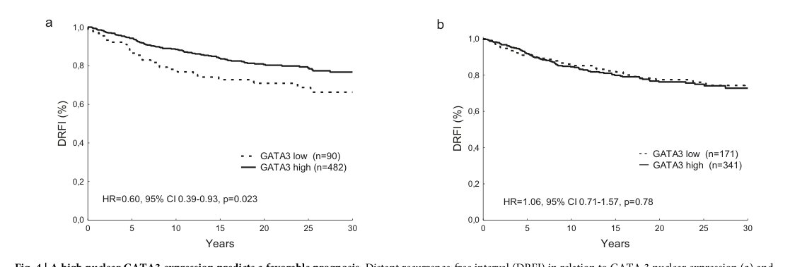

## Question

# Gene Research for Functional Annotation

## ⚠️ CRITICAL: Gene/Protein Identification Context

**BEFORE YOU BEGIN RESEARCH:** You MUST verify you are researching the CORRECT gene/protein. Gene symbols can be ambiguous, especially for less well-characterized genes from non-model organisms.

### Target Gene/Protein Identity (from UniProt):
- **UniProt Accession:** P23771
- **Protein Description:** RecName: Full=Trans-acting T-cell-specific transcription factor GATA-3; AltName: Full=GATA-binding factor 3;
- **Gene Information:** Name=GATA3;
- **Organism (full):** Homo sapiens (Human).
- **Protein Family:** Not specified in UniProt
- **Key Domains:** TF_GATA-2/3. (IPR016374); Transcription_factor_GATA. (IPR039355); Znf_GATA. (IPR000679); Znf_NHR/GATA. (IPR013088); GATA (PF00320)

### MANDATORY VERIFICATION STEPS:

1. **Check if the gene symbol "GATA3" matches the protein description above**
2. **Verify the organism is correct:** Homo sapiens (Human).
3. **Check if protein family/domains align with what you find in literature**
4. **If you find literature for a DIFFERENT gene with the same or similar symbol, STOP**

### If Gene Symbol is Ambiguous or You Cannot Find Relevant Literature:

**DO NOT PROCEED WITH RESEARCH ON A DIFFERENT GENE.** Instead:
- State clearly: "The gene symbol 'GATA3' is ambiguous or literature is limited for this specific protein"
- Explain what you found (e.g., "Found extensive literature on a different gene with the same symbol in a different organism")
- Describe the protein based ONLY on the UniProt information provided above
- Suggest that the protein function can be inferred from domain/family information

### Research Target:

Please provide a comprehensive research report on the gene **GATA3** (gene ID: GATA3, UniProt: P23771) in human.

The research report should be a detailed narrative explaining the function, biological processes, and localization of the gene product. Citations should be given for all claims.

You should prioritize authoritative reviews and primary scientific literature when conducting research. You can supplement
this with annotations you find in gene/protein databases, but these can be outdated or inaccurate.

We are specifically interested in the primary function of the gene - for enzymes, what reaction is catalyzed, and what is the substrate specificity? For transporters, what is the substrate? For structural proteins or adapters, what is the broader structural role? For signaling molecules, what is the role in the pathway.

We are interested in where in or outside the cell the gene product carries out its function.

We are also interested in the signaling or biochemical pathways in which the gene functions. We are less interested in broad pleiotropic effects, except where these elucidate the precise role.

Include evidence where possible. We are interested in both experimental evidence as well as inference from structure, evolution, or bioinformatic analysis. Precise studies should be prioritized over high-throughput, where available.

## Output

Question: You are an expert researcher providing comprehensive, well-cited information.

Provide detailed information focusing on:
1. Key concepts and definitions with current understanding
2. Recent developments and latest research (prioritize 2023-2024 sources)
3. Current applications and real-world implementations
4. Expert opinions and analysis from authoritative sources
5. Relevant statistics and data from recent studies

Format as a comprehensive research report with proper citations. Include URLs and publication dates where available.
Always prioritize recent, authoritative sources and provide specific citations for all major claims.

# Gene Research for Functional Annotation

## ⚠️ CRITICAL: Gene/Protein Identification Context

**BEFORE YOU BEGIN RESEARCH:** You MUST verify you are researching the CORRECT gene/protein. Gene symbols can be ambiguous, especially for less well-characterized genes from non-model organisms.

### Target Gene/Protein Identity (from UniProt):
- **UniProt Accession:** P23771
- **Protein Description:** RecName: Full=Trans-acting T-cell-specific transcription factor GATA-3; AltName: Full=GATA-binding factor 3;
- **Gene Information:** Name=GATA3;
- **Organism (full):** Homo sapiens (Human).
- **Protein Family:** Not specified in UniProt
- **Key Domains:** TF_GATA-2/3. (IPR016374); Transcription_factor_GATA. (IPR039355); Znf_GATA. (IPR000679); Znf_NHR/GATA. (IPR013088); GATA (PF00320)

### MANDATORY VERIFICATION STEPS:

1. **Check if the gene symbol "GATA3" matches the protein description above**
2. **Verify the organism is correct:** Homo sapiens (Human).
3. **Check if protein family/domains align with what you find in literature**
4. **If you find literature for a DIFFERENT gene with the same or similar symbol, STOP**

### If Gene Symbol is Ambiguous or You Cannot Find Relevant Literature:

**DO NOT PROCEED WITH RESEARCH ON A DIFFERENT GENE.** Instead:
- State clearly: "The gene symbol 'GATA3' is ambiguous or literature is limited for this specific protein"
- Explain what you found (e.g., "Found extensive literature on a different gene with the same symbol in a different organism")
- Describe the protein based ONLY on the UniProt information provided above
- Suggest that the protein function can be inferred from domain/family information

### Research Target:

Please provide a comprehensive research report on the gene **GATA3** (gene ID: GATA3, UniProt: P23771) in human.

The research report should be a detailed narrative explaining the function, biological processes, and localization of the gene product. Citations should be given for all claims.

You should prioritize authoritative reviews and primary scientific literature when conducting research. You can supplement
this with annotations you find in gene/protein databases, but these can be outdated or inaccurate.

We are specifically interested in the primary function of the gene - for enzymes, what reaction is catalyzed, and what is the substrate specificity? For transporters, what is the substrate? For structural proteins or adapters, what is the broader structural role? For signaling molecules, what is the role in the pathway.

We are interested in where in or outside the cell the gene product carries out its function.

We are also interested in the signaling or biochemical pathways in which the gene functions. We are less interested in broad pleiotropic effects, except where these elucidate the precise role.

Include evidence where possible. We are interested in both experimental evidence as well as inference from structure, evolution, or bioinformatic analysis. Precise studies should be prioritized over high-throughput, where available.

# Research Report: Human **GATA3** (UniProt **P23771**) — Functional Annotation and Translational Relevance

## 1. Target verification (critical identity check)

The UniProt accession **P23771** corresponds to **human GATA3 (GATA-binding factor 3)**, a **sequence-specific transcription factor** in the GATA family. Recent literature consistently describes GATA3 as a **dual zinc-finger DNA-binding transcription factor** that recognizes canonical GATA motifs (e.g., **WGATAR** / (A/T)GATA(A/G)) and functions in immune and epithelial differentiation programs, aligning with the UniProt-provided domain expectation (C4 zinc-finger TF with transcription factor activity). (bacha2024unveilinggata3signaling pages 1-2, bota2024acomprehensiveanalysis pages 1-2)

## 2. Key concepts and definitions (current understanding)

### 2.1 Molecular function: sequence-specific transcription factor
GATA3 is defined as a **GATA-family transcription factor** that binds DNA at **GATA-containing motifs** and regulates gene expression programs controlling differentiation and cell identity. In immune biology, it is widely treated as a **lineage-determining transcription factor (LDTF)** for type 2 immunity. (bacha2024unveilinggata3signaling pages 1-2, szeto2024molecularmechanismsregulating pages 3-5)

### 2.2 “Lineage-determining” and “pioneer factor” concepts
A major conceptual framework in 2023–2024 literature is that LDTFs such as GATA3 can shape chromatin accessibility and 3D genome architecture to establish stable cell-type gene programs. In clinical pathology-oriented work, GATA factors are explicitly discussed as having **pioneer activity** (binding inaccessible chromatin and promoting chromatin opening), which is consistent with mechanistic reprogramming and enhancer-licensing models. (bota2024acomprehensiveanalysis pages 1-2, saotome2024genomictranscriptionfactor pages 1-2)

### 2.3 Subcellular localization (where GATA3 acts)
As a transcription factor, GATA3’s functional site is the **nucleus**, and multiple 2024 studies operationalize this by measuring **nuclear GATA3** directly:
- In ER-positive breast cancer, GATA3 is assessed by **nuclear immunohistochemistry (IHC)** and reported as “high nuclear GATA3 expression” in outcome models. (sandstrom2024gata3andmarkers pages 1-2, sandstrom2024gata3andmarkers pages 2-3)
- In breast cancer models, androgen receptor (AR) activation increased **nuclear AR–GATA3 interactions**, again demonstrating nuclear localization during function. (hosseinzadeh2024theandrogenreceptor pages 1-3)

## 3. Core biological roles and pathways (mechanism-focused)

## 3.1 Type 2 immunity: Th2 differentiation
GATA3 is consistently positioned as the **master transcription factor** for **T helper 2 (Th2)** differentiation and type 2 cytokine programs. (bacha2024unveilinggata3signaling pages 1-2, szeto2024molecularmechanismsregulating pages 3-5)

### Upstream regulation of GATA3 in Th2 cells
2024 reviews emphasize multiple upstream cues that induce or stabilize GATA3:
- **IL-4/STAT6** is described as a major driver of Th2 polarization, with additional inputs including **TCR**, **IL-2**, **IL-7**, and **NOTCH** signaling. (szeto2024molecularmechanismsregulating pages 3-5)
- Broader integrative signaling is also summarized via **IL-2 and IL-4**, with **Wnt and Notch** pathways discussed as part of the regulatory network supporting type 2 immunity and Th2 stability. (bacha2024unveilinggata3signaling pages 1-2)

### Cis-regulatory control: distal enhancers and chromatin looping (2024 primary evidence)
A key 2024 advance is direct functional dissection of a distal enhancer region associated with allergic disease genetics:
- Kumagai et al. (PNAS, **published Jun 26, 2024**) describe an asthma-associated SNP-enriched region **~926–970 kb downstream** of human GATA3 (**hG900**) and show that activation of enhancers within hG900 correlates with GATA3 levels in human peripheral blood T cells; in mice, deletion of the homologous region (**mG900KO**) impaired **in vivo Th2 differentiation** and reduced **HDM-induced allergic airway inflammation**. (kumagai2024adistalenhancer pages 1-2)
- Mechanistically, **4C-seq** showed long-range **chromatin looping** between **mG900 and the Gata3 transcription start site** in Th2 cells, supporting a 3D-genome basis for stage- and context-specific Gata3 induction. (kumagai2024adistalenhancer pages 6-7)

These data strengthen the view that **distal enhancer activation and 3D chromatin contacts are causally required** for physiological (in vivo) Th2 differentiation in allergic inflammation models. (kumagai2024adistalenhancer pages 4-6)

## 3.2 Innate type 2 immunity: ILC2 development
GATA3 is also essential for type 2 innate lymphoid cell (ILC2) development and maintenance; importantly, the regulation of GATA3 in ILC2 can be **distinct** from Th2 regulation (e.g., ILC2 development can be IL-4/STAT6-independent). (furuya2024stagespecificgata3induction pages 1-2)

### ILC2-specific super-enhancer control of high GATA3 (2024 primary evidence)
Furuya et al. (Nature Communications, **published Jul 2024**) identify **ILC2-specific tandem GATA3-related super-enhancers (G3SE)** that drive high GATA3 expression in late ILC2-committed precursors:
- **G3SE-deficient mice** exhibited **ILC2 deficiency** in bone marrow and peripheral tissues (lung, liver, small intestine) with minimal impact on other ILC lineages or Th2 cells. (furuya2024stagespecificgata3induction pages 1-2)
- A quantitative developmental phenotype was reported: **IL17RB+PD-1− late ILC2-committed precursors accumulated ~6-fold** in G3SEKO mice, consistent with failure to transition into the ST2+ ILC2 stage. (furuya2024stagespecificgata3induction pages 5-6)

Together with the Th2 enhancer work above, these studies support a model in which GATA3 levels are tuned by **cell-type-specific enhancer / super-enhancer logic** to control lineage entry and maturation. (furuya2024stagespecificgata3induction pages 1-2, kumagai2024adistalenhancer pages 4-6)

## 3.3 Chromatin architecture and enhancer licensing (expert synthesis + recent mechanistic work)
Multiple 2024 sources converge on GATA3 as a regulator of genome organization and enhancer activity:
- A 2024 immunology review summarizes evidence that GATA3 contributes to **chromatin loop formation** at type 2 loci and that its deletion can reduce loops in Th2 cells, integrating enhancer activity with 3D architecture. (szeto2024molecularmechanismsregulating pages 3-5)
- Independently, Saotome et al. (Nucleic Acids Research, **Advance access Jan 28, 2024**) frame GATA3 as a **pioneer factor** in cellular reprogramming experiments; they show CHD4/NuRD can restrain inappropriate chromatin opening by promoting nucleosome positioning over GATA3 motifs, supporting a “proofreading” model for transcription factor binding specificity during reprogramming. (saotome2024genomictranscriptionfactor pages 1-2)

## 3.4 Mammary/luminal epithelial differentiation and breast cancer
GATA3 is a core determinant of luminal epithelial identity in breast biology and is frequently used as a marker of luminal differentiation state. (sandstrom2024gata3andmarkers pages 1-2, bacha2024unveilinggata3signaling pages 1-2)

### AR–GATA3 interaction promotes luminal differentiation programs (2024 primary evidence)
Hosseinzadeh et al. (Genome Biology, **published Feb 2024**) report that GATA3 is an endogenous AR-interacting protein in breast cancer cells:
- AR activation (DHT) increased **nuclear AR–GATA3 interactions** and produced AR-dependent enrichment of GATA3 chromatin binding at a subset of loci.
- AR/GATA3 co-occupancy coincided with upregulation of luminal differentiation genes including **EHF** and **KDM4B**, and was associated with AR-mediated growth inhibition. (hosseinzadeh2024theandrogenreceptor pages 1-3)

### Post-translational regulation (recent review synthesis)
A 2024 review describes a specific post-translational regulatory axis relevant to breast cancer cell state:
- **AKT activation** and high **14-3-3τ** levels were reported to lead to **GATA3 phosphorylation**, disrupting transcriptional control and promoting a basal-like phenotype. (bacha2024unveilinggata3signaling pages 4-6)

## 3.5 Urothelial differentiation and bladder cancer subtyping (clinical translation)
GATA3 is widely used in **urothelial carcinoma** as a luminal differentiation marker in IHC panels for molecular subtyping surrogates.
- A 2024 urothelial carcinoma cohort (n=40) used a **20% positivity cut-off** for IHC markers including **GATA3** to support basal/luminal classification; in that cohort, GATA3 alone was not significantly associated with clinicopathological parameters, but the panel-based approach supported subtype assignment with basal tumors correlating with poor prognostic parameters. (yassen2024immunohistochemicalexpressionof pages 1-2)

## 4. Recent developments and “latest research” emphasis (2023–2024)

The most notable 2024 developments in GATA3 functional annotation across tissues are:
1) **Enhancer-to-promoter looping** as a mechanistic basis for in vivo Th2 differentiation and allergic inflammation (hG900/mG900 region). (kumagai2024adistalenhancer pages 1-2, kumagai2024adistalenhancer pages 6-7)
2) **ILC2-specific super-enhancers (G3SE)** enabling stage-specific, high-level GATA3 induction required for ILC2 lineage entry. (furuya2024stagespecificgata3induction pages 1-2, furuya2024stagespecificgata3induction pages 5-6)
3) Integration of GATA3 into a broader concept of **3D genome regulation** and pioneer-factor-controlled enhancer licensing, including chromatin remodeler constraints (CHD4/NuRD). (szeto2024molecularmechanismsregulating pages 3-5, saotome2024genomictranscriptionfactor pages 1-2)
4) New mechanistic links between GATA3 and hormone receptor programs (AR–GATA3) supporting luminal differentiation states in breast cancer. (hosseinzadeh2024theandrogenreceptor pages 1-3)

## 5. Current applications and real-world implementations

## 5.1 Breast cancer: prognostic and predictive biomarker for endocrine benefit
Sandström et al. (NPJ Breast Cancer; **published Sep 2024**) evaluated tumoral GATA3 by nuclear IHC and microarray mRNA in a randomized tamoxifen trial cohort:
- **Prognosis:** High nuclear GATA3 was associated with a lower rate of distant recurrence in ER-positive breast cancer (**HR = 0.60, 95% CI 0.39–0.93**). (sandstrom2024gata3andmarkers pages 1-2)
- **Prediction of tamoxifen benefit:** Patients with intermediate-to-high GATA3 mRNA showed significant benefit (**HR = 0.39, 95% CI 0.24–0.64**), while the bottom tertile showed less evident benefit (**HR = 0.61, 95% CI 0.31–1.17**; interaction p=0.033). (sandstrom2024gata3andmarkers pages 4-5)
- **Late benefit:** Among patients recurrence-free at 5 years, there was **no further benefit** in low GATA3 (HR 1.10, 95% CI 0.46–2.61) compared to higher GATA3 (HR 0.35, 95% CI 0.19–0.64). (sandstrom2024gata3andmarkers pages 4-5)
- **Prevalence:** In this cohort, **70%** of tumors exhibited high nuclear GATA3; among ER-positive tumors, high nuclear GATA3 was present in **84%** vs **19%** of ER-negative tumors. (sandstrom2024gata3andmarkers pages 3-4)

The paper’s visual figures/tables supporting these HRs and cutoffs were retrieved (see cited image context). (sandstrom2024gata3andmarkers media 31d7f67c, sandstrom2024gata3andmarkers media f957f132, sandstrom2024gata3andmarkers media 60a0dcdf, sandstrom2024gata3andmarkers media 9ea27fba)

## 5.2 Diagnostic pathology: GATA3 IHC sensitivity in breast vs urothelial origin
A 2024 cross-tumor IHC analysis quantified the prevalence of GATA3 expression:
- **All primary** and **93% of metastatic** urinary bladder/renal pelvis carcinomas expressed GATA3.
- **94% of primary** and **80% of metastatic** breast carcinomas expressed GATA3.
These data support GATA3’s real-world use as a marker of urothelial and breast origin while also highlighting caveats of cut-off selection. (bota2024acomprehensiveanalysis pages 1-2)

## 5.3 Urothelial carcinoma: IHC-based molecular subtyping and outcome modeling
- UTUC profiling work used IHC including **GATA3** to support luminal-basal stratification and linked clinical scenarios (UTUC with synchronous/metachronous bladder cancer) to progression risk (**PFS HR 3.570, 95% CI 1.508–8.453, p=0.004**), illustrating how GATA3-containing panels are used in translational practice. (meireles2024biomarkerprofilingof pages 1-2)

## 6. Expert opinions and authoritative synthesis (2024 reviews)

Two 2024 reviews provide a high-level expert synthesis that contextualizes GATA3 across immune and disease biology:
- Bacha et al. (Cells; **Dec 2024**) emphasize GATA3 as a central differentiation regulator in immunity (Th2) and tissue biology and discuss disease linkages and therapeutic modulation strategies (e.g., nucleic-acid-based knockdown approaches). (bacha2024unveilinggata3signaling pages 1-2)
- Szeto et al. (Current Opinion in Immunology; **Dec 2024**) synthesize upstream signaling (IL-4/STAT6, TCR, IL-2/IL-7, NOTCH) and enhancer/3D-genome mechanisms, reinforcing that GATA3 is a master transcription factor that both activates Th2 programs and represses alternative T helper fates. (szeto2024molecularmechanismsregulating pages 3-5)

## 7. Disease associations and genetics (database + recent literature)

### 7.1 OpenTargets disease associations (broad evidence aggregation)
OpenTargets lists high-evidence disease associations for GATA3 including **asthma**, **breast adenocarcinoma**, **B-cell acute lymphoblastic leukemia**, and **hypoparathyroidism-deafness-renal disease (HDR) syndrome**, consistent with known biological roles and clinical usage. (OpenTargets Search: -GATA3)

### 7.2 HDR syndrome (Barakat syndrome)
Recent case literature supports that **GATA3 haploinsufficiency** causes HDR syndrome (hypoparathyroidism, sensorineural deafness, renal anomalies), highlighting a developmental requirement for GATA3 outside immunity and cancer contexts; OpenTargets also flags this association. (OpenTargets Search: -GATA3)

## 8. Evidence-centered quantitative highlights (2024)

> - In ER-positive breast cancer, high nuclear GATA3 was associated with lower distant recurrence (HR 0.60, 95% CI 0.39-0.93); higher/intermediate GATA3 mRNA predicted tamoxifen benefit (HR 0.39, 95% CI 0.24-0.64), whereas low GATA3 showed no clear benefit (HR 0.61, 95% CI 0.31-1.17); after 5 years, low GATA3 showed no further benefit (HR 1.10, 95% CI 0.46-2.61) versus higher GATA3 (HR 0.35, 95% CI 0.19-0.64). (sandstrom2024gata3andmarkers pages 1-2, sandstrom2024gata3andmarkers pages 3-4, sandstrom2024gata3andmarkers pages 4-5, sandstrom2024gata3andmarkers media 31d7f67c)
> - In the same cohort, 70% of tumors had high nuclear GATA3; among ER-positive tumors, high nuclear GATA3 was present in 84% versus 19% of ER-negative tumors. (sandstrom2024gata3andmarkers pages 3-4, sandstrom2024gata3andmarkers pages 2-3)
> - Cross-tumor pathology data showed GATA3 positivity in all primary and 93% of metastatic urinary carcinomas, and in 94% of primary and 80% of metastatic breast carcinomas, supporting real-world diagnostic use as a nuclear IHC marker. (bota2024acomprehensiveanalysis pages 1-2)
> - A distal enhancer ~900 kb downstream of GATA3 (hG900/mG900) showed activation strongly correlated with GATA3 levels in human peripheral T cells; the homologous murine region physically looped to the Gata3 transcription start site in Th2 cells and was required for HDM-induced Th2 differentiation and allergic airway inflammation. (kumagai2024adistalenhancer pages 1-2, kumagai2024adistalenhancer pages 4-6, kumagai2024adistalenhancer pages 6-7)
> - ILC2-specific tandem GATA3-related super-enhancers (G3SE) were identified as drivers of high GATA3 in late ILC2-committed precursors; G3SE-deficient mice had ILC2 deficiency across bone marrow, lung, liver, and small intestine, and IL17RB+PD-1- late precursors accumulated about 6-fold, indicating a developmental block before ST2+ ILC2 entry. (furuya2024stagespecificgata3induction pages 1-2, furuya2024stagespecificgata3induction pages 5-6, furuya2024stagespecificgata3induction pages 7-8)
> - Mechanistically, recent reviews and primary studies converge on GATA3 as a dual-zinc-finger, sequence-specific, pioneer/lineage-defining transcription factor that recognizes GATA/WGATAR motifs and integrates IL-4/STAT6, IL-2/IL-7, TCR, and NOTCH-linked programs with chromatin looping and enhancer activation to establish type-2 immune identity. (bacha2024unveilinggata3signaling pages 1-2, szeto2024molecularmechanismsregulating pages 3-5, liu2024regulationoft pages 1-3, saotome2024genomictranscriptionfactor pages 1-2)

*Blockquote: This blockquote condenses the most decision-relevant numbers and mechanisms for human GATA3 across immune biology and pathology. It is useful as a quick reference for prognosis, diagnostic marker performance, and recent enhancer-based mechanistic findings.*

## 9. Consolidated 2023–2024 evidence map

| Biological context | Key mechanism/pathway | Main findings | Study type | Publication | URL | Citation ID |
|---|---|---|---|---|---|---|
| Th2 differentiation / allergic airway inflammation | Distal enhancer ~900 kb downstream of GATA3 (hG900/mG900); enhancer activation correlates with GATA3; 4C-seq chromatin looping from mG900 to Gata3 TSS; BATF-associated loop regulation | hG900 activation strongly correlated with GATA3 levels in human peripheral T-cell subsets; mG900 deletion left steady-state lymphocyte and papain responses largely intact but reduced HDM-induced allergic inflammation and Th2 differentiation; mG900 interacts with Gata3 TSS in Th2 cells (kumagai2024adistalenhancer pages 1-2, kumagai2024adistalenhancer pages 4-6, kumagai2024adistalenhancer pages 6-7) | Primary | Kumagai et al., *PNAS*, 2024 | https://doi.org/10.1073/pnas.2320727121 | (kumagai2024adistalenhancer pages 1-2, kumagai2024adistalenhancer pages 4-6, kumagai2024adistalenhancer pages 6-7) |
| Th2 differentiation / type 2 immunity | Upstream signaling to GATA3 via IL-4/STAT6, plus TCR, IL-2, IL-7, NOTCH; GATA3 contributes to 3D genome architecture and H3K4me1 reconfiguration | Review synthesizes that GATA3 is the master TF driving TH2 genes and repressing alternate TH fates; deletion of GATA3 reduces chromatin loops in TH2 cells; enhancer example includes an ILC2-specific enhancer ~674 kb downstream of Gata3 (szeto2024molecularmechanismsregulating pages 3-5) | Review | Szeto et al., *Current Opinion in Immunology*, 2024 | https://doi.org/10.1016/j.coi.2024.102483 | (szeto2024molecularmechanismsregulating pages 3-5) |
| ILC2 development | ILC2-specific tandem GATA3-related super-enhancers (G3SE) that induce high GATA3 in IL17RB+PD-1− late ILC2-committed precursors | G3SE-deficient mice showed ILC2 deficiency in bone marrow, lung, liver, and small intestine with minimal impact on other ILC lineages or Th2 cells; 624 super-enhancers identified; IL17RB+PD-1− late precursors increased ~6-fold in G3SEKO mice, consistent with a block in transition to ST2+ ILC2s (furuya2024stagespecificgata3induction pages 1-2, furuya2024stagespecificgata3induction pages 5-6, furuya2024stagespecificgata3induction pages 7-8) | Primary | Furuya et al., *Nature Communications*, 2024 | https://doi.org/10.1038/s41467-024-49881-y | (furuya2024stagespecificgata3induction pages 1-2, furuya2024stagespecificgata3induction pages 5-6, furuya2024stagespecificgata3induction pages 7-8) |
| Th2 and ILC2 immunobiology | Integrative signaling framework: IL-2 and IL-4; Wnt and Notch; cytokine-independent stabilization of Th2 function | GATA3 is defined as a dual zinc-finger TF essential for naïve CD4+ T-cell differentiation into Th2 cells and upregulated in CD4 T cells and ILCs; review emphasizes integration of IL-2/IL-4 with Wnt/Notch signaling in type 2 immunity (bacha2024unveilinggata3signaling pages 1-2) | Review | Bacha et al., *Cells*, 2024 | https://doi.org/10.3390/cells13242127 | (bacha2024unveilinggata3signaling pages 1-2) |
| Breast luminal epithelium / breast cancer | GATA3–AR nuclear interaction; AR-dependent enrichment of GATA3 chromatin binding; induction of luminal differentiation genes | AR activation by DHT increased nuclear AR–GATA3 interactions; silencing GATA3 reduced but did not abolish AR DNA binding/transactivation; AR/GATA3 co-occupancy upregulated luminal genes including **EHF** and **KDM4B** and was associated with AR-mediated growth inhibition in ER+ and ER− breast cancer models (hosseinzadeh2024theandrogenreceptor pages 1-3) | Primary | Hosseinzadeh et al., *Genome Biology*, 2024 | https://doi.org/10.1186/s13059-023-03161-y | (hosseinzadeh2024theandrogenreceptor pages 1-3) |
| ER-positive breast cancer / real-world prognostic use | Nuclear GATA3 IHC and GATA3 mRNA as biomarkers of luminal state, EMT status, and endocrine benefit | High nuclear GATA3 associated with lower distant recurrence (HR 0.60, 95% CI 0.39–0.93); high/intermediate GATA3 mRNA predicted tamoxifen benefit (HR 0.39, 95% CI 0.24–0.64), whereas low GATA3 did not clearly benefit (HR 0.61, 95% CI 0.31–1.17); after 5 years, no further benefit in low GATA3 group (HR 1.10, 95% CI 0.46–2.61) versus higher GATA3 (HR 0.35, 95% CI 0.19–0.64); interaction p=0.033; 70% of tumors had high nuclear GATA3, and among ER+ tumors high nuclear GATA3 was seen in 84% versus 19% of ER− tumors (sandstrom2024gata3andmarkers pages 1-2, sandstrom2024gata3andmarkers pages 3-4, sandstrom2024gata3andmarkers pages 4-5, sandstrom2024gata3andmarkers pages 2-3, sandstrom2024gata3andmarkers media 31d7f67c) | Primary | Sandström et al., *NPJ Breast Cancer*, 2024 | https://doi.org/10.1038/s41523-024-00688-6 | (sandstrom2024gata3andmarkers pages 1-2, sandstrom2024gata3andmarkers pages 3-4, sandstrom2024gata3andmarkers pages 4-5, sandstrom2024gata3andmarkers pages 2-3, sandstrom2024gata3andmarkers media 31d7f67c) |
| Breast cancer mutation biology / luminal identity | ZnFn2 mutation-driven transcriptional reprogramming; altered DNA binding; pioneer-factor behavior | GATA3 recognized as a pioneer TF in breast cancer; ZnFn2 mutations were enriched in luminal B tumors (52%, 16/29 cases), and among high-GATA3 tumors were associated with worse 10-year survival than other GATA3 mutations; CRISPR modeling of R330fs showed redistribution of GATA3 occupancy at ~25% of genomic sites, with gain/loss of binding linked to EMT-related transcriptional changes (takaku2018gata3zincfinger pages 1-2, takaku2018gata3zincfinger pages 2-4) | Primary | Takaku et al., *Nature Communications*, 2018 (contextual mechanistic benchmark cited by 2024 work) | https://doi.org/10.1038/s41467-018-03478-4 | (takaku2018gata3zincfinger pages 1-2, takaku2018gata3zincfinger pages 2-4) |
| Breast cancer chromatin regulation | CHD4/NuRD restrains inappropriate GATA3 pioneer activity by nucleosome positioning over GATA3 motifs | In reprogramming experiments, CHD4 activity was necessary to prevent inappropriate chromatin opening by pioneer factor GATA3, supporting a proofreading role for chromatin remodeling in GATA3 site selection (saotome2024genomictranscriptionfactor pages 1-2) | Primary | Saotome et al., *Nucleic Acids Research*, 2024 | https://doi.org/10.1093/nar/gkae025 | (saotome2024genomictranscriptionfactor pages 1-2) |
| Urothelial carcinoma / diagnostic pathology | GATA3 IHC as luminal marker and subtype surrogate | In a 40-case cohort, a 20% positivity cutoff was used for subtype assignment; GATA3, CK20, and CK5/6 together stratified luminal vs basal tumors; basal subtype correlated with poorer prognostic parameters, while GATA3 alone showed no significant association with clinicopathologic parameters in this cohort (yassen2024immunohistochemicalexpressionof pages 1-2) | Primary | Yassen et al., *Bulletin of the National Research Centre*, 2024 | https://doi.org/10.1186/s42269-024-01237-8 | (yassen2024immunohistochemicalexpressionof pages 1-2) |
| Urothelial carcinoma / upper tract disease | IHC luminal-basal profiling with GATA3, CK5/6, CK20 | In UTUC, GATA3 was included in an IHC panel for luminal-basal stratification; UTUC with synchronous/metachronous bladder cancer had worse PFS (HR 3.570, 95% CI 1.508–8.453, p=0.004) but not OS (HR 1.279, 95% CI 0.513–3.190, p=0.597), showing real-world use of GATA3-containing subtype panels in prognostic modeling (meireles2024biomarkerprofilingof pages 1-2) | Primary | Meireles et al., *Biomedicines*, 2024 | https://doi.org/10.3390/biomedicines12092154 | (meireles2024biomarkerprofilingof pages 1-2) |
| Breast and urothelial carcinoma / cross-tumor diagnostic performance | Nuclear GATA3 IHC marker; cut-off choice affects sensitivity/specificity | In a 235-case cross-tumor series, GATA3 was expressed in **all primary** and **93% of metastatic** urinary carcinomas, and in **94% of primary** and **80% of metastatic** breast carcinomas; authors noted raising the positivity cut-off increased specificity but reduced sensitivity (bota2024acomprehensiveanalysis pages 1-2) | Primary | Bota et al., *Monaldi Archives for Chest Disease*, 2024 | https://doi.org/10.4081/monaldi.2023.2641 | (bota2024acomprehensiveanalysis pages 1-2) |

*Table: This table condenses 2023-2024 evidence on human GATA3 across immune, breast, and urothelial contexts. It highlights mechanisms, recent experimental findings, and quantitative results useful for functional annotation and translational interpretation.*

## 10. Limitations of the current evidence set

1) While multiple sources refer to GATA3 binding the GATA/WGATAR motif and being a dual zinc-finger TF, the retrieved 2023–2024 corpus did not provide a detailed residue-by-residue mapping of the zinc-finger region or explicit UniProt coordinate mapping; this is consistent with many functional and translational papers that assume canonical GATA-factor domain knowledge. (bacha2024unveilinggata3signaling pages 1-2, bota2024acomprehensiveanalysis pages 1-2)
2) Some post-translational mechanisms (e.g., phosphorylation effects) were available in review form, but comprehensive PTM maps were not directly accessible in the retrieved excerpts. (bacha2024unveilinggata3signaling pages 4-6)

## Key references (URLs and publication dates)

- Sandström et al. **Sep 2024**. *NPJ Breast Cancer*. “GATA3 and markers of epithelial-mesenchymal transition predict long-term benefit from tamoxifen in ER-positive breast cancer.” https://doi.org/10.1038/s41523-024-00688-6 (sandstrom2024gata3andmarkers pages 1-2)
- Kumagai et al. **Jun 26, 2024**. *PNAS*. “A distal enhancer of GATA3 regulates Th2 differentiation and allergic inflammation.” https://doi.org/10.1073/pnas.2320727121 (kumagai2024adistalenhancer pages 1-2)
- Furuya et al. **Jul 2024**. *Nature Communications*. “Stage-specific GATA3 induction promotes ILC2 development after lineage commitment.” https://doi.org/10.1038/s41467-024-49881-y (furuya2024stagespecificgata3induction pages 1-2)
- Hosseinzadeh et al. **Feb 2024**. *Genome Biology*. “The androgen receptor interacts with GATA3 to transcriptionally regulate a luminal epithelial cell phenotype in breast cancer.” https://doi.org/10.1186/s13059-023-03161-y (hosseinzadeh2024theandrogenreceptor pages 1-3)
- Saotome et al. **Jan 28, 2024** (advance access). *Nucleic Acids Research*. “Genomic transcription factor binding site selection is edited by the chromatin remodeling factor CHD4.” https://doi.org/10.1093/nar/gkae025 (saotome2024genomictranscriptionfactor pages 1-2)
- Bacha et al. **Dec 2024**. *Cells*. “Unveiling GATA3 signaling pathways in health and disease: mechanisms, implications, and therapeutic potential.” https://doi.org/10.3390/cells13242127 (bacha2024unveilinggata3signaling pages 1-2)
- Szeto et al. **Dec 2024**. *Current Opinion in Immunology*. “Molecular mechanisms regulating T helper 2 cell differentiation and function.” https://doi.org/10.1016/j.coi.2024.102483 (szeto2024molecularmechanismsregulating pages 3-5)

References

1. (bacha2024unveilinggata3signaling pages 1-2): Rim Bacha, Nouran Alwisi, Rana Ismail, Shona Pedersen, and Layla Al-Mansoori. Unveiling gata3 signaling pathways in health and disease: mechanisms, implications, and therapeutic potential. Cells, 13:2127, Dec 2024. URL: https://doi.org/10.3390/cells13242127, doi:10.3390/cells13242127. This article has 19 citations.

2. (bota2024acomprehensiveanalysis pages 1-2): Eirini-Chrisovalanto Bota, Dimitra Koumoundourou, Panagiota Ravazoula, Vasiliki Zolota, Charalampia Psachoulia, Maria Kardari, Theodoros Karampitsakos, Argyrios Tzouvelekis, Vasiliki Tzelepi, and Fotios Sampsonas. A comprehensive analysis of gata3 expression in carcinomas of various origins with emphasis on lung carcinomas. Monaldi archives for chest disease = Archivio Monaldi per le malattie del torace, Aug 2024. URL: https://doi.org/10.4081/monaldi.2023.2641, doi:10.4081/monaldi.2023.2641. This article has 3 citations.

3. (szeto2024molecularmechanismsregulating pages 3-5): Aydan CH Szeto, Ana CF Ferreira, and Andrew NJ McKenzie. Molecular mechanisms regulating t helper 2 cell differentiation and function. Dec 2024. URL: https://doi.org/10.1016/j.coi.2024.102483, doi:10.1016/j.coi.2024.102483. This article has 6 citations and is from a peer-reviewed journal.

4. (saotome2024genomictranscriptionfactor pages 1-2): Mika Saotome, Deepak Balakrishnan Poduval, Sara A. Grimm, Aerica Nagornyuk, Sakuntha Gunarathna, Takashi Shimbo, Paul A. Wade, and Motoki Takaku. Genomic transcription factor binding site selection is edited by the chromatin remodeling factor chd4. Nucleic Acids Research, 52:3607-3622, Jan 2024. URL: https://doi.org/10.1093/nar/gkae025, doi:10.1093/nar/gkae025. This article has 14 citations and is from a highest quality peer-reviewed journal.

5. (sandstrom2024gata3andmarkers pages 1-2): Josefine Sandström, Jens Bomanson, Gizeh Pérez-Tenorio, Carolin Jönsson, Bo Nordenskjöld, Tommy Fornander, Linda S. Lindström, and Olle Stål. Gata3 and markers of epithelial-mesenchymal transition predict long-term benefit from tamoxifen in er-positive breast cancer. NPJ Breast Cancer, Sep 2024. URL: https://doi.org/10.1038/s41523-024-00688-6, doi:10.1038/s41523-024-00688-6. This article has 14 citations and is from a peer-reviewed journal.

6. (sandstrom2024gata3andmarkers pages 2-3): Josefine Sandström, Jens Bomanson, Gizeh Pérez-Tenorio, Carolin Jönsson, Bo Nordenskjöld, Tommy Fornander, Linda S. Lindström, and Olle Stål. Gata3 and markers of epithelial-mesenchymal transition predict long-term benefit from tamoxifen in er-positive breast cancer. NPJ Breast Cancer, Sep 2024. URL: https://doi.org/10.1038/s41523-024-00688-6, doi:10.1038/s41523-024-00688-6. This article has 14 citations and is from a peer-reviewed journal.

7. (hosseinzadeh2024theandrogenreceptor pages 1-3): Leila Hosseinzadeh, Zoya Kikhtyak, Geraldine Laven-Law, Stephen M. Pederson, Caroline G. Puiu, Clive S. D’Santos, Elgene Lim, Jason S. Carroll, Wayne D. Tilley, Amy R. Dwyer, and Theresa E. Hickey. The androgen receptor interacts with gata3 to transcriptionally regulate a luminal epithelial cell phenotype in breast cancer. Genome Biology, Feb 2024. URL: https://doi.org/10.1186/s13059-023-03161-y, doi:10.1186/s13059-023-03161-y. This article has 25 citations and is from a highest quality peer-reviewed journal.

8. (kumagai2024adistalenhancer pages 1-2): Takashi Kumagai, Arifumi Iwata, Hiroki Furuya, Kodai Kato, Atsushi Okabe, Yosuke Toda, Mizuki Kanai, Lisa Fujimura, Akemi Sakamoto, Takahiro Kageyama, Shigeru Tanaka, Akira Suto, Masahiko Hatano, Atsushi Kaneda, and Hiroshi Nakajima. A distal enhancer of gata3 regulates th2 differentiation and allergic inflammation. Proceedings of the National Academy of Sciences of the United States of America, Jun 2024. URL: https://doi.org/10.1073/pnas.2320727121, doi:10.1073/pnas.2320727121. This article has 23 citations and is from a highest quality peer-reviewed journal.

9. (kumagai2024adistalenhancer pages 6-7): Takashi Kumagai, Arifumi Iwata, Hiroki Furuya, Kodai Kato, Atsushi Okabe, Yosuke Toda, Mizuki Kanai, Lisa Fujimura, Akemi Sakamoto, Takahiro Kageyama, Shigeru Tanaka, Akira Suto, Masahiko Hatano, Atsushi Kaneda, and Hiroshi Nakajima. A distal enhancer of gata3 regulates th2 differentiation and allergic inflammation. Proceedings of the National Academy of Sciences of the United States of America, Jun 2024. URL: https://doi.org/10.1073/pnas.2320727121, doi:10.1073/pnas.2320727121. This article has 23 citations and is from a highest quality peer-reviewed journal.

10. (kumagai2024adistalenhancer pages 4-6): Takashi Kumagai, Arifumi Iwata, Hiroki Furuya, Kodai Kato, Atsushi Okabe, Yosuke Toda, Mizuki Kanai, Lisa Fujimura, Akemi Sakamoto, Takahiro Kageyama, Shigeru Tanaka, Akira Suto, Masahiko Hatano, Atsushi Kaneda, and Hiroshi Nakajima. A distal enhancer of gata3 regulates th2 differentiation and allergic inflammation. Proceedings of the National Academy of Sciences of the United States of America, Jun 2024. URL: https://doi.org/10.1073/pnas.2320727121, doi:10.1073/pnas.2320727121. This article has 23 citations and is from a highest quality peer-reviewed journal.

11. (furuya2024stagespecificgata3induction pages 1-2): Hiroki Furuya, Yosuke Toda, Arifumi Iwata, Mizuki Kanai, Kodai Kato, Takashi Kumagai, Takahiro Kageyama, Shigeru Tanaka, Lisa Fujimura, Akemi Sakamoto, Masahiko Hatano, Akira Suto, Kotaro Suzuki, and Hiroshi Nakajima. Stage-specific gata3 induction promotes ilc2 development after lineage commitment. Nature Communications, Jul 2024. URL: https://doi.org/10.1038/s41467-024-49881-y, doi:10.1038/s41467-024-49881-y. This article has 21 citations and is from a highest quality peer-reviewed journal.

12. (furuya2024stagespecificgata3induction pages 5-6): Hiroki Furuya, Yosuke Toda, Arifumi Iwata, Mizuki Kanai, Kodai Kato, Takashi Kumagai, Takahiro Kageyama, Shigeru Tanaka, Lisa Fujimura, Akemi Sakamoto, Masahiko Hatano, Akira Suto, Kotaro Suzuki, and Hiroshi Nakajima. Stage-specific gata3 induction promotes ilc2 development after lineage commitment. Nature Communications, Jul 2024. URL: https://doi.org/10.1038/s41467-024-49881-y, doi:10.1038/s41467-024-49881-y. This article has 21 citations and is from a highest quality peer-reviewed journal.

13. (bacha2024unveilinggata3signaling pages 4-6): Rim Bacha, Nouran Alwisi, Rana Ismail, Shona Pedersen, and Layla Al-Mansoori. Unveiling gata3 signaling pathways in health and disease: mechanisms, implications, and therapeutic potential. Cells, 13:2127, Dec 2024. URL: https://doi.org/10.3390/cells13242127, doi:10.3390/cells13242127. This article has 19 citations.

14. (yassen2024immunohistochemicalexpressionof pages 1-2): Noha N. Yassen, Sonia L. ELsharkawy, Naglaa F. Abbas, and Marwa E. Shabana. Immunohistochemical expression of gata3, ck5/6 and ck20 in molecular subtypes of bladder carcinoma: correlation with clinicopathological features. Bulletin of the National Research Centre, Aug 2024. URL: https://doi.org/10.1186/s42269-024-01237-8, doi:10.1186/s42269-024-01237-8. This article has 3 citations.

15. (sandstrom2024gata3andmarkers pages 4-5): Josefine Sandström, Jens Bomanson, Gizeh Pérez-Tenorio, Carolin Jönsson, Bo Nordenskjöld, Tommy Fornander, Linda S. Lindström, and Olle Stål. Gata3 and markers of epithelial-mesenchymal transition predict long-term benefit from tamoxifen in er-positive breast cancer. NPJ Breast Cancer, Sep 2024. URL: https://doi.org/10.1038/s41523-024-00688-6, doi:10.1038/s41523-024-00688-6. This article has 14 citations and is from a peer-reviewed journal.

16. (sandstrom2024gata3andmarkers pages 3-4): Josefine Sandström, Jens Bomanson, Gizeh Pérez-Tenorio, Carolin Jönsson, Bo Nordenskjöld, Tommy Fornander, Linda S. Lindström, and Olle Stål. Gata3 and markers of epithelial-mesenchymal transition predict long-term benefit from tamoxifen in er-positive breast cancer. NPJ Breast Cancer, Sep 2024. URL: https://doi.org/10.1038/s41523-024-00688-6, doi:10.1038/s41523-024-00688-6. This article has 14 citations and is from a peer-reviewed journal.

17. (sandstrom2024gata3andmarkers media 31d7f67c): Josefine Sandström, Jens Bomanson, Gizeh Pérez-Tenorio, Carolin Jönsson, Bo Nordenskjöld, Tommy Fornander, Linda S. Lindström, and Olle Stål. Gata3 and markers of epithelial-mesenchymal transition predict long-term benefit from tamoxifen in er-positive breast cancer. NPJ Breast Cancer, Sep 2024. URL: https://doi.org/10.1038/s41523-024-00688-6, doi:10.1038/s41523-024-00688-6. This article has 14 citations and is from a peer-reviewed journal.

18. (sandstrom2024gata3andmarkers media f957f132): Josefine Sandström, Jens Bomanson, Gizeh Pérez-Tenorio, Carolin Jönsson, Bo Nordenskjöld, Tommy Fornander, Linda S. Lindström, and Olle Stål. Gata3 and markers of epithelial-mesenchymal transition predict long-term benefit from tamoxifen in er-positive breast cancer. NPJ Breast Cancer, Sep 2024. URL: https://doi.org/10.1038/s41523-024-00688-6, doi:10.1038/s41523-024-00688-6. This article has 14 citations and is from a peer-reviewed journal.

19. (sandstrom2024gata3andmarkers media 60a0dcdf): Josefine Sandström, Jens Bomanson, Gizeh Pérez-Tenorio, Carolin Jönsson, Bo Nordenskjöld, Tommy Fornander, Linda S. Lindström, and Olle Stål. Gata3 and markers of epithelial-mesenchymal transition predict long-term benefit from tamoxifen in er-positive breast cancer. NPJ Breast Cancer, Sep 2024. URL: https://doi.org/10.1038/s41523-024-00688-6, doi:10.1038/s41523-024-00688-6. This article has 14 citations and is from a peer-reviewed journal.

20. (sandstrom2024gata3andmarkers media 9ea27fba): Josefine Sandström, Jens Bomanson, Gizeh Pérez-Tenorio, Carolin Jönsson, Bo Nordenskjöld, Tommy Fornander, Linda S. Lindström, and Olle Stål. Gata3 and markers of epithelial-mesenchymal transition predict long-term benefit from tamoxifen in er-positive breast cancer. NPJ Breast Cancer, Sep 2024. URL: https://doi.org/10.1038/s41523-024-00688-6, doi:10.1038/s41523-024-00688-6. This article has 14 citations and is from a peer-reviewed journal.

21. (meireles2024biomarkerprofilingof pages 1-2): Sara Meireles, Carolina Dias, Diana Martins, Ana Marques, Nuno Dias, Luís Pacheco-Figueiredo, João Silva, Carlos Martins Silva, Miguel Barbosa, Luís Costa, José Manuel Lopes, and Paula Soares. Biomarker profiling of upper tract urothelial carcinoma only and with synchronous or metachronous bladder cancer. Biomedicines, 12:2154, Sep 2024. URL: https://doi.org/10.3390/biomedicines12092154, doi:10.3390/biomedicines12092154. This article has 3 citations.

22. (OpenTargets Search: -GATA3): Open Targets Query (-GATA3, 5 results). Buniello, A. et al. (2025). Open Targets Platform: facilitating therapeutic hypotheses building in drug discovery. Nucleic Acids Research.

23. (furuya2024stagespecificgata3induction pages 7-8): Hiroki Furuya, Yosuke Toda, Arifumi Iwata, Mizuki Kanai, Kodai Kato, Takashi Kumagai, Takahiro Kageyama, Shigeru Tanaka, Lisa Fujimura, Akemi Sakamoto, Masahiko Hatano, Akira Suto, Kotaro Suzuki, and Hiroshi Nakajima. Stage-specific gata3 induction promotes ilc2 development after lineage commitment. Nature Communications, Jul 2024. URL: https://doi.org/10.1038/s41467-024-49881-y, doi:10.1038/s41467-024-49881-y. This article has 21 citations and is from a highest quality peer-reviewed journal.

24. (liu2024regulationoft pages 1-3): Shuai Liu, Yaqiang Cao, Kairong Cui, Gang Ren, Tingting Zhao, Xuezheng Wang, Danping Wei, Zuojia Chen, Rama Krishna Gurram, Chengyu Liu, Chuan Wu, Jinfang Zhu, and Keji Zhao. Regulation of t helper cell differentiation by the interplay between histone modification and chromatin interaction. Immunity, 57:987-1004.e5, May 2024. URL: https://doi.org/10.1016/j.immuni.2024.03.018, doi:10.1016/j.immuni.2024.03.018. This article has 27 citations and is from a highest quality peer-reviewed journal.

25. (takaku2018gata3zincfinger pages 1-2): Motoki Takaku, Sara A. Grimm, John D. Roberts, Kaliopi Chrysovergis, Brian D. Bennett, Page Myers, Lalith Perera, Charles J. Tucker, Charles M. Perou, and Paul A. Wade. Gata3 zinc finger 2 mutations reprogram the breast cancer transcriptional network. Nature Communications, Mar 2018. URL: https://doi.org/10.1038/s41467-018-03478-4, doi:10.1038/s41467-018-03478-4. This article has 123 citations and is from a highest quality peer-reviewed journal.

26. (takaku2018gata3zincfinger pages 2-4): Motoki Takaku, Sara A. Grimm, John D. Roberts, Kaliopi Chrysovergis, Brian D. Bennett, Page Myers, Lalith Perera, Charles J. Tucker, Charles M. Perou, and Paul A. Wade. Gata3 zinc finger 2 mutations reprogram the breast cancer transcriptional network. Nature Communications, Mar 2018. URL: https://doi.org/10.1038/s41467-018-03478-4, doi:10.1038/s41467-018-03478-4. This article has 123 citations and is from a highest quality peer-reviewed journal.

## Artifacts

- [Edison artifact artifact-00](GATA3-deep-research-falcon_artifacts/artifact-00.md)
- [Edison artifact artifact-01](GATA3-deep-research-falcon_artifacts/artifact-01.md)

## Citations

1. hosseinzadeh2024theandrogenreceptor pages 1-3
2. szeto2024molecularmechanismsregulating pages 3-5
3. kumagai2024adistalenhancer pages 1-2
4. kumagai2024adistalenhancer pages 6-7
5. kumagai2024adistalenhancer pages 4-6
6. saotome2024genomictranscriptionfactor pages 1-2
7. yassen2024immunohistochemicalexpressionof pages 1-2
8. bota2024acomprehensiveanalysis pages 1-2
9. meireles2024biomarkerprofilingof pages 1-2
10. liu2024regulationoft pages 1-3
11. https://doi.org/10.1073/pnas.2320727121
12. https://doi.org/10.1016/j.coi.2024.102483
13. https://doi.org/10.1038/s41467-024-49881-y
14. https://doi.org/10.3390/cells13242127
15. https://doi.org/10.1186/s13059-023-03161-y
16. https://doi.org/10.1038/s41523-024-00688-6
17. https://doi.org/10.1038/s41467-018-03478-4
18. https://doi.org/10.1093/nar/gkae025
19. https://doi.org/10.1186/s42269-024-01237-8
20. https://doi.org/10.3390/biomedicines12092154
21. https://doi.org/10.4081/monaldi.2023.2641
22. https://doi.org/10.3390/cells13242127,
23. https://doi.org/10.4081/monaldi.2023.2641,
24. https://doi.org/10.1016/j.coi.2024.102483,
25. https://doi.org/10.1093/nar/gkae025,
26. https://doi.org/10.1038/s41523-024-00688-6,
27. https://doi.org/10.1186/s13059-023-03161-y,
28. https://doi.org/10.1073/pnas.2320727121,
29. https://doi.org/10.1038/s41467-024-49881-y,
30. https://doi.org/10.1186/s42269-024-01237-8,
31. https://doi.org/10.3390/biomedicines12092154,
32. https://doi.org/10.1016/j.immuni.2024.03.018,
33. https://doi.org/10.1038/s41467-018-03478-4,