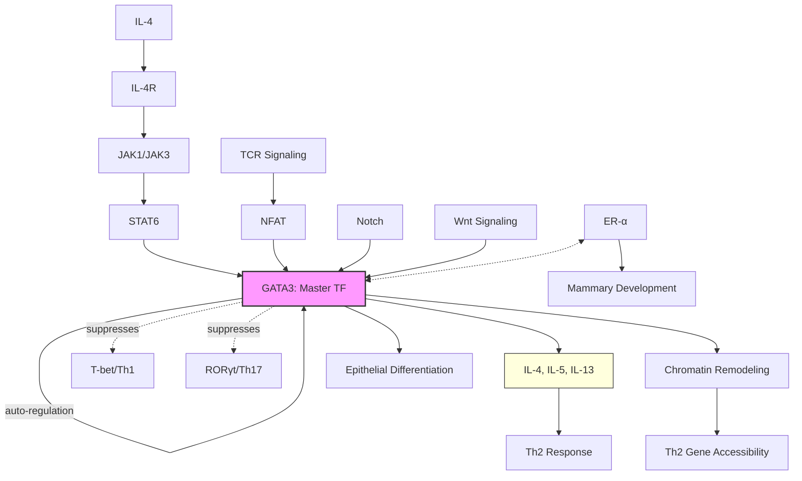

# Pathway Summary for GATA3

## Overview
GATA3 is a zinc finger transcription factor that serves as the master regulator of T-helper 2 (Th2) cell differentiation and a key regulator of T cell development, epithelial differentiation, and neuronal development. It binds DNA via two zinc finger domains at WGATAR consensus sequences and functions as a pioneer transcription factor capable of remodeling chromatin to establish cell fate decisions.

## Core Pathways

### Th2 Differentiation Pathway
GATA3 is the master transcription factor for Th2 cell differentiation. IL-4 signaling through STAT6 induces GATA3 expression, which then auto-amplifies its own expression while suppressing Th1 and Th17 lineages. GATA3 directly induces Th2 cytokines (IL-4, IL-5, IL-13) and establishes the Th2 transcriptional program.

### T Cell Development Pathway
GATA3 is essential at multiple T cell developmental checkpoints:
- β-selection checkpoint in DN3 thymocytes
- CD4+ T cell lineage commitment
- Maintenance of mature T cell identity

### Epithelial Differentiation
GATA3 regulates epithelial cell fate in multiple tissues:
- Mammary gland luminal epithelial differentiation
- Inner ear development
- Kidney and parathyroid development

## Pathway Diagram

## Upstream Regulators
- **STAT6**: Primary inducer downstream of IL-4
- **NFAT**: TCR-dependent activation
- **Notch signaling**: Early T cell development
- **Wnt signaling**: Epithelial contexts
- **Estrogen receptor**: Mammary gland development

## Downstream Effects

### Th2 Cytokine Production
- **IL-4**: B cell help, IgE switching
- **IL-5**: Eosinophil development
- **IL-13**: Mucus production, fibrosis
- **IL-10**: Anti-inflammatory

### Transcriptional Targets
- **Th2 locus control region**: Chromatin remodeling
- **IL4R**: Positive feedback loop
- **c-Maf**: Th2 co-factor
- **CCR4**: Th2 homing receptor

### Lineage Suppression
- **IFN-γ suppression**: Blocks Th1
- **IL-17 suppression**: Blocks Th17
- **Foxp3 modulation**: Affects Treg

## Clinical Significance

### Allergic Diseases
- **Asthma**: Th2-driven airway inflammation
- **Atopic dermatitis**: Skin barrier dysfunction
- **Allergic rhinitis**: IgE-mediated responses

### Cancer
- **Breast cancer**: Luminal subtype marker
- **T-ALL**: GATA3 mutations
- **Prognostic marker**: Various cancers

### Developmental Disorders
- **HDR syndrome**: Hypoparathyroidism, deafness, renal dysplasia
- **GATA3 haploinsufficiency**: Multiple developmental defects

## Regulatory Mechanisms
- **Auto-regulation**: Positive feedback loop
- **Post-translational modifications**: Phosphorylation affects activity
- **Protein interactions**: FOG1, p300/CBP co-factors
- **Chromatin context**: Pioneer factor activity
- **MicroRNAs**: miR-29 regulation

## Tissue-Specific Functions
- **T cells**: Th2 differentiation, CD4+ development
- **Mammary epithelium**: Luminal cell fate
- **Inner ear**: Hair cell development
- **Sympathetic neurons**: Differentiation
- **Kidney**: Nephric duct development

## Integration with Other Pathways
- **STAT signaling**: IL-4/STAT6 axis
- **TCR signaling**: NFAT cooperation
- **Wnt pathway**: Epithelial contexts
- **Hormone signaling**: ER-α interaction
- **Epigenetic regulation**: Pioneer factor function
