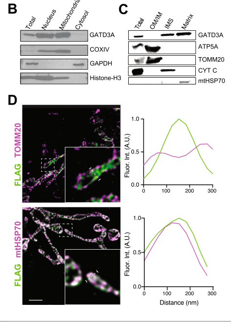

## Question

# Gene Research for Functional Annotation

## ⚠️ CRITICAL: Gene/Protein Identification Context

**BEFORE YOU BEGIN RESEARCH:** You MUST verify you are researching the CORRECT gene/protein. Gene symbols can be ambiguous, especially for less well-characterized genes from non-model organisms.

### Target Gene/Protein Identity (from UniProt):
- **UniProt Accession:** P0DPI2
- **Protein Description:** RecName: Full=Glutamine amidotransferase-like class 1 domain-containing protein 3, mitochondrial {ECO:0000305}; Flags: Precursor;
- **Gene Information:** Name=GATD3 {ECO:0000312|HGNC:HGNC:1273}; Synonyms=C21orf33 {ECO:0000312|HGNC:HGNC:1273}, GATD3A;
- **Organism (full):** Homo sapiens (Human).
- **Protein Family:** Belongs to the GATD3 family. .
- **Key Domains:** Class_I_gatase-like. (IPR029062)

### MANDATORY VERIFICATION STEPS:

1. **Check if the gene symbol "GATD3" matches the protein description above**
2. **Verify the organism is correct:** Homo sapiens (Human).
3. **Check if protein family/domains align with what you find in literature**
4. **If you find literature for a DIFFERENT gene with the same or similar symbol, STOP**

### If Gene Symbol is Ambiguous or You Cannot Find Relevant Literature:

**DO NOT PROCEED WITH RESEARCH ON A DIFFERENT GENE.** Instead:
- State clearly: "The gene symbol 'GATD3' is ambiguous or literature is limited for this specific protein"
- Explain what you found (e.g., "Found extensive literature on a different gene with the same symbol in a different organism")
- Describe the protein based ONLY on the UniProt information provided above
- Suggest that the protein function can be inferred from domain/family information

### Research Target:

Please provide a comprehensive research report on the gene **GATD3** (gene ID: GATD3, UniProt: P0DPI2) in human.

The research report should be a detailed narrative explaining the function, biological processes, and localization of the gene product. Citations should be given for all claims.

You should prioritize authoritative reviews and primary scientific literature when conducting research. You can supplement
this with annotations you find in gene/protein databases, but these can be outdated or inaccurate.

We are specifically interested in the primary function of the gene - for enzymes, what reaction is catalyzed, and what is the substrate specificity? For transporters, what is the substrate? For structural proteins or adapters, what is the broader structural role? For signaling molecules, what is the role in the pathway.

We are interested in where in or outside the cell the gene product carries out its function.

We are also interested in the signaling or biochemical pathways in which the gene functions. We are less interested in broad pleiotropic effects, except where these elucidate the precise role.

Include evidence where possible. We are interested in both experimental evidence as well as inference from structure, evolution, or bioinformatic analysis. Precise studies should be prioritized over high-throughput, where available.

## Output

Question: You are an expert researcher providing comprehensive, well-cited information.

Provide detailed information focusing on:
1. Key concepts and definitions with current understanding
2. Recent developments and latest research (prioritize 2023-2024 sources)
3. Current applications and real-world implementations
4. Expert opinions and analysis from authoritative sources
5. Relevant statistics and data from recent studies

Format as a comprehensive research report with proper citations. Include URLs and publication dates where available.
Always prioritize recent, authoritative sources and provide specific citations for all major claims.

# Gene Research for Functional Annotation

## ⚠️ CRITICAL: Gene/Protein Identification Context

**BEFORE YOU BEGIN RESEARCH:** You MUST verify you are researching the CORRECT gene/protein. Gene symbols can be ambiguous, especially for less well-characterized genes from non-model organisms.

### Target Gene/Protein Identity (from UniProt):
- **UniProt Accession:** P0DPI2
- **Protein Description:** RecName: Full=Glutamine amidotransferase-like class 1 domain-containing protein 3, mitochondrial {ECO:0000305}; Flags: Precursor;
- **Gene Information:** Name=GATD3 {ECO:0000312|HGNC:HGNC:1273}; Synonyms=C21orf33 {ECO:0000312|HGNC:HGNC:1273}, GATD3A;
- **Organism (full):** Homo sapiens (Human).
- **Protein Family:** Belongs to the GATD3 family. .
- **Key Domains:** Class_I_gatase-like. (IPR029062)

### MANDATORY VERIFICATION STEPS:

1. **Check if the gene symbol "GATD3" matches the protein description above**
2. **Verify the organism is correct:** Homo sapiens (Human).
3. **Check if protein family/domains align with what you find in literature**
4. **If you find literature for a DIFFERENT gene with the same or similar symbol, STOP**

### If Gene Symbol is Ambiguous or You Cannot Find Relevant Literature:

**DO NOT PROCEED WITH RESEARCH ON A DIFFERENT GENE.** Instead:
- State clearly: "The gene symbol 'GATD3' is ambiguous or literature is limited for this specific protein"
- Explain what you found (e.g., "Found extensive literature on a different gene with the same symbol in a different organism")
- Describe the protein based ONLY on the UniProt information provided above
- Suggest that the protein function can be inferred from domain/family information

### Research Target:

Please provide a comprehensive research report on the gene **GATD3** (gene ID: GATD3, UniProt: P0DPI2) in human.

The research report should be a detailed narrative explaining the function, biological processes, and localization of the gene product. Citations should be given for all claims.

You should prioritize authoritative reviews and primary scientific literature when conducting research. You can supplement
this with annotations you find in gene/protein databases, but these can be outdated or inaccurate.

We are specifically interested in the primary function of the gene - for enzymes, what reaction is catalyzed, and what is the substrate specificity? For transporters, what is the substrate? For structural proteins or adapters, what is the broader structural role? For signaling molecules, what is the role in the pathway.

We are interested in where in or outside the cell the gene product carries out its function.

We are also interested in the signaling or biochemical pathways in which the gene functions. We are less interested in broad pleiotropic effects, except where these elucidate the precise role.

Include evidence where possible. We are interested in both experimental evidence as well as inference from structure, evolution, or bioinformatic analysis. Precise studies should be prioritized over high-throughput, where available.

# Research Report: Human **GATD3 / GATD3A (C21orf33)** (UniProt **P0DPI2**) — Functional Annotation

## 1) Gene/protein identity verification (critical disambiguation)
The literature retrieved and synthesized here consistently uses **GATD3A** and **C21orf33** as synonyms for **GATD3** and describes a **mitochondrial precursor protein** that localizes predominantly to the **mitochondrial matrix** and contains a **class-I glutamine amidotransferase (GATase)-like/amidolysis domain**, matching the target provided (UniProt **P0DPI2**, Homo sapiens). (smith2022gatd3aamitochondrial pages 1-2, smith2022gatd3aamitochondrial pages 2-4, smith2022gatd3aamitochondrial pages 9-11)

## 2) Key concepts and definitions (current understanding)

### 2.1 Deglycase vs glyoxalase vs AGE formation
Reactive **1,2-dicarbonyls** (notably **glyoxal (GO)** and **methylglyoxal (MGO)**) can non-enzymatically modify nucleotides and amino acids/proteins (early Maillard/glycation adducts) that can mature into **advanced glycation end products (AGEs)**. A **deglycase** removes early glycation adducts (repair), whereas the canonical **glyoxalase system** detoxifies dicarbonyls (prevention). In mitochondria, where reactive carbonyl stress can impact respiratory and translational machinery, a matrix-localized deglycase provides a conceptually direct “damage-repair” route for glycated biomolecules. (smith2022gatd3aamitochondrial pages 11-12, smith2022gatd3aamitochondrial pages 1-2, smith2022gatd3aamitochondrial pages 2-4, smith2022gatd3aamitochondrial pages 6-8)

### 2.2 Core functional definition of GATD3
The best-supported primary function of human GATD3/GATD3A is as a **mitochondrial matrix deglycase** with an amidolysis-capable **GATase-like** fold and **DJ-1/PARK7-like** catalytic architecture, acting to **remove early glycation intermediates** on nucleotides and amino acids/proteins and thereby restrict mitochondrial AGE formation. (smith2022gatd3aamitochondrial pages 1-2, smith2022gatd3aamitochondrial pages 2-4, smith2022gatd3aamitochondrial pages 9-11, smith2022gatd3aamitochondrial pages 6-8)

## 3) Subcellular localization (where it acts)
Multiple orthogonal localization approaches (subcellular fractionation, submitochondrial fractionation, and super-resolution microscopy) place GATD3A **primarily in the mitochondrial matrix** with a smaller pool in the **intermembrane space**, and show that mitochondrial targeting depends on an **N-terminal mitochondrial localization/targeting sequence** that is cleaved upon maturation. (smith2022gatd3aamitochondrial pages 9-11, smith2022gatd3aamitochondrial pages 2-4, smith2022gatd3aamitochondrial media 4b2af3e1)

## 4) Biochemical activity and substrate specificity (reaction, substrates)

### 4.1 Demonstrated enzymatic activities
**(a) Deglycase activity (primary):** Recombinant GATD3A reverses early glycation adducts on both **DNA/nucleotide** and **protein/amino-acid** substrates generated by reactive dicarbonyls and reduces downstream AGE formation relative to no-enzyme controls. (smith2022gatd3aamitochondrial pages 4-6, smith2022gatd3aamitochondrial pages 6-8, smith2022gatd3aamitochondrial pages 2-4, smith2022gatd3aamitochondrial pages 9-11, smith2022gatd3aamitochondrial media ad2e6920)

**(b) Glutamine hydrolysis (amidolysis readout):** Recombinant GATD3A also **hydrolyzes free glutamine** in a coupled assay consistent with an amidolytic active site. Mutation of a conserved catalytic cysteine (C176) reduces activity, supporting functional relevance of the class-I GATase-like catalytic core. (smith2022gatd3aamitochondrial pages 4-6)

### 4.2 Substrate preference (GO vs MGO)
The evidence indicates that GATD3A preferentially addresses **glyoxal (GO)-derived** glycation chemistry, whereas DJ-1/PARK7 preferentially addresses **methylglyoxal (MGO)-derived** modifications under the tested conditions, implying partially complementary substrate coverage. (smith2022gatd3aamitochondrial pages 4-6, smith2022gatd3aamitochondrial pages 6-8)

### 4.3 Statistics reported in biochemical assays
Deglycase/amidolysis experiments in the foundational biochemical paper report **n = 3** replicates and statistical significance (e.g., **p < 0.01** in reported comparisons). (smith2022gatd3aamitochondrial pages 4-6)

## 5) Interaction partners and pathway context

### 5.1 Association with mitochondrial translation/mRNA-processing machinery
Mitochondrial co-immunoprecipitation/proteomics identify GATD3A-associated proteins that include:
- **LRPPRC** and **SLIRP** (mitochondrial mRNA processing/stability)
- **TUFM/EFTu** (mitochondrial translation elongation factor)
These findings support a model in which a matrix deglycase is positioned near or within RNA/protein homeostasis pathways linked to mitochondrial translation. (smith2022gatd3aamitochondrial pages 9-11, smith2022gatd3aamitochondrial pages 6-8, smith2022gatd3aamitochondrial pages 8-9)

Quantitatively, one co-IP dataset reported peptide/PSM recovery for translation-associated factors (e.g., **LRPPRC 33 peptides/79 PSMs**; **TUFM 14 peptides/36 PSMs**) and for GATD3A itself (**24 peptides/351 PSMs**), consistent with robust detection in the complex. (smith2022gatd3aamitochondrial pages 8-9)

### 5.2 Mitochondrial integrity/dynamics linkage
Both loss and overexpression perturb mitochondrial ultrastructure/dynamics in model systems, implying that GATD3A abundance and/or its glycation-repair role interfaces with mitochondrial network integrity. (smith2022gatd3aamitochondrial pages 11-12, smith2022gatd3aamitochondrial pages 8-9)

## 6) Phenotypes of loss or modulation

### 6.1 Loss-of-function phenotypes (mechanistic paper)
In mouse genetic and cellular knockout contexts (used as functional models for the conserved protein):
- Increased glycation/AGE-associated signals on mitochondrial rRNAs (12S/16S) and proteins in heart mitochondria from aged knockouts.
- Altered mitochondrial ultrastructure, including reduced electron density/cristae abnormalities.
- Reduced cellular respiration (OCR) in knockout MEFs; the respiration phenotype is worsened by **methylglyoxal exposure (0.2 mM, 24 h)**.
Statistical reporting includes significance such as **TEM electron-density loss p < 0.001** and multiple replicate annotations in respiration and imaging analyses. (smith2022gatd3aamitochondrial pages 6-8, smith2022gatd3aamitochondrial pages 8-9, smith2022gatd3aamitochondrial pages 9-11)

### 6.2 Overexpression phenotypes
Overexpression in HEK293 cells and MEFs causes marked mitochondrial **fragmentation** and reduced mitochondrial area/content, indicating dosage sensitivity. Morphology analyses were reported with **N = 21** cells/condition in one quantification. (smith2022gatd3aamitochondrial pages 8-9)

## 7) Recent developments (prioritizing 2023–2024)

### 7.1 2024: Osteoarthritis mechanism and therapeutic rescue (Nature Communications)
A 2024 Nature Communications study reports that **GATD3A deficiency induces senescence** of **fibroblast-like synoviocytes (FLSs)** and promotes osteoarthritis progression. Mechanistically, GATD3A deficiency increases **SIRT3 binding to MDH2**, leading to **MDH2 deacetylation** and **reduced MDH2 enzymatic activity**, impairing **TCA cycle flux** and driving mitochondrial dysfunction and senescence-associated phenotypes. The authors report that **intra-articular delivery of rAAV-GATD3A** alleviates osteoarthritis phenotypes in male mice, positioning GATD3A as a potential therapeutic target node in OA. (shen2024gatd3adeficiencyinducedmitochondrialdysfunction pages 1-2)

Methodologically, this study includes Seahorse mitochondrial stress tests, metabolomics, proteomics (LFQ; **n = 3 per group**), untargeted metabolomics (**n = 6 per group**), and isotope tracing ([13C5]glutamine, [U-13C6]glucose), supporting deep pathway interrogation (though the excerpt retrieved here does not contain the key numeric outcome effect sizes). (shen2024gatd3adeficiencyinducedmitochondrialdysfunction pages 15-16)

### 7.2 2024: Cancer metabolism context (Molecular Cancer)
In a 2024 Molecular Cancer study of BRAF\u005eV600E melanoma, proteomic analysis found **GATD3 upregulated** in **RICTOR/mTORC2-downregulated** cells with a reported **fold change 1.55** and **p = 0.0028 (n = 5)**. This places GATD3 in a mitochondrial/metabolic remodeling signature associated with therapeutic resistance contexts, although it does not itself establish causality or mechanism for GATD3. (ponzone2024rictormtorc2downregulationin pages 9-10)

### 7.3 2024: Real-world biomarker exploration in wet AMD serum (IOVS)
A 2024 IOVS serum RNA-seq study (60 wet AMD vs 64 controls) reported that serum **GATD3A mRNA** levels were associated with anti-VEGF treatment status. One quantitative comparison reported higher GATD3A counts pre-treatment than during treatment (**P = 0.050**), with very low absolute abundance: **CPM medians 0.03 [0.00–29.59] vs 0.00 [0.00–0.20]** (treatment-naïve vs treated). qPCR measurement of GATD3A was possible in only **44%** of serum samples and was not statistically significant, highlighting sensitivity/power limitations and the need for validation. (liukkonen2024oxidativestressand pages 5-6, liukkonen2024oxidativestressand pages 1-2, liukkonen2024oxidativestressand pages 9-10)

## 8) Current applications and real-world implementations

1. **Experimental therapeutic implementation (preclinical):** rAAV-mediated intra-articular delivery of **GATD3A** to alleviate osteoarthritis phenotype in a mouse model represents a concrete in vivo implementation of GATD3A modulation as a therapeutic concept. (shen2024gatd3adeficiencyinducedmitochondrialdysfunction pages 1-2)

2. **Biomarker exploration:** circulating serum **GATD3A mRNA** is being explored as part of systemic RNA signatures linked to wet AMD and anti-VEGF treatment, but current evidence is limited by low detectability and borderline statistical significance. (liukkonen2024oxidativestressand pages 5-6, liukkonen2024oxidativestressand pages 9-10)

3. **Functional genomics/mitochondrial quality control research target:** GATD3A is positioned as a candidate mitochondrial “damage-repair” enzyme acting on glycated nucleotides and proteins and associating with translation/mRNA processing, which makes it relevant for studies of mitochondrial proteostasis/RNA integrity under carbonyl stress and aging-like conditions. (smith2022gatd3aamitochondrial pages 11-12, smith2022gatd3aamitochondrial pages 6-8, smith2022gatd3aamitochondrial pages 9-11)

## 9) Expert analysis / interpretation grounded in authoritative sources

### 9.1 Most defensible primary function
Across the retrieved literature, the most defensible “primary function” assignment for human GATD3 is **mitochondrial matrix deglycase activity** acting on early glycation adducts (especially GO-derived) on nucleotides and proteins, supported by recombinant enzymology, localization data, and loss/overexpression phenotypes consistent with mitochondrial integrity stress. (smith2022gatd3aamitochondrial pages 6-8, smith2022gatd3aamitochondrial pages 2-4, smith2022gatd3aamitochondrial pages 9-11, smith2022gatd3aamitochondrial media 4b2af3e1, smith2022gatd3aamitochondrial media ad2e6920)

### 9.2 How the 2024 OA mechanism relates to the deglycase model
The 2024 OA study links GATD3A to a **SIRT3–MDH2–TCA flux** axis (mitochondrial metabolic control). A plausible unifying view is that glycation damage repair (nucleotides/proteins) could indirectly influence mitochondrial enzyme function, protein interactions, and metabolic state, but direct biochemical linkage between deglycation of specific MDH2-modifying adducts and SIRT3 binding was not available in the retrieved excerpts; thus, this remains a hypothesis rather than a concluded mechanism here. (shen2024gatd3adeficiencyinducedmitochondrialdysfunction pages 1-2, smith2022gatd3aamitochondrial pages 6-8)

### 9.3 Evidence gaps and limitations
- **Human-specific enzymology/kinetics:** The foundational enzymology demonstrates activity but the retrieved excerpts do not provide detailed kinetic constants (kcat/Km), making quantitative catalytic efficiency and physiological substrate ranking unresolved from this evidence set. (smith2022gatd3aamitochondrial pages 4-6, smith2022gatd3aamitochondrial pages 9-11)
- **2024 OA paper statistics:** The retrieved text includes extensive methods and mechanistic claims but not the numeric effect sizes/p-values for key comparisons, limiting quantitative reporting here despite the high-authority venue. (shen2024gatd3adeficiencyinducedmitochondrialdysfunction pages 1-2, shen2024gatd3adeficiencyinducedmitochondrialdysfunction pages 15-16)

## 10) Visual evidence (localization and activity)
Key figure panels from the foundational biochemical study provide visual support for:
- **Mitochondrial enrichment and matrix localization** (fractionation, submitochondrial fractionation, super-resolution imaging). (smith2022gatd3aamitochondrial media 4b2af3e1)
- **Deglycase activity assays** demonstrating reduced dicarbonyl/AGE signals with GATD3A. (smith2022gatd3aamitochondrial media ad2e6920)

## 11) Evidence map (compact summary table)
| Category | Summary |
|---|---|
| Identity/Domain | • Human **GATD3** encodes **GATD3A/C21orf33**, matching UniProt **P0DPI2**, a mitochondrial precursor protein with a **class-I glutamine amidotransferase-like (GATase/amidolysis) domain** and evolutionary/structural similarity to **DJ-1/PARK7** (Smith 2022) (smith2022gatd3aamitochondrial pages 1-2, smith2022gatd3aamitochondrial pages 2-4, smith2022gatd3aamitochondrial pages 4-6) • Conserved catalytic residues include **E62** and **C176** in GATD3A; cysteine mutagenesis reduces activity (Smith 2022) (smith2022gatd3aamitochondrial pages 4-6) |
| Localization | • Experimental fractionation and STED microscopy place GATD3A **primarily in the mitochondrial matrix**, with a smaller **intermembrane-space** pool (Smith 2022) (smith2022gatd3aamitochondrial pages 9-11, smith2022gatd3aamitochondrial pages 2-4) • Import depends on an **N-terminal mitochondrial targeting signal/MLS** that is cleaved on maturation; protein is largely absent from post-mitochondrial cytosol (Smith 2022) (smith2022gatd3aamitochondrial pages 2-4, smith2022gatd3aamitochondrial pages 9-11) |
| Biochemical activity | • Best-supported primary function is **mitochondrial deglycase activity**: GATD3A removes early non-enzymatic Maillard/glycation adducts generated by reactive **1,2-dicarbonyls** before they mature into AGEs (Smith 2022) (smith2022gatd3aamitochondrial pages 1-2, smith2022gatd3aamitochondrial pages 2-4, smith2022gatd3aamitochondrial pages 9-11, smith2022gatd3aamitochondrial pages 6-8) • Recombinant GATD3A also **hydrolyzes free glutamine** in a luciferase-linked glutamate assay, consistent with an amidolysis-capable GATase fold (Smith 2022) (smith2022gatd3aamitochondrial pages 4-6) |
| Substrate specificity | • GATD3A deglycates **DNA/nucleotide and protein/amino-acid adducts** produced by glycation chemistry (Smith 2022) (smith2022gatd3aamitochondrial pages 4-6, smith2022gatd3aamitochondrial pages 1-2, smith2022gatd3aamitochondrial pages 9-11) • Available evidence suggests a relative preference for **glyoxal (GO)-derived** modifications, whereas **DJ-1** more strongly handles **methylglyoxal (MGO)-derived** substrates (Smith 2022) (smith2022gatd3aamitochondrial pages 4-6, smith2022gatd3aamitochondrial pages 6-8) |
| Interaction partners | • Co-IP/MS from mitochondria identified partners linked to **mitochondrial mRNA processing/translation**, notably **LRPPRC, SLIRP, TUFM/EFTu** (Smith 2022) (smith2022gatd3aamitochondrial pages 9-11, smith2022gatd3aamitochondrial pages 6-8, smith2022gatd3aamitochondrial pages 8-9) • Additional associations include **ATP5A/ATP5B**, ADP/ATP translocases, chaperones, and respiratory/metabolic proteins, suggesting proximity to inner-membrane bioenergetic machinery (Smith 2022; Ponzone 2024) (smith2022gatd3aamitochondrial pages 6-8, smith2022gatd3aamitochondrial pages 8-9, ponzone2024rictormtorc2downregulationin pages 9-10) |
| Pathways/processes | • GATD3A appears to participate in **mitochondrial glycation defense**, acting alongside but distinct from the glutathione-dependent glyoxalase system to restrict **AGE formation** inside mitochondria (Smith 2022) (smith2022gatd3aamitochondrial pages 11-12, smith2022gatd3aamitochondrial pages 1-2, smith2022gatd3aamitochondrial pages 2-4, smith2022gatd3aamitochondrial pages 6-8) • Evidence also links it to **mt-mRNA maturation/translation**, **mitochondrial integrity/dynamics**, and in 2024 work to **TCA-cycle regulation** via the **SIRT3–MDH2** axis in synoviocytes (Smith 2022; Shen 2024) (smith2022gatd3aamitochondrial pages 9-11, smith2022gatd3aamitochondrial pages 11-12, shen2024gatd3adeficiencyinducedmitochondrialdysfunction pages 1-2) |
| Loss/overexpression phenotypes | • **Gatd3a−/−** mice/MEFs show increased mitochondrial **AGE/1,2-dicarbonyl** accumulation on rRNA and proteins, reduced mitochondrial electron density/cristae integrity, and impaired respiration; GO/MGO stress worsens phenotypes (Smith 2022) (smith2022gatd3aamitochondrial pages 9-11, smith2022gatd3aamitochondrial pages 6-8, smith2022gatd3aamitochondrial pages 11-12, smith2022gatd3aamitochondrial pages 8-9) • **Overexpression** in HEK293 cells/MEFs causes mitochondrial fragmentation and reduced mitochondrial content, implying dosage-sensitive effects on dynamics (Smith 2022) (smith2022gatd3aamitochondrial pages 11-12, smith2022gatd3aamitochondrial pages 8-9) |
| 2023-2024 developments | • **Melanoma proteomics**: GATD3 is significantly upregulated in **RICTOR-deficient BRAF\^V600E** melanoma cells, linking it to adaptive mitochondrial/stress metabolism (Ponzone 2024) (ponzone2024rictormtorc2downregulationin pages 9-10) • **Osteoarthritis**: GATD3A deficiency promotes fibroblast-like synoviocyte senescence through enhanced **SIRT3–MDH2** interaction, reduced MDH2 activity, impaired TCA flux, and mitochondrial dysfunction; **rAAV-GATD3A** ameliorates OA in mice (Shen 2024) (shen2024gatd3adeficiencyinducedmitochondrialdysfunction pages 1-2, shen2024gatd3adeficiencyinducedmitochondrialdysfunction pages 15-16) • **Wet AMD serum RNA-seq**: circulating GATD3A mRNA is lower in anti-VEGF-treated patients, suggesting biomarker potential but requiring validation (Liukkonen 2024) (liukkonen2024oxidativestressand pages 5-6, liukkonen2024oxidativestressand pages 1-2, liukkonen2024oxidativestressand pages 9-10) |
| Quantitative data points | • Deglycase/amidolysis assays were reported with **n = 3** replicates; GATD3A and DJ-1 reduced AGE formation vs no-enzyme controls, with significance noted at **p < 0.01** (Smith 2022) (smith2022gatd3aamitochondrial pages 4-6) • Co-IP/MS recovered GATD3A with **24 peptides / 351 PSMs**; translation-associated interactors included **LRPPRC 33 peptides / 79 PSMs** and **TUFM 14 peptides / 36 PSMs** (Smith 2022) (smith2022gatd3aamitochondrial pages 8-9) • Knockout MEFs showed reduced OCR; TEM electron-density loss reached **p < 0.001**; overexpression morphology analyses used **N = 21** cells/condition; MGO challenge was **0.2 mM for 24 h** (Smith 2022) (smith2022gatd3aamitochondrial pages 6-8, smith2022gatd3aamitochondrial pages 8-9) • In melanoma, GATD3 fold-change was **1.55** with **p = 0.0028** (**n = 5**) (Ponzone 2024) (ponzone2024rictormtorc2downregulationin pages 9-10) • In wAMD serum, treatment-naïve vs anti-VEGF-treated GATD3A counts showed medians **0.03 [0.00–29.59] vs 0.00 [0.00–0.20] CPM**, **P = 0.050**; detectable by qPCR in **44%** of samples (Liukkonen 2024) (liukkonen2024oxidativestressand pages 5-6) |
| Applications/real-world | • Current practical use is mainly as a **research target/functional annotation node** for mitochondrial glycation defense, translation-linked quality control, and redox/aging biology (Smith 2022; Shen 2024) (smith2022gatd3aamitochondrial pages 11-12, shen2024gatd3adeficiencyinducedmitochondrialdysfunction pages 1-2) • Emerging translational directions include **gene restoration in OA** (intra-articular **rAAV-GATD3A**) and exploratory **circulating biomarker** studies in AMD; neither is yet established clinically (Shen 2024; Liukkonen 2024) (shen2024gatd3adeficiencyinducedmitochondrialdysfunction pages 1-2, liukkonen2024oxidativestressand pages 5-6, liukkonen2024oxidativestressand pages 1-2, liukkonen2024oxidativestressand pages 9-10) • Proteomic changes in cancer and stress-response studies suggest possible value as a **mitochondrial state marker**, but not yet a validated drug target or diagnostic assay (Ponzone 2024; Liukkonen 2024) (ponzone2024rictormtorc2downregulationin pages 9-10, liukkonen2024oxidativestressand pages 1-2, liukkonen2024oxidativestressand pages 9-10) |

*Table: This table summarizes the current functional annotation of human GATD3/GATD3A/C21orf33, emphasizing experimentally supported localization, enzymatic activity, interaction partners, phenotypes, and recent 2024 disease-related findings. It is useful as a compact evidence map for interpreting this still sparsely characterized mitochondrial protein.*

## References (URLs and publication dates)
- Smith AJ et al. **"GATD3A, a mitochondrial deglycase with evolutionary origins from gammaproteobacteria, restricts the formation of advanced glycation end products"**. *BMC Biology*. **2022-03**. https://doi.org/10.1186/s12915-022-01267-6 (smith2022gatd3aamitochondrial pages 1-2, smith2022gatd3aamitochondrial pages 6-8)
- Ponzone L et al. **"RICTOR/mTORC2 downregulation in BRAFV600E melanoma cells promotes resistance to BRAF/MEK inhibition"**. *Molecular Cancer*. **2024-05**. https://doi.org/10.1186/s12943-024-02010-1 (ponzone2024rictormtorc2downregulationin pages 9-10)
- Liukkonen M et al. **"Oxidative Stress and Inflammation-Related mRNAs Are Elevated in Serum of a Finnish Wet AMD Cohort"**. *IOVS*. **2024-11**. https://doi.org/10.1167/iovs.65.13.30 (liukkonen2024oxidativestressand pages 1-2)
- Shen K et al. **"GATD3A-deficiency-induced mitochondrial dysfunction facilitates senescence of fibroblast-like synoviocytes and osteoarthritis progression"**. *Nature Communications*. **2024-12**. https://doi.org/10.1038/s41467-024-55335-2 (shen2024gatd3adeficiencyinducedmitochondrialdysfunction pages 1-2)

References

1. (smith2022gatd3aamitochondrial pages 1-2): Andrew J. Smith, Jayshree Advani, Daniel C. Brock, Jacob Nellissery, Jessica Gumerson, Lijin Dong, L. Aravind, Breandán Kennedy, and Anand Swaroop. Gatd3a, a mitochondrial deglycase with evolutionary origins from gammaproteobacteria, restricts the formation of advanced glycation end products. BMC Biology, Mar 2022. URL: https://doi.org/10.1186/s12915-022-01267-6, doi:10.1186/s12915-022-01267-6. This article has 19 citations and is from a domain leading peer-reviewed journal.

2. (smith2022gatd3aamitochondrial pages 2-4): Andrew J. Smith, Jayshree Advani, Daniel C. Brock, Jacob Nellissery, Jessica Gumerson, Lijin Dong, L. Aravind, Breandán Kennedy, and Anand Swaroop. Gatd3a, a mitochondrial deglycase with evolutionary origins from gammaproteobacteria, restricts the formation of advanced glycation end products. BMC Biology, Mar 2022. URL: https://doi.org/10.1186/s12915-022-01267-6, doi:10.1186/s12915-022-01267-6. This article has 19 citations and is from a domain leading peer-reviewed journal.

3. (smith2022gatd3aamitochondrial pages 9-11): Andrew J. Smith, Jayshree Advani, Daniel C. Brock, Jacob Nellissery, Jessica Gumerson, Lijin Dong, L. Aravind, Breandán Kennedy, and Anand Swaroop. Gatd3a, a mitochondrial deglycase with evolutionary origins from gammaproteobacteria, restricts the formation of advanced glycation end products. BMC Biology, Mar 2022. URL: https://doi.org/10.1186/s12915-022-01267-6, doi:10.1186/s12915-022-01267-6. This article has 19 citations and is from a domain leading peer-reviewed journal.

4. (smith2022gatd3aamitochondrial pages 11-12): Andrew J. Smith, Jayshree Advani, Daniel C. Brock, Jacob Nellissery, Jessica Gumerson, Lijin Dong, L. Aravind, Breandán Kennedy, and Anand Swaroop. Gatd3a, a mitochondrial deglycase with evolutionary origins from gammaproteobacteria, restricts the formation of advanced glycation end products. BMC Biology, Mar 2022. URL: https://doi.org/10.1186/s12915-022-01267-6, doi:10.1186/s12915-022-01267-6. This article has 19 citations and is from a domain leading peer-reviewed journal.

5. (smith2022gatd3aamitochondrial pages 6-8): Andrew J. Smith, Jayshree Advani, Daniel C. Brock, Jacob Nellissery, Jessica Gumerson, Lijin Dong, L. Aravind, Breandán Kennedy, and Anand Swaroop. Gatd3a, a mitochondrial deglycase with evolutionary origins from gammaproteobacteria, restricts the formation of advanced glycation end products. BMC Biology, Mar 2022. URL: https://doi.org/10.1186/s12915-022-01267-6, doi:10.1186/s12915-022-01267-6. This article has 19 citations and is from a domain leading peer-reviewed journal.

6. (smith2022gatd3aamitochondrial media 4b2af3e1): Andrew J. Smith, Jayshree Advani, Daniel C. Brock, Jacob Nellissery, Jessica Gumerson, Lijin Dong, L. Aravind, Breandán Kennedy, and Anand Swaroop. Gatd3a, a mitochondrial deglycase with evolutionary origins from gammaproteobacteria, restricts the formation of advanced glycation end products. BMC Biology, Mar 2022. URL: https://doi.org/10.1186/s12915-022-01267-6, doi:10.1186/s12915-022-01267-6. This article has 19 citations and is from a domain leading peer-reviewed journal.

7. (smith2022gatd3aamitochondrial pages 4-6): Andrew J. Smith, Jayshree Advani, Daniel C. Brock, Jacob Nellissery, Jessica Gumerson, Lijin Dong, L. Aravind, Breandán Kennedy, and Anand Swaroop. Gatd3a, a mitochondrial deglycase with evolutionary origins from gammaproteobacteria, restricts the formation of advanced glycation end products. BMC Biology, Mar 2022. URL: https://doi.org/10.1186/s12915-022-01267-6, doi:10.1186/s12915-022-01267-6. This article has 19 citations and is from a domain leading peer-reviewed journal.

8. (smith2022gatd3aamitochondrial media ad2e6920): Andrew J. Smith, Jayshree Advani, Daniel C. Brock, Jacob Nellissery, Jessica Gumerson, Lijin Dong, L. Aravind, Breandán Kennedy, and Anand Swaroop. Gatd3a, a mitochondrial deglycase with evolutionary origins from gammaproteobacteria, restricts the formation of advanced glycation end products. BMC Biology, Mar 2022. URL: https://doi.org/10.1186/s12915-022-01267-6, doi:10.1186/s12915-022-01267-6. This article has 19 citations and is from a domain leading peer-reviewed journal.

9. (smith2022gatd3aamitochondrial pages 8-9): Andrew J. Smith, Jayshree Advani, Daniel C. Brock, Jacob Nellissery, Jessica Gumerson, Lijin Dong, L. Aravind, Breandán Kennedy, and Anand Swaroop. Gatd3a, a mitochondrial deglycase with evolutionary origins from gammaproteobacteria, restricts the formation of advanced glycation end products. BMC Biology, Mar 2022. URL: https://doi.org/10.1186/s12915-022-01267-6, doi:10.1186/s12915-022-01267-6. This article has 19 citations and is from a domain leading peer-reviewed journal.

10. (shen2024gatd3adeficiencyinducedmitochondrialdysfunction pages 1-2): Kai Shen, Hao Zhou, Qiang Zuo, Yue Gu, Jiangqi Cheng, Kai Yan, Huiwen Zhang, Huanghe Song, Wenwei Liang, Jinchun Zhou, Jiuxiang Liu, Feng Liu, Chenjun Zhai, and Weimin Fan. Gatd3a-deficiency-induced mitochondrial dysfunction facilitates senescence of fibroblast-like synoviocytes and osteoarthritis progression. Nature Communications, Dec 2024. URL: https://doi.org/10.1038/s41467-024-55335-2, doi:10.1038/s41467-024-55335-2. This article has 29 citations and is from a highest quality peer-reviewed journal.

11. (shen2024gatd3adeficiencyinducedmitochondrialdysfunction pages 15-16): Kai Shen, Hao Zhou, Qiang Zuo, Yue Gu, Jiangqi Cheng, Kai Yan, Huiwen Zhang, Huanghe Song, Wenwei Liang, Jinchun Zhou, Jiuxiang Liu, Feng Liu, Chenjun Zhai, and Weimin Fan. Gatd3a-deficiency-induced mitochondrial dysfunction facilitates senescence of fibroblast-like synoviocytes and osteoarthritis progression. Nature Communications, Dec 2024. URL: https://doi.org/10.1038/s41467-024-55335-2, doi:10.1038/s41467-024-55335-2. This article has 29 citations and is from a highest quality peer-reviewed journal.

12. (ponzone2024rictormtorc2downregulationin pages 9-10): Luca Ponzone, Valentina Audrito, Claudia Landi, Enrico Moiso, Chiara Levra Levron, Sara Ferrua, Aurora Savino, Nicoletta Vitale, Massimiliano Gasparrini, Lidia Avalle, Lorenza Vantaggiato, Enxhi Shaba, Beatrice Tassone, Stefania Saoncella, Francesca Orso, Daniele Viavattene, Eleonora Marina, Irene Fiorilla, Giulia Burrone, Youssef Abili, Fiorella Altruda, Luca Bini, Silvia Deaglio, Paola Defilippi, Alessio Menga, Valeria Poli, Paolo Ettore Porporato, Paolo Provero, Nadia Raffaelli, Chiara Riganti, Daniela Taverna, Federica Cavallo, and Enzo Calautti. Rictor/mtorc2 downregulation in brafv600e melanoma cells promotes resistance to braf/mek inhibition. Molecular Cancer, May 2024. URL: https://doi.org/10.1186/s12943-024-02010-1, doi:10.1186/s12943-024-02010-1. This article has 11 citations and is from a highest quality peer-reviewed journal.

13. (liukkonen2024oxidativestressand pages 5-6): Mikko Liukkonen, Hanna Heloterä, Leea Siintamo, Bishwa Ghimire, Pirkko Mattila, Niko Kivinen, Joanna Kostanek, Cezary Watala, Maria Hytti, Juha Hyttinen, Ali Koskela, Janusz Blasiak, and Kai Kaarniranta. Oxidative stress and inflammation-related mrnas are elevated in serum of a finnish wet amd cohort. Investigative Ophthalmology &amp; Visual Science, 65:30, Nov 2024. URL: https://doi.org/10.1167/iovs.65.13.30, doi:10.1167/iovs.65.13.30. This article has 11 citations and is from a domain leading peer-reviewed journal.

14. (liukkonen2024oxidativestressand pages 1-2): Mikko Liukkonen, Hanna Heloterä, Leea Siintamo, Bishwa Ghimire, Pirkko Mattila, Niko Kivinen, Joanna Kostanek, Cezary Watala, Maria Hytti, Juha Hyttinen, Ali Koskela, Janusz Blasiak, and Kai Kaarniranta. Oxidative stress and inflammation-related mrnas are elevated in serum of a finnish wet amd cohort. Investigative Ophthalmology &amp; Visual Science, 65:30, Nov 2024. URL: https://doi.org/10.1167/iovs.65.13.30, doi:10.1167/iovs.65.13.30. This article has 11 citations and is from a domain leading peer-reviewed journal.

15. (liukkonen2024oxidativestressand pages 9-10): Mikko Liukkonen, Hanna Heloterä, Leea Siintamo, Bishwa Ghimire, Pirkko Mattila, Niko Kivinen, Joanna Kostanek, Cezary Watala, Maria Hytti, Juha Hyttinen, Ali Koskela, Janusz Blasiak, and Kai Kaarniranta. Oxidative stress and inflammation-related mrnas are elevated in serum of a finnish wet amd cohort. Investigative Ophthalmology &amp; Visual Science, 65:30, Nov 2024. URL: https://doi.org/10.1167/iovs.65.13.30, doi:10.1167/iovs.65.13.30. This article has 11 citations and is from a domain leading peer-reviewed journal.

## Artifacts

- [Edison artifact artifact-00](GATD3-deep-research-falcon_artifacts/artifact-00.md)

## Citations

1. liukkonen2024oxidativestressand pages 5-6
2. liukkonen2024oxidativestressand pages 1-2
3. liukkonen2024oxidativestressand pages 9-10
4. 13C5
5. U-13C6
6. 0.00–29.59
7. 0.00–0.20
8. https://doi.org/10.1186/s12915-022-01267-6
9. https://doi.org/10.1186/s12943-024-02010-1
10. https://doi.org/10.1167/iovs.65.13.30
11. https://doi.org/10.1038/s41467-024-55335-2
12. https://doi.org/10.1186/s12915-022-01267-6,
13. https://doi.org/10.1038/s41467-024-55335-2,
14. https://doi.org/10.1186/s12943-024-02010-1,
15. https://doi.org/10.1167/iovs.65.13.30,