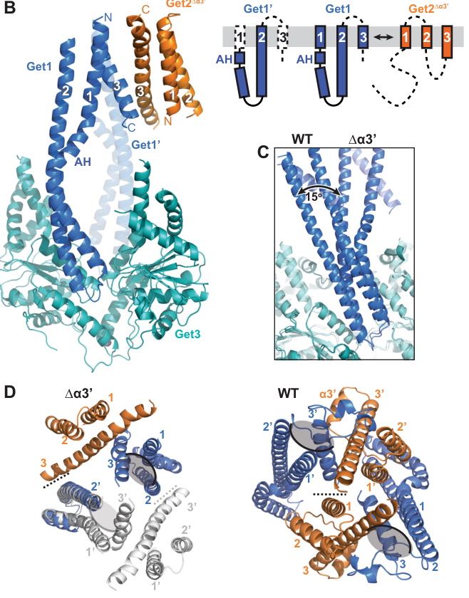

## Question

# Gene Research for Functional Annotation

## ⚠️ CRITICAL: Gene/Protein Identification Context

**BEFORE YOU BEGIN RESEARCH:** You MUST verify you are researching the CORRECT gene/protein. Gene symbols can be ambiguous, especially for less well-characterized genes from non-model organisms.

### Target Gene/Protein Identity (from UniProt):
- **UniProt Accession:** O00258
- **Protein Description:** RecName: Full=Guided entry of tail-anchored proteins factor 1 {ECO:0000312|HGNC:HGNC:12790}; AltName: Full=Congenital heart disease 5 protein; AltName: Full=Tail-anchored protein insertion receptor WRB; AltName: Full=Tryptophan-rich basic protein;
- **Gene Information:** Name=GET1 {ECO:0000312|HGNC:HGNC:12790}; Synonyms=CHD5 {ECO:0000312|HGNC:HGNC:12790}, WRB {ECO:0000312|HGNC:HGNC:12790};
- **Organism (full):** Homo sapiens (Human).
- **Protein Family:** Belongs to the WRB/GET1 family. .
- **Key Domains:** Get1. (IPR028945); Helix_hairpin_bin_sf. (IPR029012); CHD5 (PF04420)

### MANDATORY VERIFICATION STEPS:

1. **Check if the gene symbol "GET1" matches the protein description above**
2. **Verify the organism is correct:** Homo sapiens (Human).
3. **Check if protein family/domains align with what you find in literature**
4. **If you find literature for a DIFFERENT gene with the same or similar symbol, STOP**

### If Gene Symbol is Ambiguous or You Cannot Find Relevant Literature:

**DO NOT PROCEED WITH RESEARCH ON A DIFFERENT GENE.** Instead:
- State clearly: "The gene symbol 'GET1' is ambiguous or literature is limited for this specific protein"
- Explain what you found (e.g., "Found extensive literature on a different gene with the same symbol in a different organism")
- Describe the protein based ONLY on the UniProt information provided above
- Suggest that the protein function can be inferred from domain/family information

### Research Target:

Please provide a comprehensive research report on the gene **GET1** (gene ID: GET1, UniProt: O00258) in human.

The research report should be a detailed narrative explaining the function, biological processes, and localization of the gene product. Citations should be given for all claims.

You should prioritize authoritative reviews and primary scientific literature when conducting research. You can supplement
this with annotations you find in gene/protein databases, but these can be outdated or inaccurate.

We are specifically interested in the primary function of the gene - for enzymes, what reaction is catalyzed, and what is the substrate specificity? For transporters, what is the substrate? For structural proteins or adapters, what is the broader structural role? For signaling molecules, what is the role in the pathway.

We are interested in where in or outside the cell the gene product carries out its function.

We are also interested in the signaling or biochemical pathways in which the gene functions. We are less interested in broad pleiotropic effects, except where these elucidate the precise role.

Include evidence where possible. We are interested in both experimental evidence as well as inference from structure, evolution, or bioinformatic analysis. Precise studies should be prioritized over high-throughput, where available.

## Output

Question: You are an expert researcher providing comprehensive, well-cited information.

Provide detailed information focusing on:
1. Key concepts and definitions with current understanding
2. Recent developments and latest research (prioritize 2023-2024 sources)
3. Current applications and real-world implementations
4. Expert opinions and analysis from authoritative sources
5. Relevant statistics and data from recent studies

Format as a comprehensive research report with proper citations. Include URLs and publication dates where available.
Always prioritize recent, authoritative sources and provide specific citations for all major claims.

# Gene Research for Functional Annotation

## ⚠️ CRITICAL: Gene/Protein Identification Context

**BEFORE YOU BEGIN RESEARCH:** You MUST verify you are researching the CORRECT gene/protein. Gene symbols can be ambiguous, especially for less well-characterized genes from non-model organisms.

### Target Gene/Protein Identity (from UniProt):
- **UniProt Accession:** O00258
- **Protein Description:** RecName: Full=Guided entry of tail-anchored proteins factor 1 {ECO:0000312|HGNC:HGNC:12790}; AltName: Full=Congenital heart disease 5 protein; AltName: Full=Tail-anchored protein insertion receptor WRB; AltName: Full=Tryptophan-rich basic protein;
- **Gene Information:** Name=GET1 {ECO:0000312|HGNC:HGNC:12790}; Synonyms=CHD5 {ECO:0000312|HGNC:HGNC:12790}, WRB {ECO:0000312|HGNC:HGNC:12790};
- **Organism (full):** Homo sapiens (Human).
- **Protein Family:** Belongs to the WRB/GET1 family. .
- **Key Domains:** Get1. (IPR028945); Helix_hairpin_bin_sf. (IPR029012); CHD5 (PF04420)

### MANDATORY VERIFICATION STEPS:

1. **Check if the gene symbol "GET1" matches the protein description above**
2. **Verify the organism is correct:** Homo sapiens (Human).
3. **Check if protein family/domains align with what you find in literature**
4. **If you find literature for a DIFFERENT gene with the same or similar symbol, STOP**

### If Gene Symbol is Ambiguous or You Cannot Find Relevant Literature:

**DO NOT PROCEED WITH RESEARCH ON A DIFFERENT GENE.** Instead:
- State clearly: "The gene symbol 'GET1' is ambiguous or literature is limited for this specific protein"
- Explain what you found (e.g., "Found extensive literature on a different gene with the same symbol in a different organism")
- Describe the protein based ONLY on the UniProt information provided above
- Suggest that the protein function can be inferred from domain/family information

### Research Target:

Please provide a comprehensive research report on the gene **GET1** (gene ID: GET1, UniProt: O00258) in human.

The research report should be a detailed narrative explaining the function, biological processes, and localization of the gene product. Citations should be given for all claims.

You should prioritize authoritative reviews and primary scientific literature when conducting research. You can supplement
this with annotations you find in gene/protein databases, but these can be outdated or inaccurate.

We are specifically interested in the primary function of the gene - for enzymes, what reaction is catalyzed, and what is the substrate specificity? For transporters, what is the substrate? For structural proteins or adapters, what is the broader structural role? For signaling molecules, what is the role in the pathway.

We are interested in where in or outside the cell the gene product carries out its function.

We are also interested in the signaling or biochemical pathways in which the gene functions. We are less interested in broad pleiotropic effects, except where these elucidate the precise role.

Include evidence where possible. We are interested in both experimental evidence as well as inference from structure, evolution, or bioinformatic analysis. Precise studies should be prioritized over high-throughput, where available.

## Research Report: Human GET1 / WRB (UniProt O00258)

### 0) Target verification (gene/protein identity)
The UniProt accession **O00258** corresponds to the human protein commonly called **WRB (tryptophan-rich basic protein)** and annotated as **Guided entry of tail-anchored proteins factor 1 (GET1)**, also historically referred to as **congenital heart disease 5 protein (CHD5)**. Primary literature identifies WRB as the **metazoan homolog of yeast Get1** and an **ER-membrane receptor/insertase component** for the **TRC40/ASNA1** tail-anchored protein targeting pathway, aligning with the provided UniProt identity and family context (WRB/GET1 family). (vilardi2011wrbisthe pages 2-3, farkas2021captureanddelivery pages 5-7)

### 1) Key concepts and definitions (current understanding)

#### 1.1 Tail-anchored (TA) proteins
Tail-anchored proteins are a class of **single-pass membrane proteins** in which a **single hydrophobic transmembrane domain (TMD)** lies near the **extreme C-terminus**; they are inserted into target membranes **post-translationally** because the TMD emerges only after translation is nearly complete. Reviews emphasize that organelle-specific insertion pathways exist for TA proteins and that quality-control pathways clear mis-targeted TA proteins. (najdrova2022conservedmechanismfor pages 55-59)

#### 1.2 GET/TRC pathway (ER TA-protein targeting/insertion)
The eukaryotic **guided entry of tail-anchored proteins (GET)** pathway (and its metazoan counterpart often termed the **TRC pathway**) comprises: (i) cytosolic capture/shielding of TA TMDs by chaperones and a targeting ATPase (**Get3 in yeast; TRC40/ASNA1 in mammals**), (ii) delivery of the TA substrate to an ER membrane receptor/insertase (yeast **Get1/Get2**; mammalian **WRB/CAML**), and (iii) TA insertion into the ER membrane coupled to ATPase cycling. (farkas2021captureanddelivery pages 1-3, farkas2021captureanddelivery pages 5-7, mateja2018astructuralperspective pages 9-11)

#### 1.3 What GET1/WRB is (molecular function definition)
**GET1/WRB** is best defined as an **ER membrane insertase/receptor subunit** that binds the cytosolic targeting factor **TRC40/ASNA1** and cooperates with **CAML** (the Get2 analog) to mediate **insertion of TA-protein TMDs into the ER membrane**. In early biochemical work, WRB was identified as the **ER membrane receptor** for TRC40/ASNA1-mediated TA insertion, with a key **cytosolic coiled-coil docking domain**. (vilardi2011wrbisthe pages 2-3, farkas2021captureanddelivery pages 1-3, farkas2021captureanddelivery pages 5-7)

### 2) Molecular function, mechanism, and pathway placement

#### 2.1 Subcellular localization
WRB is described as an **ER-resident integral membrane protein**. Its **cytosolic coiled-coil domain** provides a binding site for TRC40/ASNA1 and helps recruit TRC40 to ER membranes. (vilardi2011wrbisthe pages 2-3, najdrova2022conservedmechanismfor pages 55-59)

#### 2.2 Core interaction partners
Key partners supported by mechanistic literature include:
- **TRC40/ASNA1** (cytosolic ATPase/chaperone that delivers TA substrates to the ER) (farkas2021captureanddelivery pages 1-3, vilardi2011wrbisthe pages 2-3)
- **CAML** (ER receptor partner; functional analog of Get2; together with WRB forms an obligate ER receptor complex) (farkas2021captureanddelivery pages 5-7, farkas2021captureanddelivery pages 1-3)

Vilardi et al. showed direct interaction between TRC40 and the WRB coiled-coil domain and that soluble coiled-coil fragments can inhibit TRC40-dependent insertion, consistent with a receptor docking role. (vilardi2011wrbisthe pages 2-3)

#### 2.3 Stepwise mechanism (functional annotation narrative)
A synthesis consistent across reviews and primary data is:
1. A TA substrate is captured in the cytosol and delivered by **TRC40/ASNA1**, which shields the hydrophobic TMD in a protected pocket. (farkas2021captureanddelivery pages 1-3)
2. TRC40 docks at the ER via the receptor/insertase formed by **WRB (GET1)** and **CAML**, with WRB’s cytosolic coiled-coil contributing to TRC40 binding. (vilardi2011wrbisthe pages 2-3, farkas2021captureanddelivery pages 5-7)
3. Docking facilitates conformational changes and **handoff/release of the TA TMD** to the membrane-embedded insertase groove/channel for insertion into the bilayer, followed by TRC40 recycling. (farkas2021captureanddelivery pages 5-7, mcdowell2020structuralbasisof pages 1-3, heo2023theget12insertase pages 1-3)

Structural perspective reviews additionally place WRB/Get1 within an **Oxa1/Alb3/YidC-like insertase superfamily**, supporting a conserved principle in which a membrane-embedded hydrophilic environment assists TMD insertion. (mateja2018astructuralperspective pages 9-11, farkas2021captureanddelivery pages 5-7)

### 3) Recent developments (prioritizing 2023–2024)

#### 3.1 2023 structural mechanism: hydrophilic groove and membrane remodeling
A major advance is the 2023 **Nature Communications** study that reports structures/simulations of **human Get1/Get2/Get3** and concludes that the GET insertase is **conformationally plastic** and induces **local membrane thinning** near a **hydrophilic groove** to lower the energetic barrier for insertion. Quantitatively, the paper reports thinning near the insertase from approximately **~4.35 nm to ~2.25 nm** in the vicinity of the groove. (mcdowell2023thegetinsertase pages 1-2, mcdowell2023thegetinsertase media b0739839)

This provides direct, modern structural support for annotating WRB/GET1 as a **membrane insertase** (not merely a static receptor) that actively reshapes the membrane environment during TA insertion. (mcdowell2023thegetinsertase pages 1-2, mcdowell2023thegetinsertase media b0739839)

#### 3.2 2023 channel model for the insertase (mechanistic support)
A 2023 **Cell Reports** study of the yeast Get1/2 insertase provides complementary mechanistic evidence for a **dynamic aqueous channel** (reported ~2.5 nm diameter in reconstituted systems) that can be sealed by Get3 and supports substrate release/insertion and translocation of C-terminal hydrophilic tails. While yeast-focused, the mechanistic logic is frequently used to interpret conserved features of the pathway in metazoans. (heo2023theget12insertase pages 1-3)

#### 3.3 2023 proteomics: broader client spectra and pathway “rules of engagement”
A 2023 label-free quantitative proteomics synthesis that compared perturbations across ER targeting/insertase components in human cells reported client-spectrum trends: TRC/GET clients are enriched for proteins with more central or C-terminal TMHs and unexpectedly included many multi-pass membrane proteins. Importantly, the authors reported an “insertase preference” ordering for TA insertion: **Wrb >> TRAM1 >> Sec61 > EMC > TRAP > Sec63**. (jung2023quantitativemassspectrometry pages 19-22)

#### 3.4 2023 quality control/proteostasis link: BAG6–UBL4A disruption
A 2023 **Biochemical Journal** study linked proteotoxic stress (including polyglutamine aggregates and other stresses) to dissociation of **UBL4A** from **BAG6**, an upstream module required for TA protein biogenesis. This work explicitly situates WRB (Get1)/CAML downstream as the ER-resident receptor and emphasizes that the TA biogenesis machinery interfaces with protein quality control routes that can promote insertion or degradation. (hagiwara2023proteotoxicstressesstimulate pages 1-3)

### 4) Current applications and real-world implementations

1. **Membrane protein biogenesis research tool / pathway dissection**: WRB/GET1 is routinely used as an essential node in experimental perturbations (knockdown/knockout, dominant-negative fragments) to probe the biogenesis of TA proteins and ER membrane protein targeting logic. Its coiled-coil domain can be used experimentally to competitively interfere with TRC40-dependent insertion in vitro. (vilardi2011wrbisthe pages 2-3)

2. **Understanding tissue-selective vulnerability in proteostasis and trafficking**: In vivo vertebrate studies indicate that WRB loss yields selective impacts on certain TA substrates (e.g., synaptic or trafficking proteins), which is used as a model to link TA insertion deficits to sensory phenotypes and to selective proteostasis collapse in specific cell types. (riveramonroy2016micelackingwrb pages 1-2, vogl2016tryptophan‐richbasicprotein pages 2-3)

3. **Framework for redundancy among ER insertases**: Human proteomics emphasizes overlap and division of labor among TRC/GET, EMC, Sec61-related factors, enabling systems-level modeling of membrane-protein insertion “rules of engagement,” relevant to interpreting phenotypes of membrane biogenesis defects. (jung2023quantitativemassspectrometry pages 19-22)

### 5) Phenotypes, disease relevance, and expert interpretation

#### 5.1 Congenital heart disease context
Early work noted that the **human WRB gene maps to a Down syndrome region on chromosome 21 (21q22.3) within a congenital heart disease region** and that WRB shows relatively higher expression in tissues including **heart** (as well as brain, liver, skeletal muscle, pancreas) in the reported expression surveys. These observations support plausibility for developmental phenotypes but do not by themselves establish monogenic causality. (vilardi2011wrbisthe pages 5-6)

#### 5.2 Strong functional links to sensory synapse biology (hearing/vision) via TA clients
Multiple vertebrate model systems provide mechanistic evidence that WRB-dependent TA insertion is essential in specialized sensory synapses:
- Zebrafish wrb mutants show severe visual behavior defects and synaptic abnormalities; rescue experiments demonstrate that WRB–TRC40 interaction is required (a WRB mutant that cannot bind TRC40 fails to rescue). (daniele2016mutationofwrba pages 1-2)
- Zebrafish wrb mutants also show auditory/vestibular phenotypes with cellular synaptic defects; quantitatively, they exhibit **~50% fewer synaptic ribbons**, and certain synaptic TA proteins (e.g., synaptobrevin/VAMP) are reduced to **~40% of wild type** while syntaxin 3 is reduced to **~72–84%**, consistent with compromised TA processing. (lin2016thezebrafishpinball pages 15-17)
- In hair cells, WRB mediates insertion of the TA protein **otoferlin**; WRB disruption reduces otoferlin abundance and impairs hair-cell exocytosis and hearing, and manipulations of WRB or otoferlin partially rescue phenotypes—supporting a substrate-level causal mechanism. (vogl2016tryptophan‐richbasicprotein pages 2-3, vogl2016tryptophan‐richbasicprotein pages 1-2, vogl2016tryptophan‐richbasicprotein pages 11-12)

#### 5.3 Proteostasis and selective TA-client dependence in vivo
A mouse study using tissue-specific WRB knockout models concluded that in vitro TRC40-client classification does not always predict in vivo outcomes; some TA proteins (notably the SNARE **syntaxin 5**) are extremely sensitive to TRC-pathway disruption and can become autophagy targets, underscoring interplay between TA insertion and proteostasis. (riveramonroy2016micelackingwrb pages 1-2)

#### 5.4 Database-level disease association signals (Open Targets)
Open Targets lists low-to-moderate scoring associations between **GET1** (ENSG00000182093) and several phenotype/disease terms with PubMed evidence linkage (e.g., “Phenotypic abnormality,” “Esotropia,” “Non-accomodative esotropia,” among others). These should be interpreted as **hypothesis-supporting associations** rather than definitive causality and should be corroborated with primary genetic/functional studies. (OpenTargets Search: -WRB)

### 6) Summary evidence map
The following table consolidates key functional-annotation claims, recency highlights, and evidence pointers.

| Category | Key points | Key sources (author year journal) | URL | Publication date | Evidence ID(s) |
|---|---|---|---|---|---|
| Identity | Human GET1 corresponds to WRB (tryptophan-rich basic protein; also called congenital heart disease 5 protein), the metazoan homolog of yeast Get1, matching UniProt O00258. It is a core component of the ER receptor/insertase for tail-anchored (TA) proteins. | Vilardi 2011 *Journal of Cell Science*; Farkas & Bohnsack 2021 *J Cell Biol* | https://doi.org/10.1242/jcs.084277; https://doi.org/10.1083/jcb.202105004 | 2011-04; 2021-07 | (vilardi2011wrbisthe pages 2-3, farkas2021captureanddelivery pages 5-7) |
| Localization | WRB is an ER-resident integral membrane protein with a cytosol-exposed coiled-coil domain that docks TRC40/ASNA1. Reviews and primary studies consistently place the functional WRB/CAML receptor in the ER membrane. | Vilardi 2011 *Journal of Cell Science*; Pool 2022 *Int J Mol Sci* | https://doi.org/10.1242/jcs.084277; https://doi.org/10.3390/ijms23073773 | 2011-04; 2022-03 | (vilardi2011wrbisthe pages 2-3, najdrova2022conservedmechanismfor pages 55-59) |
| Mechanism | WRB functions as the Get1-like insertase/receptor that receives TA substrates from TRC40/ASNA1 and helps release the substrate TMD for insertion into the ER bilayer. Structural work supports a membrane-embedded hydrophilic groove/channel mechanism analogous to other Oxa1/YidC-family insertases. | McDowell et al. 2020 *Molecular Cell*; Heo et al. 2023 *Cell Reports* | https://doi.org/10.1016/j.molcel.2020.08.012; https://doi.org/10.1016/j.celrep.2022.111921 | 2020-10; 2023-01 | (mcdowell2020structuralbasisof pages 1-3, heo2023theget12insertase pages 1-3, mateja2018astructuralperspective pages 9-11) |
| Partners | The core mammalian receptor is the WRB/CAML complex; WRB directly engages TRC40/ASNA1 through its coiled-coil domain, while CAML acts as the Get2 analog and cooperates in substrate delivery/insertion. WRB and CAML are mutually stabilizing and function as an obligate receptor complex. | Vilardi 2011 *Journal of Cell Science*; Farkas & Bohnsack 2021 *J Cell Biol* | https://doi.org/10.1242/jcs.084277; https://doi.org/10.1083/jcb.202105004 | 2011-04; 2021-07 | (vilardi2011wrbisthe pages 2-3, farkas2021captureanddelivery pages 5-7, farkas2021captureanddelivery pages 1-3) |
| Recent structural findings 2023 | 2023 work on human GET insertase showed conformational plasticity, a hydrophilic groove in hsGet1/WRB, and membrane thinning near the insertion site. Reported values include local thinning from ~4.35 nm to ~2.25 nm and a ~15° coiled-coil rotation/tilt associated with gating changes. | McDowell et al. 2023 *Nature Communications* | https://doi.org/10.1038/s41467-023-42867-2 | 2023-11 | (mcdowell2023thegetinsertase pages 1-2, mcdowell2023thegetinsertase media b0739839) |
| Proteomics client spectra 2023 | Quantitative proteomics in human cells found TRC/GET clients enriched for proteins with central or C-terminal TMHs and unexpectedly many multispanning membrane proteins. For insertase preference in TA insertion, the ranking reported was Wrb >> TRAM1 >> Sec61 > EMC > TRAP > Sec63. | Jung & Zimmermann 2023 *Int J Mol Sci* | https://doi.org/10.3390/ijms241814166 | 2023-09 | (jung2023quantitativemassspectrometry pages 19-22) |
| Quality control link 2023 | Proteotoxic stress and polyQ inclusions disrupt the BAG6–UBL4A pretargeting complex upstream of WRB/CAML, linking TA-protein biogenesis to proteostasis and aggregate-associated pathology. BAG6/UBL4A normally helps shield hydrophobic TMDs and route clients either to WRB/CAML-mediated insertion or degradation. | Hagiwara et al. 2023 *Biochemical Journal* | https://doi.org/10.1042/bcj20230267 | 2023-10 | (hagiwara2023proteotoxicstressesstimulate pages 1-3) |
| Phenotypes-Disease | WRB has been linked mechanistically to sensory phenotypes in vertebrate models: defective WRB impairs insertion of TA clients such as otoferlin and disrupts photoreceptor/hair-cell synaptic function, hearing, and vision. The WRB locus also lies in a chromosome 21 congenital heart disease region, but direct human WRB disease causality remains less established than for other TRC-pathway genes. | Rivera-Monroy et al. 2016 *Scientific Reports*; Vogl et al. 2016 *EMBO Journal*; Vilardi 2011 *Journal of Cell Science* | https://doi.org/10.1038/srep39464; https://doi.org/10.15252/embj.201593565; https://doi.org/10.1242/jcs.084277 | 2016-12; 2016-12; 2011-04 | (riveramonroy2016micelackingwrb pages 1-2, vogl2016tryptophan‐richbasicprotein pages 2-3, vogl2016tryptophan‐richbasicprotein pages 1-2, vilardi2011wrbisthe pages 5-6, vogl2016tryptophan‐richbasicprotein pages 11-12) |

*Table: This table summarizes the main functional annotation evidence for human GET1/WRB (UniProt O00258), including identity, localization, molecular mechanism, partners, and recent 2023 developments. It is useful as a compact evidence map linking core biological claims to specific sources and context IDs.*

### 7) Conclusions (functional annotation)
**GET1/WRB (UniProt O00258)** is best annotated as an **endoplasmic reticulum membrane insertase/receptor** that functions with **CAML** to receive TA protein substrates delivered by **TRC40/ASNA1** and to catalyze/enable their insertion into the ER bilayer through a **membrane-embedded hydrophilic groove/channel mechanism**. 2023 structures directly support WRB/GET1 as an active insertase that can remodel the membrane (thinning) and undergo conformational changes during insertion, and 2023 proteomics indicates broader client spectra and overlap with other ER insertion systems. (vilardi2011wrbisthe pages 2-3, farkas2021captureanddelivery pages 5-7, mcdowell2023thegetinsertase pages 1-2, jung2023quantitativemassspectrometry pages 19-22)

### URLs and publication dates (key sources cited)
- Vilardi et al. “WRB is the receptor for TRC40/Asna1-mediated insertion…” *Journal of Cell Science* (2011-04). https://doi.org/10.1242/jcs.084277 (vilardi2011wrbisthe pages 2-3, vilardi2011wrbisthe pages 5-6)
- McDowell et al. “The GET insertase exhibits conformational plasticity and induces membrane thinning” *Nature Communications* (2023-11). https://doi.org/10.1038/s41467-023-42867-2 (mcdowell2023thegetinsertase pages 1-2, mcdowell2023thegetinsertase media b0739839)
- Jung & Zimmermann “Quantitative Mass Spectrometry Characterizes Client Spectra…” *Int J Mol Sci* (2023-09). https://doi.org/10.3390/ijms241814166 (jung2023quantitativemassspectrometry pages 19-22)
- Hagiwara et al. “Proteotoxic stresses stimulate dissociation of UBL4A…” *Biochemical Journal* (2023-10). https://doi.org/10.1042/bcj20230267 (hagiwara2023proteotoxicstressesstimulate pages 1-3)
- Heo et al. “The Get1/2 insertase forms a channel…” *Cell Reports* (2023-01). https://doi.org/10.1016/j.celrep.2022.111921 (heo2023theget12insertase pages 1-3)

References

1. (vilardi2011wrbisthe pages 2-3): Fabio Vilardi, Holger Lorenz, and Bernhard Dobberstein. Wrb is the receptor for trc40/asna1-mediated insertion of tail-anchored proteins into the er membrane. Journal of Cell Science, 124:1301-1307, Apr 2011. URL: https://doi.org/10.1242/jcs.084277, doi:10.1242/jcs.084277. This article has 154 citations and is from a domain leading peer-reviewed journal.

2. (farkas2021captureanddelivery pages 5-7): Ákos Farkas and Katherine E. Bohnsack. Capture and delivery of tail-anchored proteins to the endoplasmic reticulum. The Journal of Cell Biology, Jul 2021. URL: https://doi.org/10.1083/jcb.202105004, doi:10.1083/jcb.202105004. This article has 49 citations.

3. (najdrova2022conservedmechanismfor pages 55-59): V Najdrová. Conserved mechanism for targeting of tail-anchored proteins in eukaryotes. Unknown journal, 2022.

4. (farkas2021captureanddelivery pages 1-3): Ákos Farkas and Katherine E. Bohnsack. Capture and delivery of tail-anchored proteins to the endoplasmic reticulum. The Journal of Cell Biology, Jul 2021. URL: https://doi.org/10.1083/jcb.202105004, doi:10.1083/jcb.202105004. This article has 49 citations.

5. (mateja2018astructuralperspective pages 9-11): Agnieszka Mateja and Robert J Keenan. A structural perspective on tail-anchored protein biogenesis by the get pathway. Current opinion in structural biology, 51:195-202, Aug 2018. URL: https://doi.org/10.1016/j.sbi.2018.07.009, doi:10.1016/j.sbi.2018.07.009. This article has 56 citations and is from a peer-reviewed journal.

6. (mcdowell2020structuralbasisof pages 1-3): Melanie A. McDowell, Michael Heimes, Francesco Fiorentino, Shahid Mehmood, Ákos Farkas, Javier Coy-Vergara, Di Wu, Jani Reddy Bolla, Volker Schmid, Roger Heinze, Klemens Wild, Dirk Flemming, Stefan Pfeffer, Blanche Schwappach, Carol V. Robinson, and Irmgard Sinning. Structural basis of tail-anchored membrane protein biogenesis by the get insertase complex. Molecular Cell, 80:72-86.e7, Oct 2020. URL: https://doi.org/10.1016/j.molcel.2020.08.012, doi:10.1016/j.molcel.2020.08.012. This article has 115 citations and is from a highest quality peer-reviewed journal.

7. (heo2023theget12insertase pages 1-3): Paul Heo, Jacob A. Culver, Jennifer Miao, Frederic Pincet, and Malaiyalam Mariappan. The get1/2 insertase forms a channel to mediate the insertion of tail-anchored proteins into the er. Cell Reports, 42:111921, Jan 2023. URL: https://doi.org/10.1016/j.celrep.2022.111921, doi:10.1016/j.celrep.2022.111921. This article has 8 citations and is from a highest quality peer-reviewed journal.

8. (mcdowell2023thegetinsertase pages 1-2): Melanie A. McDowell, Michael Heimes, Giray Enkavi, Ákos Farkas, Daniel Saar, Klemens Wild, Blanche Schwappach, Ilpo Vattulainen, and Irmgard Sinning. The get insertase exhibits conformational plasticity and induces membrane thinning. Nature Communications, Nov 2023. URL: https://doi.org/10.1038/s41467-023-42867-2, doi:10.1038/s41467-023-42867-2. This article has 16 citations and is from a highest quality peer-reviewed journal.

9. (mcdowell2023thegetinsertase media b0739839): Melanie A. McDowell, Michael Heimes, Giray Enkavi, Ákos Farkas, Daniel Saar, Klemens Wild, Blanche Schwappach, Ilpo Vattulainen, and Irmgard Sinning. The get insertase exhibits conformational plasticity and induces membrane thinning. Nature Communications, Nov 2023. URL: https://doi.org/10.1038/s41467-023-42867-2, doi:10.1038/s41467-023-42867-2. This article has 16 citations and is from a highest quality peer-reviewed journal.

10. (jung2023quantitativemassspectrometry pages 19-22): Martin Jung and Richard Zimmermann. Quantitative mass spectrometry characterizes client spectra of components for targeting of membrane proteins to and their insertion into the membrane of the human er. International Journal of Molecular Sciences, 24:14166, Sep 2023. URL: https://doi.org/10.3390/ijms241814166, doi:10.3390/ijms241814166. This article has 10 citations.

11. (hagiwara2023proteotoxicstressesstimulate pages 1-3): Takumi Hagiwara, Ryosuke Minami, Chizuru Ushio, Naoto Yokota, and Hiroyuki Kawahara. Proteotoxic stresses stimulate dissociation of ubl4a from the tail-anchored protein recognition complex. Biochemical Journal, 480:1583-1598, Oct 2023. URL: https://doi.org/10.1042/bcj20230267, doi:10.1042/bcj20230267. This article has 0 citations and is from a domain leading peer-reviewed journal.

12. (riveramonroy2016micelackingwrb pages 1-2): Jhon Rivera-Monroy, Lena Musiol, Kirsten Unthan-Fechner, Ákos Farkas, Anne Clancy, Javier Coy-Vergara, Uri Weill, Sarah Gockel, Shuh-Yow Lin, David P. Corey, Tobias Kohl, Philipp Ströbel, Maya Schuldiner, Blanche Schwappach, and Fabio Vilardi. Mice lacking wrb reveal differential biogenesis requirements of tail-anchored proteins in vivo. Scientific Reports, Dec 2016. URL: https://doi.org/10.1038/srep39464, doi:10.1038/srep39464. This article has 50 citations and is from a peer-reviewed journal.

13. (vogl2016tryptophan‐richbasicprotein pages 2-3): Christian Vogl, Iliana Panou, Gulnara Yamanbaeva, Carolin Wichmann, Sara J Mangosing, Fabio Vilardi, Artur A Indzhykulian, Tina Pangršič, Rosamaria Santarelli, Montserrat Rodriguez‐Ballesteros, Thomas Weber, Sangyong Jung, Elena Cardenas, Xudong Wu, Sonja M Wojcik, Kelvin Y Kwan, Ignacio del Castillo, Blanche Schwappach, Nicola Strenzke, David P Corey, Shuh‐Yow Lin, and Tobias Moser. Tryptophan‐rich basic protein (wrb) mediates insertion of the tail‐anchored protein otoferlin and is required for hair cell exocytosis and hearing. The EMBO Journal, 35:2536-2552, Dec 2016. URL: https://doi.org/10.15252/embj.201593565, doi:10.15252/embj.201593565. This article has 82 citations.

14. (vilardi2011wrbisthe pages 5-6): Fabio Vilardi, Holger Lorenz, and Bernhard Dobberstein. Wrb is the receptor for trc40/asna1-mediated insertion of tail-anchored proteins into the er membrane. Journal of Cell Science, 124:1301-1307, Apr 2011. URL: https://doi.org/10.1242/jcs.084277, doi:10.1242/jcs.084277. This article has 154 citations and is from a domain leading peer-reviewed journal.

15. (daniele2016mutationofwrba pages 1-2): Lauren L. Daniele, Farida Emran, Glenn P. Lobo, Robert J. Gaivin, and Brian D. Perkins. Mutation of<i>wrb</i>, a component of the guided entry of tail-anchored protein pathway, disrupts photoreceptor synapse structure and function. Investigative Opthalmology &amp; Visual Science, 57:2942, Jun 2016. URL: https://doi.org/10.1167/iovs.15-18996, doi:10.1167/iovs.15-18996. This article has 35 citations.

16. (lin2016thezebrafishpinball pages 15-17): Shuh‐Yow Lin, Melissa A. Vollrath, Sara Mangosing, Jun Shen, Elena Cardenas, and David P. Corey. The zebrafish pinball wizard gene encodes wrb, a tail‐anchored‐protein receptor essential for inner‐ear hair cells and retinal photoreceptors. The Journal of Physiology, 594:895-914, Feb 2016. URL: https://doi.org/10.1113/jp271437, doi:10.1113/jp271437. This article has 34 citations.

17. (vogl2016tryptophan‐richbasicprotein pages 1-2): Christian Vogl, Iliana Panou, Gulnara Yamanbaeva, Carolin Wichmann, Sara J Mangosing, Fabio Vilardi, Artur A Indzhykulian, Tina Pangršič, Rosamaria Santarelli, Montserrat Rodriguez‐Ballesteros, Thomas Weber, Sangyong Jung, Elena Cardenas, Xudong Wu, Sonja M Wojcik, Kelvin Y Kwan, Ignacio del Castillo, Blanche Schwappach, Nicola Strenzke, David P Corey, Shuh‐Yow Lin, and Tobias Moser. Tryptophan‐rich basic protein (wrb) mediates insertion of the tail‐anchored protein otoferlin and is required for hair cell exocytosis and hearing. The EMBO Journal, 35:2536-2552, Dec 2016. URL: https://doi.org/10.15252/embj.201593565, doi:10.15252/embj.201593565. This article has 82 citations.

18. (vogl2016tryptophan‐richbasicprotein pages 11-12): Christian Vogl, Iliana Panou, Gulnara Yamanbaeva, Carolin Wichmann, Sara J Mangosing, Fabio Vilardi, Artur A Indzhykulian, Tina Pangršič, Rosamaria Santarelli, Montserrat Rodriguez‐Ballesteros, Thomas Weber, Sangyong Jung, Elena Cardenas, Xudong Wu, Sonja M Wojcik, Kelvin Y Kwan, Ignacio del Castillo, Blanche Schwappach, Nicola Strenzke, David P Corey, Shuh‐Yow Lin, and Tobias Moser. Tryptophan‐rich basic protein (wrb) mediates insertion of the tail‐anchored protein otoferlin and is required for hair cell exocytosis and hearing. The EMBO Journal, 35:2536-2552, Dec 2016. URL: https://doi.org/10.15252/embj.201593565, doi:10.15252/embj.201593565. This article has 82 citations.

19. (OpenTargets Search: -WRB): Open Targets Query (-WRB, 5 results). Buniello, A. et al. (2025). Open Targets Platform: facilitating therapeutic hypotheses building in drug discovery. Nucleic Acids Research.

## Artifacts

- [Edison artifact artifact-00](GET1-deep-research-falcon_artifacts/artifact-00.md)

## Citations

1. najdrova2022conservedmechanismfor pages 55-59
2. vilardi2011wrbisthe pages 2-3
3. farkas2021captureanddelivery pages 1-3
4. jung2023quantitativemassspectrometry pages 19-22
5. hagiwara2023proteotoxicstressesstimulate pages 1-3
6. vilardi2011wrbisthe pages 5-6
7. daniele2016mutationofwrba pages 1-2
8. lin2016thezebrafishpinball pages 15-17
9. riveramonroy2016micelackingwrb pages 1-2
10. farkas2021captureanddelivery pages 5-7
11. mateja2018astructuralperspective pages 9-11
12. mcdowell2020structuralbasisof pages 1-3
13. mcdowell2023thegetinsertase pages 1-2
14. https://doi.org/10.1242/jcs.084277;
15. https://doi.org/10.1083/jcb.202105004
16. https://doi.org/10.3390/ijms23073773
17. https://doi.org/10.1016/j.molcel.2020.08.012;
18. https://doi.org/10.1016/j.celrep.2022.111921
19. https://doi.org/10.1038/s41467-023-42867-2
20. https://doi.org/10.3390/ijms241814166
21. https://doi.org/10.1042/bcj20230267
22. https://doi.org/10.1038/srep39464;
23. https://doi.org/10.15252/embj.201593565;
24. https://doi.org/10.1242/jcs.084277
25. https://doi.org/10.1242/jcs.084277,
26. https://doi.org/10.1083/jcb.202105004,
27. https://doi.org/10.1016/j.sbi.2018.07.009,
28. https://doi.org/10.1016/j.molcel.2020.08.012,
29. https://doi.org/10.1016/j.celrep.2022.111921,
30. https://doi.org/10.1038/s41467-023-42867-2,
31. https://doi.org/10.3390/ijms241814166,
32. https://doi.org/10.1042/bcj20230267,
33. https://doi.org/10.1038/srep39464,
34. https://doi.org/10.15252/embj.201593565,
35. https://doi.org/10.1167/iovs.15-18996,
36. https://doi.org/10.1113/jp271437,