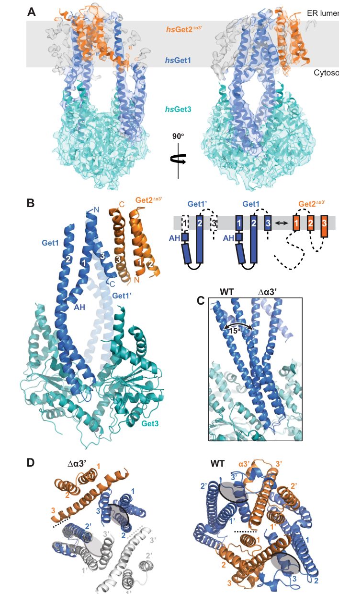

## Question

# Gene Research for Functional Annotation

## ⚠️ CRITICAL: Gene/Protein Identification Context

**BEFORE YOU BEGIN RESEARCH:** You MUST verify you are researching the CORRECT gene/protein. Gene symbols can be ambiguous, especially for less well-characterized genes from non-model organisms.

### Target Gene/Protein Identity (from UniProt):
- **UniProt Accession:** O43681
- **Protein Description:** RecName: Full=ATPase GET3 {ECO:0000255|HAMAP-Rule:MF_03112}; EC=3.6.4.- {ECO:0000269|PubMed:9712828}; AltName: Full=Arsenical pump-driving ATPase {ECO:0000255|HAMAP-Rule:MF_03112}; AltName: Full=Arsenite-stimulated ATPase {ECO:0000255|HAMAP-Rule:MF_03112, ECO:0000303|PubMed:9712828}; AltName: Full=Guided entry of tail-anchored proteins factor 3, ATPase {ECO:0000255|HAMAP-Rule:MF_03112}; AltName: Full=Transmembrane domain recognition complex 40 kDa ATPase subunit {ECO:0000303|PubMed:17382883}; AltName: Full=hARSA-I; AltName: Full=hASNA-I {ECO:0000303|PubMed:9712828};
- **Gene Information:** Name=GET3 {ECO:0000255|HAMAP-Rule:MF_03112, ECO:0000312|HGNC:HGNC:752}; Synonyms=ARSA {ECO:0000312|HGNC:HGNC:752}, ASNA1 {ECO:0000255|HAMAP-Rule:MF_03112}, TRC40 {ECO:0000303|PubMed:17382883, ECO:0000312|HGNC:HGNC:752};
- **Organism (full):** Homo sapiens (Human).
- **Protein Family:** Belongs to the arsA ATPase family. {ECO:0000255|HAMAP-
- **Key Domains:** ArsA/GET3_ATPase-like. (IPR025723); ATPase_ArsA/GET3. (IPR016300); ATPase_ArsA/GET3_euk. (IPR027542); P-loop_NTPase. (IPR027417); ArsA_ATPase (PF02374)

### MANDATORY VERIFICATION STEPS:

1. **Check if the gene symbol "GET3" matches the protein description above**
2. **Verify the organism is correct:** Homo sapiens (Human).
3. **Check if protein family/domains align with what you find in literature**
4. **If you find literature for a DIFFERENT gene with the same or similar symbol, STOP**

### If Gene Symbol is Ambiguous or You Cannot Find Relevant Literature:

**DO NOT PROCEED WITH RESEARCH ON A DIFFERENT GENE.** Instead:
- State clearly: "The gene symbol 'GET3' is ambiguous or literature is limited for this specific protein"
- Explain what you found (e.g., "Found extensive literature on a different gene with the same symbol in a different organism")
- Describe the protein based ONLY on the UniProt information provided above
- Suggest that the protein function can be inferred from domain/family information

### Research Target:

Please provide a comprehensive research report on the gene **GET3** (gene ID: GET3, UniProt: O43681) in human.

The research report should be a detailed narrative explaining the function, biological processes, and localization of the gene product. Citations should be given for all claims.

You should prioritize authoritative reviews and primary scientific literature when conducting research. You can supplement
this with annotations you find in gene/protein databases, but these can be outdated or inaccurate.

We are specifically interested in the primary function of the gene - for enzymes, what reaction is catalyzed, and what is the substrate specificity? For transporters, what is the substrate? For structural proteins or adapters, what is the broader structural role? For signaling molecules, what is the role in the pathway.

We are interested in where in or outside the cell the gene product carries out its function.

We are also interested in the signaling or biochemical pathways in which the gene functions. We are less interested in broad pleiotropic effects, except where these elucidate the precise role.

Include evidence where possible. We are interested in both experimental evidence as well as inference from structure, evolution, or bioinformatic analysis. Precise studies should be prioritized over high-throughput, where available.

## Output

Question: You are an expert researcher providing comprehensive, well-cited information.

Provide detailed information focusing on:
1. Key concepts and definitions with current understanding
2. Recent developments and latest research (prioritize 2023-2024 sources)
3. Current applications and real-world implementations
4. Expert opinions and analysis from authoritative sources
5. Relevant statistics and data from recent studies

Format as a comprehensive research report with proper citations. Include URLs and publication dates where available.
Always prioritize recent, authoritative sources and provide specific citations for all major claims.

# Gene Research for Functional Annotation

## ⚠️ CRITICAL: Gene/Protein Identification Context

**BEFORE YOU BEGIN RESEARCH:** You MUST verify you are researching the CORRECT gene/protein. Gene symbols can be ambiguous, especially for less well-characterized genes from non-model organisms.

### Target Gene/Protein Identity (from UniProt):
- **UniProt Accession:** O43681
- **Protein Description:** RecName: Full=ATPase GET3 {ECO:0000255|HAMAP-Rule:MF_03112}; EC=3.6.4.- {ECO:0000269|PubMed:9712828}; AltName: Full=Arsenical pump-driving ATPase {ECO:0000255|HAMAP-Rule:MF_03112}; AltName: Full=Arsenite-stimulated ATPase {ECO:0000255|HAMAP-Rule:MF_03112, ECO:0000303|PubMed:9712828}; AltName: Full=Guided entry of tail-anchored proteins factor 3, ATPase {ECO:0000255|HAMAP-Rule:MF_03112}; AltName: Full=Transmembrane domain recognition complex 40 kDa ATPase subunit {ECO:0000303|PubMed:17382883}; AltName: Full=hARSA-I; AltName: Full=hASNA-I {ECO:0000303|PubMed:9712828};
- **Gene Information:** Name=GET3 {ECO:0000255|HAMAP-Rule:MF_03112, ECO:0000312|HGNC:HGNC:752}; Synonyms=ARSA {ECO:0000312|HGNC:HGNC:752}, ASNA1 {ECO:0000255|HAMAP-Rule:MF_03112}, TRC40 {ECO:0000303|PubMed:17382883, ECO:0000312|HGNC:HGNC:752};
- **Organism (full):** Homo sapiens (Human).
- **Protein Family:** Belongs to the arsA ATPase family. {ECO:0000255|HAMAP-
- **Key Domains:** ArsA/GET3_ATPase-like. (IPR025723); ATPase_ArsA/GET3. (IPR016300); ATPase_ArsA/GET3_euk. (IPR027542); P-loop_NTPase. (IPR027417); ArsA_ATPase (PF02374)

### MANDATORY VERIFICATION STEPS:

1. **Check if the gene symbol "GET3" matches the protein description above**
2. **Verify the organism is correct:** Homo sapiens (Human).
3. **Check if protein family/domains align with what you find in literature**
4. **If you find literature for a DIFFERENT gene with the same or similar symbol, STOP**

### If Gene Symbol is Ambiguous or You Cannot Find Relevant Literature:

**DO NOT PROCEED WITH RESEARCH ON A DIFFERENT GENE.** Instead:
- State clearly: "The gene symbol 'GET3' is ambiguous or literature is limited for this specific protein"
- Explain what you found (e.g., "Found extensive literature on a different gene with the same symbol in a different organism")
- Describe the protein based ONLY on the UniProt information provided above
- Suggest that the protein function can be inferred from domain/family information

### Research Target:

Please provide a comprehensive research report on the gene **GET3** (gene ID: GET3, UniProt: O43681) in human.

The research report should be a detailed narrative explaining the function, biological processes, and localization of the gene product. Citations should be given for all claims.

You should prioritize authoritative reviews and primary scientific literature when conducting research. You can supplement
this with annotations you find in gene/protein databases, but these can be outdated or inaccurate.

We are specifically interested in the primary function of the gene - for enzymes, what reaction is catalyzed, and what is the substrate specificity? For transporters, what is the substrate? For structural proteins or adapters, what is the broader structural role? For signaling molecules, what is the role in the pathway.

We are interested in where in or outside the cell the gene product carries out its function.

We are also interested in the signaling or biochemical pathways in which the gene functions. We are less interested in broad pleiotropic effects, except where these elucidate the precise role.

Include evidence where possible. We are interested in both experimental evidence as well as inference from structure, evolution, or bioinformatic analysis. Precise studies should be prioritized over high-throughput, where available.

# Research report: Human GET3 / ASNA1 / TRC40 (UniProt O43681)

## 0) Target verification (gene/protein identity)
UniProt accession **O43681** corresponds to the human protein widely referred to as **ASNA1** and **TRC40**, and explicitly described in the TA-protein targeting literature as the mammalian ortholog of yeast **Get3** (hence the UniProt “GET3” name). The retrieved reviews and primary studies consistently use the mapping **Get3 (yeast) ↔ TRC40/ASNA1 (metazoans/humans)** in the context of the **GET/TRC pathway for tail-anchored (TA) membrane protein insertion into the ER**. (farkas2021captureanddelivery pages 1-3, mcdowell2023thegetinsertase pages 1-2, qin2023targetingandsurveillance pages 1-2)

## 1) Key concepts and definitions (current understanding)

### Tail-anchored (TA) proteins
**TA proteins** are single-pass membrane proteins defined by a **single C-terminal transmembrane domain (TMD)** that anchors them in organelle membranes, leaving most of the protein **cytosolic** and a **short C-terminal tail in the lumen** (ER or other organelles). (farkas2021captureanddelivery pages 1-3, qin2023targetingandsurveillance pages 1-2)

### GET/TRC pathway (ER targeting route for TA proteins)
The **GET pathway** in yeast and the conserved mammalian **TRC (transmembrane recognition complex) pathway** are major post-translational routes for targeting and inserting relatively hydrophobic TA proteins into the **endoplasmic reticulum (ER) membrane**. (farkas2021captureanddelivery pages 1-3, qin2023targetingandsurveillance pages 1-2)

### ASNA1/TRC40/GET3 (central ATPase/chaperone)
Human **ASNA1/TRC40 (GET3)** is the **central cytosolic targeting factor** in this pathway: it is a **homodimeric ATPase** that binds TA clients, **shields the hydrophobic TMD** in a protected groove/pocket, and delivers the client to an ER membrane receptor/insertase for insertion. (farkas2021captureanddelivery pages 1-3, mcdowell2023thegetinsertase pages 1-2)

## 2) Molecular function and biochemical mechanism

### 2.1 Enzymatic activity
ASNA1/TRC40 is a **P-loop NTPase ATPase** whose functional cycle is coupled to TA-client handling (capture, delivery, release/recycling). In the conserved model described for Get3/TRC40, nucleotide state governs large conformational changes that regulate substrate binding and release. (farkas2021captureanddelivery pages 1-3, najdrova2022conservedmechanismfor pages 63-66)

### 2.2 Substrate specificity (what does ASNA1/TRC40 act on?)
The primary substrate class is **tail-anchored membrane proteins**, i.e., proteins whose key targeting determinant is a **hydrophobic C-terminal TMD** that must be protected from aggregation in the cytosol and then inserted into the ER membrane. (farkas2021captureanddelivery pages 1-3, mcdowell2023thegetinsertase pages 1-2, qin2023targetingandsurveillance pages 1-2)

### 2.3 Stepwise pathway model (from synthesis to ER insertion)
A consensus pathway model (reviews + recent mechanistic work) is:

1. **Pre-targeting capture (cytosol):** nascent TA proteins are initially captured by a **pre-targeting complex** (in mammals, **SGTA** and the **BAG6 complex** involving TRC35/UBL4A/BAG6) to prevent aggregation and to stage handoff. (farkas2021captureanddelivery pages 1-3, qin2023targetingandsurveillance pages 1-2)
2. **Handoff to ATP-bound TRC40/ASNA1:** TA substrates are transferred to **ATP-bound TRC40**, which shields the TA TMD in a hydrophobic binding site. (farkas2021captureanddelivery pages 1-3)
3. **Delivery to ER receptor/insertase:** TRC40 delivers cargo to the ER receptor/insertase complex (**WRB/CAML** in mammals; Get1/Get2 in yeast terminology). Receptor engagement drives TRC40 rearrangements enabling insertion and recycling. (farkas2021captureanddelivery pages 1-3, qin2023targetingandsurveillance pages 1-2)

#### Mechanistic detail from 2023 structural work
McDowell et al. (2023) describe a mechanistic sequence in which the **Get2 cytosolic domain** initially engages the **Get3/TRC40–TA** complex, then **Get1 coiled-coil engagement** promotes **opening** of Get3/TRC40 and **nucleotide release**, facilitating transfer of the TA substrate to the membrane insertase environment. (mcdowell2023thegetinsertase pages 1-2)

## 3) Cellular localization (where does ASNA1/TRC40 function?)
ASNA1/TRC40 functions primarily in the **cytosol** as a targeting factor/chaperone, delivering TA clients to the **ER membrane** receptor/insertase (**WRB/CAML**), where insertion occurs. (farkas2021captureanddelivery pages 1-3, qin2023targetingandsurveillance pages 1-2)

## 4) Recent developments (prioritizing 2023–2024)

### 4.1 2023: GET insertase structural plasticity and membrane remodeling
McDowell et al. (Nature Communications, **2023-11-**; https://doi.org/10.1038/s41467-023-42867-2) provide structures, simulations, and functional data for human Get1/Get2/Get3 complexes, arguing that the GET insertase is **conformationally plastic** and induces **local membrane thinning** near a hydrophilic groove to facilitate insertion. They also summarize that TA proteins constitute a sizable fraction of membrane proteins (~**5% of eukaryotic membrane proteins** in their framing). (mcdowell2023thegetinsertase pages 1-2)

Visual evidence from this study illustrates the insertase topology and the location of the **hydrophilic groove** and **membrane thinning** features. (mcdowell2023thegetinsertase media dee660dd, mcdowell2023thegetinsertase media 0a7e56a9)

### 4.2 2023: A channel model for Get1/2-mediated insertion
Heo et al. (Cell Reports, **2023-01-**; https://doi.org/10.1016/j.celrep.2022.111921) propose and support a model in which the Get1/2 insertase forms a **transient aqueous channel** in reconstituted membranes to mediate TA insertion.

Key quantitative/mechanistic points reported include:
- An estimated channel diameter of ~**2.5 nm** (interpreted as requiring **two Get1/2 complexes**). (heo2023theget12insertase pages 1-3)
- The channel model is framed as helping overcome two energetic barriers: movement of a hydrophobic TMD across headgroups and translocation of a **C-terminal hydrophilic tail (up to ~30 residues)** across the membrane interior. (heo2023theget12insertase pages 1-3)
- Experimental modulation indicates Get3 can affect channel behavior (e.g., reduced channel-series frequency and occupancy in microfluidics assays when Get3 is present vs BSA). (heo2023theget12insertase pages 29-34)

### 4.3 2023: Updated reviews of TA targeting and surveillance
Qin et al. (The Innovation Life, **2023-01-**; https://doi.org/10.59717/j.xinn-life.2023.100013) emphasize the conserved pathway architecture and articulate a **chaperone cascade** view of ordered handoffs (Hsp70 → SGTA/Sgt2 → TRC components → TRC40/ASNA1 → WRB/CAML). This review also highlights that mammals add **BAG6** as a bridging component in the pre-targeting complex. (qin2023targetingandsurveillance pages 1-2)

### 4.4 2024: Redox-regulated functional switching (TRC40 as a stress chaperone)
Dempsey et al. (bioRxiv preprint, **2024-07-10**; https://doi.org/10.1101/2024.07.10.602939) report a **redox-regulated switch** in TRC40/ASNA1 function: besides its established ATP-dependent TA-targeting role, oxidative conditions (and/or ATP depletion) can convert TRC40 into an **oligomeric chaperone** that limits protein aggregation during stress.

Key quantitative/mechanistic points include:
- Oxidative activation tested with **2 mM H2O2/CuCl2** (or thiol-alkylation by NEM) promoted chaperone activity and **inactivated ATPase-linked TA targeting behavior**, reversible with reducing conditions and Mg-ATP. (dempsey2024adynamicredox pages 4-8)
- Reduced TRC40 is **dimeric**, whereas oxidized/thiol-blocked TRC40 forms **tetramers and higher oligomers**; **tetramers** are described as the smallest chaperone-active unit. (dempsey2024adynamicredox pages 4-8)
- Nucleotide binding can prevent oxidative activation, whereas ATP depletion facilitates oxidation-driven oligomerization and chaperone behavior; in cells, TRC40 forms reversible stress foci overlapping with Hsp70/Hsp110 and contributes to limiting stress-induced aggregation. (dempsey2024adynamicredox pages 4-8)

## 5) Current applications and real-world implementations

### 5.1 Functional genomics and proteomics “client spectrum” mapping at the ER
Jung & Zimmermann (International Journal of Molecular Sciences, **2023-09-**; https://doi.org/10.3390/ijms241814166) summarize how systematic perturbation (siRNA/CRISPR) combined with **quantitative proteomics** can be used to infer **client spectra** of membrane targeting/insertion routes at the human ER, including TRC/GET components (TRC35/TRC40) versus SRP/SND/EMC/Sec61-related components. This is an applied, scalable approach to map which membrane-protein features route them into TRC/GET versus other pathways. (qin2023targetingandsurveillance pages 1-2)

### 5.2 Stress biology / proteostasis (emerging)
The 2024 redox-switch work positions TRC40/ASNA1 as a **conditionally activated anti-aggregation factor** under ATP-depleting oxidative stress, conceptually extending its “hydrophobic segment handling” function from TA biogenesis to broader proteostasis. While preclinical, this suggests an application space in **stress-response biology** and potentially in designing interventions that modulate redox/ATP states to influence TRC40 functional modes. (dempsey2024adynamicredox pages 4-8)

### 5.3 Quality control implications for TA biogenesis
Proteotoxic stress can disrupt the pre-targeting machinery upstream of TRC40. For example, Hagiwara et al. (Biochemical Journal, **2023-10-**; https://doi.org/10.1042/bcj20230267) report that proteotoxic stresses can stimulate dissociation within the BAG6-associated complex (BAG6–UBL4A), implying that pathological aggregation stress may compromise efficient TA-protein biogenesis. This supports a real-world relevance to neurodegeneration-like proteotoxic conditions, although direct clinical translation remains indirect at present. (qin2023targetingandsurveillance pages 1-2)

## 6) Expert opinions and analysis (authoritative interpretation)

1. **Consensus view of TRC40/ASNA1 as a specialized ATPase chaperone for C-terminal hydrophobes:** Recent reviews and primary work agree that the TRC40/GET3 system is specialized for handling and delivering **late-emerging hydrophobic segments** (C-terminal TMDs) that cannot use canonical co-translational SRP targeting. (farkas2021captureanddelivery pages 1-3, qin2023targetingandsurveillance pages 1-2)
2. **Mechanistic convergence on “protected hydrophobe handling + dedicated insertase”:** 2023 mechanistic papers converge on the idea that successful insertion relies on both (i) cytosolic shielding by TRC40/Get3 and (ii) a dedicated membrane insertase (Get1/2; WRB/CAML context in mammals) that provides a specialized environment (hydrophilic groove/channel-like behavior) and can remodel the local bilayer to reduce insertion barriers. (heo2023theget12insertase pages 1-3, mcdowell2023thegetinsertase pages 1-2, mcdowell2023thegetinsertase media dee660dd)
3. **Functional plasticity under stress as an emerging theme:** The 2024 redox-switch preprint proposes that TRC40 may act as a “dual-mode” protein—TA targeting under normal energy/redox conditions, and oligomeric chaperoning under ATP-depleting oxidative stress—suggesting a broader conceptual role in cytosolic management of hydrophobic/aggregation-prone intermediates. This is a new hypothesis with evidence but awaits further peer-reviewed consolidation. (dempsey2024adynamicredox pages 4-8)

## 7) Relevant statistics and quantitative data points (from recent studies)
- **Prevalence:** TA proteins are described as roughly **~5% of eukaryotic membrane proteins** (McDowell et al., 2023). (mcdowell2023thegetinsertase pages 1-2)
- **Insertase physical model:** A Get1/2 insertase channel diameter estimated at ~**2.5 nm** (Heo et al., 2023). (heo2023theget12insertase pages 1-3)
- **Client-tail constraint:** The insertion problem includes translocation of **C-terminal hydrophilic tails up to ~30 residues** (Heo et al., 2023). (heo2023theget12insertase pages 1-3)
- **Stress/redox activation conditions:** **2 mM H2O2/CuCl2** used to promote TRC40 oxidative activation; redox-linked oligomerization (dimer → tetramers/higher oligomers) reported as functionally important for chaperone activity (Dempsey et al., 2024). (dempsey2024adynamicredox pages 4-8)

## 8) Notes on “arsenite-stimulated ATPase” nomenclature
Some older classifications and cross-species annotations describe Get3/ASNA1 family members as “arsenite-stimulated ATPases” or “arsenical pump-driving ATPases.” In the retrieved corpus, recent mechanistic emphasis for the human protein is on **TA-protein targeting/insertion and redox-sensitive functional switching**, while arsenite-related ATPase nomenclature persists mostly as historical/family context rather than as an established physiological “arsenic pump” role in human cells. (kumar2021aconservedguided pages 31-33, kumar2021aconservedguided pages 7-9, dempsey2024adynamicredox pages 4-8)

## 9) Summary for functional annotation (human UniProt O43681)
Human **GET3/ASNA1/TRC40 (O43681)** is best annotated as a **cytosolic ATP-dependent targeting factor/chaperone** that binds and shields **tail-anchored protein C-terminal TMDs**, delivering them to the **ER WRB/CAML receptor/insertase system** for membrane insertion (TRC pathway). In 2023, structural and functional studies strengthened a physical mechanism in which the ER insertase presents a **hydrophilic groove/channel-like environment** and can locally remodel membrane thickness to facilitate insertion. In 2024, a redox/ATP-dependent switch was proposed that converts TRC40 into an oligomeric **stress chaperone** that protects cells from protein aggregation under ATP-depleting oxidative conditions. (farkas2021captureanddelivery pages 1-3, heo2023theget12insertase pages 1-3, mcdowell2023thegetinsertase pages 1-2, dempsey2024adynamicredox pages 4-8)

## Evidence synopsis table
| Concept / paper | Main finding for human ASNA1/TRC40 (GET3) | Pathway components highlighted | Quantitative / statistical points in evidence | URL | Publication date | Citation |
|---|---|---|---|---|---|---|
| Core function overview | Human ASNA1/TRC40 is the metazoan Get3 ortholog: a homodimeric ATPase/chaperone that captures tail-anchored (TA) proteins post-translationally, shields their hydrophobic C-terminal transmembrane domain, and delivers them to the ER for insertion. | Cytosolic TRC40/ASNA1 plus ER receptor/insertase WRB-CAML; upstream pre-targeting factors hand cargo to ATP-bound TRC40. | TA proteins are estimated to comprise ~5% of eukaryotic membrane proteins in one 2023 structural study. | https://doi.org/10.1083/jcb.202105004 ; https://doi.org/10.1038/s41467-023-42867-2 | 2021-07 ; 2023-11 | (farkas2021captureanddelivery pages 1-3, mcdowell2023thegetinsertase pages 1-2) |
| Pathway organization review (Qin 2023 The Innovation Life) | The conserved TRC/GET pathway routes relatively hydrophobic TA proteins to the ER; TRC40/ASNA1 is the central ATPase receiving substrates from the pre-targeting machinery and passing them to the membrane receptor. | SGTA/Sgt2, TRC35/Get4, UBL4A/Get5, BAG6 in mammals; receptor complex WRB and CAML at ER. | No specific numerical result in the excerpt; emphasis is on ordered substrate handoff. | https://doi.org/10.59717/j.xinn-life.2023.100013 | 2023-01 | (qin2023targetingandsurveillance pages 1-2) |
| Structural plasticity of the GET insertase (McDowell 2023 Nat Commun) | Structures of human/thermophilic Get1/Get2/Get3 show conserved insertase architecture, conformational plasticity, and local membrane thinning near a hydrophilic groove that likely lowers the energetic barrier for TA insertion. Get2 first engages Get3/TA, then Get1 promotes Get3 opening, nucleotide release, and cargo transfer. | Get3/TRC40 with Get1/Get2 insertase (human WRB/CAML orthologous system discussed in pathway context). | ~5% of eukaryotic membrane proteins are TA; ~15° coiled-coil rotation reported between variant structures; buried surface area ~190 Ų in one interface description. | https://doi.org/10.1038/s41467-023-42867-2 | 2023-11 | (mcdowell2023thegetinsertase pages 1-2, mcdowell2023thegetinsertase media dee660dd, mcdowell2023thegetinsertase media 0a7e56a9) |
| Channel model for insertion (Heo 2023 Cell Reports) | Get1/2 acts as an insertase/translocase forming a transient aqueous channel in membranes; channel activity helps release the TA substrate from Get3 and enables insertion. ATP binding then displaces Get3 for recycling. | Get3 cargo carrier; Get2 recruits Get3-TA; Get1 coiled-coil promotes substrate release; Get4/5 helps prevent premature rebinding. | Estimated channel diameter ~2.5 nm; hydrophilic tails up to ~30 residues discussed; channel-series frequency decreased ~10-fold and occupancy ~4-fold with Get3 versus BSA; replicates typically 2–5 with mean ± SD and unpaired t tests. | https://doi.org/10.1016/j.celrep.2022.111921 | 2023-01 | (heo2023theget12insertase pages 1-3, heo2023theget12insertase pages 29-34) |
| Human ER client-spectrum analysis (Jung & Zimmermann 2023 IJMS) | Proteomic depletion studies in human cells support that TRC/GET preferentially handles membrane protein precursors with central or C-terminal topogenic sequences, consistent with ASNA1/TRC40 specialization for TA-like or late-emerging hydrophobic segments. | Human TRC pathway components including TRC35 and TRC40, compared with SRP, SND, EMC and Sec61-related pathways. | No single number quoted in the excerpt, but study is based on quantitative mass spectrometry across knockdown/knockout conditions. | https://doi.org/10.3390/ijms241814166 | 2023-09 | (qin2023targetingandsurveillance pages 1-2) |
| Redox switch and stress chaperone role (Dempsey 2024 bioRxiv) | Beyond TA insertion, TRC40 can switch under ATP-depleting oxidative stress into a chaperone that limits protein aggregation; oxidation or thiol alkylation suppresses ATPase-linked TA targeting behavior and promotes stress-protective oligomerization. | TRC40/ASNA1 itself; stress-associated overlap with Hsp70/Hsp110-containing foci in cells. | Oxidative activation tested with 2 mM H2O2/CuCl2; reduced TRC40 is dimeric, oxidized/thiol-blocked TRC40 forms tetramers and higher oligomers; tetramers are the smallest chaperone-active unit. | https://doi.org/10.1101/2024.07.10.602939 | 2024-07 | (dempsey2024adynamicredox pages 4-8) |
| Proteotoxic stress on pre-targeting complex (Hagiwara 2023 Biochem J) | Proteotoxic stress disrupts BAG6-UBL4A complex integrity, implying that stress can compromise the mammalian pre-targeting machinery required for efficient TA-protein biogenesis upstream of TRC40. | BAG6 and UBL4A (mammalian Get5 homolog), upstream of TRC40/Get3. | No specific number quoted in the excerpt. | https://doi.org/10.1042/bcj20230267 | 2023-10 | (qin2023targetingandsurveillance pages 1-2) |
| Redox/arsenite-related legacy function | ASNA1/TRC40 belongs to the ArsA/Get3 ATPase family and earlier work characterized human hASNA1 as an arsenite-stimulated ATPase; more recent literature emphasizes TA targeting and redox-sensitive switching rather than arsenical pumping in human cells. | ArsA/Get3 family context; human TRC pathway function integrated with ATPase activity. | No additional quantitative value in the excerpt beyond historical classification. | https://doi.org/10.1101/2021.05.03.442402 ; https://doi.org/10.1101/2024.07.10.602939 | 2021-05 ; 2024-07 | (kumar2021aconservedguided pages 31-33, kumar2021aconservedguided pages 7-9, dempsey2024adynamicredox pages 4-8) |

*Table: This table condenses the main mechanistic, structural, and stress-response findings for human ASNA1/TRC40 (GET3), with emphasis on 2023-2024 advances. It also captures the pathway components and quantitative data points most useful for functional annotation.*

References

1. (farkas2021captureanddelivery pages 1-3): Ákos Farkas and Katherine E. Bohnsack. Capture and delivery of tail-anchored proteins to the endoplasmic reticulum. The Journal of Cell Biology, Jul 2021. URL: https://doi.org/10.1083/jcb.202105004, doi:10.1083/jcb.202105004. This article has 49 citations.

2. (mcdowell2023thegetinsertase pages 1-2): Melanie A. McDowell, Michael Heimes, Giray Enkavi, Ákos Farkas, Daniel Saar, Klemens Wild, Blanche Schwappach, Ilpo Vattulainen, and Irmgard Sinning. The get insertase exhibits conformational plasticity and induces membrane thinning. Nature Communications, Nov 2023. URL: https://doi.org/10.1038/s41467-023-42867-2, doi:10.1038/s41467-023-42867-2. This article has 16 citations and is from a highest quality peer-reviewed journal.

3. (qin2023targetingandsurveillance pages 1-2): Qing Qin, Kang Shen, and Xiangming Wang. Targeting and surveillance mechanisms for tail-anchored proteins. The Innovation Life, 1:100013, Jan 2023. URL: https://doi.org/10.59717/j.xinn-life.2023.100013, doi:10.59717/j.xinn-life.2023.100013. This article has 2 citations.

4. (najdrova2022conservedmechanismfor pages 63-66): V Najdrová. Conserved mechanism for targeting of tail-anchored proteins in eukaryotes. Unknown journal, 2022.

5. (mcdowell2023thegetinsertase media dee660dd): Melanie A. McDowell, Michael Heimes, Giray Enkavi, Ákos Farkas, Daniel Saar, Klemens Wild, Blanche Schwappach, Ilpo Vattulainen, and Irmgard Sinning. The get insertase exhibits conformational plasticity and induces membrane thinning. Nature Communications, Nov 2023. URL: https://doi.org/10.1038/s41467-023-42867-2, doi:10.1038/s41467-023-42867-2. This article has 16 citations and is from a highest quality peer-reviewed journal.

6. (mcdowell2023thegetinsertase media 0a7e56a9): Melanie A. McDowell, Michael Heimes, Giray Enkavi, Ákos Farkas, Daniel Saar, Klemens Wild, Blanche Schwappach, Ilpo Vattulainen, and Irmgard Sinning. The get insertase exhibits conformational plasticity and induces membrane thinning. Nature Communications, Nov 2023. URL: https://doi.org/10.1038/s41467-023-42867-2, doi:10.1038/s41467-023-42867-2. This article has 16 citations and is from a highest quality peer-reviewed journal.

7. (heo2023theget12insertase pages 1-3): Paul Heo, Jacob A. Culver, Jennifer Miao, Frederic Pincet, and Malaiyalam Mariappan. The get1/2 insertase forms a channel to mediate the insertion of tail-anchored proteins into the er. Cell Reports, 42:111921, Jan 2023. URL: https://doi.org/10.1016/j.celrep.2022.111921, doi:10.1016/j.celrep.2022.111921. This article has 8 citations and is from a highest quality peer-reviewed journal.

8. (heo2023theget12insertase pages 29-34): Paul Heo, Jacob A. Culver, Jennifer Miao, Frederic Pincet, and Malaiyalam Mariappan. The get1/2 insertase forms a channel to mediate the insertion of tail-anchored proteins into the er. Cell Reports, 42:111921, Jan 2023. URL: https://doi.org/10.1016/j.celrep.2022.111921, doi:10.1016/j.celrep.2022.111921. This article has 8 citations and is from a highest quality peer-reviewed journal.

9. (dempsey2024adynamicredox pages 4-8): Bianca Dempsey, Risai Dubrall, Olivia Chan, Kim Jasmin Lapacz, Jan Riemer, Ursula Jakob, and Kathrin Ulrich. A dynamic redox switch turns trc40 into a chaperone protecting human cells against atp-depleting, oxidative stress. bioRxiv, Jul 2024. URL: https://doi.org/10.1101/2024.07.10.602939, doi:10.1101/2024.07.10.602939. This article has 0 citations.

10. (kumar2021aconservedguided pages 31-33): Tarkeshwar Kumar, Satarupa Maitra, Abdur Rahman, and Souvik Bhattacharjee. A conserved guided entry of tail-anchored pathway is involved in the trafficking of tail-anchored membrane proteins in plasmodium falciparum. bioRxiv, May 2021. URL: https://doi.org/10.1101/2021.05.03.442402, doi:10.1101/2021.05.03.442402. This article has 2 citations.

11. (kumar2021aconservedguided pages 7-9): Tarkeshwar Kumar, Satarupa Maitra, Abdur Rahman, and Souvik Bhattacharjee. A conserved guided entry of tail-anchored pathway is involved in the trafficking of tail-anchored membrane proteins in plasmodium falciparum. bioRxiv, May 2021. URL: https://doi.org/10.1101/2021.05.03.442402, doi:10.1101/2021.05.03.442402. This article has 2 citations.

## Artifacts

- [Edison artifact artifact-00](GET3-deep-research-falcon_artifacts/artifact-00.md)

## Citations

1. farkas2021captureanddelivery pages 1-3
2. mcdowell2023thegetinsertase pages 1-2
3. qin2023targetingandsurveillance pages 1-2
4. dempsey2024adynamicredox pages 4-8
5. najdrova2022conservedmechanismfor pages 63-66
6. kumar2021aconservedguided pages 31-33
7. kumar2021aconservedguided pages 7-9
8. https://doi.org/10.1038/s41467-023-42867-2
9. https://doi.org/10.1016/j.celrep.2022.111921
10. https://doi.org/10.59717/j.xinn-life.2023.100013
11. https://doi.org/10.1101/2024.07.10.602939
12. https://doi.org/10.3390/ijms241814166
13. https://doi.org/10.1042/bcj20230267
14. https://doi.org/10.1083/jcb.202105004
15. https://doi.org/10.1101/2021.05.03.442402
16. https://doi.org/10.1083/jcb.202105004,
17. https://doi.org/10.1038/s41467-023-42867-2,
18. https://doi.org/10.59717/j.xinn-life.2023.100013,
19. https://doi.org/10.1016/j.celrep.2022.111921,
20. https://doi.org/10.1101/2024.07.10.602939,
21. https://doi.org/10.1101/2021.05.03.442402,