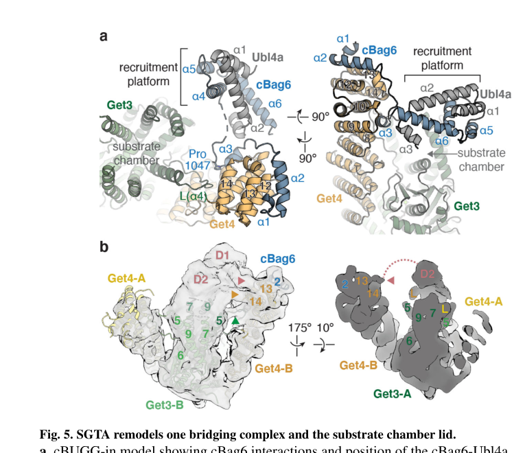

## Question

# Gene Research for Functional Annotation

## ⚠️ CRITICAL: Gene/Protein Identification Context

**BEFORE YOU BEGIN RESEARCH:** You MUST verify you are researching the CORRECT gene/protein. Gene symbols can be ambiguous, especially for less well-characterized genes from non-model organisms.

### Target Gene/Protein Identity (from UniProt):
- **UniProt Accession:** Q7L5D6
- **Protein Description:** RecName: Full=Golgi to ER traffic protein 4 homolog {ECO:0000305}; AltName: Full=Conserved edge-expressed protein; AltName: Full=Transmembrane domain recognition complex 35 kDa subunit; Short=TRC35;
- **Gene Information:** Name=GET4 {ECO:0000312|HGNC:HGNC:21690}; Synonyms=C7orf20, CEE, TRC35; ORFNames=CGI-20;
- **Organism (full):** Homo sapiens (Human).
- **Protein Family:** Belongs to the GET4 family. .
- **Key Domains:** GET4. (IPR007317); TPR-like_helical_dom_sf. (IPR011990); GET4 (PF04190)

### MANDATORY VERIFICATION STEPS:

1. **Check if the gene symbol "GET4" matches the protein description above**
2. **Verify the organism is correct:** Homo sapiens (Human).
3. **Check if protein family/domains align with what you find in literature**
4. **If you find literature for a DIFFERENT gene with the same or similar symbol, STOP**

### If Gene Symbol is Ambiguous or You Cannot Find Relevant Literature:

**DO NOT PROCEED WITH RESEARCH ON A DIFFERENT GENE.** Instead:
- State clearly: "The gene symbol 'GET4' is ambiguous or literature is limited for this specific protein"
- Explain what you found (e.g., "Found extensive literature on a different gene with the same symbol in a different organism")
- Describe the protein based ONLY on the UniProt information provided above
- Suggest that the protein function can be inferred from domain/family information

### Research Target:

Please provide a comprehensive research report on the gene **GET4** (gene ID: GET4, UniProt: Q7L5D6) in human.

The research report should be a detailed narrative explaining the function, biological processes, and localization of the gene product. Citations should be given for all claims.

You should prioritize authoritative reviews and primary scientific literature when conducting research. You can supplement
this with annotations you find in gene/protein databases, but these can be outdated or inaccurate.

We are specifically interested in the primary function of the gene - for enzymes, what reaction is catalyzed, and what is the substrate specificity? For transporters, what is the substrate? For structural proteins or adapters, what is the broader structural role? For signaling molecules, what is the role in the pathway.

We are interested in where in or outside the cell the gene product carries out its function.

We are also interested in the signaling or biochemical pathways in which the gene functions. We are less interested in broad pleiotropic effects, except where these elucidate the precise role.

Include evidence where possible. We are interested in both experimental evidence as well as inference from structure, evolution, or bioinformatic analysis. Precise studies should be prioritized over high-throughput, where available.

## Output

Question: You are an expert researcher providing comprehensive, well-cited information.

Provide detailed information focusing on:
1. Key concepts and definitions with current understanding
2. Recent developments and latest research (prioritize 2023-2024 sources)
3. Current applications and real-world implementations
4. Expert opinions and analysis from authoritative sources
5. Relevant statistics and data from recent studies

Format as a comprehensive research report with proper citations. Include URLs and publication dates where available.
Always prioritize recent, authoritative sources and provide specific citations for all major claims.

# Gene Research for Functional Annotation

## ⚠️ CRITICAL: Gene/Protein Identification Context

**BEFORE YOU BEGIN RESEARCH:** You MUST verify you are researching the CORRECT gene/protein. Gene symbols can be ambiguous, especially for less well-characterized genes from non-model organisms.

### Target Gene/Protein Identity (from UniProt):
- **UniProt Accession:** Q7L5D6
- **Protein Description:** RecName: Full=Golgi to ER traffic protein 4 homolog {ECO:0000305}; AltName: Full=Conserved edge-expressed protein; AltName: Full=Transmembrane domain recognition complex 35 kDa subunit; Short=TRC35;
- **Gene Information:** Name=GET4 {ECO:0000312|HGNC:HGNC:21690}; Synonyms=C7orf20, CEE, TRC35; ORFNames=CGI-20;
- **Organism (full):** Homo sapiens (Human).
- **Protein Family:** Belongs to the GET4 family. .
- **Key Domains:** GET4. (IPR007317); TPR-like_helical_dom_sf. (IPR011990); GET4 (PF04190)

### MANDATORY VERIFICATION STEPS:

1. **Check if the gene symbol "GET4" matches the protein description above**
2. **Verify the organism is correct:** Homo sapiens (Human).
3. **Check if protein family/domains align with what you find in literature**
4. **If you find literature for a DIFFERENT gene with the same or similar symbol, STOP**

### If Gene Symbol is Ambiguous or You Cannot Find Relevant Literature:

**DO NOT PROCEED WITH RESEARCH ON A DIFFERENT GENE.** Instead:
- State clearly: "The gene symbol 'GET4' is ambiguous or literature is limited for this specific protein"
- Explain what you found (e.g., "Found extensive literature on a different gene with the same symbol in a different organism")
- Describe the protein based ONLY on the UniProt information provided above
- Suggest that the protein function can be inferred from domain/family information

### Research Target:

Please provide a comprehensive research report on the gene **GET4** (gene ID: GET4, UniProt: Q7L5D6) in human.

The research report should be a detailed narrative explaining the function, biological processes, and localization of the gene product. Citations should be given for all claims.

You should prioritize authoritative reviews and primary scientific literature when conducting research. You can supplement
this with annotations you find in gene/protein databases, but these can be outdated or inaccurate.

We are specifically interested in the primary function of the gene - for enzymes, what reaction is catalyzed, and what is the substrate specificity? For transporters, what is the substrate? For structural proteins or adapters, what is the broader structural role? For signaling molecules, what is the role in the pathway.

We are interested in where in or outside the cell the gene product carries out its function.

We are also interested in the signaling or biochemical pathways in which the gene functions. We are less interested in broad pleiotropic effects, except where these elucidate the precise role.

Include evidence where possible. We are interested in both experimental evidence as well as inference from structure, evolution, or bioinformatic analysis. Precise studies should be prioritized over high-throughput, where available.

## Research report: Human GET4 (TRC35) functional annotation (UniProt Q7L5D6)

### 0) Target verification (critical disambiguation)
The target is **human GET4** (synonyms **TRC35, C7orf20, CEE, CGI-20**), the metazoan homolog of yeast **Get4**, and a core component of the mammalian **TRC/GET tail-anchored (TA) protein targeting pathway**. This mapping is explicitly stated in comparative pathway literature that equates metazoan Get4 with **TRC35** and cites **UniProt Q7L5D6** in this context. (najdrova2022conservedmechanismfor pages 16-20, najdrova2022conservedmechanismfor pages 20-23)

### 1) Key concepts and definitions (current understanding)

#### Tail-anchored (TA) proteins
**TA proteins** are single-pass membrane proteins whose **hydrophobic transmembrane domain (TMD) is at the extreme C-terminus**, so the targeting signal emerges only after translation terminates; therefore TA proteins are primarily handled by **post-translational** targeting systems. (najdrova2022conservedmechanismfor pages 88-98)

#### GET/TRC pathway (guided entry of TA proteins / transmembrane recognition complex)
The **GET pathway** (yeast terminology) and **TRC pathway** (mammalian terminology) constitute a conserved cytosolic-to-ER relay that captures TA TMDs in the cytosol, loads them onto a targeting ATPase (**Get3 in yeast; TRC40/ASNA1 in mammals**), and delivers them to an ER membrane receptor/insertase (**Get1/Get2 in yeast; WRB/CAML in mammals**) for insertion. (najdrova2022conservedmechanismfor pages 16-20, farkas2021captureanddelivery pages 1-3)

#### Where GET4/TRC35 fits
GET4/TRC35 is **not an enzyme** and does **not catalyze a chemical reaction**. Its primary role is as a **scaffold/adaptor in the pre-targeting complex** that promotes **client handoff** to TRC40 and coordinates targeting vs quality-control decisions for hydrophobic clients. (pool2022targetingofproteins pages 7-9, keszei2021structuralinsightsinto pages 6-7)

### 2) Molecular function and mechanism of GET4/TRC35

#### 2.1 Core molecular function: pretargeting scaffold to load TA substrates onto TRC40
Multiple reviews and structural studies converge on a mechanistic model in which GET4/TRC35 participates in the cytosolic pretargeting complex that connects upstream TA capture factors to the downstream targeting ATPase:

- In mammals, the pretargeting machinery is described as a **BAG6-containing complex** often written as **BAG6–UBL4A–TRC35 (GET4)** that accepts TA substrates from **SGTA** and transfers them to **TRC40** for delivery to the ER receptor **WRB/CAML**. (mock2017structuralbasisfor pages 1-2, farkas2021captureanddelivery pages 1-3)
- In a mechanistically explicit review of ER targeting, TRC35 is described as **ribosome-associated** and part of the **BAG6 complex**, functioning near the ribosomal exit to enhance recruitment of TA-handling factors and promote efficient handover of TA clients to TRC40. (pool2022targetingofproteins pages 7-9)

#### 2.2 Structural and biophysical evidence for GET4’s mechanistic role
A key primary structural study defined the **metazoan pretargeting GET complex architecture** (cBUGG: cBag6–Ubl4a–Get4–Get3) and how it promotes substrate transfer:

- **Cryo-EM architecture:** Ubl4a and cBag6 assemble with Get4 to form a **“recruitment platform”** positioned above the Get3 substrate chamber, consistent with a structural role for Get4 in organizing TA substrate loading and transfer. (keszei2021structuralinsightsinto pages 6-7, keszei2021structuralinsightsinto media 33007d62)
- **Functional interface evidence:** Secondary Get3–Get4 interactions were shown to be important for **SGTA→Get3 transfer**, because a Get3 interface mutation disrupted transfer while not blocking TA capture by Get3 in a reconstituted translation system—supporting a transfer-catalysis/scaffolding function rather than direct substrate binding as the primary role. (keszei2021structuralinsightsinto pages 6-7)

These data support the current view that GET4/TRC35 is a **noncatalytic organizational factor** that enhances the efficiency and fidelity of TA handoff to TRC40/ASNA1. (keszei2021structuralinsightsinto pages 6-7)

### 3) Interaction partners and complexes

#### 3.1 The BAG6–UBL4A–GET4/TRC35 complex
In metazoans, yeast Get4/Get5 is replaced/augmented by a heterotrimeric complex containing **BAG6, UBL4A (Get5 homolog), and TRC35/GET4**. This complex is repeatedly described as central to TA biogenesis and transfer to TRC40. (najdrova2022conservedmechanismfor pages 16-20, mock2017structuralbasisfor pages 1-2)

#### 3.2 Upstream and downstream partners in the TA relay
- **Upstream capture:** **SGTA** (Sgt2 homolog) captures newly released TA clients and interfaces with the BAG6–UBL4A–TRC35 module. (mock2017structuralbasisfor pages 1-2, qin2023targetingandsurveillance pages 1-2)
- **Downstream targeting ATPase:** **TRC40/ASNA1** accepts substrates for delivery to the ER. (mock2017structuralbasisfor pages 1-2)
- **ER insertion receptor/insertase:** **WRB/CAML** is the downstream ER-resident receptor/insertase for TRC40-delivered TA clients. (najdrova2022conservedmechanismfor pages 16-20, farkas2021captureanddelivery pages 1-3)

### 4) Subcellular localization: where GET4 acts

#### 4.1 Cytosolic and ribosome-proximal action
GET4/TRC35 functions in the cytosol, early in the pathway, in a ribosome-proximal capture/transfer environment as described in reviews of ER targeting and TA biogenesis. (pool2022targetingofproteins pages 7-9, qin2023targetingandsurveillance pages 1-2)

#### 4.2 Regulation of BAG6 nucleo-cytoplasmic distribution (direct human evidence)
A major human-specific mechanistic finding is that TRC35 directly regulates where **BAG6** resides:

- TRC35 binds BAG6 in a manner that **masks the BAG6 nuclear localization sequence (NLS)**, preventing BAG6 binding to import machinery and thereby **retaining BAG6 in the cytosol**. (mock2017structuralbasisfor pages 1-2, mock2017structuralbasisfor pages 2-3)

This provides a concrete mechanistic link between the TA targeting apparatus and cellular compartmentalization of a multifunctional cofactor (BAG6). (mock2017structuralbasisfor pages 1-2)

### 5) Quality control roles connected to GET4/TRC35 (proteostasis functions)

#### 5.1 Targeting vs degradation decision-making in BAG6-containing complexes
Beyond productive TA targeting, BAG6-containing complexes are described as mediating **triage** of exposed hydrophobic segments: substrates can be transferred to TRC40 for insertion or directed toward **ubiquitin–proteasome degradation** when targeting fails or clients are defective/mislocalized. (costa2017intracellulartargetingof pages 25-30, farkas2021captureanddelivery pages 1-3)

This contextualizes GET4/TRC35 as part of a network that couples membrane-protein biogenesis to proteostasis quality control. (pool2022targetingofproteins pages 7-9)

#### 5.2 TRC35 stability is controlled by BAG6 association and ubiquitination
In human TRC35 biology, proper assembly with BAG6 affects TRC35 stability:

- Disruption of physiological BAG6–TRC35 association leads to increased **ubiquitylated TRC35** and reduced steady-state TRC35 levels; these TRC35 reductions can be rescued by proteasome inhibition (**MG132**). The BAG6-associated E3 ligase **RNF126** is implicated in TRC35 ubiquitylation when TRC35 is unassembled/misassembled. (mock2017structuralbasisfor pages 2-3)

This supports a model in which GET4/TRC35 is itself surveilled by quality-control machinery, and correct complex assembly protects it. (mock2017structuralbasisfor pages 2-3)

### 6) Recent developments (prioritizing 2023–2024)
Direct GET4/TRC35-focused primary literature in 2024 was limited in the accessible corpus for this run; however, 2023 studies provide meaningful, mechanistically relevant updates on the **stress sensitivity** and **broader proteostasis integration** of the BAG6–UBL4A–GET4 module.

#### 6.1 2023 review synthesis: targeting and surveillance mechanisms
A 2023 review summarizes the TRC/GET system as a conserved TA targeting route and reiterates the key role of the Get4/TRC35 pretargeting complex (with UBL4A, BAG6) in TA capture and transfer, emphasizing the integration of targeting with surveillance of mistargeted TA proteins. (qin2023targetingandsurveillance pages 1-2)

Publication: **Qin et al. 2023-01**, *The Innovation Life*. URL: https://doi.org/10.59717/j.xinn-life.2023.100013 (qin2023targetingandsurveillance pages 1-2)

#### 6.2 2023 primary study: proteotoxic stress remodels the complex (with quantitative statistics)
A 2023 Biochemical Journal study tested how proteotoxic stresses affect complex integrity:

- Disease-associated polyQ inclusions and stresses such as proteasome inhibition and mitochondrial depolarization stimulate **dissociation of UBL4A from BAG6** (a core association in the BAG6–UBL4A–GET4 complex), consistent with stress-induced impairment of TA biogenesis machinery and/or reallocation toward aggregate handling. (hagiwara2023proteotoxicstressesstimulate pages 7-10, hagiwara2023proteotoxicstressesstimulate pages 1-3)
- Quantitative reporting included: **co-IP with 6 biological replicates**, statistical testing with Student’s t-test; **NanoBiT CCCP time course n=3 with P<0.01**; and a **CCCP 4-hour assay n=4 with P<0.01** (Welch’s t-test). (hagiwara2023proteotoxicstressesstimulate pages 7-10)

Publication: **Hagiwara et al. 2023-10**, *Biochemical Journal*. URL: https://doi.org/10.1042/bcj20230267 (hagiwara2023proteotoxicstressesstimulate pages 7-10)

#### 6.3 2023: broader proteostasis and translation surveillance contexts
A 2023 *Nature* paper (noncoding translation mitigation) identifies BAG6 pathway components including **TRC35/GET4** in a broader proteostasis/surveillance context (as reported in the retrieved snippet), supporting the idea that GET4-containing modules participate not only in TA targeting but also in mitigation of aberrant translation-derived hydrophobic products. (OpenTargets Search: -GET4)

Publication: **Kesner et al. 2023-04**, *Nature*. URL: https://doi.org/10.1038/s41586-023-05946-4 (OpenTargets Search: -GET4)

### 7) Current applications and real-world implementations

#### 7.1 Practical biological applications
In practice, GET4/TRC35 is used as a mechanistic handle to:

- Study **TA protein biogenesis fidelity** (TA clients include key membrane-trafficking proteins such as SNAREs) and how cytosolic chaperone cascades prevent aggregation of hydrophobic TMDs. (farkas2021captureanddelivery pages 1-3)
- Probe **proteostasis/quality control** mechanisms at the interface of targeting and degradation, including how BAG6-centered networks triage hydrophobic clients. (farkas2021captureanddelivery pages 1-3, mock2017structuralbasisfor pages 2-3)

These applications are most mature in mechanistic cell biology and structural biology rather than direct clinical implementation.

#### 7.2 Tooling and experimental platforms
- **Cryo-EM and crosslinking** have enabled structural characterization of the recruitment platform and remodeling by SGTA, providing a framework for mutational/functional studies of substrate transfer. (keszei2021structuralinsightsinto pages 6-7, keszei2021structuralinsightsinto media 33007d62)
- **NanoBiT complementation assays** can quantify complex integrity changes under stress, as in the 2023 UBL4A–BAG6 dissociation study. (hagiwara2023proteotoxicstressesstimulate pages 7-10)

### 8) Expert opinions and authoritative synthesis
Several authoritative reviews emphasize a consistent expert consensus:

- TA targeting is best viewed as a **multi-component chaperone cascade** in which scaffolding factors (Get4/TRC35 complexes) promote efficient substrate relay to the targeting ATPase and couple targeting decisions to quality control, especially for hydrophobic clients that would otherwise aggregate. (shan2019guidingtailanchoredmembrane pages 2-4, pool2022targetingofproteins pages 7-9)
- Modern structural work supports an architecture in which Get4 acts as a **platform organizer** positioned over Get3/TRC40 to promote transfer rather than as the direct substrate-binding core of the pathway. (keszei2021structuralinsightsinto pages 6-7)

### 9) Disease associations and phenotypes (evidence strength and caveats)

#### 9.1 Curated association-level links (Open Targets)
Open Targets aggregates evidence connecting GET4 to several disease/phenotype terms, including **neurodegenerative disease**, **atrial fibrillation**, **atrial flutter**, and **congenital disorder of glycosylation type IIy**. These are **associations** drawn from specific studies/variants and functional screens, not proof of direct causality or a defined GET4 mechanism in each disease. (OpenTargets Search: -GET4)

#### 9.2 Mechanistic plausibility from proteostasis literature
Given that the BAG6–UBL4A–GET4 module is implicated in:

- TA biogenesis (which affects vesicular trafficking and secretory pathway function), (farkas2021captureanddelivery pages 1-3)
- quality control and proteotoxic stress responses (including stress-driven complex dissociation), (hagiwara2023proteotoxicstressesstimulate pages 7-10)
- stability/ubiquitylation control of TRC35 itself (RNF126, proteasome dependence), (mock2017structuralbasisfor pages 2-3)

it is mechanistically plausible that perturbations could contribute to proteostasis-linked diseases, but the accessible primary clinical genetics evidence for GET4 specifically was limited in this run.

### 10) Visual evidence (complex architecture)
The cryo-EM figure extracted from Keszei et al. illustrates the **cBUGG** (cBag6–Ubl4a–Get4–Get3) architecture and how **SGTA remodels** it, supporting the “recruitment platform” concept for GET4/TRC35 function. (keszei2021structuralinsightsinto media 33007d62, keszei2021structuralinsightsinto media 2e1a5e15)

### 11) Summary table of functional annotation
The following table consolidates identity, molecular function, partners, localization, QC roles, and key references.

| Entity / aspect | Summary for human GET4 / TRC35 | Key evidence / mechanism | Evidence type | Key references |
|---|---|---|---|---|
| Identity | **GET4** encodes the human **guided entry of tail-anchored proteins factor 4**; common aliases include **TRC35**, **C7orf20**, **CEE**, and **CGI-20**. It is the metazoan homolog of yeast **Get4** and matches the UniProt target **Q7L5D6** discussed in the GET/TRC literature (najdrova2022conservedmechanismfor pages 16-20, najdrova2022conservedmechanismfor pages 20-23). | Conserved assignment of metazoan Get4 to TRC35/GET4 in reviews and comparative pathway analyses (najdrova2022conservedmechanismfor pages 16-20, najdrova2022conservedmechanismfor pages 20-23). | Comparative pathway mapping, review | Qin 2023, *The Innovation Life*, doi: https://doi.org/10.59717/j.xinn-life.2023.100013 ; Pool 2022, *IJMS*, doi: https://doi.org/10.3390/ijms23073773 |
| Primary molecular function | GET4/TRC35 is a **cytosolic pretargeting scaffold/adaptor** in the **GET/TRC pathway** for **tail-anchored (TA) membrane proteins**. It does **not catalyze a chemical reaction**; instead, it helps organize factors that capture, shield, and hand off hydrophobic TA transmembrane domains to the targeting ATPase **TRC40/ASNA1** for ER delivery (pool2022targetingofproteins pages 7-9, shan2019guidingtailanchoredmembrane pages 2-4, najdrova2022conservedmechanismfor pages 16-20, keszei2021structuralinsightsinto pages 6-7). | Reviews and structural work place Get4/TRC35 in the upstream relay between SGTA/Sgt2 and Get3/TRC40, promoting efficient substrate loading onto the ATPase (pool2022targetingofproteins pages 7-9, shan2019guidingtailanchoredmembrane pages 2-4, keszei2021structuralinsightsinto pages 6-7). | Review, biochemical, cryo-EM | Shan 2019, *JBC*, doi: https://doi.org/10.1074/jbc.rev119.006197 ; Keszei 2021, *Nat Struct Mol Biol*, doi: https://doi.org/10.1038/s41594-021-00690-7 |
| Core complex composition | In mammals, GET4/TRC35 is a stable component of the **BAG6–UBL4A–GET4** pretargeting complex (often treated as the metazoan counterpart of yeast Get4/Get5). **BAG6** binds both **GET4/TRC35** and **UBL4A/Get5**; **SGTA** acts upstream in TA capture; **TRC40/ASNA1** is the downstream targeting ATPase; ER insertion is completed at **WRB/CAML** (costa2017intracellulartargetingof pages 25-30, najdrova2022conservedmechanismfor pages 16-20, mock2017structuralbasisfor pages 1-2, farkas2021captureanddelivery pages 1-3). | Human/metazoan studies and reviews describe a heterotrimeric BAG6–UBL4A–TRC35 complex that receives TA substrates from SGTA and transfers them to TRC40 for delivery to WRB/CAML (mock2017structuralbasisfor pages 1-2, farkas2021captureanddelivery pages 1-3). | Structural, biochemical, review | Mock 2017, *PNAS*, doi: https://doi.org/10.1073/pnas.1702940114 ; Farkas & Bohnsack 2021, *J Cell Biol*, doi: https://doi.org/10.1083/jcb.202105004 |
| Mechanistic role in TA targeting: capture and handoff | Canonical handoff sequence: **ribosome / chaperones → SGTA → BAG6–UBL4A–GET4(TRC35) → TRC40/ASNA1 → WRB/CAML at the ER**. GET4/TRC35 helps create the recruitment platform that positions upstream factors for **TA substrate transfer** to Get3/TRC40; in metazoan cryo-EM, UBL4A-cBAG6-GET4 forms a recruitment platform above the Get3 substrate chamber (keszei2021structuralinsightsinto pages 6-7, keszei2021structuralinsightsinto media 33007d62). | Keszei et al. defined a metazoan pretargeting architecture where Get4 helps position Ubl4a/BAG6 to recruit SGTA and promote substrate transfer; mutations affecting the secondary Get3–Get4 interface impaired **SGTA→Get3 transfer** without blocking Get3 substrate capture per se (keszei2021structuralinsightsinto pages 6-7). | Cryo-EM, crosslinking, biochemical | Keszei 2021, *Nat Struct Mol Biol*, doi: https://doi.org/10.1038/s41594-021-00690-7 ; Figure context (keszei2021structuralinsightsinto media 33007d62) |
| Ribosome association / early targeting stage | GET4/TRC35 functions **early**, close to the site of synthesis. Reviews describe the mammalian pretargeting machinery as **ribosome-associated** or **ribosome-proximal**, with TA capture occurring at or near the ribosome before handoff to TRC40; Get4/TRC35 was also identified among ribosome-associated proteins in comparative analyses (pool2022targetingofproteins pages 7-9, qin2023targetingandsurveillance pages 1-2, najdrova2022conservedmechanismfor pages 20-23). | Pool 2022 describes TRC35 within ribosome-associated BAG6 complexes; Qin 2023 discusses ribosome-proximal capture and competition near the tunnel exit; comparative analysis notes Get4 identification in ribosome-associated screens (pool2022targetingofproteins pages 7-9, qin2023targetingandsurveillance pages 1-2, najdrova2022conservedmechanismfor pages 20-23). | Review, proteomic / comparative inference | Pool 2022, *IJMS*, doi: https://doi.org/10.3390/ijms23073773 ; Qin 2023, *The Innovation Life*, doi: https://doi.org/10.59717/j.xinn-life.2023.100013 |
| Subcellular localization | Best-supported localization is **cytosolic**, within the **pretargeting complex** acting before ER membrane insertion. Functionally, GET4/TRC35 is linked to ER targeting through its interaction network, but it is not itself the ER insertase; ER insertion is mediated by **WRB/CAML** after TRC40 delivery (najdrova2022conservedmechanismfor pages 16-20, mock2017structuralbasisfor pages 1-2, farkas2021captureanddelivery pages 1-3). | Cytosolic pretargeting role is consistently reported in reviews and structural studies; downstream localization step is ER membrane insertion by WRB/CAML, not by GET4 itself (najdrova2022conservedmechanismfor pages 16-20, mock2017structuralbasisfor pages 1-2, farkas2021captureanddelivery pages 1-3). | Review, structural | Mock 2017, *PNAS*, doi: https://doi.org/10.1073/pnas.1702940114 ; Farkas & Bohnsack 2021, *J Cell Biol*, doi: https://doi.org/10.1083/jcb.202105004 |
| Control of BAG6 nucleo-cytoplasmic distribution | A key human-specific mechanistic finding is that **TRC35 masks the BAG6 nuclear localization sequence (NLS)**, thereby **retaining BAG6 in the cytosol**. Overexpression of TRC35 increases cytosolic retention of BAG6; structural analysis showed TRC35 occludes the first basic cluster of the BAG6 NLS (mock2017structuralbasisfor pages 1-2, mock2017structuralbasisfor pages 2-3). | Human crystal structure and biochemical assays support direct Bag6–TRC35 interfaces; buried surface metrics and mutational effects showed that physiological complex assembly regulates BAG6 localization (mock2017structuralbasisfor pages 1-2, mock2017structuralbasisfor pages 2-3). | Crystal structure, biochemical, cell biology | Mock 2017, *PNAS*, doi: https://doi.org/10.1073/pnas.1702940114 |
| Quality control role: substrate triage | GET4/TRC35 participates in a module that links **TA targeting** with **cytosolic quality control**. BAG6-containing complexes can direct hydrophobic or mislocalized clients either toward productive loading onto TRC40 or toward **ubiquitin-proteasome degradation**, helping prevent aggregation of exposed transmembrane segments (pool2022targetingofproteins pages 7-9, costa2017intracellulartargetingof pages 25-30, farkas2021captureanddelivery pages 1-3, hagiwara2023proteotoxicstressesstimulate pages 1-3). | Reviews emphasize the dual targeting-versus-degradation role of BAG6 complexes; Hagiwara 2023 further links this machinery to aggregate/proteotoxic stress responses (farkas2021captureanddelivery pages 1-3, hagiwara2023proteotoxicstressesstimulate pages 1-3). | Review, biochemical | Farkas & Bohnsack 2021, *J Cell Biol*, doi: https://doi.org/10.1083/jcb.202105004 ; Hagiwara 2023, *Biochem J*, doi: https://doi.org/10.1042/bcj20230267 |
| Quality control role: RNF126 and TRC35 stability | Human studies indicate that **unassembled or mutant TRC35** can become a target of **RNF126-mediated ubiquitylation** in the BAG6-associated quality-control network. Proper Bag6 association protects TRC35; Bag6-disrupting mutants increased Ub-conjugated TRC35 and lowered steady-state TRC35 levels, reversible by proteasome inhibition (**MG132**) (mock2017structuralbasisfor pages 2-3). | Mock et al. identified RNF126 as a Bag6-associated E3 ligase implicated in TRC35 ubiquitylation and showed that disrupted physiological Bag6–TRC35 interaction destabilizes TRC35 (mock2017structuralbasisfor pages 2-3). | Structural, biochemical, ubiquitination assay | Mock 2017, *PNAS*, doi: https://doi.org/10.1073/pnas.1702940114 |
| Proteotoxic stress effects (2023) | In 2023, proteotoxic stress studies showed that the TA recognition complex is stress-sensitive: **polyQ aggregates**, **proteasome inhibition**, and **CCCP-induced mitochondrial depolarization** promoted **dissociation of UBL4A from BAG6**, implying that the BAG6–UBL4A–GET4 module is remodeled under proteotoxic conditions and may shift away from normal TA biogenesis (hagiwara2023proteotoxicstressesstimulate pages 7-10, hagiwara2023proteotoxicstressesstimulate pages 1-3). | Hagiwara et al. reported quantitative assays: co-IP with **n = 6** biological replicates analyzed by Student’s *t*-test; NanoBiT CCCP time-course **n = 3**, **P < 0.01**; CCCP 4 h assay **n = 4**, Welch’s *t*-test, **P < 0.01** (hagiwara2023proteotoxicstressesstimulate pages 7-10). | Biochemical, cell assay, quantitative stress biology | Hagiwara 2023, *Biochem J*, doi: https://doi.org/10.1042/bcj20230267 |
| Related nuclear / DNA-damage context | The strongest direct evidence concerns **BAG6**, not GET4 as an autonomous nuclear factor. Because TRC35 controls BAG6 cytosolic retention, it indirectly interfaces with BAG6’s reported nuclear functions in **p300 acetylation**, **histone methylation**, and **DNA-damage signaling-mediated cell death**; however, direct GET4-specific nuclear signaling functions remain less established than its pretargeting role (mock2017structuralbasisfor pages 1-2). | Mock 2017 explicitly ties TRC35 to BAG6 localization control while noting BAG6 nuclear functions; evidence is indirect for GET4 beyond localization control (mock2017structuralbasisfor pages 1-2). | Structural, cell biology, literature synthesis | Mock 2017, *PNAS*, doi: https://doi.org/10.1073/pnas.1702940114 |
| 2023–2024 broader relevance / applications | Recent literature places GET4/TRC35-containing BAG6 complexes in broader **proteostasis surveillance**, including mitigation of aberrant noncoding translation products and maintenance of membrane protein biogenesis fidelity. One 2023 *Nature* study identified **BAG6, TRC35/GET4, RNF126, SGTA, and UBL4A** in this surveillance axis (OpenTargets Search: -GET4). Disease links in Open Targets are currently **association-level** rather than definitive mechanism-level annotations for GET4 itself (OpenTargets Search: -GET4). | Evidence supports translational quality control relevance but not yet a mature clinical application directly targeting GET4; Open Targets associations include neurodegenerative disease and congenital disorder of glycosylation type IIy, but these should be interpreted cautiously as evidence aggregation rather than causal proof (OpenTargets Search: -GET4). | Genetics / CRISPRi association, database aggregation | Kesner 2023, *Nature*, doi: https://doi.org/10.1038/s41586-023-05946-4 ; Open Targets context (OpenTargets Search: -GET4) |

*Table: This table summarizes the best-supported functions, interactions, localization, quality-control roles, and recent developments for human GET4/TRC35 (UniProt Q7L5D6). It emphasizes experimentally grounded mechanisms in tail-anchored protein targeting and distinguishes direct evidence from broader association-level disease links.*

### 12) Key takeaways (functional annotation statement)
**Human GET4/TRC35 (UniProt Q7L5D6)** is a conserved, cytosolic, ribosome-proximal **pretargeting scaffold** in the **TRC/GET pathway** that promotes **handoff of nascent tail-anchored membrane proteins** from **SGTA** to the targeting ATPase **TRC40/ASNA1**, enabling delivery to the ER insertase **WRB/CAML**. Its best-supported additional roles are in **proteostasis-linked triage** (via the BAG6 module), including regulation of **BAG6 localization** through NLS masking and stabilization of TRC35 by preventing inappropriate **RNF126/proteasome-mediated degradation** of unassembled TRC35; and the complex is **stress-sensitive**, with proteotoxic insults promoting dissociation of UBL4A–BAG6 interactions. (mock2017structuralbasisfor pages 1-2, keszei2021structuralinsightsinto pages 6-7, pool2022targetingofproteins pages 7-9, mock2017structuralbasisfor pages 2-3, hagiwara2023proteotoxicstressesstimulate pages 7-10)

References

1. (najdrova2022conservedmechanismfor pages 16-20): V Najdrová. Conserved mechanism for targeting of tail-anchored proteins in eukaryotes. Unknown journal, 2022.

2. (najdrova2022conservedmechanismfor pages 20-23): V Najdrová. Conserved mechanism for targeting of tail-anchored proteins in eukaryotes. Unknown journal, 2022.

3. (najdrova2022conservedmechanismfor pages 88-98): V Najdrová. Conserved mechanism for targeting of tail-anchored proteins in eukaryotes. Unknown journal, 2022.

4. (farkas2021captureanddelivery pages 1-3): Ákos Farkas and Katherine E. Bohnsack. Capture and delivery of tail-anchored proteins to the endoplasmic reticulum. The Journal of Cell Biology, Jul 2021. URL: https://doi.org/10.1083/jcb.202105004, doi:10.1083/jcb.202105004. This article has 49 citations.

5. (pool2022targetingofproteins pages 7-9): Martin R. Pool. Targeting of proteins for translocation at the endoplasmic reticulum. International Journal of Molecular Sciences, 23:3773, Mar 2022. URL: https://doi.org/10.3390/ijms23073773, doi:10.3390/ijms23073773. This article has 41 citations.

6. (keszei2021structuralinsightsinto pages 6-7): Alexander F. A. Keszei, Matthew C. J. Yip, Ta-Chien Hsieh, and Sichen Shao. Structural insights into metazoan pretargeting get complexes. Nature Structural & Molecular Biology, 28:1029-1037, Dec 2021. URL: https://doi.org/10.1038/s41594-021-00690-7, doi:10.1038/s41594-021-00690-7. This article has 16 citations and is from a highest quality peer-reviewed journal.

7. (mock2017structuralbasisfor pages 1-2): Jee-Young Mock, Yue Xu, Yihong Ye, and William M. Clemons. Structural basis for regulation of the nucleo-cytoplasmic distribution of bag6 by trc35. Proceedings of the National Academy of Sciences, 114:11679-11684, Oct 2017. URL: https://doi.org/10.1073/pnas.1702940114, doi:10.1073/pnas.1702940114. This article has 29 citations and is from a highest quality peer-reviewed journal.

8. (keszei2021structuralinsightsinto media 33007d62): Alexander F. A. Keszei, Matthew C. J. Yip, Ta-Chien Hsieh, and Sichen Shao. Structural insights into metazoan pretargeting get complexes. Nature Structural & Molecular Biology, 28:1029-1037, Dec 2021. URL: https://doi.org/10.1038/s41594-021-00690-7, doi:10.1038/s41594-021-00690-7. This article has 16 citations and is from a highest quality peer-reviewed journal.

9. (qin2023targetingandsurveillance pages 1-2): Qing Qin, Kang Shen, and Xiangming Wang. Targeting and surveillance mechanisms for tail-anchored proteins. The Innovation Life, 1:100013, Jan 2023. URL: https://doi.org/10.59717/j.xinn-life.2023.100013, doi:10.59717/j.xinn-life.2023.100013. This article has 2 citations.

10. (mock2017structuralbasisfor pages 2-3): Jee-Young Mock, Yue Xu, Yihong Ye, and William M. Clemons. Structural basis for regulation of the nucleo-cytoplasmic distribution of bag6 by trc35. Proceedings of the National Academy of Sciences, 114:11679-11684, Oct 2017. URL: https://doi.org/10.1073/pnas.1702940114, doi:10.1073/pnas.1702940114. This article has 29 citations and is from a highest quality peer-reviewed journal.

11. (costa2017intracellulartargetingof pages 25-30): B. F. Costa, S. Colombo, P. Cassella, and N. Borgese. 'intracellular targeting of tail-anchored proteins'. Text, Jan 2017. URL: https://doi.org/10.13130/b-g-figueiredo-costa\_phd2017-01-27, doi:10.13130/b-g-figueiredo-costa\_phd2017-01-27. This article has 0 citations and is from a peer-reviewed journal.

12. (hagiwara2023proteotoxicstressesstimulate pages 7-10): Takumi Hagiwara, Ryosuke Minami, Chizuru Ushio, Naoto Yokota, and Hiroyuki Kawahara. Proteotoxic stresses stimulate dissociation of ubl4a from the tail-anchored protein recognition complex. Biochemical Journal, 480:1583-1598, Oct 2023. URL: https://doi.org/10.1042/bcj20230267, doi:10.1042/bcj20230267. This article has 0 citations and is from a domain leading peer-reviewed journal.

13. (hagiwara2023proteotoxicstressesstimulate pages 1-3): Takumi Hagiwara, Ryosuke Minami, Chizuru Ushio, Naoto Yokota, and Hiroyuki Kawahara. Proteotoxic stresses stimulate dissociation of ubl4a from the tail-anchored protein recognition complex. Biochemical Journal, 480:1583-1598, Oct 2023. URL: https://doi.org/10.1042/bcj20230267, doi:10.1042/bcj20230267. This article has 0 citations and is from a domain leading peer-reviewed journal.

14. (OpenTargets Search: -GET4): Open Targets Query (-GET4, 5 results). Buniello, A. et al. (2025). Open Targets Platform: facilitating therapeutic hypotheses building in drug discovery. Nucleic Acids Research.

15. (shan2019guidingtailanchoredmembrane pages 2-4): Shu-ou Shan. Guiding tail-anchored membrane proteins to the endoplasmic reticulum in a chaperone cascade. Journal of Biological Chemistry, 294:16577-16586, Nov 2019. URL: https://doi.org/10.1074/jbc.rev119.006197, doi:10.1074/jbc.rev119.006197. This article has 41 citations and is from a domain leading peer-reviewed journal.

16. (keszei2021structuralinsightsinto media 2e1a5e15): Alexander F. A. Keszei, Matthew C. J. Yip, Ta-Chien Hsieh, and Sichen Shao. Structural insights into metazoan pretargeting get complexes. Nature Structural & Molecular Biology, 28:1029-1037, Dec 2021. URL: https://doi.org/10.1038/s41594-021-00690-7, doi:10.1038/s41594-021-00690-7. This article has 16 citations and is from a highest quality peer-reviewed journal.

## Artifacts

- [Edison artifact artifact-00](GET4-deep-research-falcon_artifacts/artifact-00.md)

## Citations

1. najdrova2022conservedmechanismfor pages 88-98
2. pool2022targetingofproteins pages 7-9
3. keszei2021structuralinsightsinto pages 6-7
4. mock2017structuralbasisfor pages 1-2
5. mock2017structuralbasisfor pages 2-3
6. qin2023targetingandsurveillance pages 1-2
7. hagiwara2023proteotoxicstressesstimulate pages 7-10
8. farkas2021captureanddelivery pages 1-3
9. najdrova2022conservedmechanismfor pages 16-20
10. najdrova2022conservedmechanismfor pages 20-23
11. costa2017intracellulartargetingof pages 25-30
12. hagiwara2023proteotoxicstressesstimulate pages 1-3
13. shan2019guidingtailanchoredmembrane pages 2-4
14. https://doi.org/10.59717/j.xinn-life.2023.100013
15. https://doi.org/10.1042/bcj20230267
16. https://doi.org/10.1038/s41586-023-05946-4
17. https://doi.org/10.3390/ijms23073773
18. https://doi.org/10.1074/jbc.rev119.006197
19. https://doi.org/10.1038/s41594-021-00690-7
20. https://doi.org/10.1073/pnas.1702940114
21. https://doi.org/10.1083/jcb.202105004
22. https://doi.org/10.1083/jcb.202105004,
23. https://doi.org/10.3390/ijms23073773,
24. https://doi.org/10.1038/s41594-021-00690-7,
25. https://doi.org/10.1073/pnas.1702940114,
26. https://doi.org/10.59717/j.xinn-life.2023.100013,
27. https://doi.org/10.13130/b-g-figueiredo-costa\_phd2017-01-27,
28. https://doi.org/10.1042/bcj20230267,
29. https://doi.org/10.1074/jbc.rev119.006197,