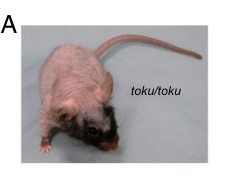

## Question

# Gene Research for Functional Annotation

## ⚠️ CRITICAL: Gene/Protein Identification Context

**BEFORE YOU BEGIN RESEARCH:** You MUST verify you are researching the CORRECT gene/protein. Gene symbols can be ambiguous, especially for less well-characterized genes from non-model organisms.

### Target Gene/Protein Identity (from UniProt):
- **UniProt Accession:** Q6ZS86
- **Protein Description:** RecName: Full=Glycerol kinase 5; Short=GK 5; Short=Glycerokinase 5; EC=2.7.1.30 {ECO:0000250|UniProtKB:Q8BX05}; AltName: Full=ATP:glycerol 3-phosphotransferase 5;
- **Gene Information:** Name=GK5 {ECO:0000312|HGNC:HGNC:28635};
- **Organism (full):** Homo sapiens (Human).
- **Protein Family:** Belongs to the FGGY kinase family. .
- **Key Domains:** ATPase_NBD. (IPR043129); Carb_kinase_FGGY. (IPR000577); Carb_kinase_FGGY_CS. (IPR018483); FGGY_C. (IPR018485); FGGY_N. (IPR018484)

### MANDATORY VERIFICATION STEPS:

1. **Check if the gene symbol "GK5" matches the protein description above**
2. **Verify the organism is correct:** Homo sapiens (Human).
3. **Check if protein family/domains align with what you find in literature**
4. **If you find literature for a DIFFERENT gene with the same or similar symbol, STOP**

### If Gene Symbol is Ambiguous or You Cannot Find Relevant Literature:

**DO NOT PROCEED WITH RESEARCH ON A DIFFERENT GENE.** Instead:
- State clearly: "The gene symbol 'GK5' is ambiguous or literature is limited for this specific protein"
- Explain what you found (e.g., "Found extensive literature on a different gene with the same symbol in a different organism")
- Describe the protein based ONLY on the UniProt information provided above
- Suggest that the protein function can be inferred from domain/family information

### Research Target:

Please provide a comprehensive research report on the gene **GK5** (gene ID: GK5, UniProt: Q6ZS86) in human.

The research report should be a detailed narrative explaining the function, biological processes, and localization of the gene product. Citations should be given for all claims.

You should prioritize authoritative reviews and primary scientific literature when conducting research. You can supplement
this with annotations you find in gene/protein databases, but these can be outdated or inaccurate.

We are specifically interested in the primary function of the gene - for enzymes, what reaction is catalyzed, and what is the substrate specificity? For transporters, what is the substrate? For structural proteins or adapters, what is the broader structural role? For signaling molecules, what is the role in the pathway.

We are interested in where in or outside the cell the gene product carries out its function.

We are also interested in the signaling or biochemical pathways in which the gene functions. We are less interested in broad pleiotropic effects, except where these elucidate the precise role.

Include evidence where possible. We are interested in both experimental evidence as well as inference from structure, evolution, or bioinformatic analysis. Precise studies should be prioritized over high-throughput, where available.

## Output

Question: You are an expert researcher providing comprehensive, well-cited information.

Provide detailed information focusing on:
1. Key concepts and definitions with current understanding
2. Recent developments and latest research (prioritize 2023-2024 sources)
3. Current applications and real-world implementations
4. Expert opinions and analysis from authoritative sources
5. Relevant statistics and data from recent studies

Format as a comprehensive research report with proper citations. Include URLs and publication dates where available.
Always prioritize recent, authoritative sources and provide specific citations for all major claims.

# Gene Research for Functional Annotation

## ⚠️ CRITICAL: Gene/Protein Identification Context

**BEFORE YOU BEGIN RESEARCH:** You MUST verify you are researching the CORRECT gene/protein. Gene symbols can be ambiguous, especially for less well-characterized genes from non-model organisms.

### Target Gene/Protein Identity (from UniProt):
- **UniProt Accession:** Q6ZS86
- **Protein Description:** RecName: Full=Glycerol kinase 5; Short=GK 5; Short=Glycerokinase 5; EC=2.7.1.30 {ECO:0000250|UniProtKB:Q8BX05}; AltName: Full=ATP:glycerol 3-phosphotransferase 5;
- **Gene Information:** Name=GK5 {ECO:0000312|HGNC:HGNC:28635};
- **Organism (full):** Homo sapiens (Human).
- **Protein Family:** Belongs to the FGGY kinase family. .
- **Key Domains:** ATPase_NBD. (IPR043129); Carb_kinase_FGGY. (IPR000577); Carb_kinase_FGGY_CS. (IPR018483); FGGY_C. (IPR018485); FGGY_N. (IPR018484)

### MANDATORY VERIFICATION STEPS:

1. **Check if the gene symbol "GK5" matches the protein description above**
2. **Verify the organism is correct:** Homo sapiens (Human).
3. **Check if protein family/domains align with what you find in literature**
4. **If you find literature for a DIFFERENT gene with the same or similar symbol, STOP**

### If Gene Symbol is Ambiguous or You Cannot Find Relevant Literature:

**DO NOT PROCEED WITH RESEARCH ON A DIFFERENT GENE.** Instead:
- State clearly: "The gene symbol 'GK5' is ambiguous or literature is limited for this specific protein"
- Explain what you found (e.g., "Found extensive literature on a different gene with the same symbol in a different organism")
- Describe the protein based ONLY on the UniProt information provided above
- Suggest that the protein function can be inferred from domain/family information

### Research Target:

Please provide a comprehensive research report on the gene **GK5** (gene ID: GK5, UniProt: Q6ZS86) in human.

The research report should be a detailed narrative explaining the function, biological processes, and localization of the gene product. Citations should be given for all claims.

You should prioritize authoritative reviews and primary scientific literature when conducting research. You can supplement
this with annotations you find in gene/protein databases, but these can be outdated or inaccurate.

We are specifically interested in the primary function of the gene - for enzymes, what reaction is catalyzed, and what is the substrate specificity? For transporters, what is the substrate? For structural proteins or adapters, what is the broader structural role? For signaling molecules, what is the role in the pathway.

We are interested in where in or outside the cell the gene product carries out its function.

We are also interested in the signaling or biochemical pathways in which the gene functions. We are less interested in broad pleiotropic effects, except where these elucidate the precise role.

Include evidence where possible. We are interested in both experimental evidence as well as inference from structure, evolution, or bioinformatic analysis. Precise studies should be prioritized over high-throughput, where available.

## Research report: Human **GK5** (UniProt **Q6ZS86**) — functional annotation and biomedical relevance

### 0) Target verification (gene/protein identity)
The research target is **human GK5** (UniProt **Q6ZS86**), described as **glycerol kinase 5 (EC 2.7.1.30)** and annotated to the **FGGY kinase family** (glycerol/hexitol kinase-like proteins). The retrieved primary literature explicitly uses **“glycerol kinase 5 (GK5)”** and provides functional and interaction evidence consistent with an FGGY-family glycerol kinase-like protein, supporting correct target alignment (zhang2017skinspecificregulationof pages 1-1, zhang2017skinspecificregulationof pages 7-8).

### 1) Key concepts and definitions (current understanding)

#### 1.1 Canonical enzymatic role (definition)
Glycerol kinases catalyze **ATP-dependent phosphorylation of glycerol to glycerol-3-phosphate (G3P)**, linking glycerol utilization to triglyceride/glycerophospholipid synthesis and broader intermediary metabolism. In the best mechanistic study available in this evidence set, **recombinant GK5 demonstrated glycerol kinase activity** in vitro (zhang2017skinspecificregulationof pages 3-3), consistent with its UniProt designation as an EC 2.7.1.30 enzyme.

**Implication for substrate specificity:** Within the retrieved corpus, GK5 is supported as a glycerol-directed phosphotransferase (glycerol → G3P), but **no kinetic constants or systematic substrate-panel specificity** (e.g., glycerol vs other polyols) were available in the retrieved excerpts (zhang2017skinspecificregulationof pages 3-3).

#### 1.2 GK5 as a regulatory protein in lipid homeostasis (beyond “just” metabolism)
A major conceptual advance is that GK5 functions as a **tissue-specialized regulator of SREBP activation** in skin, not merely a housekeeping metabolic enzyme. In mouse skin, GK5 deficiency results in **increased processing/activation of SREBP-1 and SREBP-2**, accumulation of nuclear transcriptionally active SREBPs, and increased expression of multiple SREBP target genes involved in cholesterol and fatty-acid biosynthesis (e.g., Hmgcs1/2, Acaca, Fasn, Scd1, Ldlr, Fdps) (zhang2017skinspecificregulationof pages 6-7, zhang2017skinspecificregulationof pages 1-1).

Mechanistically, GK5 **binds SREBP-1 and SREBP-2 via their C-terminal regulatory domains** and inhibits their proteolytic processing/activation (zhang2017skinspecificregulationof pages 1-1, zhang2017skinspecificregulationof pages 7-8). This places GK5 functionally in the **SREBP processing axis**, a central lipid-sensing transcriptional program.

### 2) Cellular and tissue context (localization, expression, and where the protein acts)

#### 2.1 Tissue specificity (skin/sebaceous gland enrichment)
The most direct expression evidence in the retrieved set indicates that GK5 is **predominantly expressed in sebaceous glands** of skin and is **not detected** in the corresponding GK5-deficient (“toku”) skin (zhang2017skinspecificregulationof pages 3-3). This is visually supported by immunohistochemistry showing sebaceous-gland GK5 staining in wild-type skin and loss of staining in mutant (zhang2017skinspecificregulationof media 30d0d1c2).

#### 2.2 Subcellular localization
FLAG-tagged GK5 (isoform v2 in the cited work) localized **mainly to the cytoplasm** in transfected NIH 3T3 cells (zhang2017skinspecificregulationof pages 3-3). Functionally, GK5 is tied to the **SREBP processing pathway** (which involves ER/Golgi trafficking and regulated intramembrane proteolysis), but the retrieved evidence supports cytosolic localization for the tagged protein rather than definitive ER membrane residency (zhang2017skinspecificregulationof pages 7-8, zhang2017skinspecificregulationof pages 3-3).

### 3) Molecular mechanism and pathway placement

#### 3.1 Interaction partners
GK5 physically associates with:
- **GK (glycerol kinase; GK1/GK)** via their **N-terminal FGGY_N domains** (zhang2017skinspecificregulationof pages 7-8).
- **SREBP-1 and SREBP-2**, binding to SREBP C-terminal regulatory domains (zhang2017skinspecificregulationof pages 7-8).

The binding to SREBPs is described as **kinase-independent** (binding does not require GK5 catalytic activity), and purified GK5 did **not** phosphorylate immunoprecipitated SREBP-1/2 under the tested conditions (zhang2017skinspecificregulationof pages 7-8). This supports a model where GK5 has **dual attributes**: enzymatic activity (glycerol kinase) plus **non-catalytic scaffolding/regulatory interactions** controlling SREBP processing.

#### 3.2 Functional consequence: negative regulation of SREBP processing and lipid biosynthesis
In the skin-specific context, GK5 deficiency leads to elevated processed SREBPs and increased lipid biosynthesis, with downstream phenotypes including **alopecia/hair-growth defects** and accumulation of lipid species including cholesterol, triglycerides, and ceramides (zhang2017skinspecificregulationof pages 1-1). Pharmacologically, **simvastatin** partially rescued the phenotype, linking the pathology to sterol pathway overactivity (zhang2017skinspecificregulationof pages 1-1).

Visual support: the alopecia phenotype and sebaceous-gland GK5 expression are shown in figure crops (zhang2017skinspecificregulationof media 30d0d1c2). SREBP binding/co-immunoprecipitation and domain schematic evidence were also retrieved as figure crops from the same work (zhang2017skinspecificregulationof media 03a1d6d5, zhang2017skinspecificregulationof media aadb228b, zhang2017skinspecificregulationof media bd23a541).

### 4) Recent developments (prioritizing 2023–2024) and “latest research”

#### 4.1 2024: Cancer-context synthesis mentioning GK5
A 2024 Scientific Reports study focused on **glycerol kinase (GK)** in esophageal carcinoma, but it includes **GK5** in its biological background as one of three GK variants and cites prior evidence that GK5 is elevated in **gefitinib-resistant lung adenocarcinoma** and that GK5 silencing induces apoptosis through the **SREBP1/SCD1 axis** (ying2024glycerolkinaseenzyme pages 9-12).

**Important scope note:** this 2024 paper provides **quantitative statistics for GK** in ESCA (not GK5), so GK5-related content in that paper should be interpreted as **secondary contextualization**, not as new GK5-specific ESCA evidence (ying2024glycerolkinaseenzyme pages 5-7).

#### 4.2 2023: Limited GK5-specific primary advances in retrieved set
Within the retrieved 2023–2024 corpus, **GK5-specific primary mechanistic studies were sparse**, and the strongest mechanistic basis remains the earlier high-quality PNAS study. A 2023 mitochondrial network expansion paper was retrieved but did not yield GK5-specific localization/function evidence from the excerpts examined (OpenTargets Search: -GK5).

### 5) Current applications and real-world implementations

#### 5.1 Biomarker concept: exosomal GK5 mRNA for EGFR-TKI resistance
In NSCLC, exosomal GK5 mRNA detected in plasma was reported to be higher in patients with **gefitinib-resistant** adenocarcinoma than in gefitinib-sensitive cases, supporting a potential role as a **liquid-biopsy biomarker candidate** (zhou2019glycerolkinase5 pages 1-2). The same study used a tethered cationic lipoplex nanoparticle (TCLN) biochip for exosomal mRNA detection, reflecting a real-world oriented assay concept (zhou2019glycerolkinase5 pages 1-2).

#### 5.2 Therapeutic hypothesis: targeting GK5 to reverse resistance
In gefitinib-resistant lung adenocarcinoma cell models, **silencing GK5** induced mitochondrial damage, caspase activation, cell-cycle arrest, and apoptosis, implicating GK5 as a possible **therapeutic target** to overcome acquired resistance; mechanistically, the pathway is connected to **SREBP1/SCD1** and intersects with EGFR signaling (zhou2019glycerolkinase5 pages 1-2, zhou2019glycerolkinase5 pages 11-12).

### 6) Expert opinions / authoritative synthesis
Reviews on hair/skin lipid biology explicitly highlight GK5 as a sebaceous-gland-associated factor where dysfunction causes the **toku** phenotype and lipid accumulation, situating GK5 as part of tissue lipid/cholesterol homeostasis relevant to hair disorders (OpenTargets Search: -GK5). These review statements largely synthesize the mechanistic primary work rather than introducing new experimental claims (OpenTargets Search: -GK5).

### 7) Relevant statistics and data (recent studies)

#### 7.1 Quantitative data directly available in 2024 (note: GK, not GK5)
The 2024 ESCA study (GK-focused) provides quantitative clinical statistics that are informative for the broader glycerol-kinase/lipid-metabolism context:
- TCGA cohort comparison: **162 ESCA tumors vs 11 adjacent non-tumor samples**, GK upregulated with **p < 0.001** (ying2024glycerolkinaseenzyme pages 1-2).
- Survival/prognostic modeling: high GK expression associated with poorer OS; **univariate HR 1.289 (95% CI 1.004–1.655), p=0.046** and **multivariate HR 2.320 (95% CI 1.049–5.132), p=0.038** (ying2024glycerolkinaseenzyme pages 5-7).

These statistics do **not** quantify GK5, but they underscore the clinical relevance of glycerol-kinase–linked metabolic programs and motivate mechanistic work to distinguish GK versus GK2 versus GK5 roles (ying2024glycerolkinaseenzyme pages 9-12, ying2024glycerolkinaseenzyme pages 5-7).

#### 7.2 OpenTargets quantitative association scores (hypothesis-generating)
Open Targets provides disease association scores for GK5, including:
- **Neurodegenerative disease**: 0.4395
- **Ovarian neoplasm**: 0.3016
- **Alopecia areata**: 0.2360
Evidence is driven largely by animal-model signals (IMPC) and a CRISPR-screen “affected pathway” signal in glutamatergic neurons (OpenTargets Search: -GK5).

### 8) Integrated functional model for human GK5 (Q6ZS86)
The best-supported functional annotation from the retrieved literature is that GK5 is a **glycerol kinase-family protein with measurable glycerol kinase activity**, but with a particularly important **regulatory role in skin**: GK5 associates with GK and binds SREBP-1/2 regulatory domains to **suppress SREBP proteolytic activation**, thereby restraining SREBP-driven lipid and sterol biosynthesis in sebaceous glands/skin (zhang2017skinspecificregulationof pages 6-7, zhang2017skinspecificregulationof pages 1-1, zhang2017skinspecificregulationof pages 7-8, zhang2017skinspecificregulationof pages 3-3). This specialization plausibly links GK5 to **hair/skin lipid homeostasis** phenotypes and connects it mechanistically to the SREBP axis, which is also implicated in cancer metabolic adaptation and therapy resistance (zhou2019glycerolkinase5 pages 1-2, zhou2019glycerolkinase5 pages 11-12).

### 9) Evidence map (summary table)
The following table compiles the strongest evidence, separating primary mechanistic results from review and database associations:

| Claim/Topic | Key finding (1-2 sentences) | Evidence type | Source (first author, journal, year) | Publication date | URL/DOI | Notes/limitations |
|---|---|---|---|---|---|---|
| Enzymatic activity / substrate class | Human GK5 (UniProt Q6ZS86) is annotated as an FGGY-family glycerol kinase (EC 2.7.1.30), implying ATP-dependent phosphorylation of glycerol to glycerol-3-phosphate. In primary literature, recombinant GK5 showed glycerol kinase activity, supporting the annotation. (zhang2017skinspecificregulationof pages 8-8, zhang2017skinspecificregulationof pages 3-3) | UniProt-guided annotation supported by in vitro assay | Zhang, *PNAS*, 2017 | Jun 2017 | https://doi.org/10.1073/pnas.1705312114 | Direct activity evidence in retrieved text is largely from mouse/recombinant systems rather than purified human protein; substrate-specific kinetic constants were not available in retrieved evidence. |
| Subcellular localization | FLAG-tagged GK5-v2 localized mainly to the cytoplasm in transfected NIH 3T3 cells. The mechanistic work links GK5 to the SREBP processing pathway but does not establish stable ER/Golgi residency. (zhang2017skinspecificregulationof pages 3-3) | Cell biology / imaging | Zhang, *PNAS*, 2017 | Jun 2017 | https://doi.org/10.1073/pnas.1705312114 | Localization evidence is from tagged protein in mouse fibroblasts, not endogenous human GK5. |
| Tissue specificity | GK5 was reported as predominantly expressed in sebaceous glands of skin, with skin-specific effects on lipid homeostasis; IHC showed strong sebaceous-gland staining in wild type and loss in mutant skin. (zhang2017skinspecificregulationof pages 1-1, zhang2017skinspecificregulationof pages 3-3, zhang2017skinspecificregulationof media 30d0d1c2) | Mouse genetics, histology, IHC | Zhang, *PNAS*, 2017 | Jun 2017 | https://doi.org/10.1073/pnas.1705312114 | Strong evidence for skin/sebocyte enrichment comes from mouse; direct human tissue-atlas quantitation was not retrieved. |
| Interaction partners | GK5 binds glycerol kinase (GK) via N-terminal FGGY_N domains and associates with SREBP-1 and SREBP-2 through their C-terminal regulatory domains. Binding to SREBPs appears kinase-independent, and purified GK5 did not phosphorylate immunoprecipitated SREBPs. (zhang2017skinspecificregulationof pages 7-8) | Co-immunoprecipitation / domain mapping | Zhang, *PNAS*, 2017 | Jun 2017 | https://doi.org/10.1073/pnas.1705312114 | Human relevance is partially supported because endogenous associations were also observed in human HepG2 cells, but most mechanistic phenotyping was done in mouse systems. |
| Pathway role / biological process | GK5 acts as a negative regulator of SREBP-1/2 processing in skin. Loss of GK5 increased processed nuclear SREBPs and elevated SREBP target genes and lipids (cholesterol, triglycerides, ceramides), causing alopecia/hair-growth defects; simvastatin partially rescued the phenotype. (zhang2017skinspecificregulationof pages 6-7, zhang2017skinspecificregulationof pages 1-1, zhang2017skinspecificregulationof pages 8-8) | Mouse genetics, immunoblotting, lipid phenotyping, pharmacologic rescue | Zhang, *PNAS*, 2017 | Jun 2017 | https://doi.org/10.1073/pnas.1705312114 | Best-supported function in retrieved literature is regulatory control of sterol/lipid biosynthesis in skin rather than classical housekeeping glycerol metabolism alone. |
| Disease / clinical relevance: EGFR-TKI resistance | In NSCLC, plasma exosomal GK5 mRNA was reported as significantly higher in gefitinib-resistant versus gefitinib-sensitive patients, and GK5 was upregulated in resistant PC9R/H1975 cells. GK5 silencing induced mitochondrial damage, caspase activation, cell-cycle arrest, and apoptosis via SREBP1/SCD1 signaling, suggesting biomarker and therapeutic-target potential. (zhou2019glycerolkinase5 pages 12-12, zhou2019glycerolkinase5 pages 1-2, zhou2019glycerolkinase5 pages 11-12) | Clinical association, cell biology, functional knockdown | Zhou, *J Exp Clin Cancer Res*, 2019 | Feb 2019 | https://doi.org/10.1186/s13046-019-1057-7 | Retrieved excerpts did not include cohort size or effect-size statistics, so translational claims should be treated as promising but incompletely quantified here. |
| Recent cancer-context update | A 2024 ESCA study primarily analyzed GK, but specifically notes GK5 as one of three glycerol kinase variants and cites prior evidence that GK5 is elevated in gefitinib-resistant lung adenocarcinoma and promotes survival through SREBP1/SCD1. This serves as a recent secondary-source update rather than new GK5-specific mechanistic evidence in ESCA. (ying2024glycerolkinaseenzyme pages 9-12) | Secondary discussion within a clinical association study | Ying, *Scientific Reports*, 2024 | Feb 2024 | https://doi.org/10.1038/s41598-024-54425-x | Important not to over-interpret: most quantitative results in this paper are for GK, not GK5. |
| Recent statistics from related glycerol-kinase cancer study | In ESCA, high GK expression was associated with worse overall survival and remained significant in multivariable analysis (univariate HR 1.289, 95% CI 1.004-1.655, p=0.046; multivariate HR 2.320, 95% CI 1.049-5.132, p=0.038). The same study reported 162 tumors vs 11 adjacent non-tumor samples and ~3% mutation frequency for GK. (ying2024glycerolkinaseenzyme pages 1-2, ying2024glycerolkinaseenzyme pages 5-7) | Clinical association / bioinformatics / IHC | Ying, *Scientific Reports*, 2024 | Feb 2024 | https://doi.org/10.1038/s41598-024-54425-x | These are GK statistics, included for context because the paper discusses GK5 only secondarily. |
| Review synthesis: skin/hair biology | Review literature cites GK5 dysfunction as causing the mouse *toku* phenotype with progressive hair loss and dermal lipid accumulation, placing GK5 within cholesterol/lipid homeostasis relevant to hair follicle biology and alopecia-related phenotypes. (OpenTargets Search: -GK5) | Review / expert synthesis | Palmer, *Experimental Dermatology*, 2020 | Mar 2020 | https://doi.org/10.1111/exd.13993 | Review-level evidence; not a primary source for mechanism beyond summarizing Zhang et al. |
| Review synthesis: sebaceous lipogenesis | A recent review on sebaceous lipogenesis highlights mouse sebaceous-gland expression of GK5 and its role in regulating cholesterol homeostasis/lipogenesis, reinforcing the view that GK5 is a specialized skin lipid regulator. (OpenTargets Search: -GK5) | Review / expert synthesis | Schmidt, *Communications Biology*, 2025 | Apr 2025 | https://doi.org/10.1038/s42003-025-08105-9 | Useful expert context, but outside the user's requested 2023-2024 priority window and largely derivative of earlier primary work. |
| Disease association database summary | Open Targets links human GK5 to ovarian neoplasm (score 0.3016), alopecia areata (0.2360), and neurodegenerative disease (0.4395), with evidence driven mainly by IMPC animal-model data and one CRISPR-screen pathway signal. (OpenTargets Search: -GK5) | Database association | Open Targets Platform entry for GK5 | 2025 platform citation | https://platform.opentargets.org/target/ENSG00000175066 | Association scores are hypothesis-generating, not proof of direct human causal function; mechanistic and clinical specificity for GK5 remains limited. |

*Table: This table compiles the strongest retrieved evidence about human GK5/Q6ZS86, including its inferred enzymatic role, experimentally supported skin/SREBP regulatory function, localization, and translational relevance. It is useful for separating direct primary evidence from review-level or database-level associations and for highlighting key limitations.*

### 10) Limitations and evidence gaps (important for functional annotation)
- **Human-specific biochemistry:** Within retrieved excerpts, the clearest enzymatic and mechanistic results come from mouse genetics and recombinant assays; there is **limited direct biochemical characterization of purified human GK5** (e.g., Km for glycerol, substrate panel, regulation by metabolites) (zhang2017skinspecificregulationof pages 3-3).
- **2023–2024 GK5-specific primary literature scarcity:** Recent papers retrieved either discuss GK5 secondarily or focus on related genes/proteins, limiting the ability to provide 2023–2024 GK5-specific mechanistic advances beyond cancer-context discussion (ying2024glycerolkinaseenzyme pages 9-12).
- **Clinical quantitation for GK5 biomarker claims:** The gefitinib-resistance study provides strong translational hypotheses but the retrieved excerpts did not include cohort size or effect sizes; full-text extraction would be needed for robust biomarker performance metrics (AUC, sensitivity/specificity) (zhou2019glycerolkinase5 pages 1-2).

### Key sources (with URLs and publication dates where available)
- Zhang D. et al. *PNAS* (Jun 2017). “Skin-specific regulation of SREBP processing and lipid biosynthesis by glycerol kinase 5.” https://doi.org/10.1073/pnas.1705312114 (zhang2017skinspecificregulationof pages 1-1)
- Zhou J. et al. *J Exp Clin Cancer Res* (Feb 2019). “Glycerol kinase 5 confers gefitinib resistance through SREBP1/SCD1 signaling pathway.” https://doi.org/10.1186/s13046-019-1057-7 (zhou2019glycerolkinase5 pages 1-2)
- Ying F. et al. *Scientific Reports* (Feb 2024). “Glycerol kinase enzyme is a prognostic predictor in esophageal carcinoma and is associated with immune cell infiltration.” https://doi.org/10.1038/s41598-024-54425-x (ying2024glycerolkinaseenzyme pages 1-2)
- Open Targets Platform (platform citation: Buniello A. et al., *Nucleic Acids Research*, 2025). GK5 target page: https://platform.opentargets.org/target/ENSG00000175066 (OpenTargets Search: -GK5)

References

1. (zhang2017skinspecificregulationof pages 1-1): Duanwu Zhang, Wataru Tomisato, Lijing Su, Lei Sun, Jin Huk Choi, Zhao Zhang, Kuan-wen Wang, Xiaoming Zhan, Mihwa Choi, Xiaohong Li, Miao Tang, Jose M. Castro-Perez, Sara Hildebrand, Anne R. Murray, Eva Marie Y. Moresco, and Bruce Beutler. Skin-specific regulation of srebp processing and lipid biosynthesis by glycerol kinase 5. Proceedings of the National Academy of Sciences, 114:E5197-E5206, Jun 2017. URL: https://doi.org/10.1073/pnas.1705312114, doi:10.1073/pnas.1705312114. This article has 34 citations and is from a highest quality peer-reviewed journal.

2. (zhang2017skinspecificregulationof pages 7-8): Duanwu Zhang, Wataru Tomisato, Lijing Su, Lei Sun, Jin Huk Choi, Zhao Zhang, Kuan-wen Wang, Xiaoming Zhan, Mihwa Choi, Xiaohong Li, Miao Tang, Jose M. Castro-Perez, Sara Hildebrand, Anne R. Murray, Eva Marie Y. Moresco, and Bruce Beutler. Skin-specific regulation of srebp processing and lipid biosynthesis by glycerol kinase 5. Proceedings of the National Academy of Sciences, 114:E5197-E5206, Jun 2017. URL: https://doi.org/10.1073/pnas.1705312114, doi:10.1073/pnas.1705312114. This article has 34 citations and is from a highest quality peer-reviewed journal.

3. (zhang2017skinspecificregulationof pages 3-3): Duanwu Zhang, Wataru Tomisato, Lijing Su, Lei Sun, Jin Huk Choi, Zhao Zhang, Kuan-wen Wang, Xiaoming Zhan, Mihwa Choi, Xiaohong Li, Miao Tang, Jose M. Castro-Perez, Sara Hildebrand, Anne R. Murray, Eva Marie Y. Moresco, and Bruce Beutler. Skin-specific regulation of srebp processing and lipid biosynthesis by glycerol kinase 5. Proceedings of the National Academy of Sciences, 114:E5197-E5206, Jun 2017. URL: https://doi.org/10.1073/pnas.1705312114, doi:10.1073/pnas.1705312114. This article has 34 citations and is from a highest quality peer-reviewed journal.

4. (zhang2017skinspecificregulationof pages 6-7): Duanwu Zhang, Wataru Tomisato, Lijing Su, Lei Sun, Jin Huk Choi, Zhao Zhang, Kuan-wen Wang, Xiaoming Zhan, Mihwa Choi, Xiaohong Li, Miao Tang, Jose M. Castro-Perez, Sara Hildebrand, Anne R. Murray, Eva Marie Y. Moresco, and Bruce Beutler. Skin-specific regulation of srebp processing and lipid biosynthesis by glycerol kinase 5. Proceedings of the National Academy of Sciences, 114:E5197-E5206, Jun 2017. URL: https://doi.org/10.1073/pnas.1705312114, doi:10.1073/pnas.1705312114. This article has 34 citations and is from a highest quality peer-reviewed journal.

5. (zhang2017skinspecificregulationof media 30d0d1c2): Duanwu Zhang, Wataru Tomisato, Lijing Su, Lei Sun, Jin Huk Choi, Zhao Zhang, Kuan-wen Wang, Xiaoming Zhan, Mihwa Choi, Xiaohong Li, Miao Tang, Jose M. Castro-Perez, Sara Hildebrand, Anne R. Murray, Eva Marie Y. Moresco, and Bruce Beutler. Skin-specific regulation of srebp processing and lipid biosynthesis by glycerol kinase 5. Proceedings of the National Academy of Sciences, 114:E5197-E5206, Jun 2017. URL: https://doi.org/10.1073/pnas.1705312114, doi:10.1073/pnas.1705312114. This article has 34 citations and is from a highest quality peer-reviewed journal.

6. (zhang2017skinspecificregulationof media 03a1d6d5): Duanwu Zhang, Wataru Tomisato, Lijing Su, Lei Sun, Jin Huk Choi, Zhao Zhang, Kuan-wen Wang, Xiaoming Zhan, Mihwa Choi, Xiaohong Li, Miao Tang, Jose M. Castro-Perez, Sara Hildebrand, Anne R. Murray, Eva Marie Y. Moresco, and Bruce Beutler. Skin-specific regulation of srebp processing and lipid biosynthesis by glycerol kinase 5. Proceedings of the National Academy of Sciences, 114:E5197-E5206, Jun 2017. URL: https://doi.org/10.1073/pnas.1705312114, doi:10.1073/pnas.1705312114. This article has 34 citations and is from a highest quality peer-reviewed journal.

7. (zhang2017skinspecificregulationof media aadb228b): Duanwu Zhang, Wataru Tomisato, Lijing Su, Lei Sun, Jin Huk Choi, Zhao Zhang, Kuan-wen Wang, Xiaoming Zhan, Mihwa Choi, Xiaohong Li, Miao Tang, Jose M. Castro-Perez, Sara Hildebrand, Anne R. Murray, Eva Marie Y. Moresco, and Bruce Beutler. Skin-specific regulation of srebp processing and lipid biosynthesis by glycerol kinase 5. Proceedings of the National Academy of Sciences, 114:E5197-E5206, Jun 2017. URL: https://doi.org/10.1073/pnas.1705312114, doi:10.1073/pnas.1705312114. This article has 34 citations and is from a highest quality peer-reviewed journal.

8. (zhang2017skinspecificregulationof media bd23a541): Duanwu Zhang, Wataru Tomisato, Lijing Su, Lei Sun, Jin Huk Choi, Zhao Zhang, Kuan-wen Wang, Xiaoming Zhan, Mihwa Choi, Xiaohong Li, Miao Tang, Jose M. Castro-Perez, Sara Hildebrand, Anne R. Murray, Eva Marie Y. Moresco, and Bruce Beutler. Skin-specific regulation of srebp processing and lipid biosynthesis by glycerol kinase 5. Proceedings of the National Academy of Sciences, 114:E5197-E5206, Jun 2017. URL: https://doi.org/10.1073/pnas.1705312114, doi:10.1073/pnas.1705312114. This article has 34 citations and is from a highest quality peer-reviewed journal.

9. (ying2024glycerolkinaseenzyme pages 9-12): Fei Ying, Xuyong Chen, and Lihong Lv. Glycerol kinase enzyme is a prognostic predictor in esophageal carcinoma and is associated with immune cell infiltration. Scientific Reports, Feb 2024. URL: https://doi.org/10.1038/s41598-024-54425-x, doi:10.1038/s41598-024-54425-x. This article has 11 citations and is from a peer-reviewed journal.

10. (ying2024glycerolkinaseenzyme pages 5-7): Fei Ying, Xuyong Chen, and Lihong Lv. Glycerol kinase enzyme is a prognostic predictor in esophageal carcinoma and is associated with immune cell infiltration. Scientific Reports, Feb 2024. URL: https://doi.org/10.1038/s41598-024-54425-x, doi:10.1038/s41598-024-54425-x. This article has 11 citations and is from a peer-reviewed journal.

11. (OpenTargets Search: -GK5): Open Targets Query (-GK5, 5 results). Buniello, A. et al. (2025). Open Targets Platform: facilitating therapeutic hypotheses building in drug discovery. Nucleic Acids Research.

12. (zhou2019glycerolkinase5 pages 1-2): Jian Zhou, Guimei Qu, Ge Zhang, Zuoren Wu, Jing Liu, Dawei Yang, Jing Li, Meijia Chang, Hengshan Zeng, Jie Hu, Tao Fang, Yuanlin Song, and Chunxue Bai. Glycerol kinase 5 confers gefitinib resistance through srebp1/scd1 signaling pathway. Journal of Experimental & Clinical Cancer Research : CR, Feb 2019. URL: https://doi.org/10.1186/s13046-019-1057-7, doi:10.1186/s13046-019-1057-7. This article has 43 citations.

13. (zhou2019glycerolkinase5 pages 11-12): Jian Zhou, Guimei Qu, Ge Zhang, Zuoren Wu, Jing Liu, Dawei Yang, Jing Li, Meijia Chang, Hengshan Zeng, Jie Hu, Tao Fang, Yuanlin Song, and Chunxue Bai. Glycerol kinase 5 confers gefitinib resistance through srebp1/scd1 signaling pathway. Journal of Experimental & Clinical Cancer Research : CR, Feb 2019. URL: https://doi.org/10.1186/s13046-019-1057-7, doi:10.1186/s13046-019-1057-7. This article has 43 citations.

14. (ying2024glycerolkinaseenzyme pages 1-2): Fei Ying, Xuyong Chen, and Lihong Lv. Glycerol kinase enzyme is a prognostic predictor in esophageal carcinoma and is associated with immune cell infiltration. Scientific Reports, Feb 2024. URL: https://doi.org/10.1038/s41598-024-54425-x, doi:10.1038/s41598-024-54425-x. This article has 11 citations and is from a peer-reviewed journal.

15. (zhang2017skinspecificregulationof pages 8-8): Duanwu Zhang, Wataru Tomisato, Lijing Su, Lei Sun, Jin Huk Choi, Zhao Zhang, Kuan-wen Wang, Xiaoming Zhan, Mihwa Choi, Xiaohong Li, Miao Tang, Jose M. Castro-Perez, Sara Hildebrand, Anne R. Murray, Eva Marie Y. Moresco, and Bruce Beutler. Skin-specific regulation of srebp processing and lipid biosynthesis by glycerol kinase 5. Proceedings of the National Academy of Sciences, 114:E5197-E5206, Jun 2017. URL: https://doi.org/10.1073/pnas.1705312114, doi:10.1073/pnas.1705312114. This article has 34 citations and is from a highest quality peer-reviewed journal.

16. (zhou2019glycerolkinase5 pages 12-12): Jian Zhou, Guimei Qu, Ge Zhang, Zuoren Wu, Jing Liu, Dawei Yang, Jing Li, Meijia Chang, Hengshan Zeng, Jie Hu, Tao Fang, Yuanlin Song, and Chunxue Bai. Glycerol kinase 5 confers gefitinib resistance through srebp1/scd1 signaling pathway. Journal of Experimental & Clinical Cancer Research : CR, Feb 2019. URL: https://doi.org/10.1186/s13046-019-1057-7, doi:10.1186/s13046-019-1057-7. This article has 43 citations.

## Artifacts

- [Edison artifact artifact-00](GK5-deep-research-falcon_artifacts/artifact-00.md)

## Citations

1. zhang2017skinspecificregulationof pages 3-3
2. zhang2017skinspecificregulationof pages 7-8
3. zhang2017skinspecificregulationof pages 1-1
4. ying2024glycerolkinaseenzyme pages 9-12
5. ying2024glycerolkinaseenzyme pages 5-7
6. ying2024glycerolkinaseenzyme pages 1-2
7. zhang2017skinspecificregulationof pages 6-7
8. zhang2017skinspecificregulationof pages 8-8
9. https://doi.org/10.1073/pnas.1705312114
10. https://doi.org/10.1186/s13046-019-1057-7
11. https://doi.org/10.1038/s41598-024-54425-x
12. https://doi.org/10.1111/exd.13993
13. https://doi.org/10.1038/s42003-025-08105-9
14. https://platform.opentargets.org/target/ENSG00000175066
15. https://doi.org/10.1073/pnas.1705312114,
16. https://doi.org/10.1038/s41598-024-54425-x,
17. https://doi.org/10.1186/s13046-019-1057-7,