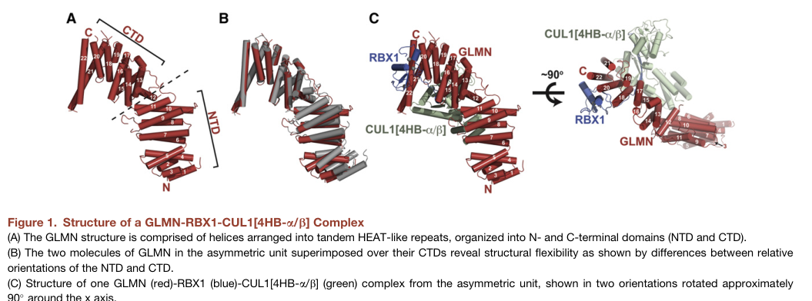

## Question

# Gene Research for Functional Annotation

## ⚠️ CRITICAL: Gene/Protein Identification Context

**BEFORE YOU BEGIN RESEARCH:** You MUST verify you are researching the CORRECT gene/protein. Gene symbols can be ambiguous, especially for less well-characterized genes from non-model organisms.

### Target Gene/Protein Identity (from UniProt):
- **UniProt Accession:** Q92990
- **Protein Description:** RecName: Full=Glomulin; AltName: Full=FK506-binding protein-associated protein; Short=FAP; AltName: Full=FKBP-associated protein;
- **Gene Information:** Name=GLMN; Synonyms=FAP48 {ECO:0000303|PubMed:8955134}, FAP68 {ECO:0000303|PubMed:11571281}, VMGLOM;
- **Organism (full):** Homo sapiens (Human).
- **Protein Family:** Not specified in UniProt
- **Key Domains:** Glomulin/ALF4. (IPR019516); YAP-bd/ALF4/Glomulin. (IPR013877); Kinetochor_Ybp2 (PF08568)

### MANDATORY VERIFICATION STEPS:

1. **Check if the gene symbol "GLMN" matches the protein description above**
2. **Verify the organism is correct:** Homo sapiens (Human).
3. **Check if protein family/domains align with what you find in literature**
4. **If you find literature for a DIFFERENT gene with the same or similar symbol, STOP**

### If Gene Symbol is Ambiguous or You Cannot Find Relevant Literature:

**DO NOT PROCEED WITH RESEARCH ON A DIFFERENT GENE.** Instead:
- State clearly: "The gene symbol 'GLMN' is ambiguous or literature is limited for this specific protein"
- Explain what you found (e.g., "Found extensive literature on a different gene with the same symbol in a different organism")
- Describe the protein based ONLY on the UniProt information provided above
- Suggest that the protein function can be inferred from domain/family information

### Research Target:

Please provide a comprehensive research report on the gene **GLMN** (gene ID: GLMN, UniProt: Q92990) in human.

The research report should be a detailed narrative explaining the function, biological processes, and localization of the gene product. Citations should be given for all claims.

You should prioritize authoritative reviews and primary scientific literature when conducting research. You can supplement
this with annotations you find in gene/protein databases, but these can be outdated or inaccurate.

We are specifically interested in the primary function of the gene - for enzymes, what reaction is catalyzed, and what is the substrate specificity? For transporters, what is the substrate? For structural proteins or adapters, what is the broader structural role? For signaling molecules, what is the role in the pathway.

We are interested in where in or outside the cell the gene product carries out its function.

We are also interested in the signaling or biochemical pathways in which the gene functions. We are less interested in broad pleiotropic effects, except where these elucidate the precise role.

Include evidence where possible. We are interested in both experimental evidence as well as inference from structure, evolution, or bioinformatic analysis. Precise studies should be prioritized over high-throughput, where available.

## Output

Question: You are an expert researcher providing comprehensive, well-cited information.

Provide detailed information focusing on:
1. Key concepts and definitions with current understanding
2. Recent developments and latest research (prioritize 2023-2024 sources)
3. Current applications and real-world implementations
4. Expert opinions and analysis from authoritative sources
5. Relevant statistics and data from recent studies

Format as a comprehensive research report with proper citations. Include URLs and publication dates where available.
Always prioritize recent, authoritative sources and provide specific citations for all major claims.

# Gene Research for Functional Annotation

## ⚠️ CRITICAL: Gene/Protein Identification Context

**BEFORE YOU BEGIN RESEARCH:** You MUST verify you are researching the CORRECT gene/protein. Gene symbols can be ambiguous, especially for less well-characterized genes from non-model organisms.

### Target Gene/Protein Identity (from UniProt):
- **UniProt Accession:** Q92990
- **Protein Description:** RecName: Full=Glomulin; AltName: Full=FK506-binding protein-associated protein; Short=FAP; AltName: Full=FKBP-associated protein;
- **Gene Information:** Name=GLMN; Synonyms=FAP48 {ECO:0000303|PubMed:8955134}, FAP68 {ECO:0000303|PubMed:11571281}, VMGLOM;
- **Organism (full):** Homo sapiens (Human).
- **Protein Family:** Not specified in UniProt
- **Key Domains:** Glomulin/ALF4. (IPR019516); YAP-bd/ALF4/Glomulin. (IPR013877); Kinetochor_Ybp2 (PF08568)

### MANDATORY VERIFICATION STEPS:

1. **Check if the gene symbol "GLMN" matches the protein description above**
2. **Verify the organism is correct:** Homo sapiens (Human).
3. **Check if protein family/domains align with what you find in literature**
4. **If you find literature for a DIFFERENT gene with the same or similar symbol, STOP**

### If Gene Symbol is Ambiguous or You Cannot Find Relevant Literature:

**DO NOT PROCEED WITH RESEARCH ON A DIFFERENT GENE.** Instead:
- State clearly: "The gene symbol 'GLMN' is ambiguous or literature is limited for this specific protein"
- Explain what you found (e.g., "Found extensive literature on a different gene with the same symbol in a different organism")
- Describe the protein based ONLY on the UniProt information provided above
- Suggest that the protein function can be inferred from domain/family information

### Research Target:

Please provide a comprehensive research report on the gene **GLMN** (gene ID: GLMN, UniProt: Q92990) in human.

The research report should be a detailed narrative explaining the function, biological processes, and localization of the gene product. Citations should be given for all claims.

You should prioritize authoritative reviews and primary scientific literature when conducting research. You can supplement
this with annotations you find in gene/protein databases, but these can be outdated or inaccurate.

We are specifically interested in the primary function of the gene - for enzymes, what reaction is catalyzed, and what is the substrate specificity? For transporters, what is the substrate? For structural proteins or adapters, what is the broader structural role? For signaling molecules, what is the role in the pathway.

We are interested in where in or outside the cell the gene product carries out its function.

We are also interested in the signaling or biochemical pathways in which the gene functions. We are less interested in broad pleiotropic effects, except where these elucidate the precise role.

Include evidence where possible. We are interested in both experimental evidence as well as inference from structure, evolution, or bioinformatic analysis. Precise studies should be prioritized over high-throughput, where available.

## Comprehensive research report: Human **GLMN** (Glomulin; UniProt **Q92990**)

### Executive summary
Human **GLMN** encodes **glomulin** (also reported as **FAP68/FAP48**), a non-enzymatic regulator of ubiquitin E3 ligase signaling. The strongest mechanistic evidence supports a primary function as a **high-affinity inhibitor of RBX1-containing Cullin–RING ligases (CRLs)**, including **CUL1–RBX1 (SCF/CRL1)** complexes, by **sterically masking the E2-binding surface** of the RBX1 RING domain. This suppression of CRL activity can modulate turnover of key regulators such as **FBW7**, with downstream impacts on levels of FBW7 substrates (e.g., Cyclin E, c-Myc) in glomuvenous malformation tissue. Separately, GLMN can bind the RING domains of **cIAP1/2** and acts as a **negative regulator of cIAP-mediated inflammasome activation**, linking GLMN to innate immune **pyroptosis** control in macrophages. (tron2012theglomuvenousmalformation pages 1-2, suzuki2018shigellahijacksthe pages 1-2, duda2012structureofa pages 1-2, duda2012structureofa pages 7-9)

### 1) Key concepts and definitions (current understanding)

#### 1.1 Gene/protein identity verification (disambiguation)
The retrieved mechanistic literature explicitly uses **GLMN = glomulin** in a human disease context (glomuvenous malformations) and reports the aliases **FAP68** and **FAP48**, consistent with the UniProt description for **Q92990**. (tron2012theglomuvenousmalformation pages 1-2, tron2012theglomuvenousmalformation pages 9-10)

#### 1.2 Cullin–RING ligases (CRLs) and SCF complexes
CRLs are multi-subunit E3 ubiquitin ligases built around a **cullin scaffold** (e.g., CUL1) and a **RING protein** (RBX1 or RBX2) that recruits E2~Ub and catalyzes ubiquitin transfer to substrates. GLMN’s best-supported molecular role is as a **regulator** of these CRL assemblies—specifically those containing **RBX1** rather than RBX2. (tron2012theglomuvenousmalformation pages 1-2, nguyen2017cullinringe3ubiquitin pages 6-8)

#### 1.3 What type of “function” does GLMN have?
GLMN is **not** an enzyme with a defined catalytic reaction in the cited evidence. Instead, it acts as an **inhibitory adaptor/regulator** that modulates E3 ligase activity by **protein–protein interactions** with RING domains. (duda2012structureofa pages 1-2, tron2012theglomuvenousmalformation pages 1-2)

### 2) Molecular function, mechanism, and pathways

#### 2.1 Core molecular function: inhibition of RBX1-containing CRLs (SCF/CRL1)
Two independent 2012 Molecular Cell studies provide convergent primary evidence that GLMN **binds directly to the RBX1 RING domain** and inhibits its E3 ligase function. (duda2012structureofa pages 7-9, tron2012theglomuvenousmalformation pages 1-2)

**Mechanistic model (structural/biochemical):**
- GLMN binds RBX1 with **high affinity** (reported Kd ~**38.6 nM**) and a minimal RBX1-binding GLMN region mapped to residues **300–594**. (duda2012structureofa pages 7-9)
- GLMN **masks the E2-binding site** on RBX1, thereby **outcompeting** the E2 enzyme **CDC34** and **inhibiting ubiquitin chain synthesis** by neddylated CUL1–RBX1 and SCF complexes. (duda2012structureofa pages 1-2, duda2012structureofa pages 7-9)

These findings strongly support GLMN’s primary biochemical role as an **E2-access inhibitor** for RBX1-dependent CRLs. (duda2012structureofa pages 1-2, duda2012structureofa pages 7-9)

#### 2.2 Interaction network and specificity
- GLMN interacts selectively with **RBX1** and shows little/no interaction with **RBX2** in the cited biochemical/cell-based experiments. (tron2012theglomuvenousmalformation pages 1-2, nguyen2017cullinringe3ubiquitin pages 6-8)
- GLMN associates with cullins including **CUL1**, and coprecipitation evidence supports association with **CUL3** and **CUL4A** as well (and weakly with CUL2). (tron2012theglomuvenousmalformation pages 1-2)

#### 2.3 Downstream pathway consequences: FBW7 turnover and substrate accumulation
A key mechanistic consequence described is regulation of **CRL1/SCF^FBW7**: loss of GLMN can alter FBW7 stability, and disease tissue evidence is consistent with dysregulated turnover leading to accumulation of **FBW7 substrates** such as **Cyclin E** and **c-Myc**. (duda2012structureofa pages 1-2, tron2012theglomuvenousmalformation pages 1-2)

#### 2.4 Innate immunity axis: GLMN–cIAPs–inflammasome/pyroptosis
A primary experimental study in **EMBO Reports (2018)** connects GLMN to innate immune regulation:
- GLMN binds **cIAP1 and cIAP2** via their **RING domains** and inhibits their **self-ubiquitination**. (suzuki2018shigellahijacksthe pages 1-2)
- Modulating GLMN levels altered inflammasome responses; the authors conclude GLMN is a **negative regulator of cIAP-mediated inflammasome activation**. (suzuki2018shigellahijacksthe pages 1-2)
- The bacterial effector **Shigella IpaH7.8** ubiquitinates GLMN and promotes its degradation, enhancing inflammasome activation and macrophage pyroptosis, demonstrating a pathogen-exploitation mechanism. (suzuki2018shigellahijacksthe pages 1-2)

This provides a second, well-supported pathway context for GLMN beyond vascular development: **RING-E3 regulation within innate immunity**. (suzuki2018shigellahijacksthe pages 1-2)

### 3) Subcellular localization and where GLMN acts
Direct steady-state localization annotations were limited in the retrieved text evidence. However, in macrophages:
- Upon LPS/ATP stimulation, **GLMN forms puncta that colocalize with active caspase-1**, and GLMN can colocalize with cIAP2 after Shigella infection, supporting a stimulus-dependent localization near inflammasome-associated structures. (suzuki2018shigellahijacksthe pages 1-2)

In the CRL/SCF context, the mechanism implies GLMN acts where RBX1-containing CRLs operate (cytosol/nucleus depending on CRL), but explicit compartment calls were not present in the extracted text snippets. (duda2012structureofa pages 1-2, tron2012theglomuvenousmalformation pages 1-2)

### 4) Disease relevance and real-world implementations

#### 4.1 Glomuvenous malformations (GVM) and GLMN loss-of-function
GLMN loss-of-function is causally linked to **glomuvenous malformations**, a hereditary vascular disorder; mechanistic studies further connect disease to truncating mutations that remove the RBX1-binding region needed for CRL inhibition. (tron2012theglomuvenousmalformation pages 1-2, duda2012structureofa pages 1-2, duda2012structureofa pages 7-9)

A disease-target aggregation in Open Targets lists GLMN associations including **glomuvenous malformation** and **venous malformation**, each supported by multiple evidence items in their knowledgebase view. (OpenTargets Search: -GLMN)

#### 4.2 Diagnostics in practice (genetic testing)
A recent clinical case report illustrates current real-world diagnostic practice for familial GVM:
- Diagnosis incorporated **clinical exam, imaging, histopathology, and multigene NGS panel testing**, identifying a heterozygous truncating GLMN variant (**c.1319G>A; p.Trp440***), with familial segregation. (brazao2025multiplebluishpapules pages 3-5)

#### 4.3 Treatment/management implementations
Recent literature describes symptomatic/local lesion treatments:
- **Nd:YAG laser** was used with clinical improvement in a pediatric familial GVM presentation, with additional emphasis on genetic counseling and individualized surveillance. (brazao2025multiplebluishpapules pages 3-5)
- The same report notes other modalities used clinically across cases (surgery, sclerotherapy, laser) with variable efficacy. (brazao2025multiplebluishpapules pages 5-7)

For glomus tumors (which are related by historical gene discussions but clinically distinct entities), a 2023 review/case report emphasizes that definitive diagnosis requires histology and that **complete excision** often resolves pain, reflecting current standard-of-care management for localized glomus tumors. (cohen2023glomusextradigitaltumor pages 1-2)

### 5) Recent developments and latest research (prioritizing 2023–2024)

#### 5.1 2024: continued recognition of GLMN in inflammasome/pyroptosis signatures
A 2024 oncology bioinformatics study (Wilms’ tumor) states GLMN is a **negative regulator of pyroptosis** via regulation of **cIAP-mediated inflammasome** processes, consistent with the primary 2018 mechanistic model. This represents “downstream adoption” of the GLMN–cIAP–inflammasome concept into disease-signature work. (tron2012theglomuvenousmalformation pages 5-6)

#### 5.2 2023: clinical emphasis on phenotypic variability and diagnostic delay in glomus tumors
A 2023 case report/review highlights that extradigital glomus tumors often lack cold sensitivity and can be misdiagnosed, reinforcing the need for histologic confirmation and supporting real-world diagnostic workflows. (cohen2023glomusextradigitaltumor pages 1-2)

**Limitation:** within the retrieved corpus available for full-text evidence extraction here, the most detailed molecular mechanism remains anchored in 2012–2018 primary studies; 2023–2024 sources in this retrieval set are more clinical/educational or computational and contain fewer new mechanistic details in the snippets available. (suzuki2018shigellahijacksthe pages 1-2, duda2012structureofa pages 1-2)

### 6) Quantitative statistics and data points (from retrieved studies)
- **GLMN–RBX1 affinity:** Kd ~**38.6 nM** (high-affinity binding). (duda2012structureofa pages 7-9)
- **Minimal RBX1-binding region:** GLMN residues **300–594** are sufficient for RBX1 binding/inhibition in the structural/biochemical assays. (duda2012structureofa pages 7-9)
- **Clinical lesion sizing (example):** extradigital glomus tumor case reported lesion components of **5 mm** patch and **2 mm** papule; excision performed via **3-mm** punch in that case. (cohen2023glomusextradigitaltumor pages 1-2)
- **Open Targets evidence counts:** GLMN–glomuvenous malformation and GLMN–venous malformation entries show **5 evidence items** each in the retrieved Open Targets view. (OpenTargets Search: -GLMN)

**Not found in retrieved full-text snippets:** population prevalence/incidence for GVM, mutation-spectrum frequencies across cohorts, or large-case-series outcomes for GLMN-specific disease; these likely exist in specialty reviews, but were not retrievable as full text here. (brazao2025multiplebluishpapules pages 3-5, brazao2025multiplebluishpapules pages 5-7)

### 7) Visual evidence: structural mechanism
Cropped figure panels from Duda et al. (2012) depict the **GLMN–RBX1–CUL1** structure and schematic mechanism showing **masking of the E2-binding surface** on RBX1, supporting the inhibitory model described above. (duda2012structureofa media eee68c89, duda2012structureofa media 2408c9f3, duda2012structureofa media 5a032bc3)

### 8) Evidence synthesis and expert interpretation
Across structural biology, biochemical assays, cell-based interaction studies, and disease-tissue correlations, the most coherent “primary function” model for GLMN is:

1) **Molecular role:** RBX1-directed inhibitor of CRL ubiquitination (especially SCF/CRL1), acting by direct RING-domain engagement. (duda2012structureofa pages 1-2, duda2012structureofa pages 7-9, tron2012theglomuvenousmalformation pages 1-2)

2) **Physiologic relevance:** proper tuning of CRL activity is necessary for vascular homeostasis/development, and disruption (e.g., truncating GLMN variants) is linked to glomuvenous malformations. (tron2012theglomuvenousmalformation pages 1-2, duda2012structureofa pages 1-2, duda2012structureofa pages 7-9)

3) **Context-dependent extension:** GLMN also restrains **cIAP1/2** RING activity, influencing inflammasome activation and pyroptosis in innate immune contexts, and can be targeted by bacterial E3 ligases to promote inflammation. (suzuki2018shigellahijacksthe pages 1-2)

### Summary table artifact
The following table consolidates the functional annotation elements (identity, mechanism, pathways, localization evidence, disease, and quantitative data) with direct citations.

| Category | Evidence summary | Key citations |
|---|---|---|
| Protein identity/synonyms | GLMN in the cited literature refers to human glomulin, the glomuvenous malformation protein; a foundational mechanistic study explicitly notes the aliases FAP68 and FAP48 and uses human cell lines and a human GLMN clone, matching UniProt Q92990. | (tron2012theglomuvenousmalformation pages 1-2, tron2012theglomuvenousmalformation pages 9-10) |
| Molecular function | GLMN is a negative regulator of RBX1-containing cullin-RING E3 ubiquitin ligases rather than an enzyme with its own catalytic activity. It inhibits CRL/SCF ubiquitination reactions and stabilizes selected regulators such as FBW7 by restraining CRL-dependent turnover. | (duda2012structureofa pages 1-2, tron2012theglomuvenousmalformation pages 1-2, nguyen2017cullinringe3ubiquitin pages 6-8) |
| Mechanism | Structural and biochemical work shows GLMN binds the RBX1 RING domain and masks the E2-binding surface, outcompeting the E2 enzyme CDC34 and blocking ubiquitin chain synthesis. A minimal RBX1-binding region spanning GLMN residues 300–594 was sufficient for this inhibitory interaction. | (duda2012structureofa pages 1-2, duda2012structureofa pages 7-9) |
| Key binding partners/complexes | Direct and selective interaction with RBX1 is strongly supported, with little or no binding to RBX2 in the cited studies. GLMN associates with CUL1-containing SCF/CRL1 complexes and also with other cullins (including CUL3 and CUL4A in coprecipitation assays), and in innate immunity it binds cIAP1 and cIAP2 via their RING domains. | (tron2012theglomuvenousmalformation pages 1-2, duda2012structureofa pages 7-9, suzuki2018shigellahijacksthe pages 1-2) |
| Pathways | The best-supported pathway assignment is ubiquitin-proteasome regulation through CRL/SCF complexes, especially CRL1/SCF^FBW7. Additional evidence places GLMN in a GLMN–cIAP–inflammasome axis, where it negatively regulates cIAP-mediated inflammasome activation and thereby modulates pyroptosis. | (suzuki2018shigellahijacksthe pages 1-2, duda2012structureofa pages 1-2, suzuki2018shigellahijacksthe pages 12-13, tron2012theglomuvenousmalformation pages 1-2) |
| Subcellular localization | Specific steady-state compartment annotation is limited in the gathered evidence. In macrophages, GLMN formed puncta after LPS/ATP stimulation that colocalized with active caspase-1, and it colocalized with cIAP2 after Shigella infection, supporting stimulus-dependent localization near inflammasome-related structures. | (suzuki2018shigellahijacksthe pages 1-2) |
| Disease relevance | Loss-of-function GLMN mutations are causally linked to glomuvenous malformation (GVM), and mechanistic studies connect disease to disruption of the RBX1-binding/inhibitory function of GLMN. GVM patient samples also showed accumulation of FBW7 substrates such as Cyclin E and c-Myc, consistent with altered CRL regulation in disease tissue. | (tron2012theglomuvenousmalformation pages 1-2, duda2012structureofa pages 1-2, OpenTargets Search: -GLMN) |
| Key quantitative data | Reported quantitative measurements include high-affinity GLMN–RBX1 binding with Kd ~38.6 nM and mapping of a minimal RBX1-binding fragment to GLMN residues 300–594. Open Targets evidence also lists GLMN associations with glomuvenous malformation and venous malformation, each supported by 5 evidence items in the retrieved dataset. | (duda2012structureofa pages 7-9, OpenTargets Search: -GLMN) |

*Table: This table summarizes the best-supported functional annotation for human GLMN/glomulin from the gathered mechanistic and disease evidence. It highlights identity, molecular mechanism, pathway placement, localization evidence, disease links, and key quantitative findings relevant to UniProt Q92990.*

### Key sources (publication date, URL)
- Tron AE et al. *Molecular Cell* (Apr 2012). “The glomuvenous malformation protein Glomulin binds Rbx1 and regulates cullin RING ligase-mediated turnover of Fbw7.” https://doi.org/10.1016/j.molcel.2012.02.005 (tron2012theglomuvenousmalformation pages 1-2)
- Duda DM et al. *Molecular Cell* (Aug 2012). “Structure of a glomulin–RBX1–CUL1 complex: inhibition of a RING E3 ligase through masking of its E2-binding surface.” https://doi.org/10.1016/j.molcel.2012.05.044 (duda2012structureofa pages 1-2, duda2012structureofa pages 7-9)
- Suzuki S et al. *EMBO Reports* (Jan 2018). “Shigella hijacks the glomulin–cIAPs–inflammasome axis to promote inflammation.” https://doi.org/10.15252/embr.201643841 (suzuki2018shigellahijacksthe pages 1-2)
- Cohen PR. *Cureus* (May 2023). “Glomus Extradigital Tumor… Comprehensive Review of Glomus Tumors.” https://doi.org/10.7759/cureus.38737 (cohen2023glomusextradigitaltumor pages 1-2)
- Brazao C et al. *Dermatology Online Journal* (May 2025). “Multiple bluish papules and nodules… diagnostic challenge.” https://doi.org/10.5070/d331265296 (brazao2025multiplebluishpapules pages 3-5)

References

1. (tron2012theglomuvenousmalformation pages 1-2): Adriana E. Tron, Takehiro Arai, David M. Duda, Hiroshi Kuwabara, Jennifer L. Olszewski, Yuko Fujiwara, Brittany N. Bahamon, Sabina Signoretti, Brenda A. Schulman, and James A. DeCaprio. The glomuvenous malformation protein glomulin binds rbx1 and regulates cullin ring ligase-mediated turnover of fbw7. Molecular cell, 46 1:67-78, Apr 2012. URL: https://doi.org/10.1016/j.molcel.2012.02.005, doi:10.1016/j.molcel.2012.02.005. This article has 78 citations and is from a highest quality peer-reviewed journal.

2. (suzuki2018shigellahijacksthe pages 1-2): Shiho Suzuki, Toshihiko Suzuki, Hitomi Mimuro, Tsunehiro Mizushima, and Chihiro Sasakawa. Shigella hijacks the glomulin–ciaps–inflammasome axis to promote inflammation. EMBO reports, 19:101-89, Jan 2018. URL: https://doi.org/10.15252/embr.201643841, doi:10.15252/embr.201643841. This article has 33 citations and is from a highest quality peer-reviewed journal.

3. (duda2012structureofa pages 1-2): David M. Duda, Jennifer L. Olszewski, Adriana E. Tron, Michal Hammel, Lester J. Lambert, M. Brett Waddell, Tanja Mittag, James A. DeCaprio, and Brenda A. Schulman. Structure of a glomulin-rbx1-cul1 complex: inhibition of a ring e3 ligase through masking of its e2-binding surface. Molecular cell, 47 3:371-82, Aug 2012. URL: https://doi.org/10.1016/j.molcel.2012.05.044, doi:10.1016/j.molcel.2012.05.044. This article has 94 citations and is from a highest quality peer-reviewed journal.

4. (duda2012structureofa pages 7-9): David M. Duda, Jennifer L. Olszewski, Adriana E. Tron, Michal Hammel, Lester J. Lambert, M. Brett Waddell, Tanja Mittag, James A. DeCaprio, and Brenda A. Schulman. Structure of a glomulin-rbx1-cul1 complex: inhibition of a ring e3 ligase through masking of its e2-binding surface. Molecular cell, 47 3:371-82, Aug 2012. URL: https://doi.org/10.1016/j.molcel.2012.05.044, doi:10.1016/j.molcel.2012.05.044. This article has 94 citations and is from a highest quality peer-reviewed journal.

5. (tron2012theglomuvenousmalformation pages 9-10): Adriana E. Tron, Takehiro Arai, David M. Duda, Hiroshi Kuwabara, Jennifer L. Olszewski, Yuko Fujiwara, Brittany N. Bahamon, Sabina Signoretti, Brenda A. Schulman, and James A. DeCaprio. The glomuvenous malformation protein glomulin binds rbx1 and regulates cullin ring ligase-mediated turnover of fbw7. Molecular cell, 46 1:67-78, Apr 2012. URL: https://doi.org/10.1016/j.molcel.2012.02.005, doi:10.1016/j.molcel.2012.02.005. This article has 78 citations and is from a highest quality peer-reviewed journal.

6. (nguyen2017cullinringe3ubiquitin pages 6-8): Henry C. Nguyen, Wei Wang, and Yong Xiong. Cullin-ring e3 ubiquitin ligases: bridges to destruction. Sub-cellular biochemistry, 83:323-347, Jan 2017. URL: https://doi.org/10.1007/978-3-319-46503-6\_12, doi:10.1007/978-3-319-46503-6\_12. This article has 143 citations.

7. (OpenTargets Search: -GLMN): Open Targets Query (-GLMN, 5 results). Buniello, A. et al. (2025). Open Targets Platform: facilitating therapeutic hypotheses building in drug discovery. Nucleic Acids Research.

8. (brazao2025multiplebluishpapules pages 3-5): Claudia Brazao, Dora Mancha, Lanyu Sun, Sofia Antunes-Duarte, Sonia Fernandes, Luis Rodrigues, Marcia Rodrigues, Pedro De Vasconcelos, Luis Soares-de-Almeida, and Paulo Filipe. Multiple bluish papules and nodules in a 12-year-old child with lower gastrointestinal bleeding: a diagnostic challenge. Dermatology Online Journal, May 2025. URL: https://doi.org/10.5070/d331265296, doi:10.5070/d331265296. This article has 0 citations and is from a peer-reviewed journal.

9. (brazao2025multiplebluishpapules pages 5-7): Claudia Brazao, Dora Mancha, Lanyu Sun, Sofia Antunes-Duarte, Sonia Fernandes, Luis Rodrigues, Marcia Rodrigues, Pedro De Vasconcelos, Luis Soares-de-Almeida, and Paulo Filipe. Multiple bluish papules and nodules in a 12-year-old child with lower gastrointestinal bleeding: a diagnostic challenge. Dermatology Online Journal, May 2025. URL: https://doi.org/10.5070/d331265296, doi:10.5070/d331265296. This article has 0 citations and is from a peer-reviewed journal.

10. (cohen2023glomusextradigitaltumor pages 1-2): Philip R. Cohen. Glomus extradigital tumor: a case report of an extradigital glomus tumor on the wrist and comprehensive review of glomus tumors. Cureus, May 2023. URL: https://doi.org/10.7759/cureus.38737, doi:10.7759/cureus.38737. This article has 17 citations.

11. (tron2012theglomuvenousmalformation pages 5-6): Adriana E. Tron, Takehiro Arai, David M. Duda, Hiroshi Kuwabara, Jennifer L. Olszewski, Yuko Fujiwara, Brittany N. Bahamon, Sabina Signoretti, Brenda A. Schulman, and James A. DeCaprio. The glomuvenous malformation protein glomulin binds rbx1 and regulates cullin ring ligase-mediated turnover of fbw7. Molecular cell, 46 1:67-78, Apr 2012. URL: https://doi.org/10.1016/j.molcel.2012.02.005, doi:10.1016/j.molcel.2012.02.005. This article has 78 citations and is from a highest quality peer-reviewed journal.

12. (duda2012structureofa media eee68c89): David M. Duda, Jennifer L. Olszewski, Adriana E. Tron, Michal Hammel, Lester J. Lambert, M. Brett Waddell, Tanja Mittag, James A. DeCaprio, and Brenda A. Schulman. Structure of a glomulin-rbx1-cul1 complex: inhibition of a ring e3 ligase through masking of its e2-binding surface. Molecular cell, 47 3:371-82, Aug 2012. URL: https://doi.org/10.1016/j.molcel.2012.05.044, doi:10.1016/j.molcel.2012.05.044. This article has 94 citations and is from a highest quality peer-reviewed journal.

13. (duda2012structureofa media 2408c9f3): David M. Duda, Jennifer L. Olszewski, Adriana E. Tron, Michal Hammel, Lester J. Lambert, M. Brett Waddell, Tanja Mittag, James A. DeCaprio, and Brenda A. Schulman. Structure of a glomulin-rbx1-cul1 complex: inhibition of a ring e3 ligase through masking of its e2-binding surface. Molecular cell, 47 3:371-82, Aug 2012. URL: https://doi.org/10.1016/j.molcel.2012.05.044, doi:10.1016/j.molcel.2012.05.044. This article has 94 citations and is from a highest quality peer-reviewed journal.

14. (duda2012structureofa media 5a032bc3): David M. Duda, Jennifer L. Olszewski, Adriana E. Tron, Michal Hammel, Lester J. Lambert, M. Brett Waddell, Tanja Mittag, James A. DeCaprio, and Brenda A. Schulman. Structure of a glomulin-rbx1-cul1 complex: inhibition of a ring e3 ligase through masking of its e2-binding surface. Molecular cell, 47 3:371-82, Aug 2012. URL: https://doi.org/10.1016/j.molcel.2012.05.044, doi:10.1016/j.molcel.2012.05.044. This article has 94 citations and is from a highest quality peer-reviewed journal.

15. (suzuki2018shigellahijacksthe pages 12-13): Shiho Suzuki, Toshihiko Suzuki, Hitomi Mimuro, Tsunehiro Mizushima, and Chihiro Sasakawa. Shigella hijacks the glomulin–ciaps–inflammasome axis to promote inflammation. EMBO reports, 19:101-89, Jan 2018. URL: https://doi.org/10.15252/embr.201643841, doi:10.15252/embr.201643841. This article has 33 citations and is from a highest quality peer-reviewed journal.

## Artifacts

- [Edison artifact artifact-00](GLMN-deep-research-falcon_artifacts/artifact-00.md)

## Citations

1. duda2012structureofa pages 7-9
2. tron2012theglomuvenousmalformation pages 1-2
3. suzuki2018shigellahijacksthe pages 1-2
4. brazao2025multiplebluishpapules pages 3-5
5. brazao2025multiplebluishpapules pages 5-7
6. cohen2023glomusextradigitaltumor pages 1-2
7. tron2012theglomuvenousmalformation pages 5-6
8. duda2012structureofa pages 1-2
9. tron2012theglomuvenousmalformation pages 9-10
10. suzuki2018shigellahijacksthe pages 12-13
11. https://doi.org/10.1016/j.molcel.2012.02.005
12. https://doi.org/10.1016/j.molcel.2012.05.044
13. https://doi.org/10.15252/embr.201643841
14. https://doi.org/10.7759/cureus.38737
15. https://doi.org/10.5070/d331265296
16. https://doi.org/10.1016/j.molcel.2012.02.005,
17. https://doi.org/10.15252/embr.201643841,
18. https://doi.org/10.1016/j.molcel.2012.05.044,
19. https://doi.org/10.1007/978-3-319-46503-6\_12,
20. https://doi.org/10.5070/d331265296,
21. https://doi.org/10.7759/cureus.38737,