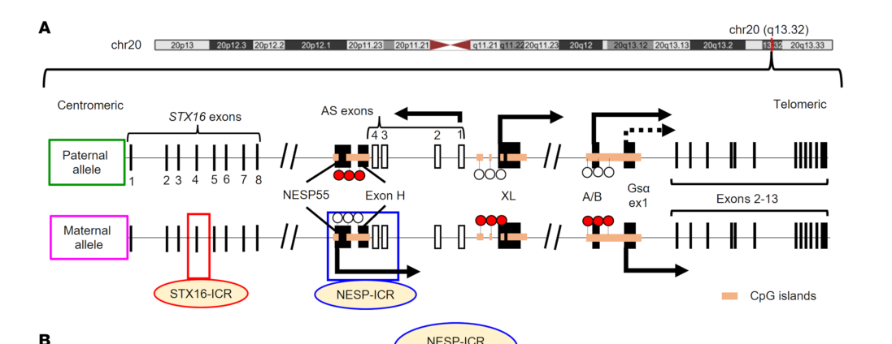

## Question

# Gene Research for Functional Annotation

## ⚠️ CRITICAL: Gene/Protein Identification Context

**BEFORE YOU BEGIN RESEARCH:** You MUST verify you are researching the CORRECT gene/protein. Gene symbols can be ambiguous, especially for less well-characterized genes from non-model organisms.

### Target Gene/Protein Identity (from UniProt):
- **UniProt Accession:** O95467
- **Protein Description:** RecName: Full=Neuroendocrine secretory protein 55; Short=NESP55; Contains: RecName: Full=LHAL tetrapeptide; Contains: RecName: Full=GPIPIRRH peptide; Flags: Precursor;
- **Gene Information:** Name=GNAS {ECO:0000312|HGNC:HGNC:4392}; Synonyms=GNAS1 {ECO:0000312|EMBL:CAA08889.1};
- **Organism (full):** Homo sapiens (Human).
- **Protein Family:** Belongs to the NESP55 family. .
- **Key Domains:** NESP55. (IPR009434); NESP55 (PF06390)

### MANDATORY VERIFICATION STEPS:

1. **Check if the gene symbol "GNAS" matches the protein description above**
2. **Verify the organism is correct:** Homo sapiens (Human).
3. **Check if protein family/domains align with what you find in literature**
4. **If you find literature for a DIFFERENT gene with the same or similar symbol, STOP**

### If Gene Symbol is Ambiguous or You Cannot Find Relevant Literature:

**DO NOT PROCEED WITH RESEARCH ON A DIFFERENT GENE.** Instead:
- State clearly: "The gene symbol 'GNAS' is ambiguous or literature is limited for this specific protein"
- Explain what you found (e.g., "Found extensive literature on a different gene with the same symbol in a different organism")
- Describe the protein based ONLY on the UniProt information provided above
- Suggest that the protein function can be inferred from domain/family information

### Research Target:

Please provide a comprehensive research report on the gene **GNAS** (gene ID: GNAS, UniProt: O95467) in human.

The research report should be a detailed narrative explaining the function, biological processes, and localization of the gene product. Citations should be given for all claims.

You should prioritize authoritative reviews and primary scientific literature when conducting research. You can supplement
this with annotations you find in gene/protein databases, but these can be outdated or inaccurate.

We are specifically interested in the primary function of the gene - for enzymes, what reaction is catalyzed, and what is the substrate specificity? For transporters, what is the substrate? For structural proteins or adapters, what is the broader structural role? For signaling molecules, what is the role in the pathway.

We are interested in where in or outside the cell the gene product carries out its function.

We are also interested in the signaling or biochemical pathways in which the gene functions. We are less interested in broad pleiotropic effects, except where these elucidate the precise role.

Include evidence where possible. We are interested in both experimental evidence as well as inference from structure, evolution, or bioinformatic analysis. Precise studies should be prioritized over high-throughput, where available.

## Output

Question: You are an expert researcher providing comprehensive, well-cited information.

Provide detailed information focusing on:
1. Key concepts and definitions with current understanding
2. Recent developments and latest research (prioritize 2023-2024 sources)
3. Current applications and real-world implementations
4. Expert opinions and analysis from authoritative sources
5. Relevant statistics and data from recent studies

Format as a comprehensive research report with proper citations. Include URLs and publication dates where available.
Always prioritize recent, authoritative sources and provide specific citations for all major claims.

# Gene Research for Functional Annotation

## ⚠️ CRITICAL: Gene/Protein Identification Context

**BEFORE YOU BEGIN RESEARCH:** You MUST verify you are researching the CORRECT gene/protein. Gene symbols can be ambiguous, especially for less well-characterized genes from non-model organisms.

### Target Gene/Protein Identity (from UniProt):
- **UniProt Accession:** O95467
- **Protein Description:** RecName: Full=Neuroendocrine secretory protein 55; Short=NESP55; Contains: RecName: Full=LHAL tetrapeptide; Contains: RecName: Full=GPIPIRRH peptide; Flags: Precursor;
- **Gene Information:** Name=GNAS {ECO:0000312|HGNC:HGNC:4392}; Synonyms=GNAS1 {ECO:0000312|EMBL:CAA08889.1};
- **Organism (full):** Homo sapiens (Human).
- **Protein Family:** Belongs to the NESP55 family. .
- **Key Domains:** NESP55. (IPR009434); NESP55 (PF06390)

### MANDATORY VERIFICATION STEPS:

1. **Check if the gene symbol "GNAS" matches the protein description above**
2. **Verify the organism is correct:** Homo sapiens (Human).
3. **Check if protein family/domains align with what you find in literature**
4. **If you find literature for a DIFFERENT gene with the same or similar symbol, STOP**

### If Gene Symbol is Ambiguous or You Cannot Find Relevant Literature:

**DO NOT PROCEED WITH RESEARCH ON A DIFFERENT GENE.** Instead:
- State clearly: "The gene symbol 'GNAS' is ambiguous or literature is limited for this specific protein"
- Explain what you found (e.g., "Found extensive literature on a different gene with the same symbol in a different organism")
- Describe the protein based ONLY on the UniProt information provided above
- Suggest that the protein function can be inferred from domain/family information

### Research Target:

Please provide a comprehensive research report on the gene **GNAS** (gene ID: GNAS, UniProt: O95467) in human.

The research report should be a detailed narrative explaining the function, biological processes, and localization of the gene product. Citations should be given for all claims.

You should prioritize authoritative reviews and primary scientific literature when conducting research. You can supplement
this with annotations you find in gene/protein databases, but these can be outdated or inaccurate.

We are specifically interested in the primary function of the gene - for enzymes, what reaction is catalyzed, and what is the substrate specificity? For transporters, what is the substrate? For structural proteins or adapters, what is the broader structural role? For signaling molecules, what is the role in the pathway.

We are interested in where in or outside the cell the gene product carries out its function.

We are also interested in the signaling or biochemical pathways in which the gene functions. We are less interested in broad pleiotropic effects, except where these elucidate the precise role.

Include evidence where possible. We are interested in both experimental evidence as well as inference from structure, evolution, or bioinformatic analysis. Precise studies should be prioritized over high-throughput, where available.

## Research Report: Human **GNAS** locus product **NESP55** (UniProt **O95467**)—functional annotation

### 0) Target verification (critical disambiguation)
The UniProt accession **O95467** corresponds to **Neuroendocrine secretory protein 55 (NESP55)**, a neuroendocrine secretory/granin-like protein produced from the **human imprinted GNAS locus** and **distinct from** the canonical stimulatory G-protein α subunit **Gsα** (which is encoded by different GNAS exons and functions in GPCR–cAMP signaling). (fonin2019multifunctionalityofproteins pages 15-17, yang2023gnaslocusbone pages 1-2)

A key distinction is transcript architecture and imprinting: **NESP55 uses its own upstream promoter/first exon (NESP55 exon) and is expressed from the maternal allele**, whereas **Gsα is generally biallelic** (with tissue-specific paternal silencing) and is encoded by the shared GNAS coding exons 1–13. (iwasaki2023thelongrangeinteraction pages 1-2, yang2023gnaslocusbone pages 1-2, raut2025contracttokill pages 1-3)

### 1) Key concepts and current definitions

#### 1.1 The GNAS locus as a “complex/imprinted” gene
Recent and authoritative sources describe **GNAS** as a complex locus with multiple products initiated from different promoters/first exons, including **Gsα**, **XLαs**, **A/B**, **antisense transcripts**, and **NESP55**, each with distinct imprinting patterns. (raut2025contracttokill pages 1-3, iwasaki2023thelongrangeinteraction pages 1-2, yang2023gnaslocusbone pages 1-2, cipriano2024genotype–phenotypecorrelationof pages 1-2)

**Figure evidence (locus concept):** A schematic of the GNAS locus showing **NESP55**, **Gsα**, other transcripts, and differentially methylated regions (DMRs)/imprinting control regions (ICRs) is provided in Iwasaki et al. (JCI, 2023). (iwasaki2023thelongrangeinteraction media 2311e80e)

#### 1.2 What NESP55 is (and is not)
NESP55 is best understood as a **chromogranin/granin-like neuroendocrine secretory precursor protein**, rather than an enzyme, transporter, or canonical signal transducer such as Gsα. (bastepe2007thegnaslocus pages 13-13, bastepe2007thegnaslocus pages 1-2)

A structural feature consistent with granin-like behavior is its high predicted intrinsic disorder: one structure–function review reports NESP55 is **highly intrinsically disordered** (high predicted disorder fraction) and shares **no sequence similarity with other GNAS isoforms**, emphasizing that “GNAS” literature about Gsα cannot be assumed to apply to NESP55. (fonin2019multifunctionalityofproteins pages 15-17)

### 2) Molecular function: biochemical nature, processing, and inferred mechanism

#### 2.1 Precursor and peptide processing
Older but authoritative review-level synthesis reports NESP55 was cloned as a **novel chromogranin-like precursor** and undergoes **post-translational processing into peptides**; one processed peptide was reported to have **5‑HT1B receptor antagonist activity**. (bastepe2007thegnaslocus pages 13-13)

**Interpretation (current understanding):** based on available evidence, NESP55’s primary molecular role is most consistent with being a **regulated secretory pathway cargo/precursor** that can be processed into bioactive peptides, rather than performing a defined catalytic reaction. (bastepe2007thegnaslocus pages 13-13)

#### 2.2 Subcellular localization and secretion context
NESP55 has been reported to localize preferentially in neuroendocrine secretory cell types, including **adrenal medulla adrenaline-synthesizing cells**, consistent with localization to neuroendocrine secretory compartments (e.g., secretory granules) characteristic of granin-family proteins. (bastepe2007thegnaslocus pages 13-13)

### 3) Expression and localization in tissues (current evidence)
NESP55 is described as a neuroendocrine-enriched product; a 2024 clinical marker paper summarizes reported presence in **chromaffin cells**, **pituitary**, and neuroendocrine tumors such as **pheochromocytoma**, **neuroblastoma**, and pancreatic neuroendocrine tumors (including insulinoma). (юкина2024поискновыхиммуногистохимических pages 2-3)

### 4) Pathways and regulatory biology (recent developments prioritized)

#### 4.1 Imprinting control of NESP55 (2023 mechanistic advance)
A key 2023 mechanistic study using human embryonic stem cell models identified long-range regulatory logic at GNAS:
- The **NESP imprinting control region (NESP‑ICR)** is required for maternal allele methylation/transcriptional silencing at the A/B region.
- The **STX16‑ICR** functions as a **long-range enhancer of NESP55 transcription** in an embryonic-stage-specific manner. (iwasaki2023thelongrangeinteraction pages 1-2)

This work reframes NESP55 not only as a secretory precursor protein, but also as a transcript whose **proper expression is integral to establishing/maintaining GNAS imprinting states**. (iwasaki2023thelongrangeinteraction pages 1-2)

#### 4.2 NESP55/NESPAS region variants and pseudohypoparathyroidism type 1B (2024 genetic advance)
A 2024 JCI Insight study identified **recurrent small variants in the NESP55/NESPAS region** in families with **broad GNAS methylation defects** causing pseudohypoparathyroidism type 1B, and reported that **AS (antisense) transcripts were increased while NESP was decreased** in cells from affected patients, supporting a mechanistic link between variants near NESP55/NESPAS and altered imprinting/transcription. (li2024recurrentsmallvariants pages 1-2)

### 5) Current applications and real-world implementations

#### 5.1 Tumor marker exploration in pancreatic neuroendocrine tumors (P‑NETs) and insulinoma
A 2024 insulinoma-focused study (Problems of Endocrinology; **n=41**, with extended IHC in **n=10**) evaluated multiple candidate circulating and tissue markers, including NESP55. It reported that circulating marker levels overall did not change significantly post-surgery and that marker expression did not correlate with aggressiveness; the authors concluded that **NESP55 was not supported as a promising marker** in their dataset. (юкина2024поискновыхиммуногистохимических pages 1-2)

In contrast, the same 2024 paper cites a prior study reporting **NESP55 immunoreactivity in 90.9% of P‑NETs**, illustrating that NESP55 may show high IHC positivity in some P‑NET cohorts but may not generalize as a clinically useful circulating/tissue marker for insulinoma aggressiveness in all settings. (юкина2024поискновыхиммуногистохимических pages 2-3, юкина2024поискновыхиммуногистохимических pages 1-2)

#### 5.2 Clinical genetics / diagnostics relevance via imprinting
Although much of clinical GNAS genetics focuses on **Gsα**, recent human studies implicate the **NESP55-region imprinting machinery** in disease mechanisms (e.g., pseudohypoparathyroidism type 1B through methylation defects involving DMRs connected to NESP). (iwasaki2023thelongrangeinteraction pages 1-2, li2024recurrentsmallvariants pages 1-2)

### 6) Relevant statistics and recent data points (explicitly evidenced)
- **90.9%**: NESP55 immunoreactivity in pancreatic neuroendocrine tumors (P‑NETs) reported by a cited study in a 2024 insulinoma marker paper. (юкина2024поискновыхиммуногистохимических pages 2-3)
- **n=41** insulinoma patients; **n=10** with extended immunohistochemistry in the 2024 marker evaluation; NESP55 not supported as a promising marker in that cohort. (юкина2024поискновыхиммуногистохимических pages 1-2)

### 7) Expert synthesis and evidence gaps
Across recent literature, the **dominant 2023–2024 advances relevant to NESP55 are regulatory** (imprinting control elements, enhancer logic, and disease-associated methylation/transcriptional shifts) rather than new protein biochemistry. (iwasaki2023thelongrangeinteraction pages 1-2, li2024recurrentsmallvariants pages 1-2)

Direct, modern (2023–2024) experimental evidence in the retrieved set remains limited regarding:
- precise **human** subcellular localization at high resolution,
- proteolytic processing sites/peptide repertoire in humans,
- validated receptor targets and mechanisms for NESP55-derived peptides.
Accordingly, the most defensible functional annotation from the current evidence is that NESP55 is a **maternally expressed, granin-like secretory precursor** whose transcriptional regulation is embedded within the **GNAS imprinting network**. (bastepe2007thegnaslocus pages 13-13, iwasaki2023thelongrangeinteraction pages 1-2)

---

### Evidence summary table
| Aspect | Key points | Evidence & notes (paper, year) | Citation ID |
|---|---|---|---|
| Identity / exon structure / imprinting | UniProt O95467 corresponds to NESP55, a distinct protein product of the human GNAS locus rather than Gsα. It is produced from its own upstream promoter/first exon and is maternally expressed because the NESP promoter/DMR is methylated on the paternal allele. | Explicitly identified as “NESP55 (UniProt ID: O95467)” and described as transcriptionally/structurally distinct from Gsα; multiple GNAS reviews and primary studies state NESP55 is a separate imprinted GNAS product with maternal expression (Fonin et al., 2019; Iwasaki et al., 2023; Yang et al., 2023; Cipriano et al., 2024). | (fonin2019multifunctionalityofproteins pages 15-17, iwasaki2023thelongrangeinteraction pages 1-2, yang2023gnaslocusbone pages 1-2, cipriano2024genotype–phenotypecorrelationof pages 1-2) |
| Identity / exon structure / imprinting | The GNAS locus is complex and produces multiple products (Gsα, XLαs, A/B, antisense transcripts, NESP55). NESP55 should not be conflated with canonical Gsα signaling protein products. | Recent reviews and mechanistic studies emphasize distinct promoters/first exons and different imprinting patterns across GNAS products; Figure 1A in Iwasaki et al. schematizes NESP55 separately from Gsα and other transcripts (Iwasaki et al., 2023). | (raut2025contracttokill pages 1-3, iwasaki2023thelongrangeinteraction pages 1-2, yang2023gnaslocusbone pages 1-2, iwasaki2023thelongrangeinteraction media 2311e80e) |
| Biochemical nature & processing | NESP55 is a chromogranin-like/neuroendocrine secretory precursor rather than an enzyme or transporter. It undergoes post-translational processing to smaller peptides. | Review summarizing foundational cloning/biochemistry describes NESP55 as a “novel chromogranin-like precursor” that is post-translationally processed into peptides; one processed peptide was reported to have 5-HT1B antagonist activity (Bastepe, 2007, citing earlier primary work). | (bastepe2007thegnaslocus pages 13-13) |
| Biochemical nature & processing | NESP55 is highly intrinsically disordered relative to Gsα isoforms, consistent with granin/secretory precursor behavior. | Structure-function review reports NESP55 has high predicted disorder (~86.5% PDR) and no sequence similarity to other GNAS isoforms, reinforcing that it is biochemically distinct from G protein α-subunits (Fonin et al., 2019). | (fonin2019multifunctionalityofproteins pages 15-17) |
| Localization | NESP55 localizes to neuroendocrine secretory compartments and is associated with chromogranin-like granules/regulated secretion rather than plasma membrane signal transduction. | Bastepe review summarizes localization studies showing preferential localization in adrenaline-synthesizing cells of bovine and rat adrenal medulla, consistent with secretory granules and a neuroendocrine secretory role (Bastepe, 2007). | (bastepe2007thegnaslocus pages 13-13) |
| Expression / tissues | NESP55 is a neuroendocrine-enriched product; reported in adrenal medulla/chromaffin cells and other neuroendocrine tissues/tumors. | Review and biomarker literature note presence in chromaffin cells, pituitary, pheochromocytoma tissue, neuroblastomas, insulinomas, and other pancreatic neuroendocrine tumors; older tissue-distribution work in bovine tissues is summarized by Bastepe (2007), and Yukina et al. (2024) reiterate neuroendocrine distribution. | (bastepe2007thegnaslocus pages 13-13, юкина2024поискновыхиммуногистохимических pages 2-3) |
| Physiology / functional inference | NESP55 is not assigned a canonical catalytic reaction; current understanding supports a role as a regulated secretory-granule precursor within neuroendocrine cells. | The available evidence supports precursor/secretory function and peptide generation, while recent GNAS-locus papers focus mainly on imprinting control rather than direct molecular mechanism of NESP55 action (Bastepe, 2007; Iwasaki et al., 2023; Li et al., 2024). | (bastepe2007thegnaslocus pages 13-13, iwasaki2023thelongrangeinteraction pages 1-2, li2024recurrentsmallvariants pages 1-2) |
| Disease / clinical relevance | NESP55 transcript regulation matters clinically through GNAS imprinting disorders: reduced NESP expression and altered antisense transcription are implicated in pseudohypoparathyroidism type 1B with broad GNAS methylation defects. | Li et al. (2024) identified recurrent small variants in the NESP55/NESPAS region in affected families and observed increased antisense transcripts with decreased NESP expression in patient cells, linking NESP55-region disruption to PHP1B pathogenesis. | (li2024recurrentsmallvariants pages 1-2) |
| Disease / clinical relevance | NESP55 has been explored as a neuroendocrine tumor marker, but evidence is mixed and context-dependent. | Yukina et al. (2024) note a prior study reporting NESP55 immunoreactivity in 90.9% of pancreatic neuroendocrine tumors, but in their own insulinoma cohort NESP55 was not supported as a promising tissue/circulating marker. | (юкина2024поискновыхиммуногистохимических pages 2-3, юкина2024поискновыхиммуногистохимических pages 1-2) |
| Disease / clinical relevance | In a 2024 insulinoma study, NESP55 did not show convincing value for association with insulin-producing tumors or aggressiveness. | Cohort size was 41 patients, with extended IHC in 10; marker levels before surgery and 2–12 months after surgery did not change significantly overall, and NESP55 was among markers not supported for further study in insulinoma (Yukina et al., 2024). | (юкина2024поискновыхиммуногистохимических pages 1-2) |
| Recent 2023–2024 developments | Major recent advances concern the regulatory biology of the NESP55 region within GNAS imprinting rather than new protein-level biochemistry. | Iwasaki et al. (2023) showed the STX16-ICR acts as a long-range enhancer of maternal NESP55 transcription and that the NESP-ICR is required for A/B methylation/silencing; Li et al. (2024) connected recurrent NESP55/NESPAS-region variants to broad GNAS methylation defects in PHP1B. | (iwasaki2023thelongrangeinteraction pages 1-2, li2024recurrentsmallvariants pages 1-2) |

*Table: This table summarizes evidence-backed functional annotation for human NESP55 (GNAS; UniProt O95467), including identity, processing, localization, expression, and clinical relevance. It emphasizes what is directly supported by the retrieved literature, especially 2023-2024 studies on GNAS imprinting and biomarker use.*

---

### Key references (with URLs and publication dates)
- Iwasaki Y. et al. *The long-range interaction between two GNAS imprinting control regions delineates pseudohypoparathyroidism type 1B pathogenesis.* **Journal of Clinical Investigation**. **Apr 2023**. https://doi.org/10.1172/jci167953 (iwasaki2023thelongrangeinteraction pages 1-2, iwasaki2023thelongrangeinteraction media 2311e80e)
- Yang W. et al. *GNAS locus: bone related diseases and mouse models.* **Frontiers in Endocrinology**. **Oct 2023**. https://doi.org/10.3389/fendo.2023.1255864 (yang2023gnaslocusbone pages 1-2, yang2023gnaslocusbone pages 12-13)
- Li D. et al. *Recurrent small variants in NESP55/NESPAS associated with broad GNAS methylation defects and pseudohypoparathyroidism type 1B.* **JCI Insight**. **Dec 2024**. https://doi.org/10.1172/jci.insight.185874 (li2024recurrentsmallvariants pages 1-2)
- Cipriano L. et al. *Genotype–Phenotype Correlation of GNAS Gene: Review and Disease Management of a Hotspot Mutation.* **International Journal of Molecular Sciences**. **Oct 2024**. https://doi.org/10.3390/ijms252010913 (cipriano2024genotype–phenotypecorrelationof pages 1-2)
- Yukina M.Y. et al. *Поиск новых иммуногистохимических и циркулирующих маркеров инсулиномы* (Search for new IHC and circulating markers of insulinoma). **Problems of Endocrinology**. **May 2024**. https://doi.org/10.14341/probl13466 (юкина2024поискновыхиммуногистохимических pages 2-3, юкина2024поискновыхиммуногистохимических pages 1-2)
- Bastepe M. *The GNAS Locus: Quintessential Complex Gene Encoding Gsα, XLαs, and other Imprinted Transcripts.* **Current Genomics**. **Sep 2007**. https://doi.org/10.2174/138920207783406488 (bastepe2007thegnaslocus pages 13-13, bastepe2007thegnaslocus pages 1-2)
- Fonin A.V. et al. *Multi-functionality of proteins involved in GPCR and G protein signaling…* **Cellular and Molecular Life Sciences**. **Aug 2019**. https://doi.org/10.1007/s00018-019-03276-1 (fonin2019multifunctionalityofproteins pages 15-17)

References

1. (fonin2019multifunctionalityofproteins pages 15-17): Alexander V. Fonin, April L. Darling, Irina M. Kuznetsova, Konstantin K. Turoverov, and Vladimir N. Uversky. Multi-functionality of proteins involved in gpcr and g protein signaling: making sense of structure–function continuum with intrinsic disorder-based proteoforms. Cellular and Molecular Life Sciences, 76:4461-4492, Aug 2019. URL: https://doi.org/10.1007/s00018-019-03276-1, doi:10.1007/s00018-019-03276-1. This article has 78 citations and is from a domain leading peer-reviewed journal.

2. (yang2023gnaslocusbone pages 1-2): Wan Yang, Yiyi Zuo, Nuo Zhang, Kangning Wang, Runze Zhang, Ziyi Chen, and Qing He. Gnas locus: bone related diseases and mouse models. Frontiers in Endocrinology, Oct 2023. URL: https://doi.org/10.3389/fendo.2023.1255864, doi:10.3389/fendo.2023.1255864. This article has 19 citations.

3. (iwasaki2023thelongrangeinteraction pages 1-2): Yorihiro Iwasaki, Cagri Aksu, Monica Reyes, Birol Ay, Qing He, and Murat Bastepe. The long-range interaction between two gnas imprinting control regions delineates pseudohypoparathyroidism type 1b pathogenesis. Journal of Clinical Investigation, Apr 2023. URL: https://doi.org/10.1172/jci167953, doi:10.1172/jci167953. This article has 25 citations and is from a highest quality peer-reviewed journal.

4. (raut2025contracttokill pages 1-3): Pratima Raut, Poompozhil Mathivanan, Surinder K. Batra, and Moorthy P. Ponnusamy. Contract to kill: gnas mutation. Molecular Cancer, Mar 2025. URL: https://doi.org/10.1186/s12943-025-02247-4, doi:10.1186/s12943-025-02247-4. This article has 5 citations and is from a highest quality peer-reviewed journal.

5. (cipriano2024genotype–phenotypecorrelationof pages 1-2): Lorenzo Cipriano, Rosario Ferrigno, Immacolata Andolfo, Roberta Russo, Daniela Cioffi, Maria Cristina Savanelli, Valeria Pellino, Antonella Klain, Achille Iolascon, and Carmelo Piscopo. Genotype–phenotype correlation of gnas gene: review and disease management of a hotspot mutation. International Journal of Molecular Sciences, 25:10913, Oct 2024. URL: https://doi.org/10.3390/ijms252010913, doi:10.3390/ijms252010913. This article has 1 citations.

6. (iwasaki2023thelongrangeinteraction media 2311e80e): Yorihiro Iwasaki, Cagri Aksu, Monica Reyes, Birol Ay, Qing He, and Murat Bastepe. The long-range interaction between two gnas imprinting control regions delineates pseudohypoparathyroidism type 1b pathogenesis. Journal of Clinical Investigation, Apr 2023. URL: https://doi.org/10.1172/jci167953, doi:10.1172/jci167953. This article has 25 citations and is from a highest quality peer-reviewed journal.

7. (bastepe2007thegnaslocus pages 13-13): Murat Bastepe. The gnas locus: quintessential complex gene encoding gs&amp;#945;, xl&amp;#945;s, and other imprinted transcripts. Current Genomics, 8:398-414, Sep 2007. URL: https://doi.org/10.2174/138920207783406488, doi:10.2174/138920207783406488. This article has 82 citations and is from a peer-reviewed journal.

8. (bastepe2007thegnaslocus pages 1-2): Murat Bastepe. The gnas locus: quintessential complex gene encoding gs&amp;#945;, xl&amp;#945;s, and other imprinted transcripts. Current Genomics, 8:398-414, Sep 2007. URL: https://doi.org/10.2174/138920207783406488, doi:10.2174/138920207783406488. This article has 82 citations and is from a peer-reviewed journal.

9. (юкина2024поискновыхиммуногистохимических pages 2-3): © М.Ю. Юкина, Е. А. Трошина, Л.С. Урусова, Нурана Фейзуллаевна Нуралиева, Лариса Вячеславовна Никанкина, В.А. Иоутси, О. Ю. Реброва, Н. Г. Мокрышева, M. Y. Yukina, E. Troshina, L. Urusova, N. Nuralieva, L. V. Nikankina, V. A. Ioutsi, O. Rebrova, and N. G. Mokrysheva. Поиск новых иммуногистохимических и циркулирующих маркеров инсулиномы. Problems of Endocrinology, 70:15-26, May 2024. URL: https://doi.org/10.14341/probl13466, doi:10.14341/probl13466. This article has 1 citations.

10. (li2024recurrentsmallvariants pages 1-2): Dong Li, Suzanne Jan de Beur, Cuiping Hou, Maura R.Z. Ruzhnikov, Hilary Seeley, Garry R. Cutting, Molly B. Sheridan, and Michael A. Levine. Recurrent small variants in nesp55/nespas associated with broad gnas methylation defects and pseudohypoparathyroidism type 1b. JCI Insight, Dec 2024. URL: https://doi.org/10.1172/jci.insight.185874, doi:10.1172/jci.insight.185874. This article has 4 citations and is from a domain leading peer-reviewed journal.

11. (юкина2024поискновыхиммуногистохимических pages 1-2): © М.Ю. Юкина, Е. А. Трошина, Л.С. Урусова, Нурана Фейзуллаевна Нуралиева, Лариса Вячеславовна Никанкина, В.А. Иоутси, О. Ю. Реброва, Н. Г. Мокрышева, M. Y. Yukina, E. Troshina, L. Urusova, N. Nuralieva, L. V. Nikankina, V. A. Ioutsi, O. Rebrova, and N. G. Mokrysheva. Поиск новых иммуногистохимических и циркулирующих маркеров инсулиномы. Problems of Endocrinology, 70:15-26, May 2024. URL: https://doi.org/10.14341/probl13466, doi:10.14341/probl13466. This article has 1 citations.

12. (yang2023gnaslocusbone pages 12-13): Wan Yang, Yiyi Zuo, Nuo Zhang, Kangning Wang, Runze Zhang, Ziyi Chen, and Qing He. Gnas locus: bone related diseases and mouse models. Frontiers in Endocrinology, Oct 2023. URL: https://doi.org/10.3389/fendo.2023.1255864, doi:10.3389/fendo.2023.1255864. This article has 19 citations.

## Artifacts

- [Edison artifact artifact-00](GNAS-deep-research-falcon_artifacts/artifact-00.md)

## Citations

1. fonin2019multifunctionalityofproteins pages 15-17
2. bastepe2007thegnaslocus pages 13-13
3. iwasaki2023thelongrangeinteraction pages 1-2
4. li2024recurrentsmallvariants pages 1-2
5. yang2023gnaslocusbone pages 1-2
6. raut2025contracttokill pages 1-3
7. bastepe2007thegnaslocus pages 1-2
8. yang2023gnaslocusbone pages 12-13
9. https://doi.org/10.1172/jci167953
10. https://doi.org/10.3389/fendo.2023.1255864
11. https://doi.org/10.1172/jci.insight.185874
12. https://doi.org/10.3390/ijms252010913
13. https://doi.org/10.14341/probl13466
14. https://doi.org/10.2174/138920207783406488
15. https://doi.org/10.1007/s00018-019-03276-1
16. https://doi.org/10.1007/s00018-019-03276-1,
17. https://doi.org/10.3389/fendo.2023.1255864,
18. https://doi.org/10.1172/jci167953,
19. https://doi.org/10.1186/s12943-025-02247-4,
20. https://doi.org/10.3390/ijms252010913,
21. https://doi.org/10.2174/138920207783406488,
22. https://doi.org/10.14341/probl13466,
23. https://doi.org/10.1172/jci.insight.185874,