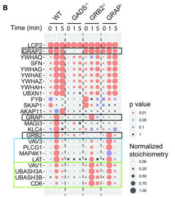

## Question

# Gene Research for Functional Annotation

## ⚠️ CRITICAL: Gene/Protein Identification Context

**BEFORE YOU BEGIN RESEARCH:** You MUST verify you are researching the CORRECT gene/protein. Gene symbols can be ambiguous, especially for less well-characterized genes from non-model organisms.

### Target Gene/Protein Identity (from UniProt):
- **UniProt Accession:** O75791
- **Protein Description:** RecName: Full=GRB2-related adapter protein 2; AltName: Full=Adapter protein GRID; AltName: Full=GRB-2-like protein; Short=GRB2L; AltName: Full=GRBLG; AltName: Full=GRBX; AltName: Full=Grf40 adapter protein; Short=Grf-40; AltName: Full=Growth factor receptor-binding protein; AltName: Full=Hematopoietic cell-associated adapter protein GrpL; AltName: Full=P38; AltName: Full=Protein GADS; AltName: Full=SH3-SH2-SH3 adapter Mona;
- **Gene Information:** Name=GRAP2; Synonyms=GADS, GRB2L, GRID;
- **Organism (full):** Homo sapiens (Human).
- **Protein Family:** Belongs to the GRB2/sem-5/DRK family. .
- **Key Domains:** GRAP2_C_SH3. (IPR035646); Grb2-like. (IPR043539); SH2. (IPR000980); SH2_dom_sf. (IPR036860); SH3-like_dom_sf. (IPR036028)

### MANDATORY VERIFICATION STEPS:

1. **Check if the gene symbol "GRAP2" matches the protein description above**
2. **Verify the organism is correct:** Homo sapiens (Human).
3. **Check if protein family/domains align with what you find in literature**
4. **If you find literature for a DIFFERENT gene with the same or similar symbol, STOP**

### If Gene Symbol is Ambiguous or You Cannot Find Relevant Literature:

**DO NOT PROCEED WITH RESEARCH ON A DIFFERENT GENE.** Instead:
- State clearly: "The gene symbol 'GRAP2' is ambiguous or literature is limited for this specific protein"
- Explain what you found (e.g., "Found extensive literature on a different gene with the same symbol in a different organism")
- Describe the protein based ONLY on the UniProt information provided above
- Suggest that the protein function can be inferred from domain/family information

### Research Target:

Please provide a comprehensive research report on the gene **GRAP2** (gene ID: GRAP2, UniProt: O75791) in human.

The research report should be a detailed narrative explaining the function, biological processes, and localization of the gene product. Citations should be given for all claims.

You should prioritize authoritative reviews and primary scientific literature when conducting research. You can supplement
this with annotations you find in gene/protein databases, but these can be outdated or inaccurate.

We are specifically interested in the primary function of the gene - for enzymes, what reaction is catalyzed, and what is the substrate specificity? For transporters, what is the substrate? For structural proteins or adapters, what is the broader structural role? For signaling molecules, what is the role in the pathway.

We are interested in where in or outside the cell the gene product carries out its function.

We are also interested in the signaling or biochemical pathways in which the gene functions. We are less interested in broad pleiotropic effects, except where these elucidate the precise role.

Include evidence where possible. We are interested in both experimental evidence as well as inference from structure, evolution, or bioinformatic analysis. Precise studies should be prioritized over high-throughput, where available.

## Output

Question: You are an expert researcher providing comprehensive, well-cited information.

Provide detailed information focusing on:
1. Key concepts and definitions with current understanding
2. Recent developments and latest research (prioritize 2023-2024 sources)
3. Current applications and real-world implementations
4. Expert opinions and analysis from authoritative sources
5. Relevant statistics and data from recent studies

Format as a comprehensive research report with proper citations. Include URLs and publication dates where available.
Always prioritize recent, authoritative sources and provide specific citations for all major claims.

# Gene Research for Functional Annotation

## ⚠️ CRITICAL: Gene/Protein Identification Context

**BEFORE YOU BEGIN RESEARCH:** You MUST verify you are researching the CORRECT gene/protein. Gene symbols can be ambiguous, especially for less well-characterized genes from non-model organisms.

### Target Gene/Protein Identity (from UniProt):
- **UniProt Accession:** O75791
- **Protein Description:** RecName: Full=GRB2-related adapter protein 2; AltName: Full=Adapter protein GRID; AltName: Full=GRB-2-like protein; Short=GRB2L; AltName: Full=GRBLG; AltName: Full=GRBX; AltName: Full=Grf40 adapter protein; Short=Grf-40; AltName: Full=Growth factor receptor-binding protein; AltName: Full=Hematopoietic cell-associated adapter protein GrpL; AltName: Full=P38; AltName: Full=Protein GADS; AltName: Full=SH3-SH2-SH3 adapter Mona;
- **Gene Information:** Name=GRAP2; Synonyms=GADS, GRB2L, GRID;
- **Organism (full):** Homo sapiens (Human).
- **Protein Family:** Belongs to the GRB2/sem-5/DRK family. .
- **Key Domains:** GRAP2_C_SH3. (IPR035646); Grb2-like. (IPR043539); SH2. (IPR000980); SH2_dom_sf. (IPR036860); SH3-like_dom_sf. (IPR036028)

### MANDATORY VERIFICATION STEPS:

1. **Check if the gene symbol "GRAP2" matches the protein description above**
2. **Verify the organism is correct:** Homo sapiens (Human).
3. **Check if protein family/domains align with what you find in literature**
4. **If you find literature for a DIFFERENT gene with the same or similar symbol, STOP**

### If Gene Symbol is Ambiguous or You Cannot Find Relevant Literature:

**DO NOT PROCEED WITH RESEARCH ON A DIFFERENT GENE.** Instead:
- State clearly: "The gene symbol 'GRAP2' is ambiguous or literature is limited for this specific protein"
- Explain what you found (e.g., "Found extensive literature on a different gene with the same symbol in a different organism")
- Describe the protein based ONLY on the UniProt information provided above
- Suggest that the protein function can be inferred from domain/family information

### Research Target:

Please provide a comprehensive research report on the gene **GRAP2** (gene ID: GRAP2, UniProt: O75791) in human.

The research report should be a detailed narrative explaining the function, biological processes, and localization of the gene product. Citations should be given for all claims.

You should prioritize authoritative reviews and primary scientific literature when conducting research. You can supplement
this with annotations you find in gene/protein databases, but these can be outdated or inaccurate.

We are specifically interested in the primary function of the gene - for enzymes, what reaction is catalyzed, and what is the substrate specificity? For transporters, what is the substrate? For structural proteins or adapters, what is the broader structural role? For signaling molecules, what is the role in the pathway.

We are interested in where in or outside the cell the gene product carries out its function.

We are also interested in the signaling or biochemical pathways in which the gene functions. We are less interested in broad pleiotropic effects, except where these elucidate the precise role.

Include evidence where possible. We are interested in both experimental evidence as well as inference from structure, evolution, or bioinformatic analysis. Precise studies should be prioritized over high-throughput, where available.

# Human GRAP2 (GADS): functional-annotation research report

**Identity and scope.** The requested [UniProt O75791](https://www.uniprot.org/uniprotkb/O75791/entry) is the **human GRAP2 gene product**, commonly called **GADS** and historically described as **GRID, GrpL, Mona** or **Grf40**. It belongs to the GRB2-family of adaptors, but **GRAP2 is not GRAP or GRB2**: these are separate family members with different predominant binding partners. The GRAP2 protein has an N-terminal SH3 domain, a central phosphotyrosine-binding SH2 domain, an extended glutamine/proline-rich linker and a C-terminal SH3 domain. Unlike GRB2, which prominently recruits the Ras activator SOS, GADS chiefly associates with the signaling adaptor SLP-76. These identifications agree with the supplied human accession and domain annotation. (harkiolaki2003structuralbasisfor pages 1-2, yablonski2019bridgingthegap pages 2-4, ruminski2023mappingtheslp76 pages 1-2)

## Primary molecular function and site of action

**GRAP2 is a nonenzymatic, intracellular signaling bridge.** Its best-established function is to connect **phosphorylated LAT**, a membrane-associated adaptor, to **SLP-76/LCP2**, a cytosolic adaptor, after T-cell receptor (TCR) stimulation. The GRAP2 SH2 domain recognizes LAT phosphotyrosine docking motifs, particularly sites involving **LAT Tyr171 and Tyr191**; its C-terminal SH3 domain binds an unusual **RxxK-containing sequence in SLP-76**. The N-terminal SH3 domain is conserved, but a specific physiological partner and function have not been established. GRAP2 does not catalyze phosphorylation, phospholipid hydrolysis or transport: kinases such as ZAP-70 and ITK phosphorylate pathway components, whereas **PLCγ1**, not GRAP2, hydrolyzes membrane PIP₂ to generate IP₃ and diacylglycerol. (yablonski2019bridgingthegap pages 2-4, harkiolaki2003structuralbasisfor pages 1-2, yablonski2019bridgingthegap pages 7-8, bilal2015gadsisrequired pages 1-3)

The interaction has unusually strong structural and biochemical support. A **1.7-Å crystal structure** revealed that the SLP-76 RxxK motif forms a short helix and wraps around the GADS C-terminal SH3 domain; replacing either its critical arginine or lysine abolished detectable peptide binding. In a separate reconstitution with **full-length proteins**, GADS bound SLP-76 with a measured dissociation constant of **9 nM**. Doubly phosphorylated LAT, GADS, SLP-76 and PLCγ1 assembled into a reversible complex approaching **1:1:1:1 stoichiometry**: GADS engaged LAT pTyr171, and PLCγ1 engaged LAT pTyr132. This demonstrates how an adaptor promotes recruitment and spatial coordination of an enzyme without itself being that enzyme. (harkiolaki2003structuralbasisfor pages 1-2, harkiolaki2003structuralbasisfor pages 4-5, manna2018cooperativeassemblyof pages 1-2, manna2018cooperativeassemblyof pages 5-6)

**Localization is dynamic.** In resting cells, GADS is principally part of a **cytosolic SLP-76-containing complex**. Following antigen-receptor engagement, it is recruited to the **cytoplasmic face of the plasma membrane**, where phosphorylated LAT and SLP-76 organize signaling microclusters at the T-cell stimulatory contact. Imaging studies summarized by Yablonski show rapid formation and subsequent movement of LAT–GADS–SLP-76 microclusters toward the center of that contact. Thus, GRAP2 acts **inside immune cells, at receptor-proximal membrane signaling assemblies**, rather than as a secreted factor or an extracellular receptor. Evidence for the precise microcluster dynamics is drawn from experimental T-cell systems and should not be taken to establish identical dynamics in every human immune-cell type. (liu2000identificationandcharacterization pages 120-126, yablonski2019bridgingthegap pages 5-7, yablonski2019bridgingthegap pages 2-4)

## Pathway role and biological processes

In the **TCR pathway**, LCK-initiated signaling activates ZAP-70, which phosphorylates LAT and SLP-76. Preassociated GADS–SLP-76 can then dock onto phosphorylated LAT, positioning SLP-76-associated effectors, including ITK, near LAT-bound PLCγ1. This assembly supports PLCγ1-dependent IP₃/calcium signaling and diacylglycerol-dependent responses, culminating in activation and cytokine production. GADS contributes to the **assembly and persistence of the signalosome**, rather than serving as a universally indispensable switch for each downstream branch. GADS dimerization provides one proposed mechanism for cooperative recognition of two phosphorylated LAT sites. Negative feedback includes **HPK1/MAP4K1-mediated phosphorylation of GADS Thr262** and SLP-76 Ser376, recruitment of 14-3-3 proteins, and detachment of signalosome components from LAT microclusters; the precise contribution of each regulatory interaction depends on the experimental context. (yablonski2019bridgingthegap pages 4-5, manna2018cooperativeassemblyof pages 5-6, yablonski2019bridgingthegap pages 7-8, yablonski2019bridgingthegap pages 2-4)

The clearest **human-cell loss-of-function evidence** comes from GADS-suppressed **HuT78 CD4⁺ T cells**. TCR stimulation then recruited less SLP-76 and PLCγ1 to LAT, mobilized less calcium and elicited less **IL-2 and IFN-γ after 24 hours**; restoring shRNA-resistant GADS rescued IL-2 production. Importantly, **SLP-76 and PLCγ1 phosphorylation were not proportionately lost**, and stimulated actin polymerization and adhesion were maintained. These experiments distinguish GRAP2’s role in organizing and stabilizing a productive membrane complex from an obligatory role in phosphorylating its partners or driving every cytoskeletal response. HuT78 is a human T-cell line, **not a study of primary human CD4⁺ cells**. (bilal2015gadsisrequired pages 18-23, bilal2015gadsisrequired pages 1-3, bilal2015gadsisrequired pages 10-11, bilal2015gadsisrequired pages 11-13)

GRAP2 also functions in **mast-cell FcεRI/IgE signaling**. Following receptor activation, LAT, GADS and SLP-76 assemble an analogous complex supporting calcium mobilization, degranulation and subsequent cytokine production. In **Gads-deficient mice and mouse bone-marrow-derived mast cells**, FcεRI-induced calcium flux and rapid mediator release were markedly impaired, slower cytokine release was nearly absent, and passive cutaneous anaphylaxis was not observed. Disrupting the Gads-binding region of SLP-76 produced a similarly severe mast-cell signaling phenotype. This is strong physiological evidence for the bridge in the **mouse** allergy pathway, but it is not a measured human clinical effect. Mouse Gads deficiency also impairs several stages of thymocyte development without reproducing the complete developmental block seen upon LAT or SLP-76 loss; this supports a **context-dependent, partly bypassable** role in T cells. (yablonski2019bridgingthegap pages 8-9, yablonski2019bridgingthegap pages 9-11, yablonski2019bridgingthegap pages 7-8)

Expression is predominantly **hematopoietic**, particularly in thymocytes, T cells and mast cells, although reported levels vary among other immune lineages and experimental systems. Therefore, a universal absence from other leukocytes should not be inferred. In addition to LAT, experimentally reported interaction contexts include **CD28**: the protein originally named GRID associates with activated CD28 predominantly through its SH2 domain and **CD28 phospho-Tyr173**. Interaction with **CD6-associated complexes** provides a further possible signaling location. These connections extend the adaptor’s potential repertoire, but the LAT–SLP-76 bridge remains its most directly substantiated principal function. (yablonski2019bridgingthegap pages 1-2, ellis2000gridanovel pages 8-9, ellis2000gridanovel pages 7-8, ruminski2023mappingtheslp76 pages 7-9)

## Recent research and limits of the canonical model

The most directly informative **recent study retrieved was published in March 2023**. Ruminski and colleagues generated separately **GADS/GRAP2-, GRB2- and GRAP-deficient human Jurkat T-cell lines** and measured SLP-76-associated proteins by quantitative affinity-purification mass spectrometry. They identified **131 significantly associated proteins**; their population-level stoichiometry estimates indicated that approximately **100% of SLP-76 was constitutively associated with GADS**, compared with approximately **1% associated with GRB2** and **0.1% with GRAP** under the reported conditions. GADS deletion strongly depleted canonical SLP-76 interactions with LAT and CD6, yet early **ITK–SLP-76 association, SLP-76 Tyr173 phosphorylation, PLCγ1 phosphorylation and measured calcium responses** were substantially preserved. With prolonged stimulation, **IL-2 secretion fell**, and **CD69 induction was reduced at lower antigen doses**; a higher dose bypassed the CD69, but not the IL-2, defect. The paper’s interaction-stoichiometry display directly illustrates this remodeling. (ruminski2023mappingtheslp76 pages 2-4, ruminski2023mappingtheslp76 pages 6-7, ruminski2023mappingtheslp76 pages 7-9, ruminski2023mappingtheslp76 media fc3505da)

These findings **do not negate** the HuT78 calcium phenotype: they show that an altered T-cell network can preserve selected early readouts despite loss of its dominant SLP-76 bridge. The 2023 authors note that their Jurkat cells were engineered to express CD6 and have leukemia-associated signaling abnormalities; these differences, stimulation conditions and cell type constrain direct extrapolation to normal primary human T cells. Likewise, an AP-MS occupancy estimate is **not proof that every SLP-76 molecule in every cell is bound to GADS**. Among the literature examined, no **2024 GRAP2-specific mechanistic or clinical study** supplied comparably direct new validation; adjacent research on LAT or HPK1 should not be presented as direct GRAP2 evidence. (ruminski2023mappingtheslp76 pages 7-9, ruminski2023mappingtheslp76 pages 9-10, ruminski2023mappingtheslp76 pages 2-4, bilal2015gadsisrequired pages 11-13)

## Applications and evidence appraisal

GRAP2 is currently useful as a **mechanistically defined component of experimental TCR and FcεRI signalosome models**, including quantitative interactomics and reconstitution studies. A separate preclinical investigation found that GADS bound **FLT3 phospho-Tyr955 and phospho-Tyr969**, associated with oncogenic **FLT3-ITD**, enhanced proliferative signaling in engineered cells and accelerated growth in a mouse xenograft model. This suggests an additional context-dependent role relevant to FLT3-driven leukemia, **not an established patient biomarker, approved drug target or clinical treatment**. The most defensible functional annotation remains: **hematopoietic SH2/SH3 adaptor that links receptor-induced phosphotyrosine scaffolds to SLP-76 and organizes membrane-proximal immune signaling**, with the strength of downstream dependence varying by cell type and stimulus. (chougule2016expressionofgads pages 1-2, chougule2016expressionofgads pages 6-9, ruminski2023mappingtheslp76 pages 1-2, bilal2015gadsisrequired pages 1-3)

The following evidence matrix distinguishes direct molecular measurements from cell-line, animal and preclinical findings. (manna2018cooperativeassemblyof pages 1-2, ruminski2023mappingtheslp76 pages 2-4, yablonski2019bridgingthegap pages 7-8)

| Evidence and model | Decisive observation | Functional inference or limitation | Source DOI and publication year |
|---|---|---|---|
| Structural study: purified human Mona/GADS C-terminal SH3 domain bound to an SLP-76 peptide | The 1.7 Å crystal structure showed that the SLP-76 ligand adopts a clamp-like conformation; its noncanonical **RxxK** core forms a 3₁₀ helix in a negatively charged SH3 pocket. Arg-to-Ala or Lys-to-Ala substitution abolished detectable binding. Peptide affinity is omitted because the retrieved text renders the units ambiguously. (harkiolaki2003structuralbasisfor pages 1-2, harkiolaki2003structuralbasisfor pages 4-5) | Establishes residue-level specificity for the constitutive GADS–SLP-76 interaction. This is a purified-domain/peptide system, not a measurement of signalosome behavior in cells. | [10.1093/emboj/cdg258](https://doi.org/10.1093/emboj/cdg258), 2003 |
| Biophysical reconstitution: full-length LAT–GADS–SLP-76–PLCγ1 complex | Full-length GADS bound full-length SLP-76 with **Kd = 9 nM**. Doubly phosphorylated LAT supported a reversible complex approaching **1:1:1:1** stoichiometry, with GADS engaging LAT pY171 and PLCγ1 engaging pY132. (manna2018cooperativeassemblyof pages 1-2, manna2018cooperativeassemblyof pages 5-6) | Strong evidence that GADS is a nonenzymatic bridge in a cooperative, circular assembly that recruits PLCγ1 to the membrane. Stoichiometry was measured in vitro and does not imply that every cellular signalosome has this composition. | [10.1073/pnas.1817142115](https://doi.org/10.1073/pnas.1817142115), 2018 |
| Loss-of-function study: GADS shRNA in human CD4⁺ HuT78 T cells | GADS depletion reduced recruitment of SLP-76 and PLCγ1 to LAT, calcium mobilization, and 24-hour IL-2 and IFN-γ release; wild-type GADS rescued IL-2. PLCγ1 phosphorylation, actin polymerization, and TCR-induced adhesion were preserved. (bilal2015gadsisrequired pages 18-23, bilal2015gadsisrequired pages 1-3, bilal2015gadsisrequired pages 10-11, bilal2015gadsisrequired pages 11-13) | Supports a selective role in stabilizing the LAT–PLCγ1 signaling complex and calcium-dependent cytokine output, rather than an absolute requirement for PLCγ1 phosphorylation or adhesion. HuT78 is a transformed cell line, not primary human T cells. | [10.1016/j.cellsig.2015.01.012](https://doi.org/10.1016/j.cellsig.2015.01.012), 2015 |
| CRISPR/AP-MS study: isogenic human Jurkat cells lacking GADS, GRB2, or GRAP | AP-MS identified **131** significant SLP-76-associated proteins. Estimated SLP-76 occupancy was approximately **100% GADS**, versus **1% GRB2** and **0.1% GRAP**. GADS loss dismantled most LAT/CD6-associated interactions, yet early PLCγ1 phosphorylation and calcium responses remained detectable; prolonged stimulation produced less IL-2 and weaker CD69 induction at low antigen dose. (ruminski2023mappingtheslp76 pages 2-4, ruminski2023mappingtheslp76 pages 6-7, ruminski2023mappingtheslp76 pages 7-9) | Demonstrates signaling-network plasticity: GADS is the dominant constitutive SLP-76 partner, but alternative modules can preserve selected proximal events. AP-MS stoichiometries are population-level estimates—not proof that every SLP-76 molecule in every cell is occupied—and engineered CD6⁺ Jurkat cells have leukemia-associated signaling abnormalities. | [10.3389/fimmu.2023.1139123](https://doi.org/10.3389/fimmu.2023.1139123), 2023 |
| In-vivo/ex-vivo evidence: Gads-deficient mice and primary bone-marrow-derived mast cells | Gads loss markedly impaired FcεRI-induced calcium flux and rapid mediator release, virtually abolished slower cytokine release, and prevented passive cutaneous anaphylaxis. Disrupting the Gads-binding segment of SLP-76 phenocopied SLP-76 loss in mast-cell assays. (yablonski2019bridgingthegap pages 8-9, yablonski2019bridgingthegap pages 7-8) | Strong physiological support for an obligate LAT–Gads–SLP-76 bridge in murine IgE-receptor signaling. Translation to human allergy remains inferential because these are mouse genetic and ex-vivo mast-cell data summarized in a review. | [10.3389/fimmu.2019.01704](https://doi.org/10.3389/fimmu.2019.01704), 2019 review of primary studies |
| Preclinical disease model: GADS in FLT3-WT and FLT3-ITD signaling | GADS bound FLT3 phosphosites **pY955** and **pY969**, associated constitutively with FLT3-ITD, enhanced AKT/ERK/p38 and STAT5 signaling, increased proliferation and colony formation, and accelerated xenograft growth. (chougule2016expressionofgads pages 1-2, chougule2016expressionofgads pages 6-9) | Suggests a context-dependent oncogenic adaptor role and a possible protein–protein-interaction target in FLT3-driven AML. Evidence is limited to engineered cells and immunodeficient-mouse xenografts; no patient biomarker or therapeutic validation was reported. | [10.18632/oncotarget.7415](https://doi.org/10.18632/oncotarget.7415), 2016 |
| Recency assessment | The most directly relevant recent mechanistic study retrieved was the 2023 human Jurkat interactome analysis; no 2024 publication retrieved here supplied new GRAP2-specific genetic, structural, or clinical validation. (ruminski2023mappingtheslp76 pages 1-2, ruminski2023mappingtheslp76 pages 2-4) | Prevents adjacent 2024 work on LAT condensation, HPK1, or immune signaling from being misrepresented as direct evidence about GRAP2. The conclusion is limited to the literature set examined. | [10.3389/fimmu.2023.1139123](https://doi.org/10.3389/fimmu.2023.1139123), 2023 |

*Table: A compact comparison of structural, biochemical, cellular, animal, and disease-model evidence defining human GRAP2/GADS function. It separates strong mechanistic findings from model-specific and translational limitations.*

### Selected sources: publication dates and URLs

- **Ruminski et al., March 2023**, *Frontiers in Immunology*: human Jurkat GRAP2-family knockout/interactomics study. https://doi.org/10.3389/fimmu.2023.1139123 (ruminski2023mappingtheslp76 pages 1-2, ruminski2023mappingtheslp76 pages 2-4)
- **Manna et al., December 2018**, *Proceedings of the National Academy of Sciences*: LAT–GADS–SLP-76–PLCγ1 reconstitution. https://doi.org/10.1073/pnas.1817142115 (manna2018cooperativeassemblyof pages 1-2, manna2018cooperativeassemblyof pages 5-6)
- **Harkiolaki et al., June 2003**, *The EMBO Journal*: GADS–SLP-76 crystal structure. https://doi.org/10.1093/emboj/cdg258 (harkiolaki2003structuralbasisfor pages 1-2, harkiolaki2003structuralbasisfor pages 4-5)
- **Bilal et al., April 2015**, *Cellular Signalling*: human HuT78 loss-of-function study. https://doi.org/10.1016/j.cellsig.2015.01.012 (bilal2015gadsisrequired pages 18-23, bilal2015gadsisrequired pages 1-3)
- **Yablonski, July 2019**, *Frontiers in Immunology*: authoritative synthesis of GADS regulation, T-cell biology and mouse mast-cell studies. https://doi.org/10.3389/fimmu.2019.01704 (yablonski2019bridgingthegap pages 1-2, yablonski2019bridgingthegap pages 7-8)
- **Ellis et al., June 2000**, *The Journal of Immunology*: GRID/GADS interaction with CD28. https://doi.org/10.4049/jimmunol.164.11.5805 (ellis2000gridanovel pages 8-9, ellis2000gridanovel pages 7-8)
- **Chougule et al., February 2016**, *Oncotarget*: preclinical FLT3 interaction and mitogenic signaling. https://doi.org/10.18632/oncotarget.7415 (chougule2016expressionofgads pages 1-2, chougule2016expressionofgads pages 6-9)

References

1. (harkiolaki2003structuralbasisfor pages 1-2): M. Harkiolaki, M. Lewitzky, R. Gilbert, E. Jones, R. Bourette, G. Mouchiroud, H. Sondermann, I. Moarefi, and S. Feller. Structural basis for sh3 domain‐mediated high‐affinity binding between mona/gads and slp‐76. The EMBO Journal, 22:2571-2582, Jun 2003. URL: https://doi.org/10.1093/emboj/cdg258, doi:10.1093/emboj/cdg258. This article has 160 citations.

2. (yablonski2019bridgingthegap pages 2-4): Deborah Yablonski. Bridging the gap: modulatory roles of the grb2-family adaptor, gads, in cellular and allergic immune responses. Frontiers in Immunology, Jul 2019. URL: https://doi.org/10.3389/fimmu.2019.01704, doi:10.3389/fimmu.2019.01704. This article has 64 citations and is from a peer-reviewed journal.

3. (ruminski2023mappingtheslp76 pages 1-2): Kilian Ruminski, Javier Celis-Gutierrez, Nicolas Jarmuzynski, Emilie Maturin, Stephane Audebert, Marie Malissen, Luc Camoin, Guillaume Voisinne, Bernard Malissen, and Romain Roncagalli. Mapping the slp76 interactome in t cells lacking each of the grb2-family adaptors reveals molecular plasticity of the tcr signaling pathway. Frontiers in Immunology, Mar 2023. URL: https://doi.org/10.3389/fimmu.2023.1139123, doi:10.3389/fimmu.2023.1139123. This article has 6 citations and is from a peer-reviewed journal.

4. (yablonski2019bridgingthegap pages 7-8): Deborah Yablonski. Bridging the gap: modulatory roles of the grb2-family adaptor, gads, in cellular and allergic immune responses. Frontiers in Immunology, Jul 2019. URL: https://doi.org/10.3389/fimmu.2019.01704, doi:10.3389/fimmu.2019.01704. This article has 64 citations and is from a peer-reviewed journal.

5. (bilal2015gadsisrequired pages 1-3): Mahmood Y. Bilal, Elizabeth Y. Zhang, Brittney Dinkel, Daimon Hardy, Thomas M. Yankee, and Jon C.D. Houtman. Gads is required for tcr-mediated calcium influx and cytokine release, but not cellular adhesion, in human t cells. Cellular signalling, 27 4:841-50, Apr 2015. URL: https://doi.org/10.1016/j.cellsig.2015.01.012, doi:10.1016/j.cellsig.2015.01.012. This article has 29 citations and is from a peer-reviewed journal.

6. (harkiolaki2003structuralbasisfor pages 4-5): M. Harkiolaki, M. Lewitzky, R. Gilbert, E. Jones, R. Bourette, G. Mouchiroud, H. Sondermann, I. Moarefi, and S. Feller. Structural basis for sh3 domain‐mediated high‐affinity binding between mona/gads and slp‐76. The EMBO Journal, 22:2571-2582, Jun 2003. URL: https://doi.org/10.1093/emboj/cdg258, doi:10.1093/emboj/cdg258. This article has 160 citations.

7. (manna2018cooperativeassemblyof pages 1-2): Asit Manna, Huaying Zhao, Junya Wada, Lakshmi Balagopalan, Harichandra D. Tagad, Ettore Appella, Peter Schuck, and Lawrence E. Samelson. Cooperative assembly of a four-molecule signaling complex formed upon t cell antigen receptor activation. Proceedings of the National Academy of Sciences, 115:E11914-E11923, Dec 2018. URL: https://doi.org/10.1073/pnas.1817142115, doi:10.1073/pnas.1817142115. This article has 30 citations and is from a highest quality peer-reviewed journal.

8. (manna2018cooperativeassemblyof pages 5-6): Asit Manna, Huaying Zhao, Junya Wada, Lakshmi Balagopalan, Harichandra D. Tagad, Ettore Appella, Peter Schuck, and Lawrence E. Samelson. Cooperative assembly of a four-molecule signaling complex formed upon t cell antigen receptor activation. Proceedings of the National Academy of Sciences, 115:E11914-E11923, Dec 2018. URL: https://doi.org/10.1073/pnas.1817142115, doi:10.1073/pnas.1817142115. This article has 30 citations and is from a highest quality peer-reviewed journal.

9. (liu2000identificationandcharacterization pages 120-126): SKW Liu. Identification and characterization of gads, a novel hematopoietic-specific adaptor protein, in t cell receptor signaling. Unknown journal, 2000.

10. (yablonski2019bridgingthegap pages 5-7): Deborah Yablonski. Bridging the gap: modulatory roles of the grb2-family adaptor, gads, in cellular and allergic immune responses. Frontiers in Immunology, Jul 2019. URL: https://doi.org/10.3389/fimmu.2019.01704, doi:10.3389/fimmu.2019.01704. This article has 64 citations and is from a peer-reviewed journal.

11. (yablonski2019bridgingthegap pages 4-5): Deborah Yablonski. Bridging the gap: modulatory roles of the grb2-family adaptor, gads, in cellular and allergic immune responses. Frontiers in Immunology, Jul 2019. URL: https://doi.org/10.3389/fimmu.2019.01704, doi:10.3389/fimmu.2019.01704. This article has 64 citations and is from a peer-reviewed journal.

12. (bilal2015gadsisrequired pages 18-23): Mahmood Y. Bilal, Elizabeth Y. Zhang, Brittney Dinkel, Daimon Hardy, Thomas M. Yankee, and Jon C.D. Houtman. Gads is required for tcr-mediated calcium influx and cytokine release, but not cellular adhesion, in human t cells. Cellular signalling, 27 4:841-50, Apr 2015. URL: https://doi.org/10.1016/j.cellsig.2015.01.012, doi:10.1016/j.cellsig.2015.01.012. This article has 29 citations and is from a peer-reviewed journal.

13. (bilal2015gadsisrequired pages 10-11): Mahmood Y. Bilal, Elizabeth Y. Zhang, Brittney Dinkel, Daimon Hardy, Thomas M. Yankee, and Jon C.D. Houtman. Gads is required for tcr-mediated calcium influx and cytokine release, but not cellular adhesion, in human t cells. Cellular signalling, 27 4:841-50, Apr 2015. URL: https://doi.org/10.1016/j.cellsig.2015.01.012, doi:10.1016/j.cellsig.2015.01.012. This article has 29 citations and is from a peer-reviewed journal.

14. (bilal2015gadsisrequired pages 11-13): Mahmood Y. Bilal, Elizabeth Y. Zhang, Brittney Dinkel, Daimon Hardy, Thomas M. Yankee, and Jon C.D. Houtman. Gads is required for tcr-mediated calcium influx and cytokine release, but not cellular adhesion, in human t cells. Cellular signalling, 27 4:841-50, Apr 2015. URL: https://doi.org/10.1016/j.cellsig.2015.01.012, doi:10.1016/j.cellsig.2015.01.012. This article has 29 citations and is from a peer-reviewed journal.

15. (yablonski2019bridgingthegap pages 8-9): Deborah Yablonski. Bridging the gap: modulatory roles of the grb2-family adaptor, gads, in cellular and allergic immune responses. Frontiers in Immunology, Jul 2019. URL: https://doi.org/10.3389/fimmu.2019.01704, doi:10.3389/fimmu.2019.01704. This article has 64 citations and is from a peer-reviewed journal.

16. (yablonski2019bridgingthegap pages 9-11): Deborah Yablonski. Bridging the gap: modulatory roles of the grb2-family adaptor, gads, in cellular and allergic immune responses. Frontiers in Immunology, Jul 2019. URL: https://doi.org/10.3389/fimmu.2019.01704, doi:10.3389/fimmu.2019.01704. This article has 64 citations and is from a peer-reviewed journal.

17. (yablonski2019bridgingthegap pages 1-2): Deborah Yablonski. Bridging the gap: modulatory roles of the grb2-family adaptor, gads, in cellular and allergic immune responses. Frontiers in Immunology, Jul 2019. URL: https://doi.org/10.3389/fimmu.2019.01704, doi:10.3389/fimmu.2019.01704. This article has 64 citations and is from a peer-reviewed journal.

18. (ellis2000gridanovel pages 8-9): Jonathan H. Ellis, Claire Ashman, M. Neil Burden, Katherine E. Kilpatrick, Mary A. Morse, and Paul A. Hamblin. Grid: a novel grb-2-related adapter protein that interacts with the activated t cell costimulatory receptor cd28. The Journal of Immunology, 164:5805-5814, Jun 2000. URL: https://doi.org/10.4049/jimmunol.164.11.5805, doi:10.4049/jimmunol.164.11.5805. This article has 83 citations.

19. (ellis2000gridanovel pages 7-8): Jonathan H. Ellis, Claire Ashman, M. Neil Burden, Katherine E. Kilpatrick, Mary A. Morse, and Paul A. Hamblin. Grid: a novel grb-2-related adapter protein that interacts with the activated t cell costimulatory receptor cd28. The Journal of Immunology, 164:5805-5814, Jun 2000. URL: https://doi.org/10.4049/jimmunol.164.11.5805, doi:10.4049/jimmunol.164.11.5805. This article has 83 citations.

20. (ruminski2023mappingtheslp76 pages 7-9): Kilian Ruminski, Javier Celis-Gutierrez, Nicolas Jarmuzynski, Emilie Maturin, Stephane Audebert, Marie Malissen, Luc Camoin, Guillaume Voisinne, Bernard Malissen, and Romain Roncagalli. Mapping the slp76 interactome in t cells lacking each of the grb2-family adaptors reveals molecular plasticity of the tcr signaling pathway. Frontiers in Immunology, Mar 2023. URL: https://doi.org/10.3389/fimmu.2023.1139123, doi:10.3389/fimmu.2023.1139123. This article has 6 citations and is from a peer-reviewed journal.

21. (ruminski2023mappingtheslp76 pages 2-4): Kilian Ruminski, Javier Celis-Gutierrez, Nicolas Jarmuzynski, Emilie Maturin, Stephane Audebert, Marie Malissen, Luc Camoin, Guillaume Voisinne, Bernard Malissen, and Romain Roncagalli. Mapping the slp76 interactome in t cells lacking each of the grb2-family adaptors reveals molecular plasticity of the tcr signaling pathway. Frontiers in Immunology, Mar 2023. URL: https://doi.org/10.3389/fimmu.2023.1139123, doi:10.3389/fimmu.2023.1139123. This article has 6 citations and is from a peer-reviewed journal.

22. (ruminski2023mappingtheslp76 pages 6-7): Kilian Ruminski, Javier Celis-Gutierrez, Nicolas Jarmuzynski, Emilie Maturin, Stephane Audebert, Marie Malissen, Luc Camoin, Guillaume Voisinne, Bernard Malissen, and Romain Roncagalli. Mapping the slp76 interactome in t cells lacking each of the grb2-family adaptors reveals molecular plasticity of the tcr signaling pathway. Frontiers in Immunology, Mar 2023. URL: https://doi.org/10.3389/fimmu.2023.1139123, doi:10.3389/fimmu.2023.1139123. This article has 6 citations and is from a peer-reviewed journal.

23. (ruminski2023mappingtheslp76 media fc3505da): Kilian Ruminski, Javier Celis-Gutierrez, Nicolas Jarmuzynski, Emilie Maturin, Stephane Audebert, Marie Malissen, Luc Camoin, Guillaume Voisinne, Bernard Malissen, and Romain Roncagalli. Mapping the slp76 interactome in t cells lacking each of the grb2-family adaptors reveals molecular plasticity of the tcr signaling pathway. Frontiers in Immunology, Mar 2023. URL: https://doi.org/10.3389/fimmu.2023.1139123, doi:10.3389/fimmu.2023.1139123. This article has 6 citations and is from a peer-reviewed journal.

24. (ruminski2023mappingtheslp76 pages 9-10): Kilian Ruminski, Javier Celis-Gutierrez, Nicolas Jarmuzynski, Emilie Maturin, Stephane Audebert, Marie Malissen, Luc Camoin, Guillaume Voisinne, Bernard Malissen, and Romain Roncagalli. Mapping the slp76 interactome in t cells lacking each of the grb2-family adaptors reveals molecular plasticity of the tcr signaling pathway. Frontiers in Immunology, Mar 2023. URL: https://doi.org/10.3389/fimmu.2023.1139123, doi:10.3389/fimmu.2023.1139123. This article has 6 citations and is from a peer-reviewed journal.

25. (chougule2016expressionofgads pages 1-2): Rohit A. Chougule, Eugenia Cordero, Sausan A. Moharram, Kristian Pietras, Lars Rönnstrand, and Julhash U. Kazi. Expression of gads enhances flt3-induced mitogenic signaling. Oncotarget, 7:14112-14124, Feb 2016. URL: https://doi.org/10.18632/oncotarget.7415, doi:10.18632/oncotarget.7415. This article has 14 citations.

26. (chougule2016expressionofgads pages 6-9): Rohit A. Chougule, Eugenia Cordero, Sausan A. Moharram, Kristian Pietras, Lars Rönnstrand, and Julhash U. Kazi. Expression of gads enhances flt3-induced mitogenic signaling. Oncotarget, 7:14112-14124, Feb 2016. URL: https://doi.org/10.18632/oncotarget.7415, doi:10.18632/oncotarget.7415. This article has 14 citations.

## Artifacts

- [Edison artifact artifact-00](GRAP2-deep-research-falcon_artifacts/artifact-00.md)

## Citations

1. harkiolaki2003structuralbasisfor pages 1-2
2. yablonski2019bridgingthegap pages 2-4
3. yablonski2019bridgingthegap pages 7-8
4. bilal2015gadsisrequired pages 1-3
5. harkiolaki2003structuralbasisfor pages 4-5
6. manna2018cooperativeassemblyof pages 1-2
7. manna2018cooperativeassemblyof pages 5-6
8. liu2000identificationandcharacterization pages 120-126
9. yablonski2019bridgingthegap pages 5-7
10. yablonski2019bridgingthegap pages 4-5
11. bilal2015gadsisrequired pages 18-23
12. bilal2015gadsisrequired pages 10-11
13. bilal2015gadsisrequired pages 11-13
14. yablonski2019bridgingthegap pages 8-9
15. yablonski2019bridgingthegap pages 9-11
16. yablonski2019bridgingthegap pages 1-2
17. ellis2000gridanovel pages 8-9
18. ellis2000gridanovel pages 7-8
19. chougule2016expressionofgads pages 1-2
20. chougule2016expressionofgads pages 6-9
21. UniProt O75791
22. 10.1093/emboj/cdg258
23. 10.1073/pnas.1817142115
24. 10.1016/j.cellsig.2015.01.012
25. 10.3389/fimmu.2023.1139123
26. 10.3389/fimmu.2019.01704
27. 10.18632/oncotarget.7415
28. https://www.uniprot.org/uniprotkb/O75791/entry
29. https://doi.org/10.1093/emboj/cdg258
30. https://doi.org/10.1073/pnas.1817142115
31. https://doi.org/10.1016/j.cellsig.2015.01.012
32. https://doi.org/10.3389/fimmu.2023.1139123
33. https://doi.org/10.3389/fimmu.2019.01704
34. https://doi.org/10.18632/oncotarget.7415
35. https://doi.org/10.4049/jimmunol.164.11.5805
36. https://doi.org/10.1093/emboj/cdg258,
37. https://doi.org/10.3389/fimmu.2019.01704,
38. https://doi.org/10.3389/fimmu.2023.1139123,
39. https://doi.org/10.1016/j.cellsig.2015.01.012,
40. https://doi.org/10.1073/pnas.1817142115,
41. https://doi.org/10.4049/jimmunol.164.11.5805,
42. https://doi.org/10.18632/oncotarget.7415,