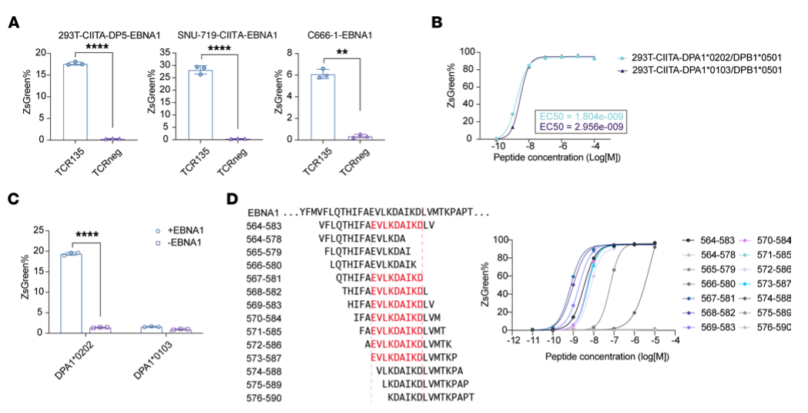

## Question

# Gene Research for Functional Annotation

## ⚠️ CRITICAL: Gene/Protein Identification Context

**BEFORE YOU BEGIN RESEARCH:** You MUST verify you are researching the CORRECT gene/protein. Gene symbols can be ambiguous, especially for less well-characterized genes from non-model organisms.

### Target Gene/Protein Identity (from UniProt):
- **UniProt Accession:** P20036
- **Protein Description:** RecName: Full=HLA class II histocompatibility antigen, DP alpha 1 chain; AltName: Full=DP(W3); AltName: Full=DP(W4); AltName: Full=HLA-SB alpha chain; AltName: Full=MHC class II DP3-alpha; AltName: Full=MHC class II DPA1; Flags: Precursor;
- **Gene Information:** Name=HLA-DPA1; Synonyms=HLA-DP1A, HLASB;
- **Organism (full):** Homo sapiens (Human).
- **Protein Family:** Belongs to the MHC class II family. .
- **Key Domains:** Ig-like_dom. (IPR007110); Ig-like_dom_sf. (IPR036179); Ig-like_fold. (IPR013783); Ig/MHC_CS. (IPR003006); Ig_C1-set. (IPR003597)

### MANDATORY VERIFICATION STEPS:

1. **Check if the gene symbol "HLA-DPA1" matches the protein description above**
2. **Verify the organism is correct:** Homo sapiens (Human).
3. **Check if protein family/domains align with what you find in literature**
4. **If you find literature for a DIFFERENT gene with the same or similar symbol, STOP**

### If Gene Symbol is Ambiguous or You Cannot Find Relevant Literature:

**DO NOT PROCEED WITH RESEARCH ON A DIFFERENT GENE.** Instead:
- State clearly: "The gene symbol 'HLA-DPA1' is ambiguous or literature is limited for this specific protein"
- Explain what you found (e.g., "Found extensive literature on a different gene with the same symbol in a different organism")
- Describe the protein based ONLY on the UniProt information provided above
- Suggest that the protein function can be inferred from domain/family information

### Research Target:

Please provide a comprehensive research report on the gene **HLA-DPA1** (gene ID: HLA-DPA1, UniProt: P20036) in human.

The research report should be a detailed narrative explaining the function, biological processes, and localization of the gene product. Citations should be given for all claims.

You should prioritize authoritative reviews and primary scientific literature when conducting research. You can supplement
this with annotations you find in gene/protein databases, but these can be outdated or inaccurate.

We are specifically interested in the primary function of the gene - for enzymes, what reaction is catalyzed, and what is the substrate specificity? For transporters, what is the substrate? For structural proteins or adapters, what is the broader structural role? For signaling molecules, what is the role in the pathway.

We are interested in where in or outside the cell the gene product carries out its function.

We are also interested in the signaling or biochemical pathways in which the gene functions. We are less interested in broad pleiotropic effects, except where these elucidate the precise role.

Include evidence where possible. We are interested in both experimental evidence as well as inference from structure, evolution, or bioinformatic analysis. Precise studies should be prioritized over high-throughput, where available.

## Output

Question: You are an expert researcher providing comprehensive, well-cited information.

Provide detailed information focusing on:
1. Key concepts and definitions with current understanding
2. Recent developments and latest research (prioritize 2023-2024 sources)
3. Current applications and real-world implementations
4. Expert opinions and analysis from authoritative sources
5. Relevant statistics and data from recent studies

Format as a comprehensive research report with proper citations. Include URLs and publication dates where available.
Always prioritize recent, authoritative sources and provide specific citations for all major claims.

# Gene Research for Functional Annotation

## ⚠️ CRITICAL: Gene/Protein Identification Context

**BEFORE YOU BEGIN RESEARCH:** You MUST verify you are researching the CORRECT gene/protein. Gene symbols can be ambiguous, especially for less well-characterized genes from non-model organisms.

### Target Gene/Protein Identity (from UniProt):
- **UniProt Accession:** P20036
- **Protein Description:** RecName: Full=HLA class II histocompatibility antigen, DP alpha 1 chain; AltName: Full=DP(W3); AltName: Full=DP(W4); AltName: Full=HLA-SB alpha chain; AltName: Full=MHC class II DP3-alpha; AltName: Full=MHC class II DPA1; Flags: Precursor;
- **Gene Information:** Name=HLA-DPA1; Synonyms=HLA-DP1A, HLASB;
- **Organism (full):** Homo sapiens (Human).
- **Protein Family:** Belongs to the MHC class II family. .
- **Key Domains:** Ig-like_dom. (IPR007110); Ig-like_dom_sf. (IPR036179); Ig-like_fold. (IPR013783); Ig/MHC_CS. (IPR003006); Ig_C1-set. (IPR003597)

### MANDATORY VERIFICATION STEPS:

1. **Check if the gene symbol "HLA-DPA1" matches the protein description above**
2. **Verify the organism is correct:** Homo sapiens (Human).
3. **Check if protein family/domains align with what you find in literature**
4. **If you find literature for a DIFFERENT gene with the same or similar symbol, STOP**

### If Gene Symbol is Ambiguous or You Cannot Find Relevant Literature:

**DO NOT PROCEED WITH RESEARCH ON A DIFFERENT GENE.** Instead:
- State clearly: "The gene symbol 'HLA-DPA1' is ambiguous or literature is limited for this specific protein"
- Explain what you found (e.g., "Found extensive literature on a different gene with the same symbol in a different organism")
- Describe the protein based ONLY on the UniProt information provided above
- Suggest that the protein function can be inferred from domain/family information

### Research Target:

Please provide a comprehensive research report on the gene **HLA-DPA1** (gene ID: HLA-DPA1, UniProt: P20036) in human.

The research report should be a detailed narrative explaining the function, biological processes, and localization of the gene product. Citations should be given for all claims.

You should prioritize authoritative reviews and primary scientific literature when conducting research. You can supplement
this with annotations you find in gene/protein databases, but these can be outdated or inaccurate.

We are specifically interested in the primary function of the gene - for enzymes, what reaction is catalyzed, and what is the substrate specificity? For transporters, what is the substrate? For structural proteins or adapters, what is the broader structural role? For signaling molecules, what is the role in the pathway.

We are interested in where in or outside the cell the gene product carries out its function.

We are also interested in the signaling or biochemical pathways in which the gene functions. We are less interested in broad pleiotropic effects, except where these elucidate the precise role.

Include evidence where possible. We are interested in both experimental evidence as well as inference from structure, evolution, or bioinformatic analysis. Precise studies should be prioritized over high-throughput, where available.

# Human HLA-DPA1: functional annotation and research report

## Identity and principal function

**Identity verified.** The requested human gene **HLA-DPA1** encodes the **alpha chain of HLA-DP**, a classical major histocompatibility complex class II (MHC-II) protein; **HLA-DPB1 encodes its beta-chain partner**. This matches the supplied *Homo sapiens* UniProt accession **[P20036](https://www.uniprot.org/uniprotkb/P20036/entry)**. It is not HLA-DPB1, HLA-DQA1 or HLA-DRA. The supplied immunoglobulin-like domain annotations are consistent with the two-domain architecture of a membrane-bound MHC-II alpha chain, although the cited papers do not independently validate each supplied InterPro identifier. (budeus2024hladmandhlado pages 1-3, yamashita2017hladp84glyconstitutivelypresents pages 1-2)

**The primary function is peptide-antigen display, not catalysis or transport.** DPA1 and DPB1 form a noncovalent, membrane-anchored heterodimer. Their membrane-distal alpha1 and beta1 regions jointly make an open-ended peptide-binding groove; the membrane-proximal alpha2 region has an immunoglobulin-like fold. Bound antigenic peptides, typically about **12–25 amino acids** long with a binding core of approximately **nine residues**, are displayed to cognate **CD4-positive T-cell receptors**. Thus, the relevant biochemical specificity belongs to the **particular DPA1–DPB1 allele pair and its bound peptide**, not to an isolated DPA1 chain. (betke2024hladprestrictedcd4+t pages 8-12, budeus2024hladmandhlado pages 1-3, strazar2023hlaiiimmunopeptidomeprofiling pages 1-3)

## Where it acts and how antigen presentation proceeds

The alpha chain is synthesized and assembled with DPB1 in the **endoplasmic reticulum (ER)**. For the canonical MHC-II route, the associated invariant chain **CD74/Ii** facilitates assembly, protects the nascent peptide-binding groove and directs trafficking through the secretory pathway to acidic **endosomal/lysosomal MHC-II compartments**. Proteolysis of Ii leaves the placeholder peptide **CLIP**; **HLA-DM** promotes its exchange for antigen-derived peptides, while **HLA-DO** modulates DM activity. The loaded heterodimer then reaches the **plasma membrane**, where its extracellular groove presents peptide to CD4 T cells. These processing proteins are partners in the pathway, **not catalytic activities of DPA1**. (yamashita2017hladp84glyconstitutivelypresents pages 1-2, budeus2024hladmandhlado pages 1-3)

The usual peptide sources are proteins taken up from outside the cell by endocytosis or phagocytosis; intracellular proteins can also reach MHC-II compartments, including through autophagy. HLA-DP is principally expressed by professional antigen-presenting cells—**dendritic cells, macrophages and B cells**—but inflammatory conditions can induce expression in other cells. **CIITA** coordinates class-II gene expression, and interferon-gamma can induce this program in epithelial cells. Direct experiments demonstrate interferon-gamma-responsive HLA-DP on human cholangiocyte organoids and surface HLA-DP on nasopharyngeal carcinoma cells. Consequently, DPA1’s principal *functional location* is the **extracellular face of the plasma membrane**, following assembly and peptide acquisition in the ER and endosomal system. (budeus2024hladmandhlado pages 1-3, weisbrod2024fastmap—aflexibleand pages 2-3, zecher2024hladpa1*0201~b1*0101isa pages 1-2, wang2024anebvrelatedcd4 pages 1-2)

**An important HLA-DP-specific qualification:** not every DP heterodimer follows the canonical CLIP route. Mutational and peptide-analysis experiments found that a **DPB1-encoded Asp at beta-chain position 84** supports productive invariant-chain/CLIP presentation, whereas common **beta84Gly** heterodimers do not present CLIP in the same way. The latter can additionally display endogenous peptides generated by the **proteasome** and delivered to the ER by **TAP**, while still accessing endocytic compartments. This is a property demonstrated for particular **DPA1–DPB1 complexes**, with the experimentally decisive residue in **DPB1**, not evidence that DPA1 itself is a protease or transporter. [Yamashita *et al.*, *Nature Communications*, May 2017](https://doi.org/10.1038/ncomms15244). (yamashita2017hladp84glyconstitutivelypresents pages 2-3, yamashita2017hladp84glyconstitutivelypresents pages 4-5, yamashita2017hladp84glyconstitutivelypresents pages 1-2)

## Gene-specific experimental evidence and 2023–2024 developments

**The DPA1 alpha allele can change which antigen is naturally presented.** In a [February 2024 *Journal of Clinical Investigation* study](https://doi.org/10.1172/JCI172092), investigators held the beta allele **DPB1*05:01** constant while comparing **DPA1*02:02** with **DPA1*01:03**. Mass spectrometry identified the naturally displayed Epstein–Barr virus EBNA1 peptide **EBNA1₅₆₇–₅₈₁**; endogenous EBNA1 expression activated the relevant T-cell receptor in the DPA1*02:02 pairing, but not the DPA1*01:03 pairing. This controlled comparison—and the paper’s **Figure 2C**—provides particularly direct evidence that the specified alpha-chain gene contributes to antigen-presentation specificity, rather than being merely a passive expression marker. (wang2024anebvrelatedcd4 pages 1-2, wang2024anebvrelatedcd4 pages 11-13, wang2024anebvrelatedcd4 media d6050fd6)

The same 2024 study found **strong HLA-DP expression in 69 of 112 (62%)** nasopharyngeal carcinoma samples, with intermediate expression in another **13%**. EBNA1-directed, HLA-DP5-restricted **TCR135-engineered T cells** recognized antigen-bearing cells and inhibited tumors in **mouse xenografts**; recognition of antigen presented by dendritic cells also supported indirect tumor-cell killing in laboratory assays. These are **patient-tissue observations and preclinical treatment results, not evidence that TCR135 is an established human therapy**. (wang2024anebvrelatedcd4 pages 7-10, wang2024anebvrelatedcd4 pages 6-7)

In [2023, Stražar *et al.* in *Immunity*](https://doi.org/10.1016/j.immuni.2023.05.009) experimentally profiled **42 distinct HLA-II heterodimers**, including **13 HLA-DP combinations**. Across *all 42*, they identified **358,024 allele-restricted peptide-ligand assignments**—the figure is **not a DP-only total**. Their engineered profiling system deliberately removed endogenous DPA1 in relevant cells before introducing defined alpha/beta pairs, preventing misleading pairing with an unintended alpha chain. This is a substantial advance for assigning peptide repertoires and developing allele-aware antigen-prediction tools, though measured binding and predicted epitopes still require functional validation as T-cell antigens. (strazar2023hlaiiimmunopeptidomeprofiling pages 3-5, strazar2023hlaiiimmunopeptidomeprofiling pages 1-3)

A distinct receptor interaction has also emerged. A [2024 *Gut* study](https://doi.org/10.1136/gutjnl-2023-329524) examined **3,408 people with primary sclerosing cholangitis (PSC)** and **34,213 controls** and associated the **DPA1*02:01~DPB1*01:01 haplotype** with PSC (**odds ratio 1.99; *P* = 6.69 × 10⁻⁵⁰**). In complementary experiments, interferon-gamma-induced HLA-DP on human cholangiocyte organoids bound the activating NK-cell receptor **NKp44**; risk-haplotype organoids elicited greater NK-cell degranulation than **DPB1-knockout** organoids. This supports a **haplotype-dependent innate-receptor interaction in addition to peptide–T-cell presentation**. It does **not** isolate DPA1 as the sole causal PSC variant or establish an NKp44-directed treatment. (zecher2024hladpa1*0201~b1*0101isa pages 1-2, zecher2024hladpa1*0201~b1*0101isa pages 5-6)

For a protein-level benchmark, [targeted mass spectrometry published in January 2021](https://doi.org/10.1038/s41598-020-77024-y) detected DPA1 in human dendritic-cell preparations: it contributed approximately **3–7% of measured total HLA-II alpha-chain protein**, whereas DRA-derived alpha-chain signal predominated. This quantifies **total protein**, not the fraction of DPA1 specifically resident at the cell surface; those compartments should not be equated. (casasolalamacchia2021humanleukocyteantigen pages 1-2)

The following evidence summary separates direct DPA1 observations from findings attributable to its partner or the assembled complex.

| Publication year / experiment | Exact quantitative or decisive finding | Interpretation | Caveat |
|---|---|---|---|
| **2017 — Yamashita et al.; mutagenesis, immunoblotting and immunopeptidomics** ([DOI](https://doi.org/10.1038/ncomms15244)) | DPB1 Asp84 was necessary and sufficient for productive invariant-chain/CLIP presentation; prevalent DPβ84Gly heterodimers instead presented proteasome- and TAP-dependent endogenous peptides while retaining transient invariant-chain-assisted trafficking. (yamashita2017hladp84glyconstitutivelypresents pages 2-3, yamashita2017hladp84glyconstitutivelypresents pages 4-5, yamashita2017hladp84glyconstitutivelypresents pages 1-2) | Establishes an experimentally validated HLA-DP-specific exception to canonical MHC-II processing and confirms functional DPA1–DPB1 heterodimers. | The decisive polymorphism is in **DPB1**, not DPA1; results should not be attributed to the P20036 alpha chain alone. |
| **2021 — Casasola-LaMacchia et al.; targeted LC–MS/MS in dendritic-cell models** ([DOI](https://doi.org/10.1038/s41598-020-77024-y)) | HLA-DPA1 represented approximately **3–7%** of measured total HLA-II alpha-chain protein; unstimulated donor-derived dendritic cells contained roughly **4–50 pmol total HLA-II per 10⁶ cells**. (casasolalamacchia2021humanleukocyteantigen pages 1-2) | Provides direct protein-level evidence that DPA1 is present in human antigen-presenting cells, generally at lower abundance than DRA. | Quantification measured **total alpha-chain protein**, not surface-specific DPA1; surface flow cytometry measured HLA-DR rather than HLA-DP. |
| **2023 — Stražar et al.; monoallelic immunopeptidomics and deep learning** ([DOI](https://doi.org/10.1016/j.immuni.2023.05.009)) | Identified **358,024 allele-restricted ligands in total across 42 HLA-II heterodimers**, comprising **13 HLA-DP**, 20 HLA-DQ and 9 HLA-DR heterodimers; individual heterodimers yielded 1,400–18,800 ligands. (strazar2023hlaiiimmunopeptidomeprofiling pages 1-3, strazar2023hlaiiimmunopeptidomeprofiling pages 3-5) | Greatly expands experimental definitions of DPA1–DPB1 peptide specificity and supports allele-aware antigen prediction. | **358,024 is the aggregate HLA-II count, not an HLA-DP-only count**; engineered monoallelic cells simplify physiological co-expression and competition. |
| **2024 — Wang et al.; MS, TCR assays, tumor arrays and xenografts** ([DOI](https://doi.org/10.1172/JCI172092)) | With the same DPB1\*05:01 beta chain, endogenous EBNA1 presentation occurred with DPA1\*02:02 but not DPA1\*01:03; MS identified EBNA1₅₆₇–₅₈₁. Strong tumor-cell HLA-DP expression occurred in **69/112 (62%)** nasopharyngeal carcinomas. (wang2024anebvrelatedcd4 pages 1-2, wang2024anebvrelatedcd4 pages 11-13, wang2024anebvrelatedcd4 pages 7-10, wang2024anebvrelatedcd4 media d6050fd6) | Strong evidence that the **DPA1 alpha allele can alter natural antigen presentation**; supports development of HLA-DP5-restricted CD4 TCR-T therapy. | Therapeutic efficacy was demonstrated in engineered cells and mouse xenografts, **not a human treatment trial**; tumor staining measured assembled HLA-DP rather than isolated DPA1. |
| **2024 — Zecher et al.; human genetics, liver tissue, organoids and NK-cell assays** ([DOI](https://doi.org/10.1136/gutjnl-2023-329524)) | Among **3,408 PSC cases and 34,213 controls**, DPA1\*02:01~DPB1\*01:01 conferred **OR 1.99** (*p*=6.69×10⁻⁵⁰); IFN-γ-treated risk-haplotype cholangiocyte organoids bound NKp44 and promoted NK-cell degranulation. (zecher2024hladpa1*0201~b1*0101isa pages 1-2, zecher2024hladpa1*0201~b1*0101isa pages 5-6, zecher2024hladpa1*0201~b1*0101isa pages 2-3) | Extends HLA-DP function beyond peptide–TCR presentation by demonstrating haplotype-dependent recognition by the innate receptor NKp44. | The association belongs to the paired **DPA1–DPB1 haplotype**, so the causal contribution of DPA1 alone is unresolved; mechanistic assays were ex vivo or in vitro, not therapeutic trials. |
| **2024 — Yin et al.; B-cell expression, FISH and transplant crossmatch analysis** ([DOI](https://doi.org/10.3389/fimmu.2023.1328533)) | rs9277534-GG was associated with higher DPB1 mRNA and surface HLA-DP than AA; donor-specific antibody versus B-cell crossmatch correlations were **R²=0.4243 for GG, 0.6172 for AG and 0.0649 for AA**. (yin2024hladpb1genotypevariants pages 1-2) | Shows that HLA-DP abundance can affect donor-specific antibody binding and transplantation-assay interpretation. | The regulatory marker and expression analysis concern **DPB1, not HLA-DPA1**; findings describe the assembled DP complex and cannot establish P20036-specific regulation. |

*Table: Key molecular and functional studies are ordered chronologically, with exact findings separated from gene-attribution and experimental limitations. The table distinguishes DPA1-specific evidence from results driven by DPB1 or the assembled HLA-DP heterodimer.*

## Current applications and interpretation

**Antigen discovery and immunotherapy design** already use explicitly paired DPA1–DPB1 alleles: defined HLA-DP complexes enable immunopeptidomic identification of naturally processed epitopes and selection of T-cell receptors for testing. The EBNA1/TCR135 work illustrates the translational promise and the importance of checking **both chains** before declaring a patient eligible for an HLA-DP-restricted approach. It remains preclinical for that receptor. [Stražar *et al.*, July 2023](https://doi.org/10.1016/j.immuni.2023.05.009); [Wang *et al.*, February 2024](https://doi.org/10.1172/JCI172092). (strazar2023hlaiiimmunopeptidomeprofiling pages 3-5, wang2024anebvrelatedcd4 pages 1-2, wang2024anebvrelatedcd4 pages 6-7)

**Transplant compatibility assessment** considers HLA-DP mismatches and donor-specific antibodies, although most clinical expression-mismatch studies interrogate **DPB1**, not DPA1 alone. A [January 2024 study](https://doi.org/10.3389/fimmu.2023.1328533) associated a **DPB1-linked rs9277534** genotype with different cell-surface HLA-DP levels and antibody/crossmatch behavior; these observations must not be re-labelled as DPA1-specific regulatory effects. Expert transplant analysis likewise stresses that DP mismatches may differ in immunogenicity rather than being uniformly harmful. [Fleischhauer and Shaw, *Blood*, August 2017](https://doi.org/10.1182/blood-2017-03-742346). (yin2024hladpb1genotypevariants pages 1-2, fleischhauer2017hladpinunrelated pages 1-4)

**Overall assessment.** Evidence strongly establishes HLA-DPA1/P20036 as the **structural and specificity-contributing alpha subunit of a surface antigen-presenting HLA-DP heterodimer**. Its best-supported biological process is **peptide loading and presentation to CD4 T cells**; NKp44 recognition applies to a subset of paired HLA-DP allotypes. Interpret disease associations, cellular abundance and therapeutic eligibility at the level actually tested—**DPA1 allele, DPB1 allele, or the complete heterodimer**—rather than attributing every HLA-DP result to DPA1 in isolation. [Budeus *et al.*, June 2024](https://doi.org/10.1016/j.beha.2024.101561); [Wang *et al.*, February 2024](https://doi.org/10.1172/JCI172092); [Zecher *et al.*, *Gut* 2024](https://doi.org/10.1136/gutjnl-2023-329524). (budeus2024hladmandhlado pages 1-3, wang2024anebvrelatedcd4 pages 1-2, zecher2024hladpa1*0201~b1*0101isa pages 1-2)

References

1. (budeus2024hladmandhlado pages 1-3): Bettina Budeus, Miguel Álvaro-Benito, and Pietro Crivello. Hla-dm and hla-do interplay for the peptide editing of hla class ii in healthy tissues and leukemia. Best practice & research. Clinical haematology, 37 2:101561, Jun 2024. URL: https://doi.org/10.1016/j.beha.2024.101561, doi:10.1016/j.beha.2024.101561. This article has 9 citations.

2. (yamashita2017hladp84glyconstitutivelypresents pages 1-2): Yuki Yamashita, Mark Anczurowski, Munehide Nakatsugawa, Makito Tanaka, Yuki Kagoya, Ankit Sinha, Kenji Chamoto, Toshiki Ochi, Tingxi Guo, Kayoko Saso, Marcus O. Butler, Mark D. Minden, Thomas Kislinger, and Naoto Hirano. Hla-dp84gly constitutively presents endogenous peptides generated by the class i antigen processing pathway. Nature Communications, May 2017. URL: https://doi.org/10.1038/ncomms15244, doi:10.1038/ncomms15244. This article has 53 citations and is from a highest quality peer-reviewed journal.

3. (betke2024hladprestrictedcd4+t pages 8-12): Luisa Betke. Hla-dp-restricted cd4+ t cell immunity to human cytomegalovirus and its role for leukemia control by haematopoietic cell transplantation. Text, Oct 2024. URL: https://doi.org/10.17185/duepublico/78530, doi:10.17185/duepublico/78530. This article has 0 citations and is from a peer-reviewed journal.

4. (strazar2023hlaiiimmunopeptidomeprofiling pages 1-3): Martin Stražar, Jihye Park, Jennifer G. Abelin, Hannah B. Taylor, Thomas K. Pedersen, Damian R. Plichta, Eric M. Brown, Basak Eraslan, Yuan-Mao Hung, Kayla Ortiz, Karl R. Clauser, Steven A. Carr, Ramnik J. Xavier, and Daniel B. Graham. Hla-ii immunopeptidome profiling and deep learning reveal features of antigenicity to inform antigen discovery. Immunity, 56:1681-1698.e13, Jul 2023. URL: https://doi.org/10.1016/j.immuni.2023.05.009, doi:10.1016/j.immuni.2023.05.009. This article has 67 citations and is from a highest quality peer-reviewed journal.

5. (weisbrod2024fastmap—aflexibleand pages 2-3): Luisa Weisbrod, Luigi Capriotti, Marco Hofmann, Valerie Spieler, Herbert Dersch, Bernd Voedisch, Peter Schmidt, and Susanne Knake. Fastmap—a flexible and scalable immunopeptidomics pipeline for hla- and antigen-specific t-cell epitope mapping based on artificial antigen-presenting cells. Frontiers in Immunology, May 2024. URL: https://doi.org/10.3389/fimmu.2024.1386160, doi:10.3389/fimmu.2024.1386160. This article has 9 citations and is from a peer-reviewed journal.

6. (zecher2024hladpa1*0201~b1*0101isa pages 1-2): Britta F Zecher, David Ellinghaus, Sebastian Schloer, Annika Niehrs, Benedetta Padoan, Martin E Baumdick, Yuko Yuki, Maureen P Martin, Dawid Glow, Jennifer Schröder-Schwarz, Jennifer Niersch, Sébastien Brias, Luisa M Müller, Robin Habermann, Paul Kretschmer, Tristan Früh, Janis Dänekas, Malte H Wehmeyer, Tobias Poch, Marcial Sebode, Eva Ellinghaus, Frauke Degenhardt, Christian Körner, Angelique Hoelzemer, Boris Fehse, Karl J Oldhafer, Udo Schumacher, Guido Sauter, Mary Carrington, Andre Franke, Madeleine J Bunders, Christoph Schramm, and Marcus Altfeld. <i>hla-dpa1*02:01~b1*01:01</i> is a risk haplotype for primary sclerosing cholangitis mediating activation of nkp44+ nk cells. Gut, 73:325-337, Oct 2024. URL: https://doi.org/10.1136/gutjnl-2023-329524, doi:10.1136/gutjnl-2023-329524. This article has 23 citations and is from a highest quality peer-reviewed journal.

7. (wang2024anebvrelatedcd4 pages 1-2): Chenwei Wang, Jiewen Chen, Jingyao Li, Zhihong Xu, Lihong Huang, Qian Zhao, Lei Chen, Xiaolong Liang, Hai Hu, Gang Li, Chengjie Xiong, Bin Wu, Hua You, Danyi Du, Xiaoling Wang, Hongle Li, Zibing Wang, and Lin Chen. An ebv-related cd4 tcr immunotherapy inhibits tumor growth in an hla-dp5+ nasopharyngeal cancer mouse model. The Journal of Clinical Investigation, Feb 2024. URL: https://doi.org/10.1172/jci172092, doi:10.1172/jci172092. This article has 10 citations.

8. (yamashita2017hladp84glyconstitutivelypresents pages 2-3): Yuki Yamashita, Mark Anczurowski, Munehide Nakatsugawa, Makito Tanaka, Yuki Kagoya, Ankit Sinha, Kenji Chamoto, Toshiki Ochi, Tingxi Guo, Kayoko Saso, Marcus O. Butler, Mark D. Minden, Thomas Kislinger, and Naoto Hirano. Hla-dp84gly constitutively presents endogenous peptides generated by the class i antigen processing pathway. Nature Communications, May 2017. URL: https://doi.org/10.1038/ncomms15244, doi:10.1038/ncomms15244. This article has 53 citations and is from a highest quality peer-reviewed journal.

9. (yamashita2017hladp84glyconstitutivelypresents pages 4-5): Yuki Yamashita, Mark Anczurowski, Munehide Nakatsugawa, Makito Tanaka, Yuki Kagoya, Ankit Sinha, Kenji Chamoto, Toshiki Ochi, Tingxi Guo, Kayoko Saso, Marcus O. Butler, Mark D. Minden, Thomas Kislinger, and Naoto Hirano. Hla-dp84gly constitutively presents endogenous peptides generated by the class i antigen processing pathway. Nature Communications, May 2017. URL: https://doi.org/10.1038/ncomms15244, doi:10.1038/ncomms15244. This article has 53 citations and is from a highest quality peer-reviewed journal.

10. (wang2024anebvrelatedcd4 pages 11-13): Chenwei Wang, Jiewen Chen, Jingyao Li, Zhihong Xu, Lihong Huang, Qian Zhao, Lei Chen, Xiaolong Liang, Hai Hu, Gang Li, Chengjie Xiong, Bin Wu, Hua You, Danyi Du, Xiaoling Wang, Hongle Li, Zibing Wang, and Lin Chen. An ebv-related cd4 tcr immunotherapy inhibits tumor growth in an hla-dp5+ nasopharyngeal cancer mouse model. The Journal of Clinical Investigation, Feb 2024. URL: https://doi.org/10.1172/jci172092, doi:10.1172/jci172092. This article has 10 citations.

11. (wang2024anebvrelatedcd4 media d6050fd6): Chenwei Wang, Jiewen Chen, Jingyao Li, Zhihong Xu, Lihong Huang, Qian Zhao, Lei Chen, Xiaolong Liang, Hai Hu, Gang Li, Chengjie Xiong, Bin Wu, Hua You, Danyi Du, Xiaoling Wang, Hongle Li, Zibing Wang, and Lin Chen. An ebv-related cd4 tcr immunotherapy inhibits tumor growth in an hla-dp5+ nasopharyngeal cancer mouse model. The Journal of Clinical Investigation, Feb 2024. URL: https://doi.org/10.1172/jci172092, doi:10.1172/jci172092. This article has 10 citations.

12. (wang2024anebvrelatedcd4 pages 7-10): Chenwei Wang, Jiewen Chen, Jingyao Li, Zhihong Xu, Lihong Huang, Qian Zhao, Lei Chen, Xiaolong Liang, Hai Hu, Gang Li, Chengjie Xiong, Bin Wu, Hua You, Danyi Du, Xiaoling Wang, Hongle Li, Zibing Wang, and Lin Chen. An ebv-related cd4 tcr immunotherapy inhibits tumor growth in an hla-dp5+ nasopharyngeal cancer mouse model. The Journal of Clinical Investigation, Feb 2024. URL: https://doi.org/10.1172/jci172092, doi:10.1172/jci172092. This article has 10 citations.

13. (wang2024anebvrelatedcd4 pages 6-7): Chenwei Wang, Jiewen Chen, Jingyao Li, Zhihong Xu, Lihong Huang, Qian Zhao, Lei Chen, Xiaolong Liang, Hai Hu, Gang Li, Chengjie Xiong, Bin Wu, Hua You, Danyi Du, Xiaoling Wang, Hongle Li, Zibing Wang, and Lin Chen. An ebv-related cd4 tcr immunotherapy inhibits tumor growth in an hla-dp5+ nasopharyngeal cancer mouse model. The Journal of Clinical Investigation, Feb 2024. URL: https://doi.org/10.1172/jci172092, doi:10.1172/jci172092. This article has 10 citations.

14. (strazar2023hlaiiimmunopeptidomeprofiling pages 3-5): Martin Stražar, Jihye Park, Jennifer G. Abelin, Hannah B. Taylor, Thomas K. Pedersen, Damian R. Plichta, Eric M. Brown, Basak Eraslan, Yuan-Mao Hung, Kayla Ortiz, Karl R. Clauser, Steven A. Carr, Ramnik J. Xavier, and Daniel B. Graham. Hla-ii immunopeptidome profiling and deep learning reveal features of antigenicity to inform antigen discovery. Immunity, 56:1681-1698.e13, Jul 2023. URL: https://doi.org/10.1016/j.immuni.2023.05.009, doi:10.1016/j.immuni.2023.05.009. This article has 67 citations and is from a highest quality peer-reviewed journal.

15. (zecher2024hladpa1*0201~b1*0101isa pages 5-6): Britta F Zecher, David Ellinghaus, Sebastian Schloer, Annika Niehrs, Benedetta Padoan, Martin E Baumdick, Yuko Yuki, Maureen P Martin, Dawid Glow, Jennifer Schröder-Schwarz, Jennifer Niersch, Sébastien Brias, Luisa M Müller, Robin Habermann, Paul Kretschmer, Tristan Früh, Janis Dänekas, Malte H Wehmeyer, Tobias Poch, Marcial Sebode, Eva Ellinghaus, Frauke Degenhardt, Christian Körner, Angelique Hoelzemer, Boris Fehse, Karl J Oldhafer, Udo Schumacher, Guido Sauter, Mary Carrington, Andre Franke, Madeleine J Bunders, Christoph Schramm, and Marcus Altfeld. <i>hla-dpa1*02:01~b1*01:01</i> is a risk haplotype for primary sclerosing cholangitis mediating activation of nkp44+ nk cells. Gut, 73:325-337, Oct 2024. URL: https://doi.org/10.1136/gutjnl-2023-329524, doi:10.1136/gutjnl-2023-329524. This article has 23 citations and is from a highest quality peer-reviewed journal.

16. (casasolalamacchia2021humanleukocyteantigen pages 1-2): A. Casasola-LaMacchia, M. S. Ritorto, R. J. Seward, N. Ahyi-Amendah, A. Ciarla, T. P. Hickling, and H. Neubert. Human leukocyte antigen class ii quantification by targeted mass spectrometry in dendritic-like cell lines and monocyte-derived dendritic cells. Scientific Reports, Jan 2021. URL: https://doi.org/10.1038/s41598-020-77024-y, doi:10.1038/s41598-020-77024-y. This article has 25 citations and is from a peer-reviewed journal.

17. (zecher2024hladpa1*0201~b1*0101isa pages 2-3): Britta F Zecher, David Ellinghaus, Sebastian Schloer, Annika Niehrs, Benedetta Padoan, Martin E Baumdick, Yuko Yuki, Maureen P Martin, Dawid Glow, Jennifer Schröder-Schwarz, Jennifer Niersch, Sébastien Brias, Luisa M Müller, Robin Habermann, Paul Kretschmer, Tristan Früh, Janis Dänekas, Malte H Wehmeyer, Tobias Poch, Marcial Sebode, Eva Ellinghaus, Frauke Degenhardt, Christian Körner, Angelique Hoelzemer, Boris Fehse, Karl J Oldhafer, Udo Schumacher, Guido Sauter, Mary Carrington, Andre Franke, Madeleine J Bunders, Christoph Schramm, and Marcus Altfeld. <i>hla-dpa1*02:01~b1*01:01</i> is a risk haplotype for primary sclerosing cholangitis mediating activation of nkp44+ nk cells. Gut, 73:325-337, Oct 2024. URL: https://doi.org/10.1136/gutjnl-2023-329524, doi:10.1136/gutjnl-2023-329524. This article has 23 citations and is from a highest quality peer-reviewed journal.

18. (yin2024hladpb1genotypevariants pages 1-2): Yuxin Yin, Nwe Nwe Soe, Nicole M. Valenzuela, Elaine F. Reed, and Qiuheng Zhang. Hla-dpb1 genotype variants predict dp molecule cell surface expression and dp donor specific antibody binding capacity. Frontiers in Immunology, Jan 2024. URL: https://doi.org/10.3389/fimmu.2023.1328533, doi:10.3389/fimmu.2023.1328533. This article has 2 citations and is from a peer-reviewed journal.

19. (fleischhauer2017hladpinunrelated pages 1-4): Katharina Fleischhauer and Bronwen E. Shaw. Hla-dp in unrelated hematopoietic cell transplantation revisited: challenges and opportunities. Blood, 130 9:1089-1096, Aug 2017. URL: https://doi.org/10.1182/blood-2017-03-742346, doi:10.1182/blood-2017-03-742346. This article has 108 citations and is from a highest quality peer-reviewed journal.

## Artifacts

- [Edison artifact artifact-00](HLA-DPA1-deep-research-falcon_artifacts/artifact-00.md)

## Citations

1. casasolalamacchia2021humanleukocyteantigen pages 1-2
2. budeus2024hladmandhlado pages 1-3
3. strazar2023hlaiiimmunopeptidomeprofiling pages 1-3
4. strazar2023hlaiiimmunopeptidomeprofiling pages 3-5
5. fleischhauer2017hladpinunrelated pages 1-4
6. P20036
7. Yamashita *et al.*, *Nature Communications*, May 2017
8. February 2024 *Journal of Clinical Investigation* study
9. 2023, Stražar *et al.* in *Immunity*
10. 2024 *Gut* study
11. targeted mass spectrometry published in January 2021
12. DOI
13. Stražar *et al.*, July 2023
14. Wang *et al.*, February 2024
15. January 2024 study
16. Fleischhauer and Shaw, *Blood*, August 2017
17. Budeus *et al.*, June 2024
18. Zecher *et al.*, *Gut* 2024
19. https://www.uniprot.org/uniprotkb/P20036/entry
20. https://doi.org/10.1038/ncomms15244
21. https://doi.org/10.1172/JCI172092
22. https://doi.org/10.1016/j.immuni.2023.05.009
23. https://doi.org/10.1136/gutjnl-2023-329524
24. https://doi.org/10.1038/s41598-020-77024-y
25. https://doi.org/10.3389/fimmu.2023.1328533
26. https://doi.org/10.1182/blood-2017-03-742346
27. https://doi.org/10.1016/j.beha.2024.101561
28. https://doi.org/10.1016/j.beha.2024.101561,
29. https://doi.org/10.1038/ncomms15244,
30. https://doi.org/10.17185/duepublico/78530,
31. https://doi.org/10.1016/j.immuni.2023.05.009,
32. https://doi.org/10.3389/fimmu.2024.1386160,
33. https://doi.org/10.1136/gutjnl-2023-329524,
34. https://doi.org/10.1172/jci172092,
35. https://doi.org/10.1038/s41598-020-77024-y,
36. https://doi.org/10.3389/fimmu.2023.1328533,
37. https://doi.org/10.1182/blood-2017-03-742346,