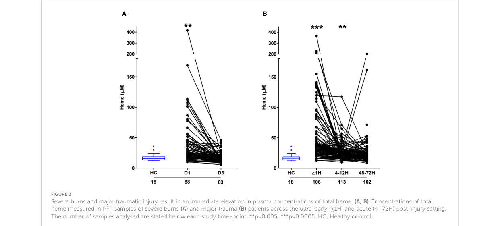

## Question

# Gene Research for Functional Annotation

## ⚠️ CRITICAL: Gene/Protein Identification Context

**BEFORE YOU BEGIN RESEARCH:** You MUST verify you are researching the CORRECT gene/protein. Gene symbols can be ambiguous, especially for less well-characterized genes from non-model organisms.

### Target Gene/Protein Identity (from UniProt):
- **UniProt Accession:** P02790
- **Protein Description:** RecName: Full=Hemopexin; AltName: Full=Beta-1B-glycoprotein; Flags: Precursor;
- **Gene Information:** Name=HPX;
- **Organism (full):** Homo sapiens (Human).
- **Protein Family:** Belongs to the hemopexin family. .
- **Key Domains:** Heme_transport/Cell_adhesion. (IPR051298); Hemopexin. (IPR016358); Hemopexin-like_dom. (IPR000585); Hemopexin-like_dom_sf. (IPR036375); Hemopexin-like_repeat. (IPR018487)

### MANDATORY VERIFICATION STEPS:

1. **Check if the gene symbol "HPX" matches the protein description above**
2. **Verify the organism is correct:** Homo sapiens (Human).
3. **Check if protein family/domains align with what you find in literature**
4. **If you find literature for a DIFFERENT gene with the same or similar symbol, STOP**

### If Gene Symbol is Ambiguous or You Cannot Find Relevant Literature:

**DO NOT PROCEED WITH RESEARCH ON A DIFFERENT GENE.** Instead:
- State clearly: "The gene symbol 'HPX' is ambiguous or literature is limited for this specific protein"
- Explain what you found (e.g., "Found extensive literature on a different gene with the same symbol in a different organism")
- Describe the protein based ONLY on the UniProt information provided above
- Suggest that the protein function can be inferred from domain/family information

### Research Target:

Please provide a comprehensive research report on the gene **HPX** (gene ID: HPX, UniProt: P02790) in human.

The research report should be a detailed narrative explaining the function, biological processes, and localization of the gene product. Citations should be given for all claims.

You should prioritize authoritative reviews and primary scientific literature when conducting research. You can supplement
this with annotations you find in gene/protein databases, but these can be outdated or inaccurate.

We are specifically interested in the primary function of the gene - for enzymes, what reaction is catalyzed, and what is the substrate specificity? For transporters, what is the substrate? For structural proteins or adapters, what is the broader structural role? For signaling molecules, what is the role in the pathway.

We are interested in where in or outside the cell the gene product carries out its function.

We are also interested in the signaling or biochemical pathways in which the gene functions. We are less interested in broad pleiotropic effects, except where these elucidate the precise role.

Include evidence where possible. We are interested in both experimental evidence as well as inference from structure, evolution, or bioinformatic analysis. Precise studies should be prioritized over high-throughput, where available.

## Output

Question: You are an expert researcher providing comprehensive, well-cited information.

Provide detailed information focusing on:
1. Key concepts and definitions with current understanding
2. Recent developments and latest research (prioritize 2023-2024 sources)
3. Current applications and real-world implementations
4. Expert opinions and analysis from authoritative sources
5. Relevant statistics and data from recent studies

Format as a comprehensive research report with proper citations. Include URLs and publication dates where available.
Always prioritize recent, authoritative sources and provide specific citations for all major claims.

# Gene Research for Functional Annotation

## ⚠️ CRITICAL: Gene/Protein Identification Context

**BEFORE YOU BEGIN RESEARCH:** You MUST verify you are researching the CORRECT gene/protein. Gene symbols can be ambiguous, especially for less well-characterized genes from non-model organisms.

### Target Gene/Protein Identity (from UniProt):
- **UniProt Accession:** P02790
- **Protein Description:** RecName: Full=Hemopexin; AltName: Full=Beta-1B-glycoprotein; Flags: Precursor;
- **Gene Information:** Name=HPX;
- **Organism (full):** Homo sapiens (Human).
- **Protein Family:** Belongs to the hemopexin family. .
- **Key Domains:** Heme_transport/Cell_adhesion. (IPR051298); Hemopexin. (IPR016358); Hemopexin-like_dom. (IPR000585); Hemopexin-like_dom_sf. (IPR036375); Hemopexin-like_repeat. (IPR018487)

### MANDATORY VERIFICATION STEPS:

1. **Check if the gene symbol "HPX" matches the protein description above**
2. **Verify the organism is correct:** Homo sapiens (Human).
3. **Check if protein family/domains align with what you find in literature**
4. **If you find literature for a DIFFERENT gene with the same or similar symbol, STOP**

### If Gene Symbol is Ambiguous or You Cannot Find Relevant Literature:

**DO NOT PROCEED WITH RESEARCH ON A DIFFERENT GENE.** Instead:
- State clearly: "The gene symbol 'HPX' is ambiguous or literature is limited for this specific protein"
- Explain what you found (e.g., "Found extensive literature on a different gene with the same symbol in a different organism")
- Describe the protein based ONLY on the UniProt information provided above
- Suggest that the protein function can be inferred from domain/family information

### Research Target:

Please provide a comprehensive research report on the gene **HPX** (gene ID: HPX, UniProt: P02790) in human.

The research report should be a detailed narrative explaining the function, biological processes, and localization of the gene product. Citations should be given for all claims.

You should prioritize authoritative reviews and primary scientific literature when conducting research. You can supplement
this with annotations you find in gene/protein databases, but these can be outdated or inaccurate.

We are specifically interested in the primary function of the gene - for enzymes, what reaction is catalyzed, and what is the substrate specificity? For transporters, what is the substrate? For structural proteins or adapters, what is the broader structural role? For signaling molecules, what is the role in the pathway.

We are interested in where in or outside the cell the gene product carries out its function.

We are also interested in the signaling or biochemical pathways in which the gene functions. We are less interested in broad pleiotropic effects, except where these elucidate the precise role.

Include evidence where possible. We are interested in both experimental evidence as well as inference from structure, evolution, or bioinformatic analysis. Precise studies should be prioritized over high-throughput, where available.

## Research report: Human **HPX (hemopexin)** functional annotation (UniProt P02790)

### Scope and target verification
The target gene/protein is **HPX** encoding **hemopexin**, UniProt **P02790**, in **Homo sapiens**. The literature retrieved here consistently describes HPX as an extracellular/plasma heme-binding glycoprotein that scavenges free heme and delivers it to cells (notably liver) via receptor-mediated pathways, matching the UniProt description and hemopexin-family role. (li2023doubleedgedfunctionsof pages 1-2, pierro2025trackinghemopexinintracellularly pages 23-25)

### 1) Key concepts and definitions (current understanding)

#### 1.1. What HPX is
Hemopexin is described as a **plasma glycoprotein (~60 kDa)** and the **highest-affinity heme-binding protein in plasma**, functioning as a systemic heme scavenger during hemolysis. (li2023doubleedgedfunctionsof pages 1-2)

#### 1.2. Primary molecular function: heme scavenging and transport
The core biochemical role of HPX is to **bind free heme** in extracellular fluids and limit heme-mediated oxidative/inflammatory toxicity. HPX is routinely framed as a “second-line” defense in hemolysis when upstream hemoglobin scavenging (e.g., haptoglobin-bound hemoglobin) is saturated/depleted, allowing heme to accumulate and transfer to HPX. (li2023doubleedgedfunctionsof pages 2-3, li2023doubleedgedfunctionsof pages 1-2)

**Stoichiometry and physiological abundance.** Reviews and mechanistic literature report circulating HPX levels on the order of **~0.4–1.5 mg/mL** (or ~0.5–1.5 mg/mL), and note heme binding behavior that is **1:1 at low heme** concentrations but can reach **≥2:1 (heme:HPX)** at higher heme loads. (li2023doubleedgedfunctionsof pages 1-2, pierro2025trackinghemopexinintracellularly pages 23-25)

#### 1.3. Localization: extracellular fluids with liver-centered clearance
HPX is fundamentally an **extracellular protein** present in **plasma** and also reported in **cerebrospinal fluid and lymph**. Its heme-scavenging role is linked to systemic delivery of heme to the liver, where heme is catabolized and iron handled. (pierro2025trackinghemopexinintracellularly pages 1-2)

#### 1.4. Receptors and uptake pathways (HPX → cell biology)
A canonical mechanism described in recent reviews is **CD91/LRP1-mediated endocytosis** of heme–HPX (often highlighted for hepatic uptake/clearance). (li2023doubleedgedfunctionsof pages 1-2, li2023doubleedgedfunctionsof pages 2-3)

More recent mechanistic cell-model work extends this view by showing HPX uptake/trafficking can involve additional receptors and pathways:
- **LRP1** is reported as a **high-affinity HPX-binding protein** with **Kd ≈ 4 nM**. (pierro2025trackinghemopexinintracellularly pages 2-3)
- In human immune/liver cell models, HPX trafficked with **transferrin and transferrin receptor 1 (TfR1)** in **Rab5-positive early endosomes**, consistent with clathrin-mediated endocytosis routes used by iron transport machinery; TfR2 co-localization suggests potential contribution to liver targeting. (pierro2025trackinghemopexinintracellularly pages 1-2, pierro2025trackinghemopexinintracellularly pages 6-8)
- Importantly, heme–HPX endocytosis was observed even in **LRP1−/−** cells, implying uptake routes beyond LRP1 alone. (pierro2025trackinghemopexinintracellularly pages 1-2)

#### 1.5. Downstream biochemical pathway: HO-1/HMOX1 induction and iron handling
Once internalized, heme delivered via HPX is connected to induction of a **cytoprotective program**, including induction of **heme oxygenase-1 (HMOX1/HO-1)**, ferritin induction, and other antioxidant responses. (pierro2025trackinghemopexinintracellularly pages 1-2, montecinos2019whatisnext pages 1-3)

Reviews also link heme–HPX delivery to transcriptional regulation of HO-1 via relief of **Bach1 repression** and to broader iron-handling systems (IRP/IRE and ferritin storage). (montecinos2019whatisnext pages 1-3)

### 2) Recent developments and latest research (prioritize 2023–2024)

#### 2.1. 2023 review synthesis: “double-edged” HPX roles and therapeutic strategies
A 2023 peer-reviewed review (“Double-edged functions of hemopexin in hematological related diseases”) compiles evidence that HPX is frequently depleted/insufficient in hemolysis-driven conditions (e.g., SCD, transfusion-induced hemolysis, sepsis), motivating **HPX supplementation** and related approaches, while also noting potential deleterious effects in some contexts. The review summarizes translational strategies including recombinant production, modification/enhancement, combined scavenger strategies, and gene-therapy concepts. (li2023doubleedgedfunctionsof pages 1-2, li2023doubleedgedfunctionsof pages 9-10)

The same review cites diverse disease associations of HPX levels (e.g., sepsis outcomes, malaria severity relationships, CNS hemorrhage contexts) and notes a **phase 1 clinical trial mention** in sickle cell anemia (**NCT04285827**, as cited within the review). (li2023doubleedgedfunctionsof pages 8-9)

#### 2.2. 2024 review: targeting excess heme (and by extension HPX depletion) in SCD-related priapism
A 2024 review on priapism in sickle cell disease emphasizes that intravascular hemolysis in SCD can **reduce haptoglobin and hemopexin levels**, contributing to accumulation of free hemoglobin/heme and downstream inflammatory signaling. The review frames **reducing excess free heme** as a therapeutic concept relevant to priapism pathophysiology. (silveira2024targetinghemein pages 2-3)

#### 2.3. 2024 primary human cohort: burns/trauma show heme elevation with scavenger depletion; prognostic associations
A 2024 Frontiers in Immunology primary study measured plasma heme and scavengers (including hemopexin) in large cohorts of injured patients:
- **98 burn patients** and **147 trauma patients** sampled at ultra-early and acute timepoints (≤1 hour and 4–72 hours post injury). (tullie2024severethermaland pages 1-2)
- The study reports that elevated plasma heme in burns/trauma coincided with **reduced hemopexin and albumin** (and other scavengers), consistent with a stressed heme-scavenging system. (tullie2024severethermaland pages 1-2, tullie2024severethermaland pages 15-16)

In burns, day-1 total heme was associated with both sepsis and mortality risk; notably, a **6.5 µM** higher day-1 heme corresponded to increased odds of sepsis and mortality in logistic models (details in Section 5). (tullie2024severethermaland pages 10-11)

Figure evidence for these dynamics (heme over time; scavenger protein trajectories including hemopexin) is available in the study’s panels (Figures 3 and 5). (tullie2024severethermaland media 71c61103)

#### 2.4. 2024 plasma proteomics + machine learning: HPX differentiates two descending thoracic aortic disease phenotypes
A 2024 Clinical Proteomics study compared plasma proteomes in **descending type B dissection (n=75)** versus **descending thoracic aortic aneurysm (DTAA; n=62)** and found that **HPX was the only protein** significantly different at stringent multiple-testing thresholds. (momenzadeh2024differentiationbetweendescending pages 1-2, momenzadeh2024differentiationbetweendescending pages 5-7)

The same study used machine learning and ranked HPX among top features (permutation importance) and reported held-out performance metrics (precision–recall AUC around 0.7). (momenzadeh2024differentiationbetweendescending pages 1-2, momenzadeh2024differentiationbetweendescending pages 5-7)

### 3) Current applications and real-world implementations

#### 3.1. HPX as a biomarker in hemolysis-driven states
Across hemolytic/inflammatory diseases, HPX is often discussed as a candidate **biomarker of heme-scavenging capacity** and disease stage/severity. In pediatric SCD biomarker profiling (Ghana; 2021–2022), HPX was included in a multiplex panel of “heme scavengers” (HO-1, HPX, haptoglobin) and correlated with hematologic parameters; the study also describes ROC/AUC analyses to support predictive algorithms, although numeric HPX values/AUCs were not extractable from the retrieved excerpt. (lekpor2024circulatingbiomarkersassociated pages 1-2)

In vascular disease proteomics (type B dissection vs DTAA), HPX emerged as the key differentiating protein after multiple-testing correction, demonstrating its practical appearance in real-world clinical proteomics pipelines for difficult-to-separate phenotypes. (momenzadeh2024differentiationbetweendescending pages 1-2, momenzadeh2024differentiationbetweendescending pages 7-9)

#### 3.2. HPX-centered therapeutic concepts (translation in progress)
Recent reviews emphasize **restoration of heme scavenging** as a therapeutic direction when endogenous HPX is depleted. Strategies discussed include **HPX supplementation**, combined Hb/heme scavenger approaches (Hp+HPX), recombinant HPX production, fusion proteins, and viral gene delivery concepts (e.g., AAV-mediated sustained expression) as preclinical-to-translational approaches. (li2023doubleedgedfunctionsof pages 9-10, li2023doubleedgedfunctionsof pages 1-2)

### 4) Expert opinions and analysis (authoritative synthesis)

#### 4.1. HPX as a “cytoprotective” heme-delivery system rather than passive binder
Mechanistic literature frames HPX not only as a heme sink but as a **ligand delivery system** that initiates regulated cellular responses. Heme–HPX endocytosis is linked to HO-1 induction and coordinated iron handling (ferritin induction, transferrin receptor downregulation), implying HPX participates in heme-responsive homeostatic programming rather than simple neutralization. (pierro2025trackinghemopexinintracellularly pages 1-2, montecinos2019whatisnext pages 1-3)

#### 4.2. Receptor complexity and cell-type specificity is an active area
While CD91/LRP1 is often presented as the canonical uptake route, newer cell work suggests **multiple receptors and endocytic routes** (TfR1/TfR2 involvement; uptake in LRP1−/− cells), which has implications for tissue targeting, drug design (engineered HPX), and interpretation of HPX behavior in immune versus hepatic settings. (pierro2025trackinghemopexinintracellularly pages 1-2, pierro2025trackinghemopexinintracellularly pages 6-8)

#### 4.3. “Double-edged” interpretation in disease: protective vs context-dependent harms
The 2023 review explicitly cautions that HPX may be protective in many heme-overload contexts yet could have deleterious associations/impacts in certain settings, arguing for context-specific evaluation (e.g., timing, compartment, concurrent hemoglobin/heme loads, organ vulnerability). This is consistent with the broader theme that heme biology and scavenger systems can both buffer toxicity and modulate immune/vascular pathways. (li2023doubleedgedfunctionsof pages 9-10)

### 5) Relevant statistics and data from recent studies (with context)

#### 5.1. Human burns cohort: heme predicts sepsis and mortality; scavenger depletion shown in figures
In the 2024 burns/trauma cohort study:
- Burns cohort: **n=98** enrolled; sepsis assessed in **n=79**, with **42/79 (53%)** developing sepsis. (tullie2024severethermaland pages 10-11)
- A **6.5 µM** higher day-1 total heme was associated with:
  - Sepsis (unadjusted): **OR 1.24** (95% CI **1.05–1.46**), p=**0.013**; adjusted (age, gender, %TBSA): **OR 1.12** (0.95–1.33), p=0.172. (tullie2024severethermaland pages 10-11)
  - Mortality (unadjusted): **OR 1.63** (1.12–2.37), p=**0.004**; adjusted: **OR 1.52** (1.02–2.28), p=**0.021**. (tullie2024severethermaland pages 10-11)
- Discrimination of survivors vs non-survivors using day-1 heme: **AUROC 0.768** (95% CI **0.615–0.922**) vs rBAUX AUROC **0.718**. (tullie2024severethermaland pages 10-11)

Although numeric plasma hemopexin concentrations were not present in the extracted text snippets, the paper reports hemopexin trajectories and depletion after injury, and the relevant visual evidence is in panels showing hemopexin over time (Figure 5). (tullie2024severethermaland media 71c61103)

#### 5.2. Human descending thoracic aortic disease proteomics: HPX differential expression and ML metrics
In the 2024 Clinical Proteomics study:
- Sample sizes: **75** descending type B dissection vs **62** DTAA (total **137**). (momenzadeh2024differentiationbetweendescending pages 1-2, momenzadeh2024differentiationbetweendescending pages 5-7)
- HPX was the only significantly different protein after correction, with **Log2FC = −0.25** and **B-H adjusted p = 0.0081** (Table 2). (momenzadeh2024differentiationbetweendescending pages 7-9)
- ML performance reported includes a held-out test-set **precision–recall AUC ≈ 0.7**; additional metrics in extracted text include accuracy **0.74** and F1-score **0.67** for the optimized SVC model. (momenzadeh2024differentiationbetweendescending pages 1-2, momenzadeh2024differentiationbetweendescending pages 5-7)

#### 5.3. Quantitative receptor affinity and physiological concentration ranges
Mechanistic literature reports **LRP1 binding Kd ≈ 4 nM** for HPX, supporting high-affinity receptor-mediated uptake. (pierro2025trackinghemopexinintracellularly pages 2-3)

Reported plasma concentrations of HPX are ~**0.4–1.5 mg/mL** (≈**15.3 µM** average in one synthesis), providing a scale for heme-buffering capacity. (pierro2025trackinghemopexinintracellularly pages 23-25)

### Evidence summary table
The following table consolidates HPX functional annotation, pathway placement, and key recent quantitative findings.

| Category | Key points | Quantitative data (if any) | Key sources (with citation IDs) |
|---|---|---|---|
| Protein type / localization | Human **HPX** (UniProt **P02790**) corresponds to **hemopexin**, a **secreted/plasma glycoprotein** and major extracellular heme scavenger. It is primarily produced by liver and is also reported in nervous tissue, skeletal muscle, retina, and kidney; HPX is present in plasma and also detected in CSF and lymph. | ~**60 kDa**; plasma concentration reported **0.4–1.5 mg/mL** or **0.5–1.5 mg/mL**; ≈**15.3 µM** average in one recent study/review synthesis. | (li2023doubleedgedfunctionsof pages 1-2, pierro2025trackinghemopexinintracellularly pages 23-25) |
| Primary ligand / substrate | Primary ligand is **free heme** (including heme released during hemolysis and heme transferred from other plasma carriers). HPX is described as the **highest-affinity heme-binding protein in plasma** and a second-line defense after haptoglobin depletion. | Heme–HPX forms a **1:1 complex**; each mL plasma can bind **6.3 mg heme** according to a 2023 review summary. | (pierro2025trackinghemopexinintracellularly pages 2-3, li2023doubleedgedfunctionsof pages 1-2, li2023doubleedgedfunctionsof pages 2-3, li2023doubleedgedfunctionsof pages 8-9) |
| Binding stoichiometry / concentration ranges | HPX binds heme tightly at physiologic pH and releases it in acidic endosomal compartments. At low heme, binding is 1:1; at higher heme loads, reports indicate **≥2:1 (heme:HPX)** binding behavior. | Stoichiometry: **1:1** at low heme; **≥2:1** at higher heme. Plasma HPX: **0.4–1.5 mg/mL** / **0.5–1.5 mg/mL**; one review cites average plasma HPX **770 mg/mL** but this value is likely inconsistent with the broader literature and should be treated cautiously. | (li2023doubleedgedfunctionsof pages 1-2, pierro2025trackinghemopexinintracellularly pages 23-25, li2023doubleedgedfunctionsof pages 8-9) |
| Receptors / uptake pathways | Canonical pathway is **CD91/LRP1-mediated** uptake of heme–HPX in liver/macrophages. Recent cell work indicates uptake is not exclusively LRP1-dependent: HPX traffics with **transferrin receptor 1 (TfR1)** in **Rab5-positive early endosomes**, and **TfR2** may contribute to hepatic targeting; uptake also occurs in **LRP1−/−** cells, implying alternative receptors. | **LRP1 Kd ≈ 4 nM** for HPX binding; LRP1 described as a high-affinity HPX-binding protein. | (pierro2025trackinghemopexinintracellularly pages 2-3, pierro2025trackinghemopexinintracellularly pages 1-2, li2023doubleedgedfunctionsof pages 2-3, pierro2025trackinghemopexinintracellularly pages 6-8) |
| Downstream intracellular fate / pathway | After endocytosis, heme is delivered intracellularly and induces a **cytoprotective program**: **HMOX1/HO-1 induction**, ferritin induction, transferrin receptor downregulation, metallothionein induction, and coupling to iron storage/export pathways. Heme degradation yields bilirubin, CO, and iron; iron is stored in ferritin or exported via ferroportin. Apo-HPX may recycle in some settings. | Free heme uptake can occur at ~**5-fold higher molar rate** than heme–HPX uptake; intracellular heme levels of **3 µM** (~**1 million heme molecules** in mitochondrial volume) were reported in hepatocyte-focused review literature. | (pierro2025trackinghemopexinintracellularly pages 1-2, montecinos2019whatisnext pages 1-3, li2023doubleedgedfunctionsof pages 2-3) |
| Key disease contexts: SCD / hemolysis | HPX is depleted in hemolytic states including **sickle cell disease (SCD)**, where low HPX is linked to heme overload, vaso-occlusion, AKI risk, and priapism-related pathophysiology. Reviews note lower HPX in SCD vaso-occlusive crisis versus steady state and increases with hydroxycarbamide/hydroxyurea as hemolysis declines. | No exact cohort HPX concentration from the gathered 2024 SCD biomarker study excerpt; pediatric SCD study included **377 children** aged **3–8 years**. | (li2023doubleedgedfunctionsof pages 8-9, silveira2024targetinghemein pages 2-3, li2023doubleedgedfunctionsof pages 2-3, lekpor2024circulatingbiomarkersassociated pages 1-2) |
| Key disease contexts: sepsis / trauma / burn | In inflammatory/hemolytic injury states, HPX is often insufficient relative to heme burden. Major trauma and burns show elevated plasma heme with reduced hemopexin and albumin, supporting failure of the scavenging system and motivating HPX restoration concepts. | Trauma cohort: **147** patients (mean age **42**, mean ISS **25**). Burn cohort: **98** patients (mean age **47**, mean TBSA **35%**). Heme correlated with burn severity: %TBSA **r=0.456**, % full-thickness TBSA **r=0.466**, Baux **r=0.350**, revised Baux **r=0.390**; trauma heme vs time **r=-0.452**. | (tullie2024severethermaland pages 1-2, tullie2024severethermaland pages 15-16, tullie2024severethermaland pages 6-7) |
| Key disease contexts: CNS hemorrhage | HPX is implicated in CNS blood-breakdown product handling. Review evidence indicates **CSF HPX** can associate with outcomes after intracranial hemorrhage, though direction differs by condition: better outcomes in some **ICH** contexts but worse in **SAH** in others. HPX is also discussed as protective in intracerebral hemorrhage models. | No consistent single quantitative effect size for HPX across CNS hemorrhage contexts in the gathered evidence. | (montecinos2019whatisnext pages 1-3, li2023doubleedgedfunctionsof pages 8-9) |
| Therapeutic / clinical translation | Translational strategies include **HPX supplementation** during endogenous depletion, **combined Hp+HPX** approaches, recombinant **rhHPX** production, **hemopexin–haptoglobin fusion proteins**, and **AAV-based HPX gene therapy** concepts. A **phase 1** study in sickle cell anemia is mentioned in review literature. | Clinical trial mention: **NCT04285827** (phase 1 HPX in sickle cell anemia, as cited in the 2023 review). AAV-mediated expression reported for **58 days** with survival after experimental heme challenge in preclinical work summarized by the review. | (li2023doubleedgedfunctionsof pages 8-9, li2023doubleedgedfunctionsof pages 9-10, li2023doubleedgedfunctionsof pages 1-2) |
| Quantitative findings from 2024 trauma/burn study | Burn/trauma study provides the clearest recent human quantitative evidence linking excess heme and depleted scavenging proteins. Hemopexin was significantly reduced on day 1/day 3 post-injury, though exact HPX concentrations were not reported in the extracted evidence. | Burns: day 3 heme **17.03 ± 0.92 µM** vs healthy controls **17.59 ± 1.47 µM** (ns). In burns, **6.5 µM** higher day-1 heme associated with sepsis odds **OR 1.24** (95% CI **1.05–1.46**, p=**0.013**), adjusted **OR 1.12** (0.95–1.33, p=**0.172**); mortality odds **OR 1.63** (1.12–2.37, p=**0.004**), adjusted **OR 1.52** (1.02–2.28, p=**0.021**). AUROC for mortality using day-1 heme: **0.768** (95% CI **0.615–0.922**) vs rBAUX **0.718**. Sepsis assessed in **79** burn patients; **42** developed sepsis (**53%**). | (tullie2024severethermaland pages 1-2, tullie2024severethermaland pages 15-16, tullie2024severethermaland pages 10-11, tullie2024severethermaland pages 6-7, tullie2024severethermaland media 71c61103) |

*Table: This table summarizes the functional annotation of human HPX/hemopexin, emphasizing ligand binding, uptake pathways, intracellular fate, disease relevance, and recent translational findings. It is designed as a compact evidence map for narrative reporting and citation-supported interpretation.*

### Notes on evidence limitations (important for interpretation)
- Some 2024 studies (e.g., pediatric SCD biomarker profiling) are retrieved here only as partial excerpts; the available text indicates HPX was measured and analyzed (including ROC/AUC discussions), but **numerical HPX group means/AUCs** were not extractable from the retrieved sections. (lekpor2024circulatingbiomarkersassociated pages 1-2)
- The 2024 burns/trauma study provides strong quantitative evidence for heme burden and shows hemopexin depletion in figures; however, the extracted text snippets did not include the **absolute hemopexin concentrations**, emphasizing the need to consult full tables/supplements for precise HPX numeric values. (tullie2024severethermaland pages 1-2, tullie2024severethermaland media 71c61103)

### Key references (with URLs and publication dates)
- Li Y et al. **“Double-edged functions of hemopexin in hematological related diseases: from basic mechanisms to clinical application.”** *Frontiers in Immunology* (Nov **2023**). https://doi.org/10.3389/fimmu.2023.1274333 (li2023doubleedgedfunctionsof pages 1-2, li2023doubleedgedfunctionsof pages 9-10)
- Silveira THR et al. **“Targeting heme in sickle cell disease: new perspectives on priapism treatment.”** *Frontiers in Physiology* (Jul **2024**). https://doi.org/10.3389/fphys.2024.1435220 (silveira2024targetinghemein pages 2-3)
- Tullie S et al. **“Severe thermal and major traumatic injury results in elevated plasma concentrations of total heme …”** *Frontiers in Immunology* (Jun **2024**). https://doi.org/10.3389/fimmu.2024.1416820 (tullie2024severethermaland pages 1-2, tullie2024severethermaland pages 10-11, tullie2024severethermaland media 71c61103)
- Momenzadeh A et al. **“Differentiation between descending thoracic aortic diseases using machine learning and plasma proteomic signatures.”** *Clinical Proteomics* (Jun **2024**). https://doi.org/10.1186/s12014-024-09487-4 (momenzadeh2024differentiationbetweendescending pages 1-2, momenzadeh2024differentiationbetweendescending pages 7-9)
- Lekpor CE et al. **“Circulating biomarkers associated with pediatric sickle cell disease.”** *Frontiers in Molecular Biosciences* (Dec **2024**). https://doi.org/10.3389/fmolb.2024.1481441 (lekpor2024circulatingbiomarkersassociated pages 1-2)

References

1. (li2023doubleedgedfunctionsof pages 1-2): Yijin Li, Renyu Chen, Chaofan Wang, Jun Deng, and Shanshan Luo. Double-edged functions of hemopexin in hematological related diseases: from basic mechanisms to clinical application. Frontiers in Immunology, Nov 2023. URL: https://doi.org/10.3389/fimmu.2023.1274333, doi:10.3389/fimmu.2023.1274333. This article has 11 citations and is from a peer-reviewed journal.

2. (pierro2025trackinghemopexinintracellularly pages 23-25): E. Pierro, T. L. Duarte, Hans Bäumler, B. Rose, D. Moore, J. Eskew, R. Vanacore, S. Hartson, Dennis W. Province, D. Skaff, and Ann Smith. Tracking hemopexin intracellularly and defining hemopexin protein “interactomes” in human immune and liver cell models. Frontiers in Physiology, Nov 2025. URL: https://doi.org/10.3389/fphys.2025.1613917, doi:10.3389/fphys.2025.1613917. This article has 0 citations.

3. (li2023doubleedgedfunctionsof pages 2-3): Yijin Li, Renyu Chen, Chaofan Wang, Jun Deng, and Shanshan Luo. Double-edged functions of hemopexin in hematological related diseases: from basic mechanisms to clinical application. Frontiers in Immunology, Nov 2023. URL: https://doi.org/10.3389/fimmu.2023.1274333, doi:10.3389/fimmu.2023.1274333. This article has 11 citations and is from a peer-reviewed journal.

4. (pierro2025trackinghemopexinintracellularly pages 1-2): E. Pierro, T. L. Duarte, Hans Bäumler, B. Rose, D. Moore, J. Eskew, R. Vanacore, S. Hartson, Dennis W. Province, D. Skaff, and Ann Smith. Tracking hemopexin intracellularly and defining hemopexin protein “interactomes” in human immune and liver cell models. Frontiers in Physiology, Nov 2025. URL: https://doi.org/10.3389/fphys.2025.1613917, doi:10.3389/fphys.2025.1613917. This article has 0 citations.

5. (pierro2025trackinghemopexinintracellularly pages 2-3): E. Pierro, T. L. Duarte, Hans Bäumler, B. Rose, D. Moore, J. Eskew, R. Vanacore, S. Hartson, Dennis W. Province, D. Skaff, and Ann Smith. Tracking hemopexin intracellularly and defining hemopexin protein “interactomes” in human immune and liver cell models. Frontiers in Physiology, Nov 2025. URL: https://doi.org/10.3389/fphys.2025.1613917, doi:10.3389/fphys.2025.1613917. This article has 0 citations.

6. (pierro2025trackinghemopexinintracellularly pages 6-8): E. Pierro, T. L. Duarte, Hans Bäumler, B. Rose, D. Moore, J. Eskew, R. Vanacore, S. Hartson, Dennis W. Province, D. Skaff, and Ann Smith. Tracking hemopexin intracellularly and defining hemopexin protein “interactomes” in human immune and liver cell models. Frontiers in Physiology, Nov 2025. URL: https://doi.org/10.3389/fphys.2025.1613917, doi:10.3389/fphys.2025.1613917. This article has 0 citations.

7. (montecinos2019whatisnext pages 1-3): Luis Montecinos, Jeffrey D. Eskew, and Ann Smith. What is next in this “age” of heme-driven pathology and protection by hemopexin? an update and links with iron †. Pharmaceuticals, 12:144, Sep 2019. URL: https://doi.org/10.3390/ph12040144, doi:10.3390/ph12040144. This article has 33 citations.

8. (li2023doubleedgedfunctionsof pages 9-10): Yijin Li, Renyu Chen, Chaofan Wang, Jun Deng, and Shanshan Luo. Double-edged functions of hemopexin in hematological related diseases: from basic mechanisms to clinical application. Frontiers in Immunology, Nov 2023. URL: https://doi.org/10.3389/fimmu.2023.1274333, doi:10.3389/fimmu.2023.1274333. This article has 11 citations and is from a peer-reviewed journal.

9. (li2023doubleedgedfunctionsof pages 8-9): Yijin Li, Renyu Chen, Chaofan Wang, Jun Deng, and Shanshan Luo. Double-edged functions of hemopexin in hematological related diseases: from basic mechanisms to clinical application. Frontiers in Immunology, Nov 2023. URL: https://doi.org/10.3389/fimmu.2023.1274333, doi:10.3389/fimmu.2023.1274333. This article has 11 citations and is from a peer-reviewed journal.

10. (silveira2024targetinghemein pages 2-3): Tammyris Helena Rebecchi Silveira, Fabiano Beraldi Calmasini, Mariana Gonçalves de Oliveira, Fernando Ferreira Costa, and Fábio Henrique Silva. Targeting heme in sickle cell disease: new perspectives on priapism treatment. Frontiers in Physiology, Jul 2024. URL: https://doi.org/10.3389/fphys.2024.1435220, doi:10.3389/fphys.2024.1435220. This article has 9 citations.

11. (tullie2024severethermaland pages 1-2): Sebastian Tullie, Thomas Nicholson, Jonathan R. B. Bishop, Kirsty C. McGee, Ali Asiri, Jack Sullivan, Yung-Yi Chen, Amanda V. Sardeli, Antonio Belli, Paul Harrison, Naiem S. Moiemen, Janet M. Lord, and Jon Hazeldine. Severe thermal and major traumatic injury results in elevated plasma concentrations of total heme that are associated with poor clinical outcomes and systemic immune suppression. Frontiers in Immunology, Jun 2024. URL: https://doi.org/10.3389/fimmu.2024.1416820, doi:10.3389/fimmu.2024.1416820. This article has 15 citations and is from a peer-reviewed journal.

12. (tullie2024severethermaland pages 15-16): Sebastian Tullie, Thomas Nicholson, Jonathan R. B. Bishop, Kirsty C. McGee, Ali Asiri, Jack Sullivan, Yung-Yi Chen, Amanda V. Sardeli, Antonio Belli, Paul Harrison, Naiem S. Moiemen, Janet M. Lord, and Jon Hazeldine. Severe thermal and major traumatic injury results in elevated plasma concentrations of total heme that are associated with poor clinical outcomes and systemic immune suppression. Frontiers in Immunology, Jun 2024. URL: https://doi.org/10.3389/fimmu.2024.1416820, doi:10.3389/fimmu.2024.1416820. This article has 15 citations and is from a peer-reviewed journal.

13. (tullie2024severethermaland pages 10-11): Sebastian Tullie, Thomas Nicholson, Jonathan R. B. Bishop, Kirsty C. McGee, Ali Asiri, Jack Sullivan, Yung-Yi Chen, Amanda V. Sardeli, Antonio Belli, Paul Harrison, Naiem S. Moiemen, Janet M. Lord, and Jon Hazeldine. Severe thermal and major traumatic injury results in elevated plasma concentrations of total heme that are associated with poor clinical outcomes and systemic immune suppression. Frontiers in Immunology, Jun 2024. URL: https://doi.org/10.3389/fimmu.2024.1416820, doi:10.3389/fimmu.2024.1416820. This article has 15 citations and is from a peer-reviewed journal.

14. (tullie2024severethermaland media 71c61103): Sebastian Tullie, Thomas Nicholson, Jonathan R. B. Bishop, Kirsty C. McGee, Ali Asiri, Jack Sullivan, Yung-Yi Chen, Amanda V. Sardeli, Antonio Belli, Paul Harrison, Naiem S. Moiemen, Janet M. Lord, and Jon Hazeldine. Severe thermal and major traumatic injury results in elevated plasma concentrations of total heme that are associated with poor clinical outcomes and systemic immune suppression. Frontiers in Immunology, Jun 2024. URL: https://doi.org/10.3389/fimmu.2024.1416820, doi:10.3389/fimmu.2024.1416820. This article has 15 citations and is from a peer-reviewed journal.

15. (momenzadeh2024differentiationbetweendescending pages 1-2): Amanda Momenzadeh, Simion Kreimer, Dongchuan Guo, Matthew Ayres, Daniel Berman, Kuang-Yuh Chyu, Prediman K. Shah, Dianna Milewicz, Ali Azizzadeh, Jesse G. Meyer, and Sarah Parker. Differentiation between descending thoracic aortic diseases using machine learning and plasma proteomic signatures. Clinical Proteomics, Jun 2024. URL: https://doi.org/10.1186/s12014-024-09487-4, doi:10.1186/s12014-024-09487-4. This article has 2 citations and is from a peer-reviewed journal.

16. (momenzadeh2024differentiationbetweendescending pages 5-7): Amanda Momenzadeh, Simion Kreimer, Dongchuan Guo, Matthew Ayres, Daniel Berman, Kuang-Yuh Chyu, Prediman K. Shah, Dianna Milewicz, Ali Azizzadeh, Jesse G. Meyer, and Sarah Parker. Differentiation between descending thoracic aortic diseases using machine learning and plasma proteomic signatures. Clinical Proteomics, Jun 2024. URL: https://doi.org/10.1186/s12014-024-09487-4, doi:10.1186/s12014-024-09487-4. This article has 2 citations and is from a peer-reviewed journal.

17. (lekpor2024circulatingbiomarkersassociated pages 1-2): Cecilia Elorm Lekpor, Felix Abekah Botchway, Adel Driss, Alaijah Bashi, Afua D. Abrahams, Kwadwo Asamoah Kusi, Godfred Futagbi, Ernest Alema-Mensah, William Agbozo, Wesley Solomon, Adriana Harbuzariu, Andrew A. Adjei, and Jonathan K. Stiles. Circulating biomarkers associated with pediatric sickle cell disease. Frontiers in Molecular Biosciences, Dec 2024. URL: https://doi.org/10.3389/fmolb.2024.1481441, doi:10.3389/fmolb.2024.1481441. This article has 5 citations.

18. (momenzadeh2024differentiationbetweendescending pages 7-9): Amanda Momenzadeh, Simion Kreimer, Dongchuan Guo, Matthew Ayres, Daniel Berman, Kuang-Yuh Chyu, Prediman K. Shah, Dianna Milewicz, Ali Azizzadeh, Jesse G. Meyer, and Sarah Parker. Differentiation between descending thoracic aortic diseases using machine learning and plasma proteomic signatures. Clinical Proteomics, Jun 2024. URL: https://doi.org/10.1186/s12014-024-09487-4, doi:10.1186/s12014-024-09487-4. This article has 2 citations and is from a peer-reviewed journal.

19. (tullie2024severethermaland pages 6-7): Sebastian Tullie, Thomas Nicholson, Jonathan R. B. Bishop, Kirsty C. McGee, Ali Asiri, Jack Sullivan, Yung-Yi Chen, Amanda V. Sardeli, Antonio Belli, Paul Harrison, Naiem S. Moiemen, Janet M. Lord, and Jon Hazeldine. Severe thermal and major traumatic injury results in elevated plasma concentrations of total heme that are associated with poor clinical outcomes and systemic immune suppression. Frontiers in Immunology, Jun 2024. URL: https://doi.org/10.3389/fimmu.2024.1416820, doi:10.3389/fimmu.2024.1416820. This article has 15 citations and is from a peer-reviewed journal.

## Artifacts

- [Edison artifact artifact-00](HPX-deep-research-falcon_artifacts/artifact-00.md)

## Citations

1. li2023doubleedgedfunctionsof pages 1-2
2. pierro2025trackinghemopexinintracellularly pages 1-2
3. pierro2025trackinghemopexinintracellularly pages 2-3
4. montecinos2019whatisnext pages 1-3
5. li2023doubleedgedfunctionsof pages 8-9
6. silveira2024targetinghemein pages 2-3
7. tullie2024severethermaland pages 1-2
8. tullie2024severethermaland pages 10-11
9. lekpor2024circulatingbiomarkersassociated pages 1-2
10. li2023doubleedgedfunctionsof pages 9-10
11. momenzadeh2024differentiationbetweendescending pages 7-9
12. pierro2025trackinghemopexinintracellularly pages 23-25
13. li2023doubleedgedfunctionsof pages 2-3
14. pierro2025trackinghemopexinintracellularly pages 6-8
15. tullie2024severethermaland pages 15-16
16. momenzadeh2024differentiationbetweendescending pages 1-2
17. momenzadeh2024differentiationbetweendescending pages 5-7
18. tullie2024severethermaland pages 6-7
19. https://doi.org/10.3389/fimmu.2023.1274333
20. https://doi.org/10.3389/fphys.2024.1435220
21. https://doi.org/10.3389/fimmu.2024.1416820
22. https://doi.org/10.1186/s12014-024-09487-4
23. https://doi.org/10.3389/fmolb.2024.1481441
24. https://doi.org/10.3389/fimmu.2023.1274333,
25. https://doi.org/10.3389/fphys.2025.1613917,
26. https://doi.org/10.3390/ph12040144,
27. https://doi.org/10.3389/fphys.2024.1435220,
28. https://doi.org/10.3389/fimmu.2024.1416820,
29. https://doi.org/10.1186/s12014-024-09487-4,
30. https://doi.org/10.3389/fmolb.2024.1481441,