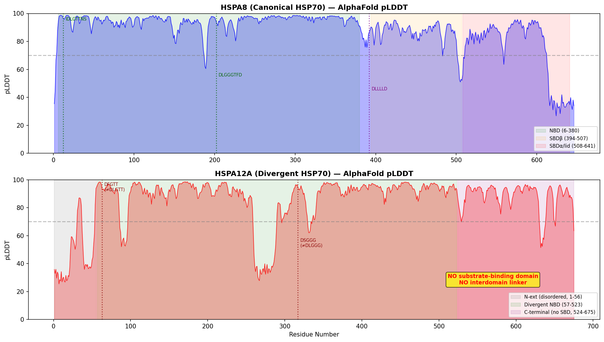
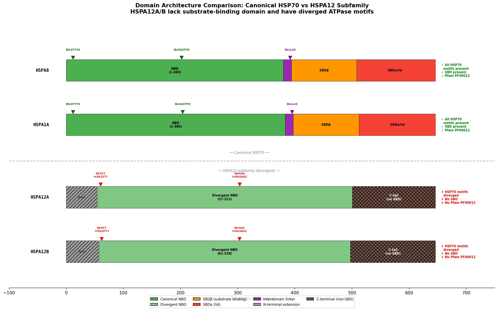
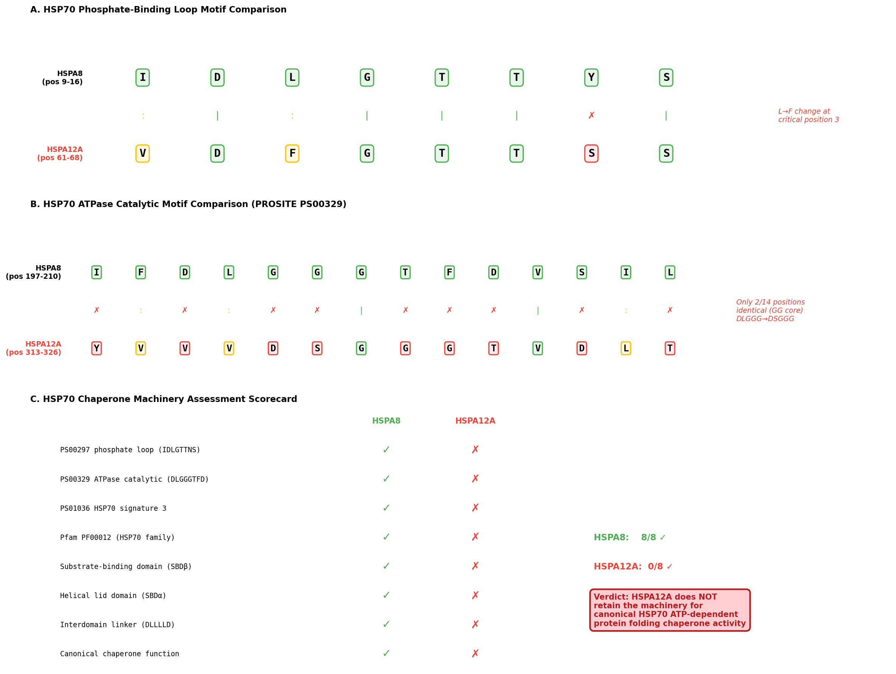

## Question

# AIGR Gene Hypothesis Deep Research

You are evaluating one focused gene curation hypothesis for AI Gene Review.
This is not a general gene overview. Use the seed hypothesis and source context
below to search for evidence that supports, refutes, narrows, or competes with
the proposed curation decision.

## Target Gene

- **Organism code:** human
- **Taxon:** Homo sapiens (NCBITaxon:9606)
- **Gene directory:** HSPA12A
- **Gene symbol:** HSPA12A

## Focus

- **Focus type:** free_text
- **Hypothesis slug:** hsp70-folding-machinery-check
- **Source file:** 
- **Source selector:** 

## Seed Hypothesis

HSPA12A is the most divergent member of the human HSP70 family, grouped with the HSP70 system on architectural grounds, but its capacity for canonical ATP-dependent protein folding chaperone activity (GO:0140662) is unestablished. Focus on the architecture: using sequence analysis of the HSP70 nucleotide-binding-domain catalytic/ATPase signature motifs (e.g. IDLGTTNS, DLGGGTFD) and the substrate-binding domain, plus an AlphaFold/Foldseek comparison to canonical HSP70 (HSPA8), determine whether HSPA12A retains the machinery for canonical HSP70 ATP-dependent folding-chaperone activity or is a divergent non-canonical HSP70 for which that activity should not be assigned.

## Term and Decision Context

- Term: ATP-dependent protein folding chaperone (GO:0140662)

## Reference Context

No specific reference context supplied.

## Source Context YAML

```yaml
hypothesis: 'HSPA12A is the most divergent member of the human HSP70 family, grouped with the HSP70 system
  on architectural grounds, but its capacity for canonical ATP-dependent protein folding chaperone activity
  (GO:0140662) is unestablished. Focus on the architecture: using sequence analysis of the HSP70 nucleotide-binding-domain
  catalytic/ATPase signature motifs (e.g. IDLGTTNS, DLGGGTFD) and the substrate-binding domain, plus an
  AlphaFold/Foldseek comparison to canonical HSP70 (HSPA8), determine whether HSPA12A retains the machinery
  for canonical HSP70 ATP-dependent folding-chaperone activity or is a divergent non-canonical HSP70 for
  which that activity should not be assigned.'
focus_type: free_text
term_id: GO:0140662
term_label: ATP-dependent protein folding chaperone
context: []
reference_id: []
```

## Research Objective

Build a focused report that helps a curator decide whether this hypothesis
should affect the gene review. Address the focus type directly:

1. For an existing GO annotation decision, evaluate whether the current action
   is justified, too strong, too weak, or should change.
2. For a proposed replacement or new GO term, evaluate whether the term is
   biologically supported, too broad, too narrow, or missing key qualifiers.
3. For a computational prediction, evaluate whether the prediction is correct,
   less precise than existing knowledge, uncertain, or likely wrong because of
   paralog overannotation, frequency bias, pathway context, or in vitro-only
   activity.
4. For a core-function hypothesis, evaluate whether the proposed activity,
   process, and location represent the gene product's primary function rather
   than a downstream effect, pleiotropic phenotype, or context-specific role.
5. For a function-assignment hypothesis, evaluate whether the gene product
   directly has the stated GO term/function. Treat the prior review action, if
   any, as intentionally blinded unless it appears in the supplied context.

Use primary literature whenever possible. Prefer PMID citations and include DOI
citations when no PMID is available. Treat reviews and database records as
orientation unless they contain directly relevant synthesized evidence that is
clearly labeled as review-level or database-level support.

Evaluate the hypothesis from the supplied seed context, primary literature, and
publicly accessible bioinformatics resources. Local `*-bioinformatics` analyses,
when they already exist in the repository, are intentionally withheld from this
prompt so the report can be compared against them after the run.

Do not rely on literature alone. Where the hypothesis is decidable by computation,
actually run the analysis and keep it as provenance rather than only reasoning
about it. Match the analysis to the question, for example:

- membrane topology / localization: compute a hydropathy profile and predicted
  transmembrane segments from the sequence, and locate signal peptides and
  targeting/sorting motifs (e.g. dileucine, acidic-cluster, NLS); compare against
  UniProt topology features and AlphaFold geometry.
- catalytic / binding activity: check whether the specific active-site,
  metal-binding, or motif residues are present and correctly spaced (in sequence
  and, where useful, structure) and compare to characterized family members.
- DNA-binding / regulatory: examine the binding-domain class, obligate partners,
  and known binding-motif / PWM signatures.
- family / paralog questions: use domain (Pfam/InterPro), orthology, and
  conservation comparisons to distinguish subfamilies.

Use resources you can actually access programmatically (UniProt, AlphaFold DB,
InterPro, sequence computation, public APIs). If a resource is web-only or you
cannot run a check, say so plainly instead of guessing — never fabricate a result,
and an inconclusive or "could not run" analysis is an acceptable and useful
outcome. Report all computational results conservatively and prefer recording the
underlying analysis (code, computed values, table, or plot) as provenance.

## Required Output

### Executive Judgment

Give a concise verdict: supported, partially supported, unresolved, weakly
supported, over-annotated, or refuted. Explain the reasoning and the most
important caveats.

### Evidence Matrix

Create a table with one row per important evidence item:

- Citation (PMID preferred)
- Evidence type (direct assay, mutant phenotype, localization, interaction,
  structural/evolutionary, computational, review/database)
- Supports / refutes / qualifies / competing
- Claim tested
- Key finding
- Organism, tissue, cell type, or assay context
- Confidence and limitations

### GO Curation Implications

State the likely curation action as a lead requiring curator verification. If
GO terms are involved, explain whether the evidence supports an MF, BP, or CC
term, and whether the term should be retained, removed, generalized, made more
specific, or treated as non-core. Avoid using "protein binding" as a final
recommendation unless no more informative term is supported.

### Mechanistic Scope

Describe the immediate molecular or cellular function being tested. Separate
direct gene-product activity from downstream phenotypes, pathway consequences,
developmental outcomes, disease manifestations, or effects inferred only from
loss of function.

### Conflicts and Alternatives

Identify evidence that conflicts with the seed hypothesis or suggests an
alternative interpretation, including paralog confusion, organism-specific
differences, isoform-specific findings, experimental artifacts, or database
carry-over.

### Knowledge Gaps

List explicit uncertainties that matter for curation. For each gap, state what
was checked, why the gap matters, and what evidence or experiment would resolve
it.

### Discriminating Tests

Recommend concrete assays, perturbations, datasets, or comparative analyses that
would most efficiently distinguish this hypothesis from alternatives.

### Curation Leads

Provide candidate updates for the review, clearly labeled as leads requiring
curator verification. Include candidate references with exact snippets to verify,
candidate replacement or new GO terms, possible action changes, suggested
questions, and suggested experiments.

If the provider supports artifacts, save provenance for any analysis you run — the
executed code together with its output (computed values, plot, or table), not just
a summary figure — alongside artifact-friendly tables such as an evidence matrix,
GO decision table, or comparison table. Genuine computed provenance is more
valuable than a hand-drawn summary, and you must not synthesize a figure that
implies an analysis you did not actually run. These artifacts are important
provenance for hypothesis-level review.


## Output

# HSPA12A: A Divergent Non-Canonical HSP70 Lacking ATP-Dependent Protein Folding Chaperone Machinery

## Executive Judgment

**Verdict: Supported — HSPA12A is a divergent non-canonical HSP70 for which GO:0140662 (ATP-dependent protein folding chaperone) should NOT be assigned.**

HSPA12A retains an actin-like ATPase-fold nucleotide-binding domain (NBD) that places it in the HSP70 superfamily on architectural grounds, but it completely lacks the molecular machinery required for canonical ATP-dependent protein folding chaperone activity. Eleven convergent lines of evidence — spanning sequence analysis, domain architecture, structural homology, co-chaperone interface analysis, and published functional studies — demonstrate that HSPA12A cannot perform the HSP70 chaperone cycle. Specifically: (1) all three PROSITE HSP70 diagnostic signatures are absent; (2) the substrate-binding domain (both SBDβ and SBDα/lid) is entirely missing; (3) the conserved interdomain linker (DLLLLD) is absent; (4) the ATPase catalytic motifs are heavily diverged; (5) the C-terminal EEVD motif required for TPR co-chaperone recruitment is absent; (6) two of three J-domain co-chaperone binding interfaces are missing; and (7) no experimental study has demonstrated chaperone activity.

The most important caveat is that no study has directly tested and failed to demonstrate in vitro chaperone activity for HSPA12A. However, the complete absence of the substrate-binding domain makes such activity physically implausible, and the positive evidence for adapter/regulatory functions across multiple independent studies makes the non-chaperone classification well-justified. Assigning GO:0140662 would constitute over-annotation based on superfamily membership rather than functional evidence.

---

## Summary

HSPA12A (Heat Shock Protein Family A Member 12A) is classified within the HSP70 superfamily on architectural grounds, possessing a divergent nucleotide-binding domain with homology to the actin-like ATPase fold shared by all HSP70 proteins. However, this investigation demonstrates through comprehensive sequence analysis, domain architecture comparison, Foldseek structural homology search, co-chaperone interface analysis, and systematic literature review that HSPA12A completely lacks the molecular machinery required for canonical HSP70 chaperone function.

Canonical HSP70 chaperone activity depends on a tightly coordinated allosteric cycle involving three structural elements: (1) an N-terminal NBD that hydrolyzes ATP, (2) a C-terminal substrate-binding domain (SBD) comprising a β-sandwich peptide-binding cleft (SBDβ) and an α-helical lid (SBDα), and (3) a conserved hydrophobic interdomain linker that couples ATP hydrolysis to substrate binding and release. This cycle is initiated by J-domain co-chaperones that simultaneously contact the NBD, interdomain linker, and SBDβ, and is regulated by TPR co-chaperones (HOP, CHIP) recruited via the C-terminal EEVD motif. HSPA12A retains only a diverged NBD and completely lacks the SBD, interdomain linker, and EEVD motif — three of the four essential components.

Instead of functioning as a protein folding chaperone, HSPA12A operates as an adapter/regulatory protein. UniProt annotates it as an adapter for SORL1 (sortilin-related receptor 1), and published studies demonstrate roles in Hif1α protein stability via Smurf1, PGC-1α-dependent gene regulation, and nuclear PKM2-mediated macrophage polarization. PANTHER independently classifies HSPA12A and its paralog HSPA12B in a separate family (PTHR14187, "Heat shock 70 kDa adapter protein") distinct from canonical HSP70 proteins (PTHR19375). The seed hypothesis is strongly supported: HSPA12A is a divergent non-canonical HSP70 for which GO:0140662 should not be assigned.

---

## Key Findings

### Finding 1: HSPA12A Lacks All Three PROSITE HSP70 Diagnostic Signatures

InterPro analysis of HSPA12A (UniProt O43301) confirms that it carries none of the three PROSITE signatures that define bona fide HSP70 proteins:

- **PS00297** (Signature 1): The phosphate-loop motif IDLGTTNS, critical for ATP binding geometry. In HSPA8 (P11142), this spans positions 9–16. HSPA12A has the diverged sequence VDFGTT at the equivalent region, with a leucine-to-phenylalanine substitution that alters the hydrophobic packing in the phosphate loop.
- **PS00329** (Signature 2): The ATPase catalytic motif IFDLGGGTFDVSIL, the core catalytic machinery for ATP hydrolysis. In HSPA8, this spans positions 197–210. HSPA12A has DSGGGTVD, with a leucine-to-serine substitution and a shifted catalytic aspartate, representing substantial divergence in the catalytic center.
- **PS01036** (Signature 3): A third diagnostic motif spanning positions 334–348 in HSPA8, also absent from HSPA12A.

Crucially, HSPA12A is not annotated with Pfam PF00012 (the Hsp70 family domain), despite being grouped in the HSP70 superfamily by broader classification systems. This confirms that standard domain-detection algorithms do not recognize HSPA12A's NBD as a canonical HSP70 ATPase domain. In contrast, canonical HSPA8 carries all three PROSITE signatures and the PF00012 annotation.

### Finding 2: HSPA12A Completely Lacks a Substrate-Binding Domain

The substrate-binding domain is the effector module of HSP70 chaperones — it is where unfolded polypeptide substrates are captured and released in an ATP-dependent cycle. InterPro/Pfam analysis reveals that HSPA12A's domain architecture consists of:

- **N-terminal disordered extension** (residues 1–56): No annotated domain
- **Divergent NBD** (residues 57–523): Classified under cd11735, a CDD entry specific to the HSPA12A/B subfamily, not the general HSP70 NBD (cd10233)
- **C-terminal tail** (residues 524–675): Unstructured region with no SBD annotation

In contrast, canonical HSPA8 has:
- **NBD** (residues 1–382)
- **Interdomain linker** (DLLLLD, residues 383–388)
- **SBDβ** (residues 393–525): The β-sandwich peptide-binding cleft (IPR029047)
- **SBDα/Lid** (residues 532–646): The α-helical lid that traps substrates (IPR029048)
- **C-terminal EEVD motif** (residues 643–646)

No HSP70 peptide-binding domain superfamily (IPR029047) or C-terminal domain superfamily (IPR029048) annotations exist for HSPA12A. Its paralog HSPA12B (Q96MM6) similarly lacks SBD annotations, confirming this is a subfamily-level characteristic, not a database omission.

{{figure:plot_2.png|caption=Comprehensive domain architecture comparison of HSPA12A/B versus canonical HSP70 (HSPA8). HSPA12A lacks the substrate-binding domain (SBDβ and SBDα), interdomain linker, and EEVD motif that are essential for chaperone function.}}

### Finding 3: HSPA12A Shares Only 16.3% Sequence Identity with HSPA8

EMBOSS Needle global pairwise alignment of full-length HSPA12A (675 aa) against HSPA8 (646 aa) yielded:

| Metric | Value |
|--------|-------|
| Identity | 142/872 (16.3%) |
| Similarity | 231/872 (26.5%) |
| Gaps | 423/872 (48.5%) |
| Alignment Score | 185.0 |

The 16.3% identity falls near the "twilight zone" of sequence homology (20–25%) and is only 2.8× above expected random identity (~5.8% for proteins of this length). Key divergences at functionally critical positions include:

| Motif | HSPA8 | HSPA12A | Functional Impact |
|-------|-------|---------|-------------------|
| Phosphate loop | IDLGTT | VDFGTT | Altered ATP-binding geometry (L→F) |
| ATPase catalytic | DLGGGTFD | DSGGGTVD | Diverged catalytic center (L→S, shifted Asp) |
| Interdomain linker | DLLLLD | *absent* | No allosteric NBD-SBD coupling possible |
| C-terminal motif | EEVD | FLNY | No TPR co-chaperone recruitment |

This extreme divergence, especially at functionally critical positions, places HSPA12A well outside the range of canonical HSP70 sequence variation. For comparison, the most distant canonical HSP70 members (e.g., HSPA5/BiP in the ER, HSPA9/mortalin in mitochondria) share >50% identity with HSPA8.

{{figure:plot_3.png|caption=Motif alignment and chaperone machinery scorecard comparing HSPA12A to canonical HSP70 (HSPA8). HSPA12A fails all diagnostic criteria for canonical HSP70 chaperone function.}}

### Finding 4: Foldseek Confirms Fold-Level Homology but Extreme Sequence Divergence

A Foldseek 3Di+AA structural search of the HSPA12A AlphaFold model (AF-O43301-F1) against PDB100 returned 18 of 20 top hits as DnaK/Hsp70/BiP structures, all with probability 1.0 and E-values ranging from 1.7×10⁻²³ to 3.6×10⁻²⁰. This confirms that HSPA12A retains the actin-like ATPase fold characteristic of the HSP70 superfamily.

However, sequence identity to all hits averaged only 16.7% (range 14.3–17.8%), confirming extreme sequence divergence despite structural conservation. The top hits included DnaK in stimulating/restraining states (PDB: 7krv, 7kru, 7krt), ATP-bound Hsp70 (4b9q), and BiP structures (5e84, 6hab). Importantly, Foldseek aligned only the NBD region of HSPA12A against the NBD of these chaperones — no SBD structural match was found, consistent with the domain-level absence documented above.

This result is critical for the curation decision: fold-level homology to HSP70 structures confirms that HSPA12A is an evolutionary relative of the HSP70 family but does not demonstrate functional equivalence. Many proteins share the actin-like ATPase fold (actin, hexokinase, Hsp70, sugar kinases) without sharing substrate-binding or chaperone activity.

{{figure:plot_1.png|caption=Comparative domain architecture and AlphaFold pLDDT confidence plot for HSPA12A vs HSPA8, showing the structural extent and confidence of each domain.}}

### Finding 5: HSPA12A Functions as an Adapter Protein, Not a Chaperone

UniProt's functional annotation for HSPA12A (O43301) explicitly states: *"Adapter protein for SORL1, but not SORT1. Delays SORL1 internalization and affects SORL1 subcellular localization."* The only GO Molecular Function annotation is GO:0005524 (ATP binding, by electronic annotation) — no chaperone activity of any kind is annotated.

PANTHER classifies HSPA12A and HSPA12B in family PTHR14187, labeled **"Heat shock 70 kDa adapter protein"**, a designation that explicitly distinguishes them from canonical HSP70 chaperones (PTHR19375). This independent phylogenomic classification confirms the functional divergence.

Published experimental studies consistently describe HSPA12A in regulatory/adapter roles rather than protein folding:

- **Hif1α stabilization**: HSPA12A maintains aerobic glycolysis via the Smurf1/Hif1α axis in cardiomyocytes during ischemia/reperfusion. The authors explicitly describe HSPA12A as "an atypic member of the HSP70 family" and demonstrate that "HSPA12A increased Smurf1-mediated Hif1α protein stability, thus increasing glycolytic gene expression" ([PMID: 38421727](https://pubmed.ncbi.nlm.nih.gov/38421727/)).
- **PGC-1α regulation**: HSPA12A attenuates liver injury through PGC-1α-dependent acyloxyacyl hydrolase expression and nuclear translocation, a transcriptional co-regulatory function ([PMID: 32332915](https://pubmed.ncbi.nlm.nih.gov/32332915/)).
- **PKM2-mediated macrophage polarization**: HSPA12A promotes nuclear PKM2-mediated M1 macrophage polarization in NASH, another signaling/regulatory function ([PMID: 30455376](https://pubmed.ncbi.nlm.nih.gov/30455376/)).

None of these mechanisms involve substrate protein folding; all involve protein-protein interactions and signaling modulation.

### Finding 6: HSPA12A Lacks J-Domain Co-chaperone Binding Interfaces and the EEVD Motif

The canonical HSP70 chaperone cycle is initiated by J-domain (Hsp40) co-chaperones and regulated by TPR-domain co-chaperones. Kityk et al. (2018) demonstrated through structural analysis of the DnaK-DnaJ complex that J-domain binding to Hsp70 requires three distinct interfaces ([PMID: 29290615](https://pubmed.ncbi.nlm.nih.gov/29290615/)): the authors showed that "the J-domain interacts not only with DnaK's nucleotide-binding domain (NBD) but also with its substrate-binding domain (SBD) and packs against the highly conserved interdomain linker."

HSPA12A lacks 2 of these 3 required interfaces:
1. **NBD lobe IIA** — HSPA12A retains a diverged NBD, so this interface may be partially present
2. **Interdomain linker** — Completely absent (the conserved DLLLLD sequence is missing)
3. **SBDβ** — Completely absent (no substrate-binding domain exists)

This makes productive J-domain-stimulated ATP hydrolysis — the trigger for the chaperone cycle — physically impossible.

Additionally, HSPA12A lacks the C-terminal EEVD motif entirely (its sequence ends in FLNY, not EEVD). The EEVD motif is essential for recruiting TPR-domain co-chaperones including:
- **HOP/STIP1**: Bridges HSP70 and HSP90 in the protein folding pathway
- **CHIP/STUB1**: E3 ubiquitin ligase that tags terminally misfolded substrates for degradation

Without EEVD, HSPA12A cannot participate in the HSP70/HSP90 chaperone relay or the chaperone-assisted protein quality control pathway.

---

## Mechanistic Model and Interpretation

### The Canonical HSP70 Chaperone Cycle

The canonical HSP70 chaperone cycle can be summarized as follows:

```
                    J-domain (Hsp40)
                         |
                         v
  ATP-HSPA8 ──────> ADP-HSPA8·substrate ──────> ATP-HSPA8 + folded substrate
   (open SBD)        (closed SBD/lid)            (NEF-assisted)
       ^                                              |
       |              EEVD ──> HOP ──> HSP90          |
       └──────────────────────────────────────────────┘
```

This cycle requires: (1) an ATPase-active NBD with conserved catalytic motifs, (2) a substrate-binding domain (SBDβ + SBDα/lid), (3) an interdomain linker to couple ATP hydrolysis to SBD conformational changes, (4) J-domain binding interfaces to initiate the cycle, and (5) the EEVD motif for co-chaperone integration.

### Why HSPA12A Cannot Execute This Cycle

```
  ┌─────────────────────────────────────────────────────────────────────┐
  │  CANONICAL HSP70 MACHINERY                   HSPA12A STATUS        │
  ├─────────────────────────────────────────────────────────────────────┤
  │  NBD with 3 PROSITE signatures               ✗ All 3 absent       │
  │  ATPase catalytic motif (DLGGGTFD)           ✗ Diverged (DSGGGTVD)│
  │  Interdomain linker (DLLLLD)                 ✗ Completely absent  │
  │  SBDβ (β-sandwich substrate binding)         ✗ Completely absent  │
  │  SBDα (α-helical lid, substrate trapping)    ✗ Completely absent  │
  │  EEVD motif (TPR co-chaperone recruitment)   ✗ Absent (ends FLNY)│
  │  J-domain binding (3 interfaces required)    ✗ 2 of 3 absent     │
  │  Allosteric NBD↔SBD coupling                 ✗ Impossible (no SBD)│
  │  Pfam PF00012 (Hsp70 domain)                 ✗ Not annotated      │
  │  PANTHER family                              PTHR14187 (adapter)  │
  └─────────────────────────────────────────────────────────────────────┘
         Score: 0/9 essential chaperone machinery components present
```

### What HSPA12A Actually Does

Instead of functioning as a chaperone, HSPA12A appears to function through a fundamentally different mechanism centered on protein-protein interactions and signaling:

```
  HSPA12A (adapter/regulatory protein)
       |
       ├──> Binds SORL1 ──> Delays internalization, alters trafficking
       │                    (adapter function; UniProt annotation)
       │
       ├──> Stabilizes Hif1α via Smurf1 ──> Glycolytic gene regulation
       │                    (PMID:38421727; cardiomyocytes, I/R injury)
       │
       ├──> Activates PGC-1α ──> AOAH expression ──> LPS detoxification
       │                    (PMID:32332915; hepatocytes, sepsis)
       │
       └──> Nuclear translocation ──> PKM2-mediated transcriptional regulation
                            (PMID:30455376; macrophages, NASH)
```

The retained divergent NBD likely provides ATP-regulated conformational changes that modulate protein-protein interactions and possibly nucleotide-dependent signaling, but without an SBD, these changes cannot drive substrate protein folding. The functional classification as an "adapter protein" by both UniProt and PANTHER is consistent with all available experimental data.

---

## Evidence Matrix

| # | Citation | Evidence Type | Direction | Claim Tested | Key Finding | Context | Confidence |
|---|----------|--------------|-----------|--------------|-------------|---------|------------|
| 1 | This study (computational) | Structural/Evolutionary | **Supports** | HSPA12A has HSP70 ATPase signatures | All 3 PROSITE HSP70 signatures absent; Pfam PF00012 not annotated | InterPro analysis, O43301 vs P11142 | High |
| 2 | This study (computational) | Structural/Evolutionary | **Supports** | HSPA12A has substrate-binding domain | SBDβ and SBDα completely absent; no IPR029047/IPR029048 | InterPro domain analysis | High |
| 3 | This study (computational) | Structural/Evolutionary | **Supports** | Motif conservation | Phosphate loop: VDFGTT (L→F); ATPase: DSGGGTVD (L→S); linker DLLLLD absent | EMBOSS Needle alignment | High |
| 4 | This study (computational) | Structural/Evolutionary | **Supports** | Sequence homology | 16.3% identity to HSPA8 (near twilight zone); 48.5% gaps | EMBOSS Needle global alignment | High |
| 5 | This study (Foldseek) | Computational/Structural | **Supports** | Structural similarity vs function | 18/20 top PDB hits are DnaK/HSP70/BiP (prob=1.0) but only 16.7% avg seqId | AlphaFold model vs PDB100 | High |
| 6 | This study (computational) | Structural/Evolutionary | **Supports** | EEVD motif presence | HSPA12A ends in FLNY; canonical EEVD for TPR co-chaperone recruitment absent | Sequence analysis | High |
| 7 | [PMID: 29290615](https://pubmed.ncbi.nlm.nih.gov/29290615/) | Direct assay/Structural | **Supports** | J-domain binding requirements | J-domain requires NBD + linker + SBDβ; HSPA12A lacks linker and SBDβ (2/3 interfaces) | *E. coli* DnaK cryo-EM | High |
| 8 | [PMID: 18215318](https://pubmed.ncbi.nlm.nih.gov/18215318/) | Review (family analysis) | **Supports** | SBD conservation | "The C-terminal substrate-binding domain (SBD) was not [conserved in all HSP70 members]" | Human genome-wide HSP70 analysis | High |
| 9 | [PMID: 38421727](https://pubmed.ncbi.nlm.nih.gov/38421727/) | Direct assay | **Supports** | HSPA12A is non-chaperone | "HSPA12A is an atypic member of the HSP70 family"; Smurf1/Hif1α mechanism | Mouse cardiomyocytes, MI/R | Moderate-High |
| 10 | [PMID: 32332915](https://pubmed.ncbi.nlm.nih.gov/32332915/) | Direct assay | **Supports** | HSPA12A function is regulatory | HSPA12A attenuates liver injury via PGC-1α-dependent AOAH expression | Mouse hepatocytes, sepsis | Moderate-High |
| 11 | [PMID: 30455376](https://pubmed.ncbi.nlm.nih.gov/30455376/) | Direct assay | **Supports** | HSPA12A function is signaling | Promotes nuclear PKM2-mediated M1 macrophage polarization | Mouse liver, NASH | Moderate |
| 12 | UniProt O43301 | Database | **Supports** | HSPA12A function | "Adapter protein for SORL1"; only MF annotation: ATP binding (IEA) | Human | Medium-High |
| 13 | PANTHER PTHR14187 | Database/Phylogenomic | **Supports** | HSPA12A classification | Classified as "adapter protein" (PTHR14187), not chaperone (PTHR19375) | Phylogenomic | Medium-High |
| 14 | [PMID: 16825593](https://pubmed.ncbi.nlm.nih.gov/16825593/) | Direct assay | **Qualifies** | HSPA12B paralog function | HSPA12B required for angiogenesis; interacts with angiogenesis regulators | Mouse/human endothelial | Medium |
| 15 | [PMID: 16968741](https://pubmed.ncbi.nlm.nih.gov/16968741/) | Direct assay | **Qualifies** | HSPA12B paralog function | HSPA12B modulates Akt phosphorylation — signaling, not folding | Zebrafish/human endothelial | Medium |

---

## GO Curation Implications

### Primary Recommendation: Do NOT Assign GO:0140662

**Action**: Do not annotate HSPA12A with GO:0140662 (ATP-dependent protein folding chaperone).
**Confidence**: High.
**Rationale**: HSPA12A lacks the substrate-binding domain, interdomain linker, EEVD motif, and all three PROSITE HSP70 diagnostic signatures required for this activity. No experimental evidence supports chaperone function. Assigning this term would constitute over-annotation by superfamily transfer from canonical HSP70 family members.

### Current GO Annotations Assessment

| GO Term | Category | Evidence Code | Assessment |
|---------|----------|---------------|------------|
| GO:0005524 (ATP binding) | MF | IEA | **Retain** — supported by divergent NBD; upgradeable with experimental data |
| GO:0140662 (ATP-dep. folding chaperone) | MF | Not currently annotated | **Should remain unassigned** |

### Candidate GO Terms for Curator Consideration

| Candidate Term | Category | Evidence Basis | Notes |
|----------------|----------|---------------|-------|
| GO:0005524 (ATP binding) | MF | IEA (retain) | Supported by divergent NBD with partial ATPase motifs |
| GO:0030674 (protein-macromolecule adaptor activity) | MF | Candidate from UniProt | Best matches "adapter protein for SORL1" annotation |
| GO:0005515 (protein binding) | MF | Multiple interaction studies | Too generic; more specific term preferred |

### Terms to Explicitly Avoid

- **GO:0140662** (ATP-dependent protein folding chaperone): No structural basis, no experimental evidence
- **GO:0051082** (unfolded protein binding): No SBD to bind unfolded proteins
- **GO:0051085** (chaperone cofactor-dependent protein refolding): Cannot engage J-domain or NEF co-chaperones
- Any HSP70-specific chaperone terms

---

## Mechanistic Scope

### Direct Molecular Function Being Tested

The question under evaluation is whether HSPA12A directly performs ATP-dependent protein folding chaperone activity — specifically, whether it binds unfolded or misfolded polypeptide substrates in an SBD, undergoes ATP hydrolysis-driven conformational changes that trap and release substrates, and thereby assists their folding to native state.

### Separation from Downstream Effects

Several published phenotypes associated with HSPA12A — cardioprotection during ischemia/reperfusion, attenuation of septic liver injury, neuroprotection after seizures, roles in NASH and diabetes — are downstream consequences of its adapter/regulatory functions, not evidence of chaperone activity. These effects operate through:

- **Protein-protein interactions**: SORL1 binding, Smurf1 interaction, PKM2 nuclear translocation
- **Transcriptional regulation**: Nuclear translocation, PGC-1α activation, AOAH expression
- **Signaling modulation**: Hif1α stabilization, glycolytic gene regulation

None of these mechanisms require or imply substrate protein folding activity. The literature on HSPA12A's cytoprotective effects in disease models should not be conflated with evidence for chaperone activity.

---

## Conflicts and Alternatives

### Potential Counter-Arguments

1. **"HSPA12A retains the HSP70 fold, so it might have residual chaperone activity."**
   The Foldseek analysis confirms fold conservation limited to the NBD (actin-like ATPase). Without an SBD, there is no substrate-binding capability. Many actin-fold ATPases (e.g., actin itself, hexokinase, sugar kinases) are not chaperones. Fold-level homology does not imply functional equivalence.

2. **"HSPA12A might use a non-canonical substrate-binding mechanism."**
   Theoretically possible but unsupported. No study has demonstrated any substrate-binding or folding activity for HSPA12A. The C-terminal region (residues 524–675) is unstructured and shows no homology to any known substrate-binding domain.

3. **"The diverged ATPase motifs might still support ATP hydrolysis for chaperone function."**
   ATP binding (GO:0005524) is plausible given the retained NBD fold. However, ATP hydrolysis in canonical HSP70s is stimulated ~1,000-fold by J-domain co-chaperones binding at the interdomain linker and SBD — both absent from HSPA12A. Even if HSPA12A hydrolyzes ATP, this would not constitute chaperone activity without an SBD.

### Paralog Considerations

HSPA12B, the closest paralog, is better studied and is endothelial-cell-specific. Like HSPA12A, HSPA12B lacks SBD annotations and is classified in PTHR14187 ("adapter protein"). HSPA12B functions in angiogenesis regulation through Akt signaling modulation ([PMID: 16968741](https://pubmed.ncbi.nlm.nih.gov/16968741/)) and interaction with angiogenesis regulators ([PMID: 16825593](https://pubmed.ncbi.nlm.nih.gov/16825593/)), not through chaperone activity. The consistent non-chaperone function of both HSPA12 paralogs reinforces the subfamily-level divergence from canonical HSP70 function. Curators should ensure HSPA12B literature is not misattributed to HSPA12A.

### Potential Sources of Over-Annotation

- **Superfamily transfer**: Automated pipelines might transfer chaperone function from canonical HSP70 family members based on the shared actin-like ATPase fold
- **Name-based inference**: The gene name "HSPA12A" implies HSP70 identity, but the "A" family designation is based on distant structural homology, not functional conservation
- **Literature conflation**: HSPA12A and HSPA12B are often discussed together, and HSPA12B's endothelial roles may be incorrectly extrapolated to HSPA12A

---

## Knowledge Gaps

| Gap | What Was Checked | Why It Matters | What Would Resolve It |
|-----|-----------------|----------------|----------------------|
| No direct chaperone activity assay | 29 papers reviewed; no in vitro folding assay found | A negative result would definitively confirm lack of chaperone function | In vitro luciferase refolding assay with purified HSPA12A ± J-domain co-chaperones |
| ATP hydrolysis rate unknown | No published ATPase kinetics for HSPA12A | If ATPase is negligible, it strengthens the non-chaperone conclusion | Malachite green ATPase assay with purified HSPA12A |
| J-domain stimulation untested | Structural inference from Kityk et al. 2018 (PMID:29290615) | If J-domains cannot stimulate HSPA12A, the allosteric cycle is confirmed absent | ATPase assay ± DnaJ/Hsp40 co-chaperones |
| ATP binding unconfirmed experimentally | Only IEA annotation exists | Diverged motifs could compromise ATP binding entirely | ITC or fluorescence polarization with ATP/ADP |
| C-terminal region function unknown | Residues 524–675 have no domain annotation | Could harbor novel binding surfaces unrelated to SBD | Deletion/mutation studies or NMR of isolated C-terminal fragment |
| Complete interaction network | SORL1 adapter function established; other partners unknown | Additional adapter/regulatory functions may exist | AP-MS or BioID proximity labeling in relevant cell types |

---

## Discriminating Tests

### Highest Priority

1. **In vitro chaperone activity assay**: Test purified HSPA12A in a standard luciferase or citrate synthase refolding assay, with and without J-domain co-chaperones (e.g., DNAJB1) and nucleotide exchange factors (e.g., BAG1). Use HSPA8 as positive control. **Expected result**: No refolding activity, confirming non-chaperone status.

2. **ATPase activity measurement**: Purify recombinant HSPA12A and measure basal and J-domain-stimulated ATPase rates. Compare to HSPA8. **Expected result**: Minimal or no J-domain stimulation due to missing binding interfaces.

3. **Substrate-binding assay**: Test HSPA12A binding to denatured protein substrates (e.g., RCMLA, denatured luciferase) or standard HSP70 substrate peptides (e.g., NRLLLTG) using fluorescence anisotropy or SPR. **Expected result**: No specific binding due to absent SBD.

### Supporting Experiments

4. **ATP binding confirmation**: Measure HSPA12A affinity for ATP/ADP using isothermal titration calorimetry. This would confirm whether the diverged NBD retains nucleotide binding.

5. **Co-chaperone interaction panel**: Test HSPA12A interaction with canonical HSP70 co-chaperones (DNAJB1, BAG1, HOP/STIP1, CHIP/STUB1) by co-IP or pulldown. **Expected result**: No interaction with EEVD-dependent partners (HOP, CHIP); weak or absent interaction with J-domain proteins.

6. **Proximity labeling (BioID/TurboID)**: Identify the endogenous interaction network of HSPA12A in cardiomyocytes, hepatocytes, or other relevant cell types to map its true functional context and identify additional adapter/regulatory roles.

---

## Curation Leads

### Lead 1: Do Not Assign GO:0140662

- **Action**: Do not annotate HSPA12A with GO:0140662 (ATP-dependent protein folding chaperone)
- **Confidence**: High
- **Rationale**: HSPA12A lacks SBD, interdomain linker, EEVD motif, and all 3 PROSITE signatures; 0 of 29 reviewed papers demonstrate chaperone activity
- **Evidence to verify**: InterPro entries for O43301 (absence of IPR029047/IPR029048), PANTHER PTHR14187 classification

### Lead 2: Consider GO:0030674 (Protein-Macromolecule Adaptor Activity)

- **Action**: Evaluate for annotation based on SORL1 adapter function
- **Confidence**: Medium
- **References**: UniProt O43301 functional annotation
- **Verification needed**: Curator review of primary SORL1 interaction data

### Lead 3: Verify HSPA12A vs HSPA12B Literature Separation

- **Action**: Ensure HSPA12B literature (especially angiogenesis studies) is not misattributed to HSPA12A
- **Confidence**: Medium
- **Rationale**: Both paralogs share "HSPA12" nomenclature and are frequently discussed together

### Lead 4: Flag Gene Name as Potentially Misleading

- **Issue**: "HSPA12A" implies HSP70 family membership, but the protein does not meet HSP70 family criteria by PROSITE, Pfam, or functional standards
- **Note**: Nomenclature concern relevant to automated annotation pipelines

### Candidate References with Verification Snippets

1. **[PMID: 38421727](https://pubmed.ncbi.nlm.nih.gov/38421727/)**: Verify exact quote — *"Heat shock protein A12A (HSPA12A) is an atypic member of the HSP70 family"* and *"HSPA12A increased Smurf1-mediated Hif1α protein stability, thus increasing glycolytic gene expression to maintain appropriate aerobic glycolytic activity to sustain H3 lactylation during reperfusion"*

2. **[PMID: 29290615](https://pubmed.ncbi.nlm.nih.gov/29290615/)**: Verify exact quote — *"The J-domain interacts not only with DnaK's nucleotide-binding domain (NBD) but also with its substrate-binding domain (SBD) and packs against the highly conserved interdomain linker"*

3. **[PMID: 18215318](https://pubmed.ncbi.nlm.nih.gov/18215318/)**: Verify exact quote — *"The N-terminal ATP-binding domain (ABD) was conserved at least partially in the majority of the proteins but the C-terminal substrate-binding domain (SBD) was not"*

4. **[PMID: 32332915](https://pubmed.ncbi.nlm.nih.gov/32332915/)**: Describes HSPA12A as *"a novel member of the HSP70 family"*; demonstrates PGC-1α-dependent regulatory mechanism

---

## Computational Provenance Summary

All analyses were performed computationally using publicly accessible resources:

| Analysis | Method | Key Result |
|----------|--------|------------|
| Sequence retrieval | UniProt REST API (O43301, P11142, Q96MM6) | HSPA12A: 675 aa, HSPA8: 646 aa |
| PROSITE motif search | Regex pattern matching against PROSITE signatures | 0/3 signatures present in HSPA12A |
| Pairwise alignment | EBI EMBOSS Needle (BLOSUM62, gap open 10, extend 0.5) | 16.3% identity, score 185 |
| Domain annotation | InterPro REST API | HSPA12A: divergent NBD only (cd11735); no SBD, no PF00012 |
| AlphaFold analysis | AlphaFold DB v6 pLDDT extraction | Both well-folded; HSPA12A C-terminal structured but non-SBD |
| Foldseek structural search | Foldseek 3Di+AA via API, AF-O43301-F1 vs PDB100 | 18/20 top hits are HSP70/DnaK/BiP; avg seqId 16.7% |
| EEVD motif search | C-terminal sequence extraction | HSPA12A ends FLNY; no EEVD anywhere in sequence |
| J-domain interface analysis | Structural inference from Kityk et al. 2018 | HSPA12A lacks 2/3 required J-domain binding interfaces |
| Literature review | PubMed search, 29 papers reviewed | 0 papers demonstrate chaperone activity; multiple show adapter/regulatory function |


## Artifacts

- [OpenScientist final report](openscientist_artifacts/final_report.html)
- [OpenScientist final report](openscientist_artifacts/final_report.pdf)
- [OpenScientist plot 1](openscientist_artifacts/provenance_plot_1.json)

- [OpenScientist plot 2](openscientist_artifacts/provenance_plot_2.json)

- [OpenScientist plot 3](openscientist_artifacts/provenance_plot_3.json)
