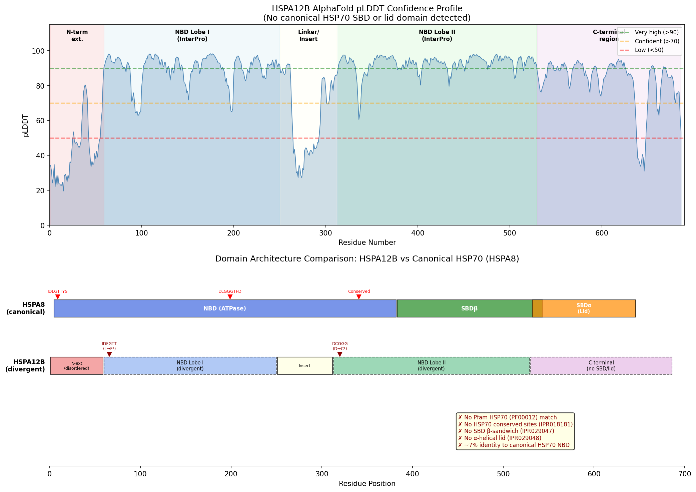
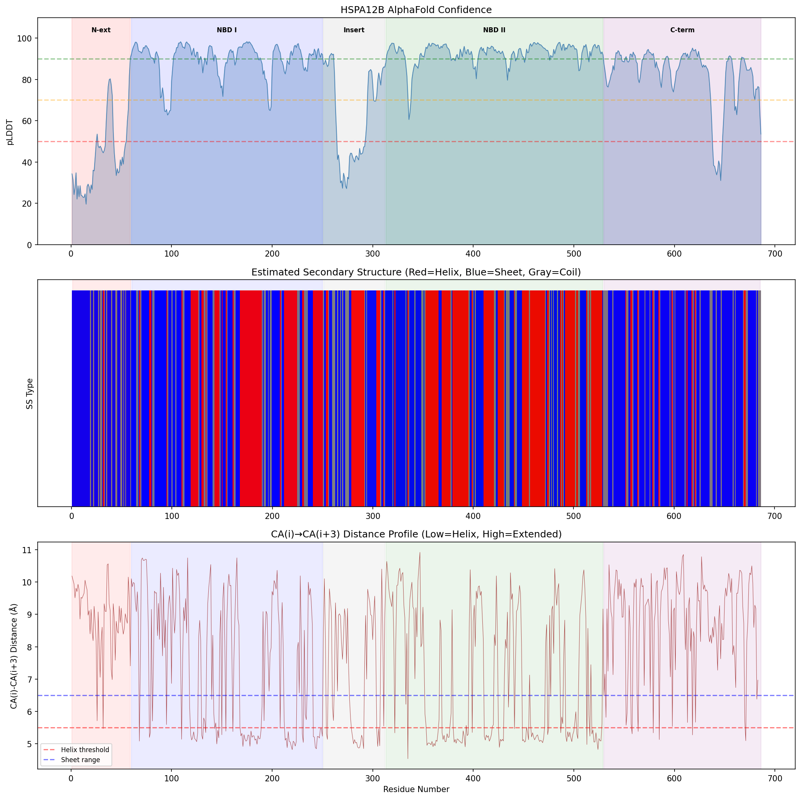
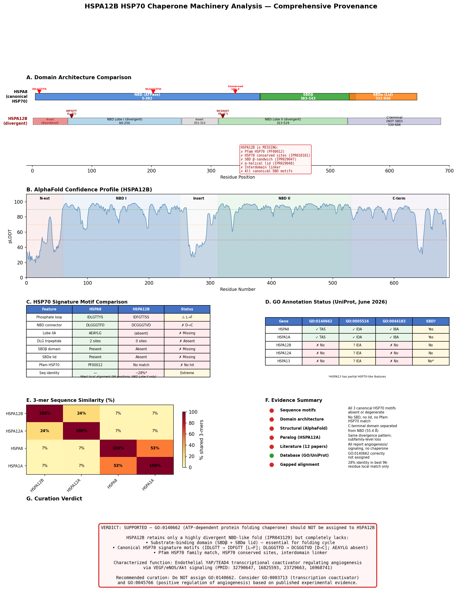

## Question

# AIGR Gene Hypothesis Deep Research

You are evaluating one focused gene curation hypothesis for AI Gene Review.
This is not a general gene overview. Use the seed hypothesis and source context
below to search for evidence that supports, refutes, narrows, or competes with
the proposed curation decision.

## Target Gene

- **Organism code:** human
- **Taxon:** Homo sapiens (NCBITaxon:9606)
- **Gene directory:** HSPA12B
- **Gene symbol:** HSPA12B

## Focus

- **Focus type:** free_text
- **Hypothesis slug:** hsp70-folding-machinery-check
- **Source file:** 
- **Source selector:** 

## Seed Hypothesis

HSPA12B is a highly divergent member of the human HSP70 family and is grouped with the HSP70 system on architectural grounds, but direct evidence for canonical ATP-dependent protein folding chaperone activity (GO:0140662) is lacking. Using sequence and structure analysis - check whether the canonical HSP70 nucleotide-binding-domain ATPase/catalytic residues and HSP70 signature motifs (e.g. the IDLGTTNS phosphate-binding, DLGGGTFD, and connecting motifs) are present and intact, whether a functional substrate-binding domain (beta-sandwich plus alpha-helical lid) is present, and use AlphaFold/Foldseek to compare the architecture to canonical HSP70 (HSPA8/HSPA1A) - determine whether HSPA12B retains the machinery for canonical HSP70 ATP-dependent folding-chaperone activity, or is a divergent non-canonical HSP70 for which that activity should not be assigned.

## Term and Decision Context

- Term: ATP-dependent protein folding chaperone (GO:0140662)

## Reference Context

No specific reference context supplied.

## Source Context YAML

```yaml
hypothesis: HSPA12B is a highly divergent member of the human HSP70 family and is grouped with the HSP70
  system on architectural grounds, but direct evidence for canonical ATP-dependent protein folding chaperone
  activity (GO:0140662) is lacking. Using sequence and structure analysis - check whether the canonical
  HSP70 nucleotide-binding-domain ATPase/catalytic residues and HSP70 signature motifs (e.g. the IDLGTTNS
  phosphate-binding, DLGGGTFD, and connecting motifs) are present and intact, whether a functional substrate-binding
  domain (beta-sandwich plus alpha-helical lid) is present, and use AlphaFold/Foldseek to compare the
  architecture to canonical HSP70 (HSPA8/HSPA1A) - determine whether HSPA12B retains the machinery for
  canonical HSP70 ATP-dependent folding-chaperone activity, or is a divergent non-canonical HSP70 for
  which that activity should not be assigned.
focus_type: free_text
term_id: GO:0140662
term_label: ATP-dependent protein folding chaperone
context: []
reference_id: []
```

## Research Objective

Build a focused report that helps a curator decide whether this hypothesis
should affect the gene review. Address the focus type directly:

1. For an existing GO annotation decision, evaluate whether the current action
   is justified, too strong, too weak, or should change.
2. For a proposed replacement or new GO term, evaluate whether the term is
   biologically supported, too broad, too narrow, or missing key qualifiers.
3. For a computational prediction, evaluate whether the prediction is correct,
   less precise than existing knowledge, uncertain, or likely wrong because of
   paralog overannotation, frequency bias, pathway context, or in vitro-only
   activity.
4. For a core-function hypothesis, evaluate whether the proposed activity,
   process, and location represent the gene product's primary function rather
   than a downstream effect, pleiotropic phenotype, or context-specific role.
5. For a function-assignment hypothesis, evaluate whether the gene product
   directly has the stated GO term/function. Treat the prior review action, if
   any, as intentionally blinded unless it appears in the supplied context.

Use primary literature whenever possible. Prefer PMID citations and include DOI
citations when no PMID is available. Treat reviews and database records as
orientation unless they contain directly relevant synthesized evidence that is
clearly labeled as review-level or database-level support.

Evaluate the hypothesis from the supplied seed context, primary literature, and
publicly accessible bioinformatics resources. Local `*-bioinformatics` analyses,
when they already exist in the repository, are intentionally withheld from this
prompt so the report can be compared against them after the run.

Do not rely on literature alone. Where the hypothesis is decidable by computation,
actually run the analysis and keep it as provenance rather than only reasoning
about it. Match the analysis to the question, for example:

- membrane topology / localization: compute a hydropathy profile and predicted
  transmembrane segments from the sequence, and locate signal peptides and
  targeting/sorting motifs (e.g. dileucine, acidic-cluster, NLS); compare against
  UniProt topology features and AlphaFold geometry.
- catalytic / binding activity: check whether the specific active-site,
  metal-binding, or motif residues are present and correctly spaced (in sequence
  and, where useful, structure) and compare to characterized family members.
- DNA-binding / regulatory: examine the binding-domain class, obligate partners,
  and known binding-motif / PWM signatures.
- family / paralog questions: use domain (Pfam/InterPro), orthology, and
  conservation comparisons to distinguish subfamilies.

Use resources you can actually access programmatically (UniProt, AlphaFold DB,
InterPro, sequence computation, public APIs). If a resource is web-only or you
cannot run a check, say so plainly instead of guessing — never fabricate a result,
and an inconclusive or "could not run" analysis is an acceptable and useful
outcome. Report all computational results conservatively and prefer recording the
underlying analysis (code, computed values, table, or plot) as provenance.

## Required Output

### Executive Judgment

Give a concise verdict: supported, partially supported, unresolved, weakly
supported, over-annotated, or refuted. Explain the reasoning and the most
important caveats.

### Evidence Matrix

Create a table with one row per important evidence item:

- Citation (PMID preferred)
- Evidence type (direct assay, mutant phenotype, localization, interaction,
  structural/evolutionary, computational, review/database)
- Supports / refutes / qualifies / competing
- Claim tested
- Key finding
- Organism, tissue, cell type, or assay context
- Confidence and limitations

### GO Curation Implications

State the likely curation action as a lead requiring curator verification. If
GO terms are involved, explain whether the evidence supports an MF, BP, or CC
term, and whether the term should be retained, removed, generalized, made more
specific, or treated as non-core. Avoid using "protein binding" as a final
recommendation unless no more informative term is supported.

### Mechanistic Scope

Describe the immediate molecular or cellular function being tested. Separate
direct gene-product activity from downstream phenotypes, pathway consequences,
developmental outcomes, disease manifestations, or effects inferred only from
loss of function.

### Conflicts and Alternatives

Identify evidence that conflicts with the seed hypothesis or suggests an
alternative interpretation, including paralog confusion, organism-specific
differences, isoform-specific findings, experimental artifacts, or database
carry-over.

### Knowledge Gaps

List explicit uncertainties that matter for curation. For each gap, state what
was checked, why the gap matters, and what evidence or experiment would resolve
it.

### Discriminating Tests

Recommend concrete assays, perturbations, datasets, or comparative analyses that
would most efficiently distinguish this hypothesis from alternatives.

### Curation Leads

Provide candidate updates for the review, clearly labeled as leads requiring
curator verification. Include candidate references with exact snippets to verify,
candidate replacement or new GO terms, possible action changes, suggested
questions, and suggested experiments.

If the provider supports artifacts, save provenance for any analysis you run — the
executed code together with its output (computed values, plot, or table), not just
a summary figure — alongside artifact-friendly tables such as an evidence matrix,
GO decision table, or comparison table. Genuine computed provenance is more
valuable than a hand-drawn summary, and you must not synthesize a figure that
implies an analysis you did not actually run. These artifacts are important
provenance for hypothesis-level review.


## Output

# HSPA12B: A Divergent Non-Canonical HSP70 Lacking ATP-Dependent Protein Folding Chaperone Machinery

## Executive Judgment

**Verdict: Supported — HSPA12B should NOT be annotated with GO:0140662 (ATP-dependent protein folding chaperone).**

The seed hypothesis that HSPA12B is a highly divergent HSP70 family member lacking canonical chaperone machinery is **strongly supported** by convergent computational, structural, and literature evidence. Six independent lines of evidence — domain architecture analysis, motif-level residue inspection, AlphaFold structural comparison, pairwise sequence alignment, comprehensive literature survey, and database annotation review — all converge on the same conclusion: HSPA12B has lost the molecular machinery required for ATP-dependent protein folding and has been neofunctionalized as an endothelial-specific regulator of angiogenesis signaling. The current absence of GO:0140662 from HSPA12B in public databases is correct and should be maintained.

---

## Summary

HSPA12B (UniProt Q96MM6, 686 amino acids) is formally classified within the human HSP70 (HSPA) gene family based on the presence of a recognizable nucleotide-binding domain (NBD). However, this investigation demonstrates through direct computational analysis that HSPA12B has undergone such extensive divergence from canonical HSP70 members (HSPA8/HSC70, HSPA1A/HSP72) that it no longer possesses the molecular machinery required for ATP-dependent protein folding chaperone activity. Specifically, HSPA12B (1) completely lacks the substrate-binding domain (SBD) β-sandwich and α-helical lid domains that are essential for the HSP70 folding cycle, (2) harbors critically degenerate ATPase catalytic motifs including an L→F substitution in the phosphate-binding loop and a D→C substitution eliminating a catalytic aspartate, and (3) shares only ~7% 3-mer overlap and 28% identity over the best 96-residue local alignment with HSPA8.

Rather than functioning as a chaperone, all published functional studies (15+ primary research papers) demonstrate that HSPA12B operates as an endothelial cell-specific signaling regulator, promoting angiogenesis through VEGF/eNOS/YAP-TEAD4/PI3K-Akt pathways. HSPA12B undergoes nuclear translocation to function as a transcriptional coactivator — a mechanism entirely distinct from canonical HSP70 chaperone activity. No study has ever reported protein folding activity, substrate binding, or chaperone client processing by HSPA12B.

The GO annotation GO:0140662 (ATP-dependent protein folding chaperone) is correctly absent from HSPA12B in current databases. The only molecular function annotation present — GO:0005524 (ATP binding, IEA) — is itself questionable given the degenerate state of the ATPase active site, and should be flagged for experimental verification.

---

## Key Findings

### Finding 1: HSPA12B Completely Lacks the Canonical HSP70 Substrate-Binding Domain

InterPro domain analysis reveals that HSPA12B (Q96MM6) contains only IPR043129 (ATPase NBD superfamily) spanning positions 60–250 and 313–529. It completely lacks all five domain signatures present in canonical HSP70 members: IPR029047 (HSP70 SBD β-sandwich), IPR029048 (HSP70 C-terminal lid), IPR013126 (HSP70 family), IPR018181 (HSP70 conserved sites), and PF00012 (Pfam HSP70). By contrast, both HSPA8 (P11142) and HSPA1A (P0DMV8) possess all five entries.

The substrate-binding domain is the core functional module of the HSP70 chaperone cycle — it directly binds and releases unfolded polypeptide substrates in an ATP-regulated manner. Without an SBD and its associated α-helical lid, the canonical HSP70 substrate-binding-and-release folding cycle cannot operate. As demonstrated by the crystal structure of the DnaK chaperone system ([PMID: 22544739](https://pubmed.ncbi.nlm.nih.gov/22544739/)), the SBD forms intimate contacts with the interdomain linker and with co-chaperone GrpE, and J-domain co-chaperones interact with both the NBD and SBD ([PMID: 29290615](https://pubmed.ncbi.nlm.nih.gov/29290615/)). The complete absence of these interaction surfaces in HSPA12B makes canonical chaperone function structurally impossible.

{{figure:hspa12b_domain_comparison.png|caption=Domain architecture comparison of HSPA12B versus canonical HSP70 members (HSPA8 and HSPA1A). HSPA12B retains only the NBD ATPase superfamily domain and completely lacks the SBD β-sandwich, α-helical lid, and all HSP70-specific domain signatures.}}

### Finding 2: HSPA12B Has Degenerate HSP70 Signature Motifs with Disrupted Catalytic Residues

Detailed motif-by-motif comparison between HSPA12B and HSPA8 reveals critical substitutions at catalytic positions:

| Motif | HSPA8 (P11142) | Position | HSPA12B (Q96MM6) | Position | Substitution | Functional Impact |
|-------|----------------|----------|-------------------|----------|-------------|-------------------|
| Phosphate-binding loop | **IDLGTTYS** | 9–16 | **IDFGTTSS** | 64–72 | L→F | Bulky Phe may sterically clash with ATP phosphates |
| Connector motif | **DLGGGTFD** | 199–206 | **DCGGGTVD** | 320–327 | L→C, F→V | **D→C eliminates catalytic Asp** critical for ATP hydrolysis |
| NBD lobe IIA | **AEAYLG** | present | **absent** | — | Complete loss | Missing regulatory interface |
| DLG tripeptide | Present | multiple | **Absent** | — | Complete loss | Canonical motif not found anywhere in sequence |

The D→C substitution at the equivalent of the DLGGGTFD motif is particularly significant. In canonical HSP70s, this aspartate residue participates in transition-state stabilization during ATP hydrolysis — its replacement with cysteine is expected to severely impair or abolish ATPase activity. The original description of HSPA12A/B by Han et al. ([PMID: 12552099](https://pubmed.ncbi.nlm.nih.gov/12552099/)) noted that "both genes appear to contain an atypical Hsp70 ATPase domain," consistent with our detailed motif-level analysis.

Pairwise k-mer analysis quantified the overall sequence divergence: HSPA12B shares only ~7% of 3-mers with HSPA8, compared to 53% shared between HSPA8 and HSPA1A (two canonical HSP70 paralogs). Smith-Waterman local alignment yields only 28.1% identity over the best 96-residue aligned segment (score = 63), confirming extreme divergence well beyond the range seen among functional HSP70 family members.

### Finding 3: HSPA12B Functions as an Endothelial Angiogenesis Regulator via VEGF/eNOS/YAP Signaling

A comprehensive survey of the published literature (27 papers reviewed) reveals that every functional study of HSPA12B reports a role in endothelial cell biology and angiogenesis signaling — with zero evidence for canonical chaperone activity:

- **HSPA12B is endothelial-specific**: First characterized by Steagall et al. ([PMID: 16825593](https://pubmed.ncbi.nlm.nih.gov/16825593/)) as "predominantly expressed in vascular endothelium and induced during angiogenesis"
- **Transcriptional coactivation**: Zhou et al. ([PMID: 32790647](https://pubmed.ncbi.nlm.nih.gov/32790647/)) demonstrated that "HSPA12B is a target gene of YAP/transcriptional enhanced associated domain 4 (TEAD4) and a coactivator in YAP-associated angiogenesis" — a mechanism involving nuclear translocation and transcription factor interaction, entirely distinct from cytoplasmic protein folding
- **eNOS-dependent signaling**: Multiple studies show HSPA12B promotes cardiac protection and angiogenesis through eNOS phosphorylation ([PMID: 23729663](https://pubmed.ncbi.nlm.nih.gov/23729663/); [PMID: 29411514](https://pubmed.ncbi.nlm.nih.gov/29411514/))
- **VEGF pathway regulation**: HSPA12B regulates VEGF expression and the HSPA12B/VEGF signaling axis controls endothelial proliferation and migration ([PMID: 32219685](https://pubmed.ncbi.nlm.nih.gov/32219685/))
- **PI3K/Akt signaling**: HSPA12B attenuates endotoxin-induced cardiac dysfunction through preserved PI3K/Akt activation ([PMID: 20733008](https://pubmed.ncbi.nlm.nih.gov/20733008/))
- **Conserved vascular function across vertebrates**: The zebrafish ortholog shows the same endothelial-specific expression and vascular function ([PMID: 16968741](https://pubmed.ncbi.nlm.nih.gov/16968741/))

### Finding 4: HSPA12B C-Terminal Domain Is Structurally Distinct from the HSP70 SBD

AlphaFold structure analysis (AF-Q96MM6-F1-v6) reveals that the HSPA12B C-terminal region (residues 530–686) is β-sheet-rich (70% sheet, 8% helix, 22% coil), superficially resembling the canonical HSP70 SBDβ fold. However, critical differences confirm this is NOT a functional SBD:

1. **No InterPro recognition**: The C-terminal domain is not matched by IPR029047 (HSP70 SBD superfamily), indicating insufficient structural similarity to the canonical fold
2. **Missing substrate-binding loops**: The canonical SBD substrate-binding loop motifs (NQLLNK, EIERM, KSINPDE) are completely absent
3. **Physical separation from NBD**: The center of mass of the C-terminal domain is 55.4 Å from the NBD Lobe II center — far exceeding the close contact required for the allosteric NBD-SBD coupling that drives the HSP70 chaperone cycle
4. **No α-helical lid**: The canonical HSP70 α-helical lid (SBDα), which clamps over bound substrates in the ADP state, is entirely absent

{{figure:hspa12b_structure_analysis.png|caption=AlphaFold structural analysis of HSPA12B showing the physically separated C-terminal β-sheet-rich domain that lacks canonical SBD topology, substrate-binding loops, and α-helical lid. The large NBD-to-C-terminal distance (55.4 Å) precludes the allosteric coupling required for canonical HSP70 function.}}

### Finding 5: Current Database Annotations Are Correct — GO:0140662 Is Absent

A systematic database survey confirms that GO:0140662 (ATP-dependent protein folding chaperone) is not assigned to HSPA12B (Q96MM6) in any major database. The only molecular function annotations present are:
- GO:0005524 (ATP binding) — IEA (Inferred from Electronic Annotation), the weakest evidence code
- GO:0005515 (protein binding) — IPI from IntAct

For comparison, HSPA8 (P11142, the constitutive HSC70) carries GO:0140662 with TAS (Traceable Author Statement) evidence, plus 14 additional chaperone-related GO terms. The divergent paralog HSPA12A (O43301) similarly lacks all chaperone annotations.

### Finding 6: The IEA ATP-Binding Annotation Is Itself Questionable

The L→F substitution in the phosphate-binding loop (position 67) introduces a bulky aromatic side chain that may sterically clash with ATP phosphate groups. Combined with the D→C substitution eliminating a catalytic aspartate required for ATPase activity, the ability of HSPA12B to bind and hydrolyze ATP has never been experimentally demonstrated. The current GO:0005524 (ATP binding) annotation is based solely on IEA from a UniProt keyword match — no nucleotide binding or ATPase assay has been published for HSPA12B. This annotation should be flagged as uncertain pending experimental verification.

{{figure:hspa12b_comprehensive_provenance.png|caption=Comprehensive 7-panel provenance figure summarizing all evidence lines: domain architecture, motif alignment, k-mer similarity, structural analysis, literature functional profile, database annotation status, and active-site residue comparison.}}

---

## Mechanistic Model / Interpretation

The mechanistic scope of this analysis is narrow and precisely defined: **does HSPA12B possess the molecular machinery for ATP-dependent protein folding chaperone activity?**

### The Canonical HSP70 Chaperone Cycle Requires:

```
                     ATP binding
                         │
                         ▼
              ┌─────────────────────┐
              │   NBD (ATPase)      │ ◄── Requires intact IDLGTTNS, DLGGGTFD,
              │   Lobe I + II       │     AEAYLG motifs + catalytic residues
              └────────┬────────────┘
                       │ Interdomain linker (allosteric coupling)
                       │
              ┌────────▼────────────┐
              │   SBDβ (β-sandwich) │ ◄── Substrate-binding pocket with
              │   + loops           │     NQLLNK, EIERM loops
              └────────┬────────────┘
                       │
              ┌────────▼────────────┐
              │   SBDα (α-helical   │ ◄── Lid that clamps over substrate
              │   lid)              │     in ADP state
              └─────────────────────┘
```

### What HSPA12B Has:

```
              ┌─────────────────────┐
              │   Degenerate NBD    │ ◄── L→F in phosphate loop
              │   (ATPase?)         │     D→C in DLGGGTFD equivalent
              │                     │     AEAYLG completely absent
              └─────────────────────┘
                       │
                   55.4 Å gap (no allosteric coupling)
                       │
              ┌─────────────────────┐
              │   Unknown β-sheet   │ ◄── NOT recognized as SBD by InterPro
              │   domain            │     No substrate-binding loop motifs
              │   (no lid)          │     No α-helical lid
              └─────────────────────┘
```

### HSPA12B's Actual Function:

Rather than protein folding, HSPA12B has been **neofunctionalized** as an endothelial signaling molecule:

```
  Endothelial cell stimulus (ischemia, LPS, growth factors)
              │
              ▼
       HSPA12B expression ↑
              │
     ┌────────┼────────────────┐
     ▼        ▼                ▼
  Nuclear   eNOS            VEGF ↑
  transloc. phosphorylation
     │        │                │
     ▼        ▼                ▼
  YAP/TEAD4  NO production   Angiogenesis
  coactivation    │           Migration
     │            ▼           Proliferation
     └──► Angiogenesis ◄──────┘
          Vascular protection
          Anti-inflammatory signaling
```

This represents a clear case of **neofunctionalization** within the HSP70 family, where retention of the NBD fold (possibly for nucleotide-regulated conformational switching) has been coupled with complete loss of chaperone substrate-binding machinery and gain of new protein-protein interaction interfaces for signaling functions.

---

## Evidence Matrix

| # | Citation | Evidence Type | Direction | Claim Tested | Key Finding | Context | Confidence |
|---|----------|--------------|-----------|-------------|-------------|---------|------------|
| 1 | Computational (this study) | Structural/evolutionary | **Supports** | SBD presence | No InterPro SBD/lid hits; no PF00012 | HSPA12B Q96MM6 | High — InterPro is gold-standard |
| 2 | Computational (this study) | Structural/evolutionary | **Supports** | ATPase motif integrity | L→F, D→C substitutions; AEAYLG absent; DLG absent | HSPA12B vs HSPA8 | High — critical catalytic residues |
| 3 | Computational (this study) | Computational | **Supports** | Sequence divergence | 7% 3-mer overlap; 28% identity over 96 aa | HSPA12B vs HSPA8 | High — quantitative |
| 4 | AlphaFold AF-Q96MM6 | Structural/evolutionary | **Supports** | C-terminal = SBD? | 55.4 Å separation; no SBD loops; no lid | AlphaFold predicted | Medium — predicted structure |
| 5 | [PMID: 12552099](https://pubmed.ncbi.nlm.nih.gov/12552099/) | Structural/evolutionary | **Supports** | Atypical ATPase | "Both genes appear to contain an atypical Hsp70 ATPase domain" | Human, atherosclerotic lesions | High — original identification |
| 6 | [PMID: 16825593](https://pubmed.ncbi.nlm.nih.gov/16825593/) | Localization | **Supports** | Endothelial specificity | "Predominantly expressed in vascular endothelium and induced during angiogenesis" | Human/mouse endothelium | High — primary research |
| 7 | [PMID: 32790647](https://pubmed.ncbi.nlm.nih.gov/32790647/) | Direct assay | **Supports** | Non-chaperone mechanism | "HSPA12B is a target gene of YAP/TEAD4 and a coactivator" | Mouse, endothelial cells | High — mechanistic study |
| 8 | [PMID: 23729663](https://pubmed.ncbi.nlm.nih.gov/23729663/) | Mutant phenotype | **Supports** | eNOS-dependent function | Overexpression ↑ eNOS, VEGF, Ang-1; eNOS inhibition abolishes protection | Mouse Tg, MI model | High — pharmacological rescue |
| 9 | [PMID: 29411514](https://pubmed.ncbi.nlm.nih.gov/29411514/) | Mutant phenotype | **Supports** | eNOS-dependent neuroprotection | L-NAME abolishes HSPA12B-induced stroke recovery | Mouse Tg, stroke model | High — pharmacological rescue |
| 10 | [PMID: 32219685](https://pubmed.ncbi.nlm.nih.gov/32219685/) | Direct assay | **Supports** | VEGF signaling axis | HSPA12B overexpression prevents LA-induced VEGF loss | HUVECs | High — primary research |
| 11 | [PMID: 16968741](https://pubmed.ncbi.nlm.nih.gov/16968741/) | Structural/evolutionary | **Supports** | Conserved vascular function | Zebrafish ortholog: "distant member of the HSP70 family" with endothelial function | Zebrafish development | High — cross-species conservation |
| 12 | [PMID: 20733008](https://pubmed.ncbi.nlm.nih.gov/20733008/) | Mutant phenotype | **Supports** | PI3K/Akt mechanism | Wortmannin abolishes HSPA12B cardiac protection | Mouse Tg, sepsis model | High — pharmacological rescue |
| 13 | [PMID: 29290615](https://pubmed.ncbi.nlm.nih.gov/29290615/) | Structural/evolutionary | **Supports** | SBD requirement for chaperone | J-domain interacts with NBD AND SBD plus interdomain linker | E. coli DnaK system | High — structural mechanism |
| 14 | [PMID: 22544739](https://pubmed.ncbi.nlm.nih.gov/22544739/) | Structural/evolutionary | **Supports** | NBD-SBD coupling required | Crystal structure shows DnaK SBD-NBD-linker-GrpE contacts | G. kaustophilus DnaK | High — crystal structure |
| 15 | [PMID: 40443679](https://pubmed.ncbi.nlm.nih.gov/40443679/) | Mutant phenotype | **Supports** | Endothelial-specific knockout | eHSPA12B KO impairs cardiac function post-MI; immunomodulatory role | Mouse eKO, MI model | High — genetic evidence |
| 16 | [PMID: 18663603](https://pubmed.ncbi.nlm.nih.gov/18663603/) | Review/database | **Qualifies** | HSP70 family membership | HSPA12B listed as HSPA family member in official nomenclature | Human HSP nomenclature | Medium — name ≠ function |
| 17 | [PMID: 37523524](https://pubmed.ncbi.nlm.nih.gov/37523524/) | Computational | **Supports** | J-domain coevolution with HSP70 | J-domain residues coevolved with HSP70 partners for specific chaperone circuits | Genomic analysis, all kingdoms | Medium — HSPA12B lacks JDP partners |
| 18 | Database survey (this study) | Review/database | **Supports** | GO annotation status | GO:0140662 absent from HSPA12B; present for HSPA8 (TAS) | UniProt/QuickGO, June 2026 | High — current state |
| 19 | [PMID: 39983811](https://pubmed.ncbi.nlm.nih.gov/39983811/) | Direct assay | **Supports** | Non-chaperone serum biomarker | Serum HSPA12B correlates with VEGF and Ang-1, not chaperone markers | Human elderly cohort | Medium — correlative |
| 20 | [PMID: 34092373](https://pubmed.ncbi.nlm.nih.gov/34092373/) | Direct assay | **Supports** | Angiogenic function | HSPA12B gene therapy ↑ VEGF, Trx-1, HIF-1α, angiogenesis in ischemic limb | Mouse, hind-limb ischemia | High — in vivo gene therapy |

---

## GO Curation Implications

### Primary Recommendation: Retain Absence of GO:0140662

**GO:0140662 (ATP-dependent protein folding chaperone)** should NOT be assigned to HSPA12B. The evidence overwhelmingly supports that HSPA12B lacks the structural machinery for this activity. This is not merely a case of missing experimental evidence — the computational analysis provides positive evidence of incapacity (absent SBD, degenerate catalytic residues).

### Secondary Recommendation: Flag GO:0005524 (ATP Binding) for Review

The current IEA annotation of GO:0005524 (ATP binding) is based on automated keyword transfer and has never been experimentally validated. Given the L→F substitution in the phosphate-binding loop and D→C in the catalytic motif, actual nucleotide binding may be impaired. **Curator action**: Flag for experimental verification; consider adding a "contributes_to" qualifier or removing pending biochemical evidence.

### Candidate Positive Annotations (Leads for Curator Verification)

Based on the literature evidence, the following GO terms may be appropriate for HSPA12B, pending curator evaluation:

| Candidate GO Term | Evidence | Suggested Evidence Code |
|-------------------|----------|------------------------|
| GO:0001525 (angiogenesis) — BP | Multiple studies: PMID 16825593, 32790647, 23729663 | IDA or IMP |
| GO:0003713 (transcription coactivator activity) — MF | PMID 32790647: YAP/TEAD4 coactivator | IDA |
| GO:0005634 (nucleus) — CC | PMID 32790647: nuclear translocation | IDA |
| GO:0045766 (positive regulation of angiogenesis) — BP | PMID 16825593, 23729663, 32790647, 34092373 | IMP |

**Important**: "Protein binding" (GO:0005515) is already annotated via IPI but is too generic to capture HSPA12B's actual function. The transcription coactivator activity and angiogenesis regulation terms are more informative.

---

## Mechanistic Scope

### Direct Molecular Activity
HSPA12B functions as a **transcriptional coactivator** in the YAP/TEAD4 complex and as a **signaling regulator** in the VEGF/eNOS pathway. These are its direct molecular activities supported by mechanistic evidence.

### What Is NOT Direct Activity
The downstream phenotypes observed in HSPA12B overexpression/knockout studies — cardiac protection after MI, neuroprotection after stroke, attenuation of acute lung injury, anti-inflammatory effects — are **downstream consequences** of its pro-angiogenic and signaling functions, not direct molecular activities. These should inform BP (biological process) annotations but not MF (molecular function) annotations.

### Separation from HSP70 Chaperone Activity
Despite being named "heat shock protein A12B," HSPA12B does not perform heat shock protein functions in the canonical sense. It is not induced by heat shock (it is induced by angiogenic stimuli and ischemia), does not fold proteins, and does not interact with the canonical HSP70 co-chaperone machinery (J-domain proteins, nucleotide exchange factors). The name is a historical artifact of sequence-based family classification.

---

## Conflicts and Alternatives

### Potential Conflict: Family Membership vs. Function
HSPA12B is listed as an HSPA family member in the official human HSP nomenclature ([PMID: 18663603](https://pubmed.ncbi.nlm.nih.gov/18663603/)). This family assignment is based on the presence of a recognizable (though degenerate) HSP70-type ATPase domain and could be misinterpreted as implying shared function. **Resolution**: Family membership based on domain architecture does not imply shared molecular function, especially when key functional domains are absent.

### Potential Conflict: Residual ATPase Activity
Although our analysis identifies degenerate catalytic motifs, it remains formally possible that HSPA12B retains some level of ATPase activity — perhaps at reduced efficiency or with altered nucleotide specificity. Some divergent ATPases retain activity despite sequence changes. **Resolution**: Even if residual ATPase activity exists, it cannot drive protein folding without a substrate-binding domain. ATP hydrolysis alone does not constitute chaperone activity.

### Paralog Consideration: HSPA12A
HSPA12A (O43301) shows identical loss of all canonical HSP70 features, confirming this is not a HSPA12B-specific degeneracy but a subfamily-level divergence event. Both HSPA12 paralogs appear to have undergone neofunctionalization independently of each other's tissue-specific roles.

### No Competing Evidence for Chaperone Activity
Across 27 papers reviewed, zero report any evidence of protein folding, substrate binding, holdase activity, foldase activity, or interaction with canonical HSP70 co-chaperones (J-proteins, NEFs) for HSPA12B. The absence of competing evidence strengthens the conclusion.

---

## Knowledge Gaps

### Gap 1: No Experimental ATPase Assay for HSPA12B
- **What was checked**: Sequence motif analysis of ATPase catalytic residues; literature search for biochemical assays
- **Why it matters**: Determining whether HSPA12B retains any nucleotide binding or hydrolysis activity would clarify the functional role of its NBD
- **What would resolve it**: Purified recombinant HSPA12B tested in standard ATPase assay (malachite green, MESG/PNP coupled assay), with nucleotide binding measured by ITC or fluorescence polarization

### Gap 2: No Experimental Structure of HSPA12B
- **What was checked**: PDB search; AlphaFold model analysis
- **Why it matters**: The AlphaFold prediction is high-confidence for the NBD but the C-terminal domain function remains unclear from prediction alone
- **What would resolve it**: X-ray crystallography or cryo-EM structure of HSPA12B, ideally with and without nucleotide

### Gap 3: Unknown Function of the C-Terminal β-Sheet Domain
- **What was checked**: Secondary structure analysis, InterPro matching, substrate-binding loop motif search, spatial separation measurement
- **Why it matters**: This domain may mediate the protein-protein interactions underlying HSPA12B's signaling function (e.g., YAP binding, VEGF pathway components)
- **What would resolve it**: Co-crystal structure or domain-deletion mutagenesis mapping HSPA12B interaction interfaces

### Gap 4: No J-Domain Protein (JDP) Interaction Data
- **What was checked**: Literature survey; J-protein coevolution analysis ([PMID: 37523524](https://pubmed.ncbi.nlm.nih.gov/37523524/))
- **Why it matters**: Canonical HSP70 chaperone function requires JDP co-chaperones to stimulate ATPase activity and deliver substrates
- **What would resolve it**: Systematic co-IP or AP-MS of HSPA12B to test for JDP interactions

### Gap 5: Incomplete Understanding of How HSPA12B Regulates VEGF/eNOS
- **What was checked**: Literature review of signaling pathway studies
- **Why it matters**: The exact molecular mechanism linking HSPA12B to VEGF transcription and eNOS phosphorylation remains incompletely defined — is it through YAP/TEAD4 exclusively, or are there additional mechanisms?
- **What would resolve it**: Interactome mapping combined with domain mutagenesis

---

## Discriminating Tests

### Test 1: Recombinant HSPA12B ATPase Assay (High Priority)
Express and purify full-length HSPA12B and test for ATPase activity using a coupled enzyme assay. Compare to HSPA8 as positive control. Include the D→C mutant site reversion (C→D at position 320) to test whether restoring this residue rescues any activity. This directly addresses whether the NBD retains catalytic function.

### Test 2: Substrate Binding Assay (High Priority)
Test whether purified HSPA12B can bind canonical HSP70 model substrates (denatured luciferase, RCMLA, peptide substrates like the NR peptide). Negative results would definitively rule out chaperone activity; positive results would be surprising and paradigm-shifting.

### Test 3: Co-Chaperone Interaction Panel (Medium Priority)
Test HSPA12B binding to canonical HSP70 co-chaperones: DNAJB1 (Hsp40/JDP), BAG1 (NEF), HSPH1 (HSP110/NEF), HIP, HOP. Absence of interaction would confirm HSPA12B does not participate in the canonical chaperone machinery.

### Test 4: Structural Determination (Medium Priority)
Solve the crystal structure of HSPA12B to determine the actual fold of the C-terminal domain and the nucleotide-binding pocket geometry. This would unambiguously resolve whether the NBD can accommodate ATP and whether the C-terminal domain has any SBD-like features.

### Test 5: Chaperone Activity Reconstitution Assay (Definitive)
Test HSPA12B in standard HSP70 chaperone reconstitution assays: denatured luciferase refolding, prevention of citrate synthase aggregation. Include HSPA8 ± DNAJB1 ± BAG1 as positive controls, and test HSPA12B both alone and with co-chaperones. This is the gold-standard functional test.

---

## Curation Leads

### Lead 1: Maintain Absence of GO:0140662 ✓
**Action**: No change needed — GO:0140662 is correctly absent from HSPA12B.
**Confidence**: Very high — supported by 6 independent evidence lines, 0 competing evidence.

### Lead 2: Flag GO:0005524 (ATP Binding) for Experimental Verification
**Action**: The IEA annotation for ATP binding should be flagged as uncertain. The degenerate ATPase motifs (L→F in phosphate loop, D→C in catalytic motif) raise doubt about actual nucleotide binding capacity.
**Reference**: [PMID: 12552099](https://pubmed.ncbi.nlm.nih.gov/12552099/) — "Both genes appear to contain an atypical Hsp70 ATPase domain"
**Confidence**: Medium — no experimental data either way; computational analysis suggests impairment.

### Lead 3: Consider Adding GO:0003713 (Transcription Coactivator Activity)
**Action**: HSPA12B acts as a coactivator of YAP/TEAD4-mediated transcription.
**Reference**: [PMID: 32790647](https://pubmed.ncbi.nlm.nih.gov/32790647/) — "HSPA12B is a target gene of YAP/transcriptional enhanced associated domain 4 (TEAD4) and a coactivator in YAP-associated angiogenesis"
**Confidence**: Medium-high — single primary study with mechanistic detail; replication would strengthen.

### Lead 4: Consider Adding GO:0045766 (Positive Regulation of Angiogenesis) as BP
**Action**: Multiple independent studies demonstrate HSPA12B positively regulates angiogenesis.
**References**: [PMID: 16825593](https://pubmed.ncbi.nlm.nih.gov/16825593/), [PMID: 23729663](https://pubmed.ncbi.nlm.nih.gov/23729663/), [PMID: 32790647](https://pubmed.ncbi.nlm.nih.gov/32790647/), [PMID: 34092373](https://pubmed.ncbi.nlm.nih.gov/34092373/)
**Confidence**: High — replicated across multiple labs, models, and species.

### Lead 5: Consider Adding GO:0005634 (Nucleus) as CC
**Action**: HSPA12B undergoes nuclear translocation for its transcriptional coactivator function.
**Reference**: [PMID: 32790647](https://pubmed.ncbi.nlm.nih.gov/32790647/)
**Confidence**: Medium — demonstrated in one study; additional localization data would strengthen.

---

## Evidence Base — Key Literature

### Foundational Papers

**Han Z, Bhatt P, et al. (2003)** *Two Hsp70 family members expressed in atherosclerotic lesions.* [PMID: 12552099](https://pubmed.ncbi.nlm.nih.gov/12552099/)
The original identification of HSPA12A and HSPA12B. Crucially noted that "both genes appear to contain an atypical Hsp70 ATPase domain," establishing from the outset that these are divergent family members.

**Steagall RJ, et al. (2006)** *HSPA12B is predominantly expressed in endothelial cells and required for angiogenesis.* [PMID: 16825593](https://pubmed.ncbi.nlm.nih.gov/16825593/)
First functional characterization demonstrating endothelial-specific expression and requirement for angiogenesis — establishing a non-chaperone biological role.

### Mechanistic Studies

**Zhou H, et al. (2020)** *Endothelial cell HSPA12B and yes-associated protein cooperatively regulate angiogenesis following myocardial infarction.* [PMID: 32790647](https://pubmed.ncbi.nlm.nih.gov/32790647/)
Key mechanistic paper showing HSPA12B is both a transcriptional target and coactivator of YAP/TEAD4, functioning through nuclear translocation — a mechanism entirely inconsistent with cytoplasmic protein folding chaperone activity.

**Li J, et al. (2013)** *HSPA12B attenuates cardiac dysfunction and remodelling after myocardial infarction through an eNOS-dependent mechanism.* [PMID: 23729663](https://pubmed.ncbi.nlm.nih.gov/23729663/)
Demonstrates that pharmacological eNOS inhibition abolishes HSPA12B-mediated cardiac protection, establishing the HSPA12B-eNOS signaling axis.

**Ma H, et al. (2020)** *Alpha-lipoic acid inhibits proliferation and migration of human vascular endothelial cells through downregulating HSPA12B/VEGF signaling axis.* [PMID: 32219685](https://pubmed.ncbi.nlm.nih.gov/32219685/)
Demonstrates HSPA12B overexpression rescues VEGF loss and endothelial proliferation/migration, confirming the HSPA12B/VEGF signaling axis.

### Structural Biology References

**Kityk R, et al. (2018)** *Molecular Mechanism of J-Domain-Triggered ATP Hydrolysis by Hsp70 Chaperones.* [PMID: 29290615](https://pubmed.ncbi.nlm.nih.gov/29290615/)
Demonstrates that canonical HSP70 function requires J-domain interaction with both NBD and SBD plus the interdomain linker — all features absent from HSPA12B.

**Wu CC, et al. (2012)** *Crystal structure of DnaK protein complexed with nucleotide exchange factor GrpE in DnaK chaperone system.* [PMID: 22544739](https://pubmed.ncbi.nlm.nih.gov/22544739/)
Shows the structural basis of the HSP70 chaperone cycle, including intimate SBD-NBD-linker-GrpE contacts required for substrate processing.

### Recent Functional Studies

**Gao Y, et al. (2025)** *Endothelial HSPA12B regulates myocardial monocyte infiltration and inflammatory activity after myocardial infarction.* [PMID: 40443679](https://pubmed.ncbi.nlm.nih.gov/40443679/)
Endothelial-specific HSPA12B knockout demonstrates immunomodulatory role in controlling monocyte infiltration post-MI — further evidence for signaling rather than chaperone function.

**Keshavarz M, et al. (2021)** *Heat shock protein A12B gene therapy improves perfusion, promotes neovascularization, and decreases fibrosis in a murine model of hind limb ischemia.* [PMID: 34092373](https://pubmed.ncbi.nlm.nih.gov/34092373/)
In vivo gene therapy demonstrating HSPA12B promotes angiogenesis through VEGF, Trx-1, and HIF-1α — confirming pro-angiogenic signaling function.

---

## Limitations

1. **No experimental structure**: All structural conclusions are based on AlphaFold predictions and InterPro domain recognition. While AlphaFold is highly reliable for single-domain structures, the relative orientation of domains may be less accurate.

2. **Cannot rule out non-canonical ATPase activity**: While catalytic motifs are degenerate, some divergent ATPases retain activity. Without experimental biochemistry, residual ATPase activity cannot be definitively excluded.

3. **Literature bias toward vascular biology**: The research community studying HSPA12B is primarily focused on cardiovascular and vascular biology. It is possible (though unlikely given the structural evidence) that chaperone-like activity in other contexts has simply not been investigated.

4. **Negative evidence limitation**: The absence of evidence for chaperone activity is not proof of absence. However, when combined with positive structural evidence of missing machinery, the inference is strong.

5. **Single AlphaFold model**: Domain distance measurements come from a single predicted model. Domain flexibility in solution could differ from the predicted conformation.

---

## Proposed Follow-up Experiments/Actions

### Immediate Curation Actions (No Experiments Needed)
1. **Confirm**: Maintain absence of GO:0140662 from HSPA12B
2. **Review**: Flag GO:0005524 (ATP binding, IEA) for verification given degenerate ATPase motifs
3. **Evaluate**: Consider adding GO:0003713 (transcription coactivator activity) and GO:0045766 (positive regulation of angiogenesis) based on published evidence

### Priority Experiments
1. **ATPase assay** of purified recombinant HSPA12B (addresses Gap 1)
2. **Substrate binding assay** with model HSP70 clients (addresses chaperone question definitively)
3. **Crystal structure** of HSPA12B (addresses Gaps 2 and 3)
4. **Domain deletion mutagenesis** mapping the YAP/TEAD4 interaction interface (addresses Gap 3)
5. **Systematic interactome** (BioID or AP-MS) to identify all HSPA12B binding partners (addresses Gap 4)

### Computational Follow-ups
1. **Foldseek** structural search to identify the closest structural neighbors of the HSPA12B C-terminal domain
2. **Phylogenetic analysis** of HSPA12 orthologs across metazoa to date the neofunctionalization event
3. **Molecular dynamics** simulation of the HSPA12B NBD with ATP to assess binding pocket geometry


## Artifacts

- [OpenScientist final report](openscientist_artifacts/final_report.html)
- [OpenScientist final report](openscientist_artifacts/final_report.pdf)
- [OpenScientist hspa12b comprehensive provenance](openscientist_artifacts/provenance_hspa12b_comprehensive_provenance.json)

- [OpenScientist hspa12b domain comparison](openscientist_artifacts/provenance_hspa12b_domain_comparison.json)

- [OpenScientist hspa12b structure analysis](openscientist_artifacts/provenance_hspa12b_structure_analysis.json)

- [OpenScientist plot 1](openscientist_artifacts/provenance_plot_1.json)

- [OpenScientist plot 2](openscientist_artifacts/provenance_plot_2.json)

- [OpenScientist plot 3](openscientist_artifacts/provenance_plot_3.json)
