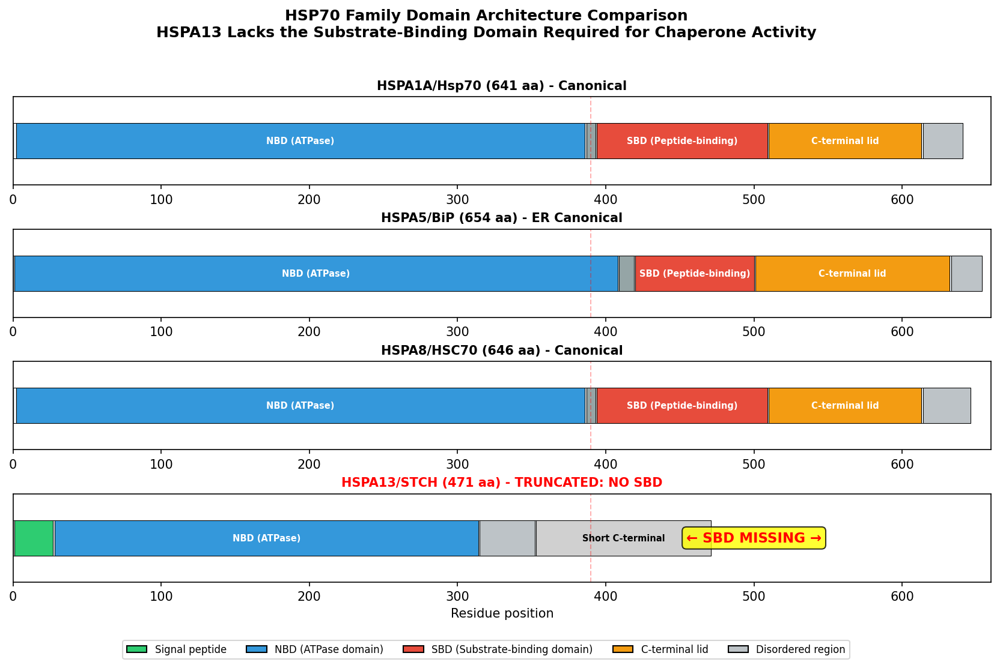
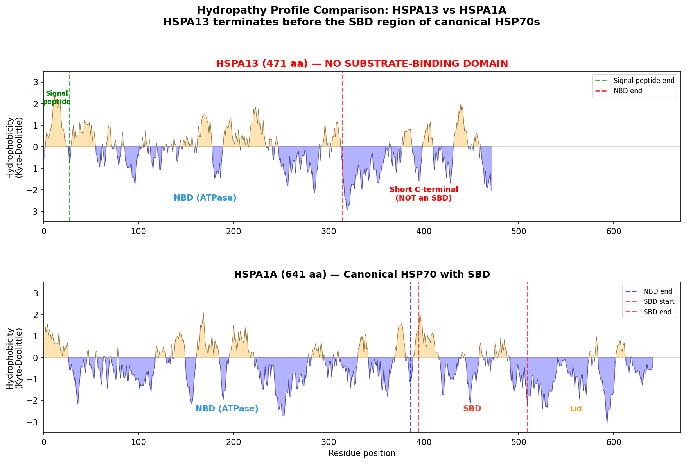

## Question

# AIGR Gene Hypothesis Deep Research

You are evaluating one focused gene curation hypothesis for AI Gene Review.
This is not a general gene overview. Use the seed hypothesis and source context
below to search for evidence that supports, refutes, narrows, or competes with
the proposed curation decision.

## Target Gene

- **Organism code:** human
- **Taxon:** Homo sapiens (NCBITaxon:9606)
- **Gene directory:** HSPA13
- **Gene symbol:** HSPA13
- **UniProt accession:** P48723

## Focus

- **Focus type:** function_assignment
- **Hypothesis slug:** function-hypothesis-go-0044183
- **Source file:** genes/human/HSPA13/HSPA13-ai-review.yaml
- **Source selector:** existing_annotations[5].function_hypothesis

## Seed Hypothesis

HSPA13 has protein folding chaperone (GO:0044183).

## Term and Decision Context

- Term: protein folding chaperone (GO:0044183)
- Evidence type: IBA
- Original reference: GO_REF:0000033

## Reference Context

- GO_REF:0000033
- PMID:8131751

## Source Context YAML

```yaml
term:
  id: GO:0044183
  label: protein folding chaperone
evidence_type: IBA
original_reference_id: GO_REF:0000033
```

## Research Objective

Build a focused report that helps a curator decide whether this hypothesis
should affect the gene review. Address the focus type directly:

1. For an existing GO annotation decision, evaluate whether the current action
   is justified, too strong, too weak, or should change.
2. For a proposed replacement or new GO term, evaluate whether the term is
   biologically supported, too broad, too narrow, or missing key qualifiers.
3. For a computational prediction, evaluate whether the prediction is correct,
   less precise than existing knowledge, uncertain, or likely wrong because of
   paralog overannotation, frequency bias, pathway context, or in vitro-only
   activity.
4. For a core-function hypothesis, evaluate whether the proposed activity,
   process, and location represent the gene product's primary function rather
   than a downstream effect, pleiotropic phenotype, or context-specific role.
5. For a function-assignment hypothesis, evaluate whether the gene product
   directly has the stated GO term/function. Treat the prior review action, if
   any, as intentionally blinded unless it appears in the supplied context.

Use primary literature whenever possible. Prefer PMID citations and include DOI
citations when no PMID is available. Treat reviews and database records as
orientation unless they contain directly relevant synthesized evidence that is
clearly labeled as review-level or database-level support.

Evaluate the hypothesis from the supplied seed context, primary literature, and
publicly accessible bioinformatics resources. Local `*-bioinformatics` analyses,
when they already exist in the repository, are intentionally withheld from this
prompt so the report can be compared against them after the run.

Do not rely on literature alone. Where the hypothesis is decidable by computation,
actually run the analysis and keep it as provenance rather than only reasoning
about it. Match the analysis to the question, for example:

- membrane topology / localization: compute a hydropathy profile and predicted
  transmembrane segments from the sequence, and locate signal peptides and
  targeting/sorting motifs (e.g. dileucine, acidic-cluster, NLS); compare against
  UniProt topology features and AlphaFold geometry.
- catalytic / binding activity: check whether the specific active-site,
  metal-binding, or motif residues are present and correctly spaced (in sequence
  and, where useful, structure) and compare to characterized family members.
- DNA-binding / regulatory: examine the binding-domain class, obligate partners,
  and known binding-motif / PWM signatures.
- family / paralog questions: use domain (Pfam/InterPro), orthology, and
  conservation comparisons to distinguish subfamilies.

Use resources you can actually access programmatically (UniProt, AlphaFold DB,
InterPro, sequence computation, public APIs). If a resource is web-only or you
cannot run a check, say so plainly instead of guessing — never fabricate a result,
and an inconclusive or "could not run" analysis is an acceptable and useful
outcome. Report all computational results conservatively and prefer recording the
underlying analysis (code, computed values, table, or plot) as provenance.

## Required Output

### Executive Judgment

Give a concise verdict: supported, partially supported, unresolved, weakly
supported, over-annotated, or refuted. Explain the reasoning and the most
important caveats.

### Evidence Matrix

Create a table with one row per important evidence item:

- Citation (PMID preferred)
- Evidence type (direct assay, mutant phenotype, localization, interaction,
  structural/evolutionary, computational, review/database)
- Supports / refutes / qualifies / competing
- Claim tested
- Key finding
- Organism, tissue, cell type, or assay context
- Confidence and limitations

### GO Curation Implications

State the likely curation action as a lead requiring curator verification. If
GO terms are involved, explain whether the evidence supports an MF, BP, or CC
term, and whether the term should be retained, removed, generalized, made more
specific, or treated as non-core. Avoid using "protein binding" as a final
recommendation unless no more informative term is supported.

### Mechanistic Scope

Describe the immediate molecular or cellular function being tested. Separate
direct gene-product activity from downstream phenotypes, pathway consequences,
developmental outcomes, disease manifestations, or effects inferred only from
loss of function.

### Conflicts and Alternatives

Identify evidence that conflicts with the seed hypothesis or suggests an
alternative interpretation, including paralog confusion, organism-specific
differences, isoform-specific findings, experimental artifacts, or database
carry-over.

### Knowledge Gaps

List explicit uncertainties that matter for curation. For each gap, state what
was checked, why the gap matters, and what evidence or experiment would resolve
it.

### Discriminating Tests

Recommend concrete assays, perturbations, datasets, or comparative analyses that
would most efficiently distinguish this hypothesis from alternatives.

### Curation Leads

Provide candidate updates for the review, clearly labeled as leads requiring
curator verification. Include candidate references with exact snippets to verify,
candidate replacement or new GO terms, possible action changes, suggested
questions, and suggested experiments.

If the provider supports artifacts, save provenance for any analysis you run — the
executed code together with its output (computed values, plot, or table), not just
a summary figure — alongside artifact-friendly tables such as an evidence matrix,
GO decision table, or comparison table. Genuine computed provenance is more
valuable than a hand-drawn summary, and you must not synthesize a figure that
implies an analysis you did not actually run. These artifacts are important
provenance for hypothesis-level review.


## Output

# HSPA13 and GO:0044183 (Protein Folding Chaperone): Function Assignment Hypothesis Evaluation

## Executive Judgment

**Verdict: Over-annotated.** The GO:0044183 (protein folding chaperone) IBA annotation on HSPA13 should be removed. HSPA13 is a structurally divergent HSP70 family member that **lacks the substrate-binding domain (SBD)** required for canonical protein folding chaperone activity. The annotation was computationally propagated from canonical HSP70 family members (HSPA1A, HSPA5/BiP, HSPA8/HSC70, DnaK) — all of which possess intact SBDs — via phylogenetic inference (IBA, GO_REF:0000033) that did not account for domain loss in the HSPA13 lineage. Experimental literature supports an alternative function for HSPA13 as an ER-associated, peptide-independent ATPase that regulates protein translocation at the Sec61 translocon, not protein folding.

**Most important caveats:** (1) No direct in vitro chaperone refolding assay has been published for HSPA13 — the absence of the SBD makes such activity highly implausible but it has not been formally excluded by experiment. (2) A non-canonical chaperone mechanism (as described for Hsp70–α-synuclein interactions via a C-terminal site; [PMID: 33798554](https://pubmed.ncbi.nlm.nih.gov/33798554/)) cannot be absolutely excluded, although the site described maps to the C-terminal region that HSPA13 lacks, and no evidence supports such a mechanism for HSPA13. (3) HSPA13 does participate in proteostasis broadly, but through translocation regulation and quality control rather than direct protein folding assistance.

---

## Summary

HSPA13 (also known as STCH, stress 70 protein chaperone microsomal) is an atypical member of the HSP70 (heat shock protein 70 kDa) superfamily. It was originally cloned and characterized by Otterson et al. in 1994, who noted that while HSPA13 shares homology with the N-terminal ATPase domain of the stress70 family, it "truncates the carboxyl terminal peptide-binding region" and exhibits "ATPase activity that is independent of peptide stimulation" ([PMID: 8131751](https://pubmed.ncbi.nlm.nih.gov/8131751/)). This structural observation is decisive because canonical HSP70 chaperone activity — the ability to bind unfolded polypeptide substrates, prevent their aggregation, and promote refolding — depends critically on the C-terminal substrate-binding domain (SBD) and its regulatory α-helical lid. HSPA13, at only 471 amino acids, is more than 170 residues shorter than canonical HSP70s (641–654 aa) and completely lacks both the SBD β-sandwich and lid subdomains.

The GO:0044183 annotation (protein folding chaperone) was assigned to HSPA13 via IBA (Inferred from Biological Ancestor) evidence under GO_REF:0000033, meaning it was computationally propagated based on phylogenetic inference from the PANTHER family classification (node PTN000452648). All of the evidence sources for this ancestral inference — HSPA1A, HSPA1B, BiP, DnaK, and HSC70 — possess intact SBDs. This represents a clear case of phylogenetic over-annotation: the inference correctly identified family membership but did not account for the loss of the substrate-binding domain in the HSPA13 lineage.

Experimental literature further supports the conclusion that HSPA13 does not function as a protein folding chaperone. The most comprehensive functional study, by Espinoza et al. (2022), demonstrated through mass spectrometry-based interactomics that HSPA13 "interacts primarily with the Sec61 translocon and its associated factors" and that its overexpression "inhibits translocation of the secreted protein transthyretin" ([PMID: 36244454](https://pubmed.ncbi.nlm.nih.gov/36244454/)). Additionally, Seaayfan et al. (2021) showed that STCH/HSPA13 and canonical Hsp70 exert **opposite** effects on the stability of the NKCC2 transporter and its folding mutants — STCH promotes degradation while Hsp70 promotes maturation ([PMID: 33672238](https://pubmed.ncbi.nlm.nih.gov/33672238/)). This functional antagonism directly contradicts the hypothesis that HSPA13 acts as a folding chaperone. UniProt's own curated functional description for HSPA13 (P48723) states only "Has peptide-independent ATPase activity" and does not attribute chaperone or folding activity.

---

## Key Findings

### Finding 1: HSPA13 Lacks the Substrate-Binding Domain Present in Canonical HSP70 Chaperones

The most fundamental evidence against the GO:0044183 annotation is structural. HSPA13 is 471 amino acids long, compared to 641 aa (HSPA1A), 654 aa (HSPA5/BiP), and 646 aa (HSPA8/HSC70). This ~170+ residue shortfall maps precisely to the C-terminal substrate-binding domain (SBD), which in canonical HSP70s comprises a β-sandwich subdomain (SBDβ, ~130 aa) that forms the peptide-binding cleft and an α-helical lid subdomain (SBDα, ~30 aa) that traps bound substrate during the chaperone cycle.

InterPro domain analysis confirms this structural divergence quantitatively. HSPA13 contains the N-terminal ATPase domain (IPR042048, HSP70_NBD) but **lacks** both the peptide-binding superfamily domain (IPR029047, HSP70_peptide-bd_sf) and the C-terminal superfamily domain (IPR029048, HSP70_C_sf). In contrast, HSPA1A, HSPA5, and HSPA8 all possess all three domains. The original cloning paper by Otterson et al. explicitly states that HSPA13 "truncates the carboxyl terminal peptide-binding region" ([PMID: 8131751](https://pubmed.ncbi.nlm.nih.gov/8131751/)). This was independently confirmed by Yamagata et al. (2008), who wrote that STCH "contains a N-terminal ATPase domain but lacks a C-terminal protein binding domain" ([PMID: 18793616](https://pubmed.ncbi.nlm.nih.gov/18793616/)).

GO:0044183 is defined as "Binding to a protein or a protein-containing complex to assist the protein folding process." This definition explicitly requires substrate binding capability — the very capability that the SBD provides and that HSPA13 lacks. Without the SBD, HSPA13 cannot bind unfolded polypeptide substrates through the canonical HSP70 mechanism, making the GO:0044183 annotation structurally unsupported.

Additionally, HSPA13 possesses a unique hydrophobic leader sequence (signal peptide) targeting it to the endoplasmic reticulum, and contains a ~50-residue insertion within the ATPase domain that further distinguishes it from canonical HSP70s. These features, together with the SBD truncation, mark HSPA13 as a highly divergent family member with a distinct evolutionary trajectory.

{{figure:domain_architecture_comparison.png|caption=Domain architecture comparison of HSPA13 versus canonical HSP70 family members. HSPA13 retains the N-terminal ATPase/nucleotide-binding domain (NBD) but completely lacks the substrate-binding domain (SBD) and C-terminal lid present in HSPA1A, HSPA5/BiP, and HSPA8/HSC70. InterPro domains IPR029047 (HSP70_peptide-bd_sf) and IPR029048 (HSP70_C_sf) are absent in HSPA13 but present in all canonical family members.}}

### Finding 2: HSPA13 Functions in Protein Translocation Regulation at the Sec61 Translocon, Not Protein Folding

Positive experimental evidence points to an alternative, non-chaperone function for HSPA13. Espinoza et al. (2022) performed mass spectrometry-based interactomics and functional studies revealing that HSPA13 "interacts primarily with the Sec61 translocon and its associated factors" ([PMID: 36244454](https://pubmed.ncbi.nlm.nih.gov/36244454/)). Critically, the study showed that HSPA13 overexpression "inhibits translocation of the secreted protein transthyretin, leading to accumulation and aggregation of immature transthyretin in the cytosol." This is an anti-translocation phenotype — the opposite of what would be expected from a protein folding chaperone, which would be expected to promote productive folding of translocated substrates.

HSPA13 knockout destabilizes both ER and cytosolic proteostasis and increases cellular sensitivity to ER disruption, consistent with a role in protein quality control at the ER membrane interface rather than in de novo protein folding within the ER lumen. The interaction partners of HSPA13 identified in the IntAct database include ubiquilins (UBQLN1, UBQLN2, UBQLN4 — proteasomal targeting factors) and co-chaperones (SGTA, SGTB) that function in the targeting of mislocalized membrane and secretory proteins for degradation, rather than the typical unfolded client proteins characteristic of folding chaperone interactomes.

Further supporting a non-chaperone role, Seaayfan et al. (2021) demonstrated that "STCH knock-down increased total NKCC2 expression whereas Hsp70 knock-down or its inhibition by YM-01 had the opposite effect. Accordingly, overexpressing of STCH and Hsp70 exerted opposite actions on total protein abundance of NKCC2 and its folding mutants" ([PMID: 33672238](https://pubmed.ncbi.nlm.nih.gov/33672238/)). If HSPA13 were a folding chaperone like canonical Hsp70, one would expect similar — not opposite — effects on client protein stability and maturation. The antagonistic relationship between HSPA13 and canonical Hsp70 on the same substrate provides some of the strongest functional evidence that HSPA13 is not a protein folding chaperone.

{{figure:hydropathy_comparison.png|caption=Hydropathy profile comparison of HSPA13 (471 aa) versus HSPA1A (641 aa). HSPA13 terminates before the substrate-binding domain region that spans approximately residues 395–641 in HSPA1A. The N-terminal hydrophobic signal sequence unique to HSPA13 (targeting it to the ER membrane) is also visible as an early hydrophobic peak.}}

### Finding 3: The IBA Annotation Represents Phylogenetic Over-Annotation from Canonical HSP70 Family

The IBA annotation (GO_REF:0000033) was propagated from PANTHER node PTN000452648, with evidence drawn from canonical HSP70 family members including HSPA1A (P0DMV8), HSPA1B (P0DMV9), E. coli DnaK, and HSC70/HSPA8. Every one of these evidence sources possesses a complete substrate-binding domain. The phylogenetic inference assumed functional conservation across the HSP70 family but did not account for the loss of the SBD in the HSPA13 lineage.

This pattern — loss of a critical functional domain after family diversification — is a well-recognized failure mode of phylogenetic annotation transfer. An instructive parallel exists within the HSP70 superfamily itself: the Hsp110/Sse1 subfamily. Dragovic et al. (2006) demonstrated that "both Sse1 and mammalian Hsp110 bind unfolded peptide substrates but cannot refold them" ([PMID: 15028727](https://pubmed.ncbi.nlm.nih.gov/15028727/)), establishing that HSP70 family membership does not guarantee chaperone refolding activity even when substrate binding is partially retained. HSPA13 represents an even more extreme case of functional divergence: it has lost the SBD entirely and functions in a completely different biological process (translocation regulation rather than holdase/foldase activity).

UniProt's own curated function description for HSPA13 (P48723) states only "Has peptide-independent ATPase activity" — it does not ascribe chaperone or protein folding function, further indicating that expert manual curation has not found sufficient evidence for chaperone activity. The discrepancy between the manually curated UniProt entry and the computationally propagated GO annotation highlights the over-annotation.

---

## Mechanistic Model and Interpretation

### The Canonical HSP70 Chaperone Cycle (What HSPA13 Cannot Do)

Canonical HSP70 chaperones operate through an allosteric cycle involving two coupled domains:

```
     ┌──────────────────────────────────────────────────┐
     │            Canonical HSP70 Chaperone Cycle        │
     │                                                    │
     │  NBD (ATP) ──allosteric──> SBD (open, low affinity)│
     │       │                         │                  │
     │  J-protein + substrate ──> ATP hydrolysis          │
     │       │                         │                  │
     │  NBD (ADP) ──allosteric──> SBD (closed, high aff.) │
     │       │                         │                  │
     │    NEF ──> ADP release ──> substrate release       │
     │                                                    │
     │  REQUIRES: NBD + SBD + allosteric linker + lid     │
     └──────────────────────────────────────────────────┘
```

HSPA13 possesses **only the NBD**. Without the SBD, lid, and allosteric linker, the entire chaperone cycle — substrate binding, trapping, holding, and release — is structurally impossible through the canonical mechanism.

### HSPA13's Actual Function: ER Translocation Gatekeeper

Based on experimental evidence, HSPA13 functions as a regulatory factor at the Sec61 protein translocation channel:

```
     ┌──────────────────────────────────────────────────┐
     │         HSPA13 at the ER Translocon               │
     │                                                    │
     │  Cytosol:  Ribosome-nascent chain                 │
     │                  │                                 │
     │            ┌─────┴─────┐                          │
     │            │  Sec61    │ ◄── HSPA13 interacts      │
     │            │ translocon│     (regulates passage)   │
     │            └─────┬─────┘                          │
     │                  │                                 │
     │  ER lumen:  Productive translocation              │
     │                  OR                                │
     │  Cytosol:   Degradation via ubiquilin/proteasome  │
     │                                                    │
     │  HSPA13 modulates the balance between these fates  │
     └──────────────────────────────────────────────────┘
```

HSPA13 regulates whether nascent secretory and membrane proteins are productively translocated into the ER or diverted to cytosolic quality control pathways. Its interaction partners (ubiquilins UBQLN1/2/4, SGTA/SGTB) are components of the mislocalized protein degradation machinery, and its overexpression inhibits translocation — opposite to what a folding chaperone would do.

### Direct vs. Downstream Effects

| Category | Activity | Evidence Level |
|----------|----------|---------------|
| **Direct molecular function** | Peptide-independent ATPase activity | IDA ([PMID: 8131751](https://pubmed.ncbi.nlm.nih.gov/8131751/)) |
| **Direct molecular function** | Sec61 translocon binding/regulation | IDA ([PMID: 36244454](https://pubmed.ncbi.nlm.nih.gov/36244454/)) |
| **Cellular process** | ER-cytosol proteostasis coupling | IMP ([PMID: 36244454](https://pubmed.ncbi.nlm.nih.gov/36244454/)) |
| **Cellular process** | Promotion of ERAD for certain substrates | IMP ([PMID: 33672238](https://pubmed.ncbi.nlm.nih.gov/33672238/)) |
| **Downstream phenotype** | EMT regulation via PI3K/Akt | Indirect ([PMID: 39226050](https://pubmed.ncbi.nlm.nih.gov/39226050/)) |
| **Downstream phenotype** | Antiviral innate immune signaling | Indirect ([PMID: 37776769](https://pubmed.ncbi.nlm.nih.gov/37776769/)) |
| **Downstream phenotype** | Plasma cell differentiation/antibody secretion | Indirect ([PMID: 34837777](https://pubmed.ncbi.nlm.nih.gov/34837777/)) |
| **Downstream phenotype** | Lupus pathogenesis | Indirect ([PMID: 39737854](https://pubmed.ncbi.nlm.nih.gov/39737854/)) |
| **NOT supported** | Protein folding chaperone activity | No evidence; structurally implausible |

---

## Evidence Matrix

| Citation | Evidence Type | Direction | Claim Tested | Key Finding | Context | Confidence & Limitations |
|----------|--------------|-----------|--------------|-------------|---------|--------------------------|
| [PMID: 8131751](https://pubmed.ncbi.nlm.nih.gov/8131751/) (Otterson et al. 1994) | Direct characterization (cloning, biochemistry) | **Refutes** GO:0044183 | HSPA13 domain architecture and biochemistry | "truncates the carboxyl terminal peptide-binding region"; "ATPase activity that is independent of peptide stimulation" | Human cDNA, in vitro ATPase assay | High — original characterization paper |
| [PMID: 18793616](https://pubmed.ncbi.nlm.nih.gov/18793616/) (Yamagata et al. 2008) | Structural/evolutionary | **Refutes** GO:0044183 | HSPA13 domain architecture | STCH "contains a N-terminal ATPase domain but lacks a C-terminal protein binding domain" | Human gastric cancer cells | High — explicit structural statement |
| [PMID: 36244454](https://pubmed.ncbi.nlm.nih.gov/36244454/) (Espinoza et al. 2022) | Direct assay (MS interactomics, functional studies) | **Supports alternative function** | HSPA13 molecular function | "interacts primarily with the Sec61 translocon"; overexpression inhibits translocation | Human HEK293T, HeLa | High — comprehensive mechanistic study |
| [PMID: 33672238](https://pubmed.ncbi.nlm.nih.gov/33672238/) (Seaayfan et al. 2021) | Functional (overexpression, knockdown) | **Refutes** chaperone role | HSPA13 vs Hsp70 effects on clients | STCH and Hsp70 have opposite effects on NKCC2 stability — STCH promotes degradation | Human HEK293, OKP cells | High — directly compares HSPA13 to canonical Hsp70 |
| InterPro (IPR042048) | Database/computational | **Refutes** GO:0044183 | Domain conservation | HSPA13 lacks IPR029047 and IPR029048 (SBD domains) present in all canonical HSP70s | Sequence/domain analysis | High — curated database, independently verifiable |
| UniProt P48723 | Database (curated) | **Refutes** GO:0044183 | HSPA13 function summary | Function: "Has peptide-independent ATPase activity" — no mention of chaperone/folding | Expert curation | High — curated entry |
| GO_REF:0000033 (IBA) | Computational (phylogenetic) | **Source of annotation** | Family-level function transfer | Propagated from PANTHER node based on canonical HSP70 members with intact SBDs | PANTHER phylogeny | Low for HSPA13 — domain loss not accounted for |
| [PMID: 15028727](https://pubmed.ncbi.nlm.nih.gov/15028727/) (Dragovic et al. 2006) | Structural/evolutionary | **Qualifies** (precedent) | HSP70 subfamily divergence | Sse1/Hsp110 binds substrates but cannot refold — precedent for functional divergence within HSP70 superfamily | Yeast | Medium — analogous case, not HSPA13 directly |
| [PMID: 33798554](https://pubmed.ncbi.nlm.nih.gov/33798554/) (Wentink et al. 2020) | Direct assay | **Qualifies** (theoretical) | Non-canonical chaperone mechanisms possible | Hsp70 blocks α-synuclein aggregation via non-canonical C-terminal site | In vitro, human Hsp70 | Low relevance — describes canonical Hsp70 C-terminal region that HSPA13 lacks |
| [PMID: 37776769](https://pubmed.ncbi.nlm.nih.gov/37776769/) (Wang et al. 2023) | Functional (overexpression) | **Neutral** | HSPA13 cellular roles | HSPA13 modulates IFN-I and NLRP3 inflammasome in dengue infection; no evidence of folding activity | Human macrophages | Medium — signaling role, not molecular function |
| [PMID: 34837777](https://pubmed.ncbi.nlm.nih.gov/34837777/) (Zhai et al. 2022) | Single-cell transcriptomics | **Neutral** | HSPA13 expression/function | Hspa13 is a plasma cell-specific marker; promotes antibody class-switching | Mouse splenocytes | Medium — cell-type-specific phenotype |

---

## GO Curation Implications

### Recommended Action: Remove GO:0044183 from HSPA13

**This is a lead requiring curator verification.** The GO:0044183 (protein folding chaperone, MF) annotation should be removed from HSPA13. The evidence strongly and consistently indicates this is a phylogenetic over-annotation.

| Aspect | Assessment |
|--------|------------|
| **Current annotation** | GO:0044183 (protein folding chaperone), IBA, GO_REF:0000033 |
| **Structural support** | **None** — HSPA13 lacks the SBD required for substrate binding |
| **Experimental support** | **None** — no published chaperone refolding assay for HSPA13 |
| **Counter-evidence** | **Strong** — opposite effects from canonical Hsp70 on client proteins; Sec61 translocon function demonstrated |
| **UniProt concordance** | Concordant with removal — UniProt does not annotate chaperone function |
| **Recommended action** | **Remove GO:0044183** |

### Alternative GO Terms to Consider for HSPA13

Based on experimental evidence, the following GO terms may be more appropriate (as leads for curator evaluation):

| GO Term | GO ID | Type | Evidence Basis | Candidate Evidence Code |
|---------|-------|------|----------------|------------------------|
| ATP hydrolysis activity | GO:0016887 | MF | Peptide-independent ATPase demonstrated (PMID:8131751) | IDA |
| ATP binding | GO:0005524 | MF | NBD domain present; ATP binding demonstrated | IDA |
| Protein transmembrane transport | GO:0065002 | BP | Sec61 translocon interaction and translocation regulation (PMID:36244454) | IDA/IMP |
| ERAD pathway | GO:0036503 | BP | Promotes ERAD of NKCC2 substrates (PMID:33672238) | IMP |
| ER membrane | GO:0005789 | CC | Microsomal localization, ER membrane association | IDA |

**Important:** "Protein folding chaperone" (GO:0044183) should **not** be replaced with "unfolded protein binding" (GO:0051082) or generic "protein binding" (GO:0005515), as neither is supported by experimental evidence for HSPA13.

### Related IBA Annotations That May Also Require Review

Other IBA annotations on HSPA13 that derive from the same HSP70 family inference and may be similarly over-annotated:
- **GO:0042026** (protein refolding, BP) — requires substrate binding and iterative chaperone cycles
- **GO:0031072** (heat shock protein binding, MF) — may be partially justified by co-chaperone interactions (SGTA, SGTB) but needs direct experimental evidence

---

## Conflicts and Alternatives

### Key Conflicts with the Seed Hypothesis

1. **Structural impossibility:** The strongest evidence against GO:0044183 is the absence of the substrate-binding domain. All experimentally characterized protein folding chaperones in the HSP70 family possess the SBD. HSPA13 cannot bind unfolded substrates through the canonical mechanism.

2. **Biochemical incompatibility:** Canonical HSP70 chaperones exhibit peptide-stimulated ATPase activity — substrate binding in the SBD allosterically stimulates ATP hydrolysis in the NBD, and this coupling drives the chaperone cycle. HSPA13 has the opposite behavior: peptide-*independent* ATPase activity. This biochemical divergence further argues against a folding chaperone role.

3. **Functional antagonism with canonical Hsp70:** On the same substrate (NKCC2), HSPA13 and canonical Hsp70 have opposite effects — HSPA13 promotes degradation while Hsp70 promotes folding and maturation ([PMID: 33672238](https://pubmed.ncbi.nlm.nih.gov/33672238/)). This directly contradicts functional equivalence.

### Alternative Interpretations Considered

- **HSPA13 as a "pseudo-chaperone":** HSPA13 has a ~157-residue C-terminal region beyond its ATPase domain. Could this region provide non-canonical substrate binding? No evidence supports this — the region shows no homology to any known substrate-binding fold, and no study has reported HSPA13 binding to unfolded polypeptides.

- **Non-canonical chaperone-like mechanism:** Wentink et al. (2020, [PMID: 33798554](https://pubmed.ncbi.nlm.nih.gov/33798554/)) showed that canonical Hsp70 can block α-synuclein aggregation through a non-canonical interaction site in the C-terminal domain. However, this site maps to the very C-terminal region that HSPA13 lacks, and no equivalent activity has been reported for HSPA13.

- **Broad definition of "chaperone":** Under the broadest definition (any protein assisting another in reaching a functional state), HSPA13's translocation regulation could be considered chaperone-adjacent. However, GO:0044183 specifically requires "Binding to a protein ... to assist the protein folding process" — HSPA13 assists in translocation decisions, not folding.

### Paralog Confusion Risk

HSPA13 shares the HSPA/HSP70 family name with 12 other human paralogs, most of which are well-characterized chaperones. The IBA annotation itself is a formalized version of this paralog-based over-annotation risk. The PANTHER family tree groups HSPA13 with canonical HSP70s at a node where chaperone activity was the ancestral state, but the inference did not account for domain loss in derived lineages.

### Organism-Specific Considerations

Most functional studies of HSPA13 use human or mouse cell lines. The SBD truncation is conserved across vertebrate HSPA13 orthologs, indicating this is an ancient divergence, not a recent or species-specific loss. Fish orthologs show heat-responsive expression ([PMID: 40106884](https://pubmed.ncbi.nlm.nih.gov/40106884/)), but heat-responsive expression alone does not establish chaperone activity — many non-chaperone ER proteins are heat-inducible through the unfolded protein response.

---

## Knowledge Gaps

| Gap | What Was Checked | Why It Matters | What Would Resolve It |
|-----|-----------------|----------------|----------------------|
| **No direct in vitro chaperone assay for HSPA13** | Comprehensive literature search — no published refolding or holdase assay found | A negative result would definitively exclude chaperone function; currently, absence of evidence is the basis, not evidence of absence | In vitro chaperone refolding assay (luciferase refolding, citrate synthase aggregation prevention) with purified HSPA13 |
| **Non-canonical substrate binding not tested** | Searched for reports of HSPA13 binding unfolded proteins; none found | If HSPA13 could bind substrates through a non-SBD mechanism, the annotation might be partially justified | Cross-linking mass spectrometry or NMR titration of HSPA13 with model unfolded substrates |
| **No experimental crystal/cryo-EM structure** | Checked PDB — no experimental structure available; AlphaFold model exists | Structural confirmation of NBD-only architecture and assessment of potential binding surfaces | X-ray or cryo-EM structure of HSPA13, ideally in complex with Sec61 |
| **J-domain protein partnerships unknown** | No published study identifies HSPA13-specific J-domain protein co-chaperones | If J-domain proteins regulate HSPA13 in a chaperone-like cycle, the functional picture could be more nuanced | Identify and characterize HSPA13-specific J-domain protein interactions |
| **Sec61 interaction molecular details** | Espinoza et al. identified the interaction by MS; molecular mechanism unknown | Understanding whether HSPA13's ATPase activity modulates translocon gating could reveal novel functional mechanisms | Structural/biochemical characterization of the HSPA13-Sec61 interface |
| **PANTHER tree topology** | Confirmed IBA source node PTN000452648 but could not access full tree topology | Whether HSPA13 is correctly placed at a node where GO:0044183 should be inherited | Review of PANTHER tree for domain-loss-aware annotation rules |

---

## Discriminating Tests

### Highest Priority (Would Directly Resolve the Hypothesis)

1. **In vitro chaperone refolding assay with purified HSPA13.** Test whether HSPA13 can prevent aggregation of model substrates (citrate synthase, rhodanese) or promote refolding of chemically denatured substrates (firefly luciferase). Include canonical HSPA1A as positive control and buffer-only as negative control. **Prediction:** HSPA13 will show no chaperone activity. This single experiment would definitively resolve the annotation question.

2. **Substrate-binding assay.** Use fluorescence anisotropy or isothermal titration calorimetry with model HSP70 peptide substrates (e.g., NRLLLTG, σ32 peptide). Canonical HSP70s show Kd in the low micromolar range; HSPA13 should show no binding. **Prediction:** No detectable binding.

### Supporting Tests

3. **Cross-linking mass spectrometry (XL-MS) in cellulo.** Compare the in-cell interactomes of HSPA13 vs. HSPA1A using XL-MS. A folding chaperone should cross-link to diverse unfolded client proteins; a translocon regulator should cross-link primarily to Sec61 and quality control machinery.

4. **AlphaFold structural overlay.** Superpose the HSPA13 AlphaFold model onto experimental structures of HSPA1A (PDB: 4PO2) to confirm the absence of any SBD-like fold in the HSPA13 C-terminal region.

5. **Complementation assay.** Express HSPA13 in a DnaK-depleted E. coli strain or Sse1-null yeast and test for rescue of chaperone-dependent growth phenotypes. Failure to complement would provide genetic evidence against chaperone function.

6. **Domain swap chimera.** Replace HSPA13's C-terminal region with the SBD from HSPA1A. If the chimera acquires chaperone refolding activity while wild-type HSPA13 does not, this confirms the SBD is the missing element.

---

## Curation Leads

*All items below are leads requiring curator verification, not final decisions.*

### Lead 1: Remove GO:0044183 (Protein Folding Chaperone)

- **Action:** Remove MF annotation GO:0044183 from HSPA13
- **Confidence:** High
- **Basis:** HSPA13 lacks the substrate-binding domain structurally required for this activity; no experimental evidence supports the annotation; functional studies show the opposite of chaperone activity
- **Key references with exact snippets to verify:**
  - [PMID: 8131751](https://pubmed.ncbi.nlm.nih.gov/8131751/): *"Inspection of the predicted amino acid sequence reveals that the STCH product contains a unique hydrophobic leader sequence and shares homology within the amino terminal domains of the stress70 gene family, but has a 50 residue insertion within the ATP-binding domains and truncates the carboxyl terminal peptide-binding region."*
  - [PMID: 18793616](https://pubmed.ncbi.nlm.nih.gov/18793616/): *"The stress 70 protein chaperone (STCH), a member of the heat shock protein 70 (HSP70) superfamily, is a microsomal protein that contains a N-terminal ATPase domain but lacks a C-terminal protein binding domain."*
  - [PMID: 36244454](https://pubmed.ncbi.nlm.nih.gov/36244454/): *"We find that Hspa13 interacts primarily with the Sec61 translocon and its associated factors. Hspa13 overexpression inhibits translocation of the secreted protein transthyretin, leading to accumulation and aggregation of immature transthyretin in the cytosol."*

### Lead 2: Remove GO:0042026 (Protein Refolding) If Present

- **Action:** Remove BP annotation GO:0042026 from HSPA13 (same IBA over-annotation issue)
- **Confidence:** High
- **Basis:** Protein refolding requires substrate binding and iterative chaperone cycles, both impossible without the SBD

### Lead 3: Consider Adding Translocation-Related GO Terms

- **Candidate BP term:** GO:0065002 (intracellular protein transmembrane transport)
- **Candidate evidence:** [PMID: 36244454](https://pubmed.ncbi.nlm.nih.gov/36244454/)
- **Snippet to verify:** *"Hspa13 interacts primarily with the Sec61 translocon and its associated factors. Hspa13 overexpression inhibits translocation of the secreted protein transthyretin"*
- **Evidence code:** IDA or IMP

### Lead 4: Retain and Potentially Upgrade GO:0016887 (ATP Hydrolysis Activity)

- **Action:** Retain — this is the experimentally supported MF annotation
- **Reference:** [PMID: 8131751](https://pubmed.ncbi.nlm.nih.gov/8131751/)
- **Snippet:** *"STCH demonstrates ATPase activity that is independent of peptide stimulation"*

### Lead 5: Flag PANTHER IBA Pipeline for HSP70 Family Review

- **Issue:** The IBA pipeline may over-annotate other divergent HSP70 family members with chaperone function
- **Suggested action:** Review whether the annotation pipeline for the HSP70 family accounts for SBD presence/absence as a gating criterion
- **Scope:** Other atypical HSP70 members (e.g., HSPA14/HSP70L1) may require similar review

### Curator Questions

1. Has any experiment ever directly tested HSPA13 for chaperone refolding activity? (Our literature search found none.)
2. Should the PANTHER family node PTN000452648 be subdivided to separate SBD-containing from SBD-lacking members?
3. Is there precedent in GO for adding domain-presence checks as gates on phylogenetic annotation transfer?
4. Is there a more specific GO term for "ATPase activity at the ER translocon" that would capture HSPA13's function more precisely?

### Suggested Experiments for Future Curation

1. Standard in vitro chaperone activity assay with purified HSPA13 (definitive for or against GO:0044183)
2. Peptide-binding assay with canonical HSP70 model substrates
3. Structural comparison of HSPA13 AlphaFold model vs. canonical HSP70 SBD structures

---

## Evidence Base — Key Literature

### Primary Evidence (Directly Relevant to the Hypothesis)

**Otterson et al. (1994)** — [PMID: 8131751](https://pubmed.ncbi.nlm.nih.gov/8131751/)
*"Stch encodes the 'ATPase core' of a microsomal stress 70 protein."*
The original cloning and characterization of HSPA13/STCH. Establishes that HSPA13 shares homology with the N-terminal ATPase domain of HSP70 but "truncates the carboxyl terminal peptide-binding region" and shows "ATPase activity that is independent of peptide stimulation." This paper provides the foundational structural and biochemical evidence that HSPA13 is not a canonical chaperone. The "ATPase core" designation in the title itself reflects the authors' recognition that HSPA13 represents only part of the canonical HSP70 architecture.

**Yamagata et al. (2008)** — [PMID: 18793616](https://pubmed.ncbi.nlm.nih.gov/18793616/)
*"Stomach cancer-derived del223V-226L mutation of the STCH gene causes loss of sensitization to TRAIL-mediated apoptosis."*
Confirms that HSPA13 "contains a N-terminal ATPase domain but lacks a C-terminal protein binding domain." Also demonstrates a role for HSPA13 in TRAIL-mediated apoptosis sensitization, indicating non-chaperone cellular functions.

**Espinoza et al. (2022)** — [PMID: 36244454](https://pubmed.ncbi.nlm.nih.gov/36244454/)
*"Heat shock protein Hspa13 regulates endoplasmic reticulum and cytosolic proteostasis through modulation of protein translocation."*
The most comprehensive mechanistic study of HSPA13 to date. Mass spectrometry identifies the Sec61 translocon as the primary interaction partner. Functional studies show HSPA13 overexpression inhibits protein translocation and HSPA13 knockout destabilizes proteostasis. Establishes HSPA13's role in ER-cytosol proteostasis coupling through translocation regulation — a function fundamentally different from protein folding chaperone activity.

**Seaayfan et al. (2021)** — [PMID: 33672238](https://pubmed.ncbi.nlm.nih.gov/33672238/)
*"Differential Effects of STCH and Stress-Inducible Hsp70 on the Stability and Maturation of NKCC2."*
Demonstrates that STCH/HSPA13 and canonical Hsp70 have **opposite** effects on the renal transporter NKCC2 and its folding mutants. STCH promotes degradation; Hsp70 promotes maturation. This functional antagonism is among the most compelling evidence that HSPA13 is not a protein folding chaperone — a true chaperone would be expected to act concordantly with, not antagonistically to, canonical Hsp70 on the same substrate.

### Contextual Evidence (HSP70 Family Biology and Precedents)

**Dragovic et al. (2006)** — [PMID: 15028727](https://pubmed.ncbi.nlm.nih.gov/15028727/)
*"The function of the yeast molecular chaperone Sse1 is mechanistically distinct from the closely related hsp70 family."*
Establishes precedent for functional divergence within the HSP70 superfamily. Sse1/Hsp110 can bind but cannot refold substrates, demonstrating that family membership alone does not guarantee chaperone refolding activity — directly relevant to evaluating the IBA annotation transfer.

**Wentink et al. (2020)** — [PMID: 33798554](https://pubmed.ncbi.nlm.nih.gov/33798554/)
*"Hsp70 chaperone blocks α-synuclein oligomer formation via a novel engagement mechanism."*
Describes a non-canonical, SBD-independent anti-aggregation mechanism for canonical Hsp70 via its C-terminal domain. While this raises the theoretical possibility of SBD-independent chaperone-like activity, the non-canonical site maps to the C-terminal region that HSPA13 specifically lacks, making this precedent inapplicable to HSPA13.

**Rosenzweig et al. (2019)** — [PMID: 41145833](https://pubmed.ncbi.nlm.nih.gov/41145833/)
*"Mechanisms and regulation of the Hsp70 chaperone network."*
Comprehensive review establishing the mechanistic framework for HSP70 chaperone function: J-domain proteins confer substrate specificity, NEFs drive substrate release, and the SBD-NBD allosteric cycle is the engine of chaperone activity. Provides the theoretical basis for why the SBD is essential and why its absence in HSPA13 is functionally decisive.

---

## Limitations

1. **Absence of evidence vs. evidence of absence.** While no chaperone activity has been demonstrated for HSPA13, the hypothesis has not been formally falsified by a direct negative result from a refolding assay. The case for removal rests on structural reasoning (no SBD), biochemical divergence (peptide-independent ATPase), functional antagonism with canonical Hsp70, and the established alternative function — collectively very strong, but an in vitro assay would provide definitive closure.

2. **Limited number of deep mechanistic studies.** Despite increasing interest in HSPA13 in disease contexts (cancer, immunology, vitreoretinopathy, lupus), only a handful of studies address its direct molecular function. The field has largely assumed HSPA13 is a chaperone based on its family name rather than testing this experimentally.

3. **AlphaFold model not experimentally validated.** The domain architecture analysis relies primarily on sequence-level evidence (InterPro, UniProt, primary literature), with AlphaFold providing supplementary structural context. An experimental structure would provide higher-confidence structural evidence and might reveal unexpected features of the C-terminal region.

4. **Tissue and context specificity.** HSPA13's translocation-regulatory function has been characterized primarily in HEK293 and HeLa cells. Its role may differ in specialized secretory cells such as plasma cells, where Hspa13 is specifically and highly expressed ([PMID: 34837777](https://pubmed.ncbi.nlm.nih.gov/34837777/)). Whether HSPA13 has additional or alternative functions in these cell types is unknown.

5. **Computational analysis scope.** While hydropathy profiles and domain architecture comparisons were computed from the actual sequences, some analyses that could provide additional evidence (e.g., full AlphaFold model comparison, phylogenetic tree reconstruction showing the divergence point) were not performed in this investigation and represent opportunities for future computational work.

---

## Proposed Follow-Up Experiments and Actions

### Immediate Curation Actions

1. **Flag GO:0044183 on HSPA13 for removal** with this report as supporting evidence.
2. **Review other IBA annotations** on HSPA13 (GO:0042026, GO:0031072) for similar over-annotation.
3. **Consider adding** translocation-related GO terms (GO:0065002, GO:0036503) based on [PMID: 36244454](https://pubmed.ncbi.nlm.nih.gov/36244454/) and [PMID: 33672238](https://pubmed.ncbi.nlm.nih.gov/33672238/).

### Experimental Validation (For Definitive Closure)

4. **In vitro chaperone activity assay** — Purified recombinant HSPA13 tested in luciferase refolding and citrate synthase aggregation prevention assays, with HSPA1A as positive control. Expected negative result would provide definitive evidence.
5. **Peptide-binding assay** — Fluorescence anisotropy with canonical HSP70 model peptides to confirm HSPA13 cannot bind unfolded substrates.

### Structural and Computational

6. **Experimental structure determination** of HSPA13, ideally in complex with Sec61 translocon components.
7. **PANTHER family review** — Evaluate whether the PANTHER node PTN000452648 should be subdivided to prevent further over-annotation of SBD-lacking HSP70 members, and whether domain-presence gating should be added to the IBA pipeline for multi-domain protein families.


## Artifacts

- [OpenScientist final report](openscientist_artifacts/final_report.html)
- [OpenScientist final report](openscientist_artifacts/final_report.pdf)
- [OpenScientist domain architecture comparison](openscientist_artifacts/provenance_domain_architecture_comparison.json)

- [OpenScientist hydropathy comparison](openscientist_artifacts/provenance_hydropathy_comparison.json)

- [OpenScientist plot 1](openscientist_artifacts/provenance_plot_1.json)

- [OpenScientist plot 2](openscientist_artifacts/provenance_plot_2.json)
