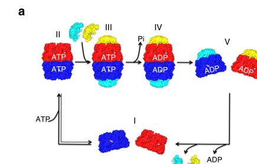

## Question

# Gene Research for Functional Annotation

## ⚠️ CRITICAL: Gene/Protein Identification Context

**BEFORE YOU BEGIN RESEARCH:** You MUST verify you are researching the CORRECT gene/protein. Gene symbols can be ambiguous, especially for less well-characterized genes from non-model organisms.

### Target Gene/Protein Identity (from UniProt):
- **UniProt Accession:** P10809
- **Protein Description:** RecName: Full=60 kDa heat shock protein, mitochondrial; EC=5.6.1.7 {ECO:0000305}; AltName: Full=60 kDa chaperonin; AltName: Full=Chaperonin 60; Short=CPN60; AltName: Full=Heat shock protein 60; Short=HSP-60; Short=Hsp60; AltName: Full=Heat shock protein family D member 1; AltName: Full=HuCHA60; AltName: Full=Mitochondrial matrix protein P1; AltName: Full=P60 lymphocyte protein; Flags: Precursor;
- **Gene Information:** Name=HSPD1; Synonyms=HSP60;
- **Organism (full):** Homo sapiens (Human).
- **Protein Family:** Belongs to the chaperonin (HSP60) family. .
- **Key Domains:** Chaperonin_Cpn60_CS. (IPR018370); Cpn60/GroEL. (IPR001844); Cpn60/GroEL/TCP-1. (IPR002423); GroEL-like_apical_dom_sf. (IPR027409); GROEL-like_equatorial_sf. (IPR027413)

### MANDATORY VERIFICATION STEPS:

1. **Check if the gene symbol "HSPD1" matches the protein description above**
2. **Verify the organism is correct:** Homo sapiens (Human).
3. **Check if protein family/domains align with what you find in literature**
4. **If you find literature for a DIFFERENT gene with the same or similar symbol, STOP**

### If Gene Symbol is Ambiguous or You Cannot Find Relevant Literature:

**DO NOT PROCEED WITH RESEARCH ON A DIFFERENT GENE.** Instead:
- State clearly: "The gene symbol 'HSPD1' is ambiguous or literature is limited for this specific protein"
- Explain what you found (e.g., "Found extensive literature on a different gene with the same symbol in a different organism")
- Describe the protein based ONLY on the UniProt information provided above
- Suggest that the protein function can be inferred from domain/family information

### Research Target:

Please provide a comprehensive research report on the gene **HSPD1** (gene ID: HSPD1, UniProt: P10809) in human.

The research report should be a detailed narrative explaining the function, biological processes, and localization of the gene product. Citations should be given for all claims.

You should prioritize authoritative reviews and primary scientific literature when conducting research. You can supplement
this with annotations you find in gene/protein databases, but these can be outdated or inaccurate.

We are specifically interested in the primary function of the gene - for enzymes, what reaction is catalyzed, and what is the substrate specificity? For transporters, what is the substrate? For structural proteins or adapters, what is the broader structural role? For signaling molecules, what is the role in the pathway.

We are interested in where in or outside the cell the gene product carries out its function.

We are also interested in the signaling or biochemical pathways in which the gene functions. We are less interested in broad pleiotropic effects, except where these elucidate the precise role.

Include evidence where possible. We are interested in both experimental evidence as well as inference from structure, evolution, or bioinformatic analysis. Precise studies should be prioritized over high-throughput, where available.

## Output

Question: You are an expert researcher providing comprehensive, well-cited information.

Provide detailed information focusing on:
1. Key concepts and definitions with current understanding
2. Recent developments and latest research (prioritize 2023-2024 sources)
3. Current applications and real-world implementations
4. Expert opinions and analysis from authoritative sources
5. Relevant statistics and data from recent studies

Format as a comprehensive research report with proper citations. Include URLs and publication dates where available.
Always prioritize recent, authoritative sources and provide specific citations for all major claims.

# Gene Research for Functional Annotation

## ⚠️ CRITICAL: Gene/Protein Identification Context

**BEFORE YOU BEGIN RESEARCH:** You MUST verify you are researching the CORRECT gene/protein. Gene symbols can be ambiguous, especially for less well-characterized genes from non-model organisms.

### Target Gene/Protein Identity (from UniProt):
- **UniProt Accession:** P10809
- **Protein Description:** RecName: Full=60 kDa heat shock protein, mitochondrial; EC=5.6.1.7 {ECO:0000305}; AltName: Full=60 kDa chaperonin; AltName: Full=Chaperonin 60; Short=CPN60; AltName: Full=Heat shock protein 60; Short=HSP-60; Short=Hsp60; AltName: Full=Heat shock protein family D member 1; AltName: Full=HuCHA60; AltName: Full=Mitochondrial matrix protein P1; AltName: Full=P60 lymphocyte protein; Flags: Precursor;
- **Gene Information:** Name=HSPD1; Synonyms=HSP60;
- **Organism (full):** Homo sapiens (Human).
- **Protein Family:** Belongs to the chaperonin (HSP60) family. .
- **Key Domains:** Chaperonin_Cpn60_CS. (IPR018370); Cpn60/GroEL. (IPR001844); Cpn60/GroEL/TCP-1. (IPR002423); GroEL-like_apical_dom_sf. (IPR027409); GROEL-like_equatorial_sf. (IPR027413)

### MANDATORY VERIFICATION STEPS:

1. **Check if the gene symbol "HSPD1" matches the protein description above**
2. **Verify the organism is correct:** Homo sapiens (Human).
3. **Check if protein family/domains align with what you find in literature**
4. **If you find literature for a DIFFERENT gene with the same or similar symbol, STOP**

### If Gene Symbol is Ambiguous or You Cannot Find Relevant Literature:

**DO NOT PROCEED WITH RESEARCH ON A DIFFERENT GENE.** Instead:
- State clearly: "The gene symbol 'HSPD1' is ambiguous or literature is limited for this specific protein"
- Explain what you found (e.g., "Found extensive literature on a different gene with the same symbol in a different organism")
- Describe the protein based ONLY on the UniProt information provided above
- Suggest that the protein function can be inferred from domain/family information

### Research Target:

Please provide a comprehensive research report on the gene **HSPD1** (gene ID: HSPD1, UniProt: P10809) in human.

The research report should be a detailed narrative explaining the function, biological processes, and localization of the gene product. Citations should be given for all claims.

You should prioritize authoritative reviews and primary scientific literature when conducting research. You can supplement
this with annotations you find in gene/protein databases, but these can be outdated or inaccurate.

We are specifically interested in the primary function of the gene - for enzymes, what reaction is catalyzed, and what is the substrate specificity? For transporters, what is the substrate? For structural proteins or adapters, what is the broader structural role? For signaling molecules, what is the role in the pathway.

We are interested in where in or outside the cell the gene product carries out its function.

We are also interested in the signaling or biochemical pathways in which the gene functions. We are less interested in broad pleiotropic effects, except where these elucidate the precise role.

Include evidence where possible. We are interested in both experimental evidence as well as inference from structure, evolution, or bioinformatic analysis. Precise studies should be prioritized over high-throughput, where available.

# Human HSPD1 (UniProt P10809): Functional-Annotation Research Report

## Executive summary

**Identity is verified.** The target is the human nuclear gene **HSPD1** (*Homo sapiens*), encoding mitochondrial 60-kDa heat-shock protein **HSP60**, also called chaperonin 60 or Cpn60. This is fully consistent with UniProt **P10809**, the supplied precursor annotation, and membership in the GroEL/HSP60 group-I chaperonin family. The literature directly identifies HSPD1 as the gene encoding human mitochondrial HSP60; no similarly named protein from another organism was used. [UniProt P10809](https://www.uniprot.org/uniprotkb/P10809/entry) (rodriguez2020complexdestabilizationin pages 1-2)

HSPD1’s primary function is **ATP-dependent folding of non-native proteins in the mitochondrial matrix**, in cooperation with the co-chaperonin HSP10/HSPE1. It is therefore best understood as a protein-folding ATPase rather than an enzyme with one small-molecule substrate. Its clients are incompletely catalogued and are recognized principally by their non-native conformations and exposed hydrophobic surfaces. Directly supported clients include the mitochondrial ATP-synthase F1 β-subunit and malate dehydrogenase. Human HSP60 forms active single-ring HSP60₇–HSP10₇ and double-ring HSP60₁₄–(HSP10₇)₂ folding chambers (gomezllorente2020structuralbasisfor pages 1-2, wang2019mitchap60andhereditary pages 1-2).

The most firmly established clinical consequences are rare inherited chaperonopathies: dominant **spastic paraplegia 13 (SPG13)** and recessive **hypomyelinating leukodystrophy 4/MitCHAP-60 disease**. HSPD1 sequencing is clinically relevant to genetic diagnosis, but HSP60-directed drugs and circulating/tissue biomarkers remain investigational; the retrieved trial search found no relevant interventional HSPD1/HSP60 study.

| Topic | Current annotation | Best evidence | Confidence/caveat |
|---|---|---|---|
| Identity and aliases | Human **HSPD1** encodes mitochondrial 60-kDa heat-shock protein **HSP60**, also called **Cpn60/chaperonin 60**. This matches **UniProt P10809** and the GroEL-related group-I chaperonin family. | Human-focused literature directly identifies HSPD1 as the nuclear gene encoding mitochondrial HSP60 ([Rodriguez et al., 2020](https://doi.org/10.3389/fmolb.2020.00159)) (rodriguez2020complexdestabilizationin pages 1-2). | **High.** No conflicting gene or organism was used. The accession comes from the supplied UniProt record; literature independently confirms the gene–protein identity. |
| Location and import | HSP60 is synthesized in the cytosol as a precursor with an N-terminal mitochondrial targeting sequence, imported into mitochondria, and proteolytically matured. Its established functional site is the **mitochondrial matrix**. | Import and targeting-sequence cleavage are documented in the literature summarized by Rodriguez et al. (2020); structural work directly assigns folding activity to mitochondrial-matrix proteins ([Gomez-Llorente et al., 2020](https://doi.org/10.1038/s41467-020-15698-8)) (rodriguez2020complexdestabilizationin pages 1-2, gomezllorente2020structuralbasisfor pages 1-2). | **High** for import and matrix function. Cytosolic, cell-surface, vesicular, and extracellular HSP60 has also been reported, but its abundance, trafficking, oligomeric state, and functions outside mitochondria remain less certain (rodriguez2020complexdestabilizationin pages 3-4). |
| Structural domains | Mature HSP60 contains an **equatorial ATP-binding domain** at residues **1–137 and 411–526**, an **intermediate hinge domain** at **138–191 and 375–411**, and an **apical client/HSP10-binding domain** at **192–374**. | Near-atomic human HSP60–HSP10 structures resolved these domains and showed HSP10 mobile-loop contacts with helices H and I in the apical domain ([Gomez-Llorente et al., 2020](https://doi.org/10.1038/s41467-020-15698-8)) (gomezllorente2020structuralbasisfor pages 4-5). | **High** for the mature recombinant protein examined structurally. Residue numbers differ from full-precursor numbering because the mitochondrial targeting peptide is removed. |
| Core ATP-dependent reaction | HSP60 is an **ATP-dependent protein-folding chaperonin/ATPase**. It captures non-native polypeptides, encloses them in a protected cavity, uses ATP binding and hydrolysis to drive conformational changes, and releases ADP, HSP10, and folded or folding-competent client. Its supplied EC assignment is **5.6.1.7**. | Human structural intermediates establish nucleotide-coupled transitions, while biochemical assays show ATP- and HSP10-dependent recovery of client activity ([Gomez-Llorente et al., 2020](https://doi.org/10.1038/s41467-020-15698-8); [Wang et al., 2019](https://doi.org/10.1038/s41598-019-48762-5)) (gomezllorente2020structuralbasisfor pages 1-2, wang2019mitchap60andhereditary pages 1-2, wang2019mitchap60andhereditary pages 10-11). | **High.** ATP hydrolysis powers conformational work on diverse protein clients; HSP60 does not chemically modify a narrowly defined small-molecule substrate. |
| HSP10 partnership and stoichiometry | HSP60 works with co-chaperonin **HSP10/HSPE1**. Active assemblies include a capped single ring, **HSP60₇–HSP10₇**, and a double-ring football, **HSP60₁₄–(HSP10₇)₂**. | Cryo-EM and crystallography resolved ADP-bound half-football and ADP- or ADP·BeF₃-bound football states at **3.83, 3.08, and 3.7 Å**, respectively. Footballs measured approximately **244–247 Å** high and **142 Å** wide; obligate single- and double-ring variants were active ([Gomez-Llorente et al., 2020](https://doi.org/10.1038/s41467-020-15698-8)) (gomezllorente2020structuralbasisfor pages 2-4, gomezllorente2020structuralbasisfor pages 1-2, gomezllorente2020structuralbasisfor media d7922be4). | **High.** Assembly depends on nucleotide and protein concentration. Unlike bacterial GroEL, human mitochondrial HSP60 lacks equivalent negative inter-ring ATP-binding cooperativity and can productively use both ring states. |
| Substrate specificity and clients | HSP60 recognizes **non-native proteins with exposed hydrophobic surfaces**, making its specificity conformational rather than sequence-exclusive. Strong client evidence includes mitochondrial **ATP synthase F1 β-subunit**; **malate dehydrogenase** is a standard putative mitochondrial client and direct refolding substrate. | ATP synthase β co-immunoprecipitated with HSP60 and was refolded into an ATPase-active α₃β₃ assembly. Disease variants retained approximately **40%** for V72I and **20%** for D3G of wild-type β-subunit-refolding activity; corresponding α-lactalbumin results were about **35%** and **12%** ([Wang et al., 2019](https://doi.org/10.1038/s41598-019-48762-5)) (wang2019mitchap60andhereditary pages 1-2, wang2019mitchap60andhereditary pages 10-11). | **Moderate–high.** Direct biochemical evidence supports these clients, but no exhaustive human-matrix client catalog or strict recognition motif is established. α-Lactalbumin is an assay substrate, not a physiological mitochondrial client. |
| Disease variants and numbering | Pathogenic HSPD1 variants cause **autosomal-dominant SPG13** and **autosomal-recessive hypomyelinating leukodystrophy 4/MitCHAP-60**. Full-precursor notation commonly gives **p.Val98Ile** and **p.Asp29Gly**, whereas mature-protein studies use **V72I** and **D3G**. | Human genetics and biochemical studies link these variants to defective folding and altered nucleotide-coupled assembly. Open Targets reports five evidence records for each principal HSPD1-associated disease term ([Wang et al., 2019](https://doi.org/10.1038/s41598-019-48762-5); [Chen et al., 2022](https://doi.org/10.1038/s41598-022-21993-9)) (OpenTargets Search: -HSPD1, wang2019mitchap60andhereditary pages 1-2, chen2022hereditaryspasticparaplegia pages 7-8). | **High** for disease association. **Numbering caveat:** D29G/D3G and V98I/V72I describe the same substitutions using precursor versus mature numbering. V72I can increase ATPase activity yet reduce productive folding, showing that ATP turnover alone does not measure chaperonin efficacy. |
| Pathways and stress response | HSPD1 is a mitochondrial-proteostasis effector associated with mitochondrial unfolded-protein response and integrated-stress-response programs involving **ATF4, ATF5, and CHOP**. Its primary role is to increase matrix folding capacity rather than act as the upstream stress sensor. | A 2024 review integrates mammalian UPRmt evidence and HSP60 regulation ([Zhang et al., 2024](https://doi.org/10.1038/s41419-024-07049-y)); human stress-response research has used genome-scale perturbation approaches to dissect mtISR regulators (mayer2024geneticregulationofa pages 1-7). Extra-mitochondrial studies also implicate HSP60 in IKK/NF-κB, ERK/MAPK, and TLR4 signaling (rodriguez2020complexdestabilizationin pages 3-4). | **High** for matrix proteostasis, **moderate** for exact human UPRmt transcriptional wiring, and lower for proposed extracellular signaling, where localization and context require careful validation. |
| Applications and clinical status | Current uses are chiefly **research, molecular genetic diagnosis, experimental biomarker evaluation, and preclinical target discovery**. HSP60 modulators have been investigated for cancer, inflammatory disease, and autoimmunity; stabilization strategies are conceptually relevant to loss-of-function chaperonopathies. | Reported chemical modulators generally have **low-micromolar to millimolar** potency ([Meng et al., 2018](https://doi.org/10.3389/fmolb.2018.00035)) (meng2018towarddevelopingchemical pages 1-2). The retrieved clinical-trial search identified no relevant interventional HSPD1/HSP60 trial; disease-target resources support genetic associations rather than an approved drug mechanism (OpenTargets Search: -HSPD1). | **Low–moderate translational maturity.** No HSPD1-directed drug, companion diagnostic, or HSP60 biomarker identified here is clinically validated or approved. Broad inhibition poses safety concerns because mitochondrial HSP60 is essential for proteostasis. |

*Table: Compact functional-annotation evidence for human HSPD1/UniProt P10809, separating direct structural, biochemical, and genetic findings from inference. It highlights precursor-versus-mature variant numbering and the absence of validated HSPD1-directed clinical therapies.*

## 1. Identity verification and nomenclature

The supplied gene symbol, organism, and protein description are mutually consistent:

- **Gene:** HSPD1, approved name *heat shock protein family D (Hsp60) member 1*; human Ensembl target ENSG00000144381 is likewise identified by Open Targets (OpenTargets Search: -HSPD1).
- **Protein:** mitochondrial 60-kDa heat-shock protein/HSP60/Cpn60, UniProt **P10809**.
- **Organism:** *Homo sapiens*.
- **Family:** group-I chaperonin, evolutionarily related to bacterial GroEL; human HSP60 shares approximately **51% amino-acid identity** with *E. coli* GroEL (gomezllorente2020structuralbasisfor pages 1-2).
- **Domains:** the experimentally resolved apical, intermediate, and equatorial architecture aligns with the supplied InterPro Cpn60/GroEL and GroEL-like domain assignments (gomezllorente2020structuralbasisfor pages 4-5).

A nomenclature issue is important in interpreting pathogenic variants. Human HSP60 is synthesized with an N-terminal mitochondrial targeting peptide that is removed after import. Consequently, papers using full precursor numbering refer to **p.Asp29Gly and p.Val98Ile**, whereas biochemical studies of the mature chain frequently use **D3G and V72I**, respectively. These are not separate variants (wang2019mitchap60andhereditary pages 1-2, chen2022hereditaryspasticparaplegia pages 7-8).

## 2. Cellular localization and biogenesis

HSPD1 is nuclear encoded and translated on cytosolic ribosomes as a precursor. Its N-terminal targeting sequence directs import into mitochondria and is cleaved during translocation. The mature chaperonin operates predominantly in the **mitochondrial matrix**, where many nuclear-encoded proteins arrive in unfolded or incompletely folded states and require productive folding after import (rodriguez2020complexdestabilizationin pages 1-2, gomezllorente2020structuralbasisfor pages 1-2).

A smaller pool has been reported in the cytosol, nucleus, cell surface, extracellular vesicles, extracellular space, and blood. Proposed extra-mitochondrial activities include modulation of IKK/NF-κB, ERK/MAPK and TLR4 signaling and immune recognition. These observations should not be conflated with the primary annotation: abundance is generally low, trafficking mechanisms are incompletely defined, and it remains uncertain whether extra-mitochondrial HSP60 functions as monomers or canonical oligomeric folding machines (rodriguez2020complexdestabilizationin pages 3-4). Thus, **mitochondrial-matrix proteostasis is the high-confidence functional location**; extracellular signaling is context-dependent and less mechanistically secure.

## 3. Molecular architecture

Structures of mature human HSP60 resolve three domains:

1. **Equatorial domain, residues 1–137 and 411–526:** binds ATP/ADP, supplies much of the stable intra-ring interface, and mediates allosteric communication.
2. **Intermediate hinge domain, residues 138–191 and 375–411:** couples nucleotide state to movement of the apical domain.
3. **Apical domain, residues 192–374:** binds non-native client proteins and the HSP10 mobile loop; it forms the entrance and much of the wall of the folding chamber (gomezllorente2020structuralbasisfor pages 4-5).

HSP10 forms a heptameric dome. Its approximately 20-residue mobile loops contact helices H and I in the HSP60 apical domains, closing the chamber over the client. The flexible HSP60 C-terminal tails project toward the cavity and may influence the internal folding environment (gomezllorente2020structuralbasisfor pages 5-6, gomezllorente2020structuralbasisfor pages 4-5).

The strongest human structural study resolved three reaction-cycle states: an ADP·BeF₃ ATP-ground-state mimic HSP60₁₄–(HSP10₇)₂ football at **3.7 Å**, an ADP football at **3.08 Å**, and an ADP HSP60₇–HSP10₇ half-football at **3.83 Å**. The double-ring particles were about **244–247 Å high and 142 Å wide**; the single-ring complex was also approximately 142 Å wide (gomezllorente2020structuralbasisfor pages 2-4, gomezllorente2020structuralbasisfor media d7922be4). In the cryo-EM sample, football and half-football particles constituted approximately **70% and 30%**, respectively (gomezllorente2020structuralbasisfor pages 1-2).

## 4. Primary biochemical function and reaction

### 4.1 What reaction does HSP60 catalyze?

The supplied EC assignment, **EC 5.6.1.7**, describes an ATP-dependent protein-folding chaperone. A concise functional reaction is:

**non-native client protein + ATP + H₂O → folded/folding-competent client protein + ADP + phosphate**, mediated by HSP60–HSP10 conformational cycling.

This is not covalent catalysis of the client. ATP hydrolysis drives reversible changes in chamber assembly, client encapsulation, and release. HSP60 lowers kinetic barriers to productive folding and suppresses aggregation by isolating a client in a protected nanocage (rodriguez2020complexdestabilizationin pages 1-2, gomezllorente2020structuralbasisfor pages 1-2).

### 4.2 Mechanistic cycle

Current evidence supports the following cycle:

1. A non-native protein displaying exposed hydrophobic surfaces binds principally to HSP60’s apical domains.
2. ATP binding promotes oligomerization and rearranges the apical/intermediate domains.
3. HSP10 binds as a heptameric lid, encapsulating the client and converting the chamber from a hydrophobic capture surface to an environment favorable for folding.
4. ATP hydrolysis produces the ADP state. Structural weakening of the ring–ring interface permits a football complex to separate into capped half-footballs.
5. ADP, HSP10, and the folded or folding-competent client are released, allowing another cycle (rodriguez2020complexdestabilizationin pages 2-3, gomezllorente2020structuralbasisfor pages 4-5).

Unlike *E. coli* GroEL, human mitochondrial HSP60 does not show the same negative ATP-binding cooperativity between rings. Both single- and double-ring variants are active, and a forced single-ring variant complemented bacterial chaperonin deficiency about as efficiently as wild-type human HSP60. Thus, the single ring is not merely a breakdown product; it is a productive intermediate (gomezllorente2020structuralbasisfor pages 1-2).

## 5. Substrate specificity and physiological clients

HSP60 has **broad conformational specificity**, not a narrow sequence motif or one chemically defined substrate. It preferentially recognizes exposed hydrophobic patches characteristic of incompletely folded or stress-denatured proteins. Its physiological client set is expected to include imported and stress-damaged matrix proteins, particularly proteins needed for mitochondrial metabolism, but a definitive human client census is not yet available (rodriguez2020complexdestabilizationin pages 1-2).

The most informative precise substrate evidence concerns mitochondrial ATP synthase:

- The F1 **β-subunit** co-immunoprecipitates with HSP60, making it a plausible physiological client.
- In vitro, wild-type HSP60/HSP10 refolded denatured β-subunit sufficiently for assembly with native α-subunit into an ATPase-active α₃β₃ complex.
- Disease variants showed major deficits: V72I retained about **40%** and D3G about **20%** of wild-type β-subunit-refolding activity (wang2019mitchap60andhereditary pages 1-2, wang2019mitchap60andhereditary pages 10-11).

Malate dehydrogenase is a widely used putative mitochondrial client and was directly refolded in ATP/HSP10-dependent assays. α-Lactalbumin is also used experimentally, but it should be regarded as a generic assay substrate rather than a physiological matrix client. In Wang et al., V72I and D3G retained approximately **35% and 12%**, respectively, of wild-type α-lactalbumin-refolding activity; DLS showed nucleotide-induced mutant-complex contraction/dissociation from roughly **16 nm to 9 nm** (wang2019mitchap60andhereditary pages 10-11, wang2019mitchap60andhereditary pages 9-10).

## 6. Biological processes and pathways

### 6.1 Mitochondrial protein import and proteostasis

HSPD1 acts downstream of mitochondrial import: precursor proteins cross mitochondrial membranes and are then folded into active conformations with assistance from matrix chaperones, including the HSP60–HSP10 system. This function supports respiratory-chain and ATP-production pathways indirectly by ensuring that their constituent proteins achieve stable, active structures (rodriguez2020complexdestabilizationin pages 1-2, wang2019mitchap60andhereditary pages 1-2).

### 6.2 Mitochondrial stress responses

HSPD1 is commonly treated as a core **mitochondrial unfolded-protein response (UPRmt)/mitochondrial integrated stress response** effector. Matrix proteotoxic stress activates cytosolic transcriptional programs involving ATF4, ATF5, and CHOP, increasing chaperone and protease capacity. HSPD1 is therefore primarily part of the response’s folding machinery, not established as its initiating sensor. Human pathway architecture remains less linear and less completely defined than the canonical ATFS-1 pathway in *C. elegans*; recent human work has emphasized DELE1-dependent stress relay and genome-wide identification of mtISR regulators (mayer2024geneticregulationofa pages 1-7).

Two 2024 reviews—Singh et al., published May 2024 ([DOI](https://doi.org/10.3390/ijms25105483)), and Zhang et al., published September 2024 ([DOI](https://doi.org/10.1038/s41419-024-07049-y))—place HSP60 among the proteostasis effectors induced in mammalian mitochondrial stress and emphasize its emerging importance in cancer adaptation. Their translational conclusions are mainly synthesis and hypothesis generation, rather than evidence of an approved HSPD1 therapy.

### 6.3 Consequences of loss of folding capacity

Failure of HSP60 activity is expected to produce aggregation or degradation of matrix clients, impaired respiratory-complex and ATP-synthase function, energetic stress, and secondary activation of cell-death or stress pathways. High-energy tissues—long corticospinal axons, myelinating cells, muscle, and heart—are particularly vulnerable. This model is supported by variant refolding defects and loss-of-function animal phenotypes but should not be interpreted as proof that every reported HSPD1-associated phenotype results exclusively from ATP-synthase β-subunit misfolding (rodriguez2020complexdestabilizationin pages 3-4, wang2019mitchap60andhereditary pages 1-2).

## 7. Human genetics and disease mechanism

### SPG13

Dominant HSPD1-associated hereditary spastic paraplegia presents principally with progressive lower-extremity spasticity, weakness, gait disturbance, and corticospinal-tract degeneration. The classic substitution is full-precursor **p.Val98Ile**, corresponding to mature-chain **V72I** (rodriguez2020complexdestabilizationin pages 3-4, wang2019mitchap60andhereditary pages 1-2).

Mechanistically, V72I lies near the equatorial nucleotide-binding region and uncouples ATP turnover from productive folding. Earlier experiments found nucleotide-dependent oligomer destabilization and reduced client folding. Chen et al. subsequently reported that V72I could be **more structurally stable and have greater ATPase activity** than wild type while remaining less efficient at MDH folding and failing bacterial complementation at 42 °C. These apparently divergent findings reinforce an important conclusion: neither oligomer abundance nor high ATPase activity alone guarantees productive chaperone function; correctly timed allosteric dynamics are essential. Chen et al., published October 2022: [DOI](https://doi.org/10.1038/s41598-022-21993-9) (chen2022hereditaryspasticparaplegia pages 7-8).

### Hypomyelinating leukodystrophy 4/MitCHAP-60

Recessive full-precursor **p.Asp29Gly**, mature **D3G**, causes a severe early-onset hypomyelinating leukodystrophy, also termed MitCHAP-60 disease or a Pelizaeus–Merzbacher-like disorder. Reported manifestations include developmental delay, nystagmus, weakness, spasticity, diffuse hypomyelination and, in severe cases, death within the first two decades. D3G produces more severe biochemical loss of folding than V72I in several assays and destabilizes nucleotide-bound complexes (wang2019mitchap60andhereditary pages 1-2, wang2019mitchap60andhereditary pages 9-10).

Curated Open Targets results independently identify HSPD1 as the sole associated target returned for hereditary spastic paraplegia 13 and hypomyelinating leukodystrophy 4, with five evidence records for each queried disease entry. These counts describe database evidence items, not prevalence or patient numbers (OpenTargets Search: -HSPD1).

## 8. Recent developments, 2023–2024

Recent literature has primarily advanced the **systems context** of HSPD1 rather than overturning its core molecular annotation:

- Human mtISR studies have used genome-wide perturbation screens to identify factors upstream of mitochondrial stress signaling and protein aggregation. This positions HSPD1 as a matrix proteostasis effector within a broader DELE1/eIF2α/ATF4-centered network, while underscoring that the precise human UPRmt architecture remains under active study (mayer2024geneticregulationofa pages 1-7).
- 2024 reviews synthesized links between HSP60/UPRmt activity and tumor growth, metastasis, metabolic adaptation, and treatment resistance. However, many cancer associations derive from expression correlations, knockdown experiments, or model systems, not from validated HSPD1-dependent clinical stratification.
- Current authoritative interpretation therefore remains conservative: HSPD1’s **core annotation—matrix chaperonin ATPase—is definitive**, whereas many extracellular signaling, cancer-biomarker, and therapeutic claims are context-specific and incompletely validated.

## 9. Applications and real-world implementation

### Established application

The clearest real-world application is **molecular diagnosis**: HSPD1 should be included in sequencing and variant interpretation for unexplained pure hereditary spastic paraplegia and severe early-onset hypomyelinating leukodystrophy/Pelizaeus–Merzbacher-like presentations. Functional interpretation must account for precursor-versus-mature numbering and should assess productive refolding, not ATPase activity alone.

### Biomarkers

HSP60 abundance has been investigated in tissue, plasma, and extracellular vesicles in cancer, inflammation, atherosclerosis, epilepsy, and infection. These studies demonstrate detectability and disease association but not adequate disease specificity, standardized thresholds, or prospective clinical utility. HSP60 is a ubiquitous stress protein, so an elevation can reflect generalized mitochondrial or cellular injury rather than a disease-specific mechanism (meng2018towarddevelopingchemical pages 1-2, rodriguez2020complexdestabilizationin pages 3-4).

### Therapeutic targeting

Natural and synthetic inhibitors—including mizoribine, epolactaene-related compounds, myrtucommulone, stephacidin/avrainvillamide analogues, carboranyl compounds, and gold porphyrins—have been explored. Reported potency generally spans **low-micromolar to millimolar concentrations**, and proposed uses include cancer, inflammation, and autoimmunity. These are preclinical chemical probes or leads, not approved HSPD1 drugs (meng2018towarddevelopingchemical pages 1-2).

Therapeutic strategy is intrinsically difficult. Broad inhibition may damage normal cells because HSP60 is essential for mitochondrial proteostasis; conversely, inherited loss-of-function disorders would logically require restoration or stabilization rather than inhibition. Selectivity over bacterial GroEL and delivery to the mitochondrial matrix are additional pharmacological challenges. No HSPD1-directed drug, companion diagnostic, or validated HSP60 biomarker was identified as approved, and the retrieved clinical-trial search yielded no relevant interventional HSPD1/HSP60 trial.

## 10. Evidence-weighted conclusions

1. **Definitive primary function:** HSPD1/P10809 is the human mitochondrial-matrix group-I chaperonin HSP60. With HSP10, it uses ATP binding and hydrolysis to encapsulate and fold non-native matrix proteins.
2. **Substrate specificity:** recognition is based mainly on non-native conformation and exposed hydrophobic surfaces, not a unique sequence. ATP-synthase β is the strongest specific physiological-client candidate in the retrieved evidence; MDH is a directly tested putative client.
3. **Structural role:** HSP60 creates a transient folding nanocage. Active HSP60₇–HSP10₇ and HSP60₁₄–(HSP10₇)₂ assemblies coexist, distinguishing the human mitochondrial cycle from the canonical GroEL model.
4. **Functional location:** the mitochondrial matrix is established. Extra-mitochondrial pools and signaling effects are plausible but less completely understood.
5. **Pathway role:** HSPD1 is an effector of mitochondrial proteostasis and stress adaptation, downstream of protein import and within UPRmt/mtISR-associated transcriptional programs.
6. **Clinical relevance:** causal human genetics and functional assays strongly establish SPG13 and hypomyelinating leukodystrophy 4/MitCHAP-60. Diagnostic sequencing is currently more mature than biomarker or therapeutic applications.
7. **Research gap:** the major unresolved issue is a quantitative, physiological map of human HSP60 clients and how client-specific folding failure produces selective neuronal and myelin pathology.

References

1. (rodriguez2020complexdestabilizationin pages 1-2): Alejandro Rodriguez, Daniel Von Salzen, Bianka A. Holguin, and Ricardo A. Bernal. Complex destabilization in the mitochondrial chaperonin hsp60 leads to disease. Frontiers in Molecular Biosciences, Jul 2020. URL: https://doi.org/10.3389/fmolb.2020.00159, doi:10.3389/fmolb.2020.00159. This article has 35 citations.

2. (gomezllorente2020structuralbasisfor pages 1-2): Yacob Gomez-Llorente, Fady Jebara, Malay Patra, Radhika Malik, Shahar Nisemblat, Orna Chomsky-Hecht, Avital Parnas, Abdussalam Azem, Joel A. Hirsch, and Iban Ubarretxena-Belandia. Structural basis for active single and double ring complexes in human mitochondrial hsp60-hsp10 chaperonin. Nature Communications, Apr 2020. URL: https://doi.org/10.1038/s41467-020-15698-8, doi:10.1038/s41467-020-15698-8. This article has 93 citations and is from a highest quality peer-reviewed journal.

3. (wang2019mitchap60andhereditary pages 1-2): Jinliang Wang, Adrian S. Enriquez, Jihui Li, Alejandro Rodriguez, Bianka Holguin, Daniel Von Salzen, Jay M. Bhatt, and Ricardo A. Bernal. Mitchap-60 and hereditary spastic paraplegia spg-13 arise from an inactive hsp60 chaperonin that fails to fold the atp synthase β-subunit. Scientific Reports, Aug 2019. URL: https://doi.org/10.1038/s41598-019-48762-5, doi:10.1038/s41598-019-48762-5. This article has 27 citations and is from a peer-reviewed journal.

4. (rodriguez2020complexdestabilizationin pages 3-4): Alejandro Rodriguez, Daniel Von Salzen, Bianka A. Holguin, and Ricardo A. Bernal. Complex destabilization in the mitochondrial chaperonin hsp60 leads to disease. Frontiers in Molecular Biosciences, Jul 2020. URL: https://doi.org/10.3389/fmolb.2020.00159, doi:10.3389/fmolb.2020.00159. This article has 35 citations.

5. (gomezllorente2020structuralbasisfor pages 4-5): Yacob Gomez-Llorente, Fady Jebara, Malay Patra, Radhika Malik, Shahar Nisemblat, Orna Chomsky-Hecht, Avital Parnas, Abdussalam Azem, Joel A. Hirsch, and Iban Ubarretxena-Belandia. Structural basis for active single and double ring complexes in human mitochondrial hsp60-hsp10 chaperonin. Nature Communications, Apr 2020. URL: https://doi.org/10.1038/s41467-020-15698-8, doi:10.1038/s41467-020-15698-8. This article has 93 citations and is from a highest quality peer-reviewed journal.

6. (wang2019mitchap60andhereditary pages 10-11): Jinliang Wang, Adrian S. Enriquez, Jihui Li, Alejandro Rodriguez, Bianka Holguin, Daniel Von Salzen, Jay M. Bhatt, and Ricardo A. Bernal. Mitchap-60 and hereditary spastic paraplegia spg-13 arise from an inactive hsp60 chaperonin that fails to fold the atp synthase β-subunit. Scientific Reports, Aug 2019. URL: https://doi.org/10.1038/s41598-019-48762-5, doi:10.1038/s41598-019-48762-5. This article has 27 citations and is from a peer-reviewed journal.

7. (gomezllorente2020structuralbasisfor pages 2-4): Yacob Gomez-Llorente, Fady Jebara, Malay Patra, Radhika Malik, Shahar Nisemblat, Orna Chomsky-Hecht, Avital Parnas, Abdussalam Azem, Joel A. Hirsch, and Iban Ubarretxena-Belandia. Structural basis for active single and double ring complexes in human mitochondrial hsp60-hsp10 chaperonin. Nature Communications, Apr 2020. URL: https://doi.org/10.1038/s41467-020-15698-8, doi:10.1038/s41467-020-15698-8. This article has 93 citations and is from a highest quality peer-reviewed journal.

8. (gomezllorente2020structuralbasisfor media d7922be4): Yacob Gomez-Llorente, Fady Jebara, Malay Patra, Radhika Malik, Shahar Nisemblat, Orna Chomsky-Hecht, Avital Parnas, Abdussalam Azem, Joel A. Hirsch, and Iban Ubarretxena-Belandia. Structural basis for active single and double ring complexes in human mitochondrial hsp60-hsp10 chaperonin. Nature Communications, Apr 2020. URL: https://doi.org/10.1038/s41467-020-15698-8, doi:10.1038/s41467-020-15698-8. This article has 93 citations and is from a highest quality peer-reviewed journal.

9. (OpenTargets Search: -HSPD1): Open Targets Query (-HSPD1, 5 results). Buniello, A. et al. (2025). Open Targets Platform: facilitating therapeutic hypotheses building in drug discovery. Nucleic Acids Research.

10. (chen2022hereditaryspasticparaplegia pages 7-8): Lingling Chen, Aiza Syed, and Adhitya Balaji. Hereditary spastic paraplegia spg13 mutation increases structural stability and atpase activity of human mitochondrial chaperonin. Scientific Reports, Oct 2022. URL: https://doi.org/10.1038/s41598-022-21993-9, doi:10.1038/s41598-022-21993-9. This article has 12 citations and is from a peer-reviewed journal.

11. (mayer2024geneticregulationofa pages 1-7): EME Mayer. Genetic regulation of the mitochondrial integrated stress response in humans. Unknown journal, 2024.

12. (meng2018towarddevelopingchemical pages 1-2): Qianli Meng, Bingbing X. Li, and Xiangshu Xiao. Toward developing chemical modulators of hsp60 as potential therapeutics. Frontiers in Molecular Biosciences, Apr 2018. URL: https://doi.org/10.3389/fmolb.2018.00035, doi:10.3389/fmolb.2018.00035. This article has 147 citations.

13. (gomezllorente2020structuralbasisfor pages 5-6): Yacob Gomez-Llorente, Fady Jebara, Malay Patra, Radhika Malik, Shahar Nisemblat, Orna Chomsky-Hecht, Avital Parnas, Abdussalam Azem, Joel A. Hirsch, and Iban Ubarretxena-Belandia. Structural basis for active single and double ring complexes in human mitochondrial hsp60-hsp10 chaperonin. Nature Communications, Apr 2020. URL: https://doi.org/10.1038/s41467-020-15698-8, doi:10.1038/s41467-020-15698-8. This article has 93 citations and is from a highest quality peer-reviewed journal.

14. (rodriguez2020complexdestabilizationin pages 2-3): Alejandro Rodriguez, Daniel Von Salzen, Bianka A. Holguin, and Ricardo A. Bernal. Complex destabilization in the mitochondrial chaperonin hsp60 leads to disease. Frontiers in Molecular Biosciences, Jul 2020. URL: https://doi.org/10.3389/fmolb.2020.00159, doi:10.3389/fmolb.2020.00159. This article has 35 citations.

15. (wang2019mitchap60andhereditary pages 9-10): Jinliang Wang, Adrian S. Enriquez, Jihui Li, Alejandro Rodriguez, Bianka Holguin, Daniel Von Salzen, Jay M. Bhatt, and Ricardo A. Bernal. Mitchap-60 and hereditary spastic paraplegia spg-13 arise from an inactive hsp60 chaperonin that fails to fold the atp synthase β-subunit. Scientific Reports, Aug 2019. URL: https://doi.org/10.1038/s41598-019-48762-5, doi:10.1038/s41598-019-48762-5. This article has 27 citations and is from a peer-reviewed journal.

## Artifacts

- [Edison artifact artifact-00](HSPD1-deep-research-falcon_artifacts/artifact-00.md)

## Citations

1. rodriguez2020complexdestabilizationin pages 1-2
2. rodriguez2020complexdestabilizationin pages 3-4
3. gomezllorente2020structuralbasisfor pages 4-5
4. mayer2024geneticregulationofa pages 1-7
5. meng2018towarddevelopingchemical pages 1-2
6. gomezllorente2020structuralbasisfor pages 1-2
7. chen2022hereditaryspasticparaplegia pages 7-8
8. gomezllorente2020structuralbasisfor pages 2-4
9. gomezllorente2020structuralbasisfor pages 5-6
10. rodriguez2020complexdestabilizationin pages 2-3
11. UniProt P10809
12. Rodriguez et al., 2020
13. Gomez-Llorente et al., 2020
14. Wang et al., 2019
15. Chen et al., 2022
16. Zhang et al., 2024
17. Meng et al., 2018
18. DOI
19. https://www.uniprot.org/uniprotkb/P10809/entry
20. https://doi.org/10.3389/fmolb.2020.00159
21. https://doi.org/10.1038/s41467-020-15698-8
22. https://doi.org/10.1038/s41598-019-48762-5
23. https://doi.org/10.1038/s41598-022-21993-9
24. https://doi.org/10.1038/s41419-024-07049-y
25. https://doi.org/10.3389/fmolb.2018.00035
26. https://doi.org/10.3390/ijms25105483
27. https://doi.org/10.3389/fmolb.2020.00159,
28. https://doi.org/10.1038/s41467-020-15698-8,
29. https://doi.org/10.1038/s41598-019-48762-5,
30. https://doi.org/10.1038/s41598-022-21993-9,
31. https://doi.org/10.3389/fmolb.2018.00035,