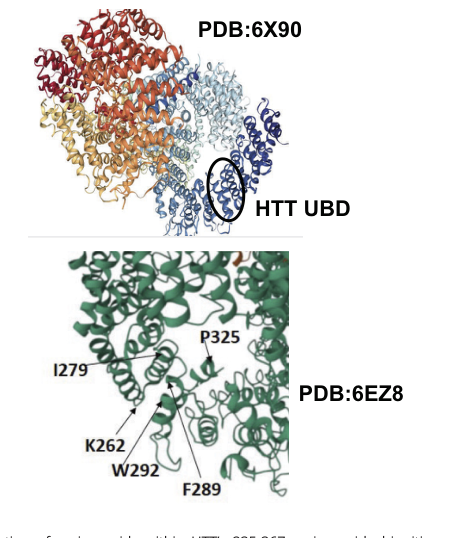

## Question

# Gene Research for Functional Annotation

## ⚠️ CRITICAL: Gene/Protein Identification Context

**BEFORE YOU BEGIN RESEARCH:** You MUST verify you are researching the CORRECT gene/protein. Gene symbols can be ambiguous, especially for less well-characterized genes from non-model organisms.

### Target Gene/Protein Identity (from UniProt):
- **UniProt Accession:** P42858
- **Protein Description:** RecName: Full=Huntingtin; AltName: Full=Huntington disease protein; Short=HD protein; Contains: RecName: Full=Huntingtin, myristoylated N-terminal fragment;
- **Gene Information:** Name=HTT; Synonyms=HD, IT15;
- **Organism (full):** Homo sapiens (Human).
- **Protein Family:** Belongs to the huntingtin family. .
- **Key Domains:** ARM-like. (IPR011989); ARM-type_fold. (IPR016024); Htt_bridge. (IPR048412); Htt_C-HEAT_rpt. (IPR048413); Htt_N_HEAT_rpt-1. (IPR048411)

### MANDATORY VERIFICATION STEPS:

1. **Check if the gene symbol "HTT" matches the protein description above**
2. **Verify the organism is correct:** Homo sapiens (Human).
3. **Check if protein family/domains align with what you find in literature**
4. **If you find literature for a DIFFERENT gene with the same or similar symbol, STOP**

### If Gene Symbol is Ambiguous or You Cannot Find Relevant Literature:

**DO NOT PROCEED WITH RESEARCH ON A DIFFERENT GENE.** Instead:
- State clearly: "The gene symbol 'HTT' is ambiguous or literature is limited for this specific protein"
- Explain what you found (e.g., "Found extensive literature on a different gene with the same symbol in a different organism")
- Describe the protein based ONLY on the UniProt information provided above
- Suggest that the protein function can be inferred from domain/family information

### Research Target:

Please provide a comprehensive research report on the gene **HTT** (gene ID: HTT, UniProt: P42858) in human.

The research report should be a detailed narrative explaining the function, biological processes, and localization of the gene product. Citations should be given for all claims.

You should prioritize authoritative reviews and primary scientific literature when conducting research. You can supplement
this with annotations you find in gene/protein databases, but these can be outdated or inaccurate.

We are specifically interested in the primary function of the gene - for enzymes, what reaction is catalyzed, and what is the substrate specificity? For transporters, what is the substrate? For structural proteins or adapters, what is the broader structural role? For signaling molecules, what is the role in the pathway.

We are interested in where in or outside the cell the gene product carries out its function.

We are also interested in the signaling or biochemical pathways in which the gene functions. We are less interested in broad pleiotropic effects, except where these elucidate the precise role.

Include evidence where possible. We are interested in both experimental evidence as well as inference from structure, evolution, or bioinformatic analysis. Precise studies should be prioritized over high-throughput, where available.

## Output

Question: You are an expert researcher providing comprehensive, well-cited information.

Provide detailed information focusing on:
1. Key concepts and definitions with current understanding
2. Recent developments and latest research (prioritize 2023-2024 sources)
3. Current applications and real-world implementations
4. Expert opinions and analysis from authoritative sources
5. Relevant statistics and data from recent studies

Format as a comprehensive research report with proper citations. Include URLs and publication dates where available.
Always prioritize recent, authoritative sources and provide specific citations for all major claims.

# Gene Research for Functional Annotation

## ⚠️ CRITICAL: Gene/Protein Identification Context

**BEFORE YOU BEGIN RESEARCH:** You MUST verify you are researching the CORRECT gene/protein. Gene symbols can be ambiguous, especially for less well-characterized genes from non-model organisms.

### Target Gene/Protein Identity (from UniProt):
- **UniProt Accession:** P42858
- **Protein Description:** RecName: Full=Huntingtin; AltName: Full=Huntington disease protein; Short=HD protein; Contains: RecName: Full=Huntingtin, myristoylated N-terminal fragment;
- **Gene Information:** Name=HTT; Synonyms=HD, IT15;
- **Organism (full):** Homo sapiens (Human).
- **Protein Family:** Belongs to the huntingtin family. .
- **Key Domains:** ARM-like. (IPR011989); ARM-type_fold. (IPR016024); Htt_bridge. (IPR048412); Htt_C-HEAT_rpt. (IPR048413); Htt_N_HEAT_rpt-1. (IPR048411)

### MANDATORY VERIFICATION STEPS:

1. **Check if the gene symbol "HTT" matches the protein description above**
2. **Verify the organism is correct:** Homo sapiens (Human).
3. **Check if protein family/domains align with what you find in literature**
4. **If you find literature for a DIFFERENT gene with the same or similar symbol, STOP**

### If Gene Symbol is Ambiguous or You Cannot Find Relevant Literature:

**DO NOT PROCEED WITH RESEARCH ON A DIFFERENT GENE.** Instead:
- State clearly: "The gene symbol 'HTT' is ambiguous or literature is limited for this specific protein"
- Explain what you found (e.g., "Found extensive literature on a different gene with the same symbol in a different organism")
- Describe the protein based ONLY on the UniProt information provided above
- Suggest that the protein function can be inferred from domain/family information

### Research Target:

Please provide a comprehensive research report on the gene **HTT** (gene ID: HTT, UniProt: P42858) in human.

The research report should be a detailed narrative explaining the function, biological processes, and localization of the gene product. Citations should be given for all claims.

You should prioritize authoritative reviews and primary scientific literature when conducting research. You can supplement
this with annotations you find in gene/protein databases, but these can be outdated or inaccurate.

We are specifically interested in the primary function of the gene - for enzymes, what reaction is catalyzed, and what is the substrate specificity? For transporters, what is the substrate? For structural proteins or adapters, what is the broader structural role? For signaling molecules, what is the role in the pathway.

We are interested in where in or outside the cell the gene product carries out its function.

We are also interested in the signaling or biochemical pathways in which the gene functions. We are less interested in broad pleiotropic effects, except where these elucidate the precise role.

Include evidence where possible. We are interested in both experimental evidence as well as inference from structure, evolution, or bioinformatic analysis. Precise studies should be prioritized over high-throughput, where available.

## Research Report: Human **HTT** (Huntingtin; UniProt P42858) — Functional Annotation, Mechanisms, Localization, and Translational Context

### 0) Target verification (required disambiguation)
The target gene symbol **HTT** in this report refers specifically to the **human huntingtin gene/protein** (Homo sapiens), located on **chromosome 4p16.3**, encoding a **3,144–amino-acid (~348 kDa)** protein whose defining molecular feature is an **N‑terminal CAG-repeat–encoded polyglutamine (polyQ) tract in exon 1** (pathogenic expansion in Huntington’s disease). These identifiers (genomic locus, size, exon‑1 polyQ, N17 region, HEAT/ARM-like repeat architecture) distinguish HTT/huntingtin from other similarly named proteins or orthologs. (bates2015huntingtondisease pages 4-7, kaushal2026genetherapyfor pages 1-2)

OpenTargets also links **HTT (ENSG00000197386)** to **Huntington disease (MONDO_0007739)** with curated evidence, consistent with the canonical human target identity. (OpenTargets Search: Huntington disease-HTT)

### 1) Key concepts and definitions (current understanding)

#### 1.1 What kind of protein is huntingtin?
Huntingtin (HTT) is best characterized as a **large, multi-domain, non-enzymatic scaffold/adaptor protein**. Structurally it contains **multiple HEAT/ARM-like repeat domains** and a prominent **N-terminal region** containing an **N17 amphipathic helix**, a **polyQ tract**, and a **proline-rich region**; functionally, it interacts with many partners and coordinates intracellular trafficking and homeostatic pathways rather than catalyzing a specific chemical reaction. (tong2024huntington’sdiseasecomplex pages 1-2, krzystek2025navigatingtheneuronal pages 6-9, bates2015huntingtondisease pages 4-7)

#### 1.2 PolyQ expansion and disease vs normal alleles
HTT’s exon-1 CAG repeat is polymorphic in humans. Normal alleles are typically **6–35 CAG repeats**; **≥36** is disease-associated (with **36–39 reduced penetrance** and **≥40 highly penetrant** in many clinical contexts). (bates2015huntingtondisease pages 4-7, vauleon2023quantifyingmutanthuntingtin pages 1-2)

### 2) Functional roles, mechanisms, and subcellular localization (annotation-oriented)

#### 2.1 Selective autophagy/lysosomal targeting via a defined ubiquitin-binding domain (2024 primary evidence)
A major recent advance is direct mechanistic evidence that human HTT includes a **ubiquitin-binding domain (UBD) localized to residues ~235–367** and that HTT regulates **lysosomal targeting of specific cargo**, including **mitochondrial proteins** and **RNA-binding proteins (RBPs)**. Using **CRISPR HTT knockout** and **lysosome immunoprecipitation (LysoIP) proteomics**, HTT loss altered lysosomal cargo profiles, consistent with a role in selective autophagy/lysosomal delivery; experimentally, HTT UBD binding to ubiquitin provides a plausible physical mechanism for engaging ubiquitinated/ubiquitin-associated cargo. (fote2024huntingtincontainsan pages 2-3, fote2024huntingtincontainsan pages 1-2, fote2024huntingtincontainsan pages 3-4)

Visual support for these claims (UBD placement on HTT structure and KO/LysoIP results) is provided by figure panels retrieved from the 2024 PNAS study. (fote2024huntingtincontainsan media 6f73f1b2, fote2024huntingtincontainsan media f08bfae2, fote2024huntingtincontainsan media 42126a8d, fote2024huntingtincontainsan media 464dbd70, fote2024huntingtincontainsan media 5cfec8a3)

#### 2.2 Vesicular transport and motor coordination (dynein/kinesin balance)
A core concept in HTT biology is that it acts as a scaffold that **recruits or coordinates motor/adaptor proteins** on cargoes to support **bidirectional axonal transport**. A key regulatory axis is **HTT serine 421 phosphorylation**, where dephosphorylation (e.g., by calcineurin) is linked to enhanced **dynein-mediated retrograde transport**, whereas phosphorylation (e.g., by Akt/S6K) supports **kinesin-1 recruitment** and anterograde movement. (fote2024huntingtincontainsan pages 2-3)

Neuronal autophagy literature further connects HTT with **HAP1**, **dynein/dynactin**, and **kinesin-1**, and with endolysosomal/autophagosomal RAB compartments involved in long-range transport. (krzystek2025navigatingtheneuronal pages 17-20)

#### 2.3 Autophagosome maturation and axonal retrograde trafficking (neuronal specialization)
In neurons, HTT is repeatedly implicated in coordinating autophagy-related trafficking, including complexes involving **STX17** and **RAB7** on axonal endolysosomes and processes required for competent retrograde transport and fusion behavior. Mutant HTT (mHTT) is described as perturbing these processes by disrupting fusion/transport interactions (e.g., involving STX17, RILP–dynactin, OPTN–RAB8 complexes) in review syntheses of experimental work. (krzystek2025navigatingtheneuronal pages 17-20, krzystek2025navigatingtheneuronal pages 9-12)

#### 2.4 Membrane targeting, lipid binding, and nuclear–cytoplasmic distribution
HTT’s **N17 amphipathic helix** is highlighted as a membrane-targeting element; perturbation of this N-terminal helix reduces membrane localization and increases nuclear accumulation, linking a structural feature to subcellular distribution. (krzystek2025navigatingtheneuronal pages 6-9)

A disease-focused review synthesis reports that HTT contains **nuclear localization signals (NLS)** and **C-terminal nuclear export signals (NES)**, and that loss of these elements in N-terminal mutant fragments can favor abnormal nuclear localization via nuclear pore interactions. (tong2024huntington’sdiseasecomplex pages 1-2)

### 3) Recent developments and latest research (prioritizing 2023–2024)

#### 3.1 2024: HTT ubiquitin-binding domain and lysosomal cargo routing
The 2024 PNAS study is a notable mechanistic development because it anchors HTT’s long-suspected scaffold role in selective autophagy/lysosomal function to a **defined UBD (235–367)** and to measurable cargo-routing phenotypes in HTT KO cells. (fote2024huntingtincontainsan pages 2-3, fote2024huntingtincontainsan pages 1-2)

#### 3.2 2023: Clinical trial re-design and biomarker instrumentation
As HTT-lowering trials increasingly use CSF mutant huntingtin (mHTT) as a pharmacodynamic biomarker, assay development and validation have become central. A 2023 report describes validation of an assay intended to quantify **CSF mHTT** to support registrational trials, emphasizing polyQ-length–dependent signal behavior and cross-lab validation. (vauleon2023quantifyingmutanthuntingtin pages 1-2)

### 4) Current applications and real-world implementations

#### 4.1 Genetics-based diagnosis and disease stratification
Huntington’s disease is genetically defined by expanded CAG repeats in HTT, and allele length categories (intermediate, reduced penetrance, highly penetrant) are used in counseling and risk stratification. (bates2015huntingtondisease pages 4-7, vauleon2023quantifyingmutanthuntingtin pages 1-2)

#### 4.2 HTT-lowering therapeutics: modalities in real-world use/testing
Current disease-modifying strategies prominently include **HTT lowering** (non-allele-selective and allele-selective), implemented via:
- **Intrathecal antisense oligonucleotides (ASOs)** (e.g., tominersen; WVE-003). (NCT05686551 chunk 1, farag2024huntington’sdiseaseclinical pages 1-5)
- **Oral small-molecule splice modulators** that lower HTT in periphery and CSF (e.g., PTC518). (farag2024huntington’sdiseaseclinical pages 1-5, NCT05358717 chunk 1)
- **Neurosurgically delivered AAV-based microRNA gene therapy** targeting HTT (e.g., AMT-130), with imaging-based anatomical eligibility and surgical delivery constraints. (NCT04120493 chunk 2)

##### Example registry-level implementation details (ClinicalTrials.gov)
**GENERATION HD2 (tominersen; NCT05686551; ClinicalTrials.gov)**
- Phase: **2**; design: randomized, double-blind, placebo-controlled (QUADRUPLE masking). (NCT05686551 chunk 1)
- Route: **intrathecal**; dosing: 60 mg Q16W or 100 mg Q16W vs placebo. (NCT05686551 chunk 1)
- Enrollment: **301 actual** (registry); status: **Active, not recruiting**; start 2023-02-03; primary completion 2026-05-14. (NCT05686551 chunk 1)

**PIVOT-HD (PTC518; NCT05358717; ClinicalTrials.gov)**
- Phase: **2**; route: **oral tablets once daily**; dosing arms included 5, 10, 20 mg vs placebo. (NCT05358717 chunk 1)
- Enrollment: **159**; status: **Completed**; primary outcomes include TEAEs and % change in blood total HTT at Month 3. (NCT05358717 chunk 1)

### 5) Expert synthesis and authoritative opinions (consensus themes)

#### 5.1 HTT as a multifunctional scaffold; loss-of-function vs toxic gain-of-function
Authoritative reviews converge on huntingtin as a **multifunctional scaffold** that participates in multiple cellular processes (transport, transcriptional regulation, proteostasis/autophagy, etc.), and emphasize that Huntington’s disease mechanisms likely include both **toxic gain-of-function by mutant HTT** and **loss or perturbation of normal HTT functions**. (tong2024huntington’sdiseasecomplex pages 1-2, fote2024huntingtincontainsan pages 2-3)

#### 5.2 Safety and interpretation challenges in HTT-lowering
Clinical-trial experts emphasize that HTT lowering must balance target engagement with safety monitoring (notably **CSF neurofilament light, NfL**, as a marker of neuroaxonal injury) and interpretability (e.g., confounding inflammation or procedure-related effects). Trial updates highlight earlier safety signals (ventricular volume changes; neuropathy in some programs) and the need for careful biomarker packages alongside clinical endpoints. (estevezfraga2024huntington’sdiseaseclinical pages 2-4, farag2024huntington’sdiseaseclinical pages 1-5, estevezfraga2023huntington’sdiseaseclinical pages 1-3)

### 6) Relevant statistics and quantitative data (recent and authoritative)

#### 6.1 Epidemiology (prevalence)
An authoritative primer reports HD prevalence of **~17.2 per 100,000** among those of European descent versus **~2.1 per 100,000** in the ethnically diverse remainder, noting founder populations with higher prevalence. (bates2015huntingtondisease pages 4-7)

#### 6.2 Genetics and protein size
- Normal CAG range: **6–35**; disease association begins at **≥36** with reduced penetrance for **36–39** and high penetrance for **≥40**. (bates2015huntingtondisease pages 4-7, vauleon2023quantifyingmutanthuntingtin pages 1-2)
- Protein size: **3,144 aa (~348 kDa)**. (bates2015huntingtondisease pages 4-7)

#### 6.3 Biomarkers decades before onset (2025 Nature Medicine; mechanistic relevance for HTT)
In a young-adult HD gene-expanded cohort studied ~**23 years** before predicted motor diagnosis, **clinical measures did not significantly decline over 4.5 years**, but CSF biomarkers already showed early neurodegeneration (elevated **NfL**, reduced **PENK**) with significant caudate/putamen atrophy signals; blood somatic CAG expansion metrics predicted subsequent striatal atrophy. (scahill2025somaticcagrepeat pages 1-2)

#### 6.4 Quantitative outcomes from recent HTT-lowering trial updates (2024)
A 2024 clinical trials update reports:
- **PTC518**: mHTT decreased **22% and 43% in blood** and **21% and 43% in CSF** for 5 mg and 10 mg doses; motor score trends favored treatment vs placebo and **no CSF NfL increase** was reported in that update. (farag2024huntington’sdiseaseclinical pages 1-5)
- **WVE-003 (SELECT-HD)**: mean CSF mHTT reduction **46% vs placebo** at 24 weeks and **44%** at 28 weeks, with broadly preserved wild-type HTT and no serious adverse events; however, NfL dynamics and interpretation remained an important concern. (farag2024huntington’sdiseaseclinical pages 1-5, farag2024huntington’sdiseaseclinical pages 5-9)
- **Branaplam (VIBRANT-HD)**: CSF mHTT reduction up to **26.6%** at 17 weeks, but accompanied by safety signals including **serum NfL increases** and **ventricular volume increases up to 9.5% vs 1.6% on placebo**, plus frequent peripheral neuropathy signs/symptoms. (estevezfraga2024huntington’sdiseaseclinical pages 2-4)

### 7) Practical functional-annotation summary table
The following table consolidates function, mechanisms, localization, and evidence types for annotation purposes.

| Functional role | Key molecular mechanisms | Subcellular localization | Evidence type / key recent citations |
|---|---|---|---|
| Selective autophagy / lysosomal targeting | HTT acts as a scaffold for selective autophagy and lysosomal cargo delivery; a ubiquitin-binding domain (UBD) at residues 235–367 binds ubiquitin/ubiquitinated cargo; HTT interacts with ULK1, p62/SQSTM1, and LC3; HTT knockout alters lysosomal cargo composition, reducing lysosomal targeting of mitochondrial proteins and altering RNA-binding protein delivery | Cytoplasm; autophagosomes; lysosomes/endolysosomes; mitochondria-associated degradative pathway | Primary experimental evidence (biochemistry, CRISPR KO, LysoIP proteomics, imaging) and recent review synthesis (fote2024huntingtincontainsan pages 2-3, fote2024huntingtincontainsan pages 1-2, fote2024huntingtincontainsan pages 3-4, krzystek2025navigatingtheneuronal pages 9-12) |
| Vesicle / motor transport | HTT is a multifunctional scaffold for bidirectional vesicle transport; S421 phosphorylation biases motor engagement, with dephosphorylation favoring dynein-mediated retrograde transport and phosphorylation favoring kinesin-1 recruitment/anterograde transport; key partners include HAP1, kinesin-1, dynein/dynactin; HTT also associates with RAB-positive vesicles and endosomal machinery | Axons and neurites; cytoplasmic vesicles; endosomes; BDNF-containing transport vesicles | Primary experimental evidence and mechanistic review support (fote2024huntingtincontainsan pages 2-3, fote2024huntingtincontainsan pages 1-2, krzystek2025navigatingtheneuronal pages 17-20, turkalj2023mutanthuntingtinimpairs pages 16-21) |
| Autophagosome maturation / retrograde axonal trafficking | HTT cooperates with HAP1 and transport machinery to support retrograde autophagosome movement; HTT and STX17 co-localize on RAB7+ endolysosomes; STX17–RAB7 fusion state is linked to retrograde transport competence; mutant HTT perturbs STX17-mediated fusion and RILP–dynactin interactions | Distal axon; autophagosomes; RAB7+ endolysosomes; lysosome fusion compartments | Review integrating neuronal experimental literature (krzystek2025navigatingtheneuronal pages 17-20, krzystek2025navigatingtheneuronal pages 9-12) |
| Nuclear–cytoplasmic shuttling / transcription-related scaffolding | HTT contains NLS and C-terminal NES elements; the N17 N-terminal amphipathic helix promotes membrane association and limits nuclear accumulation; deletion/disruption of N17 increases nuclear localization; HTT interacts with transcription factors/co-regulators, supporting a scaffold role in transcriptional regulation | Nucleus; cytoplasm; membrane-associated compartments | Structural/functional review evidence and disease-focused review synthesis (krzystek2025navigatingtheneuronal pages 6-9, tong2024huntington’sdiseasecomplex pages 1-2, bates2015huntingtondisease pages 4-7) |
| Membrane targeting / lipid sensing | N17 forms an amphipathic α-helix important for membrane targeting; HTT shows preferential binding to phosphoinositides including PI3,5P2 and PI4,5P2; palmitoylation at C214 (via HIP14/ZDHHC17 and HIP14L/ZDHHC13) modulates membrane association and trafficking behavior | Plasma membrane; endolysosomal/autophagic membranes; ER/Golgi-associated membranes | Review synthesis grounded in prior structural/cell-biological studies (krzystek2025navigatingtheneuronal pages 6-9, krzystek2025navigatingtheneuronal pages 9-12) |
| Cytoskeleton / actin organization | Beyond microtubule-based transport, HTT directly organizes actin: the N-HEAT and Bridge domains wrap around F-actin, and HTT dimerization can bridge parallel actin filaments; this supports growth-cone morphology and cytoskeletal organization | F-actin networks; axonal growth cones; neuronal cytoskeleton | Recent structural primary study (2025) extending HTT functional annotation beyond trafficking (OpenTargets Search: Huntington disease-HTT) |
| Ciliogenesis / mitotic spindle / cell polarity (brief) | HTT has established roles in ciliogenesis, mitotic spindle positioning, and cell polarity/developmental organization; these functions are frequently interpreted as consistent with its broader scaffold/adaptor role, though mechanistic resolution is less complete than for transport/autophagy | Centrosome / ciliary base; mitotic apparatus; developing neural cells | Disease/developmental review and organoid-model evidence summaries (piao2025advancesingene pages 2-3, tong2024huntington’sdiseasecomplex pages 1-2) |
| Defining structural features for annotation | Large ~3144 aa (~348 kDa) HEAT/ARM-like scaffold protein with N-terminal polyQ tract, N17 amphipathic helix, polyproline-rich region, and resolved HTT–HAP40 architecture; these features support classification as a non-enzymatic scaffold/adaptor rather than enzyme/transporter | Broadly cytoplasmic with dynamic membrane and nuclear association | Authoritative review and structural evidence (bates2015huntingtondisease pages 4-7, tong2024huntington’sdiseasecomplex pages 1-2) |

*Table: This table summarizes the main experimentally supported functions, mechanisms, and localizations of human HTT/huntingtin for annotation purposes. It prioritizes recent 2023–2024 evidence where available and highlights the scaffold/adaptor nature of HTT across autophagy, trafficking, and compartmental regulation.*

### 8) URLs and publication dates (selected high-priority sources)
- Fote GM et al. “Huntingtin contains an ubiquitin-binding domain and regulates lysosomal targeting of mitochondrial and RNA-binding proteins.” **PNAS**. **2024-07**. https://doi.org/10.1073/pnas.2319091121 (fote2024huntingtincontainsan pages 1-2)
- Farag M, Tabrizi SJ, Wild EJ. “Huntington’s Disease Clinical Trials Update: September 2024.” **Journal of Huntington’s Disease**. **2024-10**. https://doi.org/10.1177/18796397241293955 (farag2024huntington’sdiseaseclinical pages 1-5)
- Tong H et al. “Huntington’s Disease: Complex Pathogenesis and Therapeutic Strategies.” **IJMS**. **2024-03**. https://doi.org/10.3390/ijms25073845 (tong2024huntington’sdiseasecomplex pages 1-2)
- Vauleon S et al. “Quantifying mutant huntingtin protein in human cerebrospinal fluid…” **Scientific Reports**. **2023-04**. https://doi.org/10.1038/s41598-023-32630-4 (vauleon2023quantifyingmutanthuntingtin pages 1-2)
- ClinicalTrials.gov: **NCT05686551** (GENERATION HD2; tominersen). Registry record (start 2023-02-03). https://clinicaltrials.gov/study/NCT05686551 (NCT05686551 chunk 1)
- ClinicalTrials.gov: **NCT05358717** (PTC518). Registry record (first posted 2022). https://clinicaltrials.gov/study/NCT05358717 (NCT05358717 chunk 1)

### 9) Notes on scope and evidence strength
HTT is not an enzyme or transporter; its “primary function” is best captured as a **scaffold/adaptor coordinating cargo recognition (including ubiquitin-associated cargo), vesicular trafficking, and autophagy–lysosome pathway dynamics**, with compartmental regulation via membrane targeting and nuclear–cytoplasmic shuttling. The strongest recent mechanistic evidence within the retrieved corpus is for **UBD-mediated ubiquitin engagement and lysosomal targeting phenotypes (2024 PNAS)** and for **quantitative target engagement/safety monitoring in HTT-lowering trials (2024 trial updates + ClinicalTrials.gov)**. (fote2024huntingtincontainsan pages 2-3, farag2024huntington’sdiseaseclinical pages 1-5, NCT05686551 chunk 1)

References

1. (bates2015huntingtondisease pages 4-7): Gillian P. Bates, Ray Dorsey, James F. Gusella, Michael R. Hayden, Chris Kay, Blair R. Leavitt, Martha Nance, Christopher A. Ross, Rachael I. Scahill, Ronald Wetzel, Edward J. Wild, and Sarah J. Tabrizi. Huntington disease. Nature Reviews Disease Primers, Apr 2026. URL: https://doi.org/10.1038/nrdp.2015.5, doi:10.1038/nrdp.2015.5. This article has 1456 citations.

2. (kaushal2026genetherapyfor pages 1-2): Riya Kaushal, Mohit Yadav, Sourabh Kosey, and Madhaw Dwivedi. Gene therapy for huntington’s disease: advances, challenges, and future perspectives. Neurogenetics, Feb 2026. URL: https://doi.org/10.1007/s10048-026-00887-2, doi:10.1007/s10048-026-00887-2. This article has 0 citations and is from a peer-reviewed journal.

3. (OpenTargets Search: Huntington disease-HTT): Open Targets Query (Huntington disease-HTT, 8 results). Buniello, A. et al. (2025). Open Targets Platform: facilitating therapeutic hypotheses building in drug discovery. Nucleic Acids Research.

4. (tong2024huntington’sdiseasecomplex pages 1-2): Huichun Tong, Tianqi Yang, Shuying Xu, Xinhui Li, Li Liu, Gongke Zhou, Sitong Yang, Shurui Yin, Xiao-Jiang Li, and Shihua Li. Huntington’s disease: complex pathogenesis and therapeutic strategies. International Journal of Molecular Sciences, 25:3845, Mar 2024. URL: https://doi.org/10.3390/ijms25073845, doi:10.3390/ijms25073845. This article has 126 citations.

5. (krzystek2025navigatingtheneuronal pages 6-9): Thomas J. Krzystek and Shermali Gunawardena. Navigating the neuronal recycling bin: another look at huntingtin in coordinating autophagy. Autophagy Reports, Jun 2025. URL: https://doi.org/10.1080/27694127.2025.2472450, doi:10.1080/27694127.2025.2472450. This article has 0 citations.

6. (vauleon2023quantifyingmutanthuntingtin pages 1-2): Stephanie Vauleon, Katharina Schutz, Benoit Massonnet, Nanda Gruben, Marianne Manchester, Alessandra Buehler, Eginhard Schick, Lauren Boak, and David J. Hawellek. Quantifying mutant huntingtin protein in human cerebrospinal fluid to support the development of huntingtin-lowering therapies. Scientific Reports, Apr 2023. URL: https://doi.org/10.1038/s41598-023-32630-4, doi:10.1038/s41598-023-32630-4. This article has 12 citations and is from a peer-reviewed journal.

7. (fote2024huntingtincontainsan pages 2-3): Gianna M. Fote, Vinay V. Eapen, Ryan G. Lim, Clinton Yu, Lisa Salazar, Nicolette R. McClure, Jharrayne McKnight, Thai B. Nguyen, Marie C. Heath, Alice L. Lau, Mark A. Villamil, Ricardo Miramontes, Ian H. Kratter, Steven Finkbeiner, Jack C. Reidling, Joao A. Paulo, Peter Kaiser, Lan Huang, David E. Housman, Leslie M. Thompson, and Joan S. Steffan. Huntingtin contains an ubiquitin-binding domain and regulates lysosomal targeting of mitochondrial and rna-binding proteins. Proceedings of the National Academy of Sciences of the United States of America, Jul 2024. URL: https://doi.org/10.1073/pnas.2319091121, doi:10.1073/pnas.2319091121. This article has 8 citations and is from a highest quality peer-reviewed journal.

8. (fote2024huntingtincontainsan pages 1-2): Gianna M. Fote, Vinay V. Eapen, Ryan G. Lim, Clinton Yu, Lisa Salazar, Nicolette R. McClure, Jharrayne McKnight, Thai B. Nguyen, Marie C. Heath, Alice L. Lau, Mark A. Villamil, Ricardo Miramontes, Ian H. Kratter, Steven Finkbeiner, Jack C. Reidling, Joao A. Paulo, Peter Kaiser, Lan Huang, David E. Housman, Leslie M. Thompson, and Joan S. Steffan. Huntingtin contains an ubiquitin-binding domain and regulates lysosomal targeting of mitochondrial and rna-binding proteins. Proceedings of the National Academy of Sciences of the United States of America, Jul 2024. URL: https://doi.org/10.1073/pnas.2319091121, doi:10.1073/pnas.2319091121. This article has 8 citations and is from a highest quality peer-reviewed journal.

9. (fote2024huntingtincontainsan pages 3-4): Gianna M. Fote, Vinay V. Eapen, Ryan G. Lim, Clinton Yu, Lisa Salazar, Nicolette R. McClure, Jharrayne McKnight, Thai B. Nguyen, Marie C. Heath, Alice L. Lau, Mark A. Villamil, Ricardo Miramontes, Ian H. Kratter, Steven Finkbeiner, Jack C. Reidling, Joao A. Paulo, Peter Kaiser, Lan Huang, David E. Housman, Leslie M. Thompson, and Joan S. Steffan. Huntingtin contains an ubiquitin-binding domain and regulates lysosomal targeting of mitochondrial and rna-binding proteins. Proceedings of the National Academy of Sciences of the United States of America, Jul 2024. URL: https://doi.org/10.1073/pnas.2319091121, doi:10.1073/pnas.2319091121. This article has 8 citations and is from a highest quality peer-reviewed journal.

10. (fote2024huntingtincontainsan media 6f73f1b2): Gianna M. Fote, Vinay V. Eapen, Ryan G. Lim, Clinton Yu, Lisa Salazar, Nicolette R. McClure, Jharrayne McKnight, Thai B. Nguyen, Marie C. Heath, Alice L. Lau, Mark A. Villamil, Ricardo Miramontes, Ian H. Kratter, Steven Finkbeiner, Jack C. Reidling, Joao A. Paulo, Peter Kaiser, Lan Huang, David E. Housman, Leslie M. Thompson, and Joan S. Steffan. Huntingtin contains an ubiquitin-binding domain and regulates lysosomal targeting of mitochondrial and rna-binding proteins. Proceedings of the National Academy of Sciences of the United States of America, Jul 2024. URL: https://doi.org/10.1073/pnas.2319091121, doi:10.1073/pnas.2319091121. This article has 8 citations and is from a highest quality peer-reviewed journal.

11. (fote2024huntingtincontainsan media f08bfae2): Gianna M. Fote, Vinay V. Eapen, Ryan G. Lim, Clinton Yu, Lisa Salazar, Nicolette R. McClure, Jharrayne McKnight, Thai B. Nguyen, Marie C. Heath, Alice L. Lau, Mark A. Villamil, Ricardo Miramontes, Ian H. Kratter, Steven Finkbeiner, Jack C. Reidling, Joao A. Paulo, Peter Kaiser, Lan Huang, David E. Housman, Leslie M. Thompson, and Joan S. Steffan. Huntingtin contains an ubiquitin-binding domain and regulates lysosomal targeting of mitochondrial and rna-binding proteins. Proceedings of the National Academy of Sciences of the United States of America, Jul 2024. URL: https://doi.org/10.1073/pnas.2319091121, doi:10.1073/pnas.2319091121. This article has 8 citations and is from a highest quality peer-reviewed journal.

12. (fote2024huntingtincontainsan media 42126a8d): Gianna M. Fote, Vinay V. Eapen, Ryan G. Lim, Clinton Yu, Lisa Salazar, Nicolette R. McClure, Jharrayne McKnight, Thai B. Nguyen, Marie C. Heath, Alice L. Lau, Mark A. Villamil, Ricardo Miramontes, Ian H. Kratter, Steven Finkbeiner, Jack C. Reidling, Joao A. Paulo, Peter Kaiser, Lan Huang, David E. Housman, Leslie M. Thompson, and Joan S. Steffan. Huntingtin contains an ubiquitin-binding domain and regulates lysosomal targeting of mitochondrial and rna-binding proteins. Proceedings of the National Academy of Sciences of the United States of America, Jul 2024. URL: https://doi.org/10.1073/pnas.2319091121, doi:10.1073/pnas.2319091121. This article has 8 citations and is from a highest quality peer-reviewed journal.

13. (fote2024huntingtincontainsan media 464dbd70): Gianna M. Fote, Vinay V. Eapen, Ryan G. Lim, Clinton Yu, Lisa Salazar, Nicolette R. McClure, Jharrayne McKnight, Thai B. Nguyen, Marie C. Heath, Alice L. Lau, Mark A. Villamil, Ricardo Miramontes, Ian H. Kratter, Steven Finkbeiner, Jack C. Reidling, Joao A. Paulo, Peter Kaiser, Lan Huang, David E. Housman, Leslie M. Thompson, and Joan S. Steffan. Huntingtin contains an ubiquitin-binding domain and regulates lysosomal targeting of mitochondrial and rna-binding proteins. Proceedings of the National Academy of Sciences of the United States of America, Jul 2024. URL: https://doi.org/10.1073/pnas.2319091121, doi:10.1073/pnas.2319091121. This article has 8 citations and is from a highest quality peer-reviewed journal.

14. (fote2024huntingtincontainsan media 5cfec8a3): Gianna M. Fote, Vinay V. Eapen, Ryan G. Lim, Clinton Yu, Lisa Salazar, Nicolette R. McClure, Jharrayne McKnight, Thai B. Nguyen, Marie C. Heath, Alice L. Lau, Mark A. Villamil, Ricardo Miramontes, Ian H. Kratter, Steven Finkbeiner, Jack C. Reidling, Joao A. Paulo, Peter Kaiser, Lan Huang, David E. Housman, Leslie M. Thompson, and Joan S. Steffan. Huntingtin contains an ubiquitin-binding domain and regulates lysosomal targeting of mitochondrial and rna-binding proteins. Proceedings of the National Academy of Sciences of the United States of America, Jul 2024. URL: https://doi.org/10.1073/pnas.2319091121, doi:10.1073/pnas.2319091121. This article has 8 citations and is from a highest quality peer-reviewed journal.

15. (krzystek2025navigatingtheneuronal pages 17-20): Thomas J. Krzystek and Shermali Gunawardena. Navigating the neuronal recycling bin: another look at huntingtin in coordinating autophagy. Autophagy Reports, Jun 2025. URL: https://doi.org/10.1080/27694127.2025.2472450, doi:10.1080/27694127.2025.2472450. This article has 0 citations.

16. (krzystek2025navigatingtheneuronal pages 9-12): Thomas J. Krzystek and Shermali Gunawardena. Navigating the neuronal recycling bin: another look at huntingtin in coordinating autophagy. Autophagy Reports, Jun 2025. URL: https://doi.org/10.1080/27694127.2025.2472450, doi:10.1080/27694127.2025.2472450. This article has 0 citations.

17. (NCT05686551 chunk 1):  GENERATION HD2. A Study to Evaluate the Safety, Biomarkers, and Efficacy of Tominersen Compared With Placebo in Participants With Prodromal and Early Manifest Huntington's Disease. Hoffmann-La Roche. 2023. ClinicalTrials.gov Identifier: NCT05686551

18. (farag2024huntington’sdiseaseclinical pages 1-5): Mena Farag, Sarah J Tabrizi, and Edward J Wild. Huntington’s disease clinical trials update: september 2024. Journal of Huntington's Disease, 13:409-418, Oct 2024. URL: https://doi.org/10.1177/18796397241293955, doi:10.1177/18796397241293955. This article has 15 citations and is from a peer-reviewed journal.

19. (NCT05358717 chunk 1):  A Study to Evaluate the Safety and Efficacy of PTC518 in Participants With Huntington's Disease (HD). PTC Therapeutics. 2022. ClinicalTrials.gov Identifier: NCT05358717

20. (NCT04120493 chunk 2):  Safety and Proof-of-Concept (POC) Study With AMT-130 in Adults With Early Manifest Huntington's Disease. UniQure Biopharma B.V.. 2019. ClinicalTrials.gov Identifier: NCT04120493

21. (estevezfraga2024huntington’sdiseaseclinical pages 2-4): Carlos Estevez-Fraga, Sarah J. Tabrizi, and Edward J. Wild. Huntington’s disease clinical trials corner: march 2024. Journal of Huntington's Disease, 13:1-14, Mar 2024. URL: https://doi.org/10.3233/jhd-240017, doi:10.3233/jhd-240017. This article has 37 citations and is from a peer-reviewed journal.

22. (estevezfraga2023huntington’sdiseaseclinical pages 1-3): Carlos Estevez-Fraga, Sarah J. Tabrizi, and Edward J. Wild. Huntington’s disease clinical trials corner: august 2023. Journal of Huntington's Disease, 12:169-185, Jul 2023. URL: https://doi.org/10.3233/jhd-239001, doi:10.3233/jhd-239001. This article has 43 citations and is from a peer-reviewed journal.

23. (scahill2025somaticcagrepeat pages 1-2): Rachael I. Scahill, Mena Farag, Michael J. Murphy, Nicola Z. Hobbs, Michela Leocadi, Christelle Langley, Harry Knights, Marc Ciosi, Kate Fayer, Mitsuko Nakajima, Olivia Thackeray, Johan Gobom, John Rönnholm, Sophia Weiner, Yara R. Hassan, Nehaa K. P. Ponraj, Carlos Estevez-Fraga, Christopher S. Parker, Ian B. Malone, Harpreet Hyare, Jeffrey D. Long, Amanda Heslegrave, Cristina Sampaio, Hui Zhang, Trevor W. Robbins, Henrik Zetterberg, Edward J. Wild, Geraint Rees, James B. Rowe, Barbara J. Sahakian, Darren G. Monckton, Douglas R. Langbehn, and Sarah J. Tabrizi. Somatic cag repeat expansion in blood associates with biomarkers of neurodegeneration in huntington’s disease decades before clinical motor diagnosis. Nature Medicine, 31:807-818, Jan 2025. URL: https://doi.org/10.1038/s41591-024-03424-6, doi:10.1038/s41591-024-03424-6. This article has 59 citations and is from a highest quality peer-reviewed journal.

24. (farag2024huntington’sdiseaseclinical pages 5-9): Mena Farag, Sarah J Tabrizi, and Edward J Wild. Huntington’s disease clinical trials update: september 2024. Journal of Huntington's Disease, 13:409-418, Oct 2024. URL: https://doi.org/10.1177/18796397241293955, doi:10.1177/18796397241293955. This article has 15 citations and is from a peer-reviewed journal.

25. (turkalj2023mutanthuntingtinimpairs pages 16-21): BA Turkalj. Mutant huntingtin impairs the recruitment and activation of motor proteins to bdnf-endosomes. Unknown journal, 2023.

26. (piao2025advancesingene pages 2-3): Xuejiao Piao, Dan Li, Hui Liu, Qing Guo, and Yang Yu. Advances in gene and cellular therapeutic approaches for huntington’s disease. Protein &amp; Cell, 16:307-337, Aug 2025. URL: https://doi.org/10.1093/procel/pwae042, doi:10.1093/procel/pwae042. This article has 20 citations and is from a peer-reviewed journal.

## Artifacts

- [Edison artifact artifact-00](HTT-deep-research-falcon_artifacts/artifact-00.md)

## Citations

1. fote2024huntingtincontainsan pages 2-3
2. krzystek2025navigatingtheneuronal pages 17-20
3. krzystek2025navigatingtheneuronal pages 6-9
4. vauleon2023quantifyingmutanthuntingtin pages 1-2
5. bates2015huntingtondisease pages 4-7
6. scahill2025somaticcagrepeat pages 1-2
7. fote2024huntingtincontainsan pages 1-2
8. kaushal2026genetherapyfor pages 1-2
9. fote2024huntingtincontainsan pages 3-4
10. krzystek2025navigatingtheneuronal pages 9-12
11. turkalj2023mutanthuntingtinimpairs pages 16-21
12. piao2025advancesingene pages 2-3
13. https://doi.org/10.1073/pnas.2319091121
14. https://doi.org/10.1177/18796397241293955
15. https://doi.org/10.3390/ijms25073845
16. https://doi.org/10.1038/s41598-023-32630-4
17. https://clinicaltrials.gov/study/NCT05686551
18. https://clinicaltrials.gov/study/NCT05358717
19. https://doi.org/10.1038/nrdp.2015.5,
20. https://doi.org/10.1007/s10048-026-00887-2,
21. https://doi.org/10.3390/ijms25073845,
22. https://doi.org/10.1080/27694127.2025.2472450,
23. https://doi.org/10.1038/s41598-023-32630-4,
24. https://doi.org/10.1073/pnas.2319091121,
25. https://doi.org/10.1177/18796397241293955,
26. https://doi.org/10.3233/jhd-240017,
27. https://doi.org/10.3233/jhd-239001,
28. https://doi.org/10.1038/s41591-024-03424-6,
29. https://doi.org/10.1093/procel/pwae042,