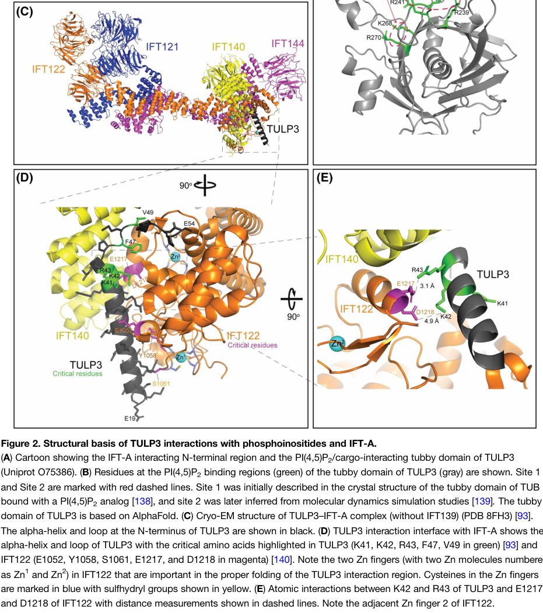

## Question

# Gene Research for Functional Annotation

## ⚠️ CRITICAL: Gene/Protein Identification Context

**BEFORE YOU BEGIN RESEARCH:** You MUST verify you are researching the CORRECT gene/protein. Gene symbols can be ambiguous, especially for less well-characterized genes from non-model organisms.

### Target Gene/Protein Identity (from UniProt):
- **UniProt Accession:** Q9HBG6
- **Protein Description:** RecName: Full=Intraflagellar transport protein 122 homolog {ECO:0000305}; AltName: Full=WD repeat-containing protein 10; AltName: Full=WD repeat-containing protein 140;
- **Gene Information:** Name=IFT122 {ECO:0000312|HGNC:HGNC:13556}; Synonyms=SPG, WDR10, WDR140;
- **Organism (full):** Homo sapiens (Human).
- **Protein Family:** Not specified in UniProt
- **Key Domains:** Beta-prop_IFT122_2nd. (IPR056152); Ift122/121. (IPR039857); IFT122/SMU1_beta-prop. (IPR056153); TPR_IFT122. (IPR057411); WD40/YVTN_repeat-like_dom_sf. (IPR015943)

### MANDATORY VERIFICATION STEPS:

1. **Check if the gene symbol "IFT122" matches the protein description above**
2. **Verify the organism is correct:** Homo sapiens (Human).
3. **Check if protein family/domains align with what you find in literature**
4. **If you find literature for a DIFFERENT gene with the same or similar symbol, STOP**

### If Gene Symbol is Ambiguous or You Cannot Find Relevant Literature:

**DO NOT PROCEED WITH RESEARCH ON A DIFFERENT GENE.** Instead:
- State clearly: "The gene symbol 'IFT122' is ambiguous or literature is limited for this specific protein"
- Explain what you found (e.g., "Found extensive literature on a different gene with the same symbol in a different organism")
- Describe the protein based ONLY on the UniProt information provided above
- Suggest that the protein function can be inferred from domain/family information

### Research Target:

Please provide a comprehensive research report on the gene **IFT122** (gene ID: IFT122, UniProt: Q9HBG6) in human.

The research report should be a detailed narrative explaining the function, biological processes, and localization of the gene product. Citations should be given for all claims.

You should prioritize authoritative reviews and primary scientific literature when conducting research. You can supplement
this with annotations you find in gene/protein databases, but these can be outdated or inaccurate.

We are specifically interested in the primary function of the gene - for enzymes, what reaction is catalyzed, and what is the substrate specificity? For transporters, what is the substrate? For structural proteins or adapters, what is the broader structural role? For signaling molecules, what is the role in the pathway.

We are interested in where in or outside the cell the gene product carries out its function.

We are also interested in the signaling or biochemical pathways in which the gene functions. We are less interested in broad pleiotropic effects, except where these elucidate the precise role.

Include evidence where possible. We are interested in both experimental evidence as well as inference from structure, evolution, or bioinformatic analysis. Precise studies should be prioritized over high-throughput, where available.

## Output

Question: You are an expert researcher providing comprehensive, well-cited information.

Provide detailed information focusing on:
1. Key concepts and definitions with current understanding
2. Recent developments and latest research (prioritize 2023-2024 sources)
3. Current applications and real-world implementations
4. Expert opinions and analysis from authoritative sources
5. Relevant statistics and data from recent studies

Format as a comprehensive research report with proper citations. Include URLs and publication dates where available.
Always prioritize recent, authoritative sources and provide specific citations for all major claims.

# Gene Research for Functional Annotation

## ⚠️ CRITICAL: Gene/Protein Identification Context

**BEFORE YOU BEGIN RESEARCH:** You MUST verify you are researching the CORRECT gene/protein. Gene symbols can be ambiguous, especially for less well-characterized genes from non-model organisms.

### Target Gene/Protein Identity (from UniProt):
- **UniProt Accession:** Q9HBG6
- **Protein Description:** RecName: Full=Intraflagellar transport protein 122 homolog {ECO:0000305}; AltName: Full=WD repeat-containing protein 10; AltName: Full=WD repeat-containing protein 140;
- **Gene Information:** Name=IFT122 {ECO:0000312|HGNC:HGNC:13556}; Synonyms=SPG, WDR10, WDR140;
- **Organism (full):** Homo sapiens (Human).
- **Protein Family:** Not specified in UniProt
- **Key Domains:** Beta-prop_IFT122_2nd. (IPR056152); Ift122/121. (IPR039857); IFT122/SMU1_beta-prop. (IPR056153); TPR_IFT122. (IPR057411); WD40/YVTN_repeat-like_dom_sf. (IPR015943)

### MANDATORY VERIFICATION STEPS:

1. **Check if the gene symbol "IFT122" matches the protein description above**
2. **Verify the organism is correct:** Homo sapiens (Human).
3. **Check if protein family/domains align with what you find in literature**
4. **If you find literature for a DIFFERENT gene with the same or similar symbol, STOP**

### If Gene Symbol is Ambiguous or You Cannot Find Relevant Literature:

**DO NOT PROCEED WITH RESEARCH ON A DIFFERENT GENE.** Instead:
- State clearly: "The gene symbol 'IFT122' is ambiguous or literature is limited for this specific protein"
- Explain what you found (e.g., "Found extensive literature on a different gene with the same symbol in a different organism")
- Describe the protein based ONLY on the UniProt information provided above
- Suggest that the protein function can be inferred from domain/family information

### Research Target:

Please provide a comprehensive research report on the gene **IFT122** (gene ID: IFT122, UniProt: Q9HBG6) in human.

The research report should be a detailed narrative explaining the function, biological processes, and localization of the gene product. Citations should be given for all claims.

You should prioritize authoritative reviews and primary scientific literature when conducting research. You can supplement
this with annotations you find in gene/protein databases, but these can be outdated or inaccurate.

We are specifically interested in the primary function of the gene - for enzymes, what reaction is catalyzed, and what is the substrate specificity? For transporters, what is the substrate? For structural proteins or adapters, what is the broader structural role? For signaling molecules, what is the role in the pathway.

We are interested in where in or outside the cell the gene product carries out its function.

We are also interested in the signaling or biochemical pathways in which the gene functions. We are less interested in broad pleiotropic effects, except where these elucidate the precise role.

Include evidence where possible. We are interested in both experimental evidence as well as inference from structure, evolution, or bioinformatic analysis. Precise studies should be prioritized over high-throughput, where available.

# Human IFT122 (UniProt Q9HBG6): functional annotation research report

## Identity and principal function

**Identity verified.** The target is *Homo sapiens* IFT122, also called WDR10 or WDR140 in the supplied UniProt record—not IFT140, WDR35 or the dynein subunit WDR34. The original human disease study explicitly identifies **IFT122/WDR10**, and experiments in human retinal pigment epithelial (hTERT-RPE1) and HEK293T cells identify IFT122 as a distinct component of the intraflagellar transport A (**IFT-A**) complex. Its experimentally described amino-terminal WD40 region and carboxy-terminal tetratricopeptide-repeat (**TPR**) region agree with the supplied beta-propeller and TPR domain annotations. The accession Q9HBG6 and additional WDR140 synonym come from the UniProt identity specified in the question; the cited experimental papers do not independently print that accession. (walczaksztulpa2010cranioectodermaldysplasiasensenbrenner pages 1-2, takahara2018ciliopathyassociatedmutationsof pages 1-2, takahara2018ciliopathyassociatedmutationsof pages 2-3)

**Primary function:** IFT122 is a *structural scaffold and adaptor within IFT-A*, not a catalytic enzyme, molecular motor or transporter with a defined chemical substrate. It joins IFT-A subassemblies, helps incorporate IFT-A into intraflagellar transport trains and provides part of the binding surface for the membrane-cargo adaptor TULP3. The resulting machinery supports cilium construction, selective entry of membrane-associated proteins and their intraflagellar trafficking. Kinesin-2 and dynein-2 power transport toward the ciliary tip and base, respectively; IFT122 does not itself supply motor activity. (takahara2018ciliopathyassociatedmutationsof pages 1-2, kobayashi2021cooperationofthe pages 1-5, palicharla2024molecularandstructural pages 6-7, ma2023structuralinsightinto pages 1-2)

## Molecular mechanism and biological processes

IFT-A contains six subunits. Human interaction-mapping experiments place IFT122, IFT140 and IFT144 in a core assembly and IFT43, IFT121 and IFT139 in an associated peripheral assembly. IFT122’s carboxy-terminal TPR-containing region helps assemble the IFT122–IFT144–IFT140 module, whereas its amino-terminal WD40-containing portion, in the context of the intact protein, helps connect that module to IFT43–IFT121 and indirectly to IFT139. Thus, **its best-supported individual role is to stabilize and bridge the two sides of IFT-A**. These WD40 beta-propellers and TPR repeats are protein-interaction architecture; they do not establish an enzymatic reaction or a directly transported IFT122-specific substrate. (takahara2018ciliopathyassociatedmutationsof pages 1-2, takahara2018ciliopathyassociatedmutationsof pages 2-3, palicharla2024molecularandstructural pages 6-7)

Recent structural work sharpens this model. A 2024 synthesis of reconstituted **human** IFT-A cryo-electron microscopy describes IFT122 as the spine of a flexible, lariat-like assembly: its carboxy-terminal portion contributes to an IFT140–IFT144-containing head, while its amino-terminal portion contributes to an IFT121–IFT139–IFT43-containing base. The structural orientation of human IFT-A was fitted to *Chlamydomonas* in-situ transport-train maps; this **cross-species fit**, rather than direct imaging of a native human train, places WD40-rich surfaces toward the ciliary membrane. Separately, 2023 cryo-EM of **Tetrahymena**, not human IFT122, found folded and elongated IFT-A states, with a bend between IFT122 TPR repeats 4 and 5 and approximately 30° flexibility in an elongated conformational class. These findings support a mechanically adaptable scaffold but do not prove that the same conformational states have identical functions in human cilia. (palicharla2024molecularandstructural pages 6-7, palicharla2024molecularandstructural pages 8-9, ma2023structuralinsightinto pages 4-5, palicharla2024molecularandstructural pages 7-8)

A particularly specific molecular function is **linking IFT-A to TULP3-dependent membrane-cargo import**. The TULP3 amino terminus binds the IFT-A surface involving IFT122 and IFT140; TULP3’s tubby domain associates with phosphatidylinositol 4,5-bisphosphate and selected membrane proteins. In the reported human structural model, IFT122 residues **E1217 and D1218** contact TULP3 residues **R43 and K42**, respectively; two adjacent IFT122 zinc-binding regions help organize this interface. TULP3-dependent cargo classes include selected ciliary G-protein-coupled receptors, ARL13B and other membrane-associated proteins. These are **cargoes of the IFT-A/TULP3 pathway**, not proven substrates directly bound by isolated IFT122. The residue-level interface is depicted in the cropped structural figure examined for this report. (palicharla2024molecularandstructural pages 6-7, palicharla2024molecularandstructural pages 9-9, palicharla2024molecularandstructural pages 4-5, palicharla2024molecularandstructural media a4cc78af)

IFT122 also contributes to **IFT-A–IFT-B coupling**. Human-cell interaction assays implicate the IFT122–IFT144 region on the IFT-A side and IFT88–IFT52 on the IFT-B side. Disrupting an IFT88 interface reduces IFT-A entry into cilia, causes abnormal IFT accumulation at distal tips and impairs ciliary GPCR import, connecting complex assembly with both ciliary entry and retrograde traffic. Because the key perturbation was to **IFT88**, those assays establish a role for the IFT122-containing interface, not that IFT122 alone directly binds every cargo or drives retrograde motion. (kobayashi2021cooperationofthe pages 1-5, kobayashi2021cooperationofthe pages 5-8)

## Site of action and signaling

IFT122 operates **inside the cell**, especially at the basal body/mother-centriole region where IFT machinery accumulates before entering the cilium, and as part of complexes moving along the ciliary axoneme and turning around at the distal tip. Mouse microscopy detected tagged IFT122 at ciliary bases and tips as well as in the cytoplasm. In human RPE1 cells, loss of IFT122 displaced IFT140 from its normal basal-body localization while IFT88 remained detectable there. These observations support a basal-body/ciliary function; the explicitly imaged base-and-tip distribution cited here is from the **mouse ortholog**, rather than a complete compartment-by-compartment map of endogenous human IFT122. IFT-A’s membrane-facing orientation in trains remains supported partly by model-organism tomography. (qin2011intraflagellartransportprotein pages 3-4, takahara2018ciliopathyassociatedmutationsof pages 4-5, ma2023structuralinsightinto pages 1-2, palicharla2024molecularandstructural pages 7-8)

The principal signaling consequence is altered **cilium-dependent Hedgehog signaling**, through changes in the localization of pathway components rather than direct enzymatic action on Hedgehog proteins. In human IFT122-knockout/rescue experiments, disease-associated **W7C** and **G513V** proteins supported cilium formation yet failed to restore normal Smoothened (**SMO**) entry after Smoothened-agonist treatment; they also disrupted ciliary localization of ARL13B and INPP5E. Wild-type-rescued cells showed agonist-dependent exit of the Hedgehog repressor GPR161, but the mutant-cell GPR161 comparison was **not statistically significant** and should not be reported as a proven IFT122-specific exit defect. The authors noted that impaired SMO entry could be indirect, for example through INPP5E mislocalization. (takahara2018ciliopathyassociatedmutationsof pages 6-7, takahara2018ciliopathyassociatedmutationsof pages 8-9, takahara2018ciliopathyassociatedmutationsof pages 10-11)

Allele strength matters. In the mouse **Ift122-sopb** partial-loss model, cilia remained but were swollen and accumulated IFT-B proteins distally; IFT140 failed to enter mutant cilia. Ciliary-tip TULP3 positivity declined from **81% of wild-type cilia (n = 63)** to **4.2% of mutant cilia (n = 71)**, while GLI2 and GLI3 tip staining increased **2.47-fold** and **1.96-fold**, respectively. SMO nevertheless localized to these mutant cilia following stimulation. This establishes that IFT122 can alter Hedgehog output through ciliary composition, but the mouse hypomorph must **not** be conflated with complete human IFT122 loss or treated as proof that all IFT122 alleles block SMO import. (qin2011intraflagellartransportprotein pages 3-4, palicharla2024molecularandstructural pages 3-4)

## Human disease evidence and current applications

**Complete loss and disease-associated partial loss have distinct cellular outcomes.** In two independent human hTERT-RPE1 IFT122-knockout lines, virtually no recognizable primary cilia formed; re-expression of wild-type IFT122 restored ciliogenesis. Re-expression of patient-associated W7C or G513V also restored substantial cilium formation but left trafficking abnormalities. This is why the 2018 paper’s title, *“Ciliopathy-associated mutations of IFT122 impair ciliary protein trafficking but not ciliogenesis,”* describes the tested **missense variants**, not the knockout phenotype. These rescue and cargo-localization assays provide practical experimental readouts for evaluating candidate variants; they are research assays, not established therapies. (takahara2018ciliopathyassociatedmutationsof pages 1-2, takahara2018ciliopathyassociatedmutationsof pages 6-7, takahara2018ciliopathyassociatedmutationsof pages 8-9, takahara2018ciliopathyassociatedmutationsof pages 5-6)

The established human clinical association is **autosomal-recessive cranioectodermal dysplasia 1**, also termed Sensenbrenner syndrome, involving craniofacial, skeletal and ectodermal abnormalities with variable renal and other involvement. The original 2010 investigation found biallelic IFT122 variants in **four of 13 affected patients**; the reported variants were absent from **340 control chromosomes**. Patient fibroblasts had reduced cilium frequency (**P < 0.001** in the reported culture comparisons) and length (**P < 0.05**). The nine patients without identified IFT122 variants illustrate that the syndrome is genetically heterogeneous; **4/13 is a proportion in that selected cohort, not population prevalence**. A 2021 case report identified a frameshift-plus-stop-loss IFT122 variant combination in another affected child, extending the reported clinical variant spectrum without itself establishing a new molecular transport mechanism. (walczaksztulpa2010cranioectodermaldysplasiasensenbrenner pages 1-2, walczaksztulpa2010cranioectodermaldysplasiasensenbrenner pages 4-5, walczaksztulpa2010cranioectodermaldysplasiasensenbrenner pages 5-7, yang2021anovelcombination pages 1-2)

The immediate real-world use of this knowledge is **molecular diagnosis and interpretation of biallelic IFT122 variants** in suspected ciliopathy, supported by segregation, patient-cell phenotypes and, where feasible, assays of IFT-A assembly and ciliary cargo localization. A disease-target database also prioritizes cranioectodermal dysplasia for IFT122, but weaker co-listed associations should not be promoted to established IFT122-specific causal diseases without independent genetic and functional evidence. No validated IFT122-directed treatment follows from the cited structural studies; the 2024 expert review instead presents cilia-targeted therapeutics as a *future* possibility. (walczaksztulpa2010cranioectodermaldysplasiasensenbrenner pages 1-2, walczaksztulpa2010cranioectodermaldysplasiasensenbrenner pages 5-7, OpenTargets Search: -IFT122, palicharla2024molecularandstructural pages 9-10)

The following evidence summary distinguishes direct human observations from model-organism inference and supplies publication dates and article URLs.

| Experiment/model + date and DOI URL | Decisive finding | Interpretation/limitation |
|---|---|---|
| **Human patient genetics — Walczak-Sztulpa et al., AJHG (11 Jun 2010)** · [DOI](https://doi.org/10.1016/j.ajhg.2010.04.012) | Among 13 patients with cranioectodermal dysplasia, four carried biallelic **IFT122/WDR10** variants; variants were absent from 340 control chromosomes. Patient fibroblasts had significantly reduced primary-cilium frequency and length. (walczaksztulpa2010cranioectodermaldysplasiasensenbrenner pages 1-2, walczaksztulpa2010cranioectodermaldysplasiasensenbrenner pages 4-5, walczaksztulpa2010cranioectodermaldysplasiasensenbrenner pages 5-7) | Direct human genetic and cellular evidence linking the correct gene to CED1/Sensenbrenner syndrome. Viable alleles appeared hypomorphic; nine patients lacked IFT122 variants, demonstrating genetic heterogeneity. |
| **Mouse Ift122 sopb hypomorph — Qin et al., PNAS (25 Jan 2011)** · [DOI](https://doi.org/10.1073/pnas.1011410108) | Mutant cilia were swollen, accumulated IFT-B proteins at their tips and lost ciliary IFT140. TULP3-positive ciliary tips fell from **81% (n=63)** in wild type to **4.2% (n=71)** in mutants; GLI2 and GLI3 tip signals increased 2.47- and 1.96-fold. (qin2011intraflagellartransportprotein pages 3-4) | Strong ortholog evidence for IFT-A stability, retrograde trafficking and Hedgehog-component localization. This was a partial-loss mouse allele, not human IFT122-null evidence, and Smoothened trafficking was allele- and context-dependent. |
| **Human hTERT-RPE1 knockout/rescue — Takahara et al., HMG (1 Feb 2018)** · [DOI](https://doi.org/10.1093/hmg/ddx421) | Two independent IFT122-knockout lines formed virtually no recognizable cilia; wild-type IFT122 rescued ciliogenesis. CED-associated **W7C** and **G513V** rescued cilium formation but disrupted IFT-A interactions and failed to restore normal ARL13B, INPP5E and SAG-induced Smoothened trafficking. (takahara2018ciliopathyassociatedmutationsof pages 1-2, takahara2018ciliopathyassociatedmutationsof pages 6-7, takahara2018ciliopathyassociatedmutationsof pages 8-9, takahara2018ciliopathyassociatedmutationsof pages 5-6) | Direct human-cell evidence that IFT122 is an IFT-A assembly hub required for ciliogenesis and selective protein traffic. It distinguishes complete loss from hypomorphic disease variants; cultured-cell rescue assays do not reproduce tissue-level disease. |
| **Human-cell IFT-A–IFT-B interaction assays — Kobayashi et al., MBoC (1 Jan 2021)** · [DOI](https://doi.org/10.1091/mbc.e20-08-0556) | Interaction mapping identified the **IFT144–IFT122** region as a major IFT-A contribution to the interface with the IFT88–IFT52 region of IFT-B; weakening this interface impaired IFT-A ciliary entry, retrograde traffic and GPCR import. (kobayashi2021cooperationofthe pages 1-5, kobayashi2021cooperationofthe pages 5-8) | Supports IFT122 as a structural adaptor within a coupled transport train—not a motor, transporter or enzyme. Other contacts probably contribute, and the principal perturbation targeted IFT88 rather than IFT122. |
| **Tetrahymena IFT-A cryo-EM — Ma et al., Nature Communications (20 Mar 2023)** · [DOI](https://doi.org/10.1038/s41467-023-37208-2) | IFT122’s TPR array connects the IFT-A head and base modules; bending between TPRs 4–5, near residues 707–717, switches folded and elongated states, with approximately 30° flexibility in the elongated class. (ma2023structuralinsightinto pages 4-5, ma2023structuralinsightinto pages 1-2) | Atomic structural support for a flexible IFT122 spine and train-assembly mechanism, but **Tetrahymena is non-human**. The observed apo conformations do not directly establish mammalian cargo-bound or retrograde states. |
| **Structural synthesis including human cryo-EM — Palicharla and Mukhopadhyay, Biochemical Society Transactions (28 Jun 2024)** · [DOI](https://doi.org/10.1042/BST20231403) | Human structures place IFT122 across both IFT-A modules and show a TULP3 interface involving IFT122 **E1217/D1218** and TULP3 **R43/K42**, adjacent to two zinc-finger regions; IFT122 forms the spine of the lariat-like complex. (palicharla2024molecularandstructural pages 6-7, palicharla2024molecularandstructural pages 9-9, palicharla2024molecularandstructural media a4cc78af) | The current model supports an adaptor role coupling IFT-A to TULP3-dependent membrane cargo. This review integrates reconstituted human structures with cross-species train maps; whether TULP3 undergoes IFT and how cargo is loaded, released and coupled to retrograde trains remain unresolved. (palicharla2024molecularandstructural pages 9-10) |

*Table: Evidence for correctly identified human IFT122 (UniProt Q9HBG6), from patient genetics and human-cell experiments to ortholog structures and current structural synthesis. Limitations distinguish direct human findings from cross-species inference.*

## Current assessment and open questions

The **high-confidence annotation** is an intracellular IFT-A scaffolding/adaptor protein required for normal cilium assembly and ciliary protein distribution, with particularly well-defined interactions linking the IFT-A modules and TULP3. The central unresolved questions emphasized in the **2024 structural review** are whether membrane-cargo import requires fully polymerized IFT-A trains, how TULP3 and its cargo bind and disengage at the ciliary gate, and how IFT-A’s cargo-import role is separated from its contribution to retrograde transport. Consequently, an exclusively “retrograde-transport protein” label is incomplete, while attributing a catalytic reaction, unique small-molecule substrate, or direct binding to every affected receptor would overstate the evidence. (takahara2018ciliopathyassociatedmutationsof pages 1-2, palicharla2024molecularandstructural pages 6-7, palicharla2024molecularandstructural pages 8-9, palicharla2024molecularandstructural pages 9-10)

References

1. (walczaksztulpa2010cranioectodermaldysplasiasensenbrenner pages 1-2): Joanna Walczak-Sztulpa, Jonathan Eggenschwiler, Daniel Osborn, Desmond A. Brown, Francesco Emma, Claus Klingenberg, Raoul C. Hennekam, Giuliano Torre, Masoud Garshasbi, Andreas Tzschach, Malgorzata Szczepanska, Marian Krawczynski, Jacek Zachwieja, Danuta Zwolinska, Philip L. Beales, Hans-Hilger Ropers, Anna Latos-Bielenska, and Andreas W. Kuss. Cranioectodermal dysplasia, sensenbrenner syndrome, is a ciliopathy caused by mutations in the ift122 gene. American journal of human genetics, 86 6:949-56, Jun 2010. URL: https://doi.org/10.1016/j.ajhg.2010.04.012, doi:10.1016/j.ajhg.2010.04.012. This article has 248 citations and is from a highest quality peer-reviewed journal.

2. (takahara2018ciliopathyassociatedmutationsof pages 1-2): Mariko Takahara, Yohei Katoh, Kentaro Nakamura, Tomoaki Hirano, Maho Sugawa, Yuta Tsurumi, and Kazuhisa Nakayama. Ciliopathy-associated mutations of ift122 impair ciliary protein trafficking but not ciliogenesis. Human Molecular Genetics, 27:516–528, Feb 2018. URL: https://doi.org/10.1093/hmg/ddx421, doi:10.1093/hmg/ddx421. This article has 73 citations and is from a domain leading peer-reviewed journal.

3. (takahara2018ciliopathyassociatedmutationsof pages 2-3): Mariko Takahara, Yohei Katoh, Kentaro Nakamura, Tomoaki Hirano, Maho Sugawa, Yuta Tsurumi, and Kazuhisa Nakayama. Ciliopathy-associated mutations of ift122 impair ciliary protein trafficking but not ciliogenesis. Human Molecular Genetics, 27:516–528, Feb 2018. URL: https://doi.org/10.1093/hmg/ddx421, doi:10.1093/hmg/ddx421. This article has 73 citations and is from a domain leading peer-reviewed journal.

4. (kobayashi2021cooperationofthe pages 1-5): Takuya Kobayashi, Yamato Ishida, Tomoaki Hirano, Yohei Katoh, and Kazuhisa Nakayama. Cooperation of the ift-a complex with the ift-b complex is required for ciliary retrograde protein trafficking and gpcr import. Molecular Biology of the Cell, 32:45-56, Jan 2021. URL: https://doi.org/10.1091/mbc.e20-08-0556, doi:10.1091/mbc.e20-08-0556. This article has 71 citations and is from a domain leading peer-reviewed journal.

5. (palicharla2024molecularandstructural pages 6-7): Vivek Reddy Palicharla and Saikat Mukhopadhyay. Molecular and structural perspectives on protein trafficking to the primary cilium membrane. Biochemical Society Transactions, 52:1473-1487, Jun 2024. URL: https://doi.org/10.1042/bst20231403, doi:10.1042/bst20231403. This article has 16 citations and is from a peer-reviewed journal.

6. (ma2023structuralinsightinto pages 1-2): Yuanyuan Ma, Jun He, Shaobai Li, Deqiang Yao, Chenhui Huang, Jian Wu, and Ming Lei. Structural insight into the intraflagellar transport complex ift-a and its assembly in the anterograde ift train. Nature Communications, Mar 2023. URL: https://doi.org/10.1038/s41467-023-37208-2, doi:10.1038/s41467-023-37208-2. This article has 43 citations and is from a highest quality peer-reviewed journal.

7. (palicharla2024molecularandstructural pages 8-9): Vivek Reddy Palicharla and Saikat Mukhopadhyay. Molecular and structural perspectives on protein trafficking to the primary cilium membrane. Biochemical Society Transactions, 52:1473-1487, Jun 2024. URL: https://doi.org/10.1042/bst20231403, doi:10.1042/bst20231403. This article has 16 citations and is from a peer-reviewed journal.

8. (ma2023structuralinsightinto pages 4-5): Yuanyuan Ma, Jun He, Shaobai Li, Deqiang Yao, Chenhui Huang, Jian Wu, and Ming Lei. Structural insight into the intraflagellar transport complex ift-a and its assembly in the anterograde ift train. Nature Communications, Mar 2023. URL: https://doi.org/10.1038/s41467-023-37208-2, doi:10.1038/s41467-023-37208-2. This article has 43 citations and is from a highest quality peer-reviewed journal.

9. (palicharla2024molecularandstructural pages 7-8): Vivek Reddy Palicharla and Saikat Mukhopadhyay. Molecular and structural perspectives on protein trafficking to the primary cilium membrane. Biochemical Society Transactions, 52:1473-1487, Jun 2024. URL: https://doi.org/10.1042/bst20231403, doi:10.1042/bst20231403. This article has 16 citations and is from a peer-reviewed journal.

10. (palicharla2024molecularandstructural pages 9-9): Vivek Reddy Palicharla and Saikat Mukhopadhyay. Molecular and structural perspectives on protein trafficking to the primary cilium membrane. Biochemical Society Transactions, 52:1473-1487, Jun 2024. URL: https://doi.org/10.1042/bst20231403, doi:10.1042/bst20231403. This article has 16 citations and is from a peer-reviewed journal.

11. (palicharla2024molecularandstructural pages 4-5): Vivek Reddy Palicharla and Saikat Mukhopadhyay. Molecular and structural perspectives on protein trafficking to the primary cilium membrane. Biochemical Society Transactions, 52:1473-1487, Jun 2024. URL: https://doi.org/10.1042/bst20231403, doi:10.1042/bst20231403. This article has 16 citations and is from a peer-reviewed journal.

12. (palicharla2024molecularandstructural media a4cc78af): Vivek Reddy Palicharla and Saikat Mukhopadhyay. Molecular and structural perspectives on protein trafficking to the primary cilium membrane. Biochemical Society Transactions, 52:1473-1487, Jun 2024. URL: https://doi.org/10.1042/bst20231403, doi:10.1042/bst20231403. This article has 16 citations and is from a peer-reviewed journal.

13. (kobayashi2021cooperationofthe pages 5-8): Takuya Kobayashi, Yamato Ishida, Tomoaki Hirano, Yohei Katoh, and Kazuhisa Nakayama. Cooperation of the ift-a complex with the ift-b complex is required for ciliary retrograde protein trafficking and gpcr import. Molecular Biology of the Cell, 32:45-56, Jan 2021. URL: https://doi.org/10.1091/mbc.e20-08-0556, doi:10.1091/mbc.e20-08-0556. This article has 71 citations and is from a domain leading peer-reviewed journal.

14. (qin2011intraflagellartransportprotein pages 3-4): Jian Qin, Yulian Lin, Ryan X. Norman, Hyuk W. Ko, and Jonathan T. Eggenschwiler. Intraflagellar transport protein 122 antagonizes sonic hedgehog signaling and controls ciliary localization of pathway components. Proceedings of the National Academy of Sciences, 108:1456-1461, Jan 2011. URL: https://doi.org/10.1073/pnas.1011410108, doi:10.1073/pnas.1011410108. This article has 212 citations and is from a highest quality peer-reviewed journal.

15. (takahara2018ciliopathyassociatedmutationsof pages 4-5): Mariko Takahara, Yohei Katoh, Kentaro Nakamura, Tomoaki Hirano, Maho Sugawa, Yuta Tsurumi, and Kazuhisa Nakayama. Ciliopathy-associated mutations of ift122 impair ciliary protein trafficking but not ciliogenesis. Human Molecular Genetics, 27:516–528, Feb 2018. URL: https://doi.org/10.1093/hmg/ddx421, doi:10.1093/hmg/ddx421. This article has 73 citations and is from a domain leading peer-reviewed journal.

16. (takahara2018ciliopathyassociatedmutationsof pages 6-7): Mariko Takahara, Yohei Katoh, Kentaro Nakamura, Tomoaki Hirano, Maho Sugawa, Yuta Tsurumi, and Kazuhisa Nakayama. Ciliopathy-associated mutations of ift122 impair ciliary protein trafficking but not ciliogenesis. Human Molecular Genetics, 27:516–528, Feb 2018. URL: https://doi.org/10.1093/hmg/ddx421, doi:10.1093/hmg/ddx421. This article has 73 citations and is from a domain leading peer-reviewed journal.

17. (takahara2018ciliopathyassociatedmutationsof pages 8-9): Mariko Takahara, Yohei Katoh, Kentaro Nakamura, Tomoaki Hirano, Maho Sugawa, Yuta Tsurumi, and Kazuhisa Nakayama. Ciliopathy-associated mutations of ift122 impair ciliary protein trafficking but not ciliogenesis. Human Molecular Genetics, 27:516–528, Feb 2018. URL: https://doi.org/10.1093/hmg/ddx421, doi:10.1093/hmg/ddx421. This article has 73 citations and is from a domain leading peer-reviewed journal.

18. (takahara2018ciliopathyassociatedmutationsof pages 10-11): Mariko Takahara, Yohei Katoh, Kentaro Nakamura, Tomoaki Hirano, Maho Sugawa, Yuta Tsurumi, and Kazuhisa Nakayama. Ciliopathy-associated mutations of ift122 impair ciliary protein trafficking but not ciliogenesis. Human Molecular Genetics, 27:516–528, Feb 2018. URL: https://doi.org/10.1093/hmg/ddx421, doi:10.1093/hmg/ddx421. This article has 73 citations and is from a domain leading peer-reviewed journal.

19. (palicharla2024molecularandstructural pages 3-4): Vivek Reddy Palicharla and Saikat Mukhopadhyay. Molecular and structural perspectives on protein trafficking to the primary cilium membrane. Biochemical Society Transactions, 52:1473-1487, Jun 2024. URL: https://doi.org/10.1042/bst20231403, doi:10.1042/bst20231403. This article has 16 citations and is from a peer-reviewed journal.

20. (takahara2018ciliopathyassociatedmutationsof pages 5-6): Mariko Takahara, Yohei Katoh, Kentaro Nakamura, Tomoaki Hirano, Maho Sugawa, Yuta Tsurumi, and Kazuhisa Nakayama. Ciliopathy-associated mutations of ift122 impair ciliary protein trafficking but not ciliogenesis. Human Molecular Genetics, 27:516–528, Feb 2018. URL: https://doi.org/10.1093/hmg/ddx421, doi:10.1093/hmg/ddx421. This article has 73 citations and is from a domain leading peer-reviewed journal.

21. (walczaksztulpa2010cranioectodermaldysplasiasensenbrenner pages 4-5): Joanna Walczak-Sztulpa, Jonathan Eggenschwiler, Daniel Osborn, Desmond A. Brown, Francesco Emma, Claus Klingenberg, Raoul C. Hennekam, Giuliano Torre, Masoud Garshasbi, Andreas Tzschach, Malgorzata Szczepanska, Marian Krawczynski, Jacek Zachwieja, Danuta Zwolinska, Philip L. Beales, Hans-Hilger Ropers, Anna Latos-Bielenska, and Andreas W. Kuss. Cranioectodermal dysplasia, sensenbrenner syndrome, is a ciliopathy caused by mutations in the ift122 gene. American journal of human genetics, 86 6:949-56, Jun 2010. URL: https://doi.org/10.1016/j.ajhg.2010.04.012, doi:10.1016/j.ajhg.2010.04.012. This article has 248 citations and is from a highest quality peer-reviewed journal.

22. (walczaksztulpa2010cranioectodermaldysplasiasensenbrenner pages 5-7): Joanna Walczak-Sztulpa, Jonathan Eggenschwiler, Daniel Osborn, Desmond A. Brown, Francesco Emma, Claus Klingenberg, Raoul C. Hennekam, Giuliano Torre, Masoud Garshasbi, Andreas Tzschach, Malgorzata Szczepanska, Marian Krawczynski, Jacek Zachwieja, Danuta Zwolinska, Philip L. Beales, Hans-Hilger Ropers, Anna Latos-Bielenska, and Andreas W. Kuss. Cranioectodermal dysplasia, sensenbrenner syndrome, is a ciliopathy caused by mutations in the ift122 gene. American journal of human genetics, 86 6:949-56, Jun 2010. URL: https://doi.org/10.1016/j.ajhg.2010.04.012, doi:10.1016/j.ajhg.2010.04.012. This article has 248 citations and is from a highest quality peer-reviewed journal.

23. (yang2021anovelcombination pages 1-2): Qi Yang, Qiang Zhang, Fei Chen, Shang Yi, Shang Yi, Mengting Li, Sheng Yi, Xingmin Xu, and Jingsi Luo. A novel combination of biallelic ift122 variants associated with cranioectodermal dysplasia: a case report. Experimental and Therapeutic Medicine, Feb 2021. URL: https://doi.org/10.3892/etm.2021.9742, doi:10.3892/etm.2021.9742. This article has 11 citations and is from a peer-reviewed journal.

24. (OpenTargets Search: -IFT122): Open Targets Query (-IFT122, 5 results). Buniello, A. et al. (2025). Open Targets Platform: facilitating therapeutic hypotheses building in drug discovery. Nucleic Acids Research.

25. (palicharla2024molecularandstructural pages 9-10): Vivek Reddy Palicharla and Saikat Mukhopadhyay. Molecular and structural perspectives on protein trafficking to the primary cilium membrane. Biochemical Society Transactions, 52:1473-1487, Jun 2024. URL: https://doi.org/10.1042/bst20231403, doi:10.1042/bst20231403. This article has 16 citations and is from a peer-reviewed journal.

## Artifacts

- [Edison artifact artifact-00](IFT122-deep-research-falcon_artifacts/artifact-00.md)

## Citations

1. qin2011intraflagellartransportprotein pages 3-4
2. palicharla2024molecularandstructural pages 9-10
3. walczaksztulpa2010cranioectodermaldysplasiasensenbrenner pages 1-2
4. takahara2018ciliopathyassociatedmutationsof pages 1-2
5. takahara2018ciliopathyassociatedmutationsof pages 2-3
6. kobayashi2021cooperationofthe pages 1-5
7. palicharla2024molecularandstructural pages 6-7
8. ma2023structuralinsightinto pages 1-2
9. palicharla2024molecularandstructural pages 8-9
10. ma2023structuralinsightinto pages 4-5
11. palicharla2024molecularandstructural pages 7-8
12. palicharla2024molecularandstructural pages 9-9
13. palicharla2024molecularandstructural pages 4-5
14. kobayashi2021cooperationofthe pages 5-8
15. takahara2018ciliopathyassociatedmutationsof pages 4-5
16. takahara2018ciliopathyassociatedmutationsof pages 6-7
17. takahara2018ciliopathyassociatedmutationsof pages 8-9
18. takahara2018ciliopathyassociatedmutationsof pages 10-11
19. palicharla2024molecularandstructural pages 3-4
20. takahara2018ciliopathyassociatedmutationsof pages 5-6
21. walczaksztulpa2010cranioectodermaldysplasiasensenbrenner pages 4-5
22. walczaksztulpa2010cranioectodermaldysplasiasensenbrenner pages 5-7
23. yang2021anovelcombination pages 1-2
24. DOI
25. https://doi.org/10.1016/j.ajhg.2010.04.012
26. https://doi.org/10.1073/pnas.1011410108
27. https://doi.org/10.1093/hmg/ddx421
28. https://doi.org/10.1091/mbc.e20-08-0556
29. https://doi.org/10.1038/s41467-023-37208-2
30. https://doi.org/10.1042/BST20231403
31. https://doi.org/10.1016/j.ajhg.2010.04.012,
32. https://doi.org/10.1093/hmg/ddx421,
33. https://doi.org/10.1091/mbc.e20-08-0556,
34. https://doi.org/10.1042/bst20231403,
35. https://doi.org/10.1038/s41467-023-37208-2,
36. https://doi.org/10.1073/pnas.1011410108,
37. https://doi.org/10.3892/etm.2021.9742,