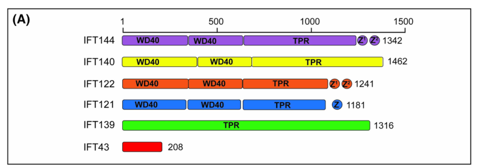

## Question

# Gene Research for Functional Annotation

## ⚠️ CRITICAL: Gene/Protein Identification Context

**BEFORE YOU BEGIN RESEARCH:** You MUST verify you are researching the CORRECT gene/protein. Gene symbols can be ambiguous, especially for less well-characterized genes from non-model organisms.

### Target Gene/Protein Identity (from UniProt):
- **UniProt Accession:** Q96RY7
- **Protein Description:** RecName: Full=Intraflagellar transport protein 140 homolog {ECO:0000305}; AltName: Full=WD and tetratricopeptide repeats protein 2;
- **Gene Information:** Name=IFT140 {ECO:0000312|HGNC:HGNC:29077}; Synonyms=KIAA0590, WDTC2;
- **Organism (full):** Homo sapiens (Human).
- **Protein Family:** Not specified in UniProt
- **Key Domains:** Beta-prop_IFT140_1st. (IPR056154); Beta-prop_IFT140_2nd. (IPR056155); TPR_IF140/IFT172/WDR19. (IPR056168); TPR_IF140_C. (IPR056156); WD40/YVTN_repeat-like_dom_sf. (IPR015943)

### MANDATORY VERIFICATION STEPS:

1. **Check if the gene symbol "IFT140" matches the protein description above**
2. **Verify the organism is correct:** Homo sapiens (Human).
3. **Check if protein family/domains align with what you find in literature**
4. **If you find literature for a DIFFERENT gene with the same or similar symbol, STOP**

### If Gene Symbol is Ambiguous or You Cannot Find Relevant Literature:

**DO NOT PROCEED WITH RESEARCH ON A DIFFERENT GENE.** Instead:
- State clearly: "The gene symbol 'IFT140' is ambiguous or literature is limited for this specific protein"
- Explain what you found (e.g., "Found extensive literature on a different gene with the same symbol in a different organism")
- Describe the protein based ONLY on the UniProt information provided above
- Suggest that the protein function can be inferred from domain/family information

### Research Target:

Please provide a comprehensive research report on the gene **IFT140** (gene ID: IFT140, UniProt: Q96RY7) in human.

The research report should be a detailed narrative explaining the function, biological processes, and localization of the gene product. Citations should be given for all claims.

You should prioritize authoritative reviews and primary scientific literature when conducting research. You can supplement
this with annotations you find in gene/protein databases, but these can be outdated or inaccurate.

We are specifically interested in the primary function of the gene - for enzymes, what reaction is catalyzed, and what is the substrate specificity? For transporters, what is the substrate? For structural proteins or adapters, what is the broader structural role? For signaling molecules, what is the role in the pathway.

We are interested in where in or outside the cell the gene product carries out its function.

We are also interested in the signaling or biochemical pathways in which the gene functions. We are less interested in broad pleiotropic effects, except where these elucidate the precise role.

Include evidence where possible. We are interested in both experimental evidence as well as inference from structure, evolution, or bioinformatic analysis. Precise studies should be prioritized over high-throughput, where available.

## Output

Question: You are an expert researcher providing comprehensive, well-cited information.

Provide detailed information focusing on:
1. Key concepts and definitions with current understanding
2. Recent developments and latest research (prioritize 2023-2024 sources)
3. Current applications and real-world implementations
4. Expert opinions and analysis from authoritative sources
5. Relevant statistics and data from recent studies

Format as a comprehensive research report with proper citations. Include URLs and publication dates where available.
Always prioritize recent, authoritative sources and provide specific citations for all major claims.

# Gene Research for Functional Annotation

## ⚠️ CRITICAL: Gene/Protein Identification Context

**BEFORE YOU BEGIN RESEARCH:** You MUST verify you are researching the CORRECT gene/protein. Gene symbols can be ambiguous, especially for less well-characterized genes from non-model organisms.

### Target Gene/Protein Identity (from UniProt):
- **UniProt Accession:** Q96RY7
- **Protein Description:** RecName: Full=Intraflagellar transport protein 140 homolog {ECO:0000305}; AltName: Full=WD and tetratricopeptide repeats protein 2;
- **Gene Information:** Name=IFT140 {ECO:0000312|HGNC:HGNC:29077}; Synonyms=KIAA0590, WDTC2;
- **Organism (full):** Homo sapiens (Human).
- **Protein Family:** Not specified in UniProt
- **Key Domains:** Beta-prop_IFT140_1st. (IPR056154); Beta-prop_IFT140_2nd. (IPR056155); TPR_IF140/IFT172/WDR19. (IPR056168); TPR_IF140_C. (IPR056156); WD40/YVTN_repeat-like_dom_sf. (IPR015943)

### MANDATORY VERIFICATION STEPS:

1. **Check if the gene symbol "IFT140" matches the protein description above**
2. **Verify the organism is correct:** Homo sapiens (Human).
3. **Check if protein family/domains align with what you find in literature**
4. **If you find literature for a DIFFERENT gene with the same or similar symbol, STOP**

### If Gene Symbol is Ambiguous or You Cannot Find Relevant Literature:

**DO NOT PROCEED WITH RESEARCH ON A DIFFERENT GENE.** Instead:
- State clearly: "The gene symbol 'IFT140' is ambiguous or literature is limited for this specific protein"
- Explain what you found (e.g., "Found extensive literature on a different gene with the same symbol in a different organism")
- Describe the protein based ONLY on the UniProt information provided above
- Suggest that the protein function can be inferred from domain/family information

### Research Target:

Please provide a comprehensive research report on the gene **IFT140** (gene ID: IFT140, UniProt: Q96RY7) in human.

The research report should be a detailed narrative explaining the function, biological processes, and localization of the gene product. Citations should be given for all claims.

You should prioritize authoritative reviews and primary scientific literature when conducting research. You can supplement
this with annotations you find in gene/protein databases, but these can be outdated or inaccurate.

We are specifically interested in the primary function of the gene - for enzymes, what reaction is catalyzed, and what is the substrate specificity? For transporters, what is the substrate? For structural proteins or adapters, what is the broader structural role? For signaling molecules, what is the role in the pathway.

We are interested in where in or outside the cell the gene product carries out its function.

We are also interested in the signaling or biochemical pathways in which the gene functions. We are less interested in broad pleiotropic effects, except where these elucidate the precise role.

Include evidence where possible. We are interested in both experimental evidence as well as inference from structure, evolution, or bioinformatic analysis. Precise studies should be prioritized over high-throughput, where available.

# Human IFT140: functional annotation and research report

## Identity and principal function

**Identity verified.** The target is human **IFT140**, UniProt [Q96RY7](https://www.uniprot.org/uniprotkb/Q96RY7/entry), also named **KIAA0590** or **WDTC2** in the supplied UniProt record. Its description as an intraflagellar transport protein with two β-propeller/WD40 regions and tetratricopeptide-repeat (TPR) regions agrees with structural studies of human IFT-A. It is distinct from the neighboring IFT-A proteins IFT121/**WDR35**, IFT122 and IFT144, and from the IFT-B protein IFT172. The accession and aliases come from the supplied record; the structural identity is independently supported by the literature. (palicharla2024molecularandstructural pages 6-7, palicharla2024molecularandstructural media 7cdd7414, tasaki2025mutuallyindependentand pages 1-2)

**Primary molecular role:** IFT140 is a **nonenzymatic structural and adaptor-interacting subunit** of intraflagellar transport complex A (**IFT-A**). Together with IFT144 and the C-terminal region of IFT122, it forms the complex’s head/core module. The assembled machinery helps maintain cilia by supporting tip-to-base *retrograde* transport and helps establish the ciliary membrane’s protein composition by participating in selective cargo *entry*. Dynein-2 supplies retrograde motor activity; IFT140 is part of the transported complex, **not the motor or an enzyme**. Accordingly, there is no established reaction, catalytic substrate or single transported substrate to assign to IFT140 itself. (kobayashi2021cooperationofthe pages 1-5, palicharla2024molecularandstructural pages 6-7, senum2022monoallelicift140pathogenic pages 1-4, tasaki2025mutuallyindependentand pages 1-2)

## Molecular mechanism and cargo selectivity

Human IFT-A is a six-subunit complex. In its elongated, lariat-like form, IFT122 provides a structural spine; IFT140 and IFT144 occupy its head, while IFT121, IFT139 and IFT43 contribute to its base. Human cryo-EM structures position IFT140’s WD40 and TPR regions in this architecture. Fitting IFT-A into flagellar-train reconstructions suggests that neighboring complexes contact one another through IFT140 and WDR35 WD regions; the WD-rich face is oriented toward the ciliary membrane. **That orientation is a structural model from human complexes docked into nonhuman train maps**, rather than direct imaging of cargo bound to human IFT140. See the cropped domain-and-train panels of Figure 3 in the 2024 structural review. (palicharla2024molecularandstructural pages 6-7, palicharla2024molecularandstructural media 7cdd7414, palicharla2024molecularandstructural pages 7-7)

A more direct molecular contact is with the cargo adaptor **TULP3**. A reconstituted human IFT-A–TULP3 cryo-EM structure places TULP3’s N-terminal helix and adjacent loop against **IFT140 TPR domains and IFT122 TPR/zinc-finger regions**. TULP3’s other end binds membrane-associated cargo and, for some cargo classes, phosphatidylinositol 4,5-bisphosphate [PI(4,5)P₂]. This provides a physical route from IFT140-containing transport machinery to proteins entering the cilium. Mutations affecting the TULP3–IFT-A interface impair ciliary delivery of **GPR161** and **ARL13B**; the demonstrated IFT140 contact is with the *adaptor*, not proven direct recognition of either cargo by IFT140 alone. (palicharla2024molecularandstructural pages 9-9, palicharla2024molecularandstructural pages 4-5, palicharla2023interactionsbetweentulp3 pages 1-2)

At the **IFT-A/TULP3-system level**, implicated cargo classes include GPCRs such as GPR161, SSTR3 and MCHR1; polycystins; fibrocystin; and membrane-associated ARL13B and proteins dependent on its ciliary localization, including INPP5E. Cargo requirements differ: a 2023 primary study found that ARL13B import requires TULP3–IFT-A binding but, unlike the transmembrane cargoes examined, does **not** require TULP3 binding to phosphoinositides. These are useful pathway-level substrate assignments, **not a list of experimentally established direct IFT140-binding substrates**. The 2024 review also cautions that receptor abundance in an existing cilium reflects both entry and exit, which need not all occur through the same IFT-dependent step. (palicharla2024molecularandstructural pages 4-5, palicharla2024molecularandstructural pages 5-6, palicharla2023interactionsbetweentulp3 pages 1-2)

Evidence for separable architectural and cargo-composition functions comes from *Chlamydomonas*: loss of its IFT140 homolog prevented flagellum formation, whereas an IFT140 construct lacking WD regions restored **short** flagella and localization of IFT complexes. The rescued flagella nevertheless had altered distributions of transmembrane, lipid-modified and GTPase proteins. This is strong **homolog/model-organism evidence** for WD-region involvement in membrane-protein composition, not proof of an identical human cargo-binding specificity. (palicharla2024molecularandstructural pages 3-4)

The following observations indicate both the strength and the limits of the annotation:

| Mechanistic claim | Direct experiment or observation | Scope / qualification | Source |
|---|---|---|---|
| **IFT140 is a structural and adaptor-binding subunit of human IFT-A.** | Cryo-EM of reconstituted human proteins placed IFT140 with IFT144 and the C-terminal half of IFT122 in the IFT-A head module. IFT140 TPR domains and IFT122 TPR/zinc-finger regions contact the TULP3 N-terminal helix/loop; interface mutations impaired trafficking of GPR161 and ARL13B. | Direct structural evidence for IFT140 contributing to the **TULP3–IFT-A interface**; it does not demonstrate that IFT140 alone recognizes either cargo. Flexible IFT140 WD40 regions were incompletely resolved. | Palicharla & Mukhopadhyay, 2024, [DOI](https://doi.org/10.1042/BST20231403) (palicharla2024molecularandstructural pages 6-7, palicharla2024molecularandstructural pages 9-9) |
| **IFT140 is required for efficient retrograde IFT in human renal epithelial cells.** | Patient urine-derived renal epithelial cells carrying compound-heterozygous *IFT140* variants accumulated IFT88 at ciliary tips in **41%** of cells versus none in controls. In Ift140-knockout cells, the patient p.Tyr923Asp construct produced significantly more IFT88 tip accumulation than wild-type IFT140. | Direct patient-cell and complementation evidence for impaired retrograde transport; IFT88 accumulation is the readout, not direct live tracking of IFT140. | Oud et al., 2018, [DOI](https://doi.org/10.1186/s13630-018-0055-2) (oud2018cellularciliaryphenotyping pages 1-2) |
| **IFT140 WD domains help regulate ciliary membrane composition and are partly separable from IFT-A assembly.** | In *Chlamydomonas*, complete IFT140 loss prevented flagellum formation; an IFT140 construct lacking WD domains restored short flagella with IFT-A/IFT-B localization. Proteomics showed altered localization of transmembrane, myristoylated, geranylgeranylated and GTPase proteins. | Direct nonhuman homolog evidence summarized in a 2024 review. It supports class-level cargo-composition control, not direct binding or specificity of human IFT140 for any individual cargo. | Palicharla & Mukhopadhyay, 2024, [DOI](https://doi.org/10.1042/BST20231403) (palicharla2024molecularandstructural pages 3-4) |
| **Ift140-dependent cilia modulate embryonic Hedgehog signalling in a context-dependent manner.** | In 2023 mouse embryos, Ift140 deficiency altered PAX6, NKX6.1 and OLIG2 neural-tube domains; limb-bud *Gli1* and *Ptch1* were downregulated but anteriorly expanded, while *Gremlin* increased and expanded. Ift140;Ptch1 double homozygosity partially rescued Ptch1-associated early lethality. | Direct mouse developmental and genetic-interaction evidence. Opposite-looking readouts across tissues indicate context dependence; no direct Smoothened-localization assay was reported, and Wnt involvement was not directly tested. | Francis et al., 2023, [DOI](https://doi.org/10.1371/journal.pbio.3002425) (francis2023autonomousandnoncella pages 10-12) |
| **Monoallelic IFT140 loss of function is clinically actionable in mild, apparently sporadic polycystic kidney disease.** | Targeted sequencing of up to 92 genes in **157** Japanese adults without an evident parental history found monoallelic IFT140 loss-of-function variants in **7/157 (4.5%)**, versus PKD1/PKD2 pathogenic variants in **51/157 (32.5%)**. IFT140 cases had no polycystic liver disease and had smaller kidney volume and higher eGFR than PKD1 cases. | Human association and diagnostic-yield evidence, not proof of the cellular cystogenic mechanism. Enrichment reflects selection for absent apparent family history; mild disease in a parent can be overlooked. | Fujimaru et al., 2024; online 16 July 2024, [DOI](https://doi.org/10.1016/j.ekir.2024.06.021) (fujimaru2024importanceofift140 pages 1-2, fujimaru2024importanceofift140 pages 5-7) |

*Table: Five evidence tiers connect human IFT140 structure and retrograde transport to model-organism mechanisms and clinical genetic implementation. Qualifications distinguish direct observations from complex-level inference and avoid assigning unsupported cargo specificity to IFT140.*

## Cellular site and biological pathways

IFT140 acts principally **at the basal body/ciliary base and within the primary cilium**, where IFT trains travel beside axonemal microtubules beneath the ciliary membrane. In mammalian NIH3T3 cells, IFT140 immunostaining is concentrated at ciliary bases; mouse photoreceptors show IFT140 in the basal-body/**connecting-cilium** region. These observations are consistent with assembly or loading near the ciliary base and transport through the cilium, but fixed-cell staining alone does not measure IFT140’s direction of travel. The connecting cilium is particularly relevant to photoreceptors because it links the inner segment with the specialized outer-segment sensory cilium. (chaya2024ccrkmakicksignalingis pages 3-4, reed2022deletionofcep164 pages 1-2, tasaki2025mutuallyindependentand pages 1-2)

**Retrograde IFT has direct patient-cell support.** In urine-derived renal epithelial cells from a child with compound-heterozygous *IFT140* variants, the IFT-B marker **IFT88 accumulated at ciliary tips in 41% of cells**, versus none of the controls examined. Re-expressing the patient’s IFT140 p.Tyr923Asp variant in Ift140-knockout cells produced significantly more tip accumulation than wild-type IFT140. Tip-trapped IFT88 is a readout of defective return transport, not evidence that IFT140 itself is a dynein motor. An independent patient-derived kidney-organoid study found shortened, club-shaped cilia and epithelial-polarity abnormalities that improved after isogenic correction of *IFT140* variants. (oud2018cellularciliaryphenotyping pages 1-2, forbes2018patientipscderivedkidneyorganoids pages 1-2)

IFT140 therefore influences signaling **through ciliary assembly and the localization or turnover of signaling components**, rather than acting as a receptor or transcription factor. **Hedgehog signaling** is the best-supported developmental example. In a 2023 mouse *Ift140* study, embryonic neural-tube PAX6, NKX6.1 and OLIG2 domains shifted, while limb-bud *Gli1* and *Ptch1* expression decreased but expanded anteriorly; a *Ptch1* genetic-interaction experiment also altered embryonic viability. Responses differed by tissue and assay, so a simple statement that IFT140 always increases or always suppresses Hedgehog signaling would be misleading. The study did **not** establish a direct IFT140–Smoothened interaction or an IFT140-specific Wnt-signaling reaction. (francis2023autonomousandnoncella pages 10-12)

## Developments in 2023–2025

Structural work substantially refined the annotation in **2023**: cryo-EM of *Tetrahymena* IFT-A revealed elongated and folded arrangements, and comparisons with human IFT-A structures suggested how the complex remodels when incorporated into anterograde trains. The proposed train interfaces include IFT140-containing contacts, but translating those particular protist interfaces to native human cilia requires care. A **2024** expert review integrated human IFT-A–TULP3 structural findings and identified unresolved questions, including whether cargo import and retrograde transport can be functionally separated and precisely where cargo-loaded preciliary vesicles engage IFT-A. (ma2023structuralinsightinto pages 7-9, palicharla2024molecularandstructural pages 6-7, palicharla2024molecularandstructural pages 9-10)

A **2025 peer-reviewed** human-cell study, extending variant-interaction work initially circulated as a 2023 preprint, tested **23 patient-associated IFT140 missense variants** by quantitative affinity-purification mass spectrometry. Ten significantly reduced interactions with IFT-A components; **13 of 23** reduced IFT140–TULP3 interaction to varying degrees. All **four** variants selected for rescue experiments restored ciliogenesis in IFT140-knockout retinal pigment epithelial cells, although two modestly shortened cilia: approximately **3.14 and 3.16 μm**, versus **3.6 μm** with wild-type IFT140. These results support partial, sometimes interaction-specific dysfunction and caution against using apparently normal cilium formation as a sufficient test of variant benignity. The 2023 preprint and 2025 publication have different variant counts; the figures here are from the peer-reviewed publication. (beyer2025ciliopathyassociatedmissensemutations pages 1-3, beyer2025ciliopathyassociatedmissensemutations pages 10-12)

## Human disease relevance and real-world use

**Allelic state matters.** Biallelic pathogenic *IFT140* variants can cause recessive retinal, renal and skeletal ciliopathies, including Mainzer–Saldino syndrome/short-rib thoracic dysplasia 9; some biallelic presentations are predominantly retinal. By contrast, **monoallelic loss-of-function** variants are established contributors to a generally milder, autosomal-dominant polycystic-kidney-disease-spectrum phenotype, often with a few relatively large renal cysts and little liver involvement. The cellular mechanism by which one defective allele produces cysts—and whether polycystin mislocalization is the decisive intermediate—remains unresolved. (senum2022monoallelicift140pathogenic pages 1-4, senum2022monoallelicift140pathogenic pages 15-17, oud2018cellularciliaryphenotyping pages 1-2)

This distinction is already implemented in **targeted kidney-disease sequencing and variant interpretation**. In a multicohort study published in **January 2022**, monoallelic IFT140 loss-of-function variants accounted for **16/834 previously unscreened families (1.9%)** with an ADPKD diagnosis; the investigators additionally examined families previously negative for *PKD1/PKD2*. In a distinct Japanese study published online **16 July 2024**, sequencing of up to 92 genes found such variants in **7/157 adults (4.5%)** with polycystic kidneys but **no evident parental history**, compared with **51/157 (32.5%)** carrying pathogenic *PKD1* or *PKD2* variants. The IFT140 group had smaller kidney volumes and higher estimated glomerular filtration rates than the PKD1 group, and none had polycystic liver disease. The two percentages are **not population prevalences and are not directly comparable yields**: the 2024 cohort was selected for an apparently negative family history, which a mild parental phenotype can obscure. (senum2022monoallelicift140pathogenic pages 1-4, fujimaru2024importanceofift140 pages 1-2, fujimaru2024importanceofift140 pages 5-7)

Beyond gene-panel testing, **patient urine-derived epithelial-cell ciliary phenotyping**, mutant-versus-wild-type complementation, and isogenic kidney organoids provide research and diagnostic-support approaches for investigating uncertain variants. Quantitative interaction proteomics offers a further experimental approach when gross ciliogenesis appears preserved. These are applications for diagnosis and mechanism testing, **not evidence of an approved IFT140-specific treatment**. (oud2018cellularciliaryphenotyping pages 1-2, forbes2018patientipscderivedkidneyorganoids pages 1-2, beyer2025ciliopathyassociatedmissensemutations pages 1-3)

**Functional annotation in one sentence:** Human IFT140 is a WD40/TPR-containing IFT-A core scaffold whose experimentally supported work at the ciliary base and in IFT trains is to enable efficient ciliary retrograde transport and, through a structurally observed TULP3 interface, participate in selective delivery of membrane-associated signaling proteins into cilia; direct binding specificity for any individual cargo and the precise mechanism of monoallelic kidney cyst formation are not yet established. (palicharla2024molecularandstructural pages 9-9, oud2018cellularciliaryphenotyping pages 1-2, palicharla2024molecularandstructural pages 3-4, senum2022monoallelicift140pathogenic pages 15-17)

References

1. (palicharla2024molecularandstructural pages 6-7): Vivek Reddy Palicharla and Saikat Mukhopadhyay. Molecular and structural perspectives on protein trafficking to the primary cilium membrane. Biochemical Society Transactions, 52:1473-1487, Jun 2024. URL: https://doi.org/10.1042/bst20231403, doi:10.1042/bst20231403. This article has 16 citations and is from a peer-reviewed journal.

2. (palicharla2024molecularandstructural media 7cdd7414): Vivek Reddy Palicharla and Saikat Mukhopadhyay. Molecular and structural perspectives on protein trafficking to the primary cilium membrane. Biochemical Society Transactions, 52:1473-1487, Jun 2024. URL: https://doi.org/10.1042/bst20231403, doi:10.1042/bst20231403. This article has 16 citations and is from a peer-reviewed journal.

3. (tasaki2025mutuallyindependentand pages 1-2): Koshi Tasaki, Yuuki Satoda, Shuhei Chiba, Hye-Won Shin, Yohei Katoh, and Kazuhisa Nakayama. Mutually independent and cilia-independent assembly of ift-a and ift-b complexes at mother centriole. Molecular Biology of the Cell, Feb 2025. URL: https://doi.org/10.1091/mbc.e24-11-0509, doi:10.1091/mbc.e24-11-0509. This article has 4 citations and is from a domain leading peer-reviewed journal.

4. (kobayashi2021cooperationofthe pages 1-5): Takuya Kobayashi, Yamato Ishida, Tomoaki Hirano, Yohei Katoh, and Kazuhisa Nakayama. Cooperation of the ift-a complex with the ift-b complex is required for ciliary retrograde protein trafficking and gpcr import. Molecular Biology of the Cell, 32:45-56, Jan 2021. URL: https://doi.org/10.1091/mbc.e20-08-0556, doi:10.1091/mbc.e20-08-0556. This article has 71 citations and is from a domain leading peer-reviewed journal.

5. (senum2022monoallelicift140pathogenic pages 1-4): Sarah R. Senum, Ying (Sabrina) M. Li, Katherine A. Benson, Giancarlo Joli, Eric Olinger, Sravanthi Lavu, Charles D. Madsen, Adriana V. Gregory, Ruxandra Neatu, Timothy L. Kline, Marie-Pierre Audrézet, Patricia Outeda, Cherie B. Nau, Esther Meijer, Hamad Ali, Theodore I. Steinman, Michal Mrug, Paul J. Phelan, Terry J. Watnick, Dorien J.M. Peters, Albert C.M. Ong, Peter J. Conlon, Ronald D. Perrone, Emilie Cornec-Le Gall, Marie C. Hogan, Vicente E. Torres, John A. Sayer, and Peter C. Harris. Monoallelic ift140 pathogenic variants are an important cause of the autosomal dominant polycystic kidney-spectrum phenotype. The American Journal of Human Genetics, 109:136-156, Jan 2022. URL: https://doi.org/10.1016/j.ajhg.2021.11.016, doi:10.1016/j.ajhg.2021.11.016. This article has 202 citations.

6. (palicharla2024molecularandstructural pages 7-7): Vivek Reddy Palicharla and Saikat Mukhopadhyay. Molecular and structural perspectives on protein trafficking to the primary cilium membrane. Biochemical Society Transactions, 52:1473-1487, Jun 2024. URL: https://doi.org/10.1042/bst20231403, doi:10.1042/bst20231403. This article has 16 citations and is from a peer-reviewed journal.

7. (palicharla2024molecularandstructural pages 9-9): Vivek Reddy Palicharla and Saikat Mukhopadhyay. Molecular and structural perspectives on protein trafficking to the primary cilium membrane. Biochemical Society Transactions, 52:1473-1487, Jun 2024. URL: https://doi.org/10.1042/bst20231403, doi:10.1042/bst20231403. This article has 16 citations and is from a peer-reviewed journal.

8. (palicharla2024molecularandstructural pages 4-5): Vivek Reddy Palicharla and Saikat Mukhopadhyay. Molecular and structural perspectives on protein trafficking to the primary cilium membrane. Biochemical Society Transactions, 52:1473-1487, Jun 2024. URL: https://doi.org/10.1042/bst20231403, doi:10.1042/bst20231403. This article has 16 citations and is from a peer-reviewed journal.

9. (palicharla2023interactionsbetweentulp3 pages 1-2): Vivek Reddy Palicharla, Sun-Hee Hwang, Bandarigoda N. Somatilaka, Emilie Legué, Issei S. Shimada, Nicole E. Familiari, Vanna M. Tran, Jeffrey B. Woodruff, Karel F. Liem, and Saikat Mukhopadhyay. Interactions between tulp3 tubby domain and arl13b amphipathic helix promote lipidated protein transport to cilia. Mar 2023. URL: https://doi.org/10.1091/mbc.e22-10-0473, doi:10.1091/mbc.e22-10-0473. This article has 30 citations and is from a domain leading peer-reviewed journal.

10. (palicharla2024molecularandstructural pages 5-6): Vivek Reddy Palicharla and Saikat Mukhopadhyay. Molecular and structural perspectives on protein trafficking to the primary cilium membrane. Biochemical Society Transactions, 52:1473-1487, Jun 2024. URL: https://doi.org/10.1042/bst20231403, doi:10.1042/bst20231403. This article has 16 citations and is from a peer-reviewed journal.

11. (palicharla2024molecularandstructural pages 3-4): Vivek Reddy Palicharla and Saikat Mukhopadhyay. Molecular and structural perspectives on protein trafficking to the primary cilium membrane. Biochemical Society Transactions, 52:1473-1487, Jun 2024. URL: https://doi.org/10.1042/bst20231403, doi:10.1042/bst20231403. This article has 16 citations and is from a peer-reviewed journal.

12. (oud2018cellularciliaryphenotyping pages 1-2): Machteld M. Oud, Brooke L. Latour, Zeineb Bakey, Stef J. Letteboer, Dorien Lugtenberg, Ka Man Wu, Elisabeth A. M. Cornelissen, Helger G. Yntema, Miriam Schmidts, Ronald Roepman, and Ernie M. H. F. Bongers. Cellular ciliary phenotyping indicates pathogenicity of novel variants in ift140 and confirms a mainzer–saldino syndrome diagnosis. Cilia, Feb 2018. URL: https://doi.org/10.1186/s13630-018-0055-2, doi:10.1186/s13630-018-0055-2. This article has 43 citations.

13. (francis2023autonomousandnoncella pages 10-12): Richard J. B. Francis, Jovenal T. San Agustin, Heather L. Szabo Rogers, Cheng Cui, Julie A. Jonassen, Thibaut Eguether, John A. Follit, Cecilia W. Lo, and Gregory J. Pazour. Autonomous and non-cell autonomous role of cilia in structural birth defects in mice. Dec 2023. URL: https://doi.org/10.1371/journal.pbio.3002425, doi:10.1371/journal.pbio.3002425. This article has 1 citations and is from a highest quality peer-reviewed journal.

14. (fujimaru2024importanceofift140 pages 1-2): Takuya Fujimaru, Takayasu Mori, Akinari Sekine, Motoko Chiga, Shintaro Mandai, Hiroaki Kikuchi, Yutaro Mori, Yu Hara, Tamami Fujiki, Fumiaki Ando, Koichiro Susa, Soichiro Iimori, Shotaro Naito, Ryoichi Hanazawa, Akihiro Hirakawa, Toshio Mochizuki, Tatsuya Suwabe, Yoshifumi Ubara, Shinichi Uchida, and Eisei Sohara. Importance of ift140 in patients with polycystic kidney disease without a family history. Sep 2024. URL: https://doi.org/10.1016/j.ekir.2024.06.021, doi:10.1016/j.ekir.2024.06.021. This article has 11 citations and is from a peer-reviewed journal.

15. (fujimaru2024importanceofift140 pages 5-7): Takuya Fujimaru, Takayasu Mori, Akinari Sekine, Motoko Chiga, Shintaro Mandai, Hiroaki Kikuchi, Yutaro Mori, Yu Hara, Tamami Fujiki, Fumiaki Ando, Koichiro Susa, Soichiro Iimori, Shotaro Naito, Ryoichi Hanazawa, Akihiro Hirakawa, Toshio Mochizuki, Tatsuya Suwabe, Yoshifumi Ubara, Shinichi Uchida, and Eisei Sohara. Importance of ift140 in patients with polycystic kidney disease without a family history. Sep 2024. URL: https://doi.org/10.1016/j.ekir.2024.06.021, doi:10.1016/j.ekir.2024.06.021. This article has 11 citations and is from a peer-reviewed journal.

16. (chaya2024ccrkmakicksignalingis pages 3-4): Taro Chaya, Yamato Maeda, Ryotaro Tsutsumi, Makoto Ando, Yujie Ma, Naoko Kajimura, Teruyuki Tanaka, and Takahisa Furukawa. Ccrk-mak/ick signaling is a ciliary transport regulator essential for retinal photoreceptor survival. Life Science Alliance, 7:e202402880, Sep 2024. URL: https://doi.org/10.26508/lsa.202402880, doi:10.26508/lsa.202402880. This article has 7 citations and is from a peer-reviewed journal.

17. (reed2022deletionofcep164 pages 1-2): Michelle Reed, Ken-Ichi Takemaru, Guoxin Ying, Jeanne M. Frederick, and Wolfgang Baehr. Deletion of cep164 in mouse photoreceptors post-ciliogenesis interrupts ciliary intraflagellar transport (ift). PLOS Genetics, 18:e1010154, Sep 2022. URL: https://doi.org/10.1371/journal.pgen.1010154, doi:10.1371/journal.pgen.1010154. This article has 23 citations and is from a domain leading peer-reviewed journal.

18. (forbes2018patientipscderivedkidneyorganoids pages 1-2): Thomas A. Forbes, Sara E. Howden, Kynan Lawlor, Belinda Phipson, Jovana Maksimovic, Lorna Hale, Sean Wilson, Catherine Quinlan, Gladys Ho, Katherine Holman, Bruce Bennetts, Joanna Crawford, Peter Trnka, Alicia Oshlack, Chirag Patel, Andrew Mallett, Cas Simons, and Melissa H. Little. Patient-ipsc-derived kidney organoids show functional validation of a ciliopathic renal phenotype and reveal underlying pathogenetic mechanisms. American journal of human genetics, 102 5:816-831, May 2018. URL: https://doi.org/10.1016/j.ajhg.2018.03.014, doi:10.1016/j.ajhg.2018.03.014. This article has 241 citations and is from a highest quality peer-reviewed journal.

19. (ma2023structuralinsightinto pages 7-9): Yuanyuan Ma, Jun He, Shaobai Li, Deqiang Yao, Chenhui Huang, Jian Wu, and Ming Lei. Structural insight into the intraflagellar transport complex ift-a and its assembly in the anterograde ift train. Nature Communications, Mar 2023. URL: https://doi.org/10.1038/s41467-023-37208-2, doi:10.1038/s41467-023-37208-2. This article has 43 citations and is from a highest quality peer-reviewed journal.

20. (palicharla2024molecularandstructural pages 9-10): Vivek Reddy Palicharla and Saikat Mukhopadhyay. Molecular and structural perspectives on protein trafficking to the primary cilium membrane. Biochemical Society Transactions, 52:1473-1487, Jun 2024. URL: https://doi.org/10.1042/bst20231403, doi:10.1042/bst20231403. This article has 16 citations and is from a peer-reviewed journal.

21. (beyer2025ciliopathyassociatedmissensemutations pages 1-3): Tina Beyer, Gaurav D. Diwan, Tobias Leonhard, Katrin Dahlke, Franziska Klose, Isabel F. Stehle, Marian Seda, Sylvia Bolz, Franziska Woerz, Robert B. Russell, Dagan Jenkins, Marius Ueffing, and Karsten Boldt. Ciliopathy-associated missense mutations in ift140 are tolerated by the inherent resilience of the ift machinery. Molecular &amp; Cellular Proteomics, 24:100916, Mar 2025. URL: https://doi.org/10.1016/j.mcpro.2025.100916, doi:10.1016/j.mcpro.2025.100916. This article has 6 citations and is from a domain leading peer-reviewed journal.

22. (beyer2025ciliopathyassociatedmissensemutations pages 10-12): Tina Beyer, Gaurav D. Diwan, Tobias Leonhard, Katrin Dahlke, Franziska Klose, Isabel F. Stehle, Marian Seda, Sylvia Bolz, Franziska Woerz, Robert B. Russell, Dagan Jenkins, Marius Ueffing, and Karsten Boldt. Ciliopathy-associated missense mutations in ift140 are tolerated by the inherent resilience of the ift machinery. Molecular &amp; Cellular Proteomics, 24:100916, Mar 2025. URL: https://doi.org/10.1016/j.mcpro.2025.100916, doi:10.1016/j.mcpro.2025.100916. This article has 6 citations and is from a domain leading peer-reviewed journal.

23. (senum2022monoallelicift140pathogenic pages 15-17): Sarah R. Senum, Ying (Sabrina) M. Li, Katherine A. Benson, Giancarlo Joli, Eric Olinger, Sravanthi Lavu, Charles D. Madsen, Adriana V. Gregory, Ruxandra Neatu, Timothy L. Kline, Marie-Pierre Audrézet, Patricia Outeda, Cherie B. Nau, Esther Meijer, Hamad Ali, Theodore I. Steinman, Michal Mrug, Paul J. Phelan, Terry J. Watnick, Dorien J.M. Peters, Albert C.M. Ong, Peter J. Conlon, Ronald D. Perrone, Emilie Cornec-Le Gall, Marie C. Hogan, Vicente E. Torres, John A. Sayer, and Peter C. Harris. Monoallelic ift140 pathogenic variants are an important cause of the autosomal dominant polycystic kidney-spectrum phenotype. The American Journal of Human Genetics, 109:136-156, Jan 2022. URL: https://doi.org/10.1016/j.ajhg.2021.11.016, doi:10.1016/j.ajhg.2021.11.016. This article has 202 citations.

## Artifacts

- [Edison artifact artifact-00](IFT140-deep-research-falcon_artifacts/artifact-00.md)

## Citations

1. palicharla2024molecularandstructural pages 3-4
2. oud2018cellularciliaryphenotyping pages 1-2
3. francis2023autonomousandnoncella pages 10-12
4. palicharla2024molecularandstructural pages 6-7
5. tasaki2025mutuallyindependentand pages 1-2
6. kobayashi2021cooperationofthe pages 1-5
7. palicharla2024molecularandstructural pages 7-7
8. palicharla2024molecularandstructural pages 9-9
9. palicharla2024molecularandstructural pages 4-5
10. palicharla2024molecularandstructural pages 5-6
11. chaya2024ccrkmakicksignalingis pages 3-4
12. forbes2018patientipscderivedkidneyorganoids pages 1-2
13. ma2023structuralinsightinto pages 7-9
14. palicharla2024molecularandstructural pages 9-10
15. beyer2025ciliopathyassociatedmissensemutations pages 1-3
16. beyer2025ciliopathyassociatedmissensemutations pages 10-12
17. Q96RY7
18. PI(4,5)P₂
19. DOI
20. https://www.uniprot.org/uniprotkb/Q96RY7/entry
21. https://doi.org/10.1042/BST20231403
22. https://doi.org/10.1186/s13630-018-0055-2
23. https://doi.org/10.1371/journal.pbio.3002425
24. https://doi.org/10.1016/j.ekir.2024.06.021
25. https://doi.org/10.1042/bst20231403,
26. https://doi.org/10.1091/mbc.e24-11-0509,
27. https://doi.org/10.1091/mbc.e20-08-0556,
28. https://doi.org/10.1016/j.ajhg.2021.11.016,
29. https://doi.org/10.1091/mbc.e22-10-0473,
30. https://doi.org/10.1186/s13630-018-0055-2,
31. https://doi.org/10.1371/journal.pbio.3002425,
32. https://doi.org/10.1016/j.ekir.2024.06.021,
33. https://doi.org/10.26508/lsa.202402880,
34. https://doi.org/10.1371/journal.pgen.1010154,
35. https://doi.org/10.1016/j.ajhg.2018.03.014,
36. https://doi.org/10.1038/s41467-023-37208-2,
37. https://doi.org/10.1016/j.mcpro.2025.100916,