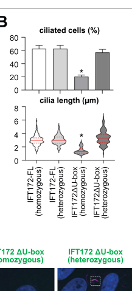

## Question

# Gene Research for Functional Annotation

## ⚠️ CRITICAL: Gene/Protein Identification Context

**BEFORE YOU BEGIN RESEARCH:** You MUST verify you are researching the CORRECT gene/protein. Gene symbols can be ambiguous, especially for less well-characterized genes from non-model organisms.

### Target Gene/Protein Identity (from UniProt):
- **UniProt Accession:** Q9UG01
- **Protein Description:** RecName: Full=Intraflagellar transport protein 172 homolog;
- **Gene Information:** Name=IFT172; Synonyms=KIAA1179;
- **Organism (full):** Homo sapiens (Human).
- **Protein Family:** Belongs to the IFT172 family. .
- **Key Domains:** ARM-type_fold. (IPR016024); EIF3B-like_beta-prop_sf. (IPR060769); TPR-like_helical_dom_sf. (IPR011990); TPR_IF140/IFT172/WDR19. (IPR056168); TPR_IFT80_172_dom. (IPR056157)

### MANDATORY VERIFICATION STEPS:

1. **Check if the gene symbol "IFT172" matches the protein description above**
2. **Verify the organism is correct:** Homo sapiens (Human).
3. **Check if protein family/domains align with what you find in literature**
4. **If you find literature for a DIFFERENT gene with the same or similar symbol, STOP**

### If Gene Symbol is Ambiguous or You Cannot Find Relevant Literature:

**DO NOT PROCEED WITH RESEARCH ON A DIFFERENT GENE.** Instead:
- State clearly: "The gene symbol 'IFT172' is ambiguous or literature is limited for this specific protein"
- Explain what you found (e.g., "Found extensive literature on a different gene with the same symbol in a different organism")
- Describe the protein based ONLY on the UniProt information provided above
- Suggest that the protein function can be inferred from domain/family information

### Research Target:

Please provide a comprehensive research report on the gene **IFT172** (gene ID: IFT172, UniProt: Q9UG01) in human.

The research report should be a detailed narrative explaining the function, biological processes, and localization of the gene product. Citations should be given for all claims.

You should prioritize authoritative reviews and primary scientific literature when conducting research. You can supplement
this with annotations you find in gene/protein databases, but these can be outdated or inaccurate.

We are specifically interested in the primary function of the gene - for enzymes, what reaction is catalyzed, and what is the substrate specificity? For transporters, what is the substrate? For structural proteins or adapters, what is the broader structural role? For signaling molecules, what is the role in the pathway.

We are interested in where in or outside the cell the gene product carries out its function.

We are also interested in the signaling or biochemical pathways in which the gene functions. We are less interested in broad pleiotropic effects, except where these elucidate the precise role.

Include evidence where possible. We are interested in both experimental evidence as well as inference from structure, evolution, or bioinformatic analysis. Precise studies should be prioritized over high-throughput, where available.

## Output

Question: You are an expert researcher providing comprehensive, well-cited information.

Provide detailed information focusing on:
1. Key concepts and definitions with current understanding
2. Recent developments and latest research (prioritize 2023-2024 sources)
3. Current applications and real-world implementations
4. Expert opinions and analysis from authoritative sources
5. Relevant statistics and data from recent studies

Format as a comprehensive research report with proper citations. Include URLs and publication dates where available.
Always prioritize recent, authoritative sources and provide specific citations for all major claims.

# Gene Research for Functional Annotation

## ⚠️ CRITICAL: Gene/Protein Identification Context

**BEFORE YOU BEGIN RESEARCH:** You MUST verify you are researching the CORRECT gene/protein. Gene symbols can be ambiguous, especially for less well-characterized genes from non-model organisms.

### Target Gene/Protein Identity (from UniProt):
- **UniProt Accession:** Q9UG01
- **Protein Description:** RecName: Full=Intraflagellar transport protein 172 homolog;
- **Gene Information:** Name=IFT172; Synonyms=KIAA1179;
- **Organism (full):** Homo sapiens (Human).
- **Protein Family:** Belongs to the IFT172 family. .
- **Key Domains:** ARM-type_fold. (IPR016024); EIF3B-like_beta-prop_sf. (IPR060769); TPR-like_helical_dom_sf. (IPR011990); TPR_IF140/IFT172/WDR19. (IPR056168); TPR_IFT80_172_dom. (IPR056157)

### MANDATORY VERIFICATION STEPS:

1. **Check if the gene symbol "IFT172" matches the protein description above**
2. **Verify the organism is correct:** Homo sapiens (Human).
3. **Check if protein family/domains align with what you find in literature**
4. **If you find literature for a DIFFERENT gene with the same or similar symbol, STOP**

### If Gene Symbol is Ambiguous or You Cannot Find Relevant Literature:

**DO NOT PROCEED WITH RESEARCH ON A DIFFERENT GENE.** Instead:
- State clearly: "The gene symbol 'IFT172' is ambiguous or literature is limited for this specific protein"
- Explain what you found (e.g., "Found extensive literature on a different gene with the same symbol in a different organism")
- Describe the protein based ONLY on the UniProt information provided above
- Suggest that the protein function can be inferred from domain/family information

### Research Target:

Please provide a comprehensive research report on the gene **IFT172** (gene ID: IFT172, UniProt: Q9UG01) in human.

The research report should be a detailed narrative explaining the function, biological processes, and localization of the gene product. Citations should be given for all claims.

You should prioritize authoritative reviews and primary scientific literature when conducting research. You can supplement
this with annotations you find in gene/protein databases, but these can be outdated or inaccurate.

We are specifically interested in the primary function of the gene - for enzymes, what reaction is catalyzed, and what is the substrate specificity? For transporters, what is the substrate? For structural proteins or adapters, what is the broader structural role? For signaling molecules, what is the role in the pathway.

We are interested in where in or outside the cell the gene product carries out its function.

We are also interested in the signaling or biochemical pathways in which the gene functions. We are less interested in broad pleiotropic effects, except where these elucidate the precise role.

Include evidence where possible. We are interested in both experimental evidence as well as inference from structure, evolution, or bioinformatic analysis. Precise studies should be prioritized over high-throughput, where available.

# Human IFT172: functional annotation and research report

## Identity and principal function

**Identity check.** This report concerns human **IFT172**, also called **KIAA1179**, corresponding to the supplied UniProt accession **[Q9UG01](https://www.uniprot.org/uniprotkb/Q9UG01/entry)** and the protein *intraflagellar transport protein 172 homolog*. The IFT172-specific literature agrees with its assignment to the IFT172 family and describes an N-terminal β-propeller region and a long, predominantly helical, tetratricopeptide-repeat (TPR) region. These features are consistent with the domain annotations supplied in the question, including the β-propeller-like and TPR-like folds; the supplied **ARM-type fold** label was not independently established by the studies reviewed here. The accession and KIAA1179 synonym are taken from the supplied UniProt identification, rather than inferred from studies of another gene or organism. (zacharia2026intraflagellartransportprotein pages 2-3, corbo2024newevidenceon pages 33-39, petriman2022biochemicallyvalidatedstructural pages 2-4)

**Primary molecular function:** IFT172 is a large **structural and interaction subunit of the intraflagellar transport B2 (IFT-B2) complex**. It helps organize the protein assemblies, or *IFT trains*, that carry material along the microtubules inside cilia. It is **not the kinesin or dynein motor** and has no established catalytic reaction or single defined transported substrate. Its best-supported specific interactions connect IFT-B to IFT-A and, under experimental conditions, to membranes. This places its principal function in ciliary transport, train organization and cilium maintenance, rather than in catalyzing Hedgehog signaling directly. (petriman2022biochemicallyvalidatedstructural pages 2-4, zacharia2026intraflagellartransportprotein pages 16-17, wang2018membraneassociationand pages 1-2)

## Molecular mechanism and cellular location

IFT trains assemble at the **ciliary base**, move toward the tip through **kinesin-2-driven anterograde transport**, remodel at the tip, and return toward the base through **dynein-2-driven retrograde transport**. IFT-B forms a major structural platform for these trains. IFT172 occupies a comparatively peripheral position in IFT-B2: its N-terminal region interacts with IFT57 and IFT80, while newer structural and biochemical work identifies a C-terminal TPR-mediated connection to IFT-A. Structural observations distinguish contacts with **IFT144 in anterograde trains** and **IFT140 in retrograde trains**. The latter supports a role in train remodeling at the tip, although it does not by itself prove that IFT172 is the sole trigger of turnaround. Much foundational train-structure work used *Chlamydomonas reinhardtii*; the interaction study also examined human IFT172. (petriman2022biochemicallyvalidatedstructural pages 2-4, zacharia2026intraflagellartransportprotein pages 16-17, lacey2025theintraflagellartransport pages 7-9, zacharia2026intraflagellartransportprotein pages 1-2)

This function has a defined **intracellular site**. Endogenous IFT172 was observed around the **ciliary base and along the axoneme** in human fibroblasts. Imaging of tagged, full-length IFT172 in human RPE-1 cells additionally shows signal along the cilium, with enrichment at the **base and tip**. Thus, it is better understood as a protein associated with moving ciliary transport machinery than as one confined permanently to a single organelle subregion. The photoreceptor connecting cilium and outer segment are specialized settings in which this transport role is particularly consequential. (zacharia2026intraflagellartransportprotein pages 13-14, zacharia2026intraflagellartransportprotein media b94d639e, halbritter2013defectsinthe pages 5-7, gupta2018ift172conditionalknockout pages 2-3)

IFT172 has a second experimentally demonstrable property: **purified protein binds and remodels phospholipid membranes**. In reconstituted membrane experiments, membrane pinching occurred at concentrations as low as **50 nM**, producing structures approximately **20 nm** across. Membrane association and binding of IFT57 to IFT172 appear mutually exclusive, suggesting a possible way to regulate when IFT172 associates with membranes versus an assembling IFT complex. These are informative biochemical observations, **not proof that human IFT172 physiologically makes 20-nm vesicles or transports a particular lipid cargo**. (corbo2024newevidenceon pages 33-39, wang2018membraneassociationand pages 1-2)

Algal genetics independently supports a tip function: a temperature-sensitive *Chlamydomonas ift172* mutant accumulates IFT material at the flagellar tip, consistent with impaired turnaround. The newer C-terminal interaction model offers an explanation involving defective association with IFT-A; this cross-species mechanistic interpretation remains distinct from a direct observation of turnaround in human cilia. (zacharia2026intraflagellartransportprotein pages 4-5, zacharia2026intraflagellartransportprotein pages 16-17)

The following evidence matrix separates observations made in human cells or patients from biochemical and animal-model findings.

| Functional conclusion | Direct experiment/species and quantitative result | Interpretation / limitation |
|---|---|---|
| **IFT-B2 structural adaptor bridging IFT-B and IFT-A** | Structural and biochemical models place IFT172 peripherally in IFT-B2; its N-terminus associates with IFT57/IFT80, whereas the C-terminal TPR region contacts IFT144 in anterograde trains and IFT140 in retrograde trains. Reported train stoichiometry is approximately **2 IFT-B:1 IFT-A**. (petriman2022biochemicallyvalidatedstructural pages 2-4, zacharia2026intraflagellartransportprotein pages 16-17) | Supports a non-motor scaffolding role in train assembly and directional remodeling. Much of the foundational structural evidence derives from *Chlamydomonas*, although the architecture is conserved and newer work includes human IFT172. |
| **Membrane-binding and remodeling activity** | Purified IFT172 bound phospholipid membranes and remodeled large membranes into approximately **20-nm vesicular structures**; membrane pinching occurred at concentrations as low as **50 nM**. (wang2018membraneassociationand pages 1-2) | Demonstrates intrinsic membrane-remodeling capacity in vitro, consistent with a cargo-adaptor or membrane-organizing role. It does not establish that IFT172 generates vesicles physiologically inside human cilia. |
| **Dynamic localization in the human primary cilium** | Human fibroblast studies localized endogenous IFT172 to the **ciliary axoneme and ciliary-base region**; full-length tagged protein also distributes along the axoneme with enrichment at the **base and tip**. (zacharia2026intraflagellartransportprotein pages 13-14, halbritter2013defectsinthe pages 5-7) | Localization matches participation in IFT trains moving between base and tip rather than residence in one fixed compartment. Overexpressed tagged constructs may not perfectly reproduce endogenous abundance or dynamics. |
| **Biallelic human variants disrupt ciliary composition without necessarily abolishing ciliogenesis** | In enriched ciliopathy cohorts, biallelic IFT172 variants were found in **12 families comprising 14 affected individuals**. Patient fibroblasts remained normally ciliated overall but had **elongated cilia**, reduced axonemal IFT140, and IFT140 accumulation at the basal body. (halbritter2013defectsinthe pages 1-2, halbritter2013defectsinthe pages 7-9) | Supports autosomal-recessive Jeune/Mainzer–Saldino-spectrum disease through defective ciliary transport and composition, not invariably complete cilium loss. These selected cohorts cannot provide population prevalence estimates. |
| **Essential photoreceptor trafficking and maintenance role** | Rod-specific mouse *Ift172* knockout caused rhodopsin mislocalization by **postnatal day 21** and an approximately **84% reduction in rod-driven ERG b-wave amplitude at one month**; complete outer-nuclear-layer degeneration followed by two months. (gupta2018ift172conditionalknockout pages 2-3) | Trafficking defects precede cell loss, supporting a primary role in maintaining the photoreceptor connecting cilium and outer segment. This is strong mechanistic animal evidence, not a direct quantitative observation in human retina. |
| **C-terminal U-box-like domain supports protein stability, ciliogenesis, and signaling** | In CRISPR-engineered human RPE-1 cells, homozygous U-box deletion shortened retained cilia to a median of approximately **1.3 µm versus 3.0 µm** for full-length controls. Heterozygous cells retained normal ciliation but showed increased TGF-β1-induced SMAD2 phosphorylation and reduced TGF-β1-induced AKT activation. (zacharia2026intraflagellartransportprotein pages 13-14, zacharia2026intraflagellartransportprotein pages 14-16) | The study’s **version of record is dated 23 June 2026**, although the reviewed preprint originated in 2024–2025. The domain binds ubiquitin, but the dominant in-vitro conjugation may be E2-driven; physiological E3-ligase activity and cellular substrates remain unconfirmed. |

*Table: Six key experimental findings define human IFT172 as a ciliary IFT-B2 adaptor with membrane-associated, transport, and signaling functions. The matrix distinguishes direct human evidence from conserved model-organism findings and flags important interpretive limits.*

The inspected **Figure 5B–C** of the human RPE-1 study is consistent with the matrix: homozygous C-terminal-domain deletion markedly impairs ciliogenesis, while the truncated IFT172 detectable in remaining cilia can still enter the ciliary compartment. That distinction argues against treating failure of ciliary targeting as the only possible mechanism of IFT172 dysfunction. (zacharia2026intraflagellartransportprotein pages 13-14, zacharia2026intraflagellartransportprotein media b94d639e, zacharia2026intraflagellartransportprotein media e59c50cf)

## Signaling pathways: consequences of transport rather than a defined signaling enzyme

The clearest established pathway connection is **mammalian Hedgehog signaling**. In mouse genetics, *Ift172* loss prevents normal pathway output despite manipulations of the upstream regulators **PTCH1** and **SMO**. It disrupts both formation of GLI-dependent activator activity and production of the processed **GLI3 repressor**. In one comparison, the GLI3 repressor-to-full-length ratio in *Ift172* mutants was **less than one-eighth of wild type**, whereas *Smo* mutants had a ratio **3.5 times wild type**. These contrasting results help explain why ciliary failure can suppress Hedgehog-dependent neural-tube identities yet derepress aspects of limb patterning. Mouse embryonic fibroblasts lacking *Ift172*-dependent cilia likewise failed to respond normally to Hedgehog-pathway stimulation. This establishes a requirement for ciliary architecture and trafficking in pathway transduction; it does **not** identify GLI or SMO as a verified direct binding substrate of IFT172. (huangfu2005ciliaandhedgehog pages 2-3, huangfu2005ciliaandhedgehog pages 1-2, ocbina2008intraflagellartransportcilia pages 3-6)

That pathway conclusion should not be generalized without qualification across species or pathways. Zebrafish *ift172* mutants had ciliary defects without detectable Hedgehog-response defects in the reported embryonic assays. Conversely, mouse *Ift172* mutants retained normal **canonical Wnt** reporter activity and Wnt-ligand responses in the examined midgestation embryos and fibroblasts. Thus, a claim that IFT172 is an obligatory direct regulator of every cilium-associated signaling pathway would exceed the evidence. (ocbina2009primaryciliaare pages 1-2, lunt2009zebrafishift57ift88 pages 8-9)

A newer human-cell study implicates the **C-terminal U-box-like domain** in protein stability and signaling. Biochemical assays showed ubiquitin binding, but the investigators cautioned that prominent in-vitro ubiquitin conjugation could be driven by the E2 enzyme; a physiological IFT172 **E3-ligase reaction, cellular ubiquitination substrate and substrate specificity have not been established**. Homozygous deletion of this domain in engineered human RPE-1 cells reduced IFT172 abundance and ciliogenesis; retained cilia had a median length of approximately **1.3 µm**, versus **3.0 µm** in full-length controls. In heterozygous cells, gross ciliation was maintained, but **TGF-β1-induced SMAD2 phosphorylation increased** while **TGF-β1-induced AKT activation decreased**; a tested PDGF-DD-induced AKT response was unaffected. These findings point to a context-dependent contribution to signaling, not a demonstrated direct biochemical reaction with SMAD2 or AKT. The paper’s publication record requires care: its preprint was posted in **November 2024**, whereas the inspected article identifies its **version of record as 23 June 2026**. (zacharia2026intraflagellartransportprotein pages 13-14, zacharia2026intraflagellartransportprotein pages 11-12, zacharia2026intraflagellartransportprotein pages 14-16, zacharia2026intraflagellartransportprotein pages 1-2)

## Human disease evidence and applications

**IFT172 is an established human ciliopathy gene.** In a major study of clinically selected cohorts, investigators examined **1,467 individuals with nephronophthisis-related ciliopathies** and **63 with asphyxiating thoracic dystrophy**, identifying **biallelic IFT172 variants in 12 families encompassing 14 affected individuals**. Findings connected IFT172 to **Jeune/asphyxiating thoracic dystrophy and Mainzer–Saldino-spectrum disease**, with skeletal abnormalities and variable renal, hepatic and retinal involvement; two families also had cerebellar abnormalities. These are ascertainment figures from affected cohorts, **not population-prevalence estimates**. (halbritter2013defectsinthe pages 1-2)

Patient-derived fibroblasts provide a particularly useful functional qualification. Some IFT172-mutant fibroblasts **still formed cilia** and had no significant reduction in ciliated-cell frequency, but the cilia were **elongated** and their composition was altered: **IFT140 accumulated at the basal body and was reduced along the cilium**, with reduced axonemal ACIII also reported. The clinically relevant defect can therefore be **misdistribution of ciliary machinery and signaling components despite preserved gross ciliogenesis**. By contrast, stronger experimental loss of *Ift172* in other systems can severely compromise cilium formation. (halbritter2013defectsinthe pages 5-7, halbritter2013defectsinthe pages 7-9)

The phenotype is not restricted to severe skeletal disease. A human study identified recessive IFT172 variants in **three families** with either **isolated retinal degeneration** or **Bardet–Biedl-like syndrome**. Allele-specific tests supported differing residual functions: in zebrafish rescue assays, **p.H1567Q and p.D1605E** rescued weakly, whereas **p.L257P** failed to complement the *ift172* perturbation. In cultured ciliated cells, p.L257P failed to localize normally to cilia, while the two tested C-terminal substitutions retained ciliary localization but were associated with shorter cilia. These observations support a spectrum of impairment rather than a simple rule that every disease allele abolishes cilia. IFT172 is also designated **BBS20** in the human Bardet–Biedl literature. (schaefer2016identificationofa pages 1-2, bujakowska2015mutationsinift172 pages 6-6, bujakowska2015mutationsinift172 pages 2-3, bujakowska2015mutationsinift172 pages 4-5)

A rod-specific mouse knockout provides mechanistic support for the retinal presentation: **rhodopsin mislocalization was detectable by postnatal day 21**, before extensive cell loss; at approximately one month, the **rod-driven electroretinogram b-wave was reduced by 84%**, and by two months the outer nuclear layer had degenerated. This sequence favors a primary defect in photoreceptor ciliary/outer-segment trafficking and maintenance, while remaining an **animal-model result**, not a measured rate of human disease progression. (gupta2018ift172conditionalknockout pages 3-6, gupta2018ift172conditionalknockout pages 2-3)

**Current implementation is chiefly diagnostic and interpretive.** IFT172 can be included in sequencing evaluations for suspected skeletal–renal–retinal ciliopathy, Bardet–Biedl syndrome or otherwise unexplained inherited retinal degeneration. Clinical interpretation should integrate **biallelic inheritance and segregation, phenotype, splicing or cell-based evidence where available, and the possibility of retained cilia with abnormal composition**. A 2025 retinal-dystrophy case report illustrates the limitation: its newly observed IFT172 variant was classified as a **variant of uncertain significance**, not established as the cause of that patient’s disease. The studies reviewed here do not establish an IFT172-specific treatment or a clinically validated IFT172 biochemical-drug target. (halbritter2013defectsinthe pages 5-7, adeghate2025novelpathogenicvariants pages 1-3, halbritter2013defectsinthe pages 1-2, schaefer2016identificationofa pages 1-2)

## Selected sources and publication dates

- **Recent review:** Zheng *et al.*, “Primary cilia-associated protein IFT172 in ciliopathies,” *Frontiers in Cell and Developmental Biology*, **January 2023**. [https://doi.org/10.3389/fcell.2023.1074880](https://doi.org/10.3389/fcell.2023.1074880). Useful synthesis; model-organism results require explicit species attribution. (zheng2023primaryciliaassociatedprotein pages 3-4, zheng2023primaryciliaassociatedprotein pages 4-5)
- **IFT-B structural study:** Petriman *et al.*, “Biochemically validated structural model of the 15-subunit intraflagellar transport complex IFT-B,” *EMBO Journal*, **2022**. [https://doi.org/10.15252/embj.2022112440](https://doi.org/10.15252/embj.2022112440). (petriman2022biochemicallyvalidatedstructural pages 2-4)
- **Membrane biochemistry:** Wang *et al.*, “Membrane association and remodeling by intraflagellar transport protein IFT172,” *Nature Communications*, **November 2018**. [https://doi.org/10.1038/s41467-018-07037-9](https://doi.org/10.1038/s41467-018-07037-9). (wang2018membraneassociationand pages 1-2)
- **Human genetic and fibroblast evidence:** Halbritter *et al.*, “Defects in the IFT-B component IFT172 cause Jeune and Mainzer–Saldino syndromes in humans,” *American Journal of Human Genetics*, **7 November 2013**. [https://doi.org/10.1016/j.ajhg.2013.09.012](https://doi.org/10.1016/j.ajhg.2013.09.012). (halbritter2013defectsinthe pages 7-9, halbritter2013defectsinthe pages 1-2)
- **Retinal-spectrum genetics:** Bujakowska *et al.*, “Mutations in IFT172 cause isolated retinal degeneration and Bardet–Biedl syndrome,” *Human Molecular Genetics*, **2015**. [https://doi.org/10.1093/hmg/ddu441](https://doi.org/10.1093/hmg/ddu441). (bujakowska2015mutationsinift172 pages 6-6, bujakowska2015mutationsinift172 pages 1-2)
- **Newer domain study:** Zacharia *et al.*, “Intraflagellar transport protein IFT172 contains a C-terminal ubiquitin-binding U-box-like domain involved in ciliary signaling,” *eLife*; **preprint posted 5 November 2024; version of record dated 23 June 2026** in the inspected article. [https://doi.org/10.7554/eLife.104906](https://doi.org/10.7554/eLife.104906). Its ubiquitin-related findings should not be equated with proof of a physiological E3-ligase function. (zacharia2026intraflagellartransportprotein pages 11-12, zacharia2026intraflagellartransportprotein pages 1-2)

References

1. (zacharia2026intraflagellartransportprotein pages 2-3): Nevin K Zacharia, Stefanie Kuhns, Niels Boegholm, Anni Christensen, Jiaolong Wang, Narcis A Petriman, Anna Lorentzen, Jindriska L Fialova, Lucie Menguy, Sophie Saunier, Soren T Christensen, Jens S Andersen, Sagar Bhogaraju, and Esben Lorentzen. Intraflagellar transport protein ift172 contains a c-terminal ubiquitin-binding u-box-like domain involved in ciliary signaling. Jan 2026. URL: https://doi.org/10.7554/elife.104906.1, doi:10.7554/elife.104906.1. This article has 5 citations.

2. (corbo2024newevidenceon pages 33-39): Dalia Corbo, Caterina Mencarelli, and Pietro Lupetti. New evidence on ift turnaround at the flagellar tip and the association of ift trains with the flagellar membrane in the model organism chlamydomonas reinhardtii. Jul 2024. URL: https://doi.org/10.25434/dalia-corbo\_phd2024-07-12, doi:10.25434/dalia-corbo\_phd2024-07-12. This article has 0 citations.

3. (petriman2022biochemicallyvalidatedstructural pages 2-4): Narcis A Petriman, Marta Loureiro‐López, Michael Taschner, Nevin K Zacharia, Magdalena M Georgieva, Niels Boegholm, Jiaolong Wang, André Mourão, Robert B Russell, Jens S Andersen, and Esben Lorentzen. Biochemically validated structural model of the 15‐subunit intraflagellar transport complex ift‐b. The EMBO Journal, Nov 2022. URL: https://doi.org/10.15252/embj.2022112440, doi:10.15252/embj.2022112440. This article has 58 citations.

4. (zacharia2026intraflagellartransportprotein pages 16-17): Nevin K Zacharia, Stefanie Kuhns, Niels Boegholm, Anni Christensen, Jiaolong Wang, Narcis A Petriman, Anna Lorentzen, Jindriska L Fialova, Lucie Menguy, Sophie Saunier, Soren T Christensen, Jens S Andersen, Sagar Bhogaraju, and Esben Lorentzen. Intraflagellar transport protein ift172 contains a c-terminal ubiquitin-binding u-box-like domain involved in ciliary signaling. Jan 2026. URL: https://doi.org/10.7554/elife.104906.1, doi:10.7554/elife.104906.1. This article has 5 citations.

5. (wang2018membraneassociationand pages 1-2): Qianmin Wang, Michael Taschner, Kristina A. Ganzinger, Charlotte Kelley, Alethia Villasenor, Michael Heymann, Petra Schwille, Esben Lorentzen, and Naoko Mizuno. Membrane association and remodeling by intraflagellar transport protein ift172. Nature Communications, Nov 2018. URL: https://doi.org/10.1038/s41467-018-07037-9, doi:10.1038/s41467-018-07037-9. This article has 28 citations and is from a highest quality peer-reviewed journal.

6. (lacey2025theintraflagellartransport pages 7-9): Samuel E. Lacey and Gaia Pigino. The intraflagellar transport cycle. Nature reviews. Molecular cell biology, 26:175-192, Nov 2025. URL: https://doi.org/10.1038/s41580-024-00797-x, doi:10.1038/s41580-024-00797-x. This article has 73 citations.

7. (zacharia2026intraflagellartransportprotein pages 1-2): Nevin K Zacharia, Stefanie Kuhns, Niels Boegholm, Anni Christensen, Jiaolong Wang, Narcis A Petriman, Anna Lorentzen, Jindriska L Fialova, Lucie Menguy, Sophie Saunier, Soren T Christensen, Jens S Andersen, Sagar Bhogaraju, and Esben Lorentzen. Intraflagellar transport protein ift172 contains a c-terminal ubiquitin-binding u-box-like domain involved in ciliary signaling. Jan 2026. URL: https://doi.org/10.7554/elife.104906.1, doi:10.7554/elife.104906.1. This article has 5 citations.

8. (zacharia2026intraflagellartransportprotein pages 13-14): Nevin K Zacharia, Stefanie Kuhns, Niels Boegholm, Anni Christensen, Jiaolong Wang, Narcis A Petriman, Anna Lorentzen, Jindriska L Fialova, Lucie Menguy, Sophie Saunier, Soren T Christensen, Jens S Andersen, Sagar Bhogaraju, and Esben Lorentzen. Intraflagellar transport protein ift172 contains a c-terminal ubiquitin-binding u-box-like domain involved in ciliary signaling. Jan 2026. URL: https://doi.org/10.7554/elife.104906.1, doi:10.7554/elife.104906.1. This article has 5 citations.

9. (zacharia2026intraflagellartransportprotein media b94d639e): Nevin K Zacharia, Stefanie Kuhns, Niels Boegholm, Anni Christensen, Jiaolong Wang, Narcis A Petriman, Anna Lorentzen, Jindriska L Fialova, Lucie Menguy, Sophie Saunier, Soren T Christensen, Jens S Andersen, Sagar Bhogaraju, and Esben Lorentzen. Intraflagellar transport protein ift172 contains a c-terminal ubiquitin-binding u-box-like domain involved in ciliary signaling. Jan 2026. URL: https://doi.org/10.7554/elife.104906.1, doi:10.7554/elife.104906.1. This article has 5 citations.

10. (halbritter2013defectsinthe pages 5-7): Jan Halbritter, Albane A. Bizet, Miriam Schmidts, Jonathan D. Porath, Daniela A. Braun, Heon Yung Gee, Aideen M. McInerney-Leo, Pauline Krug, Emilie Filhol, Erica E. Davis, Rannar Airik, Peter G. Czarnecki, Anna M. Lehman, Peter Trnka, Patrick Nitschké, Christine Bole-Feysot, Markus Schueler, Bertrand Knebelmann, Stéphane Burtey, Attila J. Szabó, Kálmán Tory, Paul J. Leo, Brooke Gardiner, Fiona A. McKenzie, Andreas Zankl, Matthew A. Brown, Jane L. Hartley, Eamonn R. Maher, Chunmei Li, Michel R. Leroux, Peter J. Scambler, Shing H. Zhan, Steven J. Jones, Hülya Kayserili, Beyhan Tuysuz, Khemchand N. Moorani, Alexandru Constantinescu, Ian D. Krantz, Bernard S. Kaplan, Jagesh V. Shah, Toby W. Hurd, Dan Doherty, Nicholas Katsanis, Emma L. Duncan, Edgar A. Otto, Philip L. Beales, Hannah M. Mitchison, Sophie Saunier, and Friedhelm Hildebrandt. Defects in the ift-b component ift172 cause jeune and mainzer-saldino syndromes in humans. American journal of human genetics, 93 5:915-25, Nov 2013. URL: https://doi.org/10.1016/j.ajhg.2013.09.012, doi:10.1016/j.ajhg.2013.09.012. This article has 189 citations and is from a highest quality peer-reviewed journal.

11. (gupta2018ift172conditionalknockout pages 2-3): Priya R Gupta, Nachiket Pendse, Scott H Greenwald, Mihoko Leon, Qin Liu, Eric A Pierce, and Kinga M Bujakowska. Ift172 conditional knock-out mice exhibit rapid retinal degeneration and protein trafficking defects. Human Molecular Genetics, 27:2012-2024, Apr 2018. URL: https://doi.org/10.1093/hmg/ddy109, doi:10.1093/hmg/ddy109. This article has 40 citations and is from a domain leading peer-reviewed journal.

12. (zacharia2026intraflagellartransportprotein pages 4-5): Nevin K Zacharia, Stefanie Kuhns, Niels Boegholm, Anni Christensen, Jiaolong Wang, Narcis A Petriman, Anna Lorentzen, Jindriska L Fialova, Lucie Menguy, Sophie Saunier, Soren T Christensen, Jens S Andersen, Sagar Bhogaraju, and Esben Lorentzen. Intraflagellar transport protein ift172 contains a c-terminal ubiquitin-binding u-box-like domain involved in ciliary signaling. Jan 2026. URL: https://doi.org/10.7554/elife.104906.1, doi:10.7554/elife.104906.1. This article has 5 citations.

13. (halbritter2013defectsinthe pages 1-2): Jan Halbritter, Albane A. Bizet, Miriam Schmidts, Jonathan D. Porath, Daniela A. Braun, Heon Yung Gee, Aideen M. McInerney-Leo, Pauline Krug, Emilie Filhol, Erica E. Davis, Rannar Airik, Peter G. Czarnecki, Anna M. Lehman, Peter Trnka, Patrick Nitschké, Christine Bole-Feysot, Markus Schueler, Bertrand Knebelmann, Stéphane Burtey, Attila J. Szabó, Kálmán Tory, Paul J. Leo, Brooke Gardiner, Fiona A. McKenzie, Andreas Zankl, Matthew A. Brown, Jane L. Hartley, Eamonn R. Maher, Chunmei Li, Michel R. Leroux, Peter J. Scambler, Shing H. Zhan, Steven J. Jones, Hülya Kayserili, Beyhan Tuysuz, Khemchand N. Moorani, Alexandru Constantinescu, Ian D. Krantz, Bernard S. Kaplan, Jagesh V. Shah, Toby W. Hurd, Dan Doherty, Nicholas Katsanis, Emma L. Duncan, Edgar A. Otto, Philip L. Beales, Hannah M. Mitchison, Sophie Saunier, and Friedhelm Hildebrandt. Defects in the ift-b component ift172 cause jeune and mainzer-saldino syndromes in humans. American journal of human genetics, 93 5:915-25, Nov 2013. URL: https://doi.org/10.1016/j.ajhg.2013.09.012, doi:10.1016/j.ajhg.2013.09.012. This article has 189 citations and is from a highest quality peer-reviewed journal.

14. (halbritter2013defectsinthe pages 7-9): Jan Halbritter, Albane A. Bizet, Miriam Schmidts, Jonathan D. Porath, Daniela A. Braun, Heon Yung Gee, Aideen M. McInerney-Leo, Pauline Krug, Emilie Filhol, Erica E. Davis, Rannar Airik, Peter G. Czarnecki, Anna M. Lehman, Peter Trnka, Patrick Nitschké, Christine Bole-Feysot, Markus Schueler, Bertrand Knebelmann, Stéphane Burtey, Attila J. Szabó, Kálmán Tory, Paul J. Leo, Brooke Gardiner, Fiona A. McKenzie, Andreas Zankl, Matthew A. Brown, Jane L. Hartley, Eamonn R. Maher, Chunmei Li, Michel R. Leroux, Peter J. Scambler, Shing H. Zhan, Steven J. Jones, Hülya Kayserili, Beyhan Tuysuz, Khemchand N. Moorani, Alexandru Constantinescu, Ian D. Krantz, Bernard S. Kaplan, Jagesh V. Shah, Toby W. Hurd, Dan Doherty, Nicholas Katsanis, Emma L. Duncan, Edgar A. Otto, Philip L. Beales, Hannah M. Mitchison, Sophie Saunier, and Friedhelm Hildebrandt. Defects in the ift-b component ift172 cause jeune and mainzer-saldino syndromes in humans. American journal of human genetics, 93 5:915-25, Nov 2013. URL: https://doi.org/10.1016/j.ajhg.2013.09.012, doi:10.1016/j.ajhg.2013.09.012. This article has 189 citations and is from a highest quality peer-reviewed journal.

15. (zacharia2026intraflagellartransportprotein pages 14-16): Nevin K Zacharia, Stefanie Kuhns, Niels Boegholm, Anni Christensen, Jiaolong Wang, Narcis A Petriman, Anna Lorentzen, Jindriska L Fialova, Lucie Menguy, Sophie Saunier, Soren T Christensen, Jens S Andersen, Sagar Bhogaraju, and Esben Lorentzen. Intraflagellar transport protein ift172 contains a c-terminal ubiquitin-binding u-box-like domain involved in ciliary signaling. Jan 2026. URL: https://doi.org/10.7554/elife.104906.1, doi:10.7554/elife.104906.1. This article has 5 citations.

16. (zacharia2026intraflagellartransportprotein media e59c50cf): Nevin K Zacharia, Stefanie Kuhns, Niels Boegholm, Anni Christensen, Jiaolong Wang, Narcis A Petriman, Anna Lorentzen, Jindriska L Fialova, Lucie Menguy, Sophie Saunier, Soren T Christensen, Jens S Andersen, Sagar Bhogaraju, and Esben Lorentzen. Intraflagellar transport protein ift172 contains a c-terminal ubiquitin-binding u-box-like domain involved in ciliary signaling. Jan 2026. URL: https://doi.org/10.7554/elife.104906.1, doi:10.7554/elife.104906.1. This article has 5 citations.

17. (huangfu2005ciliaandhedgehog pages 2-3): Danwei Huangfu and Kathryn V. Anderson. Cilia and hedgehog responsiveness in the mouse. Proceedings of the National Academy of Sciences of the United States of America, 102 32:11325-30, Aug 2005. URL: https://doi.org/10.1073/pnas.0505328102, doi:10.1073/pnas.0505328102. This article has 1022 citations and is from a highest quality peer-reviewed journal.

18. (huangfu2005ciliaandhedgehog pages 1-2): Danwei Huangfu and Kathryn V. Anderson. Cilia and hedgehog responsiveness in the mouse. Proceedings of the National Academy of Sciences of the United States of America, 102 32:11325-30, Aug 2005. URL: https://doi.org/10.1073/pnas.0505328102, doi:10.1073/pnas.0505328102. This article has 1022 citations and is from a highest quality peer-reviewed journal.

19. (ocbina2008intraflagellartransportcilia pages 3-6): Polloneal Jymmiel R. Ocbina and Kathryn V. Anderson. Intraflagellar transport, cilia, and mammalian hedgehog signaling: analysis in mouse embryonic fibroblasts. Developmental Dynamics, 237:2030-2038, Aug 2008. URL: https://doi.org/10.1002/dvdy.21551, doi:10.1002/dvdy.21551. This article has 238 citations and is from a peer-reviewed journal.

20. (ocbina2009primaryciliaare pages 1-2): Polloneal Jymmiel R. Ocbina, Miquel Tuson, and Kathryn V. Anderson. Primary cilia are not required for normal canonical wnt signaling in the mouse embryo. PLoS ONE, 4:e6839, Aug 2009. URL: https://doi.org/10.1371/journal.pone.0006839, doi:10.1371/journal.pone.0006839. This article has 221 citations and is from a peer-reviewed journal.

21. (lunt2009zebrafishift57ift88 pages 8-9): Shannon C. Lunt, Tony Haynes, and Brian D. Perkins. Zebrafish ift57, ift88, and ift172 intraflagellar transport mutants disrupt cilia but do not affect hedgehog signaling. Developmental Dynamics, 238:1744-1759, Jul 2009. URL: https://doi.org/10.1002/dvdy.21999, doi:10.1002/dvdy.21999. This article has 91 citations and is from a peer-reviewed journal.

22. (zacharia2026intraflagellartransportprotein pages 11-12): Nevin K Zacharia, Stefanie Kuhns, Niels Boegholm, Anni Christensen, Jiaolong Wang, Narcis A Petriman, Anna Lorentzen, Jindriska L Fialova, Lucie Menguy, Sophie Saunier, Soren T Christensen, Jens S Andersen, Sagar Bhogaraju, and Esben Lorentzen. Intraflagellar transport protein ift172 contains a c-terminal ubiquitin-binding u-box-like domain involved in ciliary signaling. Jan 2026. URL: https://doi.org/10.7554/elife.104906.1, doi:10.7554/elife.104906.1. This article has 5 citations.

23. (schaefer2016identificationofa pages 1-2): Elise Schaefer, Corinne Stoetzel, Sophie Scheidecker, Véronique Geoffroy, Megana K Prasad, Claire Redin, Isabelle Missotte, Didier Lacombe, Jean-Louis Mandel, Jean Muller, and Hélène Dollfus. Identification of a novel mutation confirms the implication of ift172 (bbs20) in bardet–biedl syndrome. Journal of Human Genetics, 61:447-450, Jan 2016. URL: https://doi.org/10.1038/jhg.2015.162, doi:10.1038/jhg.2015.162. This article has 91 citations and is from a peer-reviewed journal.

24. (bujakowska2015mutationsinift172 pages 6-6): Kinga M. Bujakowska, Qi Zhang, Anna M. Siemiatkowska, Qin Liu, Emily Place, Marni J. Falk, Mark Consugar, Marie-Elise Lancelot, Aline Antonio, Christine Lonjou, Wassila Carpentier, Saddek Mohand-Saïd, Anneke I. den Hollander, Frans P.M. Cremers, Bart P. Leroy, Xiaowu Gai, José-Alain Sahel, L. Ingeborgh van den Born, Rob W.J. Collin, Christina Zeitz, Isabelle Audo, and Eric A. Pierce. Mutations in ift172 cause isolated retinal degeneration and bardet-biedl syndrome. Human molecular genetics, 24 1:230-42, Aug 2015. URL: https://doi.org/10.1093/hmg/ddu441, doi:10.1093/hmg/ddu441. This article has 200 citations and is from a domain leading peer-reviewed journal.

25. (bujakowska2015mutationsinift172 pages 2-3): Kinga M. Bujakowska, Qi Zhang, Anna M. Siemiatkowska, Qin Liu, Emily Place, Marni J. Falk, Mark Consugar, Marie-Elise Lancelot, Aline Antonio, Christine Lonjou, Wassila Carpentier, Saddek Mohand-Saïd, Anneke I. den Hollander, Frans P.M. Cremers, Bart P. Leroy, Xiaowu Gai, José-Alain Sahel, L. Ingeborgh van den Born, Rob W.J. Collin, Christina Zeitz, Isabelle Audo, and Eric A. Pierce. Mutations in ift172 cause isolated retinal degeneration and bardet-biedl syndrome. Human molecular genetics, 24 1:230-42, Aug 2015. URL: https://doi.org/10.1093/hmg/ddu441, doi:10.1093/hmg/ddu441. This article has 200 citations and is from a domain leading peer-reviewed journal.

26. (bujakowska2015mutationsinift172 pages 4-5): Kinga M. Bujakowska, Qi Zhang, Anna M. Siemiatkowska, Qin Liu, Emily Place, Marni J. Falk, Mark Consugar, Marie-Elise Lancelot, Aline Antonio, Christine Lonjou, Wassila Carpentier, Saddek Mohand-Saïd, Anneke I. den Hollander, Frans P.M. Cremers, Bart P. Leroy, Xiaowu Gai, José-Alain Sahel, L. Ingeborgh van den Born, Rob W.J. Collin, Christina Zeitz, Isabelle Audo, and Eric A. Pierce. Mutations in ift172 cause isolated retinal degeneration and bardet-biedl syndrome. Human molecular genetics, 24 1:230-42, Aug 2015. URL: https://doi.org/10.1093/hmg/ddu441, doi:10.1093/hmg/ddu441. This article has 200 citations and is from a domain leading peer-reviewed journal.

27. (gupta2018ift172conditionalknockout pages 3-6): Priya R Gupta, Nachiket Pendse, Scott H Greenwald, Mihoko Leon, Qin Liu, Eric A Pierce, and Kinga M Bujakowska. Ift172 conditional knock-out mice exhibit rapid retinal degeneration and protein trafficking defects. Human Molecular Genetics, 27:2012-2024, Apr 2018. URL: https://doi.org/10.1093/hmg/ddy109, doi:10.1093/hmg/ddy109. This article has 40 citations and is from a domain leading peer-reviewed journal.

28. (adeghate2025novelpathogenicvariants pages 1-3): Jennifer Adeghate, Samantha R. Goldburg, Sherry Bass, Joshua Schwimmer, and Talia R. Kaden. Novel pathogenic variants in ift140 and ift172 genes in three patients with similar retinal dystrophy phenotypes. Case Reports in Ophthalmology, 16:323-330, Mar 2025. URL: https://doi.org/10.1159/000545390, doi:10.1159/000545390. This article has 1 citations and is from a peer-reviewed journal.

29. (zheng2023primaryciliaassociatedprotein pages 3-4): Nan-Xi Zheng, Ya-Ting Miao, Xi Zhang, Mu-Zhi Huang, Muhammad Jahangir, Shilin Luo, and Bing Lang. Primary cilia-associated protein ift172 in ciliopathies. Frontiers in Cell and Developmental Biology, Jan 2023. URL: https://doi.org/10.3389/fcell.2023.1074880, doi:10.3389/fcell.2023.1074880. This article has 13 citations.

30. (zheng2023primaryciliaassociatedprotein pages 4-5): Nan-Xi Zheng, Ya-Ting Miao, Xi Zhang, Mu-Zhi Huang, Muhammad Jahangir, Shilin Luo, and Bing Lang. Primary cilia-associated protein ift172 in ciliopathies. Frontiers in Cell and Developmental Biology, Jan 2023. URL: https://doi.org/10.3389/fcell.2023.1074880, doi:10.3389/fcell.2023.1074880. This article has 13 citations.

31. (bujakowska2015mutationsinift172 pages 1-2): Kinga M. Bujakowska, Qi Zhang, Anna M. Siemiatkowska, Qin Liu, Emily Place, Marni J. Falk, Mark Consugar, Marie-Elise Lancelot, Aline Antonio, Christine Lonjou, Wassila Carpentier, Saddek Mohand-Saïd, Anneke I. den Hollander, Frans P.M. Cremers, Bart P. Leroy, Xiaowu Gai, José-Alain Sahel, L. Ingeborgh van den Born, Rob W.J. Collin, Christina Zeitz, Isabelle Audo, and Eric A. Pierce. Mutations in ift172 cause isolated retinal degeneration and bardet-biedl syndrome. Human molecular genetics, 24 1:230-42, Aug 2015. URL: https://doi.org/10.1093/hmg/ddu441, doi:10.1093/hmg/ddu441. This article has 200 citations and is from a domain leading peer-reviewed journal.

## Artifacts

- [Edison artifact artifact-00](IFT172-deep-research-falcon_artifacts/artifact-00.md)

## Citations

1. wang2018membraneassociationand pages 1-2
2. halbritter2013defectsinthe pages 1-2
3. petriman2022biochemicallyvalidatedstructural pages 2-4
4. zacharia2026intraflagellartransportprotein pages 2-3
5. corbo2024newevidenceon pages 33-39
6. zacharia2026intraflagellartransportprotein pages 16-17
7. lacey2025theintraflagellartransport pages 7-9
8. zacharia2026intraflagellartransportprotein pages 1-2
9. zacharia2026intraflagellartransportprotein pages 13-14
10. halbritter2013defectsinthe pages 5-7
11. zacharia2026intraflagellartransportprotein pages 4-5
12. halbritter2013defectsinthe pages 7-9
13. zacharia2026intraflagellartransportprotein pages 14-16
14. huangfu2005ciliaandhedgehog pages 2-3
15. huangfu2005ciliaandhedgehog pages 1-2
16. ocbina2008intraflagellartransportcilia pages 3-6
17. ocbina2009primaryciliaare pages 1-2
18. zacharia2026intraflagellartransportprotein pages 11-12
19. schaefer2016identificationofa pages 1-2
20. adeghate2025novelpathogenicvariants pages 1-3
21. zheng2023primaryciliaassociatedprotein pages 3-4
22. zheng2023primaryciliaassociatedprotein pages 4-5
23. Q9UG01
24. https://doi.org/10.3389/fcell.2023.1074880
25. https://doi.org/10.15252/embj.2022112440
26. https://doi.org/10.1038/s41467-018-07037-9
27. https://doi.org/10.1016/j.ajhg.2013.09.012
28. https://doi.org/10.1093/hmg/ddu441
29. https://doi.org/10.7554/eLife.104906
30. https://www.uniprot.org/uniprotkb/Q9UG01/entry
31. https://doi.org/10.3389/fcell.2023.1074880](https://doi.org/10.3389/fcell.2023.1074880
32. https://doi.org/10.15252/embj.2022112440](https://doi.org/10.15252/embj.2022112440
33. https://doi.org/10.1038/s41467-018-07037-9](https://doi.org/10.1038/s41467-018-07037-9
34. https://doi.org/10.1016/j.ajhg.2013.09.012](https://doi.org/10.1016/j.ajhg.2013.09.012
35. https://doi.org/10.1093/hmg/ddu441](https://doi.org/10.1093/hmg/ddu441
36. https://doi.org/10.7554/eLife.104906](https://doi.org/10.7554/eLife.104906
37. https://doi.org/10.7554/elife.104906.1,
38. https://doi.org/10.25434/dalia-corbo\_phd2024-07-12,
39. https://doi.org/10.15252/embj.2022112440,
40. https://doi.org/10.1038/s41467-018-07037-9,
41. https://doi.org/10.1038/s41580-024-00797-x,
42. https://doi.org/10.1016/j.ajhg.2013.09.012,
43. https://doi.org/10.1093/hmg/ddy109,
44. https://doi.org/10.1073/pnas.0505328102,
45. https://doi.org/10.1002/dvdy.21551,
46. https://doi.org/10.1371/journal.pone.0006839,
47. https://doi.org/10.1002/dvdy.21999,
48. https://doi.org/10.1038/jhg.2015.162,
49. https://doi.org/10.1093/hmg/ddu441,
50. https://doi.org/10.1159/000545390,
51. https://doi.org/10.3389/fcell.2023.1074880,