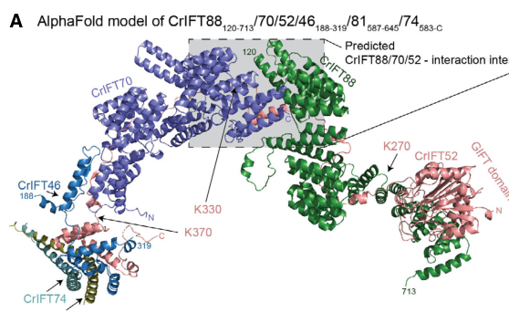

## Question

# Gene Research for Functional Annotation

## ⚠️ CRITICAL: Gene/Protein Identification Context

**BEFORE YOU BEGIN RESEARCH:** You MUST verify you are researching the CORRECT gene/protein. Gene symbols can be ambiguous, especially for less well-characterized genes from non-model organisms.

### Target Gene/Protein Identity (from UniProt):
- **UniProt Accession:** Q9Y366
- **Protein Description:** RecName: Full=Intraflagellar transport protein 52 homolog; AltName: Full=Protein NGD5 homolog;
- **Gene Information:** Name=IFT52; Synonyms=C20orf9, NGD5; ORFNames=CGI-53;
- **Organism (full):** Homo sapiens (Human).
- **Protein Family:** Not specified in UniProt
- **Key Domains:** IFT52. (IPR039975); IFT52_central. (IPR055460); IFT52_GIFT. (IPR055458); Itf52_C. (IPR048643); IFT52_central (PF23352)

### MANDATORY VERIFICATION STEPS:

1. **Check if the gene symbol "IFT52" matches the protein description above**
2. **Verify the organism is correct:** Homo sapiens (Human).
3. **Check if protein family/domains align with what you find in literature**
4. **If you find literature for a DIFFERENT gene with the same or similar symbol, STOP**

### If Gene Symbol is Ambiguous or You Cannot Find Relevant Literature:

**DO NOT PROCEED WITH RESEARCH ON A DIFFERENT GENE.** Instead:
- State clearly: "The gene symbol 'IFT52' is ambiguous or literature is limited for this specific protein"
- Explain what you found (e.g., "Found extensive literature on a different gene with the same symbol in a different organism")
- Describe the protein based ONLY on the UniProt information provided above
- Suggest that the protein function can be inferred from domain/family information

### Research Target:

Please provide a comprehensive research report on the gene **IFT52** (gene ID: IFT52, UniProt: Q9Y366) in human.

The research report should be a detailed narrative explaining the function, biological processes, and localization of the gene product. Citations should be given for all claims.

You should prioritize authoritative reviews and primary scientific literature when conducting research. You can supplement
this with annotations you find in gene/protein databases, but these can be outdated or inaccurate.

We are specifically interested in the primary function of the gene - for enzymes, what reaction is catalyzed, and what is the substrate specificity? For transporters, what is the substrate? For structural proteins or adapters, what is the broader structural role? For signaling molecules, what is the role in the pathway.

We are interested in where in or outside the cell the gene product carries out its function.

We are also interested in the signaling or biochemical pathways in which the gene functions. We are less interested in broad pleiotropic effects, except where these elucidate the precise role.

Include evidence where possible. We are interested in both experimental evidence as well as inference from structure, evolution, or bioinformatic analysis. Precise studies should be prioritized over high-throughput, where available.

## Output

Question: You are an expert researcher providing comprehensive, well-cited information.

Provide detailed information focusing on:
1. Key concepts and definitions with current understanding
2. Recent developments and latest research (prioritize 2023-2024 sources)
3. Current applications and real-world implementations
4. Expert opinions and analysis from authoritative sources
5. Relevant statistics and data from recent studies

Format as a comprehensive research report with proper citations. Include URLs and publication dates where available.
Always prioritize recent, authoritative sources and provide specific citations for all major claims.

# Gene Research for Functional Annotation

## ⚠️ CRITICAL: Gene/Protein Identification Context

**BEFORE YOU BEGIN RESEARCH:** You MUST verify you are researching the CORRECT gene/protein. Gene symbols can be ambiguous, especially for less well-characterized genes from non-model organisms.

### Target Gene/Protein Identity (from UniProt):
- **UniProt Accession:** Q9Y366
- **Protein Description:** RecName: Full=Intraflagellar transport protein 52 homolog; AltName: Full=Protein NGD5 homolog;
- **Gene Information:** Name=IFT52; Synonyms=C20orf9, NGD5; ORFNames=CGI-53;
- **Organism (full):** Homo sapiens (Human).
- **Protein Family:** Not specified in UniProt
- **Key Domains:** IFT52. (IPR039975); IFT52_central. (IPR055460); IFT52_GIFT. (IPR055458); Itf52_C. (IPR048643); IFT52_central (PF23352)

### MANDATORY VERIFICATION STEPS:

1. **Check if the gene symbol "IFT52" matches the protein description above**
2. **Verify the organism is correct:** Homo sapiens (Human).
3. **Check if protein family/domains align with what you find in literature**
4. **If you find literature for a DIFFERENT gene with the same or similar symbol, STOP**

### If Gene Symbol is Ambiguous or You Cannot Find Relevant Literature:

**DO NOT PROCEED WITH RESEARCH ON A DIFFERENT GENE.** Instead:
- State clearly: "The gene symbol 'IFT52' is ambiguous or literature is limited for this specific protein"
- Explain what you found (e.g., "Found extensive literature on a different gene with the same symbol in a different organism")
- Describe the protein based ONLY on the UniProt information provided above
- Suggest that the protein function can be inferred from domain/family information

### Research Target:

Please provide a comprehensive research report on the gene **IFT52** (gene ID: IFT52, UniProt: Q9Y366) in human.

The research report should be a detailed narrative explaining the function, biological processes, and localization of the gene product. Citations should be given for all claims.

You should prioritize authoritative reviews and primary scientific literature when conducting research. You can supplement
this with annotations you find in gene/protein databases, but these can be outdated or inaccurate.

We are specifically interested in the primary function of the gene - for enzymes, what reaction is catalyzed, and what is the substrate specificity? For transporters, what is the substrate? For structural proteins or adapters, what is the broader structural role? For signaling molecules, what is the role in the pathway.

We are interested in where in or outside the cell the gene product carries out its function.

We are also interested in the signaling or biochemical pathways in which the gene functions. We are less interested in broad pleiotropic effects, except where these elucidate the precise role.

Include evidence where possible. We are interested in both experimental evidence as well as inference from structure, evolution, or bioinformatic analysis. Precise studies should be prioritized over high-throughput, where available.

# Human IFT52 (UniProt Q9Y366): functional annotation and evidence report

## Identity and principal function

**Identity verified.** The target is *Homo sapiens* intraflagellar transport protein 52, **IFT52**, also called **NGD5**: a comparative IFT-protein inventory explicitly pairs human IFT52/NGD5 with UniProt **Q9Y366**. C20orf9 and CGI-53 are aliases supplied with the query, rather than identities independently established by the retrieved papers. The reported GIFT, central IFT52 and C-terminal domain annotations agree with experimentally studied regions of this protein. This report does **not** substitute findings about IFT52 orthologues or other IFT genes for direct findings about human IFT52. (jekely2006evolutionofintraflagellar pages 3-4, petriman2022biochemicallyvalidatedstructural pages 6-8, ishida2022molecularbasisunderlying pages 2-3)

**IFT52 is primarily a multivalent structural adaptor in the intraflagellar transport-B (IFT-B) complex.** It is neither a catalytic enzyme nor itself the microtubule motor: its experimentally supported role is to assemble and stabilize IFT-B, connect its core **IFT-B1** and peripheral **IFT-B2** modules, and help couple the resulting transport machinery to motors and other IFT components. Kinesin-2 drives movement of assembled anterograde trains toward the ciliary tip; dynein-2 participates in their return. The physiologically relevant “substrates” are therefore *transported ciliary components*, not a chemically defined substrate of IFT52. (ishida2022molecularbasisunderlying pages 3-5, lacey2023themolecularstructure pages 1-2, petriman2022biochemicallyvalidatedstructural pages 2-4, ishida2022molecularbasisunderlying pages 2-3)

## Molecular mechanism and structural evidence

IFT52 acts as an architectural hub rather than a standalone, cargo-specific transporter. In a **2022 biochemically validated IFT-B model**, its N-terminal **GIFT domain** contacts IFT88; a following extended region contacts IFT88 and passes through the IFT70 superhelix; and its C-terminal domain pairs with IFT46. The IFT52–IFT46 module associates with the IFT81–IFT74 portion of IFT-B1. Cross-linking, crystallographic comparisons and binding assays support this organization. These residue-level structural assignments largely derive from reconstituted ***Chlamydomonas*** proteins—**not** a solved atomic structure of human IFT52—although interaction between human IFT52/IFT46 and IFT81/IFT74 has also been reported. Figure 3A/C of the 2022 study depicts the modeled IFT52-centered assembly and supporting experimental cross-links. (petriman2022biochemicallyvalidatedstructural pages 8-10, petriman2022biochemicallyvalidatedstructural pages 2-4, petriman2022biochemicallyvalidatedstructural pages 6-8, petriman2022biochemicallyvalidatedstructural media 00bb8b80)

A **2023 in situ cryo-electron tomography study** of *Chlamydomonas* cilia placed IFT52 across IFT-B1, with its GIFT domain near the axonemal microtubule doublet. It identified IFT52–IFT88 as a principal organizing element and described connections to the IFT57–IFT38 module of IFT-B2. The same work showed that polymerized IFT-B provides the backbone of anterograde trains and uses flexible connections to IFT-A. This is strong evidence for a **conserved structural mechanism**, but its in situ measurements were made in algae, not human cilia. Subsequent expert synthesis likewise describes IFT-B1 as organized around IFT52. (lacey2025theintraflagellartransport pages 5-6, lacey2023themolecularstructure pages 3-4, lacey2023themolecularstructure pages 1-2, lacey2023themolecularstructure pages 2-3)

**Human-cell perturbation independently supports the scaffold model.** In hTERT-RPE1 cells, knockout of IFT52 eliminates detectable cilia and basal-body IFT88 staining; re-expression of wild-type IFT52 restores ciliogenesis. Disease-associated GIFT-region variants partially rescue ciliation but impair assembly of the complete IFT-B complex or its interaction with heterotrimeric kinesin-II. The C-terminally disrupting **p.Leu293AlafsTer21** allele behaves as a functional null in these assays. The relevant kinesin-binding unit is a *composite* IFT52–IFT88–IFT57–IFT38 assembly: the experiments do not establish that isolated IFT52 is a kinesin motor or the sole direct kinesin-binding surface. (ishida2022molecularbasisunderlying pages 2-3, ishida2022molecularbasisunderlying pages 10-11, ishida2022molecularbasisunderlying pages 3-5, kobayashi2021cooperationofthe pages 5-8)

## Where IFT52 acts

The principal site of action is **at the ciliary base and within the cilium**. IFT complexes assemble or accumulate around the mother centriole/basal body before entering the transition-zone-gated ciliary compartment; as part of IFT-B trains, IFT52 participates in transport along the axoneme. Human-cell rescue and immunostaining establish its involvement in basal-body IFT-B recruitment and ciliary IFT-B distribution. Localization of IFT52 specifically to *transition fibres* is especially well documented in nonhuman experimental systems, so that finer localization should not be treated as independently mapped in human tissue by the studies summarized here. IFT52 is an **intracellular complex component**, not a secreted protein. (ishida2022molecularbasisunderlying pages 5-7, ishida2022molecularbasisunderlying pages 3-5, lacey2023themolecularstructure pages 1-2, zhang2016ift52mutationsdestabilize pages 6-6, dupont2019humanift52mutations pages 9-13)

A second, less established **extraciliary** activity has been observed at centrioles. A **2019** study reported partial IFT52–centrin colocalization at the distal ends of centrioles, interaction with centrin, and altered centrin maintenance, microtubule organization and centriole cohesion after IFT52 disruption. This provides a specific candidate mechanism beyond axonemal transport; its contribution to individual human disease manifestations remains less certain than the IFT-B assembly role. (dupont2019humanift52mutations pages 1-6, dupont2019humanift52mutations pages 16-21)

## Cargo delivery and signaling: what is, and is not, demonstrated

IFT52's position enables **anterograde delivery and maintenance of ciliary structural and signaling machinery**. In human RPE1 rescue experiments, the disease-associated **Δ139–162** and **p.Ala199Thr** forms reduced the ciliary IFT-B pool and markedly impaired tip localization of **KIF17** and **ICK/CILK1**. These are *observed trafficking phenotypes*, not proof that each cargo binds purified IFT52 directly. IFT52–IFT88 also contributes to a composite association with the IFT-A proteins **IFT122–IFT144**; weakening IFT-A/B coupling through an **IFT88** mutation impaired ciliary entry of selected G-protein-coupled receptors. Because that latter experiment perturbed IFT88, its receptor phenotype should not be assigned automatically to every IFT52 allele. (ishida2022molecularbasisunderlying pages 10-11, kobayashi2021cooperationofthe pages 5-8, ishida2022molecularbasisunderlying pages 7-10, kobayashi2021cooperationofthe pages 8-10)

Primary cilia support **Hedgehog signaling**, pertinent to skeletal development, and an Ift52-null **zebrafish** model showed reduced expression of the Hedgehog-responsive genes *ptc2* and *gli1* in heads. The human variant evidence is more selective: **2022 human RPE1 experiments found that Smoothened agonist still promoted ciliary SMO entry and GPR161 exit** in cells expressing Δ139–162 or p.Ala199Thr, despite impaired ICK/KIF17 tip delivery. Thus, severe loss of IFT52 can remove the ciliary platform for signaling, but it would be inaccurate to claim that the tested hypomorphic human IFT52 variants uniformly block SMO/GPR161 trafficking or all Hedgehog responses. (dupont2019humanift52mutations pages 9-13, ishida2022molecularbasisunderlying pages 7-10, ishida2022molecularbasisunderlying pages 2-3)

## Human genetics, measurements and present applications

Rare **biallelic IFT52 variants** have been reported in short-rib polydactyly/short-rib thoracic dysplasia, cranioectodermal dysplasia or Sensenbrenner-like disease, and kidney-predominant congenital anomalies. The strongest mechanistic interpretation is variant-dependent impairment of IFT-B assembly or ciliary transport; genotype alone does not reliably predict organ involvement or severity. In the **2016** short-rib polydactyly patient-cell study, **40.2%** of fibroblasts were ciliated versus **79.2%** of controls, and mean ciliary length was **2.89 versus 3.51 μm**. Mutant patient fibroblasts and chondrocytes had reduced IFT52 and other IFT-B components. These numbers describe *one investigated patient-cell comparison*, not population prevalence or a general effect size for every IFT52 variant. (zhang2016ift52mutationsdestabilize pages 5-6, zhang2016ift52mutationsdestabilize pages 3-4, zhang2016ift52mutationsdestabilize pages 4-5, dupont2019humanift52mutations pages 16-21)

The following table separates clinical observations from human-cell, mouse-cell and zebrafish functional evidence.

| Allele(s) and human presentation | Direct experimental evidence | Mechanistic inference and caveat |
|---|---|---|
| **c.424C>T, p.Arg142Ter — cranioectodermal dysplasia/skeletal ciliopathy (clinical 2016)** | Initially reported homozygous in one child; later patient-cell analysis showed exon-6 skipping rather than simple truncation, producing **IFT52 Δ139–162** within the GIFT domain and retaining partial function. In **2022 human hTERT-RPE1 cells**, Δ139–162 substantially rescued ciliation but impaired KIF17 and ICK delivery to the ciliary tip. (girisha2016ahomozygousnonsense pages 2-4, dupont2019humanift52mutations pages 1-6, ishida2022molecularbasisunderlying pages 7-10, ishida2022molecularbasisunderlying pages 2-3) | A hypomorphic splice-altering allele that weakens IFT-B holocomplex assembly and selected anterograde tip transport. Importantly, SAG-induced GPR161 exit and SMO entry were essentially retained in rescued cells; the evidence does **not** support universal Hedgehog-trafficking failure. (ishida2022molecularbasisunderlying pages 10-11, ishida2022molecularbasisunderlying pages 7-10) |
| **p.Ala199Thr plus p.Leu293AlafsTer21 — short-rib polydactyly syndrome (clinical 2016; cell evidence 2022)** | Patient fibroblasts had **40.2% versus 79.2% ciliated cells** and mean cilium length **2.89 versus 3.51 μm** relative to controls; IFT88 was undetectable above background in cilia. In human RPE1 rescue assays, A199T caused moderate holocomplex defects and markedly reduced kinesin-II association, whereas L293AfsTer21 behaved as a functional null. (zhang2016ift52mutationsdestabilize pages 5-6, zhang2016ift52mutationsdestabilize pages 3-4, zhang2016ift52mutationsdestabilize pages 4-5, ishida2022molecularbasisunderlying pages 10-11) | A199T, in the GIFT domain, is hypomorphic; the C-terminal frameshift removes interfaces with IFT88, IFT46, IFT81-containing assemblies and IFT70. Together they destabilize IFT-B and reduce its loading or kinesin-II-driven entry into cilia. GPR161/SMO responses remained broadly intact in the 2022 disease-mimicking cells. (ishida2022molecularbasisunderlying pages 2-3, ishida2022molecularbasisunderlying pages 7-10) |
| **p.Asn98Ser with splice-disrupting c.695_699delinsCA — short-rib thoracic dysplasia (clinical and functional 2019)** | In zebrafish, N98S RNA failed to rescue body curvature in **79.31%** or pronephric cysts in **75.86%** of mutant embryos. In Ift52-null murine IMCD3 cells it restored the percentage of ciliated cells but increased very short cilia: **26.9% versus 14% below 1 μm**. N98S reduced interactions with multiple IFT-B proteins, especially IFT38/IFT57, and reduced ciliary localization of IFT52 and those partners. (dupont2019humanift52mutations pages 9-13) | N98S probably destabilizes the GIFT-domain fold and weakens the IFT-B1–IFT-B2 interface, explaining a relatively severe skeletal phenotype. Evidence combines human genetics with murine-cell, recombinant-protein and zebrafish assays rather than direct correction in patient tissue. (dupont2019humanift52mutations pages 1-6, dupont2019humanift52mutations pages 9-13) |
| **p.Asp259His — congenital anomaly of kidney and urinary tract, including multicystic dysplastic kidney (clinical and functional 2019)** | D259H RNA failed to rescue zebrafish body curvature in **87.8%** or pronephric cysts in **90.24%** of mutant embryos. In murine cells it restored ciliation but produced shorter cilia; it mildly altered IFT-B interactions, including reduced IFT38/IFT57 and loss of detected IFT46 binding, while preserving more ciliary IFT-B localization than N98S. (dupont2019humanift52mutations pages 9-13, dupont2019humanift52mutations pages 16-21) | Interpreted as a milder, kidney-predominant hypomorph, but causality and phenotype specificity remain less secure: additional rare WNK4 and UBE2C variants and possible modifiers were present, and postnatal skeletal outcome was unavailable. (dupont2019humanift52mutations pages 16-21) |
| **Homozygous c.424C>T, p.Arg142Ter — severe familial SRTD16 recurrence (clinical 2025)** | Two siblings of consanguineous parents had short limbs, polydactyly and narrow thorax and died in early infancy from respiratory compromise; whole-exome sequencing confirmed the homozygous allele only in the second child. Renal echogenicity, liver calcifications, mild hepatomegaly and an atrial septal defect were also reported. (abeyrathna2025severeshortrib pages 1-2, abeyrathna2025severeshortrib pages 2-3) | Recurrence expands the clinical severity associated with the same splice-altering allele, but this is a small case report: the first sibling was not genotyped and parental carrier status was not tested. Prognosis cannot be inferred reliably from this family alone because earlier p.Arg142Ter disease was milder. (abeyrathna2025severeshortrib pages 1-2, abeyrathna2025severeshortrib pages 2-3) |

*Table: Human genotype–phenotype observations are aligned with functional assays in patient cells, human RPE1 cells, murine cells and zebrafish. The table distinguishes direct findings from mechanistic inference and highlights important variant-specific limitations.*

**Clinical implementation is chiefly molecular diagnosis and variant interpretation.** Exome sequencing has identified affected individuals; segregation analysis, patient-cell RNA/protein studies, ciliation measurements and experimental rescue assays can clarify difficult alleles. A particularly instructive example is **c.424C>T, p.Arg142Ter**: initially interpreted as a premature stop, later RNA analysis found exon skipping that produces a partly functional **Δ139–162** protein. A **2025** case report described a more severe presentation with the same sequence variant in a genetically confirmed infant and a similarly affected but ungenotyped sibling, underscoring prognostic uncertainty. The retrieved evidence does not establish an IFT52-specific approved therapy or a validated pharmacological means of correcting its scaffold function. (dupont2019humanift52mutations pages 16-21, girisha2016ahomozygousnonsense pages 2-4, abeyrathna2025severeshortrib pages 1-2, abeyrathna2025severeshortrib pages 2-3, ishida2022molecularbasisunderlying pages 2-3)

## Recent research and evidence boundaries

The principal **2023** advance relevant to IFT52 itself was an *in situ* structural account of how its conserved complex is arranged in anterograde trains, rather than discovery of a new human enzymatic or signaling activity. A **2024** expert review on ciliary compartmentalization discusses these transport and barrier mechanisms, and a **2024** photoreceptor-focused review emphasizes the importance of IFT for maintaining sensory cilia; neither makes a general retinal-disease finding specific to human IFT52. Human IFT52 genotype–mechanism evidence in this report remains anchored mainly in the **2016, 2019 and 2022 primary studies** and the smaller **2025** case report. Extrapolations from algae, zebrafish and mouse cells are identified above as such. (ishida2022molecularbasisunderlying pages 10-11, lacey2023themolecularstructure pages 3-4, dupont2019humanift52mutations pages 9-13, abeyrathna2025severeshortrib pages 1-2)

### Selected sources and publication dates

- Lacey, Foster & Pigino, **2023**. “The molecular structure of IFT-A and IFT-B in anterograde intraflagellar transport trains.” *Nature Structural & Molecular Biology*. https://doi.org/10.1038/s41594-022-00905-5 (lacey2023themolecularstructure pages 3-4)
- Petriman *et al.*, **2022**. “Biochemically validated structural model of the 15-subunit intraflagellar transport complex IFT-B.” *EMBO Journal*. https://doi.org/10.15252/embj.2022112440 (petriman2022biochemicallyvalidatedstructural pages 2-4)
- Ishida *et al.*, **2022**. “Molecular basis underlying the ciliary defects caused by IFT52 variations found in skeletal ciliopathies.” *Molecular Biology of the Cell*. https://doi.org/10.1091/mbc.e22-05-0188 (ishida2022molecularbasisunderlying pages 7-10)
- Kobayashi *et al.*, **2021**. “Cooperation of the IFT-A complex with the IFT-B complex is required for ciliary retrograde protein trafficking and GPCR import.” *Molecular Biology of the Cell*. https://doi.org/10.1091/mbc.e20-08-0556 (kobayashi2021cooperationofthe pages 5-8)
- Dupont *et al.*, **2019**. “Human IFT52 mutations uncover a novel role for the protein in microtubule dynamics and centrosome cohesion.” *Human Molecular Genetics*. https://doi.org/10.1093/hmg/ddz091 (dupont2019humanift52mutations pages 1-6)
- Zhang *et al.*, **2016**. “IFT52 mutations destabilize anterograde complex assembly, disrupt ciliogenesis and result in short rib polydactyly syndrome.” *Human Molecular Genetics*. https://doi.org/10.1093/hmg/ddw241 (zhang2016ift52mutationsdestabilize pages 5-6)
- Abeyrathna, de Silva & Doluweera, **2025**. “Severe short rib thoracic dysplasia-16 associated with the c424C>T pathogenic variant in the IFT52 gene.” *Sri Lanka Journal of Child Health*. https://doi.org/10.4038/sljch.v54i1.10998 (abeyrathna2025severeshortrib pages 1-2)

References

1. (jekely2006evolutionofintraflagellar pages 3-4): Gáspár Jékely and Detlev Arendt. Evolution of intraflagellar transport from coated vesicles and autogenous origin of the eukaryotic cilium. BioEssays : news and reviews in molecular, cellular and developmental biology, 28 2:191-8, Feb 2006. URL: https://doi.org/10.1002/bies.20369, doi:10.1002/bies.20369. This article has 260 citations.

2. (petriman2022biochemicallyvalidatedstructural pages 6-8): Narcis A Petriman, Marta Loureiro‐López, Michael Taschner, Nevin K Zacharia, Magdalena M Georgieva, Niels Boegholm, Jiaolong Wang, André Mourão, Robert B Russell, Jens S Andersen, and Esben Lorentzen. Biochemically validated structural model of the 15‐subunit intraflagellar transport complex ift‐b. The EMBO Journal, Nov 2022. URL: https://doi.org/10.15252/embj.2022112440, doi:10.15252/embj.2022112440. This article has 58 citations.

3. (ishida2022molecularbasisunderlying pages 2-3): Yamato Ishida, Koshi Tasaki, Yohei Katoh, and Kazuhisa Nakayama. Molecular basis underlying the ciliary defects caused by <i>ift52</i> variations found in skeletal ciliopathies. Molecular Biology of the Cell, Aug 2022. URL: https://doi.org/10.1091/mbc.e22-05-0188, doi:10.1091/mbc.e22-05-0188. This article has 13 citations and is from a domain leading peer-reviewed journal.

4. (ishida2022molecularbasisunderlying pages 3-5): Yamato Ishida, Koshi Tasaki, Yohei Katoh, and Kazuhisa Nakayama. Molecular basis underlying the ciliary defects caused by <i>ift52</i> variations found in skeletal ciliopathies. Molecular Biology of the Cell, Aug 2022. URL: https://doi.org/10.1091/mbc.e22-05-0188, doi:10.1091/mbc.e22-05-0188. This article has 13 citations and is from a domain leading peer-reviewed journal.

5. (lacey2023themolecularstructure pages 1-2): Samuel E. Lacey, Helen E. Foster, and Gaia Pigino. The molecular structure of ift-a and ift-b in anterograde intraflagellar transport trains. Nature Structural & Molecular Biology, 30:584-593, Jan 2023. URL: https://doi.org/10.1038/s41594-022-00905-5, doi:10.1038/s41594-022-00905-5. This article has 124 citations and is from a highest quality peer-reviewed journal.

6. (petriman2022biochemicallyvalidatedstructural pages 2-4): Narcis A Petriman, Marta Loureiro‐López, Michael Taschner, Nevin K Zacharia, Magdalena M Georgieva, Niels Boegholm, Jiaolong Wang, André Mourão, Robert B Russell, Jens S Andersen, and Esben Lorentzen. Biochemically validated structural model of the 15‐subunit intraflagellar transport complex ift‐b. The EMBO Journal, Nov 2022. URL: https://doi.org/10.15252/embj.2022112440, doi:10.15252/embj.2022112440. This article has 58 citations.

7. (petriman2022biochemicallyvalidatedstructural pages 8-10): Narcis A Petriman, Marta Loureiro‐López, Michael Taschner, Nevin K Zacharia, Magdalena M Georgieva, Niels Boegholm, Jiaolong Wang, André Mourão, Robert B Russell, Jens S Andersen, and Esben Lorentzen. Biochemically validated structural model of the 15‐subunit intraflagellar transport complex ift‐b. The EMBO Journal, Nov 2022. URL: https://doi.org/10.15252/embj.2022112440, doi:10.15252/embj.2022112440. This article has 58 citations.

8. (petriman2022biochemicallyvalidatedstructural media 00bb8b80): Narcis A Petriman, Marta Loureiro‐López, Michael Taschner, Nevin K Zacharia, Magdalena M Georgieva, Niels Boegholm, Jiaolong Wang, André Mourão, Robert B Russell, Jens S Andersen, and Esben Lorentzen. Biochemically validated structural model of the 15‐subunit intraflagellar transport complex ift‐b. The EMBO Journal, Nov 2022. URL: https://doi.org/10.15252/embj.2022112440, doi:10.15252/embj.2022112440. This article has 58 citations.

9. (lacey2025theintraflagellartransport pages 5-6): Samuel E. Lacey and Gaia Pigino. The intraflagellar transport cycle. Nature reviews. Molecular cell biology, 26:175-192, Nov 2025. URL: https://doi.org/10.1038/s41580-024-00797-x, doi:10.1038/s41580-024-00797-x. This article has 73 citations.

10. (lacey2023themolecularstructure pages 3-4): Samuel E. Lacey, Helen E. Foster, and Gaia Pigino. The molecular structure of ift-a and ift-b in anterograde intraflagellar transport trains. Nature Structural & Molecular Biology, 30:584-593, Jan 2023. URL: https://doi.org/10.1038/s41594-022-00905-5, doi:10.1038/s41594-022-00905-5. This article has 124 citations and is from a highest quality peer-reviewed journal.

11. (lacey2023themolecularstructure pages 2-3): Samuel E. Lacey, Helen E. Foster, and Gaia Pigino. The molecular structure of ift-a and ift-b in anterograde intraflagellar transport trains. Nature Structural & Molecular Biology, 30:584-593, Jan 2023. URL: https://doi.org/10.1038/s41594-022-00905-5, doi:10.1038/s41594-022-00905-5. This article has 124 citations and is from a highest quality peer-reviewed journal.

12. (ishida2022molecularbasisunderlying pages 10-11): Yamato Ishida, Koshi Tasaki, Yohei Katoh, and Kazuhisa Nakayama. Molecular basis underlying the ciliary defects caused by <i>ift52</i> variations found in skeletal ciliopathies. Molecular Biology of the Cell, Aug 2022. URL: https://doi.org/10.1091/mbc.e22-05-0188, doi:10.1091/mbc.e22-05-0188. This article has 13 citations and is from a domain leading peer-reviewed journal.

13. (kobayashi2021cooperationofthe pages 5-8): Takuya Kobayashi, Yamato Ishida, Tomoaki Hirano, Yohei Katoh, and Kazuhisa Nakayama. Cooperation of the ift-a complex with the ift-b complex is required for ciliary retrograde protein trafficking and gpcr import. Molecular Biology of the Cell, 32:45-56, Jan 2021. URL: https://doi.org/10.1091/mbc.e20-08-0556, doi:10.1091/mbc.e20-08-0556. This article has 71 citations and is from a domain leading peer-reviewed journal.

14. (ishida2022molecularbasisunderlying pages 5-7): Yamato Ishida, Koshi Tasaki, Yohei Katoh, and Kazuhisa Nakayama. Molecular basis underlying the ciliary defects caused by <i>ift52</i> variations found in skeletal ciliopathies. Molecular Biology of the Cell, Aug 2022. URL: https://doi.org/10.1091/mbc.e22-05-0188, doi:10.1091/mbc.e22-05-0188. This article has 13 citations and is from a domain leading peer-reviewed journal.

15. (zhang2016ift52mutationsdestabilize pages 6-6): Wenjuan Zhang, S. Paige Taylor, Lisette Nevarez, Ralph S. Lachman, Deborah A. Nickerson, Michael Bamshad, Deborah Krakow, and Daniel H. Cohn. Ift52 mutations destabilize anterograde complex assembly, disrupt ciliogenesis and result in short rib polydactyly syndrome. Human molecular genetics, 25 18:4012-4020, Sep 2016. URL: https://doi.org/10.1093/hmg/ddw241, doi:10.1093/hmg/ddw241. This article has 58 citations and is from a domain leading peer-reviewed journal.

16. (dupont2019humanift52mutations pages 9-13): Marie Alice Dupont, Camille Humbert, Céline Huber, Quentin Siour, Ida Chiara Guerrera, Vincent Jung, Anni Christensen, Aurore Pouliet, Meriem Garfa-Traoré, Patrick Nitschké, Marie Injeyan, Kathryn Millar, David Chitayat, Patrick Shannon, Katta Mohan Girisha, Anju Shukla, Charlotte Mechler, Esben Lorentzen, Alexandre Benmerah, Valérie Cormier-Daire, Cécile Jeanpierre, Sophie Saunier, and Marion Delous. Human ift52 mutations uncover a novel role for the protein in microtubule dynamics and centrosome cohesion. Human molecular genetics, 28:2720-2737, May 2019. URL: https://doi.org/10.1093/hmg/ddz091, doi:10.1093/hmg/ddz091. This article has 39 citations and is from a domain leading peer-reviewed journal.

17. (dupont2019humanift52mutations pages 1-6): Marie Alice Dupont, Camille Humbert, Céline Huber, Quentin Siour, Ida Chiara Guerrera, Vincent Jung, Anni Christensen, Aurore Pouliet, Meriem Garfa-Traoré, Patrick Nitschké, Marie Injeyan, Kathryn Millar, David Chitayat, Patrick Shannon, Katta Mohan Girisha, Anju Shukla, Charlotte Mechler, Esben Lorentzen, Alexandre Benmerah, Valérie Cormier-Daire, Cécile Jeanpierre, Sophie Saunier, and Marion Delous. Human ift52 mutations uncover a novel role for the protein in microtubule dynamics and centrosome cohesion. Human molecular genetics, 28:2720-2737, May 2019. URL: https://doi.org/10.1093/hmg/ddz091, doi:10.1093/hmg/ddz091. This article has 39 citations and is from a domain leading peer-reviewed journal.

18. (dupont2019humanift52mutations pages 16-21): Marie Alice Dupont, Camille Humbert, Céline Huber, Quentin Siour, Ida Chiara Guerrera, Vincent Jung, Anni Christensen, Aurore Pouliet, Meriem Garfa-Traoré, Patrick Nitschké, Marie Injeyan, Kathryn Millar, David Chitayat, Patrick Shannon, Katta Mohan Girisha, Anju Shukla, Charlotte Mechler, Esben Lorentzen, Alexandre Benmerah, Valérie Cormier-Daire, Cécile Jeanpierre, Sophie Saunier, and Marion Delous. Human ift52 mutations uncover a novel role for the protein in microtubule dynamics and centrosome cohesion. Human molecular genetics, 28:2720-2737, May 2019. URL: https://doi.org/10.1093/hmg/ddz091, doi:10.1093/hmg/ddz091. This article has 39 citations and is from a domain leading peer-reviewed journal.

19. (ishida2022molecularbasisunderlying pages 7-10): Yamato Ishida, Koshi Tasaki, Yohei Katoh, and Kazuhisa Nakayama. Molecular basis underlying the ciliary defects caused by <i>ift52</i> variations found in skeletal ciliopathies. Molecular Biology of the Cell, Aug 2022. URL: https://doi.org/10.1091/mbc.e22-05-0188, doi:10.1091/mbc.e22-05-0188. This article has 13 citations and is from a domain leading peer-reviewed journal.

20. (kobayashi2021cooperationofthe pages 8-10): Takuya Kobayashi, Yamato Ishida, Tomoaki Hirano, Yohei Katoh, and Kazuhisa Nakayama. Cooperation of the ift-a complex with the ift-b complex is required for ciliary retrograde protein trafficking and gpcr import. Molecular Biology of the Cell, 32:45-56, Jan 2021. URL: https://doi.org/10.1091/mbc.e20-08-0556, doi:10.1091/mbc.e20-08-0556. This article has 71 citations and is from a domain leading peer-reviewed journal.

21. (zhang2016ift52mutationsdestabilize pages 5-6): Wenjuan Zhang, S. Paige Taylor, Lisette Nevarez, Ralph S. Lachman, Deborah A. Nickerson, Michael Bamshad, Deborah Krakow, and Daniel H. Cohn. Ift52 mutations destabilize anterograde complex assembly, disrupt ciliogenesis and result in short rib polydactyly syndrome. Human molecular genetics, 25 18:4012-4020, Sep 2016. URL: https://doi.org/10.1093/hmg/ddw241, doi:10.1093/hmg/ddw241. This article has 58 citations and is from a domain leading peer-reviewed journal.

22. (zhang2016ift52mutationsdestabilize pages 3-4): Wenjuan Zhang, S. Paige Taylor, Lisette Nevarez, Ralph S. Lachman, Deborah A. Nickerson, Michael Bamshad, Deborah Krakow, and Daniel H. Cohn. Ift52 mutations destabilize anterograde complex assembly, disrupt ciliogenesis and result in short rib polydactyly syndrome. Human molecular genetics, 25 18:4012-4020, Sep 2016. URL: https://doi.org/10.1093/hmg/ddw241, doi:10.1093/hmg/ddw241. This article has 58 citations and is from a domain leading peer-reviewed journal.

23. (zhang2016ift52mutationsdestabilize pages 4-5): Wenjuan Zhang, S. Paige Taylor, Lisette Nevarez, Ralph S. Lachman, Deborah A. Nickerson, Michael Bamshad, Deborah Krakow, and Daniel H. Cohn. Ift52 mutations destabilize anterograde complex assembly, disrupt ciliogenesis and result in short rib polydactyly syndrome. Human molecular genetics, 25 18:4012-4020, Sep 2016. URL: https://doi.org/10.1093/hmg/ddw241, doi:10.1093/hmg/ddw241. This article has 58 citations and is from a domain leading peer-reviewed journal.

24. (girisha2016ahomozygousnonsense pages 2-4): K. M. Girisha, A. Shukla, D. Trujillano, G. S. Bhavani, M. Hebbar, R. Kadavigere, and A. Rolfs. A homozygous nonsense variant in ift52 is associated with a human skeletal ciliopathy. Clinical Genetics, 90:536-539, Dec 2016. URL: https://doi.org/10.1111/cge.12762, doi:10.1111/cge.12762. This article has 90 citations and is from a peer-reviewed journal.

25. (abeyrathna2025severeshortrib pages 1-2): Bimsara Yohan Abeyrathna, Deepthi C. De Silva, and Sandya Doluweera. Severe short rib thoracic dysplasia-16 associated with the c424c>t pathogenic variant in the intra flagellar transport 52 (ift52) gene. Sri Lanka Journal of Child Health, 54:69-71, Mar 2025. URL: https://doi.org/10.4038/sljch.v54i1.10998, doi:10.4038/sljch.v54i1.10998. This article has 0 citations.

26. (abeyrathna2025severeshortrib pages 2-3): Bimsara Yohan Abeyrathna, Deepthi C. De Silva, and Sandya Doluweera. Severe short rib thoracic dysplasia-16 associated with the c424c>t pathogenic variant in the intra flagellar transport 52 (ift52) gene. Sri Lanka Journal of Child Health, 54:69-71, Mar 2025. URL: https://doi.org/10.4038/sljch.v54i1.10998, doi:10.4038/sljch.v54i1.10998. This article has 0 citations.

## Artifacts

- [Edison artifact artifact-00](IFT52-deep-research-falcon_artifacts/artifact-00.md)

## Citations

1. lacey2023themolecularstructure pages 3-4
2. petriman2022biochemicallyvalidatedstructural pages 2-4
3. ishida2022molecularbasisunderlying pages 7-10
4. kobayashi2021cooperationofthe pages 5-8
5. abeyrathna2025severeshortrib pages 1-2
6. jekely2006evolutionofintraflagellar pages 3-4
7. petriman2022biochemicallyvalidatedstructural pages 6-8
8. ishida2022molecularbasisunderlying pages 2-3
9. ishida2022molecularbasisunderlying pages 3-5
10. lacey2023themolecularstructure pages 1-2
11. petriman2022biochemicallyvalidatedstructural pages 8-10
12. lacey2025theintraflagellartransport pages 5-6
13. lacey2023themolecularstructure pages 2-3
14. ishida2022molecularbasisunderlying pages 10-11
15. ishida2022molecularbasisunderlying pages 5-7
16. kobayashi2021cooperationofthe pages 8-10
17. girisha2016ahomozygousnonsense pages 2-4
18. abeyrathna2025severeshortrib pages 2-3
19. https://doi.org/10.1038/s41594-022-00905-5
20. https://doi.org/10.15252/embj.2022112440
21. https://doi.org/10.1091/mbc.e22-05-0188
22. https://doi.org/10.1091/mbc.e20-08-0556
23. https://doi.org/10.1093/hmg/ddz091
24. https://doi.org/10.1093/hmg/ddw241
25. https://doi.org/10.4038/sljch.v54i1.10998
26. https://doi.org/10.1002/bies.20369,
27. https://doi.org/10.15252/embj.2022112440,
28. https://doi.org/10.1091/mbc.e22-05-0188,
29. https://doi.org/10.1038/s41594-022-00905-5,
30. https://doi.org/10.1038/s41580-024-00797-x,
31. https://doi.org/10.1091/mbc.e20-08-0556,
32. https://doi.org/10.1093/hmg/ddw241,
33. https://doi.org/10.1093/hmg/ddz091,
34. https://doi.org/10.1111/cge.12762,
35. https://doi.org/10.4038/sljch.v54i1.10998,