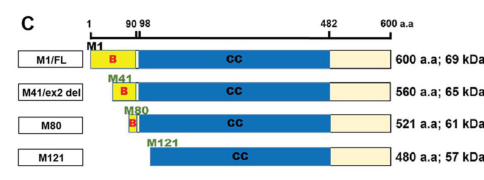

## Question

# Gene Research for Functional Annotation

## ⚠️ CRITICAL: Gene/Protein Identification Context

**BEFORE YOU BEGIN RESEARCH:** You MUST verify you are researching the CORRECT gene/protein. Gene symbols can be ambiguous, especially for less well-characterized genes from non-model organisms.

### Target Gene/Protein Identity (from UniProt):
- **UniProt Accession:** Q96LB3
- **Protein Description:** RecName: Full=Intraflagellar transport protein 74 homolog; AltName: Full=Capillary morphogenesis gene 1 protein {ECO:0000303|PubMed:11683410}; Short=CMG-1 {ECO:0000303|PubMed:11683410, ECO:0000303|PubMed:15024030}; AltName: Full=Coiled-coil domain-containing protein 2;
- **Gene Information:** Name=IFT74; Synonyms=CCDC2, CMG1;
- **Organism (full):** Homo sapiens (Human).
- **Protein Family:** Belongs to the IFT74 family. .
- **Key Domains:** IFT74. (IPR029602); IFT74 (PF30951)

### MANDATORY VERIFICATION STEPS:

1. **Check if the gene symbol "IFT74" matches the protein description above**
2. **Verify the organism is correct:** Homo sapiens (Human).
3. **Check if protein family/domains align with what you find in literature**
4. **If you find literature for a DIFFERENT gene with the same or similar symbol, STOP**

### If Gene Symbol is Ambiguous or You Cannot Find Relevant Literature:

**DO NOT PROCEED WITH RESEARCH ON A DIFFERENT GENE.** Instead:
- State clearly: "The gene symbol 'IFT74' is ambiguous or literature is limited for this specific protein"
- Explain what you found (e.g., "Found extensive literature on a different gene with the same symbol in a different organism")
- Describe the protein based ONLY on the UniProt information provided above
- Suggest that the protein function can be inferred from domain/family information

### Research Target:

Please provide a comprehensive research report on the gene **IFT74** (gene ID: IFT74, UniProt: Q96LB3) in human.

The research report should be a detailed narrative explaining the function, biological processes, and localization of the gene product. Citations should be given for all claims.

You should prioritize authoritative reviews and primary scientific literature when conducting research. You can supplement
this with annotations you find in gene/protein databases, but these can be outdated or inaccurate.

We are specifically interested in the primary function of the gene - for enzymes, what reaction is catalyzed, and what is the substrate specificity? For transporters, what is the substrate? For structural proteins or adapters, what is the broader structural role? For signaling molecules, what is the role in the pathway.

We are interested in where in or outside the cell the gene product carries out its function.

We are also interested in the signaling or biochemical pathways in which the gene functions. We are less interested in broad pleiotropic effects, except where these elucidate the precise role.

Include evidence where possible. We are interested in both experimental evidence as well as inference from structure, evolution, or bioinformatic analysis. Precise studies should be prioritized over high-throughput, where available.

## Output

Question: You are an expert researcher providing comprehensive, well-cited information.

Provide detailed information focusing on:
1. Key concepts and definitions with current understanding
2. Recent developments and latest research (prioritize 2023-2024 sources)
3. Current applications and real-world implementations
4. Expert opinions and analysis from authoritative sources
5. Relevant statistics and data from recent studies

Format as a comprehensive research report with proper citations. Include URLs and publication dates where available.
Always prioritize recent, authoritative sources and provide specific citations for all major claims.

# Gene Research for Functional Annotation

## ⚠️ CRITICAL: Gene/Protein Identification Context

**BEFORE YOU BEGIN RESEARCH:** You MUST verify you are researching the CORRECT gene/protein. Gene symbols can be ambiguous, especially for less well-characterized genes from non-model organisms.

### Target Gene/Protein Identity (from UniProt):
- **UniProt Accession:** Q96LB3
- **Protein Description:** RecName: Full=Intraflagellar transport protein 74 homolog; AltName: Full=Capillary morphogenesis gene 1 protein {ECO:0000303|PubMed:11683410}; Short=CMG-1 {ECO:0000303|PubMed:11683410, ECO:0000303|PubMed:15024030}; AltName: Full=Coiled-coil domain-containing protein 2;
- **Gene Information:** Name=IFT74; Synonyms=CCDC2, CMG1;
- **Organism (full):** Homo sapiens (Human).
- **Protein Family:** Belongs to the IFT74 family. .
- **Key Domains:** IFT74. (IPR029602); IFT74 (PF30951)

### MANDATORY VERIFICATION STEPS:

1. **Check if the gene symbol "IFT74" matches the protein description above**
2. **Verify the organism is correct:** Homo sapiens (Human).
3. **Check if protein family/domains align with what you find in literature**
4. **If you find literature for a DIFFERENT gene with the same or similar symbol, STOP**

### If Gene Symbol is Ambiguous or You Cannot Find Relevant Literature:

**DO NOT PROCEED WITH RESEARCH ON A DIFFERENT GENE.** Instead:
- State clearly: "The gene symbol 'IFT74' is ambiguous or literature is limited for this specific protein"
- Explain what you found (e.g., "Found extensive literature on a different gene with the same symbol in a different organism")
- Describe the protein based ONLY on the UniProt information provided above
- Suggest that the protein function can be inferred from domain/family information

### Research Target:

Please provide a comprehensive research report on the gene **IFT74** (gene ID: IFT74, UniProt: Q96LB3) in human.

The research report should be a detailed narrative explaining the function, biological processes, and localization of the gene product. Citations should be given for all claims.

You should prioritize authoritative reviews and primary scientific literature when conducting research. You can supplement
this with annotations you find in gene/protein databases, but these can be outdated or inaccurate.

We are specifically interested in the primary function of the gene - for enzymes, what reaction is catalyzed, and what is the substrate specificity? For transporters, what is the substrate? For structural proteins or adapters, what is the broader structural role? For signaling molecules, what is the role in the pathway.

We are interested in where in or outside the cell the gene product carries out its function.

We are also interested in the signaling or biochemical pathways in which the gene functions. We are less interested in broad pleiotropic effects, except where these elucidate the precise role.

Include evidence where possible. We are interested in both experimental evidence as well as inference from structure, evolution, or bioinformatic analysis. Precise studies should be prioritized over high-throughput, where available.

# Human IFT74 (UniProt Q96LB3): functional annotation research report

## Identity and principal function

**Identity verified.** The target is human **IFT74**, also called **CCDC2** and **CMG1/CMG-1**, not a similarly named protein from another organism. A human patient study explicitly identifies its protein as **UniProt Q96LB3** and describes the canonical **600-amino-acid** isoform. Its experimentally described basic N-terminal region and extensive coiled-coil agree with the supplied IFT74-family/domain annotation. The older name CMG-1 appears in studies of human endothelial cilia; it does not, by itself, establish a distinct capillary-morphogenesis activity. (fassad2023defectiveairwayintraflagellar pages 5-8, fassad2023defectiveairwayintraflagellar pages 8-10, iomini2004primaryciliaof pages 1-2, bakey2023ift74variantscause pages 17-20)

**IFT74 is a structural and cargo-binding component of intraflagellar transport complex B (IFT-B), not an enzyme or membrane transporter.** Its best-defined direct cargo is soluble **αβ-tubulin**, which supplies the microtubules of the ciliary axoneme. IFT74 forms an elongated partnership with IFT81: the IFT81 N-terminal calponin-homology domain recognizes the globular tubulin dimer, while IFT74’s highly basic, probably disordered N terminus increases binding through the acidic **β-tubulin C-terminal tail**, or *E-hook*. Recombinant human IFT81 N terminus bound tubulin with a dissociation constant of approximately **16 µM**; including IFT74 increased affinity roughly **18-fold**, to approximately **0.9 µM**. These biochemical measurements used recombinant human proteins and bovine tubulin; they establish binding, not the fraction of tubulin delivered by IFT in every human tissue. (bhogaraju2013molecularbasisof pages 1-3, bhogaraju2013molecularbasisof pages 4-8)

The remaining coiled-coil-rich portion helps organize IFT74 with IFT81 and other IFT-B proteins. IFT-B provides the backbone of transport trains that carry structural cargo **from the ciliary base toward the tip** using kinesin-2; remodeled trains return toward the base using dynein-2. An integrative structural model places IFT74–IFT81 in the IFT-B1 scaffold, although much of that model’s direct structural validation used *Chlamydomonas* proteins rather than purified human IFT-B. Accordingly, IFT74 should be annotated both as a **tubulin-cargo adaptor** and as an **IFT-B structural subunit**, rather than as the motor that generates movement. (petriman2022biochemicallyvalidatedstructural pages 1-2, petriman2022biochemicallyvalidatedstructural pages 2-4, bakey2023ift74variantscause pages 17-20)

## Location and biological pathways

IFT74 works principally **inside cilia and at their base**. In cultured human endothelial cells, historical CMG-1 immunostaining detected particles along primary cilia and a pool near the older centriole/basal body. In human respiratory epithelium, IFT74 stains along the axonemes of motile cilia; truncated patient protein could still be detected in residual short cilia but showed increased apical-cytoplasmic accumulation. These observations support cytoplasmic/basal-body loading followed by intraciliary function, not secretion or a plasma-membrane receptor role. (iomini2004primaryciliaof pages 1-2, fassad2023defectiveairwayintraflagellar pages 5-8, fassad2023defectiveairwayintraflagellar pages 4-5)

Its principal process is **ciliogenesis and ciliary microtubule assembly/maintenance**, in both solitary sensory primary cilia and multiciliated airway cells. The IFT74–IFT81 heterodimer also binds GTP-associated RABL2 in experiments with human-cell proteins; RABL2’s association with basal-body CEP19 is mutually exclusive with its association with IFT74–IFT81. This links IFT74 to regulation of IFT-B assembly or engagement at the ciliary base, but does not establish RABL2 as IFT74’s main transported substrate. (nishijima2017rabl2interactswith pages 1-4, petriman2022biochemicallyvalidatedstructural pages 1-2)

**Ciliary signaling is a consequential second function.** Primary cilia organize Hedgehog responses, and fibroblasts from people with IFT74-associated Joubert syndrome showed abnormal localization of ciliary INPP5E and GPR161 and an altered response of Hedgehog-responsive **GLI1/PTCH1** transcripts to Smoothened agonist. IFT74 also participates in an IFT-B interaction network containing IFT25–IFT27: a Joubert-associated p.Q179E protein retained detectable IFT27 interaction, whereas an examined Bardet–Biedl-associated C-terminal truncation did not. These findings support effects on ciliary composition and signaling **through IFT architecture and trafficking**; they do not identify IFT74 as a Hedgehog receptor, transcription factor, or direct membrane-cargo adaptor. A 2024 trafficking review separately emphasizes IFT-A/TULP3-mediated entry of many ciliary membrane proteins, a useful distinction from IFT74–IFT81’s directly demonstrated tubulin-binding role. (luo2021disruptedintraflagellartransport pages 7-8, luo2021disruptedintraflagellartransport pages 5-6, luo2021disruptedintraflagellartransport pages 4-5, palicharla2024molecularandstructural pages 4-5)

## Recent mechanistic and clinical evidence

**The 2023 human studies establish that the first 40 residues matter, but deletion is not equivalent to complete protein loss.** Fassad and colleagues studied two siblings with a homozygous approximately 3-kb deletion removing the first coding exon, exon 2. Their airway-cell transcripts lacked exon 2 and full-length approximately **69-kDa** IFT74 was absent; smaller products were consistent with initiation at downstream methionines, including residue 41. Exon 2 encodes residues **1–40** of a broader basic region approximately spanning residues **1–90**. In human-cell affinity-purification experiments, truncated M41 protein retained some IFT-B partners, but recovered less IFT81 and an incomplete set of other partners compared with full-length IFT74. The paper’s Figure 5C maps these domains and deletion constructs, and Figure 6C shows reduced recovery of selected IFT-B partners. Lower expression of some truncated constructs complicates attributing every loss of recovery solely to weaker binding. (fassad2023defectiveairwayintraflagellar pages 4-5, fassad2023defectiveairwayintraflagellar pages 8-10, fassad2023defectiveairwayintraflagellar pages 10-11, fassad2023defectiveairwayintraflagellar media b731b87c, fassad2023defectiveairwayintraflagellar media 95c08766)

Bakey and colleagues independently tested the functional distinction between **complex association and tubulin interaction**. Selected IFT-B subunits, including IFT81, still co-precipitated with exon-2-deleted IFT74, whereas the deleted protein bound microtubules much less effectively in vitro. In Ift74-null **mouse embryonic fibroblasts**, wild-type re-expression restored ciliation in approximately **70%** of cells and exon-2-deleted protein in approximately **50%**; longer N-terminal deletions failed to rescue. These targeted co-precipitation findings and Fassad’s reduced recovery of the wider complex are not necessarily contradictory: they measure different interaction contexts and complex completeness. The rescue percentages are **mouse-cell results**, not measured human treatment effects. (bakey2023ift74variantscause pages 17-20, fassad2023defectiveairwayintraflagellar pages 8-10, fassad2023defectiveairwayintraflagellar pages 10-11)

The corresponding **human airway phenotype is unusually informative**: Bakey and colleagues observed sparse cilia approximately **0.5–1 µm** long versus approximately **10 µm** in controls, with abnormalities persisting after six weeks of respiratory-cell culture. Electron microscopy showed disorganized or missing axonemal microtubules. Fassad and colleagues likewise found shortened, fewer cilia and abnormal axonemal arrays in two affected siblings; both had bronchiectasis, skeletal dysplasia and retinal disease. One sibling’s measured nasal nitric oxide was **4.5 nL/min**. These are observations from small patient series, not population-wide estimates of penetrance. (bakey2023ift74variantscause pages 9-11, fassad2023defectiveairwayintraflagellar pages 5-8, fassad2023defectiveairwayintraflagellar pages 4-5)

Experimental evidence at different levels is summarized below. The accompanying dates and links identify the original publications. (bhogaraju2013molecularbasisof pages 1-3, bakey2023ift74variantscause pages 9-11, fassad2023defectiveairwayintraflagellar pages 10-11, luo2021disruptedintraflagellartransport pages 7-8, bakey2023ift74variantscause pages 17-20)

| Study/system | Direct observation | Functional interpretation / limitation |
|---|---|---|
| **Bhogaraju et al., 2013 — recombinant human IFT74–IFT81** ([Science](https://doi.org/10.1126/science.1240985), 30 Aug 2013) | Human IFT81 N-terminal calponin-homology domain bound soluble αβ-tubulin with **K\_d ≈16 μM**; adding the basic IFT74 N-terminus increased affinity about 18-fold to **K\_d ≈0.9 μM**. Loss of the β-tubulin acidic E-hook abolished the enhancement. (bhogaraju2013molecularbasisof pages 4-8, bhogaraju2013molecularbasisof pages 1-3) | Direct biochemical evidence that IFT74 and IFT81 form a tubulin-cargo module: IFT81 recognizes globular tubulin, while IFT74 strengthens binding through the β-tubulin tail. Recombinant proteins and bovine tubulin were used, so this does not alone quantify transport in living human cilia. |
| **Bakey et al., 2023 — human nasal epithelium with homozygous IFT74 exon-2 deletion** ([PLOS Genetics](https://doi.org/10.1371/journal.pgen.1010796), 14 Jun 2023) | Patient motile cilia were sparse and approximately **0.5–1 μm**, versus approximately **10 μm** in controls; abnormalities persisted after six weeks of culture. Full-length approximately **69-kDa IFT74** was absent, with smaller products detected. (bakey2023ift74variantscause pages 9-11, bakey2023ift74variantscause pages 11-12) | Direct patient evidence that loss of residues 1–40 is a hypomorphic lesion disrupting axoneme extension and motile-cilium assembly, rather than merely secondary damage from infection. The number of affected individuals was small, and truncated-product identity was inferred from size. |
| **Fassad et al., 2023 — HEK293 IFT74 affinity purification and patient airway cells** ([Human Molecular Genetics](https://doi.org/10.1093/hmg/ddad132), 8 Aug 2023) | Full-length Q96LB3 enriched **13 IFT-B components**. M41 (exon-2 deletion mimic) and M80 proteins retained detectable IFT-B associations, but recovery was globally reduced; IFT81 remained detectable at lower levels, whereas IFT88/IFT46 could be absent or strongly reduced. (fassad2023defectiveairwayintraflagellar pages 8-10, fassad2023defectiveairwayintraflagellar pages 10-11) | The extreme N-terminus supports stable/complete IFT-B assembly but is not absolutely required for every association. Apparent discordance with assays finding near-normal binding of selected subunits is context-dependent: affinity-proteomics measured holocomplex recovery and was affected by lower mutant expression, whereas targeted co-IP tested individual associations. |
| **Luo et al., 2021 — fibroblasts from patients with IFT74-associated Joubert syndrome** ([Genetics in Medicine](https://doi.org/10.1038/s41436-021-01106-z), Jun 2021) | Patient cilia showed reduced INPP5E, persistent/enhanced ciliary GPR161, altered IFT composition, and attenuated Hedgehog responses measured through **GLI1** and **PTCH1** after Smoothened-agonist stimulation. (luo2021disruptedintraflagellartransport pages 7-8, luo2021disruptedintraflagellartransport pages 1-2, luo2021disruptedintraflagellartransport pages 5-6) | Demonstrates that IFT74 dysfunction alters ciliary membrane composition and Hedgehog signal transduction. It does **not** show that IFT74 is a Hedgehog enzyme or direct receptor adaptor; these effects are downstream of defective IFT/ciliary organization. |
| **Bakey et al., 2023 — mouse Ift74-null fibroblast re-expression** ([PLOS Genetics](https://doi.org/10.1371/journal.pgen.1010796), 14 Jun 2023) | Null mouse embryonic fibroblasts formed no primary cilia. Re-expression of wild-type mouse Ift74 restored ciliation in approximately **70%** of cells, versus approximately **50%** with Δexon2; longer N-terminal deletions failed to rescue. Δexon2 retained selected IFT-B interactions but bound microtubules poorly. (bakey2023ift74variantscause pages 20-21, bakey2023ift74variantscause pages 17-20) | Controlled functional evidence that residues 1–40 enhance, but are not absolutely essential for, ciliogenesis and tubulin binding. This is a **mouse-cell model** used to interpret mechanism and must not be treated as a quantitative prediction of human phenotype or therapeutic response. |

*Table: Direct biochemical, patient-cell, interaction-proteomics, signaling, and mouse-model evidence defining IFT74 function. The table separates human findings from model-system inference and highlights assay-dependent differences in retained mutant IFT-B association.*

## Disease spectrum and applications

Human biallelic **IFT74** variants have been associated with several overlapping ciliopathy presentations rather than one uniform syndrome. The 2023 Bakey study describes affected individuals from **four families**, spanning short-rib/thoracic skeletal dysplasia with respiratory motile-cilia defects and more severe skeletal disease associated with splice variants. The Fassad sibling study provides particularly direct evidence for a **combined primary- and motile-ciliopathy** presentation. Earlier reports also associate IFT74 variants with **Bardet–Biedl syndrome** and **Joubert syndrome**. In one Joubert series, affected individuals shared a p.Q179E-containing genotype; patient fibroblasts supplied functional evidence for disrupted ciliary protein distribution and Hedgehog responses. These diagnoses indicate that variant position, splicing and residual function matter, but the number of characterized families remains too small for a reliable universal genotype–phenotype rule. (bakey2023ift74variantscause pages 3-6, bakey2023ift74variantscause pages 1-2, fassad2023defectiveairwayintraflagellar pages 1-2, luo2021disruptedintraflagellartransport pages 1-2, luo2021disruptedintraflagellartransport pages 4-5, fassad2023defectiveairwayintraflagellar pages 10-11)

IFT74 is also relevant to **sperm-flagellum formation**. A reported infertile man with homozygous **c.256G>A, p.Gly86Ser** had abnormal exon-3 splicing as well as the missense change; sperm transcripts included products encoding an in-frame ten-amino-acid deletion, and IFT81 staining was retained abnormally near the proximal flagellum. Male-germ-cell-specific *Ift74* deficiency also disrupts sperm tails and fertility in mice. This supports considering IFT74 in selected genetic evaluations of severe flagellar sperm defects, while the precise contribution of Gly86Ser versus altered splicing must not be assumed from the variant label alone. (bakey2023ift74variantscause pages 21-22, lores2021amissensemutation pages 1-6, bakey2023ift74variantscause pages 22-23)

**Current real-world use is diagnostic and mechanistic, not an established IFT74-targeted treatment.** In suspected skeletal ciliopathy or combined skeletal/respiratory disease, sequence analysis should be interpreted together with **copy-number/structural-variant detection** and, when feasible, RNA analysis: the exon-2 deletion would be missed by approaches limited to single-nucleotide coding variants. Nasal brushing, ciliary immunostaining, electron microscopy and respiratory functional assessments can provide complementary phenotype evidence. A skeletal-ciliopathy sequencing study that identified an IFT74 exon deletion reported a **90% molecular-diagnosis yield for its entire selected cohort** using combined approaches; that percentage is **not** an IFT74-specific diagnostic yield. A 2024 clinical review emphasizes that primary-ciliary-dyskinesia confirmation relies on multiple complementary tests rather than a single universal gold standard. (fassad2023defectiveairwayintraflagellar pages 3-4, fassad2023defectiveairwayintraflagellar pages 4-5, bakey2023ift74variantscause pages 9-11, bakey2023ift74variantscause pages 11-12)

**Interpretive limits.** The direct molecular result is tubulin binding by the IFT74–IFT81 module and IFT74’s contribution to IFT-B organization. Ciliary Hedgehog and other signaling abnormalities are demonstrated downstream consequences in particular patient cells, not evidence of an intrinsic catalytic or receptor-binding activity. Structural models and mouse or algal experiments strengthen the mechanism but should be identified as such when predicting human variant effects. (bhogaraju2013molecularbasisof pages 1-3, petriman2022biochemicallyvalidatedstructural pages 1-2, luo2021disruptedintraflagellartransport pages 7-8, bakey2023ift74variantscause pages 17-20)

### Selected source links and publication dates

- Fassad MR *et al.* **Human Molecular Genetics**, August 2023, “Defective airway intraflagellar transport underlies a combined motile and primary ciliopathy syndrome caused by IFT74 mutations.” https://doi.org/10.1093/hmg/ddad132. (fassad2023defectiveairwayintraflagellar pages 1-2)
- Bakey Z *et al.* **PLOS Genetics**, **14 June 2023**, “IFT74 variants cause skeletal ciliopathy and motile cilia defects in mice and humans.” https://doi.org/10.1371/journal.pgen.1010796. (bakey2023ift74variantscause pages 17-20)
- Bhogaraju S *et al.* **Science**, **30 August 2013**, “Molecular basis of tubulin transport within the cilium by IFT74 and IFT81.” https://doi.org/10.1126/science.1240985. (bhogaraju2013molecularbasisof pages 1-3)
- Petriman NA *et al.* **The EMBO Journal**, published online **10 November 2022**, “Biochemically validated structural model of the 15-subunit intraflagellar transport complex IFT-B.” https://doi.org/10.15252/embj.2022112440. (petriman2022biochemicallyvalidatedstructural pages 1-2)
- Luo M *et al.* **Genetics in Medicine**, June 2021, “Disrupted intraflagellar transport due to IFT74 variants causes Joubert syndrome.” https://doi.org/10.1038/s41436-021-01106-z. (luo2021disruptedintraflagellartransport pages 1-2)
- Palicharla VR and Mukhopadhyay S. **Biochemical Society Transactions**, June 2024, “Molecular and structural perspectives on protein trafficking to the primary cilium membrane.” https://doi.org/10.1042/bst20231403. (palicharla2024molecularandstructural pages 4-5)

References

1. (fassad2023defectiveairwayintraflagellar pages 5-8): Mahmoud R Fassad, Nisreen Rumman, Katrin Junger, Mitali P Patel, James Thompson, Patricia Goggin, Marius Ueffing, Tina Beyer, Karsten Boldt, Jane S Lucas, and Hannah M Mitchison. Defective airway intraflagellar transport underlies a combined motile and primary ciliopathy syndrome caused by ift74 mutations. Human Molecular Genetics, 32:3090-3104, Aug 2023. URL: https://doi.org/10.1093/hmg/ddad132, doi:10.1093/hmg/ddad132. This article has 16 citations and is from a domain leading peer-reviewed journal.

2. (fassad2023defectiveairwayintraflagellar pages 8-10): Mahmoud R Fassad, Nisreen Rumman, Katrin Junger, Mitali P Patel, James Thompson, Patricia Goggin, Marius Ueffing, Tina Beyer, Karsten Boldt, Jane S Lucas, and Hannah M Mitchison. Defective airway intraflagellar transport underlies a combined motile and primary ciliopathy syndrome caused by ift74 mutations. Human Molecular Genetics, 32:3090-3104, Aug 2023. URL: https://doi.org/10.1093/hmg/ddad132, doi:10.1093/hmg/ddad132. This article has 16 citations and is from a domain leading peer-reviewed journal.

3. (iomini2004primaryciliaof pages 1-2): Carlo Iomini, Karla Tejada, Wenjun Mo, Heikki Vaananen, and Gianni Piperno. Primary cilia of human endothelial cells disassemble under laminar shear stress. The Journal of Cell Biology, 164:811-817, Mar 2004. URL: https://doi.org/10.1083/jcb.200312133, doi:10.1083/jcb.200312133. This article has 309 citations.

4. (bakey2023ift74variantscause pages 17-20): Zeineb Bakey, Oscar A. Cabrera, Julia Hoefele, Dinu Antony, Kaman Wu, Michael W. Stuck, Dimitra Micha, Thibaut Eguether, Abigail O. Smith, Nicole N. van der Wel, Matias Wagner, Lara Strittmatter, Philip L. Beales, Julie A. Jonassen, Isabelle Thiffault, Maxime Cadieux-Dion, Laura Boyes, Saba Sharif, Beyhan Tüysüz, Desiree Dunstheimer, Hans W. M. Niessen, William Devine, Cecilia W. Lo, Hannah M. Mitchison, Miriam Schmidts, and Gregory J. Pazour. Ift74 variants cause skeletal ciliopathy and motile cilia defects in mice and humans. PLOS Genetics, 19:e1010796, Jun 2023. URL: https://doi.org/10.1371/journal.pgen.1010796, doi:10.1371/journal.pgen.1010796. This article has 29 citations and is from a domain leading peer-reviewed journal.

5. (bhogaraju2013molecularbasisof pages 1-3): Sagar Bhogaraju, Lukas Cajanek, Cécile Fort, Thierry Blisnick, Kristina Weber, Michael Taschner, Naoko Mizuno, Stefan Lamla, Philippe Bastin, Erich A. Nigg, and Esben Lorentzen. Molecular basis of tubulin transport within the cilium by ift74 and ift81. Science, 341:1009-1012, Aug 2013. URL: https://doi.org/10.1126/science.1240985, doi:10.1126/science.1240985. This article has 425 citations and is from a highest quality peer-reviewed journal.

6. (bhogaraju2013molecularbasisof pages 4-8): Sagar Bhogaraju, Lukas Cajanek, Cécile Fort, Thierry Blisnick, Kristina Weber, Michael Taschner, Naoko Mizuno, Stefan Lamla, Philippe Bastin, Erich A. Nigg, and Esben Lorentzen. Molecular basis of tubulin transport within the cilium by ift74 and ift81. Science, 341:1009-1012, Aug 2013. URL: https://doi.org/10.1126/science.1240985, doi:10.1126/science.1240985. This article has 425 citations and is from a highest quality peer-reviewed journal.

7. (petriman2022biochemicallyvalidatedstructural pages 1-2): Narcis A Petriman, Marta Loureiro‐López, Michael Taschner, Nevin K Zacharia, Magdalena M Georgieva, Niels Boegholm, Jiaolong Wang, André Mourão, Robert B Russell, Jens S Andersen, and Esben Lorentzen. Biochemically validated structural model of the 15‐subunit intraflagellar transport complex ift‐b. The EMBO Journal, Nov 2022. URL: https://doi.org/10.15252/embj.2022112440, doi:10.15252/embj.2022112440. This article has 58 citations.

8. (petriman2022biochemicallyvalidatedstructural pages 2-4): Narcis A Petriman, Marta Loureiro‐López, Michael Taschner, Nevin K Zacharia, Magdalena M Georgieva, Niels Boegholm, Jiaolong Wang, André Mourão, Robert B Russell, Jens S Andersen, and Esben Lorentzen. Biochemically validated structural model of the 15‐subunit intraflagellar transport complex ift‐b. The EMBO Journal, Nov 2022. URL: https://doi.org/10.15252/embj.2022112440, doi:10.15252/embj.2022112440. This article has 58 citations.

9. (fassad2023defectiveairwayintraflagellar pages 4-5): Mahmoud R Fassad, Nisreen Rumman, Katrin Junger, Mitali P Patel, James Thompson, Patricia Goggin, Marius Ueffing, Tina Beyer, Karsten Boldt, Jane S Lucas, and Hannah M Mitchison. Defective airway intraflagellar transport underlies a combined motile and primary ciliopathy syndrome caused by ift74 mutations. Human Molecular Genetics, 32:3090-3104, Aug 2023. URL: https://doi.org/10.1093/hmg/ddad132, doi:10.1093/hmg/ddad132. This article has 16 citations and is from a domain leading peer-reviewed journal.

10. (nishijima2017rabl2interactswith pages 1-4): Yuya Nishijima, Yohei Hagiya, Tomohiro Kubo, Ryota Takei, Yohei Katoh, and Kazuhisa Nakayama. Rabl2 interacts with the intraflagellar transport-b complex and cep19 and participates in ciliary assembly. Jun 2017. URL: https://doi.org/10.1091/mbc.e17-01-0017, doi:10.1091/mbc.e17-01-0017. This article has 95 citations and is from a domain leading peer-reviewed journal.

11. (luo2021disruptedintraflagellartransport pages 7-8): Minna Luo, Zaisheng Lin, Tian Zhu, Minjun Jin, Dan Meng, Ruida He, Zongfu Cao, Yue Shen, Chao Lu, Ruikun Cai, Yong Zhao, Xueyan Wang, Hui Li, Shijing Wu, Xuan Zou, Guanjun Luo, Li Cao, Min Huang, Huike Jiao, Huafang Gao, Ruifang Sui, Chengtian Zhao, Xu Ma, and Muqing Cao. Disrupted intraflagellar transport due to ift74 variants causes joubert syndrome. Jun 2021. URL: https://doi.org/10.1038/s41436-021-01106-z, doi:10.1038/s41436-021-01106-z. This article has 46 citations and is from a highest quality peer-reviewed journal.

12. (luo2021disruptedintraflagellartransport pages 5-6): Minna Luo, Zaisheng Lin, Tian Zhu, Minjun Jin, Dan Meng, Ruida He, Zongfu Cao, Yue Shen, Chao Lu, Ruikun Cai, Yong Zhao, Xueyan Wang, Hui Li, Shijing Wu, Xuan Zou, Guanjun Luo, Li Cao, Min Huang, Huike Jiao, Huafang Gao, Ruifang Sui, Chengtian Zhao, Xu Ma, and Muqing Cao. Disrupted intraflagellar transport due to ift74 variants causes joubert syndrome. Jun 2021. URL: https://doi.org/10.1038/s41436-021-01106-z, doi:10.1038/s41436-021-01106-z. This article has 46 citations and is from a highest quality peer-reviewed journal.

13. (luo2021disruptedintraflagellartransport pages 4-5): Minna Luo, Zaisheng Lin, Tian Zhu, Minjun Jin, Dan Meng, Ruida He, Zongfu Cao, Yue Shen, Chao Lu, Ruikun Cai, Yong Zhao, Xueyan Wang, Hui Li, Shijing Wu, Xuan Zou, Guanjun Luo, Li Cao, Min Huang, Huike Jiao, Huafang Gao, Ruifang Sui, Chengtian Zhao, Xu Ma, and Muqing Cao. Disrupted intraflagellar transport due to ift74 variants causes joubert syndrome. Jun 2021. URL: https://doi.org/10.1038/s41436-021-01106-z, doi:10.1038/s41436-021-01106-z. This article has 46 citations and is from a highest quality peer-reviewed journal.

14. (palicharla2024molecularandstructural pages 4-5): Vivek Reddy Palicharla and Saikat Mukhopadhyay. Molecular and structural perspectives on protein trafficking to the primary cilium membrane. Biochemical Society Transactions, 52:1473-1487, Jun 2024. URL: https://doi.org/10.1042/bst20231403, doi:10.1042/bst20231403. This article has 16 citations and is from a peer-reviewed journal.

15. (fassad2023defectiveairwayintraflagellar pages 10-11): Mahmoud R Fassad, Nisreen Rumman, Katrin Junger, Mitali P Patel, James Thompson, Patricia Goggin, Marius Ueffing, Tina Beyer, Karsten Boldt, Jane S Lucas, and Hannah M Mitchison. Defective airway intraflagellar transport underlies a combined motile and primary ciliopathy syndrome caused by ift74 mutations. Human Molecular Genetics, 32:3090-3104, Aug 2023. URL: https://doi.org/10.1093/hmg/ddad132, doi:10.1093/hmg/ddad132. This article has 16 citations and is from a domain leading peer-reviewed journal.

16. (fassad2023defectiveairwayintraflagellar media b731b87c): Mahmoud R Fassad, Nisreen Rumman, Katrin Junger, Mitali P Patel, James Thompson, Patricia Goggin, Marius Ueffing, Tina Beyer, Karsten Boldt, Jane S Lucas, and Hannah M Mitchison. Defective airway intraflagellar transport underlies a combined motile and primary ciliopathy syndrome caused by ift74 mutations. Human Molecular Genetics, 32:3090-3104, Aug 2023. URL: https://doi.org/10.1093/hmg/ddad132, doi:10.1093/hmg/ddad132. This article has 16 citations and is from a domain leading peer-reviewed journal.

17. (fassad2023defectiveairwayintraflagellar media 95c08766): Mahmoud R Fassad, Nisreen Rumman, Katrin Junger, Mitali P Patel, James Thompson, Patricia Goggin, Marius Ueffing, Tina Beyer, Karsten Boldt, Jane S Lucas, and Hannah M Mitchison. Defective airway intraflagellar transport underlies a combined motile and primary ciliopathy syndrome caused by ift74 mutations. Human Molecular Genetics, 32:3090-3104, Aug 2023. URL: https://doi.org/10.1093/hmg/ddad132, doi:10.1093/hmg/ddad132. This article has 16 citations and is from a domain leading peer-reviewed journal.

18. (bakey2023ift74variantscause pages 9-11): Zeineb Bakey, Oscar A. Cabrera, Julia Hoefele, Dinu Antony, Kaman Wu, Michael W. Stuck, Dimitra Micha, Thibaut Eguether, Abigail O. Smith, Nicole N. van der Wel, Matias Wagner, Lara Strittmatter, Philip L. Beales, Julie A. Jonassen, Isabelle Thiffault, Maxime Cadieux-Dion, Laura Boyes, Saba Sharif, Beyhan Tüysüz, Desiree Dunstheimer, Hans W. M. Niessen, William Devine, Cecilia W. Lo, Hannah M. Mitchison, Miriam Schmidts, and Gregory J. Pazour. Ift74 variants cause skeletal ciliopathy and motile cilia defects in mice and humans. PLOS Genetics, 19:e1010796, Jun 2023. URL: https://doi.org/10.1371/journal.pgen.1010796, doi:10.1371/journal.pgen.1010796. This article has 29 citations and is from a domain leading peer-reviewed journal.

19. (bakey2023ift74variantscause pages 11-12): Zeineb Bakey, Oscar A. Cabrera, Julia Hoefele, Dinu Antony, Kaman Wu, Michael W. Stuck, Dimitra Micha, Thibaut Eguether, Abigail O. Smith, Nicole N. van der Wel, Matias Wagner, Lara Strittmatter, Philip L. Beales, Julie A. Jonassen, Isabelle Thiffault, Maxime Cadieux-Dion, Laura Boyes, Saba Sharif, Beyhan Tüysüz, Desiree Dunstheimer, Hans W. M. Niessen, William Devine, Cecilia W. Lo, Hannah M. Mitchison, Miriam Schmidts, and Gregory J. Pazour. Ift74 variants cause skeletal ciliopathy and motile cilia defects in mice and humans. PLOS Genetics, 19:e1010796, Jun 2023. URL: https://doi.org/10.1371/journal.pgen.1010796, doi:10.1371/journal.pgen.1010796. This article has 29 citations and is from a domain leading peer-reviewed journal.

20. (luo2021disruptedintraflagellartransport pages 1-2): Minna Luo, Zaisheng Lin, Tian Zhu, Minjun Jin, Dan Meng, Ruida He, Zongfu Cao, Yue Shen, Chao Lu, Ruikun Cai, Yong Zhao, Xueyan Wang, Hui Li, Shijing Wu, Xuan Zou, Guanjun Luo, Li Cao, Min Huang, Huike Jiao, Huafang Gao, Ruifang Sui, Chengtian Zhao, Xu Ma, and Muqing Cao. Disrupted intraflagellar transport due to ift74 variants causes joubert syndrome. Jun 2021. URL: https://doi.org/10.1038/s41436-021-01106-z, doi:10.1038/s41436-021-01106-z. This article has 46 citations and is from a highest quality peer-reviewed journal.

21. (bakey2023ift74variantscause pages 20-21): Zeineb Bakey, Oscar A. Cabrera, Julia Hoefele, Dinu Antony, Kaman Wu, Michael W. Stuck, Dimitra Micha, Thibaut Eguether, Abigail O. Smith, Nicole N. van der Wel, Matias Wagner, Lara Strittmatter, Philip L. Beales, Julie A. Jonassen, Isabelle Thiffault, Maxime Cadieux-Dion, Laura Boyes, Saba Sharif, Beyhan Tüysüz, Desiree Dunstheimer, Hans W. M. Niessen, William Devine, Cecilia W. Lo, Hannah M. Mitchison, Miriam Schmidts, and Gregory J. Pazour. Ift74 variants cause skeletal ciliopathy and motile cilia defects in mice and humans. PLOS Genetics, 19:e1010796, Jun 2023. URL: https://doi.org/10.1371/journal.pgen.1010796, doi:10.1371/journal.pgen.1010796. This article has 29 citations and is from a domain leading peer-reviewed journal.

22. (bakey2023ift74variantscause pages 3-6): Zeineb Bakey, Oscar A. Cabrera, Julia Hoefele, Dinu Antony, Kaman Wu, Michael W. Stuck, Dimitra Micha, Thibaut Eguether, Abigail O. Smith, Nicole N. van der Wel, Matias Wagner, Lara Strittmatter, Philip L. Beales, Julie A. Jonassen, Isabelle Thiffault, Maxime Cadieux-Dion, Laura Boyes, Saba Sharif, Beyhan Tüysüz, Desiree Dunstheimer, Hans W. M. Niessen, William Devine, Cecilia W. Lo, Hannah M. Mitchison, Miriam Schmidts, and Gregory J. Pazour. Ift74 variants cause skeletal ciliopathy and motile cilia defects in mice and humans. PLOS Genetics, 19:e1010796, Jun 2023. URL: https://doi.org/10.1371/journal.pgen.1010796, doi:10.1371/journal.pgen.1010796. This article has 29 citations and is from a domain leading peer-reviewed journal.

23. (bakey2023ift74variantscause pages 1-2): Zeineb Bakey, Oscar A. Cabrera, Julia Hoefele, Dinu Antony, Kaman Wu, Michael W. Stuck, Dimitra Micha, Thibaut Eguether, Abigail O. Smith, Nicole N. van der Wel, Matias Wagner, Lara Strittmatter, Philip L. Beales, Julie A. Jonassen, Isabelle Thiffault, Maxime Cadieux-Dion, Laura Boyes, Saba Sharif, Beyhan Tüysüz, Desiree Dunstheimer, Hans W. M. Niessen, William Devine, Cecilia W. Lo, Hannah M. Mitchison, Miriam Schmidts, and Gregory J. Pazour. Ift74 variants cause skeletal ciliopathy and motile cilia defects in mice and humans. PLOS Genetics, 19:e1010796, Jun 2023. URL: https://doi.org/10.1371/journal.pgen.1010796, doi:10.1371/journal.pgen.1010796. This article has 29 citations and is from a domain leading peer-reviewed journal.

24. (fassad2023defectiveairwayintraflagellar pages 1-2): Mahmoud R Fassad, Nisreen Rumman, Katrin Junger, Mitali P Patel, James Thompson, Patricia Goggin, Marius Ueffing, Tina Beyer, Karsten Boldt, Jane S Lucas, and Hannah M Mitchison. Defective airway intraflagellar transport underlies a combined motile and primary ciliopathy syndrome caused by ift74 mutations. Human Molecular Genetics, 32:3090-3104, Aug 2023. URL: https://doi.org/10.1093/hmg/ddad132, doi:10.1093/hmg/ddad132. This article has 16 citations and is from a domain leading peer-reviewed journal.

25. (bakey2023ift74variantscause pages 21-22): Zeineb Bakey, Oscar A. Cabrera, Julia Hoefele, Dinu Antony, Kaman Wu, Michael W. Stuck, Dimitra Micha, Thibaut Eguether, Abigail O. Smith, Nicole N. van der Wel, Matias Wagner, Lara Strittmatter, Philip L. Beales, Julie A. Jonassen, Isabelle Thiffault, Maxime Cadieux-Dion, Laura Boyes, Saba Sharif, Beyhan Tüysüz, Desiree Dunstheimer, Hans W. M. Niessen, William Devine, Cecilia W. Lo, Hannah M. Mitchison, Miriam Schmidts, and Gregory J. Pazour. Ift74 variants cause skeletal ciliopathy and motile cilia defects in mice and humans. PLOS Genetics, 19:e1010796, Jun 2023. URL: https://doi.org/10.1371/journal.pgen.1010796, doi:10.1371/journal.pgen.1010796. This article has 29 citations and is from a domain leading peer-reviewed journal.

26. (lores2021amissensemutation pages 1-6): Patrick Lorès, Zine-Eddine Kherraf, Amir Amiri-Yekta, Marjorie Whitfield, Abbas Daneshipour, Laurence Stouvenel, Caroline Cazin, Emma Cavarocchi, Charles Coutton, Marie-Astrid Llabador, Christophe Arnoult, Nicolas Thierry-Mieg, Lucile Ferreux, Catherine Patrat, Seyedeh-Hanieh Hosseini, Selima Fourati Ben Mustapha, Raoudha Zouari, Emmanuel Dulioust, Pierre F. Ray, and Aminata Touré. A missense mutation in ift74, encoding for an essential component for intraflagellar transport of tubulin, causes asthenozoospermia and male infertility without clinical signs of bardet–biedl syndrome. Human Genetics, 140:1031-1043, Mar 2021. URL: https://doi.org/10.1007/s00439-021-02270-7, doi:10.1007/s00439-021-02270-7. This article has 31 citations and is from a peer-reviewed journal.

27. (bakey2023ift74variantscause pages 22-23): Zeineb Bakey, Oscar A. Cabrera, Julia Hoefele, Dinu Antony, Kaman Wu, Michael W. Stuck, Dimitra Micha, Thibaut Eguether, Abigail O. Smith, Nicole N. van der Wel, Matias Wagner, Lara Strittmatter, Philip L. Beales, Julie A. Jonassen, Isabelle Thiffault, Maxime Cadieux-Dion, Laura Boyes, Saba Sharif, Beyhan Tüysüz, Desiree Dunstheimer, Hans W. M. Niessen, William Devine, Cecilia W. Lo, Hannah M. Mitchison, Miriam Schmidts, and Gregory J. Pazour. Ift74 variants cause skeletal ciliopathy and motile cilia defects in mice and humans. PLOS Genetics, 19:e1010796, Jun 2023. URL: https://doi.org/10.1371/journal.pgen.1010796, doi:10.1371/journal.pgen.1010796. This article has 29 citations and is from a domain leading peer-reviewed journal.

28. (fassad2023defectiveairwayintraflagellar pages 3-4): Mahmoud R Fassad, Nisreen Rumman, Katrin Junger, Mitali P Patel, James Thompson, Patricia Goggin, Marius Ueffing, Tina Beyer, Karsten Boldt, Jane S Lucas, and Hannah M Mitchison. Defective airway intraflagellar transport underlies a combined motile and primary ciliopathy syndrome caused by ift74 mutations. Human Molecular Genetics, 32:3090-3104, Aug 2023. URL: https://doi.org/10.1093/hmg/ddad132, doi:10.1093/hmg/ddad132. This article has 16 citations and is from a domain leading peer-reviewed journal.

## Artifacts

- [Edison artifact artifact-00](IFT74-deep-research-falcon_artifacts/artifact-00.md)

## Citations

1. fassad2023defectiveairwayintraflagellar pages 1-2
2. bhogaraju2013molecularbasisof pages 1-3
3. petriman2022biochemicallyvalidatedstructural pages 1-2
4. luo2021disruptedintraflagellartransport pages 1-2
5. palicharla2024molecularandstructural pages 4-5
6. fassad2023defectiveairwayintraflagellar pages 5-8
7. fassad2023defectiveairwayintraflagellar pages 8-10
8. iomini2004primaryciliaof pages 1-2
9. bhogaraju2013molecularbasisof pages 4-8
10. petriman2022biochemicallyvalidatedstructural pages 2-4
11. fassad2023defectiveairwayintraflagellar pages 4-5
12. luo2021disruptedintraflagellartransport pages 7-8
13. luo2021disruptedintraflagellartransport pages 5-6
14. luo2021disruptedintraflagellartransport pages 4-5
15. fassad2023defectiveairwayintraflagellar pages 10-11
16. lores2021amissensemutation pages 1-6
17. fassad2023defectiveairwayintraflagellar pages 3-4
18. Science
19. PLOS Genetics
20. Human Molecular Genetics
21. Genetics in Medicine
22. https://doi.org/10.1126/science.1240985
23. https://doi.org/10.1371/journal.pgen.1010796
24. https://doi.org/10.1093/hmg/ddad132
25. https://doi.org/10.1038/s41436-021-01106-z
26. https://doi.org/10.1093/hmg/ddad132.
27. https://doi.org/10.1371/journal.pgen.1010796.
28. https://doi.org/10.1126/science.1240985.
29. https://doi.org/10.15252/embj.2022112440.
30. https://doi.org/10.1038/s41436-021-01106-z.
31. https://doi.org/10.1042/bst20231403.
32. https://doi.org/10.1093/hmg/ddad132,
33. https://doi.org/10.1083/jcb.200312133,
34. https://doi.org/10.1371/journal.pgen.1010796,
35. https://doi.org/10.1126/science.1240985,
36. https://doi.org/10.15252/embj.2022112440,
37. https://doi.org/10.1091/mbc.e17-01-0017,
38. https://doi.org/10.1038/s41436-021-01106-z,
39. https://doi.org/10.1042/bst20231403,
40. https://doi.org/10.1007/s00439-021-02270-7,