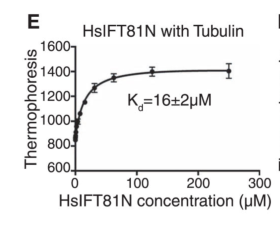

## Question

# Gene Research for Functional Annotation

## ⚠️ CRITICAL: Gene/Protein Identification Context

**BEFORE YOU BEGIN RESEARCH:** You MUST verify you are researching the CORRECT gene/protein. Gene symbols can be ambiguous, especially for less well-characterized genes from non-model organisms.

### Target Gene/Protein Identity (from UniProt):
- **UniProt Accession:** Q8WYA0
- **Protein Description:** RecName: Full=Intraflagellar transport protein 81 homolog; AltName: Full=Carnitine deficiency-associated protein expressed in ventricle 1; Short=CDV-1;
- **Gene Information:** Name=IFT81; Synonyms=CDV1;
- **Organism (full):** Homo sapiens (Human).
- **Protein Family:** Belongs to the IFT81 family. .
- **Key Domains:** IFT81. (IPR029600); IFT81_CH. (IPR041146); IFT81_N_sf. (IPR043016); IFT81_CH (PF18383)

### MANDATORY VERIFICATION STEPS:

1. **Check if the gene symbol "IFT81" matches the protein description above**
2. **Verify the organism is correct:** Homo sapiens (Human).
3. **Check if protein family/domains align with what you find in literature**
4. **If you find literature for a DIFFERENT gene with the same or similar symbol, STOP**

### If Gene Symbol is Ambiguous or You Cannot Find Relevant Literature:

**DO NOT PROCEED WITH RESEARCH ON A DIFFERENT GENE.** Instead:
- State clearly: "The gene symbol 'IFT81' is ambiguous or literature is limited for this specific protein"
- Explain what you found (e.g., "Found extensive literature on a different gene with the same symbol in a different organism")
- Describe the protein based ONLY on the UniProt information provided above
- Suggest that the protein function can be inferred from domain/family information

### Research Target:

Please provide a comprehensive research report on the gene **IFT81** (gene ID: IFT81, UniProt: Q8WYA0) in human.

The research report should be a detailed narrative explaining the function, biological processes, and localization of the gene product. Citations should be given for all claims.

You should prioritize authoritative reviews and primary scientific literature when conducting research. You can supplement
this with annotations you find in gene/protein databases, but these can be outdated or inaccurate.

We are specifically interested in the primary function of the gene - for enzymes, what reaction is catalyzed, and what is the substrate specificity? For transporters, what is the substrate? For structural proteins or adapters, what is the broader structural role? For signaling molecules, what is the role in the pathway.

We are interested in where in or outside the cell the gene product carries out its function.

We are also interested in the signaling or biochemical pathways in which the gene functions. We are less interested in broad pleiotropic effects, except where these elucidate the precise role.

Include evidence where possible. We are interested in both experimental evidence as well as inference from structure, evolution, or bioinformatic analysis. Precise studies should be prioritized over high-throughput, where available.

## Output

Question: You are an expert researcher providing comprehensive, well-cited information.

Provide detailed information focusing on:
1. Key concepts and definitions with current understanding
2. Recent developments and latest research (prioritize 2023-2024 sources)
3. Current applications and real-world implementations
4. Expert opinions and analysis from authoritative sources
5. Relevant statistics and data from recent studies

Format as a comprehensive research report with proper citations. Include URLs and publication dates where available.
Always prioritize recent, authoritative sources and provide specific citations for all major claims.

# Gene Research for Functional Annotation

## ⚠️ CRITICAL: Gene/Protein Identification Context

**BEFORE YOU BEGIN RESEARCH:** You MUST verify you are researching the CORRECT gene/protein. Gene symbols can be ambiguous, especially for less well-characterized genes from non-model organisms.

### Target Gene/Protein Identity (from UniProt):
- **UniProt Accession:** Q8WYA0
- **Protein Description:** RecName: Full=Intraflagellar transport protein 81 homolog; AltName: Full=Carnitine deficiency-associated protein expressed in ventricle 1; Short=CDV-1;
- **Gene Information:** Name=IFT81; Synonyms=CDV1;
- **Organism (full):** Homo sapiens (Human).
- **Protein Family:** Belongs to the IFT81 family. .
- **Key Domains:** IFT81. (IPR029600); IFT81_CH. (IPR041146); IFT81_N_sf. (IPR043016); IFT81_CH (PF18383)

### MANDATORY VERIFICATION STEPS:

1. **Check if the gene symbol "IFT81" matches the protein description above**
2. **Verify the organism is correct:** Homo sapiens (Human).
3. **Check if protein family/domains align with what you find in literature**
4. **If you find literature for a DIFFERENT gene with the same or similar symbol, STOP**

### If Gene Symbol is Ambiguous or You Cannot Find Relevant Literature:

**DO NOT PROCEED WITH RESEARCH ON A DIFFERENT GENE.** Instead:
- State clearly: "The gene symbol 'IFT81' is ambiguous or literature is limited for this specific protein"
- Explain what you found (e.g., "Found extensive literature on a different gene with the same symbol in a different organism")
- Describe the protein based ONLY on the UniProt information provided above
- Suggest that the protein function can be inferred from domain/family information

### Research Target:

Please provide a comprehensive research report on the gene **IFT81** (gene ID: IFT81, UniProt: Q8WYA0) in human.

The research report should be a detailed narrative explaining the function, biological processes, and localization of the gene product. Citations should be given for all claims.

You should prioritize authoritative reviews and primary scientific literature when conducting research. You can supplement
this with annotations you find in gene/protein databases, but these can be outdated or inaccurate.

We are specifically interested in the primary function of the gene - for enzymes, what reaction is catalyzed, and what is the substrate specificity? For transporters, what is the substrate? For structural proteins or adapters, what is the broader structural role? For signaling molecules, what is the role in the pathway.

We are interested in where in or outside the cell the gene product carries out its function.

We are also interested in the signaling or biochemical pathways in which the gene functions. We are less interested in broad pleiotropic effects, except where these elucidate the precise role.

Include evidence where possible. We are interested in both experimental evidence as well as inference from structure, evolution, or bioinformatic analysis. Precise studies should be prioritized over high-throughput, where available.

# Human IFT81 (Q8WYA0): functional annotation and research report

## Identity and principal function

**Identity verified.** The specified human gene **IFT81**, also called **CDV1**, encodes intraflagellar transport protein 81, a conserved component of the **IFT-B complex**. Human genetic studies explicitly identify *IFT81/CDV1* as an IFT-B core gene, and experimental work identifies its N-terminal calponin-homology (CH) fold and IFT74-binding coiled coils. These observations agree with the supplied UniProt accession **Q8WYA0** and IFT81-family/domain annotations; the findings below concern human IFT81 unless an orthologue is explicitly identified. The historical name “carnitine deficiency-associated protein expressed in ventricle 1” does **not** establish a carnitine-transport or metabolic function: the direct functional evidence instead concerns ciliary transport. (bhogaraju2013molecularbasisof pages 1-3, perrault2015ift81encodingan pages 1-2, petriman2022biochemicallyvalidatedstructural pages 4-6, perrault2015ift81encodingan pages 4-4)

**Functional conclusion:** IFT81 is principally a **structural scaffold and tubulin-cargo-binding subunit of IFT-B**, not a membrane transporter, the force-producing motor, or an enzyme that modifies tubulin. Together with IFT74, it helps assemble IFT particles and load soluble **αβ-tubulin heterodimers** for delivery toward the ciliary tip, where tubulin is needed to build and maintain the microtubule axoneme. IFT81–IFT74 also supplies a binding platform that regulates the ciliary-entry GTPase RabL2; this latter activity belongs to the *complex*, not necessarily to isolated IFT81. (bhogaraju2013molecularbasisof pages 1-3, bhogaraju2013molecularbasisof pages 3-4, petriman2022biochemicallyvalidatedstructural pages 4-6, boegholm2023theift81‐ift74complex pages 1-2)

## Molecular mechanism and substrate specificity

The **N-terminal CH domain of human IFT81** contacts the *globular portion* of soluble αβ-tubulin through a conserved positively charged surface. The highly basic N terminus of its partner **IFT74** additionally contacts the acidic **β-tubulin C-terminal tail**, increasing the complex’s tubulin affinity. Using recombinant human proteins and bovine tubulin, Bhogaraju and colleagues measured dissociation constants of **16 µM** for IFT81’s N-terminal domain and **0.9 µM** for the IFT74–IFT81 module; mutation of human IFT81 Lys73/Lys75 weakened binding to **187 µM**. Removing tubulin’s acidic tails did not substantially impair IFT81-domain binding, whereas removal of the β-tubulin tail eliminated detectable IFT74–IFT81 microtubule binding in the reported assay. This establishes **tubulin**, rather than carnitine or a signaling ligand, as the experimentally characterized cargo; it does not establish recognition of every tubulin isotype equally. (bhogaraju2013molecularbasisof pages 1-3, bhogaraju2013molecularbasisof pages 4-8, bhogaraju2013molecularbasisof media 6e2b7ebd)

The biochemical distinction matters in cells. Depleting IFT81 in human RPE-1 cells strongly reduced primary-cilium formation; siRNA-resistant wild-type IFT81 restored it, whereas a mutant disrupting the full tubulin-binding patch failed to rescue. An N-terminal deletion or partially binding-defective mutant rescued incompletely, although N-terminally truncated IFT81 could still enter the cilium. Thus, loss of tubulin loading can impair ciliogenesis **without necessarily preventing IFT81’s own recruitment into the transport machinery**. In *Trypanosoma*, disruption of the homologous CH domain did not measurably change the mutant protein’s IFT speed, an orthologue-based result that further separates cargo binding from the basic movement of the scaffold. (bhogaraju2013molecularbasisof pages 3-4, bhogaraju2013molecularbasisof pages 1-3)

IFT81’s extended coiled-coil region heterodimerizes with IFT74 to organize other IFT-B components. A **2022** model of reconstituted *Chlamydomonas* IFT-B, tested against cross-linking, binding, structural and mutational data, places **IFT22** near one portion of the IFT81–IFT74 scaffold and **IFT27–IFT25** nearer its C terminus. The structure is flexible, and the authors found evidence for alternative placements of IFT81–IFT74 within IFT-B; precise conformations in human cilia should therefore not be presented as fully resolved. (petriman2022biochemicallyvalidatedstructural pages 1-2, petriman2022biochemicallyvalidatedstructural pages 4-6)

A distinct **2023** biochemical finding is that the IFT81–IFT74 scaffold helps turn off **RabL2**, a small GTPase involved in initiating IFT. In reconstituted *Chlamydomonas* complexes, GTP-bound RabL2 bound IFT-B1 with a reported **Kd of 0.59 µM**; the complex increased RabL2 GTP-hydrolysis activity by approximately **sevenfold** after accounting for background activity. A short IFT81–IFT74 coiled-coil fragment retained RabL2 binding and stimulated hydrolysis approximately **threefold**; the algal fragment also increased **human RabL2B** hydrolysis approximately **fivefold**. Structural models and cross-links place RabL2 against the IFT81–IFT74 coiled coils, providing an explanation for RabL2 release after departure from the ciliary base. This is an **unconventional GTPase-activating-protein-like activity of the heterodimer/IFT-B1**, not evidence that IFT81 hydrolyzes GTP itself. Human-cell experiments altering **IFT74**, rather than IFT81, corroborated the importance of this interface for RabL2 localization and ciliary IFT-particle entry; the complete human heterodimer’s catalytic effect was not established by those cell experiments. (boegholm2023theift81‐ift74complex pages 5-7, boegholm2023theift81‐ift74complex pages 7-9, boegholm2023theift81‐ift74complex pages 10-11)

## Cellular location and pathways

Human IFT81 is observed **at the primary-cilium base and tip and, less prominently, along the axoneme**. Tagged full-length protein and a CH-domain deletion both reached primary-cilium tips in human RPE-1 cells; endogenous protein remained enriched at the base and tip in patient fibroblasts carrying one C-terminal variant. These data place its established activity at the **basal-body/ciliary-entry region and inside the cilium**, as part of IFT particles associated with axonemal microtubules—not as a demonstrated transporter across the ciliary membrane. (bhogaraju2013molecularbasisof pages 1-3, perrault2015ift81encodingan pages 4-4)

The broader pathway is **bidirectional intraflagellar transport**. Kinesin-2 moves anterograde IFT trains from base to tip; dynein-2 powers their return. IFT-B provides a major scaffold for the trains and cargo carriage, while IFT-A collaborates in ciliary trafficking. Accordingly, calling IFT81 an “anterograde IFT-B component” describes its central assembly and cargo role, **not** an intrinsic kinesin motor activity or evidence that IFT81 cannot travel on returning particles. In situ cryo-electron tomography of *Chlamydomonas* reported a **6-nm IFT-B repeat**, neighboring-repeat contacts and flexible connections to IFT-A. This is compelling structural context but is **algal**, rather than a direct image of human IFT81 in a human cilium. (petriman2022biochemicallyvalidatedstructural pages 1-2, boegholm2023theift81‐ift74complex pages 1-2, lacey2023themolecularstructure pages 1-2)

IFT81 also influences **cilium-dependent Hedgehog signaling indirectly through ciliary architecture and trafficking**. In human IFT81-mutant chondrocytes, altered processing of **GLI3**—the ratio of its full-length and repressor forms—provides a relatively specific signaling readout relevant to skeletal development. Another patient-derived fibroblast line showed elevated **GLI2 mRNA after Smoothened agonist**, but not parallel increases in every tested Hedgehog-pathway transcript. Neither result demonstrates that IFT81 directly binds Hedgehog ligand, Smoothened or GLI proteins. (duran2016destabilizationofthe pages 4-7, duran2016destabilizationofthe pages 3-4, perrault2015ift81encodingan pages 4-4)

## Human disease evidence and real-world use

Human biallelic *IFT81* variants are associated with **rare ciliopathy presentations**, notably nephronophthisis with polydactyly and a spectrum of **short-rib skeletal ciliopathies/asphyxiating thoracic dystrophy**. In a **2015** screen of **1,628** individuals with suspected ciliopathy, Perrault and colleagues identified homozygous **c.1188+1G>A** in a child with nephronophthisis and postaxial foot polydactyly. They also found **c.2015_2019del, p.Asp672Alafs*15**, predicted to extend IFT81’s C terminus by 10 residues, in another individual. That second patient’s fibroblasts were ciliated at **69.9% versus 83.9%** in controls (**p = 0.000026**) and showed increased agonist-stimulated GLI2 expression. **Interpretive qualification:** this individual also had biallelic disease-associated *PPT1* variants and markedly reduced PPT1 enzyme activity; the retinal and neurological findings cannot confidently be assigned to IFT81 alone. (perrault2015ift81encodingan pages 3-3, perrault2015ift81encodingan pages 3-4, perrault2015ift81encodingan pages 4-4)

In a separate **2016** study, Duran and colleagues examined individuals with biallelic *IFT81* variants and skeletal disease. Patient-derived chondrocytes had severely reduced IFT81 and reduced abundance of other IFT-B components, including **IFT74, IFT52 and IFT88**, whereas the kinesin subunit **KIF3A** was not comparably reduced. The fraction of ciliated cells was not significantly changed in the reported comparison, but their cilia were unusually **long and variable**; GLI3 processing was altered, and re-expression of wild-type IFT81 partially corrected measured phenotypes. The contrasting short-cilium/fewer-ciliated-cell result in the 2015 fibroblast line underscores **allele- and cell-context dependence**, not a universal prediction that every IFT81 variant lengthens cilia. (duran2016destabilizationofthe pages 4-7, duran2016destabilizationofthe pages 3-4, perrault2015ift81encodingan pages 4-4)

**Current application** is principally **molecular diagnosis and functional interpretation**: *IFT81* can be assessed in sequencing studies of appropriate renal, skeletal or multisystem ciliopathy phenotypes, and suspected variants can be investigated using ciliation, ciliary-length, IFT-B protein-stability and GLI-processing assays. These are research and diagnostic applications, **not an established IFT81-targeted treatment**. A pertinent **2023** study of **IFT74 variants** in humans and mice independently supports the physiological importance of the shared IFT74–IFT81 tubulin-binding module, but those cases must **not** be misreported as IFT81-mutant patients. (perrault2015ift81encodingan pages 3-3, duran2016destabilizationofthe pages 4-7, bakey2023ift74variantscause pages 1-2)

The following evidence matrix distinguishes human experiments from inference based on conserved organisms and lists publication dates and source URLs.

| Molecular or clinical finding | Key experimental finding | Species and inference boundary | Dated source and DOI |
|---|---|---|---|
| **IFT81–IFT74 binds tubulin cargo** | Recombinant human IFT81 N-terminal calponin-homology domain bound αβ-tubulin with Kd = 16 µM. The human IFT74–IFT81 module bound approximately 18-fold more tightly (Kd = 0.9 µM); neutralizing IFT81 Lys73/Lys75 weakened affinity to Kd = 187 µM. IFT81 recognizes globular tubulin, whereas basic IFT74 contacts the acidic β-tubulin tail. (bhogaraju2013molecularbasisof pages 4-8, bhogaraju2013molecularbasisof pages 1-3, bhogaraju2013molecularbasisof media 6e2b7ebd) | **Direct human-protein evidence**, using recombinant human proteins and bovine tubulin. Supports soluble αβ-tubulin as cargo; IFT81 is not an enzyme or membrane transporter. | Bhogaraju et al., *Science*, **30 Aug 2013**. [doi:10.1126/science.1240985](https://doi.org/10.1126/science.1240985) |
| **Tubulin binding is required for human ciliogenesis** | IFT81 depletion strongly reduced ciliated human RPE-1 cells. siRNA-resistant wild-type IFT81 rescued ciliogenesis; ΔN and partially binding-defective constructs gave incomplete rescue, while a mutant disrupting the entire tubulin-binding patch failed to rescue. Full-length and ΔN IFT81 still reached the ciliary tip, separating cargo binding from IFT81's own ciliary trafficking. (bhogaraju2013molecularbasisof pages 1-3, bhogaraju2013molecularbasisof pages 3-4) | **Direct human-cell evidence.** Demonstrates that the N-terminal cargo-binding module is functionally required, but does not show that IFT81 itself supplies motor force. | Bhogaraju et al., *Science*, **30 Aug 2013**. [doi:10.1126/science.1240985](https://doi.org/10.1126/science.1240985) |
| **IFT81–IFT74 is an IFT-B scaffold** | A biochemically validated model of the 15-subunit IFT-B complex placed IFT81–IFT74 as a flexible heterodimeric scaffold containing about 10 parallel coiled-coil segments; it binds IFT22 near coiled-coil VI, IFT27–IFT25 near coiled-coils VIII–IX, and links to other IFT-B components. Validation included cross-linking mass spectrometry, solution scattering, crystallography, mutagenesis, and binding assays. (petriman2022biochemicallyvalidatedstructural pages 1-2, petriman2022biochemicallyvalidatedstructural pages 4-6) | Primarily **recombinant *Chlamydomonas reinhardtii* architecture** plus computational modeling. Strong evidence for conserved organization, but exact human conformations remain inferred. | Petriman et al., *The EMBO Journal*, **10 Nov 2022**. [doi:10.15252/embj.2022112440](https://doi.org/10.15252/embj.2022112440) |
| **Position in polymeric anterograde IFT trains** | In situ cryo-electron tomography modeled *Chlamydomonas* IFT-B as a polymer with a **6-nm repeat**; neighboring repeats cooperatively stabilize train conformation. IFT-A has an approximately 11.5-nm repeat, giving an approximate 2:1 IFT-B:IFT-A relationship. (lacey2023themolecularstructure pages 1-2, ishikawa2023mass‐speccryo‐emand pages 1-3) | **Direct algal in situ structural evidence**, not direct visualization of human IFT81. Subunit assignment combines approximately 10–18 Å cryo-ET maps with AlphaFold predictions, so atomic details and human equivalence require caution. | Lacey, Foster and Pigino, *Nature Structural & Molecular Biology*, online **5 Jan 2023**. [doi:10.1038/s41594-022-00905-5](https://doi.org/10.1038/s41594-022-00905-5) |
| **RabL2 recruitment and GTPase activation** | GTP-bound RabL2 bound the IFT-B1 complex with Kd = 0.59 µM. Incorporation into IFT-B1 increased RabL2 GTP hydrolysis approximately **7-fold** after background correction; an approximately 70-residue IFT81–IFT74 coiled coil was sufficient for approximately 3-fold stimulation. The activity explains RabL2 inactivation and release shortly after IFT initiation. (boegholm2023theift81‐ift74complex pages 5-7, boegholm2023theift81‐ift74complex pages 7-9) | Mainly **recombinant *Chlamydomonas* evidence**. IFT81–IFT74 acts as an unconventional GAP platform, but isolated human IFT81 has not been shown to have GAP activity. | Boegholm et al., *The EMBO Journal*, **22 Aug 2023**. [doi:10.15252/embj.2022111807](https://doi.org/10.15252/embj.2022111807) |
| **Evolutionary conservation of RabL2 regulation** | The minimal *Chlamydomonas* IFT81(460–533)–IFT74(460–532) complex increased **human RabL2B** GTP hydrolysis approximately **5-fold**. Human-complex cross-linking supported a conserved interface; disruption through IFT74 T438R reduced RabL2 recruitment and ciliary IFT particles in human RPE-hTERT cells. (boegholm2023theift81‐ift74complex pages 10-11) | **Cross-species biochemical evidence plus human-cell validation of the IFT74 interface.** It supports conservation but is not a complete enzymatic assay of purified human IFT81–IFT74. | Boegholm et al., *The EMBO Journal*, **22 Aug 2023**. [doi:10.15252/embj.2022111807](https://doi.org/10.15252/embj.2022111807) |
| **Partner-module genetics: IFT74 variants** | Human deletion of IFT74's first 40 residues caused skeletal ciliopathy with severely shortened motile cilia; biallelic splice variants caused lethal chondrodysplasia. Mouse null alleles blocked ciliogenesis and caused midgestational lethality. The deleted segment was dispensable for IFT-subunit binding but important for tubulin binding. (bakey2023ift74variantscause pages 1-2) | **These are IFT74—not IFT81—variants.** They independently support the physiological importance of the shared IFT74–IFT81 tubulin-loading module and must not be counted as human IFT81 cases. | Bakey et al., *PLOS Genetics*, **14 Jun 2023**. [doi:10.1371/journal.pgen.1010796](https://doi.org/10.1371/journal.pgen.1010796) |
| **IFT81 is an exceptionally rare human ciliopathy locus** | Screening **1,628** affected individuals identified homozygous IFT81 c.1188+1G>A in a child with nephronophthisis and postaxial foot polydactyly, and homozygous c.2015_2019del (p.Asp672Alafs*15) in another patient. The latter's fibroblasts showed **69.9% ciliation versus 83.9%** in controls (p = 0.000026), shorter cilia, and increased SAG-stimulated GLI2 expression. (perrault2015ift81encodingan pages 3-3, perrault2015ift81encodingan pages 3-4, perrault2015ift81encodingan pages 4-4) | **Direct human genetic and fibroblast evidence.** The p.Asp672Alafs*15 patient also had biallelic pathogenic **PPT1** p.Gly245Arg and only 5% residual PPT1 activity, strongly confounding neurological and retinal attribution to IFT81. | Perrault et al., *Journal of Medical Genetics*, online **14 Aug 2015**. [doi:10.1136/jmedgenet-2014-102838](https://doi.org/10.1136/jmedgenet-2014-102838) |
| **Skeletal ciliopathy, IFT-B destabilization and Hedgehog dysregulation** | Patient-derived chondrocytes with biallelic IFT81 variants had nearly absent IFT81, reduced IFT74, IFT52 and IFT88, normal KIF3A abundance, and abnormally long, variable cilia despite no significant reduction in the proportion of ciliated cells. Mutant cells had an increased GLI3 full-length:repressor ratio; wild-type IFT81 partially normalized ciliary length and GLI3 processing. (duran2016destabilizationofthe pages 4-7, duran2016destabilizationofthe pages 3-4, duran2016destabilizationofthe pages 2-3) | **Direct human patient-cell evidence.** Establishes a causal link between hypomorphic IFT81 dysfunction, destabilized anterograde IFT-B, abnormal ciliary architecture, and Hedgehog/GLI processing in cartilage. | Duran et al., *Scientific Reports*, **27 Sep 2016**. [doi:10.1038/srep34232](https://doi.org/10.1038/srep34232) |

*Table: Evidence supporting the molecular and clinical annotation of verified human IFT81 (Q8WYA0), with quantitative findings and explicit boundaries between human data and orthologue-based inference.*

**Overall assessment.** The strongest direct functional annotation is **IFT74-associated tubulin-cargo binding coupled to IFT-B scaffolding at the primary cilium**; human loss-of-function/rescue and patient-cell studies substantiate its importance for cilium assembly and signaling. Recent structural and RabL2 work substantially refines the mechanism, but aspects established only with *Chlamydomonas* complexes remain **conservation-based inferences for human IFT81**. (bhogaraju2013molecularbasisof pages 1-3, bhogaraju2013molecularbasisof pages 3-4, petriman2022biochemicallyvalidatedstructural pages 4-6, boegholm2023theift81‐ift74complex pages 7-9, duran2016destabilizationofthe pages 4-7)

References

1. (bhogaraju2013molecularbasisof pages 1-3): Sagar Bhogaraju, Lukas Cajanek, Cécile Fort, Thierry Blisnick, Kristina Weber, Michael Taschner, Naoko Mizuno, Stefan Lamla, Philippe Bastin, Erich A. Nigg, and Esben Lorentzen. Molecular basis of tubulin transport within the cilium by ift74 and ift81. Science, 341:1009-1012, Aug 2013. URL: https://doi.org/10.1126/science.1240985, doi:10.1126/science.1240985. This article has 425 citations and is from a highest quality peer-reviewed journal.

2. (perrault2015ift81encodingan pages 1-2): Isabelle Perrault, Jan Halbritter, Jonathan D Porath, Xavier Gérard, Daniela A Braun, Heon Yung Gee, Hanan M Fathy, Sophie Saunier, Valérie Cormier-Daire, Sophie Thomas, Tania Attié-Bitach, Nathalie Boddaert, Michael Taschner, Markus Schueler, Esben Lorentzen, Richard P Lifton, Jennifer A Lawson, Meriem Garfa-Traore, Edgar A Otto, Philippe Bastin, Catherine Caillaud, Josseline Kaplan, Jean-Michel Rozet, and Friedhelm Hildebrandt. Ift81, encoding an ift-b core protein, as a very rare cause of a ciliopathy phenotype. Journal of Medical Genetics, 52:657-665, Aug 2015. URL: https://doi.org/10.1136/jmedgenet-2014-102838, doi:10.1136/jmedgenet-2014-102838. This article has 51 citations and is from a domain leading peer-reviewed journal.

3. (petriman2022biochemicallyvalidatedstructural pages 4-6): Narcis A Petriman, Marta Loureiro‐López, Michael Taschner, Nevin K Zacharia, Magdalena M Georgieva, Niels Boegholm, Jiaolong Wang, André Mourão, Robert B Russell, Jens S Andersen, and Esben Lorentzen. Biochemically validated structural model of the 15‐subunit intraflagellar transport complex ift‐b. The EMBO Journal, Nov 2022. URL: https://doi.org/10.15252/embj.2022112440, doi:10.15252/embj.2022112440. This article has 58 citations.

4. (perrault2015ift81encodingan pages 4-4): Isabelle Perrault, Jan Halbritter, Jonathan D Porath, Xavier Gérard, Daniela A Braun, Heon Yung Gee, Hanan M Fathy, Sophie Saunier, Valérie Cormier-Daire, Sophie Thomas, Tania Attié-Bitach, Nathalie Boddaert, Michael Taschner, Markus Schueler, Esben Lorentzen, Richard P Lifton, Jennifer A Lawson, Meriem Garfa-Traore, Edgar A Otto, Philippe Bastin, Catherine Caillaud, Josseline Kaplan, Jean-Michel Rozet, and Friedhelm Hildebrandt. Ift81, encoding an ift-b core protein, as a very rare cause of a ciliopathy phenotype. Journal of Medical Genetics, 52:657-665, Aug 2015. URL: https://doi.org/10.1136/jmedgenet-2014-102838, doi:10.1136/jmedgenet-2014-102838. This article has 51 citations and is from a domain leading peer-reviewed journal.

5. (bhogaraju2013molecularbasisof pages 3-4): Sagar Bhogaraju, Lukas Cajanek, Cécile Fort, Thierry Blisnick, Kristina Weber, Michael Taschner, Naoko Mizuno, Stefan Lamla, Philippe Bastin, Erich A. Nigg, and Esben Lorentzen. Molecular basis of tubulin transport within the cilium by ift74 and ift81. Science, 341:1009-1012, Aug 2013. URL: https://doi.org/10.1126/science.1240985, doi:10.1126/science.1240985. This article has 425 citations and is from a highest quality peer-reviewed journal.

6. (boegholm2023theift81‐ift74complex pages 1-2): Niels Boegholm, Narcis A Petriman, Marta Loureiro‐López, Jiaolong Wang, Miren Itxaso Santiago Vela, Beibei Liu, Tomoharu Kanie, Roy Ng, Peter K Jackson, Jens S Andersen, and Esben Lorentzen. The ift81‐ift74 complex acts as an unconventional rabl2 gtpase‐activating protein during intraflagellar transport. The EMBO Journal, Aug 2023. URL: https://doi.org/10.15252/embj.2022111807, doi:10.15252/embj.2022111807. This article has 9 citations.

7. (bhogaraju2013molecularbasisof pages 4-8): Sagar Bhogaraju, Lukas Cajanek, Cécile Fort, Thierry Blisnick, Kristina Weber, Michael Taschner, Naoko Mizuno, Stefan Lamla, Philippe Bastin, Erich A. Nigg, and Esben Lorentzen. Molecular basis of tubulin transport within the cilium by ift74 and ift81. Science, 341:1009-1012, Aug 2013. URL: https://doi.org/10.1126/science.1240985, doi:10.1126/science.1240985. This article has 425 citations and is from a highest quality peer-reviewed journal.

8. (bhogaraju2013molecularbasisof media 6e2b7ebd): Sagar Bhogaraju, Lukas Cajanek, Cécile Fort, Thierry Blisnick, Kristina Weber, Michael Taschner, Naoko Mizuno, Stefan Lamla, Philippe Bastin, Erich A. Nigg, and Esben Lorentzen. Molecular basis of tubulin transport within the cilium by ift74 and ift81. Science, 341:1009-1012, Aug 2013. URL: https://doi.org/10.1126/science.1240985, doi:10.1126/science.1240985. This article has 425 citations and is from a highest quality peer-reviewed journal.

9. (petriman2022biochemicallyvalidatedstructural pages 1-2): Narcis A Petriman, Marta Loureiro‐López, Michael Taschner, Nevin K Zacharia, Magdalena M Georgieva, Niels Boegholm, Jiaolong Wang, André Mourão, Robert B Russell, Jens S Andersen, and Esben Lorentzen. Biochemically validated structural model of the 15‐subunit intraflagellar transport complex ift‐b. The EMBO Journal, Nov 2022. URL: https://doi.org/10.15252/embj.2022112440, doi:10.15252/embj.2022112440. This article has 58 citations.

10. (boegholm2023theift81‐ift74complex pages 5-7): Niels Boegholm, Narcis A Petriman, Marta Loureiro‐López, Jiaolong Wang, Miren Itxaso Santiago Vela, Beibei Liu, Tomoharu Kanie, Roy Ng, Peter K Jackson, Jens S Andersen, and Esben Lorentzen. The ift81‐ift74 complex acts as an unconventional rabl2 gtpase‐activating protein during intraflagellar transport. The EMBO Journal, Aug 2023. URL: https://doi.org/10.15252/embj.2022111807, doi:10.15252/embj.2022111807. This article has 9 citations.

11. (boegholm2023theift81‐ift74complex pages 7-9): Niels Boegholm, Narcis A Petriman, Marta Loureiro‐López, Jiaolong Wang, Miren Itxaso Santiago Vela, Beibei Liu, Tomoharu Kanie, Roy Ng, Peter K Jackson, Jens S Andersen, and Esben Lorentzen. The ift81‐ift74 complex acts as an unconventional rabl2 gtpase‐activating protein during intraflagellar transport. The EMBO Journal, Aug 2023. URL: https://doi.org/10.15252/embj.2022111807, doi:10.15252/embj.2022111807. This article has 9 citations.

12. (boegholm2023theift81‐ift74complex pages 10-11): Niels Boegholm, Narcis A Petriman, Marta Loureiro‐López, Jiaolong Wang, Miren Itxaso Santiago Vela, Beibei Liu, Tomoharu Kanie, Roy Ng, Peter K Jackson, Jens S Andersen, and Esben Lorentzen. The ift81‐ift74 complex acts as an unconventional rabl2 gtpase‐activating protein during intraflagellar transport. The EMBO Journal, Aug 2023. URL: https://doi.org/10.15252/embj.2022111807, doi:10.15252/embj.2022111807. This article has 9 citations.

13. (lacey2023themolecularstructure pages 1-2): Samuel E. Lacey, Helen E. Foster, and Gaia Pigino. The molecular structure of ift-a and ift-b in anterograde intraflagellar transport trains. Nature Structural & Molecular Biology, 30:584-593, Jan 2023. URL: https://doi.org/10.1038/s41594-022-00905-5, doi:10.1038/s41594-022-00905-5. This article has 124 citations and is from a highest quality peer-reviewed journal.

14. (duran2016destabilizationofthe pages 4-7): Ivan Duran, S. Paige Taylor, Wenjuan Zhang, Jorge Martin, Kimberly N. Forlenza, Rhonda P. Spiro, Deborah A. Nickerson, Michael Bamshad, Daniel H. Cohn, and Deborah Krakow. Destabilization of the ift-b cilia core complex due to mutations in ift81 causes a spectrum of short-rib polydactyly syndrome. Scientific Reports, Sep 2016. URL: https://doi.org/10.1038/srep34232, doi:10.1038/srep34232. This article has 58 citations and is from a peer-reviewed journal.

15. (duran2016destabilizationofthe pages 3-4): Ivan Duran, S. Paige Taylor, Wenjuan Zhang, Jorge Martin, Kimberly N. Forlenza, Rhonda P. Spiro, Deborah A. Nickerson, Michael Bamshad, Daniel H. Cohn, and Deborah Krakow. Destabilization of the ift-b cilia core complex due to mutations in ift81 causes a spectrum of short-rib polydactyly syndrome. Scientific Reports, Sep 2016. URL: https://doi.org/10.1038/srep34232, doi:10.1038/srep34232. This article has 58 citations and is from a peer-reviewed journal.

16. (perrault2015ift81encodingan pages 3-3): Isabelle Perrault, Jan Halbritter, Jonathan D Porath, Xavier Gérard, Daniela A Braun, Heon Yung Gee, Hanan M Fathy, Sophie Saunier, Valérie Cormier-Daire, Sophie Thomas, Tania Attié-Bitach, Nathalie Boddaert, Michael Taschner, Markus Schueler, Esben Lorentzen, Richard P Lifton, Jennifer A Lawson, Meriem Garfa-Traore, Edgar A Otto, Philippe Bastin, Catherine Caillaud, Josseline Kaplan, Jean-Michel Rozet, and Friedhelm Hildebrandt. Ift81, encoding an ift-b core protein, as a very rare cause of a ciliopathy phenotype. Journal of Medical Genetics, 52:657-665, Aug 2015. URL: https://doi.org/10.1136/jmedgenet-2014-102838, doi:10.1136/jmedgenet-2014-102838. This article has 51 citations and is from a domain leading peer-reviewed journal.

17. (perrault2015ift81encodingan pages 3-4): Isabelle Perrault, Jan Halbritter, Jonathan D Porath, Xavier Gérard, Daniela A Braun, Heon Yung Gee, Hanan M Fathy, Sophie Saunier, Valérie Cormier-Daire, Sophie Thomas, Tania Attié-Bitach, Nathalie Boddaert, Michael Taschner, Markus Schueler, Esben Lorentzen, Richard P Lifton, Jennifer A Lawson, Meriem Garfa-Traore, Edgar A Otto, Philippe Bastin, Catherine Caillaud, Josseline Kaplan, Jean-Michel Rozet, and Friedhelm Hildebrandt. Ift81, encoding an ift-b core protein, as a very rare cause of a ciliopathy phenotype. Journal of Medical Genetics, 52:657-665, Aug 2015. URL: https://doi.org/10.1136/jmedgenet-2014-102838, doi:10.1136/jmedgenet-2014-102838. This article has 51 citations and is from a domain leading peer-reviewed journal.

18. (bakey2023ift74variantscause pages 1-2): Zeineb Bakey, Oscar A. Cabrera, Julia Hoefele, Dinu Antony, Kaman Wu, Michael W. Stuck, Dimitra Micha, Thibaut Eguether, Abigail O. Smith, Nicole N. van der Wel, Matias Wagner, Lara Strittmatter, Philip L. Beales, Julie A. Jonassen, Isabelle Thiffault, Maxime Cadieux-Dion, Laura Boyes, Saba Sharif, Beyhan Tüysüz, Desiree Dunstheimer, Hans W. M. Niessen, William Devine, Cecilia W. Lo, Hannah M. Mitchison, Miriam Schmidts, and Gregory J. Pazour. Ift74 variants cause skeletal ciliopathy and motile cilia defects in mice and humans. PLOS Genetics, 19:e1010796, Jun 2023. URL: https://doi.org/10.1371/journal.pgen.1010796, doi:10.1371/journal.pgen.1010796. This article has 29 citations and is from a domain leading peer-reviewed journal.

19. (ishikawa2023mass‐speccryo‐emand pages 1-3): Takashi Ishikawa. Mass‐spec, cryo‐em and ai join forces for a close look at the transporter complex in cilia. The EMBO Journal, Dec 2023. URL: https://doi.org/10.15252/embj.2022113010, doi:10.15252/embj.2022113010. This article has 0 citations.

20. (duran2016destabilizationofthe pages 2-3): Ivan Duran, S. Paige Taylor, Wenjuan Zhang, Jorge Martin, Kimberly N. Forlenza, Rhonda P. Spiro, Deborah A. Nickerson, Michael Bamshad, Daniel H. Cohn, and Deborah Krakow. Destabilization of the ift-b cilia core complex due to mutations in ift81 causes a spectrum of short-rib polydactyly syndrome. Scientific Reports, Sep 2016. URL: https://doi.org/10.1038/srep34232, doi:10.1038/srep34232. This article has 58 citations and is from a peer-reviewed journal.

## Artifacts

- [Edison artifact artifact-00](IFT81-deep-research-falcon_artifacts/artifact-00.md)

## Citations

1. bhogaraju2013molecularbasisof pages 1-3
2. petriman2022biochemicallyvalidatedstructural pages 4-6
3. bhogaraju2013molecularbasisof pages 3-4
4. bhogaraju2013molecularbasisof pages 4-8
5. petriman2022biochemicallyvalidatedstructural pages 1-2
6. lacey2023themolecularstructure pages 1-2
7. duran2016destabilizationofthe pages 4-7
8. duran2016destabilizationofthe pages 3-4
9. duran2016destabilizationofthe pages 2-3
10. doi:10.1126/science.1240985
11. doi:10.15252/embj.2022112440
12. doi:10.1038/s41594-022-00905-5
13. doi:10.15252/embj.2022111807
14. doi:10.1371/journal.pgen.1010796
15. doi:10.1136/jmedgenet-2014-102838
16. doi:10.1038/srep34232
17. https://doi.org/10.1126/science.1240985
18. https://doi.org/10.15252/embj.2022112440
19. https://doi.org/10.1038/s41594-022-00905-5
20. https://doi.org/10.15252/embj.2022111807
21. https://doi.org/10.1371/journal.pgen.1010796
22. https://doi.org/10.1136/jmedgenet-2014-102838
23. https://doi.org/10.1038/srep34232
24. https://doi.org/10.1126/science.1240985,
25. https://doi.org/10.1136/jmedgenet-2014-102838,
26. https://doi.org/10.15252/embj.2022112440,
27. https://doi.org/10.15252/embj.2022111807,
28. https://doi.org/10.1038/s41594-022-00905-5,
29. https://doi.org/10.1038/srep34232,
30. https://doi.org/10.1371/journal.pgen.1010796,
31. https://doi.org/10.15252/embj.2022113010,