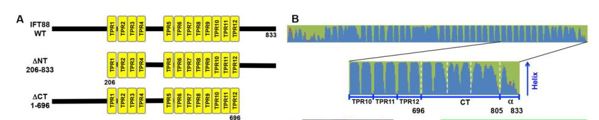

## Question

# Gene Research for Functional Annotation

## ⚠️ CRITICAL: Gene/Protein Identification Context

**BEFORE YOU BEGIN RESEARCH:** You MUST verify you are researching the CORRECT gene/protein. Gene symbols can be ambiguous, especially for less well-characterized genes from non-model organisms.

### Target Gene/Protein Identity (from UniProt):
- **UniProt Accession:** Q13099
- **Protein Description:** RecName: Full=Intraflagellar transport protein 88 homolog; AltName: Full=Recessive polycystic kidney disease protein Tg737 homolog; AltName: Full=Tetratricopeptide repeat protein 10; Short=TPR repeat protein 10;
- **Gene Information:** Name=IFT88; Synonyms=TG737, TTC10;
- **Organism (full):** Homo sapiens (Human).
- **Protein Family:** Not specified in UniProt
- **Key Domains:** Sel1-like. (IPR006597); TPR-like_helical_dom_sf. (IPR011990); TPR_rpt. (IPR019734); TPR_12 (PF13424); TPR_16 (PF13432)

### MANDATORY VERIFICATION STEPS:

1. **Check if the gene symbol "IFT88" matches the protein description above**
2. **Verify the organism is correct:** Homo sapiens (Human).
3. **Check if protein family/domains align with what you find in literature**
4. **If you find literature for a DIFFERENT gene with the same or similar symbol, STOP**

### If Gene Symbol is Ambiguous or You Cannot Find Relevant Literature:

**DO NOT PROCEED WITH RESEARCH ON A DIFFERENT GENE.** Instead:
- State clearly: "The gene symbol 'IFT88' is ambiguous or literature is limited for this specific protein"
- Explain what you found (e.g., "Found extensive literature on a different gene with the same symbol in a different organism")
- Describe the protein based ONLY on the UniProt information provided above
- Suggest that the protein function can be inferred from domain/family information

### Research Target:

Please provide a comprehensive research report on the gene **IFT88** (gene ID: IFT88, UniProt: Q13099) in human.

The research report should be a detailed narrative explaining the function, biological processes, and localization of the gene product. Citations should be given for all claims.

You should prioritize authoritative reviews and primary scientific literature when conducting research. You can supplement
this with annotations you find in gene/protein databases, but these can be outdated or inaccurate.

We are specifically interested in the primary function of the gene - for enzymes, what reaction is catalyzed, and what is the substrate specificity? For transporters, what is the substrate? For structural proteins or adapters, what is the broader structural role? For signaling molecules, what is the role in the pathway.

We are interested in where in or outside the cell the gene product carries out its function.

We are also interested in the signaling or biochemical pathways in which the gene functions. We are less interested in broad pleiotropic effects, except where these elucidate the precise role.

Include evidence where possible. We are interested in both experimental evidence as well as inference from structure, evolution, or bioinformatic analysis. Precise studies should be prioritized over high-throughput, where available.

## Output

Question: You are an expert researcher providing comprehensive, well-cited information.

Provide detailed information focusing on:
1. Key concepts and definitions with current understanding
2. Recent developments and latest research (prioritize 2023-2024 sources)
3. Current applications and real-world implementations
4. Expert opinions and analysis from authoritative sources
5. Relevant statistics and data from recent studies

Format as a comprehensive research report with proper citations. Include URLs and publication dates where available.
Always prioritize recent, authoritative sources and provide specific citations for all major claims.

# Gene Research for Functional Annotation

## ⚠️ CRITICAL: Gene/Protein Identification Context

**BEFORE YOU BEGIN RESEARCH:** You MUST verify you are researching the CORRECT gene/protein. Gene symbols can be ambiguous, especially for less well-characterized genes from non-model organisms.

### Target Gene/Protein Identity (from UniProt):
- **UniProt Accession:** Q13099
- **Protein Description:** RecName: Full=Intraflagellar transport protein 88 homolog; AltName: Full=Recessive polycystic kidney disease protein Tg737 homolog; AltName: Full=Tetratricopeptide repeat protein 10; Short=TPR repeat protein 10;
- **Gene Information:** Name=IFT88; Synonyms=TG737, TTC10;
- **Organism (full):** Homo sapiens (Human).
- **Protein Family:** Not specified in UniProt
- **Key Domains:** Sel1-like. (IPR006597); TPR-like_helical_dom_sf. (IPR011990); TPR_rpt. (IPR019734); TPR_12 (PF13424); TPR_16 (PF13432)

### MANDATORY VERIFICATION STEPS:

1. **Check if the gene symbol "IFT88" matches the protein description above**
2. **Verify the organism is correct:** Homo sapiens (Human).
3. **Check if protein family/domains align with what you find in literature**
4. **If you find literature for a DIFFERENT gene with the same or similar symbol, STOP**

### If Gene Symbol is Ambiguous or You Cannot Find Relevant Literature:

**DO NOT PROCEED WITH RESEARCH ON A DIFFERENT GENE.** Instead:
- State clearly: "The gene symbol 'IFT88' is ambiguous or literature is limited for this specific protein"
- Explain what you found (e.g., "Found extensive literature on a different gene with the same symbol in a different organism")
- Describe the protein based ONLY on the UniProt information provided above
- Suggest that the protein function can be inferred from domain/family information

### Research Target:

Please provide a comprehensive research report on the gene **IFT88** (gene ID: IFT88, UniProt: Q13099) in human.

The research report should be a detailed narrative explaining the function, biological processes, and localization of the gene product. Citations should be given for all claims.

You should prioritize authoritative reviews and primary scientific literature when conducting research. You can supplement
this with annotations you find in gene/protein databases, but these can be outdated or inaccurate.

We are specifically interested in the primary function of the gene - for enzymes, what reaction is catalyzed, and what is the substrate specificity? For transporters, what is the substrate? For structural proteins or adapters, what is the broader structural role? For signaling molecules, what is the role in the pathway.

We are interested in where in or outside the cell the gene product carries out its function.

We are also interested in the signaling or biochemical pathways in which the gene functions. We are less interested in broad pleiotropic effects, except where these elucidate the precise role.

Include evidence where possible. We are interested in both experimental evidence as well as inference from structure, evolution, or bioinformatic analysis. Precise studies should be prioritized over high-throughput, where available.

# Human IFT88 (UniProt Q13099): functional annotation research report

**Identity and scope.** The requested protein is human intraflagellar transport protein 88, encoded by **IFT88** (human gene ENSG00000032742). The supplied UniProt record gives **Q13099** and the aliases **TG737** and **TTC10**. These identifiers are consistent with literature describing Tg737/IFT88 and with experiments on *human* IFT88-knockout cells; results from mice, zebrafish and flies are identified as such below rather than presented as human experiments. IFT88 belongs to the intraflagellar transport **IFT-B complex**, not an enzyme or molecular-motor family. Its predicted tetratricopeptide-repeat (TPR) architecture agrees with the supplied TPR-like and Sel1-like domain annotations; repeat counts depend on prediction method, with one human-cell study modeling **12 central TPRs**. (OpenTargets Search: -IFT88, pazour2002theintraflagellartransport pages 1-2, kobayashi2021cooperationofthe pages 5-8, werner2024ift88maintainssensory pages 1-2, kobayashi2021cooperationofthe media d4285091)

## Primary molecular function and location

**IFT88 is a protein-interaction scaffold within a moving ciliary transport assembly.** IFT-B forms the backbone of intraflagellar transport trains, which organize movement of ciliary building materials and signaling proteins along axonemal microtubules. IFT88 participates in the IFT88–IFT52 module: biochemical and structural work places this module at an interface between IFT-B1 and IFT-B2, contacting IFT70 on the B1 side and IFT57–IFT38 on the B2 side. An experimentally cross-linked, reconstituted *Chlamydomonas* complex yielded **25 high-confidence IFT88–IFT52, 13 IFT88–IFT57 and 6 IFT88–IFT38 cross-links**. These data support conserved assembly geometry, but their numerical counts are **not measurements of human-cell stoichiometry**. Human-cell interaction and deletion-rescue experiments independently support IFT88’s architectural function. No catalytic reaction or specific small-molecule substrate has been established for IFT88. In particular, the best-defined **direct tubulin-binding site belongs to the IFT81–IFT74 pair**, so describing tubulin as an established direct substrate of IFT88 would overstate the evidence. (kobayashi2021cooperationofthe pages 5-8, petriman2022biochemicallyvalidatedstructural pages 2-4, petriman2022biochemicallyvalidatedstructural pages 4-6)

In ciliated human RPE1 cells, IFT88 is concentrated **around the ciliary base**, with a smaller pool at the **distal tip**; tagged IFT88 particles can be imaged traveling in **both directions along the cilium**. Thus, its principal functional locations are the basal-body/ciliary-entry region and transport trains within the ciliary shaft, with tip residence during train remodeling. Kinesin-2 powers base-to-tip movement, whereas dynein-2 drives tip-to-base return: IFT88 is a constituent of the carried machinery, **not either motor**. A 2024 study using tagged IFT88 in mouse IMCD-3 cells analyzed **140 control, 154 WDR34-knockout and 190 WDR60-knockout cilia**; disrupting either dynein-2 intermediate chain reduced retrograde IFT88 velocity, providing an experimentally specific illustration of the motor–IFT88 distinction. (mukhopadhyay2024structureandtethering pages 5-7, kobayashi2021cooperationofthe pages 1-5, kobayashi2021cooperationofthe pages 5-8)

**A particularly informative human separation-of-function experiment** identifies how IFT88 coordinates transport complexes. Visible immunoprecipitation and coimmunoprecipitation implicated the combined **IFT88–IFT52** unit of IFT-B and **IFT144–IFT122** of IFT-A as major contributors to their interface. Removing IFT88’s terminal **28-amino-acid α-helix** weakened IFT-A association but preserved tested associations with IFT52, IFT70B, the IFT88/IFT52/IFT57/IFT38 connecting assembly and kinesin-II. Wild-type IFT88 restored ciliogenesis in IFT88-null human RPE1 cells; this Δα construct still supported some cilia, but with **lower ciliation efficiency and shorter cilia**, reduced IFT-A entry and accumulation of IFT-B at enlarged tips. The result distinguishes IFT88’s core assembly role from a more specific role coupling IFT-B to IFT-A and efficient retrograde return. The paper’s Figure 2 directly documents the repeat architecture, α-helix deletion and interaction assays. **Figure evidence:** Kobayashi and colleagues’ cropped Figure 2 panels. (kobayashi2021cooperationofthe pages 8-10, kobayashi2021cooperationofthe pages 5-8, kobayashi2021cooperationofthe media d4285091, kobayashi2021cooperationofthe media 76e19367)

## Biological processes and signaling

IFT88-dependent transport is essential for **building and maintaining the ciliary axoneme** and for establishing the compartment in which ciliary receptors signal. In the human RPE1 separation-of-function experiment, weakened IFT88–IFT-A coupling impaired ciliary entry of **GPR161, SSTR3 and Smoothened (SMO)**, while IFT-B accumulated at the tip. This does **not** mean IFT88 itself directly recognizes all three receptors: IFT-A and its membrane-cargo adaptor **TULP3** contribute to receptor entry. Nor does impaired SMO localization alone quantify downstream GLI transcription. An earlier experimental analysis found that sequestration of IFT-B from cells with *already assembled* cilia did not block SMO delivery in that setting. Collectively, these studies favor a **context- and complex-dependent** interpretation over an assertion that IFT88 is a universal direct SMO carrier. (kobayashi2021cooperationofthe pages 8-10, kobayashi2021cooperationofthe pages 10-13, kobayashi2021cooperationofthe pages 1-5)

The most defensible connection to **Hedgehog signaling** is therefore mechanistic: IFT88 builds the primary-cilium platform and supports IFT-A/IFT-B organization needed for normal distribution of pathway components; perturbing it can consequently disturb signaling. In a craniofacial-development study, conditional *mouse* Ift88 deletion in palatal mesenchyme disrupted cilia, reduced Sonic hedgehog signaling and produced cleft palate. Other reported pathway effects should not automatically be called direct IFT88-mediated biochemical signaling reactions. (kobayashi2021cooperationofthe pages 8-10, tian2017intraflagellartransport88 pages 1-2, tian2017intraflagellartransport88 pages 1-1)

Ciliary sensory function may require ongoing IFT88-mediated cargo localization, not merely initial cilium assembly. A **February 2024** primary study in *Drosophila* found that its IFT88 ortholog binds the intracellular region of a fly guanylyl cyclase, DmGucy2d, and associates with the TRPV-channel subunit Iav. Adult-onset depletion, after sensory cilia had formed, impaired hearing and negative gravitaxis without substantial loss of ciliary ultrastructure; reported knockdown of the fly protein was approximately **75–80%**. This provides precise evidence for a conserved *hypothesis*—a repeat-rich transport scaffold can maintain receptor composition—but does **not** demonstrate that human IFT88 directly binds human GUCY2D or Iav. [Werner *et al.*, *Life Science Alliance*, published 19 February 2024](https://doi.org/10.26508/lsa.202302289). (werner2024ift88maintainssensory pages 1-2, werner2024ift88maintainssensory pages 10-11, werner2024ift88maintainssensory pages 4-6)

## Human relevance, recent research and applications

**Human genetics requires separating direct patient evidence from animal phenotypes.** A 2017 family study identified IFT88 **c.915G>C, p.E305D** in **three affected siblings** with nonsyndromic cleft lip/palate; mouse tissue-specific deletion supplied developmental support. A subsequent association study genotyped **nine IFT88-region variants in 783 families (2,428 individuals)** and reported associations in its non-Hispanic White subset for **rs9509311, P = 0.004**, and **rs2497490, P = 0.005**. Association and a candidate familial variant do not, alone, establish a fully penetrant clinical syndrome. [Tian *et al.*, *Human Molecular Genetics*, March 2017](https://doi.org/10.1093/hmg/ddx002); [Barba *et al.*, *Birth Defects Research*, April 2019](https://doi.org/10.1002/bdr2.1504). (barba2019associationofift88 pages 3-4, barba2019associationofift88 pages 1-3, tian2017intraflagellartransport88 pages 1-2, tian2017intraflagellartransport88 pages 2-3)

Importantly, **human IFT88-associated recessive retinal degeneration has also been reported**: Chekuri *et al.*, “IFT88 mutations identified in individuals with non-syndromic recessive retinal degeneration result in abnormal ciliogenesis,” *Human Genetics*, **July 2018**, [doi:10.1007/s00439-018-1897-9](https://doi.org/10.1007/s00439-018-1897-9). That primary paper’s full results were unavailable in this retrieval, so specific variant counts, case frequencies and assay effect sizes **cannot responsibly be supplied here**. Conversely, calling human IFT88 retinal disease nonexistent would contradict the identified publication. The classic **Tg737/orpk cystic-kidney and retinal phenotypes are mouse-model findings**; their resemblance to human recessive polycystic kidney disease must not be interpreted as proof that TG737/IFT88 is the usual human ARPKD gene. (wang2025ciliaryandnonciliary pages 13-15, vig2020dync2h1hypomorphicor pages 10-11)

A real-world **research and diagnostic-assay use** of IFT88 is to stain its distribution along patient-cell cilia as a readout of altered IFT, including retrograde defects. In a **May 2024** study of patient fibroblasts with **INPP5E**, rather than IFT88, variants, control cilia averaged **3.445 µm** and an IFT88-stained accumulation area of about **0.443 µm²**; a comparator with **WDR35** variants exhibited about **0.86 µm²** of IFT88 accumulation. These are cell-phenotyping measurements, **not prevalence or penetrance estimates for IFT88 disease**. [Whiting *et al.*, *European Journal of Human Genetics*, May 2024](https://doi.org/10.1038/s41431-024-01627-6). Zebrafish Ift88–GFP live imaging published in **2024** likewise provides an experimental means of tracking train movement across cilium types; its results are animal-model measurements, not human transport-rate constants. [Sun *et al.*, *eLife*, August 2024](https://doi.org/10.7554/eLife.93168). (whiting2024utilizationofautomated pages 3-4, sun2024ciliarylengthregulation pages 6-8, sun2024ciliarylengthregulation pages 8-10)

**Interpretive limit.** Photoreceptor trafficking is particularly easy to over-assign to a single IFT subunit. A **December 2024** expert review notes that direct transport of rhodopsin by photoreceptor IFT remains unresolved; co-isolation of rhodopsin with IFT88 does not prove direct cargo binding. In adult *mouse* photoreceptors depleted of Ift88, rhodopsin delivery persisted for at least **10 days** even as axonemes progressively deteriorated. A separate **August 2024** retinal study dissected **Ift20 and Ift172**, *not Ift88*, and therefore its detailed vesicle-release and rhodopsin-rescue measurements should not be reported as IFT88-knockout results. [Gupta and Pazour, *Cytoskeleton*, December 2024](https://doi.org/10.1002/cm.21823); [Jiang *et al.*, *Journal of Biological Chemistry*, May 2015](https://doi.org/10.1074/jbc.m115.638437); [Lewis *et al.*, *PNAS*, August 2024](https://doi.org/10.1073/pnas.2408551121). (gupta2024intraflagellartransporta pages 3-4, jiang2015heterotrimerickinesin2(kif3) pages 1-2, gupta2024intraflagellartransporta pages 3-3, lewis2024contributionofintraflagellar pages 3-5, lewis2024contributionofintraflagellar pages 2-3)

**Bottom line:** The strongest experimentally resolved annotation for **human IFT88/Q13099** is a **TPR-rich IFT-B scaffold and intercomplex coupling factor** acting predominantly at the ciliary base and on bidirectionally moving intraciliary trains. It is required for robust ciliogenesis and helps coordinate IFT-A entry, retrograde recycling and receptor composition; more specific claims of direct receptor or tubulin binding must be evaluated cargo by cargo and organism by organism. (kobayashi2021cooperationofthe pages 5-8, petriman2022biochemicallyvalidatedstructural pages 4-6)

References

1. (OpenTargets Search: -IFT88): Open Targets Query (-IFT88, 5 results). Buniello, A. et al. (2025). Open Targets Platform: facilitating therapeutic hypotheses building in drug discovery. Nucleic Acids Research.

2. (pazour2002theintraflagellartransport pages 1-2): Gregory J. Pazour, Sheila A. Baker, James A. Deane, Douglas G. Cole, Bethany L. Dickert, Joel L. Rosenbaum, George B. Witman, and Joseph C. Besharse. The intraflagellar transport protein, ift88, is essential for vertebrate photoreceptor assembly and maintenance. The Journal of Cell Biology, 157:103-114, Apr 2002. URL: https://doi.org/10.1083/jcb.200107108, doi:10.1083/jcb.200107108. This article has 616 citations.

3. (kobayashi2021cooperationofthe pages 5-8): Takuya Kobayashi, Yamato Ishida, Tomoaki Hirano, Yohei Katoh, and Kazuhisa Nakayama. Cooperation of the ift-a complex with the ift-b complex is required for ciliary retrograde protein trafficking and gpcr import. Molecular Biology of the Cell, 32:45-56, Jan 2021. URL: https://doi.org/10.1091/mbc.e20-08-0556, doi:10.1091/mbc.e20-08-0556. This article has 71 citations and is from a domain leading peer-reviewed journal.

4. (werner2024ift88maintainssensory pages 1-2): Sascha Werner, Pilar Okenve-Ramos, Philip Hehlert, Sihem Zitouni, Pranjali Priya, Susana Mendonça, Anje Sporbert, Christian Spalthoff, Martin C Göpfert, Swadhin Chandra Jana, and Mónica Bettencourt-Dias. Ift88 maintains sensory function by localising signalling proteins along drosophila cilia. Life Science Alliance, 7:e202302289, Feb 2024. URL: https://doi.org/10.26508/lsa.202302289, doi:10.26508/lsa.202302289. This article has 10 citations and is from a peer-reviewed journal.

5. (kobayashi2021cooperationofthe media d4285091): Takuya Kobayashi, Yamato Ishida, Tomoaki Hirano, Yohei Katoh, and Kazuhisa Nakayama. Cooperation of the ift-a complex with the ift-b complex is required for ciliary retrograde protein trafficking and gpcr import. Molecular Biology of the Cell, 32:45-56, Jan 2021. URL: https://doi.org/10.1091/mbc.e20-08-0556, doi:10.1091/mbc.e20-08-0556. This article has 71 citations and is from a domain leading peer-reviewed journal.

6. (petriman2022biochemicallyvalidatedstructural pages 2-4): Narcis A Petriman, Marta Loureiro‐López, Michael Taschner, Nevin K Zacharia, Magdalena M Georgieva, Niels Boegholm, Jiaolong Wang, André Mourão, Robert B Russell, Jens S Andersen, and Esben Lorentzen. Biochemically validated structural model of the 15‐subunit intraflagellar transport complex ift‐b. The EMBO Journal, Nov 2022. URL: https://doi.org/10.15252/embj.2022112440, doi:10.15252/embj.2022112440. This article has 58 citations.

7. (petriman2022biochemicallyvalidatedstructural pages 4-6): Narcis A Petriman, Marta Loureiro‐López, Michael Taschner, Nevin K Zacharia, Magdalena M Georgieva, Niels Boegholm, Jiaolong Wang, André Mourão, Robert B Russell, Jens S Andersen, and Esben Lorentzen. Biochemically validated structural model of the 15‐subunit intraflagellar transport complex ift‐b. The EMBO Journal, Nov 2022. URL: https://doi.org/10.15252/embj.2022112440, doi:10.15252/embj.2022112440. This article has 58 citations.

8. (mukhopadhyay2024structureandtethering pages 5-7): Aakash G Mukhopadhyay, Katerina Toropova, Lydia Daly, Jennifer N Wells, Laura Vuolo, Miroslav Mladenov, Marian Seda, Dagan Jenkins, David J Stephens, and Anthony J Roberts. Structure and tethering mechanism of dynein-2 intermediate chains in intraflagellar transport. The EMBO Journal, 43:1257-1272, Mar 2024. URL: https://doi.org/10.1038/s44318-024-00060-1, doi:10.1038/s44318-024-00060-1. This article has 18 citations.

9. (kobayashi2021cooperationofthe pages 1-5): Takuya Kobayashi, Yamato Ishida, Tomoaki Hirano, Yohei Katoh, and Kazuhisa Nakayama. Cooperation of the ift-a complex with the ift-b complex is required for ciliary retrograde protein trafficking and gpcr import. Molecular Biology of the Cell, 32:45-56, Jan 2021. URL: https://doi.org/10.1091/mbc.e20-08-0556, doi:10.1091/mbc.e20-08-0556. This article has 71 citations and is from a domain leading peer-reviewed journal.

10. (kobayashi2021cooperationofthe pages 8-10): Takuya Kobayashi, Yamato Ishida, Tomoaki Hirano, Yohei Katoh, and Kazuhisa Nakayama. Cooperation of the ift-a complex with the ift-b complex is required for ciliary retrograde protein trafficking and gpcr import. Molecular Biology of the Cell, 32:45-56, Jan 2021. URL: https://doi.org/10.1091/mbc.e20-08-0556, doi:10.1091/mbc.e20-08-0556. This article has 71 citations and is from a domain leading peer-reviewed journal.

11. (kobayashi2021cooperationofthe media 76e19367): Takuya Kobayashi, Yamato Ishida, Tomoaki Hirano, Yohei Katoh, and Kazuhisa Nakayama. Cooperation of the ift-a complex with the ift-b complex is required for ciliary retrograde protein trafficking and gpcr import. Molecular Biology of the Cell, 32:45-56, Jan 2021. URL: https://doi.org/10.1091/mbc.e20-08-0556, doi:10.1091/mbc.e20-08-0556. This article has 71 citations and is from a domain leading peer-reviewed journal.

12. (kobayashi2021cooperationofthe pages 10-13): Takuya Kobayashi, Yamato Ishida, Tomoaki Hirano, Yohei Katoh, and Kazuhisa Nakayama. Cooperation of the ift-a complex with the ift-b complex is required for ciliary retrograde protein trafficking and gpcr import. Molecular Biology of the Cell, 32:45-56, Jan 2021. URL: https://doi.org/10.1091/mbc.e20-08-0556, doi:10.1091/mbc.e20-08-0556. This article has 71 citations and is from a domain leading peer-reviewed journal.

13. (tian2017intraflagellartransport88 pages 1-2): Hua Tian, Jifan Feng, Jingyuan Li, Thach-Vu Ho, Yuan Yuan, Yang Liu, Frederick Brindopke, Jane C. Figueiredo, William Magee, Pedro A. Sanchez-Lara, and Yang Chai. Intraflagellar transport 88 (ift88) is crucial for craniofacial development in mice and is a candidate gene for human cleft lip and palate. Human Molecular Genetics, 26:860–872, Mar 2017. URL: https://doi.org/10.1093/hmg/ddx002, doi:10.1093/hmg/ddx002. This article has 79 citations and is from a domain leading peer-reviewed journal.

14. (tian2017intraflagellartransport88 pages 1-1): Hua Tian, Jifan Feng, Jingyuan Li, Thach-Vu Ho, Yuan Yuan, Yang Liu, Frederick Brindopke, Jane C. Figueiredo, William Magee, Pedro A. Sanchez-Lara, and Yang Chai. Intraflagellar transport 88 (ift88) is crucial for craniofacial development in mice and is a candidate gene for human cleft lip and palate. Human Molecular Genetics, 26:860–872, Mar 2017. URL: https://doi.org/10.1093/hmg/ddx002, doi:10.1093/hmg/ddx002. This article has 79 citations and is from a domain leading peer-reviewed journal.

15. (werner2024ift88maintainssensory pages 10-11): Sascha Werner, Pilar Okenve-Ramos, Philip Hehlert, Sihem Zitouni, Pranjali Priya, Susana Mendonça, Anje Sporbert, Christian Spalthoff, Martin C Göpfert, Swadhin Chandra Jana, and Mónica Bettencourt-Dias. Ift88 maintains sensory function by localising signalling proteins along drosophila cilia. Life Science Alliance, 7:e202302289, Feb 2024. URL: https://doi.org/10.26508/lsa.202302289, doi:10.26508/lsa.202302289. This article has 10 citations and is from a peer-reviewed journal.

16. (werner2024ift88maintainssensory pages 4-6): Sascha Werner, Pilar Okenve-Ramos, Philip Hehlert, Sihem Zitouni, Pranjali Priya, Susana Mendonça, Anje Sporbert, Christian Spalthoff, Martin C Göpfert, Swadhin Chandra Jana, and Mónica Bettencourt-Dias. Ift88 maintains sensory function by localising signalling proteins along drosophila cilia. Life Science Alliance, 7:e202302289, Feb 2024. URL: https://doi.org/10.26508/lsa.202302289, doi:10.26508/lsa.202302289. This article has 10 citations and is from a peer-reviewed journal.

17. (barba2019associationofift88 pages 3-4): Amanda Barba, Christian Urbina, Lorena Maili, Matthew R. Greives, Steven J. Blackwell, John B. Mulliken, Brett Chiquet, Susan H. Blanton, Jacqueline T. Hecht, and Ariadne Letra. Association of ift88 gene variants with nonsyndromic cleft lip with or without cleft palate. Birth Defects Research, 111:659-665, Apr 2019. URL: https://doi.org/10.1002/bdr2.1504, doi:10.1002/bdr2.1504. This article has 11 citations and is from a peer-reviewed journal.

18. (barba2019associationofift88 pages 1-3): Amanda Barba, Christian Urbina, Lorena Maili, Matthew R. Greives, Steven J. Blackwell, John B. Mulliken, Brett Chiquet, Susan H. Blanton, Jacqueline T. Hecht, and Ariadne Letra. Association of ift88 gene variants with nonsyndromic cleft lip with or without cleft palate. Birth Defects Research, 111:659-665, Apr 2019. URL: https://doi.org/10.1002/bdr2.1504, doi:10.1002/bdr2.1504. This article has 11 citations and is from a peer-reviewed journal.

19. (tian2017intraflagellartransport88 pages 2-3): Hua Tian, Jifan Feng, Jingyuan Li, Thach-Vu Ho, Yuan Yuan, Yang Liu, Frederick Brindopke, Jane C. Figueiredo, William Magee, Pedro A. Sanchez-Lara, and Yang Chai. Intraflagellar transport 88 (ift88) is crucial for craniofacial development in mice and is a candidate gene for human cleft lip and palate. Human Molecular Genetics, 26:860–872, Mar 2017. URL: https://doi.org/10.1093/hmg/ddx002, doi:10.1093/hmg/ddx002. This article has 79 citations and is from a domain leading peer-reviewed journal.

20. (wang2025ciliaryandnonciliary pages 13-15): Xuexue Wang, Guoyu Yin, Yaru Yang, and Xiaoyu Tian. Ciliary and non-ciliary roles of ift88 in development and diseases. International Journal of Molecular Sciences, 26:2110, Feb 2025. URL: https://doi.org/10.3390/ijms26052110, doi:10.3390/ijms26052110. This article has 17 citations.

21. (vig2020dync2h1hypomorphicor pages 10-11): Anjali Vig, James A. Poulter, Daniele Ottaviani, Erika Tavares, Katerina Toropova, Anna Maria Tracewska, Antonio Mollica, Jasmine Kang, Oshini Kehelwathugoda, Tara Paton, Jason T. Maynes, Gabrielle Wheway, Gavin Arno, J.C. Ambrose, P. Arumugam, E.L. Baple, M. Bleda, F. Boardman-Pretty, J.M. Boissiere, C.R. Boustred, H. Brittain, M.J. Caulfield, G.C. Chan, C.E.H. Craig, L.C. Daugherty, A. de Burca, A. Devereau, G. Elgar, R.E. Foulger, T. Fowler, P. Furió-Tarí, J.M. Hackett, D. Halai, A. Hamblin, S. Henderson, J.E. Holman, T.J.P. Hubbard, K. Ibáñez, R. Jackson, L.J. Jones, D. Kasperaviciute, M. Kayikci, L. Lahnstein, K. Lawson, S.E.A. Leigh, I.U.S. Leong, F.J. Lopez, F. Maleady-Crowe, J. Mason, E.M. McDonagh, L. Moutsianas, M. Mueller, N. Murugaesu, A.C. Need, C.A. Odhams, C. Patch, D. Perez-Gil, D. Polychronopoulos, J. Pullinger, T. Rahim, A. Rendon, P. Riesgo-Ferreiro, T. Rogers, M. Ryten, K. Savage, K. Sawant, R.H. Scott, A. Siddiq, A. Sieghart, D. Smedley, K.R. Smith, A. Sosinsky, W. Spooner, H.E. Stevens, A. Stuckey, R. Sultana, E.R.A. Thomas, S.R. Thompson, C. Tregidgo, A. Tucci, E. Walsh, S.A. Watters, M.J. Welland, E. Williams, K. Witkowska, S.M. Wood, M. Zarowiecki, Kamron N. Khan, Martin McKibbin, Carmel Toomes, Manir Ali, Matteo Di Scipio, Shuning Li, Jamie Ellingford, Graeme Black, Andrew Webster, Małgorzata Rydzanicz, Piotr Stawiński, Rafał Płoski, Ajoy Vincent, Michael E. Cheetham, Chris F. Inglehearn, Anthony Roberts, and Elise Heon. Dync2h1 hypomorphic or retina-predominant variants cause nonsyndromic retinal degeneration. Dec 2020. URL: https://doi.org/10.1038/s41436-020-0915-1, doi:10.1038/s41436-020-0915-1. This article has 56 citations and is from a highest quality peer-reviewed journal.

22. (whiting2024utilizationofautomated pages 3-4): Kae R. Whiting, Lonneke Haer-Wigman, Ralph J. Florijn, Ronald van Beek, Machteld M. Oud, Astrid S. Plomp, Camiel J. F. Boon, Hester Y. Kroes, and Ronald Roepman. Utilization of automated cilia analysis to characterize novel inpp5e variants in patients with non-syndromic retinitis pigmentosa. European Journal of Human Genetics, 32:1412-1418, May 2024. URL: https://doi.org/10.1038/s41431-024-01627-6, doi:10.1038/s41431-024-01627-6. This article has 6 citations and is from a domain leading peer-reviewed journal.

23. (sun2024ciliarylengthregulation pages 6-8): Yi Sun, Zhe Chen, Minjun Jin, Haibo Xie, and Chengtian Zhao. Ciliary length regulation by intraflagellar transport in zebrafish. eLife, Aug 2024. URL: https://doi.org/10.1101/2024.01.16.575975, doi:10.1101/2024.01.16.575975. This article has 6 citations and is from a domain leading peer-reviewed journal.

24. (sun2024ciliarylengthregulation pages 8-10): Yi Sun, Zhe Chen, Minjun Jin, Haibo Xie, and Chengtian Zhao. Ciliary length regulation by intraflagellar transport in zebrafish. eLife, Aug 2024. URL: https://doi.org/10.1101/2024.01.16.575975, doi:10.1101/2024.01.16.575975. This article has 6 citations and is from a domain leading peer-reviewed journal.

25. (gupta2024intraflagellartransporta pages 3-4): Mohona Gupta and Gregory J. Pazour. Intraflagellar transport: a critical player in photoreceptor development and the pathogenesis of retinal degenerative diseases. Cytoskeleton, 81:556-568, Dec 2024. URL: https://doi.org/10.1002/cm.21823, doi:10.1002/cm.21823. This article has 11 citations and is from a peer-reviewed journal.

26. (jiang2015heterotrimerickinesin2(kif3) pages 1-2): Li Jiang, Yuxiao Wei, Cecinio C. Ronquillo, Robert E. Marc, Bradley K. Yoder, Jeanne M. Frederick, and Wolfgang Baehr. Heterotrimeric kinesin-2 (kif3) mediates transition zone and axoneme formation of mouse photoreceptors. May 2015. URL: https://doi.org/10.1074/jbc.m115.638437, doi:10.1074/jbc.m115.638437. This article has 68 citations and is from a domain leading peer-reviewed journal.

27. (gupta2024intraflagellartransporta pages 3-3): Mohona Gupta and Gregory J. Pazour. Intraflagellar transport: a critical player in photoreceptor development and the pathogenesis of retinal degenerative diseases. Cytoskeleton, 81:556-568, Dec 2024. URL: https://doi.org/10.1002/cm.21823, doi:10.1002/cm.21823. This article has 11 citations and is from a peer-reviewed journal.

28. (lewis2024contributionofintraflagellar pages 3-5): Tylor R. Lewis, Carson M. Castillo, Natalia V. Klementieva, Ying Hsu, Ying Hao, William J. Spencer, Arlene V. Drack, Gregory J. Pazour, and Vadim Y. Arshavsky. Contribution of intraflagellar transport to compartmentalization and maintenance of the photoreceptor cell. Proceedings of the National Academy of Sciences of the United States of America, Aug 2024. URL: https://doi.org/10.1073/pnas.2408551121, doi:10.1073/pnas.2408551121. This article has 19 citations and is from a highest quality peer-reviewed journal.

29. (lewis2024contributionofintraflagellar pages 2-3): Tylor R. Lewis, Carson M. Castillo, Natalia V. Klementieva, Ying Hsu, Ying Hao, William J. Spencer, Arlene V. Drack, Gregory J. Pazour, and Vadim Y. Arshavsky. Contribution of intraflagellar transport to compartmentalization and maintenance of the photoreceptor cell. Proceedings of the National Academy of Sciences of the United States of America, Aug 2024. URL: https://doi.org/10.1073/pnas.2408551121, doi:10.1073/pnas.2408551121. This article has 19 citations and is from a highest quality peer-reviewed journal.

## Artifacts

## Citations

1. pazour2002theintraflagellartransport pages 1-2
2. kobayashi2021cooperationofthe pages 5-8
3. petriman2022biochemicallyvalidatedstructural pages 2-4
4. petriman2022biochemicallyvalidatedstructural pages 4-6
5. mukhopadhyay2024structureandtethering pages 5-7
6. kobayashi2021cooperationofthe pages 1-5
7. kobayashi2021cooperationofthe pages 8-10
8. kobayashi2021cooperationofthe pages 10-13
9. wang2025ciliaryandnonciliary pages 13-15
10. whiting2024utilizationofautomated pages 3-4
11. sun2024ciliarylengthregulation pages 6-8
12. sun2024ciliarylengthregulation pages 8-10
13. gupta2024intraflagellartransporta pages 3-4
14. gupta2024intraflagellartransporta pages 3-3
15. lewis2024contributionofintraflagellar pages 3-5
16. lewis2024contributionofintraflagellar pages 2-3
17. Werner *et al.*, *Life Science Alliance*, published 19 February 2024
18. Tian *et al.*, *Human Molecular Genetics*, March 2017
19. Barba *et al.*, *Birth Defects Research*, April 2019
20. doi:10.1007/s00439-018-1897-9
21. Whiting *et al.*, *European Journal of Human Genetics*, May 2024
22. Sun *et al.*, *eLife*, August 2024
23. Gupta and Pazour, *Cytoskeleton*, December 2024
24. Jiang *et al.*, *Journal of Biological Chemistry*, May 2015
25. Lewis *et al.*, *PNAS*, August 2024
26. https://doi.org/10.26508/lsa.202302289
27. https://doi.org/10.1093/hmg/ddx002
28. https://doi.org/10.1002/bdr2.1504
29. https://doi.org/10.1007/s00439-018-1897-9
30. https://doi.org/10.1038/s41431-024-01627-6
31. https://doi.org/10.7554/eLife.93168
32. https://doi.org/10.1002/cm.21823
33. https://doi.org/10.1074/jbc.m115.638437
34. https://doi.org/10.1073/pnas.2408551121
35. https://doi.org/10.1083/jcb.200107108,
36. https://doi.org/10.1091/mbc.e20-08-0556,
37. https://doi.org/10.26508/lsa.202302289,
38. https://doi.org/10.15252/embj.2022112440,
39. https://doi.org/10.1038/s44318-024-00060-1,
40. https://doi.org/10.1093/hmg/ddx002,
41. https://doi.org/10.1002/bdr2.1504,
42. https://doi.org/10.3390/ijms26052110,
43. https://doi.org/10.1038/s41436-020-0915-1,
44. https://doi.org/10.1038/s41431-024-01627-6,
45. https://doi.org/10.1101/2024.01.16.575975,
46. https://doi.org/10.1002/cm.21823,
47. https://doi.org/10.1074/jbc.m115.638437,
48. https://doi.org/10.1073/pnas.2408551121,