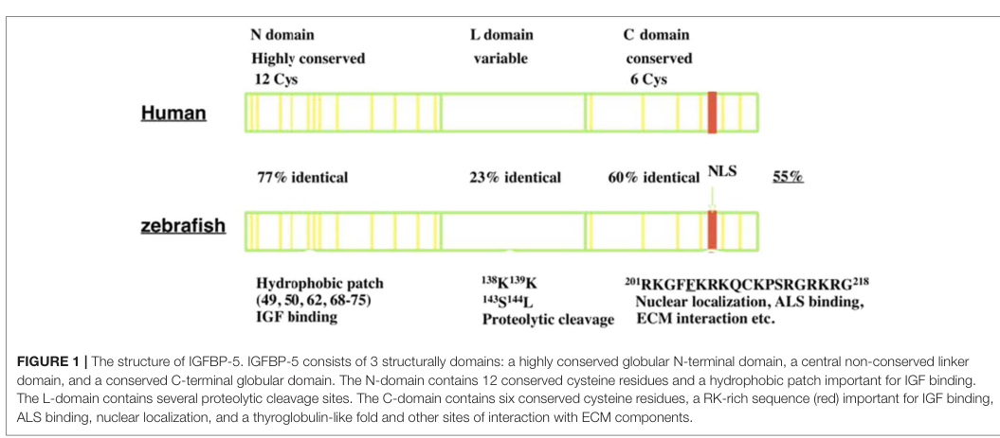

## Question

# Gene Research for Functional Annotation

## ⚠️ CRITICAL: Gene/Protein Identification Context

**BEFORE YOU BEGIN RESEARCH:** You MUST verify you are researching the CORRECT gene/protein. Gene symbols can be ambiguous, especially for less well-characterized genes from non-model organisms.

### Target Gene/Protein Identity (from UniProt):
- **UniProt Accession:** P24593
- **Protein Description:** RecName: Full=Insulin-like growth factor-binding protein 5; Short=IBP-5; Short=IGF-binding protein 5; Short=IGFBP-5; Flags: Precursor;
- **Gene Information:** Name=IGFBP5; Synonyms=IBP5;
- **Organism (full):** Homo sapiens (Human).
- **Protein Family:** Not specified in UniProt
- **Key Domains:** Growth_fac_rcpt_cys_sf. (IPR009030); IGFBP-5. (IPR012213); IGFBP-like. (IPR000867); IGFBP_1-6_chordata. (IPR022321); Insulin_GF-bd_Cys-rich_CS. (IPR017891)

### MANDATORY VERIFICATION STEPS:

1. **Check if the gene symbol "IGFBP5" matches the protein description above**
2. **Verify the organism is correct:** Homo sapiens (Human).
3. **Check if protein family/domains align with what you find in literature**
4. **If you find literature for a DIFFERENT gene with the same or similar symbol, STOP**

### If Gene Symbol is Ambiguous or You Cannot Find Relevant Literature:

**DO NOT PROCEED WITH RESEARCH ON A DIFFERENT GENE.** Instead:
- State clearly: "The gene symbol 'IGFBP5' is ambiguous or literature is limited for this specific protein"
- Explain what you found (e.g., "Found extensive literature on a different gene with the same symbol in a different organism")
- Describe the protein based ONLY on the UniProt information provided above
- Suggest that the protein function can be inferred from domain/family information

### Research Target:

Please provide a comprehensive research report on the gene **IGFBP5** (gene ID: IGFBP5, UniProt: P24593) in human.

The research report should be a detailed narrative explaining the function, biological processes, and localization of the gene product. Citations should be given for all claims.

You should prioritize authoritative reviews and primary scientific literature when conducting research. You can supplement
this with annotations you find in gene/protein databases, but these can be outdated or inaccurate.

We are specifically interested in the primary function of the gene - for enzymes, what reaction is catalyzed, and what is the substrate specificity? For transporters, what is the substrate? For structural proteins or adapters, what is the broader structural role? For signaling molecules, what is the role in the pathway.

We are interested in where in or outside the cell the gene product carries out its function.

We are also interested in the signaling or biochemical pathways in which the gene functions. We are less interested in broad pleiotropic effects, except where these elucidate the precise role.

Include evidence where possible. We are interested in both experimental evidence as well as inference from structure, evolution, or bioinformatic analysis. Precise studies should be prioritized over high-throughput, where available.

## Output

Question: You are an expert researcher providing comprehensive, well-cited information.

Provide detailed information focusing on:
1. Key concepts and definitions with current understanding
2. Recent developments and latest research (prioritize 2023-2024 sources)
3. Current applications and real-world implementations
4. Expert opinions and analysis from authoritative sources
5. Relevant statistics and data from recent studies

Format as a comprehensive research report with proper citations. Include URLs and publication dates where available.
Always prioritize recent, authoritative sources and provide specific citations for all major claims.

# Gene Research for Functional Annotation

## ⚠️ CRITICAL: Gene/Protein Identification Context

**BEFORE YOU BEGIN RESEARCH:** You MUST verify you are researching the CORRECT gene/protein. Gene symbols can be ambiguous, especially for less well-characterized genes from non-model organisms.

### Target Gene/Protein Identity (from UniProt):
- **UniProt Accession:** P24593
- **Protein Description:** RecName: Full=Insulin-like growth factor-binding protein 5; Short=IBP-5; Short=IGF-binding protein 5; Short=IGFBP-5; Flags: Precursor;
- **Gene Information:** Name=IGFBP5; Synonyms=IBP5;
- **Organism (full):** Homo sapiens (Human).
- **Protein Family:** Not specified in UniProt
- **Key Domains:** Growth_fac_rcpt_cys_sf. (IPR009030); IGFBP-5. (IPR012213); IGFBP-like. (IPR000867); IGFBP_1-6_chordata. (IPR022321); Insulin_GF-bd_Cys-rich_CS. (IPR017891)

### MANDATORY VERIFICATION STEPS:

1. **Check if the gene symbol "IGFBP5" matches the protein description above**
2. **Verify the organism is correct:** Homo sapiens (Human).
3. **Check if protein family/domains align with what you find in literature**
4. **If you find literature for a DIFFERENT gene with the same or similar symbol, STOP**

### If Gene Symbol is Ambiguous or You Cannot Find Relevant Literature:

**DO NOT PROCEED WITH RESEARCH ON A DIFFERENT GENE.** Instead:
- State clearly: "The gene symbol 'IGFBP5' is ambiguous or literature is limited for this specific protein"
- Explain what you found (e.g., "Found extensive literature on a different gene with the same symbol in a different organism")
- Describe the protein based ONLY on the UniProt information provided above
- Suggest that the protein function can be inferred from domain/family information

### Research Target:

Please provide a comprehensive research report on the gene **IGFBP5** (gene ID: IGFBP5, UniProt: P24593) in human.

The research report should be a detailed narrative explaining the function, biological processes, and localization of the gene product. Citations should be given for all claims.

You should prioritize authoritative reviews and primary scientific literature when conducting research. You can supplement
this with annotations you find in gene/protein databases, but these can be outdated or inaccurate.

We are specifically interested in the primary function of the gene - for enzymes, what reaction is catalyzed, and what is the substrate specificity? For transporters, what is the substrate? For structural proteins or adapters, what is the broader structural role? For signaling molecules, what is the role in the pathway.

We are interested in where in or outside the cell the gene product carries out its function.

We are also interested in the signaling or biochemical pathways in which the gene functions. We are less interested in broad pleiotropic effects, except where these elucidate the precise role.

Include evidence where possible. We are interested in both experimental evidence as well as inference from structure, evolution, or bioinformatic analysis. Precise studies should be prioritized over high-throughput, where available.

# Human IGFBP5: functional annotation and research report

## Identity and primary function

**Identity verified.** Human **IGFBP5** encodes insulin-like growth factor-binding protein 5 (IGFBP-5, also called IBP-5), **UniProt P24593**; a human follicular-fluid proteomics study explicitly maps P24593 to that protein. It is a member of the six high-affinity IGF-binding proteins, not the distinct paralogs IGFBP-3 or IGFBP-6. Its cysteine-rich IGFBP-like regions and IGFBP-5-specific domain annotations are consistent with the experimentally described protein architecture. (yin2025proteomicanalysisof pages 6-8, baxter2023signalingpathwaysof pages 2-3, duan2020insulinlikegrowthfactor pages 2-3)

**The principal molecular function is reversible binding of IGF-I and IGF-II to regulate their distribution and access to IGF1R.** IGFBP-5 is a secreted ligand-binding regulator—not an enzyme or an IGF receptor. Soluble, intact IGFBP-5 can sequester either growth factor and suppress IGF1R activation; matrix association or proteolysis can instead favor local IGF availability. Thus, *inhibition versus potentiation* describes different physical and physiological states of the same protein, rather than conflicting identities. In circulation, over half of IGFBP-5 is found in complexes containing an IGF and the acid-labile subunit (ALS), which contribute to the circulating IGF reservoir. (baxter2023signalingpathwaysof pages 2-3, kalus1998structureofthe pages 1-2, jones1993extracellularmatrixcontains pages 1-2, baxter2023signalingpathwaysof pages 4-5)

## Structure, binding specificity and location of action

The human precursor has **272 amino acids**, including a secretion signal; the mature protein has **252 amino acids**. It comprises disulfide-stabilized, cysteine-rich **N- and C-terminal domains** separated by a less-conserved linker. The N-terminal domain contains a hydrophobic IGF-binding surface; the C-terminal basic region contributes to IGF and ALS interactions, binding to heparin-like molecules and extracellular matrix (ECM), and nuclear localization. The linker contains sites for regulatory proteolysis and other modifications. This architecture aligns with the supplied IGFBP-like, cysteine-rich and IGFBP-5 domain annotations; a domain annotation alone does not establish a signaling mechanism. The reviewed domain schematic is available as **Figure 1** of [Duan and Allard, March 2020](https://doi.org/10.3389/fendo.2020.00100). (kalus1998structureofthe pages 1-2, duan2020insulinlikegrowthfactor pages 2-3, duan2020insulinlikegrowthfactor media 8b2d90c7)

Direct structural and biochemical evidence comes from [Kalus et al., *EMBO Journal*, November 1998](https://doi.org/10.1093/emboj/17.22.6558). NMR resolved the **Ala40–Ile92** N-terminal IGF-binding fragment as a compact, disulfide-stabilized fold with a three-stranded antiparallel β-sheet. In that study’s surface-binding assay, full-length IGFBP-5 had measured dissociation constants of **3.7 nM for IGF-I** and **0.08 nM for IGF-II**; these are assay-specific measurements, not a universal fixed selectivity ratio. The isolated N-terminal fragments bound IGFs but were less effective than full-length protein at preventing IGF binding to IGF1R and receptor autophosphorylation, consistent with contributions from the intact protein and both terminal regions. IGFBP-5 binds **both** IGFs; unlike IGFBP-6, it should not be annotated as exclusively IGF-II-specific. (kalus1998structureofthe pages 1-2, kalus1998structureofthe pages 3-6, baxter2023signalingpathwaysof pages 2-3, coda2025redoxbiologyand pages 7-9)

**The main functional compartment is extracellular:** blood and other extracellular fluids, cell-adjacent matrix, and tissue ECM. In cultured human fetal fibroblasts, intact IGFBP-5 accumulated in ECM and bound collagen III/IV, laminin and fibronectin; matrix-associated IGFBP-5 had approximately **sevenfold lower IGF-I affinity** than soluble protein and *potentiated*, rather than blocked, IGF-I-stimulated fibroblast growth. Protein remaining in medium was more susceptible to cleavage. These experiments directly establish that localization can change the direction of its effect on IGF signaling. IGFBP-5 is also found intracellularly, including in nuclei, but nuclear residence must not be presumed necessary for every phenotype. (jones1993extracellularmatrixcontains pages 1-2, sun2017importinαimportinβ pages 11-13, su2015igfbp5promotesfibrosis pages 6-9)

## Pathways and biological processes

**Canonical IGF pathway.** By binding IGF-I/II, IGFBP-5 controls ligand engagement of **IGF1R** and thereby downstream growth and survival signaling, including **PI3K–AKT** in tested settings. Proteolysis provides a release mechanism: the extracellular metalloproteinase **PAPP-A2** cleaves IGFBP-5 without requiring bound IGF; PAPP-A also has activity against it. Cleavage can lower IGF-binding capacity and increase ligand access to IGF1R. IGFBP-5 is the *substrate* in these reactions, not the protease. [Baxter’s *Endocrine Reviews* synthesis, March 2023](https://doi.org/10.1210/endrev/bnad008), identifies this sequestration–ECM–proteolysis balance as central to interpreting IGFBP actions. A zebrafish *igfbp5a* model supports a conditional switch under low-calcium stress through Papp-aa-dependent IGF release, but that organism-specific experiment should not be presented as direct evidence for the same physiological response in humans. (baxter2023signalingpathwaysof pages 2-3, duan2020insulinlikegrowthfactor pages 2-3, duan2020insulinlikegrowthfactor pages 7-8)

**IGF-independent matrix remodeling.** In primary human fibroblasts, an IGFBP-5 variant with impaired IGF binding still induced collagen and fibronectin. A nuclear-localization-signal mutant also retained fibrotic activity in cells and **ex-vivo human skin**, despite reduced nuclear accumulation; the overlapping mutation impaired its own ECM localization without preventing increased matrix production. Nucleolin knockdown reduced IGFBP-5 nuclear translocation but did not abolish the matrix response. These controlled experiments show that the tested profibrotic response **does not require IGF binding, nuclear entry or stable ECM association by IGFBP-5**. They do *not* identify a definitive initiating cell-surface receptor for that response. [Su et al., *PLOS ONE*, June 2015](https://doi.org/10.1371/journal.pone.0130546). (su2015igfbp5promotesfibrosis pages 6-9, su2015igfbp5promotesfibrosis pages 2-4)

Complementary experiments in primary **human lung fibroblasts** and maintained human lung tissue found that recombinant or expressed IGFBP-5 increased ECM-associated gene expression, **CTGF** and **lysyl oxidase (LOX)**, as well as its **own expression**, indicating a potential profibrotic positive-feedback circuit. Responses to IGFBP-5 silencing differed among fibroblasts from healthy donors and those with systemic sclerosis or idiopathic pulmonary fibrosis; this is evidence for context dependence, not proof that IGFBP-5 alone causes either human disease. [Nguyen et al., *Frontiers in Endocrinology*, October 2018](https://doi.org/10.3389/fendo.2018.00601). (nguyen2018igfbp5promotesfibrosis pages 1-2)

**Nuclear localization is a demonstrated but separate property.** A C-terminal bipartite nuclear-localization region is recognized by an importin-α/importin-β pathway; cultured-cell perturbation implicated importin-α5 and importin-β in trafficking. Nucleolin also associates with IGFBP-5 in primary human fibroblasts. However, the mutant and knockdown results above show that nuclear import is *dispensable for the particular fibrotic phenotype tested*. Proposed broader nuclear regulatory functions should therefore be distinguished from the well-established extracellular IGF-binding function. [Sun et al., *Endocrine Journal*, August 2017](https://doi.org/10.1507/endocrj.ej17-0156). (sun2017importinαimportinβ pages 11-13, su2015igfbp5promotesfibrosis pages 6-9, duan2020insulinlikegrowthfactor pages 7-8)

In vivo genetics reinforce that IGFBP-5 is a **conditional regulator**, not an indispensable universal growth factor: individual *Igfbp5*-null mice have broadly normal growth and body composition, although mammary-gland involution is delayed. Redundancy within the IGFBP system and dependence on tissue, concentration and processing help explain why excess expression can produce pronounced effects while single-gene deletion has a relatively limited baseline phenotype. [Duan and Allard, March 2020](https://doi.org/10.3389/fendo.2020.00100). (duan2020insulinlikegrowthfactor pages 5-7, duan2020insulinlikegrowthfactor pages 8-9, duan2020insulinlikegrowthfactor pages 3-5)

The following primary studies separate direct biochemical function from tissue-specific experimental outcomes:

| Study | System | Direct evidence | Inference / limitations |
|---|---|---|---|
| [Kalus et al., 1998](https://doi.org/10.1093/emboj/17.22.6558) | Recombinant full-length and N-terminal human IGFBP-5 fragments; NMR, BIAcore, and IGF1R assays | NMR resolved a disulfide-stabilized N-terminal IGF-binding domain. BIAcore measured full-length IGFBP-5 K~D~ values of **3.7 nM for IGF-I** and **0.08 nM for IGF-II**; full-length protein inhibited ligand binding to IGF1R and receptor autophosphorylation. (kalus1998structureofthe pages 1-2, kalus1998structureofthe pages 3-6) | Establishes direct high-affinity ligand binding and canonical inhibition of IGF1R access. Affinities are assay-dependent, and the isolated fragments inhibited receptor activation less effectively than full-length IGFBP-5. |
| [Jones et al., 1993](https://doi.org/10.1083/jcb.121.3.679) | Cultured human fetal fibroblasts and their extracellular matrix (ECM) | Intact IGFBP-5 preferentially entered ECM and bound collagen III/IV, laminin, and fibronectin. ECM-associated protein had approximately **sevenfold lower IGF-I affinity** than soluble IGFBP-5 yet potentiated IGF-I-stimulated fibroblast growth; medium-localized protein was cleaved to an inactive 22-kDa fragment. (jones1993extracellularmatrixcontains pages 1-2) | Demonstrates that localization converts IGFBP-5 from a soluble sequestrant into a protected local IGF reservoir. It is an in-vitro fibroblast system rather than an in-vivo human intervention. |
| [Su et al., 2015](https://doi.org/10.1371/journal.pone.0130546) | Primary human fibroblasts and ex-vivo human skin from four donors; wild-type, IGF-binding-site-mutant, and NLS-mutant IGFBP-5 | Mutants defective in IGF binding or nuclear localization still increased collagen and fibronectin. Both mutants increased dermal thickness and hydroxyproline; nucleolin silencing reduced nuclear import but not ECM induction. (su2015igfbp5promotesfibrosis pages 6-9, su2015igfbp5promotesfibrosis pages 2-4) | Strong evidence that the tested profibrotic phenotype does **not** require IGF binding or nuclear entry. Adenoviral expression and ex-vivo tissue do not establish the unidentified initiating receptor or clinical causality. |
| [Nguyen et al., 2018](https://doi.org/10.3389/fendo.2018.00601) | Primary human lung fibroblasts, including normal, systemic-sclerosis, and idiopathic-pulmonary-fibrosis donors; human lung organ culture | Recombinant or adenovirally expressed IGFBP-5 increased ECM genes, **CTGF**, and **LOX** in fibroblasts and lung tissue; IGFBP-5 also increased its own expression, creating positive feedback. (nguyen2018igfbp5promotesfibrosis pages 1-2) | Supports a direct profibrotic and matrix-crosslinking program in human tissue. Responses to silencing differed by donor disease state, emphasizing context dependence; this was not a clinical treatment study. |
| [Zhu et al., 2024](https://doi.org/10.1038/s42003-024-07304-0) | AAV9-cTnT-shIGFBP5 cardiac knockdown in a mouse myocardial-infarction model; neonatal rat cardiomyocytes under oxygen–glucose deprivation | Cardiac IGFBP5 knockdown reduced apoptosis, increased proliferation, and lowered fibrosis to approximately **10% versus 18%** in MI controls. Knockdown increased IGF1R and AKT activation; IGF1R inhibition reversed its benefits. (zhu2024igfbp5affectscardiomyocyte pages 6-6, zhu2024igfbp5affectscardiomyocyte pages 1-2, zhu2024igfbp5affectscardiomyocyte pages 6-10) | Supports an adverse, IGF1–IGF1R–AKT-dependent role for excess IGFBP5 after ischemia. Evidence is preclinical, uses knockdown rather than a germline knockout, and may depend on injury stage and cellular context. |

*Table: Five mechanistic studies establish IGFBP5 ligand binding, ECM-dependent IGF presentation, IGF-independent fibrotic activity, and context-specific signaling after myocardial injury. The limitations column distinguishes direct findings from conclusions that remain model-dependent.*

## Developments in 2023–2024 and translational status

The **2023 authoritative review** emphasizes that IGFBPs can regulate signaling beyond simple IGF sequestration, but also that many proposed interactions are context-dependent; IGFBP-5-specific claims are strongest where ligand binding, matrix localization, proteolysis or perturbation has been directly measured. (baxter2023signalingpathwaysof pages 2-3, baxter2023signalingpathwaysof pages 4-5)

A **November 2024** myocardial-infarction study provides a recent causal test, though in **mice and cultured rat cardiomyocytes**, not patients. Cardiac-directed IGFBP5 knockdown reduced apoptosis and fibrosis and increased proliferation after injury; reported fibrosis was approximately **10% versus 18%** in infarcted controls. IGF1R/AKT phosphorylation and IGF1 or IGF1R-inhibitor experiments supported an IGF-dependent mechanism in that injury model. These findings cannot be generalized to imply that reducing IGFBP-5 benefits every tissue: its effect depends on which compartment and biological process is being measured. [Zhu et al., *Communications Biology*, November 2024](https://doi.org/10.1038/s42003-024-07304-0). (zhu2024igfbp5affectscardiomyocyte pages 6-6, zhu2024igfbp5affectscardiomyocyte pages 1-2, zhu2024igfbp5affectscardiomyocyte pages 6-10)

**Human 2024 data are principally associative.** Anterior vaginal-wall specimens from **28 women with advanced pelvic organ prolapse** and **20 controls** showed lower IGFBP5, collagen I and collagen III, and higher MMP2 in the prolapse group; lower IGFBP5 was also associated with age and greater prolapse severity. This opposite-looking tissue pattern illustrates why fibroblast- or disease-specific findings cannot be converted into a universal rule that more IGFBP-5 always means more fibrosis. It does not establish whether loss of IGFBP-5 causes prolapse. [Duan et al., *Scientific Reports*, August 2024](https://doi.org/10.1038/s41598-024-69098-9). (duan2024expressionofinsulinlike pages 1-2)

In a separate cross-sectional study of **394 adults**, plasma PAPP-A was positively associated with IGFBP-5, while PAPP-A2 was associated with total—but **not free**—IGF-I. These measurements support investigation of the circulating protease–IGFBP–IGF axis; they neither show direct IGFBP-5 cleavage in those participants nor establish clinical utility of an IGFBP-5 assay. [Nimptsch et al., *Scientific Reports*, January 2024](https://doi.org/10.1038/s41598-024-52074-8). (nimptsch2024pregnancyassociatedplasma pages 1-2)

**Current implementation and assessment.** IGFBP-5 is an experimentally useful marker and perturbation target in studies of IGF bioavailability, ECM biology and fibrotic remodeling. Its measurement in research tissues and fluids, and preclinical knockdown approaches, are **not equivalent to a validated stand-alone diagnostic test or an established IGFBP5-directed treatment**. The strongest functional annotation remains **secreted IGF-I/IGF-II-binding modulator acting in blood and especially local ECM**, with a separately demonstrated, context-dependent **IGF-independent profibrotic activity** in human fibroblast and tissue experiments. (jones1993extracellularmatrixcontains pages 1-2, su2015igfbp5promotesfibrosis pages 6-9, nguyen2018igfbp5promotesfibrosis pages 1-2, duan2024expressionofinsulinlike pages 9-10, zhu2024igfbp5affectscardiomyocyte pages 6-6)

References

1. (yin2025proteomicanalysisof pages 6-8): Qianqian Yin, Jianhua Zheng, Yijuan Cao, Xiaonan Yan, and Hong Zhang. Proteomic analysis of human follicular fluid based on the 4d label free method to identify proteins that may affect oocyte quality in hyperandrogenic pcos patients. Frontiers in Endocrinology, May 2025. URL: https://doi.org/10.3389/fendo.2025.1579469, doi:10.3389/fendo.2025.1579469. This article has 3 citations.

2. (baxter2023signalingpathwaysof pages 2-3): Robert C Baxter. Signaling pathways of the insulin-like growth factor binding proteins. Endocrine Reviews, 44:753-778, Mar 2023. URL: https://doi.org/10.1210/endrev/bnad008, doi:10.1210/endrev/bnad008. This article has 193 citations and is from a domain leading peer-reviewed journal.

3. (duan2020insulinlikegrowthfactor pages 2-3): Cunming Duan and John B. Allard. Insulin-like growth factor binding protein-5 in physiology and disease. Frontiers in Endocrinology, Mar 2020. URL: https://doi.org/10.3389/fendo.2020.00100, doi:10.3389/fendo.2020.00100. This article has 122 citations.

4. (kalus1998structureofthe pages 1-2): Wenzel Kalus, M. Zweckstetter, C. Renner, Yolanda Sanchez, Julia Georgescu, M. Grol, Dirk Demuth, R. Schumacher, C. Dony, K. Lang, and T. Holak. Structure of the igf‐binding domain of the insulin‐like growth factor‐binding protein‐5 (igfbp‐5): implications for igf and igf‐i receptor interactions. The EMBO Journal, 17:6558-6572, Nov 1998. URL: https://doi.org/10.1093/emboj/17.22.6558, doi:10.1093/emboj/17.22.6558. This article has 251 citations.

5. (jones1993extracellularmatrixcontains pages 1-2): J. I. Jones, Amy Gockerman, W. Busby, C. Camacho‐Hübner, and D. Clemmons. Extracellular matrix contains insulin-like growth factor binding protein-5: potentiation of the effects of igf-i. The Journal of Cell Biology, 121:679-687, May 1993. URL: https://doi.org/10.1083/jcb.121.3.679, doi:10.1083/jcb.121.3.679. This article has 659 citations.

6. (baxter2023signalingpathwaysof pages 4-5): Robert C Baxter. Signaling pathways of the insulin-like growth factor binding proteins. Endocrine Reviews, 44:753-778, Mar 2023. URL: https://doi.org/10.1210/endrev/bnad008, doi:10.1210/endrev/bnad008. This article has 193 citations and is from a domain leading peer-reviewed journal.

7. (duan2020insulinlikegrowthfactor media 8b2d90c7): Cunming Duan and John B. Allard. Insulin-like growth factor binding protein-5 in physiology and disease. Frontiers in Endocrinology, Mar 2020. URL: https://doi.org/10.3389/fendo.2020.00100, doi:10.3389/fendo.2020.00100. This article has 122 citations.

8. (kalus1998structureofthe pages 3-6): Wenzel Kalus, M. Zweckstetter, C. Renner, Yolanda Sanchez, Julia Georgescu, M. Grol, Dirk Demuth, R. Schumacher, C. Dony, K. Lang, and T. Holak. Structure of the igf‐binding domain of the insulin‐like growth factor‐binding protein‐5 (igfbp‐5): implications for igf and igf‐i receptor interactions. The EMBO Journal, 17:6558-6572, Nov 1998. URL: https://doi.org/10.1093/emboj/17.22.6558, doi:10.1093/emboj/17.22.6558. This article has 251 citations.

9. (coda2025redoxbiologyand pages 7-9): Anna Rita Daniela Coda, Arcangelo Liso, and Francesco Bellanti. Redox biology and insulin-like growth factor-binding protein-6: a potential relationship. Biology, 14:747, Jun 2025. URL: https://doi.org/10.3390/biology14070747, doi:10.3390/biology14070747. This article has 3 citations.

10. (sun2017importinαimportinβ pages 11-13): Min Sun, Juan Long, Yuxin Yi, and Wei Xia. Importin α-importin β complex mediated nuclear translocation of insulin-like growth factor binding protein-5. Endocrine journal, 64 10:963-975, Aug 2017. URL: https://doi.org/10.1507/endocrj.ej17-0156, doi:10.1507/endocrj.ej17-0156. This article has 16 citations and is from a peer-reviewed journal.

11. (su2015igfbp5promotesfibrosis pages 6-9): Yunyun Su, Tetsuya Nishimoto, and Carol Feghali-Bostwick. Igfbp-5 promotes fibrosis independently of its translocation to the nucleus and its interaction with nucleolin and igf. PLoS ONE, 10:e0130546, Jun 2015. URL: https://doi.org/10.1371/journal.pone.0130546, doi:10.1371/journal.pone.0130546. This article has 33 citations and is from a peer-reviewed journal.

12. (duan2020insulinlikegrowthfactor pages 7-8): Cunming Duan and John B. Allard. Insulin-like growth factor binding protein-5 in physiology and disease. Frontiers in Endocrinology, Mar 2020. URL: https://doi.org/10.3389/fendo.2020.00100, doi:10.3389/fendo.2020.00100. This article has 122 citations.

13. (su2015igfbp5promotesfibrosis pages 2-4): Yunyun Su, Tetsuya Nishimoto, and Carol Feghali-Bostwick. Igfbp-5 promotes fibrosis independently of its translocation to the nucleus and its interaction with nucleolin and igf. PLoS ONE, 10:e0130546, Jun 2015. URL: https://doi.org/10.1371/journal.pone.0130546, doi:10.1371/journal.pone.0130546. This article has 33 citations and is from a peer-reviewed journal.

14. (nguyen2018igfbp5promotesfibrosis pages 1-2): Xinh-Xinh Nguyen, Lutfiyya Muhammad, Paul J. Nietert, and Carol Feghali-Bostwick. Igfbp-5 promotes fibrosis via increasing its own expression and that of other pro-fibrotic mediators. Frontiers in Endocrinology, Oct 2018. URL: https://doi.org/10.3389/fendo.2018.00601, doi:10.3389/fendo.2018.00601. This article has 88 citations.

15. (duan2020insulinlikegrowthfactor pages 5-7): Cunming Duan and John B. Allard. Insulin-like growth factor binding protein-5 in physiology and disease. Frontiers in Endocrinology, Mar 2020. URL: https://doi.org/10.3389/fendo.2020.00100, doi:10.3389/fendo.2020.00100. This article has 122 citations.

16. (duan2020insulinlikegrowthfactor pages 8-9): Cunming Duan and John B. Allard. Insulin-like growth factor binding protein-5 in physiology and disease. Frontiers in Endocrinology, Mar 2020. URL: https://doi.org/10.3389/fendo.2020.00100, doi:10.3389/fendo.2020.00100. This article has 122 citations.

17. (duan2020insulinlikegrowthfactor pages 3-5): Cunming Duan and John B. Allard. Insulin-like growth factor binding protein-5 in physiology and disease. Frontiers in Endocrinology, Mar 2020. URL: https://doi.org/10.3389/fendo.2020.00100, doi:10.3389/fendo.2020.00100. This article has 122 citations.

18. (zhu2024igfbp5affectscardiomyocyte pages 6-6): Qingqing Zhu, Xinyi Lu, Mengli Chen, Ting Zhang, Mengsha Shi, Wenming Yao, Haifeng Zhang, Rongrong Gao, Xinli Li, Yanli Zhou, and Shengen Liao. Igfbp5 affects cardiomyocyte survival and functional recovery in mice following myocardial ischemia. Communications Biology, Nov 2024. URL: https://doi.org/10.1038/s42003-024-07304-0, doi:10.1038/s42003-024-07304-0. This article has 7 citations and is from a peer-reviewed journal.

19. (zhu2024igfbp5affectscardiomyocyte pages 1-2): Qingqing Zhu, Xinyi Lu, Mengli Chen, Ting Zhang, Mengsha Shi, Wenming Yao, Haifeng Zhang, Rongrong Gao, Xinli Li, Yanli Zhou, and Shengen Liao. Igfbp5 affects cardiomyocyte survival and functional recovery in mice following myocardial ischemia. Communications Biology, Nov 2024. URL: https://doi.org/10.1038/s42003-024-07304-0, doi:10.1038/s42003-024-07304-0. This article has 7 citations and is from a peer-reviewed journal.

20. (zhu2024igfbp5affectscardiomyocyte pages 6-10): Qingqing Zhu, Xinyi Lu, Mengli Chen, Ting Zhang, Mengsha Shi, Wenming Yao, Haifeng Zhang, Rongrong Gao, Xinli Li, Yanli Zhou, and Shengen Liao. Igfbp5 affects cardiomyocyte survival and functional recovery in mice following myocardial ischemia. Communications Biology, Nov 2024. URL: https://doi.org/10.1038/s42003-024-07304-0, doi:10.1038/s42003-024-07304-0. This article has 7 citations and is from a peer-reviewed journal.

21. (duan2024expressionofinsulinlike pages 1-2): Yinan Duan, Yifei Chen, Yan He, Runqi Gong, and Zhijun Xia. Expression of insulin-like growth factor binding protein 5 in the vaginal wall tissues of older women with pelvic organ prolapse. Aug 2024. URL: https://doi.org/10.1038/s41598-024-69098-9, doi:10.1038/s41598-024-69098-9. This article has 7 citations and is from a peer-reviewed journal.

22. (nimptsch2024pregnancyassociatedplasma pages 1-2): Katharina Nimptsch, Elif Ece Aydin, Rafael Francisco Rios Chavarria, Jürgen Janke, Matthew N. Poy, Claus Oxvig, Astrid Steinbrecher, and Tobias Pischon. Pregnancy associated plasma protein-a2 (papp-a2) and stanniocalcin-2 (stc2) but not papp-a are associated with circulating total igf-1 in a human adult population. Scientific Reports, Jan 2024. URL: https://doi.org/10.1038/s41598-024-52074-8, doi:10.1038/s41598-024-52074-8. This article has 4 citations and is from a peer-reviewed journal.

23. (duan2024expressionofinsulinlike pages 9-10): Yinan Duan, Yifei Chen, Yan He, Runqi Gong, and Zhijun Xia. Expression of insulin-like growth factor binding protein 5 in the vaginal wall tissues of older women with pelvic organ prolapse. Aug 2024. URL: https://doi.org/10.1038/s41598-024-69098-9, doi:10.1038/s41598-024-69098-9. This article has 7 citations and is from a peer-reviewed journal.

## Artifacts

- [Edison artifact artifact-00](IGFBP5-deep-research-falcon_artifacts/artifact-00.md)

## Citations

1. jones1993extracellularmatrixcontains pages 1-2
2. duan2024expressionofinsulinlike pages 1-2
3. nimptsch2024pregnancyassociatedplasma pages 1-2
4. yin2025proteomicanalysisof pages 6-8
5. baxter2023signalingpathwaysof pages 2-3
6. duan2020insulinlikegrowthfactor pages 2-3
7. kalus1998structureofthe pages 1-2
8. baxter2023signalingpathwaysof pages 4-5
9. kalus1998structureofthe pages 3-6
10. coda2025redoxbiologyand pages 7-9
11. duan2020insulinlikegrowthfactor pages 7-8
12. duan2020insulinlikegrowthfactor pages 5-7
13. duan2020insulinlikegrowthfactor pages 8-9
14. duan2020insulinlikegrowthfactor pages 3-5
15. duan2024expressionofinsulinlike pages 9-10
16. Duan and Allard, March 2020
17. Kalus et al., *EMBO Journal*, November 1998
18. Baxter’s *Endocrine Reviews* synthesis, March 2023
19. Su et al., *PLOS ONE*, June 2015
20. Nguyen et al., *Frontiers in Endocrinology*, October 2018
21. Sun et al., *Endocrine Journal*, August 2017
22. Kalus et al., 1998
23. Jones et al., 1993
24. Su et al., 2015
25. Nguyen et al., 2018
26. Zhu et al., 2024
27. Zhu et al., *Communications Biology*, November 2024
28. Duan et al., *Scientific Reports*, August 2024
29. Nimptsch et al., *Scientific Reports*, January 2024
30. https://doi.org/10.3389/fendo.2020.00100
31. https://doi.org/10.1093/emboj/17.22.6558
32. https://doi.org/10.1210/endrev/bnad008
33. https://doi.org/10.1371/journal.pone.0130546
34. https://doi.org/10.3389/fendo.2018.00601
35. https://doi.org/10.1507/endocrj.ej17-0156
36. https://doi.org/10.1083/jcb.121.3.679
37. https://doi.org/10.1038/s42003-024-07304-0
38. https://doi.org/10.1038/s41598-024-69098-9
39. https://doi.org/10.1038/s41598-024-52074-8
40. https://doi.org/10.3389/fendo.2025.1579469,
41. https://doi.org/10.1210/endrev/bnad008,
42. https://doi.org/10.3389/fendo.2020.00100,
43. https://doi.org/10.1093/emboj/17.22.6558,
44. https://doi.org/10.1083/jcb.121.3.679,
45. https://doi.org/10.3390/biology14070747,
46. https://doi.org/10.1507/endocrj.ej17-0156,
47. https://doi.org/10.1371/journal.pone.0130546,
48. https://doi.org/10.3389/fendo.2018.00601,
49. https://doi.org/10.1038/s42003-024-07304-0,
50. https://doi.org/10.1038/s41598-024-69098-9,
51. https://doi.org/10.1038/s41598-024-52074-8,