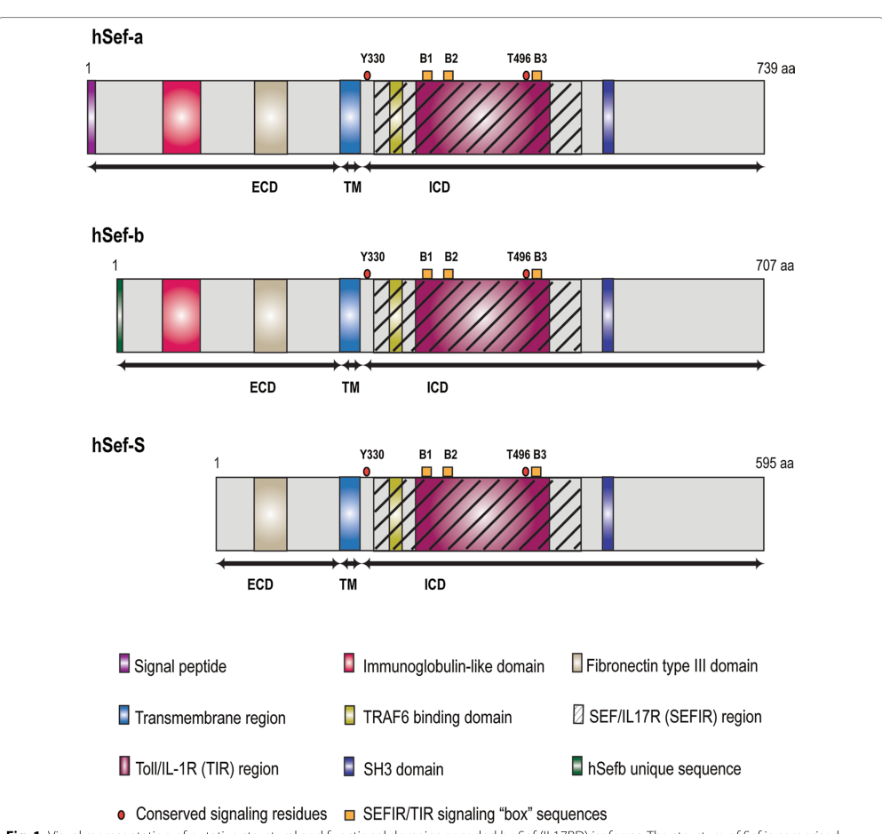

## Question

# Gene Research for Functional Annotation

## ⚠️ CRITICAL: Gene/Protein Identification Context

**BEFORE YOU BEGIN RESEARCH:** You MUST verify you are researching the CORRECT gene/protein. Gene symbols can be ambiguous, especially for less well-characterized genes from non-model organisms.

### Target Gene/Protein Identity (from UniProt):
- **UniProt Accession:** Q8NFM7
- **Protein Description:** RecName: Full=Interleukin-17 receptor D; Short=IL-17 receptor D; Short=IL-17RD; AltName: Full=IL17Rhom; AltName: Full=Interleukin-17 receptor-like protein; AltName: Full=Sef homolog; Short=hSef; Flags: Precursor;
- **Gene Information:** Name=IL17RD; Synonyms=IL17RLM, SEF; ORFNames=UNQ6115/PRO20026;
- **Organism (full):** Homo sapiens (Human).
- **Protein Family:** Not specified in UniProt
- **Key Domains:** IL-17_rcpt-like. (IPR039465); IL17R_D_N. (IPR031951); SEFIR_dom. (IPR013568); Toll_tir_struct_dom_sf. (IPR035897); IL17R_D_N (PF16742)

### MANDATORY VERIFICATION STEPS:

1. **Check if the gene symbol "IL17RD" matches the protein description above**
2. **Verify the organism is correct:** Homo sapiens (Human).
3. **Check if protein family/domains align with what you find in literature**
4. **If you find literature for a DIFFERENT gene with the same or similar symbol, STOP**

### If Gene Symbol is Ambiguous or You Cannot Find Relevant Literature:

**DO NOT PROCEED WITH RESEARCH ON A DIFFERENT GENE.** Instead:
- State clearly: "The gene symbol 'IL17RD' is ambiguous or literature is limited for this specific protein"
- Explain what you found (e.g., "Found extensive literature on a different gene with the same symbol in a different organism")
- Describe the protein based ONLY on the UniProt information provided above
- Suggest that the protein function can be inferred from domain/family information

### Research Target:

Please provide a comprehensive research report on the gene **IL17RD** (gene ID: IL17RD, UniProt: Q8NFM7) in human.

The research report should be a detailed narrative explaining the function, biological processes, and localization of the gene product. Citations should be given for all claims.

You should prioritize authoritative reviews and primary scientific literature when conducting research. You can supplement
this with annotations you find in gene/protein databases, but these can be outdated or inaccurate.

We are specifically interested in the primary function of the gene - for enzymes, what reaction is catalyzed, and what is the substrate specificity? For transporters, what is the substrate? For structural proteins or adapters, what is the broader structural role? For signaling molecules, what is the role in the pathway.

We are interested in where in or outside the cell the gene product carries out its function.

We are also interested in the signaling or biochemical pathways in which the gene functions. We are less interested in broad pleiotropic effects, except where these elucidate the precise role.

Include evidence where possible. We are interested in both experimental evidence as well as inference from structure, evolution, or bioinformatic analysis. Precise studies should be prioritized over high-throughput, where available.

## Output

Question: You are an expert researcher providing comprehensive, well-cited information.

Provide detailed information focusing on:
1. Key concepts and definitions with current understanding
2. Recent developments and latest research (prioritize 2023-2024 sources)
3. Current applications and real-world implementations
4. Expert opinions and analysis from authoritative sources
5. Relevant statistics and data from recent studies

Format as a comprehensive research report with proper citations. Include URLs and publication dates where available.
Always prioritize recent, authoritative sources and provide specific citations for all major claims.

# Gene Research for Functional Annotation

## ⚠️ CRITICAL: Gene/Protein Identification Context

**BEFORE YOU BEGIN RESEARCH:** You MUST verify you are researching the CORRECT gene/protein. Gene symbols can be ambiguous, especially for less well-characterized genes from non-model organisms.

### Target Gene/Protein Identity (from UniProt):
- **UniProt Accession:** Q8NFM7
- **Protein Description:** RecName: Full=Interleukin-17 receptor D; Short=IL-17 receptor D; Short=IL-17RD; AltName: Full=IL17Rhom; AltName: Full=Interleukin-17 receptor-like protein; AltName: Full=Sef homolog; Short=hSef; Flags: Precursor;
- **Gene Information:** Name=IL17RD; Synonyms=IL17RLM, SEF; ORFNames=UNQ6115/PRO20026;
- **Organism (full):** Homo sapiens (Human).
- **Protein Family:** Not specified in UniProt
- **Key Domains:** IL-17_rcpt-like. (IPR039465); IL17R_D_N. (IPR031951); SEFIR_dom. (IPR013568); Toll_tir_struct_dom_sf. (IPR035897); IL17R_D_N (PF16742)

### MANDATORY VERIFICATION STEPS:

1. **Check if the gene symbol "IL17RD" matches the protein description above**
2. **Verify the organism is correct:** Homo sapiens (Human).
3. **Check if protein family/domains align with what you find in literature**
4. **If you find literature for a DIFFERENT gene with the same or similar symbol, STOP**

### If Gene Symbol is Ambiguous or You Cannot Find Relevant Literature:

**DO NOT PROCEED WITH RESEARCH ON A DIFFERENT GENE.** Instead:
- State clearly: "The gene symbol 'IL17RD' is ambiguous or literature is limited for this specific protein"
- Explain what you found (e.g., "Found extensive literature on a different gene with the same symbol in a different organism")
- Describe the protein based ONLY on the UniProt information provided above
- Suggest that the protein function can be inferred from domain/family information

### Research Target:

Please provide a comprehensive research report on the gene **IL17RD** (gene ID: IL17RD, UniProt: Q8NFM7) in human.

The research report should be a detailed narrative explaining the function, biological processes, and localization of the gene product. Citations should be given for all claims.

You should prioritize authoritative reviews and primary scientific literature when conducting research. You can supplement
this with annotations you find in gene/protein databases, but these can be outdated or inaccurate.

We are specifically interested in the primary function of the gene - for enzymes, what reaction is catalyzed, and what is the substrate specificity? For transporters, what is the substrate? For structural proteins or adapters, what is the broader structural role? For signaling molecules, what is the role in the pathway.

We are interested in where in or outside the cell the gene product carries out its function.

We are also interested in the signaling or biochemical pathways in which the gene functions. We are less interested in broad pleiotropic effects, except where these elucidate the precise role.

Include evidence where possible. We are interested in both experimental evidence as well as inference from structure, evolution, or bioinformatic analysis. Precise studies should be prioritized over high-throughput, where available.

# Human IL17RD (Sef): functional annotation and research assessment

## Identity and principal function

**Identity verified.** The target is human **IL17RD**, also called **Sef**, **hSef**, or **IL-17RLM**, corresponding to the user-specified UniProt accession **Q8NFM7** ([UniProt record](https://www.uniprot.org/uniprotkb/Q8NFM7/entry)). Human gene studies explicitly use *IL17RD* for Sef, and authoritative reviews classify it among the five IL-17 receptor-family members, distinct from IL17RA and IL17RC. The reported extracellular receptor-like region and intracellular **SEFIR** domain agree with the supplied domain annotations; the TIR-like annotation refers to structural similarity within the cytoplasmic signaling region, **not** to an additional Toll-like receptor or proven microbial-ligand recognition function. No evidence of a conflicting human gene identity emerged. (liu2024physiologicalrolesof pages 2-3, pande2021interleukin17receptord pages 1-2, miraoui2013mutationsinfgf17 pages 3-4, pande2021interleukin17receptord pages 2-4)

**Best-supported primary annotation:** IL17RD is a **nonenzymatic, single-pass membrane-associated signaling modulator and scaffold**. Its particularly well-supported functions are to restrain FGF–FGFR signaling, spatially regulate MEK–ERK responses, modify IL-17A-receptor-complex signaling, and limit excessive Toll-like receptor (TLR) responses through intracellular adaptor interactions. It is **not** an FGF ligand, an FGFR kinase, or an established stand-alone high-affinity IL-17A receptor. Which of its signaling activities predominates depends on isoform, cell type, and stimulus. (pande2021interleukin17receptord pages 2-4, mellett2015orphanreceptoril17rd pages 1-2, pande2021interleukin17receptord pages 4-6, mellett2012orphanreceptoril17rd pages 1-2, rong2009il17rd(sefor pages 1-2)

## Molecular architecture and site of action

The 739-amino-acid human membrane isoform, **hSEF-a**, has a signal peptide at residues **1–26**, an extracellular segment at **27–299**, a transmembrane segment at **300–319**, and a cytoplasmic region at **320–739**. The extracellular portion contains reported immunoglobulin-like and fibronectin-type-III regions; the intracellular **SEFIR** region is mapped in a 2021 review to approximately **335–564**, with a TIR-like subregion and interaction motifs. These are literature-reported boundaries rather than a claim that every proposed subdomain has been resolved experimentally. The review also describes **hSEF-b** and **hSEF-S**, shorter forms lacking the usual signal peptide and reported to be predominantly cytoplasmic. This **single-pass** topology is important: an isolated secondary description of IL17RD as having multiple transmembrane domains conflicts with the better-supported architecture. (pande2021interleukin17receptord pages 2-4, pande2021interleukin17receptord pages 1-2, pande2021interleukin17receptord media 9e29a2fd)

The full-length protein acts at the **plasma membrane**, where surface expression can be measured experimentally and where it associates with other receptors. Studies also place Sef in **Golgi and endosomal/perinuclear compartments**, particularly in overexpression systems, consistent with intracellular control of receptor trafficking and signaling-protein localization. These observations do not establish that all isoforms occupy the same compartment in every native human tissue. hSEF-a is reported across epithelial tissues and the nervous system; tissue-expression evidence alone does not demonstrate activity in each tissue. (miraoui2013mutationsinfgf17 pages 3-4, liu2024physiologicalrolesof pages 3-3, rong2009il17rd(sefor pages 2-3, pande2021interleukin17receptord pages 2-4)

The reviewed domain-and-isoform schematic provides a visual guide to this topology; its motifs should be interpreted alongside the experimental evidence below. (pande2021interleukin17receptord media 9e29a2fd)

## Experimental pathway evidence

### FGF–FGFR and spatial ERK signaling

IL17RD/Sef was characterized as a negative regulator of FGF signaling. Work summarized in a mechanistic review finds that membrane Sef can associate with **FGFR1 and FGFR2** and, in tested cells, reduce FGFR/FRS2α-associated signaling to RAF, MEK, ERK, and sometimes AKT. Experiments with active FGFR1 versus active RAS place one inhibitory action at or upstream of RAS. **That is not the only reported mechanism:** results differ by isoform and cell system, so inhibition at FGFR, effects on ERK phosphorylation, and control of ERK localization should not be collapsed into one invariant biochemical step. (pande2021interleukin17receptord pages 4-6)

A particularly precise **human-Sef** experiment showed that Sef binds activated **MEK**, limits dissociation of the MEK–ERK complex, and prevents activated ERK from entering the nucleus. Nuclear **Elk-1** activation fell while signaling to the cytoplasmic ERK substrate **RSK2** was preserved; reducing endogenous Sef enhanced ERK nuclear entry. IL17RD can therefore regulate **where** an active signal acts, not merely whether ERK becomes phosphorylated. [Torii et al., *Developmental Cell*, July 2004](https://doi.org/10.1016/j.devcel.2004.05.019). (pande2021interleukin17receptord pages 4-6, pande2021interleukin17receptord pages 6-8)

Disease-variant experiments connect this molecular role to human FGF8 responses. In transfected HEK293 cells, **FGF8b/FGFR1c increased an AP-1 reporter approximately threefold**, and wild-type human IL17RD suppressed the stimulated response by approximately **70%**. The K131T, P306S, and S468L variants retained **89%, 67%, and 32%**, respectively, of wild-type *inhibitory activity* in this assay; these percentages are **not** percentages of patients or absolute residual pathway activity. A construct lacking the intracellular region did not inhibit the reporter. These are informative mechanistic assays, not measurements of signaling in a patient’s developing neurons. [Miraoui et al., *American Journal of Human Genetics*, 2 May 2013](https://doi.org/10.1016/j.ajhg.2013.04.008). (miraoui2013mutationsinfgf17 pages 6-7)

### IL-17A signaling: a pathway-selective coreceptor/modulator

IL17RD physically associates and colocalizes with **IL17RA**; the association was observed without requiring IL-17 stimulation. In the original receptor-complex study, IL17RD contributed to an IL-17-responsive **24p3-promoter** reporter, its intracellular-domain deletion suppressed signaling, and IL17RD associated with **TRAF6**. These results establish participation in, or modulation of, an IL17RA-containing signaling complex. **They do not by themselves show direct IL-17A binding to purified IL17RD.** [Rong et al., *Cell Research*, February 2009](https://doi.org/10.1038/cr.2008.320). (rong2009il17rd(sefor pages 2-3, rong2009il17rd(sefor pages 1-2, rong2009il17rd(sefor pages 3-5)

The response is not uniformly activating. Following IL-17A administration, **Il17rd-deficient mice lost the measured neutrophil recruitment**, alongside reduced **p38 MAPK** activation and neutrophil-chemokine **MIP-2/CXCL2** expression. Conversely, deficiency increased **NF-κB**, **IL-6**, and keratinocyte-chemoattractant responses. Cellular experiments implicated altered **Act1–TRAF6** interactions; IL17RD knockdown in human cells likewise increased IL-17A-induced NF-κB and IL-6 responses. Thus IL17RD can support a p38/chemokine/neutrophil arm while restraining an NF-κB-associated arm. The neutrophil result is an **in-vivo mouse result**, not a demonstrated human IL17RD-deficiency phenotype. [Mellett et al., *Nature Communications*, October 2012](https://doi.org/10.1038/ncomms2127). (pande2021interleukin17receptord pages 6-8, mellett2012orphanreceptoril17rd pages 1-2)

**Ligand-specificity qualification.** Influential [2023](https://doi.org/10.1038/s41392-023-01620-3) and [2024](https://doi.org/10.3892/or.2024.8803) reviews describe an **IL17RA–IL17RD complex** preferentially associated with **IL-17A homodimer**, rather than IL-17F/F or IL-17A/F. However, the primary receptor-association experiments retrieved here do **not** establish a purified IL17RD–ligand affinity, binding stoichiometry, or comprehensive ligand-selectivity comparison. Some mechanistic interpretations instead regard IL17RD as an **accessory receptor or scaffold** for IL17RA/IL17RC. The **IL17RA–IL17RC** complex remains the better-established receptor for IL-17A/F-family signaling; review-level claims of exclusive IL17RD ligand selectivity should not be promoted to a definitive molecular substrate assignment. (pande2021interleukin17receptord pages 8-10, liu2024roleandfunctional pages 2-3, huangfu2023theil17family pages 2-3)

### TLR and inflammatory-adaptor signaling

IL17RD also limits TLR responses through its **intracellular SEFIR/TIR-like region**. In human-cell experiments, IL17RD reduced reporter responses driven by the TLR adaptors **MyD88, TIRAP/Mal, TRIF, and TRAM**; knockdown enhanced responses to **LPS** and **poly(I:C)**. Human donor-cell experiments detected stimulus-associated proximity to **MyD88/TLR4**, while domain experiments showed that IL17RD’s SEFIR region can interfere with **MyD88–TRAF6** association and downstream inflammatory signaling. Il17rd-null mice showed increased susceptibility in TLR-induced shock experiments. The data support a **negative feedback/adaptor function** at membrane-associated and intracellular signaling platforms; they do **not** show IL17RD itself directly binding LPS or viral RNA. [Mellett et al., *Nature Communications*, March 2015](https://doi.org/10.1038/ncomms7669). (mellett2015orphanreceptoril17rd pages 1-2, mellett2015orphanreceptoril17rd pages 7-8, mellett2015orphanreceptoril17rd pages 9-10, pande2021interleukin17receptord pages 8-10)

Additional work summarized by Pande and colleagues describes Sef-dependent **cytoplasmic retention of classical NF-κB p50:p65** in inflammatory-cytokine responses. This offers a distinct spatial mechanism that complements, rather than replaces, the TLR-adaptor mechanism; its generality across human tissues remains to be determined. [Pande et al., *Cell Communication and Signaling*, January 2021](https://doi.org/10.1186/s12964-020-00695-7). (pande2021interleukin17receptord pages 8-10)

The principal findings and their limitations can be compared in the following evidence summary.

| Molecular pathway/site | IL17RD-specific experimental observation | Key caveat |
|---|---|---|
| **FGF8–FGFR1 inhibition and MEK–ERK localization** | In HEK293 cells, FGF8 stimulation of FGFR1c increased AP-1 reporter activity about **3-fold**; wild-type human IL17RD suppressed this response by **70%**. Relative inhibitory activity was **89%** for K131T, **67%** for P306S and **32%** for S468L versus wild type (*P*<0.05); Y379C and P577Q retained 75% and 82% activity (*P*=0.06). Separately, human Sef bound activated MEK, retained the MEK–ERK complex in the cytoplasm and inhibited nuclear ERK/Elk-1 signaling without suppressing cytoplasmic ERK activity toward RSK2. (miraoui2013mutationsinfgf17 pages 6-7, pande2021interleukin17receptord pages 4-6) | The AP-1 assay used transient overexpression rather than endogenous human developmental tissue. Reported sites of FGF inhibition vary with isoform and cell context—from FGFR/FRS2α and RAS to ERK phosphorylation or nuclear trafficking—so IL17RD is best annotated as a multilevel spatial/signaling inhibitor, not a catalytic inhibitor acting at one invariant step. (pande2021interleukin17receptord pages 4-6) |
| **IL17RA–IL-17A receptor-complex participation** | Human IL17RD and IL17RA co-immunoprecipitated and colocalized; their association was present with or without IL-17 stimulation. IL17RD increased an IL-17-responsive **24p3** promoter reporter, whereas deletion of its intracellular domain acted dominantly negatively; IL17RD also associated with TRAF6. In IL17RD-deficient mice, exogenous IL-17A-induced neutrophil recruitment was abolished, with reduced p38/MIP-2 signaling, while NF-κB, IL-6 and KC responses increased. Human-cell knockdown of roughly **40–60%** likewise enhanced NF-κB and IL-6 responses. (rong2009il17rd(sefor pages 2-3, rong2009il17rd(sefor pages 1-2, rong2009il17rd(sefor pages 3-5, mellett2012orphanreceptoril17rd pages 1-2) | These studies establish receptor association and pathway modulation—not direct biochemical binding of IL-17A to IL17RD. Reviews from 2023–2024 describe an IL17RA–IL17RD complex selective for IL-17A/A over IL-17A/F or IL-17F/F, but supply no affinity constants, binding curves or receptor stoichiometry; this ligand-selectivity model remains less secure than the established IL17RA–IL17RC pathway. (liu2024roleandfunctional pages 2-3, huangfu2023theil17family pages 2-3) |
| **TLR3/TLR4 adaptor inhibition** | IL17RD dose-dependently inhibited MyD88-, Mal/TIRAP-, TRIF- and TRAM-driven NF-κB reporters and inhibited TRIF-driven IRF3/IRF7 signaling. Stable IL17RD knockdown of **40–60%** in U373 and THP-1 cells enhanced LPS-induced TNF-α and IL-8. In human PBMCs exposed to **100 ng/mL LPS**, IL17RD associated with MyD88/TLR4; its SEFIR domain targeted the MyD88 TIR domain and reduced MyD88–TRAF6 association. Il17rd-null mice were more susceptible to TLR3- and TLR4-induced septic shock. (mellett2015orphanreceptoril17rd pages 1-2, mellett2015orphanreceptoril17rd pages 7-8, mellett2015orphanreceptoril17rd pages 9-10) | Much mechanistic mapping used overexpression, knockdown or mouse knockout systems. IL17RD acts here as a negative adaptor/scaffold through SEFIR–TIR interactions; it is not itself demonstrated to recognize LPS or poly(I:C), and the detailed interfaces with Mal, TRIF and TRAM remain incompletely mapped. (pande2021interleukin17receptord pages 8-10) |
| **2024 Kallmann-syndrome genetics** | One patient carried maternally inherited **IL17RD c.2101G>A (p.Gly701Ser)** together with a de novo **CPEB4 p.Arg472\*** variant. AlphaFold predicted no substantial global IL17RD structural change; NetPhos predicted residue 701 as a phosphorylation site with probability **0.994**. A literature summary found KS in **18/22 (81.8%)** reported IL17RD-associated KS/IHH cases, additional manifestations in **13/18 (72.2%)**, and hearing loss in **7/18 (38.9%)**. (zhang2024clinicalphenotypeof pages 4-6) | G701S was not tested biochemically or in cells; altered phosphorylation and FGF signaling are predictions. The second variant, inheritance from an unaffected or incompletely characterized parent, oligogenicity and incomplete penetrance prevent attribution of the phenotype to IL17RD alone. No IL17RD-directed therapy or validated standalone clinical biomarker was established. (zhang2024clinicalphenotypeof pages 4-6, zhang2024clinicalphenotypeof pages 1-2) |

*Table: Evidence-grade summary of the principal experimentally supported signaling functions of human IL17RD/Q8NFM7 and the latest 2024 clinical-genetic observation. The caveats distinguish direct experiments from receptor-complex inference, review-level ligand-selectivity claims and computational predictions.*

## Recent developments and practical significance

**2023–2024 receptor interpretation.** Recent authoritative reviews explicitly discuss IL17RD alongside canonical IL-17 receptor combinations, but differ in how confidently they assign it an independent IL-17A-binding role. For functional annotation, **IL17RA-complex association and modulation of signaling** are more securely established than a unique ligand-binding specificity for isolated IL17RD. [Huangfu et al., *Signal Transduction and Targeted Therapy*, October 2023](https://doi.org/10.1038/s41392-023-01620-3); [Liu et al., *Oncology Reports*, August 2024](https://doi.org/10.3892/or.2024.8803). (liu2024roleandfunctional pages 2-3, huangfu2023theil17family pages 2-3)

**2024 structural/evolutionary perspective.** Comparative analysis proposes that the IL-17 signaling system acquired components through ancient **domain shuffling** involving neurotrophin and TLR/IL-1R pathways. It provides a framework for why a SEFIR-containing protein can interact with immune signaling machinery, but evolutionary relatedness alone neither demonstrates an IL17RD-specific ligand nor proves that IL17RD has TLR enzymatic or pathogen-sensing activity. [Chen et al., *PNAS*, April 2024](https://doi.org/10.1073/pnas.2400903121). (chen2024theil17pathway pages 3-4, chen2024theil17pathway pages 1-2)

**Human genetics and clinical use.** In the original sequencing study of **386 congenital hypogonadotropic hypogonadism probands**, **eight unrelated probands** carried the described IL17RD missense variants; all eight had **Kallmann syndrome**, **seven of eight** had absent puberty, and **six of eight** had congenital hearing loss. These are phenotype counts among variant carriers in that study, **not** estimates of population penetrance. Some pedigrees also carried FGFR1 or KISS1R variants, illustrating possible oligogenic contributions. This supports including IL17RD in the **interpretation of relevant genetic testing**, especially where reproductive and auditory phenotypes coexist, but does not make any single missense variant automatically diagnostic. [Miraoui et al., May 2013](https://doi.org/10.1016/j.ajhg.2013.04.008). (miraoui2013mutationsinfgf17 pages 6-7, miraoui2013mutationsinfgf17 pages 4-6)

A **2024 single-patient report** identified maternally inherited **IL17RD p.Gly701Ser** together with a **CPEB4 truncating variant**. Its proposed effect on IL17RD phosphorylation and FGF signaling was **computational**, not experimentally established; the authors explicitly noted the lack of definitive pathogenic evidence. Their literature summary counted **18 Kallmann cases among 22 reported IL17RD-associated KS/IHH patients**, with hearing loss in **7 of the 18 Kallmann cases**. Such selected, published cases cannot provide an unbiased prevalence or penetrance estimate. [Zhang et al., *Frontiers in Endocrinology*, April 2024](https://doi.org/10.3389/fendo.2024.1343977). (zhang2024clinicalphenotypeof pages 4-6)

**Implementation boundary.** IL17RD is presently most useful as a **research-supported pathway annotation and a candidate gene for carefully interpreted CHH/Kallmann genetic assessment**, not as a clinically validated standalone therapeutic target or biomarker. Experimental cancer and inflammatory-disease associations warrant investigation but do not establish IL17RD-targeted treatment efficacy. In particular, clinical success of therapies acting on **IL-17A or IL17RA** must not be attributed specifically to IL17RD. (liu2024roleandfunctional pages 2-3, zhang2024clinicalphenotypeof pages 4-6, pande2021interleukin17receptord pages 10-12)

**Conclusion.** The strongest molecular description of human **IL17RD/Q8NFM7** is a compartment-dependent **regulatory receptor/scaffold**: it restrains or redistributes FGF–ERK signals, reshapes selected IL-17A outputs, and suppresses TLR-adaptor-driven inflammation. Its normal cell-type-specific receptor stoichiometry, direct ligand affinity, and the pathogenic effect of many individual human variants remain unresolved. (pande2021interleukin17receptord pages 2-4, pande2021interleukin17receptord pages 4-6, mellett2012orphanreceptoril17rd pages 1-2, rong2009il17rd(sefor pages 2-3, liu2024roleandfunctional pages 2-3)

References

1. (liu2024physiologicalrolesof pages 2-3): Yucong Liu, Ye Ouyang, Wanchun You, Wenqi Liu, Yufan Cheng, Xinming Mai, and Zhu Shen. Physiological roles of human interleukin‐17 family. Experimental Dermatology, Oct 2024. URL: https://doi.org/10.1111/exd.14964, doi:10.1111/exd.14964. This article has 24 citations and is from a domain leading peer-reviewed journal.

2. (pande2021interleukin17receptord pages 1-2): Shivangi Pande, Xuehui Yang, and Robert Friesel. Interleukin-17 receptor d (sef) is a multi-functional regulator of cell signaling. Cell Communication and Signaling, Jan 2021. URL: https://doi.org/10.1186/s12964-020-00695-7, doi:10.1186/s12964-020-00695-7. This article has 35 citations and is from a peer-reviewed journal.

3. (miraoui2013mutationsinfgf17 pages 3-4): Hichem Miraoui, Andrew A. Dwyer, Gerasimos P. Sykiotis, Lacey Plummer, Wilson Chung, Bihua Feng, Andrew Beenken, Jeff Clarke, Tune H. Pers, Piotr Dworzynski, Kimberley Keefe, Marek Niedziela, Taneli Raivio, William F. Crowley, Stephanie B. Seminara, Richard Quinton, Virginia A. Hughes, Philip Kumanov, Jacques Young, Maria A. Yialamas, Janet E. Hall, Guy Van Vliet, Jean-Pierre Chanoine, John Rubenstein, Moosa Mohammadi, Pei-San Tsai, Yisrael Sidis, Kasper Lage, and Nelly Pitteloud. Mutations in fgf17, il17rd, dusp6, spry4, and flrt3 are identified in individuals with congenital hypogonadotropic hypogonadism. American journal of human genetics, 92 5:725-43, May 2013. URL: https://doi.org/10.1016/j.ajhg.2013.04.008, doi:10.1016/j.ajhg.2013.04.008. This article has 254 citations and is from a highest quality peer-reviewed journal.

4. (pande2021interleukin17receptord pages 2-4): Shivangi Pande, Xuehui Yang, and Robert Friesel. Interleukin-17 receptor d (sef) is a multi-functional regulator of cell signaling. Cell Communication and Signaling, Jan 2021. URL: https://doi.org/10.1186/s12964-020-00695-7, doi:10.1186/s12964-020-00695-7. This article has 35 citations and is from a peer-reviewed journal.

5. (mellett2015orphanreceptoril17rd pages 1-2): Mark Mellett, Paola Atzei, Ronan Bergin, Alan Horgan, Thomas Floss, Wolfgang Wurst, John J. Callanan, and Paul N. Moynagh. Orphan receptor il-17rd regulates toll-like receptor signalling via sefir/tir interactions. Nature Communications, Mar 2015. URL: https://doi.org/10.1038/ncomms7669, doi:10.1038/ncomms7669. This article has 50 citations and is from a highest quality peer-reviewed journal.

6. (pande2021interleukin17receptord pages 4-6): Shivangi Pande, Xuehui Yang, and Robert Friesel. Interleukin-17 receptor d (sef) is a multi-functional regulator of cell signaling. Cell Communication and Signaling, Jan 2021. URL: https://doi.org/10.1186/s12964-020-00695-7, doi:10.1186/s12964-020-00695-7. This article has 35 citations and is from a peer-reviewed journal.

7. (mellett2012orphanreceptoril17rd pages 1-2): Mark Mellett, Paola Atzei, Alan Horgan, Emily Hams, Thomas Floss, Wolfgang Wurst, Padraic G. Fallon, and Paul N. Moynagh. Orphan receptor il-17rd tunes il-17a signalling and is required for neutrophilia. Nature Communications, Oct 2012. URL: https://doi.org/10.1038/ncomms2127, doi:10.1038/ncomms2127. This article has 99 citations and is from a highest quality peer-reviewed journal.

8. (rong2009il17rd(sefor pages 1-2): Zhili Rong, Anan Wang, Zhiyong Li, Yongming Ren, Long Cheng, Yinghua Li, Yinyin Wang, Fangli Ren, Xiaoning Zhang, Jim Hu, and Zhijie Chang. Il-17rd (sef or il-17rlm) interacts with il-17 receptor and mediates il-17 signaling. Cell Research, 19:208-215, Feb 2009. URL: https://doi.org/10.1038/cr.2008.320, doi:10.1038/cr.2008.320. This article has 110 citations and is from a domain leading peer-reviewed journal.

9. (pande2021interleukin17receptord media 9e29a2fd): Shivangi Pande, Xuehui Yang, and Robert Friesel. Interleukin-17 receptor d (sef) is a multi-functional regulator of cell signaling. Cell Communication and Signaling, Jan 2021. URL: https://doi.org/10.1186/s12964-020-00695-7, doi:10.1186/s12964-020-00695-7. This article has 35 citations and is from a peer-reviewed journal.

10. (liu2024physiologicalrolesof pages 3-3): Yucong Liu, Ye Ouyang, Wanchun You, Wenqi Liu, Yufan Cheng, Xinming Mai, and Zhu Shen. Physiological roles of human interleukin‐17 family. Experimental Dermatology, Oct 2024. URL: https://doi.org/10.1111/exd.14964, doi:10.1111/exd.14964. This article has 24 citations and is from a domain leading peer-reviewed journal.

11. (rong2009il17rd(sefor pages 2-3): Zhili Rong, Anan Wang, Zhiyong Li, Yongming Ren, Long Cheng, Yinghua Li, Yinyin Wang, Fangli Ren, Xiaoning Zhang, Jim Hu, and Zhijie Chang. Il-17rd (sef or il-17rlm) interacts with il-17 receptor and mediates il-17 signaling. Cell Research, 19:208-215, Feb 2009. URL: https://doi.org/10.1038/cr.2008.320, doi:10.1038/cr.2008.320. This article has 110 citations and is from a domain leading peer-reviewed journal.

12. (pande2021interleukin17receptord pages 6-8): Shivangi Pande, Xuehui Yang, and Robert Friesel. Interleukin-17 receptor d (sef) is a multi-functional regulator of cell signaling. Cell Communication and Signaling, Jan 2021. URL: https://doi.org/10.1186/s12964-020-00695-7, doi:10.1186/s12964-020-00695-7. This article has 35 citations and is from a peer-reviewed journal.

13. (miraoui2013mutationsinfgf17 pages 6-7): Hichem Miraoui, Andrew A. Dwyer, Gerasimos P. Sykiotis, Lacey Plummer, Wilson Chung, Bihua Feng, Andrew Beenken, Jeff Clarke, Tune H. Pers, Piotr Dworzynski, Kimberley Keefe, Marek Niedziela, Taneli Raivio, William F. Crowley, Stephanie B. Seminara, Richard Quinton, Virginia A. Hughes, Philip Kumanov, Jacques Young, Maria A. Yialamas, Janet E. Hall, Guy Van Vliet, Jean-Pierre Chanoine, John Rubenstein, Moosa Mohammadi, Pei-San Tsai, Yisrael Sidis, Kasper Lage, and Nelly Pitteloud. Mutations in fgf17, il17rd, dusp6, spry4, and flrt3 are identified in individuals with congenital hypogonadotropic hypogonadism. American journal of human genetics, 92 5:725-43, May 2013. URL: https://doi.org/10.1016/j.ajhg.2013.04.008, doi:10.1016/j.ajhg.2013.04.008. This article has 254 citations and is from a highest quality peer-reviewed journal.

14. (rong2009il17rd(sefor pages 3-5): Zhili Rong, Anan Wang, Zhiyong Li, Yongming Ren, Long Cheng, Yinghua Li, Yinyin Wang, Fangli Ren, Xiaoning Zhang, Jim Hu, and Zhijie Chang. Il-17rd (sef or il-17rlm) interacts with il-17 receptor and mediates il-17 signaling. Cell Research, 19:208-215, Feb 2009. URL: https://doi.org/10.1038/cr.2008.320, doi:10.1038/cr.2008.320. This article has 110 citations and is from a domain leading peer-reviewed journal.

15. (pande2021interleukin17receptord pages 8-10): Shivangi Pande, Xuehui Yang, and Robert Friesel. Interleukin-17 receptor d (sef) is a multi-functional regulator of cell signaling. Cell Communication and Signaling, Jan 2021. URL: https://doi.org/10.1186/s12964-020-00695-7, doi:10.1186/s12964-020-00695-7. This article has 35 citations and is from a peer-reviewed journal.

16. (liu2024roleandfunctional pages 2-3): Wanli Liu, Xianze Wang, and Wenming Wu. Role and functional mechanisms of il‑17/il‑17r signaling in pancreatic cancer (review). Oncology Reports, Aug 2024. URL: https://doi.org/10.3892/or.2024.8803, doi:10.3892/or.2024.8803. This article has 27 citations and is from a peer-reviewed journal.

17. (huangfu2023theil17family pages 2-3): Longjie Huangfu, Ruiying Li, Yamei Huang, and Shan Wang. The il-17 family in diseases: from bench to bedside. Signal Transduction and Targeted Therapy, Oct 2023. URL: https://doi.org/10.1038/s41392-023-01620-3, doi:10.1038/s41392-023-01620-3. This article has 557 citations and is from a peer-reviewed journal.

18. (mellett2015orphanreceptoril17rd pages 7-8): Mark Mellett, Paola Atzei, Ronan Bergin, Alan Horgan, Thomas Floss, Wolfgang Wurst, John J. Callanan, and Paul N. Moynagh. Orphan receptor il-17rd regulates toll-like receptor signalling via sefir/tir interactions. Nature Communications, Mar 2015. URL: https://doi.org/10.1038/ncomms7669, doi:10.1038/ncomms7669. This article has 50 citations and is from a highest quality peer-reviewed journal.

19. (mellett2015orphanreceptoril17rd pages 9-10): Mark Mellett, Paola Atzei, Ronan Bergin, Alan Horgan, Thomas Floss, Wolfgang Wurst, John J. Callanan, and Paul N. Moynagh. Orphan receptor il-17rd regulates toll-like receptor signalling via sefir/tir interactions. Nature Communications, Mar 2015. URL: https://doi.org/10.1038/ncomms7669, doi:10.1038/ncomms7669. This article has 50 citations and is from a highest quality peer-reviewed journal.

20. (zhang2024clinicalphenotypeof pages 4-6): Jianmei Zhang, Suhong Yang, Yan Zhang, Fei Liu, Lili Hao, and Lianshu Han. Clinical phenotype of a kallmann syndrome patient with il17rd and cpeb4 variants. Frontiers in Endocrinology, Apr 2024. URL: https://doi.org/10.3389/fendo.2024.1343977, doi:10.3389/fendo.2024.1343977. This article has 1 citations.

21. (zhang2024clinicalphenotypeof pages 1-2): Jianmei Zhang, Suhong Yang, Yan Zhang, Fei Liu, Lili Hao, and Lianshu Han. Clinical phenotype of a kallmann syndrome patient with il17rd and cpeb4 variants. Frontiers in Endocrinology, Apr 2024. URL: https://doi.org/10.3389/fendo.2024.1343977, doi:10.3389/fendo.2024.1343977. This article has 1 citations.

22. (chen2024theil17pathway pages 3-4): Shenghui Chen, Huiping Fan, Chenrui Ran, Yun Hong, Huixiong Feng, Zirui Yue, Hao Zhang, Pierre Pontarotti, Anlong Xu, and Shengfeng Huang. The il-17 pathway intertwines with neurotrophin and tlr/il-1r pathways since its domain shuffling origin. Proceedings of the National Academy of Sciences of the United States of America, Apr 2024. URL: https://doi.org/10.1073/pnas.2400903121, doi:10.1073/pnas.2400903121. This article has 19 citations and is from a highest quality peer-reviewed journal.

23. (chen2024theil17pathway pages 1-2): Shenghui Chen, Huiping Fan, Chenrui Ran, Yun Hong, Huixiong Feng, Zirui Yue, Hao Zhang, Pierre Pontarotti, Anlong Xu, and Shengfeng Huang. The il-17 pathway intertwines with neurotrophin and tlr/il-1r pathways since its domain shuffling origin. Proceedings of the National Academy of Sciences of the United States of America, Apr 2024. URL: https://doi.org/10.1073/pnas.2400903121, doi:10.1073/pnas.2400903121. This article has 19 citations and is from a highest quality peer-reviewed journal.

24. (miraoui2013mutationsinfgf17 pages 4-6): Hichem Miraoui, Andrew A. Dwyer, Gerasimos P. Sykiotis, Lacey Plummer, Wilson Chung, Bihua Feng, Andrew Beenken, Jeff Clarke, Tune H. Pers, Piotr Dworzynski, Kimberley Keefe, Marek Niedziela, Taneli Raivio, William F. Crowley, Stephanie B. Seminara, Richard Quinton, Virginia A. Hughes, Philip Kumanov, Jacques Young, Maria A. Yialamas, Janet E. Hall, Guy Van Vliet, Jean-Pierre Chanoine, John Rubenstein, Moosa Mohammadi, Pei-San Tsai, Yisrael Sidis, Kasper Lage, and Nelly Pitteloud. Mutations in fgf17, il17rd, dusp6, spry4, and flrt3 are identified in individuals with congenital hypogonadotropic hypogonadism. American journal of human genetics, 92 5:725-43, May 2013. URL: https://doi.org/10.1016/j.ajhg.2013.04.008, doi:10.1016/j.ajhg.2013.04.008. This article has 254 citations and is from a highest quality peer-reviewed journal.

25. (pande2021interleukin17receptord pages 10-12): Shivangi Pande, Xuehui Yang, and Robert Friesel. Interleukin-17 receptor d (sef) is a multi-functional regulator of cell signaling. Cell Communication and Signaling, Jan 2021. URL: https://doi.org/10.1186/s12964-020-00695-7, doi:10.1186/s12964-020-00695-7. This article has 35 citations and is from a peer-reviewed journal.

## Artifacts

- [Edison artifact artifact-00](IL17RD-deep-research-falcon_artifacts/artifact-00.md)

## Citations

1. zhang2024clinicalphenotypeof pages 4-6
2. liu2024physiologicalrolesof pages 2-3
3. liu2024physiologicalrolesof pages 3-3
4. liu2024roleandfunctional pages 2-3
5. zhang2024clinicalphenotypeof pages 1-2
6. UniProt record
7. Torii et al., *Developmental Cell*, July 2004
8. Miraoui et al., *American Journal of Human Genetics*, 2 May 2013
9. Rong et al., *Cell Research*, February 2009
10. Mellett et al., *Nature Communications*, October 2012
11. 2023
12. 2024
13. Mellett et al., *Nature Communications*, March 2015
14. Pande et al., *Cell Communication and Signaling*, January 2021
15. Huangfu et al., *Signal Transduction and Targeted Therapy*, October 2023
16. Liu et al., *Oncology Reports*, August 2024
17. Chen et al., *PNAS*, April 2024
18. Miraoui et al., May 2013
19. Zhang et al., *Frontiers in Endocrinology*, April 2024
20. https://www.uniprot.org/uniprotkb/Q8NFM7/entry
21. https://doi.org/10.1016/j.devcel.2004.05.019
22. https://doi.org/10.1016/j.ajhg.2013.04.008
23. https://doi.org/10.1038/cr.2008.320
24. https://doi.org/10.1038/ncomms2127
25. https://doi.org/10.1038/s41392-023-01620-3
26. https://doi.org/10.3892/or.2024.8803
27. https://doi.org/10.1038/ncomms7669
28. https://doi.org/10.1186/s12964-020-00695-7
29. https://doi.org/10.1073/pnas.2400903121
30. https://doi.org/10.3389/fendo.2024.1343977
31. https://doi.org/10.1111/exd.14964,
32. https://doi.org/10.1186/s12964-020-00695-7,
33. https://doi.org/10.1016/j.ajhg.2013.04.008,
34. https://doi.org/10.1038/ncomms7669,
35. https://doi.org/10.1038/ncomms2127,
36. https://doi.org/10.1038/cr.2008.320,
37. https://doi.org/10.3892/or.2024.8803,
38. https://doi.org/10.1038/s41392-023-01620-3,
39. https://doi.org/10.3389/fendo.2024.1343977,
40. https://doi.org/10.1073/pnas.2400903121,