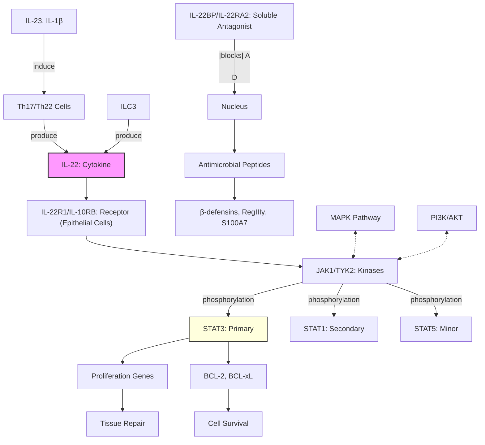

# Pathway Summary for IL22

## Overview
Interleukin-22 (IL-22) is a secreted cytokine of the IL-10 family that plays critical roles in innate immunity, tissue repair, and inflammation at barrier surfaces. Unlike most cytokines, IL-22 acts primarily on non-immune cells (epithelial cells, hepatocytes) through the IL-22R1/IL-10RB receptor complex, activating JAK-STAT signaling to promote antimicrobial defense, epithelial proliferation, and tissue regeneration. IL-22 is produced mainly by activated T cells (Th17/Th22) and innate lymphoid cells (ILC3).

## Core Signaling Pathways

### IL-22R/JAK-STAT Pathway
IL-22 binding to IL-22R1/IL-10RB heterodimeric receptor activates JAK1/TYK2, leading to STAT3 phosphorylation (primary), with additional activation of STAT1 and STAT5. Phosphorylated STATs translocate to nucleus to induce antimicrobial peptides, proliferation genes, and tissue repair factors.

### Tissue Protection and Regeneration
IL-22 promotes epithelial cell survival and proliferation through:
- Anti-apoptotic protein expression (BCL-2, BCL-xL)
- Cell cycle progression genes
- Stem cell activation and tissue regeneration

### Antimicrobial Defense
IL-22 induces expression of antimicrobial proteins at barrier surfaces:
- β-defensins, S100 proteins, RegIII family
- Mucins for barrier protection
- Complement components

## Pathway Diagram

## Upstream Regulation
- **Cellular sources**: Th17, Th22, ILC3, γδ T cells, NKT cells
- **Inducing cytokines**: IL-23, IL-1β, IL-6, TGF-β
- **Transcription factors**: RORγt, AHR, STAT3 in producing cells
- **Negative regulation**: IL-22BP soluble receptor antagonist

## Downstream Effects

### Antimicrobial Response
- **Defensins**: HBD2, HBD3
- **S100 proteins**: S100A7, S100A8/9
- **RegIII family**: RegIIIα, RegIIIγ
- **Lipocalin-2**: Iron sequestration

### Tissue Repair
- **Proliferation markers**: Ki67, PCNA
- **Wound healing factors**: MMP1, MMP3
- **Mucins**: MUC1, MUC3, MUC10, MUC13

### Metabolic Effects
- **Hepatocytes**: Acute phase proteins
- **Lipid metabolism**: Apolipoprotein regulation
- **Glucose metabolism**: Affects insulin sensitivity

## Clinical Significance

### Protective Roles
- **Inflammatory bowel disease**: Epithelial repair
- **Psoriasis**: Paradoxical protective/pathogenic roles
- **Infections**: Defense against extracellular bacteria

### Pathogenic Roles
- **Psoriasis**: Excessive keratinocyte proliferation
- **Rheumatoid arthritis**: Synovial inflammation
- **Cancer**: Tumor-promoting in some contexts

## Regulatory Mechanisms
- **IL-22BP**: Natural antagonist controlling IL-22 activity
- **Tissue distribution**: Receptor expression limited to non-hematopoietic cells
- **SOCS proteins**: Negative feedback on STAT signaling
- **Context-dependent**: Protective vs pathogenic based on timing/amount

## Tissue-Specific Functions
- **Intestinal epithelium**: Barrier integrity, antimicrobial defense
- **Skin**: Keratinocyte proliferation, wound healing
- **Liver**: Hepatoprotection, acute phase response
- **Lung**: Epithelial repair, antimicrobial immunity
- **Pancreas**: β-cell protection

## Integration with Immune Networks
- **Type 3 immunity**: Core effector cytokine with IL-17
- **Th17/ILC3 axis**: Barrier surface immunity
- **Microbiome interaction**: Maintains host-microbe homeostasis
- **Tissue-immune crosstalk**: Bridge between immune and stromal cells
