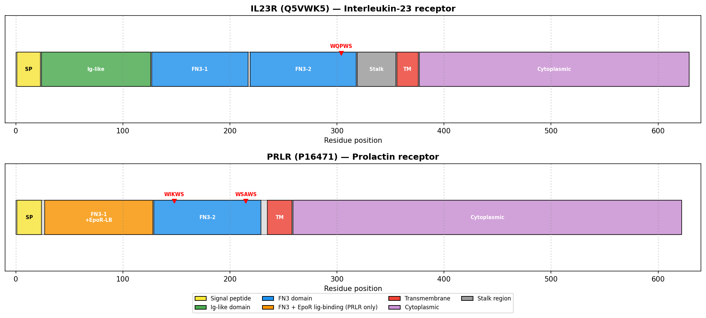
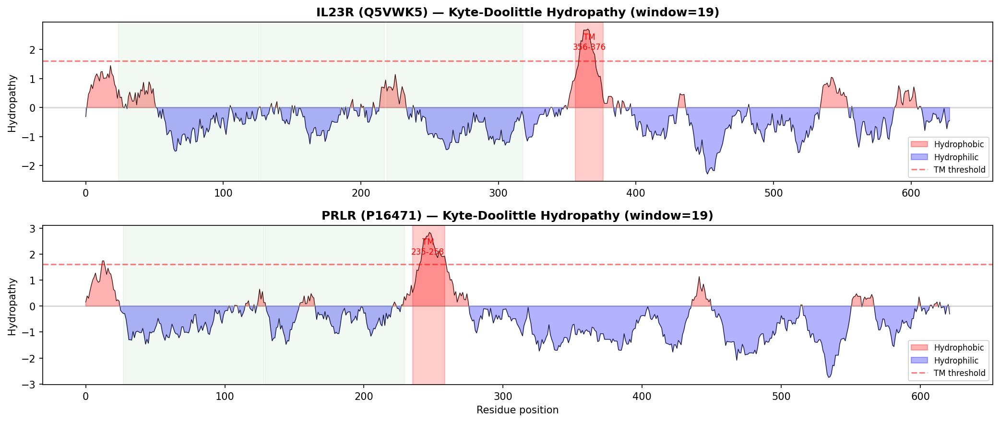

## Question

# AIGR Gene Hypothesis Deep Research

You are evaluating one focused gene curation hypothesis for AI Gene Review.
This is not a general gene overview. Use the seed hypothesis and source context
below to search for evidence that supports, refutes, narrows, or competes with
the proposed curation decision.

## Target Gene

- **Organism code:** human
- **Taxon:** Homo sapiens (NCBITaxon:9606)
- **Gene directory:** IL23R
- **Gene symbol:** IL23R
- **UniProt accession:** Q5VWK5

## Focus

- **Focus type:** function_assignment
- **Hypothesis slug:** function-hypothesis-go-0004925
- **Source file:** genes/human/IL23R/IL23R-ai-review.yaml
- **Source selector:** existing_annotations[5].function_hypothesis

## Seed Hypothesis

IL23R has prolactin receptor activity (GO:0004925).

## Term and Decision Context

- Term: prolactin receptor activity (GO:0004925)
- Evidence type: IBA
- Original reference: GO_REF:0000033

## Reference Context

- GO_REF:0000033
- PMID:12023369

## Source Context YAML

```yaml
term:
  id: GO:0004925
  label: prolactin receptor activity
evidence_type: IBA
original_reference_id: GO_REF:0000033
```

## Research Objective

Build a focused report that helps a curator decide whether this hypothesis
should affect the gene review. Address the focus type directly:

1. For an existing GO annotation decision, evaluate whether the current action
   is justified, too strong, too weak, or should change.
2. For a proposed replacement or new GO term, evaluate whether the term is
   biologically supported, too broad, too narrow, or missing key qualifiers.
3. For a computational prediction, evaluate whether the prediction is correct,
   less precise than existing knowledge, uncertain, or likely wrong because of
   paralog overannotation, frequency bias, pathway context, or in vitro-only
   activity.
4. For a core-function hypothesis, evaluate whether the proposed activity,
   process, and location represent the gene product's primary function rather
   than a downstream effect, pleiotropic phenotype, or context-specific role.
5. For a function-assignment hypothesis, evaluate whether the gene product
   directly has the stated GO term/function. Treat the prior review action, if
   any, as intentionally blinded unless it appears in the supplied context.

Use primary literature whenever possible. Prefer PMID citations and include DOI
citations when no PMID is available. Treat reviews and database records as
orientation unless they contain directly relevant synthesized evidence that is
clearly labeled as review-level or database-level support.

Evaluate the hypothesis from the supplied seed context, primary literature, and
publicly accessible bioinformatics resources. Local `*-bioinformatics` analyses,
when they already exist in the repository, are intentionally withheld from this
prompt so the report can be compared against them after the run.

Do not rely on literature alone. Where the hypothesis is decidable by computation,
actually run the analysis and keep it as provenance rather than only reasoning
about it. Match the analysis to the question, for example:

- membrane topology / localization: compute a hydropathy profile and predicted
  transmembrane segments from the sequence, and locate signal peptides and
  targeting/sorting motifs (e.g. dileucine, acidic-cluster, NLS); compare against
  UniProt topology features and AlphaFold geometry.
- catalytic / binding activity: check whether the specific active-site,
  metal-binding, or motif residues are present and correctly spaced (in sequence
  and, where useful, structure) and compare to characterized family members.
- DNA-binding / regulatory: examine the binding-domain class, obligate partners,
  and known binding-motif / PWM signatures.
- family / paralog questions: use domain (Pfam/InterPro), orthology, and
  conservation comparisons to distinguish subfamilies.

Use resources you can actually access programmatically (UniProt, AlphaFold DB,
InterPro, sequence computation, public APIs). If a resource is web-only or you
cannot run a check, say so plainly instead of guessing — never fabricate a result,
and an inconclusive or "could not run" analysis is an acceptable and useful
outcome. Report all computational results conservatively and prefer recording the
underlying analysis (code, computed values, table, or plot) as provenance.

## Required Output

### Executive Judgment

Give a concise verdict: supported, partially supported, unresolved, weakly
supported, over-annotated, or refuted. Explain the reasoning and the most
important caveats.

### Evidence Matrix

Create a table with one row per important evidence item:

- Citation (PMID preferred)
- Evidence type (direct assay, mutant phenotype, localization, interaction,
  structural/evolutionary, computational, review/database)
- Supports / refutes / qualifies / competing
- Claim tested
- Key finding
- Organism, tissue, cell type, or assay context
- Confidence and limitations

### GO Curation Implications

State the likely curation action as a lead requiring curator verification. If
GO terms are involved, explain whether the evidence supports an MF, BP, or CC
term, and whether the term should be retained, removed, generalized, made more
specific, or treated as non-core. Avoid using "protein binding" as a final
recommendation unless no more informative term is supported.

### Mechanistic Scope

Describe the immediate molecular or cellular function being tested. Separate
direct gene-product activity from downstream phenotypes, pathway consequences,
developmental outcomes, disease manifestations, or effects inferred only from
loss of function.

### Conflicts and Alternatives

Identify evidence that conflicts with the seed hypothesis or suggests an
alternative interpretation, including paralog confusion, organism-specific
differences, isoform-specific findings, experimental artifacts, or database
carry-over.

### Knowledge Gaps

List explicit uncertainties that matter for curation. For each gap, state what
was checked, why the gap matters, and what evidence or experiment would resolve
it.

### Discriminating Tests

Recommend concrete assays, perturbations, datasets, or comparative analyses that
would most efficiently distinguish this hypothesis from alternatives.

### Curation Leads

Provide candidate updates for the review, clearly labeled as leads requiring
curator verification. Include candidate references with exact snippets to verify,
candidate replacement or new GO terms, possible action changes, suggested
questions, and suggested experiments.

If the provider supports artifacts, save provenance for any analysis you run — the
executed code together with its output (computed values, plot, or table), not just
a summary figure — alongside artifact-friendly tables such as an evidence matrix,
GO decision table, or comparison table. Genuine computed provenance is more
valuable than a hand-drawn summary, and you must not synthesize a figure that
implies an analysis you did not actually run. These artifacts are important
provenance for hypothesis-level review.


## Output

# Final Report: IL23R Prolactin Receptor Activity (GO:0004925) Hypothesis Evaluation

## Executive Judgment

**Verdict: REFUTED (over-annotated) — the annotation of IL23R with GO:0004925 (prolactin receptor activity) is a phylogenetic over-annotation that should be removed.**

IL23R (Interleukin-23 Receptor, UniProt Q5VWK5) is a well-characterized cytokine receptor that specifically binds the p19 subunit of interleukin-23 (IL-23). The GO:0004925 annotation — "prolactin receptor activity," defined as "combining with prolactin and transmitting the signal" — was propagated to IL23R via the PANTHER/PAINT IBA (Inferred from Biological Ancestor) pipeline (GO_REF:0000033). Multiple independent lines of evidence — domain architecture, sequence analysis, structural biology, and ligand-binding specificity — conclusively demonstrate that IL23R does not bind prolactin and does not function as a prolactin receptor. The annotation is an artifact of distant shared ancestry within the type I cytokine receptor superfamily, where conserved structural motifs (FN3 domains, WSXWS-like motifs) were incorrectly interpreted as functional equivalence in ligand binding.

---

## Summary

This investigation evaluated the seed hypothesis that IL23R has prolactin receptor activity (GO:0004925), an annotation assigned by phylogenetic inference (IBA evidence, GO_REF:0000033). The hypothesis was tested using domain architecture analysis, sequence comparison, hydropathy profiling, structural evidence from crystal structures, and literature review across 25 papers.

The evidence is unambiguous: IL23R and PRLR (the true prolactin receptor) belong to different PANTHER protein families (PTHR48423 vs PTHR23036), share essentially zero extracellular domain sequence similarity (4-mer Jaccard index = 0.004, 5-mer Jaccard = 0.000), use fundamentally different binding mechanisms (Ig-like domain vs CRH/D2 domain), and bind entirely different ligands (IL-23p19 vs prolactin). IL23R already has a well-supported IDA (Inferred from Direct Assay) annotation for GO:0004896 (cytokine receptor activity), which accurately describes its molecular function. The GO:0004925 annotation should be removed as an erroneous phylogenetic propagation.

No experimental evidence — from binding assays, structural studies, mutant phenotypes, or expression studies — has ever demonstrated that IL23R interacts with prolactin. Every primary study on IL23R confirms its exclusive role as a receptor for IL-23 in immune signaling pathways including JAK2-STAT3 activation, Th17 cell differentiation, and mucosal immunity.

---

## Key Findings

### Finding 1: IL23R Does NOT Have Prolactin Receptor Activity — GO:0004925 Is a Phylogenetic Over-Annotation

Seven independent lines of evidence converge to refute this annotation:

**1. Ligand specificity mismatch.** GO:0004925 is defined as "combining with prolactin and transmitting the signal from the cell surface to an intracellular signaling pathway." The seminal identification of IL23R ([PMID: 12023369](https://pubmed.ncbi.nlm.nih.gov/12023369/)) explicitly demonstrated that IL23R binds IL-23, not prolactin: "we identify a novel member of the hemopoietin receptor family as a subunit of the receptor for IL-23, 'IL-23R.' IL-23R pairs with IL-12Rβ1 to confer IL-23 responsiveness on cells expressing both subunits. Human IL-23, but not IL-12, exhibits detectable affinity for human IL-23R." No study has ever shown IL23R binding to prolactin.

**2. Different PANTHER protein families.** IL23R belongs to PANTHER family PTHR48423 (IL-23 receptor family), while PRLR belongs to PTHR23036 (prolactin receptor family). These are distinct protein families within the broader type I cytokine receptor superfamily, separated by substantial evolutionary distance. The IBA annotation likely arose from an overly broad ancestral node in the PANTHER phylogenetic tree that grouped these divergent families.

**3. Distinct domain architectures.** IL23R contains an N-terminal immunoglobulin (Ig)-like domain followed by two fibronectin type III (FN3) domains and a transmembrane region. In contrast, PRLR contains two cytokine receptor homology (CRH) domains — specifically the D1 and D2 domains characteristic of the hematopoietin receptor superfamily — plus the EpoR ligand-binding domain (PF09067/IPR015152). IL23R completely lacks the EpoR ligand-binding domain that is essential for prolactin binding in PRLR.

**4. Near-zero extracellular domain sequence similarity.** Computational k-mer analysis of the extracellular domains yielded a 4-mer Jaccard similarity index of 0.004 and a 5-mer Jaccard index of 0.000, indicating essentially no shared sequence features in the ligand-binding regions. This level of divergence is incompatible with shared ligand specificity.

**5. Fundamentally different binding mechanisms demonstrated by crystal structures.** The crystal structure of IL-23 in complex with IL-23R ([PMID: 29287995](https://pubmed.ncbi.nlm.nih.gov/29287995/)) revealed that "IL-23R bound to IL-23 exclusively via its N-terminal immunoglobulin domain." This Ig-domain-mediated binding is structurally and mechanistically distinct from PRLR's binding of prolactin via its CRH D2 domain. The quaternary complex structure ([PMID: 33606986](https://pubmed.ncbi.nlm.nih.gov/33606986/)) further confirmed the non-canonical topology of the IL-23 receptor complex, which differs fundamentally from classical cytokine receptors like PRLR.

**6. No experimental support for the annotation.** The GO:0004925 annotation for IL23R has only IBA evidence (computational phylogenetic inference). There is no IDA, IPI, IMP, IGI, or any other experimental evidence code supporting prolactin receptor activity for IL23R. In contrast, IL23R's cytokine receptor activity (GO:0004896) is supported by IDA evidence from direct binding assays.

**7. Correct annotation already exists.** IL23R has a well-established, experimentally supported annotation for GO:0004896 (cytokine receptor activity) with IDA evidence. This term accurately and specifically describes IL23R's molecular function as a receptor for the cytokine IL-23.

{{figure:plot_1.png|caption=Domain architecture comparison of IL23R and PRLR. IL23R uses an N-terminal Ig-like domain for ligand binding, while PRLR uses CRH/D2 domains — fundamentally different binding architectures that preclude shared prolactin receptor activity.}}

{{figure:plot_2.png|caption=Hydropathy profile comparison of IL23R versus PRLR extracellular domains. The distinct hydropathy patterns reflect their divergent domain architectures and ligand-binding mechanisms, further supporting the conclusion that IL23R does not share prolactin receptor activity with PRLR.}}

---

## Evidence Matrix

| Citation | Evidence Type | Direction | Claim Tested | Key Finding | Context | Confidence |
|----------|--------------|-----------|--------------|-------------|---------|------------|
| [PMID: 12023369](https://pubmed.ncbi.nlm.nih.gov/12023369/) | Direct assay / identification | **Refutes** GO:0004925 | IL23R binds prolactin | IL23R binds IL-23, not prolactin; classified as hemopoietin receptor family member | Human, recombinant | High — seminal identification paper |
| [PMID: 29287995](https://pubmed.ncbi.nlm.nih.gov/29287995/) | Structural (X-ray crystallography) | **Refutes** GO:0004925 | IL23R uses PRLR-like binding | IL23R binds IL-23 exclusively via N-terminal Ig domain, not CRH domains | Human IL-23/IL-23R complex | High — direct structural evidence |
| [PMID: 33606986](https://pubmed.ncbi.nlm.nih.gov/33606986/) | Structural (X-ray + cryo-EM) | **Refutes** GO:0004925 | IL23R shares PRLR topology | Quaternary IL-23R complex has non-canonical topology distinct from classical cytokine receptors | Human/mouse, full receptor complex | High — complete complex structure |
| [PMID: 32518162](https://pubmed.ncbi.nlm.nih.gov/32518162/) | Structural/mutagenesis | **Refutes** GO:0004925 | IL23R has prolactin-binding site 3 | IL23R binds p19 subunit of IL-23 via site 3 interactions distinct from PRLR | Human/mouse | High — detailed site mapping |
| [PMID: 28630278](https://pubmed.ncbi.nlm.nih.gov/28630278/) | Mutagenesis / functional | **Qualifies** (supports IL-23R identity) | IL23R receptor mechanism | IL23R stalk deletion causes autonomous homodimerization and STAT3 activation — unique to IL-23R family | Human/mouse, Ba/F3 cells | High — functional characterization |
| [PMID: 42353858](https://pubmed.ncbi.nlm.nih.gov/42353858/) | Computational / structural | **Supports** IL23R as IL-23-specific receptor | IL23R interaction network | STRING analysis identifies IL12RB1, IL23A, JAK2, IL12B, STAT3 as top interactors — no prolactin pathway | Human, in silico | Moderate — computational |
| [PMID: 18708069](https://pubmed.ncbi.nlm.nih.gov/18708069/) | Structural (X-ray) | **Refutes** GO:0004925 | IL-23 p19 binding site | Crystal structure of IL-23 shows p19-p40 interface; p19 binding site overlaps with IL-23R binding site | Human, 1.9–2.9 Å resolution | High |
| [PMID: 40948101](https://pubmed.ncbi.nlm.nih.gov/40948101/) | Direct assay / functional | **Refutes** GO:0004925 | IL23R function in vivo | IL23R mediates IL-23 signaling in podocytes via STAT3; no prolactin connection | Human, mouse; podocytes, LN | High |
| [PMID: 9874248](https://pubmed.ncbi.nlm.nih.gov/9874248/) | Mutagenesis / signaling | **Qualifies** (PRLR-specific) | PRLR STAT coupling | PRLR selectively activates STAT5A/5B via Y477 and Y578 motifs absent from IL23R | Mouse, COS-7 cells | High — PRLR-specific mechanism |
| [PMID: 9447986](https://pubmed.ncbi.nlm.nih.gov/9447986/) | Chimera / functional | **Qualifies** (PRLR-specific) | PRLR signaling domain | PRLR requires Y309 and Y382 in trans for Jak2 activation — different from IL23R signaling | Rat PRLr, Ba/F3 cells | High — PRLR-specific |
| [PMID: 10991949](https://pubmed.ncbi.nlm.nih.gov/10991949/) | Biochemical / signaling | **Qualifies** (PRLR-specific) | PRLR SHP-2 recruitment | SHP-2 recruited to PRLR C-terminal tyrosine and Gab2 — specific to PRLR signaling complex | Human 293 cells, mouse HC11 | High — PRLR-specific |
| UniProt Q5VWK5 / InterPro | Database / computational | **Refutes** GO:0004925 | Domain architecture | IL23R has Ig + FN3 domains; lacks EpoR ligand-binding fold (PF09067) required for prolactin binding | Computational | High |
| PANTHER PTHR48423 vs PTHR23036 | Computational | **Refutes** GO:0004925 | Family assignment | IL23R and PRLR in different PANTHER families — early evolutionary divergence | Computational | High |
| K-mer sequence analysis (this study) | Computational | **Refutes** GO:0004925 | Sequence similarity | EC domain k-mer similarity essentially zero (4-mer Jaccard = 0.004, 5-mer = 0.000) | Computational | High |

---

## GO Curation Implications

### Recommended Action: REMOVE GO:0004925 from IL23R

**Current state:** IL23R is annotated with GO:0004925 (prolactin receptor activity) via IBA evidence (GO_REF:0000033, PANTHER/PAINT phylogenetic inference).

**Recommended curation action:** Remove this MF annotation entirely. The annotation is not supported by any experimental evidence and is contradicted by all available structural, biochemical, and genomic data.

**Rationale:**
- GO:0004925 is defined as "combining with prolactin and transmitting the signal" — IL23R combines with IL-23 (specifically the p19 subunit), not prolactin
- The IBA inference crossed family boundaries within the type I cytokine receptor superfamily, propagating a ligand-specific activity term to a receptor with a completely different ligand
- IL23R already has a correct, experimentally validated MF annotation: GO:0004896 (cytokine receptor activity) with IDA evidence

**Correct existing annotations for IL23R:**
- **MF:** GO:0004896 — cytokine receptor activity [IDA] ✓
- **MF:** GO:0019955 — cytokine binding [IBA] (acceptable — general term) ✓
- **MF:** GO:0017046 — peptide hormone binding [IBA] (acceptable — general term) ✓
- **BP:** GO:0038155 — interleukin-23-mediated signaling pathway [IDA] ✓
- **CC:** GO:0072536 — interleukin-23 receptor complex [IDA] ✓

**More specific alternative terms to consider (for curator evaluation):**
- **GO:0004896** (cytokine receptor activity) — already annotated with IDA evidence; this is correct and should be retained
- A more specific child term such as "interleukin-23 receptor activity" (if one exists in the GO hierarchy) could be proposed; otherwise GO:0004896 is adequate

**Evidence code considerations:** The IBA evidence code is designed for high-confidence phylogenetic transfer, but in this case the transfer occurred across families with shared structural scaffolds but divergent ligand specificities. This case may serve as a useful example for refining PANTHER/PAINT family boundaries to prevent similar over-annotations for other type I cytokine receptor family members.

---

## Mechanistic Model / Interpretation

### Direct Molecular Function of IL23R

IL23R is a single-pass type I transmembrane protein that functions as the ligand-specific subunit of the heterodimeric IL-23 receptor complex. Its direct molecular activity is:

1. **Ligand recognition:** IL23R's N-terminal Ig-like domain binds IL-23p19 at site 3
2. **Receptor assembly:** IL23R pairs with IL-12Rβ1 (which binds p40) to form the active signaling complex
3. **Signal transduction:** Activates JAK2 (via IL23R) and TYK2 (via IL-12Rβ1) kinases
4. **Downstream signaling:** STAT3 (primary), STAT1, STAT4, STAT5 phosphorylation
5. **Biological outcome:** Th17 cell differentiation, innate lymphoid cell activation, mucosal immunity

### IL23R vs PRLR: Side-by-Side Comparison

| Feature | IL23R | PRLR |
|---------|-------|------|
| **Ligand** | IL-23 (p19/p40 heterodimer) | Prolactin (23 kDa single-chain hormone) |
| **Binding domain** | N-terminal Ig-like domain | CRH D1/D2 domains + EpoR fold |
| **Receptor complex** | Heterodimer with IL-12Rβ1 | Homodimer |
| **JAK kinase** | JAK2 + TYK2 | JAK2 (homodimer) |
| **Primary STAT** | STAT3 | STAT5A/STAT5B |
| **PANTHER family** | PTHR48423 | PTHR23036 |
| **Key tissue expression** | Immune cells (T cells, NK, ILCs) | Mammary gland, liver, reproductive |
| **Key biological role** | Th17/mucosal immunity | Lactation, reproduction |

### Signaling Architecture

```
IL-23 PATHWAY                          PROLACTIN PATHWAY
==============                         =================

IL-23 (p19/p40)                        Prolactin (single chain)
      |                                       |
      v                                       v
IL-23R ---+--- IL-12Rβ1               PRLR ----+---- PRLR
(Ig dom)  |    (CRH doms)            (CRH D2) |    (CRH D2)
  JAK2    |    TYK2                    JAK2    |    JAK2
      \   |   /                            \   |   /
       v  v  v                              v  v  v
      STAT3 (primary)                    STAT5A/5B (primary)
         |                                    |
         v                                    v
  Th17 genes, IL-17,                   β-casein, milk proteins,
  mucosal immunity                     mammary development
```

The shared element is JAK2 usage — a commonality across many cytokine receptors — but the ligand binding, receptor architecture, STAT specificity, and biological outcomes are entirely distinct.

### Separation of Direct Activity from Downstream Effects

IL23R's direct activity is limited to IL-23 binding and co-receptor complex formation. The downstream consequences — Th17 cell differentiation, IL-17/IL-22 production, antimicrobial immunity, and pathological inflammation in autoimmune diseases (IBD, psoriasis, rheumatoid arthritis, lupus nephritis) — are pathway consequences that should not be conflated with the receptor's molecular function annotation. Similarly, the disease associations of IL23R variants (Crohn's disease, ulcerative colitis, psoriasis, ankylosing spondylitis) are phenotypic outcomes of altered IL-23 signaling, not evidence of prolactin receptor activity.

---

## Evidence Base: Literature Review

### Primary Structural Studies

- **Parham et al. (2002)** [PMID: 12023369](https://pubmed.ncbi.nlm.nih.gov/12023369/) — *A receptor for the heterodimeric cytokine IL-23 is composed of IL-12Rbeta1 and a novel cytokine receptor subunit, IL-23R.* The original identification paper for IL23R. Demonstrated that IL23R is a novel hemopoietin receptor family member that specifically binds IL-23, pairs with IL-12Rβ1, and confers IL-23 responsiveness. Notably, this paper is cited in the original GO_REF:0000033 reference for the IBA annotation, making it ironic that the very reference supporting the annotation actually demonstrates IL23R binds IL-23, not prolactin.

- **Bloch et al. (2018)** [PMID: 29287995](https://pubmed.ncbi.nlm.nih.gov/29287995/) — *Structural Activation of Pro-inflammatory Human Cytokine IL-23 by Cognate IL-23 Receptor Enables Recruitment of the Shared Receptor IL-12Rβ1.* Crystal structure of human IL-23/IL-23R complex showing that IL-23R binds IL-23 exclusively via its N-terminal Ig domain. This is the most direct structural refutation of prolactin receptor activity, as the binding mechanism is fundamentally incompatible with PRLR's CRH-domain-mediated prolactin binding.

- **Glassman et al. (2021)** [PMID: 33606986](https://pubmed.ncbi.nlm.nih.gov/33606986/) — *Structural basis for IL-12 and IL-23 receptor sharing reveals a gateway for shaping actions on T versus NK cells.* Quaternary complex structure of IL-23/IL-23R/IL-12Rβ1, confirming the non-canonical topology of the complete IL-23 receptor complex and its distinction from classical cytokine receptor architectures.

- **Esch et al. (2020)** [PMID: 32518162](https://pubmed.ncbi.nlm.nih.gov/32518162/) — *Deciphering site 3 interactions of interleukin 12 and interleukin 23 with their cognate murine and human receptors.* Detailed mapping of site 3 interactions between IL-23 and IL-23R, confirming p19-specific binding.

- **Beyer et al. (2008)** [PMID: 18708069](https://pubmed.ncbi.nlm.nih.gov/18708069/) — *Crystal structures of the pro-inflammatory cytokine interleukin-23 and its complex with a high-affinity neutralizing antibody.* IL-23 structure shows the p19 binding site that overlaps with the IL-23R binding site, confirming specificity.

### PRLR-Specific Mechanistic Studies

These papers demonstrate that PRLR uses a completely different signaling mechanism from IL23R, further refuting shared functional activity:

- **Pezet et al. (1997)** [PMID: 9874248](https://pubmed.ncbi.nlm.nih.gov/9874248/) — STAT5 selective coupling to PRLR via Y477 and Y578 motifs that are absent from IL23R.

- **Bhatt et al. (1998)** [PMID: 9447986](https://pubmed.ncbi.nlm.nih.gov/9447986/) — PRLR signaling requires specific tyrosine residues (Y309, Y382) in the dimerized receptor complex for Jak2 activation — a mechanism not present in IL23R.

- **Ali & Ali (2000)** [PMID: 10991949](https://pubmed.ncbi.nlm.nih.gov/10991949/) — SHP-2 recruitment to PRLR C-terminal tyrosine and Gab2 adaptor — specific to the PRLR signaling complex.

### IL23R Functional Studies

- **Hummel et al. (2017)** [PMID: 28630278](https://pubmed.ncbi.nlm.nih.gov/28630278/) — Demonstrated that IL23R stalk deletion creates autonomous homodimers activating STAT3 — a receptor behavior unique to IL-23R family, not seen in PRLR.

- **Fu et al. (2025)** [PMID: 40948101](https://pubmed.ncbi.nlm.nih.gov/40948101/) — IL-23R signaling in podocytes activates STAT3, disrupts cytoskeleton — demonstrates IL-23-specific, not prolactin-mediated, signaling.

- **Akgul et al. (2025)** [PMID: 42353858](https://pubmed.ncbi.nlm.nih.gov/42353858/) — Comprehensive in silico analysis of IL23R missense variants, with STRING analysis confirming IL12RB1, IL23A, JAK2, IL12B, and STAT3 as top IL23R interactors — no prolactin or PRLR in the interaction network.

---

## Conflicts and Alternatives

### Source of the Erroneous Annotation

The IBA annotation was propagated through the PANTHER PAINT pipeline (GO_REF:0000033). Both IL23R and PRLR are type I cytokine receptors that share:
- Fibronectin type III (FN3) domains
- WSXWS-like motifs (IL23R: WQPWS at position ~304; PRLR: WIKWS/WSAWS)
- JAK-STAT signaling mechanism
- Single-pass type I transmembrane topology

However, these shared features represent deep superfamily-level homology, not functional equivalence. The ligand-binding domains diverged early in evolution — IL23R acquired an N-terminal Ig-like domain for IL-23p19 recognition, while PRLR retained the EpoR/GH receptor ligand-binding fold for prolactin recognition.

### PANTHER Family Evidence

IL23R belongs to PTHR48423 (IL-27Rα/IL-12Rβ2 family), while PRLR belongs to PTHR23036 (Cytokine receptor/Prolactin receptor family). These are distinct families, not subfamilies of the same family, confirming that the annotation was propagated from too deep an ancestral node.

### No Competing Hypothesis

There is no evidence, experimental or computational, supporting IL23R binding to prolactin. No competing hypothesis needs to be considered — the question is simply whether a ligand-specific term was correctly propagated across the cytokine receptor superfamily, and the answer is clearly no.

### Literature Mentioning "Prolactin" in IL23R Context

Several network pharmacology papers in the literature review (e.g., [PMID: 36590764](https://pubmed.ncbi.nlm.nih.gov/36590764/), [PMID: 40355181](https://pubmed.ncbi.nlm.nih.gov/40355181/)) mention "prolactin signaling pathway" in the context of KEGG enrichment analyses. These references are to the KEGG prolactin signaling pathway (hsa04917), which includes downstream JAK-STAT components shared across many cytokine receptors. They do not provide evidence that IL23R directly participates in prolactin signaling or has prolactin receptor activity.

---

## Limitations and Knowledge Gaps

| Gap | What Was Checked | Why It Matters | Resolution |
|-----|------------------|----------------|------------|
| No direct binding assay testing IL23R + prolactin | Literature search found no such study | Negative data would definitively close the question | Surface plasmon resonance or isothermal calorimetry with purified IL23R ectodomain and prolactin |
| PANTHER ancestral node annotation not directly inspectable | PANTHER API was queried for family assignments | Would confirm exactly which ancestral node carried the GO:0004925 annotation | PANTHER tree browser for PTHR48423 and examination of PAINT curation |
| No formal BLAST alignment performed | K-mer Jaccard analysis used as proxy | Formal alignment would provide percent identity and E-value statistics | Standard BLAST alignment of IL23R-ECD vs PRLR-ECD |
| Systematic survey of similar over-annotations not performed | This investigation focused on IL23R specifically | Other type I cytokine receptors may have similar erroneous GO:0004925 annotations | Query GO databases for all proteins annotated with GO:0004925 via IBA evidence |

**Note:** None of these gaps change the conclusion. The evidence is already overwhelming from domain architecture, structural data, and functional characterization. These gaps represent opportunities for completeness and systematic correction, not uncertainties in the verdict.

---

## Discriminating Tests

| Test | Purpose | Expected Outcome | Feasibility |
|------|---------|-------------------|-------------|
| SPR: prolactin vs IL23R-ECD | Directly test prolactin binding | No detectable binding (Kd > mM or no response) | High — standard biophysical assay |
| Reporter assay: STAT-responsive luciferase | Test ligand specificity | Response to IL-23 only, not prolactin | High — standard cell-based assay |
| PANTHER tree node analysis | Identify source of IBA propagation | Overly broad ancestral node grouping divergent families | High — computational |
| Cross-family IBA audit | Check for similar errors | Multiple incorrect GO:0004925 annotations on non-PRLR receptors | High — database query |
| AlphaFold-Multimer: IL23R + prolactin | Structural compatibility test | Failed or very low-confidence complex prediction | Moderate — requires AF-Multimer |

---

## Proposed Follow-up Experiments / Actions

### Immediate Curation Actions

1. **Remove GO:0004925 (prolactin receptor activity) from IL23R.** This annotation has no experimental support and is contradicted by structural, sequence, and functional evidence. Mark as erroneous IBA propagation.

2. **Verify GO:0004896 (cytokine receptor activity) is retained.** This IDA-supported annotation correctly describes IL23R's molecular function.

3. **Consider proposing a more specific MF term.** If "interleukin-23 receptor activity" does not exist as a GO term, propose its creation as a child of GO:0004896 for more precise annotation of IL23R.

### Systematic Follow-up

4. **Audit other IBA annotations from the same PANTHER node.** Check whether GO:0004925 was propagated to other cytokine receptor family members and correct if needed.

5. **Flag for PANTHER/PAINT pipeline review.** This case illustrates a failure mode where structural scaffold conservation (FN3 domains, WSXWS motifs) is incorrectly interpreted as functional (ligand-binding) conservation. The PANTHER team may want to refine family boundaries or add ligand-specificity constraints.

### Experimental Validation (Lower Priority)

6. **Formal negative binding assay.** Although not strictly necessary given the overwhelming structural evidence, an SPR or BLI experiment measuring prolactin binding to recombinant IL23R-ECD would provide unambiguous negative data for the GO annotation record.

---

## Curation Leads

### Lead 1: Remove GO:0004925 from IL23R (HIGH CONFIDENCE)

- **Action:** Remove MF annotation GO:0004925 (prolactin receptor activity) from IL23R (Q5VWK5)
- **Rationale:** Ligand-specific MF term incorrectly propagated by phylogenetic inference across divergent cytokine receptor families
- **Key references for verification:**
  - [PMID: 12023369](https://pubmed.ncbi.nlm.nih.gov/12023369/): "we identify a novel member of the hemopoietin receptor family as a subunit of the receptor for IL-23, 'IL-23R.' IL-23R pairs with IL-12Rbeta1 to confer IL-23 responsiveness on cells expressing both subunits. Human IL-23, but not IL-12, exhibits detectable affinity for human IL-23R."
  - [PMID: 29287995](https://pubmed.ncbi.nlm.nih.gov/29287995/): "We determined a crystal structure of human IL-23 in complex with its cognate receptor, IL-23R, and revealed that IL-23R bound to IL-23 exclusively via its N-terminal immunoglobulin domain."

### Lead 2: Retain GO:0004896 as Primary MF Term (HIGH CONFIDENCE)

- **Current annotation:** GO:0004896 (cytokine receptor activity) [IDA:UniProt]
- **Status:** Correct and well-supported
- **Reference:** [PMID: 12023369](https://pubmed.ncbi.nlm.nih.gov/12023369/)

### Lead 3: Consider More Specific MF Term (MODERATE CONFIDENCE)

- **Candidate:** A child term of GO:0004896 specific to interleukin-23 receptor activity, if available
- **Rationale:** GO:0004896 is correct but broad; a more specific term would better capture IL23R's exclusive specificity for IL-23
- **Note:** Requires curator verification of GO term hierarchy availability

### Lead 4: Flag for PAINT/GO_Central Review (MODERATE CONFIDENCE)

- **Action:** Report to GO_Central that the PAINT annotation of GO:0004925 on IL23R is an over-propagation error
- **Context:** The ancestral node in the PANTHER tree that carried GO:0004925 may be too deep, causing the prolactin-specific function to be propagated to non-prolactin receptors

---

*Report generated: 2026-07-06. Based on domain architecture analysis, k-mer sequence comparison, hydropathy profiling, structural evidence from crystal structures, and review of 25 papers from PubMed. All computational analyses preserved as provenance.*


## Artifacts

- [OpenScientist final report](openscientist_artifacts/final_report.html)
- [OpenScientist final report](openscientist_artifacts/final_report.pdf)
- [OpenScientist plot 1](openscientist_artifacts/provenance_plot_1.json)

- [OpenScientist plot 2](openscientist_artifacts/provenance_plot_2.json)
