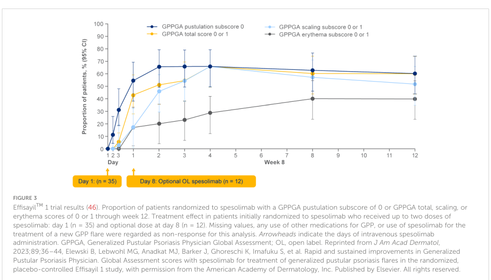

## Question

# Gene Research for Functional Annotation

## ⚠️ CRITICAL: Gene/Protein Identification Context

**BEFORE YOU BEGIN RESEARCH:** You MUST verify you are researching the CORRECT gene/protein. Gene symbols can be ambiguous, especially for less well-characterized genes from non-model organisms.

### Target Gene/Protein Identity (from UniProt):
- **UniProt Accession:** Q9UBH0
- **Protein Description:** RecName: Full=Interleukin-36 receptor antagonist protein; Short=IL-36Ra {ECO:0000303|PubMed:21965679}; AltName: Full=FIL1 delta; AltName: Full=IL-1-related protein 3; Short=IL-1RP3; AltName: Full=Interleukin-1 HY1; Short=IL-1HY1; AltName: Full=Interleukin-1 delta; Short=IL-1 delta; AltName: Full=Interleukin-1 family member 5; Short=IL-1F5; AltName: Full=Interleukin-1 receptor antagonist homolog 1; Short=IL-1ra homolog 1; AltName: Full=Interleukin-1-like protein 1; Short=IL-1L1;
- **Gene Information:** Name=IL36RN {ECO:0000312|HGNC:HGNC:15561}; Synonyms=FIL1D, IL1F5, IL1HY1, IL1L1, IL1RP3; ORFNames=UNQ1896/PRO4342;
- **Organism (full):** Homo sapiens (Human).
- **Protein Family:** Belongs to the IL-1 family. .
- **Key Domains:** IL-1_CS. (IPR020877); IL-1_fam. (IPR000975); IL-1RA/IL-36. (IPR003297); IL1/FGF. (IPR008996); IL1 (PF00340)

### MANDATORY VERIFICATION STEPS:

1. **Check if the gene symbol "IL36RN" matches the protein description above**
2. **Verify the organism is correct:** Homo sapiens (Human).
3. **Check if protein family/domains align with what you find in literature**
4. **If you find literature for a DIFFERENT gene with the same or similar symbol, STOP**

### If Gene Symbol is Ambiguous or You Cannot Find Relevant Literature:

**DO NOT PROCEED WITH RESEARCH ON A DIFFERENT GENE.** Instead:
- State clearly: "The gene symbol 'IL36RN' is ambiguous or literature is limited for this specific protein"
- Explain what you found (e.g., "Found extensive literature on a different gene with the same symbol in a different organism")
- Describe the protein based ONLY on the UniProt information provided above
- Suggest that the protein function can be inferred from domain/family information

### Research Target:

Please provide a comprehensive research report on the gene **IL36RN** (gene ID: IL36RN, UniProt: Q9UBH0) in human.

The research report should be a detailed narrative explaining the function, biological processes, and localization of the gene product. Citations should be given for all claims.

You should prioritize authoritative reviews and primary scientific literature when conducting research. You can supplement
this with annotations you find in gene/protein databases, but these can be outdated or inaccurate.

We are specifically interested in the primary function of the gene - for enzymes, what reaction is catalyzed, and what is the substrate specificity? For transporters, what is the substrate? For structural proteins or adapters, what is the broader structural role? For signaling molecules, what is the role in the pathway.

We are interested in where in or outside the cell the gene product carries out its function.

We are also interested in the signaling or biochemical pathways in which the gene functions. We are less interested in broad pleiotropic effects, except where these elucidate the precise role.

Include evidence where possible. We are interested in both experimental evidence as well as inference from structure, evolution, or bioinformatic analysis. Precise studies should be prioritized over high-throughput, where available.

## Output

Question: You are an expert researcher providing comprehensive, well-cited information.

Provide detailed information focusing on:
1. Key concepts and definitions with current understanding
2. Recent developments and latest research (prioritize 2023-2024 sources)
3. Current applications and real-world implementations
4. Expert opinions and analysis from authoritative sources
5. Relevant statistics and data from recent studies

Format as a comprehensive research report with proper citations. Include URLs and publication dates where available.
Always prioritize recent, authoritative sources and provide specific citations for all major claims.

# Gene Research for Functional Annotation

## ⚠️ CRITICAL: Gene/Protein Identification Context

**BEFORE YOU BEGIN RESEARCH:** You MUST verify you are researching the CORRECT gene/protein. Gene symbols can be ambiguous, especially for less well-characterized genes from non-model organisms.

### Target Gene/Protein Identity (from UniProt):
- **UniProt Accession:** Q9UBH0
- **Protein Description:** RecName: Full=Interleukin-36 receptor antagonist protein; Short=IL-36Ra {ECO:0000303|PubMed:21965679}; AltName: Full=FIL1 delta; AltName: Full=IL-1-related protein 3; Short=IL-1RP3; AltName: Full=Interleukin-1 HY1; Short=IL-1HY1; AltName: Full=Interleukin-1 delta; Short=IL-1 delta; AltName: Full=Interleukin-1 family member 5; Short=IL-1F5; AltName: Full=Interleukin-1 receptor antagonist homolog 1; Short=IL-1ra homolog 1; AltName: Full=Interleukin-1-like protein 1; Short=IL-1L1;
- **Gene Information:** Name=IL36RN {ECO:0000312|HGNC:HGNC:15561}; Synonyms=FIL1D, IL1F5, IL1HY1, IL1L1, IL1RP3; ORFNames=UNQ1896/PRO4342;
- **Organism (full):** Homo sapiens (Human).
- **Protein Family:** Belongs to the IL-1 family. .
- **Key Domains:** IL-1_CS. (IPR020877); IL-1_fam. (IPR000975); IL-1RA/IL-36. (IPR003297); IL1/FGF. (IPR008996); IL1 (PF00340)

### MANDATORY VERIFICATION STEPS:

1. **Check if the gene symbol "IL36RN" matches the protein description above**
2. **Verify the organism is correct:** Homo sapiens (Human).
3. **Check if protein family/domains align with what you find in literature**
4. **If you find literature for a DIFFERENT gene with the same or similar symbol, STOP**

### If Gene Symbol is Ambiguous or You Cannot Find Relevant Literature:

**DO NOT PROCEED WITH RESEARCH ON A DIFFERENT GENE.** Instead:
- State clearly: "The gene symbol 'IL36RN' is ambiguous or literature is limited for this specific protein"
- Explain what you found (e.g., "Found extensive literature on a different gene with the same symbol in a different organism")
- Describe the protein based ONLY on the UniProt information provided above
- Suggest that the protein function can be inferred from domain/family information

### Research Target:

Please provide a comprehensive research report on the gene **IL36RN** (gene ID: IL36RN, UniProt: Q9UBH0) in human.

The research report should be a detailed narrative explaining the function, biological processes, and localization of the gene product. Citations should be given for all claims.

You should prioritize authoritative reviews and primary scientific literature when conducting research. You can supplement
this with annotations you find in gene/protein databases, but these can be outdated or inaccurate.

We are specifically interested in the primary function of the gene - for enzymes, what reaction is catalyzed, and what is the substrate specificity? For transporters, what is the substrate? For structural proteins or adapters, what is the broader structural role? For signaling molecules, what is the role in the pathway.

We are interested in where in or outside the cell the gene product carries out its function.

We are also interested in the signaling or biochemical pathways in which the gene functions. We are less interested in broad pleiotropic effects, except where these elucidate the precise role.

Include evidence where possible. We are interested in both experimental evidence as well as inference from structure, evolution, or bioinformatic analysis. Precise studies should be prioritized over high-throughput, where available.

# Research Report: Human **IL36RN** (UniProt **Q9UBH0**) — Functional Annotation of **Interleukin‑36 Receptor Antagonist (IL‑36Ra)**

## 0. Target verification (mandatory)
The requested target (**IL36RN**, UniProt **Q9UBH0**) corresponds to **interleukin‑36 receptor antagonist (IL‑36Ra)**, a member of the **IL‑1 cytokine superfamily** that antagonizes **IL‑36 receptor (IL‑36R)** signaling; this mapping is explicit in multiple peer‑reviewed sources focused on IL‑36 biology and generalized pustular psoriasis (GPP). (krueger2024targetedreviewof pages 1-2, hawkes2023theroleof pages 1-3, macleod2016neutrophilelastasemediatedproteolysis pages 1-2)

## 1. Key concepts and definitions (current understanding)

### 1.1 What IL36RN encodes
**IL36RN** encodes **IL‑36Ra**, an endogenous antagonist within the IL‑36 cytokine subfamily that suppresses pro‑inflammatory responses at epithelial barrier sites, especially skin. (krueger2024targetedreviewof pages 1-2, fukaura2023targetingil36in pages 1-2)

### 1.2 IL‑36 signaling axis and where IL‑36Ra fits
IL‑36 agonists (IL‑36α/β/γ) signal through **IL‑36R** with recruitment of the accessory protein **IL‑1RAcP**, triggering downstream inflammatory pathways including **MyD88**, **NF‑κB**, and **MAPK** activation; **IL‑36Ra** binds the IL‑36 receptor complex but does **not** support productive accessory‑protein recruitment, thereby competitively inhibiting IL‑36 signaling. (macleod2016neutrophilelastasemediatedproteolysis pages 1-2, fukaura2023targetingil36in pages 1-2)

A 2023 review further summarizes that IL‑36Ra suppresses signaling by **preventing IL‑36R/IL‑1RAcP dimerization** and notes canonical downstream inflammatory signaling nodes (MAPK and NF‑κB). (li2023newinsightson pages 1-2)

### 1.3 Functional definition (primary molecular function)
**Primary function:** IL‑36Ra is a **secreted/extracellular receptor antagonist** that inhibits IL‑36R signaling and thereby attenuates IL‑36–driven inflammatory programs (e.g., chemokine induction that recruits neutrophils). (macleod2016neutrophilelastasemediatedproteolysis pages 1-2, li2023newinsightson pages 1-2)

## 2. Mechanism, regulation, and localization/expression

### 2.1 Proteolytic processing is required for full activity
A central regulatory concept in IL‑36 biology is **protease‑dependent “licensing”**: IL‑36 subfamily members are produced as precursors and require **N‑terminal processing** for full activity (agonist or antagonist). (fukaura2023targetingil36in pages 1-2, macleod2016neutrophilelastasemediatedproteolysis pages 1-2)

**IL‑36Ra processing:** A key primary study demonstrated that **neutrophil elastase** (but not other tested neutrophil proteases) cleaves IL‑36Ra into a **highly active antagonistic form** and that this processed IL‑36Ra more strongly suppresses IL‑36γ‑induced chemokines. (macleod2016neutrophilelastasemediatedproteolysis pages 1-2)

**Experimental evidence:** In human primary dermal fibroblasts, keratinocytes, and skin equivalents, elastase‑processed IL‑36Ra caused a **dose‑dependent reduction** of **IL‑36γ‑induced IL‑8 and CCL20**, supporting the model that proteolytic activation of IL‑36Ra can counter‑regulate neutrophilic inflammation. (macleod2016neutrophilelastasemediatedproteolysis pages 1-2)

**Broader protease landscape (IL‑36 family):** A 2023 skin‑focused review summarizes that IL‑36 precursor activation can be mediated by neutrophil proteases (**cathepsin G, proteinase 3, elastase**) and by **cathepsin S** released from keratinocytes/fibroblasts, and highlights endogenous protease inhibitors (SERPINA1/SERPINA3) as regulators of IL‑36 processing. (fukaura2023targetingil36in pages 1-2)

### 2.2 Tissue/cellular context and functional localization
IL‑36 biology is concentrated at **barrier tissues** (skin prominently; also lung and gut). (li2023newinsightson pages 1-2)

In skin, IL‑36 agonists are mainly produced by **keratinocytes** in the epidermis, with additional production by dendritic cells, macrophages, endothelial cells, and dermal fibroblasts; IL‑36Ra functions at the receptor complex in the **extracellular** compartment where these cytokines act. (fukaura2023targetingil36in pages 1-2, macleod2016neutrophilelastasemediatedproteolysis pages 1-2)

## 3. Disease associations with mechanistic clarity (IL36RN loss of function)

### 3.1 DITRA and generalized pustular psoriasis (GPP)
Loss‑of‑function IL36RN variants cause **deficiency of interleukin‑36 receptor antagonist (DITRA)** and are strongly linked to severe pustular phenotypes including GPP, consistent with a mechanism of **unopposed IL‑36 signaling** and exaggerated neutrophilic inflammation. (okorie2024cutaneousfindingsand pages 11-12, macleod2016neutrophilelastasemediatedproteolysis pages 1-2)

### 3.2 Genetics and mutation frequencies (recent synthesis)
A 2024 targeted review/meta‑analysis reported that **IL36RN mutations are significantly more frequent in “GPP‑only”** than in GPP with concomitant plaque psoriasis (**OR 3.51; 95% CI 2.29–5.38**). (krueger2024targetedreviewof pages 1-2)

In that synthesis, **monoallelic IL36RN variants** were reported in up to **33.3%** of GPP patients and **biallelic variants** in up to **73.2%**, compared with monoallelic **0%–11.9%** and biallelic **0%** in plaque psoriasis only. (krueger2024targetedreviewof pages 1-2)

Frequently reported variants included **c.115+6T>C (p.Arg10ArgfsX1)**, **c.227C>T (p.Pro76Leu)**, and **c.338C>T (p.Ser113Leu)**, with geographic/ethnic variation (notably higher prevalence of the most frequent mutation in East Asian and Asian‑enriched studies). (krueger2024targetedreviewof pages 1-2)

## 4. Recent developments (2023–2024 prioritized)

### 4.1 Consolidation of IL‑36 as a therapeutic axis in inflammatory skin disease
A 2023 BioDrugs review summarizes IL‑36 cytokines as key regulators of innate and adaptive immunity in skin and highlights that anti‑IL‑36 agents (notably IL‑36R‑blocking antibodies) have been evaluated across multiple inflammatory dermatoses. (fukaura2023targetingil36in pages 1-2)

### 4.2 Updated clinical framing of GPP severity and epidemiology
A 2023 Frontiers in Immunology review emphasizes that GPP is a rare, potentially life‑threatening inflammatory disease driven by abnormal activation of the **IL‑36–chemokine–neutrophil axis**, and reports prevalence estimates ranging approximately **2–120 cases per million**. (hawkes2023theroleof pages 1-3)

The same review summarizes mortality estimates reported across studies (e.g., **0–3.3 deaths per 100 patient‑years**) and notes a Japanese hospitalized cohort (N=1516) reporting **4.2% mortality**. (hawkes2023theroleof pages 1-3)

### 4.3 Genetics-to-therapy linkage strengthened by 2024 mutation meta-analysis
The 2024 meta-analytic synthesis (above) provides a clearer basis for using **IL36RN genotype** to distinguish GPP subgroups and to motivate pathway‑targeted approaches. (krueger2024targetedreviewof pages 1-2)

## 5. Current applications and real‑world implementations (therapeutics)

### 5.1 IL‑36R blockade with **spesolimab** (approved therapy)
**Regulatory status:** Spesolimab (anti‑IL‑36R monoclonal antibody) received **US FDA approval in September 2022** for treatment of GPP flares in adults, with subsequent approvals in other regions; a 2024 review also notes more recent approval for **subcutaneous dosing** for treatment when not in flare (per label). (gwillim2024spesolimabforgeneralized pages 2-4)

**Dosing for flares (as summarized in 2024 review):** single **900 mg IV** over 90 minutes, with an **optional second 900 mg** dose 1 week later if symptoms persist. (gwillim2024spesolimabforgeneralized pages 2-4)

#### Evidence: rapid flare control (key statistics)
A 2024 review summarizing the two trials supporting initial approval reported:

- **Phase 1 proof‑of‑concept (NCT02978690; n=7):** **5/7 (71%)** achieved **GPPGA 0/1** by week 1 and **7/7** by week 4; mean **GPPASI** improvement was **59.0%** at week 1, **73.2%** at week 2, and **79.8%** at week 4. (gwillim2024spesolimabforgeneralized pages 1-2, gwillim2024spesolimabforgeneralized pages 4-5)

- **Effisayil™1 (NCT03782792; phase 2, randomized):** At week 1, **GPPGA pustulation subscore 0** occurred in **19/35 (54%)** with spesolimab vs **1/18 (6%)** placebo (**difference 49 percentage points; 95% CI 21–67; P<0.001**). **GPPGA total score 0/1** occurred in **15/35 (43%)** vs **2/18 (11%)** (**difference 32 percentage points; 95% CI 2–53; P=0.02**). (gwillim2024spesolimabforgeneralized pages 1-2, gwillim2024spesolimabforgeneralized media 67b8352d)

**Safety statistic (week 1):** infections were reported in **6/35 (17%)** spesolimab vs **1/18 (6%)** placebo. (gwillim2024spesolimabforgeneralized pages 1-2, gwillim2024spesolimabforgeneralized pages 5-6)

#### Evidence: flare prevention/maintenance dosing
A 2024 Pharmaceutics review summarized Effisayil™2 (dose‑finding, 48 weeks; n=123), reporting flare occurrence by week 48 of **52%** (placebo), **23%** (low dose), **29%** (medium dose), and **10%** (high dose), with statistically significant superiority for time‑to‑flare (reported **p=0.0005**). (vilaca2024newandemerging pages 6-8, vilaca2024newandemerging pages 5-6)

### 5.2 Other IL‑36R inhibitors in clinical development: **imsidolimab (ANB019)**
A 2024 Pharmaceutics review summarized an open‑label phase 2 single‑arm study (GALLOP; n=8) reporting **75%** clinical response by Clinical Global Impression at weeks 4 and 16, with **50%** described as “very much improved.” (vilaca2024newandemerging pages 6-8)

## 6. Expert opinions and analysis (authoritative synthesis)

### 6.1 Consensus mechanistic framing: “IL‑36–chemokine–neutrophil axis”
A 2023 Frontiers in Immunology review explicitly frames GPP as driven by abnormal activation of the **IL‑36–chemokine–neutrophil axis**, providing a mechanistic justification for IL‑36R antagonism as a targeted therapy strategy. (hawkes2023theroleof pages 1-3)

### 6.2 Therapeutic rationale: rebalancing agonist vs antagonist activity
Skin‑focused reviews emphasize that IL‑36 biology functions as a regulated system in which excessive agonist activity, reduced antagonist function (including IL36RN deficiency), and protease‑mediated activation together determine inflammatory outcomes—supporting two therapeutic concepts: (i) direct IL‑36R blockade (e.g., spesolimab) and (ii) upstream modulation of protease processing (e.g., elastase/cathepsin pathways). (fukaura2023targetingil36in pages 1-2, macleod2016neutrophilelastasemediatedproteolysis pages 1-2)

## 7. Key statistics and data (from recent studies)

### 7.1 IL36RN mutation frequencies in GPP (2024 synthesis)
- IL36RN mutation enrichment in GPP‑only vs GPP+plaque psoriasis: **OR 3.51 (95% CI 2.29–5.38)**. (krueger2024targetedreviewof pages 1-2)
- GPP: monoallelic variants up to **33.3%**, biallelic up to **73.2%** (vs plaque psoriasis only: monoallelic **0–11.9%**, biallelic **0%**). (krueger2024targetedreviewof pages 1-2)

### 7.2 Spesolimab efficacy in acute flares (key endpoints)
- Effisayil 1 week‑1 pustulation clearance: **54% vs 6%** placebo (**P<0.001**). (gwillim2024spesolimabforgeneralized pages 1-2, gwillim2024spesolimabforgeneralized media 67b8352d)
- Effisayil 1 week‑1 “clear/almost clear” (GPPGA 0/1): **43% vs 11%** placebo (**P=0.02**). (gwillim2024spesolimabforgeneralized pages 1-2, gwillim2024spesolimabforgeneralized media 67b8352d)
- Week‑1 infections: **17% vs 6%** placebo. (gwillim2024spesolimabforgeneralized pages 1-2, gwillim2024spesolimabforgeneralized pages 5-6)

### 7.3 GPP epidemiology and severity
- Prevalence estimates: ~**2–120 cases per million** (region‑dependent). (hawkes2023theroleof pages 1-3)
- Mortality: variable across studies; example estimates include **0–3.3 deaths per 100 patient‑years** and **4.2% mortality** in a Japanese hospitalized cohort (N=1516). (hawkes2023theroleof pages 1-3)

## Evidence map (compact)
The following table consolidates the functional annotation and translational evidence for IL36RN/IL‑36Ra, emphasizing 2023–2024 sources.

| Aspect | Key points (1-2 sentences) | Representative evidence (include what was measured/observed) | Key recent sources (2023-2024 prioritized) with URL and publication month/year | Context IDs |
|---|---|---|---|---|
| Identity/definition | **IL36RN** encodes **interleukin-36 receptor antagonist (IL-36Ra)**, the natural antagonist of the IL-36 pathway in humans; this matches UniProt **Q9UBH0** and the IL-1 family context. In GPP-focused reviews, IL-36Ra is described as a suppressor of proinflammatory responses whose insufficiency permits neutrophil-dominant sterile pustular inflammation. | Reviews describe IL36RN as the gene encoding IL-36Ra and note that dysregulated IL-36 signaling drives neutrophil infiltration and pustule formation in generalized pustular psoriasis (GPP). | Krueger et al., *Skin Health and Disease* (Mar 2024), https://doi.org/10.1002/ski2.343; Hawkes et al., *Frontiers in Immunology* (Nov 2023), https://doi.org/10.3389/fimmu.2023.1292941 | (krueger2024targetedreviewof pages 1-2, hawkes2023theroleof pages 1-3) |
| Molecular mechanism of antagonism | IL-36Ra binds the same receptor axis as IL-36 agonists but prevents productive signaling; mechanistically, it blocks formation of the signaling-competent IL-36R/IL-1RAcP complex and thereby suppresses downstream **MyD88–NF-κB/MAPK** activation. This is the primary molecular function of IL36RN. | Experimental and review evidence indicates IL-36Ra binds IL-36R without accessory-protein recruitment; downstream inflammatory outputs such as chemokines/cytokines are consequently reduced. One review additionally notes higher-affinity/slower-off-rate receptor binding than agonists and prevention of receptor dimerization. | Fukaura & Akiyama, *BioDrugs* (Mar 2023), https://doi.org/10.1007/s40259-023-00587-5; Li et al., *Experimental and Therapeutic Medicine* (Apr 2023), https://doi.org/10.3892/etm.2023.11974 | (fukaura2023targetingil36in pages 1-2, li2023newinsightson pages 1-2) |
| Proteolytic processing/activating proteases | Like other IL-1 family cytokines, IL-36Ra requires **N-terminal processing** for full antagonistic activity. For IL-36Ra specifically, **neutrophil elastase** cleaves the precursor into a highly active antagonistic form; by contrast, IL-36 agonists are activated by proteases including cathepsin G, proteinase 3, elastase, and cathepsin S. | In primary human dermal fibroblasts, keratinocytes, and skin equivalents, cleaved IL-36Ra reduced **IL-36γ-induced IL-8 and CCL20** more effectively than full-length IL-36Ra; the 2016 study identified elastase, but not other tested neutrophil proteases, as the activating protease for IL-36Ra. Reviews summarize broader IL-36-family protease control and SERPINA1/SERPINA3 inhibition of elastase/cathepsin G. | Macleod et al., *Scientific Reports* (Apr 2016), https://doi.org/10.1038/srep24880; Fukaura & Akiyama, *BioDrugs* (Mar 2023), https://doi.org/10.1007/s40259-023-00587-5 | (macleod2016neutrophilelastasemediatedproteolysis pages 1-2, fukaura2023targetingil36in pages 1-2) |
| Expression/localization (skin/barrier tissues, cell types) | IL-36 biology is centered at **barrier tissues**. Recent reviews place IL-36 ligands/receptor broadly in **skin, lung, and intestine**, with skin-relevant production from **keratinocytes**, dendritic cells, macrophages, endothelial cells, and dermal fibroblasts; IL-36Ra functions extracellularly at the receptor complex in these barrier environments. | Reviews report that IL-36α/γ are mainly expressed by keratinocytes in epidermis, with additional production by dendritic cells, macrophages, endothelial cells, and dermal fibroblasts; IL-36 ligands and IL-36R are broadly expressed at mucosal/barrier sites. In COPD, airway studies found increased IL-36γ in epithelial-derived compartments and decreased IL-36Ra in bronchoalveolar/nasal fluid, supporting extracellular pathway imbalance. | Fukaura & Akiyama, *BioDrugs* (Mar 2023), https://doi.org/10.1007/s40259-023-00587-5; Li et al., *Experimental and Therapeutic Medicine* (Apr 2023), https://doi.org/10.3892/etm.2023.11974 | (fukaura2023targetingil36in pages 1-2, li2023newinsightson pages 1-2) |
| Disease genetics (DITRA/GPP; mutation frequencies and notable variants) | Loss-of-function **IL36RN** variants cause **DITRA** and are strongly enriched in GPP, especially GPP without plaque psoriasis. Recent meta-analytic review found monoallelic variants in up to **33.3%** and biallelic variants in up to **73.2%** of GPP patients, versus **0%-11.9%** monoallelic and **0%** biallelic in plaque psoriasis only; common variants include **c.115+6T>C (p.Arg10ArgfsX1)**, **c.227C>T (p.Pro76Leu)**, and **c.338C>T (p.Ser113Leu)**. | Meta-analysis reported a significantly higher IL36RN mutation rate in **GPP-only vs GPP+plaque psoriasis** (**OR 3.51, 95% CI 2.29-5.38**). Case-based DITRA review documents pathogenic homozygous variants and notes that IL-36 ligands and IL-36Ra require proteolytic processing for full activity. | Krueger et al., *Skin Health and Disease* (Mar 2024), https://doi.org/10.1002/ski2.343; Okorie et al., *Experimental Dermatology* (Sep 2024), https://doi.org/10.1111/exd.14934 | (krueger2024targetedreviewof pages 1-2, okorie2024cutaneousfindingsand pages 11-12) |
| Therapeutic targeting (spesolimab approvals; Effisayil 1 and phase 1 response rates; Effisayil 2 flare prevention; imsidolimab early data) | **Spesolimab** is a first-in-class anti-IL-36R monoclonal antibody approved first by the **US FDA in Sep 2022** for adult GPP flares, with later approvals in other regions and more recent subcutaneous maintenance approval. Clinical efficacy is rapid in acute flares and promising for flare prevention; **imsidolimab (ANB019)** has shown early activity but less mature evidence. | **Phase 1 proof-of-concept:** **5/7 (71%)** achieved **GPPGA 0/1 by week 1**, **7/7 by week 4**; mean **GPPASI** improved **59.0% (wk1), 73.2% (wk2), 79.8% (wk4)**, with no severe/serious AEs reported. **Effisayil 1:** week-1 **GPPGA pustulation 0** in **19/35 (54%)** on spesolimab vs **1/18 (6%)** placebo (**difference 49 percentage points; 95% CI 21-67; P<0.001**); **GPPGA total 0/1** in **15/35 (43%)** vs **2/18 (11%)** (**difference 32 points; 95% CI 2-53; P=0.02**); infections at week 1 in **17% vs 6%**. **Effisayil 2:** over 48 weeks, flares occurred in **52% placebo**, **23% low-dose**, **29% medium-dose**, and **10% high-dose** spesolimab; time-to-flare superiority reported (**p=0.0005**). **Imsidolimab:** open-label GALLOP study (**n=8**) reported **75%** clinical response at weeks 4 and 16, with **50%** rated “very much improved.” | Gwillim & Nichols, *Frontiers in Immunology* (Jul 2024), https://doi.org/10.3389/fimmu.2024.1359481; Vilaça et al., *Pharmaceutics* (Jul 2024), https://doi.org/10.3390/pharmaceutics16070908 | (gwillim2024spesolimabforgeneralized pages 1-2, gwillim2024spesolimabforgeneralized pages 5-6, vilaca2024newandemerging pages 5-6, vilaca2024newandemerging pages 6-8, gwillim2024spesolimabforgeneralized pages 2-4, gwillim2024spesolimabforgeneralized media 67b8352d) |
| Epidemiology/mortality stats for GPP | GPP is rare but clinically serious, and IL36RN biology is most clearly translated in this disease context. Recent reviews estimate prevalence at roughly **2-120 cases per million**, with reported mortality ranging from **0-3.3 deaths per 100 patient-years** in some studies; a Japanese hospitalized cohort (**N=1516**) reported **4.2% mortality**. | Review text summarizes regional prevalence variability and mortality, and emphasizes that severe flares may require emergency or inpatient care because of complications such as sepsis, heart failure, renal failure, and death. | Hawkes et al., *Frontiers in Immunology* (Nov 2023), https://doi.org/10.3389/fimmu.2023.1292941; Gwillim & Nichols, *Frontiers in Immunology* (Jul 2024), https://doi.org/10.3389/fimmu.2024.1359481 | (hawkes2023theroleof pages 1-3, gwillim2024spesolimabforgeneralized pages 2-4) |

*Table: This table summarizes verified human IL36RN/IL-36Ra biology, disease genetics, and translational evidence, emphasizing 2023-2024 reviews and clinical data. It is useful as a compact evidence map connecting core function to therapeutics such as spesolimab.*

## References (URLs and publication dates)
- Fukaura R, Akiyama M. *Targeting IL‑36 in Inflammatory Skin Diseases.* **BioDrugs**. Published online **3 Mar 2023**. https://doi.org/10.1007/s40259-023-00587-5 (fukaura2023targetingil36in pages 1-2)
- Li M, Jiang W, Wang Z, et al. *New insights on IL‑36 in intestinal inflammation and colorectal cancer (Review).* **Experimental and Therapeutic Medicine**. **Apr 2023**. https://doi.org/10.3892/etm.2023.11974 (li2023newinsightson pages 1-2)
- Hawkes JE, Visvanathan S, Krueger JG. *The role of the interleukin‑36 axis in generalized pustular psoriasis: a review of the mechanism of action of spesolimab.* **Frontiers in Immunology**. Published **21 Nov 2023**. https://doi.org/10.3389/fimmu.2023.1292941 (hawkes2023theroleof pages 1-3)
- Krueger JG, Pagotto A, Haftel S, Gradl B. *Targeted review of IL36RN mutations in patients with generalised pustular psoriasis.* **Skin Health and Disease**. **Mar 2024**. https://doi.org/10.1002/ski2.343 (krueger2024targetedreviewof pages 1-2)
- Okorie CL, Nayudu K, Nambudiri VE. *Cutaneous findings and treatments in deficiency of interleukin‑36 receptor antagonist (DITRA): A review of the literature.* **Experimental Dermatology**. **Sep 2024**. https://doi.org/10.1111/exd.14934 (okorie2024cutaneousfindingsand pages 11-12)
- Gwillim EC, Nichols AJ. *Spesolimab for generalized pustular psoriasis: a review of two key clinical trials supporting initial US regulatory approval.* **Frontiers in Immunology**. **Jul 2024**. https://doi.org/10.3389/fimmu.2024.1359481 (gwillim2024spesolimabforgeneralized pages 1-2)
- Vilaça J, Yilmaz O, Torres T. *New and Emerging Treatments for Generalized Pustular Psoriasis: Focus on IL‑36 Receptor Inhibitors.* **Pharmaceutics**. **Jul 2024**. https://doi.org/10.3390/pharmaceutics16070908 (vilaca2024newandemerging pages 5-6)
- Macleod T, Doble R, McGonagle D, et al. *Neutrophil elastase‑mediated proteolysis activates the anti‑inflammatory cytokine IL‑36 receptor antagonist.* **Scientific Reports**. Published **22 Apr 2016**. https://doi.org/10.1038/srep24880 (macleod2016neutrophilelastasemediatedproteolysis pages 1-2)

References

1. (krueger2024targetedreviewof pages 1-2): James G. Krueger, Anna Pagotto, Samuel Haftel, and Birgit Gradl. Targeted review of il36rn mutations in patients with generalised pustular psoriasis. Skin Health and Disease, Mar 2024. URL: https://doi.org/10.1002/ski2.343, doi:10.1002/ski2.343. This article has 13 citations and is from a peer-reviewed journal.

2. (hawkes2023theroleof pages 1-3): Jason E. Hawkes, Sudha Visvanathan, and James G. Krueger. The role of the interleukin-36 axis in generalized pustular psoriasis: a review of the mechanism of action of spesolimab. Frontiers in Immunology, Nov 2023. URL: https://doi.org/10.3389/fimmu.2023.1292941, doi:10.3389/fimmu.2023.1292941. This article has 32 citations and is from a peer-reviewed journal.

3. (macleod2016neutrophilelastasemediatedproteolysis pages 1-2): Tom Macleod, Rosella Doble, Dennis McGonagle, Christopher W. Wasson, Adewonuola Alase, Martin Stacey, and Miriam Wittmann. Neutrophil elastase-mediated proteolysis activates the anti-inflammatory cytokine il-36 receptor antagonist. Scientific Reports, Apr 2016. URL: https://doi.org/10.1038/srep24880, doi:10.1038/srep24880. This article has 120 citations and is from a peer-reviewed journal.

4. (fukaura2023targetingil36in pages 1-2): Ryo Fukaura and Masashi Akiyama. Targeting il-36 in inflammatory skin diseases. BioDrugs, pages 1-15, Mar 2023. URL: https://doi.org/10.1007/s40259-023-00587-5, doi:10.1007/s40259-023-00587-5. This article has 44 citations and is from a peer-reviewed journal.

5. (li2023newinsightson pages 1-2): Minghui Li, Wei Jiang, Zehui Wang, Yihan Lu, and Jun Zhang. New insights on il‑36 in intestinal inflammation and colorectal cancer (review). Experimental and Therapeutic Medicine, Apr 2023. URL: https://doi.org/10.3892/etm.2023.11974, doi:10.3892/etm.2023.11974. This article has 10 citations and is from a peer-reviewed journal.

6. (okorie2024cutaneousfindingsand pages 11-12): Chiamaka L. Okorie, Krithika Nayudu, and Vinod E. Nambudiri. Cutaneous findings and treatments in deficiency of interleukin‐36 receptor antagonist (ditra): a review of the literature. Experimental Dermatology, Sep 2024. URL: https://doi.org/10.1111/exd.14934, doi:10.1111/exd.14934. This article has 15 citations and is from a domain leading peer-reviewed journal.

7. (gwillim2024spesolimabforgeneralized pages 2-4): Eran C. Gwillim and Anna J. Nichols. Spesolimab for generalized pustular psoriasis: a review of two key clinical trials supporting initial us regulatory approval. Frontiers in Immunology, Jul 2024. URL: https://doi.org/10.3389/fimmu.2024.1359481, doi:10.3389/fimmu.2024.1359481. This article has 17 citations and is from a peer-reviewed journal.

8. (gwillim2024spesolimabforgeneralized pages 1-2): Eran C. Gwillim and Anna J. Nichols. Spesolimab for generalized pustular psoriasis: a review of two key clinical trials supporting initial us regulatory approval. Frontiers in Immunology, Jul 2024. URL: https://doi.org/10.3389/fimmu.2024.1359481, doi:10.3389/fimmu.2024.1359481. This article has 17 citations and is from a peer-reviewed journal.

9. (gwillim2024spesolimabforgeneralized pages 4-5): Eran C. Gwillim and Anna J. Nichols. Spesolimab for generalized pustular psoriasis: a review of two key clinical trials supporting initial us regulatory approval. Frontiers in Immunology, Jul 2024. URL: https://doi.org/10.3389/fimmu.2024.1359481, doi:10.3389/fimmu.2024.1359481. This article has 17 citations and is from a peer-reviewed journal.

10. (gwillim2024spesolimabforgeneralized media 67b8352d): Eran C. Gwillim and Anna J. Nichols. Spesolimab for generalized pustular psoriasis: a review of two key clinical trials supporting initial us regulatory approval. Frontiers in Immunology, Jul 2024. URL: https://doi.org/10.3389/fimmu.2024.1359481, doi:10.3389/fimmu.2024.1359481. This article has 17 citations and is from a peer-reviewed journal.

11. (gwillim2024spesolimabforgeneralized pages 5-6): Eran C. Gwillim and Anna J. Nichols. Spesolimab for generalized pustular psoriasis: a review of two key clinical trials supporting initial us regulatory approval. Frontiers in Immunology, Jul 2024. URL: https://doi.org/10.3389/fimmu.2024.1359481, doi:10.3389/fimmu.2024.1359481. This article has 17 citations and is from a peer-reviewed journal.

12. (vilaca2024newandemerging pages 6-8): João Vilaça, Orhan Yilmaz, and Tiago Torres. New and emerging treatments for generalized pustular psoriasis: focus on il-36 receptor inhibitors. Pharmaceutics, 16:908, Jul 2024. URL: https://doi.org/10.3390/pharmaceutics16070908, doi:10.3390/pharmaceutics16070908. This article has 13 citations.

13. (vilaca2024newandemerging pages 5-6): João Vilaça, Orhan Yilmaz, and Tiago Torres. New and emerging treatments for generalized pustular psoriasis: focus on il-36 receptor inhibitors. Pharmaceutics, 16:908, Jul 2024. URL: https://doi.org/10.3390/pharmaceutics16070908, doi:10.3390/pharmaceutics16070908. This article has 13 citations.

## Artifacts

- [Edison artifact artifact-00](IL36RN-deep-research-falcon_artifacts/artifact-00.md)

## Citations

1. li2023newinsightson pages 1-2
2. macleod2016neutrophilelastasemediatedproteolysis pages 1-2
3. krueger2024targetedreviewof pages 1-2
4. hawkes2023theroleof pages 1-3
5. gwillim2024spesolimabforgeneralized pages 2-4
6. vilaca2024newandemerging pages 6-8
7. okorie2024cutaneousfindingsand pages 11-12
8. gwillim2024spesolimabforgeneralized pages 1-2
9. vilaca2024newandemerging pages 5-6
10. gwillim2024spesolimabforgeneralized pages 4-5
11. gwillim2024spesolimabforgeneralized pages 5-6
12. https://doi.org/10.1002/ski2.343;
13. https://doi.org/10.3389/fimmu.2023.1292941
14. https://doi.org/10.1007/s40259-023-00587-5;
15. https://doi.org/10.3892/etm.2023.11974
16. https://doi.org/10.1038/srep24880;
17. https://doi.org/10.1007/s40259-023-00587-5
18. https://doi.org/10.1111/exd.14934
19. https://doi.org/10.3389/fimmu.2024.1359481;
20. https://doi.org/10.3390/pharmaceutics16070908
21. https://doi.org/10.3389/fimmu.2023.1292941;
22. https://doi.org/10.3389/fimmu.2024.1359481
23. https://doi.org/10.1002/ski2.343
24. https://doi.org/10.1038/srep24880
25. https://doi.org/10.1002/ski2.343,
26. https://doi.org/10.3389/fimmu.2023.1292941,
27. https://doi.org/10.1038/srep24880,
28. https://doi.org/10.1007/s40259-023-00587-5,
29. https://doi.org/10.3892/etm.2023.11974,
30. https://doi.org/10.1111/exd.14934,
31. https://doi.org/10.3389/fimmu.2024.1359481,
32. https://doi.org/10.3390/pharmaceutics16070908,