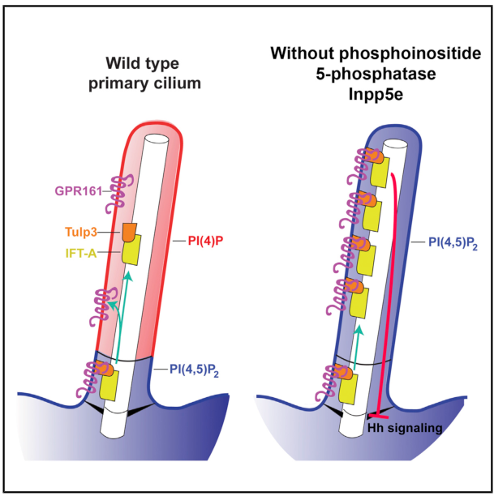

## Question

# Gene Research for Functional Annotation

## ⚠️ CRITICAL: Gene/Protein Identification Context

**BEFORE YOU BEGIN RESEARCH:** You MUST verify you are researching the CORRECT gene/protein. Gene symbols can be ambiguous, especially for less well-characterized genes from non-model organisms.

### Target Gene/Protein Identity (from UniProt):
- **UniProt Accession:** Q9NRR6
- **Protein Description:** RecName: Full=Phosphatidylinositol polyphosphate 5-phosphatase type IV {ECO:0000305}; AltName: Full=72 kDa inositol polyphosphate 5-phosphatase; AltName: Full=Inositol polyphosphate-5-phosphatase E {ECO:0000303|PubMed:19668216}; AltName: Full=Phosphatidylinositol 4,5-bisphosphate 5-phosphatase {ECO:0000305}; EC=3.1.3.36 {ECO:0000269|PubMed:10764818, ECO:0000269|PubMed:19668216}; AltName: Full=Phosphatidylinositol-3,4,5-trisphosphate 5-phosphatase {ECO:0000305}; EC=3.1.3.86 {ECO:0000269|PubMed:10764818}; Flags: Precursor;
- **Gene Information:** Name=INPP5E;
- **Organism (full):** Homo sapiens (Human).
- **Protein Family:** Belongs to the inositol 1,4,5-trisphosphate 5-phosphatase
- **Key Domains:** Endo/exonu/phosph_ase_sf. (IPR036691); INPP5E. (IPR042478); IPPc. (IPR000300); Exo_endo_phos2 (PF22669)

### MANDATORY VERIFICATION STEPS:

1. **Check if the gene symbol "INPP5E" matches the protein description above**
2. **Verify the organism is correct:** Homo sapiens (Human).
3. **Check if protein family/domains align with what you find in literature**
4. **If you find literature for a DIFFERENT gene with the same or similar symbol, STOP**

### If Gene Symbol is Ambiguous or You Cannot Find Relevant Literature:

**DO NOT PROCEED WITH RESEARCH ON A DIFFERENT GENE.** Instead:
- State clearly: "The gene symbol 'INPP5E' is ambiguous or literature is limited for this specific protein"
- Explain what you found (e.g., "Found extensive literature on a different gene with the same symbol in a different organism")
- Describe the protein based ONLY on the UniProt information provided above
- Suggest that the protein function can be inferred from domain/family information

### Research Target:

Please provide a comprehensive research report on the gene **INPP5E** (gene ID: INPP5E, UniProt: Q9NRR6) in human.

The research report should be a detailed narrative explaining the function, biological processes, and localization of the gene product. Citations should be given for all claims.

You should prioritize authoritative reviews and primary scientific literature when conducting research. You can supplement
this with annotations you find in gene/protein databases, but these can be outdated or inaccurate.

We are specifically interested in the primary function of the gene - for enzymes, what reaction is catalyzed, and what is the substrate specificity? For transporters, what is the substrate? For structural proteins or adapters, what is the broader structural role? For signaling molecules, what is the role in the pathway.

We are interested in where in or outside the cell the gene product carries out its function.

We are also interested in the signaling or biochemical pathways in which the gene functions. We are less interested in broad pleiotropic effects, except where these elucidate the precise role.

Include evidence where possible. We are interested in both experimental evidence as well as inference from structure, evolution, or bioinformatic analysis. Precise studies should be prioritized over high-throughput, where available.

## Output

Question: You are an expert researcher providing comprehensive, well-cited information.

Provide detailed information focusing on:
1. Key concepts and definitions with current understanding
2. Recent developments and latest research (prioritize 2023-2024 sources)
3. Current applications and real-world implementations
4. Expert opinions and analysis from authoritative sources
5. Relevant statistics and data from recent studies

Format as a comprehensive research report with proper citations. Include URLs and publication dates where available.
Always prioritize recent, authoritative sources and provide specific citations for all major claims.

# Gene Research for Functional Annotation

## ⚠️ CRITICAL: Gene/Protein Identification Context

**BEFORE YOU BEGIN RESEARCH:** You MUST verify you are researching the CORRECT gene/protein. Gene symbols can be ambiguous, especially for less well-characterized genes from non-model organisms.

### Target Gene/Protein Identity (from UniProt):
- **UniProt Accession:** Q9NRR6
- **Protein Description:** RecName: Full=Phosphatidylinositol polyphosphate 5-phosphatase type IV {ECO:0000305}; AltName: Full=72 kDa inositol polyphosphate 5-phosphatase; AltName: Full=Inositol polyphosphate-5-phosphatase E {ECO:0000303|PubMed:19668216}; AltName: Full=Phosphatidylinositol 4,5-bisphosphate 5-phosphatase {ECO:0000305}; EC=3.1.3.36 {ECO:0000269|PubMed:10764818, ECO:0000269|PubMed:19668216}; AltName: Full=Phosphatidylinositol-3,4,5-trisphosphate 5-phosphatase {ECO:0000305}; EC=3.1.3.86 {ECO:0000269|PubMed:10764818}; Flags: Precursor;
- **Gene Information:** Name=INPP5E;
- **Organism (full):** Homo sapiens (Human).
- **Protein Family:** Belongs to the inositol 1,4,5-trisphosphate 5-phosphatase
- **Key Domains:** Endo/exonu/phosph_ase_sf. (IPR036691); INPP5E. (IPR042478); IPPc. (IPR000300); Exo_endo_phos2 (PF22669)

### MANDATORY VERIFICATION STEPS:

1. **Check if the gene symbol "INPP5E" matches the protein description above**
2. **Verify the organism is correct:** Homo sapiens (Human).
3. **Check if protein family/domains align with what you find in literature**
4. **If you find literature for a DIFFERENT gene with the same or similar symbol, STOP**

### If Gene Symbol is Ambiguous or You Cannot Find Relevant Literature:

**DO NOT PROCEED WITH RESEARCH ON A DIFFERENT GENE.** Instead:
- State clearly: "The gene symbol 'INPP5E' is ambiguous or literature is limited for this specific protein"
- Explain what you found (e.g., "Found extensive literature on a different gene with the same symbol in a different organism")
- Describe the protein based ONLY on the UniProt information provided above
- Suggest that the protein function can be inferred from domain/family information

### Research Target:

Please provide a comprehensive research report on the gene **INPP5E** (gene ID: INPP5E, UniProt: Q9NRR6) in human.

The research report should be a detailed narrative explaining the function, biological processes, and localization of the gene product. Citations should be given for all claims.

You should prioritize authoritative reviews and primary scientific literature when conducting research. You can supplement
this with annotations you find in gene/protein databases, but these can be outdated or inaccurate.

We are specifically interested in the primary function of the gene - for enzymes, what reaction is catalyzed, and what is the substrate specificity? For transporters, what is the substrate? For structural proteins or adapters, what is the broader structural role? For signaling molecules, what is the role in the pathway.

We are interested in where in or outside the cell the gene product carries out its function.

We are also interested in the signaling or biochemical pathways in which the gene functions. We are less interested in broad pleiotropic effects, except where these elucidate the precise role.

Include evidence where possible. We are interested in both experimental evidence as well as inference from structure, evolution, or bioinformatic analysis. Precise studies should be prioritized over high-throughput, where available.

# Human INPP5E: functional annotation research report

**Identity and scope.** The requested human protein, **INPP5E (UniProt Q9NRR6)**, is the enzyme also called *pharbin* or the *type IV/72-kDa inositol polyphosphate 5-phosphatase*. The human INPP5E literature matches the supplied name and organism; it is not literature on the related phosphatases OCRL, INPP5B, or SHIP. Its central phosphatase domain agrees with the supplied inositol 5-phosphatase-family and IPPc-domain annotations. Structural analysis describes a folded catalytic region extending approximately from residues 282–623, although the narrower InterPro catalytic signature covers residues 297–599. The protein also has an N-terminal proline-rich region and a C-terminal prenylation motif. Q9NRR6 is the accession supplied for this report, rather than an accession independently established by the papers. (cillerosrodriguez2022multipleciliarylocalization pages 1-3, cillerosrodriguez2022multipleciliarylocalization pages 3-5, davies2023phosphoinositidesinnew pages 14-16)

## Primary molecular function and substrate specificity

INPP5E removes the phosphate at **position 5 of the inositol headgroup of membrane phosphoinositides**. Its most clearly established ciliary reaction is **PI(4,5)P₂ → PI(4)P + inorganic phosphate**: independent cell studies found that losing INPP5E raises PI(4,5)P₂ and depletes PI(4)P along the ciliary membrane. It can also catalyze **PI(3,4,5)P₃ → PI(3,4)P₂**; genetic and catalytic-rescue experiments implicate this substrate, together with PI(4,5)P₂, at the ciliary transition zone. In neuronal lysosomes, experimental evidence supports a third reaction, **PI(3,5)P₂ → PI(3)P**. These are *different membrane contexts*, not evidence that all three lipids are equally important substrates in every cell. (chavez2015modulationofciliary pages 1-3, garciagonzalo2015phosphoinositidesregulateciliary pages 1-2, hasegawa2016autophagosome–lysosomefusionin pages 1-2, dyson2017inpp5eregulatesphosphoinositidedependent pages 1-2)

The following table separates each reaction from the cellular evidence supporting it. (chavez2015modulationofciliary pages 1-3, garciagonzalo2015phosphoinositidesregulateciliary pages 1-2, hasegawa2016autophagosome–lysosomefusionin pages 1-2, dyson2017inpp5eregulatesphosphoinositidedependent pages 1-2)

| Substrate and membrane compartment | 5-dephosphorylation product | Supporting experiments | Confidence and qualification |
|---|---|---|---|
| **PI(4,5)P₂ — ciliary shaft membrane** | **PI4P** | Loss of *Inpp5e* increased ciliary PI(4,5)P₂ and depleted PI4P; it also recruited TULP3 and GPR161 and impaired Hedgehog signaling. Garcia-Gonzalo *et al.* (2015), [DOI](https://doi.org/10.1016/j.devcel.2015.08.001); Chávez *et al.* (2015), [DOI](https://doi.org/10.1016/j.devcel.2015.06.016). (chavez2015modulationofciliary pages 1-3, garciagonzalo2015phosphoinositidesregulateciliary pages 1-2, garciagonzalo2015phosphoinositidesregulateciliary media cc14b083) | **Strong.** Independent mammalian-cell studies connect INPP5E loss to reciprocal changes in substrate and product within cilia and to pathway consequences. This establishes a principal ciliary reaction but not a quantitative ranking against other substrates in vivo. |
| **PI(3,4,5)P₃ — transition-zone and growth-factor-signaling membranes** | **PI(3,4)P₂** | In *Inpp5e*-null mouse cells, PI(3,4,5)P₃ and PI(4,5)P₂ accumulated at the ciliary transition zone after Hedgehog stimulation; wild-type—but not phosphatase-dead—INPP5E restored transition-zone organization and ciliary Smoothened. Purified or immunoprecipitated INPP5E also dephosphorylates PIP₃. Dyson *et al.* (2017), [DOI](https://doi.org/10.1083/jcb.201511055). (martinmorales2026inpp5einteractomereveals pages 7-11, dyson2017inpp5eregulatesphosphoinositidedependent pages 1-2) | **Strong biochemically; moderate-to-strong for the transition-zone context.** Genetic rescue supports dependence on catalytic activity, while earlier enzyme assays establish the reaction. The relative contribution of this reaction versus PI(4,5)P₂ hydrolysis varies by cell state and assay and is not quantitatively settled in vivo. |
| **PI(3,5)P₂ — neuronal lysosomal membrane** | **PI3P** | A lysosomal fraction of INPP5E lowered PI(3,5)P₂; membrane anchoring and phosphatase activity were required for cortactin-dependent lysosomal actin stabilization and autophagosome–lysosome fusion. Hasegawa *et al.* (2016), [DOI](https://doi.org/10.15252/embj.201593148). (hakeem2025regulationofinpp5e pages 6-7, hasegawa2016autophagosome–lysosomefusionin pages 1-2) | **Context-specific.** Strong cellular evidence supports this reaction in neuronal lysosomes, but it should not be generalized as the dominant substrate in all tissues or compartments. Published cell-free assays have disagreed over PI(3,5)P₂ specificity. (rudge2016phosphatidylinositolphosphatephosphataseactivities pages 22-24) |

*Table: Experimentally supported lipid 5-dephosphorylation reactions of human or mammalian INPP5E, organized by cellular membrane context. Qualifications distinguish established compartment-specific functions from unresolved substrate-ranking questions.*

**Specificity qualification.** Cell-free reports disagree over whether PI(4,5)P₂ and PI(3,5)P₂ are substrates under particular assay conditions, and over whether soluble Ins(1,4,5)P₃ or Ins(1,3,4,5)P₄ is hydrolyzed. Consequently, the name *inositol polyphosphate 5-phosphatase* should **not** be interpreted as proof that soluble inositol phosphates are principal physiological substrates. Compartment-resolved lipid changes, knockout phenotypes, and rescue by catalytically active—but not phosphatase-dead—INPP5E make the phosphoinositide-lipid annotation substantially stronger. No defensible universal *in-vivo* ranking of its three lipid substrates emerges from these studies. (dyson2017inpp5eregulatesphosphoinositidedependent pages 1-2, rudge2016phosphatidylinositolphosphatephosphataseactivities pages 22-24)

## Where INPP5E acts

**Primary cilium.** INPP5E is enriched along the membrane-associated ciliary shaft surrounding the axoneme in quiescent mammalian cells; it also regulates phosphoinositides at the **transition zone**, the gate at the ciliary base. These are complementary spatial observations, not competing claims that the protein acts only at one position. Proliferating cells can instead show Golgi-associated INPP5E. The ciliary membrane is continuous with the cell surface but is a biochemically distinct membrane compartment; INPP5E acts on its intracellular, lipid-headgroup-facing side rather than as a secreted extracellular enzyme. (billcliff2014inositollipidphosphatases pages 7-8, dyson2017inpp5eregulatesphosphoinositidedependent pages 1-2, cillerosrodriguez2022multipleciliarylocalization pages 3-5, jacoby2009inpp5emutationscause pages 1-2)

**Targeting mechanism.** The C-terminal **CaaX** motif is farnesylated. PDE6D binds prenylated INPP5E for trafficking, and ciliary ARL3-dependent release permits membrane association; ARL13B, TULP3, and other ciliary factors contribute to targeting or retention. A human-protein mutagenesis and structure-based study identified four cooperating localization features: **LLxPIR, W383, FDRxLYL, and CaaX**. The FDRxLYL sequence folds onto the catalytic-domain surface, explaining why an intact folded domain is important for localization independently of catalytic chemistry. CaaX is important but **not absolutely required for all ciliary entry**: another signal partly compensates for its removal. This mechanistic mapping was available as a **2022 bioRxiv preprint**, so its finer-grained four-signal model warrants that qualification. (cillerosrodriguez2022multipleciliarylocalization pages 1-3, cillerosrodriguez2022multipleciliarylocalization pages 3-5, cillerosrodriguez2022multipleciliarylocalization pages 5-8)

**Other experimentally implicated membranes.** A fraction of neuronal INPP5E resides on lysosomes, where its membrane anchoring and catalytic activity support autophagosome–lysosome fusion. Golgi localization has been reported, especially in proliferating cells. These sites should not be conflated with its best-characterized ciliary action. (billcliff2014inositollipidphosphatases pages 7-8, hasegawa2016autophagosome–lysosomefusionin pages 1-2)

## Pathways and directly tested mechanisms

**Ciliary lipid identity and Hedgehog signaling.** In normal cilia, PI(4)P predominates along the shaft whereas PI(4,5)P₂ is largely confined to the proximal/base membrane. INPP5E loss spreads PI(4,5)P₂ into the cilium, promoting recruitment of the PI(4,5)P₂-binding adaptor **TULP3** and its cargo **GPR161**, a Hedgehog inhibitor. In neural stem cells, this change was accompanied by increased cAMP and reduced *Gli1* response. Lowering TULP3 in INPP5E-deficient cells reduced ciliary GPR161 and restored Hedgehog signaling, giving evidence for the *lipid → adaptor → receptor → pathway* mechanism rather than merely correlated localization. These findings were established in two independent **2015 Developmental Cell** reports: [Chávez et al., 10 August 2015](https://doi.org/10.1016/j.devcel.2015.06.016) and [Garcia-Gonzalo et al., 24 August 2015](https://doi.org/10.1016/j.devcel.2015.08.001). Their published graphical abstract depicts the contrasting lipid distributions and TULP3–GPR161 consequence. (chavez2015modulationofciliary pages 1-3, garciagonzalo2015phosphoinositidesregulateciliary pages 1-2, garciagonzalo2015phosphoinositidesregulateciliary media cc14b083)

A complementary mouse-cell study found that, following Hedgehog stimulation, **PI(4,5)P₂ and PI(3,4,5)P₃ accumulated at the transition zone** without INPP5E; transition-zone scaffold recruitment and ciliary Smoothened decreased. Wild-type INPP5E, but not a catalytic-dead mutant, restored transition-zone organization and Smoothened accumulation. Constitutive Smoothened activation also rescued some developmental phenotypes in mutant mice. This provides direct evidence that phosphatase activity helps maintain a ciliary signaling gate; it does not establish that every developmental consequence uses the identical downstream mechanism. [Dyson et al., published online 20 December 2016; journal issue January 2017](https://doi.org/10.1083/jcb.201511055). (dyson2017inpp5eregulatesphosphoinositidedependent pages 1-2, davies2023phosphoinositidesinnew pages 14-16)

**Growth-factor signaling and cilium maintenance.** Mouse embryonic fibroblasts lacking *Inpp5e* initially formed primary cilia: approximately **70%** of serum-starved control and mutant cells were ciliated. The defect was instability of *existing* cilia after growth-factor/serum stimulation. PI3K inhibition or interference with ciliary PDGFRα signaling restored stability. Thus, “required for ciliogenesis” is too broad as a universal description: the phenotype depends on cell type and stimulus. [Jacoby et al., September 2009](https://doi.org/10.1038/ng.427). In kidney-specific mouse deletion, increased PI3K–AKT–mTORC1 signaling accompanied cystic disease; an mTORC1 inhibitor improved renal morphology and function **without restoring cilia number or length**, separating a downstream disease mechanism from cilium assembly itself. [Hakim et al., 7 April 2016 online](https://doi.org/10.1093/hmg/ddw097). (hakim2016inpp5esuppressespolycystic pages 1-2, jacoby2009inpp5emutationscause pages 1-2)

**Lysosomal autophagy.** In neuronal cells, INPP5E depletion impaired *fusion* of autophagosomes with lysosomes. The study linked lysosomal PI(3,5)P₂ reduction to cortactin-associated stabilization of lysosomal actin needed for fusion; membrane anchoring and phosphatase activity were required. This is a experimentally supported **extraciliary** role, not an inference from the ciliary Hedgehog pathway. [Hasegawa et al., September 2016](https://doi.org/10.15252/embj.201593148). (hasegawa2016autophagosome–lysosomefusionin pages 1-2)

**Sensory-cilium application.** In mature mouse olfactory neurons, conditional *Inpp5e* deletion extended PI(4,5)P₂ along olfactory cilia and altered odor-response adaptation; adenoviral replacement restored lipid localization and response kinetics. This is a functional **animal proof of principle**, not an established treatment for human INPP5E disease. [Ukhanov et al., *Journal of Cell Science*, 2022](https://doi.org/10.1242/jcs.258364). (ukhanov2022inpp5econtrolsciliary pages 1-2)

## Human disease evidence and developments in 2023–2024

Biallelic pathogenic **INPP5E** variants cause a spectrum of ciliopathies, most prominently **Joubert syndrome**, and can also cause **MORM syndrome** or apparently isolated retinal degeneration. Joubert syndrome typically involves the characteristic brain MRI *molar-tooth sign*, with variable retinal and renal involvement; these clinical outcomes are consequences of disrupted ciliary function, **not** separate biochemical activities of the enzyme. Catalytic-domain variants commonly reduce phosphatase function, whereas the human MORM truncation removes the CaaX-containing tail and disrupts normal distribution along the cilium. In the original transfection study, wild-type protein was uniformly distributed along the axoneme in **more than 80%** of scored cells; the MORM protein was uniform in **16%** and concentrated at one ciliary extremity in **84%**. Importantly, that particular truncated protein retained measured 5-phosphatase activity: defective targeting should not be equated with complete catalytic inactivation. [Jacoby et al., September 2009](https://doi.org/10.1038/ng.427). (davies2023phosphoinositidesinnew pages 14-16, jacoby2009inpp5emutationscause pages 4-5, jacoby2009inpp5emutationscause pages 4-4)

**2024 human functional diagnostics.** Whiting and colleagues examined **two** patients with non-syndromic retinitis pigmentosa: one carried **p.Q506\*/p.A283T** in trans, and the other was homozygous **p.P358L**. Automated analysis of patient-derived dermal fibroblasts found **shorter cilia and loss of ciliary INPP5E localization in both patients**; the assay also evaluated ciliation and intraflagellar-transport features. This illustrates a real-world research/diagnostic use of ciliary phenotyping to interpret rare variants, rather than a validated therapy or a population-wide risk estimate. [*European Journal of Human Genetics*, published online 28 May 2024](https://doi.org/10.1038/s41431-024-01627-6). (whiting2024utilizationofautomated pages 1-2)

**2024 photoreceptor experiment.** A **2024 bioRxiv preprint** used rod-specific developmental and inducible adult mouse knockouts to test whether INPP5E is needed after photoreceptor outer segments form. In both models mutant outer segments were **approximately half the control length**; dark-stained, newly forming basal discs were observed in **approximately 75% of control cells** but almost never in mutant cells. Rhodopsin mislocalized, and rod electroretinogram responses declined. The work supports a continuing role in outer-segment disc renewal and protein trafficking, but its 2024 version was **not peer reviewed** and its mouse observations are not direct measurements in human photoreceptors. [Gupta et al., preprint posted 28 August 2024](https://doi.org/10.1101/2024.08.27.609873). (gupta2024inpp5eiscritical pages 1-4, gupta2024inpp5eiscritical pages 4-7)

**2024 pathway context, not an INPP5E-specific discovery.** A [*Nature Communications* study published August 2024](https://doi.org/10.1038/s41467-024-51354-1) located basal PI(3,4,5)P₃ production by PI3Kβ at the ciliary transition zone and found that stimulated PI3Kα/β signaling contributes to cilium disassembly through a network involving PDK1, PKCι, CEP170, and KIF2A. Because the cited experiments did **not** directly manipulate INPP5E, this work clarifies the upstream lipid-producing pathway but cannot by itself prove that INPP5E directly controls each of those downstream disassembly steps. The [2023 review by Davies, Mitchell, and Stenmark](https://doi.org/10.1101/cshperspect.a041406) provides an authoritative synthesis of the ciliary phosphoinositide and trafficking evidence. (conduit2024aclassi pages 11-12, conduit2024aclassi pages 4-5, davies2023phosphoinositidesinnew pages 14-16)

## Functional-annotation conclusion and limitations

**Best-supported primary annotation:** human INPP5E is a membrane-associated **phosphoinositide 5-phosphatase** that maintains a **PI(4)P-rich, PI(4,5)P₂-poor ciliary shaft** and regulates phosphoinositides at the **ciliary transition zone**. By setting those local lipid concentrations, it controls TULP3/GPR161-dependent Hedgehog inhibition, Smoothened access, and context-dependent growth-factor signaling and cilium stability. A separate, supported neuronal lysosomal role uses PI(3,5)P₂ turnover to enable autophagosome–lysosome fusion. The principal remaining uncertainties concern **relative substrate flux in living human tissues**, disputed activity toward **soluble** inositol phosphates, and how strongly each extraciliary function contributes to particular patient phenotypes. Experimental mouse and cell results should not be presented as measured human catalytic rates or clinical treatment efficacy. (chavez2015modulationofciliary pages 1-3, garciagonzalo2015phosphoinositidesregulateciliary pages 1-2, hasegawa2016autophagosome–lysosomefusionin pages 1-2, dyson2017inpp5eregulatesphosphoinositidedependent pages 1-2, whiting2024utilizationofautomated pages 1-2, rudge2016phosphatidylinositolphosphatephosphataseactivities pages 22-24)

References

1. (cillerosrodriguez2022multipleciliarylocalization pages 1-3): Dario Cilleros-Rodriguez, Raquel Martin-Morales, Pablo Barbeito, Abhijit Deb Roy, Abdelhalim Loukil, Belen Sierra-Rodero, Gonzalo Herranz, Olatz Pampliega, Modesto Redrejo-Rodriguez, Sarah C. Goetz, Manuel Izquierdo, Takanari Inoue, and Francesc R. Garcia-Gonzalo. Multiple ciliary localization signals control inpp5e ciliary targeting. BioRxiv, Jan 2022. URL: https://doi.org/10.1101/2022.01.25.477585, doi:10.1101/2022.01.25.477585. This article has 26 citations.

2. (cillerosrodriguez2022multipleciliarylocalization pages 3-5): Dario Cilleros-Rodriguez, Raquel Martin-Morales, Pablo Barbeito, Abhijit Deb Roy, Abdelhalim Loukil, Belen Sierra-Rodero, Gonzalo Herranz, Olatz Pampliega, Modesto Redrejo-Rodriguez, Sarah C. Goetz, Manuel Izquierdo, Takanari Inoue, and Francesc R. Garcia-Gonzalo. Multiple ciliary localization signals control inpp5e ciliary targeting. BioRxiv, Jan 2022. URL: https://doi.org/10.1101/2022.01.25.477585, doi:10.1101/2022.01.25.477585. This article has 26 citations.

3. (davies2023phosphoinositidesinnew pages 14-16): Elizabeth Michele Davies, Christina Anne Mitchell, and Harald Alfred Stenmark. Phosphoinositides in new spaces. Cold Spring Harbor perspectives in biology, 15:a041406, Jul 2023. URL: https://doi.org/10.1101/cshperspect.a041406, doi:10.1101/cshperspect.a041406. This article has 12 citations and is from a peer-reviewed journal.

4. (chavez2015modulationofciliary pages 1-3): Marcelo Chávez, Sabrina Ena, Jacqueline Van Sande, Alban de Kerchove d’Exaerde, Stéphane Schurmans, and Serge N. Schiffmann. Modulation of ciliary phosphoinositide content regulates trafficking and sonic hedgehog signaling output. Developmental cell, 34 3:338-50, Aug 2015. URL: https://doi.org/10.1016/j.devcel.2015.06.016, doi:10.1016/j.devcel.2015.06.016. This article has 335 citations and is from a highest quality peer-reviewed journal.

5. (garciagonzalo2015phosphoinositidesregulateciliary pages 1-2): Francesc R. Garcia-Gonzalo, Siew Cheng Phua, Elle C. Roberson, Galo Garcia, Monika Abedin, Stéphane Schurmans, Takanari Inoue, and Jeremy F. Reiter. Phosphoinositides regulate ciliary protein trafficking to modulate hedgehog signaling. Developmental cell, 34 4:400-409, Aug 2015. URL: https://doi.org/10.1016/j.devcel.2015.08.001, doi:10.1016/j.devcel.2015.08.001. This article has 387 citations and is from a highest quality peer-reviewed journal.

6. (hasegawa2016autophagosome–lysosomefusionin pages 1-2): Junya Hasegawa, Ryo Iwamoto, Takanobu Otomo, Akiko Nezu, Maho Hamasaki, and Tamotsu Yoshimori. Autophagosome–lysosome fusion in neurons requires inpp5e, a protein associated with joubert syndrome. The EMBO Journal, 35:1853-1867, Sep 2016. URL: https://doi.org/10.15252/embj.201593148, doi:10.15252/embj.201593148. This article has 167 citations.

7. (dyson2017inpp5eregulatesphosphoinositidedependent pages 1-2): Jennifer M. Dyson, Sarah E. Conduit, Sandra J. Feeney, Sandra Hakim, Tia DiTommaso, Alex J. Fulcher, Absorn Sriratana, Georg Ramm, Kristy A. Horan, Rajendra Gurung, Carol Wicking, Ian Smyth, and Christina A. Mitchell. Inpp5e regulates phosphoinositide-dependent cilia transition zone function. The Journal of Cell Biology, 216:247-263, Jan 2017. URL: https://doi.org/10.1083/jcb.201511055, doi:10.1083/jcb.201511055. This article has 142 citations.

8. (garciagonzalo2015phosphoinositidesregulateciliary media cc14b083): Francesc R. Garcia-Gonzalo, Siew Cheng Phua, Elle C. Roberson, Galo Garcia, Monika Abedin, Stéphane Schurmans, Takanari Inoue, and Jeremy F. Reiter. Phosphoinositides regulate ciliary protein trafficking to modulate hedgehog signaling. Developmental cell, 34 4:400-409, Aug 2015. URL: https://doi.org/10.1016/j.devcel.2015.08.001, doi:10.1016/j.devcel.2015.08.001. This article has 387 citations and is from a highest quality peer-reviewed journal.

9. (martinmorales2026inpp5einteractomereveals pages 7-11): Raquel Martin-Morales, Pablo Barbeito, Belén Sierra-Rodero, Lucia Jimenez, Maria Schrøder Holm, Darío Cilleros-Rodríguez, Lena K. Ebert, Matilde Cortabarría, Lotte B. Pedersen, Jose L. Badano, Florencia Irigoín, Bernhard Schermer, Wolfgang Link, Søren T. Christensen, and Francesc R. Garcia-Gonzalo. Inpp5e interactome reveals novel connections to growth factor signaling. bioRxiv, Feb 2026. URL: https://doi.org/10.64898/2026.02.13.705725, doi:10.64898/2026.02.13.705725. This article has 0 citations.

10. (hakeem2025regulationofinpp5e pages 6-7): Abdulaziz Hakeem and Shuying Yang. Regulation of inpp5e in ciliogenesis, development, and disease. International Journal of Biological Sciences, 21:579-594, Jan 2025. URL: https://doi.org/10.7150/ijbs.99010, doi:10.7150/ijbs.99010. This article has 6 citations and is from a peer-reviewed journal.

11. (rudge2016phosphatidylinositolphosphatephosphataseactivities pages 22-24): Simon A. Rudge and Michael J.O. Wakelam. Phosphatidylinositolphosphate phosphatase activities and cancer. Journal of Lipid Research, 57:176-192, Feb 2016. URL: https://doi.org/10.1194/jlr.r059154, doi:10.1194/jlr.r059154. This article has 30 citations and is from a peer-reviewed journal.

12. (billcliff2014inositollipidphosphatases pages 7-8): Peter G. Billcliff and Martin Lowe. Inositol lipid phosphatases in membrane trafficking and human disease. The Biochemical journal, 461 2:159-75, Jul 2014. URL: https://doi.org/10.1042/bj20140361, doi:10.1042/bj20140361. This article has 97 citations.

13. (jacoby2009inpp5emutationscause pages 1-2): Monique Jacoby, James J Cox, Stéphanie Gayral, Daniel J Hampshire, Mohammed Ayub, Marianne Blockmans, Eileen Pernot, Marina V Kisseleva, Philippe Compère, Serge N Schiffmann, Fanni Gergely, John H Riley, David Pérez-Morga, C Geoffrey Woods, and Stéphane Schurmans. Inpp5e mutations cause primary cilium signaling defects, ciliary instability and ciliopathies in human and mouse. Nature Genetics, 41:1027-1031, Sep 2009. URL: https://doi.org/10.1038/ng.427, doi:10.1038/ng.427. This article has 415 citations and is from a highest quality peer-reviewed journal.

14. (cillerosrodriguez2022multipleciliarylocalization pages 5-8): Dario Cilleros-Rodriguez, Raquel Martin-Morales, Pablo Barbeito, Abhijit Deb Roy, Abdelhalim Loukil, Belen Sierra-Rodero, Gonzalo Herranz, Olatz Pampliega, Modesto Redrejo-Rodriguez, Sarah C. Goetz, Manuel Izquierdo, Takanari Inoue, and Francesc R. Garcia-Gonzalo. Multiple ciliary localization signals control inpp5e ciliary targeting. BioRxiv, Jan 2022. URL: https://doi.org/10.1101/2022.01.25.477585, doi:10.1101/2022.01.25.477585. This article has 26 citations.

15. (hakim2016inpp5esuppressespolycystic pages 1-2): Sandra Hakim, Jennifer M. Dyson, Sandra J. Feeney, Elizabeth M. Davies, Absorn Sriratana, Monica N. Koenig, Olga V. Plotnikova, Ian M. Smyth, Sharon D. Ricardo, Robin M. Hobbs, and Christina A. Mitchell. Inpp5e suppresses polycystic kidney disease via inhibition of pi3k/akt-dependent mtorc1 signaling. Human molecular genetics, 25 11:2295-2313, Apr 2016. URL: https://doi.org/10.1093/hmg/ddw097, doi:10.1093/hmg/ddw097. This article has 65 citations and is from a domain leading peer-reviewed journal.

16. (ukhanov2022inpp5econtrolsciliary pages 1-2): Kirill Ukhanov, Cedric Uytingco, Warren Green, Lian Zhang, Stephane Schurmans, and Jeffrey R. Martens. Inpp5e controls ciliary localization of phospholipids and the odor response in olfactory sensory neurons. Journal of cell science, May 2022. URL: https://doi.org/10.1242/jcs.258364, doi:10.1242/jcs.258364. This article has 23 citations and is from a domain leading peer-reviewed journal.

17. (jacoby2009inpp5emutationscause pages 4-5): Monique Jacoby, James J Cox, Stéphanie Gayral, Daniel J Hampshire, Mohammed Ayub, Marianne Blockmans, Eileen Pernot, Marina V Kisseleva, Philippe Compère, Serge N Schiffmann, Fanni Gergely, John H Riley, David Pérez-Morga, C Geoffrey Woods, and Stéphane Schurmans. Inpp5e mutations cause primary cilium signaling defects, ciliary instability and ciliopathies in human and mouse. Nature Genetics, 41:1027-1031, Sep 2009. URL: https://doi.org/10.1038/ng.427, doi:10.1038/ng.427. This article has 415 citations and is from a highest quality peer-reviewed journal.

18. (jacoby2009inpp5emutationscause pages 4-4): Monique Jacoby, James J Cox, Stéphanie Gayral, Daniel J Hampshire, Mohammed Ayub, Marianne Blockmans, Eileen Pernot, Marina V Kisseleva, Philippe Compère, Serge N Schiffmann, Fanni Gergely, John H Riley, David Pérez-Morga, C Geoffrey Woods, and Stéphane Schurmans. Inpp5e mutations cause primary cilium signaling defects, ciliary instability and ciliopathies in human and mouse. Nature Genetics, 41:1027-1031, Sep 2009. URL: https://doi.org/10.1038/ng.427, doi:10.1038/ng.427. This article has 415 citations and is from a highest quality peer-reviewed journal.

19. (whiting2024utilizationofautomated pages 1-2): Kae R. Whiting, Lonneke Haer-Wigman, Ralph J. Florijn, Ronald van Beek, Machteld M. Oud, Astrid S. Plomp, Camiel J. F. Boon, Hester Y. Kroes, and Ronald Roepman. Utilization of automated cilia analysis to characterize novel inpp5e variants in patients with non-syndromic retinitis pigmentosa. European Journal of Human Genetics, 32:1412-1418, May 2024. URL: https://doi.org/10.1038/s41431-024-01627-6, doi:10.1038/s41431-024-01627-6. This article has 6 citations and is from a domain leading peer-reviewed journal.

20. (gupta2024inpp5eiscritical pages 1-4): Mohona Gupta, Tylor R. Lewis, Michael W. Stuck, William J. Spencer, Natalia V. Klementieva, Vadim Y. Arshavsky, and Gregory J. Pazour. Inpp5e is critical for photoreceptor outer segment maintenance. bioRxiv, Nov 2024. URL: https://doi.org/10.1101/2024.08.27.609873, doi:10.1101/2024.08.27.609873. This article has 1 citations.

21. (gupta2024inpp5eiscritical pages 4-7): Mohona Gupta, Tylor R. Lewis, Michael W. Stuck, William J. Spencer, Natalia V. Klementieva, Vadim Y. Arshavsky, and Gregory J. Pazour. Inpp5e is critical for photoreceptor outer segment maintenance. bioRxiv, Nov 2024. URL: https://doi.org/10.1101/2024.08.27.609873, doi:10.1101/2024.08.27.609873. This article has 1 citations.

22. (conduit2024aclassi pages 11-12): Sarah E. Conduit, Wayne Pearce, Amandeep Bhamra, Benoit Bilanges, Laura Bozal-Basterra, Lazaros C. Foukas, Mathias Cobbaut, Sandra D. Castillo, Mohammad Amin Danesh, Mahreen Adil, Arkaitz Carracedo, Mariona Graupera, Neil Q. McDonald, Peter J. Parker, Pedro R. Cutillas, Silvia Surinova, and Bart Vanhaesebroeck. A class i pi3k signalling network regulates primary cilia disassembly in normal physiology and disease. Nature Communications, Aug 2024. URL: https://doi.org/10.1038/s41467-024-51354-1, doi:10.1038/s41467-024-51354-1. This article has 17 citations and is from a highest quality peer-reviewed journal.

23. (conduit2024aclassi pages 4-5): Sarah E. Conduit, Wayne Pearce, Amandeep Bhamra, Benoit Bilanges, Laura Bozal-Basterra, Lazaros C. Foukas, Mathias Cobbaut, Sandra D. Castillo, Mohammad Amin Danesh, Mahreen Adil, Arkaitz Carracedo, Mariona Graupera, Neil Q. McDonald, Peter J. Parker, Pedro R. Cutillas, Silvia Surinova, and Bart Vanhaesebroeck. A class i pi3k signalling network regulates primary cilia disassembly in normal physiology and disease. Nature Communications, Aug 2024. URL: https://doi.org/10.1038/s41467-024-51354-1, doi:10.1038/s41467-024-51354-1. This article has 17 citations and is from a highest quality peer-reviewed journal.

## Artifacts

- [Edison artifact artifact-00](INPP5E-deep-research-falcon_artifacts/artifact-00.md)

## Citations

1. rudge2016phosphatidylinositolphosphatephosphataseactivities pages 22-24
2. whiting2024utilizationofautomated pages 1-2
3. cillerosrodriguez2022multipleciliarylocalization pages 1-3
4. cillerosrodriguez2022multipleciliarylocalization pages 3-5
5. davies2023phosphoinositidesinnew pages 14-16
6. chavez2015modulationofciliary pages 1-3
7. garciagonzalo2015phosphoinositidesregulateciliary pages 1-2
8. billcliff2014inositollipidphosphatases pages 7-8
9. cillerosrodriguez2022multipleciliarylocalization pages 5-8
10. conduit2024aclassi pages 11-12
11. conduit2024aclassi pages 4-5
12. DOI
13. Chávez et al., 10 August 2015
14. Garcia-Gonzalo et al., 24 August 2015
15. Dyson et al., published online 20 December 2016; journal issue January 2017
16. Jacoby et al., September 2009
17. Hakim et al., 7 April 2016 online
18. Hasegawa et al., September 2016
19. Ukhanov et al., *Journal of Cell Science*, 2022
20. *European Journal of Human Genetics*, published online 28 May 2024
21. Gupta et al., preprint posted 28 August 2024
22. *Nature Communications* study published August 2024
23. 2023 review by Davies, Mitchell, and Stenmark
24. https://doi.org/10.1016/j.devcel.2015.08.001
25. https://doi.org/10.1016/j.devcel.2015.06.016
26. https://doi.org/10.1083/jcb.201511055
27. https://doi.org/10.15252/embj.201593148
28. https://doi.org/10.1038/ng.427
29. https://doi.org/10.1093/hmg/ddw097
30. https://doi.org/10.1242/jcs.258364
31. https://doi.org/10.1038/s41431-024-01627-6
32. https://doi.org/10.1101/2024.08.27.609873
33. https://doi.org/10.1038/s41467-024-51354-1
34. https://doi.org/10.1101/cshperspect.a041406
35. https://doi.org/10.1101/2022.01.25.477585,
36. https://doi.org/10.1101/cshperspect.a041406,
37. https://doi.org/10.1016/j.devcel.2015.06.016,
38. https://doi.org/10.1016/j.devcel.2015.08.001,
39. https://doi.org/10.15252/embj.201593148,
40. https://doi.org/10.1083/jcb.201511055,
41. https://doi.org/10.64898/2026.02.13.705725,
42. https://doi.org/10.7150/ijbs.99010,
43. https://doi.org/10.1194/jlr.r059154,
44. https://doi.org/10.1042/bj20140361,
45. https://doi.org/10.1038/ng.427,
46. https://doi.org/10.1093/hmg/ddw097,
47. https://doi.org/10.1242/jcs.258364,
48. https://doi.org/10.1038/s41431-024-01627-6,
49. https://doi.org/10.1101/2024.08.27.609873,
50. https://doi.org/10.1038/s41467-024-51354-1,