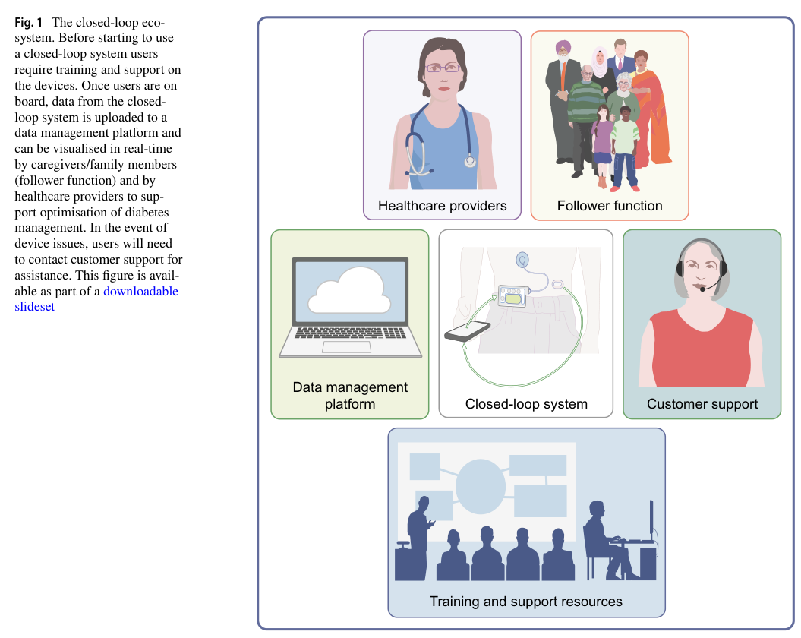

## Question

# Gene Research for Functional Annotation

## ⚠️ CRITICAL: Gene/Protein Identification Context

**BEFORE YOU BEGIN RESEARCH:** You MUST verify you are researching the CORRECT gene/protein. Gene symbols can be ambiguous, especially for less well-characterized genes from non-model organisms.

### Target Gene/Protein Identity (from UniProt):
- **UniProt Accession:** P01308
- **Protein Description:** RecName: Full=Insulin; Contains: RecName: Full=Insulin B chain; Contains: RecName: Full=Insulin A chain; Flags: Precursor;
- **Gene Information:** Name=INS;
- **Organism (full):** Homo sapiens (Human).
- **Protein Family:** Belongs to the insulin family. .
- **Key Domains:** Insulin. (IPR004825); Insulin-like. (IPR016179); Insulin-like_sf. (IPR036438); Insulin_CS. (IPR022353); Insulin_family. (IPR022352)

### MANDATORY VERIFICATION STEPS:

1. **Check if the gene symbol "INS" matches the protein description above**
2. **Verify the organism is correct:** Homo sapiens (Human).
3. **Check if protein family/domains align with what you find in literature**
4. **If you find literature for a DIFFERENT gene with the same or similar symbol, STOP**

### If Gene Symbol is Ambiguous or You Cannot Find Relevant Literature:

**DO NOT PROCEED WITH RESEARCH ON A DIFFERENT GENE.** Instead:
- State clearly: "The gene symbol 'INS' is ambiguous or literature is limited for this specific protein"
- Explain what you found (e.g., "Found extensive literature on a different gene with the same symbol in a different organism")
- Describe the protein based ONLY on the UniProt information provided above
- Suggest that the protein function can be inferred from domain/family information

### Research Target:

Please provide a comprehensive research report on the gene **INS** (gene ID: INS, UniProt: P01308) in human.

The research report should be a detailed narrative explaining the function, biological processes, and localization of the gene product. Citations should be given for all claims.

You should prioritize authoritative reviews and primary scientific literature when conducting research. You can supplement
this with annotations you find in gene/protein databases, but these can be outdated or inaccurate.

We are specifically interested in the primary function of the gene - for enzymes, what reaction is catalyzed, and what is the substrate specificity? For transporters, what is the substrate? For structural proteins or adapters, what is the broader structural role? For signaling molecules, what is the role in the pathway.

We are interested in where in or outside the cell the gene product carries out its function.

We are also interested in the signaling or biochemical pathways in which the gene functions. We are less interested in broad pleiotropic effects, except where these elucidate the precise role.

Include evidence where possible. We are interested in both experimental evidence as well as inference from structure, evolution, or bioinformatic analysis. Precise studies should be prioritized over high-throughput, where available.

## Output

Question: You are an expert researcher providing comprehensive, well-cited information.

Provide detailed information focusing on:
1. Key concepts and definitions with current understanding
2. Recent developments and latest research (prioritize 2023-2024 sources)
3. Current applications and real-world implementations
4. Expert opinions and analysis from authoritative sources
5. Relevant statistics and data from recent studies

Format as a comprehensive research report with proper citations. Include URLs and publication dates where available.
Always prioritize recent, authoritative sources and provide specific citations for all major claims.

# Gene Research for Functional Annotation

## ⚠️ CRITICAL: Gene/Protein Identification Context

**BEFORE YOU BEGIN RESEARCH:** You MUST verify you are researching the CORRECT gene/protein. Gene symbols can be ambiguous, especially for less well-characterized genes from non-model organisms.

### Target Gene/Protein Identity (from UniProt):
- **UniProt Accession:** P01308
- **Protein Description:** RecName: Full=Insulin; Contains: RecName: Full=Insulin B chain; Contains: RecName: Full=Insulin A chain; Flags: Precursor;
- **Gene Information:** Name=INS;
- **Organism (full):** Homo sapiens (Human).
- **Protein Family:** Belongs to the insulin family. .
- **Key Domains:** Insulin. (IPR004825); Insulin-like. (IPR016179); Insulin-like_sf. (IPR036438); Insulin_CS. (IPR022353); Insulin_family. (IPR022352)

### MANDATORY VERIFICATION STEPS:

1. **Check if the gene symbol "INS" matches the protein description above**
2. **Verify the organism is correct:** Homo sapiens (Human).
3. **Check if protein family/domains align with what you find in literature**
4. **If you find literature for a DIFFERENT gene with the same or similar symbol, STOP**

### If Gene Symbol is Ambiguous or You Cannot Find Relevant Literature:

**DO NOT PROCEED WITH RESEARCH ON A DIFFERENT GENE.** Instead:
- State clearly: "The gene symbol 'INS' is ambiguous or literature is limited for this specific protein"
- Explain what you found (e.g., "Found extensive literature on a different gene with the same symbol in a different organism")
- Describe the protein based ONLY on the UniProt information provided above
- Suggest that the protein function can be inferred from domain/family information

### Research Target:

Please provide a comprehensive research report on the gene **INS** (gene ID: INS, UniProt: P01308) in human.

The research report should be a detailed narrative explaining the function, biological processes, and localization of the gene product. Citations should be given for all claims.

You should prioritize authoritative reviews and primary scientific literature when conducting research. You can supplement
this with annotations you find in gene/protein databases, but these can be outdated or inaccurate.

We are specifically interested in the primary function of the gene - for enzymes, what reaction is catalyzed, and what is the substrate specificity? For transporters, what is the substrate? For structural proteins or adapters, what is the broader structural role? For signaling molecules, what is the role in the pathway.

We are interested in where in or outside the cell the gene product carries out its function.

We are also interested in the signaling or biochemical pathways in which the gene functions. We are less interested in broad pleiotropic effects, except where these elucidate the precise role.

Include evidence where possible. We are interested in both experimental evidence as well as inference from structure, evolution, or bioinformatic analysis. Precise studies should be prioritized over high-throughput, where available.

## Research Report: Human INS (UniProt P01308) — Functional Annotation, Biology, and Applications (focus on 2023–2024)

### 0) Identity verification (critical disambiguation)
The target is **human insulin** encoded by **INS** (UniProt **P01308**) and synthesized as **preproinsulin**, a secreted peptide hormone precursor that is proteolytically processed to the mature **insulin A and B chains** plus **C-peptide**. Multiple sources explicitly describe the canonical preproinsulin organization (signal peptide + B chain + C-peptide + A chain), ER targeting/processing, granule storage, and regulated secretion in pancreatic β-cells, matching the UniProt description and insulin-family context. (urbaniak2025molecularpuzzleof pages 3-6, urbaniak2025molecularpuzzleof pages 2-3, ayan2023abriefatlas pages 2-3)

### 1) Key concepts and definitions (current understanding)

#### 1.1 INS gene product and maturation pathway
**INS encodes preproinsulin**, a single-chain precursor that enters the **regulated secretory pathway**. After co-translational targeting to the rough ER, the signal peptide is removed to generate **proinsulin**, which folds in the ER and forms **three disulfide bonds**. Proinsulin then traffics through the Golgi and is packaged into **secretory granules**, where endoproteolytic processing yields mature insulin and C-peptide. (urbaniak2025molecularpuzzleof pages 2-3, ayan2023abriefatlas pages 2-3, szablewski2024changesincells pages 2-4)

A key definitional distinction:
- **Preproinsulin**: signal peptide-containing translation product targeted to the ER. (urbaniak2025molecularpuzzleof pages 2-3, ayan2023abriefatlas pages 2-3)
- **Proinsulin**: ER-luminal folding intermediate; precursor that contains B chain, C-peptide, and A chain. (ayan2023abriefatlas pages 2-3, szablewski2024changesincells pages 2-4)
- **Mature insulin**: disulfide-linked **A and B chains**; stored in granules (often as zinc-stabilized hexamers) and secreted upon stimulation. (ayan2023abriefatlas pages 2-3, urbaniak2025molecularpuzzleof pages 7-8)

**Processing enzymes (canonical):** prohormone convertases **PC1/3** and **PC2** cleave junctions flanking the C-peptide, and **carboxypeptidase E (CPE)** trims basic residues to yield mature insulin and C-peptide. (prefontaine2024investigatingtherelationship pages 8-13, szablewski2024changesincells pages 2-4, urbaniak2025molecularpuzzleof pages 7-8)

#### 1.2 Subcellular localization of INS function
The INS product is primarily synthesized and matured across multiple compartments:
- **Rough ER/ER lumen:** signal peptide cleavage, oxidative folding, disulfide bond formation, quality control. (urbaniak2025molecularpuzzleof pages 2-3, rohli2024ametabolicredox pages 1-2)
- **Golgi/TGN:** trafficking and packaging into immature secretory granules. (ayan2023abriefatlas pages 2-3, urbaniak2025molecularpuzzleof pages 7-8)
- **Immature/maturing secretory granules:** proteolytic conversion of proinsulin → insulin + C-peptide; granule acidification/condensation and storage. (szablewski2024changesincells pages 2-4, urbaniak2025molecularpuzzleof pages 7-8)
- **Plasma membrane/extracellular:** Ca2+-triggered exocytosis releases insulin to circulation; insulin acts as a ligand for the insulin receptor in peripheral tissues. (szablewski2024changesincells pages 2-4, sakaguchi2024theroleof pages 1-3)

#### 1.3 Glucose-stimulated insulin secretion (GSIS) and biphasic release
A core concept is **biphasic insulin secretion**:
- **Triggering (first) phase:** glucose metabolism increases ATP, closes KATP channels, depolarizes the β-cell, opens voltage-gated Ca2+ channels, and triggers exocytosis of a readily releasable granule pool. (dalle2024receptorsandsignaling pages 2-4, aamodt2023peelingtheonion pages 1-2)
- **Amplifying (second) phase:** sustained secretion driven by metabolic coupling factors and cytoskeletal/granule mobilization processes; involves actin remodeling and small GTPases. (szablewski2024changesincells pages 2-4, dalle2024receptorsandsignaling pages 2-4)

#### 1.4 Downstream signaling: insulin receptor pathway
Insulin acts mainly by binding **INSR**, which autophosphorylates and recruits adaptor proteins (IRS, Shc), bifurcating into:
- **PI3K→PIP3→AKT** (metabolic branch): GLUT4 translocation, glycogen synthesis regulation via GSK3, mTOR-mediated protein synthesis, and transcriptional programs (e.g., FOXO regulation). (sakaguchi2024theroleof pages 1-3, szablewski2024changesincells pages 4-6, caturano2024insulin–heartaxisbridging pages 2-3)
- **RAS→RAF→MEK→ERK (MAPK)** (mitogenic branch): growth/proliferation and gene-expression programs. (sakaguchi2024theroleof pages 1-3, szablewski2024changesincells pages 4-6)

### 2) Recent developments and latest research (prioritizing 2023–2024)

#### 2.1 Metabolism–redox coupling in ER proinsulin export (2024)
A major mechanistic advance is the explicit coupling of **cellular metabolism to ER redox homeostasis**, which in turn governs **proinsulin export** and **insulin granule biogenesis**. Rohli et al. (JCI Insight, **2024-06**, https://doi.org/10.1172/jci.insight.178725) report that ER hyperoxidation delays proinsulin export; mitochondrial metabolism supplies reductive donors (e.g., NADPH/thioredoxin flux) that buffer ER redox to support proinsulin trafficking and granule formation. The study notes the folding challenge: a substantial fraction of proinsulin is misfolded and degraded even physiologically, making ER redox control central to insulin biogenesis. (rohli2024ametabolicredox pages 1-2)

#### 2.2 ER calcium homeostasis and proinsulin processing (2024)
Evans-Molina (Diabetes, **2024-03**, https://doi.org/10.2337/dbi23-0030) summarizes mechanistic work linking **SERCA2/ER calcium** to **prohormone convertase maturation**, ER→Golgi trafficking, and proinsulin processing; SERCA2 deficiency elevates proinsulin-to-insulin ratios and disrupts convertase activity/localization, implicating ER calcium as an upstream regulator of insulin maturation and secretory competence. (evansmolina2024theailingβcell pages 4-5, evansmolina2024theailingβcell pages 1-2)

#### 2.3 Translational reprogramming in chronic hyperglycemia (“glucose toxicity”) (2024)
Cheruiyot et al. (JCI, **2024-11**, https://doi.org/10.1172/jci173280) report that **sustained hyperglycemia** suppresses translation of not only insulin but also mRNAs required for **secretory granule formation, exocytosis, and metabolism-coupled secretion**, before global translation suppression and prior to ER stress. This identifies a targeted translational circuit contributing to β-cell secretory failure under chronic high glucose. (cheruiyot2024sustainedhyperglycemiaspecifically pages 1-2)

#### 2.4 Phase separation/condensation and granule biogenesis (2023)
Toledo et al. (Protein Science, **2023-05**, https://doi.org/10.1002/pro.4649) provide biophysical evidence that proinsulin/insulin can form condensates with the ICA512 RESP18 homology domain, supporting the idea that **condensation/phase separation** in early secretory compartments may contribute to **secretory granule biogenesis**, while requiring ER chaperoning to prevent premature condensation that would interfere with correct folding. (toledo2023condensationofthe pages 1-2)

### 3) Current applications and real-world implementations

#### 3.1 Therapeutic insulin and insulin analogs
Clinical insulin therapy uses engineered formulations spanning **rapid/ultra-rapid** prandial analogs and **long-acting** basal analogs. ADA Standards of Care (Diabetes Care, **2024-12**, https://doi.org/10.2337/dc24-s009) describe that rapid-acting analogs and ultra-rapid formulations improve postprandial control versus regular human insulin, and basal analogs such as **U-300 glargine** and **degludec** may reduce hypoglycemia risk versus U-100 glargine. (elsayed20249.pharmacologicapproaches pages 1-2)

#### 3.2 Diabetes technology: CGM, pumps (CSII), and automated insulin delivery (AID)
The 2024 ADA Standards define diabetes technology to include CGM, insulin pumps, AID (closed-loop) systems, and connected pens, emphasizing that benefit requires education and support; consistent CGM access is important, as interruptions are associated with worsening outcomes, and backup blood glucose monitoring should be maintained. (Diabetes Care, **2024-12**, https://doi.org/10.2337/dc24-s007) (elsayed20247.diabetestechnology pages 1-2, elsayed20247.diabetestechnology pages 1-1)

**Automated insulin delivery (AID) as real-world implementation:**
- AID/closed-loop systems are increasingly used in routine care for type 1 diabetes, and are expanding to other indications. (boughton2024theroleof pages 1-2, kadiyala2024closedloopsystemsrecent pages 1-2)
- AID systems consist of **CGM + algorithm + pump**, modulating insulin delivery every 5–10 minutes; current commercial systems are **hybrid** (need meal input). (kadiyala2024closedloopsystemsrecent pages 1-2)

A key implementation theme from expert reviews is that outcomes depend on both device performance and the broader **“ecosystem”**: training, support, data-sharing, clinic resources, and connectivity reliability. (boughton2024theroleof pages 1-2)

### 4) Expert opinions and authoritative analyses (2023–2024)

#### 4.1 Technology guidance and clinical standards (ADA & ISPAD, 2024)
- ADA Standards (2024) position **early CGM initiation (even at diagnosis)** as standard-of-care for most people with type 1 diabetes, and highlight clinician competency/training needs due to device complexity. (elsayed20249.pharmacologicapproaches pages 1-2, elsayed20247.diabetestechnology pages 1-1)
- ISPAD 2024 guidelines (Hormone Research in Paediatrics, **2024-12**, https://doi.org/10.1159/000543034) recommend pump therapy for youth regardless of age or baseline HbA1c, emphasize infusion-set failure/DKA risk, and explicitly discuss disparities in access and reimbursement as implementation bottlenecks. (biester2024ispadclinicalpractice pages 2-3)

#### 4.2 Closed-loop expert review perspective (2024)
Boughton & Hovorka (Diabetologia, **2024-05**, https://doi.org/10.1007/s00125-024-06165-w) emphasize that real-world outcomes generally mirror trial results, but scaling AID requires addressing the full device-support ecosystem (training, customer support, data systems) and access inequities. (boughton2024theroleof pages 1-2)

### 5) Recent quantitative statistics and data points (from 2023–2024 sources)

#### 5.1 Glycemic target attainment remains low (implementation gap)
- Registry data in a 2024 closed-loop review report that only **26%** of people with type 1 diabetes met **HbA1c <7%** in **2021–2022**, underscoring persistent unmet need. (kadiyala2024closedloopsystemsrecent pages 1-2)
- A 2024 pilot-system dissertation-style source cites Type 1 Diabetes Exchange registry (n=22,697; 2016–2018) target attainment of **17% (youth)** and **21% (adults)** meeting HbA1c targets. (odabassian2024pilotoutpatientassessment pages 22-26)

#### 5.2 Quantitative benefits of AID/closed-loop systems
- A 2024 Expert Review of Medical Devices paper reports RCT/real-world improvements in **time-in-range (70–180 mg/dL)** of approximately **+6 to +28 percentage points**, with HbA1c reductions of approximately **0.1 to 1.4 percentage points** (range depends on population/comparator). (kadiyala2024closedloopsystemsrecent pages 1-2)
- A 2024 Diabetologia review reports meta-analyses showing hybrid closed-loop improves time-in-range by approximately **+8 to +12 percentage points**, reduces hyperglycemia and mean glucose, and does not increase (and may reduce) hypoglycemia. (boughton2024theroleof pages 1-2)

#### 5.3 CGM target metrics used in practice
A 2024 source summarizes widely used CGM targets: **TIR >70% (3.9–10.0 mmol/L)**, **time <3.9 mmol/L <4%**, and **time <3.0 mmol/L <1%**. (odabassian2024pilotoutpatientassessment pages 22-26)

#### 5.4 Quantitative biomarker changes reflecting β-cell function/stress (2023 trial)
In SURPASS-1 (Journal of the Endocrine Society, **2023-03**, https://doi.org/10.1210/jendso/bvad056), tirzepatide monotherapy at 40 weeks reduced fasting **proinsulin by ~49%** and reduced **proinsulin/C-peptide ratio by ~46–49%** vs ~0% change with placebo, consistent with reduced β-cell stress and improved processing. (lee2023tirzepatideasmonotherapy pages 5-6, lee2023tirzepatideasmonotherapy pages 3-4)

### Visual evidence: AID/closed-loop ecosystem
The figure below provides a schematic of the **closed-loop ecosystem** (sensor → algorithm → pump, plus supporting data/training/healthcare infrastructure), reflecting how real-world performance depends on the combined system.
(boughton2024theroleof media 294504cd)

### Summary tables (artifacts)
The following tables consolidate the functional annotation and pathway context.

| Process/Function | Key molecular steps | Key molecules/enzymes | Subcellular localization | Evidence/source (short cite with year) |
|---|---|---|---|---|
| Preproinsulin synthesis and ER targeting | INS is translated as a 110-aa preproinsulin; N-terminal signal peptide directs cotranslational translocation into ER, where signal peptide is cleaved to form proinsulin | Signal peptide, SRP/translocon, signal peptidase | Rough ER / ER lumen of pancreatic β-cells | Ayan 2023; Urbaniak 2025 (ayan2023abriefatlas pages 2-3, urbaniak2025molecularpuzzleof pages 2-3) |
| Proinsulin folding and disulfide bond formation | Proinsulin folds in ER and forms three essential disulfide bonds; misfolded molecules are retained/degraded, linking folding efficiency to insulin output | PDI, ER oxidoreductases, chaperones (e.g., BiP/GRP78, GRP94) | ER lumen | Urbaniak 2025; Rohli 2024 (urbaniak2025molecularpuzzleof pages 3-6, rohli2024ametabolicredox pages 1-2) |
| Metabolic support for proinsulin export | Mitochondrial metabolism supplies reductive power needed to maintain ER redox; ER hyperoxidation delays proinsulin export and reduces granule biogenesis | NADPH, thioredoxin system, mitochondrial metabolism, ERO1/PDI network | ER linked to mitochondrial metabolic pathways | Rohli 2024 (rohli2024ametabolicredox pages 1-2) |
| ER stress and trafficking control | Chronic ER Ca2+ defects impair convertase maturation, proinsulin trafficking, and increase proinsulin/insulin ratio; altered ER→Golgi trafficking contributes to β-cell dysfunction | SERCA2, PC1/3, PC2, ER Ca2+ handling machinery | ER, cis-Golgi, intermediate secretory compartments | Evans-Molina 2024 (evansmolina2024theailingβcell pages 1-2, evansmolina2024theailingβcell pages 4-5) |
| Golgi trafficking and granule maturation | Folded proinsulin exits ER, traffics through Golgi/TGN, and is packaged into immature secretory granules for maturation | COPII machinery, Golgi sorting factors, Zn2+, Ca2+ | Golgi, trans-Golgi network, immature granules | Urbaniak 2025; Ayan 2023 (urbaniak2025molecularpuzzleof pages 7-8, ayan2023abriefatlas pages 2-3) |
| Proteolytic processing to mature insulin | Proinsulin is cleaved at B-chain/C-peptide and C-peptide/A-chain junctions; dibasic residues are removed to yield mature disulfide-linked insulin A and B chains plus C-peptide | PC1/3, PC2, carboxypeptidase E/CPE | Immature/maturing secretory granules | Szablewski 2024; Ayan 2023; Urbaniak 2025 (szablewski2024changesincells pages 2-4, ayan2023abriefatlas pages 2-3, urbaniak2025molecularpuzzleof pages 7-8) |
| Secretory granule condensation/biogenesis | Proinsulin has intrinsic self-condensation tendency; co-condensation with ICA512 RESP18HD may help segregate cargo and drive early secretory granule formation | Proinsulin/insulin, ICA512 RESP18HD | Early secretory pathway / nascent secretory granules | Toledo 2023 (toledo2023condensationofthe pages 1-2) |
| Glucose-stimulated insulin secretion (triggering phase) | Glucose metabolism raises ATP, closes KATP channels, depolarizes membrane, opens voltage-gated Ca2+ channels, and triggers exocytosis of readily releasable granules | GLUT1/2, glucokinase, KATP channels, VDCCs, Ca2+ | Plasma membrane, cytosol, docked insulin granules | Dalle 2024; Szablewski 2024 (dalle2024receptorsandsignaling pages 2-4, szablewski2024changesincells pages 2-4) |
| Biphasic/amplified secretion | First phase releases pre-docked granules; second phase recruits reserve granules via metabolic coupling factors and cytoskeletal remodeling | Cdc42, Rac1, NAD(P)H/NADPH, PLC/PKC, cAMP | Cortical actin network, cytoplasm, plasma membrane | Szablewski 2024; Dalle 2024 (szablewski2024changesincells pages 2-4, dalle2024receptorsandsignaling pages 2-4) |
| Translational adaptation and glucose toxicity | Acute glucose enhances translation of proinsulin and secretion-related proteins; sustained hyperglycemia selectively suppresses translation of insulin, granule biogenesis, exocytosis, and coupling-factor mRNAs before global translational collapse | Insulin mRNA 5′UTR regulatory elements, secretion-pathway mRNAs | Cytosol/ribosomes with downstream effects on ER-granule pathway | Cheruiyot 2024 (cheruiyot2024sustainedhyperglycemiaspecifically pages 1-2) |
| Endocrine signaling function after secretion | Mature insulin is released to circulation, dissociates to active monomers, binds insulin receptor, and activates metabolic and mitogenic signaling pathways | Insulin, INSR, IRS proteins, PI3K-AKT, MAPK | Extracellular space; target-cell plasma membrane and cytosol | Ayan 2023; Dalle 2024 (ayan2023abriefatlas pages 2-3, sakaguchi2024theroleof pages 1-3) |

*Table: This table summarizes the core functional annotation of human INS/insulin from biosynthesis through secretion and downstream signaling. It integrates recent mechanistic and review evidence across subcellular compartments, highlighting the molecules and enzymes most relevant to precise functional interpretation.*

| Step | Key molecules | Cellular location | Main functional outputs | Key evidence (source, year) |
|---|---|---|---|---|
| Ligand binding and receptor activation | Insulin, insulin receptor (INSR) α2β2 heterotetramer, receptor Tyr1158/Tyr1162/Tyr1163 autophosphorylation sites | Plasma membrane | Initiates insulin signaling by activating the receptor’s intrinsic tyrosine kinase and creating docking sites for adaptor proteins | Sakaguchi 2024; Szablewski 2024; Caturano 2024 (sakaguchi2024theroleof pages 1-3, szablewski2024changesincells pages 2-4, caturano2024insulin–heartaxisbridging pages 2-3) |
| Adaptor recruitment | IRS1/IRS2, Shc, PTB/PH domains, NPEpY972 receptor motif | Inner leaflet of plasma membrane / receptor-proximal cytosol | Couples activated INSR to downstream metabolic and mitogenic pathways | Sakaguchi 2024; Szablewski 2024 (sakaguchi2024theroleof pages 1-3, szablewski2024changesincells pages 2-4) |
| PI3K activation and PIP3 generation | IRS proteins, PI3K p85/p110, PIP2, PIP3 | Plasma membrane / cytosolic membrane interface | Establishes the main metabolic signaling branch and recruits PDK1/AKT machinery | Sakaguchi 2024; Szablewski 2024; Caturano 2024 (sakaguchi2024theroleof pages 1-3, szablewski2024changesincells pages 4-6, caturano2024insulin–heartaxisbridging pages 2-3) |
| AKT activation | PIP3, PDK1, AKT/PKB, mTORC2 | Plasma membrane then cytosol | Central integration node for glucose uptake, glycogen synthesis, lipogenesis, protein synthesis, and survival signaling | Sakaguchi 2024; Caturano 2024 (sakaguchi2024theroleof pages 1-3, caturano2024insulin–heartaxisbridging pages 2-3) |
| Glucose transporter trafficking | AKT, GLUT4 vesicles, atypical PKC | Cytosol to plasma membrane in muscle/adipose cells | Increases cellular glucose uptake by translocating GLUT4 to the cell surface | Szablewski 2024; Caturano 2024; Sakaguchi 2024 (szablewski2024changesincells pages 4-6, caturano2024insulin–heartaxisbridging pages 5-7, sakaguchi2024theroleof pages 1-3) |
| Glycogen synthesis control | AKT, GSK3, glycogen synthase | Cytosol | Promotes glycogen synthesis by inhibiting GSK3 and relieving inhibition of glycogen synthase | Szablewski 2024; Caturano 2024; Sakaguchi 2024 (szablewski2024changesincells pages 4-6, caturano2024insulin–heartaxisbridging pages 2-3, sakaguchi2024theroleof pages 1-3) |
| Protein synthesis and anabolic signaling | AKT, TSC2, PRAS40, Rheb, mTORC1, 4E-BP1, p70S6K | Cytosol / lysosomal-mTOR signaling compartments | Stimulates protein synthesis, cell growth, and anabolic metabolism | Caturano 2024; Sakaguchi 2024; Szablewski 2024 (caturano2024insulin–heartaxisbridging pages 2-3, sakaguchi2024theroleof pages 1-3, szablewski2024changesincells pages 4-6) |
| Transcriptional regulation of fasting/feeding programs | AKT, FOXO transcription factors, SREBPs | Cytosol and nucleus | Suppresses FOXO-driven gluconeogenic gene expression and promotes lipogenic/anabolic gene programs during feeding | Sakaguchi 2024; Szablewski 2024 (sakaguchi2024theroleof pages 1-3, szablewski2024changesincells pages 4-6) |
| MAPK mitogenic branch | Shc, Grb2, SOS, Ras, Raf, MEK, ERK/MAPK | Plasma membrane to cytosol to nucleus | Drives growth, proliferation, differentiation, and gene-expression responses distinct from the core metabolic branch | Sakaguchi 2024; Szablewski 2024; Caturano 2024 (sakaguchi2024theroleof pages 1-3, szablewski2024changesincells pages 4-6, caturano2024insulin–heartaxisbridging pages 5-7) |
| Tissue-level physiological outputs | INSR-B (metabolic isoform), PI3K-AKT branch, MAPK branch, eNOS/NO in heart | Whole-body target tissues including liver, muscle, adipose tissue, and heart | Coordinates glucose disposal, reduced hepatic gluconeogenesis, glycogen and lipid storage, protein anabolism, and in cardiomyocytes supports substrate utilization and survival signaling | Szablewski 2024; Caturano 2024 (szablewski2024changesincells pages 4-6, caturano2024insulin–heartaxisbridging pages 2-3) |
| Negative feedback / insulin resistance nodes | Serine-phosphorylated IRS, reduced INSR content/activity, mTORC1-GRB10 feedback | Plasma membrane and cytosol | Weakens IRS–PI3K coupling, blunts GLUT4 translocation and glycogen synthesis, and contributes to insulin resistance | Caturano 2024; Szablewski 2024 (caturano2024insulin–heartaxisbridging pages 5-7, szablewski2024changesincells pages 6-7) |

*Table: This table summarizes the major steps of insulin receptor signaling downstream of INS-encoded insulin, linking key molecules and cellular locations to metabolic and mitogenic outputs. It is useful for functional annotation because it connects secreted insulin to its principal target-cell mechanisms and physiological effects.*

### Conclusions (functional annotation synthesis)
Human **INS (P01308)** encodes a secreted peptide hormone precursor whose primary function is to produce **mature insulin** (A/B chains) that is stored in dense-core secretory granules and released in a **glucose- and Ca2+-regulated** manner from β-cells to maintain systemic metabolic homeostasis. Its biosynthesis is tightly coupled to ER folding capacity, redox state, ER Ca2+ homeostasis, and secretory trafficking; recent 2023–2024 work clarifies how metabolism-driven redox buffering, chronic hyperglycemia-induced translational programs, and cargo condensation mechanisms can regulate or impair insulin production and secretion. (ayan2023abriefatlas pages 2-3, szablewski2024changesincells pages 2-4, rohli2024ametabolicredox pages 1-2, evansmolina2024theailingβcell pages 4-5, cheruiyot2024sustainedhyperglycemiaspecifically pages 1-2, toledo2023condensationofthe pages 1-2)

### URLs and publication dates for key 2023–2024 sources cited
- Ayan & Demirci. *Current Diabetes Reviews* (2023-06). https://doi.org/10.2174/1573399819666220610150342 (ayan2023abriefatlas pages 2-3)
- Aamodt & Powers. *J Clin Invest* (2023-04). https://doi.org/10.1172/jci169718 (aamodt2023peelingtheonion pages 1-2)
- Toledo et al. *Protein Science* (2023-05). https://doi.org/10.1002/pro.4649 (toledo2023condensationofthe pages 1-2)
- Lee et al. *J Endocrine Society* (2023-03). https://doi.org/10.1210/jendso/bvad056 (lee2023tirzepatideasmonotherapy pages 5-6)
- Szablewski. *Int J Mol Sci* (2024-02). https://doi.org/10.3390/ijms25042397 (szablewski2024changesincells pages 2-4)
- Dalle & Abderrahmani. *Cells* (2024-07). https://doi.org/10.3390/cells13151244 (dalle2024receptorsandsignaling pages 2-4)
- Sakaguchi. *Endocrine Journal* (2024-07). https://doi.org/10.1507/endocrj.ej24-0205 (sakaguchi2024theroleof pages 1-3)
- Caturano et al. *Int J Mol Sci* (2024-07). https://doi.org/10.3390/ijms25158369 (caturano2024insulin–heartaxisbridging pages 2-3)
- Evans-Molina. *Diabetes* (2024-03). https://doi.org/10.2337/dbi23-0030 (evansmolina2024theailingβcell pages 4-5)
- Rohli et al. *JCI Insight* (2024-06). https://doi.org/10.1172/jci.insight.178725 (rohli2024ametabolicredox pages 1-2)
- Cheruiyot et al. *J Clin Invest* (2024-11). https://doi.org/10.1172/jci173280 (cheruiyot2024sustainedhyperglycemiaspecifically pages 1-2)
- Boughton & Hovorka. *Diabetologia* (2024-05). https://doi.org/10.1007/s00125-024-06165-w (boughton2024theroleof pages 1-2)
- Kadiyala et al. *Expert Rev Med Devices* (2024-10). https://doi.org/10.1080/17434440.2024.2406901 (kadiyala2024closedloopsystemsrecent pages 1-2)
- ADA Standards: Diabetes Technology. *Diabetes Care* (2024-12). https://doi.org/10.2337/dc24-s007 (elsayed20247.diabetestechnology pages 1-1)
- ADA Standards: Pharmacologic Approaches. *Diabetes Care* (2024-12). https://doi.org/10.2337/dc24-s009 (elsayed20249.pharmacologicapproaches pages 1-2)
- ISPAD Guidelines: Insulin Delivery. *Hormone Research in Paediatrics* (2024-12). https://doi.org/10.1159/000543034 (biester2024ispadclinicalpractice pages 2-3)

References

1. (urbaniak2025molecularpuzzleof pages 3-6): Edyta Urbaniak, Sara Henry, Maciej Lalowski, and Malgorzata Borowiak. Molecular puzzle of insulin: structural assembly pathways and their role in diabetes. Frontiers in Cell and Developmental Biology, Feb 2025. URL: https://doi.org/10.3389/fcell.2025.1502469, doi:10.3389/fcell.2025.1502469. This article has 4 citations.

2. (urbaniak2025molecularpuzzleof pages 2-3): Edyta Urbaniak, Sara Henry, Maciej Lalowski, and Malgorzata Borowiak. Molecular puzzle of insulin: structural assembly pathways and their role in diabetes. Frontiers in Cell and Developmental Biology, Feb 2025. URL: https://doi.org/10.3389/fcell.2025.1502469, doi:10.3389/fcell.2025.1502469. This article has 4 citations.

3. (ayan2023abriefatlas pages 2-3): Esra Ayan and H. Demirci. A brief atlas of insulin. Current diabetes reviews, Jun 2023. URL: https://doi.org/10.2174/1573399819666220610150342, doi:10.2174/1573399819666220610150342. This article has 18 citations.

4. (szablewski2024changesincells pages 2-4): Leszek Szablewski. Changes in cells associated with insulin resistance. International Journal of Molecular Sciences, 25:2397, Feb 2024. URL: https://doi.org/10.3390/ijms25042397, doi:10.3390/ijms25042397. This article has 76 citations.

5. (urbaniak2025molecularpuzzleof pages 7-8): Edyta Urbaniak, Sara Henry, Maciej Lalowski, and Malgorzata Borowiak. Molecular puzzle of insulin: structural assembly pathways and their role in diabetes. Frontiers in Cell and Developmental Biology, Feb 2025. URL: https://doi.org/10.3389/fcell.2025.1502469, doi:10.3389/fcell.2025.1502469. This article has 4 citations.

6. (prefontaine2024investigatingtherelationship pages 8-13): C Préfontaine. Investigating the relationship between insulin processing and senescence in β-cells. Unknown journal, 2024.

7. (rohli2024ametabolicredox pages 1-2): Kristen E. Rohli, Nicole J. Stubbe, Emily M. Walker, Gemma L. Pearson, Scott A. Soleimanpour, and Samuel B. Stephens. A metabolic redox relay supports er proinsulin export in pancreatic islet β cells. JCI Insight, Jun 2024. URL: https://doi.org/10.1172/jci.insight.178725, doi:10.1172/jci.insight.178725. This article has 14 citations and is from a domain leading peer-reviewed journal.

8. (sakaguchi2024theroleof pages 1-3): Masaji Sakaguchi. The role of insulin signaling with foxo and foxk transcription factors. Endocrine Journal, 71:939-944, Jul 2024. URL: https://doi.org/10.1507/endocrj.ej24-0205, doi:10.1507/endocrj.ej24-0205. This article has 12 citations and is from a peer-reviewed journal.

9. (dalle2024receptorsandsignaling pages 2-4): Stéphane Dalle and Amar Abderrahmani. Receptors and signaling pathways controlling beta-cell function and survival as targets for anti-diabetic therapeutic strategies. Cells, 13:1244, Jul 2024. URL: https://doi.org/10.3390/cells13151244, doi:10.3390/cells13151244. This article has 18 citations.

10. (aamodt2023peelingtheonion pages 1-2): Kristie I. Aamodt and Alvin C. Powers. Peeling the onion: another layer in the regulation of insulin secretion. The Journal of clinical investigation, Apr 2023. URL: https://doi.org/10.1172/jci169718, doi:10.1172/jci169718. This article has 3 citations.

11. (szablewski2024changesincells pages 4-6): Leszek Szablewski. Changes in cells associated with insulin resistance. International Journal of Molecular Sciences, 25:2397, Feb 2024. URL: https://doi.org/10.3390/ijms25042397, doi:10.3390/ijms25042397. This article has 76 citations.

12. (caturano2024insulin–heartaxisbridging pages 2-3): Alfredo Caturano, Raffaele Galiero, Erica Vetrano, Celestino Sardu, Luca Rinaldi, Vincenzo Russo, Marcellino Monda, Raffaele Marfella, and Ferdinando Carlo Sasso. Insulin–heart axis: bridging physiology to insulin resistance. International Journal of Molecular Sciences, 25:8369, Jul 2024. URL: https://doi.org/10.3390/ijms25158369, doi:10.3390/ijms25158369. This article has 46 citations.

13. (evansmolina2024theailingβcell pages 4-5): Carmella Evans-Molina. The ailing β-cell in diabetes: insights from a trip to the er: the 2023 outstanding scientific achievement award lecture. Diabetes, 73 4:545-553, Mar 2024. URL: https://doi.org/10.2337/dbi23-0030, doi:10.2337/dbi23-0030. This article has 8 citations and is from a highest quality peer-reviewed journal.

14. (evansmolina2024theailingβcell pages 1-2): Carmella Evans-Molina. The ailing β-cell in diabetes: insights from a trip to the er: the 2023 outstanding scientific achievement award lecture. Diabetes, 73 4:545-553, Mar 2024. URL: https://doi.org/10.2337/dbi23-0030, doi:10.2337/dbi23-0030. This article has 8 citations and is from a highest quality peer-reviewed journal.

15. (cheruiyot2024sustainedhyperglycemiaspecifically pages 1-2): Abigael Cheruiyot, Jennifer Hollister-Lock, Brooke Sullivan, Hui Pan, Jonathan M. Dreyfuss, Susan Bonner-Weir, and Jean E. Schaffer. Sustained hyperglycemia specifically targets translation of mrnas for insulin secretion. The Journal of Clinical Investigation, Nov 2024. URL: https://doi.org/10.1172/jci173280, doi:10.1172/jci173280. This article has 18 citations.

16. (toledo2023condensationofthe pages 1-2): Pamela L. Toledo, Diego S. Vazquez, Alejo R. Gianotti, Milagros B. Abate, Carolin Wegbrod, Juha M. Torkko, Michele Solimena, and Mario R. Ermácora. Condensation of the β‐cell secretory granule luminal cargoes pro/insulin and <scp>ica512 resp18</scp> homology domain. Protein Science, May 2023. URL: https://doi.org/10.1002/pro.4649, doi:10.1002/pro.4649. This article has 9 citations and is from a peer-reviewed journal.

17. (elsayed20249.pharmacologicapproaches pages 1-2): Nuha A. ElSayed, G. Aleppo, Raveendhara R. Bannuru, Dennis Bruemmer, B. Collins, Laya Ekhlaspour, Jason L. Gaglia, Marisa E. Hilliard, Eric L. Johnson, K. Khunti, Ildiko Lingvay, Glenn Matfin, Rozalina G. McCoy, M. L. Perry, Scott J. Pilla, Sarit Polsky, P. Prahalad, R. Pratley, Alissa R. Segal, J. Seley, Robert C. Stanton, and Robert A. Gabbay. 9. pharmacologic approaches to glycemic treatment: standards of care in diabetes-2024. Diabetes care, 47 Suppl 1:S158-S178, Dec 2024. URL: https://doi.org/10.2337/dc24-s009, doi:10.2337/dc24-s009. This article has 541 citations and is from a highest quality peer-reviewed journal.

18. (elsayed20247.diabetestechnology pages 1-2): Nuha A. ElSayed, G. Aleppo, Raveendhara R. Bannuru, Dennis Bruemmer, B. Collins, Laya Ekhlaspour, Marisa E. Hilliard, Eric L. Johnson, K. Khunti, Ildiko Lingvay, Glenn Matfin, Rozalina G. McCoy, M. L. Perry, Scott J. Pilla, Sarit Polsky, P. Prahalad, R. Pratley, Alissa R. Segal, J. Seley, Robert C. Stanton, and Robert A. Gabbay. 7. diabetes technology: standards of care in diabetes-2024. Diabetes care, 47 Suppl 1:S126-S144, Dec 2024. URL: https://doi.org/10.2337/dc24-s007, doi:10.2337/dc24-s007. This article has 203 citations and is from a highest quality peer-reviewed journal.

19. (elsayed20247.diabetestechnology pages 1-1): Nuha A. ElSayed, G. Aleppo, Raveendhara R. Bannuru, Dennis Bruemmer, B. Collins, Laya Ekhlaspour, Marisa E. Hilliard, Eric L. Johnson, K. Khunti, Ildiko Lingvay, Glenn Matfin, Rozalina G. McCoy, M. L. Perry, Scott J. Pilla, Sarit Polsky, P. Prahalad, R. Pratley, Alissa R. Segal, J. Seley, Robert C. Stanton, and Robert A. Gabbay. 7. diabetes technology: standards of care in diabetes-2024. Diabetes care, 47 Suppl 1:S126-S144, Dec 2024. URL: https://doi.org/10.2337/dc24-s007, doi:10.2337/dc24-s007. This article has 203 citations and is from a highest quality peer-reviewed journal.

20. (boughton2024theroleof pages 1-2): Charlotte K. Boughton and Roman Hovorka. The role of automated insulin delivery technology in diabetes. Diabetologia, 67:2034-2044, May 2024. URL: https://doi.org/10.1007/s00125-024-06165-w, doi:10.1007/s00125-024-06165-w. This article has 54 citations and is from a highest quality peer-reviewed journal.

21. (kadiyala2024closedloopsystemsrecent pages 1-2): Nithya Kadiyala, Roman Hovorka, and Charlotte K. Boughton. Closed-loop systems: recent advancements and lived experiences. Expert Review of Medical Devices, 21:927-941, Oct 2024. URL: https://doi.org/10.1080/17434440.2024.2406901, doi:10.1080/17434440.2024.2406901. This article has 22 citations and is from a peer-reviewed journal.

22. (biester2024ispadclinicalpractice pages 2-3): Torben Biester, Cari Berget, Charlotte Boughton, Laura Cudizio, Laya Ekhlaspour, Marisa E. Hilliard, Leenatha Reddy, Suzanne Sap Ngo Um, Melissa Schoelwer, Jennifer L. Sherr, and Klemen Dovc. Ispad clinical practice consensus guidelines 2024: diabetes technologies: insulin delivery. Hormone research in paediatrics, 97:1-34, Dec 2024. URL: https://doi.org/10.1159/000543034, doi:10.1159/000543034. This article has 24 citations and is from a peer-reviewed journal.

23. (odabassian2024pilotoutpatientassessment pages 22-26): M Odabassian. Pilot outpatient assessment of a fully closed-loop dual-hormone (insulin and pramlintide) artificial pancreas system. Unknown journal, 2024.

24. (lee2023tirzepatideasmonotherapy pages 5-6): Clare J Lee, Huzhang Mao, Vivian T Thieu, Laura Fernández Landó, and Melissa K Thomas. Tirzepatide as monotherapy improved markers of beta-cell function and insulin sensitivity in type 2 diabetes (surpass-1). Journal of the Endocrine Society, Mar 2023. URL: https://doi.org/10.1210/jendso/bvad056, doi:10.1210/jendso/bvad056. This article has 43 citations and is from a peer-reviewed journal.

25. (lee2023tirzepatideasmonotherapy pages 3-4): Clare J Lee, Huzhang Mao, Vivian T Thieu, Laura Fernández Landó, and Melissa K Thomas. Tirzepatide as monotherapy improved markers of beta-cell function and insulin sensitivity in type 2 diabetes (surpass-1). Journal of the Endocrine Society, Mar 2023. URL: https://doi.org/10.1210/jendso/bvad056, doi:10.1210/jendso/bvad056. This article has 43 citations and is from a peer-reviewed journal.

26. (boughton2024theroleof media 294504cd): Charlotte K. Boughton and Roman Hovorka. The role of automated insulin delivery technology in diabetes. Diabetologia, 67:2034-2044, May 2024. URL: https://doi.org/10.1007/s00125-024-06165-w, doi:10.1007/s00125-024-06165-w. This article has 54 citations and is from a highest quality peer-reviewed journal.

27. (caturano2024insulin–heartaxisbridging pages 5-7): Alfredo Caturano, Raffaele Galiero, Erica Vetrano, Celestino Sardu, Luca Rinaldi, Vincenzo Russo, Marcellino Monda, Raffaele Marfella, and Ferdinando Carlo Sasso. Insulin–heart axis: bridging physiology to insulin resistance. International Journal of Molecular Sciences, 25:8369, Jul 2024. URL: https://doi.org/10.3390/ijms25158369, doi:10.3390/ijms25158369. This article has 46 citations.

28. (szablewski2024changesincells pages 6-7): Leszek Szablewski. Changes in cells associated with insulin resistance. International Journal of Molecular Sciences, 25:2397, Feb 2024. URL: https://doi.org/10.3390/ijms25042397, doi:10.3390/ijms25042397. This article has 76 citations.

## Artifacts

- [Edison artifact artifact-00](INS-deep-research-falcon_artifacts/artifact-00.md)
- [Edison artifact artifact-01](INS-deep-research-falcon_artifacts/artifact-01.md)

## Citations

1. rohli2024ametabolicredox pages 1-2
2. cheruiyot2024sustainedhyperglycemiaspecifically pages 1-2
3. toledo2023condensationofthe pages 1-2
4. kadiyala2024closedloopsystemsrecent pages 1-2
5. boughton2024theroleof pages 1-2
6. biester2024ispadclinicalpractice pages 2-3
7. odabassian2024pilotoutpatientassessment pages 22-26
8. ayan2023abriefatlas pages 2-3
9. aamodt2023peelingtheonion pages 1-2
10. lee2023tirzepatideasmonotherapy pages 5-6
11. szablewski2024changesincells pages 2-4
12. dalle2024receptorsandsignaling pages 2-4
13. sakaguchi2024theroleof pages 1-3
14. urbaniak2025molecularpuzzleof pages 3-6
15. urbaniak2025molecularpuzzleof pages 2-3
16. urbaniak2025molecularpuzzleof pages 7-8
17. prefontaine2024investigatingtherelationship pages 8-13
18. szablewski2024changesincells pages 4-6
19. lee2023tirzepatideasmonotherapy pages 3-4
20. szablewski2024changesincells pages 6-7
21. https://doi.org/10.1172/jci.insight.178725
22. https://doi.org/10.2337/dbi23-0030
23. https://doi.org/10.1172/jci173280
24. https://doi.org/10.1002/pro.4649
25. https://doi.org/10.2337/dc24-s009
26. https://doi.org/10.2337/dc24-s007
27. https://doi.org/10.1159/000543034
28. https://doi.org/10.1007/s00125-024-06165-w
29. https://doi.org/10.1210/jendso/bvad056
30. https://doi.org/10.2174/1573399819666220610150342
31. https://doi.org/10.1172/jci169718
32. https://doi.org/10.3390/ijms25042397
33. https://doi.org/10.3390/cells13151244
34. https://doi.org/10.1507/endocrj.ej24-0205
35. https://doi.org/10.3390/ijms25158369
36. https://doi.org/10.1080/17434440.2024.2406901
37. https://doi.org/10.3389/fcell.2025.1502469,
38. https://doi.org/10.2174/1573399819666220610150342,
39. https://doi.org/10.3390/ijms25042397,
40. https://doi.org/10.1172/jci.insight.178725,
41. https://doi.org/10.1507/endocrj.ej24-0205,
42. https://doi.org/10.3390/cells13151244,
43. https://doi.org/10.1172/jci169718,
44. https://doi.org/10.3390/ijms25158369,
45. https://doi.org/10.2337/dbi23-0030,
46. https://doi.org/10.1172/jci173280,
47. https://doi.org/10.1002/pro.4649,
48. https://doi.org/10.2337/dc24-s009,
49. https://doi.org/10.2337/dc24-s007,
50. https://doi.org/10.1007/s00125-024-06165-w,
51. https://doi.org/10.1080/17434440.2024.2406901,
52. https://doi.org/10.1159/000543034,
53. https://doi.org/10.1210/jendso/bvad056,