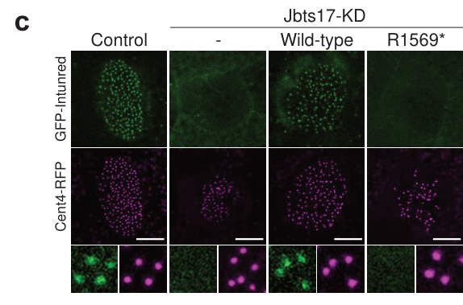

## Question

# Gene Research for Functional Annotation

## ⚠️ CRITICAL: Gene/Protein Identification Context

**BEFORE YOU BEGIN RESEARCH:** You MUST verify you are researching the CORRECT gene/protein. Gene symbols can be ambiguous, especially for less well-characterized genes from non-model organisms.

### Target Gene/Protein Identity (from UniProt):
- **UniProt Accession:** Q9ULD6
- **Protein Description:** RecName: Full=Protein inturned; AltName: Full=Inturned planar cell polarity effector homolog; AltName: Full=PDZ domain-containing protein 6;
- **Gene Information:** Name=INTU; Synonyms=KIAA1284, PDZD6, PDZK6;
- **Organism (full):** Homo sapiens (Human).
- **Protein Family:** Belongs to the inturned family. .
- **Key Domains:** CCZ1/INTU/HSP4_longin_1. (IPR043987); CCZ1/INTU/HSP4_longin_3. (IPR043989); CCZ1/INTU_longin_2. (IPR043988); INTU. (IPR039151); PDZ. (IPR001478)

### MANDATORY VERIFICATION STEPS:

1. **Check if the gene symbol "INTU" matches the protein description above**
2. **Verify the organism is correct:** Homo sapiens (Human).
3. **Check if protein family/domains align with what you find in literature**
4. **If you find literature for a DIFFERENT gene with the same or similar symbol, STOP**

### If Gene Symbol is Ambiguous or You Cannot Find Relevant Literature:

**DO NOT PROCEED WITH RESEARCH ON A DIFFERENT GENE.** Instead:
- State clearly: "The gene symbol 'INTU' is ambiguous or literature is limited for this specific protein"
- Explain what you found (e.g., "Found extensive literature on a different gene with the same symbol in a different organism")
- Describe the protein based ONLY on the UniProt information provided above
- Suggest that the protein function can be inferred from domain/family information

### Research Target:

Please provide a comprehensive research report on the gene **INTU** (gene ID: INTU, UniProt: Q9ULD6) in human.

The research report should be a detailed narrative explaining the function, biological processes, and localization of the gene product. Citations should be given for all claims.

You should prioritize authoritative reviews and primary scientific literature when conducting research. You can supplement
this with annotations you find in gene/protein databases, but these can be outdated or inaccurate.

We are specifically interested in the primary function of the gene - for enzymes, what reaction is catalyzed, and what is the substrate specificity? For transporters, what is the substrate? For structural proteins or adapters, what is the broader structural role? For signaling molecules, what is the role in the pathway.

We are interested in where in or outside the cell the gene product carries out its function.

We are also interested in the signaling or biochemical pathways in which the gene functions. We are less interested in broad pleiotropic effects, except where these elucidate the precise role.

Include evidence where possible. We are interested in both experimental evidence as well as inference from structure, evolution, or bioinformatic analysis. Precise studies should be prioritized over high-throughput, where available.

## Output

Question: You are an expert researcher providing comprehensive, well-cited information.

Provide detailed information focusing on:
1. Key concepts and definitions with current understanding
2. Recent developments and latest research (prioritize 2023-2024 sources)
3. Current applications and real-world implementations
4. Expert opinions and analysis from authoritative sources
5. Relevant statistics and data from recent studies

Format as a comprehensive research report with proper citations. Include URLs and publication dates where available.
Always prioritize recent, authoritative sources and provide specific citations for all major claims.

# Gene Research for Functional Annotation

## ⚠️ CRITICAL: Gene/Protein Identification Context

**BEFORE YOU BEGIN RESEARCH:** You MUST verify you are researching the CORRECT gene/protein. Gene symbols can be ambiguous, especially for less well-characterized genes from non-model organisms.

### Target Gene/Protein Identity (from UniProt):
- **UniProt Accession:** Q9ULD6
- **Protein Description:** RecName: Full=Protein inturned; AltName: Full=Inturned planar cell polarity effector homolog; AltName: Full=PDZ domain-containing protein 6;
- **Gene Information:** Name=INTU; Synonyms=KIAA1284, PDZD6, PDZK6;
- **Organism (full):** Homo sapiens (Human).
- **Protein Family:** Belongs to the inturned family. .
- **Key Domains:** CCZ1/INTU/HSP4_longin_1. (IPR043987); CCZ1/INTU/HSP4_longin_3. (IPR043989); CCZ1/INTU_longin_2. (IPR043988); INTU. (IPR039151); PDZ. (IPR001478)

### MANDATORY VERIFICATION STEPS:

1. **Check if the gene symbol "INTU" matches the protein description above**
2. **Verify the organism is correct:** Homo sapiens (Human).
3. **Check if protein family/domains align with what you find in literature**
4. **If you find literature for a DIFFERENT gene with the same or similar symbol, STOP**

### If Gene Symbol is Ambiguous or You Cannot Find Relevant Literature:

**DO NOT PROCEED WITH RESEARCH ON A DIFFERENT GENE.** Instead:
- State clearly: "The gene symbol 'INTU' is ambiguous or literature is limited for this specific protein"
- Explain what you found (e.g., "Found extensive literature on a different gene with the same symbol in a different organism")
- Describe the protein based ONLY on the UniProt information provided above
- Suggest that the protein function can be inferred from domain/family information

### Research Target:

Please provide a comprehensive research report on the gene **INTU** (gene ID: INTU, UniProt: Q9ULD6) in human.

The research report should be a detailed narrative explaining the function, biological processes, and localization of the gene product. Citations should be given for all claims.

You should prioritize authoritative reviews and primary scientific literature when conducting research. You can supplement
this with annotations you find in gene/protein databases, but these can be outdated or inaccurate.

We are specifically interested in the primary function of the gene - for enzymes, what reaction is catalyzed, and what is the substrate specificity? For transporters, what is the substrate? For structural proteins or adapters, what is the broader structural role? For signaling molecules, what is the role in the pathway.

We are interested in where in or outside the cell the gene product carries out its function.

We are also interested in the signaling or biochemical pathways in which the gene functions. We are less interested in broad pleiotropic effects, except where these elucidate the precise role.

Include evidence where possible. We are interested in both experimental evidence as well as inference from structure, evolution, or bioinformatic analysis. Precise studies should be prioritized over high-throughput, where available.

# Research Report: Human **INTU** (Inturned planar cell polarity effector; UniProt **Q9ULD6**)

## 1) Identity verification (mandatory)
The evidence retrieved consistently refers to **INTU** as **Inturned**, a *planar cell polarity (PCP) effector* and a core subunit of the **CPLANE** (ciliogenesis and planar polarity effector) complex, aligning with the UniProt record provided (human INTU/Q9ULD6; “Protein inturned / Inturned planar cell polarity effector homolog”). (toriyama2016theciliopathyassociatedcplane pages 7-13, toriyama2016theciliopathyassociatedcplane pages 1-5, langousis2022structureofthe pages 1-2)

Key structural/domain features reported in the primary structural literature match the UniProt-described domain logic (PDZ + longin-like regions): the reconstituted mammalian CPLANE complex includes INTU with an **N-terminal PDZ** and **multiple longin-like domains** that mediate heteromeric assembly with FUZ and binding to WDPCP. (langousis2022structureofthe pages 9-10, martinsalazar2022cplanecomplexand pages 2-4)

## 2) Key concepts and definitions (current understanding)

### 2.1 Primary cilium, basal body, and intraflagellar transport (IFT)
**Ciliogenesis** is the assembly of the primary cilium (a microtubule-based projection). **Basal bodies** (modified centrioles) nucleate the cilium, and **IFT** is the bidirectional transport system that moves structural and signaling components along the ciliary axoneme. INTU’s strongest experimental linkage is to the *recruitment and organization of IFT components at the basal body*—a precondition for productive ciliogenesis and cilia-mediated signaling. (toriyama2016theciliopathyassociatedcplane pages 7-13, toriyama2016theciliopathyassociatedcplane pages 1-5)

### 2.2 Planar cell polarity (PCP) and “PCP effector” proteins
PCP describes coordinated cell orientation across the plane of a tissue. PCP “effector” proteins (including **Inturned/INTU**) are downstream components that translate PCP cues into cytoskeletal/trafficking outcomes; evidence and synthesis in the cilia literature place INTU among PCP effectors that interface with ciliogenesis. (leggere2023discoverydrivenproteomicsprovide pages 166-169, martinsalazar2022cplanecomplexand pages 8-10)

### 2.3 The CPLANE module
**CPLANE** is a conserved genetic/protein module linking PCP effectors to ciliogenesis and ciliopathies. INTU is a *core* CPLANE component with **FUZ** and **WDPCP**, and CPLANE additionally engages **JBTS17/C5orf42** and the small GTPase **RSG1** in the basal-body compartment. (toriyama2016theciliopathyassociatedcplane pages 1-5, martinsalazar2022cplanecomplexand pages 1-2)

## 3) Molecular function of INTU (what it does)

### 3.1 Core function: basal-body recruitment of IFT machinery (ciliogenesis licensing)
A central mechanistic finding is that CPLANE proteins, including INTU, **direct basal body recruitment of intraflagellar transport machinery**. In the foundational study defining CPLANE, INTU pulldowns recovered CPLANE components (FUZ, WDPCP, JBTS17, RSG1) *and* multiple **IFT-A** proteins, supporting a role in assembling/recruiting specific IFT machinery at the ciliary base. (Toriyama et al., *Nature Genetics*, May 2016; https://doi.org/10.1038/ng.3558) (toriyama2016theciliopathyassociatedcplane pages 1-5)

Functionally, the same work provided experimental evidence that INTU participates in basal-body recruitment processes and IFT dynamics in multiciliated contexts (in vivo imaging and perturbation experiments), placing INTU upstream of normal IFT organization. (toriyama2016theciliopathyassociatedcplane pages 7-13)

### 3.2 INTU as a structural scaffold within CPLANE
Structural work reconstituting human CPLANE showed that INTU is a major architectural subunit: an **Intu–Fuz heterodimer** is embedded within a crescent-like CPLANE complex, and INTU supplies a large interface for **Wdpcp–Intu** contacts. Quantitative interface areas (e.g., Wdpcp–Intu and Intu–Fuz) were summarized in a review of CPLANE structure/function, consistent with the near-atomic structure paper. (Langousis et al., *Science Advances*, Apr 2022; https://doi.org/10.1126/sciadv.abn0832) (langousis2022structureofthe pages 9-10, martinsalazar2022cplanecomplexand pages 2-4)

### 3.3 Membrane binding and vesicle-stage ciliogenesis
The CPLANE complex exhibits **phosphoinositide binding**, with preference for **PI(3)P**, and is proposed to operate on **PI(3)P-rich vesicles** involved in early/late ciliogenesis steps (e.g., near the nascent ciliary vesicle rather than within mature axonemes). This provides a mechanistic bridge between INTU-containing complexes and trafficking/vesicle tethering at the ciliary base. (Langousis et al., *Science Advances*, Apr 2022; https://doi.org/10.1126/sciadv.abn0832) (langousis2022structureofthe pages 9-10, langousis2022structureofthe pages 1-2)

### 3.4 Enzymatic activity: INTU–FUZ as a Rab23 GEF (signaling/trafficking interface)
Beyond scaffolding, structural/biochemical evidence indicates that **INTU and FUZ have GEF activity toward Rab23**, and specific INTU substitutions (A452T, E500A) reduce this activity in vitro. This defines a direct biochemical function for INTU in small GTPase regulation, linking CPLANE to membrane trafficking and cilia-related signaling logic. (Langousis et al., *Science Advances*, Apr 2022; https://doi.org/10.1126/sciadv.abn0832) (langousis2022structureofthe pages 9-10)

## 4) Protein complexes and interaction partners

### 4.1 Core CPLANE binding partners
Proteomics and reciprocal pulldown/co-IP approaches identified robust associations placing INTU in a core CPLANE complex with:
- **FUZ**
- **WDPCP**
- **JBTS17/C5orf42**
- **RSG1**
These interactions were recovered from tandem affinity purifications using LAP-Intu and supported by reciprocal approaches. (Toriyama et al., *Nature Genetics*, May 2016; https://doi.org/10.1038/ng.3558) (toriyama2016theciliopathyassociatedcplane pages 1-5)

### 4.2 Linkage to IFT-A machinery
INTU-associated purifications included multiple **IFT-A** proteins (examples described in the CPLANE interactome), supporting a role in recruiting/assembling an IFT-A subset at basal bodies. (toriyama2016theciliopathyassociatedcplane pages 1-5)

## 5) Subcellular localization (where INTU acts)

### 5.1 Basal body localization (direct imaging)
In multiciliated cells, **GFP-Inturned localizes to basal bodies**, providing direct evidence that INTU acts at the ciliary base. (Toriyama et al., *Nature Genetics*, May 2016; Supp. Fig. 4c) (toriyama2016theciliopathyassociatedcplane media ad83121c, toriyama2016theciliopathyassociatedcplane media bbc6b4c6)

Moreover, **JBTS17 knockdown affects basal-body GFP-Inturned intensity**, supporting a functional interaction at the basal body compartment. (toriyama2016theciliopathyassociatedcplane pages 7-13)

### 5.2 Vesicle-associated function near the ciliary base
Consistent with PI(3)P preference (an endosomal/vesicular lipid marker) and genetic arrest phenotypes at vesicle-related ciliogenesis stages, CPLANE/INTU is proposed to operate on vesicular structures proximal to the ciliary base (rather than as a component moving along the axoneme). (langousis2022structureofthe pages 9-10)

## 6) Pathways and biological processes

### 6.1 Ciliogenesis and IFT-mediated trafficking
INTU is strongly implicated in **ciliogenesis** through basal-body recruitment/organization of IFT machinery (notably IFT-A subset effects), explaining why INTU disruption produces classic ciliopathy phenotypes. (toriyama2016theciliopathyassociatedcplane pages 7-13, toriyama2016theciliopathyassociatedcplane pages 1-5)

### 6.2 PCP–cilium crosstalk
INTU is a PCP effector that also regulates ciliogenesis, illustrating mechanistic coupling between planar polarity programs and construction/positioning of ciliary structures. This connection is emphasized in cilia/PCP synthesis literature. (leggere2023discoverydrivenproteomicsprovide pages 166-169, martinsalazar2022cplanecomplexand pages 8-10)

### 6.3 Hedgehog (Hh) signaling (via ciliary function)
Reviews of CPLANE emphasize that disruption of CPLANE genes (including INTU) leads to defective ciliogenesis and **defective activation of Hedgehog signaling**, consistent with the cilium’s established role as a Hedgehog signaling organelle. (Martín-Salazar & Valverde, *Biomolecules*, Jun 2022; https://doi.org/10.3390/biom12060847) (martinsalazar2022cplanecomplexand pages 1-2)

## 7) Human disease genetics and phenotypes (real-world relevance)

### 7.1 INTU-associated ciliopathies and reported variants
Human ciliopathy-associated INTU variants reported in the CPLANE study include:
- **Ala452Thr (A452T)** associated with **nephronophthisis (NPHP)** (pedigree evidence). (toriyama2016theciliopathyassociatedcplane pages 7-13, toriyama2016theciliopathyassociatedcplane media ca9c1a0d)
- **Glu500Ala (E500A)** associated with **short-rib polydactyly (SRP)** (conservation evidence by alignment and reported association). (toriyama2016theciliopathyassociatedcplane pages 7-13, toriyama2016theciliopathyassociatedcplane media 9deac263)
- **Asn132Lysfs*11** (frameshift) and **Gln276Ter** (nonsense) presented in pedigrees in supplementary data supporting pathogenicity in affected families. (toriyama2016theciliopathyassociatedcplane media ad83121c, toriyama2016theciliopathyassociatedcplane media 9deac263)

These genotype–phenotype links connect INTU dysfunction to **orofaciodigital syndrome (OFD)**, **nephronophthisis**, and **short-rib polydactyly**, reinforcing INTU’s core role in ciliogenesis and cilia-dependent developmental programs. (Toriyama et al., *Nature Genetics*, May 2016; https://doi.org/10.1038/ng.3558) (toriyama2016theciliopathyassociatedcplane pages 7-13)

### 7.2 Clinical notes / qualitative phenotypes
Reported clinical observations include an OFD patient with **Y-shaped metacarpals** and an SRP case described as transheterozygous for **INTU and WDR35** variants, supporting genetic/functional connectivity between CPLANE and IFT machinery in human disease. (toriyama2016theciliopathyassociatedcplane pages 7-13)

### 7.3 Statistics and data availability
In the retrieved primary INTU-focused disease source, **variant pedigrees and qualitative phenotypes** are provided, but **INTU-specific prevalence/incidence statistics** for these rare ciliopathies were not reported in the accessible excerpts. (toriyama2016theciliopathyassociatedcplane pages 7-13, toriyama2016theciliopathyassociatedcplane media ad83121c)

## 8) Recent developments (prioritizing 2023–2024)

### 8.1 2024: actin/RhoA regulation at the ciliary base as an actionable ciliogenesis mechanism (CPLANE network)
Although not INTU-specific, a 2024 mechanistic study on CPLANE protein **FUZ** demonstrates that CPLANE-family proteins can regulate **localized RhoA activity and actin polymerization at the basal body**, and that pharmacologic inhibition of ROCK or actin polymerization can strongly rescue ciliogenesis defects in Fuz−/− cells/explants (e.g., substantial rescue of ciliation with cytochalasin D in Fuz−/− MEFs). This provides a modern, experimentally tractable pathway node likely relevant to INTU-containing CPLANE complexes operating at the basal body. (Sharma et al., *Development*, Mar 2024; https://doi.org/10.1242/dev.202322) (sharma2024thecplaneprotein pages 1-2)

### 8.2 2024: renal ciliopathy synthesis highlights CPLANE genes (including INTU) and actin-centric viewpoints
A 2024 review of renal ciliopathies and actin regulation highlights that variants in **FUZ, INTU, and WDPCP** are associated with ciliopathies and emphasizes **actin remodeling at the ciliary base** as a key mechanistic theme with potential therapeutic implications. (Kalot et al., *Frontiers in Nephrology*, Jan 2024; https://doi.org/10.3389/fneph.2023.1331847) (vazquez2025thehumanciliopathy pages 13-15)

### 8.3 2023: continued placement of INTU in PCP–ciliogenesis biology
A 2023 cilia-focused proteomics thesis/research text reiterates INTU as a PCP effector and “important regulator of cilia formation and embryonic development,” reinforcing the prevailing model that INTU acts at the PCP–ciliogenesis interface. (Leggere, Aug 2023; https://doi.org/10.26153/tsw/50147) (leggere2023discoverydrivenproteomicsprovide pages 166-169)

## 9) Current applications and real-world implementations

### 9.1 Diagnostic genetics / variant interpretation in ciliopathies
The clearest real-world implementation is in **clinical genetics**: INTU is an established ciliopathy gene candidate, and specific pathogenic variants (including truncating alleles and missense variants affecting conserved residues and/or biochemical activity) have been documented in affected families. Such evidence supports inclusion of INTU in **gene panels** and variant interpretation pipelines for syndromic ciliopathies (e.g., OFD/SRP/NPHP-like presentations). (toriyama2016theciliopathyassociatedcplane pages 7-13, toriyama2016theciliopathyassociatedcplane media 9deac263)

### 9.2 Therapeutic concept: targeting basal-body actin pathways (emerging)
While no INTU-directed therapy exists in the retrieved set, the 2024 demonstration that ciliogenesis defects can be rescued by **modulating ROCK/actin polymerization** in a CPLANE gene knockout model suggests a plausible class of pathway-level interventions to explore in CPLANE-related ciliopathies. This is best viewed as an emerging, preclinical mechanistic direction rather than an established therapy. (sharma2024thecplaneprotein pages 1-2)

## 10) Expert synthesis and gaps (authoritative analysis)

1. **Consensus mechanism:** INTU is best supported as a **basal-body localized CPLANE scaffold/effector** that recruits/organizes IFT machinery (notably IFT-A subset effects) and thereby enables ciliogenesis. (toriyama2016theciliopathyassociatedcplane pages 7-13, toriyama2016theciliopathyassociatedcplane pages 1-5)
2. **Biochemical specificity:** INTU contributes to **membrane association** (PI(3)P binding at the complex level) and can participate in **Rab23 activation** via INTU–FUZ GEF activity, connecting ciliogenesis machinery with trafficking/signaling. (langousis2022structureofthe pages 9-10)
3. **Open questions:** Reviews note that INTU’s *specific* mechanistic role within IFT regulation remains incompletely resolved relative to other CPLANE components, motivating further INTU-focused dissection beyond the established complex membership and basal-body localization. (martinsalazar2022cplanecomplexand pages 5-7)

## Evidence summary table
| Aspect | Key points | Best supporting sources (with year and DOI/URL) |
|---|---|---|
| Identity / domains | INTU in the retrieved literature matches human **Inturned planar cell polarity effector** (UniProt Q9ULD6), a CPLANE-associated PCP effector. Structural work supports an **N-terminal PDZ domain** plus **multiple longin-like domains (LD1-LD3)** that organize CPLANE assembly and membrane interactions. (langousis2022structureofthe pages 9-10, martinsalazar2022cplanecomplexand pages 2-4, toriyama2016theciliopathyassociatedcplane pages 1-5) | **Langousis et al., 2022**, *Science Advances*, doi:10.1126/sciadv.abn0832, https://doi.org/10.1126/sciadv.abn0832; **Martín-Salazar & Valverde, 2022**, *Biomolecules*, doi:10.3390/biom12060847, https://doi.org/10.3390/biom12060847 |
| Complex membership | INTU is a **core CPLANE subunit** with **WDPCP and FUZ**; it also associates with **JBTS17/C5orf42** and **RSG1**. Tandem affinity purification/co-IP datasets identified INTU within a broader ciliogenesis network and linked it to **IFT-A proteins**. (toriyama2016theciliopathyassociatedcplane pages 7-13, toriyama2016theciliopathyassociatedcplane pages 1-5, martinsalazar2022cplanecomplexand pages 1-2) | **Toriyama et al., 2016**, *Nature Genetics*, doi:10.1038/ng.3558, https://doi.org/10.1038/ng.3558; **Martín-Salazar & Valverde, 2022**, https://doi.org/10.3390/biom12060847 |
| Molecular function | INTU is not an enzyme of classical metabolism; its primary function is as a **ciliogenesis scaffold/effector** that helps organize CPLANE and **promote basal-body recruitment/assembly of IFT-A machinery**. Structural/biochemical studies also support that **INTU-FUZ acts as a Rab23 guanine-nucleotide exchange factor (GEF)**, and CPLANE shows **phosphoinositide binding**, especially **PI(3)P**. (langousis2022structureofthe pages 9-10, martinsalazar2022cplanecomplexand pages 2-4, toriyama2016theciliopathyassociatedcplane pages 7-13, langousis2022structureofthe pages 1-2) | **Langousis et al., 2022**, https://doi.org/10.1126/sciadv.abn0832; **Toriyama et al., 2016**, https://doi.org/10.1038/ng.3558 |
| Localization | Experimental imaging in multiciliated cells showed **GFP-Inturned localizes to basal bodies**; JBTS17 knockdown alters basal-body GFP-Inturned signal. Structural interpretation further suggests CPLANE/INTU acts on **PI(3)P-rich vesicles near the nascent ciliary vesicle/base of cilia**, rather than as an axonemal transport particle. (toriyama2016theciliopathyassociatedcplane pages 7-13, toriyama2016theciliopathyassociatedcplane media ad83121c, toriyama2016theciliopathyassociatedcplane media bbc6b4c6, toriyama2016theciliopathyassociatedcplane media ca9c1a0d, toriyama2016theciliopathyassociatedcplane media 9deac263, langousis2022structureofthe pages 9-10) | **Toriyama et al., 2016** (Supplementary Fig. 4c, Supp. Fig. 6), https://doi.org/10.1038/ng.3558; **Langousis et al., 2022**, https://doi.org/10.1126/sciadv.abn0832 |
| Pathways | INTU connects **planar cell polarity (PCP)** to **ciliogenesis**, **IFT-A-dependent ciliary trafficking**, and downstream **Hedgehog (Hh) signaling**. Reviews emphasize that CPLANE defects impair cilium formation and Hh pathway activation; mechanistic papers place INTU in late ciliogenesis and IFT recruitment. (leggere2023discoverydrivenproteomicsprovide pages 166-169, toriyama2016theciliopathyassociatedcplane pages 7-13, martinsalazar2022cplanecomplexand pages 1-2, langousis2022structureofthe pages 1-2, martinsalazar2022cplanecomplexand pages 8-10) | **Toriyama et al., 2016**, https://doi.org/10.1038/ng.3558; **Martín-Salazar & Valverde, 2022**, https://doi.org/10.3390/biom12060847; **Leggere, 2023**, doi:10.26153/tsw/50147, https://doi.org/10.26153/tsw/50147 |
| Disease variants / phenotypes | Human **INTU variants** reported in ciliopathy contexts include **Ala452Thr (A452; nephronophthisis)**, **Glu500Ala (E500; short-rib polydactyly)**, **Asn132Lysfs*11**, and **Gln276Ter**. Reported phenotypes include **orofaciodigital syndrome**, **short-rib polydactyly**, and **nephronophthisis**; one OFD case showed **Y-shaped metacarpals**, and an SRP case was transheterozygous for **INTU and WDR35** variants. (toriyama2016theciliopathyassociatedcplane pages 7-13, toriyama2016theciliopathyassociatedcplane media ad83121c, toriyama2016theciliopathyassociatedcplane media bbc6b4c6, toriyama2016theciliopathyassociatedcplane media ca9c1a0d, toriyama2016theciliopathyassociatedcplane media 9deac263) | **Toriyama et al., 2016**, https://doi.org/10.1038/ng.3558 |
| Key recent developments (2023-2024) | Recent work did not add many INTU-specific primary studies in the retrieved set, but 2023-2024 sources strengthened the **CPLANE framework**: reviews highlighted INTU/FUZ/WDPCP in ciliopathies and PCP-cilia crosstalk; actin-focused 2024 work on **FUZ** showed CPLANE can regulate **basal-body actin/RhoA**, likely relevant to INTU-containing complexes; 2023 proteomics/reviews continued to place INTU as an important PCP/ciliogenesis regulator. Important remaining gap: reviews note that the **specific INTU role within IFT regulation remains incompletely resolved**. (vazquez2025thehumanciliopathy pages 13-15, martinsalazar2022cplanecomplexand pages 5-7, sharma2024thecplaneprotein pages 1-2, leggere2023discoverydrivenproteomicsprovide pages 166-169) | **Kalot et al., 2024**, *Frontiers in Nephrology*, doi:10.3389/fneph.2023.1331847, https://doi.org/10.3389/fneph.2023.1331847; **Sharma et al., 2024**, *Development*, doi:10.1242/dev.202322, https://doi.org/10.1242/dev.202322; **Leggere, 2023**, https://doi.org/10.26153/tsw/50147 |

*Table: This table condenses the best-supported functional annotation for human INTU/Q9ULD6, covering identity, mechanism, localization, pathways, disease links, and recent developments. It is useful as a quick evidence-based reference for report drafting.*

## Key sources (with publication dates and URLs)
- Toriyama M. et al. **The ciliopathy-associated CPLANE proteins direct basal body recruitment of intraflagellar transport machinery.** *Nature Genetics* (May **2016**). https://doi.org/10.1038/ng.3558 (toriyama2016theciliopathyassociatedcplane pages 7-13, toriyama2016theciliopathyassociatedcplane pages 1-5, toriyama2016theciliopathyassociatedcplane media ad83121c)
- Langousis G. et al. **Structure of the ciliogenesis-associated CPLANE complex.** *Science Advances* (Apr **2022**). https://doi.org/10.1126/sciadv.abn0832 (langousis2022structureofthe pages 9-10, langousis2022structureofthe pages 1-2)
- Martín-Salazar J.E., Valverde D. **CPLANE Complex and Ciliopathies.** *Biomolecules* (Jun **2022**). https://doi.org/10.3390/biom12060847 (martinsalazar2022cplanecomplexand pages 1-2, martinsalazar2022cplanecomplexand pages 5-7)
- Sharma R. et al. **The CPLANE protein Fuzzy regulates ciliogenesis by suppressing actin polymerization at the base of the primary cilium via p190A RhoGAP.** *Development* (Mar **2024**). https://doi.org/10.1242/dev.202322 (sharma2024thecplaneprotein pages 1-2)
- Kalot R.K. et al. **Primary cilia and actin regulatory pathways in renal ciliopathies.** *Frontiers in Nephrology* (Jan **2024**). https://doi.org/10.3389/fneph.2023.1331847 (vazquez2025thehumanciliopathy pages 13-15)

References

1. (toriyama2016theciliopathyassociatedcplane pages 7-13): Michinori Toriyama, Chanjae Lee, S Paige Taylor, Ivan Duran, Daniel H Cohn, Ange-Line Bruel, Jacqueline M Tabler, Kevin Drew, Marcus R Kelly, Sukyoung Kim, Tae Joo Park, Daniela A Braun, Ghislaine Pierquin, Armand Biver, Kerstin Wagner, Anne Malfroot, Inusha Panigrahi, Brunella Franco, Hadeel Adel Al-lami, Yvonne Yeung, Yeon Ja Choi, Yannis Duffourd, Laurence Faivre, Jean-Baptiste Rivière, Jiang Chen, Karen J Liu, Edward M Marcotte, Friedhelm Hildebrandt, Christel Thauvin-Robinet, Deborah Krakow, Peter K Jackson, and John B Wallingford. The ciliopathy-associated cplane proteins direct basal body recruitment of intraflagellar transport machinery. Nature genetics, 48:648-656, May 2016. URL: https://doi.org/10.1038/ng.3558, doi:10.1038/ng.3558. This article has 193 citations and is from a highest quality peer-reviewed journal.

2. (toriyama2016theciliopathyassociatedcplane pages 1-5): Michinori Toriyama, Chanjae Lee, S Paige Taylor, Ivan Duran, Daniel H Cohn, Ange-Line Bruel, Jacqueline M Tabler, Kevin Drew, Marcus R Kelly, Sukyoung Kim, Tae Joo Park, Daniela A Braun, Ghislaine Pierquin, Armand Biver, Kerstin Wagner, Anne Malfroot, Inusha Panigrahi, Brunella Franco, Hadeel Adel Al-lami, Yvonne Yeung, Yeon Ja Choi, Yannis Duffourd, Laurence Faivre, Jean-Baptiste Rivière, Jiang Chen, Karen J Liu, Edward M Marcotte, Friedhelm Hildebrandt, Christel Thauvin-Robinet, Deborah Krakow, Peter K Jackson, and John B Wallingford. The ciliopathy-associated cplane proteins direct basal body recruitment of intraflagellar transport machinery. Nature genetics, 48:648-656, May 2016. URL: https://doi.org/10.1038/ng.3558, doi:10.1038/ng.3558. This article has 193 citations and is from a highest quality peer-reviewed journal.

3. (langousis2022structureofthe pages 1-2): Gerasimos Langousis, Simone Cavadini, Niels Boegholm, Esben Lorentzen, Georg Kempf, and Patrick Matthias. Structure of the ciliogenesis-associated cplane complex. Apr 2022. URL: https://doi.org/10.1126/sciadv.abn0832, doi:10.1126/sciadv.abn0832. This article has 34 citations and is from a highest quality peer-reviewed journal.

4. (langousis2022structureofthe pages 9-10): Gerasimos Langousis, Simone Cavadini, Niels Boegholm, Esben Lorentzen, Georg Kempf, and Patrick Matthias. Structure of the ciliogenesis-associated cplane complex. Apr 2022. URL: https://doi.org/10.1126/sciadv.abn0832, doi:10.1126/sciadv.abn0832. This article has 34 citations and is from a highest quality peer-reviewed journal.

5. (martinsalazar2022cplanecomplexand pages 2-4): Jesús Eduardo Martín-Salazar and Diana Valverde. Cplane complex and ciliopathies. Biomolecules, 12:847, Jun 2022. URL: https://doi.org/10.3390/biom12060847, doi:10.3390/biom12060847. This article has 18 citations.

6. (leggere2023discoverydrivenproteomicsprovide pages 166-169): Janelle Colette Leggere. Discovery-driven proteomics provide novel insights into ciliary biology. Text, Aug 2023. URL: https://doi.org/10.26153/tsw/50147, doi:10.26153/tsw/50147. This article has 0 citations and is from a peer-reviewed journal.

7. (martinsalazar2022cplanecomplexand pages 8-10): Jesús Eduardo Martín-Salazar and Diana Valverde. Cplane complex and ciliopathies. Biomolecules, 12:847, Jun 2022. URL: https://doi.org/10.3390/biom12060847, doi:10.3390/biom12060847. This article has 18 citations.

8. (martinsalazar2022cplanecomplexand pages 1-2): Jesús Eduardo Martín-Salazar and Diana Valverde. Cplane complex and ciliopathies. Biomolecules, 12:847, Jun 2022. URL: https://doi.org/10.3390/biom12060847, doi:10.3390/biom12060847. This article has 18 citations.

9. (toriyama2016theciliopathyassociatedcplane media ad83121c): Michinori Toriyama, Chanjae Lee, S Paige Taylor, Ivan Duran, Daniel H Cohn, Ange-Line Bruel, Jacqueline M Tabler, Kevin Drew, Marcus R Kelly, Sukyoung Kim, Tae Joo Park, Daniela A Braun, Ghislaine Pierquin, Armand Biver, Kerstin Wagner, Anne Malfroot, Inusha Panigrahi, Brunella Franco, Hadeel Adel Al-lami, Yvonne Yeung, Yeon Ja Choi, Yannis Duffourd, Laurence Faivre, Jean-Baptiste Rivière, Jiang Chen, Karen J Liu, Edward M Marcotte, Friedhelm Hildebrandt, Christel Thauvin-Robinet, Deborah Krakow, Peter K Jackson, and John B Wallingford. The ciliopathy-associated cplane proteins direct basal body recruitment of intraflagellar transport machinery. Nature genetics, 48:648-656, May 2016. URL: https://doi.org/10.1038/ng.3558, doi:10.1038/ng.3558. This article has 193 citations and is from a highest quality peer-reviewed journal.

10. (toriyama2016theciliopathyassociatedcplane media bbc6b4c6): Michinori Toriyama, Chanjae Lee, S Paige Taylor, Ivan Duran, Daniel H Cohn, Ange-Line Bruel, Jacqueline M Tabler, Kevin Drew, Marcus R Kelly, Sukyoung Kim, Tae Joo Park, Daniela A Braun, Ghislaine Pierquin, Armand Biver, Kerstin Wagner, Anne Malfroot, Inusha Panigrahi, Brunella Franco, Hadeel Adel Al-lami, Yvonne Yeung, Yeon Ja Choi, Yannis Duffourd, Laurence Faivre, Jean-Baptiste Rivière, Jiang Chen, Karen J Liu, Edward M Marcotte, Friedhelm Hildebrandt, Christel Thauvin-Robinet, Deborah Krakow, Peter K Jackson, and John B Wallingford. The ciliopathy-associated cplane proteins direct basal body recruitment of intraflagellar transport machinery. Nature genetics, 48:648-656, May 2016. URL: https://doi.org/10.1038/ng.3558, doi:10.1038/ng.3558. This article has 193 citations and is from a highest quality peer-reviewed journal.

11. (toriyama2016theciliopathyassociatedcplane media ca9c1a0d): Michinori Toriyama, Chanjae Lee, S Paige Taylor, Ivan Duran, Daniel H Cohn, Ange-Line Bruel, Jacqueline M Tabler, Kevin Drew, Marcus R Kelly, Sukyoung Kim, Tae Joo Park, Daniela A Braun, Ghislaine Pierquin, Armand Biver, Kerstin Wagner, Anne Malfroot, Inusha Panigrahi, Brunella Franco, Hadeel Adel Al-lami, Yvonne Yeung, Yeon Ja Choi, Yannis Duffourd, Laurence Faivre, Jean-Baptiste Rivière, Jiang Chen, Karen J Liu, Edward M Marcotte, Friedhelm Hildebrandt, Christel Thauvin-Robinet, Deborah Krakow, Peter K Jackson, and John B Wallingford. The ciliopathy-associated cplane proteins direct basal body recruitment of intraflagellar transport machinery. Nature genetics, 48:648-656, May 2016. URL: https://doi.org/10.1038/ng.3558, doi:10.1038/ng.3558. This article has 193 citations and is from a highest quality peer-reviewed journal.

12. (toriyama2016theciliopathyassociatedcplane media 9deac263): Michinori Toriyama, Chanjae Lee, S Paige Taylor, Ivan Duran, Daniel H Cohn, Ange-Line Bruel, Jacqueline M Tabler, Kevin Drew, Marcus R Kelly, Sukyoung Kim, Tae Joo Park, Daniela A Braun, Ghislaine Pierquin, Armand Biver, Kerstin Wagner, Anne Malfroot, Inusha Panigrahi, Brunella Franco, Hadeel Adel Al-lami, Yvonne Yeung, Yeon Ja Choi, Yannis Duffourd, Laurence Faivre, Jean-Baptiste Rivière, Jiang Chen, Karen J Liu, Edward M Marcotte, Friedhelm Hildebrandt, Christel Thauvin-Robinet, Deborah Krakow, Peter K Jackson, and John B Wallingford. The ciliopathy-associated cplane proteins direct basal body recruitment of intraflagellar transport machinery. Nature genetics, 48:648-656, May 2016. URL: https://doi.org/10.1038/ng.3558, doi:10.1038/ng.3558. This article has 193 citations and is from a highest quality peer-reviewed journal.

13. (sharma2024thecplaneprotein pages 1-2): Rhythm Sharma, Rita K. Kalot, Yossef Levin, Sima Babayeva, Nadezda Kachurina, Chen-Feng Chung, Karen J. Liu, Maxime Bouchard, and Elena Torban. The cplane protein fuzzy regulates ciliogenesis by suppressing actin polymerization at the base of the primary cilium via p190a rhogap. Development (Cambridge, England), Mar 2024. URL: https://doi.org/10.1242/dev.202322, doi:10.1242/dev.202322. This article has 5 citations.

14. (vazquez2025thehumanciliopathy pages 13-15): Neftalí Vazquez, Chanjae Lee, Irene Valenzuela, Thao P. Phan, Camille Derderian, Marcelo Chávez, Nancie A. Mooney, Janos Demeter, Mohammad Ovais Aziz-Zanjani, Ivon Cusco, Marta Codina, Núria Martínez-Gil, Diana Valverde, Carlos Solarat, Ange-Line Buel, Cristel Thauvin-Robinet, Elisabeth Steichen, Isabel Filges, Pascal Joset, Julie De Geyter, Krishna Vaidyanathan, Tynan Gardner, Michinori Toriyama, Edward M. Marcotte, Elle C. Roberson, Peter K. Jackson, Jeremy F. Reiter, Eduardo F. Tizzano, and John B. Wallingford. The human ciliopathy protein rsg1 links the cplane complex to transition zone architecture. bioRxiv, Sep 2025. URL: https://doi.org/10.1101/2024.09.25.614984, doi:10.1101/2024.09.25.614984. This article has 7 citations.

15. (martinsalazar2022cplanecomplexand pages 5-7): Jesús Eduardo Martín-Salazar and Diana Valverde. Cplane complex and ciliopathies. Biomolecules, 12:847, Jun 2022. URL: https://doi.org/10.3390/biom12060847, doi:10.3390/biom12060847. This article has 18 citations.

## Artifacts

- [Edison artifact artifact-00](INTU-deep-research-falcon_artifacts/artifact-00.md)

## Citations

1. toriyama2016theciliopathyassociatedcplane pages 1-5
2. toriyama2016theciliopathyassociatedcplane pages 7-13
3. langousis2022structureofthe pages 9-10
4. martinsalazar2022cplanecomplexand pages 1-2
5. sharma2024thecplaneprotein pages 1-2
6. vazquez2025thehumanciliopathy pages 13-15
7. leggere2023discoverydrivenproteomicsprovide pages 166-169
8. martinsalazar2022cplanecomplexand pages 5-7
9. langousis2022structureofthe pages 1-2
10. martinsalazar2022cplanecomplexand pages 2-4
11. martinsalazar2022cplanecomplexand pages 8-10
12. https://doi.org/10.1038/ng.3558
13. https://doi.org/10.1126/sciadv.abn0832
14. https://doi.org/10.3390/biom12060847
15. https://doi.org/10.1242/dev.202322
16. https://doi.org/10.3389/fneph.2023.1331847
17. https://doi.org/10.26153/tsw/50147
18. https://doi.org/10.1126/sciadv.abn0832;
19. https://doi.org/10.1038/ng.3558;
20. https://doi.org/10.3390/biom12060847;
21. https://doi.org/10.3389/fneph.2023.1331847;
22. https://doi.org/10.1242/dev.202322;
23. https://doi.org/10.1038/ng.3558,
24. https://doi.org/10.1126/sciadv.abn0832,
25. https://doi.org/10.3390/biom12060847,
26. https://doi.org/10.26153/tsw/50147,
27. https://doi.org/10.1242/dev.202322,
28. https://doi.org/10.1101/2024.09.25.614984,