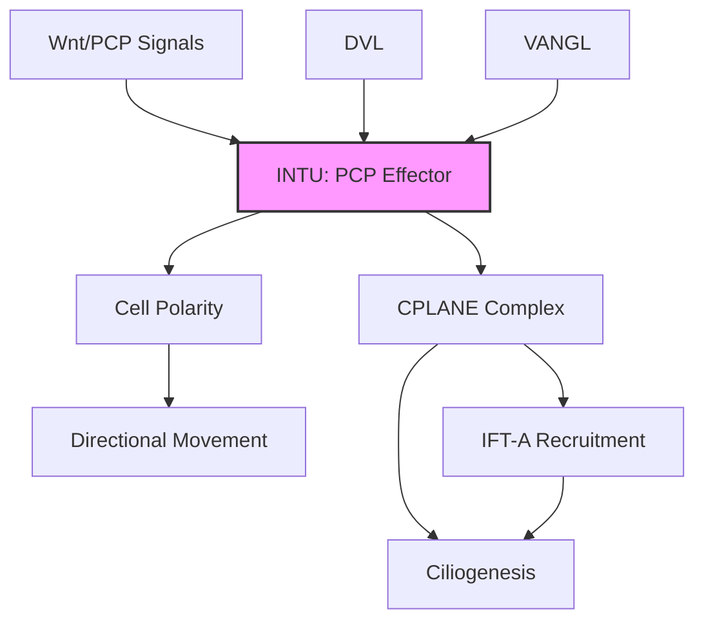

# Pathway Summary for INTU

## Overview
INTU (Inturned planar cell polarity protein) is a core component of the planar cell polarity (PCP) pathway that regulates ciliogenesis and directional cell movements. It functions in the CPLANE (ciliogenesis and planar polarity effector) complex, controlling primary cilium formation and establishing tissue polarity.

## Core Pathways

### Planar Cell Polarity Signaling
INTU participates in non-canonical Wnt/PCP signaling:
- Asymmetric protein localization
- Convergent extension movements
- Directional cell migration
- Tissue patterning

### Ciliogenesis Regulation
INTU controls primary cilium assembly through:
- CPLANE complex formation
- IFT-A complex recruitment
- Basal body docking
- Ciliary vesicle formation

## Pathway Diagram

## Clinical Significance
- **Ciliopathies**: INTU mutations cause skeletal ciliopathies
- **Neural tube defects**: Disrupted convergent extension
- **Short-rib polydactyly syndrome**: Skeletal abnormalities
