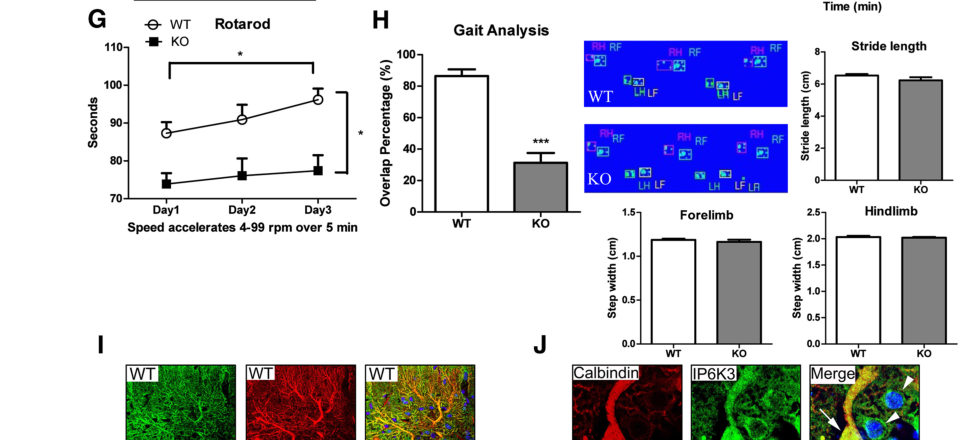

## Question

# Gene Research for Functional Annotation

## ⚠️ CRITICAL: Gene/Protein Identification Context

**BEFORE YOU BEGIN RESEARCH:** You MUST verify you are researching the CORRECT gene/protein. Gene symbols can be ambiguous, especially for less well-characterized genes from non-model organisms.

### Target Gene/Protein Identity (from UniProt):
- **UniProt Accession:** Q96PC2
- **Protein Description:** RecName: Full=Inositol hexakisphosphate kinase 3; Short=InsP6 kinase 3; EC=2.7.4.21; AltName: Full=Inositol hexaphosphate kinase 3;
- **Gene Information:** Name=IP6K3; Synonyms=IHPK3;
- **Organism (full):** Homo sapiens (Human).
- **Protein Family:** Belongs to the inositol phosphokinase (IPK) family.
- **Key Domains:** IPK. (IPR005522); IPK_sf. (IPR038286); IPK (PF03770)

### MANDATORY VERIFICATION STEPS:

1. **Check if the gene symbol "IP6K3" matches the protein description above**
2. **Verify the organism is correct:** Homo sapiens (Human).
3. **Check if protein family/domains align with what you find in literature**
4. **If you find literature for a DIFFERENT gene with the same or similar symbol, STOP**

### If Gene Symbol is Ambiguous or You Cannot Find Relevant Literature:

**DO NOT PROCEED WITH RESEARCH ON A DIFFERENT GENE.** Instead:
- State clearly: "The gene symbol 'IP6K3' is ambiguous or literature is limited for this specific protein"
- Explain what you found (e.g., "Found extensive literature on a different gene with the same symbol in a different organism")
- Describe the protein based ONLY on the UniProt information provided above
- Suggest that the protein function can be inferred from domain/family information

### Research Target:

Please provide a comprehensive research report on the gene **IP6K3** (gene ID: IP6K3, UniProt: Q96PC2) in human.

The research report should be a detailed narrative explaining the function, biological processes, and localization of the gene product. Citations should be given for all claims.

You should prioritize authoritative reviews and primary scientific literature when conducting research. You can supplement
this with annotations you find in gene/protein databases, but these can be outdated or inaccurate.

We are specifically interested in the primary function of the gene - for enzymes, what reaction is catalyzed, and what is the substrate specificity? For transporters, what is the substrate? For structural proteins or adapters, what is the broader structural role? For signaling molecules, what is the role in the pathway.

We are interested in where in or outside the cell the gene product carries out its function.

We are also interested in the signaling or biochemical pathways in which the gene functions. We are less interested in broad pleiotropic effects, except where these elucidate the precise role.

Include evidence where possible. We are interested in both experimental evidence as well as inference from structure, evolution, or bioinformatic analysis. Precise studies should be prioritized over high-throughput, where available.

## Output

Question: You are an expert researcher providing comprehensive, well-cited information.

Provide detailed information focusing on:
1. Key concepts and definitions with current understanding
2. Recent developments and latest research (prioritize 2023-2024 sources)
3. Current applications and real-world implementations
4. Expert opinions and analysis from authoritative sources
5. Relevant statistics and data from recent studies

Format as a comprehensive research report with proper citations. Include URLs and publication dates where available.
Always prioritize recent, authoritative sources and provide specific citations for all major claims.

# Gene Research for Functional Annotation

## ⚠️ CRITICAL: Gene/Protein Identification Context

**BEFORE YOU BEGIN RESEARCH:** You MUST verify you are researching the CORRECT gene/protein. Gene symbols can be ambiguous, especially for less well-characterized genes from non-model organisms.

### Target Gene/Protein Identity (from UniProt):
- **UniProt Accession:** Q96PC2
- **Protein Description:** RecName: Full=Inositol hexakisphosphate kinase 3; Short=InsP6 kinase 3; EC=2.7.4.21; AltName: Full=Inositol hexaphosphate kinase 3;
- **Gene Information:** Name=IP6K3; Synonyms=IHPK3;
- **Organism (full):** Homo sapiens (Human).
- **Protein Family:** Belongs to the inositol phosphokinase (IPK) family.
- **Key Domains:** IPK. (IPR005522); IPK_sf. (IPR038286); IPK (PF03770)

### MANDATORY VERIFICATION STEPS:

1. **Check if the gene symbol "IP6K3" matches the protein description above**
2. **Verify the organism is correct:** Homo sapiens (Human).
3. **Check if protein family/domains align with what you find in literature**
4. **If you find literature for a DIFFERENT gene with the same or similar symbol, STOP**

### If Gene Symbol is Ambiguous or You Cannot Find Relevant Literature:

**DO NOT PROCEED WITH RESEARCH ON A DIFFERENT GENE.** Instead:
- State clearly: "The gene symbol 'IP6K3' is ambiguous or literature is limited for this specific protein"
- Explain what you found (e.g., "Found extensive literature on a different gene with the same symbol in a different organism")
- Describe the protein based ONLY on the UniProt information provided above
- Suggest that the protein function can be inferred from domain/family information

### Research Target:

Please provide a comprehensive research report on the gene **IP6K3** (gene ID: IP6K3, UniProt: Q96PC2) in human.

The research report should be a detailed narrative explaining the function, biological processes, and localization of the gene product. Citations should be given for all claims.

You should prioritize authoritative reviews and primary scientific literature when conducting research. You can supplement
this with annotations you find in gene/protein databases, but these can be outdated or inaccurate.

We are specifically interested in the primary function of the gene - for enzymes, what reaction is catalyzed, and what is the substrate specificity? For transporters, what is the substrate? For structural proteins or adapters, what is the broader structural role? For signaling molecules, what is the role in the pathway.

We are interested in where in or outside the cell the gene product carries out its function.

We are also interested in the signaling or biochemical pathways in which the gene functions. We are less interested in broad pleiotropic effects, except where these elucidate the precise role.

Include evidence where possible. We are interested in both experimental evidence as well as inference from structure, evolution, or bioinformatic analysis. Precise studies should be prioritized over high-throughput, where available.

## Research report: Human **IP6K3** (UniProt **Q96PC2**)—functional annotation

### Executive summary
**IP6K3 (inositol hexakisphosphate kinase 3; EC 2.7.4.21)** is a human inositol phosphate kinase that catalyzes pyrophosphate formation on highly phosphorylated inositols, most prominently converting **InsP6 (IP6) to 5-InsP7 (5-IP7)** and participating in downstream generation of **InsP8**. Beyond catalysis, evidence indicates IP6K3 also has **noncatalytic scaffolding roles** (e.g., linking spectrin and adducin in neurons) and can enable **protein pyrophosphorylation-based signaling** (e.g., dynein intermediate chain Ser51), connecting inositol pyrophosphate metabolism to cytoskeletal organization, neuronal development, and metabolic physiology. The most direct organismal phenotypes come from **Ip6k3 knockout mice**, which show strong effects in **cerebellar Purkinje cell morphology and synaptogenesis** and in **systemic metabolic regulation and lifespan**. (moritoh2016inositolhexakisphosphatekinase pages 1-2, fu2015inositolhexakisphosphatekinase3 pages 4-7, fu2015inositolhexakisphosphatekinase3 pages 7-10)

---

### 1) Target verification (mandatory identity check)
**Identity match:** Retrieved sources explicitly map **IP6K3 ↔ UniProt Q96PC2** in the context of mammalian inositol phosphate kinases, confirming that the target gene symbol **IP6K3** matches the UniProt entry provided and that the literature being summarized is aligned with the correct human protein. 
- Evidence: a mammalian inositol phosphate kinase structure table lists **IP6K3 (UniProt Q96PC2)**. Publication date: **Jan 2026**. URL: https://doi.org/10.1002/1873-3468.70280. (wang2026structuralinsightsinto pages 24-28)

No conflicting evidence for an alternative human protein corresponding to Q96PC2 was found in the retrieved corpus. (wang2026structuralinsightsinto pages 24-28)

---

### 2) Key concepts and definitions (current understanding)
#### 2.1 Inositol pyrophosphates and IP6Ks
Inositol pyrophosphates are inositol phosphates containing one or more **diphosphate (pyrophosphate) groups**. In mammals, **IP6Ks** (IP6K1/2/3) are central enzymes that produce **5-InsP7 (5-IP7)** from **InsP6 (IP6)** and can contribute to production of **InsP8** from **1-IP7**. (heitmann2023theroleof pages 1-2)

A key mechanistic theme emphasized in recent synthesis is that inositol pyrophosphates can act through:
1) **Noncovalent binding** to protein targets,
2) **Protein pyrophosphorylation** (transfer of pyrophosphate to prephosphorylated residues), and
3) **Protein–protein interactions** mediated by the IP6K enzyme itself (scaffolding effects). (heitmann2023theroleof pages 1-2)

#### 2.2 Enzymatic reaction and substrate scope
Across IP6Ks (including IP6K3), the best-supported catalytic reaction is:
- **IP6 → 5-IP7 (5-InsP7 / 5-diphosphoinositol pentakisphosphate)**, and further phosphorylation such as **1-IP7 → InsP8**. (heitmann2023theroleof pages 1-2)

A primary study describing IP6K (family) substrate scope notes that the **5-kinase activity** can act on multiple highly phosphorylated inositols, including:
- **InsP5 → 5-PP-InsP4**,
- **InsP6 → 5-PP-InsP5 (5-InsP7)**,
- **1-PP-InsP5 → InsP8**. (moritoh2016inositolhexakisphosphatekinase pages 1-2)

*Interpretation for functional annotation:* while the most discussed physiological product is 5-InsP7, available evidence supports that IP6Ks (and by extension IP6K3 as a family member) can act on a **set of densely phosphorylated inositols** and can contribute to InsP8 production in appropriate substrate contexts. (moritoh2016inositolhexakisphosphatekinase pages 1-2, heitmann2023theroleof pages 1-2)

---

### 3) Cellular localization and expression (where IP6K3 acts)
#### 3.1 Tissue expression (enrichment vs other IP6K isoforms)
IP6K3 is reported to be **non-ubiquitous** and **enriched** in specific tissues compared with IP6K1/2. A review of IP6Ks notes that IP6K3 is expressed at higher levels in **skeletal muscle**, **cardiac muscle**, and the **thyroid**, whereas IP6K1/2 are described as more ubiquitous. Publication date: **Aug 2023**. URL: https://doi.org/10.3390/biom13091317. (heitmann2023theroleof pages 1-2)

A primary metabolism-focused study reports that Ip6k3 mRNA is highest in **mouse skeletal muscle (soleus, gastrocnemius)** followed by **heart**, with a similar pattern in humans and additional notable expression in **thyroid** and **brain** (region-dependent); it further reports that among inositol kinases, IP6K3 has the **highest mRNA expression in human skeletal muscle**. Publication date: **Aug 2016**. URL: https://doi.org/10.1038/srep32072. (moritoh2016inositolhexakisphosphatekinase pages 1-2, moritoh2016inositolhexakisphosphatekinase pages 3-5)

In the CNS, IP6K3 is described as highly expressed in **cerebellar Purkinje cells and interneurons**, and present in multiple brain regions (cortex, hippocampus, thalamus, hypothalamus). (heitmann2023theroleof pages 11-12)

#### 3.2 Subcellular localization
A GFP-tagged IP6K3 fusion protein localized to **both cytoplasm and nucleus** in HEK293 cells, consistent with the idea that IP6K3-derived inositol pyrophosphates can affect both cytosolic and nuclear signaling processes. (moritoh2016inositolhexakisphosphatekinase pages 1-2)

In mouse cerebellum, immunostaining supports localization within the **molecular layer/Purkinje cell compartment**, consistent with Purkinje-cell phenotypes observed in knockout animals. (fu2015inositolhexakisphosphatekinase3 pages 4-7, fu2015inositolhexakisphosphatekinase3 pages 3-4)

---

### 4) Molecular mechanisms, pathways, and interaction partners
#### 4.1 IP6K3 as a cytoskeletal/scaffolding regulator (spectrin/adducin)
A key mechanistic finding is that IP6K3 physically associates with the **spectrin–adducin cytoskeletal complex** and promotes their interaction.
- IP6K3 co-immunoprecipitates with **α/β-adducin** and **α2/β2-spectrin**, and these interactions were reported as **specific to IP6K3** (not observed similarly for IP6K1/2 in that study). (fu2015inositolhexakisphosphatekinase3 pages 4-7, fu2015inositolhexakisphosphatekinase3 pages 3-4)
- Importantly, IP6K3’s promotion of spectrin–adducin interaction was reported to be **independent of kinase activity**, consistent with a **noncatalytic scaffolding role** (kinase-dead mutant K217A still promotes binding). (fu2015inositolhexakisphosphatekinase3 pages 4-7, fu2015inositolhexakisphosphatekinase3 pages 7-10)

*Pathway implication:* This positions IP6K3 not only as an enzyme producing 5-InsP7 but also as a structural organizer at the spectrin–actin membrane skeleton in neurons, with downstream impact on dendritic architecture and synapse formation. (fu2015inositolhexakisphosphatekinase3 pages 10-11)

#### 4.2 IP6K3, dynein, and protein pyrophosphorylation in migration/focal adhesion dynamics
A 2023 review summarizes evidence that IP6K3 binds **dynein intermediate chain 2 (DIC2)** and that IP7 produced by IP6K3 can **pyrophosphorylate DIC2 at Ser51**, enhancing interaction with **p150glued** and recruitment of the dynein/dynactin complex to the leading edge of migrating cells; this is integrated into a model linking IP6K-derived inositol pyrophosphates to focal adhesion and cytoskeletal control relevant to neuronal migration. Publication date: **Aug 2023**. URL: https://doi.org/10.3390/biom13091317. (heitmann2023theroleof pages 7-9)

#### 4.3 Broader IP6K pathway signaling themes (context for IP6K3)
Within the IP6K pathway, IP7 is described as influencing **Akt/GSK3 signaling** (e.g., competition with PIP3 for Akt binding, and IP6K-associated protein interactions that can affect GSK3 regulation), as well as vesicle trafficking and phosphate homeostasis; although much of this literature is not uniquely IP6K3-specific, it defines the canonical signaling framework within which IP6K3’s tissue-enriched roles occur. (heitmann2023theroleof pages 1-2)

---

### 5) Physiological roles and phenotypes (highest-confidence evidence)
#### 5.1 Neurobiology: Purkinje cell development, synaptogenesis, and motor behavior
**Ip6k3 knockout mice** provide strong evidence that IP6K3 is required for normal cerebellar development and circuit formation.

Key phenotypes and quantitative data include:
- **Reduced cerebellar molecular layer width** and **Purkinje dendritic defects** (withered dendritic trees), with reduced Purkinje cell size/volume and reduced spine density. (fu2015inositolhexakisphosphatekinase3 pages 4-7, heitmann2023theroleof pages 11-12, fu2015inositolhexakisphosphatekinase3 media d8e952f3)
- **Large synaptic deficits** in the cerebellar molecular layer: electron microscopy quantification indicates both symmetric and asymmetric synapses decrease by **~40–50%**; immunostaining quantification shows synapse-type-specific reductions of approximately **~40% (GABAergic)**, **~40% (parallel fiber)**, and **~50% (climbing fiber)** synapses; GABA synapse unit area decreases by **~40%**. (fu2015inositolhexakisphosphatekinase3 pages 4-7, fu2015inositolhexakisphosphatekinase3 pages 7-10, fu2015inositolhexakisphosphatekinase3 media d8e952f3)
- Behavioral outcomes consistent with Purkinje dysfunction include impaired **motor learning/coordination** (e.g., reduced rotarod performance) and gait abnormalities. (heitmann2023theroleof pages 11-12, fu2015inositolhexakisphosphatekinase3 media d8e952f3)

Mechanistic linkage: these phenotypes are consistent with disruption of IP6K3-mediated **spectrin/adducin scaffolding** in Purkinje cells. (fu2015inositolhexakisphosphatekinase3 pages 4-7, fu2015inositolhexakisphosphatekinase3 pages 7-10)

#### 5.2 Metabolism and aging-related physiology
A primary mouse study indicates that IP6K3 modulates systemic metabolism and lifespan.

Reported phenotypes in **Ip6k3−/− mice** include:
- **Lower blood glucose** and **reduced circulating insulin**,
- **Decreased fat mass** and **lower body weight**,
- **Increased plasma lactate**,
- **Enhanced glucose tolerance** and improved insulin tolerance,
- **Reduced skeletal muscle Pdk4 expression** under normal diet conditions,
- **Extended lifespan**, associated with reduced phosphorylation of cardiac **S6 ribosomal protein** (a readout often linked to mTORC1/S6K signaling). Publication date: **Aug 2016**. URL: https://doi.org/10.1038/srep32072. (moritoh2016inositolhexakisphosphatekinase pages 1-2)

The same work also reports that Ip6k3 expression is inducible by metabolic stressors:
- Upregulated by **dexamethasone** in human myotubes,
- Elevated under **diabetic**, **fasting**, and **disuse/denervation** conditions in mouse skeletal muscle. (moritoh2016inositolhexakisphosphatekinase pages 1-2, moritoh2016inositolhexakisphosphatekinase pages 3-5)

Quantitative context from denervation experiments: denervation caused muscle mass losses of **41% (gastrocnemius)** and **22% (soleus)** in wild-type mice at the referenced time point; Ip6k3 loss blunted denervation-associated Pdk4 responses. (moritoh2016inositolhexakisphosphatekinase pages 3-5)

---

### 6) Recent developments and latest research (prioritizing 2023–2024)
#### 6.1 2023: Consolidated expert synthesis for CNS roles and mechanisms
The 2023 Biomolecules review provides a current synthesis positioning IP6Ks (including IP6K3) as regulators of synaptic vesicle regulation, Akt/GSK3 signaling, neuronal migration, and other processes, and highlights mechanisms including both **pyrophosphorylation** and **protein–protein interaction/scaffolding** modes. Publication date: **Aug 2023**. URL: https://doi.org/10.3390/biom13091317. (heitmann2023theroleof pages 1-2)

It also summarizes IP6K3-specific mechanistic evidence connecting IP6K3 to dynein/dynactin recruitment through DIC2 Ser51 pyrophosphorylation (important for migration/cytoskeletal dynamics). (heitmann2023theroleof pages 7-9)

#### 6.2 2024: Translational cardiac protection via depleting 5-InsP7 (pathway-level relevance)
A 2024 Cardiovascular Research study identifies 5-InsP7 as a physiological regulator of adiponectin handling and demonstrates that reducing 5-InsP7 biosynthesis (genetically via IP6K1 deletion or pharmacologically using an IP6K inhibitor) protects against myocardial ischemia–reperfusion injury in mice. Publication date: **Jan 2024**. URL: https://doi.org/10.1093/cvr/cvae017. (fu2024depletinginositolpyrophosphate pages 1-2)

Although this study is primarily centered on IP6K1 (not IP6K3), it is a key **2024** example of real-world pathway manipulation (IP6K inhibition / 5-InsP7 depletion) with clear in vivo implementation details (30 min LAD occlusion, 24 h reperfusion; TTC/Evans blue infarct assessment; TNP inhibitor use; adiponectin dependence). (fu2024depletinginositolpyrophosphate pages 2-3)

---

### 7) Current applications and real-world implementations
#### 7.1 Chemical biology and translational pharmacology (IP6K pathway)
**Small-molecule inhibition of IP6Ks** is actively used as:
- a **research tool** to modulate cellular inositol pyrophosphate pools, and
- a candidate **therapeutic strategy** in metabolic and cardiovascular contexts.

A representative high-quality medicinal chemistry study (J. Med. Chem., **Apr 2022**) reports **UNC7467 (compound 20)** with quantitative isoform activity:
- **IP6K1 IC50 8.9 nM**, **IP6K2 IC50 4.9 nM**, and **IP6K3 IC50 1320 nM** (weak on IP6K3), demonstrating that isoform selectivity is feasible. URL: https://doi.org/10.1021/acs.jmedchem.2c00220. (zhou2022developmentofnovel pages 1-3)

In-cell target engagement: in HCT116 inositol phosphate profiling, UNC7467 reduced inositol pyrophosphates by **66–81%** while not significantly perturbing other inositol phosphates. (zhou2022developmentofnovel pages 1-3)

In vivo implementation: intraperitoneal dosing of UNC7467 in diet-induced obese mice improved glycemic profiles, reduced weight gain, and ameliorated hepatic steatosis without altering food intake (reported as translational metabolic benefit; specific effect sizes are not in the excerpt). (zhou2022developmentofnovel pages 1-3)

A 2023 inhibitor-development dissertation describes strategies toward BBB-penetrant inhibitors (e.g., replacing carboxylic acids with neutral isosteres) and reports a lead compound with **IC50 15 nM** and an “excellent brain/plasma ratio,” along with early PROTAC development to dissect enzymatic vs scaffolding roles. (heitmann2023strategiestowardinhibition pages 1-6)

#### 7.2 Genetic models as “real-world” experimental implementations
For IP6K3 specifically, knockout mouse lines represent the most definitive functional implementation for annotation:
- CNS circuit development and motor behavior phenotyping with quantifiable synaptic and morphological outcomes. (fu2015inositolhexakisphosphatekinase3 media d8e952f3)
- Metabolic phenotyping across glucose/insulin, body composition, and lifespan. (moritoh2016inositolhexakisphosphatekinase pages 1-2)

---

### 8) Relevant statistics and quantitative data (from available studies)
Key quantitative findings accessible in the retrieved evidence include:

**Neurodevelopment/synapses (Ip6k3 KO):**
- Total synapses reduced by **~40–50%** in cerebellar molecular layer (EM quantification). (fu2015inositolhexakisphosphatekinase3 media d8e952f3)
- Synapse subtype reductions: **~40% GABAergic**, **~40% parallel fiber**, **~50% climbing fiber**; GABA synapse unit area reduced by **~40%**. (fu2015inositolhexakisphosphatekinase3 pages 7-10, fu2015inositolhexakisphosphatekinase3 media d8e952f3)

**Chemical probe activity (UNC7467):**
- Biochemical potency/selectivity: IP6K1 **8.9 nM**, IP6K2 **4.9 nM**, IP6K3 **1320 nM**. (zhou2022developmentofnovel pages 1-3)
- Cellular target engagement: **66–81% reduction** in inositol pyrophosphates (HCT116 profiling). (zhou2022developmentofnovel pages 1-3)

**Muscle stress context (denervation):**
- Denervation-induced mass losses in WT: **41% gastrocnemius**, **22% soleus** (time point noted in the excerpt), with Ip6k3 affecting downstream metabolic gene responses (Pdk4). (moritoh2016inositolhexakisphosphatekinase pages 3-5)

*Limitations:* the 2024 cardiac I/R paper excerpt provides detailed protocols but not explicit numeric infarct-size reduction or percent 5-InsP7 depletion in the excerpted sections. (fu2024depletinginositolpyrophosphate pages 2-3)

---

### 9) Disease associations and clinical relevance (evidence strength)
**Direct human genetics/disease associations for IP6K3** were limited in the retrieved excerpts. A 2023 review notes an exploratory human SNP study reporting **two promoter-region SNPs** associated with a late-onset phenotype (details not fully accessible in excerpt). (heitmann2023theroleof pages 11-12)

**Pathway-level disease relevance:** robust evidence supports that manipulating IP6K-generated 5-InsP7 can influence metabolic and cardiovascular outcomes (e.g., 2024 myocardial I/R protection via IP6K inhibition), but this is not uniquely attributable to IP6K3. (fu2024depletinginositolpyrophosphate pages 1-2, fu2024depletinginositolpyrophosphate pages 2-3)

---

### 10) Conclusions (functional annotation statement)
Human IP6K3 (UniProt Q96PC2) is best annotated as a **tissue-enriched inositol hexakisphosphate kinase** that produces inositol pyrophosphate signals (notably 5-InsP7) and participates in pyrophosphate-dependent signaling mechanisms, including **protein pyrophosphorylation**. In the CNS—especially cerebellar Purkinje cells—evidence indicates IP6K3 has a major role in **neuronal morphology and synapse formation**, mediated at least in part by **noncatalytic scaffolding** interactions with the **spectrin–adducin** cytoskeleton; knockout phenotypes include large (≈40–50%) synapse losses and motor-learning deficits. In metabolic tissues (skeletal and cardiac muscle), IP6K3 expression is inducible by metabolic stress, and genetic deletion in mice impacts systemic glucose/insulin homeostasis and lifespan, linking IP6K3 biology to nutrient and aging-related physiology. (moritoh2016inositolhexakisphosphatekinase pages 1-2, fu2015inositolhexakisphosphatekinase3 pages 4-7, fu2015inositolhexakisphosphatekinase3 media d8e952f3)

---

### Summary table
| Category | Key findings | Best supporting citations |
|---|---|---|
| Identity | Human **IP6K3** corresponds to **UniProt Q96PC2**; literature and kinase tables explicitly map **IP6K3 ↔ Q96PC2**. It is one of the mammalian inositol hexakisphosphate kinases within the broader inositol phosphate kinase pathway; no conflicting human target identity was found in the retrieved evidence. | 2026 FEBS Lett. table linking IP6K3 to Q96PC2: https://doi.org/10.1002/1873-3468.70280 (wang2026structuralinsightsinto pages 24-28); 2023 Biomolecules review on IP6Ks: https://doi.org/10.3390/biom13091317 (heitmann2023theroleof pages 1-2) |
| Enzymatic reaction | IP6K3 is an **inositol hexakisphosphate kinase** that synthesizes inositol pyrophosphates. Current consensus is that IP6Ks convert **IP6 → 5-IP7 (5-InsP7)** and can further phosphorylate **1-IP7 → IP8**. | 2023 Biomolecules review: https://doi.org/10.3390/biom13091317 (heitmann2023theroleof pages 1-2); 2016 Sci Rep: https://doi.org/10.1038/srep32072 (moritoh2016inositolhexakisphosphatekinase pages 1-2) |
| Substrate specificity | Reported IP6K 5-kinase activity includes pyrophosphorylation of **InsP5 → 5-PP-InsP4**, **InsP6 → 5-PP-InsP5 (5-InsP7)**, and **1-PP-InsP5 → InsP8**; thus IP6K3 shares family substrate scope for highly phosphorylated inositols, with best-established physiological product **5-InsP7**. | 2016 Sci Rep: https://doi.org/10.1038/srep32072 (moritoh2016inositolhexakisphosphatekinase pages 1-2); 2023 Biomolecules review: https://doi.org/10.3390/biom13091317 (heitmann2023theroleof pages 1-2) |
| Localization & expression | Expression is enriched relative to IP6K1/2 in **skeletal muscle, cardiac muscle/heart, thyroid, and brain/cerebellum**; in brain, IP6K3 is highly expressed in **Purkinje cells** and also interneurons. In HEK293 cells, **GFP-IP6K3 localizes to both cytoplasm and nucleus**. In cerebellum it localizes to the **molecular layer/Purkinje cells** by immunostaining. | 2016 Sci Rep: https://doi.org/10.1038/srep32072 (moritoh2016inositolhexakisphosphatekinase pages 1-2); 2023 Biomolecules review: https://doi.org/10.3390/biom13091317 (heitmann2023theroleof pages 1-2, heitmann2023theroleof pages 11-12); 2015 J Neurosci: https://doi.org/10.1523/JNEUROSCI.1069-15.2015 (fu2015inositolhexakisphosphatekinase3 pages 4-7, fu2015inositolhexakisphosphatekinase3 pages 3-4) |
| Interaction partners | IP6K3 has **noncatalytic scaffolding** interactions with **adducins** and **spectrins**; it co-immunoprecipitates with **α/β-adducin** and **α2/β2-spectrin**, and this interaction is **specific to IP6K3** versus IP6K1/2 in the cited study. It also binds **dynein intermediate chain 2 (DIC2)**; IP7 produced by IP6K3 pyrophosphorylates **DIC2 Ser51**, promoting interaction with **p150glued** and recruitment of the dynactin/dynein complex at the leading edge. | 2015 J Neurosci: https://doi.org/10.1523/JNEUROSCI.1069-15.2015 (fu2015inositolhexakisphosphatekinase3 pages 4-7, fu2015inositolhexakisphosphatekinase3 pages 7-10, fu2015inositolhexakisphosphatekinase3 pages 3-4, fu2015inositolhexakisphosphatekinase3 pages 10-11); 2023 Biomolecules review: https://doi.org/10.3390/biom13091317 (heitmann2023theroleof pages 7-9) |
| Physiological roles & phenotypes | **Metabolic/aging:** Ip6k3 deletion in mice lowered blood glucose, circulating insulin, fat mass, and body weight; increased plasma lactate; improved glucose tolerance/insulin tolerance; reduced muscle **Pdk4**; and extended lifespan with reduced cardiac **S6 ribosomal protein phosphorylation**. **Neurobiology:** IP6K3 KO mice show decreased cerebellar molecular layer width, withered Purkinje dendrites, reduced Purkinje cell size/volume and spine density, impaired neuronal migration, and motor-learning/gait deficits. Quantitatively, total synapse number in cerebellum falls by about **40–50%**; specific synapses are reduced by about **40% GABAergic**, **40% parallel fiber**, and **~50% climbing fiber**; GABA synapse unit area is reduced by about **40%**. | 2016 Sci Rep: https://doi.org/10.1038/srep32072 (moritoh2016inositolhexakisphosphatekinase pages 1-2); 2015 J Neurosci: https://doi.org/10.1523/JNEUROSCI.1069-15.2015 (fu2015inositolhexakisphosphatekinase3 pages 4-7, fu2015inositolhexakisphosphatekinase3 pages 7-10, heitmann2023theroleof pages 11-12, fu2015inositolhexakisphosphatekinase3 media d8e952f3) |
| Therapeutic targeting & inhibitors | No IP6K3-selective therapy is established clinically, but the IP6K pathway is actively pursued pharmacologically. A 2022 probe **UNC7467** inhibited **IP6K1 8.9 nM**, **IP6K2 4.9 nM**, but was much weaker on **IP6K3 1320 nM**, showing that isoform selectivity is achievable; in cells it reduced inositol pyrophosphates by **66–81%** and improved obesity-linked metabolic phenotypes in mice. A 2023 medicinal-chemistry effort reported a brain-penetrant lead with **IC50 15 nM** and favorable brain/plasma exposure. A 2026 review summarized **SC-919** as highly potent with reported IC50s **<5.2 nM (IP6K1), <3.8 nM (IP6K2), 0.65 nM (IP6K3)**, though this is outside the user's 2023–2024 priority window. Translational 2024 work supports IP6K inhibition/5-InsP7 depletion for **cardioprotection** in myocardial ischemia–reperfusion injury, but that study was primarily **IP6K1-centered**, not IP6K3-specific. | 2022 J Med Chem: https://doi.org/10.1021/acs.jmedchem.2c00220 (zhou2022developmentofnovel pages 1-3); 2023 inhibitor thesis summary (heitmann2023strategiestowardinhibition pages 1-6); 2024 Cardiovasc Res: https://doi.org/10.1093/cvr/cvae017 (fu2024depletinginositolpyrophosphate pages 2-3, fu2024depletinginositolpyrophosphate pages 1-2); 2026 FEBS Lett. review for SC-919 values: https://doi.org/10.1002/1873-3468.70280 (wang2026structuralinsightsinto pages 7-8) |

*Table: This table summarizes the verified identity, enzymatic activity, localization, interaction partners, phenotypes, and therapeutic context for human IP6K3 (UniProt Q96PC2). It emphasizes experimentally supported findings and includes quantitative values and source-linked citations where available.*

References

1. (moritoh2016inositolhexakisphosphatekinase pages 1-2): Yusuke Moritoh, Masahiro Oka, Yoshitaka Yasuhara, Hiroyuki Hozumi, Kimihiko Iwachidow, Hiromitsu Fuse, and Ryuichi Tozawa. Inositol hexakisphosphate kinase 3 regulates metabolism and lifespan in mice. Scientific Reports, Aug 2016. URL: https://doi.org/10.1038/srep32072, doi:10.1038/srep32072. This article has 78 citations and is from a peer-reviewed journal.

2. (fu2015inositolhexakisphosphatekinase3 pages 4-7): C. Fu, J. Xu, R.-J. Li, J. A. Crawford, A. B. Khan, T. M. Ma, J. Y. Cha, A. M. Snowman, M. V. Pletnikov, and S. H. Snyder. Inositol hexakisphosphate kinase-3 regulates the morphology and synapse formation of cerebellar purkinje cells via spectrin/adducin. The Journal of Neuroscience, 35:11056-11067, Aug 2015. URL: https://doi.org/10.1523/jneurosci.1069-15.2015, doi:10.1523/jneurosci.1069-15.2015. This article has 60 citations.

3. (fu2015inositolhexakisphosphatekinase3 pages 7-10): C. Fu, J. Xu, R.-J. Li, J. A. Crawford, A. B. Khan, T. M. Ma, J. Y. Cha, A. M. Snowman, M. V. Pletnikov, and S. H. Snyder. Inositol hexakisphosphate kinase-3 regulates the morphology and synapse formation of cerebellar purkinje cells via spectrin/adducin. The Journal of Neuroscience, 35:11056-11067, Aug 2015. URL: https://doi.org/10.1523/jneurosci.1069-15.2015, doi:10.1523/jneurosci.1069-15.2015. This article has 60 citations.

4. (wang2026structuralinsightsinto pages 24-28): Huanchen Wang. Structural insights into the development of inhibitors for inositol phosphate kinases. FEBS Letters, Jan 2026. URL: https://doi.org/10.1002/1873-3468.70280, doi:10.1002/1873-3468.70280. This article has 0 citations and is from a peer-reviewed journal.

5. (heitmann2023theroleof pages 1-2): Tyler Heitmann and James C. Barrow. The role of inositol hexakisphosphate kinase in the central nervous system. Biomolecules, 13:1317, Aug 2023. URL: https://doi.org/10.3390/biom13091317, doi:10.3390/biom13091317. This article has 10 citations.

6. (moritoh2016inositolhexakisphosphatekinase pages 3-5): Yusuke Moritoh, Masahiro Oka, Yoshitaka Yasuhara, Hiroyuki Hozumi, Kimihiko Iwachidow, Hiromitsu Fuse, and Ryuichi Tozawa. Inositol hexakisphosphate kinase 3 regulates metabolism and lifespan in mice. Scientific Reports, Aug 2016. URL: https://doi.org/10.1038/srep32072, doi:10.1038/srep32072. This article has 78 citations and is from a peer-reviewed journal.

7. (heitmann2023theroleof pages 11-12): Tyler Heitmann and James C. Barrow. The role of inositol hexakisphosphate kinase in the central nervous system. Biomolecules, 13:1317, Aug 2023. URL: https://doi.org/10.3390/biom13091317, doi:10.3390/biom13091317. This article has 10 citations.

8. (fu2015inositolhexakisphosphatekinase3 pages 3-4): C. Fu, J. Xu, R.-J. Li, J. A. Crawford, A. B. Khan, T. M. Ma, J. Y. Cha, A. M. Snowman, M. V. Pletnikov, and S. H. Snyder. Inositol hexakisphosphate kinase-3 regulates the morphology and synapse formation of cerebellar purkinje cells via spectrin/adducin. The Journal of Neuroscience, 35:11056-11067, Aug 2015. URL: https://doi.org/10.1523/jneurosci.1069-15.2015, doi:10.1523/jneurosci.1069-15.2015. This article has 60 citations.

9. (fu2015inositolhexakisphosphatekinase3 pages 10-11): C. Fu, J. Xu, R.-J. Li, J. A. Crawford, A. B. Khan, T. M. Ma, J. Y. Cha, A. M. Snowman, M. V. Pletnikov, and S. H. Snyder. Inositol hexakisphosphate kinase-3 regulates the morphology and synapse formation of cerebellar purkinje cells via spectrin/adducin. The Journal of Neuroscience, 35:11056-11067, Aug 2015. URL: https://doi.org/10.1523/jneurosci.1069-15.2015, doi:10.1523/jneurosci.1069-15.2015. This article has 60 citations.

10. (heitmann2023theroleof pages 7-9): Tyler Heitmann and James C. Barrow. The role of inositol hexakisphosphate kinase in the central nervous system. Biomolecules, 13:1317, Aug 2023. URL: https://doi.org/10.3390/biom13091317, doi:10.3390/biom13091317. This article has 10 citations.

11. (fu2015inositolhexakisphosphatekinase3 media d8e952f3): C. Fu, J. Xu, R.-J. Li, J. A. Crawford, A. B. Khan, T. M. Ma, J. Y. Cha, A. M. Snowman, M. V. Pletnikov, and S. H. Snyder. Inositol hexakisphosphate kinase-3 regulates the morphology and synapse formation of cerebellar purkinje cells via spectrin/adducin. The Journal of Neuroscience, 35:11056-11067, Aug 2015. URL: https://doi.org/10.1523/jneurosci.1069-15.2015, doi:10.1523/jneurosci.1069-15.2015. This article has 60 citations.

12. (fu2024depletinginositolpyrophosphate pages 1-2): Lin Fu, Jimin Du, David Furkert, Megan L Shipton, Xiaoqi Liu, Tim Aguirre, Alfred C Chin, Andrew M Riley, Barry V L Potter, Dorothea Fiedler, Xu Zhang, Yi Zhu, and Chenglai Fu. Depleting inositol pyrophosphate 5-insp7 protected the heart against ischaemia–reperfusion injury by elevating plasma adiponectin. Cardiovascular Research, 120:954-970, Jan 2024. URL: https://doi.org/10.1093/cvr/cvae017, doi:10.1093/cvr/cvae017. This article has 10 citations and is from a domain leading peer-reviewed journal.

13. (fu2024depletinginositolpyrophosphate pages 2-3): Lin Fu, Jimin Du, David Furkert, Megan L Shipton, Xiaoqi Liu, Tim Aguirre, Alfred C Chin, Andrew M Riley, Barry V L Potter, Dorothea Fiedler, Xu Zhang, Yi Zhu, and Chenglai Fu. Depleting inositol pyrophosphate 5-insp7 protected the heart against ischaemia–reperfusion injury by elevating plasma adiponectin. Cardiovascular Research, 120:954-970, Jan 2024. URL: https://doi.org/10.1093/cvr/cvae017, doi:10.1093/cvr/cvae017. This article has 10 citations and is from a domain leading peer-reviewed journal.

14. (zhou2022developmentofnovel pages 1-3): Yubai Zhou, Sandip Mukherjee, Daowei Huang, Molee Chakraborty, Chunfang Gu, Guangning Zong, Michael A. Stashko, Kenneth H. Pearce, Stephen B. Shears, Anutosh Chakraborty, Huanchen Wang, and Xiaodong Wang. Development of novel ip6k inhibitors for the treatment of obesity and obesity-induced metabolic dysfunctions. Journal of medicinal chemistry, 65:6869-6887, Apr 2022. URL: https://doi.org/10.1021/acs.jmedchem.2c00220, doi:10.1021/acs.jmedchem.2c00220. This article has 32 citations and is from a highest quality peer-reviewed journal.

15. (heitmann2023strategiestowardinhibition pages 1-6): TE Heitmann. Strategies toward inhibition of inositol hexakisphosphate kinase. Unknown journal, 2023.

16. (wang2026structuralinsightsinto pages 7-8): Huanchen Wang. Structural insights into the development of inhibitors for inositol phosphate kinases. FEBS Letters, Jan 2026. URL: https://doi.org/10.1002/1873-3468.70280, doi:10.1002/1873-3468.70280. This article has 0 citations and is from a peer-reviewed journal.

## Artifacts

- [Edison artifact artifact-00](IP6K3-deep-research-falcon_artifacts/artifact-00.md)

## Citations

1. wang2026structuralinsightsinto pages 24-28
2. heitmann2023theroleof pages 1-2
3. moritoh2016inositolhexakisphosphatekinase pages 1-2
4. heitmann2023theroleof pages 11-12
5. heitmann2023theroleof pages 7-9
6. moritoh2016inositolhexakisphosphatekinase pages 3-5
7. fu2024depletinginositolpyrophosphate pages 1-2
8. fu2024depletinginositolpyrophosphate pages 2-3
9. zhou2022developmentofnovel pages 1-3
10. heitmann2023strategiestowardinhibition pages 1-6
11. wang2026structuralinsightsinto pages 7-8
12. https://doi.org/10.1002/1873-3468.70280.
13. https://doi.org/10.3390/biom13091317.
14. https://doi.org/10.1038/srep32072.
15. https://doi.org/10.1093/cvr/cvae017.
16. https://doi.org/10.1021/acs.jmedchem.2c00220.
17. https://doi.org/10.1002/1873-3468.70280
18. https://doi.org/10.3390/biom13091317
19. https://doi.org/10.1038/srep32072
20. https://doi.org/10.1523/JNEUROSCI.1069-15.2015
21. https://doi.org/10.1021/acs.jmedchem.2c00220
22. https://doi.org/10.1093/cvr/cvae017
23. https://doi.org/10.1038/srep32072,
24. https://doi.org/10.1523/jneurosci.1069-15.2015,
25. https://doi.org/10.1002/1873-3468.70280,
26. https://doi.org/10.3390/biom13091317,
27. https://doi.org/10.1093/cvr/cvae017,
28. https://doi.org/10.1021/acs.jmedchem.2c00220,