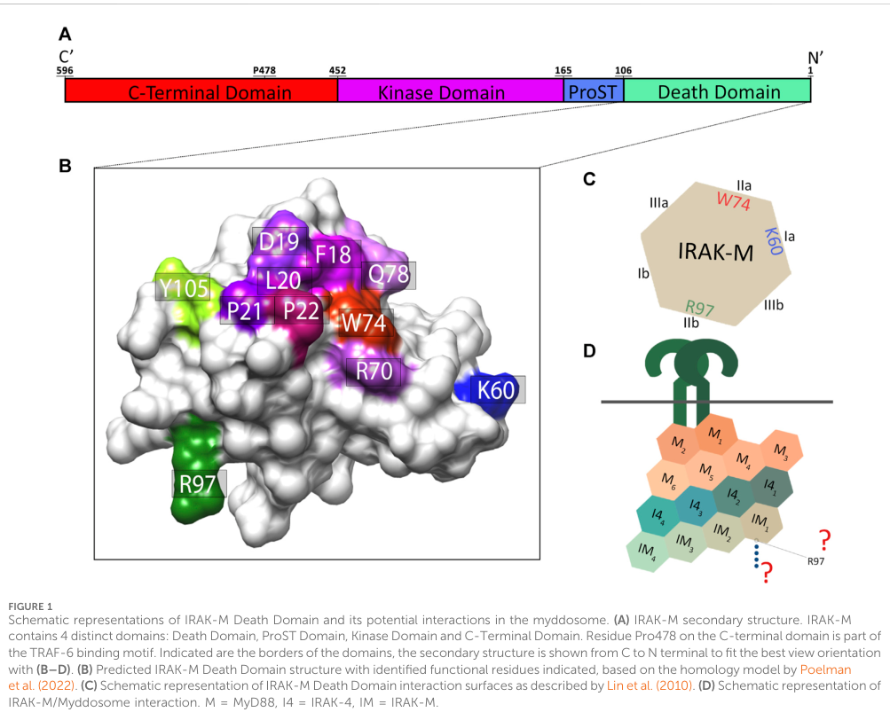

## Question

# Gene Research for Functional Annotation

## ⚠️ CRITICAL: Gene/Protein Identification Context

**BEFORE YOU BEGIN RESEARCH:** You MUST verify you are researching the CORRECT gene/protein. Gene symbols can be ambiguous, especially for less well-characterized genes from non-model organisms.

### Target Gene/Protein Identity (from UniProt):
- **UniProt Accession:** Q9Y616
- **Protein Description:** RecName: Full=Interleukin-1 receptor-associated kinase 3; Short=IRAK-3; AltName: Full=IL-1 receptor-associated kinase M; Short=IRAK-M; AltName: Full=Inactive IL-1 receptor-associated kinase 3 {ECO:0000305};
- **Gene Information:** Name=IRAK3 {ECO:0000312|EMBL:AAH57800.1};
- **Organism (full):** Homo sapiens (Human).
- **Protein Family:** Belongs to the protein kinase superfamily. TKL Ser/Thr
- **Key Domains:** DEATH-like_dom_sf. (IPR011029); Death_dom. (IPR000488); IRAK3_death. (IPR042747); IRAK3_PK. (IPR042698); Kinase-like_dom_sf. (IPR011009)

### MANDATORY VERIFICATION STEPS:

1. **Check if the gene symbol "IRAK3" matches the protein description above**
2. **Verify the organism is correct:** Homo sapiens (Human).
3. **Check if protein family/domains align with what you find in literature**
4. **If you find literature for a DIFFERENT gene with the same or similar symbol, STOP**

### If Gene Symbol is Ambiguous or You Cannot Find Relevant Literature:

**DO NOT PROCEED WITH RESEARCH ON A DIFFERENT GENE.** Instead:
- State clearly: "The gene symbol 'IRAK3' is ambiguous or literature is limited for this specific protein"
- Explain what you found (e.g., "Found extensive literature on a different gene with the same symbol in a different organism")
- Describe the protein based ONLY on the UniProt information provided above
- Suggest that the protein function can be inferred from domain/family information

### Research Target:

Please provide a comprehensive research report on the gene **IRAK3** (gene ID: IRAK3, UniProt: Q9Y616) in human.

The research report should be a detailed narrative explaining the function, biological processes, and localization of the gene product. Citations should be given for all claims.

You should prioritize authoritative reviews and primary scientific literature when conducting research. You can supplement
this with annotations you find in gene/protein databases, but these can be outdated or inaccurate.

We are specifically interested in the primary function of the gene - for enzymes, what reaction is catalyzed, and what is the substrate specificity? For transporters, what is the substrate? For structural proteins or adapters, what is the broader structural role? For signaling molecules, what is the role in the pathway.

We are interested in where in or outside the cell the gene product carries out its function.

We are also interested in the signaling or biochemical pathways in which the gene functions. We are less interested in broad pleiotropic effects, except where these elucidate the precise role.

Include evidence where possible. We are interested in both experimental evidence as well as inference from structure, evolution, or bioinformatic analysis. Precise studies should be prioritized over high-throughput, where available.

## Output

Question: You are an expert researcher providing comprehensive, well-cited information.

Provide detailed information focusing on:
1. Key concepts and definitions with current understanding
2. Recent developments and latest research (prioritize 2023-2024 sources)
3. Current applications and real-world implementations
4. Expert opinions and analysis from authoritative sources
5. Relevant statistics and data from recent studies

Format as a comprehensive research report with proper citations. Include URLs and publication dates where available.
Always prioritize recent, authoritative sources and provide specific citations for all major claims.

# Gene Research for Functional Annotation

## ⚠️ CRITICAL: Gene/Protein Identification Context

**BEFORE YOU BEGIN RESEARCH:** You MUST verify you are researching the CORRECT gene/protein. Gene symbols can be ambiguous, especially for less well-characterized genes from non-model organisms.

### Target Gene/Protein Identity (from UniProt):
- **UniProt Accession:** Q9Y616
- **Protein Description:** RecName: Full=Interleukin-1 receptor-associated kinase 3; Short=IRAK-3; AltName: Full=IL-1 receptor-associated kinase M; Short=IRAK-M; AltName: Full=Inactive IL-1 receptor-associated kinase 3 {ECO:0000305};
- **Gene Information:** Name=IRAK3 {ECO:0000312|EMBL:AAH57800.1};
- **Organism (full):** Homo sapiens (Human).
- **Protein Family:** Belongs to the protein kinase superfamily. TKL Ser/Thr
- **Key Domains:** DEATH-like_dom_sf. (IPR011029); Death_dom. (IPR000488); IRAK3_death. (IPR042747); IRAK3_PK. (IPR042698); Kinase-like_dom_sf. (IPR011009)

### MANDATORY VERIFICATION STEPS:

1. **Check if the gene symbol "IRAK3" matches the protein description above**
2. **Verify the organism is correct:** Homo sapiens (Human).
3. **Check if protein family/domains align with what you find in literature**
4. **If you find literature for a DIFFERENT gene with the same or similar symbol, STOP**

### If Gene Symbol is Ambiguous or You Cannot Find Relevant Literature:

**DO NOT PROCEED WITH RESEARCH ON A DIFFERENT GENE.** Instead:
- State clearly: "The gene symbol 'IRAK3' is ambiguous or literature is limited for this specific protein"
- Explain what you found (e.g., "Found extensive literature on a different gene with the same symbol in a different organism")
- Describe the protein based ONLY on the UniProt information provided above
- Suggest that the protein function can be inferred from domain/family information

### Research Target:

Please provide a comprehensive research report on the gene **IRAK3** (gene ID: IRAK3, UniProt: Q9Y616) in human.

The research report should be a detailed narrative explaining the function, biological processes, and localization of the gene product. Citations should be given for all claims.

You should prioritize authoritative reviews and primary scientific literature when conducting research. You can supplement
this with annotations you find in gene/protein databases, but these can be outdated or inaccurate.

We are specifically interested in the primary function of the gene - for enzymes, what reaction is catalyzed, and what is the substrate specificity? For transporters, what is the substrate? For structural proteins or adapters, what is the broader structural role? For signaling molecules, what is the role in the pathway.

We are interested in where in or outside the cell the gene product carries out its function.

We are also interested in the signaling or biochemical pathways in which the gene functions. We are less interested in broad pleiotropic effects, except where these elucidate the precise role.

Include evidence where possible. We are interested in both experimental evidence as well as inference from structure, evolution, or bioinformatic analysis. Precise studies should be prioritized over high-throughput, where available.

# Functional annotation report: human IRAK3 / IRAK-M (UniProt Q9Y616)

## Executive conclusion

The identity is verified: **IRAK3** is the approved human gene encoding **interleukin-1 receptor-associated kinase 3**, conventionally called **IRAK-M**. The literature’s human IRAK-M is the same 596-amino-acid, approximately 68-kDa protein represented by UniProt **Q9Y616**, not a similarly named protein from another organism. Its architecture—an N-terminal death domain, Pro/Ser/Thr-rich segment, central kinase-like domain, and C-terminal TRAF6-interacting region—matches the supplied InterPro death-domain and kinase-like annotations (zhai2025theroleof pages 3-4, gurkan2024theirakmdeath pages 1-2, gurkan2024theirakmdeath pages 2-4, gurkan2024theirakmdeath media 87ca9212).

The best-supported primary function is **not catalysis**, but intracellular scaffolding and negative feedback in **MyD88-dependent Toll-like receptor (TLR) and IL-1-receptor-family signaling**. Human IRAK3 is a pseudokinase/inactive kinase: the catalytic HRD aspartate is replaced by **Ser293**, conventional protein-kinase activity is negligible, and no physiological phosphorylation substrate or substrate specificity has been established. It attenuates productive IRAK1/2–TRAF6 signaling, thereby limiting NF-κB and MAPK activation and inflammatory cytokine production (pereira2023regulationofinnate pages 6-7, freihat2017doesthenovel pages 83-87, freihat2017doesthenovel pages 29-33).

## 1. Identity, family, and structural annotation

Human IRAK3 is also named **IRAK-M**, reflecting its historically recognized enrichment in monocytes/macrophages. The human gene lies on chromosome 12 and encodes a 596-residue protein. The protein belongs to the IRAK branch of the TKL kinase-like superfamily but should functionally be classified as an **IRAK-family pseudokinase and signaling adaptor**, rather than as an active Ser/Thr kinase (zhai2025theroleof pages 3-4, mahmoud2023modulationofirak pages 4-6).

The experimentally and structurally supported organization is:

- **N-terminal death domain**, approximately residues 1–106: mediates homotypic death-domain interactions with MyD88–IRAK4 assemblies and other IRAKs.
- **ProST region**, approximately residues 107–165: rich in proline, serine, and threonine.
- **Kinase-like/pseudokinase domain**, approximately residues 166–452: retains the kinase fold but lacks the canonical catalytic aspartate.
- **C-terminal region**, approximately residues 453–596: contains a TRAF6-binding motif centered on **Pro478** (gurkan2024theirakmdeath pages 1-2, gurkan2024theirakmdeath pages 2-4, gurkan2024theirakmdeath media 87ca9212, gurkan2024theirakmdeath media 92ff78e8).

The inspected 2024 domain and myddosome schematic directly corroborates this arrangement and its proposed receptor-proximal assembly context (gurkan2024theirakmdeath media 87ca9212, gurkan2024theirakmdeath media 92ff78e8, gurkan2024theirakmdeath media 7bccd93e).

## 2. Molecular function and pathway mechanism

### 2.1 Canonical pathway placement

After activation of most TLRs or members of the IL-1 receptor family—including receptors for IL-1, IL-18, and IL-33—the receptor TIR domains recruit **MyD88**. MyD88 death domains oligomerize and recruit IRAK4, followed normally by IRAK1 or IRAK2. The resulting myddosome promotes IRAK activation and TRAF6 oligomerization, leading through TAK1 to NF-κB and MAPK activation and transcription of inflammatory cytokines and antimicrobial mediators (gurkan2024theirakmdeath pages 1-2, gurkan2024theirakmdeath pages 2-4).

IRAK3 acts principally as a **delayed pathway brake**. TLR-driven NF-κB activity induces IRAK3, establishing a negative-feedback loop. IRAK3 then restrains signaling by several, potentially complementary mechanisms:

1. association with MyD88–IRAK4 assemblies and competition with productive IRAK1/2 recruitment;
2. stabilization of nonproductive or inhibitory IRAK-containing complexes;
3. interference with IRAK1–TRAF6 coupling and TRAF6-dependent downstream signaling;
4. stabilization of MAPK phosphatase-1, which inactivates p38;
5. promotion of inhibitory proteins including A20, IκBα, SOCS1, and SHIP1 (pereira2023regulationofinnate pages 6-7, zhai2025theroleof pages 3-4, rothschild2018negativeregulationof pages 36-41, gurkan2024theirakmdeath pages 2-4).

The net result in most macrophage and epithelial contexts is reduced NF-κB/MAPK signaling and lower production of TNF, IL-6, IL-12-family cytokines, chemokines, and other inflammatory mediators.

### 2.2 Is IRAK3 an enzyme?

For functional annotation, **no established enzymatic reaction should be assigned**. Human IRAK3 lacks the conserved HRD catalytic aspartate, replaced by Ser293, and is widely classified as a class-I pseudokinase. Very weak residual activity or nucleotide binding cannot be completely excluded, but neither a reproducible physiological protein substrate nor meaningful phosphorylation specificity is known (freihat2017doesthenovel pages 83-87, freihat2017doesthenovel pages 29-33, rothschild2018negativeregulationof pages 36-41).

A guanylate-cyclase-like center has been proposed within the kinase-homology region. Mutational studies have linked this putative activity to inhibition of LPS-induced NF-κB, but other assays did not detect significant cGMP production, and its physiological importance remains unresolved. It should therefore not replace the pseudokinase/scaffold annotation (pereira2023regulationofinnate pages 6-7, freihat2017doesthenovel pages 83-87).

### 2.3 2024 refinement: three death-domain surfaces

Gürkan and colleagues mapped three functional faces of human IRAK3’s death domain. A **Trp74-centered surface** binds the MyD88–IRAK4 complex; a **Lys60-centered surface** supports IRAK3 death-domain homotetramerization; and an opposite **Arg97-centered surface** contributes to IRAK1 and TRAF6 interactions and may permit higher-order IRAK3 oligomerization (published January 10, 2024; https://doi.org/10.3389/fmolb.2023.1265455) (gurkan2024theirakmdeath pages 1-2, gurkan2024theirakmdeath pages 2-4).

Arg97 mutation reduced by approximately **50%** the NF-κB activation generated by engineered MyD88–IRAK4–IRAK3 complexes, including in IRAK1/MEKK3 double-knockout cells. Because the mutant retained myddosome binding while producing less NF-κB, it behaved as a stronger competitor of productive IRAK1 recruitment. These experiments refine IRAK3 as a context-dependent signaling scaffold; they do not overturn its predominant anti-inflammatory role. The proposed IRAK3 octamer remains partly model-based, and much of the experimental work used overexpression in engineered cells (gurkan2024theirakmdeath pages 1-2, gurkan2024theirakmdeath pages 2-4).

## 3. Cellular and subcellular localization

IRAK3 is an **intracellular, predominantly cytoplasmic protein**. It acts at receptor-proximal MyD88 myddosomes and within cytoplasmic IRAK1/IRAK4/TRAF6/MAPK signaling machinery; it is neither secreted nor a transmembrane receptor. In a 2024 human lung-adenocarcinoma tissue cohort, immunohistochemistry showed predominantly cytoplasmic staining in both tumor and matched normal tissue (zhou2024il1receptorassociatedkinase pages 6-7).

Expression is strongest and best characterized in **monocytes, macrophages, and other myeloid-lineage cells**, but it is not absolutely myeloid-restricted. Human bronchial and alveolar epithelial cells express inducible IRAK3, and expression has also been reported in dendritic cells. Claims of stimulus-dependent nuclear translocation derive mainly from murine IL-33-responsive dendritic-cell models and should not be generalized as the normal human localization (pereira2023regulationofinnate pages 6-7, zhai2025theroleof pages 2-3, li2023irakmhaseffects pages 1-2, li2023irakmhaseffects pages 7-9).

## 4. Biological processes

### Inflammatory resolution and endotoxin tolerance

IRAK3 is induced after TLR activation and helps terminate the response to persistent or repeated microbial stimulation. This contributes to **endotoxin tolerance**, in which previously exposed innate immune cells produce less inflammatory cytokine after subsequent LPS challenge. Mouse Irak3 deletion impairs tolerance and increases TNF, IL-6, and IL-12p40 responses; human and murine mononuclear cells both induce IRAK3 after bacterial endotoxin, although species-specific expression and IRAK dependencies are substantial (pereira2023regulationofinnate pages 6-7, rothschild2018negativeregulationof pages 36-41).

This activity is protective against excessive inflammation and tissue damage, but can also create immune suppression after severe infection or injury. Accordingly, experts emphasize that IRAK3 is not simply “beneficial” or “harmful”: it tunes the magnitude and duration of innate signaling, and the phenotype depends on pathogen burden, tissue, timing, and disease severity (gurkan2024theirakmdeath pages 1-2, gurkan2024theirakmdeath pages 2-4).

### Noncanonical positive signaling

IRAK3 can also form a MyD88–IRAK4–IRAK3 complex that produces selective NF-κB activity, sometimes through MEKK3 or TAK1, favoring inhibitory genes such as A20, IκBα, SOCS1, and SHIP1. Under specialized conditions, it can promote inflammatory/type-2 genes. The current consensus is therefore that IRAK3 is an **overall negative regulator implemented partly through selective positive signaling to anti-inflammatory effectors**, rather than a passive inhibitor (pereira2023regulationofinnate pages 6-7, zhai2025theroleof pages 3-4, gurkan2024theirakmdeath pages 1-2).

## 5. Recent research and quantitative findings, 2023–2024

| Topic | Best-supported conclusion | Evidence type/species | Key quantitative detail | Confidence/caveat | Source DOI/URL and publication date |
|---|---|---|---|---|---|
| Identity and domain architecture | Target is human **IRAK3/IRAK-M**, an IRAK-family intracellular signaling protein corresponding to the supplied UniProt **Q9Y616**. Architecture comprises an N-terminal death domain, Pro/Ser/Thr-rich region, central kinase-like domain, and unstructured C-terminal region containing a TRAF6-binding motif at Pro478. | Human sequence annotation, literature review, structural modeling, and figure inspection | Human protein: **596 aa**, approximately **68 kDa**; death-domain residues highlighted mechanistically include Lys60, Trp74, and Arg97. | **High** for identity and broad architecture. The literature commonly uses “IRAK-M”; species must still be checked because many functional experiments are murine. | [Gürkan et al.](https://doi.org/10.3389/fmolb.2023.1265455), **2024-01-10** (gurkan2024theirakmdeath pages 1-2, gurkan2024theirakmdeath pages 2-4, gurkan2024theirakmdeath media 87ca9212); [Zhai et al.](https://doi.org/10.1159/000548123), **2025-09** (zhai2025theroleof pages 3-4, zhai2025theroleof pages 2-3) |
| Pseudokinase status | Human IRAK3 is best annotated as an **inactive kinase/pseudokinase**, not as an enzyme with an established protein substrate or phosphorylation reaction. Its kinase-like fold primarily supports signaling-complex assembly. | Human sequence comparison and biochemical/structural interpretation | The catalytic HRD-motif Asp is replaced by **Ser293**; reported intrinsic kinase activity is negligible or extremely weak. | **High** that conventional Ser/Thr kinase catalysis is not its primary function. ATP binding, weak residual activity, and proposed guanylate-cyclase activity remain incompletely resolved; no validated physiological phosphorylation substrate is known. | [Pereira & Gazzinelli](https://doi.org/10.3389/fimmu.2023.1133354), **2023-02** (pereira2023regulationofinnate pages 6-7); [Freihat](https://doi.org/10.4225/03/59ade522f2476), **2017-09** (freihat2017doesthenovel pages 83-87, freihat2017doesthenovel pages 29-33) |
| Canonical myddosome inhibition | IRAK3 is principally a **negative-feedback scaffold** in MyD88-dependent TLR/IL-1R signaling. It associates with MyD88–IRAK4 complexes, competes with or restrains IRAK1/2 recruitment and IRAK1–TRAF6 coupling, thereby reducing TRAF6-driven NF-κB and MAPK signaling; it can also promote inhibitory effectors such as A20, IκBα, SOCS1, SHIP1, and MKP-1. | Human overexpression/cell-complex studies integrated with predominantly murine macrophage genetics | TLR activation induces IRAK3 through NF-κB; TRAF6 downregulation is observed after approximately **24 h** of sustained TLR activation in vitro, consistent with delayed feedback. | **Moderate–high** for the inhibitory pathway role; **moderate** for the exact molecular sequence because models include both blockade of productive IRAK1–TRAF6 signaling and formation of an alternative inhibitory myddosome. | [Pereira & Gazzinelli](https://doi.org/10.3389/fimmu.2023.1133354), **2023-02** (pereira2023regulationofinnate pages 6-7); [Gürkan et al.](https://doi.org/10.3389/fmolb.2023.1265455), **2024-01-10** (gurkan2024theirakmdeath pages 1-2, gurkan2024theirakmdeath pages 2-4) |
| 2024 death-domain mechanism | Three IRAK3 death-domain surfaces divide its assembly functions: **Trp74-centered surface 1** binds MyD88–IRAK4; **Lys60-centered surface 2** supports IRAK3 homotetramerization; **Arg97-centered surface 3** promotes IRAK1/TRAF6 association and a modeled higher-order homo-octamer. | Human IRAK3 mutants, co-immunoprecipitation and NF-κB reporters in engineered 293T/knockout cells, plus structural modeling | Arg97 accounted for about **50%** of NF-κB activation by the MyD88–IRAK4–IRAK3 complex, including in IRAK1/MEKK3 double-knockout cells. | **Moderate–high** for residue-level interaction effects in the assay systems; **moderate/low** for physiological oligomer stoichiometry because the octamer is modeled and experiments rely substantially on overexpression. The result refines, rather than overturns, IRAK3’s overall anti-inflammatory annotation. | [Gürkan et al.](https://doi.org/10.3389/fmolb.2023.1265455), **2024-01-10** (gurkan2024theirakmdeath pages 1-2, gurkan2024theirakmdeath pages 2-4) |
| Cellular and subcellular localization | IRAK3 is a **cytoplasmic intracellular signaling protein**, enriched in monocytes/macrophages and other myeloid cells, but also inducible in bronchial and alveolar epithelial cells. It acts near receptor-associated MyD88 myddosomes and cytoplasmic IRAK1/TRAF6/MAPK machinery rather than extracellularly or as a membrane receptor. | Human expression literature, cultured human cells, and human LUAD immunohistochemistry | In the LUAD cohort, cytoplasmic staining was observed in both tumor and matched normal tissue; evaluable IHC was obtained for **222/250 patients (89%)**. | **High** for cytoplasmic localization; **moderate** for claims that human expression is strictly myeloid-restricted because epithelial expression is experimentally documented. Stimulus- and disease-dependent nuclear translocation has mainly been shown in murine settings. | [Zhou et al.](https://doi.org/10.21037/tlcr-24-391), **2024-09** (zhou2024il1receptorassociatedkinase pages 5-6, zhou2024il1receptorassociatedkinase pages 6-7); [Li et al.](https://doi.org/10.1186/s12931-023-02406-5), **2023-04** (li2023irakmhaseffects pages 1-2, li2023irakmhaseffects pages 7-9) |
| 2023 lung epithelial study | In human BEAS-2B and A549 cells, inflammatory stimuli induced IRAK3; siRNA depletion increased IL-6, IL-8, CXCL10, and CXCL11 and overactivated JNK/p38. JNK or p38 inhibition reduced the excess CXCL10, supporting epithelial IRAK3 as a local brake on inflammatory signaling. | Human epithelial cell lines; cross-sectional human asthma genotype/biomarker association | Cell experiments generally used **n=3**; inhibitors included SP600125 **20 μM** and SB203580 **10 μM**. The asthma cohort contained **137** patients: AA=35, AG=78, GG=24; GG carriers had higher serum CXCL10 than AA carriers (**P<0.05**). | **Moderate** mechanistic confidence for cultured epithelium; **low–moderate** clinical inference because the genotype result is associative, the GG subgroup is small, and A549 is cancer-derived. | [Li et al.](https://doi.org/10.1186/s12931-023-02406-5), **2023-04** (li2023irakmhaseffects pages 1-2, li2023irakmhaseffects pages 7-9) |
| 2024 LUAD cohort | IRAK3 mRNA/protein was lower in lung adenocarcinoma than matched normal tissue; low tumor protein was associated with worse survival. Conversely, higher IRAK3 correlated computationally with myeloid infiltration, T-cell dysfunction, and predicted checkpoint-blockade resistance, suggesting cell-composition- and context-dependent biomarker behavior. | Retrospective human tissue cohort, TCGA/public-dataset analyses, immune deconvolution, single-cell datasets, and TIDE prediction | **250** stage I–III surgical patients; **222 (89%)** evaluable; median follow-up **8.0 years**. Low IRAK3 associated with survival by Cox and log-rank analyses (**P=0.03** each). Expression inversely correlated with methylation probes cg20395892 and cg26279550 (**P<0.001**). | **Moderate** as a prognostic association; **low** for predicting treatment response because immunotherapy resistance was computationally inferred, not tested prospectively. No perturbational proof establishes tumor-cell causality. | [Zhou et al.](https://doi.org/10.21037/tlcr-24-391), **2024-09** (zhou2024il1receptorassociatedkinase pages 1-2, zhou2024il1receptorassociatedkinase pages 4-5, zhou2024il1receptorassociatedkinase pages 5-6, zhou2024il1receptorassociatedkinase pages 6-7, zhou2024il1receptorassociatedkinase pages 2-4) |
| 2023 pancreatitis study | Irak3 deletion amplified MyD88/IRAK/NF-κB signaling, macrophage inflammatory genes and monocyte infiltration. Enhanced inflammation/debris clearance coincided with less pancreatic injury in mild pancreatitis but worsened local injury and systemic inflammatory response in severe duct-ligation disease, demonstrating context-dependent consequences of removing the pathway brake. | **Mouse knockout**, murine bone-marrow macrophages and acinar-cell cocultures; no direct human evidence | Mild model used **8 hourly caerulein injections at 50 μg/kg**. Depending on endpoint, groups were commonly **n=4–15**; severe-model tissue/lipase analyses used approximately **n=10–18** and cytokines **n=6–15**. Knockout increased TNFα, IL-6 and IL-12p70 but numerical effect sizes were not supplied in the retrieved text. | **High** for the murine experimental phenotype; **low–moderate** for direct human annotation. Whole-body knockout cannot fully separate myeloid from acinar-cell effects, and opposite outcomes in mild versus severe disease caution against simple therapeutic extrapolation. | [Thiel et al.](https://doi.org/10.1038/s41598-023-37930-3), **2023-07** (thiel2023irak3mediatedsuppressionof pages 5-6, thiel2023irak3mediatedsuppressionof pages 6-9, thiel2023irak3mediatedsuppressionof pages 2-5, thiel2023irak3mediatedsuppressionof pages 1-2, thiel2023irak3mediatedsuppressionof pages 9-10, thiel2023irak3mediatedsuppressionof pages 10-11) |

*Table: Evidence-ranked summary of human IRAK3/Q9Y616 identity, molecular function, localization, recent mechanistic findings, and disease studies. It separates direct human evidence from engineered-cell and mouse results and flags translational limitations.*

### Human airway epithelium and asthma—2023

Li et al. used human BEAS-2B bronchial epithelial and A549 alveolar carcinoma-derived cells. IL-1β, TNF-α, IL-33, and house-dust-mite stimulation induced IRAK3; siRNA depletion increased IL-6, IL-8, CXCL10, and CXCL11 at RNA and protein levels and increased JNK/p38 activation. JNK inhibitor SP600125 at **20 μM** or p38 inhibitor SB203580 at **10 μM** reduced the excess CXCL10, supporting a direct epithelial signaling role (published April 2023; https://doi.org/10.1186/s12931-023-02406-5) (li2023irakmhaseffects pages 1-2, li2023irakmhaseffects pages 7-9).

The associated asthma cohort included **137 patients**: 35 AA, 78 AG, and 24 GG at rs1624395. GG carriers had higher serum CXCL10 than AA carriers (**P<0.05**). This is a genotype–biomarker association, not evidence that IRAK3-directed treatment improves asthma; cell experiments generally used only **n=3**, and A549 is a transformed line (li2023irakmhaseffects pages 7-9).

### Lung adenocarcinoma—2024

Zhou et al. examined a retrospective cohort of **250** surgically treated stage I–III lung-adenocarcinoma patients; **222 (89%)** yielded evaluable IRAK3 immunohistochemistry, with median follow-up of **8.0 years**. Tumors showed less IRAK3 than matched normal tissue, and low protein expression was associated with poorer survival by univariate Cox and log-rank analyses (**P=0.03** for each) (published September 2024; https://doi.org/10.21037/tlcr-24-391) (zhou2024il1receptorassociatedkinase pages 4-5, zhou2024il1receptorassociatedkinase pages 5-6, zhou2024il1receptorassociatedkinase pages 6-7).

TCGA analyses found increased IRAK3 methylation and inverse correlations between expression and methylation probes cg20395892 and cg26279550 (**P<0.001**). Higher IRAK3 also correlated with monocyte/macrophage infiltration, T-cell dysfunction, checkpoint markers, and predicted immunotherapy resistance. These apparently divergent findings probably reflect tumor-cell expression versus immune-cell composition. Importantly, checkpoint-blockade response was computationally predicted using TIDE and related analyses, not prospectively observed; the study does not establish IRAK3 as a clinically validated prognostic assay or causal resistance mechanism (zhou2024il1receptorassociatedkinase pages 1-2, zhou2024il1receptorassociatedkinase pages 5-6, zhou2024il1receptorassociatedkinase pages 2-4).

### Acute pancreatitis—2023, murine evidence

In Irak3-knockout mice, damaged pancreatic acini induced Irak3 in macrophages, while deficient macrophages increased Tnfa, Il6, Nos2, and Il12b, cytokine secretion, CCR2-positive monocyte recruitment, phagocytosis, and nuclear NF-κB. In mild caerulein pancreatitis—eight hourly **50 μg/kg** injections—this stronger response coincided with less local injury, possibly through debris clearance and acinar stress responses. In severe duct-ligation pancreatitis, however, deletion increased pancreatic injury, lipase, IL-6, TNF, IL-12p70, Th1 activation, lung injury, and CRP. Endpoint group sizes were generally **n=4–15**, reaching approximately **n=10–18** for some severe-disease tissue/lipase analyses (published July 2023; https://doi.org/10.1038/s41598-023-37930-3) (thiel2023irak3mediatedsuppressionof pages 5-6, thiel2023irak3mediatedsuppressionof pages 6-9, thiel2023irak3mediatedsuppressionof pages 2-5, thiel2023irak3mediatedsuppressionof pages 1-2, thiel2023irak3mediatedsuppressionof pages 10-11).

These data provide strong mechanistic evidence in mice but no direct human pancreatitis evidence. Whole-body knockout also cannot fully distinguish macrophage from acinar-cell functions. The opposite mild-versus-severe outcomes are a major warning against assuming that pharmacological IRAK3 inhibition will uniformly reduce or improve disease (thiel2023irak3mediatedsuppressionof pages 9-10).

## 6. Applications and translational status

Current practical applications are chiefly **research and biomarker development**:

- IRAK3 expression is used as a marker of feedback-inhibited or endotoxin-tolerant myeloid states.
- IRAK3 perturbation helps model the balance between antimicrobial inflammation and tissue-protective tolerance.
- Tumor expression, methylation, and immune-cell-associated expression are being evaluated as prognostic or treatment-response biomarkers.
- Death-domain interfaces—especially the Trp74- and Arg97-centered surfaces—offer conceptual targets for protein–protein-interaction modulators (gurkan2024theirakmdeath pages 1-2, zhou2024il1receptorassociatedkinase pages 1-2, pereira2023regulationofinnate pages 6-7).

No clinically validated IRAK3-directed drug, diagnostic cutoff, or demonstrated real-world therapeutic implementation was identified in the retrieved evidence. The IRAK inhibitors furthest into drug development generally target catalytically active **IRAK4 or IRAK1**, not IRAK3. Open Targets lists human IRAK3 disease associations, including asthma, but these association records should not be interpreted as proof of causal disease mechanism or clinical actionability (OpenTargets Search: -IRAK3, mahmoud2023modulationofirak pages 4-6).

Therapeutic direction is intrinsically bidirectional. Enhancing IRAK3 could suppress damaging sterile or chronic inflammation, whereas inhibiting it could restore antimicrobial or antitumor immunity in tolerant myeloid cells. Authoritative reviews emphasize that any intervention will likely require tissue-, cell-, and disease-stage specificity because systemic manipulation may exchange inflammatory injury for infection susceptibility, or vice versa (pereira2023regulationofinnate pages 6-7, gurkan2024theirakmdeath pages 1-2).

## 7. Recommended functional annotation

**Molecular function:** catalytically inactive IRAK-family pseudokinase and death-domain signaling scaffold; negative regulator of MyD88-dependent TLR/IL-1R signaling through modulation of IRAK1/2, IRAK4, TRAF6, and inhibitory feedback proteins.

**Catalytic reaction/substrate:** no established physiological kinase reaction, phosphorylation substrate, or substrate specificity. Proposed guanylate-cyclase activity remains insufficiently validated for primary annotation.

**Biological processes:** termination and calibration of innate immune signaling; endotoxin tolerance; control of NF-κB and MAPK activity; limitation of inflammatory cytokine/chemokine production; context-dependent regulation of macrophage and epithelial inflammatory responses.

**Cellular location:** predominantly cytoplasm; transiently incorporated into receptor-proximal MyD88–IRAK4 myddosome assemblies and associated cytoplasmic TRAF6/MAPK machinery.

**Evidence confidence:** high for identity, domain architecture, cytoplasmic localization, pseudokinase status, and the broad negative-regulatory role; moderate for the precise balance among competing myddosome mechanisms; low-to-moderate for proposed guanylate-cyclase activity and current therapeutic or predictive-biomarker claims.

References

1. (zhai2025theroleof pages 3-4): Liying Zhai, Chunhua Du, Qian Zhao, Wencheng Yu, and Haihong Gong. The role of interleukin-1 receptor-associated kinase m in pulmonary diseases: mechanisms and therapeutic implications. Sep 2025. URL: https://doi.org/10.1159/000548123, doi:10.1159/000548123. This article has 2 citations and is from a peer-reviewed journal.

2. (gurkan2024theirakmdeath pages 1-2): Berke Gürkan, Hessel Poelman, Liza Pereverzeva, Danielle Kruijswijk, Alex F. de Vos, Anouk G. Groenen, Edgar E. Nollet, Kanin Wichapong, Esther Lutgens, Tom van der Poll, Jiangfeng Du, W. Joost Wiersinga, Gerry A. F. Nicolaes, and Cornelis van ‘t Veer. The irak-m death domain: a tale of three surfaces. Frontiers in Molecular Biosciences, Jan 2024. URL: https://doi.org/10.3389/fmolb.2023.1265455, doi:10.3389/fmolb.2023.1265455. This article has 7 citations.

3. (gurkan2024theirakmdeath pages 2-4): Berke Gürkan, Hessel Poelman, Liza Pereverzeva, Danielle Kruijswijk, Alex F. de Vos, Anouk G. Groenen, Edgar E. Nollet, Kanin Wichapong, Esther Lutgens, Tom van der Poll, Jiangfeng Du, W. Joost Wiersinga, Gerry A. F. Nicolaes, and Cornelis van ‘t Veer. The irak-m death domain: a tale of three surfaces. Frontiers in Molecular Biosciences, Jan 2024. URL: https://doi.org/10.3389/fmolb.2023.1265455, doi:10.3389/fmolb.2023.1265455. This article has 7 citations.

4. (gurkan2024theirakmdeath media 87ca9212): Berke Gürkan, Hessel Poelman, Liza Pereverzeva, Danielle Kruijswijk, Alex F. de Vos, Anouk G. Groenen, Edgar E. Nollet, Kanin Wichapong, Esther Lutgens, Tom van der Poll, Jiangfeng Du, W. Joost Wiersinga, Gerry A. F. Nicolaes, and Cornelis van ‘t Veer. The irak-m death domain: a tale of three surfaces. Frontiers in Molecular Biosciences, Jan 2024. URL: https://doi.org/10.3389/fmolb.2023.1265455, doi:10.3389/fmolb.2023.1265455. This article has 7 citations.

5. (pereira2023regulationofinnate pages 6-7): Milton Pereira and Ricardo T. Gazzinelli. Regulation of innate immune signaling by irak proteins. Frontiers in Immunology, Feb 2023. URL: https://doi.org/10.3389/fimmu.2023.1133354, doi:10.3389/fimmu.2023.1133354. This article has 155 citations and is from a peer-reviewed journal.

6. (freihat2017doesthenovel pages 83-87): LUBNA FREIHAT. Does the novel gc activity of irak3 affect its signalling. ArXiv, Sep 2017. URL: https://doi.org/10.4225/03/59ade522f2476, doi:10.4225/03/59ade522f2476. This article has 0 citations.

7. (freihat2017doesthenovel pages 29-33): LUBNA FREIHAT. Does the novel gc activity of irak3 affect its signalling. ArXiv, Sep 2017. URL: https://doi.org/10.4225/03/59ade522f2476, doi:10.4225/03/59ade522f2476. This article has 0 citations.

8. (mahmoud2023modulationofirak pages 4-6): Ismail Sami Mahmoud, Yazun Bashir Jarrar, and Febrimarsa. Modulation of irak enzymes as a therapeutic strategy against sars-cov-2 induced cytokine storm. Clinical and Experimental Medicine, 23:2909-2923, Apr 2023. URL: https://doi.org/10.1007/s10238-023-01064-7, doi:10.1007/s10238-023-01064-7. This article has 7 citations and is from a peer-reviewed journal.

9. (gurkan2024theirakmdeath media 92ff78e8): Berke Gürkan, Hessel Poelman, Liza Pereverzeva, Danielle Kruijswijk, Alex F. de Vos, Anouk G. Groenen, Edgar E. Nollet, Kanin Wichapong, Esther Lutgens, Tom van der Poll, Jiangfeng Du, W. Joost Wiersinga, Gerry A. F. Nicolaes, and Cornelis van ‘t Veer. The irak-m death domain: a tale of three surfaces. Frontiers in Molecular Biosciences, Jan 2024. URL: https://doi.org/10.3389/fmolb.2023.1265455, doi:10.3389/fmolb.2023.1265455. This article has 7 citations.

10. (gurkan2024theirakmdeath media 7bccd93e): Berke Gürkan, Hessel Poelman, Liza Pereverzeva, Danielle Kruijswijk, Alex F. de Vos, Anouk G. Groenen, Edgar E. Nollet, Kanin Wichapong, Esther Lutgens, Tom van der Poll, Jiangfeng Du, W. Joost Wiersinga, Gerry A. F. Nicolaes, and Cornelis van ‘t Veer. The irak-m death domain: a tale of three surfaces. Frontiers in Molecular Biosciences, Jan 2024. URL: https://doi.org/10.3389/fmolb.2023.1265455, doi:10.3389/fmolb.2023.1265455. This article has 7 citations.

11. (rothschild2018negativeregulationof pages 36-41): DE Rothschild. Negative regulation of inflammation: implications for inflammatory bowel disease and colitis associated cancer. Unknown journal, 2018.

12. (zhou2024il1receptorassociatedkinase pages 6-7): Yang Zhou, Wei Rao, Zhao Li, Wei Guo, Fei Shao, Zhen Zhang, Hao Zhang, Tiejun Liu, Zitong Li, Fengwei Tan, Qi Xue, Shugeng Gao, and Jie He. Il-1 receptor-associated kinase 3 (irak3) in lung adenocarcinoma predicts prognosis and immunotherapy resistance: involvement of multiple inflammation-related pathways. Sep 2024. URL: https://doi.org/10.21037/tlcr-24-391, doi:10.21037/tlcr-24-391. This article has 4 citations and is from a peer-reviewed journal.

13. (zhai2025theroleof pages 2-3): Liying Zhai, Chunhua Du, Qian Zhao, Wencheng Yu, and Haihong Gong. The role of interleukin-1 receptor-associated kinase m in pulmonary diseases: mechanisms and therapeutic implications. Sep 2025. URL: https://doi.org/10.1159/000548123, doi:10.1159/000548123. This article has 2 citations and is from a peer-reviewed journal.

14. (li2023irakmhaseffects pages 1-2): Jia Li, Zhoude Zheng, Yi Liu, Hongbing Zhang, Youming Zhang, and Jinming Gao. Irak-m has effects in regulation of lung epithelial inflammation. Respiratory Research, Apr 2023. URL: https://doi.org/10.1186/s12931-023-02406-5, doi:10.1186/s12931-023-02406-5. This article has 11 citations and is from a domain leading peer-reviewed journal.

15. (li2023irakmhaseffects pages 7-9): Jia Li, Zhoude Zheng, Yi Liu, Hongbing Zhang, Youming Zhang, and Jinming Gao. Irak-m has effects in regulation of lung epithelial inflammation. Respiratory Research, Apr 2023. URL: https://doi.org/10.1186/s12931-023-02406-5, doi:10.1186/s12931-023-02406-5. This article has 11 citations and is from a domain leading peer-reviewed journal.

16. (zhou2024il1receptorassociatedkinase pages 5-6): Yang Zhou, Wei Rao, Zhao Li, Wei Guo, Fei Shao, Zhen Zhang, Hao Zhang, Tiejun Liu, Zitong Li, Fengwei Tan, Qi Xue, Shugeng Gao, and Jie He. Il-1 receptor-associated kinase 3 (irak3) in lung adenocarcinoma predicts prognosis and immunotherapy resistance: involvement of multiple inflammation-related pathways. Sep 2024. URL: https://doi.org/10.21037/tlcr-24-391, doi:10.21037/tlcr-24-391. This article has 4 citations and is from a peer-reviewed journal.

17. (zhou2024il1receptorassociatedkinase pages 1-2): Yang Zhou, Wei Rao, Zhao Li, Wei Guo, Fei Shao, Zhen Zhang, Hao Zhang, Tiejun Liu, Zitong Li, Fengwei Tan, Qi Xue, Shugeng Gao, and Jie He. Il-1 receptor-associated kinase 3 (irak3) in lung adenocarcinoma predicts prognosis and immunotherapy resistance: involvement of multiple inflammation-related pathways. Sep 2024. URL: https://doi.org/10.21037/tlcr-24-391, doi:10.21037/tlcr-24-391. This article has 4 citations and is from a peer-reviewed journal.

18. (zhou2024il1receptorassociatedkinase pages 4-5): Yang Zhou, Wei Rao, Zhao Li, Wei Guo, Fei Shao, Zhen Zhang, Hao Zhang, Tiejun Liu, Zitong Li, Fengwei Tan, Qi Xue, Shugeng Gao, and Jie He. Il-1 receptor-associated kinase 3 (irak3) in lung adenocarcinoma predicts prognosis and immunotherapy resistance: involvement of multiple inflammation-related pathways. Sep 2024. URL: https://doi.org/10.21037/tlcr-24-391, doi:10.21037/tlcr-24-391. This article has 4 citations and is from a peer-reviewed journal.

19. (zhou2024il1receptorassociatedkinase pages 2-4): Yang Zhou, Wei Rao, Zhao Li, Wei Guo, Fei Shao, Zhen Zhang, Hao Zhang, Tiejun Liu, Zitong Li, Fengwei Tan, Qi Xue, Shugeng Gao, and Jie He. Il-1 receptor-associated kinase 3 (irak3) in lung adenocarcinoma predicts prognosis and immunotherapy resistance: involvement of multiple inflammation-related pathways. Sep 2024. URL: https://doi.org/10.21037/tlcr-24-391, doi:10.21037/tlcr-24-391. This article has 4 citations and is from a peer-reviewed journal.

20. (thiel2023irak3mediatedsuppressionof pages 5-6): Franziska G. Thiel, Saeedeh Asgarbeik, Juliane Glaubitz, Anika Wilden, Markus M. Lerch, Frank Ulrich Weiss, and Matthias Sendler. Irak3-mediated suppression of pro-inflammatory myd88/irak signaling affects disease severity in acute pancreatitis. Scientific Reports, Jul 2023. URL: https://doi.org/10.1038/s41598-023-37930-3, doi:10.1038/s41598-023-37930-3. This article has 22 citations and is from a peer-reviewed journal.

21. (thiel2023irak3mediatedsuppressionof pages 6-9): Franziska G. Thiel, Saeedeh Asgarbeik, Juliane Glaubitz, Anika Wilden, Markus M. Lerch, Frank Ulrich Weiss, and Matthias Sendler. Irak3-mediated suppression of pro-inflammatory myd88/irak signaling affects disease severity in acute pancreatitis. Scientific Reports, Jul 2023. URL: https://doi.org/10.1038/s41598-023-37930-3, doi:10.1038/s41598-023-37930-3. This article has 22 citations and is from a peer-reviewed journal.

22. (thiel2023irak3mediatedsuppressionof pages 2-5): Franziska G. Thiel, Saeedeh Asgarbeik, Juliane Glaubitz, Anika Wilden, Markus M. Lerch, Frank Ulrich Weiss, and Matthias Sendler. Irak3-mediated suppression of pro-inflammatory myd88/irak signaling affects disease severity in acute pancreatitis. Scientific Reports, Jul 2023. URL: https://doi.org/10.1038/s41598-023-37930-3, doi:10.1038/s41598-023-37930-3. This article has 22 citations and is from a peer-reviewed journal.

23. (thiel2023irak3mediatedsuppressionof pages 1-2): Franziska G. Thiel, Saeedeh Asgarbeik, Juliane Glaubitz, Anika Wilden, Markus M. Lerch, Frank Ulrich Weiss, and Matthias Sendler. Irak3-mediated suppression of pro-inflammatory myd88/irak signaling affects disease severity in acute pancreatitis. Scientific Reports, Jul 2023. URL: https://doi.org/10.1038/s41598-023-37930-3, doi:10.1038/s41598-023-37930-3. This article has 22 citations and is from a peer-reviewed journal.

24. (thiel2023irak3mediatedsuppressionof pages 9-10): Franziska G. Thiel, Saeedeh Asgarbeik, Juliane Glaubitz, Anika Wilden, Markus M. Lerch, Frank Ulrich Weiss, and Matthias Sendler. Irak3-mediated suppression of pro-inflammatory myd88/irak signaling affects disease severity in acute pancreatitis. Scientific Reports, Jul 2023. URL: https://doi.org/10.1038/s41598-023-37930-3, doi:10.1038/s41598-023-37930-3. This article has 22 citations and is from a peer-reviewed journal.

25. (thiel2023irak3mediatedsuppressionof pages 10-11): Franziska G. Thiel, Saeedeh Asgarbeik, Juliane Glaubitz, Anika Wilden, Markus M. Lerch, Frank Ulrich Weiss, and Matthias Sendler. Irak3-mediated suppression of pro-inflammatory myd88/irak signaling affects disease severity in acute pancreatitis. Scientific Reports, Jul 2023. URL: https://doi.org/10.1038/s41598-023-37930-3, doi:10.1038/s41598-023-37930-3. This article has 22 citations and is from a peer-reviewed journal.

26. (OpenTargets Search: -IRAK3): Open Targets Query (-IRAK3, 5 results). Buniello, A. et al. (2025). Open Targets Platform: facilitating therapeutic hypotheses building in drug discovery. Nucleic Acids Research.

## Artifacts

- [Edison artifact artifact-00](IRAK3-deep-research-falcon_artifacts/artifact-00.md)

## Citations

1. pereira2023regulationofinnate pages 6-7
2. li2023irakmhaseffects pages 7-9
3. zhai2025theroleof pages 3-4
4. gurkan2024theirakmdeath pages 1-2
5. gurkan2024theirakmdeath pages 2-4
6. freihat2017doesthenovel pages 83-87
7. freihat2017doesthenovel pages 29-33
8. mahmoud2023modulationofirak pages 4-6
9. rothschild2018negativeregulationof pages 36-41
10. zhai2025theroleof pages 2-3
11. li2023irakmhaseffects pages 1-2
12. Gürkan et al.
13. Zhai et al.
14. Pereira & Gazzinelli
15. Freihat
16. Zhou et al.
17. Li et al.
18. Thiel et al.
19. https://doi.org/10.3389/fmolb.2023.1265455
20. https://doi.org/10.1159/000548123
21. https://doi.org/10.3389/fimmu.2023.1133354
22. https://doi.org/10.4225/03/59ade522f2476
23. https://doi.org/10.21037/tlcr-24-391
24. https://doi.org/10.1186/s12931-023-02406-5
25. https://doi.org/10.1038/s41598-023-37930-3
26. https://doi.org/10.1159/000548123,
27. https://doi.org/10.3389/fmolb.2023.1265455,
28. https://doi.org/10.3389/fimmu.2023.1133354,
29. https://doi.org/10.4225/03/59ade522f2476,
30. https://doi.org/10.1007/s10238-023-01064-7,
31. https://doi.org/10.21037/tlcr-24-391,
32. https://doi.org/10.1186/s12931-023-02406-5,
33. https://doi.org/10.1038/s41598-023-37930-3,