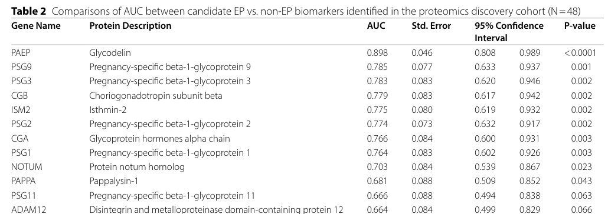

## Question

# Gene Research for Functional Annotation

## ⚠️ CRITICAL: Gene/Protein Identification Context

**BEFORE YOU BEGIN RESEARCH:** You MUST verify you are researching the CORRECT gene/protein. Gene symbols can be ambiguous, especially for less well-characterized genes from non-model organisms.

### Target Gene/Protein Identity (from UniProt):
- **UniProt Accession:** Q6H9L7
- **Protein Description:** RecName: Full=Isthmin-2; AltName: Full=Thrombospondin and AMOP domain-containing isthmin-like protein 1; AltName: Full=Thrombospondin type-1 domain-containing protein 3; Flags: Precursor;
- **Gene Information:** Name=ISM2; Synonyms=TAIL1, THSD3; ORFNames=PSEC0137;
- **Organism (full):** Homo sapiens (Human).
- **Protein Family:** Belongs to the isthmin family. .
- **Key Domains:** AMOP_dom. (IPR005533); Angio_Inhib/Adhesion_GPCR. (IPR051867); TSP1_rpt. (IPR000884); TSP1_rpt_sf. (IPR036383); AMOP (PF03782)

### MANDATORY VERIFICATION STEPS:

1. **Check if the gene symbol "ISM2" matches the protein description above**
2. **Verify the organism is correct:** Homo sapiens (Human).
3. **Check if protein family/domains align with what you find in literature**
4. **If you find literature for a DIFFERENT gene with the same or similar symbol, STOP**

### If Gene Symbol is Ambiguous or You Cannot Find Relevant Literature:

**DO NOT PROCEED WITH RESEARCH ON A DIFFERENT GENE.** Instead:
- State clearly: "The gene symbol 'ISM2' is ambiguous or literature is limited for this specific protein"
- Explain what you found (e.g., "Found extensive literature on a different gene with the same symbol in a different organism")
- Describe the protein based ONLY on the UniProt information provided above
- Suggest that the protein function can be inferred from domain/family information

### Research Target:

Please provide a comprehensive research report on the gene **ISM2** (gene ID: ISM2, UniProt: Q6H9L7) in human.

The research report should be a detailed narrative explaining the function, biological processes, and localization of the gene product. Citations should be given for all claims.

You should prioritize authoritative reviews and primary scientific literature when conducting research. You can supplement
this with annotations you find in gene/protein databases, but these can be outdated or inaccurate.

We are specifically interested in the primary function of the gene - for enzymes, what reaction is catalyzed, and what is the substrate specificity? For transporters, what is the substrate? For structural proteins or adapters, what is the broader structural role? For signaling molecules, what is the role in the pathway.

We are interested in where in or outside the cell the gene product carries out its function.

We are also interested in the signaling or biochemical pathways in which the gene functions. We are less interested in broad pleiotropic effects, except where these elucidate the precise role.

Include evidence where possible. We are interested in both experimental evidence as well as inference from structure, evolution, or bioinformatic analysis. Precise studies should be prioritized over high-throughput, where available.

## Output

Question: You are an expert researcher providing comprehensive, well-cited information.

Provide detailed information focusing on:
1. Key concepts and definitions with current understanding
2. Recent developments and latest research (prioritize 2023-2024 sources)
3. Current applications and real-world implementations
4. Expert opinions and analysis from authoritative sources
5. Relevant statistics and data from recent studies

Format as a comprehensive research report with proper citations. Include URLs and publication dates where available.
Always prioritize recent, authoritative sources and provide specific citations for all major claims.

# Gene Research for Functional Annotation

## ⚠️ CRITICAL: Gene/Protein Identification Context

**BEFORE YOU BEGIN RESEARCH:** You MUST verify you are researching the CORRECT gene/protein. Gene symbols can be ambiguous, especially for less well-characterized genes from non-model organisms.

### Target Gene/Protein Identity (from UniProt):
- **UniProt Accession:** Q6H9L7
- **Protein Description:** RecName: Full=Isthmin-2; AltName: Full=Thrombospondin and AMOP domain-containing isthmin-like protein 1; AltName: Full=Thrombospondin type-1 domain-containing protein 3; Flags: Precursor;
- **Gene Information:** Name=ISM2; Synonyms=TAIL1, THSD3; ORFNames=PSEC0137;
- **Organism (full):** Homo sapiens (Human).
- **Protein Family:** Belongs to the isthmin family. .
- **Key Domains:** AMOP_dom. (IPR005533); Angio_Inhib/Adhesion_GPCR. (IPR051867); TSP1_rpt. (IPR000884); TSP1_rpt_sf. (IPR036383); AMOP (PF03782)

### MANDATORY VERIFICATION STEPS:

1. **Check if the gene symbol "ISM2" matches the protein description above**
2. **Verify the organism is correct:** Homo sapiens (Human).
3. **Check if protein family/domains align with what you find in literature**
4. **If you find literature for a DIFFERENT gene with the same or similar symbol, STOP**

### If Gene Symbol is Ambiguous or You Cannot Find Relevant Literature:

**DO NOT PROCEED WITH RESEARCH ON A DIFFERENT GENE.** Instead:
- State clearly: "The gene symbol 'ISM2' is ambiguous or literature is limited for this specific protein"
- Explain what you found (e.g., "Found extensive literature on a different gene with the same symbol in a different organism")
- Describe the protein based ONLY on the UniProt information provided above
- Suggest that the protein function can be inferred from domain/family information

### Research Target:

Please provide a comprehensive research report on the gene **ISM2** (gene ID: ISM2, UniProt: Q6H9L7) in human.

The research report should be a detailed narrative explaining the function, biological processes, and localization of the gene product. Citations should be given for all claims.

You should prioritize authoritative reviews and primary scientific literature when conducting research. You can supplement
this with annotations you find in gene/protein databases, but these can be outdated or inaccurate.

We are specifically interested in the primary function of the gene - for enzymes, what reaction is catalyzed, and what is the substrate specificity? For transporters, what is the substrate? For structural proteins or adapters, what is the broader structural role? For signaling molecules, what is the role in the pathway.

We are interested in where in or outside the cell the gene product carries out its function.

We are also interested in the signaling or biochemical pathways in which the gene functions. We are less interested in broad pleiotropic effects, except where these elucidate the precise role.

Include evidence where possible. We are interested in both experimental evidence as well as inference from structure, evolution, or bioinformatic analysis. Precise studies should be prioritized over high-throughput, where available.

## Research Report: Human ISM2 (Isthmin-2; UniProt Q6H9L7)

### 1) Target verification (identity and disambiguation)
The literature retrieved consistently uses **ISM2** to denote **human isthmin-2**, a secreted extracellular protein encoded on **chromosome 14q24.3** with the characteristic **TSR1 (thrombospondin type-1 repeat) + AMOP** domain architecture of the **isthmin family**, matching the UniProt target **Q6H9L7** (aliases in retrieved sources include “Isthmin 2” and “Thrombospondin and AMOP domain-containing isthmin-like protein”). (shakhawat2022isthmin—amultifacetedprotein pages 1-3, martinez2020isthmin2is pages 1-2)

### 2) Key concepts, definitions, and current understanding

#### 2.1 Protein class and domain architecture
Isthmin proteins (ISM1 and ISM2) are described as **secreted proteins** defined by an N-terminal signal peptide and a conserved arrangement of a **central TSR1 domain** followed by a **C-terminal AMOP domain**. For human ISM2, the review literature describes it as a ~**63.9 kDa** secreted protein with this TSR1–AMOP architecture. (shakhawat2022isthmin—amultifacetedprotein pages 1-3)

**TSR1 domain (thrombospondin type-1 repeat):** TSR1 motifs are common in extracellular or membrane-associated proteins and are broadly associated with cell–cell and cell–matrix interactions, migration, proliferation, and apoptosis in other TSR-containing proteins; for ISM2 this provides domain-based inference that the protein can act in extracellular matrix (ECM) or receptor–ligand contexts. (shakhawat2022isthmin—amultifacetedprotein pages 1-3)

**AMOP domain:** The AMOP domain is an extracellular module present in multiple cell-adhesion-associated proteins. For ISM2, AMOP is highlighted as part of an extracellular protein architecture that plausibly supports adhesion and receptor binding. (shakhawat2022isthmin—amultifacetedprotein pages 3-6)

#### 2.2 Motifs that motivate functional hypotheses (with caveats)
A recent review compiles motif-level observations for ISM2:
- **TSR1 motifs:** ISM2 TSR1 contains motifs (e.g., WSPW and EPQ) where EPQ is noted (in TSR biology broadly) to influence carbohydrate-binding specificity, raising a hypothesis of lectin-like interactions. (shakhawat2022isthmin—amultifacetedprotein pages 3-6)
- **AMOP motifs:** The AMOP domain in ISM2 is reported to contain a **KGD motif** that has been reported to bind **integrin αIIbβ3**, and a **WSRL motif** described as being involved in **autophagy induction**. Importantly, these statements are compiled in review context and should be treated as **hypothesis-generating unless supported by direct biochemical/cellular validation in ISM2-focused experiments**. (shakhawat2022isthmin—amultifacetedprotein pages 3-6)

### 3) Subcellular/extracellular localization and tissue context

#### 3.1 Localization
Across sources, ISM2 is described as a **secreted/extracellular** protein (signal peptide + extracellular domains). (shakhawat2022isthmin—amultifacetedprotein pages 1-3)

#### 3.2 Tissue/cell-type context: placenta-enriched signal
Multiple pregnancy-related studies treat ISM2 as a **placental marker** and/or report it as highly expressed in placenta-associated contexts:
- Martinez et al. frame ISM2 as **almost placenta-specific** and quantify it in **maternal serum** by ELISA while also examining placental expression by immunohistochemistry. (martinez2020isthmin2is pages 1-2)
- Stylianou et al. report compartment-level placental expression changes (villous core stroma) in a spatial transcriptomic context. (stylianou2024wholetranscriptomeprofiling pages 8-9)
- Yu et al. detect ISM2 among **circulating microparticle (CMP) proteins** in maternal plasma, consistent with secretion and extracellular circulation. (yu2023circulatingmicroparticleproteins pages 2-4)

### 4) Mechanistic and pathway evidence (what is experimentally supported vs inferred)
Mechanistic evidence for ISM2 remains comparatively limited in the retrieved corpus, but several experimentally anchored observations exist.

#### 4.1 Regulation by sAPPα in a neuronal cell model (2023)
Masi et al. (International Journal of Molecular Sciences; published **April 2023**, https://doi.org/10.3390/ijms24076639) report that in **sAPPα-treated SH-SY5Y neuroblastoma cells**, ISM2 mRNA is listed as **up-regulated** as part of a transcriptional program associated with a **MAPK-related pathway**; the authors state the candidate genes were subsequently validated by qPCR. While the excerpt does not provide ISM2 fold-change or p-values, this places ISM2 among genes responsive to sAPPα-driven signaling in a neuronal context and links it to broader APP/sAPPα neuroprotective signaling frameworks discussed by the authors (including PI3K/Akt/NF-κB and PKC-associated regulation of α-secretase processing). (masi2023thelabyrinthinelandscape pages 15-17)

#### 4.2 Placental dysfunction programs: SARS‑CoV‑2 placentas (2024)
Stylianou et al. (Clinical & Translational Immunology; published **January 2024**, https://doi.org/10.1002/cti2.1488) report **decreased ISM2** in the **villous core stromal compartment** of SARS‑CoV‑2-infected placentas (n=7) compared with pre-pandemic controls (n=9). They also note ISM2 as “a placental marker that is downregulated with preeclampsia,” and interpret the overall transcriptional architecture as consistent with **hypoxia and vascular dysfunction** signatures. The excerpt provides directionality (down) but not fold-change/p-value for ISM2. (stylianou2024wholetranscriptomeprofiling pages 8-9)

#### 4.3 Integrin binding / autophagy motifs (domain-informed, not fully validated)
A synthesis review proposes that ISM2 may participate in integrin-mediated interactions (via **KGD**) and autophagy-related biology (via **WSRL**) based on motif presence and compiled prior findings. In the retrieved excerpt, these are not accompanied by binding constants, receptor validation in a defined ISM2 ligand–receptor system, or pathway-causal experiments, so these should be treated as **putative functions requiring direct confirmation**. (shakhawat2022isthmin—amultifacetedprotein pages 3-6)

### 5) Recent developments (prioritizing 2023–2024): biomarker and translational evidence
The most concrete 2023–2024 advances for ISM2 in the retrieved literature are in **proteomics-driven and transcriptomics-driven clinical/placental studies**, positioning ISM2 as a candidate circulating biomarker in pregnancy-related conditions.

#### 5.1 Ectopic pregnancy (EP) plasma biomarker panels (Beer et al., 2023)
Beer et al. (Clinical Proteomics; published **September 2023**, https://doi.org/10.1186/s12014-023-09425-w) performed discovery LC–MS/MS and verification by targeted **parallel reaction monitoring (PRM-MS)** with stable isotope-labeled peptides.

Key ISM2-specific findings:
- ISM2 was among 14 candidate biomarkers verified as significantly different between EP and non-EP in an independent cohort at **FDR ≤ 5%**. (beer2023identificationandverification pages 1-2)
- In the verification cohort, ISM2 abundance was reported as **lower in EP** than in intrauterine pregnancy (IUP) or early pregnancy loss (EPL). (beer2023identificationandverification pages 5-6)
- Table images extracted from the paper indicate ISM2 discriminatory performance with **AUC 0.775 (discovery)** and **AUC 0.941 (verification)** for EP classification. (beer2023identificationandverification media 8d6157c0, beer2023identificationandverification media 006604df)

Study size and design:
- Discovery cohort: n=48 (16 IUP, 16 EPL, 16 EP)
- Verification cohort: n=74 (25 IUP, 24 EPL, 25 EP)
Methods included Wilcoxon testing with Benjamini–Hochberg FDR correction and multi-marker logistic/Lasso modeling. (beer2023identificationandverification pages 1-2, beer2023identificationandverification pages 5-6)

Interpretation: These data support ISM2 as a robust **candidate biomarker** (especially in a multivariate framework), but the study frames EP prediction as best served by multi-marker models; ISM2 is one component among multiple correlated pregnancy/placental proteins. (beer2023identificationandverification pages 1-2, beer2023identificationandverification pages 5-6)

#### 5.2 Placenta accreta spectrum (PAS): circulating microparticle protein panels (Yu et al., 2023)
Yu et al. (Scientific Reports; published **January 2023**, https://doi.org/10.1038/s41598-022-24869-0) analyzed CMP proteins from maternal plasma in a nested case–control study (PAS n=35; controls n=70) at two gestational windows (median **26 ± 2** weeks and **35 ± 2** weeks).

Key results:
- ISM2 was the **only protein common** to the top CMP panels distinguishing PAS from controls in both the second and third trimester panels (panel membership reported in the excerpt). (yu2023circulatingmicroparticleproteins pages 2-4)
- Reported classifier performance for the top panels: **mean AUC 0.83** (second trimester) and **mean AUC 0.78** (third trimester). (yu2023circulatingmicroparticleproteins pages 2-4)
- Observed vs permuted AUC comparisons (supporting non-random performance): 0.72 vs 0.45 (p < 2.20e−16) in second trimester; 0.60 vs 0.52 (p = 2.79e−5) in third trimester. (yu2023circulatingmicroparticleproteins pages 2-4)

Interpretation: ISM2 appears repeatedly in CMP-derived classifier panels, consistent with a role as a circulating placental protein marker. However, the reported AUCs are **panel-level**; ISM2-specific effect size/fold-change was not provided in the excerpt. (yu2023circulatingmicroparticleproteins pages 2-4)

#### 5.3 Preeclampsia and trophoblastic disease: serum and tissue evidence (Martinez et al., 2020; contextualized by later work)
Although pre-2023, Martinez et al. (Heliyon; published **October 2020**, https://doi.org/10.1016/j.heliyon.2020.e05096) provides one of the clearest direct clinical measurements of ISM2:
- Prospective cross-sectional cohort n=81 (30 preeclampsia; 21 gestational hypertension; 30 normotensive controls).
- **Serum ISM2 decreased in preeclampsia vs controls (P = 0.036)** and reduction was supported by placental immunohistochemistry. (martinez2020isthmin2is pages 1-2)
- ISM2 was reported as **overexpressed in choriocarcinoma** samples. (martinez2020isthmin2is pages 1-2)

Stylianou et al. (2024) explicitly references ISM2 as a placental marker downregulated with preeclampsia, consistent with Martinez et al. (2020), and additionally observes decreased ISM2 in SARS‑CoV‑2 placentas within a hypoxia/vascular dysfunction signature. (stylianou2024wholetranscriptomeprofiling pages 8-9)

### 6) Current applications and real-world implementations

#### 6.1 Clinical biomarker development in obstetrics
The most mature application space in the retrieved literature is **diagnostic/prognostic biomarker discovery** in pregnancy complications:
- **Ectopic pregnancy:** ISM2 shows high AUC in an independent verification cohort (AUC 0.941) and was measured using targeted PRM-MS suitable for multiplex biomarker panel development. (beer2023identificationandverification pages 1-2, beer2023identificationandverification pages 5-6, beer2023identificationandverification media 8d6157c0)
- **Placenta accreta spectrum:** ISM2 participates in CMP protein panels with mean AUCs 0.83 (2nd trimester) and 0.78 (3rd trimester), indicating potential utility for prenatal risk stratification pending external validation and clinical assay development. (yu2023circulatingmicroparticleproteins pages 2-4)

#### 6.2 Disease association aggregation (hypothesis support, not proof)
Open Targets aggregates modest disease associations for ISM2 including preeclampsia and colorectal cancer/neoplasm categories, based on limited evidence items and literature mappings. These aggregated scores are useful for hypothesis generation but should not be interpreted as causal. (OpenTargets Search: -ISM2)

### 7) Expert opinion and synthesis from authoritative sources
A recent expert review (Shakhawat et al., Cells; published **December 2022**, https://doi.org/10.3390/cells12010017) emphasizes that, despite two decades since discovery, **mechanistic understanding of ISM-family receptors/ligands and downstream signaling remains incomplete**, and prioritizes identifying binding partners and receptors as a key research gap. This assessment is consistent with the retrieved experimental record for ISM2, which is currently weighted toward expression/biomarker evidence rather than well-resolved receptor–ligand biochemistry. (shakhawat2022isthmin—amultifacetedprotein pages 1-3)

### 8) Statistics and data highlights from recent studies (2023–2024 prioritized)
- **Ectopic pregnancy biomarker performance:** ISM2 AUC **0.775** (discovery cohort) and **0.941** (verification cohort) in Beer et al. 2023 (Clinical Proteomics; Sep 2023). (beer2023identificationandverification media 8d6157c0, beer2023identificationandverification media 006604df)
- **Placenta accreta spectrum CMP panels:** mean AUC **0.83** (2nd trimester) and **0.78** (3rd trimester) in Yu et al. 2023 (Scientific Reports; Jan 2023). (yu2023circulatingmicroparticleproteins pages 2-4)
- **Preeclampsia serum decrease:** P = **0.036** for decreased serum ISM2 in Martinez et al. 2020 (Heliyon; Oct 2020). (martinez2020isthmin2is pages 1-2)
- **SARS‑CoV‑2 placenta:** decreased ISM2 in villous core stroma (n=7 infected vs n=9 controls) in Stylianou et al. 2024 (Clinical & Translational Immunology; Jan 2024), without effect size provided in the excerpt. (stylianou2024wholetranscriptomeprofiling pages 8-9)

### 9) Evidence synthesis table
The following table consolidates the strongest retrieved evidence items for functional annotation and application context.

| Evidence type | Finding | System/assay & sample size | Quantitative stats (AUC/p-value/etc.) | Source (include URL, year) | Context citation ID |
|---|---|---|---|---|---|
| Structure/domain | Human ISM2 (UniProt Q6H9L7) is a secreted ~63.9 kDa isthmin-family protein with an N-terminal signal peptide, a central thrombospondin type-1 repeat (TSR1), and a C-terminal AMOP domain. | Family/domain review synthesizing sequence/domain annotations for human ISM2. | ~63.9 kDa protein; no direct functional effect size reported. | Shakhawat HM et al., *Cells* (2022), https://doi.org/10.3390/cells12010017 | (shakhawat2022isthmin—amultifacetedprotein pages 1-3) |
| Localization | ISM2 is inferred to be extracellular/secreted; pregnancy-focused studies additionally describe it as highly placenta-associated and detectable in circulating microparticles/plasma. | Review/domain annotation; placental serum ELISA study; CMP plasma proteomics in pregnancy. | ELISA sensitivity ~5.0 pg/mL; assay CVs <15% in one study. | Shakhawat HM et al., *Cells* (2022), https://doi.org/10.3390/cells12010017; Martinez C et al., *Heliyon* (2020), https://doi.org/10.1016/j.heliyon.2020.e05096 | (shakhawat2022isthmin—amultifacetedprotein pages 1-3, martinez2020isthmin2is pages 1-2) |
| Molecular interaction/motif | ISM2 TSR1 contains WSPW and EPQ motifs; the AMOP domain contains a KGD motif reported to bind integrin αIIbβ3 and a WSRL motif proposed to participate in autophagy induction. Evidence is largely motif/domain-based rather than direct ISM2 biochemical validation. | Domain/motif analysis in review literature. | No ISM2-specific binding constant or cellular effect size reported. | Shakhawat HM et al., *Cells* (2022), https://doi.org/10.3390/cells12010017 | (shakhawat2022isthmin—amultifacetedprotein pages 3-6) |
| Pathway/regulation | In sAPPα-treated SH-SY5Y neuroblastoma cells, ISM2 mRNA was reported as up-regulated in a MAPK-related transcriptional response linked by the authors to broader APP/sAPPα neuroprotective signaling. | SH-SY5Y cells; sAPPα treatment; differential display with qPCR validation context. | Direction: up-regulated; no ISM2-specific fold-change or p-value in retrieved excerpt. | Masi M et al., *Int J Mol Sci* (2023), https://doi.org/10.3390/ijms24076639 | (masi2023thelabyrinthinelandscape pages 15-17) |
| Pathway/regulation | In SARS-CoV-2-infected placentas, villous core stromal ISM2 expression was decreased within a broader placental dysfunction program involving hypoxia/vascular dysregulation signatures. | Spatial/whole-transcriptome placental profiling; SARS-CoV-2 placentas n=7 vs prepandemic controls n=9. | Direction: decreased; no ISM2-specific fold-change or p-value in retrieved excerpt. | Stylianou N et al., *Clinical & Translational Immunology* (2024), https://doi.org/10.1002/cti2.1488 | (stylianou2024wholetranscriptomeprofiling pages 8-9) |
| Disease/biomarker application | ISM2 was decreased in preeclampsia compared with normotensive pregnancy controls; placental immunohistochemistry supported reduced expression. | Prospective cross-sectional human study; serum sandwich ELISA and placental IHC; total n=81 (30 preeclampsia, 21 gestational hypertension, 30 controls). | Preeclampsia vs controls: P = 0.036. | Martinez C et al., *Heliyon* (2020), https://doi.org/10.1016/j.heliyon.2020.e05096 | (martinez2020isthmin2is pages 1-2) |
| Disease/biomarker application | ISM2 was reported as overexpressed in choriocarcinoma, contrasting with its decrease in preeclampsia and suggesting value as a placental trophoblast-associated disease marker. | Human placental/choriocarcinoma tissue analysis with immunohistochemistry context. | Qualitative overexpression reported; no fold-change retrieved. | Martinez C et al., *Heliyon* (2020), https://doi.org/10.1016/j.heliyon.2020.e05096 | (shakhawat2022isthmin—amultifacetedprotein pages 9-10, martinez2020isthmin2is pages 1-2) |
| Disease/biomarker application | ISM2 was one of 14 verified plasma biomarkers for ectopic pregnancy and showed lower abundance in ectopic pregnancy than intrauterine pregnancy/early pregnancy loss in the verification cohort. | Discovery LC-MS/MS and verification PRM-MS in plasma; discovery n=48 (16 IUP, 16 EPL, 16 EP), verification n=74 (25 IUP, 24 EPL, 25 EP). | Significant at FDR ≤ 5%; candidate biomarker AUCs in the verified set included ISM2 at 0.941. | Beer LA et al., *Clinical Proteomics* (2023), https://doi.org/10.1186/s12014-023-09425-w | (beer2023identificationandverification pages 1-2, beer2023identificationandverification pages 5-6, beer2023identificationandverification media 8d6157c0) |
| Disease/biomarker application | ISM2 appeared in top-performing circulating microparticle (CMP) protein panels for placenta accreta spectrum (PAS) in both second and third trimesters, indicating reproducible inclusion in multi-protein classifiers. | Maternal plasma CMP proteomics; PAS cases n=35, controls n=70; samples at median 26 ± 2 weeks and 35 ± 2 weeks. | Top second-trimester panel mean AUC 0.83; top third-trimester panel mean AUC 0.78; observed vs permuted AUCs 0.72 vs 0.45 (p < 2.20e−16) and 0.60 vs 0.52 (p = 2.79e−5), respectively. | Yu HY et al., *Scientific Reports* (2023), https://doi.org/10.1038/s41598-022-24869-0 | (yu2023circulatingmicroparticleproteins pages 2-4) |
| Disease association overview | Curated disease-target resources list recurrent associations of human ISM2 with preeclampsia, colorectal cancer/carcinoma, neoplasm, and malunion fracture, but current evidence scores are modest and driven by limited literature. | Open Targets disease-target aggregation. | Evidence size 4 for listed diseases; scores include colorectal cancer 0.0872, neoplasm 0.0948, preeclampsia 0.0507. | Open Targets Platform query for ISM2 (accessed via tool context; current aggregation) | (OpenTargets Search: -ISM2) |

*Table: This table compiles key functional-annotation evidence for human ISM2/Isthmin-2 from the retrieved literature and database sources. It highlights where evidence is experimental versus inferred, and captures the main quantitative biomarker results currently available.*

### 10) Practical functional annotation (what can be stated with confidence)

**Most supported statements (direct evidence):**
1. **Secreted/extracellular protein:** ISM2 has a secreted-protein architecture (signal peptide, TSR1 and AMOP domains) and is detected in circulation/plasma-derived compartments in pregnancy studies. (shakhawat2022isthmin—amultifacetedprotein pages 1-3, yu2023circulatingmicroparticleproteins pages 2-4)
2. **Placental association:** ISM2 is repeatedly treated as a placental marker and is measurable in maternal serum; it is downregulated in preeclampsia serum and in SARS‑CoV‑2 placental villous core stroma. (martinez2020isthmin2is pages 1-2, stylianou2024wholetranscriptomeprofiling pages 8-9)
3. **Clinical biomarker potential:** ISM2 contributes diagnostically to pregnancy complication classification, with strong AUC performance for EP in a targeted PRM-MS verification cohort and repeated inclusion in PAS CMP panels. (beer2023identificationandverification pages 5-6, yu2023circulatingmicroparticleproteins pages 2-4, beer2023identificationandverification media 8d6157c0)

**Likely but not yet fully resolved mechanistic statements (inference/hypothesis):**
- ISM2 likely participates in extracellular adhesion/receptor interactions typical of TSR1/AMOP proteins; motif-based hypotheses suggest potential integrin interaction (KGD) and autophagy-related effects (WSRL), but direct ISM2-specific biochemical pathway validation is not established in the retrieved excerpts. (shakhawat2022isthmin—amultifacetedprotein pages 3-6)

### 11) Key gaps and next experimental steps (actionable recommendations)
Based on the current evidence distribution (strong biomarker/expression signal; limited receptor/pathway resolution), the most impactful next steps for functional annotation would be:
- **Receptor identification and binding validation** (e.g., integrin-binding assays, surface plasmon resonance, cell adhesion assays with blocking antibodies), explicitly testing whether ISM2 binds αIIbβ3 or other integrins in physiologically relevant cell types. (shakhawat2022isthmin—amultifacetedprotein pages 3-6, shakhawat2022isthmin—amultifacetedprotein pages 1-3)
- **Mechanism-focused perturbation experiments** (CRISPR KO/knockdown, recombinant ISM2 addition) in placental trophoblast/stromal models to test effects on angiogenic signaling, ECM remodeling, and autophagy markers, guided by pregnancy-pathology associations. (martinez2020isthmin2is pages 1-2, stylianou2024wholetranscriptomeprofiling pages 8-9)
- **Clinical assay translation**: orthogonal validation of ISM2 (e.g., ELISA or targeted MS) and prospective cohort testing for EP/PAS, since current high AUCs are promising but require multi-center confirmation and calibration in real-world workflows. (beer2023identificationandverification pages 5-6, yu2023circulatingmicroparticleproteins pages 2-4, beer2023identificationandverification media 8d6157c0)

### 12) Notes on evidence limitations
Many mechanistic claims around ISM2 are currently **domain- and motif-informed** rather than supported by direct receptor biochemistry or pathway-causal experiments in the retrieved set. The strongest recent evidence (2023–2024) is **clinical proteomics/transcriptomics**, which robustly supports biomarker relevance but does not, by itself, establish molecular mechanism. (shakhawat2022isthmin—amultifacetedprotein pages 3-6, yu2023circulatingmicroparticleproteins pages 2-4, stylianou2024wholetranscriptomeprofiling pages 8-9)

References

1. (shakhawat2022isthmin—amultifacetedprotein pages 1-3): Hosen Md Shakhawat, Zaman Hazrat, and Zhongjun Zhou. Isthmin—a multifaceted protein family. Cells, 12:17, Dec 2022. URL: https://doi.org/10.3390/cells12010017, doi:10.3390/cells12010017. This article has 15 citations.

2. (martinez2020isthmin2is pages 1-2): Cynthia Martinez, Javier González-Ramírez, María E. Marín, Gustavo Martínez-Coronilla, Vanessa I. Meza-Reyna, Rafael Mora, and Raul Díaz-Molina. Isthmin 2 is decreased in preeclampsia and highly expressed in choriocarcinoma. Heliyon, 6:e05096, Oct 2020. URL: https://doi.org/10.1016/j.heliyon.2020.e05096, doi:10.1016/j.heliyon.2020.e05096. This article has 18 citations.

3. (shakhawat2022isthmin—amultifacetedprotein pages 3-6): Hosen Md Shakhawat, Zaman Hazrat, and Zhongjun Zhou. Isthmin—a multifaceted protein family. Cells, 12:17, Dec 2022. URL: https://doi.org/10.3390/cells12010017, doi:10.3390/cells12010017. This article has 15 citations.

4. (stylianou2024wholetranscriptomeprofiling pages 8-9): Nataly Stylianou, Ismail Sebina, Nicholas Matigian, James Monkman, Hadeel Doehler, Joan Röhl, Mark Allenby, Andy Nam, Liuliu Pan, Anja Rockstroh, Habib Sadeghirad, Kimberly Chung, Thais Sobanski, Ken O'Byrne, Ana Clara Simoes Florido Almeida, Patricia Zadorosnei Rebutini, Cleber Machado‐Souza, Emanuele Therezinha Schueda Stonoga, Majid E Warkiani, Carlos Salomon, Kirsty Short, Lana McClements, Lucia de Noronha, Ruby Huang, Gabrielle T Belz, Fernando Souza‐Fonseca‐Guimaraes, Vicki Clifton, and Arutha Kulasinghe. Whole transcriptome profiling of placental pathobiology in sars‐cov‐2 pregnancies identifies placental dysfunction signatures. Clinical &amp; Translational Immunology, Jan 2024. URL: https://doi.org/10.1002/cti2.1488, doi:10.1002/cti2.1488. This article has 13 citations and is from a peer-reviewed journal.

5. (yu2023circulatingmicroparticleproteins pages 2-4): Hope Y. Yu, Serena B. Gumusoglu, David E. Cantonwine, Daniela A. Carusi, Prem Gurnani, Brandon Schickling, Robert C. Doss, Mark K. Santillan, Kevin P. Rosenblatt, and Thomas F. McElrath. Circulating microparticle proteins predict pregnancies complicated by placenta accreta spectrum. Scientific Reports, Jan 2023. URL: https://doi.org/10.1038/s41598-022-24869-0, doi:10.1038/s41598-022-24869-0. This article has 11 citations and is from a peer-reviewed journal.

6. (masi2023thelabyrinthinelandscape pages 15-17): Mirco Masi, Fabrizio Biundo, André Fiou, Marco Racchi, Alessia Pascale, and Erica Buoso. The labyrinthine landscape of app processing: state of the art and possible novel soluble app-related molecular players in traumatic brain injury and neurodegeneration. International Journal of Molecular Sciences, 24:6639, Apr 2023. URL: https://doi.org/10.3390/ijms24076639, doi:10.3390/ijms24076639. This article has 21 citations.

7. (beer2023identificationandverification pages 1-2): Lynn A. Beer, Xiangfan Yin, Jianyi Ding, Suneeta Senapati, Mary D. Sammel, Kurt T. Barnhart, Qin Liu, David W. Speicher, and Aaron R. Goldman. Identification and verification of plasma protein biomarkers that accurately identify an ectopic pregnancy. Clinical Proteomics, Sep 2023. URL: https://doi.org/10.1186/s12014-023-09425-w, doi:10.1186/s12014-023-09425-w. This article has 7 citations and is from a peer-reviewed journal.

8. (beer2023identificationandverification pages 5-6): Lynn A. Beer, Xiangfan Yin, Jianyi Ding, Suneeta Senapati, Mary D. Sammel, Kurt T. Barnhart, Qin Liu, David W. Speicher, and Aaron R. Goldman. Identification and verification of plasma protein biomarkers that accurately identify an ectopic pregnancy. Clinical Proteomics, Sep 2023. URL: https://doi.org/10.1186/s12014-023-09425-w, doi:10.1186/s12014-023-09425-w. This article has 7 citations and is from a peer-reviewed journal.

9. (beer2023identificationandverification media 8d6157c0): Lynn A. Beer, Xiangfan Yin, Jianyi Ding, Suneeta Senapati, Mary D. Sammel, Kurt T. Barnhart, Qin Liu, David W. Speicher, and Aaron R. Goldman. Identification and verification of plasma protein biomarkers that accurately identify an ectopic pregnancy. Clinical Proteomics, Sep 2023. URL: https://doi.org/10.1186/s12014-023-09425-w, doi:10.1186/s12014-023-09425-w. This article has 7 citations and is from a peer-reviewed journal.

10. (beer2023identificationandverification media 006604df): Lynn A. Beer, Xiangfan Yin, Jianyi Ding, Suneeta Senapati, Mary D. Sammel, Kurt T. Barnhart, Qin Liu, David W. Speicher, and Aaron R. Goldman. Identification and verification of plasma protein biomarkers that accurately identify an ectopic pregnancy. Clinical Proteomics, Sep 2023. URL: https://doi.org/10.1186/s12014-023-09425-w, doi:10.1186/s12014-023-09425-w. This article has 7 citations and is from a peer-reviewed journal.

11. (OpenTargets Search: -ISM2): Open Targets Query (-ISM2, 5 results). Buniello, A. et al. (2025). Open Targets Platform: facilitating therapeutic hypotheses building in drug discovery. Nucleic Acids Research.

12. (shakhawat2022isthmin—amultifacetedprotein pages 9-10): Hosen Md Shakhawat, Zaman Hazrat, and Zhongjun Zhou. Isthmin—a multifaceted protein family. Cells, 12:17, Dec 2022. URL: https://doi.org/10.3390/cells12010017, doi:10.3390/cells12010017. This article has 15 citations.

## Artifacts

- [Edison artifact artifact-00](ISM2-deep-research-falcon_artifacts/artifact-00.md)

## Citations

1. stylianou2024wholetranscriptomeprofiling pages 8-9
2. yu2023circulatingmicroparticleproteins pages 2-4
3. masi2023thelabyrinthinelandscape pages 15-17
4. beer2023identificationandverification pages 1-2
5. beer2023identificationandverification pages 5-6
6. https://doi.org/10.3390/ijms24076639
7. https://doi.org/10.1002/cti2.1488
8. https://doi.org/10.1186/s12014-023-09425-w
9. https://doi.org/10.1038/s41598-022-24869-0
10. https://doi.org/10.1016/j.heliyon.2020.e05096
11. https://doi.org/10.3390/cells12010017
12. https://doi.org/10.3390/cells12010017;
13. https://doi.org/10.3390/cells12010017,
14. https://doi.org/10.1016/j.heliyon.2020.e05096,
15. https://doi.org/10.1002/cti2.1488,
16. https://doi.org/10.1038/s41598-022-24869-0,
17. https://doi.org/10.3390/ijms24076639,
18. https://doi.org/10.1186/s12014-023-09425-w,