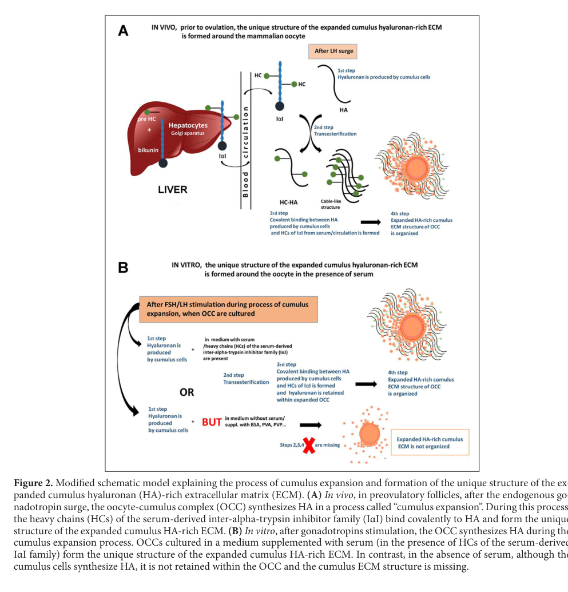

## Question

# Gene Research for Functional Annotation

## ⚠️ CRITICAL: Gene/Protein Identification Context

**BEFORE YOU BEGIN RESEARCH:** You MUST verify you are researching the CORRECT gene/protein. Gene symbols can be ambiguous, especially for less well-characterized genes from non-model organisms.

### Target Gene/Protein Identity (from UniProt):
- **UniProt Accession:** P19823
- **Protein Description:** RecName: Full=Inter-alpha-trypsin inhibitor heavy chain H2; Short=ITI heavy chain H2; Short=ITI-HC2; Short=Inter-alpha-inhibitor heavy chain 2; AltName: Full=Inter-alpha-trypsin inhibitor complex component II; AltName: Full=Serum-derived hyaluronan-associated protein; Short=SHAP; Flags: Precursor;
- **Gene Information:** Name=ITIH2; Synonyms=IGHEP2;
- **Organism (full):** Homo sapiens (Human).
- **Protein Family:** Belongs to the ITIH family. .
- **Key Domains:** ITI_HC_C. (IPR010600); ITIH. (IPR050934); VIT. (IPR013694); VWF_A. (IPR002035); vWFA_dom_sf. (IPR036465)

### MANDATORY VERIFICATION STEPS:

1. **Check if the gene symbol "ITIH2" matches the protein description above**
2. **Verify the organism is correct:** Homo sapiens (Human).
3. **Check if protein family/domains align with what you find in literature**
4. **If you find literature for a DIFFERENT gene with the same or similar symbol, STOP**

### If Gene Symbol is Ambiguous or You Cannot Find Relevant Literature:

**DO NOT PROCEED WITH RESEARCH ON A DIFFERENT GENE.** Instead:
- State clearly: "The gene symbol 'ITIH2' is ambiguous or literature is limited for this specific protein"
- Explain what you found (e.g., "Found extensive literature on a different gene with the same symbol in a different organism")
- Describe the protein based ONLY on the UniProt information provided above
- Suggest that the protein function can be inferred from domain/family information

### Research Target:

Please provide a comprehensive research report on the gene **ITIH2** (gene ID: ITIH2, UniProt: P19823) in human.

The research report should be a detailed narrative explaining the function, biological processes, and localization of the gene product. Citations should be given for all claims.

You should prioritize authoritative reviews and primary scientific literature when conducting research. You can supplement
this with annotations you find in gene/protein databases, but these can be outdated or inaccurate.

We are specifically interested in the primary function of the gene - for enzymes, what reaction is catalyzed, and what is the substrate specificity? For transporters, what is the substrate? For structural proteins or adapters, what is the broader structural role? For signaling molecules, what is the role in the pathway.

We are interested in where in or outside the cell the gene product carries out its function.

We are also interested in the signaling or biochemical pathways in which the gene functions. We are less interested in broad pleiotropic effects, except where these elucidate the precise role.

Include evidence where possible. We are interested in both experimental evidence as well as inference from structure, evolution, or bioinformatic analysis. Precise studies should be prioritized over high-throughput, where available.

## Output

Question: You are an expert researcher providing comprehensive, well-cited information.

Provide detailed information focusing on:
1. Key concepts and definitions with current understanding
2. Recent developments and latest research (prioritize 2023-2024 sources)
3. Current applications and real-world implementations
4. Expert opinions and analysis from authoritative sources
5. Relevant statistics and data from recent studies

Format as a comprehensive research report with proper citations. Include URLs and publication dates where available.
Always prioritize recent, authoritative sources and provide specific citations for all major claims.

# Gene Research for Functional Annotation

## ⚠️ CRITICAL: Gene/Protein Identification Context

**BEFORE YOU BEGIN RESEARCH:** You MUST verify you are researching the CORRECT gene/protein. Gene symbols can be ambiguous, especially for less well-characterized genes from non-model organisms.

### Target Gene/Protein Identity (from UniProt):
- **UniProt Accession:** P19823
- **Protein Description:** RecName: Full=Inter-alpha-trypsin inhibitor heavy chain H2; Short=ITI heavy chain H2; Short=ITI-HC2; Short=Inter-alpha-inhibitor heavy chain 2; AltName: Full=Inter-alpha-trypsin inhibitor complex component II; AltName: Full=Serum-derived hyaluronan-associated protein; Short=SHAP; Flags: Precursor;
- **Gene Information:** Name=ITIH2; Synonyms=IGHEP2;
- **Organism (full):** Homo sapiens (Human).
- **Protein Family:** Belongs to the ITIH family. .
- **Key Domains:** ITI_HC_C. (IPR010600); ITIH. (IPR050934); VIT. (IPR013694); VWF_A. (IPR002035); vWFA_dom_sf. (IPR036465)

### MANDATORY VERIFICATION STEPS:

1. **Check if the gene symbol "ITIH2" matches the protein description above**
2. **Verify the organism is correct:** Homo sapiens (Human).
3. **Check if protein family/domains align with what you find in literature**
4. **If you find literature for a DIFFERENT gene with the same or similar symbol, STOP**

### If Gene Symbol is Ambiguous or You Cannot Find Relevant Literature:

**DO NOT PROCEED WITH RESEARCH ON A DIFFERENT GENE.** Instead:
- State clearly: "The gene symbol 'ITIH2' is ambiguous or literature is limited for this specific protein"
- Explain what you found (e.g., "Found extensive literature on a different gene with the same symbol in a different organism")
- Describe the protein based ONLY on the UniProt information provided above
- Suggest that the protein function can be inferred from domain/family information

### Research Target:

Please provide a comprehensive research report on the gene **ITIH2** (gene ID: ITIH2, UniProt: P19823) in human.

The research report should be a detailed narrative explaining the function, biological processes, and localization of the gene product. Citations should be given for all claims.

You should prioritize authoritative reviews and primary scientific literature when conducting research. You can supplement
this with annotations you find in gene/protein databases, but these can be outdated or inaccurate.

We are specifically interested in the primary function of the gene - for enzymes, what reaction is catalyzed, and what is the substrate specificity? For transporters, what is the substrate? For structural proteins or adapters, what is the broader structural role? For signaling molecules, what is the role in the pathway.

We are interested in where in or outside the cell the gene product carries out its function.

We are also interested in the signaling or biochemical pathways in which the gene functions. We are less interested in broad pleiotropic effects, except where these elucidate the precise role.

Include evidence where possible. We are interested in both experimental evidence as well as inference from structure, evolution, or bioinformatic analysis. Precise studies should be prioritized over high-throughput, where available.

## Research report: Human **ITIH2** (UniProt **P19823**) — functional annotation and current understanding

### 0) Target verification (correct gene/protein)
The literature synthesized here concerns **human inter-α-trypsin inhibitor heavy chain H2 (ITIH2; “HC2”)**, a secreted plasma heavy chain in the inter-α-inhibitor (IαI) family that participates in **covalent heavy-chain transfer to hyaluronan (HA)** (also described as **SHAP/HC•HA**). This matches the UniProt identity given (P19823; Homo sapiens; ITIH family) and is distinct from other HA-binding receptors (e.g., CD44) or unrelated genes with similar acronyms. (zhang2024thefunctionof pages 1-2, xu2024hyaluronicacidinteracting pages 6-7)

### 1) Key concepts and definitions (current understanding)

#### 1.1 Inter-α-trypsin inhibitor (IαI) family and ITIH2’s role
The **IαI family** comprises serum-derived complexes built from a **light chain (bikunin)** plus heavy chains (including **HC2/ITIH2**). Hepatocytes are a major source of these complexes, which circulate at high concentration. (zhang2024thefunctionof pages 1-2, nagyova2024uniquehyaluronanstructure pages 2-4)

A key conceptual point is that **protease inhibition is primarily attributed to bikunin**, while the **best-characterized function of heavy chains (including ITIH2/HC2) is structural**, namely **covalent modification of HA** in extracellular matrices; this is why heavy chains are termed **“serum-derived hyaluronan-associated proteins (SHAP)”** once transferred onto HA. (xu2024hyaluronicacidinteracting pages 6-7)

#### 1.2 HC•HA / SHAP–HA complexes
**HC•HA** refers to **hyaluronan covalently modified with IαI heavy chains**, forming HA/protein assemblies that can change HA’s organization and biological effects in the extracellular matrix. HC•HA formation is widely used to explain how HA acquires distinct architectures and functions in physiology and disease. (day2024hyaluronan‐proteininteractionslilliput pages 15-15, xu2024hyaluronicacidinteracting pages 6-7)

#### 1.3 TSG-6 (TNFAIP6) as a catalyst for heavy-chain transfer
The **TNF-stimulated gene-6 protein (TSG-6 / TNFAIP6)** is central to HC transfer. It catalyzes heavy-chain movement from IαI-like donors onto HA via **sequential ester-exchange (transesterification) reactions**, involving **temporary covalent heavy-chain–TSG-6 intermediates**. (zhang2024thefunctionof pages 1-2, day2024hyaluronan‐proteininteractionslilliput pages 15-15)

### 2) Molecular function and biochemical mechanism (ITIH2-centric)

#### 2.1 Primary molecular function
Across current authoritative sources, ITIH2’s primary molecular function is best summarized as:
- **Extracellular structural modification of hyaluronan (HA)** through the provision of **HC2**, which can become **covalently attached** to HA to form **HC•HA (SHAP–HA)** complexes that stabilize and organize HA-rich extracellular matrices. (zhang2024thefunctionof pages 1-2, xu2024hyaluronicacidinteracting pages 6-7, nagyova2024uniquehyaluronanstructure pages 2-4)

This is not an enzyme in the classical “substrate → product” sense; rather, ITIH2 contributes a **reactive heavy chain** that becomes part of the HA polymer’s covalent decoration.

#### 2.2 Mechanistic steps of HC2 transfer to HA (TSG-6-dependent)
Mechanistic descriptions converge on the following model:
1. **IαI-like complexes** deliver HC2 (and other HCs) to tissues. (zhang2024thefunctionof pages 1-2, nagyova2024uniquehyaluronanstructure pages 2-4)
2. **TSG-6 forms a covalent intermediate with HC2 (HC2•TSG-6)** and then transfers HC2 onto HA, releasing free TSG-6. (zhang2024thefunctionof pages 1-2, day2024hyaluronan‐proteininteractionslilliput pages 15-15)
3. This transfer requires a sufficiently long HA acceptor; a key mechanistic parameter reported is that the **minimum even-length HA oligomer that can accept an HC is an octasaccharide** (HA8), with certain chemical modifications enabling shorter oligomers to serve as substrates. (day2024hyaluronan‐proteininteractionslilliput pages 15-15)

In the cancer/HA-interaction literature, this is additionally described as a **transesterification reaction** in which **TSG-6 and HA form a stable complex** and heavy-chain transfer is promoted **with assistance by calcium ions**. (xu2024hyaluronicacidinteracting pages 6-7)

#### 2.3 Post-synthetic “editing” and remodeling of HC•HA containing HC2
A notable recent mechanistic refinement is that, after HC•HA forms, heavy chains can be **re-distributed (“shuffled”)** between HA molecules or transferred back onto the **bikunin chondroitin sulfate (CS) chain** to form higher-molecular-weight IαI species; this implies dynamic extracellular remodeling rather than a single terminal state. (day2024hyaluronan‐proteininteractionslilliput pages 16-17)

Moreover, in arthritis synovial fluid, **HC2 can be proteolytically cleaved from HC•HA** by proteases (e.g., **ADAMTS5 and MMP7**), suggesting that **proteolytic ‘editing’** can alter the composition—and potentially the bioactivity—of HC•HA matrices. (day2024hyaluronan‐proteininteractionslilliput pages 16-17)

### 3) Subcellular/extracellular localization and tissue context

#### 3.1 Where ITIH2 is produced and where it acts
The functional model is strongly extracellular:
- **Production**: IαI family proteins are synthesized/assembled in liver (hepatocyte-centric framing) and secreted into **blood/plasma**. (zhang2024thefunctionof pages 1-2, nagyova2024uniquehyaluronanstructure pages 2-4)
- **Site of action**: Following recruitment to tissues, **only the heavy chains** (including HC2) are transferred onto **locally synthesized HA** in the extracellular matrix to generate HC•HA structures. (zhang2024thefunctionof pages 1-2, nagyova2024uniquehyaluronanstructure pages 2-4)

These descriptions align with ITIH2 being a secreted precursor protein whose main function is executed outside cells in HA-rich ECM.

#### 3.2 Physiological matrix contexts highlighted in recent literature
**Reproductive biology (cumulus expansion/ovulation):** A particularly well-defined context is the **expanded oocyte–cumulus extracellular matrix (ECM)** in preovulatory follicles, where serum-derived heavy chains covalently bind HA and stabilize the HA-rich matrix essential for ovulation and fertilization. (nagyova2024uniquehyaluronanstructure pages 1-2, nagyova2024uniquehyaluronanstructure pages 2-4)

A schematic figure in a 2024 review illustrates the in vivo path: liver synthesis → circulation → follicle → covalent HC–HA formation, and also shows that **serum is required in vitro** to retain/stabilize HA matrices around oocyte–cumulus complexes. (nagyova2024uniquehyaluronanstructure media fa68c96c)

### 4) Recent developments and latest research (prioritizing 2023–2024)

#### 4.1 2024: Mechanistic consolidation of HC transfer chemistry and substrate constraints
Day (2024) consolidates newer mechanistic details for TSG-6-mediated HC transfer, including the **HC•TSG-6 covalent intermediates** and the **HA octasaccharide minimum acceptor size** for HC transfer, plus discussion of how chemical modification can change acceptor competence. (day2024hyaluronan‐proteininteractionslilliput pages 15-15)

#### 4.2 2024: Disease-focused synthesis for ITIH family and ITIH2
A 2024 Frontiers in Medicine review compiles disease associations for ITIH2 and related ITIH family members, emphasizing ECM stabilization mechanisms and presenting several quantitative biomarker-performance statistics (see Section 6). While much of this is secondary synthesis, it is a useful map of clinical directions and hypotheses being emphasized in 2024. (zhang2024thefunctionof pages 1-2, zhang2024thefunctionof pages 5-6)

#### 4.3 2024: Human follicular-fluid proteomics linking ITIH2 to embryo quality
In a 2024 Reproductive Sciences study, human follicular fluid proteomics (IVF/ICSI context) reported ITIH2 among proteins **upregulated** in follicles associated with higher-quality day-3 embryos, consistent with a role for ITIH2/HC2 in follicular/cumulus matrix biology and oocyte developmental competence. (ji2024aproteomicanalysis pages 3-6)

### 5) Pathways and systems-level roles (authoritative interpretation)

#### 5.1 Core pathway: HA organization via HC transfer (TSG-6 axis)
The most defensible “pathway” annotation for ITIH2 is the **TSG-6–mediated HA remodeling axis**:
- ITIH2 supplies HC2
- TSG-6 catalyzes HC transfer onto HA
- resulting HC•HA matrices alter ECM mechanics and HA-dependent receptor functions.

This is explicitly linked to ECM stability and to HA structural regulation in multiple 2024 reviews. (zhang2024thefunctionof pages 1-2, xu2024hyaluronicacidinteracting pages 6-7, day2024hyaluronan‐proteininteractionslilliput pages 15-15)

#### 5.2 Cancer-relevant signaling hypotheses (secondary/interpretive)
The 2024 disease-focused review reports that ITIH2 is associated with phenotypes such as increased intercellular adhesion, suppressed proliferation, and reduced glioblastoma invasion, and proposes decreased **PI3K/AKT signaling** activity as a mechanism in that context. This should be treated as a disease-context hypothesis rather than ITIH2’s primary biochemical function. (zhang2024thefunctionof pages 3-5, zhang2024thefunctionof pages 5-6)

### 6) Current applications and real-world implementations (biomarkers; translational uses)

#### 6.1 Reproductive medicine (biomarker discovery in IVF)
Human follicular-fluid proteomics has been used to develop candidate biomarkers of embryo quality beyond morphology. In the 2024 Ji et al. study:
- **22 follicular fluid samples** (hqFF n=11 vs nhqFF n=11)
- **558 proteins identified**
- **50 differentially expressed proteins** (32 upregulated, 18 downregulated)
- DEPs called at **>1.20-fold** or **<0.67-fold** with **P<0.05** thresholds
ITIH2 is reported among the proteins upregulated in the high-quality embryo group, suggesting potential use in noninvasive biomarker strategies. (ji2024aproteomicanalysis pages 3-6)

#### 6.2 Obstetrics (preeclampsia phenotyping)
In a maternal plasma proteomics study of early- vs late-onset preeclampsia, ITIH2 was confirmed perturbed **only in late-onset preeclampsia (LOPE)** in validation, providing a concrete example of ITIH2 being used in proteomic signatures to distinguish disease phenotypes. (chen2022maternalplasmaproteome pages 5-6)

In related platelet/plasma multi-omics work, ITIH2 (with ITIH3) is discussed as a likely mediator/marker of **thrombo-inflammation** in gestational hypertension and preeclampsia—another real-world setting where ITIH2 enters biomarker panels and mechanistic hypotheses in pregnancy complications. (almeida2022proteomicsandmetabolomics pages 1-2)

#### 6.3 Oncology/infectious disease/other diagnostic signatures (review-synthesized)
The 2024 review by Zhang et al. compiles multiple proposed diagnostic applications for ITIH2 in diverse diseases, including ROC/AUC-based performance in some settings. This indicates broad exploration of ITIH2 as a circulating protein biomarker, but also highlights a limitation: different diseases may perturb the same heavy chain, constraining specificity. (zhang2024thefunctionof pages 5-6)

### 7) Relevant statistics and quantitative data (recent studies)
Key quantitative findings available in the retrieved sources include:
- **Serum concentration of IαI family proteins:** ~0.15–0.5 mg/mL in blood (reported in a 2024 review), consistent with their role as abundant plasma-derived ECM modifiers. (zhang2024thefunctionof pages 1-2)
- **Mechanistic constraint on HA acceptor size:** minimum even-length HA oligomer to accept HC transfer is **octasaccharide**. (day2024hyaluronan‐proteininteractionslilliput pages 15-15)
- **Follicular fluid proteomics (2024):** n=22 FF samples (11 vs 11); **558 proteins**; **50 DEPs**; thresholds as above; ITIH2 upregulated in the high-quality embryo group. (ji2024aproteomicanalysis pages 3-6)
- **Late-onset preeclampsia validation (2022):** ITIH2 validation **logFC 0.37228745**, **p=0.005**, with discovery table FDR 0.03. (chen2022maternalplasmaproteome pages 5-6)
- **Review-compiled diagnostic performance examples (2024):** pancreatic cancer diagnostic biomarker AUC **0.947**; osteoarticular tuberculosis AUC **0.7167 (95% CI 0.5846–0.8487)**. (zhang2024thefunctionof pages 5-6)

### 8) Expert opinions and analysis (authoritative source perspectives)

#### 8.1 What authoritative reviews agree on
Across mechanistic and disease-oriented 2024 reviews, there is strong agreement that:
- ITIH2’s heavy chain participates in **covalent HA modification** (SHAP/HC•HA formation) via **TSG-6 catalysis**, and this is the **best-characterized molecular function** of heavy chains. (xu2024hyaluronicacidinteracting pages 6-7, day2024hyaluronan‐proteininteractionslilliput pages 15-15)
- The biological impact of ITIH2 is therefore best understood through **ECM physics/architecture and HA receptor biology**, rather than through a classical enzymatic active site or transporter substrate profile. (zhang2024thefunctionof pages 1-2, day2024hyaluronan‐proteininteractionslilliput pages 15-15)

#### 8.2 Key uncertainties and open questions
Recent reviews also emphasize that important in vivo questions remain open:
- Whether HC “shuffling” among HA chains is beneficial or deleterious in inflammatory disease progression is not yet clearly tested in vivo models (e.g., arthritis). (day2024hyaluronan‐proteininteractionslilliput pages 16-17)
- Proteolytic “editing” (e.g., ADAMTS5/MMP7 cleavage of HC2 from HC•HA) can change bioactivity, but the net physiological consequences require further clarification. (day2024hyaluronan‐proteininteractionslilliput pages 16-17)

### 9) Disease associations and external evidence (knowledge-graph view)
OpenTargets lists multiple disease associations for ITIH2 (e.g., non-alcoholic fatty liver disease, neurodegenerative disease, type 2 diabetes mellitus), indicating that genetic and/or functional evidence has been aggregated across diverse indications; these associations should be interpreted as hypothesis-generating rather than a direct statement of ITIH2’s biochemical mechanism. (OpenTargets Search: -ITIH2)

### 10) Evidence summary table and key figure

The following table compiles mechanism, localization, and quantitative human findings from recent sources:

| Aspect | Key points | Quantitative/statistical details | Primary source (include DOI URL + year) |
|---|---|---|---|
| ITIH2/HC2 identity in the IαI family | Human ITIH2 encodes heavy chain 2 (HC2) of the inter-α-trypsin inhibitor (IαI) family; hepatocyte-derived serum complexes contain bikunin plus heavy chains, and HC1/HC2 are the major heavy chains in classical human IαI. HC2 is linked to bikunin through a chondroitin sulfate chain and is not the protease-inhibitory moiety; that activity resides in bikunin. (zhang2024thefunctionof pages 1-2, xu2024hyaluronicacidinteracting pages 6-7) | IαI complexes are ~225 kDa and circulate in blood at ~0.15–0.5 mg/mL; serum concentration also reported as ~0.5 mg/mL in reproductive/ECM literature. (zhang2024thefunctionof pages 1-2, nagyova2024uniquehyaluronanstructure pages 2-4) | Zhang et al., 2024, https://doi.org/10.3389/fmed.2024.1432224; Xu et al., 2024, https://doi.org/10.3390/cancers16101907; Nagyova et al., 2024, https://doi.org/10.2478/enr-2024-0020 |
| HC2 transfer to hyaluronan via TSG-6 | HC2 is transferred from IαI to hyaluronan (HA) by TSG-6/TNFAIP6 through sequential ester-exchange/transesterification reactions involving a covalent HC2•TSG-6 intermediate, generating HC•HA (SHAP-HA) complexes that stabilize HA-rich extracellular matrices. Calcium ions assist this process; TSG-6 can act as the catalytic transferase. (zhang2024thefunctionof pages 1-2, xu2024hyaluronicacidinteracting pages 6-7, day2024hyaluronan‐proteininteractionslilliput pages 15-15) | Minimum HA acceptor length for HC transfer is an octasaccharide; chemically modified HA tetra- and hexa-saccharides can also become substrates in some settings. Expected HC1 and HC2 transfer can be approximately equal depending on which HC•TSG-6 intermediate forms. (day2024hyaluronan‐proteininteractionslilliput pages 15-15) | Day, 2024, https://doi.org/10.1002/pgr2.70007; Zhang et al., 2024, https://doi.org/10.3389/fmed.2024.1432224; Xu et al., 2024, https://doi.org/10.3390/cancers16101907 |
| Localization | ITIH2/HC2 is produced mainly in liver, secreted into plasma as part of IαI, then functions extracellularly after transfer onto locally synthesized HA in tissues/ECM. HC2-containing HC•HA complexes are found in extracellular matrices and can be remodeled post-synthetically by proteolysis. (zhang2024thefunctionof pages 1-2, day2024hyaluronan‐proteininteractionslilliput pages 16-17, nagyova2024uniquehyaluronanstructure pages 2-4) | Blood concentration of IαI family proteins: ~0.15–0.5 mg/mL or ~0.5 mg/mL depending on source/review context. HC2 can be proteolytically removed from HC•HA by ADAMTS5 and MMP7 in arthritis synovial fluid. (zhang2024thefunctionof pages 1-2, day2024hyaluronan‐proteininteractionslilliput pages 16-17, nagyova2024uniquehyaluronanstructure pages 2-4) | Zhang et al., 2024, https://doi.org/10.3389/fmed.2024.1432224; Day, 2024, https://doi.org/10.1002/pgr2.70007; Nagyova et al., 2024, https://doi.org/10.2478/enr-2024-0020 |
| ECM structural role | The best-established function of HC2 is structural: covalent HA modification/crosslinking that stabilizes extracellular matrix architecture, affects HA organization, and can modulate cell adhesion/rolling through effects on CD44-containing matrices. (zhang2024thefunctionof pages 1-2, xu2024hyaluronicacidinteracting pages 6-7, day2024hyaluronan‐proteininteractionslilliput pages 15-15) | No direct catalytic turnover number reported in provided sources; mechanistic quantitative detail available is HA octasaccharide minimum substrate size for HC transfer. (day2024hyaluronan‐proteininteractionslilliput pages 15-15) | Day, 2024, https://doi.org/10.1002/pgr2.70007; Zhang et al., 2024, https://doi.org/10.3389/fmed.2024.1432224; Xu et al., 2024, https://doi.org/10.3390/cancers16101907 |
| Physiological context: ovulation/cumulus expansion | In preovulatory follicles, serum-derived HC2 (with HC1/HC3) becomes covalently attached to cumulus-cell HA, helping build the expanded HA-rich oocyte-cumulus extracellular matrix required for ovulation and fertilization. This matrix also involves TNFAIP6/TSG-6, PTX3, versican, and bikunin. (nagyova2024uniquehyaluronanstructure pages 1-2, nagyova2024uniquehyaluronanstructure pages 2-4, nagyova2024uniquehyaluronanstructure media fa68c96c) | Mouse OCC proteomics produced >24,000 mass spectra and identified 711 proteins; ITIH1, ITIH2, ITIH3, PTX3, TNFAIP6, VCAN, and VTN were among the seven especially abundant expansion-related components. At least 34 bikunin target genes were identified in earlier reproductive studies. (nagyova2024uniquehyaluronanstructure pages 2-4) | Nagyova et al., 2024, https://doi.org/10.2478/enr-2024-0020 |
| Figure-supported mechanism | A recent schematic depicts liver synthesis of IαI, circulation to the follicle, and covalent binding of heavy chains to HA in vivo; the in vitro panel shows serum dependence for retaining/stabilizing the HA matrix around the oocyte-cumulus complex. (nagyova2024uniquehyaluronanstructure media fa68c96c) | Qualitative schematic support; no additional numeric statistic in figure extraction. (nagyova2024uniquehyaluronanstructure media fa68c96c) | Nagyova et al., 2024, https://doi.org/10.2478/enr-2024-0020 |
| Human reproductive biomarker/proteomics finding (2024) | In human follicular fluid from IVF/ICSI patients, ITIH2 was among proteins upregulated in follicles yielding higher-quality day-3 embryos, consistent with a role in HA-rich cumulus/follicular matrix biology. (ji2024aproteomicanalysis pages 3-6) | Study analyzed 22 follicular-fluid samples from 19 women; 558 proteins identified; 50 differentially expressed proteins total (32 upregulated, 18 downregulated) using >1.20-fold or <0.67-fold and P<0.05 thresholds. ITIH2 was reported as upregulated in the high-quality embryo group. (ji2024aproteomicanalysis pages 3-6) | Ji et al., 2024, https://doi.org/10.1007/s43032-023-01293-x |
| Human pregnancy biomarker finding (LOPE) | Maternal plasma proteomics found ITIH2 perturbed specifically in late-onset preeclampsia (LOPE), not early-onset preeclampsia in validation, supporting disease-context-specific regulation. (chen2022maternalplasmaproteome pages 5-6) | Validation logFC for ITIH2 in LOPE vs healthy pregnancy: 0.37228745; FDR in discovery table: 0.03; validation p=0.005. (chen2022maternalplasmaproteome pages 5-6) | Chen et al., 2022, https://doi.org/10.1038/s41598-022-20658-x |
| Human thrombo-inflammation association | Plasma/platelet multi-omics in gestational hypertension and preeclampsia implicated ITIH2 (with ITIH3) as likely mediators of thrombo-inflammation rather than simple background markers. (almeida2022proteomicsandmetabolomics pages 1-2) | Clinical context statistic: preeclampsia complicates up to 8% of pregnancies; diagnostic thresholds noted as >140/90 mmHg and proteinuria ≥300 mg/24 h. Specific ITIH2 fold-change was not given in the excerpt. (almeida2022proteomicsandmetabolomics pages 1-2) | de Almeida et al., 2022, https://doi.org/10.3390/cells11081256 |
| Disease/biomarker review summary for ITIH2 | Review-level synthesis reports multiple human disease associations for ITIH2, including reduced serum levels in pediatric multiple sclerosis, pancreatic cancer diagnosis, diabetic retinopathy-associated vitreous changes, and osteoarticular tuberculosis diagnosis; these are associations, not proof of primary molecular function. (zhang2024thefunctionof pages 5-6) | Pancreatic cancer vs chronic pancreatitis AUC=0.947; osteoarticular tuberculosis AUC=0.7167 (95% CI 0.5846–0.8487). Breast-cancer estrogen receptor association reported as p=0.001 elsewhere in the review. (zhang2024thefunctionof pages 5-6, zhang2024thefunctionof pages 3-5) | Zhang et al., 2024, https://doi.org/10.3389/fmed.2024.1432224 |
| Cancer-related functional interpretation | ITIH2 is described as increasing intercellular adhesion, suppressing proliferation, and limiting glioblastoma invasion, potentially via reduced PI3K/AKT signaling; this aligns with an ECM-stabilizing/tumor-suppressive interpretation rather than enzyme activity. (zhang2024thefunctionof pages 5-6, zhang2024thefunctionof pages 3-5) | Review cites breast-cancer correlation with estrogen receptor expression at p=0.001; no direct effect size for PI3K/AKT reduction provided in excerpt. (zhang2024thefunctionof pages 5-6, zhang2024thefunctionof pages 3-5) | Zhang et al., 2024, https://doi.org/10.3389/fmed.2024.1432224 |

*Table: This table summarizes the core molecular role of human ITIH2/HC2 in the inter-alpha-inhibitor system, its extracellular localization and HA-transfer mechanism, and recent clinical/proteomic findings with quantitative details where available. It is useful as a compact evidence map linking biochemical function to physiological and disease contexts.*

A 2024 figure summarizing the liver-to-follicle route and serum dependence of HA–HC matrix formation in cumulus expansion is available here (schematic): (nagyova2024uniquehyaluronanstructure media fa68c96c)

### 11) Key references (with URLs and publication dates)
- Day AJ. **Hyaluronan-protein interactions: Lilliput revisited.** *Proteoglycan Research* (Oct 2024). https://doi.org/10.1002/pgr2.70007 (day2024hyaluronan‐proteininteractionslilliput pages 15-15, day2024hyaluronan‐proteininteractionslilliput pages 16-17)
- Zhang X-f et al. **The function of the inter-alpha-trypsin inhibitors in the development of disease.** *Frontiers in Medicine* (**Published 01 Aug 2024**). https://doi.org/10.3389/fmed.2024.1432224 (zhang2024thefunctionof pages 1-2, zhang2024thefunctionof pages 5-6, zhang2024thefunctionof pages 3-5)
- Xu Y et al. **Hyaluronic Acid Interacting Molecules Mediated Crosstalk…** *Cancers* (May 2024). https://doi.org/10.3390/cancers16101907 (xu2024hyaluronicacidinteracting pages 6-7)
- Nagyova E et al. **Unique hyaluronan structure of expanded oocyte-cumulus extracellular matrix in ovarian follicles.** *Endocrine Regulations* (Jan 2024). https://doi.org/10.2478/enr-2024-0020 (nagyova2024uniquehyaluronanstructure pages 2-4, nagyova2024uniquehyaluronanstructure media fa68c96c)
- Ji J et al. **A Proteomic Analysis of Human Follicular Fluid…** *Reproductive Sciences* (Aug 2024; online 2023). https://doi.org/10.1007/s43032-023-01293-x (ji2024aproteomicanalysis pages 3-6)
- Chen H et al. **Maternal plasma proteome profiling… preeclampsia.** *Scientific Reports* (Nov 2022). https://doi.org/10.1038/s41598-022-20658-x (chen2022maternalplasmaproteome pages 5-6)
- de Almeida LGN et al. **Proteomics and Metabolomics Profiling… preeclampsia.** *Cells* (07 Apr 2022). https://doi.org/10.3390/cells11081256 (almeida2022proteomicsandmetabolomics pages 1-2)

References

1. (zhang2024thefunctionof pages 1-2): Xin-feng Zhang, Xiao-li Zhang, Li Guo, Yun-ping Bai, Yan Tian, and Hua-you Luo. The function of the inter-alpha-trypsin inhibitors in the development of disease. Frontiers in Medicine, Aug 2024. URL: https://doi.org/10.3389/fmed.2024.1432224, doi:10.3389/fmed.2024.1432224. This article has 37 citations.

2. (xu2024hyaluronicacidinteracting pages 6-7): Yali Xu, Johannes Benedikt, and Lin Ye. Hyaluronic acid interacting molecules mediated crosstalk between cancer cells and microenvironment from primary tumour to distant metastasis. Cancers, 16:1907, May 2024. URL: https://doi.org/10.3390/cancers16101907, doi:10.3390/cancers16101907. This article has 26 citations.

3. (nagyova2024uniquehyaluronanstructure pages 2-4): Eva Nagyova, Alzbeta Bujnakova Mlynarcikova, Lucie Nemcova, and Sona Scsukova. Unique hyaluronan structure of expanded oocyte-cumulus extracellular matrix in ovarian follicles. Endocrine Regulations, 58:174-180, Jan 2024. URL: https://doi.org/10.2478/enr-2024-0020, doi:10.2478/enr-2024-0020. This article has 2 citations.

4. (day2024hyaluronan‐proteininteractionslilliput pages 15-15): Anthony J. Day. Hyaluronan‐protein interactions: lilliput revisited. Proteoglycan Research, Oct 2024. URL: https://doi.org/10.1002/pgr2.70007, doi:10.1002/pgr2.70007. This article has 15 citations.

5. (day2024hyaluronan‐proteininteractionslilliput pages 16-17): Anthony J. Day. Hyaluronan‐protein interactions: lilliput revisited. Proteoglycan Research, Oct 2024. URL: https://doi.org/10.1002/pgr2.70007, doi:10.1002/pgr2.70007. This article has 15 citations.

6. (nagyova2024uniquehyaluronanstructure pages 1-2): Eva Nagyova, Alzbeta Bujnakova Mlynarcikova, Lucie Nemcova, and Sona Scsukova. Unique hyaluronan structure of expanded oocyte-cumulus extracellular matrix in ovarian follicles. Endocrine Regulations, 58:174-180, Jan 2024. URL: https://doi.org/10.2478/enr-2024-0020, doi:10.2478/enr-2024-0020. This article has 2 citations.

7. (nagyova2024uniquehyaluronanstructure media fa68c96c): Eva Nagyova, Alzbeta Bujnakova Mlynarcikova, Lucie Nemcova, and Sona Scsukova. Unique hyaluronan structure of expanded oocyte-cumulus extracellular matrix in ovarian follicles. Endocrine Regulations, 58:174-180, Jan 2024. URL: https://doi.org/10.2478/enr-2024-0020, doi:10.2478/enr-2024-0020. This article has 2 citations.

8. (zhang2024thefunctionof pages 5-6): Xin-feng Zhang, Xiao-li Zhang, Li Guo, Yun-ping Bai, Yan Tian, and Hua-you Luo. The function of the inter-alpha-trypsin inhibitors in the development of disease. Frontiers in Medicine, Aug 2024. URL: https://doi.org/10.3389/fmed.2024.1432224, doi:10.3389/fmed.2024.1432224. This article has 37 citations.

9. (ji2024aproteomicanalysis pages 3-6): Jingjuan Ji, Xinyi Zhu, Yan Zhang, Lijun Shui, Shun Bai, Lingli Huang, Haoyu Wang, Shiwei Fan, Zelin Zhang, Li-hua Luo, and Bo Xu. A proteomic analysis of human follicular fluid: proteomic profile associated with embryo quality. Reproductive sciences, 31:199-211, Aug 2024. URL: https://doi.org/10.1007/s43032-023-01293-x, doi:10.1007/s43032-023-01293-x. This article has 4 citations and is from a peer-reviewed journal.

10. (zhang2024thefunctionof pages 3-5): Xin-feng Zhang, Xiao-li Zhang, Li Guo, Yun-ping Bai, Yan Tian, and Hua-you Luo. The function of the inter-alpha-trypsin inhibitors in the development of disease. Frontiers in Medicine, Aug 2024. URL: https://doi.org/10.3389/fmed.2024.1432224, doi:10.3389/fmed.2024.1432224. This article has 37 citations.

11. (chen2022maternalplasmaproteome pages 5-6): Hao Chen, Ingrid Aneman, Valentina Nikolic, Natasa Karadzov Orlic, Zeljko Mikovic, Milan Stefanovic, Zoran Cakic, Hristina Jovanovic, Stephanie E. L. Town, Matthew P. Padula, and Lana McClements. Maternal plasma proteome profiling of biomarkers and pathogenic mechanisms of early-onset and late-onset preeclampsia. Scientific Reports, Nov 2022. URL: https://doi.org/10.1038/s41598-022-20658-x, doi:10.1038/s41598-022-20658-x. This article has 40 citations and is from a peer-reviewed journal.

12. (almeida2022proteomicsandmetabolomics pages 1-2): Luiz Gustavo N. de Almeida, Daniel Young, Lorraine Chow, Joshua Nicholas, Adrienne Lee, Man-Chiu Poon, Antoine Dufour, and Ejaife O. Agbani. Proteomics and metabolomics profiling of platelets and plasma mediators of thrombo-inflammation in gestational hypertension and preeclampsia. Cells, 11:1256, Apr 2022. URL: https://doi.org/10.3390/cells11081256, doi:10.3390/cells11081256. This article has 56 citations.

13. (OpenTargets Search: -ITIH2): Open Targets Query (-ITIH2, 5 results). Buniello, A. et al. (2025). Open Targets Platform: facilitating therapeutic hypotheses building in drug discovery. Nucleic Acids Research.

## Artifacts

- [Edison artifact artifact-00](ITIH2-deep-research-falcon_artifacts/artifact-00.md)

## Citations

1. xu2024hyaluronicacidinteracting pages 6-7
2. ji2024aproteomicanalysis pages 3-6
3. chen2022maternalplasmaproteome pages 5-6
4. almeida2022proteomicsandmetabolomics pages 1-2
5. zhang2024thefunctionof pages 5-6
6. zhang2024thefunctionof pages 1-2
7. nagyova2024uniquehyaluronanstructure pages 2-4
8. nagyova2024uniquehyaluronanstructure pages 1-2
9. zhang2024thefunctionof pages 3-5
10. https://doi.org/10.3389/fmed.2024.1432224;
11. https://doi.org/10.3390/cancers16101907;
12. https://doi.org/10.2478/enr-2024-0020
13. https://doi.org/10.1002/pgr2.70007;
14. https://doi.org/10.3390/cancers16101907
15. https://doi.org/10.1007/s43032-023-01293-x
16. https://doi.org/10.1038/s41598-022-20658-x
17. https://doi.org/10.3390/cells11081256
18. https://doi.org/10.3389/fmed.2024.1432224
19. https://doi.org/10.1002/pgr2.70007
20. https://doi.org/10.3389/fmed.2024.1432224,
21. https://doi.org/10.3390/cancers16101907,
22. https://doi.org/10.2478/enr-2024-0020,
23. https://doi.org/10.1002/pgr2.70007,
24. https://doi.org/10.1007/s43032-023-01293-x,
25. https://doi.org/10.1038/s41598-022-20658-x,
26. https://doi.org/10.3390/cells11081256,