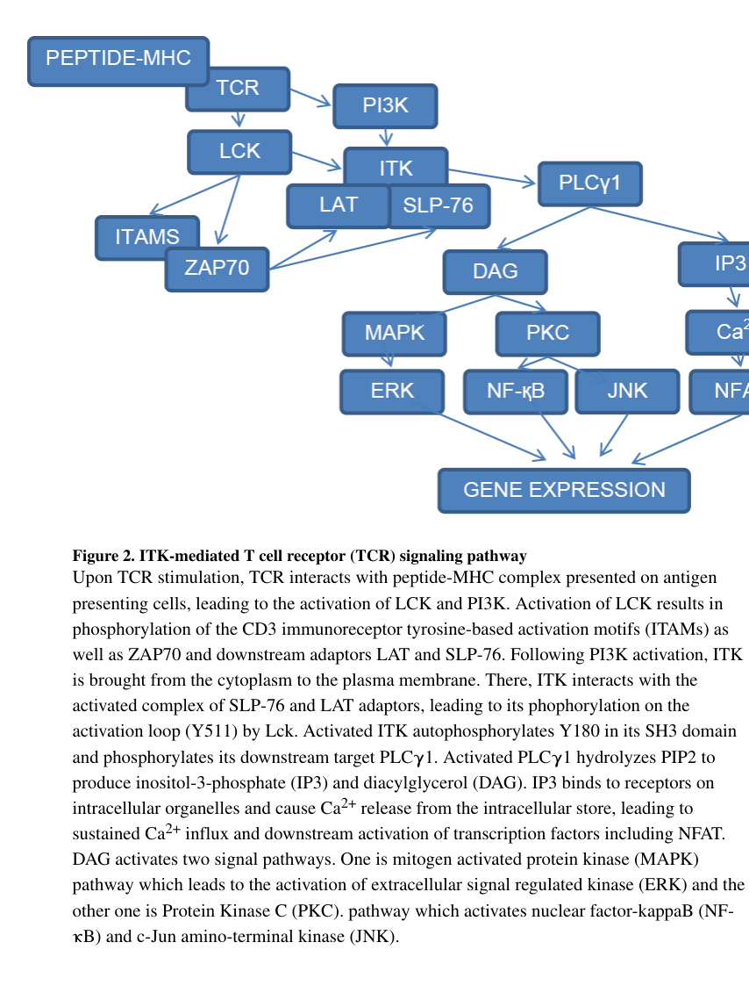

## Question

# Gene Research for Functional Annotation

## ⚠️ CRITICAL: Gene/Protein Identification Context

**BEFORE YOU BEGIN RESEARCH:** You MUST verify you are researching the CORRECT gene/protein. Gene symbols can be ambiguous, especially for less well-characterized genes from non-model organisms.

### Target Gene/Protein Identity (from UniProt):
- **UniProt Accession:** Q08881
- **Protein Description:** RecName: Full=Tyrosine-protein kinase ITK/TSK; EC=2.7.10.2; AltName: Full=Interleukin-2-inducible T-cell kinase; Short=IL-2-inducible T-cell kinase; AltName: Full=Kinase EMT; AltName: Full=T-cell-specific kinase; AltName: Full=Tyrosine-protein kinase Lyk;
- **Gene Information:** Name=ITK; Synonyms=EMT, LYK;
- **Organism (full):** Homo sapiens (Human).
- **Protein Family:** Belongs to the protein kinase superfamily. Tyr protein
- **Key Domains:** ITK_PTKc. (IPR042785); ITK_SH3. (IPR035583); Kinase-like_dom_sf. (IPR011009); Non-receptor_tyrosine_kinases. (IPR050198); PH-like_dom_sf. (IPR011993)

### MANDATORY VERIFICATION STEPS:

1. **Check if the gene symbol "ITK" matches the protein description above**
2. **Verify the organism is correct:** Homo sapiens (Human).
3. **Check if protein family/domains align with what you find in literature**
4. **If you find literature for a DIFFERENT gene with the same or similar symbol, STOP**

### If Gene Symbol is Ambiguous or You Cannot Find Relevant Literature:

**DO NOT PROCEED WITH RESEARCH ON A DIFFERENT GENE.** Instead:
- State clearly: "The gene symbol 'ITK' is ambiguous or literature is limited for this specific protein"
- Explain what you found (e.g., "Found extensive literature on a different gene with the same symbol in a different organism")
- Describe the protein based ONLY on the UniProt information provided above
- Suggest that the protein function can be inferred from domain/family information

### Research Target:

Please provide a comprehensive research report on the gene **ITK** (gene ID: ITK, UniProt: Q08881) in human.

The research report should be a detailed narrative explaining the function, biological processes, and localization of the gene product. Citations should be given for all claims.

You should prioritize authoritative reviews and primary scientific literature when conducting research. You can supplement
this with annotations you find in gene/protein databases, but these can be outdated or inaccurate.

We are specifically interested in the primary function of the gene - for enzymes, what reaction is catalyzed, and what is the substrate specificity? For transporters, what is the substrate? For structural proteins or adapters, what is the broader structural role? For signaling molecules, what is the role in the pathway.

We are interested in where in or outside the cell the gene product carries out its function.

We are also interested in the signaling or biochemical pathways in which the gene functions. We are less interested in broad pleiotropic effects, except where these elucidate the precise role.

Include evidence where possible. We are interested in both experimental evidence as well as inference from structure, evolution, or bioinformatic analysis. Precise studies should be prioritized over high-throughput, where available.

## Output

Question: You are an expert researcher providing comprehensive, well-cited information.

Provide detailed information focusing on:
1. Key concepts and definitions with current understanding
2. Recent developments and latest research (prioritize 2023-2024 sources)
3. Current applications and real-world implementations
4. Expert opinions and analysis from authoritative sources
5. Relevant statistics and data from recent studies

Format as a comprehensive research report with proper citations. Include URLs and publication dates where available.
Always prioritize recent, authoritative sources and provide specific citations for all major claims.

# Gene Research for Functional Annotation

## ⚠️ CRITICAL: Gene/Protein Identification Context

**BEFORE YOU BEGIN RESEARCH:** You MUST verify you are researching the CORRECT gene/protein. Gene symbols can be ambiguous, especially for less well-characterized genes from non-model organisms.

### Target Gene/Protein Identity (from UniProt):
- **UniProt Accession:** Q08881
- **Protein Description:** RecName: Full=Tyrosine-protein kinase ITK/TSK; EC=2.7.10.2; AltName: Full=Interleukin-2-inducible T-cell kinase; Short=IL-2-inducible T-cell kinase; AltName: Full=Kinase EMT; AltName: Full=T-cell-specific kinase; AltName: Full=Tyrosine-protein kinase Lyk;
- **Gene Information:** Name=ITK; Synonyms=EMT, LYK;
- **Organism (full):** Homo sapiens (Human).
- **Protein Family:** Belongs to the protein kinase superfamily. Tyr protein
- **Key Domains:** ITK_PTKc. (IPR042785); ITK_SH3. (IPR035583); Kinase-like_dom_sf. (IPR011009); Non-receptor_tyrosine_kinases. (IPR050198); PH-like_dom_sf. (IPR011993)

### MANDATORY VERIFICATION STEPS:

1. **Check if the gene symbol "ITK" matches the protein description above**
2. **Verify the organism is correct:** Homo sapiens (Human).
3. **Check if protein family/domains align with what you find in literature**
4. **If you find literature for a DIFFERENT gene with the same or similar symbol, STOP**

### If Gene Symbol is Ambiguous or You Cannot Find Relevant Literature:

**DO NOT PROCEED WITH RESEARCH ON A DIFFERENT GENE.** Instead:
- State clearly: "The gene symbol 'ITK' is ambiguous or literature is limited for this specific protein"
- Explain what you found (e.g., "Found extensive literature on a different gene with the same symbol in a different organism")
- Describe the protein based ONLY on the UniProt information provided above
- Suggest that the protein function can be inferred from domain/family information

### Research Target:

Please provide a comprehensive research report on the gene **ITK** (gene ID: ITK, UniProt: Q08881) in human.

The research report should be a detailed narrative explaining the function, biological processes, and localization of the gene product. Citations should be given for all claims.

You should prioritize authoritative reviews and primary scientific literature when conducting research. You can supplement
this with annotations you find in gene/protein databases, but these can be outdated or inaccurate.

We are specifically interested in the primary function of the gene - for enzymes, what reaction is catalyzed, and what is the substrate specificity? For transporters, what is the substrate? For structural proteins or adapters, what is the broader structural role? For signaling molecules, what is the role in the pathway.

We are interested in where in or outside the cell the gene product carries out its function.

We are also interested in the signaling or biochemical pathways in which the gene functions. We are less interested in broad pleiotropic effects, except where these elucidate the precise role.

Include evidence where possible. We are interested in both experimental evidence as well as inference from structure, evolution, or bioinformatic analysis. Precise studies should be prioritized over high-throughput, where available.

# Human ITK (UniProt Q08881): functional annotation research report

**Identity verified.** The requested human **ITK** encodes interleukin-2-inducible T-cell kinase, also called EMT or TSK. It is a predominantly T-cell-expressed, intracellular **Tec-family non-receptor protein tyrosine kinase**, not a receptor or transporter. Its architecture—N-terminal pleckstrin-homology (PH) domain, Tec-homology/proline-rich region, SH3 and SH2 interaction domains, and C-terminal SH1 catalytic domain—agrees with the supplied Q08881 kinase, PH-like and SH3 domain annotations. ITK is also reported in NK and mast cells. No conflicting gene identity was used in this report. (zhong2014targetinginterleukin2inducible pages 1-3, qi2011structureandfunction pages 1-2, jiang2023itkdegradationto pages 1-4)

## Primary biochemical function and substrate specificity

ITK transfers a phosphate group **from ATP to tyrosine residues of proteins**. Its best-established signaling reaction is **ATP + PLCγ1-Tyr783 → ADP + PLCγ1-phospho-Tyr783**, where PLCγ1 is encoded by *PLCG1*. This is *not* phosphoinositide hydrolysis: phosphorylation activates PLCγ1, which subsequently catalyzes the separate reaction converting membrane PIP₂ into inositol 1,4,5-trisphosphate (IP₃) and diacylglycerol (DAG). ITK can also autophosphorylate its own SH3-domain Tyr180; by contrast, upstream LCK phosphorylates ITK activation-loop Tyr511. Thus, phosphorylation of ITK Tyr511 is an **input** to ITK, not its main substrate reaction. (min2008interleukin2tyrosinekinasesubstrate pages 73-78, belmont2017aplcγ1feedback pages 1-3, zhong2014targetinginterleukin2inducible pages 11-13)

ITK’s selectivity for PLCγ1 is not adequately described by a short sequence surrounding Tyr783. In direct phosphorylation and competition experiments, PLCγ1’s **C-terminal SH2 domain (SH2C)** docks onto the ITK **kinase domain** through a noncanonical, phosphotyrosine-independent interface, positioning the more distant Tyr783 for phosphorylation. Altering PLCγ1 SH2C residues **E709, K711, R748, K749, K751 or R753** diminished Tyr783 phosphorylation; paired docking-site mutations also impaired phosphorylation of *full-length* PLCγ1. Unrelated SH2 domains did not compete comparably. These substrate-mutation, structural-control and purified-enzyme results provide more specific evidence for a direct ITK–PLCγ1 reaction than changes in downstream phosphoproteins alone. The experiments establish an important physiological substrate, **not** a complete inventory of every ITK substrate. (min2008interleukin2tyrosinekinasesubstrate pages 73-78)

Other proteins, including T-bet, TIM-3 and TFII-I, have been listed as candidate ITK targets in reviews, but the evidence examined here is less definitive for their site-specific direct phosphorylation than for PLCγ1 Tyr783. Likewise, a decrease in ERK phosphorylation after ITK inhibition describes **downstream pathway activity**, not proof that ERK is directly phosphorylated by ITK. (zhong2014targetinginterleukin2inducible pages 1-3, hsu2024synthesisandcharacterization pages 10-11)

## Where ITK acts and how the pathway operates

ITK’s principal signaling location is the **cytoplasmic face of the plasma membrane during antigen-receptor activation**. It is not a secreted protein or constitutively membrane-spanning receptor. Following T-cell-receptor (TCR) engagement, PI3K-generated phosphatidylinositol-3,4,5-trisphosphate (**PIP₃**) binds ITK’s PH domain and recruits cytoplasmic ITK to membrane-associated signaling assemblies. SH2/SH3-mediated interactions help position it at the **LAT–SLP-76 scaffold**, near PLCγ1; LCK-dependent Tyr511 phosphorylation activates the kinase. The Tec-homology proline-rich region can bind ITK’s own SH3 domain, providing an additional regulatory interaction. Stimulus-dependent membrane recruitment and clustering make cellular position part of substrate selection and signal control. (zhong2014targetinginterleukin2inducible pages 1-3, qi2011structureandfunction pages 2-3, qi2011structureandfunction pages 3-4, jiang2023itkdegradationto pages 1-4)

The resulting sequence is **TCR → LCK/ZAP70 and PI3K → LAT–SLP-76/PIP₃-dependent ITK recruitment → ITK activation → PLCγ1 Tyr783 phosphorylation → PIP₂ cleavage → IP₃/Ca²⁺/NFAT and DAG-dependent signaling**. IP₃ promotes release of intracellular Ca²⁺ and subsequent calcium-dependent transcription; the DAG arm supports signaling including MAPK and PKC/NF-κB. This is ITK’s most precise, well-supported pathway role: it **amplifies and tunes TCR-to-PLCγ1 signal strength**, rather than serving as the lipid-cleaving enzyme itself. A published pathway schematic illustrates the membrane scaffold, PI3K/LCK inputs and PLCγ1-to-IP₃/DAG outputs. (zhong2014targetinginterleukin2inducible pages 1-3, qi2011structureandfunction pages 1-2, zhong2014targetinginterleukin2inducible media 7739f7fa)

The following table distinguishes directly established molecular findings from broader or preclinical observations.

| Feature | Evidence | Confidence/qualification |
|---|---|---|
| Identity and architecture | Human **ITK** (also EMT/TSK) is a 72-kDa Tec-family non-receptor tyrosine kinase with **PH–TH/proline-rich–SH3–SH2–SH1 kinase** architecture (zhong2014targetinginterleukin2inducible pages 1-3) | **High:** matches the specified human protein Q08881; no symbol conflict identified. |
| Catalytic reaction and specificity | **ATP + PLCG1-Tyr783 → ADP + PLCG1-phospho-Tyr783.** Efficient phosphorylation depends on phosphotyrosine-independent docking of the ITK kinase domain to PLCG1 SH2C; implicated PLCG1 residues are E709, K711, R748, K749, K751, and R753 (min2008interleukin2tyrosinekinasesubstrate pages 73-78) | **High for direct in-vitro catalysis and docking:** supported by purified-protein competition, mutagenesis, structure controls, and full-length PLCG1 assays. Physiological ATP/Mg²⁺ use follows protein-kinase chemistry. |
| Functional location | ITK moves from the cytosol to PIP3-containing plasma membrane after TCR/PI3K activation and is positioned with PLCG1 on the LAT–SLP-76 scaffold (zhong2014targetinginterleukin2inducible pages 1-3) | **High:** stimulus-dependent membrane recruitment, not constitutive membrane residence. |
| Immediate downstream pathway | ITK activates PLCG1; PLCG1 hydrolyzes PIP2 to IP3 and DAG. IP3 drives Ca²⁺–NFAT signaling, whereas DAG supports MAPK and PKC–NF-κB signaling (zhong2014targetinginterleukin2inducible pages 1-3) | **High for pathway placement:** PLCG1 performs lipid hydrolysis; ITK performs the upstream tyrosine-phosphorylation reaction. |
| Targeted degradation | The ITK degrader BSJ-05-037 caused **99.2% tumor ITK degradation** and **>90% reduction of GATA-3** in a CTCL xenograft experiment (jiang2023itkdegradationto pages 7-9) | **Strong preclinical perturbation evidence:** measured in mouse xenografts, not evidence of efficacy in patients. |
| Human loss-of-function phenotype | A 2024 patient with compound-heterozygous pathogenic ITK variants had CD4⁺ lymphocytopenia, memory-B-cell deficiency, reduced Tregs, warts, immune thrombocytopenia, and EBV-associated Hodgkin lymphoma (filippo2024multipletumorsin pages 1-2) | **Human genetic/clinical support, but low generalizability:** single case with prior oncologic treatment and potential confounding. |
| T-cell fate mechanism | In mouse CD4⁺ T cells, loss or inhibition of ITK reduced TH17 differentiation and promoted Foxp3⁺ Treg-like cells; raising cytosolic Ca²⁺ rescued TH17 differentiation and prevented the switch (anannya2024thekinaseitk pages 6-7) | **Mechanistically persuasive but species-limited:** predominantly murine and in vitro; the switched cells should not be assumed identical to human bona fide Tregs. |
| Clinical translation | A recruiting phase III trial plans to compare soquelitinib with standard care in **150** adults with relapsed/refractory peripheral T-cell lymphomas; progression-free survival is the primary endpoint (NCT06561048 chunk 1) | **Clinical development, not proof of benefit:** enrollment and endpoints are prospective; efficacy and safety results were not yet established in the cited registry record. |

*Table: A concise evidence hierarchy for human ITK identity, catalytic function, localization, pathway role, genetic phenotypes, recent experimental perturbations, and clinical development. Qualifications distinguish direct biochemical or human evidence from mouse studies and prospective trials.*

## Human functional evidence and 2023–2024 advances

**Human loss of function establishes biological importance.** In a 2014 *Blood* report, a 17-year-old with a homozygous early nonsense variant, **ITK p.Q17X**, had marked CD4⁺ T-cell lymphopenia, impaired CD3/CD28-stimulated proliferation and absent invariant NKT cells. This shows that ITK deficiency can produce clinically consequential T-cell defects even without early EBV-driven lymphoproliferation. A **December 2024** single-patient report described two pathogenic ITK variants alongside CD4⁺ lymphopenia, reduced regulatory T cells, recurrent warts and EBV-associated Hodgkin lymphoma; prior cancer treatment and the single-case design limit causal attribution for the patient’s multiple tumors. These human observations reinforce, but do not by themselves map, the kinase’s precise catalytic reaction. (serwas2014identificationofitk pages 1-2, filippo2024multipletumorsin pages 1-2)

**A 2023 degradation study tested pathway dependence.** Jiang and colleagues’ heterobifunctional degrader **BSJ-05-037** reduced ITK protein and PLCγ1 phosphorylation in T-cell lymphoma models; proteasome- and cereblon-dependence, an inactive comparator and ITK genetic disruption strengthened interpretation of its action. In a mouse cutaneous-T-cell-lymphoma xenograft experiment, the reported regimen produced **99.2% tumor ITK degradation** and a **>90% decrease in tumor GATA-3**. These are pharmacodynamic measurements in mice—not patient response rates or evidence that GATA-3 is a direct ITK phosphorylation substrate. The authors also observed improved vincristine sensitivity in experimental lymphoma models. (jiang2023itkdegradationto pages 5-7, jiang2023itkdegradationto pages 7-9, jiang2023itkdegradationto pages 1-4)

**A July 2024 mechanistic study sharpened the pathway interpretation.** In mouse naïve CD4⁺ T cells cultured under TH17-polarizing conditions, *Itk* deletion or inhibition reduced TH17 differentiation and generated suppressive Foxp3⁺ **Treg-like** cells. Increasing intracellular Ca²⁺ with ionomycin or thapsigargin reversed the switch, whereas the tested MAPK-pathway perturbations did not reproduce it. ITK inhibition during murine allergic inflammation also increased the lung Treg:TH17 ratio. The authors therefore implicate the **ITK–PLCγ1–IP₃–Ca²⁺ branch** in this lineage decision; they do **not** establish that the switched mouse cells are fully equivalent to human regulatory T cells. (anannya2024thekinaseitk pages 1-3, anannya2024thekinaseitk pages 6-7, anannya2024thekinaseitk pages 7-9, anannya2024thekinaseitk pages 9-11)

## Applications and translational status

ITK is a **drug-development target** in T-cell malignancies and immune-mediated disease, and a gene considered in evaluation of otherwise unexplained T-cell immunodeficiency. The selective covalent inhibitor **soquelitinib (CPI-818)** was characterized in **December 2024**: it labels ITK **Cys442**, had a reported biochemical **ITK binding Kd of 6.5 nM**, and showed at least **80-fold selectivity** over other kinases in the study’s 11-member homologous-cysteine panel. A binding Kd is **not** a cellular IC₅₀ or a clinical efficacy estimate. Its reported antitumor and immune effects in that study included preclinical mouse experiments. (hsu2024synthesisandcharacterization pages 1-2, hsu2024synthesisandcharacterization pages 6-8, serwas2014identificationofitk pages 1-2)

Registered studies document clinical *testing*, rather than established efficacy: **[NCT06561048](https://clinicaltrials.gov/study/NCT06561048)** is a recruiting, randomized **phase III** comparison of soquelitinib with belinostat or pralatrexate in relapsed/refractory peripheral T-cell lymphomas, with **150 participants planned** and progression-free survival as the primary endpoint. **[NCT06345404](https://clinicaltrials.gov/study/NCT06345404)** is listed as a completed **phase I** placebo-controlled atopic-dermatitis study with **82 enrolled**; enrollment and completion alone do not establish its efficacy. **[NCT06730126](https://clinicaltrials.gov/study/NCT06730126)** is a recruiting **phase II** autoimmune-lymphoproliferative-syndrome study planning **15 participants**; its ≥25% reduction in spleen or target-node volume is a *prespecified outcome threshold*, not a reported result. Registry statuses can change. (NCT06561048 chunk 1, NCT06345404 chunk 1, NCT06730126 chunk 1)

**Ibrutinib provides a distinct real-world pharmacological example:** it is a BTK inhibitor that also irreversibly inhibits ITK, so a response to ibrutinib cannot be assigned specifically to ITK blockade. It has been administered in chronic graft-versus-host disease research, including completed **[NCT02195869](https://clinicaltrials.gov/study/NCT02195869)**, which enrolled **45** participants. This supports clinical exposure to a drug active against ITK but should not be confused with proof of efficacy for selective ITK inhibition. (dubovsky2013ibrutinibisan pages 1-2, NCT02195869 chunk 1)

**Assessment.** The strongest functional annotation for human Q08881 is **an intracellular, stimulus-recruited Tec kinase that phosphorylates PLCγ1—particularly Tyr783—at the T-cell membrane signaling scaffold, thereby coupling antigen recognition to Ca²⁺ and DAG signaling**. Human deficiency validates the pathway’s importance; recent mouse perturbation, degrader and inhibitor studies extend its mechanistic and therapeutic relevance, with species, off-target and clinical-outcome limitations kept distinct. (min2008interleukin2tyrosinekinasesubstrate pages 73-78, jiang2023itkdegradationto pages 1-4, serwas2014identificationofitk pages 1-2, hsu2024synthesisandcharacterization pages 1-2)

**Principal dated sources:** [Zhong et al., June 2014, functional review](https://doi.org/10.14304/surya.jpr.v2n6.1); [Min, 2008, biochemical docking experiments](https://doi.org/10.31274/etd-180810-1277); [Serwas et al., July 2014, human genetics](https://doi.org/10.1182/blood-2014-03-564930); [Jiang et al., April 2023, ITK degradation](https://doi.org/10.1016/j.chembiol.2023.03.007); [Anannya et al., July 2024, calcium-dependent differentiation](https://doi.org/10.1126/scisignal.adh2381); [Di Filippo et al., December 2024, human case report](https://doi.org/10.3390/ijms252313181); and [Hsu et al., December 2024, soquelitinib characterization](https://doi.org/10.1038/s44386-024-00002-1). (zhong2014targetinginterleukin2inducible pages 1-3, min2008interleukin2tyrosinekinasesubstrate pages 73-78, serwas2014identificationofitk pages 1-2, jiang2023itkdegradationto pages 1-4, anannya2024thekinaseitk pages 1-3, filippo2024multipletumorsin pages 1-2, hsu2024synthesisandcharacterization pages 1-2)

References

1. (zhong2014targetinginterleukin2inducible pages 1-3): Yiming Zhong, Amy J. Johnson, John C. Byrd, and Jason A. Dubovsky. Targeting interleukin-2 inducible t-cell kinase (itk) in t-cell related diseases. Postdoc Journal, 2:1-11, Jun 2014. URL: https://doi.org/10.14304/surya.jpr.v2n6.1, doi:10.14304/surya.jpr.v2n6.1. This article has 34 citations.

2. (qi2011structureandfunction pages 1-2): Qian Qi, Arun Kumar Kannan, and Avery August. Structure and function of tec family kinase itk. BioMolecular Concepts, 2:223-232, Jun 2011. URL: https://doi.org/10.1515/bmc.2011.020, doi:10.1515/bmc.2011.020. This article has 6 citations and is from a peer-reviewed journal.

3. (jiang2023itkdegradationto pages 1-4): Baishan Jiang, David M. Weinstock, Katherine A. Donovan, Hong-Wei Sun, Ashley Wolfe, Sam Amaka, Nicholas L. Donaldson, Gongwei Wu, Yuan Jiang, Ryan A. Wilcox, Eric S. Fischer, Nathanael S. Gray, and Wenchao Wu. Itk degradation to block t cell receptor signaling and overcome therapeutic resistance in t cell lymphomas. Cell Chemical Biology, 30(4):383-393.e6, Apr 2023. URL: https://doi.org/10.1016/j.chembiol.2023.03.007, doi:10.1016/j.chembiol.2023.03.007. This article has 19 citations and is from a domain leading peer-reviewed journal.

4. (min2008interleukin2tyrosinekinasesubstrate pages 73-78): Lie Min. Interleukin-2-tyrosine kinase substrate docking and its regulation by an intramolecular interaction in phospholipase Cg1. PhD thesis, Iowa State University, 2008. URL: https://doi.org/10.31274/etd-180810-1277, doi:10.31274/etd-180810-1277. This article has 0 citations.

5. (belmont2017aplcγ1feedback pages 1-3): Judson Belmont, Tao Gu, Ashley Mudd, and Arthur R. Salomon. A plc-γ1 feedback pathway regulates lck substrate phosphorylation at the t-cell receptor and slp-76 complex. Jul 2017. URL: https://doi.org/10.1021/acs.jproteome.6b01026, doi:10.1021/acs.jproteome.6b01026. This article has 15 citations and is from a peer-reviewed journal.

6. (zhong2014targetinginterleukin2inducible pages 11-13): Yiming Zhong, Amy J. Johnson, John C. Byrd, and Jason A. Dubovsky. Targeting interleukin-2 inducible t-cell kinase (itk) in t-cell related diseases. Postdoc Journal, 2:1-11, Jun 2014. URL: https://doi.org/10.14304/surya.jpr.v2n6.1, doi:10.14304/surya.jpr.v2n6.1. This article has 34 citations.

7. (hsu2024synthesisandcharacterization pages 10-11): Lih-Yun Hsu, James T. Rosenbaum, Erik Verner, William B. Jones, Craig M. Hill, James W. Janc, Joseph J. Buggy, Rahul D. Pawar, Poorva Ghosh, Dan Li, Ning Ding, John C. Reneau, Michael S. Khodadoust, Youn H. Kim, Ryan A. Wilcox, and Richard A. Miller. Synthesis and characterization of soquelitinib a selective itk inhibitor that modulates tumor immunity. npj Drug Discovery, Dec 2024. URL: https://doi.org/10.1038/s44386-024-00002-1, doi:10.1038/s44386-024-00002-1. This article has 14 citations.

8. (qi2011structureandfunction pages 2-3): Qian Qi, Arun Kumar Kannan, and Avery August. Structure and function of tec family kinase itk. BioMolecular Concepts, 2:223-232, Jun 2011. URL: https://doi.org/10.1515/bmc.2011.020, doi:10.1515/bmc.2011.020. This article has 6 citations and is from a peer-reviewed journal.

9. (qi2011structureandfunction pages 3-4): Qian Qi, Arun Kumar Kannan, and Avery August. Structure and function of tec family kinase itk. BioMolecular Concepts, 2:223-232, Jun 2011. URL: https://doi.org/10.1515/bmc.2011.020, doi:10.1515/bmc.2011.020. This article has 6 citations and is from a peer-reviewed journal.

10. (zhong2014targetinginterleukin2inducible media 7739f7fa): Yiming Zhong, Amy J. Johnson, John C. Byrd, and Jason A. Dubovsky. Targeting interleukin-2 inducible t-cell kinase (itk) in t-cell related diseases. Postdoc Journal, 2:1-11, Jun 2014. URL: https://doi.org/10.14304/surya.jpr.v2n6.1, doi:10.14304/surya.jpr.v2n6.1. This article has 34 citations.

11. (jiang2023itkdegradationto pages 7-9): Baishan Jiang, David M. Weinstock, Katherine A. Donovan, Hong-Wei Sun, Ashley Wolfe, Sam Amaka, Nicholas L. Donaldson, Gongwei Wu, Yuan Jiang, Ryan A. Wilcox, Eric S. Fischer, Nathanael S. Gray, and Wenchao Wu. Itk degradation to block t cell receptor signaling and overcome therapeutic resistance in t cell lymphomas. Cell Chemical Biology, 30(4):383-393.e6, Apr 2023. URL: https://doi.org/10.1016/j.chembiol.2023.03.007, doi:10.1016/j.chembiol.2023.03.007. This article has 19 citations and is from a domain leading peer-reviewed journal.

12. (filippo2024multipletumorsin pages 1-2): Michela Di Filippo, Ramona Tallone, Monica Muraca, Lisa Pelanconi, Francesca Faravelli, Valeria Capra, Patrizia De Marco, Marzia Ognibene, Simona Baldassari, Paola Terranova, Virginia Livellara, Valerio Gaetano Vellone, Maurizio Miano, Loredana Amoroso, and Andrea Beccaria. Multiple tumors in a patient with interleukin-2-inducible t-cell kinase deficiency: a case report. International Journal of Molecular Sciences, 25:13181, Dec 2024. URL: https://doi.org/10.3390/ijms252313181, doi:10.3390/ijms252313181. This article has 0 citations.

13. (anannya2024thekinaseitk pages 6-7): Orchi Anannya, Weishan Huang, and Avery August. The kinase itk controls a ca2+-mediated switch that balances th17 and treg cell differentiation. Science Signaling, Jul 2024. URL: https://doi.org/10.1126/scisignal.adh2381, doi:10.1126/scisignal.adh2381. This article has 16 citations and is from a domain leading peer-reviewed journal.

14. (NCT06561048 chunk 1):  Soquelitinib vs Standard of Care in Participants With Relapsed/Refractory Peripheral T-cell Lymphoma Not Otherwise Specified, Follicular Helper T-cell Lymphomas, or Systemic Anaplastic Large-cell Lymphoma. Corvus Pharmaceuticals, Inc.. 2024. ClinicalTrials.gov Identifier: NCT06561048

15. (serwas2014identificationofitk pages 1-2): Nina Kathrin Serwas, Deniz Cagdas, Sol A. Ban, Kirsten Bienemann, Elisabeth Salzer, İlhan Tezcan, Arndt Borkhardt, Ozden Sanal, and Kaan Boztug. Identification of itk deficiency as a novel genetic cause of idiopathic cd4+ t-cell lymphopenia. Blood, 124 4:655-7, Jul 2014. URL: https://doi.org/10.1182/blood-2014-03-564930, doi:10.1182/blood-2014-03-564930. This article has 81 citations and is from a highest quality peer-reviewed journal.

16. (jiang2023itkdegradationto pages 5-7): Baishan Jiang, David M. Weinstock, Katherine A. Donovan, Hong-Wei Sun, Ashley Wolfe, Sam Amaka, Nicholas L. Donaldson, Gongwei Wu, Yuan Jiang, Ryan A. Wilcox, Eric S. Fischer, Nathanael S. Gray, and Wenchao Wu. Itk degradation to block t cell receptor signaling and overcome therapeutic resistance in t cell lymphomas. Cell Chemical Biology, 30(4):383-393.e6, Apr 2023. URL: https://doi.org/10.1016/j.chembiol.2023.03.007, doi:10.1016/j.chembiol.2023.03.007. This article has 19 citations and is from a domain leading peer-reviewed journal.

17. (anannya2024thekinaseitk pages 1-3): Orchi Anannya, Weishan Huang, and Avery August. The kinase itk controls a ca2+-mediated switch that balances th17 and treg cell differentiation. Science Signaling, Jul 2024. URL: https://doi.org/10.1126/scisignal.adh2381, doi:10.1126/scisignal.adh2381. This article has 16 citations and is from a domain leading peer-reviewed journal.

18. (anannya2024thekinaseitk pages 7-9): Orchi Anannya, Weishan Huang, and Avery August. The kinase itk controls a ca2+-mediated switch that balances th17 and treg cell differentiation. Science Signaling, Jul 2024. URL: https://doi.org/10.1126/scisignal.adh2381, doi:10.1126/scisignal.adh2381. This article has 16 citations and is from a domain leading peer-reviewed journal.

19. (anannya2024thekinaseitk pages 9-11): Orchi Anannya, Weishan Huang, and Avery August. The kinase itk controls a ca2+-mediated switch that balances th17 and treg cell differentiation. Science Signaling, Jul 2024. URL: https://doi.org/10.1126/scisignal.adh2381, doi:10.1126/scisignal.adh2381. This article has 16 citations and is from a domain leading peer-reviewed journal.

20. (hsu2024synthesisandcharacterization pages 1-2): Lih-Yun Hsu, James T. Rosenbaum, Erik Verner, William B. Jones, Craig M. Hill, James W. Janc, Joseph J. Buggy, Rahul D. Pawar, Poorva Ghosh, Dan Li, Ning Ding, John C. Reneau, Michael S. Khodadoust, Youn H. Kim, Ryan A. Wilcox, and Richard A. Miller. Synthesis and characterization of soquelitinib a selective itk inhibitor that modulates tumor immunity. npj Drug Discovery, Dec 2024. URL: https://doi.org/10.1038/s44386-024-00002-1, doi:10.1038/s44386-024-00002-1. This article has 14 citations.

21. (hsu2024synthesisandcharacterization pages 6-8): Lih-Yun Hsu, James T. Rosenbaum, Erik Verner, William B. Jones, Craig M. Hill, James W. Janc, Joseph J. Buggy, Rahul D. Pawar, Poorva Ghosh, Dan Li, Ning Ding, John C. Reneau, Michael S. Khodadoust, Youn H. Kim, Ryan A. Wilcox, and Richard A. Miller. Synthesis and characterization of soquelitinib a selective itk inhibitor that modulates tumor immunity. npj Drug Discovery, Dec 2024. URL: https://doi.org/10.1038/s44386-024-00002-1, doi:10.1038/s44386-024-00002-1. This article has 14 citations.

22. (NCT06345404 chunk 1):  Safety, Tolerability, and Preliminary Efficacy of Soquelitinib in Participants With Moderate to Severe AD. Corvus Pharmaceuticals, Inc.. 2024. ClinicalTrials.gov Identifier: NCT06345404

23. (NCT06730126 chunk 1):  Study of the ITK Inhibitor Soquelitinib to Reduce Lymphoproliferation and Improve Cytopenias in Autoimmune Lymphoproliferative Syndrome (ALPS)-FAS Patients. National Institute of Allergy and Infectious Diseases (NIAID). 2025. ClinicalTrials.gov Identifier: NCT06730126

24. (dubovsky2013ibrutinibisan pages 1-2): Jason A. Dubovsky, Kyle A. Beckwith, Gayathri Natarajan, Jennifer A. Woyach, Samantha Jaglowski, Yiming Zhong, Joshua D. Hessler, Ta-Ming Liu, Betty Y. Chang, Karilyn M. Larkin, Matthew R. Stefanovski, Danielle L. Chappell, Frank W. Frissora, Lisa L. Smith, Kelly A. Smucker, Joseph M. Flynn, Jeffrey A. Jones, Leslie A. Andritsos, Kami Maddocks, Amy M. Lehman, Richard Furman, Jeff Sharman, Anjali Mishra, Michael A. Caligiuri, Abhay R. Satoskar, Joseph J. Buggy, Natarajan Muthusamy, Amy J. Johnson, and John C. Byrd. Ibrutinib is an irreversible molecular inhibitor of itk driving a th1-selective pressure in t lymphocytes. Blood, 122 15:2539-49, Oct 2013. URL: https://doi.org/10.1182/blood-2013-06-507947, doi:10.1182/blood-2013-06-507947. This article has 976 citations and is from a highest quality peer-reviewed journal.

25. (NCT02195869 chunk 1):  Study of the Bruton's Tyrosine Kinase Inhibitor in Subjects With Chronic Graft Versus Host Disease. Pharmacyclics LLC.. 2014. ClinicalTrials.gov Identifier: NCT02195869

## Artifacts

- [Edison artifact artifact-00](ITK-deep-research-falcon_artifacts/artifact-00.md)

## Citations

1. jiang2023itkdegradationto pages 7-9
2. filippo2024multipletumorsin pages 1-2
3. anannya2024thekinaseitk pages 6-7
4. qi2011structureandfunction pages 1-2
5. jiang2023itkdegradationto pages 1-4
6. hsu2024synthesisandcharacterization pages 10-11
7. qi2011structureandfunction pages 2-3
8. qi2011structureandfunction pages 3-4
9. serwas2014identificationofitk pages 1-2
10. jiang2023itkdegradationto pages 5-7
11. anannya2024thekinaseitk pages 1-3
12. anannya2024thekinaseitk pages 7-9
13. anannya2024thekinaseitk pages 9-11
14. hsu2024synthesisandcharacterization pages 1-2
15. hsu2024synthesisandcharacterization pages 6-8
16. dubovsky2013ibrutinibisan pages 1-2
17. NCT06561048
18. NCT06345404
19. NCT06730126
20. NCT02195869
21. Zhong et al., June 2014, functional review
22. Min, 2008, biochemical docking experiments
23. Serwas et al., July 2014, human genetics
24. Jiang et al., April 2023, ITK degradation
25. Anannya et al., July 2024, calcium-dependent differentiation
26. Di Filippo et al., December 2024, human case report
27. Hsu et al., December 2024, soquelitinib characterization
28. https://clinicaltrials.gov/study/NCT06561048
29. https://clinicaltrials.gov/study/NCT06345404
30. https://clinicaltrials.gov/study/NCT06730126
31. https://clinicaltrials.gov/study/NCT02195869
32. https://doi.org/10.14304/surya.jpr.v2n6.1
33. https://doi.org/10.31274/etd-180810-1277
34. https://doi.org/10.1182/blood-2014-03-564930
35. https://doi.org/10.1016/j.chembiol.2023.03.007
36. https://doi.org/10.1126/scisignal.adh2381
37. https://doi.org/10.3390/ijms252313181
38. https://doi.org/10.1038/s44386-024-00002-1
39. https://doi.org/10.14304/surya.jpr.v2n6.1,
40. https://doi.org/10.1515/bmc.2011.020,
41. https://doi.org/10.1016/j.chembiol.2023.03.007,
42. https://doi.org/10.31274/etd-180810-1277,
43. https://doi.org/10.1021/acs.jproteome.6b01026,
44. https://doi.org/10.1038/s44386-024-00002-1,
45. https://doi.org/10.3390/ijms252313181,
46. https://doi.org/10.1126/scisignal.adh2381,
47. https://doi.org/10.1182/blood-2014-03-564930,
48. https://doi.org/10.1182/blood-2013-06-507947,